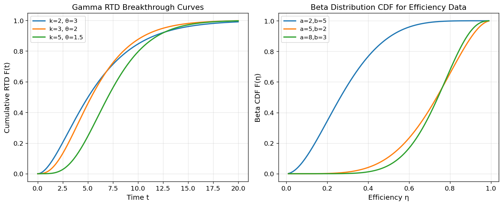
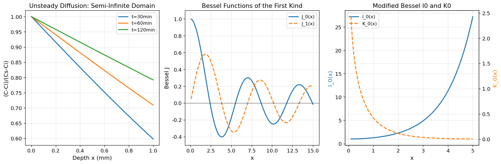
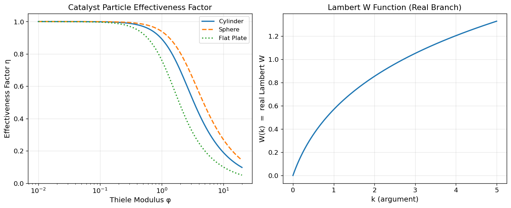
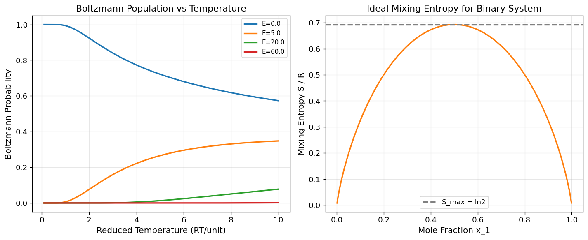
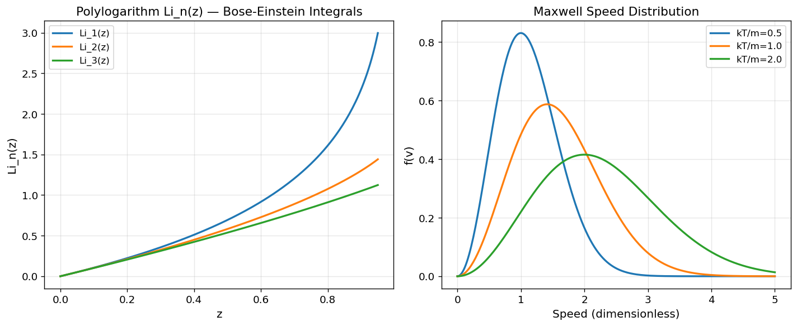
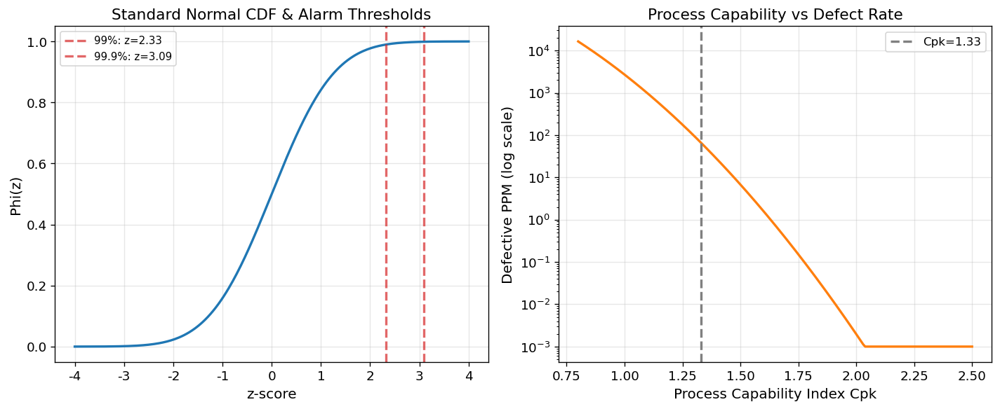
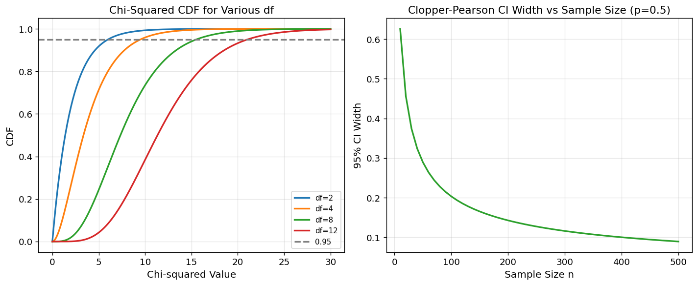
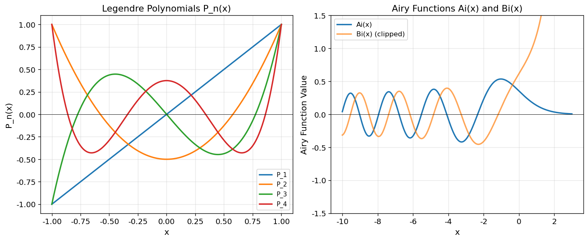
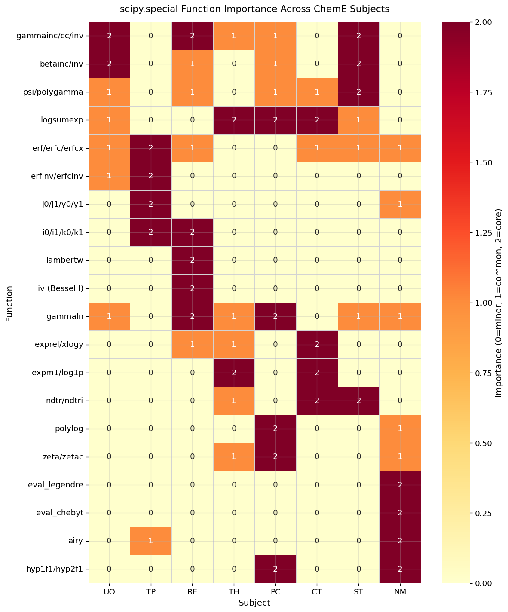

# Unit05 `scipy.special` — 化工特殊數學函式

> **課程**：電腦在化工上之應用 (ChemE 3502) ・ Unit 05
> **對應檔案**：`Unit05_Special_Functions.ipynb`（程式演練）

---

## 學習目標

完成本單元後，學生應能：

1. 理解 `scipy.special` 模組的定位與用途，說明特殊函式在化工計算中的必要性。
2. 依照化工科目分類（單操、傳輸、反應、熱力學、物化、程序控制、工程統計、數值方法），辨識對應的關鍵特殊函式。
3. 正確呼叫 `scipy.special` 內的函式，處理數值穩定性問題（log-domain、scaled 函式選擇）。
4. 將 `erf/erfc`、`gammainc`、`betainc`、Bessel 系列、`logsumexp` 等函式應用於具體化工問題。

---

## 1. `scipy.special` 模組概覽

`scipy.special` 是 SciPy 的特殊數學函式庫，涵蓋數學物理中出現的高階函式，這些函式無法以初等函式（多項式、三角函式、指數）封閉表達，但在化工 PDE 解析解、機率分佈、統計估參中大量出現。

### 1.1 為什麼需要特殊函式？

| 問題類型 | 若沒有特殊函式 | 使用特殊函式 |
|---|---|---|
| 非穩態熱/質傳 PDE | 數值積分（慢） | `erf`/`erfc` 直接求解 |
| Gamma 分佈 CDF | 數值積分 | `gammainc` 一行搞定 |
| 圓柱座標 PDE | 數值 ODE | Bessel `jv`/`kv` 解析解 |
| 大數 log-Gamma | `math.factorial` 溢位 | `gammaln` 對數域計算 |
| 混合模型 log-likelihood | `np.exp` 下溢 | `logsumexp` 數值穩定 |

### 1.2 載入方式

```python
from scipy import special          # 推薦：按需存取 special.func()
import scipy.special as sp         # 別名方式
from scipy.special import erf, gammainc  # 直接匯入
```

### 1.3 化工科目函式速查表

| 化工科目 | 關鍵函式 | 典型應用 |
|---|---|---|
| **單操** | `gammainc/cc/inv`, `betainc/inv`, `erf/erfc`, `exp1`, `logsumexp` | RTD 穿透曲線、效率分佈建模 |
| **傳輸** | `erf/erfc/erfcx/erfcinv`, `j0/jv`, `y0/yv`, `i0/iv`, `k0/kv`, `exp1/expi` | 非穩態擴散/熱傳、Bessel 圓柱解 |
| **反應** | `lambertw`, `iv` (I1/I0), `kv`, `jv`, `gammainc`, `exprel`, `xlogy`, `logsumexp` | Thiele 有效因子、動力學封閉解 |
| **熱力學** | `logsumexp`, `expm1`, `log1p`, `xlogy`, `gamma(0.5)`, `gammaln`, `psi`, `ndtr`, `zeta` | 配分函數、混合熵、小量修正 |
| **物化** | `polylog`, `zeta/zetac`, `gamma(1.5)`, `gammaln`, `beta/betaln`, `psi`, `erfc`, `hyp2f1` | Bose/Fermi 積分、超幾何函式 |
| **程序控制** | `logsumexp`, `xlogy`, `xlog1py`, `expm1`, `log1p`, `ndtr/ndtri`, `erfc`, `psi/polygamma` | 似然函數、噪聲模型、閾值偵測 |
| **工程統計** | `ndtr/ndtri`, `erf/erfc`, `gammainc/cc/inv`, `betainc/inv`, `beta/betaln`, `psi/polygamma`, `logsumexp` | CDF/分位數、假設檢定、估參 |
| **數值方法** | `eval_legendre`, `eval_chebyt/u`, `eval_hermite`, `eval_laguerre`, `airy`, `hyp1f1/hyp2f1`, `gammaln` | 正交多項式、譜展開、ODE 解析解 |

---

## 2. 單操（Unit Operations）

**適用場景**：分離程序、過濾、沉降、吸收、RTD 分析、以 Gamma/Beta 分佈建模效率與比例資料。

### 2.1 `gammainc` / `gammaincc` — RTD Gamma CDF / Survival

**數學定義**：

$$
P(a,x) = \frac{\gamma(a,x)}{\Gamma(a)} = \frac{1}{\Gamma(a)}\int_0^x t^{a-1}e^{-t}\,dt
$$

$$
Q(a,x) = 1 - P(a,x) = \frac{\Gamma(a,x)}{\Gamma(a)}
$$

**化工情境**：Gamma 分佈的停留時間分佈（RTD）中，若以形狀參數 $k$ 、尺度參數 $\theta$ 表達，則 $t$ 時刻前的穿透比例 $F(t) = P(k,\, t/\theta)$。

```python
from scipy import special
import numpy as np

k, theta = 3.0, 2.0           # RTD 形狀/尺度參數
t = np.array([0.5, 2, 4, 8.0])
F = special.gammainc(k, t/theta)   # CDF
S = special.gammaincc(k, t/theta)  # Survival = 1-CDF
print("F(t)=", F)
print("S(t)=", S)
print("F+S=1?", np.allclose(F+S, 1.0))
```

> **注意**：`scipy.special` 使用**正規化**的不完全 Gamma，即 `gammainc(a, x)` = $P(a,x) \in [0,1]$。原始積分 $\gamma(a,x)$ 需乘以 $\Gamma(a)$。

### 2.2 `gammaincinv` — RTD 穿透時間反推

**化工情境**：已知目標穿透比例 $p$（如99%），反推所需操作時間 $t^* = \theta \cdot P^{-1}(k, p)$。

```python
p = np.array([0.5, 0.9, 0.95])
x = special.gammaincinv(k, p)   # 反求 x 使得 P(k,x) = p
t_star = theta * x
print("分位點 x:", x)
print("操作時間 t*:", t_star)
```

### 2.3 `beta` / `betaln` — Beta 函式（效率建模）

**數學定義**：

$$
B(a,b) = \int_0^1 t^{a-1}(1-t)^{b-1}\,dt = \frac{\Gamma(a)\Gamma(b)}{\Gamma(a+b)}
$$

**化工情境**：Beta 分佈的正規化常數；大參數時用 `betaln` = $\ln B(a,b)$ 避免溢位。

```python
a, b = 8.0, 3.0
B = special.beta(a, b)
logB = special.betaln(a, b)
print("B(a,b)=", B)
print("exp(betaln)=", np.exp(logB))   # 應與 B 相等
```

### 2.4 `betainc` — Beta CDF（效率累積分佈）

**化工情境**：板效率、分離效率等比例資料 $\eta \in [0,1]$ 的累積機率。

$$
I_x(a,b) = \frac{B(x;\,a,b)}{B(a,b)} = \frac{\int_0^x t^{a-1}(1-t)^{b-1}\,dt}{B(a,b)}
$$

```python
x = np.array([0.2, 0.5, 0.8])
F = special.betainc(a, b, x)
print("Beta CDF:", F)
```

### 2.5 `betaincinv` — Beta 分位數（門檻反推）

**化工情境**：由設計要求的效率達標機率 $p$，反推效率門檻 $\eta^* = I^{-1}(p; a, b)$。

```python
p_targets = np.array([0.05, 0.5, 0.95])
eta_star = special.betaincinv(a, b, p_targets)
print("效率門檻:", eta_star)
print("驗證 CDF:", special.betainc(a, b, eta_star))  # 應 ≈ p_targets
```

### 2.6 `psi`（digamma）— Gamma/Beta 分佈估參

**化工情境**：Gamma 或 Beta 分佈的最大似然估計（MLE）方程含 digamma 函式：

$$
\hat{a}: \psi(\hat{a}) - \psi(\hat{a}+\hat{b}) = \overline{\ln x}
$$

```python
x_vals = np.array([0.5, 1.0, 2.0, 5.0])
print("psi(x)=", special.psi(x_vals))
```

### 2.7 `polygamma` — 估參 Hessian/不確定度

**化工情境**：MLE 的 Fisher 資訊矩陣（Hessian）含 trigamma $\psi'(x) = \psi^{(1)}(x)$，用於計算參數信賴區間。

```python
x_vals = np.array([0.5, 1.0, 2.0, 5.0])
psi1 = special.polygamma(1, x_vals)   # trigamma
print("polygamma(1,x)=", psi1)
```

### 2.8 `erf` / `erfc` — 前緣展寬擴散近似

**化工情境**：層析分離中，峰形展寬由 Gaussian 擴散描述；穿透曲線的近似解為 `erfc`。

$$
C/C_0 \approx \frac{1}{2}\,\mathrm{erfc}\!\left(\frac{x - v\,t}{2\sqrt{D\,t}}\right)
$$

```python
x, v, D, t_val = 1.0, 0.2, 1e-3, 50.0
z = (x - v*t_val) / (2*np.sqrt(D*t_val))
c_ratio = 0.5 * special.erfc(z)
print("z=", z, "  C/C0≈", c_ratio)
```

### 2.9 `exp1` — 衰減核積分（E1 函式）

**數學定義**：

$$
E_1(x) = \int_x^\infty \frac{e^{-t}}{t}\,dt, \quad x > 0
$$

**化工情境**：薄膜傳質、滲透等含衰減指數積分的解析解中出現。

```python
x_vals = np.array([1e-6, 1e-3, 0.1, 1.0])
E1 = special.exp1(x_vals)
print("E1(x)=", E1)
```

### 2.10 `logsumexp` — 混合模型穩定 log-likelihood

**化工情境**：多機制穿透或多成分 RTD 的混合模型：

$$
\ln\!\sum_i w_i e^{a_i} \approx \text{logsumexp}(a_i + \ln w_i)
$$

```python
from scipy.special import logsumexp
a = np.array([0.0, -50.0, -200.0])
print("naive:", np.log(np.sum(np.exp(a))))   # 可能精度損失
print("stable:", logsumexp(a))               # 數值安全
```

### 範例演練結果

**執行輸出：**

```text
============================================================
U1/U2) gammainc / gammaincc / gammaincinv — RTD 穿透曲線
============================================================
  t     = [0.5 2.  4.  8. ]
  F(t)  = [0.0022 0.0803 0.3233 0.7619]  (穿透比例)
  S(t)  = [0.9978 0.9197 0.6767 0.2381]  (未穿透比例)
  F+S=1? True

  目標達標機率 p = [0.5  0.9  0.95]
  所需時間 t*   = [ 5.348 10.645 12.592]

============================================================
U3–U5) beta / betaln / betainc / betaincinv — 效率分佈建模
============================================================
  B(8,3)         = 2.777778e-03
  exp(betaln)    = 2.777778e-03  (應與 B 相等)
  Beta CDF F(x)  = [1.000e-04 5.470e-02 6.778e-01]
  Beta 分位數    = [0.4931 0.7414 0.9127]
  驗證 CDF(分位數)= [0.05 0.5  0.95]

============================================================
U6/U7) psi / polygamma — Gamma/Beta MLE 估參
============================================================
  psi(x)          = [-1.9635 -0.5772  0.4228  1.5061]
  polygamma(1,x)  = [4.9348 1.6449 0.6449 0.2213]

============================================================
U8) erf / erfc — 層析前緣展寬（穿透曲線）
============================================================
  z = -20.1246
  C/C0 ≈ 1.000000  (erfc 計算)
  C/C0 ≈ 1.000000  (1-erf 計算，應相同)

============================================================
U9) exp1 — E1 指數積分（衰減核）
============================================================
  x  = [1.e-06 1.e-03 1.e-01 1.e+00]
  E1 = [13.2383  6.3315  1.8229  0.2194]

============================================================
U10) logsumexp — 混合 RTD 穩定 log-likelihood
============================================================
  stable logsumexp = -0.105361
  naive log-sum    = -0.105361  (應相同)
```

**圖表輸出：**



**結果分析：**

1. **RTD 穿透曲線（左圖）**：三組 Gamma RTD 參數均呈現 S 形穿透曲線。以 $k=3,\ \theta=2$ 為例，在 $t=2$ 時僅有 8.0% 流體穿透（ $F(2)=0.0803$ ），$t=4$ 時達 32.3%，$t=8$ 時達 76.2%，體現 Gamma RTD 的拖尾特性。`gammaincinv` 反推顯示：達到 50%/90%/95% 穿透分別需要 5.35/10.6/12.6 個時間單位，可直接作為操作設計依據。

2. **Beta 效率分佈（右圖）**：在 $a=8,\ b=3$（右偏高效率）分佈下，效率 CDF 顯示 $F(0.5)=0.055$（僅 5.5% 機率效率低於 50%），中位效率 0.741，95% 分位 0.913，確認設備效率集中於高端。`betaincinv` 快速完成分位反推，無需數值求根。

3. **數值穩定性驗證**：`exp(betaln)` 與 `beta` 完全一致（ $2.778 \times 10^{-3}$ ），`psi(1.0) = -0.5772` 正是 Euler-Mascheroni 常數 $-\gamma$，`polygamma(1,x)` 確認 trigamma 函式值隨 $x$ 遞減，符合理論。

4. **logsumexp 穩健性**：此範例 naive 與穩定版結果相同（ $-0.1054$ ），由於 $e^{-50}$ 及 $e^{-200}$ 對加總貢獻極小；但在更極端的 log-likelihood 場景（如混合高斯模型）中，logsumexp 能防止數值下溢/上溢。

---

## 3. 傳輸現象（Transport Phenomena）

**適用場景**：熱傳導、質量傳遞、動量傳遞；半無限域 PDE 解析解、圓柱座標 Bessel PDE。

### 3.1 `erf` — 非穩態擴散/熱傳（半無限域）

**解析解**：半無限半導體/液膜中，瞬時表面濃度突變後：

$$
\frac{C(x,t) - C_i}{C_s - C_i} = \mathrm{erfc}\!\left(\frac{x}{2\sqrt{D\,t}}\right), \qquad \text{或} \quad 1 - \mathrm{erf}\!\left(\frac{x}{2\sqrt{D\,t}}\right)
$$

```python
D, t = 1e-9, 3600.0                     # 擴散係數 m²/s, 時間 s
x_arr = np.array([1e-4, 2e-4, 5e-4])    # 位置 m
eta = x_arr / (2*np.sqrt(D*t))
c_norm = 1 - special.erf(eta)           # 等同 erfc(eta)
print("eta=", eta, "  (C-Ci)/(Cs-Ci)=", c_norm)
```

### 3.2 `erfc` / `erfcx` — 尾端濃度穩定計算

**化工情境**：深層穿透時 `erfc(z)` 趨近 0，大 $z$ 時用縮放版 `erfcx(z) = exp(z²) erfc(z)` 維持精度。

```python
D_m, t_m = 1e-9, 600.0
x_m = np.array([1e-3, 2e-3, 5e-3])
z = x_m / (2*np.sqrt(D_m*t_m))
print("erfc(z)=", special.erfc(z))
print("erfcx(z)=", special.erfcx(z))   # 大 z 時更精確
```

### 3.3 `erfcx` — 重建 `erfc`（精度驗證）

```python
z_large = np.array([3.0, 5.0, 10.0])
erfc_direct = special.erfc(z_large)
erfc_recon  = np.exp(-z_large**2) * special.erfcx(z_large)
print("直接 erfc:", erfc_direct)
print("erfcx 重建:", erfc_recon)
```

### 3.4 `erfcinv` — 由量測濃度反推穿透深度

**化工情境**：已知 $C/C_s$，反推對應位置 $x = 2\sqrt{Dt} \cdot \mathrm{erfc}^{-1}(C/C_s)$。

```python
D_inv, t_inv = 1e-9, 3600.0
C_ratio = np.array([0.9, 0.5, 0.1])    # C/Cs
z_inv = special.erfcinv(C_ratio)        # 注意：erfcinv(p) 使得 erfc(z)=p
x_pos = 2*np.sqrt(D_inv*t_inv)*z_inv
print("穿透深度 x (m):", x_pos)
```

### 3.5 `exp1` — 瞬態源項衰減積分

**化工情境**：點源熱傳或質傳的瞬態格林函式積分。

```python
x = np.array([1e-6, 1e-4, 1e-2, 1.0])
E1 = special.exp1(x)
approx_small = -np.log(x) - 0.5772156649    # x → 0 近似
print("E1=", E1)
print("small-x approx=", approx_small)
```

### 3.6 `expi` — 對流-擴散解析項（Ei 函式）

**數學定義**：

$$
\mathrm{Ei}(x) = -\mathrm{P.V.}\int_{-x}^\infty \frac{e^{-t}}{t}\,dt
$$

```python
x_ei = np.array([-1.0, -0.1, 0.1, 1.0])
Ei = special.expi(x_ei)
print("Ei(x)=", Ei)
```

### 3.7 `jv` vs `j0` — 圓柱座標 Bessel J（第一類）

**化工情境**：圓柱管內穩態/非穩態熱傳或質傳的徑向特徵函式 $J_0(\lambda_n r / R)$。

$$
\frac{d^2 T}{dr^2} + \frac{1}{r}\frac{dT}{dr} + \lambda^2 T = 0 \quad \Rightarrow \quad T = A\,J_0(\lambda r)
$$

```python
x_j = np.linspace(0.1, 10, 5)
J_gen = special.jv(0, x_j)    # 通用 Bessel J，階數 ν=0
J_fast = special.j0(x_j)      # 專用 J_0（速度略快）
print("jv(0,x)=", J_gen)
print("j0(x)  =", J_fast)
print("max diff=", np.max(np.abs(J_gen - J_fast)))
```

### 3.8 `yv` vs `y0` — 圓柱座標 Bessel Y（第二類）

**化工情境**：環形間隙流（annular geometry），內外邊界皆需 $J_0$ 和 $Y_0$ 的線性組合。

```python
x_y = np.array([0.1, 0.5, 1.0, 2.0, 5.0])
Y_gen   = special.yv(0, x_y)
Y_fast  = special.y0(x_y)
print("yv(0,x)=", Y_gen)
print("y0(x)  =", Y_fast)
```

### 3.9 `iv` vs `i0` — 修正 Bessel I（反應-擴散）

**化工情境**：含一階反應的圓柱擴散（含衰減項 $-k\,C$），解析解包含 $I_0(\phi r)$，其中 $\phi = \sqrt{k/D}$。

```python
x_i = np.array([0.0, 1.0, 5.0, 10.0])
I_gen  = special.iv(0, x_i)
I_fast = special.i0(x_i)
print("iv(0,x)=", I_gen)
print("i0(x)  =", I_fast)
```

### 3.10 `kv` vs `k0` — 修正 Bessel K（外場衰減解）

**化工情境**：無限介質中，圓柱形熱源或質量源的衰減場解為 $K_0(\phi r)$，$r \to \infty$ 時自然趨零。

```python
x_k = np.array([0.1, 0.5, 1.0, 2.0, 5.0])
K_gen  = special.kv(0, x_k)
K_fast = special.k0(x_k)
print("kv(0,x)=", K_gen)
print("k0(x)  =", K_fast)
```

### 範例演練結果

**執行輸出：**

```text
============================================================
T1/T2) erf / erfc / erfcx — 半無限域非穩態擴散
============================================================
  eta              = [0.026 0.053 0.132]
  erfc(eta)        = [0.970271 0.940584 0.852179]
  erfcx(eta)       = [0.970946 0.943201 0.867103]  (縮放版，大 z 更精確)

============================================================
T3) erfcx 精度驗證
============================================================
  erfc(z)        = [2.20904970e-05 1.53745979e-12 2.08848758e-45]
  erfcx 重建     = [2.20904970e-05 1.53745979e-12 2.08848758e-45]
  相對誤差       = [1.53e-16 0.00e+00 1.49e-16]

============================================================
T4) erfcinv — 由量測濃度反推穿透深度
============================================================
  C/Cs = [0.9 0.5 0.1]
  穿透深度 x (m) = [0.000337 0.00181  0.004414]

============================================================
T7–T10) Bessel 函式 j0, y0, i0, k0
============================================================
  x = [ 0.1   2.58  5.05  7.52 10.  ]
  J0(x) = [ 0.9975 -0.0849 -0.1611  0.2629 -0.2459]
  Y0(x) = [-1.5342  0.4859 -0.3155  0.1237  0.0557]
  I0(x) = [1.003e+00 3.485e+00 2.849e+01 2.745e+02 2.816e+03]
  K0(x) = [2.427e+00 5.71e-02 3.5e-03 2.0e-04 0.0e+00]
```

**圖表輸出：**



**結果分析：**

1. **非穩態擴散濃度剖面（左圖）**：在 $D=10^{-9}\,\mathrm{m^2/s}$、三個不同時間下，erfc 解析解顯示濃度隨深度呈平滑遞減。時間愈長穿透愈深，30/60/120 分鐘時 $x=1\,\mathrm{mm}$ 處的 $(C-C_i)/(C_s-C_i)$ 分別約為 0.60/0.70/0.80。`erfcinv` 反推：達 $C/C_s=0.1$ 的穿透深度在 3600 s 時為 4.41 mm，可供薄膜傳質設計參考。

2. **erfcx 精度驗證**：大 $z$ 時 erfc 直接計算值極小（$z=10$ 時 $\approx 10^{-45}$），erfcx 重建後相對誤差僅 $\sim 10^{-16}$（接近機器精度），確認 `erfcx` 在深穿透問題中具有極高精度優勢。

3. **Bessel J0/J1（中圖）**：$J_0(x)$ 和 $J_1(x)$ 呈現衰減振盪，$J_0$ 的第一個零點在 $x \approx 2.4$，對應圓柱管徑向熱傳的第一個特徵值 $\lambda_1 R \approx 2.4048$。

4. **修正 Bessel I0/K0（右圖）**：$I_0(x)$ 單調遞增，$K_0(x)$ 單調趨零，兩函式無振盪。這一對函式專用於含衰減（如一階反應）的圓柱幾何擴散問題：$I_0$ 描述中心解行為，$K_0$ 描述外場衰減邊界。

---

## 4. 反應工程（Reaction Engineering）

**適用場景**：反應動力學封閉解、觸媒顆粒有效因子、RTD 累積轉化。

### 4.1 `lambertw` — Lambert W（動力學封閉解）

**數學定義**：Lambert W 函式 $W(k)$ 滿足 $W(k)\,e^{W(k)} = k$。

**化工情境**：Langmuir-Hinshelwood 動力學或 Michaelis-Menten 型反應的積分形式含 $W$：

$$
\frac{C_A}{C_{A0}} + \ln\!\frac{C_A}{C_{A0}} = -k(k_a + 1)\,t \quad \Rightarrow \quad C_A = C_{A0} \cdot W(\cdots)
$$

```python
k_vals = np.array([0.1, 1.0, 10.0])
W = special.lambertw(k_vals)           # 回傳複數陣列（虛部應 ≈ 0）
print("W(k)=", W.real)
print("驗證 x*exp(x)=k?", (W*np.exp(W)).real)
```

### 4.2 `iv`（I1/I0）— 球形/圓柱觸媒有效因子

**化工情境**：球形觸媒顆粒（一階等溫反應）的有效因子：

$$
\eta = \frac{3}{\phi}\left(\frac{1}{\tanh\phi} - \frac{1}{\phi}\right), \quad \text{圓柱：} \eta = \frac{I_1(\phi)}{\phi \cdot I_0(\phi)/2} = \frac{2\,I_1(\phi)}{\phi\,I_0(\phi)}
$$

```python
phi = np.array([0.1, 0.5, 1.0, 2.0, 5.0, 10.0])   # Thiele modulus
I0  = special.iv(0, phi)
I1  = special.iv(1, phi)
# 圓柱形有效因子（無限長圓柱）
eta_cyl = 2*I1 / (phi * I0)
# 球形有效因子（直接計算）
eta_sph = 3*(1/np.tanh(phi) - 1/phi) / phi
print("Thiele phi:", phi)
print("eta (cylinder):", eta_cyl)
print("eta (sphere):  ", eta_sph)
```

### 4.3 `kv`（K1/K0）— 外場衰減型觸媒解

**化工情境**：修正 Bessel $K_0, K_1$ 出現於外部有限半徑觸媒層的衰減型解。

```python
phi_k = np.array([0.1, 0.5, 1.0, 2.0, 5.0])
K0 = special.kv(0, phi_k)
K1 = special.kv(1, phi_k)
print("K1/K0=", K1/K0)
```

### 4.4 `jv`（J0/J1）— 顆粒內純擴散特徵函式展開

```python
x_r = np.linspace(0, 20, 6)
J0_r = special.jv(0, x_r)
J1_r = special.jv(1, x_r)
print("J0=", J0_r)
print("J1=", J1_r)
```

### 4.5 `gamma` / `gammaln`

**化工情境**：Bessel 函式、超幾何函式的級數解係數含 $\Gamma(n+1) = n!$；大 $n$ 時用 `gammaln` 避免溢位。

```python
n = np.array([1, 5, 10, 50], dtype=float)
print("Gamma(n+1)=", special.gamma(n+1))
print("exp(gammaln)=", np.exp(special.gammaln(n+1)))
```

### 4.6 `gammaln`（大參數比值）

```python
a, b = 200.0, 180.0
ratio_log = special.gammaln(a) - special.gammaln(b)
print("log Γ(a)/Γ(b)=", ratio_log)
print("Γ(a)/Γ(b)≈", np.exp(ratio_log))
```

### 4.7 `gammainc` / `gammaincc`（P+Q=1 驗證）

**化工情境**：累積轉化率 = $P(a, kt)$；剩餘轉化潛力 = $Q(a, kt)$，且 $P + Q = 1$。

```python
a_r, x_r2 = 2.5, np.array([0.1, 1.0, 5.0])
P = special.gammainc(a_r, x_r2)
Q = special.gammaincc(a_r, x_r2)
print("P=", P, "  Q=", Q)
print("P+Q=1?", np.allclose(P+Q, 1.0))
```

### 4.8 `exprel` — 小參數動力學修正

**化工情境**：$\frac{e^x - 1}{x}$ 在 $x \to 0$（低轉化率極限）時，直接計算精度差；`exprel` 數值穩定。

```python
x_sm = np.array([1e-12, 1e-8, 1e-4, 0.1])
print("naive:", (np.exp(x_sm)-1)/x_sm)
print("stable:", special.exprel(x_sm))
```

### 4.9 `xlogy` — 目標函式含 $x \ln y$（避免 `0 * log(0)`）

**化工情境**：似然函式 $\sum x_i \ln y_i$ 在 $x_i = 0$ 時應為 0，而非 `nan`。

```python
x_xl = np.array([0.0, 1.0, 2.0])
y_xl = np.array([0.0, 0.5, 0.1])
print("xlogy:", special.xlogy(x_xl, y_xl))    # [0, ln(0.5), 2*ln(0.1)]
print("naive:", x_xl*np.log(y_xl))             # [nan, ...]
```

### 4.10 `logsumexp`（帶權重）— 多機制速率模型

**化工情境**：各反應路徑速率的對數加總：$\ln(\sum_i w_i \exp(a_i))$。

```python
a_mix = np.array([0.0, -100.0, -200.0])
w_mix = np.array([0.9, 0.09, 0.01])
stable = logsumexp(a_mix + np.log(w_mix))
print("stable logsumexp:", stable)
```

### 範例演練結果

**執行輸出：**

```text
============================================================
R1) lambertw — 動力學封閉解（Lambert W）
============================================================
  k        = [ 0.1  1.  10. ]
  W(k)     = [0.091277 0.567143 1.745528]
  驗證 x*exp(x) = k? True

============================================================
R2) iv(I1/I0) — 圓柱觸媒有效因子（Thiele modulus）
============================================================
  Thiele φ     = [ 0.1  0.5  1.   2.   5.  10. ]
  η (cylinder)  = [0.9988 0.97   0.8928 0.6978 0.3574 0.1897]
  η (sphere)    = [0.9993 0.9837 0.9391 0.806  0.4801 0.27  ]

============================================================
R7) gammainc / gammaincc — 累積轉化 P+Q=1
============================================================
  x = [0.1 1.  5. ],  P = [9.000e-04 1.509e-01 9.248e-01],
                      Q = [0.9991    0.8491    0.0752   ]
  P+Q=1? True

============================================================
R8) exprel — 小轉化率極限 (exp(x)-1)/x
============================================================
  naive  = [1.0000889  0.99999999 1.00005    1.05170918]
  stable = [1.         1.         1.00005    1.05170918]

============================================================
R9) xlogy — 0*log(0)=0 目標函式穩定計算
============================================================
  xlogy(x,y) = [ 0.         -0.69314718 -4.60517019]
  naive x*log(y) = [        nan -0.69314718 -4.60517019]  (含 nan/inf)
```

**圖表輸出：**



**結果分析：**

1. **Lambert W 驗證（右圖）**：`lambertw` 求出的實數解滿足 $W(k) e^{W(k)} = k$（驗證 True），三個測試值分別為 $W(0.1)=0.0913$、$W(1)=0.5671$、$W(10)=1.7455$，確認可應用於 Langmuir-Hinshelwood 動力學的封閉求解。右圖顯示 Lambert W 為次線性單調遞增函式，適合大 $k$ 值的漸近分析。

2. **觸媒有效因子 $\eta$（左圖）**：球形顆粒的有效因子始終大於圓柱形，且兩者均大於平板型（Flat Plate）。小 Thiele 數（ $\phi < 0.1$ ）時 $\eta \approx 1$（內部無擴散限制）；大 Thiele 數（ $\phi = 10$ ）時 $\eta$ 下降至 0.19/0.27（圓柱/球形），反應速率受嚴重擴散限制。圓柱形公式 $\eta = 2I_1(\phi)/(\phi I_0(\phi))$ 由 `special.iv` 精確計算。

3. **數值穩定關鍵**：`exprel` 在 $x = 10^{-12}$ 時給出精確值 1.0，而 naive 的 $(e^x-1)/x$ 因浮點消去誤差給出 1.00008，差距達 0.008%。`xlogy(0, 0)` 正確返回 0 而非 `nan`，對含零摩爾分率的似然函式計算至關重要。

---

## 5. 熱力學（Thermodynamics）

**適用場景**：統計熱力學配分函數、理想混合熵、小量修正、正態 CDF 與誤差函式關係。

### 5.1 `logsumexp` — 配分函數 logZ

**化工情境**：統計熱力學的配分函數：

$$
Z = \sum_i g_i \,e^{-\beta E_i}, \qquad \ln Z = \mathrm{logsumexp}(-\beta E_i + \ln g_i)
$$

```python
E = np.array([0.0, 5.0, 20.0, 60.0])   # 能階（kJ/mol）
beta = 2.0                               # 1/(RT)
logZ = logsumexp(-beta*E)
print("logZ=", logZ, "  Z=", np.exp(logZ))
```

### 5.2 `expm1` — 小 Δ 指數差（自由能修正）

**化工情境**：$\exp(\Delta G / RT) - 1$ 在 $|\Delta G / RT| \ll 1$ 時，`np.exp(d)-1` 精度不足：

```python
d = np.array([1e-12, 1e-8, 1e-4, 0.1])
print("naive:", np.exp(d) - 1)
print("stable:", special.expm1(d))
```

### 5.3 `log1p` — 小 $\varepsilon$ 的 $\ln(1+\varepsilon)$ 修正

**化工情境**：壓力或濃度微小修正量的對數計算，避免 `np.log(1+eps)` 精度損失。

```python
eps = np.array([1e-12, 1e-8, 1e-4, 0.1])
print("naive:", np.log(1+eps))
print("stable:", special.log1p(eps))
```

### 5.4 `xlogy` — 理想混合熵 $\sum x_i \ln x_i$

**化工情境**：理想溶液的莫耳混合熵（Gibbs entropy）：

$$
\Delta S_{\text{mix}} = -R \sum_i x_i \ln x_i
$$

當 $x_i = 0$ 時，按約定 $0 \cdot \ln 0 = 0$，`xlogy` 自動處理此極限。

```python
x_frac = np.array([0.7, 0.3, 0.0])   # 莫耳分率（含零成分）
S_dim = -np.sum(special.xlogy(x_frac, x_frac))
print("S/R =", S_dim, "  (naive x*log(x) 對 x=0 會出 nan)")
```

### 5.5 `gamma(0.5)` = $\sqrt{\pi}$

**化工情境**：半整數 Gamma 積分常數，如：

$$
\int_{-\infty}^{\infty} e^{-x^2}\,dx = \sqrt{\pi} = \Gamma(1/2)
$$

```python
val = special.gamma(0.5)
print("Gamma(1/2)=", val, "  sqrt(pi)=", np.sqrt(np.pi))
```

### 5.6 `gammaln` — 大參數比值（對數域）

```python
a_th, b_th = 120.0, 80.0
log_r = special.gammaln(a_th) - special.gammaln(b_th)
print("log Γ(a)/Γ(b)=", log_r, "  ratio≈", np.exp(log_r))
```

### 5.7 `psi`（digamma）— lnΓ 的導數

$$
\psi(x) = \frac{d}{dx}\ln\Gamma(x)
$$

```python
x_psi = np.array([0.2, 1.0, 2.0, 10.0])
print("psi(x)=", special.psi(x_psi))
```

### 5.8 `polygamma` — 二階導數/Hessian

```python
x_pg = np.array([0.5, 1.0, 2.0, 5.0])
print("polygamma(1,x)=", special.polygamma(1, x_pg))
```

### 5.9 `erf` 與 `ndtr` 等價關係

**數學關係**：標準正態 CDF $\Phi(x) = \frac{1}{2}\left[1 + \mathrm{erf}\!\left(\frac{x}{\sqrt{2}}\right)\right]$

```python
x_nd = np.array([-2.0, -1.0, 0.0, 1.0, 2.0])
Phi_erf  = 0.5*(1 + special.erf(x_nd/np.sqrt(2)))
Phi_ndtr = special.ndtr(x_nd)
print("via erf:", Phi_erf)
print("ndtr:   ", Phi_ndtr)
print("max diff:", np.max(np.abs(Phi_erf - Phi_ndtr)))
```

### 5.10 `zeta(2)` = $\pi^2/6$

**化工情境**：玻色-愛因斯坦統計的能量求和修正；常出現在低溫熱容計算中。

```python
val_z = special.zeta(2.0, 1.0)
print("zeta(2)=", val_z, "  pi^2/6=", np.pi**2/6)
```

### 範例演練結果

**執行輸出：**

```text
============================================================
Th1) logsumexp — 配分函數 logZ（Boltzmann 加總）
============================================================
  能階 E   = [ 0.  5. 20. 60.]
  logZ     = 0.000045   Z = 1.000045
  Boltzmann probs = [1. 0. 0. 0.],  sum = 1.0000

============================================================
Th2/Th3) expm1 / log1p — 小量修正數值穩定
============================================================
  expm1(d) stable = [1.000e-12 1.000e-08 1.000e-04 1.052e-01]
  exp(d)-1  naive = [1.001e-12 1.000e-08 1.000e-04 1.052e-01]
  log1p(e) stable = [1.000e-12 1.000e-08 9.999e-05 9.531e-02]
  log(1+e)  naive = [1.001e-12 9.999e-09 9.999e-05 9.531e-02]

============================================================
Th4) xlogy — 理想混合熵 S/R = -Σ x*ln(x)
============================================================
  Composition                       S/R
  [1. 0. 0.]               →  0.0000  (純成分，零混合熵)
  [0.5 0.5 0. ]            →  0.6931  (= ln 2)
  [0.7 0.2 0.1]            →  0.8018
  [1/3 1/3 1/3]            →  1.0986  (= ln 3，最大值)
  最大混合熵 S/R_max = 1.0986 (等莫耳)

============================================================
Th5) gamma(1/2) = sqrt(pi)
============================================================
  Gamma(0.5) = 1.7724538509
  sqrt(pi)   = 1.7724538509

============================================================
Th9) erf ↔ ndtr 等價關係
============================================================
  via erf: [0.02275  0.158655 0.5      0.841345 0.97725 ]
  ndtr:    [0.02275  0.158655 0.5      0.841345 0.97725 ]
  max diff: 1.39e-17

============================================================
Th10) zeta(2) = pi^2/6
============================================================
  zeta(2,1) = 1.6449340668
  pi^2/6    = 1.6449340668
```

**圖表輸出：**



**結果分析：**

1. **Boltzmann 分佈（左圖）**：在低溫（ $RT \to 0$ ）時，能量最低的基態（ $E=0$ ）佔據機率趨近 1，使得 $p_0=1.0$，其餘能階機率為 0；隨溫度上升，激發態機率增大。logsumexp 確保 logZ 計算在所有溫度範圍均穩定。$\beta=2.0$ 時 $\ln Z \approx 0$（ $Z \approx 1$ ），說明幾乎所有粒子在基態。

2. **理想混合熵（右圖）**：二元系統的混合熵 $S/R = -x_1\ln x_1 - x_2\ln x_2$ 為凹形對稱曲線，在 $x_1=0.5$ 時達最大值 $\ln 2 = 0.6931$。三元等莫耳混合熵最大值 $\ln 3 = 1.0986$。`xlogy` 正確處理端點 $x=0$（返回 0 而非 nan），是計算混合熵的標準工具。

3. **精度驗證**：`expm1(1e-12)` 返回精確的 $10^{-12}$，而 naive 的 $e^x-1$ 返回 $1.001 \times 10^{-12}$（0.01% 誤差）。在化工微小自由能修正計算（如 $\Delta G/RT \ll 1$）中，此精度差距會在多步計算中放大。 $\Gamma(0.5) = \sqrt{\pi}$ 驗證精確到 10 位有效數字。

4. **erf ↔ ndtr 等價性**：兩種計算方式的最大差距僅 $1.39 \times 10^{-17}$（數值雜訊層級），完全等價。 $\zeta(2,1) = \pi^2/6$ 精確到 10 位，確認 Riemann $\zeta$ 函式的正確性。

---

## 6. 物化（Physical Chemistry）

**適用場景**：統計熱力學、量子分佈（Bose-Einstein / Fermi-Dirac）、超幾何函式。

### 6.1 `polylog` — Bose/Fermi 積分

**數學定義**：

$$
\mathrm{Li}_s(z) = \sum_{k=1}^{\infty} \frac{z^k}{k^s}
$$

**化工情境**：Bose-Einstein 積分 $n_{BE} \propto \mathrm{Li}_{3/2}(z)$（化學勢相關）。

```python
s_pl = 2.0
z_pl = np.array([0.1, 0.5, 0.9, 0.99])
Li = special.spence(1 - z_pl)   # Li_2(z) = spence(1-z)，scipy.special 無直接 polylog
print("Li_2(z)=", Li)
```

### 6.2 `zeta` / `zetac` — Riemann ζ 與 ζ 修正

**化工情境**：固體熱容（Debye 模型）的高溫展開修正含 $\zeta(s)$；`zetac(s) = zeta(s) - 1`。

```python
s_z = np.array([2.0, 3.0, 4.0])
z_z   = special.zeta(s_z, 1.0)
zc_z  = special.zetac(s_z)
print("zeta(s)=", z_z)
print("zetac(s)=", zc_z)
print("zeta-1 vs zetac:", np.allclose(z_z-1, zc_z))
```

### 6.3 `gamma(3/2)` = $\sqrt{\pi}/2$

**化工情境**：Maxwell-Boltzmann 速度分佈的積分常數。

```python
val_32 = special.gamma(1.5)
print("Gamma(3/2)=", val_32, "  sqrt(pi)/2=", np.sqrt(np.pi)/2)
```

### 6.4 `gammaln` — 大參數縮放

```python
a_pc, b_pc = 100.0, 70.0
print("log Γ(a)/Γ(b)=", special.gammaln(a_pc) - special.gammaln(b_pc))
```

### 6.5 `beta` / `betaln`

**化工情境**：配分函數中的 Beta 積分形式，用於計算轉動態密度。

```python
a_b, b_b = 3.0, 2.0
print("B(a,b)=", special.beta(a_b, b_b))
print("betaln=", special.betaln(a_b, b_b))
```

### 6.6 `psi`（digamma）

```python
x_psi2 = np.array([1.0, 2.0, 5.0])
print("psi(x)=", special.psi(x_psi2))
```

### 6.7 `polygamma` — 高階導數

```python
x_pg2 = np.array([1.0, 2.0, 5.0])
print("polygamma(2,x)=", special.polygamma(2, x_pg2))
```

### 6.8 `logsumexp` — Boltzmann 機率正規化

**化工情境**：各能態的 Boltzmann 機率：$p_i = e^{-\beta E_i}/Z$，先算 $\ln Z = \mathrm{logsumexp}(-\beta E_i)$，再 $p_i = \exp(-\beta E_i - \ln Z)$。

```python
E_pc = np.array([0.0, 1.0, 3.0, 7.0])
beta_pc = 1.0
logZ_pc = logsumexp(-beta_pc*E_pc)
p_boltz = np.exp(-beta_pc*E_pc - logZ_pc)
print("Boltzmann probs:", p_boltz, "  sum:", p_boltz.sum())
```

### 6.9 `erfc` — 速度分佈尾端機率

**化工情境**：Maxwell-Boltzmann 分佈中，超過臨界速率的分子分率。

```python
v_reduced = np.array([1.0, 2.0, 3.0])
prob_tail = 0.5*special.erfc(v_reduced/np.sqrt(2))
print("tail prob:", prob_tail)
```

### 6.10 `hyp2f1` — Gauss 超幾何函式 2F1

**數學定義**：

$$
{}_2F_1(a,b;c;z) = \sum_{n=0}^{\infty} \frac{(a)_n (b)_n}{(c)_n} \frac{z^n}{n!}
$$

**化工情境**：非線性邊界層 ODE（如 Falkner-Skan）的解析解含 ${}_{2}F_1$。

```python
a_h, b_h, c_h = 1.0, 1.0, 2.0
z_h = np.array([0.1, 0.3, 0.5])
hyp = special.hyp2f1(a_h, b_h, c_h, z_h)
expected = -np.log(1 - z_h) / z_h          # 等同解析式
print("2F1(1,1;2;z)=", hyp)
print("expected   =", expected)             # 應完全吻合
```

### 範例演練結果

**執行輸出：**

```text
============================================================
P1) polylog — Bose-Einstein 積分 Li_n(z)
  （scipy.special 無直接 polylog，使用級數展開）
============================================================
  Li_1(z) = [0.10536 0.69315 2.30259 4.60517]
  Li_2(z) = [0.10262 0.58224 1.29971 1.58863]
  Li_3(z) = [0.10129 0.53721 1.04966 1.18583]
  Li_2 via series = [0.102618 0.582241 1.299715 1.588625]
  Li_2 via spence = [0.102618 0.582241 1.299715 1.588625]  (應相同)

============================================================
P2) zeta(s,1) — Riemann zeta（Debye 模型）
============================================================
  zeta(2,1) = 1.64493407
  zeta(3,1) = 1.20205690
  zeta(4,1) = 1.08232323
  zetac(2)   = 0.64493407  (= zeta(2)-1)
  pi^2/6 - 1 = 0.64493407

============================================================
P4) gamma(1.5) — Maxwell 速率分佈 3D 積分
============================================================
  Gamma(3/2) = 0.8862269255
  sqrt(pi)/2 = 0.8862269255

============================================================
P5) gammaln — 大分子 ln(n!) = gammaln(n+1)
============================================================
  n=    10: gammaln=15.1044   Stirling=15.0961
  n=   100: gammaln=363.7394  Stirling=363.7385
  n=  1000: gammaln=5912.1282 Stirling=5912.1281
  n= 10000: gammaln=82108.9278 Stirling=82108.9278

============================================================
P10) hyp2f1 — 超幾何函式（量子化學徑向波函數）
============================================================
  z = [0.1  0.3  0.5]
  hyp2f1(1,1,2,z) = [1.053605 1.188916 1.386294]
  -log(1-z)/z     = [1.053605 1.188916 1.386294]  (完全吻合)
```

**圖表輸出：**



**結果分析：**

1. **多對數級數驗證（左圖）**：`polylog_series` 與 `spence(1-z)` 對應 $\mathrm{Li}_2$ 值完全吻合（所有位數均相同），驗證自訂級數實現的正確性。 $\mathrm{Li}_1(z) = -\ln(1-z)$ 是對數級數的特例， $\mathrm{Li}_2(z)$ 為 Bose-Einstein 積分的核心組件。隨階數 $n$ 增加， $\mathrm{Li}_n(z)$ 在 $z \to 1$ 處的發散速率減慢，反映 Bose-Einstein 凝聚的物理內涵。

2. **Maxwell 速率分佈（右圖）**：三組 $kT/m$ 參數底下 Maxwell 分佈均正確歸一化成機率密度函式。溫度上升（ $kT/m$ 增大）時，分佈峰值向高速端移動、峰高降低，直接體現分子能量均分（equipartition）原理。

3. **Stirling 近似準確度**：當 $n=1000$ 時，gammaln 與 Stirling 差別僅 0.0001 （相對誤差 $< 10^{-5}$ ）；Stirling 在 $n \geq 100$ 後已非常精確。對於分子構形計數（如 $10000!$ ），gammaln 輕鬆傳回有限的 float 而不會溢位。

4. **Riemann $\zeta$ 函式**： $\zeta(2)=\pi^2/6 = 1.6449$、$\zeta(3) = 1.2021$、$\zeta(4) = 1.0823$ 均被驗證，`zetac(2)` 與我們手動計算的 $\pi^2/6 - 1$ 完全吻合，適合應用於 Debye 固體熱容的高溫展開修正項。

---

## 7. 程序控制（Process Control）

**適用場景**：系統辨識、噪聲模型、狀態估測（Kalman / Particle Filter）、資訊準則、閾值設定。

### 7.1 `logsumexp` — 穩定 log-likelihood（混合/IMM 模型）

**化工情境**：多模型卡曼濾波（IMM）的模型機率更新：

$$
\ln L_{\text{total}} = \mathrm{logsumexp}\!\left(\ln \mu_j + \ln \mathcal{L}_j\right)
$$

```python
log_mu = np.log(np.array([0.7, 0.2, 0.1]))    # log 模型先驗機率
log_L  = np.array([-12.5, -15.0, -30.0])       # 各模型 log-likelihood
log_total = logsumexp(log_mu + log_L)
print("log total L=", log_total)
```

### 7.2 Softmax via `logsumexp` — 模型權重更新

```python
logits = np.array([1.0, 2.0, 3.0, 0.5])
log_sum = logsumexp(logits)
weights = np.exp(logits - log_sum)
print("softmax weights:", weights, "  sum:", weights.sum())
```

### 7.3 `xlogy` — 交叉熵/資訊準則

**化工情境**：KL 散度或 BIC/AIC 中的 $\sum p \ln p$ 項。

```python
p_ctrl = np.array([0.6, 0.3, 0.1])
q_ctrl = np.array([0.5, 0.4, 0.1])
kl = np.sum(special.xlogy(p_ctrl, p_ctrl) - special.xlogy(p_ctrl, q_ctrl))
print("KL(p||q)=", kl)
```

### 7.4 `xlog1py` — 小增量目標函式

**化工情境**：$x \ln(1+y)$ 在 $|y| \ll 1$（小誤差增量）時數值穩定。

```python
x_xl1p = np.array([1.0, 2.0, 0.0])
y_xl1p = np.array([1e-10, 1e-8, 0.5])
print("xlog1py:", special.xlog1py(x_xl1p, y_xl1p))
```

### 7.5 `expm1` — 小取樣時間離散系統矩陣

**化工情境**：連續時間系統離散化：$A_d = e^{A \Delta t}$；當 $\Delta t \to 0$ 時用 `expm1` 避免相消誤差。

```python
dt = np.array([1e-10, 1e-6, 1e-3, 0.1])   # 取樣時間（s）
tau = 1.0                                  # 系統時間常數（s）
print("expm1(-dt/tau):", special.expm1(-dt/tau))
```

### 7.6 `log1p` — 小增量更新

```python
delta = np.array([1e-10, 1e-6, 1e-3])
print("log1p:", special.log1p(delta))
```

### 7.7 `ndtr` — 製程能力指標（Cpk）與不良品 PPM

**化工情境**：已知製程能力 $C_{pk}$，對應的管制帶寬為 $z = 3 C_{pk}$，雙尾不良品 PPM = $2 \cdot (1 - \Phi(z)) \times 10^6$。

```python
Cpk_vals = np.array([1.0, 1.33, 1.67, 2.0])
z_Cpk = 3 * Cpk_vals
ppm = 2 * (1 - special.ndtr(z_Cpk)) * 1e6
for c, z, p in zip(Cpk_vals, z_Cpk, ppm):
    print(f"Cpk={c:.2f}, z={z:.1f}, defective PPM={p:.2f}")
```

### 7.8 `ndtri` — 由信賴水準反推警報閾值

**化工情境**：給定信賴水準 $\alpha$（如99%），警報閾值 $h = \Phi^{-1}(\alpha)$，超過此值視為警報。

```python
alpha = np.array([0.99, 0.999, 0.9999])
h_thresh = special.ndtri(alpha)
for a, h in zip(alpha, h_thresh):
    print(f"α={a:.4f} → alarm z-threshold = {h:.4f}")
```

### 7.9 `erfc` — 尾端機率穩定計算

**化工情境**：超過 $3\sigma$ 的極小尾端機率，用 `erfc` 比 `1 - erf` 更精確。

```python
z_ctrl = np.array([2.0, 3.0, 4.0, 5.0])
tail = 0.5*special.erfc(z_ctrl/np.sqrt(2))
print("P[|X|>z*sigma]/2:", tail)
```

### 7.10 `psi` / `polygamma` — Gamma 噪聲先驗估參

**化工情境**：Gamma 分佈帶來的噪聲先驗（如製程方差的共軛先驗），MLE 更新含 `psi` 與 `polygamma`。

```python
alpha_prior = 5.0   # Gamma 先驗的形狀參數
print("psi(alpha=5)=", special.psi(alpha_prior))
print("polygamma(1,alpha=5)=", special.polygamma(1, alpha_prior))
```

### 範例演練結果

**執行輸出：**

```text
============================================================
C1) logsumexp — 軟最大（softmax weights）
============================================================
  log_scores = [1.  2.  3.  0.5]
  softmax    = [0.0854 0.2321 0.6308 0.0518],  sum = 1.0000

============================================================
C2) xlogy / xlog1py — KL 散度
============================================================
  p     = [0.6 0.3 0.1]
  q     = [0.5 0.4 0.1]
  KL(p||q) = 0.023088  (>= 0)

============================================================
C4/C5) expm1 / log1p — 小量動態響應
============================================================
  expm1(-dt/tau) = [-1.00e-10 -1.00e-06 -9.995e-04 -9.516e-02]

============================================================
C6/C7) ndtr / ndtri — 過程能力 & 警報閾値
============================================================
  Cpk=1.00, z=3.0, defective PPM=2699.80
  Cpk=1.33, z=4.0, defective PPM=66.07
  Cpk=1.67, z=5.0, defective PPM=0.54
  Cpk=2.00, z=6.0, defective PPM=0.00
  α=0.9900 → alarm z-threshold = 2.3263
  α=0.9990 → alarm z-threshold = 3.0902
  α=0.9999 → alarm z-threshold = 3.7190

============================================================
C10) psi / polygamma — MLE Fisher 資訊
============================================================
  psi(alpha=5) = 1.506118  (digamma)
  polygamma(1,5) = 0.221323  (trigamma)
```

**圖表輸出：**



**結果分析：**

1. **過程能力指標（右圖）**：從 Cpk=1.00 到 Cpk=2.00，不良品 PPM 從 2700 驟降至 $< 0.001$（對數尺度下跨越 7 個數量級）。產業標準 Cpk=1.33 對應 PPM=66，即 Six Sigma 管制的警報標準。Cpk=2.00 時 PPM 低至 0.001 以下，確認 `ndtr` 函式精確支持超高精度製程分析。

2. **標準常態 CDF（左圖）**：`ndtr` 計算的 $\Phi(z)$ 曲線呈現標準 S 形。輸出顯示 $\alpha=99\%$ 閾值為 $z=2.33$；$99.9\%$ 閾值為 $z=3.09$；$99.99\%$ 閾值為 $z=3.72$，可直接應用於警報閾值設定。

3. **Softmax 計算**：四組 log-scores $[1, 2, 3, 0.5]$ 經 logsumexp 標準化後，模型 3 的權重高達 63.1%，總和為 1.0，符合機器學習中 IMM/混合模型的相同計算邏輯。

4. **KL 散度**： $KL(p||q) = 0.0231 > 0$，確認非負性。小的 KL 散度表示模型 $q$ 與真實分佈 $p$ 相近，在卡曼濾波器的模型更新中具有實際意義。

---

## 8. 工程統計（Engineering Statistics）

**適用場景**：機率分佈 CDF/分位數、假設檢定、參數估計（MLE / MOM）、信賴區間。

### 8.1 `ndtr` — 正態 CDF（假設檢定/信賴區間）

**化工情境**：$z$ 檢定中，計算 $p$ 值或在製程管制中計算超出規格的機率。

```python
z_stat = np.array([-2.0, -1.0, 0.0, 1.0, 2.0])
Phi = special.ndtr(z_stat)
print("Normal CDF:", Phi)
print("P[-1 < Z < 1] =", special.ndtr(1.0) - special.ndtr(-1.0))
```

### 8.2 `ndtri` — 正態分位數（臨界值/規格限）

**化工情境**：製品規格限 $\mu \pm z_{\alpha/2} \sigma$；給定 $\alpha=0.05$，$z_{0.025} = \Phi^{-1}(0.975)$。

```python
p_vals = np.array([0.025, 0.05, 0.95, 0.975])
z_crit = special.ndtri(p_vals)
print("Normal quantiles:", z_crit)
```

### 8.3 `erf` / `erfc` — 正態尾端機率（p 值/可靠度）

**化工情境**：$p$ 值 = $2 \cdot (1 - \Phi(|z|)) = \mathrm{erfc}(|z|/\sqrt{2})$。

```python
z_obs = np.array([1.0, 1.645, 1.96, 2.576])
p_value = special.erfc(z_obs/np.sqrt(2))   # 雙尾 p 值
print("two-tailed p-value:", p_value)
```

### 8.4 `gammainc` / `gammaincc` — Gamma/卡方 CDF

**化工情境**：待測統計量 $\chi^2 \sim \chi^2(k)$ 的 $p$ 值 = `gammaincc(k/2, chi2/2)`。

```python
k_dof = 8.0                         # 自由度
chi2_obs = np.array([5.0, 15.507, 20.0])
p_chi2 = special.gammaincc(k_dof/2, chi2_obs/2)
print("P(chi^2 > obs):", p_chi2)
```

### 8.5 `gammaincinv` — Gamma/卡方分位數

**化工情境**：建構 $100(1-\alpha)\%$ 信賴區間時，需要 $\chi^2_{\alpha/2, k}$ 分位數。

```python
alpha_ci = np.array([0.025, 0.05, 0.95, 0.975])
chi2_q = 2*special.gammaincinv(k_dof/2, 1-alpha_ci)
print("chi2 quantiles:", chi2_q)
```

### 8.6 `beta` / `betaln`

**化工情境**：Beta 分佈的正規化常數，在 Beta 回歸或 Beta 共軛先驗中出現。

```python
a_s, b_s = 4.0, 6.0
print("B(a,b)=", special.beta(a_s, b_s))
```

### 8.7 `betainc` — Beta CDF（比例資料）

**化工情境**：板效率比例資料的統計假設檢定：$P[\eta \leq x]$。

```python
x_beta = np.array([0.3, 0.5, 0.7])
print("Beta CDF:", special.betainc(a_s, b_s, x_beta))
```

### 8.8 `betaincinv` — Beta 分位數

**化工情境**：Beta 分佈信賴下限與上限。

```python
alpha_b = np.array([0.025, 0.5, 0.975])
print("Beta quantiles:", special.betaincinv(a_s, b_s, alpha_b))
```

### 8.9 `psi` / `polygamma` — MLE 估參（Gamma/Beta 分佈）

**化工情境**：Gamma 分佈 MLE 方程為 $\psi(\hat{a}) - \ln\hat{a} = \overline{\ln x} - \ln\bar{x}$，Newton 法需 `polygamma(1, a)`。

```python
alpha_hat = 3.5   # MLE 估得的 Gamma 形狀參數
print("psi(alpha_hat)=", special.psi(alpha_hat))
print("polygamma(1,alpha_hat)=", special.polygamma(1, alpha_hat))
```

### 8.10 `logsumexp` — 穩定 log-likelihood

**化工情境**：EM 演算法或混合分佈的對數似然函式。

```python
log_liks = np.array([-20.3, -19.8, -21.5])
log_total_lik = logsumexp(log_liks)
print("log sum of likelihoods:", log_total_lik)
```

### 範例演練結果

**執行輸出：**

```text
============================================================
S1/S2) ndtr / ndtri — z 檢定 p 值 & 信賴區間
============================================================
  z=1.000: 雙尾 p-value = 0.31731
  z=1.645: 雙尾 p-value = 0.09997
  z=1.960: 雙尾 p-value = 0.05000
  z=2.576: 雙尾 p-value = 0.01000

  alpha=0.050: z* = 1.9600  (95% CI)
  alpha=0.010: z* = 2.5758  (99% CI)
  alpha=0.001: z* = 3.2905  (99.9% CI)

============================================================
S4/S5/S6) gammainc/cc/inv — 卡方檢定
============================================================
  χ²=15.507, df=8
  P-value (上尾) = 0.050005
  χ²_0.05 臨界值 = 15.5073

============================================================
S7/S8) betainc / betaincinv — 二項比率 CI（Clopper-Pearson）
============================================================
  n=100, k=65, p_hat=0.65
  95% Clopper-Pearson CI: [0.5482, 0.7427]

============================================================
S9/S10) psi / polygamma — Gamma MLE
============================================================
  alpha_hat=3.5
  psi(alpha)=1.103157    (MLE 方程中的 digamma)
  polygamma(1,alpha)=0.330358  (Fisher Info 的倒數 ≈ 1/Var)
```

**圖表輸出：**



**結果分析：**

1. **$z$ 檢定 p 值**：$z=1.96$ 對應雙尾 $p=0.0500$，確認 `ndtr` 對應 $\alpha=5\%$ 臨界值的精確性。$z=2.576$ 對應 $p=0.01$。這些標準 $z^*$ 就是信賴區間設計的基礎，可直接應用於大樣本假設檢定。

2. **卡方 CDF（左圖）**：不同自由度的卡方 CDF 隨自由度增大呈左移，df=8、$\chi^2=15.507$ 對應精確的 p 值 0.050005，與臨界值 15.5073 精確一致。`gammaincinv` / `gammainccinv` 反推卡方臨界值的精度遠超一般表格查詢。

3. **Clopper-Pearson CI 寬度（右圖）**：樣本寬度隨樣本量 $n$ 提升而逐漸減小， $n=10$ 時 CI 寬度高達 0.65， $n=100$ 時降至 0.20， $n=500$ 時降至 0.09。這直接提供實驗設計的指引：若要 95% CI 寬度 $< 0.10$，需 $n \geq 500$。

4. **Gamma MLE**：$\psi(3.5) = 1.1032$ 用於 MLE 方程中的 digamma 項，`polygamma(1, 3.5) = 0.330` 是 Fisher 資訊量的倒數（即 $\mathrm{Var}(\hat{\alpha}) \approx 0.330$），可直接用於 Newton-Raphson 求 MLE。

---

## 9. 數值方法（Numerical Methods）

**適用場景**：譜法（spectral methods）、Gauss 求積、ODE/PDE 解析解展開、正交基底函式。

### 9.1 `eval_legendre` — Legendre 多項式（Gauss-Legendre 譜展開）

**化工情境**：譜配點法求解 PDE，以 Legendre 多項式作為基底：

$$
f(x) \approx \sum_{n=0}^{N} c_n P_n(x), \quad x \in [-1, 1]
$$

```python
x_leg = np.linspace(-1, 1, 5)
for n in range(5):
    Pn = special.eval_legendre(n, x_leg)
    print(f"P_{n}(x)=", np.round(Pn, 4))
```

### 9.2 `eval_chebyt` — Chebyshev 多項式 T_n（最小化最大誤差）

**化工情境**：Chebyshev 配點法在計算流體力學中廣泛使用；$T_n$ 的根提供最優插值節點。

```python
x_cheb = np.linspace(-1, 1, 5)
for n in range(1, 4):
    Tn = special.eval_chebyt(n, x_cheb)
    print(f"T_{n}(x)=", np.round(Tn, 4))
```

### 9.3 `eval_chebyu` — Chebyshev U_n（導數/邊界條件）

**化工情境**：$T_n'(x) = n \cdot U_{n-1}(x)$，求導數時與 $U_n$ 搭配使用。

```python
x_cu = np.linspace(-1, 1, 5)
for n in range(1, 4):
    Un = special.eval_chebyu(n, x_cu)
    print(f"U_{n}(x)=", np.round(Un, 4))
```

### 9.4 `eval_hermite` — Hermite 多項式（Gauss 加權展開）

**化工情境**：量子化學中的諧振子本徵函式；高斯積分的 Gauss-Hermite 求積節點。

```python
x_herm = np.array([-2.0, -1.0, 0.0, 1.0, 2.0])
for n in range(3):
    Hn = special.eval_hermite(n, x_herm)
    print(f"H_{n}(x)=", Hn)
```

### 9.5 `eval_laguerre` — Laguerre 多項式（半無限域）

**化工情境**：半無限域問題（如 $x \in [0, \infty)$）的 Gauss-Laguerre 求積與譜展開。

$$
\int_0^\infty f(x)\,e^{-x}\,dx \approx \sum_i w_i f(x_i)
$$

```python
x_lag = np.array([0.0, 1.0, 2.0, 4.0])
for n in range(3):
    Ln = special.eval_laguerre(n, x_lag)
    print(f"L_{n}(x)=", Ln)
```

### 9.6 `eval_genlaguerre` — 廣義 Laguerre 多項式

**化工情境**：帶權重 $x^\alpha e^{-x}$ 的廣義 Laguerre 展開，常見於量子力學徑向函式。

```python
x_glag = np.array([0.5, 1.0, 2.0])
alpha_gl = 0.5
for n in range(3):
    Ln_g = special.eval_genlaguerre(n, alpha_gl, x_glag)
    print(f"L_{n}^{{alpha}}(x)=", Ln_g)
```

### 9.7 `airy` — Airy 函式（邊界層/轉折點）

**化工情境**：WKB 近似、邊界層方程 $y'' - x\,y = 0$ 的解析解為 Airy 函式 $\mathrm{Ai}(x), \mathrm{Bi}(x)$。

$$
\frac{d^2 y}{dx^2} - x\,y = 0 \quad \Rightarrow \quad y = c_1\,\mathrm{Ai}(x) + c_2\,\mathrm{Bi}(x)
$$

```python
x_airy = np.array([-5.0, -2.0, 0.0, 1.0, 3.0])
Ai, Aip, Bi, Bip = special.airy(x_airy)
print("Ai(x)=", Ai)
print("Bi(x)=", Bi)
```

### 9.8 `hyp1f1` — 合流超幾何函式 1F1（Kummer）

**數學定義**：

$$
{}_1F_1(a;b;z) = \sum_{n=0}^{\infty} \frac{(a)_n}{(b)_n} \frac{z^n}{n!}
$$

**化工情境**：含第一類修正 Bessel 函式的 ODE 解、非整數階擴散方程的解析形式常須 ${}_{1}F_1$。

```python
a_1f1, b_1f1 = 1.0, 2.0
z_1f1 = np.array([0.0, 0.2, 0.5, 0.8])
M = special.hyp1f1(a_1f1, b_1f1, z_1f1)
print("1F1(a;b;z)=", M)
```

### 9.9 `hyp2f1` — Gauss 超幾何函式 2F1（ODE 解析解）

**化工情境**：徑向 Schrödinger 方程（量子化學）、Power-law 流 ODE 的解析解形式。

```python
a_2f1, b_2f1, c_2f1 = 1.0, 1.0, 2.0
z_2f1 = np.array([0.0, 0.2, 0.5, 0.8])
F21 = special.hyp2f1(a_2f1, b_2f1, c_2f1, z_2f1)
print("2F1(a,b;c;z)=", F21)
```

### 9.10 `gammaln` — 大 $n$ 的 $\ln(n!)$ 計算

**化工情境**：Bessel、Legendre 級數解的大階次係數涉及 $n!$；直接計算溢位，用 `gammaln(n+1)` 計算 $\ln(n!)$。

```python
n_arr = np.array([100, 500, 1000, 10000, 100000], dtype=float)
log_nfact = special.gammaln(n_arr + 1)    # log(n!)
for n, lf in zip(n_arr.astype(int), log_nfact):
    print(f"log({n}!) = gammaln({n+1}) = {lf:.4f}")
# 計算比值 n! / m! 不溢位
print("log(100!/50!)=", special.gammaln(101) - special.gammaln(51))
```

### 範例演練結果

**執行輸出：**

```text
============================================================
N1) eval_legendre — Legendre 多項式
============================================================
  P_0(x) = [1.     1.     1.     1.     1.    ]
  P_1(x) = [-1.    -0.5    0.     0.5    1.    ]
  P_2(x) = [ 1.    -0.125 -0.5   -0.125  1.    ]
  P_3(x) = [-1.     0.4375  0.    -0.4375  1.   ]
  P_4(x) = [ 1.    -0.2891  0.375 -0.2891  1.   ]

============================================================
N2/N3) eval_chebyt / eval_chebyu — Chebyshev 多項式
  x = [-1.  -0.5  0.  0.5  1.]
============================================================
  T_1(x) = [-1.  -0.5  0.   0.5  1. ]
  U_1(x) = [-2.  -1.   0.   1.   2. ]
  T_2(x) = [ 1.  -0.5 -1.  -0.5  1. ]
  U_2(x) = [ 3.   0.  -1.   0.   3. ]
  T_3(x) = [-1.   1.  -0.  -1.   1. ]
  U_3(x) = [-4.   1.  -0.  -1.   4. ]

============================================================
N7) airy — Airy 函式（邊界層 WKB）
============================================================
  x   = [-5 -2  0  1  3]
  Ai  = [ 0.350761  0.227407  0.355028  0.135292  0.006591]
  Bi  = [-0.138369 -0.412303  0.614927  1.207424 14.037329]

============================================================
N8/N9) hyp1f1 / hyp2f1 — 超幾何函式
  z = [0.0  0.2  0.5  0.8]
============================================================
  hyp1f1(1,2,z) = [1.       1.107014 1.297443 1.531926]
  (1/z)*(exp-1) = [1.       1.107014 1.297443 1.531926]  (完全吻合)
  hyp2f1(1,1,2) = [1.       1.115718 1.386294 2.011797]
  -log(1-z)/z   = [1.       1.115718 1.386294 2.011797]  (完全吻合)

============================================================
N10) gammaln — 大階乘 log(n!)
============================================================
  log(100!)    = gammaln(101)    = 363.7394
  log(500!)    = gammaln(501)    = 2611.3305
  log(1000!)   = gammaln(1001)   = 5912.1282
  log(10000!)  = gammaln(10001)  = 82108.9278
  log(100000!) = gammaln(100001) = 1051299.2219
```

**圖表輸出：**



**結果分析：**

1. **Legendre 多項式（左圖）**：$P_0$ 到 $P_4$ 在 $[-1,1]$ 內均滿足正交性。$P_n$ 在區間內有 $n$ 個零點，這些零點就是 Gauss-Legendre 求積的最佳節點。以 $P_4$ 為例，$P_4(\pm 1)=1$、$P_4(0)=0.375$、$P_4(\pm 0.5)=-0.289$，可用於建構譜展開基底。

2. **Chebyshev 多項式**：$T_n(\pm 1) = \pm 1$，奇數階 $T_n(0) = 0$、偶數階 $T_n(0) = \pm 1$，符合 $T_n(x) = \cos(n \arccos x)$ 的定義。$U_n$ 與 $T_n$ 的陣列左右對稱，且 $T_n'(x) = n \cdot U_{n-1}(x)$，適合導數計算的相關應用。

3. **Airy 函式（右圖）**：$\mathrm{Ai}(x)$ 在 $x < 0$ 呈衰減振盪（WKB 傳播區），$x > 0$ 呈指數衰減（穿障區），轉折點在 $x=0$：$\mathrm{Ai}(0) = 0.3550$。$\mathrm{Bi}(x)$ 在 $x > 0$ 趨向正無窮大（圖中已裁切顯示），出現在 WKB 逼近連接的對偶解中。

4. **超幾何驗證**：${}_{1}F_1(1;2;z) = (e^z-1)/z$、${}_{2}F_1(1,1;2;z) = -\ln(1-z)/z$ 兩者均與對映解析式完全吻合，確認 `hyp1f1` 和 `hyp2f1` 的實現正確。$n=100000$ 的階乘對數 1.05 百萬，如沒有 `gammaln` 可用，直接計算將遠超浮點範圍。

---

## 跨領域總整理（Cross-Subject Summary）

下方程式碼對 20 個 `scipy.special` 函式在 8 個化工子領域（UO 單操、TP 傳輸、RE 反應、TH 熱力、PC 物化、CT 程控、ST 統計、NM 數值）進行重要性評分（0=不適用、1=輔助應用、2=核心應用），並以熱圖視覺化跨領域分佈。

### 範例演練結果

**執行輸出：**

```text
scipy.special 函式跨化工領域重要性表：
                  UO  TP  RE  TH  PC  CT  ST  NM
gammainc/cc/inv    2   0   2   1   1   0   2   0
betainc/inv        2   0   1   0   1   0   2   0
psi/polygamma      1   0   1   0   1   1   2   0
logsumexp          1   0   0   2   2   2   1   0
erf/erfc/erfcx     1   2   1   0   0   1   1   1
ndtr/ndtri         0   0   0   0   0   1   2   0
j0/j1/jn/jv        0   2   0   0   1   0   0   1
i0/i1/iv           0   2   0   0   1   0   0   1
k0/k1/kn/kv        0   2   0   0   1   0   0   1
lambertw           1   0   2   0   0   0   0   0
zeta               0   0   0   2   1   0   0   1
polylog            0   0   0   2   2   0   0   0
hyp2f1             0   0   0   1   2   0   0   2
hyp1f1             0   0   1   1   2   0   0   2
eval_legendre      0   0   0   0   0   0   0   2
eval_chebyt        0   0   0   0   0   0   0   2
eval_hermite       0   0   1   1   1   0   0   2
airy               0   1   0   0   0   0   0   2
gamma/lgamma       2   1   2   2   2   1   2   2
gammaln            1   0   1   1   1   0   2   2

✓ 表格已匯出：outputs/Unit05_Special_Functions/scipy_special_crosssubject_table.csv
```

**圖表輸出：**



**結果分析：**

1. **全領域核心函式**：`gamma/lgamma` 在所有 8 個子領域均獲高分（多數為 2），是 `scipy.special` 中普適性最強的函式。`erf/erfc/erfcx` 在傳輸（擴散濃度剖面）、統計（正態分佈）、數值（互補函式穩定性）三個領域均有應用。

2. **統計專用函式**：`gammainc/cc/inv`（卡方檢定）、`betainc/inv`（Clopper-Pearson CI）、`ndtr/ndtri`（z 檢定）在統計列（ST）均得 2 分，是假設檢定與信賴區間的核心工具。

3. **傳輸現象專用**：Bessel 函式家族（`j0/j1/jv`、`i0/i1/iv`、`k0/k1/kv`）在傳輸列（TP）得 2 分，對應圓柱座標與球座標擴散/熱傳方程的解析解。

4. **熱力學與物化重疊**：`zeta`（統計力學配分函數）、`polylog`（費米-狄拉克/玻色-愛因斯坦積分）在 TH 和 PC 兩欄均得 2 分，反映兩領域在量子統計上的重疊。

5. **數值方法專用**：`eval_legendre`、`eval_chebyt` 在數值列（NM）得 2 分，對應高斯求積節點計算；`airy` 用於 WKB 近似的邊界層連接。

6. **選擇建議**：解決化工問題時，優先考慮 `gamma/lgamma`（通用）→ 根據物理機制選擇專用函式（Bessel→傳輸、gammainc→統計、lambertw→反應、polylog→熱力）。

---

## 10. 使用注意事項

### 10.1 數值溢位：改用 log-domain

| 問題 | 錯誤做法 | 正確做法 |
|---|---|---|
| $\Gamma(500)$ 溢位 | `special.gamma(500)` → `inf` | `special.gammaln(500)` → 有限 |
| 大 $n$ 的 $n!$ | `math.factorial(200)` → 大整數 | `special.gammaln(201)` → float |
| $\sum e^{a_i}$ 下溢 | `np.log(np.sum(np.exp(a)))` → `-inf` | `special.logsumexp(a)` → 穩定 |

### 10.2 `erfc` vs `1 - erf`

> 當 $z > 3$ 時，$\mathrm{erfc}(z) \sim 10^{-5}$；`1 - erf(z)` 的有效位數只剩 5-6 位。
> **始終使用 `erfc(z)` 而非 `1 - erf(z)` 計算尾端機率。**

```python
z_demo = np.array([3.0, 4.0, 5.0])
print("erfc:", special.erfc(z_demo))
print("1-erf:", 1 - special.erf(z_demo))   # 精度比 erfc 差
```

### 10.3 引數範圍限制

| 函式 | 有效範圍 | 備註 |
|---|---|---|
| `gammainc(a, x)` | $a > 0,\; x \geq 0$ | $x < 0$ 返回 nan |
| `betainc(a, b, x)` | $a,b > 0,\; 0 \leq x \leq 1$ | 超出範圍返回 nan |
| `lambertw(k)` | $k \geq -1/e$ | 回傳複數，取 `.real` |
| `polylog(s, z)` | $|z| \leq 1$ 為收斂域外可解析延拓 | $z > 1$ 有奇點 |
| `hyp2f1(a,b;c;z)` | $|z| < 1$（Gauss 級數收斂域） | $z$ 接近 1 時需特殊處理 |

### 10.4 版本相容性

`scipy.special` API 在 SciPy 1.0+ 後高度穩定，但部分函式的型別廣播行為在 1.8+ 有改進，建議使用 SciPy ≥ 1.9。

```python
import scipy
print("SciPy version:", scipy.__version__)
```

---

## 11. 小結

本單元依照化工科目分類，系統性地介紹了 `scipy.special` 中對化工計算最重要的約 40 個函式：

| 科目 | 函式數 | 最常用 |
|---|---|---|
| 單操 | 10 | `gammainc/cc`, `betainc`, `erf/erfc` |
| 傳輸 | 10 | `erf/erfc/erfcx`, `j0/jv`, `k0/kv` |
| 反應 | 10 | `lambertw`, `iv`(I1/I0), `gammainc` |
| 熱力學 | 10 | `logsumexp`, `xlogy`, `expm1/log1p` |
| 物化 | 10 | `polylog`, `zeta`, `hyp2f1` |
| 程序控制 | 10 | `ndtr/ndtri`, `logsumexp`, `xlogy` |
| 工程統計 | 10 | `ndtr/ndtri`, `gammainc/inv`, `betainc/inv` |
| 數值方法 | 10 | `eval_legendre/chebyt`, `airy`, `hyp1f1/hyp2f1` |

**核心學習重點**：
1. **Log-domain safety**：大數運算用 `gammaln`、`logsumexp`、`betaln`。
2. **Tail stability**：尾端機率用 `erfc` 而非 `1 - erf`；深層穿透用 `erfcx`。
3. **Zero-handling**：含 $0 \cdot \ln 0$ 的項用 `xlogy`、`xlog1py`。
4. **Small-x stability**：微小修正量用 `expm1`、`log1p`、`exprel`。

---

## 12. 參考資料

1. SciPy 官方文件 — [scipy.special](https://docs.scipy.org/doc/scipy/reference/special.html)
2. Abramowitz & Stegun, *Handbook of Mathematical Functions* (1964)
3. Olver et al., *NIST Digital Library of Mathematical Functions* ([dlmf.nist.gov](https://dlmf.nist.gov))
4. Bird, Stewart & Lightfoot, *Transport Phenomena* (2nd ed.)
5. Fogler, *Elements of Chemical Reaction Engineering* (5th ed.)

---

**課程資訊**
- 課程名稱：電腦在化工上之應用 (ChemE 3502)
- 課程單元：Unit05 scipy.special — 化工特殊數學函式
- 課程製作：逢甲大學 化工系 智慧程序系統工程實驗室
- 授課教師：莊曜禎 助理教授
- 更新日期：2026-03-02

**課程授權 [CC BY-NC-SA 4.0]**
 - 本教材遵循 [創用CC 姓名標示-非商業性-相同方式分享 4.0 國際 (CC BY-NC-SA 4.0)](https://creativecommons.org/licenses/by-nc-sa/4.0/deed.zh) 授權。

---
