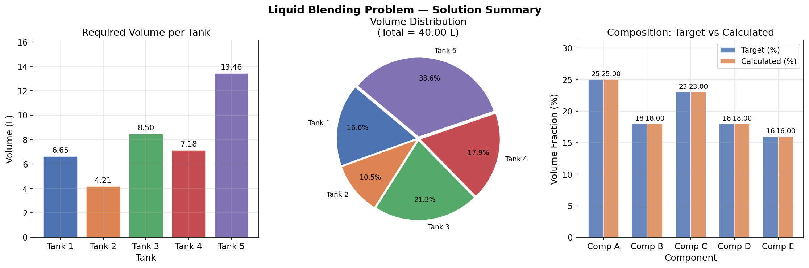

# Unit06 範例演練 01 — 液體摻合問題

本範例演練以經典化工液體摻合問題（呂，1985）示範如何將物料平衡建構為線性聯立方程組，並使用 `scipy.linalg.solve()` 求解各槽所需用量。

---

## 學習目標

完成本範例後，學生應能：

1. 將化工物料平衡問題轉化為矩陣方程式 $\mathbf{Ax} = \mathbf{b}$
2. 使用 `np.linalg.matrix_rank()` 判定解的存在性與唯一性
3. 正確呼叫 `scipy.linalg.solve()` 求解唯一解系統
4. 進行殘差驗證、質量守恆檢查與條件數評估
5. 以視覺化方式呈現各槽用量分布與組成匹配結果

---

## 目錄

1. [問題描述](#1-問題描述)
2. [數學模型](#2-數學模型)
3. [求解步驟](#3-求解步驟)
   - 3.1 建構係數矩陣與右端向量
   - 3.2 秩判定
   - 3.3 `scipy.linalg.solve()` 求解
   - 3.4 解的驗證
4. [結果視覺化](#4-結果視覺化)
5. [分析與討論](#5-分析與討論)

---

## 1. 問題描述

某工廠有 **5 個儲存槽**，各槽含有不同體積率之 5 種成分（A、B、C、D、E）。槽號與各成分體積率（%）如下表（呂，1985）：

| 槽號 | 成分 A (%) | 成分 B (%) | 成分 C (%) | 成分 D (%) | 成分 E (%) |
|:----:|:---------:|:---------:|:---------:|:---------:|:---------:|
|  1   |   55.9    |    7.9    |   16.3    |   11.5    |    8.4    |
|  2   |   20.1    |   52.2    |   11.2    |    9.8    |    6.7    |
|  3   |   17.6    |   12.2    |   46.0    |   14.3    |    9.9    |
|  4   |   18.3    |   13.8    |   11.7    |   47.1    |    9.1    |
|  5   |   19.5    |   18.2    |   21.5    |   10.6    |   30.2    |

**顧客需求**：摻合成 **40 公升**產品，各成分體積率（%）須達：

| 成分 | 目標體積率 (%) | 實際目標體積 (公升) |
|:----:|:------------:|:-----------------:|
|  A   |      25      |       10.0        |
|  B   |      18      |        7.2        |
|  C   |      23      |        9.2        |
|  D   |      18      |        7.2        |
|  E   |      16      |        6.4        |

**問題**：決定各槽所需用量 $V_1, V_2, V_3, V_4, V_5$ （公升）。

---

## 2. 數學模型

在密度不變的假設下，對每種成分進行體積平衡：

$$
\sum_{k=1}^{5} a_{jk} V_k = b_j, \quad j = A, B, C, D, E
$$

其中 $a_{jk}$ 為槽 $k$ 中成分 $j$ 的體積率（%）； $b_j$ = 目標體積率(%) × 40，採百分率係數時 $b_j$ 之值分別為 1000、720、920、720、640（各成分實際目標體積 = $b_j \div 100$ ，即 10.0、7.2、9.2、7.2、6.4 公升）。

寫成矩陣形式 $\mathbf{Ax} = \mathbf{b}$ ：


$$
\underbrace{\begin{bmatrix}
55.9 & 20.1 & 17.6 & 18.3 & 19.5 \\
 7.9 & 52.2 & 12.2 & 13.8 & 18.2 \\
16.3 & 11.2 & 46.0 & 11.7 & 21.5 \\
11.5 &  9.8 & 14.3 & 47.1 & 10.6 \\
 8.4 &  6.7 &  9.9 &  9.1 & 30.2
\end{bmatrix}}_{\mathbf{A}} \underbrace{\begin{bmatrix}V_1\\V_2\\V_3\\V_4\\V_5\end{bmatrix}}_{\mathbf{x}} = \underbrace{\begin{bmatrix}1000\\720\\920\\720\\640\end{bmatrix}}_{\mathbf{b}}
$$


- $\mathbf{A}$ ：係數矩陣（各槽組成，5×5）
- $\mathbf{x}$ ：未知數向量（各槽用量，公升）
- $\mathbf{b}$ ：目標向量，$b_j$ = 目標體積率(%) × 40，採百分率係數時 **b = [1000, 720, 920, 720, 640]**（實際各成分體積為 10.0、7.2、9.2、7.2、6.4 公升）

---

## 3. 求解步驟

### 3.1 建構係數矩陣與右端向量

```python
import numpy as np
from scipy import linalg

A = np.array([
    [55.9, 20.1, 17.6, 18.3, 19.5],
    [ 7.9, 52.2, 12.2, 13.8, 18.2],
    [16.3, 11.2, 46.0, 11.7, 21.5],
    [11.5,  9.8, 14.3, 47.1, 10.6],
    [ 8.4,  6.7,  9.9,  9.1, 30.2],
], dtype=float)

target_fraction = np.array([25, 18, 23, 18, 16], dtype=float)
total_volume    = 40.0
b = target_fraction * total_volume

print("係數矩陣 A (各槽體積率 %):")
print(A)
print(f"\n右端向量 b = 目標組成(%) × {total_volume} 公升:")
print(b)
print(f"\n矩陣形狀: A = {A.shape}, b = {b.shape}")
```

**執行結果：**

```
係數矩陣 A (各槽體積率 %):
[[55.9 20.1 17.6 18.3 19.5]
 [ 7.9 52.2 12.2 13.8 18.2]
 [16.3 11.2 46.  11.7 21.5]
 [11.5  9.8 14.3 47.1 10.6]
 [ 8.4  6.7  9.9  9.1 30.2]]

右端向量 b = 目標組成(%) × 40.0 公升:
[1000.  720.  920.  720.  640.]

矩陣形狀: A = (5, 5), b = (5,)
```

---

### 3.2 秩判定

使用 **Rouché–Capelli 定理** 判定解的存在性與唯一性：

$$
\operatorname{rank}(\mathbf{A}) = \operatorname{rank}([\mathbf{A} \mid \mathbf{b}]) = n \quad \Rightarrow \quad \text{唯一解}
$$

```python
m, n    = A.shape
rank_A  = np.linalg.matrix_rank(A)
rank_Ab = np.linalg.matrix_rank(np.column_stack([A, b]))

print("=" * 45)
print(f"矩陣維度: {m} 個方程式, {n} 個未知數")
print(f"rank(A)       = {rank_A}")
print(f"rank([A | b]) = {rank_Ab}")
print(f"n             = {n}")
print("-" * 45)

if rank_A < rank_Ab:
    print("→ 無解（方程式互相矛盾）")
elif rank_A == rank_Ab == n:
    print("→ 唯一解 ✓  (rank(A) = rank([A|b]) = n)")
    print("  可使用 scipy.linalg.solve() 求解")
else:
    free = n - rank_A
    print(f"→ 無窮多解（自由度 = {free}）")
    print("  建議使用 scipy.linalg.pinv() 求最小範數解")

det_A = np.linalg.det(A)
print(f"\ndet(A) = {det_A:.4f}")
print(f"  det(A) ≠ 0 → 係數矩陣可逆，唯一解存在 ✓" if abs(det_A) > 1e-10 else "  det(A) ≈ 0 → 奇異矩陣！")
print("=" * 45)
```

**執行結果：**

```
=============================================
矩陣維度: 5 個方程式, 5 個未知數
rank(A)       = 5
rank([A | b]) = 5
n             = 5
---------------------------------------------
→ 唯一解 ✓  (rank(A) = rank([A|b]) = n)
  可使用 scipy.linalg.solve() 求解

det(A) = 105976399.1900
  det(A) ≠ 0 → 係數矩陣可逆，唯一解存在 ✓
=============================================
```

> **說明**：rank(A) = rank([A|b]) = n = 5，滿足唯一解條件。行列式值 det(A) ≈ 1.06×10⁸ 遠大於零，確認係數矩陣可逆。

---

### 3.3 `scipy.linalg.solve()` 求解

```python
V = linalg.solve(A, b)

print("各槽所需用量 (公升):")
print("-" * 30)
for i, v in enumerate(V, 1):
    print(f"  槽 {i} (V{i}): {v:8.4f} 公升")
print("-" * 30)
print(f"  合計:    {V.sum():8.4f} 公升  (目標：{total_volume:.1f} 公升)")
```

**執行結果：**

```
各槽所需用量 (公升):
------------------------------
  槽 1 (V1):   6.6549 公升
  槽 2 (V2):   4.2097 公升
  槽 3 (V3):   8.5016 公升
  槽 4 (V4):   7.1760 公升
  槽 5 (V5):  13.4578 公升
------------------------------
  合計:     40.0000 公升  (目標：40.0 公升)
```

---

### 3.4 解的驗證

```python
comp_names = ['A', 'B', 'C', 'D', 'E']

print("=" * 55)
print("驗證 1 — 數值殘差")
print("-" * 55)
residual     = np.linalg.norm(A @ V - b)
rel_residual = residual / (np.linalg.norm(A) * np.linalg.norm(V))
cond_A       = np.linalg.cond(A)
print(f"  絕對殘差 ||Ax - b||     = {residual:.4e}")
print(f"  相對殘差               = {rel_residual:.4e}")
print(f"  矩陣條件數 κ(A)        = {cond_A:.4f}")
status = "✓ 良態系統，求解精確" if cond_A < 1e6 else "⚠ 條件數偏大"
print(f"  → {status}")

print("\n驗證 2 — 物理合理性（各槽用量 > 0）")
print("-" * 55)
all_positive = True
for i, v in enumerate(V, 1):
    flag = "✓" if v > 0 else "✗ 負值!"
    print(f"  V{i} = {v:.4f} 公升  {flag}")
    if v <= 0:
        all_positive = False
print(f"  → {'✓ 所有槽用量均為正值，物理上合理' if all_positive else '⚠ 存在負值，請重新確認問題設定'}")

print("\n驗證 3 — 質量守恆與組成匹配")
print("-" * 55)
print(f"  總用量 = {V.sum():.4f} 公升  (目標 {total_volume:.1f} 公升)  "
      + ("✓" if abs(V.sum() - total_volume) < 1e-8 else "⚠"))
print()
actual_vol_L = (A @ V) / 100.0          # 各成分實際體積 (公升) = (組成% × 用量) ÷ 100
actual_frac  = actual_vol_L / total_volume * 100   # 實際組成 (%)
print(f"  {'成分':^4} | {'實際體積(L)':>10} | {'計算組成(%)':>11} | {'目標組成(%)':>11} | 匹配")
print(f"  {'-'*4}-+-{'-'*10}-+-{'-'*11}-+-{'-'*11}-+------")
for j, comp in enumerate(comp_names):
    calc  = actual_frac[j]
    tgt   = target_fraction[j]
    match = "✓" if abs(calc - tgt) < 1e-8 else f"⚠ Δ={calc-tgt:+.4f}"
    print(f"  {comp:^4} | {actual_vol_L[j]:>10.4f} | {calc:>11.4f} | {tgt:>11.2f} | {match}")

print("=" * 55)
```

**執行結果：**

```
=======================================================
驗證 1 — 數值殘差
-------------------------------------------------------
  絕對殘差 ||Ax - b||     = 1.1369e-13
  相對殘差               = 4.8317e-17
  矩陣條件數 κ(A)        = 5.0402
  → ✓ 良態系統，求解精確

驗證 2 — 物理合理性（各槽用量 > 0）
-------------------------------------------------------
  V1 = 6.6549 公升  ✓
  V2 = 4.2097 公升  ✓
  V3 = 8.5016 公升  ✓
  V4 = 7.1760 公升  ✓
  V5 = 13.4578 公升  ✓
  → ✓ 所有槽用量均為正值，物理上合理

驗證 3 — 質量守恆與組成匹配
-------------------------------------------------------
  總用量 = 40.0000 公升  (目標 40.0 公升)  ✓

   成分  |    實際體積(L) |     計算組成(%) |     目標組成(%) | 匹配
  -----+------------+-------------+-------------+------
   A   |    10.0000 |     25.0000 |       25.00 | ✓
   B   |     7.2000 |     18.0000 |       18.00 | ✓
   C   |     9.2000 |     23.0000 |       23.00 | ✓
   D   |     7.2000 |     18.0000 |       18.00 | ✓
   E   |     6.4000 |     16.0000 |       16.00 | ✓
=======================================================
```

---

## 4. 結果視覺化



> **說明**：左圖為各槽所需用量長條圖；中圖為各槽用量佔總體積之比例（槽 5 最大，佔 33.6%）；右圖比較計算組成與目標組成，兩者完全吻合（誤差在機器精度等級）。

---

## 5. 分析與討論

### 5.1 求解結果摘要

| 槽號 | 所需用量 (公升) | 佔比 (%) |
|:----:|:-------------:|:-------:|
|  1   |    6.6549     |  16.6   |
|  2   |    4.2097     |  10.5   |
|  3   |    8.5016     |  21.3   |
|  4   |    7.1760     |  17.9   |
|  5   |   13.4578     |  33.6   |
| **合計** | **40.0000** | **100.0** |

### 5.2 系統特性分析

| 分析項目 | 數值 | 說明 |
|---------|------|------|
| 矩陣秩 rank(A) | 5 | 全秩，唯一解存在 |
| 行列式 det(A) | 1.06×10⁸ | 遠大於零，係數矩陣可逆 |
| 條件數 κ(A) | 5.04 | ≈ 1，屬良態系統 |
| 絕對殘差 | 1.14×10⁻¹³ | 機器精度等級 |
| 各槽用量 | 均 > 0 | 物理合理 |
| 組成匹配 | 5/5 ✓ | 所有成分完全匹配 |

### 5.3 條件數的物理意義

條件數 $\kappa(\mathbf{A}) = 5.04$ 接近最優值（ $\kappa = 1$ 為完全良態），說明：

- 右端向量 $\mathbf{b}$ 的微小擾動（如量測誤差）不會顯著放大解的誤差
- 求解結果具有高數值穩定性，可信賴度高
- 本問題的物料平衡係數本身已足夠良好地條件化

> **化工意義**：各槽的成分組成差異適中，使方程組的係數矩陣不至於奇異（如兩槽組成完全相同則矩陣奇異）。工廠在設計混料來源時，適當選擇組成分散的原料，有助於提高求解穩定性。

---

**課程資訊**
- 課程名稱：電腦在化工上之應用
- 課程單元：Unit06 範例演練 01 — 液體摻合問題
- 課程製作：逢甲大學 化工系 智慧程序系統工程實驗室
- 授課教師：莊曜禎 助理教授
- 更新日期：2026-02-20

**課程授權 [CC BY-NC-SA 4.0]**
- 本教材遵循 [創用CC 姓名標示-非商業性-相同方式分享 4.0 國際 (CC BY-NC-SA 4.0)](https://creativecommons.org/licenses/by-nc-sa/4.0/deed.zh) 授權。

---
