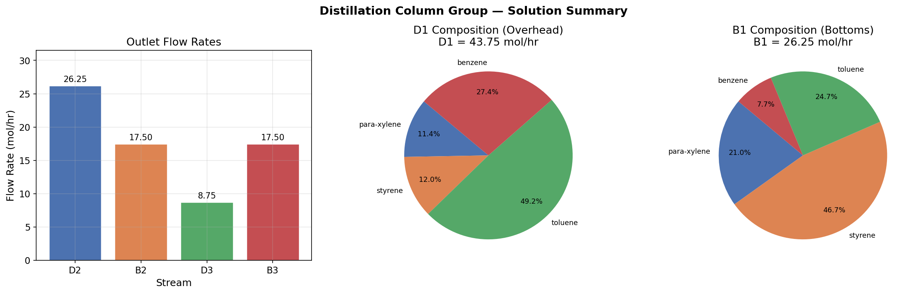

# Unit06 範例演練 02 — 蒸餾塔組之成分分析

本範例演練以多塔串聯蒸餾系統為例（Cutlip & Shacham, 1999），示範如何建立各塔之整體物料平衡方程組，將其表達為線性聯立方程組 $\mathbf{Ax}=\mathbf{b}$ ，並使用 `scipy.linalg.solve()` 求解各出口流率與組成分布。

---

## 學習目標

完成本範例後，學生應能：

1. 由蒸餾塔組之整體物料平衡建立矩陣方程式 $\mathbf{Ax}=\mathbf{b}$
2. 使用 `np.linalg.matrix_rank()` 判定解的存在性與唯一性
3. 正確呼叫 `scipy.linalg.solve()` 求解唯一解系統
4. 利用求解流率計算各塔出口組成分布
5. 進行殘差驗證、質量守恆與組成合理性檢查

---

## 目錄

1. [問題描述](#1-問題描述)
2. [數學模型](#2-數學模型)
3. [求解步驟](#3-求解步驟)
   - 3.1 建構係數矩陣與右端向量
   - 3.2 秩判定
   - 3.3 `scipy.linalg.solve()` 求解
   - 3.4 解的驗證
4. [第一塔出口組成計算](#4-第一塔出口組成計算)
5. [結果視覺化](#5-結果視覺化)
6. [分析與討論](#6-分析與討論)

---

## 1. 問題描述

某工廠利用以下的蒸餾塔組，分離**對二甲苯 (para-xylene)**、**苯乙烯 (styrene)**、**甲苯 (toluene)** 及**苯 (benzene)** 等四成分（Cutlip & Shacham, 1999）。

**系統架構**：進料流 F 首先進入第一個蒸餾塔，塔頂出口為 $D_1$ ，塔底出口為 $B_1$ 。 $D_1$ 再進入第二個蒸餾塔（塔頂 $D_2$ 、塔底 $B_2$ ）， $B_1$ 再進入第三個蒸餾塔（塔頂 $D_3$ 、塔底 $B_3$ ）。

**流程圖**：


**已知條件**：
- 進料流率 $F = 70\ \text{mol/hr}$
- 進料組成（莫耳分率）：para-xylene = 0.15，styrene = 0.25，toluene = 0.40，benzene = 0.20
- 各出口股流組成（莫耳分率）如下表：

| 成分 | $D_2$ | $B_2$ | $D_3$ | $B_3$ |
|:----:|:-----:|:-----:|:-----:|:-----:|
| para-xylene  | 0.07 | 0.18 | 0.15 | 0.24 |
| styrene      | 0.04 | 0.24 | 0.10 | 0.65 |
| toluene      | 0.54 | 0.42 | 0.54 | 0.10 |
| benzene      | 0.35 | 0.16 | 0.21 | 0.01 |

**問題**：
- **(a)** 計算 $D_2$ 、 $B_2$ 、 $D_3$ 、 $B_3$ 之流率 (mol/hr)
- **(b)** 計算第一塔塔頂 $D_1$ 及塔底 $B_1$ 處各成分的莫耳分率

---

## 2. 數學模型

### Part (a)：建立整體物料平衡方程組

對各成分進行整體物料平衡（進料量 = 各出口流之成分量總和）：

$$
a_{j,D_2} \cdot D_2 + a_{j,B_2} \cdot B_2 + a_{j,D_3} \cdot D_3 + a_{j,B_3} \cdot B_3 = z_j \cdot F, \quad j = 1,2,3,4
$$

其中 $a_{j,k}$ 為出口股 $k$ 中成分 $j$ 之莫耳分率， $z_j$ 為進料中成分 $j$ 之莫耳分率。寫成矩陣形式 $\mathbf{Ax}=\mathbf{b}$ ：

$$
\underbrace{\begin{bmatrix}
0.07 & 0.18 & 0.15 & 0.24 \\
0.04 & 0.24 & 0.10 & 0.65 \\
0.54 & 0.42 & 0.54 & 0.10 \\
0.35 & 0.16 & 0.21 & 0.01
\end{bmatrix}}_{\mathbf{A}}
\underbrace{\begin{bmatrix}D_2\\B_2\\D_3\\B_3\end{bmatrix}}_{\mathbf{x}}
=
\underbrace{\begin{bmatrix}0.15\\0.25\\0.40\\0.20\end{bmatrix}}_{\mathbf{z}} \times 70
=
\underbrace{\begin{bmatrix}10.5\\17.5\\28.0\\14.0\end{bmatrix}}_{\mathbf{b}}
$$

- $\mathbf{A}$ ：係數矩陣，各欄代表一個出口股，各列代表一種成分（4×4）
- $\mathbf{x}$ ：未知數向量（各出口流率，mol/hr）
- $\mathbf{b}$ ：右端向量， $b_j = z_j \times F$ ，即各成分在進料中的莫耳流量

### Part (b)：計算第一塔出口組成

由第一塔之成分物料平衡：

$$
D_1 = D_2 + B_2, \quad
\begin{bmatrix}x_1\\x_2\\x_3\\x_4\end{bmatrix}_{D_1}
= \frac{1}{D_1}
\begin{bmatrix}0.07 & 0.18\\0.04 & 0.24\\0.54 & 0.42\\0.35 & 0.16\end{bmatrix}
\begin{bmatrix}D_2\\B_2\end{bmatrix}
$$

$$
B_1 = D_3 + B_3, \quad
\begin{bmatrix}\tilde{x}_1\\\tilde{x}_2\\\tilde{x}_3\\\tilde{x}_4\end{bmatrix}_{B_1}
= \frac{1}{B_1}
\begin{bmatrix}0.15 & 0.24\\0.10 & 0.65\\0.54 & 0.10\\0.21 & 0.01\end{bmatrix}
\begin{bmatrix}D_3\\B_3\end{bmatrix}
$$

---

## 3. 求解步驟

### 3.1 建構係數矩陣與右端向量

```python
import numpy as np
from scipy import linalg

comp_names = ['para-xylene', 'styrene', 'toluene', 'benzene']

A = np.array([
    [0.07, 0.18, 0.15, 0.24],
    [0.04, 0.24, 0.10, 0.65],
    [0.54, 0.42, 0.54, 0.10],
    [0.35, 0.16, 0.21, 0.01],
], dtype=float)

F = 70.0
z = np.array([0.15, 0.25, 0.40, 0.20], dtype=float)
b = z * F

print("係數矩陣 A（各出口股流莫耳分率）：")
...
print(f"右端向量 b = z × F = {b}")
print(f"矩陣形狀: A = {A.shape}, b = {b.shape}")
```

**執行結果：**

```
係數矩陣 A（各出口股流莫耳分率）：
成分                  D2      B2      D3      B3
----------------------------------------------
  para-xylene     0.07    0.18    0.15    0.24
  styrene         0.04    0.24    0.10    0.65
  toluene         0.54    0.42    0.54    0.10
  benzene         0.35    0.16    0.21    0.01

進料流率 F = 70.0 mol/hr
進料組成 z = [0.15 0.25 0.4  0.2 ]
右端向量 b = z × F = [10.5 17.5 28.  14. ]

矩陣形狀: A = (4, 4), b = (4,)
```

---

### 3.2 秩判定

使用 **Rouché–Capelli 定理** 判定解的存在性與唯一性：

$$
\operatorname{rank}(\mathbf{A}) = \operatorname{rank}([\mathbf{A} \mid \mathbf{b}]) = n \quad \Rightarrow \quad \text{唯一解}
$$

```python
m, n    = A.shape
rank_A  = np.linalg.matrix_rank(A)
rank_Ab = np.linalg.matrix_rank(np.column_stack([A, b]))

print("=" * 45)
print(f"矩陣維度: {m} 個方程式, {n} 個未知數")
print(f"rank(A)       = {rank_A}")
print(f"rank([A | b]) = {rank_Ab}")
print(f"n             = {n}")
print("-" * 45)

if rank_A < rank_Ab:
    print("→ 無解（方程式互相矛盾）")
elif rank_A == rank_Ab == n:
    print("→ 唯一解 ✓  (rank(A) = rank([A|b]) = n)")
    print("  可使用 scipy.linalg.solve() 求解")
else:
    free = n - rank_A
    print(f"→ 無窮多解（自由度 = {free}）")
    print("  建議使用 scipy.linalg.pinv() 求最小範數解")

det_A = np.linalg.det(A)
print(f"\ndet(A) = {det_A:.6f}")
print(f"  det(A) ≠ 0 → 係數矩陣可逆，唯一解存在 ✓" if abs(det_A) > 1e-10 else "  det(A) ≈ 0 → 奇異矩陣！")
print("=" * 45)
```

**執行結果：**

```
=============================================
矩陣維度: 4 個方程式, 4 個未知數
rank(A)       = 4
rank([A | b]) = 4
n             = 4
---------------------------------------------
→ 唯一解 ✓  (rank(A) = rank([A|b]) = n)
  可使用 scipy.linalg.solve() 求解

det(A) = 0.000496
  det(A) ≠ 0 → 係數矩陣可逆，唯一解存在 ✓
=============================================
```

> **說明**：rank(A) = rank([A|b]) = n = 4，滿足唯一解條件。行列式值 det(A) ≈ 4.96×10⁻⁴ 雖然較小但仍遠大於零，係數矩陣可逆。

---

### 3.3 `scipy.linalg.solve()` 求解

```python
x = linalg.solve(A, b)   # x = [D2, B2, D3, B3]
D2, B2, D3, B3 = x

stream_names = ['D2', 'B2', 'D3', 'B3']
print("各出口股流流率 (mol/hr):")
print("-" * 35)
for name, val in zip(stream_names, x):
    print(f"  {name}: {val:9.4f} mol/hr")
print("-" * 35)
print(f"  合計: {x.sum():9.4f} mol/hr  (進料 F = {F:.1f} mol/hr)")
```

**執行結果：**

```
各出口股流流率 (mol/hr):
-----------------------------------
  D2:   26.2500 mol/hr
  B2:   17.5000 mol/hr
  D3:    8.7500 mol/hr
  B3:   17.5000 mol/hr
-----------------------------------
  合計:   70.0000 mol/hr  (進料 F = 70.0 mol/hr)
```

---

### 3.4 解的驗證

```python
residual     = np.linalg.norm(A @ x - b)
rel_residual = residual / (np.linalg.norm(A) * np.linalg.norm(x))
cond_A       = np.linalg.cond(A)
# ... 驗證各出口流率 > 0，質量守恆，組成匹配
```

**執行結果：**

```
=======================================================
驗證 1 — 數值殘差
-------------------------------------------------------
  絕對殘差 ||Ax - b||     = 3.9721e-15
  相對殘差               = 8.5366e-17
  矩陣條件數 κ(A)        = 154.2979
  → ✓ 良態系統，求解精確

驗證 2 — 物理合理性（各出口流率 > 0）
-------------------------------------------------------
  D2 = 26.2500 mol/hr  ✓
  B2 = 17.5000 mol/hr  ✓
  D3 = 8.7500 mol/hr  ✓
  B3 = 17.5000 mol/hr  ✓
  → ✓ 所有出口流率均為正值，物理上合理

驗證 3 — 質量守恆
-------------------------------------------------------
  出口總流率 = 70.0000 mol/hr  (進料 F = 70.0 mol/hr)  ✓

  成分             |   計算(mol/hr) |       計算組成 |       進料組成 | 匹配
  ---------------+--------------+------------+------------+------
  para-xylene    |      10.5000 |     0.1500 |     0.1500 | ✓
  styrene        |      17.5000 |     0.2500 |     0.2500 | ✓
  toluene        |      28.0000 |     0.4000 |     0.4000 | ✓
  benzene        |      14.0000 |     0.2000 |     0.2000 | ✓
=======================================================
```

---

## 4. 第一塔出口組成計算

```python
# 第二塔之組成係數（成分 × 股流 [D2, B2]）
A_col2 = np.array([
    [0.07, 0.18], [0.04, 0.24], [0.54, 0.42], [0.35, 0.16],
], dtype=float)

# 第三塔之組成係數（成分 × 股流 [D3, B3]）
A_col3 = np.array([
    [0.15, 0.24], [0.10, 0.65], [0.54, 0.10], [0.21, 0.01],
], dtype=float)

D1 = D2 + B2
B1 = D3 + B3
x_D1 = (A_col2 @ np.array([D2, B2])) / D1
x_B1 = (A_col3 @ np.array([D3, B3])) / B1
```

**執行結果：**

```
第一塔出口流率：
  D1 (塔頂) = 43.7500 mol/hr  (= D2 + B2)
  B1 (塔底) = 26.2500 mol/hr  (= D3 + B3)
  驗證: D1 + B1 = 70.0000 mol/hr  (= F = 70.0 mol/hr)  ✓

第一塔各出口組成（莫耳分率）：
  成分             |    D1 (塔頂) |    B1 (塔底)
  ---------------+------------+-----------
  para-xylene    |     0.1140 |     0.2100
  styrene        |     0.1200 |     0.4667
  toluene        |     0.4920 |     0.2467
  benzene        |     0.2740 |     0.0767

  組成總和驗證:
  sum(x_D1) = 1.000000  ✓
  sum(x_B1) = 1.000000  ✓
```

---

## 5. 結果視覺化



> **說明**：左圖為各出口股流流率長條圖，D2 最大（26.25 mol/hr）；中圖為第一塔塔頂 D1 之組成圓餅圖，甲苯（toluene）佔最多（49.2%）；右圖為第一塔塔底 B1 之組成圓餅圖，苯乙烯（styrene）佔最多（46.7%），顯示第一塔達到初步分離效果。

---

## 6. 分析與討論

### 6.1 求解結果摘要

| 股流 | 流率 (mol/hr) | 佔進料比 (%) |
|:----:|:------------:|:-----------:|
|  D2  |   26.2500    |    37.5     |
|  B2  |   17.5000    |    25.0     |
|  D3  |    8.7500    |    12.5     |
|  B3  |   17.5000    |    25.0     |
| **合計** | **70.0000** | **100.0** |

| 股流 | 流率 (mol/hr) |
|:----:|:------------:|
|  D1 (塔頂) |   43.7500    |
|  B1 (塔底) |   26.2500    |

### 6.2 第一塔出口組成摘要

| 成分 | D1 塔頂 (莫耳分率) | B1 塔底 (莫耳分率) |
|:----:|:-----------------:|:-----------------:|
| para-xylene | 0.1140 | 0.2100 |
| styrene     | 0.1200 | 0.4667 |
| toluene     | 0.4920 | 0.2467 |
| benzene     | 0.2740 | 0.0767 |

### 6.3 系統特性分析

| 分析項目 | 數值 | 說明 |
|---------|------|------|
| 矩陣秩 rank(A) | 4 | 全秩，唯一解存在 |
| 行列式 det(A) | 4.96×10⁻⁴ | 非零，係數矩陣可逆 |
| 條件數 κ(A) | 154.30 | 屬可接受範圍（< 10⁶）|
| 絕對殘差 | 3.97×10⁻¹⁵ | 機器精度等級 |
| 各出口流率 | 均 > 0 | 物理合理 |
| 組成守恆 | 4/4 ✓ | 所有成分完全匹配 |

### 6.4 條件數的物理意義

條件數 $\kappa(\mathbf{A}) = 154.30$ 比液體摻合問題（ $\kappa = 5.04$ ）大約 30 倍，說明：

- 本問題的係數矩陣中，各成分在不同出口股流間的組成差異較小（如 toluene 在 D2 與 D3 均為 0.54），使矩陣較接近奇異
- 進料組成或出口組成若有量測誤差，對求解結果的影響較液體摻合問題大
- 儘管如此，條件數 154.30 遠低於 10⁶，求解結果仍具有可靠的數值精度

> **化工意義**：蒸餾塔設計時，各塔的選擇性（即各出口股流組成的差異程度）對物料平衡方程組的條件性有直接影響。若蒸餾分離效果不佳（各出口組成相近），則係數矩陣條件數會增大，可能影響求解穩定性。

---

**課程資訊**
- 課程名稱：電腦在化工上之應用
- 課程單元：Unit06 範例演練 02 — 蒸餾塔組之成分分析
- 課程製作：逢甲大學 化工系 智慧程序系統工程實驗室
- 授課教師：莊曜禎 助理教授
- 更新日期：2026-02-20

**課程授權 [CC BY-NC-SA 4.0]**
- 本教材遵循 [創用CC 姓名標示-非商業性-相同方式分享 4.0 國際 (CC BY-NC-SA 4.0)](https://creativecommons.org/licenses/by-nc-sa/4.0/deed.zh) 授權。

---
