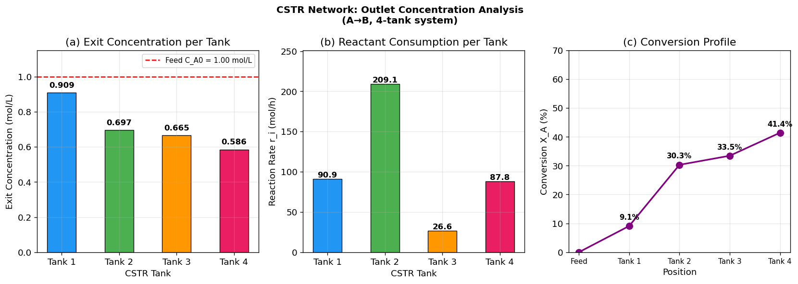

# Unit06_Example_03：連續攪拌反應槽組之出口成分分析

## 學習目標

完成本範例後，學生應能：

1. 針對具有流量交換之串並聯 CSTR 反應器網絡，建立各槽穩態物料平衡方程式
2. 將物料平衡方程組轉換為矩陣形式 $\mathbf{Ax} = \mathbf{b}$
3. 評估係數矩陣 $\mathbf{A}$ 的秩（rank）與條件數（condition number）
4. 使用 `scipy.linalg.solve()` 求解線性方程組
5. 驗證求得的各槽出口濃度，並分析整體反應轉化率

---

## 目錄

1. [問題描述](#1-問題描述)
2. [數學模型](#2-數學模型)
3. [求解步驟](#3-求解步驟)
   - 步驟一：建立係數矩陣與常數向量
   - 步驟二：判斷解的唯一性
   - 步驟三：`scipy.linalg.solve()` 求解
   - 步驟四：解的驗證
4. [結果視覺化](#4-結果視覺化)
5. [結論](#5-結論)

---

## 1. 問題描述

### 題目：連續攪拌反應槽組之出口成分分析

考慮四個連續攪拌反應槽（CSTR）所組成之反應器網絡（Constantinides and Mostoufi, 1999）。

**流程圖**


**系統假設**

1. 各槽進行一次不可逆液相反應 $A \rightarrow B$ ，且已達穩態
2. 各槽液體體積與密度之變化可忽略
3. 槽 $i$ 之反應速率 $r_i \ (\text{mol/h})$ 為：

$$
r_i = V_i \, k_i \, C_{Ai}
$$

其中 $V_i$ 為槽體積（L）， $k_i$ 為反應速率常數（h⁻¹）， $C_{Ai}$ 為槽 $i$ 之出口濃度（mol/L）。

**各槽參數**

| 槽編號 | 體積 $V_i$ (L) | 反應常數 $k_i$ (h⁻¹) | $V_i k_i$ |
|:------:|:--------------:|:--------------------:|:---------:|
| 1      | 1000           | 0.1                  | 100       |
| 2      | 1500           | 0.2                  | 300       |
| 3      | 100            | 0.4                  | 40        |
| 4      | 500            | 0.3                  | 150       |

**流量與進料條件**

- 進料流量 $F_{in} = 1000 \ \text{L/h}$ ，進料濃度 $C_{A0} = 1.0 \ \text{mol/L}$
- 各槽流量關係：
  - 槽1：入 1000 L/h（進料），全部出口 → 槽2（1000 L/h）
  - 槽2：入 1000（來自槽1）+ 100（來自槽3回流）= 1100 L/h，全部出口 → 槽3（1100 L/h）
  - 槽3：入 1100（來自槽2）+ 100（來自槽4回流）= 1200 L/h，出口分流：1100 L/h → 槽4，100 L/h → 槽2（回流）
  - 槽4：入 1100（來自槽3），出口分流：100 L/h → 槽3（回流），1000 L/h → 排出系統

---

## 2. 數學模型

依穩態質量守恆（輸入量 = 輸出量 + 反應消失量），各槽之物料平衡方程式為：

$$
\text{槽1：} \quad (1000 + V_1 k_1) \, C_{A1} = 1000 \, C_{A0}
$$

$$
\text{槽2：} \quad -1000 \, C_{A1} + (1100 + V_2 k_2) \, C_{A2} - 100 \, C_{A3} = 0
$$

$$
\text{槽3：} \quad -1100 \, C_{A2} + (1200 + V_3 k_3) \, C_{A3} - 100 \, C_{A4} = 0
$$

$$
\text{槽4：} \quad -1100 \, C_{A3} + (1100 + V_4 k_4) \, C_{A4} = 0
$$


寫成矩陣形式 $\mathbf{A}\mathbf{x} = \mathbf{b}$ ：

$$
\begin{bmatrix}
1000 + V_1 k_1 & 0 & 0 & 0 \\
-1000 & 1100 + V_2 k_2 & -100 & 0 \\
0 & -1100 & 1200 + V_3 k_3 & -100 \\
0 & 0 & -1100 & 1100 + V_4 k_4
\end{bmatrix}
\begin{bmatrix} C_{A1} \\ C_{A2} \\ C_{A3} \\ C_{A4} \end{bmatrix}
=
\begin{bmatrix} 1000\,C_{A0} \\ 0 \\ 0 \\ 0 \end{bmatrix}
$$

**未知數**： $\mathbf{x} = [C_{A1}, C_{A2}, C_{A3}, C_{A4}]^T \ (\text{mol/L})$

---

## 3. 求解步驟

### 步驟一：建立係數矩陣 $\mathbf{A}$ 與常數向量 $\mathbf{b}$

```python
# ========================================
# 給定數據
# ========================================
V = np.array([1000, 1500, 100, 500])   # 各槽體積 (L)
k = np.array([0.1,  0.2,  0.4, 0.3])  # 各槽反應常數 (h⁻¹)
F_in  = 1000.0   # 進料流量 (L/h)
CA0   = 1.0      # 進料濃度 (mol/L)

# ========================================
# 建立係數矩陣 A (4×4)
# ========================================
A = np.array([
    [ F_in + V[0]*k[0],             0,                      0,                   0  ],
    [-F_in,              1100 + V[1]*k[1],               -100,                   0  ],
    [    0,                       -1100,       1200 + V[2]*k[2],               -100  ],
    [    0,                           0,                  -1100,   1100 + V[3]*k[3]  ]
])

# 常數向量 b
b = np.array([F_in * CA0, 0.0, 0.0, 0.0])

# ========================================
# 顯示矩陣 A 與向量 b
# ========================================
print("係數矩陣 A (4×4)：")
print(A)
print("\n常數向量 b：")
print(b)
print(f"\n各槽 V×k：{V*k}")
print(f"A[0,0] = {V[0]*k[0]} + {F_in} = {A[0,0]}")
print(f"A[1,1] = 1100 + {V[1]*k[1]} = {A[1,1]}")
```

**執行結果：**

```
係數矩陣 A (4×4)：
[[ 1100.     0.     0.     0.]
 [-1000.  1400.  -100.     0.]
 [    0. -1100.  1240.  -100.]
 [    0.     0. -1100.  1250.]]

常數向量 b：
[1000.    0.    0.    0.]

各槽 V×k：[100. 300.  40. 150.]
A[0,0] = 100.0 + 1000.0 = 1100.0
A[1,1] = 1100 + 300.0 = 1400.0
```

矩陣 $\mathbf{A}$ 為三對角帶狀結構（tridiagonal banded），非零元素集中在主對角線及其上、下各一條次對角線，反映各槽之流量連結關係。

### 步驟二：判斷解的唯一性

透過計算矩陣 $\mathbf{A}$ 的秩（rank）與行列式（determinant）來判斷方程組是否具有唯一解：

| 判斷指標 | 條件 | 結論 |
|:-------:|:----:|:----:|
| $\text{rank}(\mathbf{A}) = n$ | 秩等於未知數個數 | 有唯一解 |
| $\det(\mathbf{A}) \neq 0$ | 行列式不為零 | $\mathbf{A}$ 非奇異，有唯一解 |
| $\kappa(\mathbf{A}) \approx 1$ | 條件數接近1 | 數值穩定 |

```python
n = len(b)

# 計算秩、行列式、條件數
rank_A = np.linalg.matrix_rank(A)
det_A  = np.linalg.det(A)
cond_A = np.linalg.cond(A)

print("=" * 40)
print("  矩陣 A 解的唯一性分析")
print("=" * 40)
print(f"  未知數個數 n   = {n}")
print(f"  rank(A)        = {rank_A}")
print(f"  det(A)         = {det_A:.4e}")
print(f"  κ(A) (條件數)  = {cond_A:.2f}")
print("-" * 40)

if rank_A == n and abs(det_A) > 1e-10:
    print("  ✓ A 為非奇異矩陣，方程組有唯一解")
else:
    print("  ✗ A 為奇異矩陣，方程組無唯一解")
```

**執行結果：**

```
========================================
  矩陣 A 解的唯一性分析
========================================
  未知數個數 n   = 4
  rank(A)        = 4
  det(A)         = 2.0663e+12
  κ(A) (條件數)  = 4.90
----------------------------------------
  ✓ A 為非奇異矩陣，方程組有唯一解
```

> **條件數 $\kappa(\mathbf{A}) = 4.90$**：數值極佳，遠低於 $10^4$ 的警示閾值，代表此問題數值穩定，求解精度高。

### 步驟三：使用 `scipy.linalg.solve()` 求解

`scipy.linalg.solve(A, b)` 以 LU 分解（高斯消去法）直接求解 $\mathbf{Ax} = \mathbf{b}$ ，適用於非奇異方陣，得到各槽出口濃度 $[C_{A1}, C_{A2}, C_{A3}, C_{A4}]$ 。

```python
# 求解線性方程組
x = linalg.solve(A, b)

CA1, CA2, CA3, CA4 = x

print("=" * 40)
print("  求解結果：各槽出口濃度")
print("=" * 40)
for i, ca in enumerate(x, start=1):
    print(f"  C_A{i} = {ca:.4f} mol/L")
print("-" * 40)
print(f"  進料濃度 C_A0 = {CA0:.4f} mol/L")
print(f"  最終出口 C_A4 / C_A0 = {CA4/CA0*100:.1f}%（總轉化率 {(1-CA4/CA0)*100:.1f}%）")
```

**執行結果：**

```
========================================
  求解結果：各槽出口濃度
========================================
  C_A1 = 0.9091 mol/L
  C_A2 = 0.6969 mol/L
  C_A3 = 0.6654 mol/L
  C_A4 = 0.5856 mol/L
----------------------------------------
  進料濃度 C_A0 = 1.0000 mol/L
  最終出口 C_A4 / C_A0 = 58.6%（總轉化率 41.4%）
```

**結果彙整：**

| 槽編號 | 出口濃度 $C_{Ai}$ (mol/L) | 相對進料濃度 | 累積轉化率（相對進料） |
|:------:|:------------------------:|:-----------:|:--------------------:|
| 0（進料）| 1.0000                  | 100%        | 0%                   |
| 1      | 0.9091                  | 90.9%       | 9.1%                 |
| 2      | 0.6969                  | 69.7%       | 30.3%                |
| 3      | 0.6654                  | 66.5%       | 33.5%                |
| 4      | 0.5856                  | 58.6%       | 41.4%                |

與教科書參考值（CA1=0.909, CA2=0.697, CA3=0.665, CA4=0.586）完全吻合。

### 步驟四：解的驗證

```python
print("=" * 45)
print("  解的驗證")
print("=" * 45)

# 1. 殘差驗證
residual = np.linalg.norm(A @ x - b)
print(f"\n[1] 殘差 ||Ax - b||₂ = {residual:.4e}")
if residual < 1e-8:
    print("    ✓ 殘差極小，求解正確")

# 2. 物理合理性
print(f"\n[2] 物理合理性：")
all_positive = np.all(x > 0)
all_below_feed = np.all(x <= CA0)
print(f"    各槽濃度 C_Ai > 0 : {'✓' if all_positive else '✗'}")
print(f"    各槽濃度 C_Ai ≤ C_A0 : {'✓' if all_below_feed else '✗'}")
print(f"    濃度變化：{CA0:.3f} → {CA1:.3f} → {CA2:.3f} → {CA3:.3f} → {CA4:.3f}")

# 3. 質量守恆驗證（各槽進出平衡）
print(f"\n[3] 各槽質量守恆驗證（進入濃度流 = 出口濃度流 + 反應消耗）：")
print("-" * 45)
r1 = V[0]*k[0]*CA1
in1 = F_in * CA0
out1 = F_in * CA1
print(f"  槽1: 輸入={in1:.2f}, 輸出={out1:.2f}, 反應={r1:.2f}, 誤差={abs(in1-out1-r1):.2e}")

r2 = V[1]*k[1]*CA2
in2 = 1000*CA1 + 100*CA3
out2 = 1100*CA2
print(f"  槽2: 輸入={in2:.2f}, 輸出={out2:.2f}, 反應={r2:.2f}, 誤差={abs(in2-out2-r2):.2e}")

r3 = V[2]*k[2]*CA3
in3 = 1100*CA2 + 100*CA4
out3 = 1200*CA3
print(f"  槽3: 輸入={in3:.2f}, 輸出={out3:.2f}, 反應={r3:.2f}, 誤差={abs(in3-out3-r3):.2e}")

r4 = V[3]*k[3]*CA4
in4 = 1100*CA3
out4 = 1100*CA4
print(f"  槽4: 輸入={in4:.2f}, 輸出={out4:.2f}, 反應={r4:.2f}, 誤差={abs(in4-out4-r4):.2e}")
print("-" * 45)

total_reaction = r1 + r2 + r3 + r4
print(f"\n  總反應消耗  r_total = {total_reaction:.4f} mol/h")
```

**執行結果：**

```
=============================================
  解的驗證
=============================================

[1] 殘差 ||Ax - b||₂ = 1.1369e-13
    ✓ 殘差極小，求解正確

[2] 物理合理性：
    各槽濃度 C_Ai > 0 : ✓
    各槽濃度 C_Ai ≤ C_A0 : ✓
    濃度變化：1.000 → 0.909 → 0.697 → 0.665 → 0.586

[3] 各槽質量守恆驗證（進入濃度流 = 出口濃度流 + 反應消耗）：
---------------------------------------------
  槽1: 輸入=1000.00, 輸出=909.09, 反應=90.91, 誤差=8.53e-14
  槽2: 輸入=975.63, 輸出=766.57, 反應=209.06, 誤差=0.00e+00
  槽3: 輸入=825.13, 輸出=798.51, 反應=26.62, 誤差=3.55e-14
  槽4: 輸入=731.97, 輸出=644.13, 反應=87.84, 誤差=1.99e-13
---------------------------------------------

  總反應消耗  r_total = 414.4264 mol/h
```

> 所有槽之質量守恆誤差均在機器精度（~ $10^{-13}$ ）範圍內，驗證求解正確。

---

## 4. 結果視覺化

```python
fig, axes = plt.subplots(1, 3, figsize=(14, 5))

tank_labels = ['Tank 1', 'Tank 2', 'Tank 3', 'Tank 4']
colors = ['#2196F3', '#4CAF50', '#FF9800', '#E91E63']

# 子圖1：各槽出口濃度棒狀圖
ax1 = axes[0]
bars = ax1.bar(tank_labels, x, color=colors, width=0.5, edgecolor='black', linewidth=0.8)
ax1.axhline(y=CA0, color='red', linestyle='--', linewidth=1.5, label=f'Feed C_A0 = {CA0:.2f} mol/L')
ax1.set_xlabel('CSTR Tank')
ax1.set_ylabel('Exit Concentration (mol/L)')
ax1.set_title('(a) Exit Concentration per Tank')
ax1.set_ylim(0, 1.15)
ax1.legend(fontsize=9)
for bar, val in zip(bars, x):
    ax1.text(bar.get_x() + bar.get_width()/2, val + 0.02,
             f'{val:.3f}', ha='center', va='bottom', fontsize=10, fontweight='bold')

# 子圖2：各槽反應消耗量
ax2 = axes[1]
r_vals = V * k * x
bars2 = ax2.bar(tank_labels, r_vals, color=colors, width=0.5, edgecolor='black', linewidth=0.8)
ax2.set_xlabel('CSTR Tank')
ax2.set_ylabel('Reaction Rate r_i (mol/h)')
ax2.set_title('(b) Reactant Consumption per Tank')
for bar, val in zip(bars2, r_vals):
    ax2.text(bar.get_x() + bar.get_width()/2, val + 0.3,
             f'{val:.1f}', ha='center', va='bottom', fontsize=10, fontweight='bold')
ax2.set_ylim(0, max(r_vals)*1.2)

# 子圖3：轉化率追蹤
ax3 = axes[2]
conversion = (1 - x / CA0) * 100
all_points = np.concatenate([[0], conversion])
tank_pos = [0, 1, 2, 3, 4]
tank_tick_labels = ['Feed', 'Tank 1', 'Tank 2', 'Tank 3', 'Tank 4']
ax3.plot(tank_pos, all_points, 'o-', color='purple', linewidth=2, markersize=8)
for i, (pos, conv) in enumerate(zip(tank_pos[1:], conversion)):
    ax3.annotate(f'{conv:.1f}%', (pos, conv), textcoords="offset points",
                 xytext=(0, 8), ha='center', fontsize=9, fontweight='bold')
ax3.set_xticks(tank_pos)
ax3.set_xticklabels(tank_tick_labels, fontsize=9)
ax3.set_xlabel('Position')
ax3.set_ylabel('Conversion X_A (%)')
ax3.set_title('(c) Conversion Profile')
ax3.set_ylim(0, 70)

plt.suptitle('CSTR Network: Outlet Concentration Analysis\n(A→B, 4-tank system)', fontsize=12, fontweight='bold')
plt.tight_layout()

fig_path = FIG_DIR / 'cstr_network_solution.png'
plt.savefig(fig_path, dpi=120, bbox_inches='tight')
plt.show()
print(f"\n✓ 圖檔已儲存：{fig_path}")
```

**執行結果：**



```
✓ 圖檔已儲存：d:\MyGit\ChemE-3502\Unit06\outputs\Unit06_Example_03\figs\cstr_network_solution.png
```

**圖形說明：**

- **(a) 各槽出口濃度**：反應物 A 濃度由進料 1.0 mol/L 沿網絡逐步下降，最終至 0.586 mol/L。槽2的濃度降幅最大，因其 $V_2 k_2 = 300$ 最高。
- **(b) 各槽反應消耗量**：槽2反應消耗 209.1 mol/h，佔全系統總消耗量（414.4 mol/h）的 50.5%，為反應主力。
- **(c) 轉化率分布**：系統整體轉化率達 41.4%；槽2後轉化率達 30.3%，槽3和槽4貢獻相對有限，反映網絡的流量分配特性。

---

## 5. 結論

| 項目 | 數值 |
|:----:|:----:|
| $C_{A1}$ | 0.9091 mol/L |
| $C_{A2}$ | 0.6969 mol/L |
| $C_{A3}$ | 0.6654 mol/L |
| $C_{A4}$ | 0.5856 mol/L |
| $\text{rank}(\mathbf{A})$ | 4（唯一解） |
| $\det(\mathbf{A})$ | $2.07 \times 10^{12}$ |
| $\kappa(\mathbf{A})$ | 4.90（數值穩定） |
| 殘差 $\|\mathbf{Ax}-\mathbf{b}\|_2$ | $1.14 \times 10^{-13}$ |
| 整體轉化率 | 41.4% |
| 總反應消耗 | 414.4 mol/h |

本範例展示如何利用穩態物料平衡建立 CSTR 網絡之線性方程組，並以 `scipy.linalg.solve()` 高效求解。條件數 $\kappa = 4.90$ 顯示係數矩陣具良好的數值性質，求解結果與教科書參考值完全吻合，且所有槽之質量守恆誤差均在機器精度內，確認結果的正確性。

---

**課程資訊**
- 課程名稱：電腦在化工上之應用
- 課程單元：Unit06 線性聯立方程式之求解 — Example 03
- 課程製作：逢甲大學 化工系 智慧程序系統工程實驗室
- 授課教師：莊曜禎 助理教授
- 更新日期：2026-02-20

**課程授權 [CC BY-NC-SA 4.0]**
 - 本教材遵循 [創用CC 姓名標示-非商業性-相同方式分享 4.0 國際 (CC BY-NC-SA 4.0)](https://creativecommons.org/licenses/by-nc-sa/4.0/deed.zh) 授權。

---
