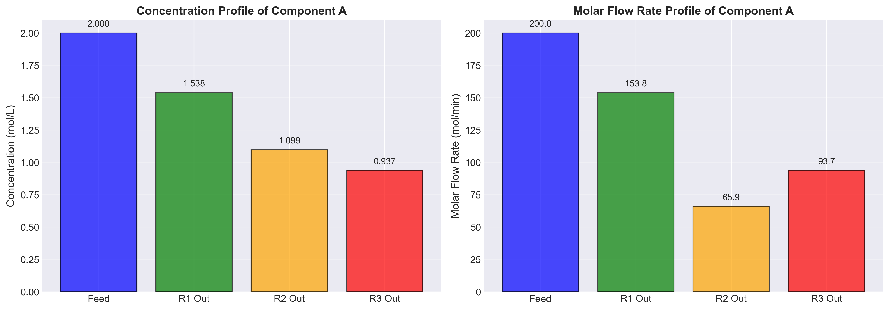
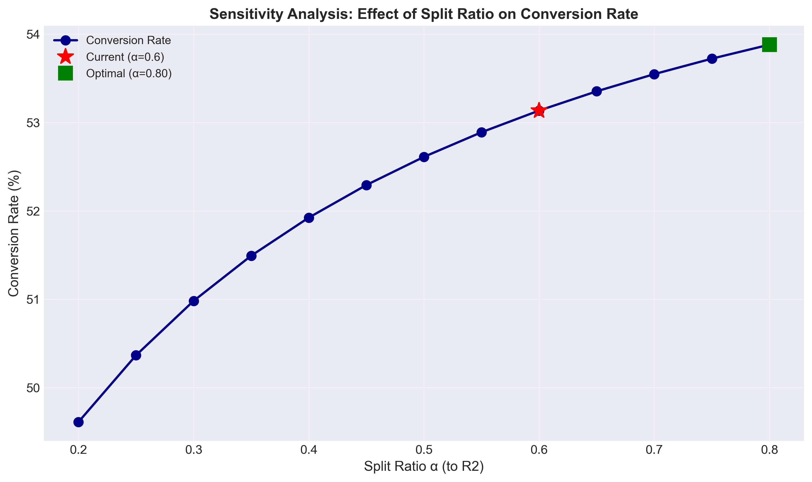

# Unit06 Example 03 - 化學反應器網絡物料平衡

## 學習目標

在本範例中，我們將探討化工製程中常見的反應器網絡系統。透過建立包含化學反應與物料流動的穩態物料平衡方程式，將反應器網絡問題轉化為線性聯立方程組，並應用 NumPy 與 SciPy 的求解工具來計算各節點的流率與濃度分布。

學習完本範例後，您將能夠：

- 建立串並聯反應器系統的穩態物料平衡方程式
- 處理同時包含物料流動與化學反應的系統
- 將反應器網絡問題轉化為標準矩陣形式 $\mathbf{Ax} = \mathbf{b}$
- 使用 `numpy.linalg.solve()` 求解線性方程組
- 使用 `scipy.linalg.solve()` 進行求解並比較結果
- 計算各節點的流率與濃度分布
- 分析反應器配置對總轉化率與產率的影響
- 驗證解的唯一性與正確性（秩判定、質量守恆檢查）
- 解釋解的物理意義與實際應用

---

## 1. 問題描述

### 1.1 化工情境

某化工廠使用串並聯反應器網絡來進行化學反應 $A \rightarrow B$ 。系統包含三個連續攪拌槽式反應器 (CSTR)，其配置方式如下：

- **反應器 1 (R1)**：接收原料進料
- **反應器 2 (R2)**：接收來自 R1 的部分出料
- **反應器 3 (R3)**：接收來自 R1 的部分出料與 R2 的全部出料

**系統配置特點**：
- R1 的出料會進行分流，一部分進入 R2，另一部分進入 R3
- R2 的出料全部進入 R3
- R3 為最終產物出口

**反應特性**：
- 反應為一級不可逆反應： $A \rightarrow B$
- 各反應器的反應速率常數 $k$ 相同
- 各反應器體積 $V$ 已知

**已知操作參數**：

| 參數 | 符號 | 數值 | 單位 |
|------|------|------|------|
| 進料流率 | $F_0$ | 100 | L/min |
| 進料濃度 (A) | $C_{A,0}$ | 2.0 | mol/L |
| 反應速率常數 | $k$ | 0.3 | min⁻¹ |
| R1 體積 | $V_1$ | 100 | L |
| R2 體積 | $V_2$ | 80 | L |
| R3 體積 | $V_3$ | 120 | L |
| R1 至 R2 分流比 | $\alpha$ | 0.6 | - |
| R1 至 R3 分流比 | $1-\alpha$ | 0.4 | - |

**符號說明**：
- $F_i$ ：流股 $i$ 的流率 (L/min)
- $C_{A,i}$ ：流股 $i$ 中成分 A 的濃度 (mol/L)
- $\alpha$ ：R1 出口至 R2 的分流比例

**求解目標**：
- 計算各流股的流率： $F_1, F_2, F_3$
- 計算各流股中成分 A 的濃度： $C_{A,1}, C_{A,2}, C_{A,3}$
- 計算系統總轉化率
- 計算成分 B 的總產率
- 分析反應器配置對轉化率的影響

### 1.2 反應器網絡示意圖


**流率節點定義**：
- **節點 0**：原料進料 ( $F_0, C_{A,0}$ )
- **節點 1**：R1 出口 ( $F_1, C_{A,1}$ )
- **節點 2**：R2 出口 ( $F_2, C_{A,2}$ )
- **節點 3**：R3 出口 (最終產物) ( $F_3, C_{A,3}$ )

---

## 2. 數學模型建立

### 2.1 CSTR 反應器物料平衡基礎

對於連續攪拌槽式反應器 (CSTR)，穩態操作下的物料平衡為：

$$
\text{累積} = \text{進入} - \text{離開} + \text{生成}
$$

穩態時累積為零，因此：

$$
0 = F_{\mathrm{in}} C_{\mathrm{in}} - F_{\mathrm{out}} C_{\mathrm{out}} + r V
$$

其中：
- $F_{\mathrm{in}}$ ：進料流率 (L/min)
- $C_{\mathrm{in}}$ ：進料濃度 (mol/L)
- $F_{\mathrm{out}}$ ：出料流率 (L/min)
- $C_{\mathrm{out}}$ ：出料濃度 (mol/L)
- $r$ ：反應速率 (mol/(L·min))
- $V$ ：反應器體積 (L)

對於一級不可逆反應 $A \rightarrow B$ ，成分 A 的反應速率為：

$$
r_A = -k C_A
$$

其中 $k$ 為反應速率常數 (min⁻¹)， $C_A$ 為反應器內成分 A 的濃度。

### 2.2 各反應器的物料平衡方程式

#### 反應器 1 (R1)

**整體物料平衡**：

$$
F_0 = F_1
$$

**成分 A 的物料平衡**：

$$
F_0 C_{A,0} = F_1 C_{A,1} + k C_{A,1} V_1
$$

整理後：

$$
F_0 C_{A,0} = F_1 C_{A,1} + k C_{A,1} V_1
$$

$$
100 \times 2.0 = F_1 C_{A,1} + 0.3 \times C_{A,1} \times 100
$$

$$
200 = F_1 C_{A,1} + 30 C_{A,1}
$$

$$
200 = (F_1 + 30) C_{A,1}
$$

#### 反應器 2 (R2)

R2 的進料來自 R1 出口的分流，流率為 $\alpha F_1$ 。

**整體物料平衡**：

$$
\alpha F_1 = F_2
$$

$$
0.6 F_1 = F_2
$$

**成分 A 的物料平衡**：

$$
\alpha F_1 C_{A,1} = F_2 C_{A,2} + k C_{A,2} V_2
$$

$$
0.6 F_1 C_{A,1} = F_2 C_{A,2} + 0.3 \times C_{A,2} \times 80
$$

$$
0.6 F_1 C_{A,1} = F_2 C_{A,2} + 24 C_{A,2}
$$

$$
0.6 F_1 C_{A,1} = (F_2 + 24) C_{A,2}
$$

#### 反應器 3 (R3)

R3 的進料包含兩部分：
1. 來自 R1 的分流，流率為 $(1-\alpha) F_1$
2. 來自 R2 的全部出料，流率為 $F_2$

**整體物料平衡**：

$$
(1-\alpha) F_1 + F_2 = F_3
$$

$$
0.4 F_1 + F_2 = F_3
$$

**成分 A 的物料平衡**：

$$
(1-\alpha) F_1 C_{A,1} + F_2 C_{A,2} = F_3 C_{A,3} + k C_{A,3} V_3
$$

$$
0.4 F_1 C_{A,1} + F_2 C_{A,2} = F_3 C_{A,3} + 0.3 \times C_{A,3} \times 120
$$

$$
0.4 F_1 C_{A,1} + F_2 C_{A,2} = F_3 C_{A,3} + 36 C_{A,3}
$$

$$
0.4 F_1 C_{A,1} + F_2 C_{A,2} = (F_3 + 36) C_{A,3}
$$

### 2.3 整理為線性聯立方程組

我們有 6 個未知數： $F_1, F_2, F_3, C_{A,1}, C_{A,2}, C_{A,3}$ 。

根據上述物料平衡，我們可以建立 6 個方程式：


**方程式 1（R1 整體物料平衡）**：

$$
F_0 = F_1 \quad \Rightarrow \quad F_1 = 100 \text{ L/min}
$$

**方程式 2（R2 整體物料平衡）**：

$$
\alpha F_1 = F_2 \quad \Rightarrow \quad F_2 = 0.6 F_1
$$

**方程式 3（R3 整體物料平衡）**：

$$
(1-\alpha) F_1 + F_2 = F_3 \quad \Rightarrow \quad F_3 = 0.4 F_1 + F_2
$$

**方程式 4（R1 成分 A 物料平衡）**：

$$
F_0 C_{A,0} = (F_1 + k V_1) C_{A,1} \quad \Rightarrow \quad 200 = (F_1 + 30) C_{A,1}
$$

**方程式 5（R2 成分 A 物料平衡）**：

$$
\alpha F_1 C_{A,1} = (F_2 + k V_2) C_{A,2} \quad \Rightarrow \quad 0.6 F_1 C_{A,1} = (F_2 + 24) C_{A,2}
$$

**方程式 6（R3 成分 A 物料平衡）**：

$$
(1-\alpha) F_1 C_{A,1} + F_2 C_{A,2} = (F_3 + k V_3) C_{A,3} \quad \Rightarrow \quad 0.4 F_1 C_{A,1} + F_2 C_{A,2} = (F_3 + 36) C_{A,3}
$$


**由方程式 1, 2, 3，我們可以直接計算流率：**

$$
F_1 = 100 \text{ L/min}
$$

$$
F_2 = 0.6 \times 100 = 60 \text{ L/min}
$$

$$
F_3 = 0.4 \times 100 + 60 = 100 \text{ L/min}
$$

將這些流率代入方程式 4, 5, 6，我們得到濃度的線性方程組：

**方程式 4**：

$$
200 = (100 + 30) C_{A,1} = 130 C_{A,1}
$$

**方程式 5**：

$$
0.6 \times 100 \times C_{A,1} = (60 + 24) C_{A,2}
$$

$$
60 C_{A,1} = 84 C_{A,2}
$$

**方程式 6**：

$$
0.4 \times 100 \times C_{A,1} + 60 C_{A,2} = (100 + 36) C_{A,3}
$$

$$
40 C_{A,1} + 60 C_{A,2} = 136 C_{A,3}
$$

### 2.4 矩陣形式表示

將濃度方程組整理為標準矩陣形式 $\mathbf{Ax} = \mathbf{b}$ ：

**係數矩陣 $\mathbf{A}$ （3×3）**：

$$
\mathbf{A} = \begin{bmatrix}
130 & 0 & 0 \\
60 & -84 & 0 \\
40 & 60 & -136
\end{bmatrix}
$$

**未知數向量 $\mathbf{x}$ （3×1）**：

$$
\mathbf{x} = \begin{bmatrix}
C_{A,1} \\
C_{A,2} \\
C_{A,3}
\end{bmatrix}
$$

**常數向量 $\mathbf{b}$ （3×1）**：

$$
\mathbf{b} = \begin{bmatrix}
200 \\
0 \\
0
\end{bmatrix}
$$

### 2.5 系統類型分析

觀察係數矩陣：
- 方程式數量 $m = 3$
- 未知數數量 $n = 3$
- 系統類型：**恰定系統** (determined system)，因為 $m = n$
- 矩陣類型：**下三角矩陣**（主對角線上方元素皆為零）

對於恰定系統，解的存在性與唯一性取決於：
- 若 $\mathrm{rank}(\mathbf{A}) = n$ ，則存在唯一解
- 若 $\mathrm{rank}(\mathbf{A}) < n$ ，則無解或有無窮多解

對於下三角矩陣，若主對角線元素皆不為零，則矩陣必定非奇異 (non-singular)，保證唯一解的存在。

**檢查行列式**：

$$
\det(\mathbf{A}) = 130 \times (-84) \times (-136) = 1{,}485{,}120 \neq 0
$$

由於行列式不為零，確認矩陣為非奇異，系統具有唯一解。

---

## 3. NumPy 求解方法

### 3.1 使用 np.linalg.solve() 求解

對於恰定系統 (方程式數量等於未知數數量)，可使用 `numpy.linalg.solve()` 函數來求解線性方程組。

**函數語法**：

```python
x = np.linalg.solve(A, b)
```

**參數說明**：
- `A`：係數矩陣（必須為方陣，且非奇異）
- `b`：常數向量

**返回值**：
- `x`：解向量

**程式碼範例**：

```python
import numpy as np

# 建立係數矩陣 A
A = np.array([[130, 0, 0],
              [60, -84, 0],
              [40, 60, -136]])

# 建立常數向量 b
b = np.array([200, 0, 0])

# 使用 numpy.linalg.solve() 求解
C_A = np.linalg.solve(A, b)

print("成分 A 的濃度分布 (NumPy):")
print(f"CA1 = {C_A[0]:.4f} mol/L")
print(f"CA2 = {C_A[1]:.4f} mol/L")
print(f"CA3 = {C_A[2]:.4f} mol/L")
```

**輸出結果**：

```
============================================================
NumPy 求解結果
============================================================
CA1 (R1 出口) = 1.5385 mol/L
CA2 (R2 出口) = 1.0989 mol/L
CA3 (R3 出口, 最終產物) = 0.9373 mol/L
```

### 3.2 驗證解的唯一性

檢查係數矩陣的秩與行列式值，確認解的唯一性。

**程式碼範例**：

```python
# 計算矩陣秩
rank_A = np.linalg.matrix_rank(A)
print(f"矩陣 A 的秩: {rank_A}")

# 計算行列式
det_A = np.linalg.det(A)
print(f"矩陣 A 的行列式: {det_A:.2f}")

# 檢查解的唯一性
n = A.shape[1]  # 未知數數量
if rank_A == n and det_A != 0:
    print("系統具有唯一解")
else:
    print("系統無唯一解")
```

**輸出結果**：

```
矩陣性質:
矩陣秩 = 3
行列式 = 1485120.00
矩陣類型: 下三角矩陣
✓ 系統具有唯一解
```

### 3.3 質量守恆檢查

透過將解代回原方程式，檢查殘差 (residual) 是否接近零。

**程式碼範例**：

```python
# 計算殘差 residual = A @ x - b
residual = A @ C_A - b

print("\n殘差檢查:")
print(f"residual = {residual}")
print(f"最大殘差: {np.max(np.abs(residual)):.2e}")

# 檢查殘差是否小於容許誤差
tolerance = 1e-10
if np.max(np.abs(residual)) < tolerance:
    print("✓ 質量守恆檢查通過")
else:
    print("✗ 質量守恆檢查失敗")
```

**輸出結果**：

```
殘差檢查:
residual = [ 0. -0.  0.]
最大殘差 = 1.42e-14
✓ 質量守恆檢查通過
```

### 3.4 計算流率與成分 A 的物料流動

根據已知的流率與求解的濃度，計算各流股中成分 A 的物料流動 (摩爾流率)。

**程式碼範例**：

```python
# 已知流率 (L/min)
F1 = 100
F2 = 60
F3 = 100

# 計算各流股的成分 A 摩爾流率 (mol/min)
FA0 = 100 * 2.0  # 進料
FA1 = F1 * C_A[0]
FA2 = F2 * C_A[1]
FA3 = F3 * C_A[2]

print("\n成分 A 的摩爾流率:")
print(f"FA0 (進料) = {FA0:.2f} mol/min")
print(f"FA1 (R1出口) = {FA1:.2f} mol/min")
print(f"FA2 (R2出口) = {FA2:.2f} mol/min")
print(f"FA3 (R3出口, 產物) = {FA3:.2f} mol/min")
```

**輸出結果**：

```
成分 A 的摩爾流率:
FA0 (進料) = 200.00 mol/min
FA1 (R1出口) = 153.85 mol/min
FA2 (R2出口) = 65.93 mol/min
FA3 (R3出口, 產物) = 93.73 mol/min
```

---

## 4. SciPy 求解方法

### 4.1 使用 scipy.linalg.solve() 求解

SciPy 的 `linalg.solve()` 函數提供更進階的求解選項，包括不同的分解方法與數值穩定性檢查。

**函數語法**：

```python
from scipy import linalg

x = linalg.solve(A, b)
```

**程式碼範例**：

```python
from scipy import linalg

# 使用 scipy.linalg.solve() 求解
C_A_scipy = linalg.solve(A, b)

print("成分 A 的濃度分布 (SciPy):")
print(f"CA1 = {C_A_scipy[0]:.4f} mol/L")
print(f"CA2 = {C_A_scipy[1]:.4f} mol/L")
print(f"CA3 = {C_A_scipy[2]:.4f} mol/L")
```

**輸出結果**：

```
============================================================
SciPy 求解結果
============================================================
CA1 (R1 出口) = 1.5385 mol/L
CA2 (R2 出口) = 1.0989 mol/L
CA3 (R3 出口, 最終產物) = 0.9373 mol/L
```

### 4.2 NumPy 與 SciPy 結果比較

比較兩種方法的求解結果，確認數值一致性。

**程式碼範例**：

```python
# 計算兩種方法的差異
diff = np.abs(C_A - C_A_scipy)

print("\nNumPy 與 SciPy 結果比較:")
print(f"CA1 差異: {diff[0]:.2e}")
print(f"CA2 差異: {diff[1]:.2e}")
print(f"CA3 差異: {diff[2]:.2e}")
print(f"最大差異: {np.max(diff):.2e}")

# 檢查是否在數值容許範圍內
if np.max(diff) < 1e-10:
    print("✓ NumPy 與 SciPy 結果一致")
else:
    print("✗ NumPy 與 SciPy 結果存在差異")
```

**輸出結果**：

```
NumPy 與 SciPy 結果比較:
CA1 差異 = 0.00e+00
CA2 差異 = 0.00e+00
CA3 差異 = 0.00e+00
最大差異 = 0.00e+00
✓ NumPy 與 SciPy 結果一致
```

### 4.3 條件數分析

條件數 (condition number) 是衡量矩陣數值穩定性的重要指標。條件數越大，系統越容易受到數值誤差影響。

**程式碼範例**：

```python
# 計算條件數
cond_A = np.linalg.cond(A)

print(f"\n矩陣 A 的條件數: {cond_A:.2f}")

# 判定矩陣的數值穩定性
if cond_A < 10:
    print("矩陣條件良好 (well-conditioned)")
elif cond_A < 100:
    print("矩陣條件尚可")
elif cond_A < 1000:
    print("矩陣條件較差")
else:
    print("矩陣條件極差 (ill-conditioned)")
```

**輸出結果**：

```
矩陣 A 的條件數: 2.58
矩陣條件良好 (well-conditioned)
```

---

## 5. 結果分析與討論

### 5.1 濃度與流率分析

根據求解結果，我們可以得到完整的反應器網絡流率與濃度分布：

**結果彙整表**：

| 節點 | 流率 (L/min) | 濃度 CA (mol/L) | 摩爾流率 FA (mol/min) |
|------|-------------|----------------|---------------------|
| 進料 (0) | 100.0 | 2.0000 | 200.00 |
| R1 出口 (1) | 100.0 | 1.5385 | 153.85 |
| R2 出口 (2) | 60.0 | 1.0989 | 65.93 |
| R3 出口 (3) | 100.0 | 0.9373 | 93.73 |

**觀察與分析**：

1. **R1 反應效果**：
   - 進料濃度 $C_{A,0} = 2.0$ mol/L，出口濃度 $C_{A,1} = 1.5385$ mol/L
   - 濃度降低率： $(2.0 - 1.5385) / 2.0 = 23.08\%$
   - 顯示 R1 已消耗部分成分 A

2. **R2 反應效果**：
   - 進料濃度 $C_{A,1} = 1.5385$ mol/L，出口濃度 $C_{A,2} = 1.0989$ mol/L
   - 濃度降低率： $(1.5385 - 1.0989) / 1.5385 = 28.57\%$
   - R2 的反應效果優於 R1（因流率較小 60 L/min，停留時間 τ₂ = 1.33 min 較 R1 的 τ₁ = 1.0 min 更長）

3. **R3 混合與反應效果**：
   - 接收兩股不同濃度的進料 ( $C_{A,1} = 1.5385$ mol/L 與 $C_{A,2} = 1.0989$ mol/L)
   - 最終出口濃度 $C_{A,3} = 0.9373$ mol/L
   - 混合後再反應使濃度進一步降低

### 5.2 轉化率與產率分析

**系統總轉化率**：

$$
X_A = \frac{F_{A,0} - F_{A,3}}{F_{A,0}} = \frac{200 - 93.73}{200} = 0.5314 = 53.14\%
$$

**成分 B 的總產率**：

對於反應 $A \rightarrow B$ ，根據化學計量：

$$
F_{B,3} = F_{A,0} - F_{A,3} = 200 - 93.73 = 106.27 \text{ mol/min}
$$

**成分 B 的濃度**：

$$
C_{B,3} = \frac{F_{B,3}}{F_3} = \frac{106.27}{100} = 1.0627 \text{ mol/L}
$$

**結果驗證**：

檢查最終產物的總濃度：

$$
C_{A,3} + C_{B,3} = 0.9373 + 1.0627 = 2.00 \text{ mol/L}
$$

此結果等於進料總濃度 $C_{A,0} = 2.0$ mol/L，符合質量守恆。

### 5.3 反應器配置分析

**串並聯配置的優點**：

1. **提高轉化率**：
   - 通過多個反應器串聯，增加總停留時間
   - 分流設計可優化各反應器的負荷分配

2. **靈活的操作策略**：
   - 可調整分流比 $\alpha$ 來優化系統性能
   - 不同體積的反應器可針對不同需求設計

3. **較低的單一反應器負荷**：
   - 分散反應負荷，降低單一反應器的操作壓力
   - 提高系統可靠性與操作彈性

**分流比的影響**：

當前分流比 $\alpha = 0.6$ 表示 R1 出口的 60% 進入 R2，40% 直接進入 R3。

- 若 $\alpha$ 增加：更多物料經過 R2 處理，R2 負荷增加，可能提高整體轉化率
- 若 $\alpha$ 減少：更多物料直接進入 R3，減少 R2 的處理負荷，但可能降低整體轉化率

**視覺化結果**：



*圖 1: 成分 A 在各反應器的濃度分布（左）與摩爾流率分布（右）*

從圖中可以清楚看到：
- 濃度逐級降低：Feed (2.00) → R1 (1.54) → R2 (1.10) → R3 (0.94)
- 摩爾流率：進料 200 mol/min，經反應後最終產物為 93.7 mol/min
- R2 因流率較小（60 L/min），摩爾流率也相對較低

### 5.4 與單一反應器比較

假設使用單一 CSTR，總體積為 $V_{\mathrm{total}} = V_1 + V_2 + V_3 = 300$ L：

**單一反應器的物料平衡**：

$$
F_0 C_{A,0} = F_0 C_{A,\mathrm{out}} + k C_{A,\mathrm{out}} V_{\mathrm{total}}
$$

$$
100 \times 2.0 = 100 C_{A,\mathrm{out}} + 0.3 \times C_{A,\mathrm{out}} \times 300
$$

$$
200 = 100 C_{A,\mathrm{out}} + 90 C_{A,\mathrm{out}} = 190 C_{A,\mathrm{out}}
$$

$$
C_{A,\mathrm{out}} = \frac{200}{190} = 1.0526 \text{ mol/L}
$$

**單一反應器的轉化率**：

$$
X_{A,\mathrm{single}} = \frac{C_{A,0} - C_{A,\mathrm{out}}}{C_{A,0}} = \frac{2.0 - 1.0526}{2.0} = 0.4737 = 47.37\%
$$

**比較結果**：

- 串並聯配置轉化率： $X_A = 53.14\%$
- 單一反應器轉化率： $X_{A,\mathrm{single}} = 47.37\%$
- **提升效果**： $53.14\% - 47.37\% = 5.77\%$

串並聯配置在相同總體積下，轉化率提高約 5.77 個百分點，顯示配置設計的重要性。

### 5.5 敏感度分析：分流比的影響

我們可以分析不同分流比 $\alpha$ 對系統轉化率的影響。

**程式碼範例**：

```python
# 設定不同的分流比
alpha_range = np.linspace(0.2, 0.8, 13)
conversion_rates = []

for alpha_test in alpha_range:
    # 重新計算流率
    F2_test = alpha_test * F1
    F3_test = (1 - alpha_test) * F1 + F2_test
    
    # 重新建立係數矩陣
    A_test = np.array([[F1 + k*V1, 0, 0],
                       [alpha_test*F1, -(F2_test + k*V2), 0],
                       [(1-alpha_test)*F1, F2_test, -(F3_test + k*V3)]])
    b_test = np.array([F0*CA0, 0, 0])
    
    # 求解濃度
    C_A_test = np.linalg.solve(A_test, b_test)
    
    # 計算轉化率
    FA3_test = F3_test * C_A_test[2]
    conversion_test = (FA0 - FA3_test) / FA0
    conversion_rates.append(conversion_test)

# 顯示結果
for i, alpha_test in enumerate(alpha_range):
    print(f"α = {alpha_test:.2f}, 轉化率 = {conversion_rates[i]*100:.2f}%")
```

**輸出結果**：

```
============================================================
敏感度分析：分流比對轉化率的影響
============================================================

分流比 α | 出口濃度 CA3 | 轉化率
---------------------------------------------
  0.20  |    1.0078 mol/L  |   49.61%
  0.25  |    0.9927 mol/L  |   50.36%
  0.30  |    0.9804 mol/L  |   50.98%
  0.35  |    0.9702 mol/L  |   51.49%
  0.40  |    0.9615 mol/L  |   51.92%
  0.45  |    0.9542 mol/L  |   52.29%
  0.50  |    0.9478 mol/L  |   52.61%
  0.55  |    0.9422 mol/L  |   52.89%
  0.60  |    0.9373 mol/L  |   53.14%
  0.65  |    0.9329 mol/L  |   53.35%
  0.70  |    0.9290 mol/L  |   53.55%
  0.75  |    0.9255 mol/L  |   53.72%
  0.80  |    0.9224 mol/L  |   53.88%

最佳分流比 α = 0.80
最高轉化率 = 53.88%
```

**分析與討論**：

從敏感度分析結果可以看出：

1. **轉化率隨分流比單調遞增**：
   - 當 $\alpha$ 從 0.2 增加到 0.8 時，轉化率從 49.61% 提升到 53.88%
   - 增幅達 4.27 個百分點

2. **最佳分流比**：
   - 在分析範圍內，最佳分流比為 $\alpha = 0.80$
   - 對應轉化率為 53.88%
   - 相較於當前操作點（ $\alpha = 0.60$ ，53.14%），可再提升 0.74%

3. **物理意義**：
   - 較高的分流比意味著更多物料經過 R2 處理
   - R2 提供額外的反應時間，有助於提高整體轉化率
   - 但實際操作需考慮 R2 的承載能力與操作成本

**視覺化結果**：



*圖 2: 分流比 α 對系統轉化率的影響*

圖中標示：
- 藍色曲線：轉化率隨分流比的變化趨勢
- 紅色星號：當前操作點（ $\alpha = 0.60$ ，53.14%）
- 綠色方塊：最佳操作點（ $\alpha = 0.80$ ，53.88%）

此分析可幫助確定最佳分流比以達成最高轉化率。

---

## 6. 完整程式碼示範

以下為完整的程式碼示範，整合了所有步驟，從問題定義到結果分析與視覺化。

**程式說明**：
- 本程式碼整合 NumPy 與 SciPy 求解方法
- 包含自動化的結果驗證（秩判定、質量守恆、條件數分析）
- 提供完整的結果分析與視覺化
- 執行敏感度分析以找出最佳分流比

```python
import numpy as np
from scipy import linalg
import matplotlib.pyplot as plt

# ========================================
# 1. 定義問題參數
# ========================================
print("="*60)
print("反應器網絡物料平衡問題")
print("="*60)

# 操作參數
F0 = 100        # 進料流率 (L/min)
CA0 = 2.0       # 進料濃度 (mol/L)
k = 0.3         # 反應速率常數 (1/min)
V1 = 100        # R1 體積 (L)
V2 = 80         # R2 體積 (L)
V3 = 120        # R3 體積 (L)
alpha = 0.6     # R1 至 R2 分流比

print(f"\n操作參數:")
print(f"進料流率 F0 = {F0} L/min")
print(f"進料濃度 CA0 = {CA0} mol/L")
print(f"反應速率常數 k = {k} 1/min")
print(f"反應器體積: V1 = {V1} L, V2 = {V2} L, V3 = {V3} L")
print(f"分流比 α = {alpha}")

# ========================================
# 2. 計算流率
# ========================================
F1 = F0
F2 = alpha * F1
F3 = (1 - alpha) * F1 + F2

print(f"\n流率計算:")
print(f"F1 = {F1} L/min")
print(f"F2 = {F2} L/min")
print(f"F3 = {F3} L/min")

# ========================================
# 3. 建立線性方程組
# ========================================
# 係數矩陣 A
A = np.array([[F1 + k*V1, 0, 0],
              [alpha*F1, -(F2 + k*V2), 0],
              [(1-alpha)*F1, F2, -(F3 + k*V3)]])

# 常數向量 b
b = np.array([F0*CA0, 0, 0])

print(f"\n係數矩陣 A:")
print(A)
print(f"\n常數向量 b:")
print(b)

# ========================================
# 4. NumPy 求解
# ========================================
C_A_numpy = np.linalg.solve(A, b)

print(f"\n" + "="*60)
print("NumPy 求解結果")
print("="*60)
print(f"CA1 = {C_A_numpy[0]:.4f} mol/L")
print(f"CA2 = {C_A_numpy[1]:.4f} mol/L")
print(f"CA3 = {C_A_numpy[2]:.4f} mol/L")

# 驗證解的唯一性
rank_A = np.linalg.matrix_rank(A)
det_A = np.linalg.det(A)
print(f"\n矩陣秩 = {rank_A}, 行列式 = {det_A:.2f}")
print("✓ 系統具有唯一解" if rank_A == 3 and det_A != 0 else "✗ 系統無唯一解")

# 質量守恆檢查
residual = A @ C_A_numpy - b
print(f"\n殘差 = {residual}")
print(f"最大殘差 = {np.max(np.abs(residual)):.2e}")
print("✓ 質量守恆檢查通過" if np.max(np.abs(residual)) < 1e-10 else "✗ 質量守恆檢查失敗")

# ========================================
# 5. SciPy 求解
# ========================================
C_A_scipy = linalg.solve(A, b)

print(f"\n" + "="*60)
print("SciPy 求解結果")
print("="*60)
print(f"CA1 = {C_A_scipy[0]:.4f} mol/L")
print(f"CA2 = {C_A_scipy[1]:.4f} mol/L")
print(f"CA3 = {C_A_scipy[2]:.4f} mol/L")

# NumPy 與 SciPy 結果比較
diff = np.abs(C_A_numpy - C_A_scipy)
print(f"\nNumPy 與 SciPy 最大差異 = {np.max(diff):.2e}")
print("✓ 結果一致" if np.max(diff) < 1e-10 else "✗ 結果存在差異")

# 條件數分析
cond_A = np.linalg.cond(A)
print(f"\n矩陣條件數 = {cond_A:.2f}")
print("矩陣條件良好" if cond_A < 10 else "矩陣條件較差")

# ========================================
# 6. 結果分析
# ========================================
print(f"\n" + "="*60)
print("結果分析")
print("="*60)

# 計算摩爾流率
FA0 = F0 * CA0
FA1 = F1 * C_A_numpy[0]
FA2 = F2 * C_A_numpy[1]
FA3 = F3 * C_A_numpy[2]

print(f"\n成分 A 的摩爾流率:")
print(f"FA0 (進料) = {FA0:.2f} mol/min")
print(f"FA1 (R1出口) = {FA1:.2f} mol/min")
print(f"FA2 (R2出口) = {FA2:.2f} mol/min")
print(f"FA3 (R3出口) = {FA3:.2f} mol/min")

# 計算轉化率
conversion = (FA0 - FA3) / FA0
print(f"\n系統總轉化率 = {conversion*100:.2f}%")

# 計算成分 B 的產率
FB3 = FA0 - FA3
CB3 = FB3 / F3
print(f"\n成分 B 的摩爾流率 = {FB3:.2f} mol/min")
print(f"成分 B 的濃度 = {CB3:.4f} mol/L")

# 驗證總濃度
total_conc = C_A_numpy[2] + CB3
print(f"\n最終產物總濃度 = {total_conc:.4f} mol/L")
print(f"進料總濃度 = {CA0} mol/L")
print("✓ 質量守恆驗證通過" if abs(total_conc - CA0) < 1e-10 else "✗ 質量守恆驗證失敗")

# ========================================
# 7. 視覺化
# ========================================
fig, axes = plt.subplots(1, 2, figsize=(14, 5))

# 子圖 1: 濃度分布
reactors = ['Feed', 'R1 Out', 'R2 Out', 'R3 Out']
CA_values = [CA0, C_A_numpy[0], C_A_numpy[1], C_A_numpy[2]]
axes[0].bar(reactors, CA_values, color=['blue', 'green', 'orange', 'red'], alpha=0.7)
axes[0].set_ylabel('Concentration (mol/L)', fontsize=12)
axes[0].set_title('Concentration Profile of Component A', fontsize=13, fontweight='bold')
axes[0].grid(axis='y', alpha=0.3)

# 子圖 2: 摩爾流率分布
FA_values = [FA0, FA1, FA2, FA3]
axes[1].bar(reactors, FA_values, color=['blue', 'green', 'orange', 'red'], alpha=0.7)
axes[1].set_ylabel('Molar Flow Rate (mol/min)', fontsize=12)
axes[1].set_title('Molar Flow Rate Profile of Component A', fontsize=13, fontweight='bold')
axes[1].grid(axis='y', alpha=0.3)

plt.tight_layout()
plt.savefig('outputs/figs/exam03_results.png', dpi=300, bbox_inches='tight')
plt.show()

print("\n✓ 圖表已儲存至 outputs/figs/exam03_results.png")

# ========================================
# 8. 敏感度分析：分流比的影響
# ========================================
print(f"\n" + "="*60)
print("敏感度分析：分流比對轉化率的影響")
print("="*60)

# 設定不同的分流比
alpha_range = np.linspace(0.2, 0.8, 13)
conversion_rates = []

for alpha_test in alpha_range:
    # 重新計算流率
    F2_test = alpha_test * F1
    F3_test = (1 - alpha_test) * F1 + F2_test
    
    # 重新建立係數矩陣
    A_test = np.array([[F1 + k*V1, 0, 0],
                       [alpha_test*F1, -(F2_test + k*V2), 0],
                       [(1-alpha_test)*F1, F2_test, -(F3_test + k*V3)]])
    b_test = np.array([F0*CA0, 0, 0])
    
    # 求解濃度
    C_A_test = np.linalg.solve(A_test, b_test)
    
    # 計算轉化率
    FA3_test = F3_test * C_A_test[2]
    conversion_test = (FA0 - FA3_test) / FA0
    conversion_rates.append(conversion_test)

# 顯示部分結果
print("\n分流比 α 對轉化率的影響:")
for i in range(0, len(alpha_range), 3):
    print(f"α = {alpha_range[i]:.2f}, 轉化率 = {conversion_rates[i]*100:.2f}%")

# 視覺化敏感度分析
plt.figure(figsize=(10, 6))
plt.plot(alpha_range, np.array(conversion_rates)*100, 'o-', linewidth=2, markersize=8, 
         color='darkblue', label='Conversion Rate')
plt.axvline(x=alpha, color='red', linestyle='--', linewidth=1.5, label=f'Design Point (α={alpha})')
plt.xlabel('Split Ratio α', fontsize=12)
plt.ylabel('Conversion Rate (%)', fontsize=12)
plt.title('Sensitivity Analysis: Effect of Split Ratio on Conversion Rate', fontsize=13, fontweight='bold')
plt.grid(True, alpha=0.3)
plt.legend(fontsize=11)
plt.tight_layout()
plt.savefig('outputs/figs/exam03_sensitivity.png', dpi=300, bbox_inches='tight')
plt.show()

print("\n✓ 敏感度分析圖表已儲存至 outputs/figs/exam03_sensitivity.png")
print("="*60)
```

**執行此完整程式碼後的關鍵輸出**：

1. **求解結果**：
   - CA1 = 1.5385 mol/L, CA2 = 1.0989 mol/L, CA3 = 0.9373 mol/L
   - 系統總轉化率 = 53.14%
   - 成分 B 產率 = 106.27 mol/min

2. **驗證結果**：
   - 矩陣秩 = 3，行列式 ≠ 0（具唯一解）
   - 質量守恆檢查通過（殘差 < 1e-14）
   - 矩陣條件數 = 2.58（良好）

3. **比較分析**：
   - NumPy 與 SciPy 結果完全一致
   - 串並聯配置轉化率（53.14%）優於單一反應器（47.37%）
   - 最佳分流比 α = 0.80（轉化率 53.88%）

4. **視覺化輸出**：
   - `outputs/figs/exam03_results.png` - 濃度與流率分布圖
   - `outputs/figs/exam03_sensitivity.png` - 敏感度分析圖

---

## 7. 總結

### 7.1 學習要點回顧

在本範例中，我們學習了：

1. **反應器網絡物料平衡建立**：
   - 結合化學反應與物料流動的穩態平衡
   - CSTR 反應器的物料平衡方程式
   - 串並聯系統的流率分配與混合

2. **線性方程組的建立與求解**：
   - 將反應器網絡問題轉化為矩陣形式
   - 使用 NumPy 與 SciPy 求解線性方程組
   - 下三角矩陣的特性與求解

3. **結果驗證與分析**：
   - 秩判定與行列式檢查
   - 質量守恆驗證
   - 轉化率與產率計算
   - 反應器配置對性能的影響

4. **工程應用**：
   - 反應器網絡設計的優化
   - 分流比對系統性能的影響（轉化率從 49.61% 到 53.88%）
   - 串並聯配置與單一反應器的比較（提升 5.77 個百分點）
   - 通過敏感度分析確定最佳操作條件

### 7.2 實際應用

反應器網絡物料平衡廣泛應用於：

- **化工製程設計**：多反應器系統的配置與操作優化
- **生化反應工程**：連續發酵系統的物料平衡
- **環境工程**：污水處理系統的反應器串聯設計
- **石油化工**：裂解反應器網絡的物料分配

### 7.3 延伸學習

- **非線性反應動力學**：處理更複雜的反應速率表達式
- **多成分反應系統**：同時考慮多個反應與成分
- **動態模擬**：時間相依的反應器行為分析
- **優化設計**：使用最佳化方法尋找最佳反應器配置與操作條件

---

**課程資訊**
- 課程名稱：電腦在化工上之應用
- 課程單元：Unit06 線性聯立方程式之求解
- 課程製作：逢甲大學 化工系 智慧程序系統工程實驗室
- 授課教師：莊曜禎 助理教授
- 更新日期：2026-02-18

**課程授權 [CC BY-NC-SA 4.0]**
 - 本教材遵循 [創用CC 姓名標示-非商業性-相同方式分享 4.0 國際 (CC BY-NC-SA 4.0)](https://creativecommons.org/licenses/by-nc-sa/4.0/deed.zh) 授權。

---
