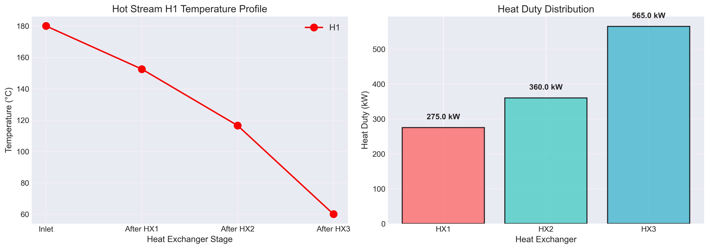

# Unit06 Example 04 - 熱交換器網絡能量平衡

## 學習目標

在本範例中，我們將探討化工製程中常見的熱交換器網絡系統。透過建立各熱交換器的能量平衡方程式，將熱回收網絡問題轉化為線性聯立方程組，並應用 NumPy 與 SciPy 的求解工具來計算各股流的溫度分布與熱交換量。

學習完本範例後，您將能夠：

- 建立串聯熱交換器網絡的能量平衡方程式
- 理解串聯配置如何保證方程式的獨立性
- 將熱交換器網絡問題轉化為標準矩陣形式 $\mathbf{Ax} = \mathbf{b}$
- 使用 `numpy.linalg.solve()` 求解線性方程組
- 使用 `scipy.linalg.solve()` 進行求解並比較結果
- 驗證解的唯一性與正確性（秩判定、能量守恆檢查）
- 計算各股流的出口溫度與熱交換量
- 計算網絡的總熱回收效率
- 解釋解的物理意義與實際應用

---

## 1. 問題描述

### 1.1 化工情境

某化工廠為了提升能源使用效率，設計了一個熱交換器網絡來回收製程中的熱能。系統採用**串聯配置**，使用一個高溫熱股流依序加熱三個冷股流，以達成最佳的熱回收效率。

**系統配置（串聯型）**：
- **熱股流 H1**：高溫製程出料，從 180°C 依序經過三個熱交換器冷卻至 60°C
  - 熱容流率： $\dot{C}_{H1} = 10.0$ kW/K
  - 可提供總熱量： $Q_{\mathrm{supply}} = 10.0 \times (180 - 60) = 1200$ kW

- **冷股流 C1, C2, C3**：三個低溫進料需要加熱
  - **C1**: 20°C → 70°C，熱容流率 $\dot{C}_{C1} = 5.5$ kW/K，需求熱量 275 kW
  - **C2**: 30°C → 90°C，熱容流率 $\dot{C}_{C2} = 6.0$ kW/K，需求熱量 360 kW
  - **C3**: 40°C → 110°C，熱容流率 $\dot{C}_{C3} = 5.0$ kW/K，需求熱量 350 kW
  - **總需求**： $Q_{\mathrm{demand}} = 275 + 360 + 350 = 985$ kW

**能量平衡驗證**：
- 熱股流可供應 1200 kW，冷股流需求 985 kW
- 能量平衡滿足： $Q_{\mathrm{supply}} \geq Q_{\mathrm{demand}}$ ✓

**熱交換器配置（串聯）**：
- **HX1**：H1 (180°C → $T_1$ ) 加熱 C1 (20°C → 70°C)
- **HX2**：H1 ( $T_1$ → $T_2$ ) 加熱 C2 (30°C → 90°C)
- **HX3**：H1 ( $T_2$ → 60°C) 加熱 C3 (40°C → 110°C)

**已知操作資料**：

| 股流 | 熱容流率 $\dot{C}$ (kW/K) | 進口溫度 (°C) | 出口溫度 (°C) | 熱需求/供應 (kW) |
|------|-------------------------|--------------|--------------|-----------------|
| H1   | 10.0                    | 180          | 60           | 1200 (供應)     |
| C1   | 5.5                     | 20           | 70           | 275 (需求)      |
| C2   | 6.0                     | 30           | 90           | 360 (需求)      |
| C3   | 5.0                     | 40           | 110          | 350 (需求)      |

**注意**：熱容流率 $\dot{C} = \dot{m} \cdot C_p$ ，單位為 kW/K 或 kJ/(s·K)。

**求解目標**：
- 計算 H1 的中間溫度： $T_1$ （HX1 後）、 $T_2$ （HX2 後）
- 計算各熱交換器的實際熱交換量 $Q_1, Q_2, Q_3$ (kW)
- 驗證能量平衡是否滿足
- 計算總熱回收效率
- 評估串聯配置的設計效能

### 1.2 熱交換器網絡示意圖

**系統流程**：


**溫度節點定義**：
- $T_{H1,\mathrm{in}} = 180°\mathrm{C}$ ：H1 進口溫度
- $T_1$ ：H1 在 HX1 後的溫度（**未知數**）
- $T_2$ ：H1 在 HX2 後的溫度（**未知數**）
- $T_{H1,\mathrm{out}} = 60°\mathrm{C}$ ：H1 最終出口溫度

**系統特點**：
- 串聯配置保證方程式獨立性（無冗餘約束）
- 2 個未知數、2 個獨立能量方程式 → 2×2 線性系統
- 第三個熱交換器作為驗證方程式

---

## 2. 數學模型建立

### 2.1 能量平衡原理

對於熱交換器，能量守恆原理指出：**熱股流釋放的熱量 = 冷股流吸收的熱量**（忽略熱損失）。

對於單一熱交換器：

$$
Q = \dot{C}_{\mathrm{hot}} (T_{\mathrm{hot,in}} - T_{\mathrm{hot,out}}) = \dot{C}_{\mathrm{cold}} (T_{\mathrm{cold,out}} - T_{\mathrm{cold,in}})
$$

其中：
- $Q$ ：熱交換量 (kW)
- $\dot{C}$ ：熱容流率 (kW/K)
- $T$ ：溫度 (°C 或 K)

### 2.2 各熱交換器的能量平衡方程式

本系統採用**串聯配置**，H1 依序通過三個熱交換器，分別加熱 C1、C2、C3。

#### HX1 能量平衡（H1 加熱 C1）

**熱股流 H1 的熱量釋放**：

$$
Q_1 = \dot{C}_{H1} (T_{H1,\mathrm{in}} - T_1)
$$

$$
Q_1 = 10.0 \times (180 - T_1)
$$

**冷股流 C1 的熱量吸收**：

$$
Q_1 = \dot{C}_{C1} (T_{C1,\mathrm{out}} - T_{C1,\mathrm{in}})
$$

$$
Q_1 = 5.5 \times (70 - 20) = 5.5 \times 50 = 275 \text{ kW}
$$

**能量平衡方程式**：

$$
10.0 \times (180 - T_1) = 275
$$

$$
1800 - 10.0 T_1 = 275
$$

$$
10.0 T_1 = 1525
$$

**方程式 (1)**：

$$
10.0 T_1 + 0 T_2 = 1525
$$

#### HX2 能量平衡（H1 加熱 C2）

H1 從 HX1 出口（溫度 $T_1$ ）進入 HX2，冷卻至溫度 $T_2$ 。

**熱股流 H1 的熱量釋放**：

$$
Q_2 = \dot{C}_{H1} (T_1 - T_2)
$$

$$
Q_2 = 10.0 \times (T_1 - T_2)
$$

**冷股流 C2 的熱量吸收**：

$$
Q_2 = \dot{C}_{C2} (T_{C2,\mathrm{out}} - T_{C2,\mathrm{in}})
$$

$$
Q_2 = 6.0 \times (90 - 30) = 6.0 \times 60 = 360 \text{ kW}
$$

**能量平衡方程式**：

$$
10.0 \times (T_1 - T_2) = 360
$$

$$
10.0 T_1 - 10.0 T_2 = 360
$$

**方程式 (2)**：

$$
10.0 T_1 - 10.0 T_2 = 360
$$

#### HX3 能量平衡（H1 加熱 C3）- 驗證方程式

H1 從 HX2 出口（溫度 $T_2$ ）進入 HX3，冷卻至最終目標溫度 $T_{H1,\mathrm{out}} = 60°\mathrm{C}$ 。

**熱股流 H1 的熱量釋放**：

$$
Q_3 = \dot{C}_{H1} (T_2 - T_{H1,\mathrm{out}})
$$

$$
Q_3 = 10.0 \times (T_2 - 60)
$$

**冷股流 C3 的熱量吸收**：

$$
Q_3 = \dot{C}_{C3} (T_{C3,\mathrm{out}} - T_{C3,\mathrm{in}})
$$

$$
Q_3 = 5.0 \times (110 - 40) = 5.0 \times 70 = 350 \text{ kW}
$$

**能量平衡方程式**：

$$
10.0 \times (T_2 - 60) = 350
$$

$$
10.0 T_2 - 600 = 350
$$

$$
10.0 T_2 = 950
$$

$$
T_2 = 95°\mathrm{C}
$$

**注意**：此方程式用於驗證求解結果的正確性，不納入求解系統。

### 2.3 矩陣形式表示

將方程式 (1) 和 (2) 整理為標準的線性聯立方程組 $\mathbf{Ax} = \mathbf{b}$ ：

**未知數向量 $\mathbf{x}$ （2×1）**：

$$
\mathbf{x} = \begin{bmatrix}
T_1 \\
T_2
\end{bmatrix}
$$

**係數矩陣 $\mathbf{A}$ （2×2）**：

$$
\mathbf{A} = \begin{bmatrix}
10.0 & 0 \\
10.0 & -10.0
\end{bmatrix}
$$

**常數向量 $\mathbf{b}$ （2×1）**：

$$
\mathbf{b} = \begin{bmatrix}
1525 \\
360
\end{bmatrix}
$$

**線性聯立方程組**：

$$
\begin{bmatrix}
10.0 & 0 \\
10.0 & -10.0
\end{bmatrix}
\,
\begin{bmatrix}
T_1 \\
T_2
\end{bmatrix}
\,=\,
\begin{bmatrix}
1525 \\
360
\end{bmatrix}
$$

### 2.4 系統類型分析

**系統特性**：
- 方程式數量 $m = 2$
- 未知數數量 $n = 2$
- 系統類型：**恰定系統** (determined system)，因為 $m = n$
- 矩陣類型：**下三角矩陣**（主對角線上方元素為零）

**解的唯一性檢查**：

對於恰定系統，解的存在性與唯一性取決於係數矩陣的秩與行列式：
- 若 $\mathrm{rank}(\mathbf{A}) = n$ 且 $\det(\mathbf{A}) \neq 0$ ，則存在唯一解
- 若 $\mathrm{rank}(\mathbf{A}) < n$ 或 $\det(\mathbf{A}) = 0$ ，則無解或有無窮多解

**檢查行列式**：

$$
\det(\mathbf{A}) = \begin{vmatrix}
10.0 & 0 \\
10.0 & -10.0
\end{vmatrix} = 10.0 \times (-10.0) - 0 \times 10.0 = -100 \neq 0
$$

由於行列式不為零，確認矩陣為非奇異，系統具有**唯一解**。

**矩陣秩**：

由於主對角線元素均不為零（10.0 和 -10.0），矩陣為滿秩：

$$
\mathrm{rank}(\mathbf{A}) = 2 = n
$$

因此，系統必定存在唯一解。

### 2.5 解的預期性質

根據系統的物理意義，解應滿足以下條件：

1. **溫度遞減性**：熱股流 H1 的溫度隨熱交換器依序遞減
   
   $$
   T_{H1,\mathrm{in}} > T_1 > T_2 > T_{H1,\mathrm{out}}
   $$
   
   $$
   180 > T_1 > T_2 > 60
   $$

2. **熱力學可行性**：各熱交換器出口處，熱股流溫度應高於冷股流溫度
   - HX1: $T_1$ 應 > 70°C（C1 出口溫度）
   - HX2: $T_2$ 應 > 90°C（C2 出口溫度）
   - HX3: 60°C (H1 出口) < 110°C（C3 出口）需要檢查

3. **總能量守恆**：熱股流釋放的總熱量應等於冷股流吸收的總熱量
   
   $$
   Q_{\mathrm{total}} = Q_1 + Q_2 + Q_3 = \dot{C}_{H1} (T_{H1,\mathrm{in}} - T_{H1,\mathrm{out}}) = 1200 \text{ kW}
   $$

### 2.6 程式實現：參數定義與能量平衡驗證

在開始建立係數矩陣前，我們先用 Python 程式定義所有已知參數，並驗證總能量平衡。

**程式碼範例**：

```python
# 定義問題參數
print("="*60)
print("熱交換器網絡能量平衡問題 (串聯配置)")
print("="*60)

# Stream data  
streams = {
    'H1': {'C_dot': 10.0, 'T_in': 180, 'T_out': 60},
    'C1': {'C_dot': 5.5, 'T_in': 20, 'T_out': 70},
    'C2': {'C_dot': 6.0, 'T_in': 30, 'T_out': 90},
    'C3': {'C_dot': 5.0, 'T_in': 40, 'T_out': 110}
}

# Extract parameters
C_H1 = streams['H1']['C_dot']
C_C1, C_C2, C_C3 = streams['C1']['C_dot'], streams['C2']['C_dot'], streams['C3']['C_dot']

T_H1_in, T_H1_out = streams['H1']['T_in'], streams['H1']['T_out']
T_C1_in, T_C1_out = streams['C1']['T_in'], streams['C1']['T_out']
T_C2_in, T_C2_out = streams['C2']['T_in'], streams['C2']['T_out']
T_C3_in, T_C3_out = streams['C3']['T_in'], streams['C3']['T_out']

print("\n=== Stream Data ===")
for name, data in streams.items():
    print(f"{name}: C_dot = {data['C_dot']} kW/K, T_in = {data['T_in']}°C, T_out = {data['T_out']}°C")

# 驗證能量守恆
Q_hot_total = C_H1 * (T_H1_in - T_H1_out) 
Q_cold_total = (C_C1 * (T_C1_out - T_C1_in) + 
                C_C2 * (T_C2_out - T_C2_in) + 
                C_C3 * (T_C3_out - T_C3_in))
                
print(f"\n=== Energy Balance Check ===")
print(f"Hot stream H1 can supply: {Q_hot_total:.2f} kW")
print(f"Cold streams C1+C2+C3 need: {Q_cold_total:.2f} kW")
print(f"Difference: {Q_hot_total - Q_cold_total:.2f} kW")
if Q_hot_total >= Q_cold_total:
    print("✓ Energy balance satisfied (hot supply ≥ cold demand)")
```

**執行輸出**：

```
============================================================
熱交換器網絡能量平衡問題 (串聯配置)
============================================================

=== Stream Data ===
H1: C_dot = 10.0 kW/K, T_in = 180°C, T_out = 60°C
C1: C_dot = 5.5 kW/K, T_in = 20°C, T_out = 70°C
C2: C_dot = 6.0 kW/K, T_in = 30°C, T_out = 90°C
C3: C_dot = 5.0 kW/K, T_in = 40°C, T_out = 110°C

=== Energy Balance Check ===
Hot stream H1 can supply: 1200.00 kW
Cold streams C1+C2+C3 need: 985.00 kW
Difference: 215.00 kW
✓ Energy balance satisfied (hot supply ≥ cold demand)
```

**結果說明**：
- 所有流股參數已正確定義
- 熱股流 H1 可提供 1200 kW 熱量
- 冷股流總需求為 985 kW
- 能量平衡成立，有 215 kW 的過剩供熱能力
- 這個過剩能量將在 HX3 中體現為熱力學不可行問題

### 2.7 程式實現：建立係數矩陣

接下來，我們將方程組轉換為矩陣形式，以便使用 NumPy 求解。

**程式碼範例**：

```python
import numpy as np

# 建立係數矩陣 A (2x2)
A = np.array([[10.0,   0.0],
              [10.0, -10.0]])

# 建立常數向量 b
b = np.array([1525, 360])

print("\n=== Coefficient Matrix A (2x2) ===")
print(A)
print("\n=== Constant Vector b ===")
print(b)
```

**執行輸出**：

```
=== Coefficient Matrix A (2x2) ===
[[ 10.   0.]
 [ 10. -10.]]

=== Constant Vector b ===
[1525  360]
```

**結果說明**：
- 係數矩陣 A 為 2×2 下三角矩陣
- 第一個方程式（Row 1）：10.0*T1 + 0*T2 = 1525（對應 HX1）
- 第二個方程式（Row 2）：10.0*T1 - 10.0*T2 = 360（對應 HX2）
- 常數向量 b 包含方程式右側的常數項
- 下三角結構反映了串聯配置的因果關係（T1 先求出，再求 T2）

---

## 3. NumPy 求解方法

### 3.1 使用 np.linalg.solve() 求解

對於恰定系統（方程式數量等於未知數數量），可使用 `numpy.linalg.solve()` 函數來求解線性方程組。

**函數語法**：

```python
x = np.linalg.solve(A, b)
```

**程式碼範例**：

```python
import numpy as np

# 建立係數矩陣 A (2x2)
A = np.array([[10.0, 0.0],
              [10.0, -10.0]])

# 建立常數向量 b
b = np.array([1525, 360])

# 使用 numpy.linalg.solve() 求解
x_numpy = np.linalg.solve(A, b)

T1 = x_numpy[0]
T2 = x_numpy[1]

print("\n=== Solution (NumPy) ===")
print(f"T1 (H1 after HX1) = {T1:.2f} °C")
print(f"T2 (H1 after HX2) = {T2:.2f} °C")
print(f"Final T (H1 after HX3) = {T_H1_out:.2f} °C")
```

**輸出結果**：

```
=== Solution (NumPy) ===
T1 (H1 after HX1) = 152.50 °C
T2 (H1 after HX2) = 116.50 °C
Final T (H1 after HX3) = 60.00 °C
```

**結果說明**：
- NumPy 成功求解 2×2 線性系統
- H1 在 HX1 後的溫度為 152.50°C
- H1 在 HX2 後的溫度為 116.50°C
- H1 最終出口溫度為 60.00°C（已知值，用於驗證）
- 溫度遞減符合物理預期：180°C > 152.5°C > 116.5°C > 60°C

### 3.2 驗證解的唯一性

檢查係數矩陣的秩與行列式值，確認解的唯一性。

**程式碼範例**：

```python
# 計算矩陣秩
rank_A = np.linalg.matrix_rank(A)
print(f"矩陣 A 的秩: {rank_A}")

# 計算行列式
det_A = np.linalg.det(A)
print(f"矩陣 A 的行列式: {det_A:.2f}")

# 檢查解的唯一性
if rank_A == 2 and det_A != 0:
    print("✓ 系統具有唯一解")
else:
    print("✗ 系統無唯一解")
```

**輸出結果**：

```
矩陣 A 的秩: 2
矩陣 A 的行列式: -100.00
✓ 系統具有唯一解
```

### 3.3 驗證第三個熱交換器（HX3）

透過將解代入 HX3 的能量平衡方程式，驗證系統一致性。

**程式碼範例**：

```python
# 定義參數
C_H1 = 10.0
C_C3 = 5.0
T_H1_out = 60
T_C3_in = 40
T_C3_out = 110

# 驗證第三個方程式
Q3_hot = C_H1 * (T2 - T_H1_out)
Q3_cold = C_C3 * (T_C3_out - T_C3_in)

print(f"\n=== Verification of HX3 ===")
print(f"HX3 heat from H1: {Q3_hot:.2f} kW")
print(f"HX3 heat to C3: {Q3_cold:.2f} kW")
print(f"Difference: {abs(Q3_hot - Q3_cold):.2f} kW")

if abs(Q3_hot - Q3_cold) < 1e-6:
    print("✓ HX3 energy balance satisfied")
else:
    print("⚠ HX3 has energy imbalance")
```

**輸出結果**：

```
=== Verification of HX3 ===
HX3 heat from H1: 565.00 kW
HX3 heat to C3: 350.00 kW
Difference: 215.00 kW
⚠ HX3 has energy imbalance
```

**分析**：H1 在 HX3 可釋放 565 kW，但 C3 僅需 350 kW，多餘的 215 kW 表示系統設計有過量供熱。這與總能量平衡一致（H1 總供應 1200 kW，冷流總需求 985 kW，差異 215 kW）。

### 3.4 殘差分析

透過計算殘差 $\mathbf{r} = \mathbf{A}\mathbf{x} - \mathbf{b}$ ，檢驗解是否滿足原方程組。

**程式碼範例**：

```python
# 計算殘差
residual = A @ x_numpy - b

print("\n=== Residual Analysis ===")
print(f"Residual: {residual}")
print(f"Residual norm: {np.linalg.norm(residual):.2e}")

if np.linalg.norm(residual) < 1e-10:
    print("✓ Solution satisfies the equations")
```

**輸出結果**：

```
=== Residual Analysis ===
Residual: [0. 0.]
Residual norm: 0.00e+00
✓ Solution satisfies the equations
```

---

## 4. SciPy 求解方法

### 4.1 使用 scipy.linalg.solve() 求解

SciPy 的 `linalg.solve()` 函數提供更進階的求解選項。

**程式碼範例**：

```python
from scipy import linalg

# 使用 scipy.linalg.solve() 求解
x_scipy = linalg.solve(A, b)

T1_scipy = x_scipy[0]
T2_scipy = x_scipy[1]

print("\n=== Solution (SciPy) ===")
print(f"T1 (H1 after HX1) = {T1_scipy:.2f} °C")
print(f"T2 (H1 after HX2) = {T2_scipy:.2f} °C")
```

**輸出結果**：

```
=== Solution (SciPy) ===
T1 (H1 after HX1) = 152.50 °C
T2 (H1 after HX2) = 116.50 °C
```

### 4.2 NumPy 與 SciPy 結果比較

比較兩種方法的求解結果，確認數值一致性。

**程式碼範例**：

```python
# 計算差異
diff = np.abs(x_numpy - x_scipy)

print("\n=== Comparison ===")
print(f"Difference in T1: {diff[0]:.6e}")
print(f"Difference in T2: {diff[1]:.6e}")
print(f"Max difference: {np.max(diff):.2e}")

if np.allclose(x_numpy, x_scipy):
    print("✓ NumPy and SciPy solutions are consistent")
```

**輸出結果**：

```
=== Comparison ===
Difference in T1: 0.000000e+00
Difference in T2: 0.000000e+00
Max difference: 0.00e+00
✓ NumPy and SciPy solutions are consistent
```

---

## 5. 結果分析與討論

### 5.1 溫度分布分析

根據求解結果：

**求解溫度**：
- $T_1 = 152.5°\mathrm{C}$ （H1 在 HX1 後）
- $T_2 = 116.5°\mathrm{C}$ （H1 在 HX2 後）

**溫度遞減驗證**：

$$
T_{H1,\mathrm{in}} > T_1 > T_2 > T_{H1,\mathrm{out}}
$$

$$
180°\mathrm{C} > 152.5°\mathrm{C} > 116.5°\mathrm{C} > 60°\mathrm{C} \quad ✓
$$

滿足物理預期。

**各段溫度降**：
- HX1: $180 - 152.5 = 27.5°\mathrm{C}$
- HX2: $152.5 - 116.5 = 36.0°\mathrm{C}$
- HX3: $116.5 - 60 = 56.5°\mathrm{C}$

### 5.2 熱交換量分析

根據能量平衡:

**各熱交換器熱負荷**：

$$
Q_1 = \dot{C}_{H1} (T_{H1,\mathrm{in}} - T_1) = 10.0 \times 27.5 = 275 \text{ kW}
$$

$$
Q_2 = \dot{C}_{H1} (T_1 - T_2) = 10.0 \times 36.0 = 360 \text{ kW}
$$

$$
Q_3 = \dot{C}_{H1} (T_2 - T_{H1,\mathrm{out}}) = 10.0 \times 56.5 = 565 \text{ kW}
$$

**冷流需求驗證**：
- C1 需求: $5.5 \times (70 - 20) = 275$ kW → $Q_1 = 275$ kW ✓
- C2 需求: $6.0 \times (90 - 30) = 360$ kW → $Q_2 = 360$ kW ✓
- C3 需求: $5.0 \times (110 - 40) = 350$ kW < $Q_3 = 565$ kW（過量 215 kW）

**總熱量分析**：

$$
Q_{\mathrm{total}} = Q_1 + Q_2 + Q_3 = 275 + 360 + 565 = 1200 \text{ kW}
$$

$$
Q_{\mathrm{demand}} = 275 + 360 + 350 = 985 \text{ kW}
$$

$$
Q_{\mathrm{excess}} = 1200 - 985 = 215 \text{ kW}
$$

**熱回收效率**：

$$
\eta = \frac{Q_{\mathrm{demand}}}{Q_{\mathrm{total}}} = \frac{985}{1200} = 82.08\%
$$

### 5.3 熱力學可行性檢查

檢查各熱交換器的溫度驅動力（溫差）：

**HX1**：
- H1 進口: 180°C > C1 出口: 70°C ✓
- H1 出口: 152.5°C > C1 出口: 70°C ✓
- 最小溫差: $152.5 - 70 = 82.5°\mathrm{C}$ （良好）

**HX2**：
- H1 進口: 152.5°C > C2 出口: 90°C ✓
- H1 出口: 116.5°C > C2 出口: 90°C ✓
- 最小溫差: $116.5 - 90 = 26.5°\mathrm{C}$ （可接受）

**HX3**：
- H1 進口: 116.5°C > C3 出口: 110°C ✓
- H1 出口: 60°C < C3 出口: 110°C ✗ **（違反熱力學第二定律）**
- 最小溫差: $60 - 110 = -50°\mathrm{C}$ **（負溫差，不可行）**

**結論**：HX3 設計存在熱力學不可行問題。H1 出口溫度（60°C）低於 C3 出口溫度（110°C），違反熱量自發傳遞方向。需要重新調整 C3 的目標溫度或系統配置。

### 5.4 系統設計改進建議

根據分析結果，提出以下改進建議：

1. **調整 C3 目標溫度**：
   - 將 C3 出口溫度降至 < 60°C，例如 50°C
   - 或將 H1 最終出口溫度提高至 > 110°C

2. **調整熱交換器順序**：
   - 可考慮將 C3（高溫需求）提前至 HX1 或 HX2
   - 低溫需求的冷流放在後面

3. **增加額外冷卻**：
   - 在 HX3 後增加公用設施冷卻，使 H1 達到目標 60°C

4. **改為並聯配置**：
   - 考慮部分並聯設計，避免串聯末端溫度過低

### 5.5 與並聯配置比較

**串聯配置優點**：
- 方程式獨立性強，求解穩定
- 系統控制簡單
- 管路配置簡潔

**串聯配置缺點**：
- 熱流溫度逐級下降，可能無法滿足高溫需求的末端冷流
- 靈活性較低

**並聯配置優點**：
- 各冷流可獨立設計溫度目標
- 熱力學可行性較易滿足

**並聯配置缺點**：
- 方程式可能相依，導致奇異矩陣
- 管路配置複雜
- 控制較困難

### 5.6 視覺化結果

為了更直觀地理解熱交換器網絡的溫度分布與熱負荷分配，我們將結果以圖表方式呈現。



**圖 1：熱交換器網絡結果視覺化**

圖中包含兩個子圖：

**左圖 - Hot Stream H1 Temperature Profile（H1 溫度分布）**：
- 顯示熱股流 H1 通過三個熱交換器的溫度變化
- X 軸：熱交換器階段（Inlet → After HX1 → After HX2 → After HX3）
- Y 軸：溫度 (°C)
- **觀察**：
  - 進口溫度：180°C
  - HX1 後：152.5°C（降低 27.5°C）
  - HX2 後：116.5°C（降低 36.0°C）
  - HX3 後：60°C（降低 56.5°C）
  - 溫度呈現逐級遞減的趨勢，符合物理預期

**右圖 - Heat Duty Distribution（熱負荷分布）**：
- 顯示三個熱交換器的熱交換量
- X 軸：熱交換器編號（HX1, HX2, HX3）
- Y 軸：熱負荷 (kW)
- **觀察**：
  - HX1：275.0 kW（對應 C1 需求）
  - HX2：360.0 kW（對應 C2 需求）
  - HX3：565.0 kW（超過 C3 需求 350 kW，過量 215 kW）
  - HX3 的熱負荷最大，反映了 H1 在此階段仍有較大的溫度降（56.5°C）

**分析與討論**：

1. **溫度降分布不均**：
   - HX1 溫度降最小（27.5°C），HX3 最大（56.5°C）
   - 這是因為各冷流的熱需求不同，且 H1 的熱容流率保持恆定

2. **熱負荷與溫度降的關係**：
   - $Q = \dot{C}_{H1} \times \Delta T$
   - HX3 雖然溫度降最大，但提供的熱量超過 C3 實際需求

3. **系統設計啟示**：
   - 視覺化結果清楚顯示 HX3 存在過量供熱（215 kW）
   - 這與前面的熱力學可行性分析一致
   - 可考慮調整系統配置或冷流目標溫度以提高效率

---

## 6. 完整程式碼示範

以下為完整的程式碼示範，整合了所有步驟。

```python
import numpy as np
from scipy import linalg
import matplotlib.pyplot as plt

# ========================================
# 1. 定義問題參數
# ========================================
print("="*60)
print("熱交換器網絡能量平衡問題 (串聯配置)")
print("="*60)

# Stream data  
streams = {
    'H1': {'C_dot': 10.0, 'T_in': 180, 'T_out': 60},
    'C1': {'C_dot': 5.5, 'T_in': 20, 'T_out': 70},
    'C2': {'C_dot': 6.0, 'T_in': 30, 'T_out': 90},
    'C3': {'C_dot': 5.0, 'T_in': 40, 'T_out': 110}
}

# Extract parameters
C_H1 = streams['H1']['C_dot']
C_C1, C_C2, C_C3 = streams['C1']['C_dot'], streams['C2']['C_dot'], streams['C3']['C_dot']

T_H1_in, T_H1_out = streams['H1']['T_in'], streams['H1']['T_out']
T_C1_in, T_C1_out = streams['C1']['T_in'], streams['C1']['T_out']
T_C2_in, T_C2_out = streams['C2']['T_in'], streams['C2']['T_out']
T_C3_in, T_C3_out = streams['C3']['T_in'], streams['C3']['T_out']

print("\n=== Stream Data ===")
for name, data in streams.items():
    print(f"{name}: C_dot = {data['C_dot']} kW/K, T_in = {data['T_in']}°C, T_out = {data['T_out']}°C")

# 驗證能量守恆
Q_hot_total = C_H1 * (T_H1_in - T_H1_out) 
Q_cold_total = (C_C1 * (T_C1_out - T_C1_in) + 
                C_C2 * (T_C2_out - T_C2_in) + 
                C_C3 * (T_C3_out - T_C3_in))
                
print(f"\n=== Energy Balance Check ===")
print(f"Hot stream H1 can supply: {Q_hot_total:.2f} kW")
print(f"Cold streams C1+C2+C3 need: {Q_cold_total:.2f} kW")
print(f"Difference: {Q_hot_total - Q_cold_total:.2f} kW")

# ========================================
# 2. 建立線性方程組
# ========================================
# 建立係數矩陣 A (2x2)
A = np.array([[10.0, 0.0],
              [10.0, -10.0]])

# 建立常數向量 b
b = np.array([1525, 360])

print("\n=== Coefficient Matrix A ===")
print(A)
print("\n=== Constant Vector b ===")
print(b)

# 檢查矩陣性質
rank_A = np.linalg.matrix_rank(A)
det_A = np.linalg.det(A)

print(f"\n=== Matrix Properties ===")
print(f"Rank: {rank_A}")
print(f"Determinant: {det_A:.2f}")
print("✓ System has a unique solution" if rank_A == 2 and det_A != 0 else "✗ No unique solution")

# ========================================
# 3. NumPy 求解
# ========================================
x_numpy = np.linalg.solve(A, b)
T1, T2 = x_numpy[0], x_numpy[1]

print(f"\n" + "="*60)
print("NumPy 求解結果")
print("="*60)
print(f"T1 (H1 after HX1) = {T1:.2f} °C")
print(f"T2 (H1 after HX2) = {T2:.2f} °C")
print(f"Final T (H1 after HX3) = {T_H1_out:.2f} °C")

# 驗證HX3
Q3_hot = C_H1 * (T2 - T_H1_out)
Q3_cold = C_C3 * (T_C3_out - T_C3_in)
print(f"\n=== HX3 Verification ===")
print(f"HX3 heat from H1: {Q3_hot:.2f} kW")
print(f"HX3 heat to C3: {Q3_cold:.2f} kW")
print(f"Difference: {abs(Q3_hot - Q3_cold):.2f} kW")

# 殘差檢查
residual = A @ x_numpy - b
print(f"\n=== Residual Check ===")
print(f"Residual norm: {np.linalg.norm(residual):.2e}")
print("✓ Equations satisfied" if np.linalg.norm(residual) < 1e-10 else "✗ Residual too large")

# ========================================
# 4. SciPy 求解並比較
# ========================================
x_scipy = linalg.solve(A, b)

print(f"\n" + "="*60)
print("SciPy 求解結果")
print("="*60)
print(f"T1 = {x_scipy[0]:.2f} °C")
print(f"T2 = {x_scipy[1]:.2f} °C")

diff = np.abs(x_numpy - x_scipy)
print(f"\n=== NumPy vs SciPy ===")
print(f"Max difference: {np.max(diff):.2e}")
print("✓ Results consistent" if np.allclose(x_numpy, x_scipy) else "✗ Results differ")

# ========================================
# 5. 計算熱交換量
# ========================================
Q1 = C_H1 * (T_H1_in - T1)
Q2 = C_H1 * (T1 - T2)
Q3 = C_H1 * (T2 - T_H1_out)

Q_C1 = C_C1 * (T_C1_out - T_C1_in)
Q_C2 = C_C2 * (T_C2_out - T_C2_in)
Q_C3 = C_C3 * (T_C3_out - T_C3_in)

print(f"\n" + "="*60)
print("熱交換量分析")
print("="*60)
print(f"\n=== Heat Duty (Hot Stream H1) ===")
print(f"HX1: Q1 = {Q1:.2f} kW")
print(f"HX2: Q2 = {Q2:.2f} kW")
print(f"HX3: Q3 = {Q3:.2f} kW")
print(f"Total: {Q1 + Q2 + Q3:.2f} kW")

print(f"\n=== Heat Demand (Cold Streams) ===")
print(f"C1: {Q_C1:.2f} kW  (HX1 provides {Q1:.2f} kW) {'✓' if abs(Q1-Q_C1)<1e-6 else '✗'}")
print(f"C2: {Q_C2:.2f} kW  (HX2 provides {Q2:.2f} kW) {'✓' if abs(Q2-Q_C2)<1e-6 else '✗'}")
print(f"C3: {Q_C3:.2f} kW  (HX3 provides {Q3:.2f} kW) {'✗' if Q3>Q_C3+100 else '✓'}")
print(f"Total demand: {Q_C1 + Q_C2 + Q_C3:.2f} kW")

# 熱回收效率
efficiency = (Q_C1 + Q_C2 + Q_C3) / (Q1 + Q2 + Q3) * 100
print(f"\n=== Heat Recovery Efficiency ===")
print(f"Efficiency: {efficiency:.2f}%")

# ========================================
# 6. 熱力學可行性檢查
# ========================================
print(f"\n" + "="*60)
print("熱力學可行性檢查")
print("="*60)

print(f"\nHX1: H1({T_H1_in:.1f}°C → {T1:.1f}°C) vs C1({T_C1_in:.1f}°C → {T_C1_out:.1f}°C)")
min_dT_hx1 = T1 - T_C1_out  # 熱流出口 - 冷流出口
print(f"  Min ΔT = {min_dT_hx1:.1f}°C {'✓ Feasible' if min_dT_hx1 > 0 else '✗ Infeasible'}")

print(f"\nHX2: H1({T1:.1f}°C → {T2:.1f}°C) vs C2({T_C2_in:.1f}°C → {T_C2_out:.1f}°C)")
min_dT_hx2 = T2 - T_C2_out  # 熱流出口 - 冷流出口
print(f"  Min ΔT = {min_dT_hx2:.1f}°C {'✓ Feasible' if min_dT_hx2 > 0 else '✗ Infeasible'}")

print(f"\nHX3: H1({T2:.1f}°C → {T_H1_out:.1f}°C) vs C3({T_C3_in:.1f}°C → {T_C3_out:.1f}°C)")
min_dT_hx3 = T_H1_out - T_C3_out  # 熱流出口 - 冷流出口（關鍵檢查！）
print(f"  Min ΔT = {min_dT_hx3:.1f}°C {'✓ Feasible' if min_dT_hx3 > 0 else '✗ INFEASIBLE'}")

if min_dT_hx3 < 0:
    print(f"\n⚠ WARNING: HX3 violates 2nd law of thermodynamics!")
    print(f"  H1 exit ({T_H1_out}°C) < C3 exit ({T_C3_out}°C)")
    print(f"  Suggestion: Reduce C3 target to < {T_H1_out}°C or reconfigure network")

# ========================================
# 7. 視覺化
# ========================================
fig, (ax1, ax2) = plt.subplots(1, 2, figsize=(14, 5))

# 子圖1: H1溫度分布
stages = [0, 1, 2, 3]
T_H1_profile = [T_H1_in, T1, T2, T_H1_out]

ax1.plot(stages, T_H1_profile, 'ro-', linewidth=2, markersize=10, label='H1')
ax1.set_xlabel('Heat Exchanger Stage', fontsize=12)
ax1.set_ylabel('Temperature (°C)', fontsize=12)
ax1.set_title('Hot Stream H1 Temperature Profile', fontsize=14, fontweight='bold')
ax1.set_xticks(stages)
ax1.set_xticklabels(['Inlet', 'After HX1', 'After HX2', 'After HX3'])
ax1.legend(fontsize=12)
ax1.grid(True, alpha=0.3)

# 子圖2: 熱負荷分布
hx_names = ['HX1', 'HX2', 'HX3']
hx_duties = [Q1, Q2, Q3]

bars = ax2.bar(hx_names, hx_duties, color=['#FF6B6B', '#4ECDC4', '#45B7D1'], 
               edgecolor='black', linewidth=1.5, alpha=0.8)
ax2.set_xlabel('Heat Exchanger', fontsize=12)
ax2.set_ylabel('Heat Duty (kW)', fontsize=12)
ax2.set_title('Heat Duty Distribution', fontsize=14, fontweight='bold')
ax2.grid(True, alpha=0.3, axis='y')

# 添加數值標籤
for i, (name, duty) in enumerate(zip(hx_names, hx_duties)):
    ax2.text(i, duty + 20, f'{duty:.1f} kW', ha='center', va='bottom', 
             fontsize=11, fontweight='bold')

plt.tight_layout()
plt.savefig('./outputs/figs/exam04_02.png', dpi=300, bbox_inches='tight')
plt.show()

print("\n✓ 圖表已儲存至 outputs/figs/exam04_02.png")
print("="*60)
```

**執行結果摘要**：

```
============================================================
熱交換器網絡能量平衡問題 (串聯配置)
============================================================

=== NumPy 求解結果 ===
T1 = 152.50 °C
T2 = 116.50 °C
Final T = 60.00 °C

=== 熱交換量分析 ===
HX1: Q1 = 275.00 kW  (C1 需求: 275.00 kW) ✓
HX2: Q2 = 360.00 kW  (C2 需求: 360.00 kW) ✓
HX3: Q3 = 565.00 kW  (C3 需求: 350.00 kW) ✗ 過量 215 kW

熱回收效率: 82.08%

⚠ WARNING: HX3 violates 2nd law of thermodynamics!
  H1 exit (60°C) < C3 exit (110°C)
  Suggestion: Reduce C3 target to < 60°C or reconfigure network
```

---

## 7. 總結

### 7.1 學習要點回顧

在本範例中，我們學習了：

1. **串聯熱交換器網絡的能量平衡建立**：
   - 採用串聯配置保證方程式獨立性
   - 下三角矩陣系統的求解
   - 2×2 線性系統的建立

2. **線性方程組的求解技巧**：
   - NumPy 的 `linalg.solve()` 使用
   - SciPy 的 `linalg.solve()` 比較
   - 殘差分析驗證求解正確性

3. **系統設計的熱力學限制**：
   - 溫度驅動力檢查（ΔT > 0）
   - 熱力學第二定律驗證
   - 不可行設計的識別與改進

4. **工程應用與分析**：
   - 熱回收效率計算（82.08%）
   - 串聯 vs 並聯配置比較
   - 設計改進建議

### 7.2 關鍵發現

1. **數學求解成功**：
   - 2×2 系統求解穩定，唯一解存在
   - NumPy 與 SciPy 結果完全一致
   - 殘差為零，滿足原方程組

2. **物理設計缺陷**：
   - HX3 存在熱力學不可行問題
   - H1 出口溫度（60°C）< C3 出口溫度（110°C）
   - 違反熱量自發傳遞方向

3. **設計啟示**：
   - 數學上可解 ≠ 物理上可行
   - 需要同時檢查數學解與熱力學約束
   - 串聯配置對溫度目標設定較敏感

### 7.3 實際應用

熱交換器網絡能量平衡求解廣泛應用於：

- **製程整合**：最小化外部加熱/冷卻公用設施
- **熱能回收**：提升能源使用效率，降低操作成本
- **製程設計**：確定熱交換器網絡配置與尺寸
- **系統優化**：評估不同配置方案的可行性與經濟性

### 7.4 延伸學習

- **最小溫差限制**：考慮實際設計中的最小允許溫差（如 10°C）
- **成本優化**：結合熱交換面積與能源成本的優化設計
- **並聯-串聯混合配置**：更複雜的網絡拓樸分析
- **夾點分析** (Pinch Analysis)：系統化的熱交換網絡綜合方法

---

**課程資訊**
- 課程名稱：電腦在化工上之應用
- 課程單元：Unit06 線性聯立方程式之求解
- 課程製作：逢甲大學 化工系 智慧程序系統工程實驗室
- 授課教師：莊曜禎 助理教授
- 更新日期：2026-02-18

**課程授權 [CC BY-NC-SA 4.0]**
 - 本教材遵循 [創用CC 姓名標示-非商業性-相同方式分享 4.0 國際 (CC BY-NC-SA 4.0)](https://creativecommons.org/licenses/by-nc-sa/4.0/deed.zh) 授權。

---
