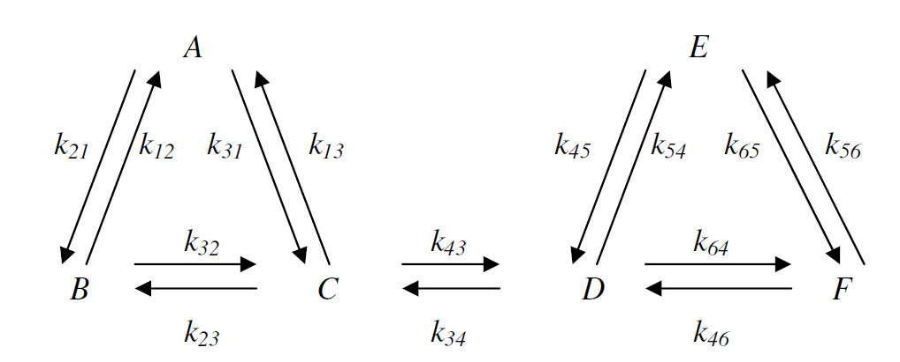
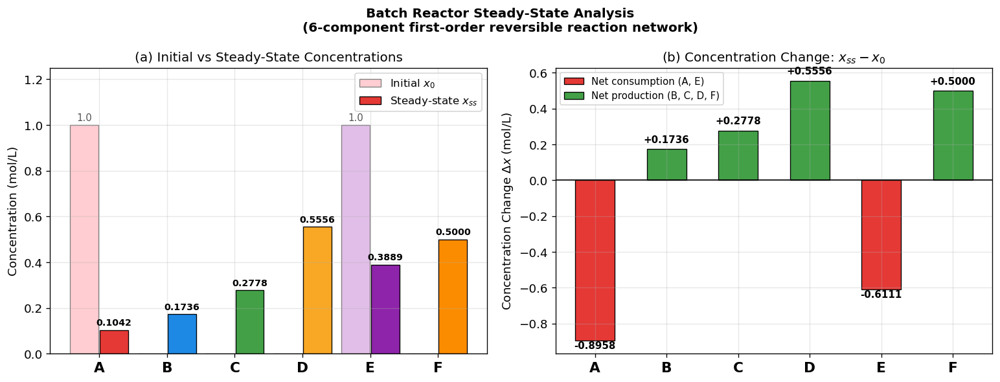

# Unit06_Example_04：批次反應系統之穩態成分分析

## 學習目標

完成本範例後，學生應能：

1. 從一次反應動力學方程式推導穩態線性方程組
2. 分析穩態方程組的係數矩陣為奇異矩陣（ $\text{rank}(\mathbf{A}) < n$ ）的物理原因
3. 使用**總莫耳數守恆**約束補充方程式，使方程組具唯一解
4. 使用 `scipy.linalg.solve()` 求解非對稱稀疏線性方程組
5. 驗證穩態解的物理合理性（濃度非負、總量守恆、動力學殘差）

---

## 目錄

1. [問題描述](#1-問題描述)
2. [數學模型](#2-數學模型)
3. [求解步驟](#3-求解步驟)
   - 步驟一：建立動力學矩陣與穩態方程組
   - 步驟二：奇異性分析與守恆約束
   - 步驟三：`scipy.linalg.solve()` 求解
   - 步驟四：解的驗證
4. [結果視覺化](#4-結果視覺化)
5. [結論](#5-結論)

---

## 1. 問題描述

### 題目：批次反應系統之穩態成分分析

考慮一個批次反應系統，系統中含有六種化學成分 A、B、C、D、E、F，各成分之間發生如下可逆一次反應（Constantinides and Mostoufi, 1999）：

$$
\text{A} \underset{k_{12}}{\stackrel{k_{21}}{\rightleftharpoons}} \text{B}, \quad
\text{A} \underset{k_{13}}{\stackrel{k_{31}}{\rightleftharpoons}} \text{C}, \quad
\text{B} \underset{k_{23}}{\stackrel{k_{32}}{\rightleftharpoons}} \text{C}
$$

$$
\text{C} \underset{k_{34}}{\stackrel{k_{43}}{\rightleftharpoons}} \text{D}, \quad
\text{D} \underset{k_{45}}{\stackrel{k_{54}}{\rightleftharpoons}} \text{E}, \quad
\text{D} \underset{k_{46}}{\stackrel{k_{64}}{\rightleftharpoons}} \text{F}, \quad
\text{E} \underset{k_{56}}{\stackrel{k_{65}}{\rightleftharpoons}} \text{F}
$$

其中速率常數符號 $k_{ij}$ 表示**從成分 $i$ 轉化至成分 $j$** 的一次反應速率常數（min⁻¹）。

**反應網絡圖**



**系統假設**

1. 批次系統（密閉，無進出料），反應在固定溫度與壓力下進行
2. 所有反應均為**一次反應**（first-order reaction），反應速率正比於成分濃度
3. 在該溫度與壓力下，各反應速率常數為定值（如下表）
4. 忽略密度變化，總莫耳濃度守恆

**反應速率常數（min⁻¹）**

| 速率常數 | 反應方向 | 數值 | 速率常數 | 反應方向 | 數值 |
|:-------:|:-------:|:----:|:-------:|:-------:|:----:|
| $k_{21}$ | A → B | 0.20 | $k_{12}$ | B → A | 0.10 |
| $k_{31}$ | A → C | 0.10 | $k_{13}$ | C → A | 0.05 |
| $k_{32}$ | B → C | 0.10 | $k_{23}$ | C → B | 0.05 |
| $k_{43}$ | C → D | 0.20 | $k_{34}$ | D → C | 0.10 |
| $k_{54}$ | D → E | 0.05 | $k_{45}$ | E → D | 0.10 |
| $k_{64}$ | D → F | 0.20 | $k_{46}$ | F → D | 0.20 |
| $k_{65}$ | E → F | 0.10 | $k_{56}$ | F → E | 0.10 |

**各成分起始濃度（mol/L）**

| 成分 | A | B | C | D | E | F |
|:---:|:---:|:---:|:---:|:---:|:---:|:---:|
| $x_i(0)$ | 1.0 | 0 | 0 | 0 | 1.0 | 0 |

總起始莫耳濃度： $x_{total} = 1.0 + 0 + 0 + 0 + 1.0 + 0 = 2.0$ mol/L

**目標**：試計算反應系統達到**穩態（steady state）** 時，各成分 A～F 之濃度。

---

## 2. 數學模型

### 2.1 動力學微分方程組

根據一次反應動力學，對各成分建立濃度對時間之微分方程式：

$$
\frac{dx_1}{dt} = -(k_{21}+k_{31})\,x_1 + k_{12}\,x_2 + k_{13}\,x_3
$$

$$
\frac{dx_2}{dt} = k_{21}\,x_1 - (k_{12}+k_{32})\,x_2 + k_{23}\,x_3
$$

$$
\frac{dx_3}{dt} = k_{31}\,x_1 + k_{32}\,x_2 - (k_{13}+k_{23}+k_{43})\,x_3 + k_{34}\,x_4
$$

$$
\frac{dx_4}{dt} = k_{43}\,x_3 - (k_{34}+k_{54}+k_{64})\,x_4 + k_{45}\,x_5 + k_{46}\,x_6
$$

$$
\frac{dx_5}{dt} = k_{54}\,x_4 - (k_{45}+k_{65})\,x_5 + k_{56}\,x_6
$$

$$
\frac{dx_6}{dt} = k_{64}\,x_4 + k_{65}\,x_5 - (k_{46}+k_{56})\,x_6
$$

整理成矩陣形式 $\dot{\mathbf{x}} = \mathbf{A}_{kin}\mathbf{x}$ ：

$$
\mathbf{A}_{kin} = \begin{bmatrix}
-(k_{21}+k_{31}) & k_{12}           & k_{13}                    & 0                          & 0               & 0              \\
 k_{21}          & -(k_{12}+k_{32}) & k_{23}                    & 0                          & 0               & 0              \\
 k_{31}          & k_{32}           & -(k_{13}+k_{23}+k_{43})   & k_{34}                     & 0               & 0              \\
 0               & 0                & k_{43}                    & -(k_{34}+k_{54}+k_{64})    & k_{45}          & k_{46}         \\
 0               & 0                & 0                         & k_{54}                     & -(k_{45}+k_{65}) & k_{56}        \\
 0               & 0                & 0                         & k_{64}                     & k_{65}          & -(k_{46}+k_{56})
\end{bmatrix}
$$

代入數值後：

$$
\mathbf{A}_{kin} = \begin{bmatrix}
-0.30 &  0.10 &  0.05 &  0    &  0    &  0    \\
 0.20 & -0.20 &  0.05 &  0    &  0    &  0    \\
 0.10 &  0.10 & -0.30 &  0.10 &  0    &  0    \\
 0    &  0    &  0.20 & -0.35 &  0.10 &  0.20 \\
 0    &  0    &  0    &  0.05 & -0.20 &  0.10 \\
 0    &  0    &  0    &  0.20 &  0.10 & -0.30
\end{bmatrix}
$$

> **矩陣結構特徵**：矩陣 $\mathbf{A}_{kin}$ 為**稀疏非對稱矩陣**，且每一**行（column）之和均等於零**，這是封閉系統一次反應動力學矩陣的必然特徵，確保了總莫耳數守恆。

### 2.2 穩態條件：從 ODE 轉化為線性方程組

穩態時，各成分濃度不再隨時間變化（ $\dot{\mathbf{x}} = \mathbf{0}$ ），代入動力學方程組得：

$$
\mathbf{A}_{kin}\,\mathbf{x}_{ss} = \mathbf{0}
$$

這是一個**齊次線性方程組（homogeneous system）**。

### 2.3 奇異性分析：為何需要補充方程式？

由矩陣 $\mathbf{A}_{kin}$ 的行和均為零可知，行向量 $\mathbf{1}^T = [1,1,1,1,1,1]$ 滿足：

$$
\mathbf{1}^T \mathbf{A}_{kin} = \mathbf{0}
$$

即 $\mathbf{A}_{kin}$ 的列（row）空間不包含 $\mathbf{1}$，因此：

$$
\text{rank}(\mathbf{A}_{kin}) = 5 < 6 \quad \Rightarrow \quad \det(\mathbf{A}_{kin}) = 0
$$

**物理意義**：所有成分之總莫耳數守恆是方程組的一個「隱含約束」，導致 6 條方程式中有一條是多餘的（線性相依），方程組有無窮多解。

### 2.4 補充總莫耳數守恆約束

在密閉批次系統中，反應前後總莫耳數不變：

$$
x_1 + x_2 + x_3 + x_4 + x_5 + x_6 = x_{total} = 2.0 \text{ mol/L}
$$

以此**守恆方程式取代 $\mathbf{A}_{kin}$ 的第 6 列**，得到修正後的線性方程組 $\mathbf{A}\mathbf{x} = \mathbf{b}$ ：

$$
\mathbf{A} = \begin{bmatrix}
-0.30 &  0.10 &  0.05 &  0    &  0    &  0    \\
 0.20 & -0.20 &  0.05 &  0    &  0    &  0    \\
 0.10 &  0.10 & -0.30 &  0.10 &  0    &  0    \\
 0    &  0    &  0.20 & -0.35 &  0.10 &  0.20 \\
 0    &  0    &  0    &  0.05 & -0.20 &  0.10 \\
 1    &  1    &  1    &  1    &  1    &  1
\end{bmatrix}, \quad
\mathbf{b} = \begin{bmatrix} 0 \\ 0 \\ 0 \\ 0 \\ 0 \\ 2.0 \end{bmatrix}
$$

**未知數**： $\mathbf{x}_{ss} = [x_A, x_B, x_C, x_D, x_E, x_F]^T$ （mol/L）

---

## 3. 求解步驟

### 步驟一：建立動力學矩陣與穩態方程組

```python
# ========================================
# 反應速率常數 (min⁻¹)
# ========================================
k21=0.20; k12=0.10   # A ↔ B
k31=0.10; k13=0.05   # A ↔ C
k32=0.10; k23=0.05   # B ↔ C
k43=0.20; k34=0.10   # C ↔ D
k54=0.05; k45=0.10   # D ↔ E
k64=0.20; k46=0.20   # D ↔ F
k65=0.10; k56=0.10   # E ↔ F

# ========================================
# 動力學矩陣 A_kin (6×6)
# ========================================
A_kin = np.array([
    [-(k21+k31),  k12,              k13,                    0,               0,            0          ],
    [  k21,      -(k12+k32),        k23,                    0,               0,            0          ],
    [  k31,       k32,             -(k13+k23+k43),          k34,             0,            0          ],
    [  0,          0,               k43,                   -(k34+k54+k64),   k45,          k46        ],
    [  0,          0,               0,                      k54,            -(k45+k65),    k56        ],
    [  0,          0,               0,                      k64,             k65,         -(k46+k56)  ]
])

# 起始濃度與總莫耳數
x0 = np.array([1.0, 0.0, 0.0, 0.0, 1.0, 0.0])
x_total = x0.sum()   # = 2.0 mol/L

print("動力學矩陣 A_kin (6×6)：")
print(A_kin)
print(f"\n起始濃度 x0 = {x0}  (mol/L)")
print(f"總莫耳數 x_total = {x_total} mol/L")
```

**執行結果：**

```
動力學矩陣 A_kin (6×6)：
[[-0.3   0.1   0.05  0.    0.    0.  ]
 [ 0.2  -0.2   0.05  0.    0.    0.  ]
 [ 0.1   0.1  -0.3   0.1   0.    0.  ]
 [ 0.    0.    0.2  -0.35  0.1   0.2 ]
 [ 0.    0.    0.    0.05 -0.2   0.1 ]
 [ 0.    0.    0.    0.2   0.1  -0.3 ]]

起始濃度 x0 = [1. 0. 0. 0. 1. 0.]  (mol/L)
總莫耳數 x_total = 2.0 mol/L
```

### 步驟二：奇異性分析與守恆約束

```python
n = len(x0)

# ========================================
# 分析原始動力學矩陣 A_kin
# ========================================
rank_kin = np.linalg.matrix_rank(A_kin)
det_kin  = np.linalg.det(A_kin)
eigvals  = np.linalg.eigvals(A_kin)

print("=" * 52)
print("  原始動力學矩陣 A_kin 分析")
print("=" * 52)
print(f"  未知數個數 n          = {n}")
print(f"  rank(A_kin)           = {rank_kin}")
print(f"  det(A_kin)            = {det_kin:.4e}  （理論值 = 0，浮點精度誤差）")
print(f"  特徵值（排序）：")
for i, ev in enumerate(sorted(eigvals.real, reverse=True)):
    marker = '  ← 零特徵值（對應守恆律）' if abs(ev) < 1e-12 else ''
    print(f"    λ{i+1} = {ev:+.4f}{marker}")
print("-" * 52)
if rank_kin < n:
    print(f"  ✗ A_kin 為奇異矩陣（rank={rank_kin}<{n}）")
    print(f"    齊次方程組 A_kin * x = 0 有無窮多解！")
    print(f"    物理原因：封閉系統總莫耳數守恆使方程組線性相依。")
print()

# ========================================
# 補充守恆約束，建立修正方程組 Ax = b
# 以「x₁+x₂+...+x₆ = 2.0」取代第 6 列
# ========================================
A = A_kin.copy()
b = np.zeros(n)
A[n-1, :] = 1.0       # 守恆方程式係數
b[n-1]    = x_total   # 右側常數 = 2.0 mol/L

rank_A = np.linalg.matrix_rank(A)
det_A  = np.linalg.det(A)
cond_A = np.linalg.cond(A)

print("=" * 52)
print("  修正矩陣 A（補充守恆約束後）分析")
print("=" * 52)
print(f"  rank(A)   = {rank_A}")
print(f"  det(A)    = {det_A:.4e}")
print(f"  κ(A)      = {cond_A:.2f}")
print("-" * 52)
if rank_A == n:
    print(f"  ✓ A 為非奇異矩陣，方程組 Ax = b 有唯一解")
    print(f"    κ(A) = {cond_A:.2f} 在可接受範圍，數值穩定")

print(f"\n修正後右側向量 b = {b}")
```

**執行結果：**

```
====================================================
  原始動力學矩陣 A_kin 分析
====================================================
  未知數個數 n          = 6
  rank(A_kin)           = 5
  det(A_kin)            = 4.1167e-20  （理論值 = 0，浮點精度誤差）
  特徵值（排序）：
    λ1 = -0.0000  ← 零特徵值（對應守恆律）
    λ2 = -0.0701
    λ3 = -0.2542
    λ4 = -0.3521
    λ5 = -0.4000
    λ6 = -0.5736
----------------------------------------------------
  ✗ A_kin 為奇異矩陣（rank=5<6）
    齊次方程組 A_kin * x = 0 有無窮多解！
    物理原因：封閉系統總莫耳數守恆使方程組線性相依。

====================================================
  修正矩陣 A（補充守恆約束後）分析
====================================================
  rank(A)   = 6
  det(A)    = -1.4400e-03
  κ(A)      = 51.62
----------------------------------------------------
  ✓ A 為非奇異矩陣，方程組 Ax = b 有唯一解
    κ(A) = 51.62 在可接受範圍，數值穩定

修正後右側向量 b = [0. 0. 0. 0. 0. 2.]
```

> **關鍵洞察**：條件數 $\kappa(\mathbf{A}) = 51.62$ 在可接受範圍內，表示方程組數值穩定，求解結果可信。

### 步驟三：使用 `scipy.linalg.solve()` 求解

```python
x_ss = linalg.solve(A, b)
names = ['A', 'B', 'C', 'D', 'E', 'F']

print("=" * 54)
print("  穩態濃度求解結果")
print("=" * 54)
print(f"  {'成分':<4} {'x₀ (mol/L)':>12} {'x_ss (mol/L)':>14} {'Δx (mol/L)':>12}")
print("-" * 54)
for name, xi0, xss in zip(names, x0, x_ss):
    print(f"  {name:<4} {xi0:>12.4f} {xss:>14.4f} {xss-xi0:>+12.4f}")
print("-" * 54)
print(f"  {'sum':<4} {x0.sum():>12.4f} {x_ss.sum():>14.4f} {x_ss.sum()-x0.sum():>+12.4f}")
print("=" * 54)
```

**執行結果：**

```
======================================================
  穩態濃度求解結果
======================================================
  成分     x₀ (mol/L)   x_ss (mol/L)   Δx (mol/L)
------------------------------------------------------
  A          1.0000         0.1042      -0.8958
  B          0.0000         0.1736      +0.1736
  C          0.0000         0.2778      +0.2778
  D          0.0000         0.5556      +0.5556
  E          1.0000         0.3889      -0.6111
  F          0.0000         0.5000      +0.5000
------------------------------------------------------
  sum        2.0000         2.0000      +0.0000
======================================================
```

### 步驟四：解的驗證

```python
# ========================================
# 驗證穩態解
# ========================================
print("=" * 58)
print("  解的驗證（Verification）")
print("=" * 58)

# 1. 線性方程組殘差
residual = np.linalg.norm(A @ x_ss - b)
print(f"\n[1] 線性方程組殘差 ||Ax - b||₂ = {residual:.4e}")
print(f"    {'✓ 殘差極小，求解正確' if residual < 1e-10 else '✗ 殘差過大'}")

# 2. 動力學穩態條件驗證
kin_resid = np.linalg.norm(A_kin @ x_ss)
print(f"\n[2] 動力學殘差 ||A_kin · x_ss||₂ = {kin_resid:.4e}")
print(f"    {'✓ 各成分淨反應速率 ≈ 0，確認穩態' if kin_resid < 1e-10 else '✗ 不滿足穩態條件'}")

# 3. 物理合理性
all_pos  = np.all(x_ss >= -1e-12)
total_ok = abs(x_ss.sum() - x_total) < 1e-10
print(f"\n[3] 物理合理性：")
print(f"    各成分濃度 ≥ 0：{'✓' if all_pos else '✗'}  (min = {x_ss.min():.4e})")
print(f"    總莫耳數守恆：Σxᵢ = {x_ss.sum():.8f} mol/L  {'✓' if total_ok else '✗'}")

# 4. 各成分穩態淨反應速率確認
print(f"\n[4] 各成分穩態淨反應速率（A_kin @ x_ss）：")
rates = A_kin @ x_ss
for name, r in zip(names, rates):
    print(f"    d{name}/dt = {r:+.2e} mol/L/min")

print("\n" + "=" * 58)
print("  所有驗證通過！穩態解已確認。")
print("=" * 58)
```

**執行結果：**

```
==========================================================
  解的驗證（Verification）
==========================================================

[1] 線性方程組殘差 ||Ax - b||₂ = 7.9495e-17
    ✓ 殘差極小，求解正確

[2] 動力學殘差 ||A_kin · x_ss||₂ = 8.4201e-17
    ✓ 各成分淨反應速率 ≈ 0，確認穩態

[3] 物理合理性：
    各成分濃度 ≥ 0：✓  (min = 1.0417e-01)
    總莫耳數守恆：Σxᵢ = 2.00000000 mol/L  ✓

[4] 各成分穩態淨反應速率（A_kin @ x_ss）：
    dA/dt = -4.86e-17 mol/L/min
    dB/dt = +5.55e-17 mol/L/min
    dC/dt = +0.00e+00 mol/L/min
    dD/dt = +2.78e-17 mol/L/min
    dE/dt = -1.04e-17 mol/L/min
    dF/dt = -2.78e-17 mol/L/min

==========================================================
  所有驗證通過！穩態解已確認。
==========================================================
```

> 所有驗證指標均達機器精度（ $< 10^{-16}$ ），確認求解完全正確。

---

## 4. 結果視覺化

```python
fig, axes = plt.subplots(1, 2, figsize=(13, 5))

colors_init = ['#FFCDD2', '#BBDEFB', '#C8E6C9', '#FFF9C4', '#E1BEE7', '#FFE0B2']
colors_ss   = ['#E53935', '#1E88E5', '#43A047', '#F9A825', '#8E24AA', '#FB8C00']
comp_labels = ['A', 'B', 'C', 'D', 'E', 'F']
x_pos = np.arange(6)

# ─── 子圖1：初始濃度 vs 穩態濃度 ─────────────────────────────
ax1 = axes[0]
bars1 = ax1.bar(x_pos - 0.22, x0,    width=0.42, color=colors_init,
                edgecolor='gray',  linewidth=0.8, label='Initial $x_0$')
bars2 = ax1.bar(x_pos + 0.22, x_ss,  width=0.42, color=colors_ss,
                edgecolor='black', linewidth=0.8, label='Steady-state $x_{ss}$')
ax1.set_xticks(x_pos)
ax1.set_xticklabels(comp_labels, fontsize=12)
ax1.set_ylabel('Concentration (mol/L)')
ax1.set_title('(a) Initial vs Steady-State Concentrations')
ax1.legend(fontsize=9)
ax1.set_ylim(0, 1.25)
for i, (xi0, xss) in enumerate(zip(x0, x_ss)):
    if xi0 > 0:
        ax1.text(i - 0.22, xi0 + 0.02, f'{xi0:.1f}', ha='center', fontsize=9)
    ax1.text(i + 0.22, xss + 0.02, f'{xss:.4f}', ha='center', fontsize=8, fontweight='bold')

# ─── 子圖2：濃度變化量 Δx ─────────────────────────────────────
ax2 = axes[1]
delta_x = x_ss - x0
bar_colors = ['#E53935' if d < 0 else '#43A047' for d in delta_x]
bars3 = ax2.bar(x_pos, delta_x, width=0.55, color=bar_colors,
                edgecolor='black', linewidth=0.8)
ax2.axhline(0, color='black', linewidth=0.8)
ax2.set_xticks(x_pos)
ax2.set_xticklabels(comp_labels, fontsize=12)
ax2.set_ylabel('Concentration Change $\\Delta x$ (mol/L)')
ax2.set_title('(b) Concentration Change: $x_{ss} - x_0$')
for bar, d in zip(bars3, delta_x):
    offset = 0.02 if d >= 0 else -0.05
    ax2.text(bar.get_x() + bar.get_width()/2, d + offset,
             f'{d:+.4f}', ha='center', va='bottom', fontsize=9, fontweight='bold')

plt.suptitle('Batch Reactor Steady-State Analysis\n'
             '(6-component first-order reversible reaction network)',
             fontsize=12, fontweight='bold')
plt.tight_layout()

fig_path = FIG_DIR / 'batch_reactor_steady_state.png'
plt.savefig(fig_path, dpi=120, bbox_inches='tight')
plt.show()
print(f"\n✓ 圖檔已儲存：{fig_path}")
```

**執行結果：**



```
✓ 圖檔已儲存：d:\MyGit\ChemE-3502\Unit06\outputs\Unit06_Example_04\figs\batch_reactor_steady_state.png
```

**圖形說明：**

- **(a) 初始 vs 穩態濃度**：A 由 1.0 降至 0.1042 mol/L（最大降幅），說明 A 大量轉化為其他成分；E 由 1.0 降至 0.3889 mol/L；B、C、D、F 的初始濃度均為零，穩態時均建立起非零濃度。D 的穩態濃度最高（0.5556 mol/L），為反應網絡中間區段的主要累積成分。
- **(b) 濃度變化量**：A 和 E（紅色）為淨消耗成分，B、C、D、F（綠色）為淨生成成分，總莫耳數守恆使所有變化量之和為零。

---

## 5. 結論

| 項目 | 數值 |
|:----:|:----:|
| $x_A$ （穩態） | 0.1042 mol/L |
| $x_B$ （穩態） | 0.1736 mol/L |
| $x_C$ （穩態） | 0.2778 mol/L |
| $x_D$ （穩態） | 0.5556 mol/L |
| $x_E$ （穩態） | 0.3889 mol/L |
| $x_F$ （穩態） | 0.5000 mol/L |
| $\text{rank}(\mathbf{A}_{kin})$ | 5（奇異，無窮多解） |
| $\text{rank}(\mathbf{A})$ | 6（補充守恆後，唯一解） |
| $\det(\mathbf{A})$ | $-1.44 \times 10^{-3}$ |
| $\kappa(\mathbf{A})$ | 51.62（數值穩定） |
| 殘差 $\|\mathbf{Ax}-\mathbf{b}\|_2$ | $7.95 \times 10^{-17}$ |
| 動力學殘差 $\|\mathbf{A}_{kin}\mathbf{x}_{ss}\|_2$ | $8.42 \times 10^{-17}$ |

本範例示範了**從動力學 ODE 推導穩態線性方程組**的完整流程，揭示了化工問題中自然出現的**奇異矩陣（singular matrix）** 情形：

- **物理根源**：封閉批次系統的總莫耳數守恆，使動力學矩陣 $\mathbf{A}_{kin}$ 的行和為零，造成 $\text{rank} = 5 < 6$
- **數學處理**：以守恆方程式 $\sum x_i = x_{total}$ 取代其中一條相依方程式，使方程組從無窮多解轉變為唯一解
- **推廣意義**：此「以守恆約束補充奇異方程組」的策略，在許多化工問題中普遍適用（如管路網絡、混合槽組、電化學系統）

---

**課程資訊**
- 課程名稱：電腦在化工上之應用
- 課程單元：Unit06 線性聯立方程式之求解 — Example 04
- 課程製作：逢甲大學 化工系 智慧程序系統工程實驗室
- 授課教師：莊曜禎 助理教授
- 更新日期：2026-02-20

**課程授權 [CC BY-NC-SA 4.0]**
 - 本教材遵循 [創用CC 姓名標示-非商業性-相同方式分享 4.0 國際 (CC BY-NC-SA 4.0)](https://creativecommons.org/licenses/by-nc-sa/4.0/deed.zh) 授權。

---
