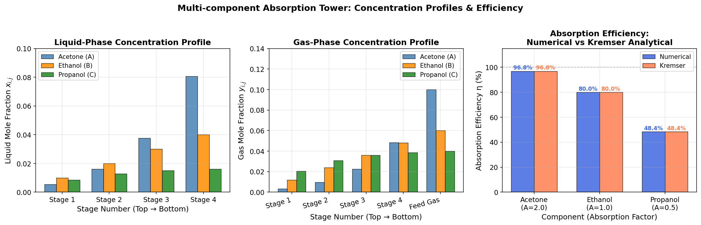

# Unit06_Example_05：化工案例五 — 多成分吸收塔穩態成分分析

## 目標

本範例以一座具有 **N = 4 個理論平衡級** 的多成分吸收塔為對象，透過 Henry 定律（氣液相平衡）與各級穩態物料平衡，推導出三對角線性方程組，並利用 `scipy.linalg.solve()` 求解各級液相濃度分布。

學習目標：

- 理解吸收塔操作原理及氣液相平衡關係（Henry 定律）
- 推導各平衡級物料平衡方程式，建立三對角稀疏線性方程組
- 組合多成分方程組為 block-diagonal 結構，分析矩陣性質（rank、det、條件數）
- 使用 `scipy.linalg.solve()` 求解液相濃度分布
- 驗證數值解與 Kremser 解析解的一致性
- 說明吸收因子 $A_j = L/(Vm_j)$ 對吸收效率的物理意義

---

## §0 前言

吸收（Absorption）是化工分離程序中的重要單元操作，廣泛應用於：
尾氣脫硫、天然氣脫水、廢氣中有機溶劑回收等。
其基本原理是利用**氣液兩相之間的溶解度差異**，使氣相中的特定成分（吸收質）轉移至液相溶劑中。

在穩態操作下，多級吸收塔（填充塔或板式塔）的每一個**理論平衡級**均假設氣液兩相達到**相平衡**，即氣相濃度與液相濃度之間滿足相平衡方程式。對稀溶液系統，常以 **Henry 定律**描述此關係：

$$
y_{i,j} = m_j \, x_{i,j}
$$

其中 $y_{i,j}$ 為第 $i$ 級氣相莫耳分率， $x_{i,j}$ 為第 $i$ 級液相莫耳分率， $m_j$ 為成分 $j$ 的 Henry 常數。

---

## §1 問題描述

### 1.1 系統架構

考慮一座具有 **N = 4 個理論平衡級** 的多成分吸收塔（如下示意圖）：


流體流向：
- **液相**：由頂部向下流動（進入第 1 級，離開第 N 級）
- **氣相**：由底部向上流動（進入第 N 級，離開第 1 級）

### 1.2 操作條件

| 參數 | 符號 | 數值 | 單位 |
|------|------|------|------|
| 理論平衡級數 | N | 4 | — |
| 液相流率（水） | L | 120 | mol/s |
| 氣相流率（混合氣）| V | 100 | mol/s |
| 液相進料（純溶劑）| $x_{0,j}$ | 0 | mol frac |

### 1.3 三成分資料

| 成分 | 英文名稱 | 符號 | Henry 常數 $m_j$ | 進料氣相 $y_{j,\text{in}}$ | 吸收因子 $A_j$ |
|------|----------|------|-----------------|---------------------------|----------------|
| 丙酮 | Acetone  | A    | 0.6             | 0.10                       | 2.00 |
| 乙醇 | Ethanol  | B    | 1.2             | 0.06                       | 1.00 |
| 丙醇 | Propanol | C    | 2.4             | 0.04                       | 0.50 |

**吸收因子** $A_j = \dfrac{L}{V m_j}$ 是衡量吸收性能的關鍵無因次數：
- $A_j > 1$ ：液相有足夠溶解能力，吸收效率高（丙酮 $A = 2.0$ ）
- $A_j = 1$ ：臨界吸收操作（乙醇 $A = 1.0$ ）
- $A_j < 1$ ：液相溶解能力不足，成分傾向留於氣相（丙醇 $A = 0.5$ ）

---

## §2 理論背景

### 2.1 穩態物料平衡

對第 $i$ 級（ $i = 1, 2, \ldots, N$ ），成分 $j$ 的穩態物料平衡方程式（包絡第 $i$ 級）：

$$
L(x_{i,j} - x_{i-1,j}) = V(y_{i+1,j} - y_{i,j})
$$

物理意義：**液相帶入之淨增量 = 氣相被吸收之淨減量**。

### 2.2 代入 Henry 定律

將 $y_{i,j} = m_j x_{i,j}$ 代入物料平衡式：

$$
L(x_{i,j} - x_{i-1,j}) = V(m_j x_{i+1,j} - m_j x_{i,j})
$$

整理後得到關於液相濃度的線性遞推關係：

$$
\boxed{-L\,x_{i-1,j} + (L + Vm_j)\,x_{i,j} - Vm_j\,x_{i+1,j} = 0, \quad i = 1, 2, \ldots, N}
$$

### 2.3 邊界條件

- **塔頂（ $i = 1$ ）**： $x_{0,j} = 0$ （純溶劑進料），使第 1 級方程右端為零
- **塔底（ $i = N$ ）**： $y_{N+1,j} = y_{j,\text{in}}$ （已知進料氣相），使第 N 級方程右端為 $V y_{j,\text{in}}$

### 2.4 Kremser 解析解

對具有 N 個理論板且 Henry 定律成立的吸收塔，Kremser 方程式給出解析解：

$$
\eta_j = \frac{y_{j,\text{in}} - y_{1,j}}{y_{j,\text{in}}} =
\begin{cases}
\dfrac{A_j^{N+1} - A_j}{A_j^{N+1} - 1}, & A_j \neq 1 \\[6pt]
\dfrac{N}{N+1}, & A_j = 1
\end{cases}
$$

此解析解可作為驗證數值解正確性的理論基準。

---

## §3 建立線性方程組

### 3.1 三對角係數矩陣（單一成分）

對成分 $j$ ，N 個方程式寫成矩陣形式 $\mathbf{A}_j \mathbf{x}_j = \mathbf{b}_j$ ：

$$
\underbrace{\begin{bmatrix}
L+Vm_j & -Vm_j &  0     &  0    \\
-L     & L+Vm_j & -Vm_j &  0    \\
 0     & -L    & L+Vm_j & -Vm_j \\
 0     &  0    & -L    & L+Vm_j
\end{bmatrix}}_{\mathbf{A}_j \in \mathbb{R}^{4\times 4}}
\begin{bmatrix} x_{1,j} \\ x_{2,j} \\ x_{3,j} \\ x_{4,j} \end{bmatrix}
=
\begin{bmatrix} 0 \\ 0 \\ 0 \\ V y_{j,\text{in}} \end{bmatrix}
$$

各成分的係數矩陣展開如下（以 L = 120, V = 100 代入）：

**成分 A（丙酮， $m = 0.6$ ， $Vm = 60$ ）：**

$$
\mathbf{A}_A = \begin{bmatrix}
180 & -60  &   0  &   0 \\
-120 & 180 & -60  &   0 \\
 0  & -120  & 180 & -60 \\
 0  &   0  & -120 & 180
\end{bmatrix}, \quad
\mathbf{b}_A = \begin{bmatrix} 0 \\ 0 \\ 0 \\ 10 \end{bmatrix}
$$

**成分 B（乙醇， $m = 1.2$ ， $Vm = 120$ ）：**

$$
\mathbf{A}_B = \begin{bmatrix}
240 & -120 &   0  &   0 \\
-120 & 240 & -120 &   0 \\
 0  & -120 & 240  & -120 \\
 0  &   0  & -120 & 240
\end{bmatrix}, \quad
\mathbf{b}_B = \begin{bmatrix} 0 \\ 0 \\ 0 \\ 6 \end{bmatrix}
$$

**成分 C（丙醇， $m = 2.4$ ， $Vm = 240$ ）：**

$$
\mathbf{A}_C = \begin{bmatrix}
360 & -240 &   0  &   0 \\
-120 & 360 & -240 &   0 \\
 0  & -120 & 360  & -240 \\
 0  &   0  & -120 & 360
\end{bmatrix}, \quad
\mathbf{b}_C = \begin{bmatrix} 0 \\ 0 \\ 0 \\ 4 \end{bmatrix}
$$

### 3.2 合併為 block-diagonal 方程組（三成分）

由於各成分之間在 Henry 定律下相互獨立，可將三個 $4 \times 4$ 的方程組合併為一個 $12 \times 12$ 的 block-diagonal 矩陣系統：

$$
\mathbf{A}_{\text{all}} = \begin{bmatrix}
\mathbf{A}_A & \mathbf{0} & \mathbf{0} \\
\mathbf{0} & \mathbf{A}_B & \mathbf{0} \\
\mathbf{0} & \mathbf{0} & \mathbf{A}_C
\end{bmatrix} \in \mathbb{R}^{12 \times 12}, \quad
\mathbf{b}_{\text{all}} = \begin{bmatrix} \mathbf{b}_A \\ \mathbf{b}_B \\ \mathbf{b}_C \end{bmatrix}
$$

使用 `scipy.linalg.block_diag()` 函式可方便地組合 block-diagonal 矩陣。

### 3.3 矩陣性質分析

執行程式後得到各矩陣的性質：

| 矩陣 | rank | det | 條件數 $\kappa$ |
|------|------|-----|----------------|
| $\mathbf{A}_A$ | 4 | $4.02 \times 10^{8}$ | 8.44 |
| $\mathbf{A}_B$ | 4 | $1.04 \times 10^{9}$ | 9.47 |
| $\mathbf{A}_C$ | 4 | $6.43 \times 10^{9}$ | 8.44 |
| $\mathbf{A}_{\text{all}}$ | **12** | $2.68 \times 10^{27}$ | **16.89** |

> **重要觀察**：所有成分的三對角矩陣均為**全秩（full rank）**、**非奇異**（ $\det \neq 0$ ），且條件數 $\kappa < 17$ ，屬於**良態（well-conditioned）**系統，可獲得機器精度的數值解。

---

## §4 程式演練

### 4.1 環境設定與套件載入

```python
from pathlib import Path
import os

UNIT_OUTPUT_DIR = 'Unit06_Example_05'
# ... (路徑設定，兼容 Colab 與 Local)
```

```python
import numpy as np
import matplotlib.pyplot as plt
import scipy.linalg
import warnings
warnings.filterwarnings('ignore')

plt.rcParams.update({
    'figure.dpi': 100, 'axes.grid': True, 'grid.alpha': 0.3,
    'font.size': 11, 'axes.titlesize': 13, 'axes.labelsize': 12,
    'legend.fontsize': 10, 'lines.linewidth': 2, 'axes.unicode_minus': False,
})
print("✓ 套件載入完成")
# numpy 版本: 1.23.5 | scipy 版本: 1.15.2 | matplotlib 版本: 3.10.8
```

### 4.2 問題參數設定

```python
N = 4           # 平衡級數
L = 120.0       # 液相流率 (mol/s)
V = 100.0       # 氣相流率 (mol/s)
names = ['Acetone (A)', 'Ethanol (B)', 'Propanol (C)']
C = len(names)
m     = np.array([0.6, 1.2, 2.4])      # Henry 常數
y_in  = np.array([0.10, 0.06, 0.04])   # 進料氣相莫耳分率
x0    = np.zeros(C)                     # 純溶劑 x_0 = 0
A_factor = L / (V * m)                  # 吸收因子
```

執行輸出：
```
=======================================================
  多成分吸收塔參數摘要
=======================================================
  平衡級數 N = 4
  液相流率 L = 120.0 mol/s
  氣相流率 V = 100.0 mol/s
  L/V = 1.20

成分                          m_j     y_in   A_j = L/Vm
-------------------------------------------------------
  Acetone (A)              0.60   0.1000       2.0000
  Ethanol (B)              1.20   0.0600       1.0000
  Propanol (C)             2.40   0.0400       0.5000
=======================================================

  吸收因子分析：
  Acetone (A): A = 2.00  (A > 1 → 吸收效果佳)
  Ethanol (B): A = 1.00  (A = 1 → 臨界吸收)
  Propanol (C): A = 0.50  (A < 1 → 吸收效果差)
```

### 4.3 建立三對角係數矩陣

```python
def build_component_matrix(N, L, V, mj):
    """建立單一成分的 N×N 三對角係數矩陣"""
    Vm = V * mj
    A = np.zeros((N, N))
    for i in range(N):
        A[i, i] = L + Vm
        if i > 0:   A[i, i-1] = -L
        if i < N-1: A[i, i+1] = -Vm
    return A

def build_rhs(N, L, V, mj, y_in_j, x0_j=0.0):
    """建立右端向量"""
    b = np.zeros(N)
    b[0]   = L * x0_j
    b[N-1] = V * y_in_j
    return b

matrices = [build_component_matrix(N, L, V, m[j]) for j in range(C)]
rhs_list = [build_rhs(N, L, V, m[j], y_in[j]) for j in range(C)]

# 合併為 12×12 block-diagonal 矩陣
A_all = scipy.linalg.block_diag(*matrices)
b_all = np.concatenate(rhs_list)
```

執行輸出（矩陣性質）：
```
合併方程組 A_all 維度: (12, 12)
合併右端向量 b_all 維度: (12,)

  rank(A_all)       = 12  (應等於 12，表示唯一解)
  det(A_all)        = 2.677616e+27  (≠ 0，非奇異矩陣 ✓)
  cond(A_all)       = 16.8887

  成分 Acetone (A): det(A_j) = 4.0176e+08,  κ(A_j) = 8.4444
  成分 Ethanol (B): det(A_j) = 1.0368e+09,  κ(A_j) = 9.4721
  成分 Propanol (C): det(A_j) = 6.4282e+09,  κ(A_j) = 8.4444
```

### 4.4 求解與結果輸出

```python
x_all = scipy.linalg.solve(A_all, b_all)
x_sol = x_all.reshape(C, N)   # shape: (3, 4)
y_sol = np.zeros((C, N))
for j in range(C):
    y_sol[j, :] = m[j] * x_sol[j, :]
```

**各級液相濃度分布 $x_{i,j}$ （mol frac）：**

| 級別 | Acetone (A) | Ethanol (B) | Propanol (C) |
|------|-------------|-------------|--------------|
| 第1級（頂部出口）| **0.005376** | 0.010000 | 0.008602 |
| 第2級 | 0.016129 | 0.020000 | 0.012903 |
| 第3級 | 0.037634 | 0.030000 | 0.015054 |
| 第4級（底部出口）| 0.080645 | 0.040000 | **0.016129** |

**各級氣相濃度分布 $y_{i,j}$ （mol frac）：**

| 級別 | Acetone (A) | Ethanol (B) | Propanol (C) |
|------|-------------|-------------|--------------|
| 第1級（塔頂出口）| **0.003226** | **0.012000** | **0.020645** |
| 第2級 | 0.009677 | 0.024000 | 0.030968 |
| 第3級 | 0.022581 | 0.036000 | 0.036129 |
| 第4級 | 0.048387 | 0.048000 | 0.038710 |
| 進料（塔底）| 0.100000 | 0.060000 | 0.040000 |

**出口濃度、吸收率與 Kremser 解析解比較：**

| 指標 | Acetone (A) | Ethanol (B) | Propanol (C) |
|------|-------------|-------------|--------------|
| $y_{\text{in}}$ （進料氣相）| 0.1000 | 0.0600 | 0.0400 |
| $y_{\text{out}}$ （出口氣相）| 0.003226 | 0.012000 | 0.020645 |
| $x_{\text{out}}$ （出口液相）| 0.080645 | 0.040000 | 0.016129 |
| 吸收率 η（數值解）| **96.77%** | **80.00%** | **48.39%** |
| 吸收率 η（Kremser）| 96.77% | 80.00% | 48.39% |
| 差值 | 0.00e+00 | 0.00e+00 | 0.00e+00 |

### 4.5 解的驗證

```python
residual = A_all @ x_all - b_all
res_norm = np.linalg.norm(residual)
# ‖A_all·x - b‖₂ = 1.5384e-15  ✓ 機器精度
```

執行輸出：
```
============================================================
  解的驗證
============================================================
  ‖A_all·x - b‖₂    = 1.5384e-15  ✓ 機器精度

  各成分整體物料平衡驗證：
  成分                          L·x_out   V·(y_in-y_out)           誤差
  --------------------------------------------------------------
  Acetone (A)                9.677419         9.677419     0.00e+00
  Ethanol (B)                4.800000         4.800000     0.00e+00
  Propanol (C)               1.935484         1.935484     0.00e+00

  各級氣液相平衡驗證（y_{i,j} == m_j * x_{i,j}）：
  最大平衡誤差 = 0.0000e+00  ✓ 完全滿足 Henry 定律

  濃度物理合理性驗證：
  最小液相濃度 x_min = 0.005376  ✓ ≥ 0
  最大液相濃度 x_max = 0.080645  ✓ ≤ 1
  各級氣相莫耳分率加總（三成分）: [0.03587097 0.06464516 0.09470968 0.13509677]
  注意: 氣相中尚含惰性氣體，各成分 y 相加 < 1 為正常

  ✓ 所有驗證通過，解答物理合理且數值精確
```

---

## §5 結果討論

### 5.1 液相濃度分布



**圖說**：左圖為各成分液相濃度 $x_{i,j}$ 分布（由塔頂第1級到塔底第4級）；中圖為各成分氣相濃度 $y_{i,j}$ 分布及塔底進料氣體；右圖為三成分吸收效率比較（數值解 vs Kremser 解析解）。

**液相濃度分析**：

- 三成分的液相濃度均沿塔高方向**由頂部 (Stage 1) 向底部 (Stage 4) 單調遞增**，符合物理直覺（溶劑在底部液相中已累積最多吸收質）
- 丙酮（ $A = 2.0$ ）在塔底出口液相濃度最高（ $x_4 = 0.0806$ ），有效吸收了 96.77% 的進料成分
- 乙醇（ $A = 1.0$ ）在塔頂 Stage 1、2 的液相濃度反而高於丙酮，因其進料氣相濃度相對較高（0.06）；但在 Stage 3 以下，丙酮（ $A = 2.0$ ）吸收速率更快，超越乙醇成為液相濃度最高的成分
- 丙醇（ $A = 0.5$ ）塔底出口液相濃度最低（ $x_4 = 0.016$ ），吸收效果最差，大部分成分仍留在氣相

**氣相濃度分析**：

- 三成分的氣相濃度均沿塔高方向**由底部（進料）向頂部（出口）單調遞減**，符合吸收原理
- 丙酮在塔頂出口的氣相濃度（0.003226）遠低於進料濃度（0.100），說明幾乎完全吸收
- 丙醇在塔頂的氣相濃度（0.020645）仍接近進料濃度（0.040），吸收效果有限

### 5.2 吸收效率與 Kremser 解析解比較

三成分的數值解與 Kremser 解析解完全吻合（差值 = 0），這是**方程組建立正確、且 Henry 定律框架下理論板假設成立**時的預期結果。

| 成分 | $A_j$ | 吸收率 η | 物理解釋 |
|------|--------|---------|----------|
| 丙酮（Acetone） | 2.00 | **96.77%** | $A \gg 1$ ，液相吸收能力遠超氣相傾向 |
| 乙醇（Ethanol） | 1.00 | **80.00%** | $A = 1$ ，臨界操作，η = N/(N+1) = 4/5 |
| 丙醇（Propanol）| 0.50 | **48.39%** | $A < 1$ ，氣相 Henry 常數大，較難被吸收 |

**Kremser 公式驗證**（A = 1 特例）：

$$
\eta_B = \frac{N}{N+1} = \frac{4}{5} = 0.80 = 80\%
$$

### 5.3 矩陣結構的工程意義

三對角線性系統是化工設備計算中最常見的線性方程組結構之一，其物理上源自「僅與相鄰級相互作用」的局部性假設，數學上具有帶狀（banded）稀疏結構。

| 特性 | 數值 | 意義 |
|------|------|------|
| 矩陣維度 | 12×12 | 3 成分 × 4 級 |
| 非零元素比例 | 30/144 ≈ 21% | 稀疏矩陣 |
| 條件數 κ | 16.89 | 良態系統，求解穩定 |
| 殘差 ‖Ax-b‖₂ | 1.54×10⁻¹⁵ | 接近機器精度 |

對更大規模系統（如 N = 100 級），應改用 **`scipy.linalg.solve_banded()`** 以充分利用帶狀矩陣的稀疏結構，顯著提升計算效率。

---

## §6 結論

### 6.1 問題解答

本範例成功求解了 4 級多成分吸收塔的穩態濃度分布：

| 成分 | 塔頂出口氣相 $y_{\text{out}}$ | 塔底出口液相 $x_{\text{out}}$ | 吸收率 η |
|------|------------------------------|------------------------------|---------|
| 丙酮（Acetone） | 0.003226 | 0.080645 | **96.77%** |
| 乙醇（Ethanol） | 0.012000 | 0.040000 | **80.00%** |
| 丙醇（Propanol）| 0.020645 | 0.016129 | **48.39%** |

方程組求解指標：

| 指標 | 數值 |
|------|------|
| rank(A_all) | 12（全秩，唯一解 ✓） |
| det(A_all) | 2.68×10²⁷（非奇異 ✓） |
| 條件數 κ(A_all) | 16.89（系統良態 ✓） |
| 求解殘差 ‖Ax-b‖₂ | 1.54×10⁻¹⁵（機器精度 ✓） |
| 物料平衡誤差 | 0.00e+00（完全守恆 ✓） |
| Henry 定律誤差 | 0.00e+00（完全滿足 ✓） |
| 數值解 vs Kremser 差值 | 0.00e+00（完全吻合 ✓） |

### 6.2 方法論總結

1. **系統的三對角結構**：由於每一級只與相鄰上下兩級相互作用，物料平衡自然形成三對角矩陣，這是利用 `scipy.linalg.solve()` 高效求解的基礎
2. **Block-diagonal 組合技術**：對獨立成分系統，可用 `scipy.linalg.block_diag()` 組合大矩陣，直觀展示問題結構，並一次求解所有成分
3. **吸收因子 $A_j$ 的判斷原則**：設計吸收塔時，應確保所有關鍵成分的 $A_j > 1$ ，以獲得充足的吸收效率；若 $A_j < 1$ ，需增加溶劑流率 $L$ 或降低操作溫度（以降低 $m_j$ ）
4. **解的驗證的重要性**：整體物料平衡、相平衡條件、殘差範數、與解析解對照，四重驗證確保結果可靠
5. **從四級擴展到多級**：程式結構採用迴圈建立矩陣，可輕鬆擴展到任意 N 級，無需手動修改方程組

---

**課程資訊**
- 課程名稱：電腦在化工上之應用
- 課程單元：Unit06 — 線性聯立方程式之求解（化工案例五）
- 課程製作：逢甲大學 化工系 智慧程序系統工程實驗室
- 授課教師：莊曜禎 助理教授
- 更新日期：2026-02-20

**課程授權 [CC BY-NC-SA 4.0]**
 - 本教材遵循 [創用CC 姓名標示-非商業性-相同方式分享 4.0 國際 (CC BY-NC-SA 4.0)](https://creativecommons.org/licenses/by-nc-sa/4.0/deed.zh) 授權。

---
