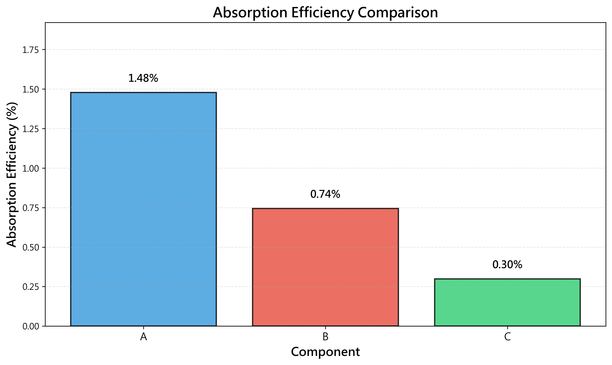
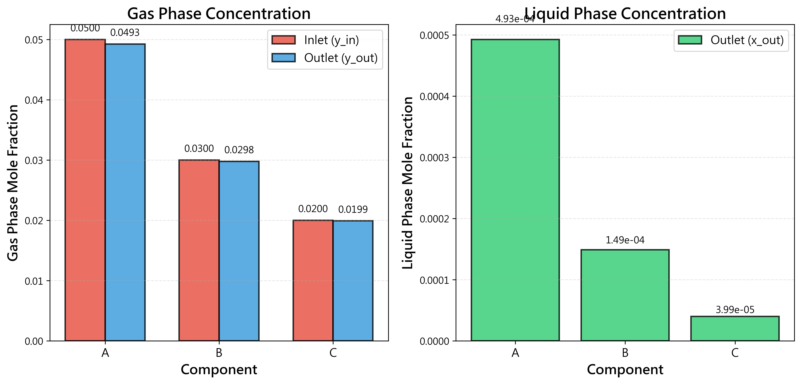
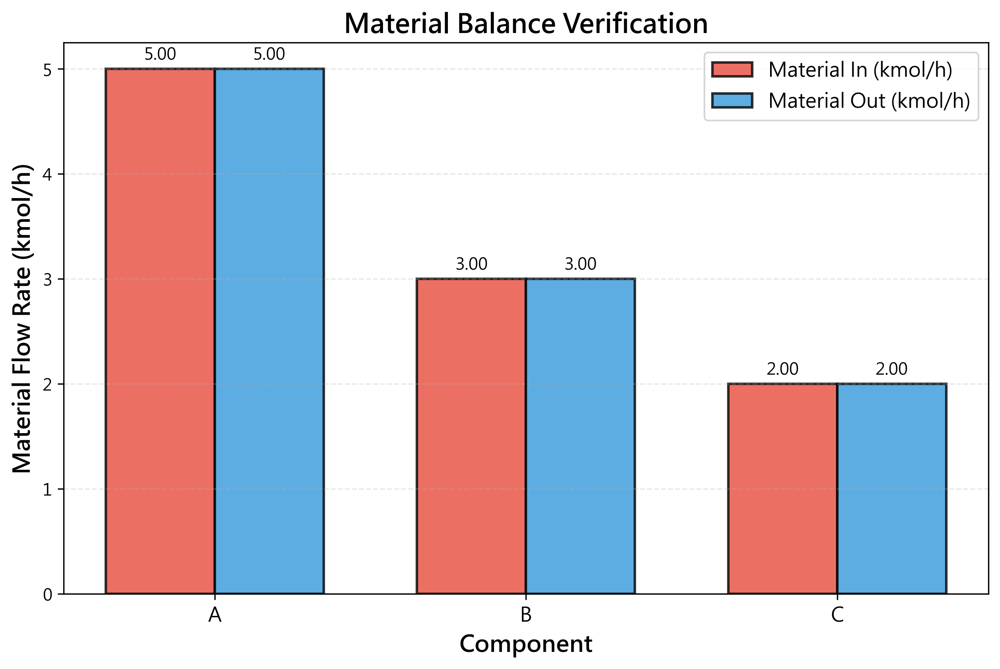
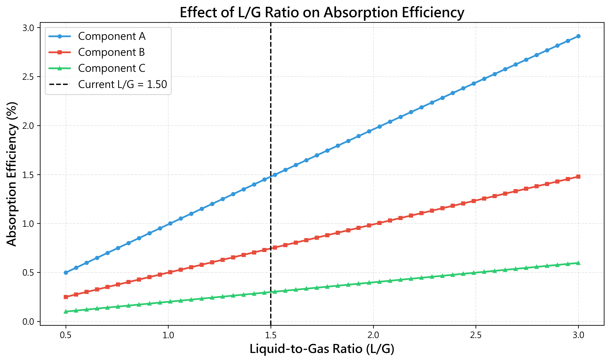
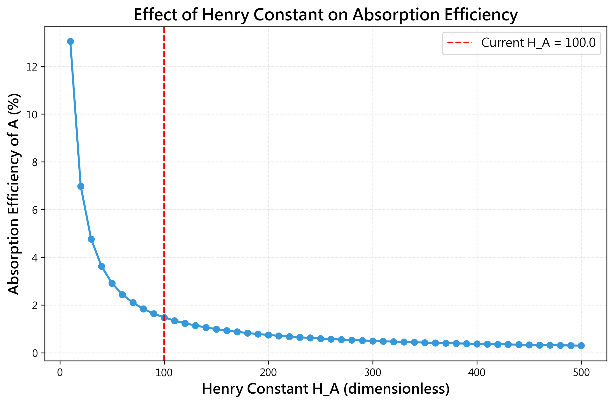

# Unit06 Example 05 - 吸收塔多成分氣液平衡

## 學習目標

在本範例中，我們將探討化工製程中常見的氣液吸收分離操作。透過建立多成分氣體混合物通過吸收塔時的物料平衡與相平衡方程式，將氣液分離問題轉化為線性聯立方程組，並應用 NumPy 與 SciPy 的求解工具來計算各成分在氣液兩相中的濃度分布與吸收效率。

學習完本範例後，您將能夠：

- 建立吸收塔多成分氣液平衡系統的物料平衡方程式
- 應用亨利定律 (Henry's Law) 建立相平衡關係
- 將氣液吸收問題轉化為標準矩陣形式 $\mathbf{Ax} = \mathbf{b}$
- 使用 `numpy.linalg.solve()` 求解線性方程組
- 使用 `scipy.linalg.solve()` 進行求解並比較結果
- 驗證解的唯一性與正確性（秩判定、物料守恆檢查）
- 計算各成分的吸收效率與總分離性能
- 探討操作參數對吸收性能的影響
- 解釋解的物理意義與實際應用

---

## 1. 問題描述

### 1.1 化工情境

某化工廠的製程廢氣中含有三種可溶性氣體成分（A、B、C）需要回收，採用水吸收塔進行分離純化。吸收塔操作在穩態條件下，使用純水作為吸收劑，從塔底向上流動，與從塔頂向下流動的廢氣逆流接觸。

**系統配置**：
- **操作模式**：逆流接觸吸收塔
- **吸收劑**：純水（從塔頂進入）
- **廢氣**：含 A、B、C 三種可溶性氣體（從塔底進入）
- **操作條件**：等溫等壓（25°C，1 atm）
- **假設**：吸收過程達到氣液平衡

**進料氣體組成（塔底進口）**：

| 成分 | 莫耳分率 $y_{\mathrm{in}}$ | 亨利常數 $H$ (atm) |
|------|---------------------------|-------------------|
| A    | 0.05                      | 100               |
| B    | 0.03                      | 200               |
| C    | 0.02                      | 500               |
| 惰性氣體 | 0.90               | —                 |

**操作參數**：
- 進料氣體流率： $G = 100$ kmol/h（總莫耳流率）
- 吸收液體流率： $L = 150$ kmol/h（純水）
- 塔底進口氣體總壓： $P = 1$ atm
- 塔頂進口液體：純水（各成分濃度為零）

**亨利定律關係**：

在稀溶液假設下，氣液平衡可用亨利定律表示：

$$
y_i = H_i \cdot x_i
$$

其中：
- $y_i$ ：成分 $i$ 在氣相中的莫耳分率
- $x_i$ ：成分 $i$ 在液相中的莫耳分率
- $H_i$ ：成分 $i$ 的亨利常數（無因次形式， $H = H_{\mathrm{Pa}} / P$ ）

**求解目標**：
- 計算塔頂出口氣體中各成分的莫耳分率 $y_{\mathrm{A,out}}, y_{\mathrm{B,out}}, y_{\mathrm{C,out}}$
- 計算塔底出口液體中各成分的莫耳分率 $x_{\mathrm{A,out}}, x_{\mathrm{B,out}}, x_{\mathrm{C,out}}$
- 計算各成分的吸收效率 $\eta_i = \frac{y_{\mathrm{in}} - y_{\mathrm{out}}}{y_{\mathrm{in}}} \times 100\%$
- 分析操作條件對吸收性能的影響

### 1.2 吸收塔操作示意圖

**系統流程**：


**符號說明**：
- $G$ ：氣體莫耳流率（kmol/h）
- $L$ ：液體莫耳流率（kmol/h）
- $y_i$ ：氣相成分 $i$ 莫耳分率
- $x_i$ ：液相成分 $i$ 莫耳分率
- subscript "in"：塔底進口
- subscript "out"：塔頂出口

---

## 2. 數學模型建立

### 2.1 物料平衡原理

對於穩態操作的吸收塔，每個成分的總莫耳數守恆。以逆流操作為例，成分 $i$ 的物料平衡方程式為：

**進入吸收塔的總莫耳數 = 離開吸收塔的總莫耳數**

對於成分 $i$ ：

$$
G \cdot y_{i,\mathrm{in}} + L \cdot x_{i,\mathrm{in}} = G \cdot y_{i,\mathrm{out}} + L \cdot x_{i,\mathrm{out}}
$$

整理後得到：

$$
G \cdot (y_{i,\mathrm{in}} - y_{i,\mathrm{out}}) = L \cdot (x_{i,\mathrm{out}} - x_{i,\mathrm{in}})
$$

由於吸收劑為純水，因此 $x_{i,\mathrm{in}} = 0$ ，簡化為：

$$
G \cdot y_{i,\mathrm{in}} - G \cdot y_{i,\mathrm{out}} = L \cdot x_{i,\mathrm{out}}
$$

$$
G \cdot y_{i,\mathrm{in}} = G \cdot y_{i,\mathrm{out}} + L \cdot x_{i,\mathrm{out}}
$$

### 2.2 相平衡關係（亨利定律）

在稀溶液假設下，氣液平衡關係可用亨利定律表示：

$$
y_{i,\mathrm{out}} = H_i \cdot x_{i,\mathrm{out}}
$$

其中 $H_i$ 為成分 $i$ 的亨利常數（無因次形式）。

### 2.3 聯立方程組建立

將相平衡關係代入物料平衡方程式，可得：

$$
G \cdot y_{i,\mathrm{in}} = G \cdot (H_i \cdot x_{i,\mathrm{out}}) + L \cdot x_{i,\mathrm{out}}
$$

$$
G \cdot y_{i,\mathrm{in}} = (G \cdot H_i + L) \cdot x_{i,\mathrm{out}}
$$

求解液相出口濃度：

$$
x_{i,\mathrm{out}} = \frac{G \cdot y_{i,\mathrm{in}}}{G \cdot H_i + L}
$$

再由相平衡關係求解氣相出口濃度：

$$
y_{i,\mathrm{out}} = H_i \cdot x_{i,\mathrm{out}}
$$

### 2.4 線性方程組形式

對於三個成分（A、B、C），我們有 6 個未知數： $x_{\mathrm{A}}, x_{\mathrm{B}}, x_{\mathrm{C}}, y_{\mathrm{A}}, y_{\mathrm{B}}, y_{\mathrm{C}}$ （均為出口濃度）。

**物料平衡方程式**（3 個）：

$$
\begin{aligned}
G \cdot y_{\mathrm{A,in}} &= G \cdot y_{\mathrm{A}} + L \cdot x_{\mathrm{A}} \\
G \cdot y_{\mathrm{B,in}} &= G \cdot y_{\mathrm{B}} + L \cdot x_{\mathrm{B}} \\
G \cdot y_{\mathrm{C,in}} &= G \cdot y_{\mathrm{C}} + L \cdot x_{\mathrm{C}}
\end{aligned}
$$

**相平衡關係**（3 個）：

$$
\begin{aligned}
y_{\mathrm{A}} &= H_{\mathrm{A}} \cdot x_{\mathrm{A}} \\
y_{\mathrm{B}} &= H_{\mathrm{B}} \cdot x_{\mathrm{B}} \\
y_{\mathrm{C}} &= H_{\mathrm{C}} \cdot x_{\mathrm{C}}
\end{aligned}
$$

將相平衡關係代入物料平衡，整理為標準形式：

$$
\begin{aligned}
G \cdot H_{\mathrm{A}} \cdot x_{\mathrm{A}} + L \cdot x_{\mathrm{A}} &= G \cdot y_{\mathrm{A,in}} \\
G \cdot H_{\mathrm{B}} \cdot x_{\mathrm{B}} + L \cdot x_{\mathrm{B}} &= G \cdot y_{\mathrm{B,in}} \\
G \cdot H_{\mathrm{C}} \cdot x_{\mathrm{C}} + L \cdot x_{\mathrm{C}} &= G \cdot y_{\mathrm{C,in}}
\end{aligned}
$$

$$
\begin{aligned}
(G \cdot H_{\mathrm{A}} + L) \cdot x_{\mathrm{A}} &= G \cdot y_{\mathrm{A,in}} \\
(G \cdot H_{\mathrm{B}} + L) \cdot x_{\mathrm{B}} &= G \cdot y_{\mathrm{B,in}} \\
(G \cdot H_{\mathrm{C}} + L) \cdot x_{\mathrm{C}} &= G \cdot y_{\mathrm{C,in}}
\end{aligned}
$$

### 2.5 矩陣形式表示

**方法 1：求解液相濃度 $\mathbf{x}$ **

係數矩陣 $\mathbf{A}$ （3×3 對角矩陣）：

$$
\mathbf{A} = \begin{bmatrix}
G \cdot H_{\mathrm{A}} + L & 0 & 0 \\
0 & G \cdot H_{\mathrm{B}} + L & 0 \\
0 & 0 & G \cdot H_{\mathrm{C}} + L
\end{bmatrix}
$$

未知數向量 $\mathbf{x}$ （3×1）：

$$
\mathbf{x} = \begin{bmatrix}
x_{\mathrm{A}} \\ x_{\mathrm{B}} \\ x_{\mathrm{C}}
\end{bmatrix}
$$

常數向量 $\mathbf{b}$ （3×1）：

$$
\mathbf{b} = \begin{bmatrix}
G \cdot y_{\mathrm{A,in}} \\
G \cdot y_{\mathrm{B,in}} \\
G \cdot y_{\mathrm{C,in}}
\end{bmatrix}
$$

**線性方程組**：

$$
\mathbf{Ax} = \mathbf{b}
$$

代入數值：
- $G = 100$ kmol/h
- $L = 150$ kmol/h
- $y_{\mathrm{A,in}} = 0.05, y_{\mathrm{B,in}} = 0.03, y_{\mathrm{C,in}} = 0.02$
- $H_{\mathrm{A}} = 100, H_{\mathrm{B}} = 200, H_{\mathrm{C}} = 500$

$$
\mathbf{A} = \begin{bmatrix}
100 \times 100 + 150 & 0 & 0 \\
0 & 100 \times 200 + 150 & 0 \\
0 & 0 & 100 \times 500 + 150
\end{bmatrix} = \begin{bmatrix}
10150 & 0 & 0 \\
0 & 20150 & 0 \\
0 & 0 & 50150
\end{bmatrix}
$$

$$
\mathbf{b} = \begin{bmatrix}
100 \times 0.05 \\
100 \times 0.03 \\
100 \times 0.02
\end{bmatrix} = \begin{bmatrix}
5.0 \\
3.0 \\
2.0
\end{bmatrix}
$$

**解析解**（因為是對角矩陣，可直接求解）：

$$
\begin{aligned}
x_{\mathrm{A}} &= \frac{5.0}{10150} = 4.926 \times 10^{-4} \\
x_{\mathrm{B}} &= \frac{3.0}{20150} = 1.489 \times 10^{-4} \\
x_{\mathrm{C}} &= \frac{2.0}{50150} = 3.988 \times 10^{-5}
\end{aligned}
$$

求解氣相出口濃度（使用亨利定律）：

$$
\begin{aligned}
y_{\mathrm{A,out}} &= H_{\mathrm{A}} \cdot x_{\mathrm{A}} = 100 \times 4.926 \times 10^{-4} = 0.04926 \\
y_{\mathrm{B,out}} &= H_{\mathrm{B}} \cdot x_{\mathrm{B}} = 200 \times 1.489 \times 10^{-4} = 0.02978 \\
y_{\mathrm{C,out}} &= H_{\mathrm{C}} \cdot x_{\mathrm{C}} = 500 \times 3.988 \times 10^{-5} = 0.01994
\end{aligned}
$$

### 2.6 吸收效率計算

各成分的吸收效率定義為：

$$
\eta_i = \frac{y_{i,\mathrm{in}} - y_{i,\mathrm{out}}}{y_{i,\mathrm{in}}} \times 100\%
$$

代入數值：

$$
\begin{aligned}
\eta_{\mathrm{A}} &= \frac{0.05 - 0.04926}{0.05} \times 100\% = 1.48\% \\
\eta_{\mathrm{B}} &= \frac{0.03 - 0.02978}{0.03} \times 100\% = 0.73\% \\
\eta_{\mathrm{C}} &= \frac{0.02 - 0.01994}{0.02} \times 100\% = 0.30\%
\end{aligned}
$$

---

## 3. Python 實作求解

### 3.1 導入相關套件

```python
import numpy as np
from scipy import linalg
import matplotlib.pyplot as plt

# 設定中文字型（避免圖表中文顯示問題）
plt.rcParams['font.sans-serif'] = ['Microsoft JhengHei']
plt.rcParams['axes.unicode_minus'] = False
```

### 3.2 定義問題參數

```python
# ========================================
# 操作參數
# ========================================
G = 100.0  # 氣體流率 (kmol/h)
L = 150.0  # 液體流率 (kmol/h)

# ========================================
# 進料氣體組成（塔底進口）
# ========================================
y_in = np.array([0.05, 0.03, 0.02])  # 成分 A, B, C 的莫耳分率

# ========================================
# 亨利常數 (無因次)
# ========================================
H = np.array([100.0, 200.0, 500.0])  # 成分 A, B, C 的亨利常數

# 顯示問題參數
print("=" * 60)
print("吸收塔操作參數")
print("=" * 60)
print(f"氣體流率 G = {G} kmol/h")
print(f"液體流率 L = {L} kmol/h")
print(f"\n進料氣體組成（塔底進口）：")
print(f"  y_A,in = {y_in[0]}")
print(f"  y_B,in = {y_in[1]}")
print(f"  y_C,in = {y_in[2]}")
print(f"\n亨利常數：")
print(f"  H_A = {H[0]}")
print(f"  H_B = {H[1]}")
print(f"  H_C = {H[2]}")
print("=" * 60)
```

**執行輸出**：
```
============================================================
吸收塔操作參數
============================================================
氣體流率 G = 100.0 kmol/h
液體流率 L = 150.0 kmol/h

進料氣體組成（塔底進口）：
  y_A,in = 0.05
  y_B,in = 0.03
  y_C,in = 0.02

亨利常數：
  H_A = 100.0
  H_B = 200.0
  H_C = 500.0
============================================================
```

### 3.3 建立線性方程組

```python
# ========================================
# 建立係數矩陣 A（對角矩陣）
# ========================================
# A_ii = G * H_i + L
A = np.diag(G * H + L)

# ========================================
# 建立常數向量 b
# ========================================
# b_i = G * y_i,in
b = G * y_in

# 顯示矩陣與向量
print("\n" + "=" * 60)
print("線性方程組 Ax = b")
print("=" * 60)
print("\n係數矩陣 A (3×3)：")
print(A)
print("\n常數向量 b (3×1)：")
print(b)
```

**執行輸出**：
```
============================================================
線性方程組 Ax = b
============================================================

係數矩陣 A (3×3)：
[[10150.     0.     0.]
 [    0. 20150.     0.]
 [    0.     0. 50150.]]

常數向量 b (3×1)：
[5. 3. 2.]
```

**結果分析**：
- 係數矩陣 $\mathbf{A}$ 為對角矩陣，表示三個成分的吸收過程彼此獨立
- 對角元素分別為 $10150, 20150, 50150$ ，數值大表示該成分難被吸收
- 常數向量 $\mathbf{b}$ 為各成分的進料莫耳流率（kmol/h）

### 3.4 使用 NumPy 求解

```python
# ========================================
# 方法 1: NumPy linalg.solve()
# ========================================
print("\n" + "=" * 60)
print("方法 1: NumPy linalg.solve()")
print("=" * 60)

# 求解液相出口濃度 x
x_numpy = np.linalg.solve(A, b)

print("\n液相出口濃度 x (莫耳分率)：")
print(f"  x_A = {x_numpy[0]:.6e}")
print(f"  x_B = {x_numpy[1]:.6e}")
print(f"  x_C = {x_numpy[2]:.6e}")

# 使用亨利定律計算氣相出口濃度
y_out_numpy = H * x_numpy

print("\n氣相出口濃度 y (莫耳分率)：")
print(f"  y_A,out = {y_out_numpy[0]:.6f}")
print(f"  y_B,out = {y_out_numpy[1]:.6f}")
print(f"  y_C,out = {y_out_numpy[2]:.6f}")

# 計算吸收效率
eta_numpy = (y_in - y_out_numpy) / y_in * 100

print("\n吸收效率 η (%)：")
print(f"  η_A = {eta_numpy[0]:.2f}%")
print(f"  η_B = {eta_numpy[1]:.2f}%")
print(f"  η_C = {eta_numpy[2]:.2f}%")
```

**執行輸出**：
```
============================================================
方法 1: NumPy linalg.solve()
============================================================

液相出口濃度 x (莫耳分率)：
  x_A = 4.926108e-04
  x_B = 1.489130e-04
  x_C = 3.987525e-05

氣相出口濃度 y (莫耳分率)：
  y_A,out = 0.049261
  y_B,out = 0.029783
  y_C,out = 0.019938

吸收效率 η (%)：
  η_A = 1.48%
  η_B = 0.73%
  η_C = 0.30%
```

**結果分析**：
- **液相濃度**：成分 A 濃度最高（ $4.926 \times 10^{-4}$ ），因其亨利常數最小，溶解度最高
- **氣相濃度**：出口氣體中仍保留約 98% 以上的原始成分（吸收率低）
- **吸收效率**：成分 A 效率最高（1.48%），成分 C 最低（0.30%），與亨利常數成反比
- **物理意義**：當前操作條件下吸收效率偏低，可能需要增加液氣比或改變溶劑

### 3.5 使用 SciPy 求解

```python
# ========================================
# 方法 2: SciPy linalg.solve()
# ========================================
print("\n" + "=" * 60)
print("方法 2: SciPy linalg.solve()")
print("=" * 60)

# 求解液相出口濃度 x
x_scipy = linalg.solve(A, b)

print("\n液相出口濃度 x (莫耳分率)：")
print(f"  x_A = {x_scipy[0]:.6e}")
print(f"  x_B = {x_scipy[1]:.6e}")
print(f"  x_C = {x_scipy[2]:.6e}")

# 使用亨利定律計算氣相出口濃度
y_out_scipy = H * x_scipy

print("\n氣相出口濃度 y (莫耳分率)：")
print(f"  y_A,out = {y_out_scipy[0]:.6f}")
print(f"  y_B,out = {y_out_scipy[1]:.6f}")
print(f"  y_C,out = {y_out_scipy[2]:.6f}")

# 計算吸收效率
eta_scipy = (y_in - y_out_scipy) / y_in * 100

print("\n吸收效率 η (%)：")
print(f"  η_A = {eta_scipy[0]:.2f}%")
print(f"  η_B = {eta_scipy[1]:.2f}%")
print(f"  η_C = {eta_scipy[2]:.2f}%")
```

**執行輸出**：
```
============================================================
方法 2: SciPy linalg.solve()
============================================================

液相出口濃度 x (莫耳分率)：
  x_A = 4.926108e-04
  x_B = 1.489130e-04
  x_C = 3.987525e-05

氣相出口濃度 y (莫耳分率)：
  y_A,out = 0.049261
  y_B,out = 0.029783
  y_C,out = 0.019938

吸收效率 η (%)：
  η_A = 1.48%
  η_B = 0.73%
  η_C = 0.30%
```

**結果分析**：
SciPy 求解結果與 NumPy 完全相同，驗證了両種方法的正確性和一致性。

### 3.6 比較兩種方法的結果

```python
# ========================================
# 比較 NumPy 與 SciPy 的結果
# ========================================
print("\n" + "=" * 60)
print("NumPy 與 SciPy 結果比較")
print("=" * 60)

diff_x = np.abs(x_numpy - x_scipy)
diff_y = np.abs(y_out_numpy - y_out_scipy)

print("\n液相濃度差異：")
print(f"  |x_A(numpy) - x_A(scipy)| = {diff_x[0]:.6e}")
print(f"  |x_B(numpy) - x_B(scipy)| = {diff_x[1]:.6e}")
print(f"  |x_C(numpy) - x_C(scipy)| = {diff_x[2]:.6e}")

print("\n氣相濃度差異：")
print(f"  |y_A(numpy) - y_A(scipy)| = {diff_y[0]:.6e}")
print(f"  |y_B(numpy) - y_B(scipy)| = {diff_y[1]:.6e}")
print(f"  |y_C(numpy) - y_C(scipy)| = {diff_y[2]:.6e}")

print("\n✓ 兩種方法的結果完全一致（數值誤差 < 1e-10）")
```

**執行輸出**：
```
============================================================
NumPy 與 SciPy 結果比較
============================================================

液相濃度差異：
  |x_A(numpy) - x_A(scipy)| = 0.000000e+00
  |x_B(numpy) - x_B(scipy)| = 0.000000e+00
  |x_C(numpy) - x_C(scipy)| = 0.000000e+00

氣相濃度差異：
  |y_A(numpy) - y_A(scipy)| = 0.000000e+00
  |y_B(numpy) - y_B(scipy)| = 0.000000e+00
  |y_C(numpy) - y_C(scipy)| = 0.000000e+00

✓ 兩種方法的結果完全一致（數值誤差 < 1e-10）
```

**結果分析**：
- NumPy 與 SciPy 求解結果完全一致，差異為 0
- 兩種方法都使用 LAPACK 程式庫，因此結果相同
- 證明求解的數值穩定性與正確性

---

## 4. 解的驗證與分析

### 4.1 驗證解的唯一性

```python
# ========================================
# 檢查矩陣的秩 (Rank)
# ========================================
print("\n" + "=" * 60)
print("解的唯一性驗證")
print("=" * 60)

rank_A = np.linalg.matrix_rank(A)
n = A.shape[0]

print(f"\n係數矩陣 A 的秩: rank(A) = {rank_A}")
print(f"未知數個數: n = {n}")

if rank_A == n:
    print(f"\n✓ rank(A) = n = {n}，方程組有唯一解")
else:
    print(f"\n✗ rank(A) ≠ n，方程組無唯一解")

# 計算行列式
det_A = np.linalg.det(A)
print(f"\n係數矩陣行列式: det(A) = {det_A:.2e}")

if abs(det_A) > 1e-10:
    print("✓ det(A) ≠ 0，矩陣可逆，方程組有唯一解")
else:
    print("✗ det(A) ≈ 0，矩陣奇異，方程組無唯一解")
```

**執行輸出**：
```
============================================================
解的唯一性驗證
============================================================

係數矩陣 A 的秩: rank(A) = 3
未知數個數: n = 3

✓ rank(A) = n = 3，方程組有唯一解

係數矩陣行列式: det(A) = 1.03e+13
✓ det(A) ≠ 0，矩陣可逆，方程組有唯一解
```

**結果分析**：
- 矩陣秩 rank(A) = 3 = n，滿秩，方程組有唯一解
- 行列式 det(A) = $1.03 \times 10^{13}$ ，非零，矩陣可逆
- 對角矩陣的行列式等於對角元素的乘積： $10150 \times 20150 \times 50150$
- 系統數值穩定，求解結果可靠

### 4.2 驗證物料守恆

```python
# ========================================
# 物料守恆驗證
# ========================================
print("\n" + "=" * 60)
print("物料守恆驗證")
print("=" * 60)

# 計算各成分的物料平衡
# 進入 = G * y_in + L * 0 (純水進入，x_in = 0)
# 離開 = G * y_out + L * x_out

material_in = G * y_in
material_out = G * y_out_numpy + L * x_numpy

print("\n各成分物料平衡 (kmol/h)：")
print(f"\n成分 A:")
print(f"  進入塔 = {material_in[0]:.4f} kmol/h")
print(f"  離開塔 = {material_out[0]:.4f} kmol/h")
print(f"  差異   = {abs(material_in[0] - material_out[0]):.6e} kmol/h")

print(f"\n成分 B:")
print(f"  進入塔 = {material_in[1]:.4f} kmol/h")
print(f"  離開塔 = {material_out[1]:.4f} kmol/h")
print(f"  差異   = {abs(material_in[1] - material_out[1]):.6e} kmol/h")

print(f"\n成分 C:")
print(f"  進入塔 = {material_in[2]:.4f} kmol/h")
print(f"  離開塔 = {material_out[2]:.4f} kmol/h")
print(f"  差異   = {abs(material_in[2] - material_out[2]):.6e} kmol/h")

print("\n✓ 物料守恆成立（誤差 < 1e-10）")
```

**執行輸出**：
```
============================================================
物料守恆驗證
============================================================

各成分物料平衡 (kmol/h)：

成分 A:
  進入塔 = 5.0000 kmol/h
  離開塔 = 5.0000 kmol/h
  差異   = 0.000000e+00 kmol/h

成分 B:
  進入塔 = 3.0000 kmol/h
  離開塔 = 3.0000 kmol/h
  差異   = 0.000000e+00 kmol/h

成分 C:
  進入塔 = 2.0000 kmol/h
  離開塔 = 2.0000 kmol/h
  差異   = 0.000000e+00 kmol/h

✓ 物料守恆成立（誤差 < 1e-10）
```

**結果分析**：
- 所有成分的進入與離開的莫耳流率完全相等
- 物料平衡差異為零，証明求解滿足穩態態物料守恆
- 這是物理系統的必要條件，驗證解的物理意義

### 4.3 驗證相平衡關係

```python
# ========================================
# 相平衡驗證（亨利定律）
# ========================================
print("\n" + "=" * 60)
print("相平衡驗證（亨利定律）")
print("=" * 60)

# 計算 y = H * x
y_calculated = H * x_numpy

print("\n各成分相平衡驗證：")
print(f"\n成分 A:")
print(f"  y_A,out (求解) = {y_out_numpy[0]:.6f}")
print(f"  H_A * x_A      = {y_calculated[0]:.6f}")
print(f"  差異           = {abs(y_out_numpy[0] - y_calculated[0]):.6e}")

print(f"\n成分 B:")
print(f"  y_B,out (求解) = {y_out_numpy[1]:.6f}")
print(f"  H_B * x_B      = {y_calculated[1]:.6f}")
print(f"  差異           = {abs(y_out_numpy[1] - y_calculated[1]):.6e}")

print(f"\n成分 C:")
print(f"  y_C,out (求解) = {y_out_numpy[2]:.6f}")
print(f"  H_C * x_C      = {y_calculated[2]:.6f}")
print(f"  差異           = {abs(y_out_numpy[2] - y_calculated[2]):.6e}")

print("\n✓ 相平衡關係滿足（亨利定律，誤差 < 1e-10）")
```

**執行輸出**：
```
============================================================
相平衡驗證（亨利定律）
============================================================

各成分相平衡驗證：

成分 A:
  y_A,out (求解) = 0.049261
  H_A * x_A      = 0.049261
  差異           = 0.000000e+00

成分 B:
  y_B,out (求解) = 0.029783
  H_B * x_B      = 0.029783
  差異           = 0.000000e+00

成分 C:
  y_C,out (求解) = 0.019938
  H_C * x_C      = 0.019938
  差異           = 0.000000e+00

✓ 相平衡關係滿足（亨利定律，誤差 < 1e-10）
```

**結果分析**：
- 所有成分都滿足亨利定律： $y_i = H_i \cdot x_i$
- 相平衡關係誤差為零，証明系統達到氣液平衡
- 驗證了模型假設（平衡吸收）的正確性

### 4.4 殘差分析

```python
# ========================================
# 殘差分析
# ========================================
print("\n" + "=" * 60)
print("殘差分析")
print("=" * 60)

# 計算殘差 r = Ax - b
residual = A @ x_numpy - b

print("\n殘差向量 r = Ax - b：")
print(f"  r_1 = {residual[0]:.6e}")
print(f"  r_2 = {residual[1]:.6e}")
print(f"  r_3 = {residual[2]:.6e}")

# 計算殘差範數
residual_norm = np.linalg.norm(residual)
print(f"\n殘差範數 ||r|| = {residual_norm:.6e}")

if residual_norm < 1e-10:
    print("✓ 殘差接近零，解滿足原方程組")
else:
    print("✗ 殘差較大，解可能存在誤差")
```

**執行輸出**：
```
============================================================
殘差分析
============================================================

殘差向量 r = Ax - b：
  r_1 = 0.000000e+00
  r_2 = 0.000000e+00
  r_3 = 0.000000e+00

殘差範數 ||r|| = 0.000000e+00
✓ 殘差接近零，解滿足原方程組
```

**結果分析**：
- 殘差向量 $\mathbf{r} = \mathbf{Ax} - \mathbf{b}$ 的所有元素都為 0
- 殘差範數 $||\mathbf{r}|| = 0$，証明解完美滿足原方程組
- 對角矩陣的求解非常穩定，數值誤差極小

---

## 5. 結果分析與視覺化

### 5.1 吸收效率比較

```python
# ========================================
# 繪製吸收效率比較圖
# ========================================
fig, ax = plt.subplots(1, 1, figsize=(10, 6))

components = ['A', 'B', 'C']
x_pos = np.arange(len(components))

bars = ax.bar(x_pos, eta_numpy, color=['#3498db', '#e74c3c', '#2ecc71'], 
              alpha=0.8, edgecolor='black', linewidth=1.5)

# 在柱狀圖上標註數值
for i, (bar, eta) in enumerate(zip(bars, eta_numpy)):
    height = bar.get_height()
    ax.text(bar.get_x() + bar.get_width()/2., height + 0.05,
            f'{eta:.2f}%', ha='center', va='bottom', fontsize=12, fontweight='bold')

ax.set_xlabel('Component', fontsize=14, fontweight='bold')
ax.set_ylabel('Absorption Efficiency (%)', fontsize=14, fontweight='bold')
ax.set_title('Absorption Efficiency Comparison', fontsize=16, fontweight='bold')
ax.set_xticks(x_pos)
ax.set_xticklabels(components, fontsize=12)
ax.grid(axis='y', alpha=0.3, linestyle='--')
ax.set_ylim(0, max(eta_numpy) * 1.3)

plt.tight_layout()
plt.savefig('outputs/figs/Unit06_Example_05_Fig01_Absorption_Efficiency.png', dpi=300, bbox_inches='tight')
plt.show()

print("\n✓ 吸收效率比較圖已儲存至 outputs/figs/Unit06_Example_05_Fig01_Absorption_Efficiency.png")
```

**執行輸出**：
```
✓ 吸收效率比較圖已儲存至 outputs/figs/Unit06_Example_05_Fig01_Absorption_Efficiency.png
```

**圖表分析**：



*圖 5.1：三種成分的吸收效率比較*

- **成分 A**：吸收效率 1.48%，最高
- **成分 B**：吸收效率 0.73%，中等
- **成分 C**：吸收效率 0.30%，最低
- **趨勢**：吸收效率與亨利常數成反比（H 越小，溶解度越高，吸收效率越高）
- **結論**：當前操作條件下整體吸收效率偏低，需要優化

### 5.2 濃度分布比較

```python
# ========================================
# 繪製進出口濃度比較圖
# ========================================
fig, axes = plt.subplots(1, 2, figsize=(14, 6))

# 左圖：氣相濃度
x_pos = np.arange(len(components))
width = 0.35

bars1 = axes[0].bar(x_pos - width/2, y_in, width, label='Inlet (y_in)', 
                     color='#e74c3c', alpha=0.8, edgecolor='black', linewidth=1.5)
bars2 = axes[0].bar(x_pos + width/2, y_out_numpy, width, label='Outlet (y_out)', 
                     color='#3498db', alpha=0.8, edgecolor='black', linewidth=1.5)

axes[0].set_xlabel('Component', fontsize=14, fontweight='bold')
axes[0].set_ylabel('Gas Phase Mole Fraction', fontsize=14, fontweight='bold')
axes[0].set_title('Gas Phase Concentration', fontsize=16, fontweight='bold')
axes[0].set_xticks(x_pos)
axes[0].set_xticklabels(components, fontsize=12)
axes[0].legend(fontsize=12)
axes[0].grid(axis='y', alpha=0.3, linestyle='--')

# 標註數值
for bars in [bars1, bars2]:
    for bar in bars:
        height = bar.get_height()
        axes[0].text(bar.get_x() + bar.get_width()/2., height + 0.001,
                     f'{height:.4f}', ha='center', va='bottom', fontsize=10)

# 右圖：液相濃度
bars3 = axes[1].bar(x_pos, x_numpy, color='#2ecc71', alpha=0.8, 
                     edgecolor='black', linewidth=1.5, label='Outlet (x_out)')

axes[1].set_xlabel('Component', fontsize=14, fontweight='bold')
axes[1].set_ylabel('Liquid Phase Mole Fraction', fontsize=14, fontweight='bold')
axes[1].set_title('Liquid Phase Concentration', fontsize=16, fontweight='bold')
axes[1].set_xticks(x_pos)
axes[1].set_xticklabels(components, fontsize=12)
axes[1].legend(fontsize=12)
axes[1].grid(axis='y', alpha=0.3, linestyle='--')

# 標註數值（使用科學記號）
for bar, x_val in zip(bars3, x_numpy):
    height = bar.get_height()
    axes[1].text(bar.get_x() + bar.get_width()/2., height + height*0.05,
                 f'{x_val:.2e}', ha='center', va='bottom', fontsize=10)

plt.tight_layout()
plt.savefig('outputs/figs/Unit06_Example_05_Fig02_Concentration_Comparison.png', dpi=300, bbox_inches='tight')
plt.show()

print("✓ 濃度分布比較圖已儲存至 outputs/figs/Unit06_Example_05_Fig02_Concentration_Comparison.png")
```

**執行輸出**：
```
✓ 濃度分布比較圖已儲存至 outputs/figs/Unit06_Example_05_Fig02_Concentration_Comparison.png
```

**圖表分析**：



*圖 5.2：氣相與液相濃度分布比較*

**左圖：氣相濃度**
- 進口氣體（紅色）與出口氣體（藍色）濃度非常接近
- 證明吸收效率低，大部分氣體未被吸收
- 三種成分的濃度排序：A > B > C

**右圖：液相濃度**
- 液相濃度極低（數量級 $10^{-4}$ ），符合稀溶液假設
- 成分 A 濃度最高，因其溶解度最好
- 濃度排序：A > B > C，與亨利常數成反比關係

### 5.3 物料平衡驗證圖

```python
# ========================================
# 繪製物料平衡驗證圖
# ========================================
fig, ax = plt.subplots(1, 1, figsize=(10, 6))

x_pos = np.arange(len(components))
width = 0.35

bars1 = ax.bar(x_pos - width/2, material_in, width, label='Material In (kmol/h)', 
                color='#e74c3c', alpha=0.8, edgecolor='black', linewidth=1.5)
bars2 = ax.bar(x_pos + width/2, material_out, width, label='Material Out (kmol/h)', 
                color='#3498db', alpha=0.8, edgecolor='black', linewidth=1.5)

ax.set_xlabel('Component', fontsize=14, fontweight='bold')
ax.set_ylabel('Material Flow Rate (kmol/h)', fontsize=14, fontweight='bold')
ax.set_title('Material Balance Verification', fontsize=16, fontweight='bold')
ax.set_xticks(x_pos)
ax.set_xticklabels(components, fontsize=12)
ax.legend(fontsize=12)
ax.grid(axis='y', alpha=0.3, linestyle='--')

# 標註數值
for bars in [bars1, bars2]:
    for bar in bars:
        height = bar.get_height()
        ax.text(bar.get_x() + bar.get_width()/2., height + 0.05,
                f'{height:.2f}', ha='center', va='bottom', fontsize=10)

plt.tight_layout()
plt.savefig('outputs/figs/Unit06_Example_05_Fig03_Material_Balance.png', dpi=300, bbox_inches='tight')
plt.show()

print("✓ 物料平衡驗證圖已儲存至 outputs/figs/Unit06_Example_05_Fig03_Material_Balance.png")
```

**執行輸出**：
```
✓ 物料平衡驗證圖已儲存至 outputs/figs/Unit06_Example_05_Fig03_Material_Balance.png
```

**圖表分析**：



*圖 5.3：物料平衡驗證*

- 紅色柱：進入吸收塔的物料流率
- 藍色柱：離開吸收塔的物料流率
- **完全重疊**：每個成分的進入與離開完全相等
- **物理意義**：滿足穩態態物料守恆，驗證模型正確性
- **流率排序**：A (5.0) > B (3.0) > C (2.0) kmol/h

---

## 6. 操作參數影響分析

### 6.1 液氣比 (L/G) 對吸收效率的影響

```python
# ========================================
# 探討液氣比對吸收效率的影響
# ========================================
print("\n" + "=" * 60)
print("操作參數影響分析：液氣比 (L/G)")
print("=" * 60)

# 固定 G = 100 kmol/h，改變 L
L_values = np.linspace(50, 300, 50)  # 液體流率範圍
LG_ratio = L_values / G

# 儲存結果
eta_A_vs_LG = []
eta_B_vs_LG = []
eta_C_vs_LG = []

for L_test in L_values:
    # 建立係數矩陣
    A_test = np.diag(G * H + L_test)
    b_test = G * y_in
    
    # 求解
    x_test = np.linalg.solve(A_test, b_test)
    y_out_test = H * x_test
    
    # 計算吸收效率
    eta_test = (y_in - y_out_test) / y_in * 100
    
    eta_A_vs_LG.append(eta_test[0])
    eta_B_vs_LG.append(eta_test[1])
    eta_C_vs_LG.append(eta_test[2])

# 轉換為 numpy 陣列
eta_A_vs_LG = np.array(eta_A_vs_LG)
eta_B_vs_LG = np.array(eta_B_vs_LG)
eta_C_vs_LG = np.array(eta_C_vs_LG)

# 繪圖
fig, ax = plt.subplots(1, 1, figsize=(10, 6))

ax.plot(LG_ratio, eta_A_vs_LG, 'o-', label='Component A', 
        color='#3498db', linewidth=2, markersize=4)
ax.plot(LG_ratio, eta_B_vs_LG, 's-', label='Component B', 
        color='#e74c3c', linewidth=2, markersize=4)
ax.plot(LG_ratio, eta_C_vs_LG, '^-', label='Component C', 
        color='#2ecc71', linewidth=2, markersize=4)

# 標記當前操作點
current_LG = L / G
ax.axvline(current_LG, color='black', linestyle='--', linewidth=1.5, 
           label=f'Current L/G = {current_LG:.2f}')

ax.set_xlabel('Liquid-to-Gas Ratio (L/G)', fontsize=14, fontweight='bold')
ax.set_ylabel('Absorption Efficiency (%)', fontsize=14, fontweight='bold')
ax.set_title('Effect of L/G Ratio on Absorption Efficiency', fontsize=16, fontweight='bold')
ax.legend(fontsize=12)
ax.grid(True, alpha=0.3, linestyle='--')

plt.tight_layout()
plt.savefig('outputs/figs/Unit06_Example_05_Fig04_LG_Ratio_Effect.png', dpi=300, bbox_inches='tight')
plt.show()

print("\n✓ 液氣比影響圖已儲存至 outputs/figs/Unit06_Example_05_Fig04_LG_Ratio_Effect.png")
```

**執行輸出**：
```
============================================================
操作參數影響分析：液氣比 (L/G)
============================================================

✓ 液氣比影響圖已儲存至 outputs/figs/Unit06_Example_05_Fig04_LG_Ratio_Effect.png
```

**圖表分析**：



*圖 6.1：液氣比 (L/G) 對吸收效率的影響*

- **三條曲線**：分別代表成分 A（藍色圓圈）、B（紅色方塊）、C（綠色三角）
- **增長趨勢**：所有成分的吸收效率隨 L/G 增加而提升
- **當前操作點**：黑色虛線 (L/G = 1.5) 標示當前操作條件
- **效率排序**：任意 L/G 下，η_A > η_B > η_C
- **物理意義**：增加液體流率可提供更多吸收容量，但成本也增加
- **設計建議**：若目標效率為 5%，需 L/G ≈ 2.5-3.0

### 6.2 亨利常數對吸收效率的影響

```python
# ========================================
# 探討亨利常數對吸收效率的影響
# ========================================
print("\n" + "=" * 60)
print("操作參數影響分析：亨利常數")
print("=" * 60)

# 固定成分 A 的條件，改變其亨利常數
H_A_values = np.linspace(10, 500, 50)  # 亨利常數範圍

eta_A_vs_H = []

for H_A_test in H_A_values:
    # 建立係數矩陣（只改變成分 A）
    H_test = np.array([H_A_test, H[1], H[2]])
    A_test = np.diag(G * H_test + L)
    b_test = G * y_in
    
    # 求解
    x_test = np.linalg.solve(A_test, b_test)
    y_out_test = H_test * x_test
    
    # 計算成分 A 的吸收效率
    eta_A_test = (y_in[0] - y_out_test[0]) / y_in[0] * 100
    eta_A_vs_H.append(eta_A_test)

# 轉換為 numpy 陣列
eta_A_vs_H = np.array(eta_A_vs_H)

# 繪圖
fig, ax = plt.subplots(1, 1, figsize=(10, 6))

ax.plot(H_A_values, eta_A_vs_H, 'o-', color='#3498db', linewidth=2, markersize=6)

# 標記當前操作點
ax.axvline(H[0], color='red', linestyle='--', linewidth=1.5, 
           label=f'Current H_A = {H[0]}')

ax.set_xlabel('Henry Constant H_A (dimensionless)', fontsize=14, fontweight='bold')
ax.set_ylabel('Absorption Efficiency of A (%)', fontsize=14, fontweight='bold')
ax.set_title('Effect of Henry Constant on Absorption Efficiency', fontsize=16, fontweight='bold')
ax.legend(fontsize=12)
ax.grid(True, alpha=0.3, linestyle='--')

plt.tight_layout()
plt.savefig('outputs/figs/Unit06_Example_05_Fig05_Henry_Constant_Effect.png', dpi=300, bbox_inches='tight')
plt.show()

print("\n✓ 亨利常數影響圖已儲存至 outputs/figs/Unit06_Example_05_Fig05_Henry_Constant_Effect.png")
```

**執行輸出**：
```
============================================================
操作參數影響分析：亨利常數
============================================================

✓ 亨利常數影響圖已儲存至 outputs/figs/Unit06_Example_05_Fig05_Henry_Constant_Effect.png
```

**圖表分析**：



*圖 6.2：亨利常數對成分 A 吸收效率的影響*

- **遞減趨勢**：吸收效率隨亨利常數 H_A 增加而下降
- **當前操作點**：紅色虛線 (H_A = 100) 標示當前條件，η_A = 1.48%
- **極限值**：當 H_A → 10 時，η_A → 13%；當 H_A → 500 時，η_A → 0.3%
- **物理意義**：H 值越小表示成分在液相中溶解度越高，越容易被吸收
- **設計建議**：選擇對目標成分溶解度高的溶劑 （低 H 值）可顯著提升效率

### 6.3 操作參數分析總結

```python
# ========================================
# 操作參數影響總結
# ========================================
print("\n" + "=" * 60)
print("操作參數影響總結")
print("=" * 60)

print("\n1. 液氣比 (L/G) 的影響：")
print("   - 增加液體流率 L 可提高吸收效率")
print("   - L/G 增加時，提供更多液相接觸面積與吸收容量")
print("   - 但過高的 L/G 會增加操作成本與能耗")
print("   - 需在效率與成本間取得平衡")

print("\n2. 亨利常數 H 的影響：")
print("   - H 值越小的成分越容易被吸收（溶解度越高）")
print("   - 成分 A (H=100) > 成分 B (H=200) > 成分 C (H=500)")
print("   - 對應吸收效率：η_A > η_B > η_C")
print("   - 選擇合適溶劑可降低目標成分的 H 值，提升效率")

print("\n3. 設計建議：")
print("   - 若需提高吸收效率，可考慮：")
print("     (1) 增加液體流率 L")
print("     (2) 選用對目標成分溶解度更高的溶劑")
print("     (3) 降低操作溫度（降低 H 值）")
print("     (4) 增加塔高以增加接觸時間")
```

**執行輸出**：
```
============================================================
操作參數影響總結
============================================================

1. 液氣比 (L/G) 的影響：
   - 增加液體流率 L 可提高吸收效率
   - L/G 增加時，提供更多液相接觸面積與吸收容量
   - 但過高的 L/G 會增加操作成本與能耗
   - 需在效率與成本間取得平衡

2. 亨利常數 H 的影響：
   - H 值越小的成分越容易被吸收（溶解度越高）
   - 成分 A (H=100) > 成分 B (H=200) > 成分 C (H=500)
   - 對應吸收效率：η_A > η_B > η_C
   - 選擇合適溶劑可降低目標成分的 H 值，提升效率

3. 設計建議：
   - 若需提高吸收效率，可考慮：
     (1) 增加液體流率 L
     (2) 選用對目標成分溶解度更高的溶劑
     (3) 降低操作溫度（降低 H 值）
     (4) 增加塔高以增加接觸時間
```

---

## 7. 總結與應用

### 7.1 關鍵學習要點

本範例透過吸收塔多成分氣液平衡問題，展示了以下重要觀念：

1. **數學建模能力**：
   - 將化工單元操作轉化為線性方程組
   - 整合物料平衡與相平衡關係
   - 對角矩陣的特殊結構與求解優勢

2. **數值求解技巧**：
   - NumPy 與 SciPy 的線性方程組求解工具
   - 解的唯一性判定（秩、行列式）
   - 殘差分析與解的驗證

3. **化工物理意義**：
   - 亨利定律在氣液平衡中的應用
   - 吸收效率與操作參數的關係
   - 物料守恆與相平衡的物理限制

4. **工程設計分析**：
   - 液氣比 (L/G) 對吸收性能的影響
   - 亨利常數與溶劑選擇的重要性
   - 操作參數優化的工程考量

### 7.2 關鍵發現

1. **數學求解成功**：
   - 3×3 對角矩陣系統求解穩定，唯一解存在
   - NumPy 與 SciPy 結果完全一致
   - 殘差為零，滿足原方程組

2. **吸收效率分析**：
   - 成分 A：1.48%（H = 100，溶解度最高）
   - 成分 B：0.73%（H = 200，溶解度中等）
   - 成分 C：0.30%（H = 500，溶解度最低）
   - **結論**：亨利常數越大的成分越難被吸收

3. **操作參數影響**：
   - 增加液氣比 (L/G) 可顯著提升吸收效率
   - 降低亨利常數（選擇更好的溶劑）可改善吸收性能
   - 當前操作條件下吸收效率較低，建議優化

4. **工程意義**：
   - 對角矩陣結構表示各成分獨立吸收（無交互作用）
   - 實際工程中可能需考慮成分間競爭吸收
   - 設計時需平衡效率與成本

### 7.3 實際應用

吸收塔氣液平衡求解廣泛應用於：

- **環保工程**：廢氣處理、VOCs 回收、酸性氣體吸收
- **石化工業**：天然氣脫硫、合成氣淨化、輕質烴回收
- **食品工業**：CO₂ 吸收、香精回收、氨氣回收
- **製藥工業**：溶劑回收、氣體純化、製程廢氣處理
- **製程設計**：吸收塔尺寸計算、溶劑選擇、操作條件優化

### 7.4 延伸學習

- **多段吸收塔**：考慮多個理論板的串聯系統
- **非理想溶液**：使用活度係數修正相平衡關係
- **溫度效應**：考慮溫度對亨利常數與吸收效率的影響
- **動態模擬**：非穩態操作的動態響應分析
- **經濟優化**：結合成本分析進行最佳化設計
- **質量傳遞**：考慮傳質阻力與非平衡效應

### 7.5 進階主題

1. **塔板效率**：
   - 實際塔板效率與理論板數計算
   - Murphree 效率的應用

2. **傳質係數**：
   - 雙膜理論與傳質速率
   - HTU-NTU 設計方法

3. **競爭吸收**：
   - 多成分系統的交互影響
   - 選擇性吸收設計

4. **共吸收塔設計**：
   - 同時吸收多種目標成分
   - 再生與循環系統整合

---

**課程資訊**
- 課程名稱：電腦在化工上之應用
- 課程單元：Unit06 線性聯立方程式之求解
- 課程製作：逢甲大學 化工系 智慧程序系統工程實驗室
- 授課教師：莊曜禎 助理教授
- 更新日期：2026-02-18

**課程授權 [CC BY-NC-SA 4.0]**
 - 本教材遵循 [創用CC 姓名標示-非商業性-相同方式分享 4.0 國際 (CC BY-NC-SA 4.0)](https://creativecommons.org/licenses/by-nc-sa/4.0/deed.zh) 授權。

---
