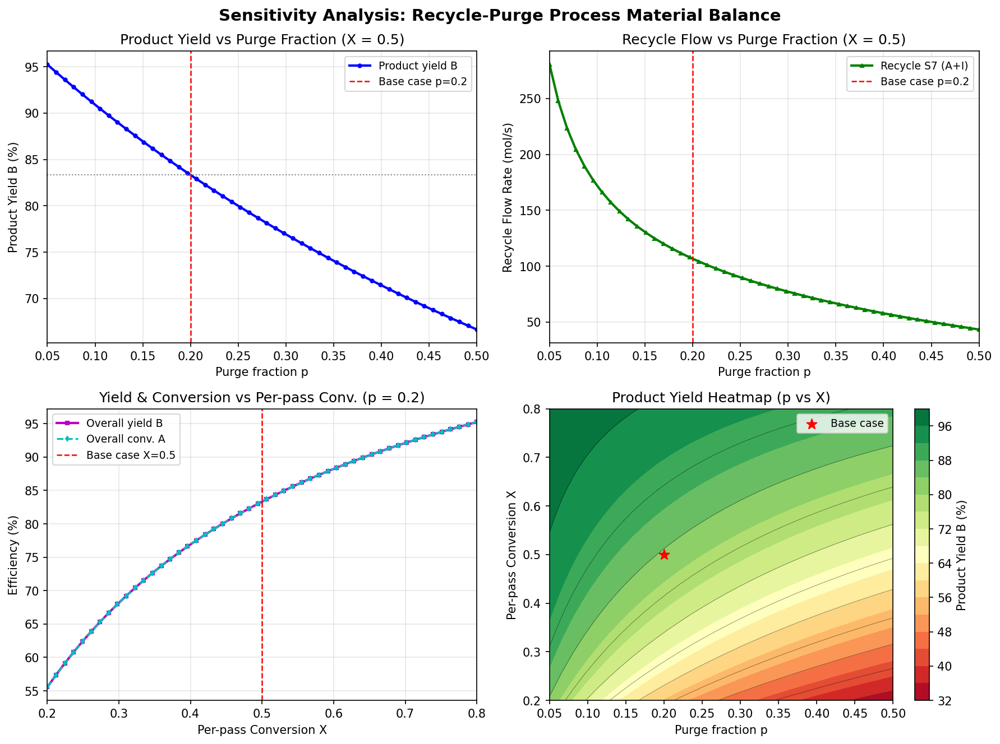

# Unit06_Example_06 | 化工案例六：含循環排放之化工製程穩態物料平衡

## 學習目標

完成本案例後，學生能夠：

- 分析含循環流（Recycle）與排放流（Purge）之完整化工製程，建立各單元的物料平衡方程式
- 將複雜製程的穩態物料平衡整理為 $\mathbf{A}\mathbf{x} = \mathbf{b}$ 的 **19×19 線性方程組**
- 使用 `scipy.linalg.solve()` 精確求解大型線性聯立方程組
- 透過殘差分析與成分守恆檢查驗證解的正確性
- 進行參數敏感度分析，了解排放比例與單程轉化率對整體製程效率的影響

---

## §1. 問題描述

### 1.1 製程說明

本案例考慮一個用於生產甲醇（CH₃OH）的穩態化工製程，製程含有以下結構：

**製程成分（3 種）**

| 符號 | 物質 | 角色 |
|:----:|:----:|:----:|
| A | H₂（氫氣） | 原料（reactant） |
| B | CH₃OH（甲醇） | 產物（product） |
| I | N₂（氮氣） | 惰性成分（inert） |

**製程反應**： $\mathrm{A} \rightarrow \mathrm{B}$ （1:1 計量比），單程轉化率 $X = 0.5$

**製程單元（4 個）**

| 單元 | 名稱 | 說明 |
|:----:|:----:|:-----|
| Mixer | 混合器 | 新鮮進料 S1 與循環流 S7 混合 |
| Reactor | 反應器 | A → B，單程轉化率 X = 0.5 |
| Separator | 分離器 | 完美分離：B 全進液相（液態產物），A 與 I 全進氣相 |
| Splitter | 分流器 | 氣相出口分流：排放比例 p = 0.2，循環比例 r = 0.8 |

### 1.2 製程流程圖


### 1.3 流股定義

| 流股 | 說明 | 已知/未知 |
|:----:|:-----|:--------:|
| S1 | 新鮮進料 | **已知**： $n_{A1}=100,\ n_{B1}=0,\ n_{I1}=10\ \mathrm{mol/s}$ |
| S2 | 混合器出口 = 反應器入口 | 未知 |
| S3 | 反應器出口 = 分離器入口 | 未知 |
| S4 | 分離器氣相出口（A + I） | 未知 |
| S5 | 液態產物（純 B） | 未知 |
| S6 | 排放流（Purge，S4 的 20%） | 未知 |
| S7 | 循環流（Recycle，S4 的 80%） | 未知 |

---

## §2. 自由度分析

**未知數個數**：每個流股有 3 個成分流率，共 6 個未知流股（S2–S7），加上 1 個反應程度 ξ，合計 **19 個未知數**。

**可列方程式**：各單元物料平衡方程式合計

| 單元 | 方程式條數 |
|:----:|:---------:|
| 混合器 | 3 |
| 反應器 | 4（含轉化率規格 1 條） |
| 分離器 | 6（氣液各 3 種成分） |
| 分流器 | 6（排放/循環各 3 種成分） |
| **合計** | **19** |

**自由度** = 19 − 19 = **0**，方程組有唯一解。

---

## §3. 建立線性方程組 $\mathbf{A}\mathbf{x} = \mathbf{b}$

### 3.1 未知數向量

令未知數向量 $\mathbf{x}$ 依流股順序排列：

$$
\mathbf{x} = [n_{A2},\ n_{B2},\ n_{I2},\ n_{A3},\ n_{B3},\ n_{I3},\ \xi,\ n_{A4},\ n_{B4},\ n_{I4},\ n_{A5},\ n_{B5},\ n_{I5},\ n_{A6},\ n_{B6},\ n_{I6},\ n_{A7},\ n_{B7},\ n_{I7}]^T
$$

索引對應關係（0-indexed）：

| 索引 | 變數 | 含義 |
|:---:|:----:|:-----|
| 0–2 | $n_{A2},n_{B2},n_{I2}$ | S2 反應器入口 |
| 3–5 | $n_{A3},n_{B3},n_{I3}$ | S3 分離器入口 |
| 6 | $\xi$ | 反應程度 (mol/s) |
| 7–9 | $n_{A4},n_{B4},n_{I4}$ | S4 分離器氣相出口 |
| 10–12 | $n_{A5},n_{B5},n_{I5}$ | S5 液態產物 |
| 13–15 | $n_{A6},n_{B6},n_{I6}$ | S6 排放流 |
| 16–18 | $n_{A7},n_{B7},n_{I7}$ | S7 循環流 |

### 3.2 各單元方程式推導

#### 混合器（3 條）

$$
n_{A2} - n_{A7} = n_{A1} = 100 \qquad \text{(方程式 0)}
$$

$$
n_{B2} - n_{B7} = n_{B1} = 0 \qquad \text{(方程式 1)}
$$

$$
n_{I2} - n_{I7} = n_{I1} = 10 \qquad \text{(方程式 2)}
$$

#### 反應器（4 條）

反應 $A \rightarrow B$ ，反應程度 $\xi$ （mol/s）：

$$
-n_{A2} + n_{A3} + \xi = 0 \qquad \text{(方程式 3)}
$$

$$
-n_{B2} + n_{B3} - \xi = 0 \qquad \text{(方程式 4)}
$$

$$
-n_{I2} + n_{I3} = 0 \qquad \text{(方程式 5)}
$$

單程轉化率規格 $\xi = X \cdot n_{A2}$ ，即：

$$
-X \cdot n_{A2} + \xi = 0 \qquad \text{(方程式 6，}X = 0.5\text{)}
$$

#### 分離器（6 條）：完美分離

A 與 I 全部進氣相（S4），B 全部進液相（S5）：

$$
-n_{A3} + n_{A4} = 0 \quad (7) \qquad n_{B4} = 0 \quad (8) \qquad -n_{I3} + n_{I4} = 0 \quad (9)
$$

$$
n_{A5} = 0 \quad (10) \qquad -n_{B3} + n_{B5} = 0 \quad (11) \qquad n_{I5} = 0 \quad (12)
$$

#### 分流器（6 條）：排放比 $p=0.2$ ，循環比 $r=0.8$

$$
-p \cdot n_{A4} + n_{A6} = 0 \quad (13) \qquad n_{B6} = 0 \quad (14) \qquad -p \cdot n_{I4} + n_{I6} = 0 \quad (15)
$$

$$
-r \cdot n_{A4} + n_{A7} = 0 \quad (16) \qquad n_{B7} = 0 \quad (17) \qquad -r \cdot n_{I4} + n_{I7} = 0 \quad (18)
$$

### 3.3 秩數驗證結果

```
係數矩陣 A 的維度  : (19, 19)
rank(A)            : 19
rank([A|b])        : 19
未知數個數 N       : 19

✓ rank(A) = rank([A|b]) = N → 方程組有唯一解
```

---

## §4. 程式碼說明

### 4.1 製程參數設定

```python
# 成分索引: 0=A(H2), 1=B(CH3OH), 2=I(N2)
nA1, nB1, nI1 = 100.0, 0.0, 10.0  # mol/s (新鮮進料)
X = 0.5    # 單程轉化率
p = 0.2    # 排放比例
r = 1 - p  # 循環比例 = 0.8
```

**執行結果：**

```
==================================================
  製程參數摘要
==================================================
  新鮮進料 S1:
    nA1 = 100.0 mol/s  (H2)
    nB1 = 0.0 mol/s  (CH3OH)
    nI1 = 10.0 mol/s  (N2)
    總流率 = 110.0 mol/s
  反應條件:
    單程轉化率 X = 0.50
  分流器設定:
    排放比例 p = 0.20
    循環比例 r = 0.80
  系統規模:
    未知數個數 N = 19
==================================================
```

### 4.2 建立 19×19 係數矩陣

程式中以函式 `build_system()` 建立矩陣 `A` 和向量 `b`。關鍵片段：

```python
def build_system(nA1=100.0, nB1=0.0, nI1=10.0, X=0.5, p=0.2):
    r = 1.0 - p
    A = np.zeros((19, 19))
    b = np.zeros(19)
    # 混合器: nA2 - nA7 = nA1
    A[0, 0] = 1.0;  A[0, 16] = -1.0;  b[0] = nA1
    # ...（其他方程式依此類推）
    return A, b
```

### 4.3 求解與結果

使用 `scipy.linalg.solve()` 求解：

```python
x_sol = scipy.linalg.solve(A_mat, b_vec)
```

**執行結果：**

```
✓ scipy.linalg.solve() 求解成功
===========================================================================
  各流股流率彙整表
===========================================================================
                 nA (mol/s)  nB (mol/s)  nI (mol/s)  Total (mol/s)     yA     yB     yI
S1 (Fresh Feed)    100.0000      0.0000     10.0000       110.0000 0.9091 0.0000 0.0909
S2 (Rxr In)        166.6667      0.0000     50.0000       216.6667 0.7692 0.0000 0.2308
S3 (Sep In)         83.3333     83.3333     50.0000       216.6667 0.3846 0.3846 0.2308
S4 (Gas Out)        83.3333      0.0000     50.0000       133.3333 0.6250 0.0000 0.3750
S5 (Product)         0.0000     83.3333      0.0000        83.3333 0.0000 1.0000 0.0000
S6 (Purge)          16.6667      0.0000     10.0000        26.6667 0.6250 0.0000 0.3750
S7 (Recycle)        66.6667      0.0000     40.0000       106.6667 0.6250 0.0000 0.3750

  反應程度 xi = 83.3333 mol/s
==================================================
  製程效率指標
==================================================
  單程轉化率      X    = 0.5000
  整體轉化率           = 0.8333  (83.33%)
  產品 B 產率          = 0.8333  (83.33%)
  循環流量 S7 總計     = 106.6667 mol/s
  排放流量 S6 總計     = 26.6667 mol/s
```

### 4.4 殘差驗證與物料守恆

```
==================================================
  殘差驗證: r = A·x - b
==================================================
  最大絕對殘差 = 1.42e-14
  殘差 2-norm  = 1.42e-14
  ✓ 殘差極小，求解結果正確

============================================================
  各單元物料守恆驗證（成分別）
============================================================
  ✓ Mixer - A: in=166.6667, out=166.6667, err=0.00e+00
  ✓ Mixer - B: in=0.0000, out=0.0000, err=0.00e+00
  ✓ Mixer - I: in=50.0000, out=50.0000, err=0.00e+00
  ✓ Reactor - A: in=83.3333, out=83.3333, err=0.00e+00
  ✓ Reactor - B: in=83.3333, out=83.3333, err=0.00e+00
  ✓ Reactor - I: in=50.0000, out=50.0000, err=0.00e+00
  ✓ Separator - A: in=83.3333, out=83.3333, err=0.00e+00
  ✓ Separator - B: in=83.3333, out=83.3333, err=0.00e+00
  ✓ Separator - I: in=50.0000, out=50.0000, err=0.00e+00
  ✓ Splitter - A: in=83.3333, out=83.3333, err=0.00e+00
  ✓ Splitter - B: in=0.0000, out=0.0000, err=0.00e+00
  ✓ Splitter - I: in=50.0000, out=50.0000, err=0.00e+00
```

全部 12 項成分守恆檢查通過，殘差達機器精度（ $\sim 10^{-14}$ ）。

---

## §5. 敏感度分析

### 5.1 分析設計

透過 `solve_process()` 函式系統性地改變以下兩個操作參數，重新求解 19×19 線性方程組：

| 分析 | 變化參數 | 固定參數 | 範圍 |
|:----:|:--------:|:--------:|:----:|
| 分析 1 | 排放比例 $p$ | $X = 0.5$ | $p \in [0.05, 0.50]$ |
| 分析 2 | 單程轉化率 $X$ | $p = 0.2$ | $X \in [0.20, 0.80]$ |
| 分析 3 | $(p, X)$ 二維掃描 | — | 30×30 格點 |

### 5.2 敏感度分析結果

```
✓ 敏感度分析計算完成
  排放比例掃描:  p ∈ [0.05, 0.50], X = 0.5
  轉化率掃描:    X ∈ [0.20, 0.80], p = 0.2
  二維掃描:      30×30 格點
  產率範圍（p掃描）: 0.6667 – 0.9524
  產率範圍（X掃描）: 0.5556 – 0.9524
```

---

## §6. 視覺化結果

下圖四個子圖呈現完整的敏感度分析結果：



**圖說明：**

- **左上（Panel 1）**：固定 $X=0.5$ 時，產品產率 vs 排放比例 $p$  
  → $p$ 越小（排放越少），產品產率越高，但循環負荷也越重

- **右上（Panel 2）**：固定 $X=0.5$ 時，循環流量 vs 排放比例 $p$  
  → $p$ 減小時，循環流量急遽增大（形成雙曲線增長趨勢）

- **左下（Panel 3）**：固定 $p=0.2$ 時，產品產率與整體轉化率 vs 單程轉化率 $X$  
  → 兩條曲線**完全重疊**（恆等式）：由整體 A 物料守恆 $n_{A1} = n_{A6} + n_{B5}$ 可知， $n_{B5}/n_{A1} \equiv 1 - n_{A6}/n_{A1}$ ，即產品產率 ≡ 整體轉化率

- **右下（Panel 4）**：二維熱力圖（ $p$ vs $X$ ）顯示產品產率等高線  
  → 右上角（高 $X$ 、低 $p$ ）為高產率區，紅星為基本案例位置

---

## §7. 結論

### 7.1 基本案例求解結果

| 流股/指標 | 數值 |
|:---------|:----:|
| S1 新鮮進料 A | 100.0 mol/s |
| S2 反應器入口 A | 166.67 mol/s（因循環累積） |
| 反應程度 ξ | 83.33 mol/s |
| S5 液態產物 B | 83.33 mol/s |
| S6 排放流 | 26.67 mol/s（含 A: 16.67, I: 10.0） |
| S7 循環流 | 106.67 mol/s（含 A: 66.67, I: 40.0） |
| 整體 A 轉化率 | **83.33 %** |
| 產品 B 產率 | **83.33 %** |

### 7.2 敏感度分析關鍵結論

1. **排放比例 $p$ 的影響**：
   - 增大 $p$ → 產品產率**降低**，循環流量**降低**（設備負荷輕），實際成本降低
   - 減小 $p$ → 整體轉化率**提升**，但循環流量**急遽增大**，設備與能耗成本升高
   - 存在工程設計的衡量取捨（**trade-off**）：高產率 vs 低設備負荷

2. **單程轉化率 $X$ 的影響**：
   - 提高 $X$ → 產品產率提升，整體轉化率也提升
   - 高 $X$ 通常需要更長停留時間或更高溫度，實際操作有物理/化學限制

3. **最高產率條件**：高 $X$ + 低 $p$ 可達約 **95%** 產率，但循環流量必須承受極高負荷

### 7.3 線性系統方法的優勢

- 複雜循環流路製程可**直接整理**為 $\mathbf{A}\mathbf{x} = \mathbf{b}$ 的矩陣方程，不需要迭代收斂
- `scipy.linalg.solve()` 精確求解，殘差達機器精度（ $\sim 10^{-14}$ ）
- 函式化設計 `build_system()` 使參數掃描輕鬆實現，便於工程最佳化分析

---

**課程資訊**
- 課程名稱：電腦在化工上之應用
- 課程單元：Unit06 線性聯立方程式之求解 — 案例六
- 課程製作：逢甲大學 化工系 智慧程序系統工程實驗室
- 授課教師：莊曜禎 助理教授
- 更新日期：2025-06-01

**課程授權 [CC BY-NC-SA 4.0]**
 - 本教材遵循 [創用CC 姓名標示-非商業性-相同方式分享 4.0 國際 (CC BY-NC-SA 4.0)](https://creativecommons.org/licenses/by-nc-sa/4.0/deed.zh) 授權。

---
