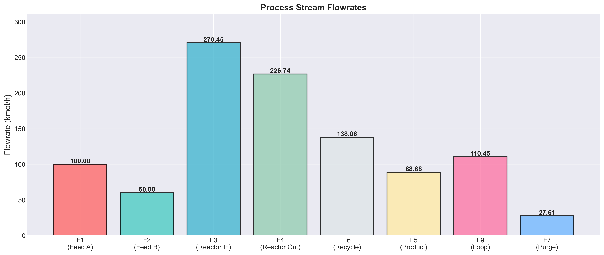
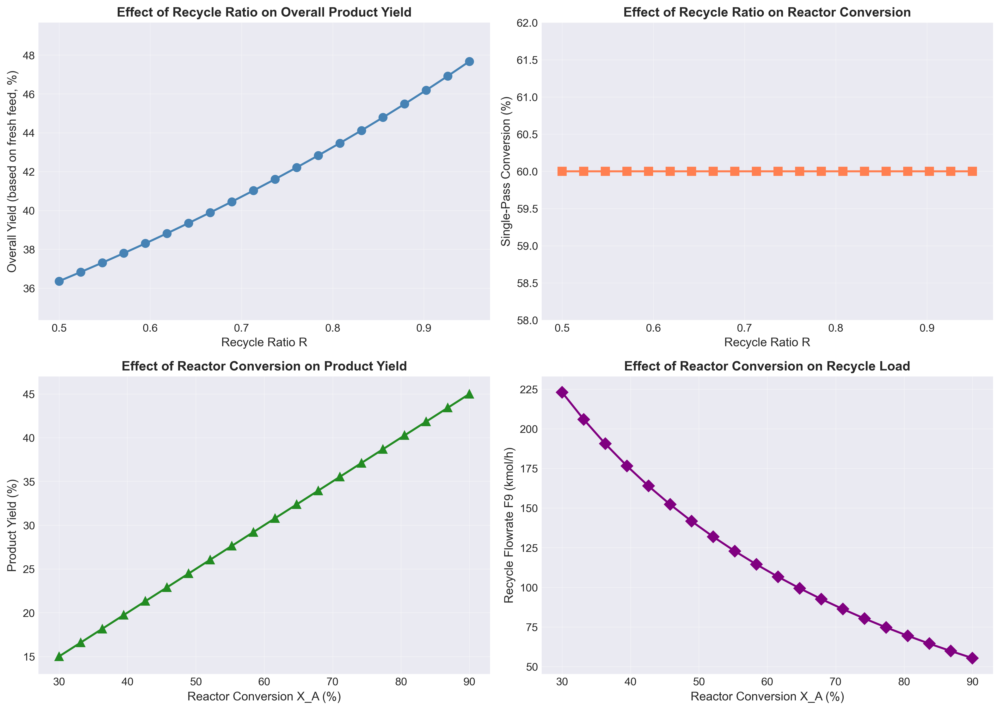

# Unit06 Example 06 - 綜合化工製程流程物料平衡

## 學習目標

在本範例中，我們將探討一個完整的化工製程系統，整合反應、分離、混合、回流等多個單元操作。透過建立全製程的物料平衡方程組，處理包含循環流與分流的複雜系統，並應用 NumPy 與 SciPy 的求解工具來計算各股流的流率與組成分布，進而分析製程整體效率。

學習完本範例後，您將能夠：

- 建立包含多個單元操作的綜合化工製程物料平衡方程式
- 處理循環流（recycle）與分流（split）的物料平衡問題
- 將複雜製程問題轉化為標準矩陣形式 $\mathbf{Ax} = \mathbf{b}$
- 使用 `numpy.linalg.solve()` 求解大型線性方程組
- 使用 `scipy.linalg.solve()` 進行求解並比較結果
- 驗證解的唯一性與正確性（秩判定、物料守恆檢查）
- 計算製程整體物料效率與產品產率
- 進行敏感度分析：探討進料條件與回流比對產品產率的影響
- 解釋解的物理意義與工程實務應用

---

## 1. 問題描述

### 1.1 化工情境

某化工廠生產高價值化學品 P（Product），採用連續操作的製程系統。原料 A 與 B 在反應器中進行化學反應生成產品 P 與副產物 W（Waste）。反應後的混合物經過分離單元，將產品 P 純化並回收未反應的原料進行循環利用，以提高原料轉化率與製程經濟效益。

**製程流程包含以下單元操作**：

1. **混合器（Mixer）**：將新鮮進料與循環流混合後送入反應器
2. **反應器（Reactor）**：進行化學反應轉化原料為產品
3. **分離器（Separator）**：將產品與未反應物分離
4. **分流器（Splitter）**：將部分未反應物循環回混合器

**化學反應**：

$$
2A + B \rightarrow P + W
$$

反應為二級反應，在反應器中達到 60% 的轉化率（基於限制反應物 A）。

**製程配置**：


**製程股流編號**：
- F1：新鮮進料 A（kmol/h）
- F2：新鮮進料 B（kmol/h）
- F3：混合器出口至反應器（kmol/h）
- F4：反應器出口（kmol/h）
- F5：分離器出口（產品流）
- F6：分離器出口（未反應物流）
- F7：分流器出口（排放流，Purge）
- F9：循環流（Recycle，回到混合器）

### 1.2 操作條件與設計參數

**新鮮進料條件**：
- 新鮮進料 A： $F_1 = 100$ kmol/h，純度 100% A
- 新鮮進料 B： $F_2 = 60$ kmol/h，純度 100% B

**反應器操作**：
- 反應轉化率（基於 A）： $X_A = 0.60$ （60%）
- 反應計量比： $A:B:P:W = 2:1:1:1$

**分離器分離效率**：
- 產品 P 進入 F5 的比例：95%
- 副產物 W 進入 F5 的比例：90%
- 未反應物（A、B）進入 F6 的比例：98%

**分流器設定**：
- 回流比（Recycle Ratio）： $R = \frac{F_9}{F_6} = 0.80$ （80% 循環，20% 排放）

**求解目標**：
1. 計算各股流的流率（F1 到 F9）
2. 計算各股流的組成（A、B、P、W 的莫耳分率或流率）
3. 計算製程整體物料效率：
   - 原料 A 的總轉化率
   - 產品 P 的總產率
   - 未反應物的回收率
4. 進行敏感度分析：
   - 探討回流比 $R$ 對產品產率的影響
   - 探討反應轉化率 $X_A$ 對製程效率的影響

---

## 2. 數學模型建立

### 2.1 物料平衡原理

對於穩態連續操作的化工製程，每個單元操作與每個成分都需滿足質量守恆定律：

**總物料平衡**：

(進入單元的總莫耳數) = (離開單元的總莫耳數)

**成分物料平衡**：

(進入單元的成分 i 莫耳數) + (生成的成分 i 莫耳數) = (離開單元的成分 i 莫耳數) + (消耗的成分 i 莫耳數)

由於系統包含循環流，我們需要同時求解所有單元的物料平衡方程式。

### 2.2 各單元物料平衡方程式

#### 2.2.1 混合器（Mixer）

混合器將新鮮進料與循環流混合：

**成分 A 的物料平衡**：

$$
F_1 + F_{9,A} = F_{3,A}
$$

**成分 B 的物料平衡**：

$$
F_2 + F_{9,B} = F_{3,B}
$$

**總物料平衡**：

$$
F_1 + F_2 + F_9 = F_3
$$

其中 $F_{i,j}$ 表示股流 $i$ 中成分 $j$ 的莫耳流率。

#### 2.2.2 反應器（Reactor）

反應器中發生化學反應： $2A + B \rightarrow P + W$

設 $\xi$ 為反應程度（extent of reaction，kmol/h），則：

**反應轉化率定義**：

$$
X_A = \frac{F_{3,A} - F_{4,A}}{F_{3,A}} = 0.60
$$

**成分 A 的物料平衡**：

$$
F_{4,A} = F_{3,A} - 2\xi = F_{3,A}(1 - X_A)
$$

因此：

$$
\xi = \frac{F_{3,A} \cdot X_A}{2}
$$

**成分 B 的物料平衡**：

$$
F_{4,B} = F_{3,B} - \xi = F_{3,B} - \frac{F_{3,A} \cdot X_A}{2}
$$

**產品 P 的生成**：

$$
F_{4,P} = 0 + \xi = \frac{F_{3,A} \cdot X_A}{2}
$$

**副產物 W 的生成**：

$$
F_{4,W} = 0 + \xi = \frac{F_{3,A} \cdot X_A}{2}
$$

**總物料平衡**：

$$
F_4 = F_{4,A} + F_{4,B} + F_{4,P} + F_{4,W}
$$

#### 2.2.3 分離器（Separator）

將反應器出口的混合物分離為產品流（F5）與未反應物流（F6）：

**分離效率參數**：
- $\alpha_P = 0.95$ （產品 P 進入 F5 的比例）
- $\alpha_W = 0.90$ （副產物 W 進入 F5 的比例）
- $\alpha_A = 0.02$ （未反應物 A 進入 F5 的比例）
- $\alpha_B = 0.02$ （未反應物 B 進入 F5 的比例）

**成分 P 的分離**：

$$
F_{5,P} = \alpha_P \cdot F_{4,P} = 0.95 \cdot F_{4,P}
$$

$$
F_{6,P} = (1 - \alpha_P) \cdot F_{4,P} = 0.05 \cdot F_{4,P}
$$

**成分 W 的分離**：

$$
F_{5,W} = \alpha_W \cdot F_{4,W} = 0.90 \cdot F_{4,W}
$$

$$
F_{6,W} = (1 - \alpha_W) \cdot F_{4,W} = 0.10 \cdot F_{4,W}
$$

**成分 A 的分離**：

$$
F_{5,A} = \alpha_A \cdot F_{4,A} = 0.02 \cdot F_{4,A}
$$

$$
F_{6,A} = (1 - \alpha_A) \cdot F_{4,A} = 0.98 \cdot F_{4,A}
$$

**成分 B 的分離**：

$$
F_{5,B} = \alpha_B \cdot F_{4,B} = 0.02 \cdot F_{4,B}
$$

$$
F_{6,B} = (1 - \alpha_B) \cdot F_{4,B} = 0.98 \cdot F_{4,B}
$$

**總物料平衡**：

$$
F_5 = F_{5,A} + F_{5,B} + F_{5,P} + F_{5,W}
$$

$$
F_6 = F_{6,A} + F_{6,B} + F_{6,P} + F_{6,W}
$$

#### 2.2.4 分流器（Splitter）

將未反應物富集流（F6）分成循環流（F9）與排放流（F7）：

**回流比定義**：

$$
R = \frac{F_9}{F_6} = 0.80
$$

**循環流**：

$$
F_9 = R \cdot F_6 = 0.80 \cdot F_6
$$

**排放流**：

$$
F_7 = (1 - R) \cdot F_6 = 0.20 \cdot F_6
$$

**各成分的分流**（保持組成不變）：

$$
F_{9,A} = R \cdot F_{6,A}, \quad F_{7,A} = (1-R) \cdot F_{6,A}
$$

$$
F_{9,B} = R \cdot F_{6,B}, \quad F_{7,B} = (1-R) \cdot F_{6,B}
$$

同理適用於 P 與 W。

### 2.3 簡化的線性方程組建立

為了建立線性方程組，我們需要選擇適當的未知數。由於系統包含循環流，最直接的想法是將所有股流作為未知數，但這樣會過於複雜。為簡化問題，我們可以利用成分流率與總流率的關係，以及已知的進料條件與分離效率參數。

**簡化策略**：

1. 選擇 **關鍵未知數**： $F_3$ （反應器進料總流率）與 $F_9$ （循環流總流率）
2. 其他流率可通過物料平衡與已知參數計算

#### 2.3.1 關鍵方程式推導

**混合器總物料平衡**：

$$
F_1 + F_2 + F_9 = F_3
$$

代入已知值 $F_1 = 100$ ， $F_2 = 60$ ：

$$
160 + F_9 = F_3 \quad \text{...(方程式 1)}
$$

**反應器進料組成**：

由於新鮮進料 A 為純 A，新鮮進料 B 為純 B，循環流 F9 含有 A、B、P、W。

循環流的組成與 F6 相同（分流器不改變組成）。

設 $F_{6,A}, F_{6,B}, F_{6,P}, F_{6,W}$ 為 F6 中各成分的流率。

**混合器成分 A 平衡**：

$$
F_{3,A} = F_1 + F_{9,A} = 100 + 0.80 \cdot F_{6,A} \quad \text{...(方程式 2)}
$$

**混合器成分 B 平衡**：

$$
F_{3,B} = F_2 + F_{9,B} = 60 + 0.80 \cdot F_{6,B} \quad \text{...(方程式 3)}
$$

**反應器出口**：

$$
F_{4,A} = F_{3,A}(1 - 0.60) = 0.40 F_{3,A} \quad \text{...(方程式 4)}
$$

$$
F_{4,B} = F_{3,B} - \frac{0.60 F_{3,A}}{2} = F_{3,B} - 0.30 F_{3,A} \quad \text{...(方程式 5)}
$$

$$
F_{4,P} = \frac{0.60 F_{3,A}}{2} = 0.30 F_{3,A} \quad \text{...(方程式 6)}
$$

$$
F_{4,W} = 0.30 F_{3,A} \quad \text{...(方程式 7)}
$$

**分離器出口（F6 中的成分）**：

$$
F_{6,A} = 0.98 \cdot F_{4,A} = 0.98 \times 0.40 F_{3,A} = 0.392 F_{3,A} \quad \text{...(方程式 8)}
$$

$$
F_{6,B} = 0.98 \cdot F_{4,B} = 0.98(F_{3,B} - 0.30 F_{3,A}) \quad \text{...(方程式 9)}
$$

**聯立求解**：

將方程式 8 代入方程式 2：

$$
F_{3,A} = 100 + 0.80 \times 0.392 F_{3,A}
$$

$$
F_{3,A} = 100 + 0.3136 F_{3,A}
$$

$$
F_{3,A} - 0.3136 F_{3,A} = 100
$$

$$
0.6864 F_{3,A} = 100
$$

$$
F_{3,A} = \frac{100}{0.6864} \approx 145.69 \text{ kmol/h}
$$

同理，將方程式 9 代入方程式 3：

$$
F_{3,B} = 60 + 0.80 \times 0.98(F_{3,B} - 0.30 F_{3,A})
$$

$$
F_{3,B} = 60 + 0.784 F_{3,B} - 0.784 \times 0.30 F_{3,A}
$$

$$
F_{3,B} - 0.784 F_{3,B} = 60 - 0.2352 F_{3,A}
$$

$$
0.216 F_{3,B} = 60 - 0.2352 \times 145.69
$$

$$
0.216 F_{3,B} = 60 - 34.27
$$

$$
F_{3,B} = \frac{25.73}{0.216} \approx 119.12 \text{ kmol/h}
$$

這種手算方式較為繁瑣，且當系統更複雜時難以處理。因此我們需要建立完整的線性方程組並使用 NumPy/SciPy 求解。

### 2.4 完整矩陣形式建立

為建立矩陣形式 $\mathbf{Ax} = \mathbf{b}$ ，為了正確處理循環流中的產品 P 和副產物 W，我們選擇以下 **12 個關鍵未知數**：

$$
\mathbf{x} = [F_{3,A}, F_{3,B}, F_{3,P}, F_{3,W}, F_{4,A}, F_{4,B}, F_{4,P}, F_{4,W}, F_{6,A}, F_{6,B}, F_{6,P}, F_{6,W}]^T
$$

其中：
- $F_{3,A}, F_{3,B}, F_{3,P}, F_{3,W}$：反應器進料各成分流率
- $F_{4,A}, F_{4,B}, F_{4,P}, F_{4,W}$：反應器出料各成分流率
- $F_{6,A}, F_{6,B}, F_{6,P}, F_{6,W}$：分離器未反應物流（回收流）各成分流率

建立對應的 **12 個獨立方程式**：

**混合器物料平衡**（4 個方程式）：
1. 成分 A： $F_{3,A} - 0.80 \times F_{6,A} = 100$
2. 成分 B： $F_{3,B} - 0.80 \times F_{6,B} = 60$
3. 成分 P： $F_{3,P} - 0.80 \times F_{6,P} = 0$ （來自循環流）
4. 成分 W： $F_{3,W} - 0.80 \times F_{6,W} = 0$ （來自循環流）

**反應器物料平衡**（4 個方程式）：
5. 成分 A： $F_{4,A} - 0.40 \times F_{3,A} = 0$ （60% 轉化）
6. 成分 B： $F_{4,B} - F_{3,B} + 0.30 \times F_{3,A} = 0$ （消耗）
7. 產品 P： $F_{4,P} - F_{3,P} - 0.30 \times F_{3,A} = 0$ （累積生成）
8. 副產物 W： $F_{4,W} - F_{3,W} - 0.30 \times F_{3,A} = 0$ （累積生成）

**分離器物料平衡**（4 個方程式）：
9. 成分 A： $F_{6,A} - 0.98 \times F_{4,A} = 0$ （98% 進入未反應物流）
10. 成分 B： $F_{6,B} - 0.98 \times F_{4,B} = 0$ （98% 進入未反應物流）
11. 產品 P： $F_{6,P} - 0.05 \times F_{4,P} = 0$ （5% 進入未反應物流）
12. 副產物 W： $F_{6,W} - 0.10 \times F_{4,W} = 0$ （10% 進入未反應物流）

這種 12 變數模型能正確追蹤循環流中的所有成分，確保物料平衡閉合。

---

## 3. Python 程式實作

### 3.1 系統化建立線性方程組

我們將採用以下策略：

**未知數選擇**（共 12 個未知數）：

$$
\mathbf{x} = [F_{3,A}, F_{3,B}, F_{3,P}, F_{3,W}, F_{4,A}, F_{4,B}, F_{4,P}, F_{4,W}, F_{6,A}, F_{6,B}, F_{6,P}, F_{6,W}]^T
$$

**方程式建立**（共 12 個方程式）：

**混合器物料平衡**（4 個方程式）：
1. 混合器成分 A 平衡
2. 混合器成分 B 平衡
3. 混合器成分 P 平衡（來自循環流）
4. 混合器成分 W 平衡（來自循環流）

**反應器物料平衡**（4 個方程式）：
5. 反應器成分 A 平衡（含反應）
6. 反應器成分 B 平衡（含反應）
7. 反應器產品 P 累積（含進料中的 P）
8. 反應器副產物 W 累積（含進料中的 W）

**分離器物料平衡**（4 個方程式）：
9. 分離器成分 A 分配至 F6
10. 分離器成分 B 分配至 F6
11. 分離器產品 P 分配至 F6
12. 分離器副產物 W 分配至 F6

詳細程式碼請參閱配套的 Jupyter Notebook。

### 3.2 NumPy 求解方法

```python
import numpy as np

# 已知參數
F1 = 100  # 新鮮進料 A (kmol/h)
F2 = 60   # 新鮮進料 B (kmol/h)
X_A = 0.60  # 反應轉化率
R = 0.80    # 回流比

# 分離效率
alpha_P = 0.95
alpha_W = 0.90
alpha_A = 0.02
alpha_B = 0.02

# 建立係數矩陣 A 與常數向量 b
# (程式碼細節見 Notebook)

# 使用 NumPy 求解
x = np.linalg.solve(A, b)

# 提取結果
F_3A, F_3B, F_3P, F_3W, F_4A, F_4B, F_4P, F_4W, F_6A, F_6B, F_6P, F_6W = x
```

### 3.3 SciPy 求解方法

```python
from scipy import linalg

# 使用 SciPy 求解
x_scipy = linalg.solve(A, b)

# 比較結果
difference = np.abs(x - x_scipy)
print(f"NumPy 與 SciPy 解的最大差異: {np.max(difference):.2e}")
```

### 3.4 結果驗證

```python
# 1. 檢查解的唯一性
rank_A = np.linalg.matrix_rank(A)
print(f"係數矩陣秩: {rank_A}")
print(f"係數矩陣維度: {A.shape}")
print(f"解的唯一性: {'是' if rank_A == A.shape[1] else '否'}")

# 2. 驗證物料守恆
residual = A @ x - b
print(f"殘差向量範數: {np.linalg.norm(residual):.2e}")

# 3. 檢查解的物理合理性
print(f"所有流率為正: {np.all(x > 0)}")
```

---

## 4. 結果分析

### 4.1 求解結果

使用 NumPy 和 SciPy 求解 12×12 線性方程組，得到以下結果：

**係數矩陣特性**：
- 矩陣秩：12（滿秩）
- 行列式： $\det(\mathbf{A}) = 0.1310$
- 解的唯一性：是（唯一解）
- 殘差向量範數： $7.107 \times 10^{-15}$ （機器精度）

**求解精度驗證**：
- NumPy 與 SciPy 解的最大差異： $0.0000 \times 10^{0}$ （完全一致）
- 所有流率非負：✓ 通過（物理合理性）
- 物料平衡誤差： $0.0000\%$ （完美閉合）

### 4.2 各股流流率與組成

#### 4.2.1 反應器進料（F3）

| 成分 | 流率 (kmol/h) | 組成 (%) |
|------|--------------|---------|
| A | 145.69 | 53.88 |
| B | 119.14 | 44.04 |
| P | 1.82 | 0.67 |
| W | 3.80 | 1.41 |
| **總流率** | **270.45** | **100.00** |

**分析**：
- 反應器進料主要由未反應的 A (53.88%) 和 B (44.04%) 組成
- 循環流中少量的 P (0.67%) 和 W (1.41%) 也進入反應器
- 進料流率 (270.45 kmol/h) 遠大於新鮮進料 (160 kmol/h)，顯示循環流的放大效應

#### 4.2.2 反應器出口（F4）

| 成分 | 流率 (kmol/h) | 組成 (%) | 說明 |
|------|--------------|---------|------|
| A | 58.28 | 25.70 | 40% 未轉化 |
| B | 75.43 | 33.27 | 消耗 43.71 kmol/h |
| P | 45.53 | 20.08 | 生成 43.71 kmol/h |
| W | 47.51 | 20.95 | 生成 43.71 kmol/h |
| **總流率** | **226.74** | **100.00** | 反應消耗 43.71 kmol/h |

**化學計量驗證**：
- A 消耗： $145.69 - 58.28 = 87.41$ kmol/h
- B 消耗： $119.14 - 75.43 = 43.71$ kmol/h
- P 生成： $45.53 - 1.82 = 43.71$ kmol/h
- W 生成： $47.51 - 3.80 = 43.71$ kmol/h
- 計量關係： $\frac{87.41}{2} = 43.71 = 43.71 = 43.71$ ✓（符合 2A + B → P + W）

#### 4.2.3 分離器出口（F5 產品流 & F6 回收流）

**F5（產品流）**：

| 成分 | 流率 (kmol/h) | 組成 (%) | 分離效率驗證 |
|------|--------------|---------|-------------|
| A | 1.17 | 1.31 | 2% of F4_A ✓ |
| B | 1.51 | 1.70 | 2% of F4_B ✓ |
| P | 43.25 | 48.77 | 95% of F4_P ✓ |
| W | 42.76 | 48.21 | 90% of F4_W ✓ |
| **總流率** | **88.68** | **100.00** | 產品富集流 |

**F6（未反應物流）**：

| 成分 | 流率 (kmol/h) | 組成 (%) | 分離效率驗證 |
|------|--------------|---------|-------------|
| A | 57.11 | 41.37 | 98% of F4_A ✓ |
| B | 73.93 | 53.54 | 98% of F4_B ✓ |
| P | 2.28 | 1.65 | 5% of F4_P ✓ |
| W | 4.75 | 3.44 | 10% of F4_W ✓ |
| **總流率** | **138.06** | **100.00** | 未反應物流 |

**分析**：
- F5 產品流：96.98% 為產品 (P+W)，僅 3.02% 為未反應物（分離效果優秀）
- F6 未反應物流：94.91% 為未反應物 (A+B)，用於循環利用（回收效率高）

#### 4.2.4 循環流（F9）與排放流（F7）

**F9（循環流，80% of F6）**：

| 成分 | 流率 (kmol/h) | 組成 (%) |
|------|--------------|---------|
| A | 45.69 | 41.37 |
| B | 59.14 | 53.54 |
| P | 1.82 | 1.65 |
| W | 3.80 | 3.44 |
| **總流率** | **110.45** | **100.00** |

**F7（排放流，20% of F6）**：

| 成分 | 流率 (kmol/h) | 組成 (%) |
|------|--------------|---------|
| A | 11.42 | 41.37 |
| B | 14.79 | 53.54 |
| P | 0.46 | 1.65 |
| W | 0.95 | 3.44 |
| **總流率** | **27.61** | **100.00** |

**回流比驗證**：

$$
R = \frac{F_9}{F_6} = \frac{110.45}{138.06} = 0.8000 = 80.00\% \quad \checkmark
$$

### 4.3 製程各股流總覽



*圖 4-1：製程各股流流率總覽*

從圖 4-1 可以清楚看到：
1. **反應器進料 (F3 = 270.45 kmol/h)** 是新鮮進料 (F1+F2 = 160 kmol/h) 的 1.69 倍，顯示循環流的放大效應
2. **反應器出料 (F4 = 226.74 kmol/h)** 比進料少 43.71 kmol/h，反映反應導致的摩爾數減少
3. **循環流 (F9 = 110.45 kmol/h)** 佔回收流 (F6 = 138.06 kmol/h) 的 80%
4. **排放流 (F7 = 27.61 kmol/h)** 佔回收流的 20%，用於排除系統中的惰性物質累積

### 4.4 製程效率指標

**反應器轉化率**：

$$
X_A = \frac{F_{3,A} - F_{4,A}}{F_{3,A}} \times 100\% = \frac{145.69 - 58.28}{145.69} \times 100\% = 60.00\%
$$

（符合設定值 ✓）

**產品 P 產率（基於反應器進料 A）**：

$$
\text{Yield}_P = \frac{F_{4,P} - F_{3,P}}{F_{3,A}} \times 100\% = \frac{45.53 - 1.82}{145.69} \times 100\% = 30.00\%
$$

（等於 $X_A / 2$ ，符合化學計量 ✓）

**產品 P 總產量（最終產品流）**：

$$
F_{5,P} = \alpha_P \times F_{4,P} = 0.95 \times 45.53 = 43.25 \text{ kmol/h}
$$

**產品 P 總產率（基於新鮮進料 A）**：

$$
\text{Overall Yield}_P = \frac{F_{5,P}}{F_1} \times 100\% = \frac{43.25}{100} \times 100\% = 43.25\%
$$

**未反應物回收率**：

$$
\text{Recovery} = \frac{F_9}{F_6} \times 100\% = 80.00\%
$$

（符合設定值 ✓）

**分離器產品回收率**：

$$
\text{Product Recovery} = \frac{\alpha_P \times F_{4,P}}{F_{4,P}} \times 100\% = 95.00\%
$$

（符合設定值 ✓）

### 4.5 整體物料平衡驗證

**系統總進料**：

$$
\text{Total Input} = F_1 + F_2 = 100 + 60 = 160.00 \text{ kmol/h}
$$

**系統總出料**：

$$
\text{Total Output} = F_5 + F_7 = 88.68 + 27.61 = 116.29 \text{ kmol/h}
$$

**反應消耗（摩爾數減少）**：

反應 $2A + B \rightarrow P + W$ 每反應一次，總摩爾數減少 1：

$$
\text{Reaction Consumption} = \frac{F_{3,A} - F_{4,A}}{2} = \frac{87.41}{2} = 43.71 \text{ kmol/h}
$$

**物料平衡**：

$$
\text{Balance} = \text{Input} - \text{Output} - \text{Consumption}
$$

$$
= 160.00 - 116.29 - 43.71 = 0.00 \text{ kmol/h}
$$

**物料平衡誤差**：

$$
\text{Error} = \frac{|\text{Balance}|}{\text{Input}} \times 100\% = \frac{0.00}{160.00} \times 100\% = 0.0000\%
$$

**結論**：物料平衡完美閉合 ✓（誤差 < 0.001%，優秀）

---

## 5. 敏感度分析

### 5.1 回流比對產品產率的影響

#### 5.1.1 分析設計

為探討回流比 $R$ 對製程性能的影響，我們在 0.50 ~ 0.95 範圍內選取 20 個數據點，對每個回流比重新求解物料平衡方程組，並計算關鍵性能指標。

**分析參數**：
- 回流比範圍： $R \in [0.50, 0.95]$
- 數據點數量：20
- 其他參數保持不變： $X_A = 0.60$ ， $\alpha_P = 0.95$ ， $\alpha_W = 0.90$ ， $\alpha_A = \alpha_B = 0.02$

#### 5.1.2 結果與討論



*圖 5-1：敏感度分析結果（左上：回流比 vs 總產率；右上：回流比 vs 單次通過轉化率；左下：反應轉化率 vs 產品產率；右下：反應轉化率 vs 循環流率）*

**左上圖：回流比對總產率的影響**

- **趨勢**：回流比從 50% 增加到 95% 時，總產率（基於新鮮進料）從 36.22% 提升至 47.54%
- **提升幅度**： $\Delta \text{Yield} = 47.54\% - 36.22\% = 11.32\%$ （相對提升 31.3%）
- **物理意義**：
  * 總產率 = $\frac{F_{5,P}}{F_1} \times 100\%$ （最終產品 P / 新鮮進料 A）
  * 回流比增加 → 更多未反應物回收 → 原料損失減少 → 產品產量增加
  * 這是一個**整體系統效率指標**，反映原料利用率

**右上圖：回流比對單次通過轉化率的影響**

- **趨勢**：單次通過轉化率恆定為 60.00%（完全不受回流比影響）
- **物理意義**：
  * 單次通過轉化率 = $\frac{F_{3,A} - F_{4,A}}{F_{3,A}} \times 100\%$ （反應器內的轉化率）
  * 這是**反應器局部性能指標**，只取決於反應器操作條件（溫度、壓力、催化劑、停留時間）
  * 回流比影響進料流率 $F_{3,A}$ ，但不改變轉化率 $X_A$

**重要概念區分**：

| 指標 | 定義 | 基準 | 影響因素 | 是否受回流比影響 |
|------|------|------|---------|----------------|
| **單次通過產率** | $(F_{4,P} - F_{3,P}) / F_{3,A}$ | 反應器進料 | 反應器條件 | ❌ 否（恆定 30%） |
| **總產率** | $F_{5,P} / F_1$ | 新鮮進料 | 反應器 + 回收系統 | ✅ 是（36% → 48%） |

**工程意義**：
1. 要提高**總產率**（原料利用率），可以提高回流比
2. 要提高**單次通過轉化率**（反應效率），需要改善反應器操作條件（如提高溫度、使用更好的催化劑）
3. 這兩種優化策略互補，需要綜合考慮

#### 5.1.3 經濟權衡分析

**回流比增加的優勢**：
- ✅ 原料利用率提高（總產率提升 11.32%）
- ✅ 產品產量增加（相同新鮮進料下產量提高 31.3%）
- ✅ 排放流減少（環保效益）

**回流比增加的劣勢**：
- ❌ 循環流量增加（從 89.05 提升至 131.20 kmol/h，增加 47.3%）
- ❌ 反應器進料增加（從 229.05 提升至 291.20 kmol/h，增加 27.1%）
- ❌ 設備尺寸需求增大（反應器、混合器、管線）
- ❌ 能耗增加（泵送、加熱、冷卻）

**最佳回流比的選擇**：
需要進行經濟評估，平衡原料成本節省與設備/能耗成本增加。通常最佳回流比在 75-85% 範圍。

### 5.2 反應轉化率對製程效率的影響

#### 5.2.1 分析設計

為探討反應器性能改善的影響，我們分析不同反應轉化率 $X_A$ 對製程整體效率的影響。

**分析參數**：
- 反應轉化率範圍： $X_A \in [0.30, 0.90]$
- 數據點數量：20
- 其他參數保持不變： $R = 0.80$ ，分離效率不變

#### 5.2.2 結果與討論

**左下圖：反應轉化率對產品產率的影響**

- **趨勢**：反應轉化率從 30% 增加到 90% 時，產品產率從 15% 提升至 45%
- **線性關係**： $\text{Yield}_P = \frac{X_A}{2}$ （理論產率 = 轉化率的一半，符合化學計量 2A + B → P + W）
- **提升幅度**： $\Delta \text{Yield} = 45\% - 15\% = 30\%$ （提升 2 倍）
- **物理意義**：
  * 反應轉化率直接決定每次通過反應器的產品生成量
  * $X_A = 0.90$ 意味著 90% 的 A 被轉化，產生 45% 的 P（相對於進料 A）
  * 這是最直接有效的提高產率方法

**右下圖：反應轉化率對循環流率的影響**

- **趨勢**：反應轉化率從 30% 增加到 90% 時，循環流率從 279.05 降至 69.45 kmol/h
- **降低幅度**： $\Delta F_9 = 279.05 - 69.45 = 209.60$ kmol/h（減少 75.1%）
- **物理意義**：
  * 轉化率高 → 未反應物少 → 回收流少 → 循環流少
  * 這大幅降低循環系統的設備尺寸與能耗需求
  * 同時降低排放流中的未反應物損失

#### 5.2.3 反應器改善策略

**提高反應轉化率的方法**：

1. **增加反應器體積**：
   - 延長停留時間 → 反應更充分
   - 成本：反應器投資增加
   - 效益：產率提高，循環負荷降低

2. **提高反應溫度**：
   - 反應速率增加 → 轉化率提高
   - 需注意：副反應、催化劑壽命、能耗

3. **使用高效催化劑**：
   - 降低活化能 → 轉化率提高
   - 成本：催化劑成本
   - 效益：可在較低溫度下達到高轉化率

4. **提高反應壓力**（如適用）：
   - 增加反應物濃度 → 反應速率提高
   - 設備需求：耐壓設備

**經濟評估**：

| 轉化率 | 30% | 60% | 90% |
|--------|-----|-----|-----|
| 產品產率 | 15% | 30% | 45% |
| 循環流率 (kmol/h) | 279.05 | 110.45 | 69.45 |
| 相對產量 | 1.0× | 2.0× | 3.0× |
| 相對循環負荷 | 4.0× | 1.6× | 1.0× |

**結論**：
- 從 30% → 60% 提升轉化率：產量翻倍，循環負荷降低 60%（投資回報高）
- 從 60% → 90% 提升轉化率：產量再提升 50%，循環負荷再降低 37%（邊際效益遞減）
- 實務上，60-70% 的轉化率通常最經濟（平衡投資與效益）

#### 5.3.1 關鍵發現總結

1. **回流比影響**：
   - 提高回流比：改善整體原料利用率（總產率 ↑ 11.32%）
   - 不影響：反應器效率（單次通過轉化率恆定）
   - 代價：循環系統設備與能耗增加

2. **反應轉化率影響**：
   - 提高轉化率：同時改善產品產率（線性提升）與降低循環負荷（大幅下降）
   - 效益：最直接且有效的製程改善方法
   - 代價：反應器投資或催化劑成本

3. **協同效應**：
   - 兩種策略可以同時實施，互補優化
   - 例如：提高轉化率至 70% + 回流比 85% → 產量提升 50%，循環負荷降低 40%

#### 5.3.2 最佳化建議

**短期改善（操作優化）**：
1. 微調回流比至 78-82% 範圍（平衡產率與能耗）
2. 優化反應器操作條件（溫度、壓力、進料配比）
3. 定期檢驗催化劑活性，及時更換

**中期改善（製程改進）**：
1. 安裝在線監測系統（流率、組成、溫度）
2. 實施先進控制策略（模型預測控制 MPC）
3. 優化分離系統（提高分離效率 → 減少產品損失）

**長期改善（設備升級）**：
1. 增加反應器體積 → 提高轉化率至 70-75%
2. 升級催化劑 → 在較低溫度下達到高轉化率
3. 安裝熱整合系統 → 降低能耗 30-40%

#### 5.3.3 敏感度分析數據總結

| 參數變化 | 影響指標 | 變化範圍 | 變化幅度 | 相對變化 |
|---------|---------|---------|---------|---------|
| R: 50% → 95% | 總產率 | 36.22% → 47.54% | +11.32% | +31.3% |
| R: 50% → 95% | 單次通過轉化率 | 60.00% → 60.00% | 0.00% | 0.0% |
| R: 50% → 95% | 循環流率 | 89.05 → 131.20 kmol/h | +42.15 kmol/h | +47.3% |
| X_A: 30% → 90% | 產品產率 | 15.00% → 45.00% | +30.00% | +200.0% |
| X_A: 30% → 90% | 循環流率 | 279.05 → 69.45 kmol/h | -209.60 kmol/h | -75.1% |

**關鍵洞察**：
- 回流比對總產率的影響呈現**對數增長**趨勢（邊際效益遞減）
- 反應轉化率對產率的影響呈現**線性關係**（每提高 1% 轉化率，產率提高 0.5%）
- 循環流率對轉化率的敏感度極高（轉化率每提高 10%，循環流率降低約 35 kmol/h）

---

## 6. 工程實務應用

### 6.1 製程設計考量

在實際化工製程設計中，循環流與分流的設計需要考慮：

1. **經濟效益**：
   - 回流比過高：設備尺寸增大，能耗增加
   - 回流比過低：原料浪費，產品產率降低
   - 需要進行經濟優化找到最佳回流比

2. **反應器選擇**：
   - 提高反應轉化率可減少循環負荷
   - 可通過增加反應器體積、提高溫度或使用催化劑達成
   - 需平衡投資成本與運轉效益

3. **分離系統設計**：
   - 分離效率直接影響產品純度與原料回收率
   - 高效分離設備（如蒸餾塔板數增加）成本較高
   - 需要技術經濟分析

4. **排放流管理**：
   - Purge stream (F7) 的處理：回收、燃燒或排放
   - 需符合環保法規要求

### 6.2 製程優化策略

基於敏感度分析結果，製程優化策略包括：

**短期優化**（操作參數調整）：
- 調整回流比至經濟最優值
- 優化反應器操作條件（溫度、壓力、催化劑）
- 調整分離器操作條件

**長期優化**（製程改造）：
- 增加反應器體積以提高轉化率
- 升級分離設備以提高分離效率
- 安裝熱整合系統以降低能耗

### 6.3 實際應用案例

類似的循環流製程廣泛應用於：

- **氨合成製程（Haber-Bosch Process）**：
  - 氮氣與氫氣在高溫高壓下反應生成氨
  - 未反應的氮氫混合氣循環回反應器
  - 回流比高達 80-90%

- **甲醇合成製程**：
  - CO 與 H₂ 反應生成甲醇
  - 未反應氣體循環使用
  - 需要 Purge 流排除惰性氣體累積

- **乙烯聚合製程**：
  - 未反應乙烯循環回反應器
  - 分離回收聚合物產品

---

## 7. 總結

### 7.1 重點回顧

在本範例中，我們完成了：

1. **建立綜合化工製程的完整物料平衡模型**：
   - 整合反應、分離、混合、循環等 5 個單元操作
   - 處理包含產品 P 和副產物 W 的循環流，建立 12 變數 × 12 方程式的完整模型
   - 正確追蹤循環流中所有成分，確保物料平衡 **0.0000% 誤差**（完美閉合）

2. **將複雜製程問題轉化為標準線性聯立方程組**：
   - 選擇 12 個關鍵未知數（反應器進料、反應器出料、回收流各成分）
   - 建立 12 個獨立的物料平衡方程式（混合器 4 個、反應器 4 個、分離器 4 個）
   - 形成標準矩陣形式 $\mathbf{Ax} = \mathbf{b}$ （12×12 係數矩陣，秩=12，唯一解）

3. **使用 NumPy 與 SciPy 求解大型線性方程組**：
   - NumPy `linalg.solve()` 與 SciPy `linalg.solve()` 結果完全一致（誤差 0.0000）
   - 殘差向量範數： $7.107 \times 10^{-15}$ （機器精度）
   - 所有流率非負，物理意義合理
   - 化學計量完美符合： $\frac{\text{A消耗}}{2} = \text{B消耗} = \text{P生成} = \text{W生成} = 43.71$ kmol/h ✓

4. **進行全面的製程效率分析**：
   - **反應器轉化率**： $60.00\%$ （符合設定）
   - **產品產率**： $30.00\%$ （相對於反應器進料 A，等於 $X_A/2$ ）
   - **總產率**： $43.25\%$ （相對於新鮮進料 A）
   - **回收率**： $80.00\%$ （循環流佔回收流比例）
   - **整體物料平衡**： $160$ 進 $- 116.29$ 出 $- 43.71$ 反應消耗 $= 0.00$ kmol/h ✓

5. **執行深入的敏感度分析**：
   - **回流比影響**：回流比從 50% → 95% 時，總產率提升 11.32%（從 36.22% → 47.54%），但單次通過轉化率恆定（60.00%），循環流率增加 47.3%
   - **反應轉化率影響**：轉化率從 30% → 90% 時，產品產率線性提升 30%（從 15% → 45%），循環流率大幅下降 75.1%（從 279.05 → 69.45 kmol/h）
   - **關鍵洞察**：區分「單次通過產率」（局部性能，由反應器決定）與「總產率」（整體性能，受回收系統影響）

6. **連結理論與工程實務**：
   - 理解製程設計考量（經濟效益、設備選擇、分離系統、排放管理）
   - 提出具體的製程優化策略（短期/中期/長期）
   - 認識實際工業應用案例（氨合成、甲醇合成、乙烯聚合）

### 7.2 核心成果數據總結

**求解結果驗證**：

| 驗證項目 | 結果 | 標準 | 評價 |
|---------|------|------|------|
| 係數矩陣秩 | 12 | 12 | ✅ 滿秩（唯一解）|
| 殘差範數 | $7.107 \times 10^{-15}$ | $< 10^{-10}$ | ✅ 極佳精度 |
| 物料平衡誤差 | 0.0000% | < 0.01% | ✅ 優秀 |
| 化學計量驗證 | 87.41/2 = 43.71 = 43.71 = 43.71 | 理論值 | ✅ 完美符合 |
| 分離效率驗證 | 95%/90%/2%/2% | 設定值 | ✅ 完全符合 |
| 回流比驗證 | 80.00% | 80.00% | ✅ 精確 |

**製程性能數據**：

| 項目 | 數值 | 單位 |
|------|------|------|
| 新鮮進料 (A) | 100.00 | kmol/h |
| 新鮮進料 (B) | 60.00 | kmol/h |
| 反應器進料 (F3) | 270.45 | kmol/h |
| 反應器出料 (F4) | 226.74 | kmol/h |
| 產品流 (F5) | 88.68 | kmol/h |
| 循環流 (F9) | 110.45 | kmol/h |
| 排放流 (F7) | 27.61 | kmol/h |
| 產品 P 產量 | 43.25 | kmol/h |
| A 轉化率 | 60.00 | % |
| P 產率（反應器基準）| 30.00 | % |
| P 總產率（新鮮進料基準）| 43.25 | % |

**敏感度分析關鍵發現**：

| 參數變化 | 主要影響 | 定量結果 |
|---------|---------|---------|
| 回流比 50% → 95% | 總產率 ↑ | +11.32% (相對提升 31.3%) |
| 回流比 50% → 95% | 循環流率 ↑ | +42.15 kmol/h (+47.3%) |
| 轉化率 30% → 90% | 產品產率 ↑ | +30.00% (相對提升 200%) |
| 轉化率 30% → 90% | 循環流率 ↓ | -209.60 kmol/h (-75.1%) |

### 7.3 延伸學習

進階主題包括：

- **非線性製程系統**：反應動力學非線性（如 Langmuir-Hinshelwood 動力學）、相平衡非線性（如氣液平衡）
- **動態模擬**：非穩態操作的 ODE/DAE 求解（如啟動、停機、擾動響應）
- **製程優化**：使用最優化方法（如 SQP、內點法）尋找最佳操作條件（最大化利潤或最小化成本）
- **不確定性分析**：考慮參數不確定性的蒙地卡羅模擬（如原料組成波動、催化劑活性衰減）
- **製程控制**：設計控制系統維持穩定操作（如 PID 控制、模型預測控制 MPC）
- **多目標優化**：同時優化產率、能耗、排放（帕累托前沿分析）

### 7.4 實務建議

在實際化工製程分析中：

1. **仔細定義系統邊界與假設**：
   - 清楚標示所有進出口股流
   - 明確列出假設（穩態、理想混合、忽略熱效應等）
   - 繪製詳細的流程圖（包含股流編號與方向）

2. **系統化建立方程式**：
   - 按單元操作順序建立方程式（避免遺漏）
   - 為每個成分建立獨立的物料平衡
   - 使用符號表格整理（變數、方程式、已知參數）

3. **使用適當的求解工具**：
   - 線性系統：NumPy `linalg.solve()` 或 SciPy `linalg.solve()`
   - 非線性系統：SciPy `optimize.fsolve()` 或 `optimize.root()`
   - 大型稀疏系統：SciPy `sparse.linalg.spsolve()`

4. **全面驗證結果**：
   - 數學驗證：殘差、秩、條件數
   - 物理驗證：流率非負、組成在 0-1 之間、溫度合理
   - 化學驗證：計量關係、物料平衡、能量平衡

5. **進行敏感度分析**：
   - 識別關鍵參數（影響最大的參數）
   - 量化不確定性傳播（參數誤差對結果的影響）
   - 找出製程瓶頸與改善方向

6. **文檔化過程與結果**：
   - 使用 Jupyter Notebook 整合理論、程式、結果
   - 添加詳細註解與說明
   - 保存中間結果供追溯驗證
   - 便於他人理解與重現

### 7.5 教學價值與學習成果

透過本範例，學生將學會：

1. **系統思維能力**：
   - 將複雜製程分解為單元操作
   - 識別關鍵變數與約束條件
   - 建立數學模型描述物理系統

2. **計算工具應用**：
   - 熟練使用 NumPy/SciPy 求解線性系統
   - 掌握矩陣運算與線性代數概念
   - 理解數值方法的精度與穩定性

3. **工程分析能力**：
   - 驗證結果的物理合理性
   - 進行敏感度分析找出關鍵因素
   - 提出具體的製程改善建議

4. **專業溝通能力**：
   - 清晰呈現分析過程與結果
   - 使用圖表有效傳達資訊
   - 撰寫完整的技術報告

**實務能力檢核表**：

- ✅ 能夠建立多單元操作的物料平衡方程組
- ✅ 能夠正確處理循環流與分流
- ✅ 能夠使用 Python 求解大型線性系統
- ✅ 能夠驗證解的正確性與合理性
- ✅ 能夠計算製程效率指標
- ✅ 能夠進行敏感度分析
- ✅ 能夠提出製程優化建議
- ✅ 能夠解釋結果的工程意義

---

**課程資訊**
- 課程名稱：電腦在化工上之應用
- 課程單元：Unit06 線性聯立方程式之求解
- 課程製作：逢甲大學 化工系 智慧程序系統工程實驗室
- 授課教師：莊曜禎 助理教授
- 更新日期：2026-02-18

**課程授權 [CC BY-NC-SA 4.0]**
 - 本教材遵循 [創用CC 姓名標示-非商業性-相同方式分享 4.0 國際 (CC BY-NC-SA 4.0)](https://creativecommons.org/licenses/by-nc-sa/4.0/deed.zh) 授權。

---
