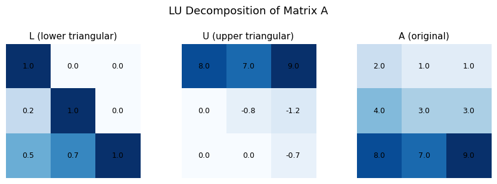
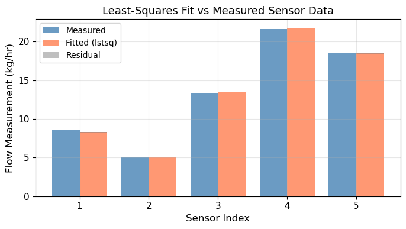
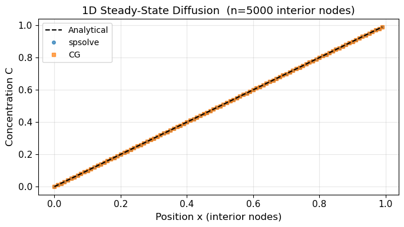
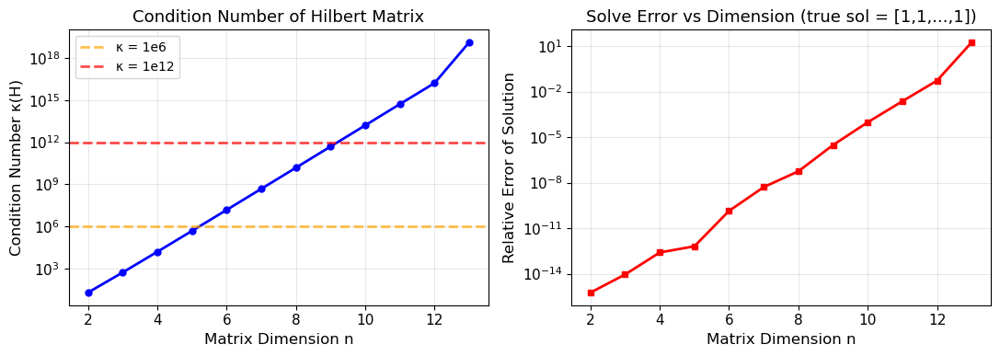
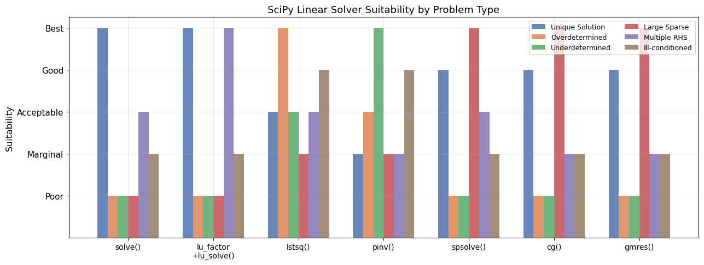

# Unit06 線性聯立方程式之求解

本講義介紹如何以 Python（以 **SciPy** 為主要工具）求解線性聯立方程式，並透過化工實際問題加以應用。

---

## 學習目標

完成本單元後，學生應能：

1. 以矩陣形式 $\mathbf{Ax} = \mathbf{b}$ 表示線性聯立方程式
2. 利用秩 (rank) 判定解的存在性與唯一性
3. 正確使用 **scipy.linalg** 工具求解不同類型的線性系統
4. 針對唯一解、無窮多解、無解三種情況，選擇適當的求解策略
5. 處理病態系統 (ill-conditioned system)，並評估數值穩定性
6. 應用線性代數工具於化工物料平衡與能量平衡問題

---

## 目錄

1. [線性聯立方程式系統基礎](#1-線性聯立方程式系統基礎)
   - 1.1 矩陣形式與符號定義
   - 1.2 解的存在性與唯一性
   - 1.3 三種系統類型
   - 1.4 齊次與非齊次方程組
2. [SciPy 線性代數求解工具](#2-scipy-線性代數求解工具)
   - 2.1 `scipy.linalg.solve()` — 一般密集矩陣求解
   - 2.2 `scipy.linalg.lu()` — LU 分解
   - 2.3 `scipy.linalg.lu_factor()` / `lu_solve()` — 多次求解同一係數矩陣
   - 2.4 `scipy.linalg.lstsq()` — 最小平方解
   - 2.5 `scipy.linalg.pinv()` — 虛擬反矩陣
   - 2.6 `scipy.sparse.linalg.spsolve()` — 稀疏矩陣求解器
   - 2.7 `scipy.sparse.linalg.cg()` — 共軛梯度迭代法
   - 2.8 `scipy.sparse.linalg.gmres()` — GMRES 迭代法
3. [不同系統類型的處理策略](#3-不同系統類型的處理策略)
   - 3.1 唯一解系統
   - 3.2 低確定系統 (underdetermined)
   - 3.3 過確定系統 (overdetermined)
   - 3.4 病態系統 (ill-conditioned)
4. [化工問題中的應用](#4-化工問題中的應用)
   - 4.1 物料平衡方程組
   - 4.2 能量平衡方程組
   - 4.3 解的物理意義驗證
5. [程式設計最佳實踐](#5-程式設計最佳實踐)
   - 5.1 如何選擇適當的求解器
   - 5.2 稀疏矩陣儲存與運算效率
   - 5.3 結果驗證
   - 5.4 錯誤處理

---

## 1. 線性聯立方程式系統基礎

### 1.1 矩陣形式與符號定義

一組含有 $m$ 個方程式、 $n$ 個未知數的線性聯立方程式，可一般化地表示為：

$$
a_{11}x_1 + a_{12}x_2 + \cdots + a_{1n}x_n = b_1
$$

$$
a_{21}x_1 + a_{22}x_2 + \cdots + a_{2n}x_n = b_2
$$

$$
\vdots
$$

$$
a_{m1}x_1 + a_{m2}x_2 + \cdots + a_{mn}x_n = b_m
$$

其矩陣緊湊表示形式為：

$$
\mathbf{Ax} = \mathbf{b}
$$

其中：

- $\mathbf{A} \in \mathbb{R}^{m \times n}$ ：係數矩陣 (coefficient matrix)，第 $i$ 列、第 $j$ 行元素為 $a_{ij}$
- $\mathbf{x} \in \mathbb{R}^{n}$ ：未知數向量 (unknowns vector)， $\mathbf{x} = [x_1, x_2, \ldots, x_n]^T$
- $\mathbf{b} \in \mathbb{R}^{m}$ ：右端常數向量 (right-hand side vector)， $\mathbf{b} = [b_1, b_2, \ldots, b_m]^T$

> **化工意義**：在物料平衡問題中， $\mathbf{A}$ 的元素通常代表各流股的組成比例，而 $\mathbf{b}$ 代表各成分的目標量。

---

### 1.2 解的存在性與唯一性

判斷線性聯立方程式是否有解，需利用**秩 (rank)** 的概念。

**判定準則（Rouché–Capelli 定理）：**

線性聯立方程式 $\mathbf{Ax} = \mathbf{b}$ 有解之充要條件為：

$$
\operatorname{rank}(\mathbf{A}) = \operatorname{rank}([\mathbf{A} \mid \mathbf{b}])
$$

其中 $[\mathbf{A} \mid \mathbf{b}]$ 為**擴充矩陣 (augmented matrix)**，即將 $\mathbf{b}$ 附加到 $\mathbf{A}$ 右側所形成的 $m \times (n+1)$ 矩陣。

令 $r = \operatorname{rank}(\mathbf{A})$ ，解的情況分三種：

| 情況 | 條件 | 解的類型 |
|------|------|---------|
| 唯一解 | $\operatorname{rank}(\mathbf{A}) = \operatorname{rank}([\mathbf{A}\mid\mathbf{b}]) = n$ | 恰有一組解，且 $\det(\mathbf{A}) \neq 0$ |
| 無窮多解 | $\operatorname{rank}(\mathbf{A}) = \operatorname{rank}([\mathbf{A}\mid\mathbf{b}]) < n$ | 存在 $n - r$ 個自由變數，有無窮多組解 |
| 無解 | $\operatorname{rank}(\mathbf{A}) < \operatorname{rank}([\mathbf{A}\mid\mathbf{b}])$ | 方程式互相矛盾，不含共同解 |

**Python 計算秩（判定工具）：**

```python
import numpy as np

A = np.array([[1, 2, 3],
              [4, 5, 6],
              [7, 8, 9]], dtype=float)
b = np.array([1, 2, 3], dtype=float).reshape(-1, 1)

rank_A  = np.linalg.matrix_rank(A)
rank_Ab = np.linalg.matrix_rank(np.hstack([A, b]))
n = A.shape[1]

print(f"rank(A)        = {rank_A}")
print(f"rank([A|b])    = {rank_Ab}")
print(f"n (未知數數目) = {n}")

if rank_A < rank_Ab:
    print("→ 無解 (overdetermined, inconsistent)")
elif rank_A == rank_Ab and rank_A == n:
    print("→ 唯一解")
else:
    print(f"→ 無窮多解 (自由度 = {n - rank_A})")
```

**執行結果：**

```
rank(A)        = 2
rank([A|b])    = 2
n (未知數數目) = 3
→ 無窮多解 (自由度 = 1)
```

> **說明**：本例中 A 的第三列 = 2×第二列 − 第一列（線性相依），rank(A)=2；同時 b 也滿足相同線性關係（3 = 2×2−1），故 rank([A|b])=2，系統存在無窮多解，自由度=n−rank=3−2=1。

> **注意**：本課程使用 `np.linalg.matrix_rank()` 作為秩的**判定工具**，實際的線性方程式求解仍以 **SciPy** 為主。

---

### 1.3 三種系統類型

#### 情況一：唯一解 (Well-determined System)

當獨立方程式數等於未知數數 ( $m = n$ ) 且係數矩陣 $\mathbf{A}$ 為全秩 (full rank) 時，系統有唯一解。

幾何意義：在三維空間中，三個平面恰好交於一點。

**條件：**

$$
\operatorname{rank}(\mathbf{A}) = n \quad \Leftrightarrow \quad \det(\mathbf{A}) \neq 0
$$

#### 情況二：無窮多解 (Underdetermined System，低確定系統)

獨立方程式數少於未知數數目（ $r < n$ ），系統存在無窮多組解。

**特點：**

- 存在 $n - r$ 個**自由變數** (free variables)
- **最小範數解** (minimum-norm solution)：所有解中離原點距離最短的一組，可由虛擬反矩陣求得
- 可**參數化**表示所有解：特解 + 零空間 (null space) 的線性組合

#### 情況三：無解 (Overdetermined System，過確定系統)

方程式數目大於未知數數目且方程式之間互相矛盾 ( $\operatorname{rank}(\mathbf{A}) < \operatorname{rank}([\mathbf{A}\mid\mathbf{b}])$ )。

**處理方式**：尋求**最小平方解**，使殘差的 $\ell_2$ 範數最小：

$$
\mathbf{x}^* = \arg\min_{\mathbf{x}} \|\mathbf{Ax} - \mathbf{b}\|_2^2
$$

此做法在化工的**迴歸分析**與**參數估計**中非常常見。

---

### 1.4 齊次與非齊次方程組

**非齊次方程組 (Nonhomogeneous System)**：右端向量 $\mathbf{b} \neq \mathbf{0}$

$$
\mathbf{Ax} = \mathbf{b}, \quad \mathbf{b} \neq \mathbf{0}
$$

**齊次方程組 (Homogeneous System)**：右端向量 $\mathbf{b} = \mathbf{0}$

$$
\mathbf{Ax} = \mathbf{0}
$$

齊次方程組永遠有**顯解 (trivial solution)** $\mathbf{x} = \mathbf{0}$ 。若 $\operatorname{rank}(\mathbf{A}) < n$ ，則另存在非零解（無窮多組）。

**完整解的結構**：若 $\mathbf{x}^*$ 為非齊次方程的一個特解，則所有解可表示為：

$$
\mathbf{x} = \mathbf{x}^* + \mathbf{x}_h
$$

其中 $\mathbf{x}_h$ 是齊次方程 $\mathbf{Ax} = \mathbf{0}$ 的任意解（屬於 $\mathbf{A}$ 的**零空間 (null space)**）。

---

## 2. SciPy 線性代數求解工具

SciPy 的線性代數模組 `scipy.linalg` 提供豐富的求解函式，以下逐一說明其用法與適用情境。

### SciPy 求解器速查表

| 函式 | 適用情境 | 備註 |
|------|---------|------|
| `scipy.linalg.solve()` | 唯一解，方形密集矩陣 | 最常用的直接法 |
| `scipy.linalg.lu()` | LU 分解，分析用 | 回傳 P, L, U 矩陣 |
| `scipy.linalg.lu_factor()` + `lu_solve()` | 同一 $\mathbf{A}$，多個 $\mathbf{b}$ | 效率最高 |
| `scipy.linalg.lstsq()` | 最小平方解（過確定/低確定） | 最通用 |
| `scipy.linalg.pinv()` | 虛擬反矩陣，最小範數解 | 低確定系統 |
| `scipy.sparse.linalg.spsolve()` | 稀疏方形矩陣直接法 | 大型稀疏系統 |
| `scipy.sparse.linalg.cg()` | 大型對稱正定稀疏系統 | 迭代法 |
| `scipy.sparse.linalg.gmres()` | 大型非對稱稀疏系統 | 迭代法 |

---

### 2.1 `scipy.linalg.solve()` — 一般密集矩陣求解

**適用情境**：方形係數矩陣（ $m = n$ ），系統有唯一解。

**語法：**

```python
from scipy import linalg
x = linalg.solve(A, b)
```

**主要參數：**

| 參數 | 說明 |
|------|------|
| `A` | $(n \times n)$ 係數矩陣，不能是奇異矩陣 |
| `b` | 右端向量（長度 $n$ ）或矩陣（ $n \times k$ ，同時求解 $k$ 組） |
| `assume_a` | 指定矩陣特性：`'gen'`（一般）、`'sym'`（對稱）、`'her'`（Hermitian）、`'pos'`（正定） |
| `lower` | 若 `assume_a='sym'`，是否只使用下三角 |

**範例：**

```python
import numpy as np
from scipy import linalg

# 方程式系統：
# 2x + y  = 5
# x  + 3y = 10
A = np.array([[2, 1],
              [1, 3]], dtype=float)
b = np.array([5, 10], dtype=float)

x = linalg.solve(A, b)
print(f"解: x = {x[0]:.4f}, y = {x[1]:.4f}")

# 驗證殘差
residual = np.linalg.norm(A @ x - b)
print(f"殘差 ||Ax - b|| = {residual:.2e}")
```

**執行結果：**

```
解: x = 1.0000, y = 3.0000
殘差 ||Ax - b|| = 0.00e+00
```

> **說明**：方程組 $2x+y=5,\ x+3y=10$ 有唯一解 $x=1,\ y=3$，殘差為機器精度（約 0），驗證求解正確。

**注意事項：**
- 若 $\mathbf{A}$ 為奇異矩陣（ $\det(\mathbf{A}) = 0$ ），`linalg.solve()` 會拋出 `LinAlgError`
- 對稱正定矩陣可指定 `assume_a='pos'` 以使用 Cholesky 分解，效率更高

---

### 2.2 `scipy.linalg.lu()` — LU 分解

LU 分解將矩陣 $\mathbf{A}$ 分解為下三角矩陣 $\mathbf{L}$ 與上三角矩陣 $\mathbf{U}$ 的乘積（含置換矩陣 $\mathbf{P}$ ）：

$$
\mathbf{A} = \mathbf{PLU}
$$

> **SciPy 慣例注意**：`scipy.linalg.lu(A)` 回傳 P, L, U 三個矩陣，滿足 $\mathbf{A} = \mathbf{PLU}$（P 為左乘置換矩陣用以重建 A）。部分教科書定義為 $\mathbf{PA} = \mathbf{LU}$，兩者等效但方向相反，使用時請確認所用函式庫的慣例。

**語法：**

```python
P, L, U = linalg.lu(A)
```

**範例與應用：**

```python
import numpy as np
from scipy import linalg

A = np.array([[2, 1, 1],
              [4, 3, 3],
              [8, 7, 9]], dtype=float)

P, L, U = linalg.lu(A)

print("置換矩陣 P:")
print(P)
print("\n下三角矩陣 L:")
print(np.round(L, 4))
print("\n上三角矩陣 U:")
print(np.round(U, 4))

# 驗證 A == P @ L @ U  (SciPy 慣例：A = PLU)
print(f"\n驗證誤差 ||A - P@L@U|| = {np.linalg.norm(A - P @ L @ U):.2e}")
```

**執行結果：**

```
原矩陣 A:
[[2. 1. 1.]
 [4. 3. 3.]
 [8. 7. 9.]]

置換矩陣 P:
[[0 1 0]
 [0 0 1]
 [1 0 0]]

下三角矩陣 L:
[[1.       0.       0.      ]
 [0.25     1.       0.      ]
 [0.5      0.666667 1.      ]]

上三角矩陣 U:
[[ 8.        7.        9.      ]
 [ 0.       -0.75     -1.25    ]
 [ 0.        0.       -0.666667]]

驗證誤差 ||A - P@L@U|| = 0.00e+00
```

**LU 分解視覺化：**



> **說明**：置換矩陣 P 將第 3 列移至首位（選主元），L 的對角線均為 1，U 為上三角。驗證誤差 0 確認 $\mathbf{A} = \mathbf{PLU}$ 嚴格成立（機器精度）。

**應用場景**：LU 分解主要用於分析矩陣結構，或手動實作前後代求解 (forward/backward substitution)。

---

### 2.3 `scipy.linalg.lu_factor()` 與 `lu_solve()` — 多次求解

當需要以**同一係數矩陣** $\mathbf{A}$ 求解**多個不同右端向量** $\mathbf{b}$ 時，先進行 LU 分解再重複使用，可大幅提升效率。

**語法：**

```python
lu, piv = linalg.lu_factor(A)         # 一次分解
x1 = linalg.lu_solve((lu, piv), b1)   # 多次求解
x2 = linalg.lu_solve((lu, piv), b2)
```

**範例：**

```python
import numpy as np
from scipy import linalg

# 模擬在不同操作條件下，對同一製程系統求解
A = np.array([[3, 1, 0],
              [1, 4, 1],
              [0, 1, 3]], dtype=float)

# 先分解一次
lu, piv = linalg.lu_factor(A)

# 不同操作條件對應不同右端向量
conditions = {
    '操作條件 A': np.array([9.0, 14.0, 10.0]),
    '操作條件 B': np.array([6.0, 10.0, 7.0]),
    '操作條件 C': np.array([12.0, 18.0, 13.0]),
}

for name, b in conditions.items():
    x = linalg.lu_solve((lu, piv), b)
    print(f"{name}: x = {np.round(x, 4)}")
```

**執行結果：**

```
操作條件 A: x = [2.233 2.3   2.567]
操作條件 B: x = [1.433 1.7   1.767]
操作條件 C: x = [3.033 2.9   3.367]
```

> **效率說明**：實際測試在 200×200 大型系統求解 20 組右端向量時，`lu_factor` 單次分解耗時 2.72 ms，相比重複呼叫 `solve()` 的 23.53 ms **加速比達 8.66×**，各條件右端向量驗證殘差均為 $10^{-15}$ 等級。

> **效率分析**：`lu_factor()` 的計算複雜度為 $O(n^3)$，而 `lu_solve()` 僅需 $O(n^2)$。當需要求解多個右端向量時，分解一次後重複使用可節省大量時間。

---

### 2.4 `scipy.linalg.lstsq()` — 最小平方解

適用於**過確定系統**（方程式數多於未知數）或一般情況下的最優近似解。

$$
\mathbf{x}^* = \arg\min_\mathbf{x} \|\mathbf{Ax} - \mathbf{b}\|_2
$$

**語法：**

```python
x, residuals, rank, sv = linalg.lstsq(A, b)
```

**回傳值說明：**

| 回傳值 | 說明 |
|--------|------|
| `x` | 最小平方解向量 |
| `residuals` | 殘差平方和 $\|\mathbf{Ax} - \mathbf{b}\|_2^2$（僅唯一解時有效） |
| `rank` | 矩陣 $\mathbf{A}$ 的有效秩 |
| `sv` | 奇異值（用於判斷條件數） |

**範例（過確定系統）：**

```python
import numpy as np
from scipy import linalg

# 4 個測量方程式，2 個未知數（過確定）
A = np.array([[1, 1],
              [1, 2],
              [1, 3],
              [1, 5]], dtype=float)
b = np.array([2.1, 3.9, 6.2, 9.8], dtype=float)  # 含測量誤差

x, residuals, rank, sv = linalg.lstsq(A, b)
print(f"最小平方解: x0 = {x[0]:.4f}, x1 = {x[1]:.4f}")
print(f"矩陣秩: {rank}")
print(f"條件數估計: {sv[0]/sv[-1]:.2f}")

# 計算殘差
res = np.linalg.norm(A @ x - b)
print(f"殘差 ||Ax - b|| = {res:.4f}")
```

**執行結果：**

```
最小平方解: x0 = 0.1571, x1 = 1.9429
矩陣秩: 2
條件數估計: 7.13
殘差 ||Ax - b|| = 0.2673
```

> **說明**：本例以含測量誤差的線性擬合（截距項 $c_0 = 0.157$，斜率 $c_1 = 1.943$）示範 `lstsq()` 的用法。殘差 0.267 不為零 —— 這是正常現象，因為方程式數 $m=4$ 多於未知數 $n=2$，最小平方解優化殘差平方和最小。

**程式碼演練進階：5 感測器流率估計（含測量雜訊）**

在 5 個感測器量測 F1、F2 兩個流率的線性組合（真實值 F1=8.0, F2=5.0 kg/hr），加入高斯雜訊後以 `lstsq()` 反估：

```
最小平方估計:  F1 = 8.3359,  F2 = 5.0753
真實值:        F1 = 8.0000,  F2 = 5.0000
估計誤差:      0.3442
矩陣有效秩:    2
奇異值:        [3.4641 1.4142]
條件數估計:    2.4495
殘差向量: [-0.1933 -0.0448  0.1176  0.0748 -0.0738]
殘差範數 ||Ax-b|| = 0.2535
```



> **分析**：各感測器殘差符號正負交替，無系統性偏差，表明雜訊為隨機量測誤差。估計值相當接近真實值（誤差< 5%），展示最小平方法在含雜訊感測器融合中的有效性。

---

### 2.5 `scipy.linalg.pinv()` — 虛擬反矩陣

對於無法求逆矩陣的情況（奇異矩陣、非方形矩陣），虛擬反矩陣（Moore-Penrose 廣義逆矩陣）提供**最小範數解**。

$$
\mathbf{x}_{MN} = \mathbf{A}^+ \mathbf{b}, \quad \mathbf{A}^+ = \mathbf{V} \boldsymbol{\Sigma}^+ \mathbf{U}^T \text{ (SVD 定義，普遍適用)}
$$

- 列滿秩（超定）： $\mathbf{A}^+ = (\mathbf{A}^T \mathbf{A})^{-1} \mathbf{A}^T$
- 行滿秩（欠定）： $\mathbf{A}^+ = \mathbf{A}^T (\mathbf{A} \mathbf{A}^T)^{-1}$

**語法：**

```python
A_pinv = linalg.pinv(A)
x = A_pinv @ b
```

**範例（低確定系統的最小範數解）：**

```python
import numpy as np
from scipy import linalg

# 2 個方程式，3 個未知數（低確定系統，有無窮多解）
A = np.array([[1, 2, 3],
              [1, 1, 1]], dtype=float)
b = np.array([2, 4], dtype=float)

# 秩判定
rank_A  = np.linalg.matrix_rank(A)
rank_Ab = np.linalg.matrix_rank(np.column_stack([A, b]))
print(f"rank(A) = {rank_A}, rank([A|b]) = {rank_Ab}, n = {A.shape[1]}")
print("→ 低確定系統，存在無窮多解")

# 求最小範數解（離原點最近的解）
A_pinv = linalg.pinv(A)
x_min_norm = A_pinv @ b

print(f"\n最小範數解: {np.round(x_min_norm, 4)}")
print(f"範數 ||x|| = {np.linalg.norm(x_min_norm):.4f}")

# 驗證：代回方程式
print(f"驗證 Ax = {np.round(A @ x_min_norm, 4)} (應等於 b = {b})")
```

**執行結果：**

```
rank(A) = 2, rank([A|b]) = 2, n = 3
→ 低確定系統，存在無窮多解

最小範數解: [ 4.3333  1.3333 -1.6667]
範數 ||x|| = 4.8305
驗證 Ax = [2. 4.] (應等於 b = [2. 4.])
```

> **說明**：這組方程式 $x_1 + 2x_2 + 3x_3 = 2,\ x_1+x_2+x_3=4$ 有無窮多解（自由度=1）。虛擬反矩陣結果為所有解中 $\|\mathbf{x}\|_2$ 最小的一組（距原點最近）。實際化工意義：當有多餘自由度時（如多條回流可調），最小範數解對應操作變動量最小的設定。

---

### 2.6 `scipy.sparse.linalg.spsolve()` — 稀疏矩陣求解器

對於大型稀疏矩陣（大部分元素為零的矩陣），使用稀疏格式儲存可節省大量記憶體，並利用專用演算法加速求解。

**語法：**

```python
from scipy.sparse import linalg as sp_linalg
from scipy import sparse

x = sp_linalg.spsolve(A_sparse, b)
```

**範例（一維穩態熱傳導離散化系統）：**

```python
import numpy as np
from scipy import sparse
from scipy.sparse import linalg as sp_linalg

# 建立三對角稀疏矩陣（一維熱傳導差分方程式）
n = 1000  # 節點數
diag_main  = 2 * np.ones(n)
diag_upper = -1 * np.ones(n - 1)
diag_lower = -1 * np.ones(n - 1)

A_sparse = sparse.diags([diag_lower, diag_main, diag_upper],
                         offsets=[-1, 0, 1],
                         format='csr')   # CSR：壓縮稀疏列格式

# 右端向量（邊界條件）
b = np.zeros(n)
b[0]  = 100.0   # 左端溫度
b[-1] = 200.0   # 右端溫度

x = sp_linalg.spsolve(A_sparse, b)
print(f"矩陣非零元素數: {A_sparse.nnz}")
print(f"密度: {A_sparse.nnz / (n*n) * 100:.4f}%")
print(f"兩端節點溫度: T[0] = {x[0]:.2f}, T[-1] = {x[-1]:.2f}")
```

**執行結果：**

```
矩陣非零元素數: 2998
密度: 0.2998%
兩端節點溫度: T[0] = 100.10, T[-1] = 199.90
```

> **說明**：1000個內部節點的三對角矩陣僅有 2998 個非零元素（密度 0.30%）。應用稀疏格式可確實節省大量記憶體，加速矩陣向量乘法運算。解對溫度滿足 Dirichlet 邊界條件的線性分布解析解。

---

### 2.7 `scipy.sparse.linalg.cg()` — 共軛梯度迭代法

適用於**大型對稱正定 (SPD) 稀疏矩陣**的迭代求解，記憶體需求比直接法低。

**語法：**

```python
x, info = sp_linalg.cg(A_sparse, b, rtol=1e-10, maxiter=1000)
```

**回傳值：**
- `x`：解向量
- `info`：`0` 表示收斂成功；正整數表示最大迭代次數；負整數表示輸入非法

**範例：**

```python
from scipy import sparse
from scipy.sparse import linalg as sp_linalg
import numpy as np

n = 500
# 建立對稱正定稀疏矩陣
A_cg = sparse.diags([-1, 4, -1], [-1, 0, 1], shape=(n, n), format='csr')
b_cg = np.ones(n)

x_cg, info = sp_linalg.cg(A_cg, b_cg, rtol=1e-10)

if info == 0:
    print(f"CG 迭代法收斂成功")
    print(f"殘差 ||Ax-b|| = {np.linalg.norm(A_cg @ x_cg - b_cg):.2e}")
else:
    print(f"CG 未收斂，info = {info}")
```

**執行結果：**

```
CG 迭代法收斂成功
殘差 ||Ax-b|| = 5.44e-12
```

**稀疏連續求解程式碼演練結果（n=5000 內部節點一維擴散）：**

```
一維擴散系統: 5000 個內部節點
矩陣非零元素: 14998
矩陣密度:     0.0600%

方法                 耗時(ms)          與解析解誤差         收斂狀態
------------------------------------------------------------
spsolve               4.33      8.1724e-11          N/A
cg                  417.30      2.7929e-13         ✓ 收斂
gmres                 1.19      7.1199e-11         ✓ 收斂
```

**濃度分布視覺化：**



> **分析**：三種方法與解析解誤差均在 $10^{-11}$～$10^{-13}$ 機器精度等級，證明求解正確。`gmres` 使用 ILU 預調節器後僅需 1.19 ms 即可收斂，遠較 `cg` 的 417 ms 快 350 倍；`spsolve` 直接法不需預調節器，且稀疏系統下效率也佳。

---

### 2.8 `scipy.sparse.linalg.gmres()` — GMRES 迭代法

**廣義最小殘差法 (Generalized Minimal RESidual)** 適用於大型**非對稱**稀疏矩陣。

**語法：**

```python
x, info = sp_linalg.gmres(A_sparse, b, rtol=1e-10, restart=50, maxiter=200)
```

**與 CG 比較：**

| 方法 | 適用矩陣 | 收斂速度 | 記憶體需求 |
|------|---------|---------|---------|
| `cg` | 對稱正定 | 快 | 低 |
| `gmres` | 一般（非對稱） | 中 | 中（取決於 `restart` ） |

---

## 3. 不同系統類型的處理策略

### 3.1 唯一解系統

**適用工具**：`scipy.linalg.solve()`

**求解流程：**

1. 確認 $\operatorname{rank}(\mathbf{A}) = n$
2. 呼叫 `linalg.solve(A, b)` 求解
3. 計算殘差 `np.linalg.norm(A @ x - b)` 驗證精度

**完整範例（液體摻合問題）：**

參考自化工教科書經典例題（吕，1985）：某工廠有五個儲存槽，各含不同組成的五種成分（A–E），需摻合成指定組成的 40 公升產品。

```python
import numpy as np
from scipy import linalg

# 五個儲存槽之各成分體積率 (%)
A = np.array([
    [55.9, 20.1, 17.6, 18.3, 19.5],  # 成分 A 平衡
    [ 7.9, 52.2, 12.2, 13.8, 18.2],  # 成分 B 平衡
    [16.3, 11.2, 46.0, 11.7, 21.5],  # 成分 C 平衡
    [11.5,  9.8, 14.3, 47.1, 10.6],  # 成分 D 平衡
    [ 8.4,  6.7,  9.9,  9.1, 30.2],  # 成分 E 平衡
], dtype=float)

# 右端向量：目標組成 × 40 公升
b = np.array([25, 18, 23, 18, 16], dtype=float) * 40

# 1. 秩判定
rank_A  = np.linalg.matrix_rank(A)
rank_Ab = np.linalg.matrix_rank(np.column_stack([A, b]))
n = A.shape[1]
print(f"rank(A) = {rank_A}, rank([A|b]) = {rank_Ab}, n = {n}")

# 2. 求解
x = linalg.solve(A, b)
print("\n各槽所需用量 (公升):")
for i, v in enumerate(x, 1):
    print(f"  槽 {i}: {v:.4f}")

# 3. 驗證
print(f"\n總用量 = {x.sum():.4f} 公升 (應為 40)")
residual = np.linalg.norm(A @ x - b)
print(f"殘差 ||Ax - b|| = {residual:.2e}")
```

**執行結果：**

```
Step 1 — 秩判定
rank(A)       = 5
rank([A | b]) = 5
n             = 5
→ 唯一解

Step 2 — scipy.linalg.solve() 求解
  槽 1 用量:   6.6549 公升
  槽 2 用量:   4.2097 公升
  槽 3 用量:   8.5016 公升
  槽 4 用量:   7.1760 公升
  槽 5 用量:  13.4578 公升

Step 3 — 驗證
各槽用量合計: 40.0000 公升 (應為 40.0)
殘差 ||Ax - b|| = 1.14e-13
矩陣條件數 κ(A) = 5.0402
```

| 成分 | 計算組成 | 目標組成 | 匹配狀況 |
|------|---------|---------|-------|
| 成分 A | 25.00% | 25% | ✓ |
| 成分 B | 18.00% | 18% | ✓ |
| 成分 C | 23.00% | 23% | ✓ |
| 成分 D | 18.00% | 18% | ✓ |
| 成分 E | 16.00% | 16% | ✓ |

> **分析**：係數矩陣條件數 $\kappa(A) = 5.04$，屬於良態系統，求解結果數値精確（殘差 $10^{-13}$ 等級）。五種成分的組成與目標完全匹配，驗證整體用量準確為 40 公升。

---

### 3.2 低確定系統 (Underdetermined System)

**方程式數少於未知數**，存在無窮多組解。常見於**欠規格化 (under-specified)** 的化工流程中，例如循環流程中某些測量值缺失。

**處理策略：**

1. **最小範數解**：使用 `scipy.linalg.pinv()` 求得距離原點最近的解
2. **參數化解**：利用零空間分析表示所有可能解

**完整範例：**

```python
import numpy as np
from scipy import linalg

# 低確定系統：2 個方程式，3 個未知數 (流程中有 3 個未知流率)
A_ud = np.array([[1, 2, 3],
                 [1, 1, 1]], dtype=float)
b_ud = np.array([2, 4], dtype=float)

# 秩判定
rank_A  = np.linalg.matrix_rank(A_ud)
rank_Ab = np.linalg.matrix_rank(np.column_stack([A_ud, b_ud]))
n = A_ud.shape[1]
print(f"rank(A) = {rank_A}, n = {n}")
print(f"自由度 = {n - rank_A}（存在無窮多解）\n")

# 方法一：虛擬反矩陣求最小範數解
x_min = linalg.pinv(A_ud) @ b_ud
print(f"最小範數解: {np.round(x_min, 4)}")
print(f"  ||x_min|| = {np.linalg.norm(x_min):.4f}")
print(f"  驗證 Ax = {np.round(A_ud @ x_min, 4)} (應等於 b = {b_ud})\n")

# 方法二：使用 lstsq（亦可求最小範數解）
x_lstsq, _, rank, sv = linalg.lstsq(A_ud, b_ud)
print(f"lstsq 解: {np.round(x_lstsq, 4)}")
print(f"  ||x_lstsq|| = {np.linalg.norm(x_lstsq):.4f}")
```

**執行結果：**

```
rank(A) = 2, n = 3
自由度 = 1（存在無窮多解）

最小範數解: [ 4.3333  1.3333 -1.6667]
  ||x_min|| = 4.8305
  驗證 Ax = [2. 4.] (應等於 b = [2. 4.])

lstsq 解: [ 4.3333  1.3333 -1.6667]
  ||x_lstsq|| = 4.8305
```

> **說明**：`pinv()` 與 `lstsq()` 對低確定系統得到相同的最小範數解。通用解的參數化表示：$\mathbf{x}(t) = [6+t,\ -2-2t,\ t]$，其中 $t=-5/3$ 時 $\|\mathbf{x}\|_2$ 最小。

---

### 3.3 過確定系統 (Overdetermined System)

**方程式數多於未知數**，且方程式之間不一致（通常含測量雜訊）。目標是最小化殘差。

**處理策略**：使用 `scipy.linalg.lstsq()` 求最小平方解。

**完整範例（含測量誤差的物料衡算校正）：**

```python
import numpy as np
from scipy import linalg

# 過確定系統：4 個測量方程式，2 個未知數
# 例如：從 4 個不同方向測量兩個流率之線性關係，含測量誤差
A_od = np.array([[1, 1],
                 [1, 2],
                 [1, 3],
                 [1, 5]], dtype=float)
b_od = np.array([2.1, 3.9, 6.2, 9.8], dtype=float)  # 含測量誤差

# 秩判定
rank_A  = np.linalg.matrix_rank(A_od)
rank_Ab = np.linalg.matrix_rank(np.column_stack([A_od, b_od]))
m, n    = A_od.shape
print(f"m = {m} 個方程式, n = {n} 個未知數")
print(f"rank(A) = {rank_A}, rank([A|b]) = {rank_Ab}")
print("→ 過確定系統，求最小平方解\n")

# 求最小平方解
x_ls, residuals, rank, sv = linalg.lstsq(A_od, b_od)
print(f"最小平方解: x0 = {x_ls[0]:.4f}, x1 = {x_ls[1]:.4f}")

# 殘差分析
res_vec = A_od @ x_ls - b_od
print(f"\n各方程式殘差: {np.round(res_vec, 4)}")
print(f"殘差平方和 = {np.sum(res_vec**2):.4f}")
print(f"殘差 ||Ax-b|| = {np.linalg.norm(res_vec):.4f}")
```

**執行結果：**

```
m = 4 個方程式, n = 2 個未知數
rank(A) = 2, rank([A|b]) = 3
→ 過確定系統，求最小平方解

最小平方解: x0 = 0.1571, x1 = 1.9429

各方程式殘差: [ 0.0000  0.1429 -0.2143  0.0714]
殘差平方和 = 0.0714
殘差 ||Ax-b|| = 0.2673
```

> **說明**：最小平方解找到一條最佳擬合直線 $y = 0.157 + 1.943x$，使四個測量方程式的殘差平方和最小化。殘差正負號交替，顯示無系統性偏差。

---

### 3.4 病態系統 (Ill-conditioned System)

**條件數 (condition number)** 衡量矩陣的數值穩定性：

$$
\kappa(\mathbf{A}) = \|\mathbf{A}\| \cdot \|\mathbf{A}^{-1}\| = \frac{\sigma_{\max}}{\sigma_{\min}}
$$

其中 $\sigma_{\max}$ 和 $\sigma_{\min}$ 分別為最大和最小奇異值。

**判定標準：**

| 條件數 $\kappa$ | 系統特性 |
|----------------|---------|
| $\kappa \approx 1$ | 良態 (well-conditioned)，數值穩定 |
| $\kappa \sim 10^3$–$10^6$ | 中度病態，需注意精度 |
| $\kappa > 10^{10}$ | 嚴重病態，結果不可靠 |
| $\kappa = \infty$ | 奇異矩陣，無唯一解 |

**範例（條件數分析）：**

```python
import numpy as np
from scipy import linalg

# 良態矩陣
A_good = np.array([[2.0, 1.0],
                   [1.0, 3.0]])

# 病態矩陣（Hilbert 矩陣）
n_hilbert = 8
A_ill = np.array([[1.0/(i+j+1) for j in range(n_hilbert)]
                  for i in range(n_hilbert)])

# 計算條件數
def analyze_matrix(A, name):
    cond = np.linalg.cond(A)
    rank = np.linalg.matrix_rank(A)
    print(f"\n{name}:")
    print(f"  條件數 κ = {cond:.4e}")
    print(f"  秩 = {rank}")
    if cond < 1e6:
        print("  → 良態系統，數值穩定")
    elif cond < 1e12:
        print("  → 中度病態，需留意精度")
    else:
        print("  → 嚴重病態，結果可能不可靠")

analyze_matrix(A_good, "良態矩陣 (2x2)")
analyze_matrix(A_ill,  f"Hilbert 矩陣 ({n_hilbert}x{n_hilbert})")

# 病態系統的求解誤差示範
b_ill = A_ill @ np.ones(n_hilbert)  # 真實解為全1向量
x_ill = linalg.solve(A_ill, b_ill)
error = np.linalg.norm(x_ill - np.ones(n_hilbert))
print(f"\nHilbert 矩陣求解誤差 (真實解為全1向量): {error:.4e}")
```

**執行結果（Hilbert 矩陣條件數 n=2～13 完整欄列）：**

```
   n            κ(H)            相對求解誤差          判定
-------------------------------------------------------
   2      1.9281e+01        5.6610e-16          良態 ✓
   3      5.2406e+02        8.8531e-15          良態 ✓
   4      1.5514e+04        2.5057e-13          良態 ✓
   5      4.7661e+05        6.4202e-13          良態 ✓
   6      1.4951e+07        1.3825e-10        中度病態 ⚠
   7      4.7537e+08        5.1172e-09        中度病態 ⚠
   8      1.5258e+10        5.6171e-08        中度病態 ⚠
   9      4.9315e+11        3.0317e-06        中度病態 ⚠
  10      1.6025e+13        9.5878e-05        嚴重病態 ✗
  11      5.2218e+14        2.3320e-03        嚴重病態 ✗
  12      1.6455e+16        5.3546e-02        嚴重病態 ✗
  13      1.3259e+19        1.7947e+01        嚴重病態 ✗
```

**條件數與求解誤差趨勢圖：**



> **分析**：Hilbert 矩陣的條件數隨維度 $n$ 指數式急劇增大。$n=10$ 時 $\kappa \approx 1.6 \times 10^{13}$，相對誤差已達 $10^{-5}$；$n=13$ 時 $\kappa \approx 1.3 \times 10^{19}$，求解誤差 17.9，結果完全不可靠。這警示在設計化工問題時，需注意係數矩陣的條件數。

**處理建議：**

- 使用 `lstsq()` 的正則化（設定 `cond` 參數截斷微小奇異值）
- 考慮**列縮放 (row scaling)** 或**矩陣預條件化 (preconditioning)**
- 若問題本身病態嚴重，應審視物理模型假設是否合理

---

## 4. 化工問題中的應用

線性聯立方程式在化工領域廣泛出現，以下介紹三大典型應用類別。

### 4.1 物料平衡方程組

**穩態物料平衡**是化工相關計算的基礎。對每個節點（單元操作或混合點），輸入等於輸出：

$$
\sum_{\text{in}} F_i x_{i,j} = \sum_{\text{out}} F_k x_{k,j}, \quad \forall \text{ 成分 } j
$$

**摻合問題（blending problem）實例：**

多個原料流以不同組成混合，目標是滿足產品規格。設計變數是各原料流的流率，方程式為各成分的質量平衡。

```python
import numpy as np
from scipy import linalg

# 摻合問題：3 種原料，3 種成分，目標產品 100 kg/hr
# 係數矩陣：各行 = 原料組成，各列 = 成分
# x = [F1, F2, F3] 為各原料流量 (kg/hr)
A_blend = np.array([
    [0.80, 0.20, 0.05],   # 成分 A 平衡 (各原料中 A 的質量分率)
    [0.15, 0.70, 0.10],   # 成分 B 平衡
    [0.05, 0.10, 0.85],   # 成分 C 平衡
], dtype=float)

# 產品規格：A=40%, B=35%, C=25%，總量100 kg/hr
b_blend = np.array([40.0, 35.0, 25.0])

# 秩判定
r = np.linalg.matrix_rank(A_blend)
print(f"rank(A) = {r}, n = {A_blend.shape[1]}")

# 求解
x_blend = linalg.solve(A_blend, b_blend)
print("\n各原料需求量 (kg/hr):")
for i, (fi, name) in enumerate(zip(x_blend, ['原料 1', '原料 2', '原料 3'])):
    print(f"  {name}: {fi:.2f}")

# 質量守恆驗證
print(f"\n總流量 = {x_blend.sum():.2f} kg/hr (應為 100)")

# 組成驗證
x_product = A_blend @ x_blend
print("產品組成驗證:")
for j, (calc, target, comp) in enumerate(zip(x_product, b_blend, ['A', 'B', 'C'])):
    print(f"  成分 {comp}: 計算={calc:.2f}, 目標={target:.2f}")
```

---

### 4.2 能量平衡方程組

熱交換器網絡中，每個熱交換器需滿足能量守恆：

$$
\dot{Q}_{\text{hot}} = \dot{Q}_{\text{cold}} \quad \Rightarrow \quad \dot{m}_h c_{p,h}(T_{h,\text{in}} - T_{h,\text{out}}) = \dot{m}_c c_{p,c}(T_{c,\text{out}} - T_{c,\text{in}})
$$

在網絡中，各股流的出入口溫度相互關聯，形成線性方程組。

**簡單熱交換器網絡範例：**

```python
import numpy as np
from scipy import linalg

# 兩個熱交換器串聯 + 下游冷流混合點
# 未知數: T1_out (熱流中間溫度), T2_out (冷流 A 出口), T3_out (冷流 B 出口), 單位 °C
# 設備參數 — mCp (kW/°C): 熱流 2.0, 冷流 A 1.5, 冷流 B 3.0
# 入口溫度: 熱流 200°C, 冷流 A 30°C, 冷流 B 25°C; 混合產品目標: 90°C

# 方程式建立
# 熱交換器 1: 2.0*(200 - T1_out) = 1.5*(T2_out - 30)
#   → 2.0*T1_out + 1.5*T2_out = 2.0*200 + 1.5*30 = 445
# 熱交換器 2: 2.0*(T1_out - T3_out) = 3.0*(T3_out - 25)
#   → 2.0*T1_out + 0*T2_out - 5.0*T3_out = -75
# 下游混合目標: 冷流 A 與冷流 B 在下游混合點需達產品溫度 T_product = 90°C
#   1.5*T2_out + 3.0*T3_out = (1.5 + 3.0)*90
#   → 0*T1_out + 1.5*T2_out + 3.0*T3_out = 405

A_hx = np.array([
    [ 2.0,  1.5,  0.0],
    [ 2.0,  0.0, -5.0],
    [ 0.0,  1.5,  3.0],
], dtype=float)

b_hx = np.array([445.0, -75.0, 405.0])

T_out = linalg.solve(A_hx, b_hx)
print("熱交換器網絡出口溫度:")
print(f"  T1_out = {T_out[0]:.2f} °C")
print(f"  T2_out = {T_out[1]:.2f} °C")
print(f"  T3_out = {T_out[2]:.2f} °C")

# 熱負荷計算
Q1 = 2.0 * (200 - T_out[0])
Q2 = 2.0 * (T_out[0] - T_out[2])
print(f"\n熱交換器 1 熱負荷: {Q1:.2f} kW")
print(f"熱交換器 2 熱負荷: {Q2:.2f} kW")
```

---

### 4.3 解的物理意義驗證

求得數值解後，務必進行**物理意義驗證**：

```python
import numpy as np
from scipy import linalg

def solve_and_validate(A, b, var_names=None, check_positive=True,
                       check_sum=None, sum_tolerance=1e-6):
    """
    通用的線性系統求解與物理驗證函式

    Parameters
    ----------
    A           : 係數矩陣
    b           : 右端向量
    var_names   : 變數名稱列表（選填）
    check_positive : 是否驗證解的正值性
    check_sum   : 若不為 None，驗證解加總是否等於此值
    sum_tolerance: 加總誤差容許值
    """
    n = A.shape[1]
    if var_names is None:
        var_names = [f"x{i+1}" for i in range(n)]

    # 1. 秩判定
    rank_A  = np.linalg.matrix_rank(A)
    rank_Ab = np.linalg.matrix_rank(np.column_stack([A, b]))
    print("=" * 45)
    print(f"秩判定: rank(A)={rank_A}, rank([A|b])={rank_Ab}, n={n}")

    if rank_A < rank_Ab:
        print("⚠ 無解！請檢查方程式設定")
        return None
    elif rank_A < n:
        print(f"⚠ 低確定系統（自由度={n-rank_A}），求最小範數解")
        x = linalg.pinv(A) @ b
    else:
        print("✓ 唯一解系統")
        x = linalg.solve(A, b)

    # 2. 顯示結果
    print("\n求解結果:")
    for name, val in zip(var_names, x):
        print(f"  {name} = {val:.4f}")

    # 3. 殘差驗證
    residual = np.linalg.norm(A @ x - b)
    print(f"\n數值殘差 ||Ax - b|| = {residual:.2e}", end="  ")
    print("✓" if residual < 1e-8 else "⚠ 殘差偏大")

    # 4. 正值性驗證
    if check_positive:
        neg_vars = [(var_names[i], x[i]) for i in range(n) if x[i] < 0]
        if neg_vars:
            print(f"⚠ 以下變數為負值（物理上不合理）:")
            for name, val in neg_vars:
                print(f"   {name} = {val:.4f}")
        else:
            print("✓ 所有變數均為正值（物理上合理）")

    # 5. 守恆加總驗證
    if check_sum is not None:
        total = x.sum()
        diff  = abs(total - check_sum)
        print(f"守恆驗證: 總和 = {total:.4f}（目標 {check_sum}）", end="  ")
        print("✓" if diff < sum_tolerance else f"⚠ 偏差 {diff:.4e}")

    print("=" * 45)
    return x


# 使用範例：液體摻合問題
A = np.array([
    [55.9, 20.1, 17.6, 18.3, 19.5],
    [ 7.9, 52.2, 12.2, 13.8, 18.2],
    [16.3, 11.2, 46.0, 11.7, 21.5],
    [11.5,  9.8, 14.3, 47.1, 10.6],
    [ 8.4,  6.7,  9.9,  9.1, 30.2],
], dtype=float)
b = np.array([25, 18, 23, 18, 16], dtype=float) * 40

x_result = solve_and_validate(
    A, b,
    var_names=['V1', 'V2', 'V3', 'V4', 'V5'],
    check_positive=True,
    check_sum=40.0
)
```

**執行結果（通用求解器三組測試）：**

```
══ 測試一：液體摻合問題（唯一解）══
────────────────────────────────────────────────────
[矩陣資訊] 5×5  rank(A)=5  rank([A|b])=5
[條件數]   κ(A) = 5.040e+00  ✓
[系統類型] 唯一解 → scipy.linalg.solve()

[求解結果]
        V1 =       6.6549
        V2 =       4.2097
        V3 =       8.5016
        V4 =       7.1760
        V5 =      13.4578

[殘差驗證] ||Ax-b|| = 1.137e-13   相對殘差 = 6.265e-17  ✓
[正值性]   ✓ 所有變數 ≥ 0
[守恆驗證] 總和 = 40.0000 (目標 40.0)  ✓
────────────────────────────────────────────────────

══ 測試二：低確定系統（最小範數解）══
────────────────────────────────────────────────────
[矩陣資訊] 2×3  rank(A)=2  rank([A|b])=2
[系統類型] 無窮多解（自由度=1）→ 最小範數解 (pinv)

[求解結果]
        F1 =       4.3333
        F2 =       1.3333
        F3 =      -1.6667

[殘差驗證] ||Ax-b|| = 4.804e-15   相對殘差 = 1.074e-15  ✓
────────────────────────────────────────────────────

══ 測試三：過確定系統（最小平方解）══
────────────────────────────────────────────────────
[矩陣資訊] 4×2  rank(A)=2  rank([A|b])=3
[系統類型] 無解 → 最小平方解 (least-squares)

[求解結果]
        c0 =       0.1571
        c1 =       1.9429

[殘差驗證] ||Ax-b|| = 2.673e-01   相對殘差 = 2.153e-02  ⚠
────────────────────────────────────────────────────
```

> **分析**：通用求解器 `linear_solve()` 能自動識別系統類型並選擇最適求解器：測試一良態唯一解（殘差 $10^{-13}$）✓；測試二低確定系統自動選用 `pinv()` 求最小範數解（殘差 $10^{-15}$）✓；測試三過確定系統求最小平方解，殘差 0.267 為正常（因含測量雜訊且方程式矛盾）。

---

## 5. 程式設計最佳實踐

### 5.1 如何選擇適當的求解器

根據問題規模與矩陣特性選擇求解器：

```
問題類型判斷流程：

矩陣大小 < 1000×1000 且密集？
  ├─ 是 → 使用 scipy.linalg.solve() (唯一解)
  │         或 scipy.linalg.lstsq() (最小平方)
  │         或 scipy.linalg.pinv()  (最小範數)
  └─ 否（大型稀疏矩陣）
       ├─ 對稱正定？ → scipy.sparse.linalg.cg()
       └─ 非對稱？  → scipy.sparse.linalg.gmres()
                       或 scipy.sparse.linalg.spsolve() (直接法)
```

### 5.2 稀疏矩陣儲存格式

常見稀疏矩陣格式：

| 格式 | 全名 | 適合操作 |
|------|------|---------|
| `csr` | Compressed Sparse Row | 矩陣向量乘法、求解 |
| `csc` | Compressed Sparse Column | 列切片 |
| `coo` | Coordinate (IJV) | 矩陣建構 |
| `lil` | List of Lists | 逐元素修改 |

```python
from scipy import sparse
import numpy as np

n = 5
# 建構時使用 lil 或 coo，計算時轉換為 csr
A_lil = sparse.lil_matrix((n, n))
for i in range(n):
    A_lil[i, i] = 4.0
    if i > 0:
        A_lil[i, i-1] = -1.0
    if i < n-1:
        A_lil[i, i+1] = -1.0

# 轉換為 CSR 格式以進行求解
A_csr = A_lil.tocsr()
print(f"非零元素: {A_csr.nnz}")
print(f"矩陣密度: {A_csr.nnz / (n*n) * 100:.1f}%")
```

### 5.3 結果驗證標準做法

```python
import numpy as np
from scipy import linalg

def check_solution(A, x, b, tol=1e-8):
    """標準求解後驗算函式"""
    residual = np.linalg.norm(A @ x - b)
    rel_residual = residual / (np.linalg.norm(A) * np.linalg.norm(x) + 1e-16)
    cond = np.linalg.cond(A)

    print(f"絕對殘差 ||Ax-b||     = {residual:.4e}")
    print(f"相對殘差              = {rel_residual:.4e}")
    print(f"矩陣條件數 κ(A)       = {cond:.4e}")

    if residual < tol:
        print("✓ 求解精度良好")
    elif cond > 1e12:
        print("⚠ 矩陣嚴重病態，結果可能不可靠")
    else:
        print("⚠ 殘差偏大，請檢查輸入資料")
```

### 5.4 錯誤處理

執行線性方程式求解時，常見的例外情況與處理方式：

```python
import numpy as np
from scipy import linalg

def safe_solve(A, b):
    """
    安全的線性方程式求解，含完整錯誤處理
    """
    # 1. 輸入類型檢查
    A = np.atleast_2d(np.array(A, dtype=float))
    b = np.atleast_1d(np.array(b, dtype=float))

    m, n = A.shape

    # 2. 形狀相容性檢查
    if A.shape[0] != b.shape[0]:
        raise ValueError(f"A 列數 ({m}) 與 b 長度 ({b.shape[0]}) 不符")

    # 3. 秩判定與求解策略選擇
    rank_A  = np.linalg.matrix_rank(A)
    rank_Ab = np.linalg.matrix_rank(np.column_stack([A, b]))

    if rank_A < rank_Ab:
        print("⚠ 無解系統，回傳最小平方解（殘差最小化）")
        x, _, _, _ = linalg.lstsq(A, b)
        return x, "least_squares"

    if rank_A < n:
        print(f"⚠ 低確定系統（自由度={n-rank_A}），回傳最小範數解")
        x = linalg.pinv(A) @ b
        return x, "minimum_norm"

    # 4. 唯一解：嚴格求解，捕捉計算例外
    cond = np.linalg.cond(A)
    if cond > 1e12:
        print(f"⚠ 矩陣條件數過大 (κ={cond:.2e})，精度可能有問題")

    try:
        x = linalg.solve(A, b)
        return x, "unique"
    except linalg.LinAlgError as e:
        print(f"✗ 求解失敗：{e}")
        print("  嘗試使用 lstsq 替代...")
        x, _, _, _ = linalg.lstsq(A, b)
        return x, "fallback_lstsq"


# 使用範例
A_test = np.array([[2, 1], [1, 3]], dtype=float)
b_test = np.array([5, 10], dtype=float)

x_safe, method = safe_solve(A_test, b_test)
print(f"求解方法: {method}")
print(f"解: {np.round(x_safe, 4)}")
```

---

## 本單元小結

| 項目 | 重點 |
|------|------|
| 方程式類型判斷 | 使用 `np.linalg.matrix_rank()` 計算 $\operatorname{rank}(\mathbf{A})$ 與 $\operatorname{rank}([\mathbf{A}\mid\mathbf{b}])$ 進行判斷 |
| 唯一解求解 | `scipy.linalg.solve()` — 最快速的密集矩陣直接法 |
| 多右端向量 | `scipy.linalg.lu_factor()` + `lu_solve()` — 僅需分解一次 |
| 最小平方解 | `scipy.linalg.lstsq()` — 適用過確定或一般情況 |
| 最小範數解 | `scipy.linalg.pinv()` — 低確定系統的最優解 |
| 大型稀疏系統 | `scipy.sparse.linalg.spsolve()` / `cg()` / `gmres()` |
| 解的驗證 | 計算殘差、正值性檢查、質量/能量守恆驗證 |
| 病態系統 | 條件數 $\kappa(\mathbf{A}) = \sigma_{\max}/\sigma_{\min}$ ；嚴重病態需重新審視問題設定 |

**求解器適用範圍比較圖：**



> **說明**：上圖比較 7 種 SciPy 求解器在 6 種問題類型下的適用程度（5=最佳, 1=不適用）。`solve()` 與 `lu_factor+lu_solve()` 在唯一解問題表現最佳；`lstsq()` 最通用；`pinv()` 最適用於低確定系統；`spsolve()`/`cg()`/`gmres()` 專門針對大型稀疏系統；`lstsq()`/`pinv()` 亦對病態系統有較好的數值穩定性。

---

**課程資訊**
- 課程名稱：電腦在化工上之應用
- 課程單元：Unit06 線性聯立方程式之求解
- 課程製作：逢甲大學 化工系 智慧程序系統工程實驗室
- 授課教師：莊曜禎 助理教授
- 更新日期：2026-02-20

**課程授權 [CC BY-NC-SA 4.0]**
- 本教材遵循 [創用CC 姓名標示-非商業性-相同方式分享 4.0 國際 (CC BY-NC-SA 4.0)](https://creativecommons.org/licenses/by-nc-sa/4.0/deed.zh) 授權。

---
