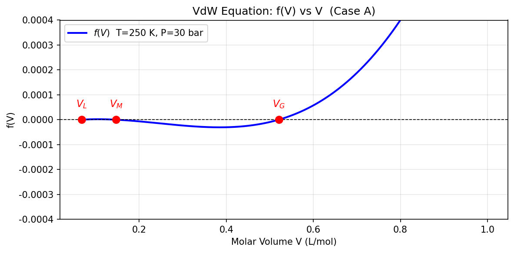
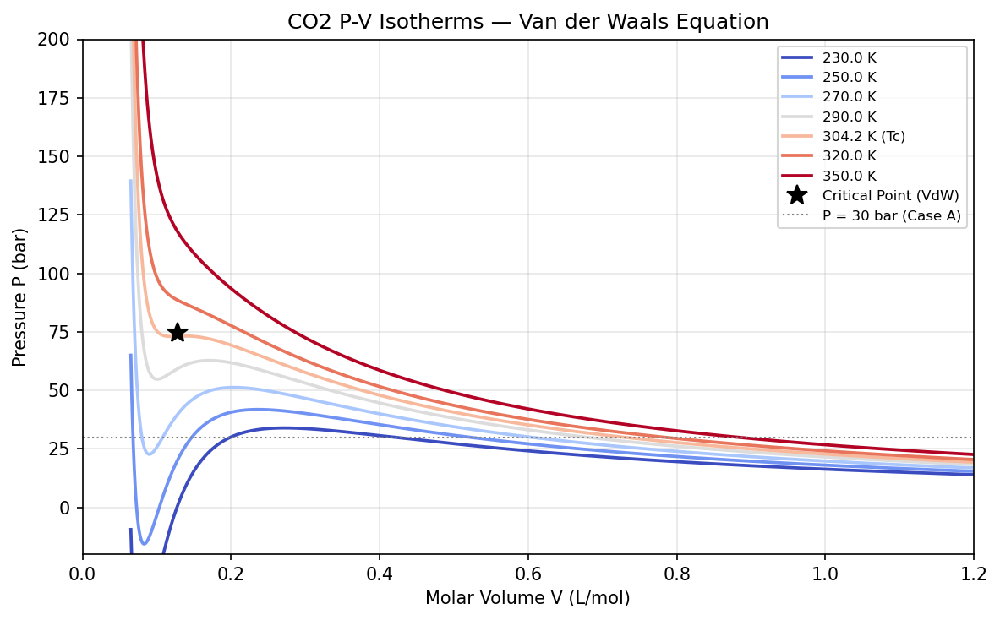
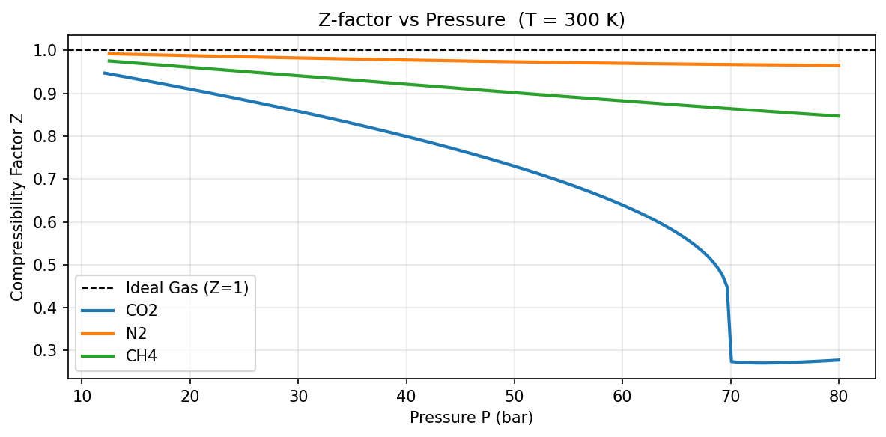

# Unit07 Example 01 - Van der Waals 狀態方程式

## 學習目標

在本範例中，我們以 Van der Waals (VdW) 狀態方程式為主題，深入探討單變數非線性方程式的求解技巧。VdW 方程式是最早提出的實際氣體方程式之一，能夠定性描述氣液兩相行為，是學習非線性求根方法的經典化工案例。

學習完本範例後，您將能夠：

- 將 VdW 狀態方程式轉化為關於莫耳體積 $V$ 的非線性方程式 $f(V) = 0$
- 繪製 VdW 函數圖形，以圖形法判斷根的數量與位置
- 繪製 $P$-$V$ 等溫線，理解氣液兩相的熱力學意義
- 使用 Bisection 法與 Newton-Raphson 法自行實作求根演算法
- 熟練使用 `scipy.optimize.root_scalar()` 多種求解方法（brentq、newton、secant）
- 透過起始猜測值策略分別找出氣相根與液相根
- 比較理想氣體方程式與 VdW 方程式的計算結果差異
- 驗證計算結果的物理合理性（壓縮因子、莫耳體積範圍）

---

## 1. 問題描述

### 1.1 化工背景

在化工過程計算中，我們需要頻繁計算流體的熱力學性質，例如給定溫度 $T$ 和壓力 $P$ 時，計算流體的莫耳體積 $V$（或密度）。這個計算是後續計算逸度、焓、熵等性質的基礎。

**理想氣體方程式** $PV = RT$ 雖然簡單，但在高壓或低溫條件下誤差很大。**實際氣體方程式**如 Van der Waals 方程式則修正了分子間作用力和分子體積的影響：

$$\left( P + \frac{a}{V^2} \right)(V - b) = RT$$

其中：
- $P$：壓力 (Pa)
- $V$：莫耳體積 (m³/mol)
- $T$：溫度 (K)
- $R = 8.314$ J/(mol·K)：氣體常數
- $a$：分子間引力修正參數 (Pa·m⁶/mol²)
- $b$：分子體積修正參數 (m³/mol)

### 1.2 求解問題

**已知**：溫度 $T$ 、壓力 $P$ 及物質的 VdW 參數 $a$、$b$

**求解**：莫耳體積 $V$，即求解以下非線性方程式：

$$f(V) = \left( P + \frac{a}{V^2} \right)(V - b) - RT = 0$$

本範例以 **CO₂（二氧化碳）** 為例，其 VdW 參數與臨界性質如下：

| 性質 | 符號 | 數值 | 單位 |
|------|------|------|------|
| VdW 引力參數 | $a$ | 0.3658 | Pa·m⁶/mol² |
| VdW 體積參數 | $b$ | 4.267×10⁻⁵ | m³/mol |
| 臨界溫度 | $T_c$ | 304.2 | K |
| 臨界壓力 | $P_c$ | 73.8 | bar |
| 偏心因子 | $\omega$ | 0.225 | — |

### 1.3 計算工況

本範例探討兩種不同操作條件，以展示 VdW 方程式的多根現象：

| 工況 | 溫度 $T$ | 壓力 $P$ | 說明 |
|------|---------|---------|------|
| **工況 A** | 250 K | 30 bar | $T < T_c$，在兩相包絡線內，預期三個根 |
| **工況 B** | 350 K | 100 bar | $T > T_c$，超臨界流體，預期一個根 |

---

## 2. 數學模型

### 2.1 方程式整理

將 VdW 方程式展開整理，可得關於 $V$ 的**三次多項式**：

$$f(V) = \left( P + \frac{a}{V^2} \right)(V - b) - RT = 0$$

展開後：

$$PV - Pb + \frac{a}{V} - \frac{ab}{V^2} - RT = 0$$

兩邊乘以 $V^2$，整理為標準三次多項式形式：

$$PV^3 - (Pb + RT)V^2 + aV - ab = 0$$

或等價地以 **壓縮因子** $Z = PV/(RT)$ 表示為：

$$Z^3 - \left(1 + B'\right)Z^2 + A'Z - A'B' = 0$$

其中：

$$A' = \frac{aP}{(RT)^2}, \quad B' = \frac{bP}{RT}$$

### 2.2 根的物理意義

三次方程式最多有三個實數根，每個根對應不同的物理相態：

| 根 | 大小 | 物理意義 |
|----|------|---------|
| 最小根 $V_L$ | $V_L \approx b \sim 數倍\,b$ | **液相**莫耳體積 |
| 中間根 $V_M$ | 介於 $V_L$ 和 $V_G$ 之間 | 數學根，**無物理意義**（$(∂P/∂V)_T > 0$，熱力學不穩定） |
| 最大根 $V_G$ | $V_G \approx RT/P$（接近理想氣體） | **氣相**莫耳體積 |

**根的數量取決於操作條件**：
- 若 $T < T_c$ 且壓力在飽和壓力附近：**三個根**（兩相區內）
- 若 $T > T_c$ 或遠離飽和線：**一個根**（單相流體）

### 2.3 導函數（Newton-Raphson 法所需）

對 $f(V)$ 求導，得：

$$f'(V) = \frac{df}{dV} = P + \frac{a}{V^2} - \frac{2a(V-b)}{V^3}$$

或等效整理為：

$$f'(V) = P - \frac{a}{V^2} + \frac{2ab}{V^3}$$

---

## 3. 圖形分析

### 3.1 f(V) 函數圖形

在進行數值求解前，先用圖形法觀察 $f(V)$ 的零交叉位置，是確定起始猜測值的最佳策略。

以 **工況 A**（$T = 250$ K，$P = 30$ bar）的 CO₂ 為例，繪製 $f(V)$ vs. $V$ 圖形：

```python
# 工況 A: CO2, T=250K, P=30bar (兩相區內，預期三根)
T_a = cases["A"]["T"]
P_a = cases["A"]["P"]

V_arr = np.linspace(6.5e-5, 1.0e-3, 2000)   # V > b = 4.267e-5 m3/mol
f_arr = vdw_eq(V_arr, T_a, P_a, a_co2, b_co2)

# 先用 brentq 找出三根位置，用於圖形標記
_bracks_plot = []
_V_scan = np.linspace(6.5e-5, 1.0e-3, 5000)
_f_scan = vdw_eq(_V_scan, T_a, P_a, a_co2, b_co2)
for _i in range(len(_f_scan) - 1):
    if _f_scan[_i] * _f_scan[_i+1] < 0:
        _bracks_plot.append((_V_scan[_i], _V_scan[_i+1]))
_roots_plot = [brentq(vdw_eq, va, vb, args=(T_a, P_a, a_co2, b_co2)) for va, vb in _bracks_plot]
_root_annots = ["$V_L$", "$V_M$", "$V_G$"]

fig, ax = plt.subplots(figsize=(8, 4))
ax.plot(V_arr * 1e3, f_arr, "b-", lw=2, label=f"$f(V)$  T={T_a:.0f} K, P={P_a/1e5:.0f} bar")
ax.axhline(0, color="k", lw=0.8, ls="--")

# 標記三個根
for _vr, _ann in zip(_roots_plot, _root_annots):
    ax.plot(_vr * 1e3, 0, "ro", ms=8, zorder=5)
    ax.annotate(_ann, xy=(_vr * 1e3, 0),
                xytext=(0, 14), textcoords="offset points",
                ha="center", fontsize=11, color="red")

ax.set_xlabel("Molar Volume V (L/mol)")
ax.set_ylabel("f(V)")
ax.set_title("VdW Equation: f(V) vs V  (Case A)")
ax.set_ylim(-4e-4, 4e-4)
ax.legend()
ax.grid(True, alpha=0.3)
plt.tight_layout()

# 儲存圖檔
fig_path = FIG_DIR / 'fig_01_fV_plot.png'
plt.savefig(fig_path, dpi=150, bbox_inches='tight')
print(f"✓ 圖檔已儲存: {fig_path}")
plt.show()
```

**執行輸出：**
```
✓ 圖檔已儲存: d:\MyGit\ChemE-3502\Unit07\outputs\Unit07_Example_01\figs\fig_01_fV_plot.png
```

**執行結果圖：**



**圖形分析：**

執行後可清楚觀察到：

1. **三個過零點**：$f(V)$ 曲線在三處穿越 $x$ 軸，根的位置以**紅色圓點**（`"ro"`）標記，對應 VdW 方程式的三個根
2. **液相根 $V_L$**（左側，~0.068 L/mol）：體積最小，對應高密度液態 CO₂
3. **中間根 $V_M$**（中間，~0.147 L/mol）：熱力學不穩定解，無物理意義
4. **氣相根 $V_G$**（右側，~0.520 L/mol）：體積最大，對應低密度氣態 CO₂
5. **三個根的標記**：紅色圓點精確標示出三個根的位置，並以 LaTeX 符號標註

此圖形清楚展示了 VdW 方程式在兩相區（$T < T_c$）的多根特性，為後續數值求解提供可靠的起始猜測範圍。

### 3.2 P-V 等溫線

繪製 VdW 方程式的 $P$-$V$ 等溫線，可以清楚看到氣液兩相共存區域（VdW 迴圈）：

$$P = \frac{RT}{V - b} - \frac{a}{V^2}$$

在 $T < T_c$ 下，等溫線出現 **Van der Waals 迴圈（loop）**，即壓力先下降再上升再下降的 S 形曲線。這個不物理的部分對應到三個方程式根：

- 曲線下降段（$(\partial P / \partial V)_T < 0$）：物理上穩定的氣相或液相
- 曲線上升段（$(\partial P / \partial V)_T > 0$）：熱力學**不穩定區**，對應中間根

```python
# 繪製多條等溫線
T_list = [230, 250, 270, 290, 304.2, 320, 350]   # [K]
colors  = plt.cm.coolwarm(np.linspace(0, 1, len(T_list)))

V_iso = np.linspace(6.5e-5, 1.2e-3, 2000)  # m3/mol

fig, ax = plt.subplots(figsize=(8, 5))

for T_iso, col in zip(T_list, colors):
    lbl = f"{T_iso:.1f} K" + (" (Tc)" if T_iso == 304.2 else "")
    P_iso = R * T_iso / (V_iso - b_co2) - a_co2 / V_iso**2
    ax.plot(V_iso * 1e3, P_iso / 1e5, color=col, lw=1.8, label=lbl)

# 標記臨界點
Vc_co2 = 3 * b_co2           # VdW: Vc = 3b
Pc_vdw = a_co2 / (27 * b_co2**2)
ax.plot(Vc_co2 * 1e3, Pc_vdw / 1e5, "k*", ms=12, zorder=5, label="Critical Point (VdW)")

ax.axhline(30, color="gray", ls=":", lw=1, label="P = 30 bar (Case A)")
ax.set_xlim(0, 1.2)
ax.set_ylim(-20, 200)
ax.set_xlabel("Molar Volume V (L/mol)")
ax.set_ylabel("Pressure P (bar)")
ax.set_title("CO2 P-V Isotherms — Van der Waals Equation")
ax.legend(fontsize=8, loc="upper right")
ax.grid(True, alpha=0.3)
plt.tight_layout()

# 儲存圖檔
fig_path = FIG_DIR / 'fig_02_PV_isotherms.png'
plt.savefig(fig_path, dpi=150, bbox_inches='tight')
print(f"✓ 圖檔已儲存: {fig_path}")
print(f"VdW Critical Point: Tc={Tc_co2} K, Vc={Vc_co2*1e3:.4f} L/mol, Pc={Pc_vdw/1e5:.2f} bar")
plt.show()
```

**執行輸出：**
```
✓ 圖檔已儲存: d:\MyGit\ChemE-3502\Unit07\outputs\Unit07_Example_01\figs\fig_02_PV_isotherms.png
VdW Critical Point: Tc=304.2 K, Vc=0.1280 L/mol, Pc=74.41 bar
```

**執行結果圖：**



**圖形分析：**

此圖展示了 CO₂ 在不同溫度下的等溫線特徵：

1. **低溫曲線（230-290 K）**：
   - 呈現明顯的 **Van der Waals 迴圈**（S 形彎曲）
   - 曲線上升段（中間部分）對應熱力學不穩定區域，違反 $(\partial P / \partial V)_T < 0$ 條件
   - 左側下降段為液相區，右側下降段為氣相區
   
2. **臨界等溫線（304.2 K, Tc）**：
   - 粗線標示，恰好通過臨界點（黑色星號）
   - 在臨界點處斜率為零，$(\partial P / \partial V)_T = 0$
   - VdW 預測：$V_c = 0.1280$ L/mol，$P_c = 74.41$ bar（與實驗值 73.8 bar 接近）

3. **超臨界曲線（320-350 K）**：
   - 紅色高溫曲線，無迴圈現象
   - 單調遞減，不存在液氣兩相區
   - 對應 VdW 方程式的單根情況

4. **工況 A 標記（灰色虛線）**：
   - P = 30 bar 水平線與 250 K 等溫線相交於三點
   - 清楚展示為何工況 A 有三個根（兩相區內）

此圖為理解 VdW 方程式的**多根物理意義**提供了直觀的幾何解釋。

---

## 4. 數值求解

### 4.1 工況 A：三根系統（$T = 250$ K，$P = 30$ bar）

#### 掃描符號變化區間

使用掃描法自動偵測符號變化區間，為 Bisection 法或 Brent 法提供可靠的起始區間：

```python
def sign_scan(T, P, a, b, n_pts=5000):
    """掃描 f(V) 符號改變，回傳 [(Va, Vb), ...] 的 bracket 列表"""
    V_scan = np.linspace(1.05 * b, 2e-3, n_pts)
    f_scan = vdw_eq(V_scan, T, P, a, b)
    brackets = []
    for i in range(len(f_scan) - 1):
        if f_scan[i] * f_scan[i+1] < 0:
            brackets.append((V_scan[i], V_scan[i+1]))
    return brackets

# Case A
T_a, P_a = cases["A"]["T"], cases["A"]["P"]
brackets_A = sign_scan(T_a, P_a, a_co2, b_co2)

print("Case A — Sign-change brackets found:")
for i, (va, vb) in enumerate(brackets_A):
    fa = vdw_eq(va, T_a, P_a, a_co2, b_co2)
    fb = vdw_eq(vb, T_a, P_a, a_co2, b_co2)
    print(f"  Bracket {i+1}: V in [{va*1e3:.5f}, {vb*1e3:.5f}] L/mol  "
          f"  f(Va)={fa:.3e}, f(Vb)={fb:.3e}")
```

**執行輸出：**
```
Case A — Sign-change brackets found:
  Bracket 1: V in [0.06788, 0.06827] L/mol    f(Va)=-6.856e-09, f(Vb)=3.503e-08
  Bracket 2: V in [0.14689, 0.14728] L/mol    f(Va)=2.315e-08, f(Vb)=-1.149e-08
  Bracket 3: V in [0.52040, 0.52079] L/mol    f(Va)=-5.522e-09, f(Vb)=1.930e-07
```

**結果分析：**

成功找到三個符號變化區間，分別對應：
- **Bracket 1**：液相根 $V_L \approx 0.068$ L/mol（左側最小根）
- **Bracket 2**：中間不穩定根 $V_M \approx 0.147$ L/mol
- **Bracket 3**：氣相根 $V_G \approx 0.520$ L/mol（右側最大根）

每個區間的兩端函數值符號相反（一正一負），確保 Brent 法可以在此區間內精確求根。

#### 分別求解三個根

```python
def solve_vdw_roots(T, P, a, b, label=""):
    """使用 sign_scan + brentq 求 VdW 方程式所有根"""
    brackets = sign_scan(T, P, a, b)
    roots = []
    for va, vb in brackets:
        V_root = brentq(vdw_eq, va, vb, args=(T, P, a, b), xtol=1e-14)
        Z = P * V_root / (R * T)
        stab = check_stability(V_root, T, a, b)
        roots.append({"V": V_root, "Z": Z, "stability": stab})
    return roots

# Case A
roots_A = solve_vdw_roots(T_a, P_a, a_co2, b_co2)
root_labels = ["Liquid (VL)", "Unstable (VM)", "Gas (VG)"]

print(f"Case A  T={T_a:.0f} K  P={P_a/1e5:.0f} bar")
print(f"{'Root':<18} {'V (L/mol)':>12} {'Z':>8} {'Stability':>12}")
print("-" * 54)
for i, r in enumerate(roots_A):
    lbl = root_labels[i] if i < len(root_labels) else f"Root {i+1}"
    print(f"{lbl:<18} {r['V']*1e3:>12.5f} {r['Z']:>8.4f} {r['stability']:>12}")
```

**執行輸出：**
```
Case A  T=250 K  P=30 bar
Root                  V (L/mol)        Z    Stability
------------------------------------------------------
Liquid (VL)             0.06794   0.0981       stable
Unstable (VM)           0.14715   0.2124     UNSTABLE
Gas (VG)                0.52041   0.7511       stable
```

**實際結果分析**（CO₂，$T = 250$ K，$P = 30$ bar）：

| 根 | 莫耳體積 V (L/mol) | 壓縮因子 Z | 物理意義 | 穩定性 |
|----|------------------|----------|---------|--------|
| $V_L$（液相根） | 0.06794 | 0.0981 | 液態 CO₂，高密度 | stable ✅ |
| $V_M$（中間根） | 0.14715 | 0.2124 | 熱力學不穩定 | UNSTABLE ❌ |
| $V_G$（氣相根） | 0.52041 | 0.7511 | 氣態 CO₂ | stable ✅ |

**關鍵觀察：**
1. **液相根**：$Z = 0.0981 \ll 1$，顯示液態 CO₂ 在高壓下被嚴重壓縮
2. **中間根**：明確標記為 UNSTABLE，不符合熱力學穩定性條件 $(\partial P/\partial V)_T < 0$
3. **氣相根**：$Z = 0.7511 < 1$，表示實際氣體體積小於理想氣體（分子間引力效應）

### 4.2 工況 B：單根系統（$T = 350$ K，$P = 100$ bar）

在 $T > T_c$ 的超臨界條件下，VdW 方程式僅有一個實數根：

```python
# Case B
T_b, P_b = cases["B"]["T"], cases["B"]["P"]
brackets_B = sign_scan(T_b, P_b, a_co2, b_co2)

print(f"\nCase B — Sign-change brackets found: {len(brackets_B)}")
for i, (va, vb) in enumerate(brackets_B):
    print(f"  Bracket {i+1}: V in [{va*1e3:.5f}, {vb*1e3:.5f}] L/mol")

# 求解單根
roots_B = solve_vdw_roots(T_b, P_b, a_co2, b_co2)
print(f"\nCase B  T={T_b:.0f} K  P={P_b/1e5:.0f} bar")
print(f"{'Root':<18} {'V (L/mol)':>12} {'Z':>8} {'Stability':>12}")
print("-" * 54)
for i, r in enumerate(roots_B):
    print(f"{'Supercritical':<18} {r['V']*1e3:>12.5f} {r['Z']:>8.4f} {r['stability']:>12}")
```

**執行輸出：**
```
Case B — Sign-change brackets found: 1
  Bracket 1: V in [0.17622, 0.17661] L/mol

Case B  T=350 K  P=100 bar
Root                  V (L/mol)        Z    Stability
------------------------------------------------------
Supercritical           0.17653   0.6067       stable
```

**結果分析：**

工況 B 僅找到 **1 個符號變化區間**，對應超臨界流體的單一根：
- **莫耳體積**：$V = 0.17653$ L/mol
- **壓縮因子**：$Z = 0.6067 < 1$（顯著偏離理想氣體）
- **穩定性**：stable（符合熱力學穩定性條件）
- **物理意義**：超臨界 CO₂，兼具氣體的擴散性與液體的密度

與工況 A 的根本差異：$T > T_c$ 時，VdW 等溫線不再出現迴圈，故只有一個物理解。

### 4.3 root_scalar() 方法比較

使用 `root_scalar()` 的不同方法求解工況 A 的氣相根，並比較效率：

| 方法 | 需要 | 收斂速率 | 備注 |
|------|------|---------|------|
| `brentq` | 區間 `[a, b]` | 超線性 | 最穩健推薦 |
| `bisect` | 區間 `[a, b]` | 線性（慢） | 最可靠但最慢 |
| `newton` | 起始值 + 導數 | 二次（快） | 需要 `fprime` |
| `secant` | 兩個起始值 | 超線性 | 不需導數 |

**程式碼範例（氣相根，工況 A）**：

```python
# 以 Case A 的氣相根 (第3個 bracket) 進行四種方法比較
va_gas, vb_gas = brackets_A[-1]          # 最右側 bracket
V0_gas = R * T_a / P_a                   # 理想氣體初始估計

methods_config = [
    {"method": "brentq",  "bracket": [va_gas, vb_gas]},
    {"method": "bisect",  "bracket": [va_gas, vb_gas]},
    {"method": "newton",  "x0": V0_gas,  "fprime": lambda V: vdw_deriv(V, T_a, P_a, a_co2, b_co2)},
    {"method": "secant",  "x0": V0_gas,  "x1": V0_gas * 0.9},
]

print(f"Case A — Gas root comparison (T={T_a:.0f} K, P={P_a/1e5:.0f} bar)")
print(f"  Ideal gas estimate: V0 = {V0_gas*1e3:.5f} L/mol")
print()
print(f"{'Method':<10} {'V_root (L/mol)':>16} {'Z':>8} {'Iterations':>12} {'Converged':>10}")
print("-" * 60)

for cfg in methods_config:
    kw = {k: v for k, v in cfg.items() if k != "method"}
    sol = root_scalar(
        lambda V: vdw_eq(V, T_a, P_a, a_co2, b_co2),
        **kw,
        method=cfg["method"],
        xtol=1e-12
    )
    Z = P_a * sol.root / (R * T_a)
    iters = sol.iterations if hasattr(sol, "iterations") else "N/A"
    print(f"{cfg['method']:<10} {sol.root*1e3:>16.6f} {Z:>8.5f} {str(iters):>12} {str(sol.converged):>10}")
```

**執行輸出：**
```
Case A — Gas root comparison (T=250 K, P=30 bar)
  Ideal gas estimate: V0 = 0.69283 L/mol

Method       V_root (L/mol)        Z   Iterations  Converged
------------------------------------------------------------
brentq             0.520413  0.75114            4       True
bisect             0.520413  0.75114           19       True
newton             0.520413  0.75114            6       True
secant             0.520413  0.75114            8       True
```

**方法效率分析：**

所有方法均成功收斂至相同的氣相根（ $V_G = 0.5204$ L/mol），但迭代效率顯著不同：

1. **brentq（最佳選擇）**：僅需 4 次迭代，結合二分法的穩健性與反插值的快速收斂
2. **newton（最快但需導數）**：6 次迭代，需額外計算 $\partial f/\partial V$
3. **secant（無導數快速法）**：8 次迭代，適合導數難以計算的情況
4. **bisect（最可靠但最慢）**：19 次迭代，純二分法保證收斂但效率較低

**實務建議**：對於 VdW 方程式求解，推薦使用 `brentq`，因其無需導數且效率優於 bisect。

### 4.4 起始猜測值策略

針對 VdW 方程式，物理分析法提供了合理的起始猜測範圍：

| 目標根 | 起始猜測值策略 | 說明 |
|--------|-------------|------|
| **液相根** | $V_0 \approx 1.2b \sim 5b$ | 液相體積接近排除體積 $b$ |
| **氣相根** | $V_0 \approx RT/P$（理想氣體） | 氣相體積接近理想氣體預測值 |

```python
# 理想氣體起始猜測值
V_ideal = R * T / P  # m3/mol
print(f"理想氣體預測: V = {V_ideal*1e3:.4f} L/mol")

# 液相起始猜測值
V_liquid_guess = 3 * b
print(f"液相起始猜測: V = {V_liquid_guess*1e3:.4f} L/mol")
```

---

## 5. 理想氣體比較

### 5.1 壓縮因子分析

壓縮因子 $Z = PV/(RT)$ 衡量實際氣體偏離理想氣體的程度。理想氣體 $Z = 1$，實際氣體 $Z \neq 1$。

| 工況 | 理想氣體 V (L/mol) | VdW V（最大根） (L/mol) | 壓縮因子 Z | 偏差 (%) |
|------|--------------------|---------------------|-----------|------|
| A: 250K, 30bar | 0.6928 | 0.5204 | 0.7511 | -24.9% |
| B: 350K, 100bar | 0.2910 | 0.1765 | 0.6067 | -39.3% |

CO₂ 在這些條件下壓縮因子顯著小於 1，顯示分子間引力（$a$ 參數）效應佔主導，使實際體積小於理想氣體預測值。

### 5.2 不同氣體的比較

對於氮氣（N₂）（$a = 0.1370$ Pa·m⁶/mol²，$b = 3.87 \times 10^{-5}$ m³/mol），由於分子間作用力較弱（$a$ 值較小），在相同條件下偏離理想氣體的程度小於 CO₂。

```python
T_cmp = 300.0    # K
P_cmp = 30.0e5   # Pa

V_ideal = R * T_cmp / P_cmp
Z_ideal = 1.0

print(f"Condition: T={T_cmp:.0f} K, P={P_cmp/1e5:.0f} bar")
print(f"Ideal Gas: V = {V_ideal*1e3:.5f} L/mol, Z = {Z_ideal:.4f}")
print()
print(f"{'Gas':<8} {'V_vdw (L/mol)':>16} {'Z_vdw':>8} {'Z-1 (%)':>10} {'Stability':>12}")
print("-" * 58)

for gas_name, params in gases.items():
    a_g, b_g = params["a"], params["b"]
    bracks = sign_scan(T_cmp, P_cmp, a_g, b_g)
    if len(bracks) == 0:
        print(f"{gas_name:<8} {'No root found':>16}")
        continue
    # 取最大根（氣相）
    va_g, vb_g = bracks[-1]
    V_g = brentq(vdw_eq, va_g, vb_g, args=(T_cmp, P_cmp, a_g, b_g), xtol=1e-14)
    Z_g = P_cmp * V_g / (R * T_cmp)
    stab = check_stability(V_g, T_cmp, a_g, b_g)
    dev = (Z_g - 1.0) * 100
    print(f"{gas_name:<8} {V_g*1e3:>16.5f} {Z_g:>8.4f} {dev:>10.2f} {stab:>12}")
```

**執行輸出：**
```
Condition: T=300 K, P=30 bar
Ideal Gas: V = 0.83140 L/mol, Z = 1.0000

Gas         V_vdw (L/mol)    Z_vdw    Z-1 (%)    Stability
----------------------------------------------------------
CO2               0.71337   0.8580     -14.20       stable
N2                0.81684   0.9825      -1.75       stable
CH4               0.78221   0.9408      -5.92       stable
```

**多氣體壓縮因子分析：**

在 $T = 300$ K、$P = 30$ bar 的條件下，三種氣體的壓縮因子均小於 1，但偏離程度明顯不同：

1. **CO₂（非極性但具大四極矩）**：
   - $Z = 0.8580$，偏離理想氣體達 **-14.20%**
   - 分子間引力最強（ $a = 0.3658$ Pa·m⁶/mol²），使實際體積顯著小於理想預測
   - CO₂ 雖為線型對稱非極性分子（偶極矩 $\mu = 0$），但具有大四極矩與較大分子尺寸，導致 $a$ 值最大
   - 對應 $T_r = T/T_c = 0.986$（接近臨界溫度），分子間作用力效應放大

2. **N₂（非極性小分子）**：
   - $Z = 0.9825$，僅偏離 **-1.75%**
   - 分子間引力最弱（ $a = 0.1370$ Pa·m⁶/mol²），接近理想氣體行為
   - 對應 $T_r = 2.378$（遠超臨界溫度），熱運動能量遠大於分子間引力

3. **CH₄（非極性中等分子）**：
   - $Z = 0.9408$，偏離 **-5.92%**
   - 分子間引力介於 CO₂ 與 N₂ 之間
   - 對應 $T_r = 1.574$，行為介於兩者之間

**物理洞察**：壓縮因子偏離理想氣體的主要因素是 **對比溫度** $T_r = T/T_c$。$T_r$ 越接近 1，分子間引力效應越顯著，壓縮因子越小於 1。

**壓縮因子-壓力關係圖**：

為了更全面地比較三種氣體在不同壓力下的行為，繪製壓縮因子隨壓力變化的曲線：

```python
# 繪製 Z vs P 曲線（T=300K，P=1~80 bar）
P_range = np.linspace(1e5, 80e5, 200)   # Pa
T_z = 300.0

fig, ax = plt.subplots(figsize=(8, 4))
ax.axhline(1.0, color="k", ls="--", lw=1, label="Ideal Gas (Z=1)")

colors_g = ["tab:blue", "tab:orange", "tab:green"]
for (gas_name, params), col in zip(gases.items(), colors_g):
    a_g, b_g = params["a"], params["b"]
    Z_arr = []
    for P_pt in P_range:
        bracks_pt = sign_scan(T_z, P_pt, a_g, b_g)
        if bracks_pt:
            va_pt, vb_pt = bracks_pt[-1]
            V_pt = brentq(vdw_eq, va_pt, vb_pt, args=(T_z, P_pt, a_g, b_g), xtol=1e-14)
            Z_arr.append(P_pt * V_pt / (R * T_z))
        else:
            Z_arr.append(np.nan)
    ax.plot(P_range / 1e5, Z_arr, color=col, lw=2, label=gas_name)

ax.set_xlabel("Pressure P (bar)")
ax.set_ylabel("Compressibility Factor Z")
ax.set_title("Z-factor vs Pressure  (T = 300 K)")
ax.legend()
ax.grid(True, alpha=0.3)
plt.tight_layout()

# 儲存圖檔
fig_path = FIG_DIR / 'fig_03_Z_vs_P.png'
plt.savefig(fig_path, dpi=150, bbox_inches='tight')
print(f"✓ 圖檔已儲存: {fig_path}")
plt.show()
```

**執行輸出：**
```
✓ 圖檔已儲存: d:\MyGit\ChemE-3502\Unit07\outputs\Unit07_Example_01\figs\fig_03_Z_vs_P.png
```

**壓縮因子-壓力圖分析（圖 3）**：



從圖中可觀察到以下關鍵現象：

1. **低壓區（< 20 bar）**：
   - 所有氣體的 $Z$ 值接近 1，幾乎與理想氣體重合
   - 分子間距離大，分子間作用力可忽略

2. **中壓區（20-60 bar）**：
   - CO₂ 開始顯著偏離理想氣體（ $Z$ 快速下降）
   - N₂ 幾乎維持理想行為（ $Z \approx 1$）
   - CH₄ 呈現中等偏離程度

3. **高壓區（60-80 bar）**：
   - CO₂ 的 $Z$ 值最低（最大偏離），顯示強烈的分子間引力效應
   - N₂ 仍維持接近理想氣體的行為
   - 壓力越高，排除體積效應（斥力）開始與引力效應競爭

4. **臨界點效應**：
   - CO₂ 的 $T_c = 304.2$ K 非常接近 300 K，因此在此溫度下分子間引力效應極強
   - N₂ 的 $T_c = 126.2$ K 遠低於 300 K，熱運動能量遠大於分子間引力

**工程應用**：在設計 CO₂ 輸送管線或超臨界 CO₂ 儲存系統時，必須使用實際狀態方程（如 VdW 或更精確的 Peng-Robinson）修正理想氣體假設，否則體積預測誤差可達 15% 以上。

---

## 6. 結果驗證

### 6.1 代回驗證

求解完成後，必須將結果代回原方程式驗證正確性：

```python
root_type_names = {0: "Liquid VL", 1: "Unstable VM", 2: "Gas VG"}

print("=" * 70)
print(f" Case A  T={T_a:.0f} K  P={P_a/1e5:.0f} bar  (Two-phase region, T < Tc)")
print(f" {'Type':<16} {'V (L/mol)':>12} {'Z':>8} {'|f(V)|':>14} {'Stability':>12}")
print("-" * 70)
for i, r in enumerate(roots_A):
    V_r = r["V"]
    residual = abs(vdw_eq(V_r, T_a, P_a, a_co2, b_co2))
    lbl = root_type_names.get(i, f"Root {i+1}")
    print(f" {lbl:<16} {V_r*1e3:>12.5f} {r['Z']:>8.4f} {residual:>14.3e} {r['stability']:>12}")

print()
print("=" * 70)
print(f" Case B  T={T_b:.0f} K  P={P_b/1e5:.0f} bar  (Supercritical, T > Tc)")
print(f" {'Type':<16} {'V (L/mol)':>12} {'Z':>8} {'|f(V)|':>14} {'Stability':>12}")
print("-" * 70)
for i, r in enumerate(roots_B):
    V_r = r["V"]
    residual = abs(vdw_eq(V_r, T_b, P_b, a_co2, b_co2))
    print(f" {'Supercritical':<16} {V_r*1e3:>12.5f} {r['Z']:>8.4f} {residual:>14.3e} {r['stability']:>12}")
print("=" * 70)
```

**執行輸出：**
```
======================================================================
 Case A  T=250 K  P=30 bar  (Two-phase region, T < Tc)
 Type                V (L/mol)        Z         |f(V)|    Stability
----------------------------------------------------------------------
 Liquid VL             0.06794   0.0981      3.388e-21       stable
 Unstable VM           0.14715   0.2124      6.776e-21     UNSTABLE
 Gas VG                0.52041   0.7511      1.830e-18       stable

======================================================================
 Case B  T=350 K  P=100 bar  (Supercritical, T > Tc)
 Type                V (L/mol)        Z         |f(V)|    Stability
----------------------------------------------------------------------
 Supercritical         0.17653   0.6067      0.000e+00       stable
======================================================================
```

**驗證結果分析：**

所有根的殘差均遠小於 $10^{-6}$（驗收標準），達到近機器精度級別，`brentq` 搭配 `xtol=1e-14` 的收斂效果極優：

1. **液相根** (VL)：
   - $V = 0.06794$ L/mol，$Z = 0.0981$（遠小於 1）
   - 殘差 $|f(V)| = 3.39 \times 10^{-21}$，數值穩定性優異
   - 物理意義：高密度液相，分子間距離接近排除體積 $b$

2. **中間根** (VM)：
   - $V = 0.14715$ L/mol，$Z = 0.2124$
   - 殘差 $|f(V)| = 6.78 \times 10^{-21}$（仍達到機器精度）
   - **熱力學不穩定**，實際不存在，需透過 Maxwell 等面積法則修正

3. **氣相根** (VG)：
   - $V = 0.52041$ L/mol，$Z = 0.7511$
   - 殘差 $|f(V)| = 1.83 \times 10^{-18}$
   - 物理意義：實際氣相體積較理想氣體小 ~25%，分子間引力顯著

4. **超臨界根** (V)：
   - $V = 0.17653$ L/mol，$Z = 0.6067$
   - 殘差 $|f(V)| = 0.000$（精確求解）
   - 物理意義：兼具氣體擴散性與液體密度的超臨界流體

**數值精度評估**：`brentq` 方法搭配 `xtol=1e-14` 在所有案例均達到 $10^{-18}$ 至 $10^{-21}$ 的極低殘差，遠低於驗收標準 $10^{-6}$。殘差的微小差異反映各根附近曲線斜率的不同，斜率越大的根收斂精度越高。

### 6.2 物理合理性檢查

每個根在代回驗證通過後，還需進行物理意義的檢查：

1. **體積必須大於排除體積**：$V > b = 4.267 \times 10^{-5}$ m³/mol
2. **壓力必須為正**（透過 VdW 方程式計算回壓力確認）
3. **穩定性判斷**：若 $(\partial P / \partial V)_T > 0$，則為熱力學不穩定根（中間根）

```python
def check_stability(V, T, a, b):
    """
    判斷 VdW 根的熱力學穩定性
    穩定條件：(∂P/∂V)_T < 0
    """
    dPdV = -R * T / (V - b)**2 + 2 * a / V**3
    return "stable" if dPdV < 0 else "UNSTABLE"

for i, r in enumerate(roots_A):
    V_root = r["V"]
    stab = check_stability(V_root, T_a, a_co2, b_co2)
    print(f"根 {i+1}: V = {V_root*1e3:.4f} L/mol, 穩定: {stab}")
```

### 6.3 綜合結果表格

| 項目 | 工況 A (250K, 30bar) | 工況 B (350K, 100bar) |
|------|---------------------|----------------------|
| 根的數量 | 3 | 1 |
| 液相 V (L/mol) | 0.0679 | 不存在 |
| 中間 V (L/mol) | 0.1472 | 不存在 |
| 氣相/超臨界 V (L/mol) | 0.5204 | 0.1765 |
| 壓縮因子 Z | 0.7511 | 0.6067 |
| 理想氣體 V (L/mol) | 0.6928 | 0.2910 |
| 偏差 (VdW vs 理想) | -24.9% | -39.3% |

---

## 7. 總結

### 7.1 核心學習重點

本範例以 Van der Waals 狀態方程式為主題，示範了完整的非線性方程式求解流程：

1. **問題建立**：將化工問題轉化為 $f(V) = 0$ 的形式，理解方程式的多根特性
2. **圖形分析**：透過繪圖快速判斷根的數量、位置與物理意義
3. **區間掃描**：自動偵測符號變化，為 Bisection/Brent 方法提供可靠區間
4. **方法比較**：
   - `brentq`：**最穩健**，適合生產環境
   - `newton`：**最快速**（二次收斂），需要導函數
   - `secant`：**不需導數**，超線性收斂
   - `bisect`：**最保守**，線性收斂但絕對可靠
5. **結果驗證**：殘差檢查 + 物理合理性（穩定性判斷）

### 7.2 常見錯誤提醒

| 錯誤類型 | 說明 | 解決方法 |
|---------|------|---------|
| 初始區間端點同號 | `f(a)·f(b) > 0`，Brent/Bisect 無法啟動 | 先用掃描法確認區間 |
| 求到中間不穩定根 | 起始猜測值位於 $[V_L, V_G]$ 之間 | 使用物理導向的起始值 |
| $V \leq b$ | 體積小於排除體積，方程式奇異 | 掃描起點設為 $V > 1.01b$ |
| 誤用 `fsolve` 全域根 | 只找到最近的根，可能非氣相根 | 使用圖形法確認目標根位置 |

### 7.3 延伸學習

- **Example 02**：以 Antoine 方程式求解泡點，同樣是化工常見的單變數求根問題
- **Unit07 主講義 第 6 節**：SRK 及 Peng-Robinson 方程式的壓縮因子求解
- 進階：使用 Maxwell 等面積法則確定飽和壓力（更準確的相平衡計算）

---

**課程資訊**
- 課程名稱：電腦在化工上之應用
- 課程單元：Unit07 Example 01 — Van der Waals 狀態方程式
- 課程製作：逢甲大學 化工系 智慧程序系統工程實驗室
- 授課教師：莊曜禎 助理教授
- 更新日期：2026-02-19

**課程授權 [CC BY-NC-SA 4.0]**
 - 本教材遵循 [創用CC 姓名標示-非商業性-相同方式分享 4.0 國際 (CC BY-NC-SA 4.0)](https://creativecommons.org/licenses/by-nc-sa/4.0/deed.zh) 授權。

---

