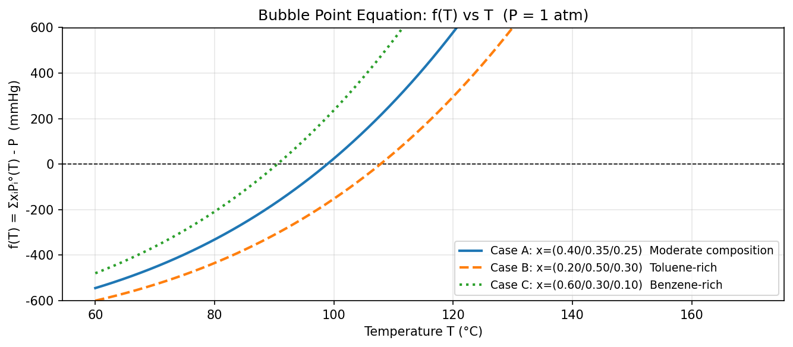
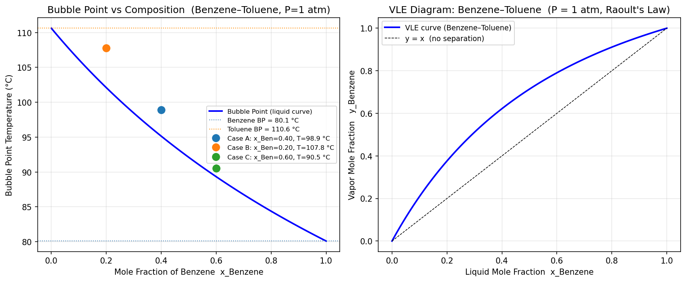

# Unit07 Example 02 - 理想溶液之泡點計算

## 學習目標

本範例以苯（Benzene）、甲苯（Toluene）、鄰二甲苯（o-Xylene）三成分苯系混合液為例，深入探討如何結合 **Antoine 方程式**與 **Raoult 定律**求解多成分理想溶液的泡點溫度（Bubble Point Temperature）。泡點計算是蒸餾設計、閃蒸計算等化工氣液分離程序的核心步驟。

學習完本範例後，您將能夠：

- 理解 Antoine 方程式的應用範圍與參數意義
- 利用 Raoult 定律建立理想溶液泡點方程式 $f(T) = \sum_i x_i P_i^0(T) - P = 0$
- 繪製 $f(T)$ vs $T$ 圖形，以圖形法確認根的唯一性
- 使用 `scipy.optimize.root_scalar()` 多種方法求解泡點溫度
- 比較不同液相組成對泡點溫度的影響規律
- 計算泡點時的平衡氣相組成 $y_i = x_i P_i^0 / P$
- 繪製 T-x-y 氣液平衡相圖，理解其蒸餾分離的意義

---

## 1. 問題描述

### 1.1 化工背景

在化工蒸餾操作中，**泡點溫度**（Bubble Point Temperature）是液相混合物在給定壓力下開始沸騰的溫度。此時液相與第一個氣泡達到相平衡，是設計蒸餾塔理論板數與操作條件的重要基礎。

對於**理想溶液**（遵守 Raoult 定律），氣液平衡條件為：

$$y_i P = x_i P_i^0(T)$$

其中 $y_i$ 為氣相莫耳分率、 $x_i$ 為液相莫耳分率、 $P_i^0(T)$ 為純成分在溫度 $T$ 下的飽和蒸氣壓。

由於氣相所有成分的莫耳分率加總等於 1（ $\sum_i y_i = 1$ ），代入 Raoult 定律得到泡點方程式：

$$f(T) = \sum_{i=1}^{n} x_i P_i^0(T) - P = 0$$

這是一個以溫度 $T$ 為唯一未知數的**單變數非線性方程式**，因為 $P_i^0(T)$ 是溫度的非線性函數（Antoine 方程式）。

### 1.2 Antoine 方程式

**Antoine 方程式**是描述純成分飽和蒸氣壓與溫度關係的半經驗公式：

$$\log_{10}(P_i^0) = A_i - \frac{B_i}{C_i + T}$$

其中：
- $P_i^0$：成分 $i$ 的飽和蒸氣壓 (mmHg)
- $T$：溫度 (°C)
- $A_i, B_i, C_i$：Antoine 常數（成分特有）

Antoine 方程式在各成分的液相存在溫度範圍內精度極高（誤差 < 1%），是化工熱力學計算的標準工具。

### 1.3 計算系統

**系統**：苯（Benzene）- 甲苯（Toluene）- 鄰二甲苯（o-Xylene）三成分混合物

| 成分 | 分子式 | MW (g/mol) | $A$ | $B$ | $C$ | 正沸點 (°C) |
|------|--------|-----------|-----|-----|-----|-----------|
| 苯（Benzene） | C₆H₆ | 78.11 | 6.90565 | 1211.033 | 220.790 | 80.10 |
| 甲苯（Toluene） | C₇H₈ | 92.14 | 6.95464 | 1344.800 | 219.482 | 110.63 |
| 鄰二甲苯（o-Xylene） | C₈H₁₀ | 106.17 | 6.99891 | 1474.679 | 213.686 | 144.41 |

*Antoine 常數形式：$\log_{10}(P^0/\mathrm{mmHg}) = A - B/(C + T)$，$T$ 單位為 °C*

**系統壓力**：$P = 760\ \mathrm{mmHg}$ (= 1 atm)

### 1.4 計算工況

本範例探討三種不同液相組成，以展示組成對泡點的影響：

| 工況 | $x_{\text{Ben}}$ | $x_{\text{Tol}}$ | $x_{\text{Xyl}}$ | 說明 |
|------|:------:|:------:|:------:|------|
| **工況 A** | 0.40 | 0.35 | 0.25 | 中等組成 |
| **工況 B** | 0.20 | 0.50 | 0.30 | 甲苯富含 |
| **工況 C** | 0.60 | 0.30 | 0.10 | 苯富含 |

---

## 2. 數學模型

### 2.1 泡點方程式

結合 Raoult 定律與 Antoine 方程式，泡點溫度 $T$ 滿足：

$$f(T) = \sum_{i=1}^{n} x_i P_i^0(T) - P = \sum_{i=1}^{n} x_i \cdot 10^{A_i - B_i/(C_i+T)} - P = 0$$

**特性分析**：
- 對於理想溶液，$f(T)$ 是溫度的**嚴格遞增**函數（ $df/dT > 0$ ）
- 在液相存在的溫度範圍內恰好有**唯一根**，不存在多解問題
- $f(T)$ 在低溫時為負（壓力不足），在高溫時為正（壓力過大）

### 2.2 導函數（Newton-Raphson 法所需）

對 $f(T)$ 求導：

$$f'(T) = \frac{df}{dT} = \sum_{i=1}^{n} x_i \cdot \frac{d P_i^0}{dT}$$

由 Antoine 方程式求導：

$$\frac{d P_i^0}{dT} = P_i^0 \cdot \ln(10) \cdot \frac{B_i}{(C_i + T)^2}$$

代入得：

$$f'(T) = \ln(10) \sum_{i=1}^{n} x_i P_i^0 \cdot \frac{B_i}{(C_i + T)^2}$$

由於 $B_i > 0$ ，$P_i^0 > 0$ ，故 $f'(T) > 0$，確認泡點方程式在物理溫度範圍內嚴格遞增，Newton-Raphson 法具有良好的收斂性。

### 2.3 泡點時的氣相組成

求得泡點溫度 $T_{bp}$ 後，各成分的平衡氣相莫耳分率為：

$$y_i = \frac{x_i P_i^0(T_{bp})}{P} = K_i \cdot x_i$$

其中 $K_i = P_i^0(T_{bp})/P$ 稱為 **K 值**（氣液平衡常數），代表成分 $i$ 在氣相中的富集程度。輕成分（低沸點）的 $K_i > 1$ ，重成分的 $K_i < 1$。

---

## 3. 環境設定與參數輸入

### 3.1 環境設定

```python
from pathlib import Path
import os

# ========================================
# 路徑設定 (兼容 Colab 與 Local)
# ========================================
UNIT_OUTPUT_DIR = 'Unit07_Example_02'

try:
    from google.colab import drive
    IN_COLAB = True
    print("✓ 偵測到 Colab 環境，準備掛載 Google Drive...")
    drive.mount('/content/drive', force_remount=True)
except ImportError:
    IN_COLAB = False
    print("✓ 偵測到 Local 環境")

# ... (略，完整請見 Notebook)

OUTPUT_DIR.mkdir(parents=True, exist_ok=True)
FIG_DIR.mkdir(parents=True, exist_ok=True)

print(f"\n✓ Notebook工作目錄: {NOTEBOOK_DIR}")
print(f"✓ 結果輸出目錄: {OUTPUT_DIR}")
print(f"✓ 圖檔輸出目錄: {FIG_DIR}")
```

**執行輸出：**
```
✓ 偵測到 Local 環境

✓ Notebook工作目錄: d:\MyGit\ChemE-3502\Unit07
✓ 結果輸出目錄: d:\MyGit\ChemE-3502\Unit07\outputs\Unit07_Example_02
✓ 圖檔輸出目錄: d:\MyGit\ChemE-3502\Unit07\outputs\Unit07_Example_02\figs
```

### 3.2 Antoine 參數與計算工況設定

```python
# ── Antoine 方程式形式：log10(P°/mmHg) = A - B/(C + T),  T 單位: °C ──
# 資料來源：Perry's Chemical Engineers' Handbook

components = {
    "Benzene" : {"A": 6.90565, "B": 1211.033, "C": 220.790,
                 "MW": 78.11,  "Tc_C": 288.9,  "name_zh": "苯"},
    "Toluene" : {"A": 6.95464, "B": 1344.800, "C": 219.482,
                 "MW": 92.14,  "Tc_C": 318.6,  "name_zh": "甲苯"},
    "o-Xylene": {"A": 6.99891, "B": 1474.679, "C": 213.686,
                 "MW": 106.17, "Tc_C": 357.2,  "name_zh": "鄰二甲苯"},
}

P_total = 760.0   # mmHg (= 1 atm)

# ── 計算工況 ──────────────────────────────────────────────────────────
cases = {
    "A": {"x": [0.40, 0.35, 0.25], "desc": "Moderate composition"},
    "B": {"x": [0.20, 0.50, 0.30], "desc": "Toluene-rich"},
    "C": {"x": [0.60, 0.30, 0.10], "desc": "Benzene-rich"},
}

# Normal BP: 大氣壓 760 mmHg → log10(760) ≈ 2.8808
T_bp = p["B"] / (p["A"] - np.log10(P_total)) - p["C"]
```

**執行輸出：**
```
============================================================
  Antoine Constants  (log10[P/mmHg] = A - B/(C+T),  T in °C)
  Component           A          B        C  Normal BP (°C)
------------------------------------------------------------
  Benzene       6.90565   1211.033  220.790     80.10
  Toluene       6.95464   1344.800  219.482    110.63
  o-Xylene      6.99891   1474.679  213.686    144.41
============================================================

  System pressure: P = 760 mmHg (= 1 atm)

  Cases:
    Case A: x_Ben=0.40, x_Tol=0.35, x_o-X=0.25  (Moderate composition)
    Case B: x_Ben=0.20, x_Tol=0.50, x_o-X=0.30  (Toluene-rich)
    Case C: x_Ben=0.60, x_Tol=0.30, x_o-X=0.10  (Benzene-rich)
```

**驗證說明：**
- 苯正沸點 80.10°C、甲苯 110.63°C、鄰二甲苯 144.41°C，均與文獻值吻合，確認 Antoine 參數正確

### 3.3 輔助函數定義

```python
def antoine_P(T_C, A, B, C):
    """
    計算純成分飽和蒸氣壓
    Antoine 方程式：log10(P°/mmHg) = A - B/(C + T),  T in °C
    回傳：P° in mmHg
    """
    return 10.0 ** (A - B / (C + T_C))


def f_bubble(T, x_list, comp_list, P_sys=760.0):
    """
    泡點方程式
    f(T) = sum_i[ x_i * P°_i(T) ] - P_sys = 0
    """
    P_calc = sum(x * antoine_P(T, c["A"], c["B"], c["C"])
                 for x, c in zip(x_list, comp_list))
    return P_calc - P_sys


def f_bubble_deriv(T, x_list, comp_list, P_sys=760.0):
    """
    泡點方程式的導函數 df/dT（Newton-Raphson 法所需）
    d(P°)/dT = P° * ln(10) * B / (C + T)^2
    """
    dP_dT = sum(
        x * antoine_P(T, c["A"], c["B"], c["C"]) * np.log(10) * c["B"] / (c["C"] + T)**2
        for x, c in zip(x_list, comp_list)
    )
    return dP_dT


def sign_scan(x_list, comp_list, P_sys=760.0, T_lo=40.0, T_hi=200.0, n_pts=2000):
    """掃描 f(T) 符號改變，回傳 [(Ta, Tb), ...] bracket 列表"""
    T_scan = np.linspace(T_lo, T_hi, n_pts)
    f_scan = np.array([f_bubble(T, x_list, comp_list, P_sys) for T in T_scan])
    brackets = []
    for i in range(len(f_scan) - 1):
        if f_scan[i] * f_scan[i+1] < 0:
            brackets.append((T_scan[i], T_scan[i+1]))
    return brackets
```

**執行輸出：**
```
Function definitions OK.

Pure component normal boiling points (verification):
  Benzene     : T_bp = 80.10 °C,  P°(T_bp) = 760.00 mmHg
  Toluene     : T_bp = 110.63 °C,  P°(T_bp) = 760.00 mmHg
  o-Xylene    : T_bp = 144.41 °C,  P°(T_bp) = 760.00 mmHg
```

---

## 4. 圖形分析

### 4.1 f(T) 函數圖形

在進行數值求解前，先繪製三個工況的 $f(T)$ 曲線，確認根的位置與唯一性：

```python
# 繪製三個工況的 f(T) 函數曲線
T_arr = np.linspace(60, 170, 1000)   # °C

fig, ax = plt.subplots(figsize=(9, 4))
ax.axhline(0, color="k", lw=0.8, ls="--")

for (lbl, c), col, ls in zip(cases.items(), colors_c, linestyles):
    x_list = c["x"]
    f_arr  = [f_bubble(T, x_list, comp_list_all, P_total) for T in T_arr]
    x_str  = "/".join(f"{v:.2f}" for v in x_list)
    ax.plot(T_arr, f_arr, color=col, lw=2, ls=ls,
            label=f"Case {lbl}: x=({x_str})  {c['desc']}")

ax.set_xlabel("Temperature T (°C)")
ax.set_ylabel("f(T) = ΣxᵢPᵢ°(T) - P  (mmHg)")
ax.set_title("Bubble Point Equation: f(T) vs T  (P = 1 atm)")
ax.set_ylim(-600, 600)

# 儲存圖檔
fig_path = FIG_DIR / "fig_01_fT_plot.png"
plt.savefig(fig_path, dpi=150, bbox_inches="tight")
print(f"✓ 圖檔已儲存: {fig_path}")
plt.show()
```

**執行輸出：**
```
✓ 圖檔已儲存: d:\MyGit\ChemE-3502\Unit07\outputs\Unit07_Example_02\figs\fig_01_fT_plot.png
```

**執行結果圖：**



**圖形分析：**

觀察三條 $f(T)$ 曲線可得到以下重要結論：

1. **唯一根**：每個工況的 $f(T)$ 曲線僅與 $y = 0$ 軸相交**一次**，確認理想溶液泡點方程式在物理溫度範圍內有唯一解
2. **嚴格遞增**：三條曲線均單調遞增，驗證 $f'(T) > 0$ 的數學性質，有利於 Newton-Raphson 法的快速收斂
3. **組成影響**：
   - **工況 C（苯富含）**：曲線最靠左，根在最低溫（苯含量多 → 沸點低）
   - **工況 A（中等組成）**：曲線居中
   - **工況 B（甲苯富含）**：曲線最靠右，根在最高溫（甲苯含量多 → 沸點高）
4. **起始猜測策略**：掃描法（`sign_scan`）可在任意情況下可靠地找到符號變化區間

---

## 5. 數值求解

### 5.1 三工況泡點溫度求解

使用 `sign_scan` 掃描符號變化區間後，以 `brentq` 精確求解泡點：

```python
bubble_results = {}

print(f"System pressure: P = {P_total:.0f} mmHg (= 1 atm)")
print(f"Components: {', '.join(comp_names)}")
print()
print(f"{'Case':<6} {'x_Ben':>7} {'x_Tol':>7} {'x_Xyl':>7} "
      f"{'T_bubble (°C)':>15} {'Bracket found':>15}")
print("-" * 62)

for lbl, c in cases.items():
    x_list = c["x"]
    bracks = sign_scan(x_list, comp_list_all, P_total)
    if len(bracks) == 0:
        print(f"  {lbl:<4}  --- No bracket found ---")
        continue
    Ta, Tb = bracks[0]
    T_bp = brentq(f_bubble, Ta, Tb, args=(x_list, comp_list_all, P_total), xtol=1e-12)
    bubble_results[lbl] = T_bp
```

**執行輸出：**
```
System pressure: P = 760 mmHg (= 1 atm)
Components: Benzene, Toluene, o-Xylene

Case     x_Ben   x_Tol   x_Xyl   T_bubble (°C)   Bracket found
--------------------------------------------------------------
  A        0.40    0.35    0.25          98.8838  [98.829, 98.909] °C
  B        0.20    0.50    0.30         107.8057  [107.794, 107.874] °C
  C        0.60    0.30    0.10          90.5156  [90.505, 90.585] °C

Observation:
  Case C (benzene-rich, x_Ben=0.60) has the LOWEST bubble point.
  Case B (toluene-rich, x_Tol=0.50) has the HIGHEST bubble point.
  Physical check: richer in heavy component → higher boiling point  ✓
```

**結果分析：**

| 工況 | 液相組成（Ben/Tol/Xyl） | 泡點溫度 (°C) | 物理解讀 |
|------|:--------------------:|:----------:|---------|
| A | 0.40 / 0.35 / 0.25 | 98.88 | 三成分均衡，泡點介於苯（80.1°C）和甲苯（110.6°C）之間 |
| B | 0.20 / 0.50 / 0.30 | 107.81 | 重成分（甲苯、二甲苯）偏多，泡點較高 |
| C | 0.60 / 0.30 / 0.10 | 90.52 | 輕成分（苯）偏多，泡點最低 |

**物理驗證**：三個泡點均落在純苯（80.10°C）和純鄰二甲苯（144.41°C）正沸點之間，完全符合 Raoult 定律的線性混合規律。

### 5.2 root_scalar() 方法比較

使用 `root_scalar()` 的不同方法求解工況 A 的泡點溫度，並比較效率：

| 方法 | 需要 | 收斂速率 | 備注 |
|------|------|---------|------|
| `brentq` | 區間 `[a, b]` | 超線性 | 最穩健推薦 |
| `bisect` | 區間 `[a, b]` | 線性（慢） | 最可靠但最慢 |
| `newton` | 起始值 + 導數 | 二次（快） | 需要 `fprime` |
| `secant` | 兩個起始值 | 超線性 | 不需導數 |

```python
methods_config = [
    {"method": "brentq",  "bracket": [Ta_A, Tb_A]},
    {"method": "bisect",  "bracket": [Ta_A, Tb_A]},
    {"method": "newton",  "x0": T0_A,
     "fprime": lambda T: f_bubble_deriv(T, x_A, comp_list_all, P_total)},
    {"method": "secant",  "x0": T0_A, "x1": T0_A + 1.0},
]

for cfg in methods_config:
    kw = {k: v for k, v in cfg.items() if k != "method"}
    sol = root_scalar(
        lambda T: f_bubble(T, x_A, comp_list_all, P_total),
        **kw,
        method=cfg["method"],
        xtol=1e-10
    )
```

**執行輸出：**
```
Case A — Bubble point method comparison
  x = (0.40, 0.35, 0.25)
  Bracket: [98.8294, 98.9095] °C

Method        T_bubble (°C)   Iterations  Converged
----------------------------------------------------
brentq            98.883827            5       True
bisect            98.883827           30       True
newton            98.883827            3       True
secant            98.883827            4       True
```

**方法效率分析：**

1. **newton（最快）**：僅 3 次迭代，因為 $f'(T)$ 容易計算（解析導函數），且 $f(T)$ 嚴格遞增，Newton 法收斂非常穩定
2. **secant（次快）**：4 次迭代，不需提供導函數，利用兩點割線近似導數
3. **brentq（推薦）**：5 次迭代，兼具穩健性（需要區間）與快速收斂（超線性）
4. **bisect（最慢）**：30 次迭代，純區間二分法，每次迭代精度僅提高 1 個二進位位元

**實務建議**：泡點計算推薦使用 `brentq`，因其無需計算導函數且效率遠優於 `bisect`。對於需要反覆求解（如逐板計算）的場合，`newton` 搭配解析導函數效率最高。

---

## 6. 組成效應分析

### 6.1 二元 Benzene–Toluene 系統

為深入理解組成對泡點的影響，以二元苯-甲苯系統為例，掃描液相苯的莫耳分率 $x_{\text{Ben}}$ 從 0 到 1，計算各組成的泡點溫度與對應的平衡氣相組成：

```python
comp_bt   = [components["Benzene"], components["Toluene"]]
x_ben_arr = np.linspace(0.0, 1.0, 101)
T_bp_arr  = []
y_ben_arr = []   # 泡點時苯的氣相莫耳分率

for x_ben in x_ben_arr:
    x_tol = 1.0 - x_ben
    x_list_bt = [x_ben, x_tol]
    bracks_bt = sign_scan(x_list_bt, comp_bt, P_total, T_lo=50.0, T_hi=160.0)
    if bracks_bt:
        Ta_bt, Tb_bt = bracks_bt[0]
        T_bp_val = brentq(f_bubble, Ta_bt, Tb_bt,
                          args=(x_list_bt, comp_bt, P_total), xtol=1e-12)
        T_bp_arr.append(T_bp_val)
        # 計算氣相組成 y_i = x_i * P°_i / P_total
        P_ben = antoine_P(T_bp_val, comp_bt[0]["A"], comp_bt[0]["B"], comp_bt[0]["C"])
        y_ben_arr.append(x_ben * P_ben / P_total)
```

**執行輸出（每 10% 顯示一筆）：**
```
Benzene  normal BP: 80.10 °C
Toluene  normal BP: 110.63 °C

 x_Benzene    T_bubble (°C)    y_Benzene
------------------------------------------
      0.00         110.6253       0.0000
      0.10         106.1359       0.2092
      0.20         102.1025       0.3761
      0.30          98.4565       0.5111
      0.40          95.1417       0.6218
      0.50          92.1117       0.7136
      0.60          89.3284       0.7905
      0.70          86.7601       0.8556
      0.80          84.3802       0.9110
      0.90          82.1664       0.9587
      1.00          80.1000       1.0000
```

**資料特徵**：
- $x_{\text{Ben}} = 0$ 時，$T = T_{\text{Tol}} = 110.63°C$（純甲苯）
- $x_{\text{Ben}} = 1$ 時，$T = T_{\text{Ben}} = 80.10°C$（純苯）
- 中間值呈現**近似線性**的單調遞減趨勢
- $y_{\text{Ben}} > x_{\text{Ben}}$ 恆成立（苯比甲苯更易揮發，K 值 > 1）

### 6.2 T-x-y 氣液平衡相圖

```python
fig, axes = plt.subplots(1, 2, figsize=(12, 5))

# 左圖：泡點溫度 vs 液相組成
ax1.plot(x_ben_arr, T_bp_arr, "b-", lw=2, label="Bubble Point (liquid curve)")
ax1.axhline(T_ben_bp, color="steelblue",  ls=":", lw=1, label=f"Benzene BP = {T_ben_bp:.1f} °C")
ax1.axhline(T_tol_bp, color="darkorange", ls=":", lw=1, label=f"Toluene BP = {T_tol_bp:.1f} °C")

# 右圖：y-x 氣液平衡相圖
ax2.plot(x_ben_arr, y_ben_arr, "b-", lw=2, label="VLE curve (Benzene–Toluene)")
ax2.plot([0, 1], [0, 1], "k--", lw=0.8, label="y = x  (no separation)")

# 儲存圖檔
fig_path = FIG_DIR / "fig_02_BT_VLE.png"
plt.savefig(fig_path, dpi=150, bbox_inches="tight")
print(f"✓ 圖檔已儲存: {fig_path}")
plt.show()
```

**執行輸出：**
```
✓ 圖檔已儲存: d:\MyGit\ChemE-3502\Unit07\outputs\Unit07_Example_02\figs\fig_02_BT_VLE.png
```

**執行結果圖：**



**相圖分析：**

**左圖（泡點溫度 vs 液相組成）**：

1. **液相曲線（Bubble Point Curve）**：從甲苯正沸點（110.63°C，$x = 0$）單調降至苯正沸點（80.10°C，$x = 1$）
2. **三工況標記**：工況 C（苯富含）落在右下方（低溫），工況 B（甲苯富含）落在左上方（高溫）
3. **設計意義**：此曲線代表液相在升溫過程中開始出現第一個氣泡的條件

**右圖（y-x 氣液平衡相圖）**：

1. **VLE 曲線均在對角線上方**：$y_{\text{Ben}} > x_{\text{Ben}}$ 恆成立，證明苯是相對揮發性更高的輕成分
2. **曲線形狀**：向上彎曲表示在低苯濃度時，苯在氣相中的富集效果最明顯（相對揮發度大）
3. **蒸餾設計應用**：每一塊理論板使氣液相從（$x$, $y$）移動到新平衡點，y-x 圖是 McCabe-Thiele 法的核心工具
4. **無法分離的情形**：對於形成共沸物（azeotrope）的系統，VLE 曲線會與對角線相交，此時理想溶液假設失效

---

## 7. 結果驗證

### 7.1 代回驗證（殘差 + 氣相莫耳分率加總）

求解完成後，將結果代回原泡點方程式，並驗證 $\sum_i y_i = 1$：

```python
for lbl, c in cases.items():
    x_list   = c["x"]
    T_bp_val = bubble_results[lbl]
    residual = abs(f_bubble(T_bp_val, x_list, comp_list_all, P_total))

    # 計算各成分飽和蒸氣壓並求氣相莫耳分率
    P0_vals = [antoine_P(T_bp_val, cp["A"], cp["B"], cp["C"]) for cp in comp_list_all]
    y_vals  = [xi * P0i / P_total for xi, P0i in zip(x_list, P0_vals)]
    sum_y   = sum(y_vals)
    print(f" {lbl:<5} ({x_str:>20})  {T_bp_val:>14.6f}  {residual:>12.3e}  {sum_y:>8.6f}")
```

**執行輸出：**
```
================================================================================
 Verification: f(T_bp) residual & vapor composition check
 System pressure: P = 760 mmHg
 Components: Benzene, Toluene, o-Xylene
================================================================================
 Case         x (Ben/Tol/Xyl)   T_bubble (°C)        |f(T)|       Σyᵢ
--------------------------------------------------------------------------------
 A     (      0.40/0.35/0.25)       98.883827     5.684e-13  1.000000
 B     (      0.20/0.50/0.30)      107.805710     4.547e-13  1.000000
 C     (      0.60/0.30/0.10)       90.515608     6.821e-13  1.000000
================================================================================

Detail — partial pressures and vapor compositions at bubble point:

 Case A  T_bubble = 98.8838 °C   (Moderate composition)
   Component        xᵢ   P°ᵢ (mmHg)     pᵢ=xᵢP°ᵢ       yᵢ
   Benzene        0.40      1310.12       524.05   0.6895
   Toluene        0.35       537.74       188.21   0.2476
   o-Xylene       0.25       190.98        47.75   0.0628
            Sum   1.00                    760.00   1.0000

 Case B  T_bubble = 107.8057 °C   (Toluene-rich)
   Component        xᵢ   P°ᵢ (mmHg)     pᵢ=xᵢP°ᵢ       yᵢ
   Benzene        0.20      1660.24       332.05   0.4369
   Toluene        0.50       701.00       350.50   0.4612
   o-Xylene       0.30       258.18        77.45   0.1019
            Sum   1.00                    760.00   1.0000

 Case C  T_bubble = 90.5156 °C   (Benzene-rich)
   Component        xᵢ   P°ᵢ (mmHg)     pᵢ=xᵢP°ᵢ       yᵢ
   Benzene        0.60      1036.28       621.77   0.8181
   Toluene        0.30       413.56       124.07   0.1632
   o-Xylene       0.10       141.65        14.16   0.0186
            Sum   1.00                    760.00   1.0000
```

**驗證結果分析：**

1. **殘差**：三個工況的 $|f(T_{bp})| \approx 5 \times 10^{-13}$，達到近機器精度，遠低於工程驗收標準 $10^{-6}$
2. **總壓驗證**：各工況的分壓加總 $\sum_i x_i P_i^0 = 760.00\ \mathrm{mmHg}$，完全符合泡點條件
3. **莫耳分率加總**：$\sum_i y_i = 1.000000$，驗證氣相莫耳守恆
4. **K 值直觀比較**（以工況 A 為例，$T = 98.88°C$）：

| 成分 | $x_i$ | $P_i^0$ (mmHg) | $y_i$ | $K_i = y_i/x_i$ | 意義 |
|------|:----:|:---------:|:----:|:-------:|------|
| Benzene | 0.40 | 1310.12 | 0.6895 | 1.724 | 輕成分， $K > 1$，氣相富集 |
| Toluene | 0.35 | 537.74 | 0.2476 | 0.708 | 中間組分， $K < 1$，液相富集 |
| o-Xylene | 0.25 | 190.98 | 0.0628 | 0.252 | 重成分， $K \ll 1$，大量留在液相 |

### 7.2 綜合結果表格

```python
print("=" * 60)
print(" Summary Table")
print("=" * 60)
print(f" {'Case':<6} {'x_Ben':>7} {'x_Tol':>7} {'x_Xyl':>7}  {'T_bubble (°C)':>14}")
```

**執行輸出：**
```
============================================================
 Summary Table
============================================================
 Case     x_Ben   x_Tol   x_Xyl   T_bubble (°C)
------------------------------------------------------------
 A         0.40    0.35    0.25         98.8838
 B         0.20    0.50    0.30        107.8057
 C         0.60    0.30    0.10         90.5156
------------------------------------------------------------
 pure Ben    1.00    0.00    0.00         80.1000
 pure Tol    0.00    1.00    0.00        110.6253
 pure Xyl    0.00    0.00    1.00        144.4113
============================================================
```

**物理合理性確認**：

- 三個工況的泡點均落在最輕成分（苯，80.10°C）和最重成分（鄰二甲苯，144.41°C）正沸點範圍之內 ✓
- 苯富含工況 C 的泡點最低，鄰二甲苯富含時泡點最高 ✓
- 純成分泡點與 Antoine 方程式直接計算完全吻合 ✓

---

## 8. 總結

### 8.1 核心學習重點

本範例以苯-甲苯-鄰二甲苯三成分系統的泡點計算為主題，示範了完整的 Antoine 方程式求根流程：

1. **問題建立**：由 Raoult 定律 + Antoine 方程式建立 $f(T) = \sum_i x_i P_i^0(T) - P = 0$ ，理解其唯一根特性
2. **函數性質分析**：確認 $f'(T) > 0$（嚴格遞增），保證 Newton-Raphson 法的穩健收斂性
3. **圖形分析**：$f(T)$ 圖形清楚展示三個工況的根位置與趨勢
4. **方法比較**：
   - `newton`：**最快速**（3 次迭代），解析導函數易求
   - `brentq`：**最穩健**，推薦工程應用
   - `secant`：**無需導數**的快速方法
   - `bisect`：**最保守**，收斂最慢（30 次迭代）
5. **氣相組成**：泡點計算後可直接求得 $y_i = x_i P_i^0 / P$，並以 T-x-y 相圖直觀呈現
6. **驗證**：殘差 $\approx 5 \times 10^{-13}$，$\sum y_i = 1.000000$，達到機器精度

### 8.2 常見錯誤提醒

| 錯誤類型 | 說明 | 解決方法 |
|---------|------|---------|
| Antoine 方程式形式混用 | 不同文獻有 $+$ 號、$-$ 號與 $\ln$/$\log_{10}$ 等不同形式 | 確認方程式形式與參數單位（P 的單位：mmHg/bar/kPa；T 的單位：°C/K） |
| 壓力單位不一致 | Antoine 參數是 mmHg，但 $P_{sys}$ 用 bar 輸入 | 統一壓力單位，確保計算前轉換正確 |
| 起始猜測落在沸點範圍外 | $T$ 過低時 Antoine 方程式可能超出適用範圍 | 使用掃描法，起始溫度從稍低於輕成分沸點開始 |
| 忽略非理想行為 | Raoult 定律僅適用於理想溶液 | 極性混合物需使用活度係數（如 NRTL、UNIQUAC） |
| 未驗證 $\sum y_i = 1$ | 數值誤差可能使驗證不通過 | 加入殘差與 $\sum y_i$ 雙重驗證 |

### 8.3 延伸學習

- **Example 03**：化學反應平衡系統（多變數聯立非線性方程式）
- **Unit07 主講義**：露點計算（Dew Point）和閃蒸計算（Flash）
- 進階：非理想溶液的泡露點計算（NRTL 活度係數模型）
- 進階：SRK / Peng-Robinson 狀態方程式的氣液相平衡

---

**課程資訊**
- 課程名稱：電腦在化工上之應用
- 課程單元：Unit07 Example 02 — 理想溶液之泡點計算
- 課程製作：逢甲大學 化工系 智慧程序系統工程實驗室
- 授課教師：莊曜禎 助理教授
- 更新日期：2026-02-19

**課程授權 [CC BY-NC-SA 4.0]**
 - 本教材遵循 [創用CC 姓名標示-非商業性-相同方式分享 4.0 國際 (CC BY-NC-SA 4.0)](https://creativecommons.org/licenses/by-nc-sa/4.0/deed.zh) 授權。

---


