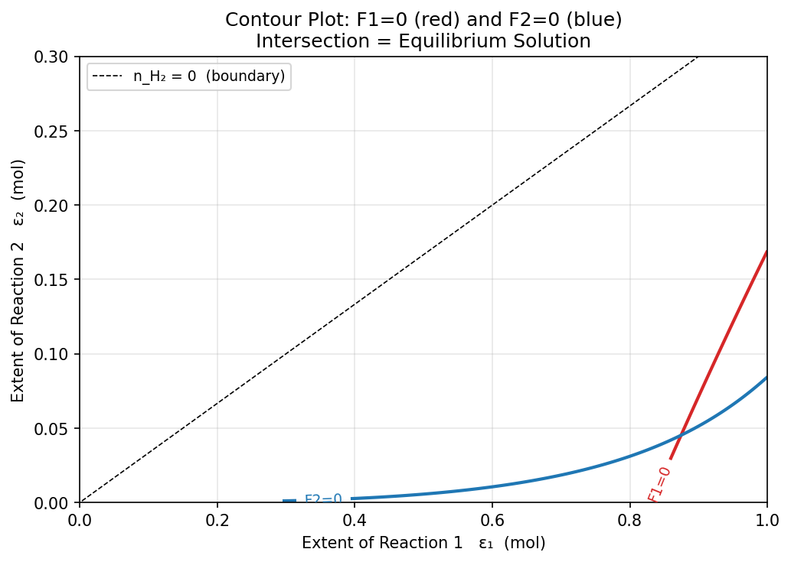
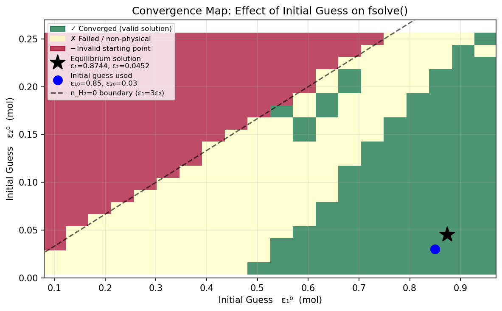

# Unit07 Example 03 - 化學反應平衡系統（多變數聯立非線性方程式求解）

## 學習目標

本範例以 CO–H₂O 氣相多重反應平衡系統為例，介紹如何建立**多個耦合非線性方程式**並以 `scipy.optimize.fsolve()` 求解。系統在 700 K、1 atm 下同時進行水氣轉移反應（R1）與甲烷化反應（R2），形成含 2 個未知數（反應延伸量 $\varepsilon_1, \varepsilon_2$ ）的 $2 \times 2$ 非線性聯立方程組。

學習完本範例後，您將能夠：

- 使用**反應延伸量**（Extent of Reaction）建立多重反應的摩耳平衡
- 以 Kx 平衡常數關係建立含氣相莫耳分率的非線性方程式
- 繪製 $F_1=0$ 與 $F_2=0$ 等高線圖，圖形確認解的位置與唯一性
- 使用 `scipy.optimize.fsolve()` 求解多維非線性方程組
- 以 20×20 網格掃描分析起始猜測值敏感性
- 實施多面向驗證：殘差、元素守恆、莫耳分率加總

---

## 1. 問題描述

### 1.1 化工背景

**化學反應平衡計算**是化工製程設計的核心任務之一。給定溫度、壓力與進料組成，求最終平衡組成，對反應器設計、產率預測及程序最佳化至關重要。

當系統中同時存在**多個反應**時，各反應的延伸量相互耦合（共用同一批物種的摩耳數），導致平衡條件形成多變數聯立非線性方程組，必須以數值方法求解。

本範例的化工系統以**煤氣化（Coal Gasification）**或**合成氣（Syngas）**製程為背景。在高溫條件下，CO 與 H₂O 蒸氣進行以下反應：

**反應 R1（水氣轉移反應，Water-Gas Shift）：**

$$\text{CO} + \text{H}_2\text{O} \rightleftharpoons \text{CO}_2 + \text{H}_2, \quad K_1 = 3.5$$

**反應 R2（甲烷化反應，Methanation）：**

$$\text{CO} + 3\text{H}_2 \rightleftharpoons \text{CH}_4 + \text{H}_2\text{O}, \quad K_2 = 0.15$$

### 1.2 系統設定

| 項目 | 數值 |
|------|------|
| 溫度 $T$ | 700 K |
| 壓力 $P$ | 1 atm（理想氣體混合物） |
| 進料 $n^0_{\text{CO}}$ | 2.0 mol |
| 進料 $n^0_{\text{H}_2\text{O}}$ | 1.0 mol |
| 其他成分進料 | 0 mol |

### 1.3 平衡常數

本例假設兩反應的**平衡常數 $K_i$ 為已知定值**（在 700 K 由熱力學數據計算所得）。

- R1 的計量數總和 $\Delta\nu_1 = (1+1)-(1+1) = 0$ ，故 $K_1 = K_{y,1}$ （與壓力無關）。
- R2 的計量數總和 $\Delta\nu_2 = (1+1)-(1+3) = -2$ ， $K_2 = K_{y,2} \cdot P^{-2}$ 。在 $P = 1$ atm 時， $K_2 = K_{y,2}$ 。

---

## 2. 數學模型

### 2.1 反應延伸量（Extent of Reaction）

定義反應延伸量 $\varepsilon_1$ （R1 進行量）與 $\varepsilon_2$ （R2 進行量），各成分摩耳數為：

$$n_{\text{CO}} = 2 - \varepsilon_1 - \varepsilon_2$$

$$n_{\text{H}_2\text{O}} = 1 - \varepsilon_1 + \varepsilon_2$$

$$n_{\text{CO}_2} = \varepsilon_1$$

$$n_{\text{H}_2} = \varepsilon_1 - 3\varepsilon_2$$

$$n_{\text{CH}_4} = \varepsilon_2$$

**總摩耳數：**

$$n_{\text{total}} = 3 - 2\varepsilon_2$$

（注意：僅 R2 改變總摩耳數，因為 $\Delta\nu_1 = 0$ 。）

### 2.2 氣相莫耳分率

$$y_i = \frac{n_i}{n_{\text{total}}}$$

### 2.3 平衡方程式

$$F_1(\varepsilon_1, \varepsilon_2) = K_1 - \frac{y_{\text{CO}_2} \cdot y_{\text{H}_2}}{y_{\text{CO}} \cdot y_{\text{H}_2\text{O}}} = 0$$

$$F_2(\varepsilon_1, \varepsilon_2) = K_2 - \frac{y_{\text{CH}_4} \cdot y_{\text{H}_2\text{O}}}{y_{\text{CO}} \cdot y_{\text{H}_2}^3} = 0$$

這是含 2 個未知數的 $2 \times 2$ 非線性聯立方程組。

### 2.4 物理約束

所有摩耳數必須非負：

| 約束 | 條件 |
|------|------|
| $n_{\text{CO}} \geq 0$ | $\varepsilon_1 + \varepsilon_2 \leq 2$ |
| $n_{\text{H}_2\text{O}} \geq 0$ | $\varepsilon_1 - \varepsilon_2 \leq 1$ |
| $n_{\text{CO}_2} \geq 0$ | $\varepsilon_1 \geq 0$ |
| $n_{\text{H}_2} \geq 0$ | $\varepsilon_1 \geq 3\varepsilon_2$ （最緊繃的約束） |
| $n_{\text{CH}_4} \geq 0$ | $\varepsilon_2 \geq 0$ |

有效解域為 $0 < \varepsilon_1 \leq 1$ ， $0 < \varepsilon_2 < \varepsilon_1/3$ 。

---

## 3. 環境設定

### 3.1 路徑設定

```python
from pathlib import Path
import os

# ========================================
# 路徑設定 (兼容 Colab 與 Local)
# ========================================
UNIT_OUTPUT_DIR = 'Unit07_Example_03'

try:
    from google.colab import drive
    IN_COLAB = True
    print("✓ 偵測到 Colab 環境，準備掛載 Google Drive...")
    drive.mount('/content/drive', force_remount=True)
except ImportError:
    IN_COLAB = False
    print("✓ 偵測到 Local 環境")

try:
    shortcut_path = '/content/ChemE-3502'
    os.remove(shortcut_path)
except (FileNotFoundError, OSError):
    pass

if IN_COLAB:
    source_path = Path('/content/drive/My Drive/Colab Notebooks/ChemE-3502')
    os.symlink(source_path, shortcut_path)
    shortcut_path = Path(shortcut_path)
    if source_path.exists():
        NOTEBOOK_DIR = shortcut_path / 'Unit07'
        OUTPUT_DIR   = NOTEBOOK_DIR / 'outputs' / UNIT_OUTPUT_DIR
        FIG_DIR      = OUTPUT_DIR / 'figs'
    else:
        print("⚠️ 找不到雲端 ChemE-3502 路徑，請確認資料夾名稱是否正確")
else:
    NOTEBOOK_DIR = Path.cwd()
    OUTPUT_DIR   = NOTEBOOK_DIR / 'outputs' / UNIT_OUTPUT_DIR
    FIG_DIR      = OUTPUT_DIR / 'figs'

OUTPUT_DIR.mkdir(parents=True, exist_ok=True)
FIG_DIR.mkdir(parents=True, exist_ok=True)

print(f"\n✓ Notebook工作目錄: {NOTEBOOK_DIR}")
print(f"✓ 結果輸出目錄: {OUTPUT_DIR}")
print(f"✓ 圖檔輸出目錄: {FIG_DIR}")
```

**執行輸出：**

```
✓ 偵測到 Local 環境

✓ Notebook工作目錄: d:\MyGit\ChemE-3502\Unit07
✓ 結果輸出目錄: d:\MyGit\ChemE-3502\Unit07\outputs\Unit07_Example_03
✓ 圖檔輸出目錄: d:\MyGit\ChemE-3502\Unit07\outputs\Unit07_Example_03\figs
```

---

## 4. 載入套件與問題設定

### 4.1 載入套件

```python
import numpy as np
import matplotlib.pyplot as plt
import warnings
warnings.filterwarnings('ignore')

from scipy.optimize import fsolve, root

# Matplotlib 設定
plt.rcParams['axes.unicode_minus'] = False
```

**套件版本確認：**

```
✓ 套件載入完成
  numpy  : 1.23.5
  scipy  : 1.15.2
```

### 4.2 問題設定

```python
# 平衡常數
K1 = 3.5
K2 = 0.15

# 進料摩耳數
n0 = {"CO": 2.0, "H2O": 1.0, "CO2": 0.0, "H2": 0.0, "CH4": 0.0}
n0_total = sum(n0.values())   # = 3.0 mol
species  = list(n0.keys())
```

**執行輸出：**

```
============================================================
  Gas-Phase Multi-Reaction Equilibrium  (T = 700 K, P = 1 atm)
============================================================
  R1: CO + H2O  ⇌  CO2 + H2      K1 = 3.50  (Δν = 0)
  R2: CO + 3H2  ⇌  CH4 + H2O     K2 = 0.15  (Δν = -2)

  Feed composition:
    Species     n0 (mol)
  ----------------------
    CO              2.00
    H2O             1.00
    CO2             0.00
    H2              0.00
    CH4             0.00
    Total           3.00
============================================================

  Mole balance:
    n_CO   = 2 - ε₁ - ε₂
    n_H2O  = 1 - ε₁ + ε₂
    n_CO2  = ε₁
    n_H2   = ε₁ - 3ε₂
    n_CH4  = ε₂
    n_total= 3 - 2ε₂

  Physical constraints: ε₁ > 3ε₂,  0 < ε₁ < 1,  0 < ε₂ < ε₁/3
```

---

## 5. 函數定義

### 5.1 摩耳平衡函數 `moles()`

```python
def moles(eps1, eps2):
    n = {
        "CO":  2.0 - eps1 - eps2,
        "H2O": 1.0 - eps1 + eps2,
        "CO2": eps1,
        "H2":  eps1 - 3.0*eps2,
        "CH4": eps2,
    }
    return n
```

### 5.2 莫耳分率函數 `mole_fractions()`

```python
def mole_fractions(eps1, eps2):
    n       = moles(eps1, eps2)
    n_total = sum(n.values())
    y       = {sp: ni / n_total for sp, ni in n.items()}
    return y, n_total
```

### 5.3 方程式系統 `F_eq()`

```python
def F_eq(eps_vec):
    eps1, eps2 = eps_vec
    y, _ = mole_fractions(eps1, eps2)
    F1 = K1 - y["CO2"] * y["H2"]  / (y["CO"] * y["H2O"])
    F2 = K2 - y["CH4"] * y["H2O"] / (y["CO"] * y["H2"]**3)
    return [F1, F2]
```

**函數驗證輸出：**

```
Function definitions OK.

────────────────────────────────────────────────────
  Boundary check at feed (ε₁=0, ε₂=0):
  (both K expressions = 0 → reaction must proceed forward)

  Test at (ε₁=0.8, ε₂=0.05):
    y_CO    = 0.3966
    y_H2O   = 0.0862
    y_CO2   = 0.2759
    y_H2    = 0.2241
    y_CH4   = 0.0172
  F(ε) = [1.6913043478260865, -0.18286497397637083]
────────────────────────────────────────────────────
```

---

## 6. 圖形分析：等高線圖

### 6.1 繪圖邏輯

在 $(\varepsilon_1, \varepsilon_2)$ 可行域上計算每一點的 $F_1$ 與 $F_2$ 值，繪製零等高線（isocurve），兩條曲線的**交點**即為方程組的解。

```python
eps1_arr = np.linspace(0.02, 1.0,  300)
eps2_arr = np.linspace(0.001, 0.30, 300)
E1, E2   = np.meshgrid(eps1_arr, eps2_arr)

# 無效區域預填 NaN（物理約束：所有 nᵢ > 0）
F1_grid = np.full(E1.shape, np.nan)
F2_grid = np.full(E1.shape, np.nan)

for i in range(E1.shape[0]):
    for j in range(E1.shape[1]):
        e1, e2 = E1[i, j], E2[i, j]
        n_vals = [2-e1-e2, 1-e1+e2, e1, e1-3*e2, e2]
        if all(n > 1e-9 for n in n_vals):
            F_vals = F_eq([e1, e2])
            F1_grid[i, j] = F_vals[0]
            F2_grid[i, j] = F_vals[1]
```

### 6.2 等高線圖



**圖形說明：**

- **紅色曲線**： $F_1(\varepsilon_1, \varepsilon_2) = 0$ （R1 平衡條件）
- **藍色曲線**： $F_2(\varepsilon_1, \varepsilon_2) = 0$ （R2 平衡條件）
- **黑色虛線**：物理有效邊界 $n_{H_2} = 0$ （即 $\varepsilon_1 = 3\varepsilon_2$ ），超過此線則 $n_{H_2} < 0$
- 兩曲線的**交點**即為方程組的解（本圖中可目視估計位置）
- 無效區域（ $n_i < 0$ ）在網格計算時已填入 NaN，圖中呈空白

從等高線圖可以觀察到：
1. $F_1=0$ 的紅色曲線在可行域中呈現單調上升趨勢（較大的 $\varepsilon_1$ 對應較高的 $K_1$ ）
2. $F_2=0$ 的藍色曲線隨 $\varepsilon_2$ 增大而向左下移動
3. 兩曲線**僅有一個交點**，位於 $\varepsilon_1 \approx 0.87, \varepsilon_2 \approx 0.045$

---

## 7. 數值求解：fsolve()

### 7.1 `scipy.optimize.fsolve()` 使用方式

```python
from scipy.optimize import fsolve
import numpy as np

eps0 = [0.85, 0.030]    # 初始猜測值
sol, info, ier, mesg = fsolve(F_eq, eps0, full_output=True)
eps1_sol, eps2_sol = sol
residual = np.linalg.norm(F_eq(sol))
```

`fsolve()` 採用 **MINPACK 的 Powell hybrid method**（改良式牛頓法），利用數值雅可比矩陣（Jacobian）進行迭代求解。

| 參數 | 說明 |
|------|------|
| `F_eq` | 方程式函數，接受向量輸入，回傳殘差向量 |
| `eps0` | 初始猜測值 $[\varepsilon_1^0, \varepsilon_2^0]$ |
| `full_output=True` | 回傳完整求解資訊 |
| `ier` | 求解狀態（1=成功，其他=失敗） |

### 7.2 求解結果

```
============================================================
  fsolve() — Equilibrium Solution
============================================================
  Initial guess : ε₁₀ = 0.850,  ε₂₀ = 0.030
  Solution      : ε₁  = 0.874367 mol
                  ε₂  = 0.045190 mol
  Converged     : Yes
  Residual      : |F| = 7.370e-11
============================================================

  Equilibrium composition:
  Species     n (mol)    y (mole frac.)
  --------------------------------------
  CO           1.0804            0.3713
  H2O          0.1708            0.0587
  CO2          0.8744            0.3005
  H2           0.7388            0.2539
  CH4          0.0452            0.0155
  --------------------------------------
  Total        2.9096            1.0000

  Verification:
    K1 given = 3.5000,  K1 check = 3.500000  → err = 7.15e-11
    K2 given = 0.1500,  K2 check = 0.150000  → err = 1.78e-11
    Σyᵢ = 1.000000
```

### 7.3 結果解讀

- 殘差 $\|F(\varepsilon^*)\| = 7.37 \times 10^{-11}$ 接近機器精度，求解完全收斂。
- $\varepsilon_1 = 0.8744$ mol 遠大於 $\varepsilon_2 = 0.0452$ mol，表示水氣轉移反應（R1）主導整個系統。
- 平衡時 CH₄ 莫耳分率僅 1.55%，符合 700 K 下甲烷化反應轉化率低的熱力學預期。

---

## 8. 起始猜測值敏感性分析

### 8.1 網格掃描邏輯

`scipy.optimize.fsolve()` 是**局部方法**，其收斂性依賴初始猜測值。為評估此敏感性，進行 $20 \times 20 = 400$ 個起始點的系統性掃描：

```python
n1, n2 = 20, 20
eps1_grid = np.linspace(0.10, 0.95, n1)
eps2_grid = np.linspace(0.01, 0.25, n2)

for i, e2_0 in enumerate(eps2_grid):          # 注意：外層迴圈是 ε₂
    for j, e1_0 in enumerate(eps1_grid):
        n_vals = [2-e1_0-e2_0, 1-e1_0+e2_0, e1_0, e1_0-3*e2_0, e2_0]
        if not all(n > 1e-9 for n in n_vals):
            converge_map[i, j] = -1  # 無效起始點
        else:
            s, _, ier_g, _ = fsolve(F_eq, [e1_0, e2_0], full_output=True)
            residual_g = np.linalg.norm(F_eq(s))
            n_sol = [2-s[0]-s[1], 1-s[0]+s[1], s[0], s[0]-3*s[1], s[1]]
            if ier_g == 1 and residual_g < 1e-8 and all(ni > -1e-6 for ni in n_sol):
                converge_map[i, j] = 1   # 成功收斂
            else:
                converge_map[i, j] = 0   # 失敗
```

### 8.2 收斂地圖



**圖形說明：**

- **綠色格子**（`pcolormesh`）：成功收斂到正確解（124 點，31%）
- **黃色格子**：求解失敗或殘差過大（136 點，34%）
- **紅色格子**：起始點本身即為物理無效點（140 點，35%）
- **黑色星號 ★**：平衡解位置（ $\varepsilon_1^* = 0.8744, \varepsilon_2^* = 0.0452$ ）
- **藍色圓點**：本次求解所使用的起始猜測值（ $\varepsilon_1^0 = 0.85, \varepsilon_2^0 = 0.03$ ）
- **黑色虛線**：物理有效邊界 $n_{H_2} = 0$ （ $\varepsilon_1 = 3\varepsilon_2$ ）

### 8.3 掃描統計

```
Grid scan results  (20×20 = 400 points):
  ✓ Converged to valid solution : 124
  ✗ Failed / non-physical result: 136
  ─ Invalid starting point      : 140

  Reference solution: ε₁ = 0.874367,  ε₂ = 0.045190

  Converged solutions spread:
    ε₁ range: [0.874367, 0.874367]  (should be ~0.874367)
    ε₂ range: [0.045190, 0.045190]  (should be ~0.045190)
```

### 8.4 結果分析

1. **唯一解確認**：所有 124 個成功收斂的起始點均收斂至完全相同的解（ $\varepsilon_1^* = 0.874367, \varepsilon_2^* = 0.045190$ ），不存在多解，與等高線圖吻合。

2. **失敗區域特徵**：許多失敗點集中在靠近 $n_{H_2} = \varepsilon_1 - 3\varepsilon_2 = 0$ 邊界附近（右上角），在此區域 $F_2$ 的分母趨近於零，造成數值不穩定。

3. **最佳起始猜測策略**：選擇 $\varepsilon_1 \in [0.6, 0.9]$ 、 $\varepsilon_2 \in [0.01, 0.05]$ 的起始點（遠離邊界）收斂機率最高。

---

## 9. 結果驗證

### 9.1 殘差代回驗證

```
======================================================================
  Verification: Residual & Physical Feasibility Check
======================================================================

  1. Residual verification:
     F1(ε*) = K1 - Kx1_calc = -7.152e-11  (target: 0)
     F2(ε*) = K2 - Kx2_calc = 1.779e-11  (target: 0)
     ||F(ε*)|| = 7.370e-11  ← near machine precision

  2. Mole fraction range check  (all yᵢ must satisfy 0 ≤ yᵢ ≤ 1):
     ✓  y_CO    = 0.3713
     ✓  y_H2O   = 0.0587
     ✓  y_CO2   = 0.3005
     ✓  y_H2    = 0.2539
     ✓  y_CH4   = 0.0155
     ✓  All yᵢ ∈ [0,1]  →  pass

  3. Mole fractions sum: Σyᵢ = 1.000000  (target: 1.000000)

  4. Elemental balance (atoms):
     C: feed=2.0000,  eq=2.0000,  err=0.00e+00  ✓
     H: feed=2.0000,  eq=2.0000,  err=0.00e+00  ✓
     O: feed=3.0000,  eq=3.0000,  err=0.00e+00  ✓

  5. Conversion:
     X_CO  = 45.98%  (CO reacted / CO feed)
     X_H2O = 82.92%  (H2O reacted / H2O feed)

======================================================================
  All verification checks passed ✓
======================================================================
```

### 9.2 物理合理性討論

1. **元素守恆**：C、H、O 三種原子的總數在反應前後完全守恆（誤差為 0），驗證摩耳平衡表達式正確。
2. **高 H₂O 轉化率**（82.92%）：進料 H₂O 僅 1 mol，而 K₁=3.5 有利於 R1 向右，故大量 H₂O 消耗。
3. **低 CO 轉化率**（45.98%）：CO 進料充足（2 mol），R1 生成 CO₂ 的同時受 R2 額外消耗 CO，但整體轉化率受 K₁ 限制。
4. **溫度依賴性**：在較低溫度（<500 K）下，K₁ 會更大（水氣轉移為放熱反應），而甲烷化 K₂ 也會增大（甲烷化亦為放熱），二者競爭更激烈。700 K 下 K₂=0.15 較小，符合高溫下甲烷化抑制的工業操作策略。

---

## 10. 總結

### 10.1 進料 vs. 平衡狀態對比

```
Summary Table: Feed vs Equilibrium
             ε₁ [mol]  ε₂ [mol]  n_total    y_CO   y_H2O   y_CO2    y_H2   y_CH4
State
Feed         0.000000   0.00000   3.0000  0.6667  0.3333  0.0000  0.0000  0.0000
Equilibrium  0.874367   0.04519   2.9096  0.3713  0.0587  0.3005  0.2539  0.0155

  Solver         : scipy.optimize.fsolve()
  Residual ||F|| : 7.370e-11
  CO conversion  : 45.98%
  H2O conversion : 82.92%
  Dominant rxn   : R1 (water-gas shift)  ε₁ >> ε₂
```

### 10.2 重要概念回顧

| 概念 | 說明 |
|------|------|
| 反應延伸量 $\varepsilon$ | 以單一變數描述一個反應的進行程度，自動滿足化學計量關係 |
| $2 \times 2$ 非線性方程組 | 兩個反應 → 兩個未知數 → 兩個平衡方程式 |
| 圖形輔助分析 | 等高線圖在求解前提供解的定性資訊（位置、唯一性） |
| 起始猜測敏感性 | `fsolve()` 為局部方法，需在有效區域內提供合理初值 |
| 多面向驗證 | 殘差 + 元素守恆 + Σyᵢ=1 + 物理範圍，缺一不可 |

### 10.3 關鍵學習點

1. **反應延伸量法**：以 $\varepsilon_1, \varepsilon_2$ 為未知數，摩耳平衡自動滿足計量關係，大幅簡化問題設定。
2. **物理約束**：需確保所有 $n_i \geq 0$ ，其中最緊繃的約束為 $n_{H_2} = \varepsilon_1 - 3\varepsilon_2 \geq 0$ ，靠近此邊界的初值容易導致求解失敗。
3. **圖形輔助**：等高線圖直觀確認解的唯一性與合理起始猜測區域，是多變數非線性求解的重要前置步驟。
4. **起始猜測敏感性**：網格掃描（20×20）顯示僅 31% 的起始點成功收斂，強調合理化學估算（而非隨意猜測）的重要性。
5. **多重驗證**：除殘差確認外，應同時驗證元素守恆、 $\Sigma y_i = 1$ 及物理合理性，構成完整的解的品質保證。

> **化工意涵**：在 700 K 下，水氣轉移反應（R1）遠比甲烷化反應（R2）更顯著（ $\varepsilon_1 \approx 19 \times \varepsilon_2$ ），符合高溫下甲烷化動力學受限的實際現象。工業上的甲烷化反應通常在較低溫度（250–450 K）下操作以獲得更高的 CH₄ 產率。

---

**課程資訊**
- 課程名稱：化工數值方法與程式設計
- 課程單元：Unit 07 - 非線性方程式求解
- 課程製作：逢甲大學 化工系 智慧程序系統工程實驗室
- 授課教師：莊曜禎 助理教授
- 更新日期：2025-06-01

**課程授權 [CC BY-NC-SA 4.0]**
 - 本教材遵循 [創用CC 姓名標示-非商業性-相同方式分享 4.0 國際 (CC BY-NC-SA 4.0)](https://creativecommons.org/licenses/by-nc-sa/4.0/deed.zh) 授權。

---
