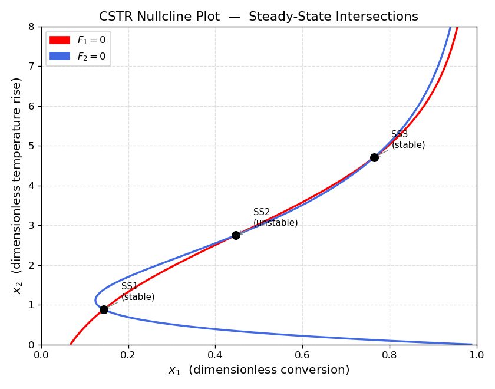
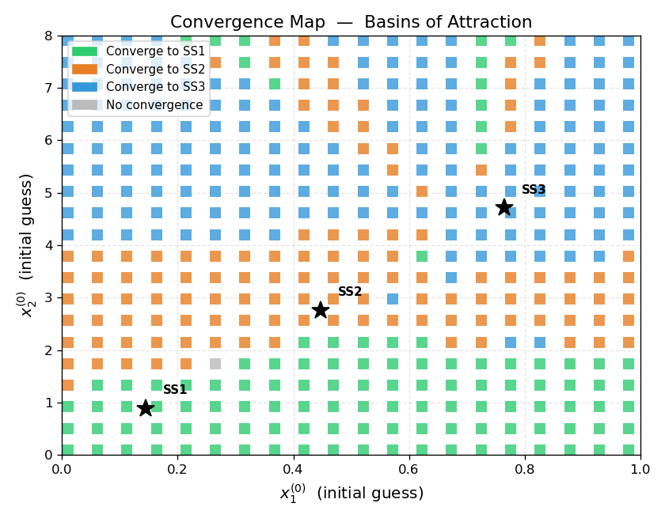
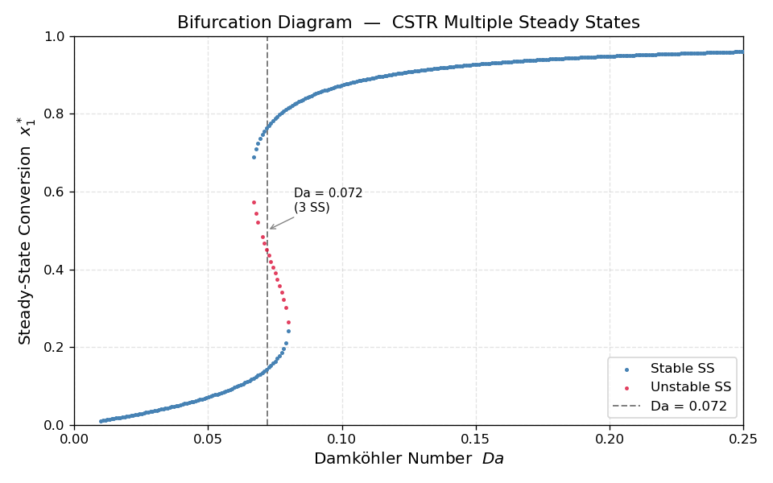

# Unit07 Example 04 - CSTR 多重穩態分析（Multiple Steady States）

## 學習目標

本範例以連續攪拌槽反應器（CSTR）的無因次穩態模型為例，介紹如何分析具有**多重解**的非線性方程組。當反應熱效應顯著時，CSTR 可能同時存在三個穩態——本範例以圖形方法、系統化多起始點搜尋及穩定性分析，完整揭示此多重穩態現象。

學習完本範例後，您將能夠：

- 建立 CSTR 質量與能量平衡的**無因次穩態方程組**
- 繪製 **零等位線圖（Nullcline Plot）**，以圖形方式確認多重穩態的存在
- 以**均勻網格多起始點**系統化搜尋所有穩態解
- 繪製**收斂地圖（Convergence Map）**，視覺化各穩態的吸引盆（Basin of Attraction）
- 利用**解析 Jacobian**與特徵值進行線性穩定性分析
- 掃描 Damköhler 數 $Da$ 繪製 **S 形分岔圖（Bifurcation Diagram）**，識別點火與熄滅臨界值

---

## 1. 問題描述

### 1.1 化工背景

**連續攪拌槽反應器（CSTR，Continuously Stirred Tank Reactor）** 是化工製程中最基本的反應器型式之一。在理想混合假設下，其穩態行為由質量平衡與能量平衡聯立決定。

當反應為**放熱反應**（ $\Delta H_r < 0$ ）且冷卻不足時，系統可能出現**多重穩態（Multiple Steady States）**：

- **低溫穩態（SS1）**：轉化率低，反應幾乎未點火
- **中間穩態（SS2）**：數學上存在，但**物理不穩定**，任何擾動都會使系統偏離
- **高溫穩態（SS3）**：轉化率高，反應充分進行

此現象在工業操作中至關重要——若操作條件落在多重穩態區域，系統行為取決於**歷史路徑**（升溫 vs. 降溫），形成遲滯現象（Hysteresis）。

### 1.2 文獻來源

本範例採用 Ray（1981）的無因次 CSTR 模型，此模型廣泛用於非線性動力學與分岔理論的教學：

> Ray, W. H. (1981). *Advanced Chemical Reactor Design*. Wiley, New York.

### 1.3 系統設定

| 參數 | 符號 | 數值 | 物理意義 |
|------|------|------|---------|
| 無因次反應熱 | $B$ | 8.0 | 放熱強度 |
| Damköhler 數 | $Da$ | 0.072 | 反應速率 vs. 流量 |
| 無因次活化能 | $\varphi$ | 20.0 | Arrhenius 溫度敏感性 |
| 無因次冷卻係數 | $\beta$ | 0.3 | 冷卻強度 |

---

## 2. 數學模型

### 2.1 無因次穩態方程式

以無因次轉化率 $x_1 \in [0,1)$ 與無因次溫升 $x_2 \in [0,\infty)$ 為狀態變數，穩態條件為 $F_1 = F_2 = 0$ ：

$$
F_1(x_1, x_2) = -x_1 + Da\,(1-x_1)\,\exp\!\left(\frac{x_2}{1 + x_2/\varphi}\right) = 0
$$

$$
F_2(x_1, x_2) = -(1+\beta)\,x_2 + B\,Da\,(1-x_1)\,\exp\!\left(\frac{x_2}{1 + x_2/\varphi}\right) = 0
$$

**方程式推導說明：**

- $F_1 = 0$：質量平衡——進料未反應量 $(-x_1)$ 加上反應生成量 $Da\,(1-x_1)\,r(x_2)$ 為零
- $F_2 = 0$：能量平衡——冷卻散熱項 $(-(1+\beta)x_2)$ 加上反應放熱項 $(B \cdot Da\,(1-x_1)\,r(x_2))$ 為零
- 反應速率項： $r(x_2) = \exp\!\left(\dfrac{x_2}{1+x_2/\varphi}\right)$ （無因次 Arrhenius 速率）

### 2.2 兩方程式的比值關係

觀察 $F_1=0$ 與 $F_2=0$ 的結構，可得：

$$
\frac{x_2}{x_1} = \frac{B}{1+\beta} = \frac{8.0}{1.3} \approx 6.154
$$

這意味著三個穩態解均位於同一直線 $x_2 = 6.154\,x_1$ 附近。

### 2.3 Jacobian 矩陣（解析式）

設 $r = \exp\!\left(\dfrac{x_2}{1+x_2/\varphi}\right)$，$r' = \dfrac{r}{(1+x_2/\varphi)^2}$，則：

$$
J = \frac{\partial F}{\partial x} = \begin{bmatrix} -1 - Da\,r & Da\,(1-x_1)\,r' \\ -B\,Da\,r & -(1+\beta) + B\,Da\,(1-x_1)\,r' \end{bmatrix}
$$

---

## 3. 函數定義

以下程式碼定義求解所需的核心函數：

```python
def reaction_rate(x1, x2):
    return Da * (1.0 - x1) * np.exp(x2 / (1.0 + x2 / phi))

def F_cstr(x_vec):
    x1, x2 = x_vec
    R = reaction_rate(x1, x2)
    F1 = -x1 + R
    F2 = -(1.0 + beta) * x2 + B * R
    return [F1, F2]

def jacobian_cstr(x1, x2):
    exp_term = np.exp(x2 / (1.0 + x2 / phi))
    dexp_dx2 = exp_term / (1.0 + x2 / phi)**2
    dF1_dx1 = -1.0 - Da * exp_term
    dF1_dx2 = Da * (1.0 - x1) * dexp_dx2
    dF2_dx1 = -B * Da * exp_term
    dF2_dx2 = -(1.0 + beta) + B * Da * (1.0 - x1) * dexp_dx2
    return np.array([[dF1_dx1, dF1_dx2],
                     [dF2_dx1, dF2_dx2]])
```

快速驗證輸出（在非穩態點 $x_1=0.15,\,x_2=0.9$ ）：

```
Function definitions OK.
────────────────────────────────────────────────────
  Quick check at (x1=0.15, x2=0.9):
    R        = 0.144805
    F1(x)    = -0.005195
    F2(x)    = -0.011556
  ||F(x)||   = 0.0127  (non-zero → not yet at SS)
────────────────────────────────────────────────────
```

因 $\|F\| \neq 0$ ，確認此點並非穩態。

---

## 4. 零等位線圖分析（Nullcline Plot）

### 4.1 分析原理

將 $F_1(x_1,x_2)=0$ 與 $F_2(x_1,x_2)=0$ 個別視為 $(x_1, x_2)$ 平面上的曲線（零等位線），兩條曲線的**交點**即為穩態解。

| 零等位線 | 方程 | 顏色 |
|---------|------|------|
| $F_1=0$ | $x_1 = Da\,(1-x_1)\,r(x_2)$ | 紅色 |
| $F_2=0$ | $x_2 = \dfrac{B\,Da\,(1-x_1)\,r(x_2)}{1+\beta}$ | 藍色 |

### 4.2 程式碼說明

使用 `np.meshgrid` 建立 400×400 的密集網格，以 `plt.contour` 繪製零等位線：

```python
x1_arr = np.linspace(0.0, 0.99, 400)
x2_arr = np.linspace(0.0, 8.0,  400)
X1, X2 = np.meshgrid(x1_arr, x2_arr)

Z1 = ...  # F1 evaluated on grid
Z2 = ...  # F2 evaluated on grid

ax.contour(X1, X2, Z1, levels=[0], colors='red',       linewidths=2)
ax.contour(X1, X2, Z2, levels=[0], colors='royalblue', linewidths=2)
```

### 4.3 執行結果



**讀圖要點：**
- 紅曲線（ $F_1=0$ ）與藍曲線（ $F_2=0$ ）在參數 $Da=0.072$ 下恰好有**三個交點**
- 三個交點對應 SS1（低）、SS2（中）、SS3（高）三個穩態
- 若 $Da$ 值超出多重穩態區間，兩曲線僅有一個交點

---

## 5. 系統化多起始點搜尋

### 5.1 方法說明

單一起始值的 `fsolve` 只能找到**局部解**。為確保找到**所有**穩態，需系統化掃描初始條件空間：

1. 在 $x_1 \in [0.01, 0.98]$ ，$x_2 \in [0.1, 7.9]$ 建立 $20 \times 20 = 400$ 個均勻分佈的起始點
2. 對每個起始點執行 `fsolve`，記錄是否收斂及收斂至哪個解
3. 對收斂解做**聚類**（距離容忍 $\delta = 0.05$ ），相近的解視為同一穩態
4. 繪製收斂地圖，不同顏色標示不同穩態的**吸引盆**

**收斂判據：** $\|F(x^*)\|_2 < 10^{-8}$ ，且 $x_1 \in (0,1)$ ，$x_2 > 0$

### 5.2 格點掃描結果

```
Multi-start grid search: 20x20 = 400 starting points
Number of distinct steady states found: 3

  SS   x1*       x2*       (stability determined later)
  ──────────────────────────────────────────────
  SS1  0.1440    0.8860
  SS2  0.4472    2.7517
  SS3  0.7646    4.7050
```

### 5.3 收斂地圖



**讀圖要點：**
- **綠色**格點：起始值收斂至 SS1（低轉化率穩態）
- **橙色**格點：起始值收斂至 SS2（中間不穩定穩態）
- **藍色**格點：起始值收斂至 SS3（高轉化率穩態）
- **灰色**格點：未收斂（位於系統邊界附近）
- 三個黑星號（★）標示各穩態的精確位置

> **工程意義**：初始條件（如反應器啟動狀態）決定系統最終落於哪個穩態，此即「吸引盆」的工程含意。

---

## 6. 三個穩態點精確求解

以等位線圖估計的三個交點附近為起始值，執行 `fsolve` 精確求解：

```
Steady-State Solutions
========================================================
  Label          x1*         x2*         ||F||
  ──────────────────────────────────────────────────
  SS1       0.143969    0.885965      2.24e-16
  SS2       0.447159    2.751747      9.04e-16
  SS3       0.764561    4.704992      5.91e-14
========================================================
```

三個穩態的殘差均在機器精度（ $\sim 10^{-16}$ 至 $10^{-14}$ ）量級，解的精度極高。

| 穩態 | $x_1^*$ | $x_2^*$ | 物理描述 |
|------|---------|---------|---------|
| SS1 | 0.1440 | 0.8860 | 低轉化率、低溫穩態 |
| SS2 | 0.4472 | 2.7517 | 中間不穩定穩態 |
| SS3 | 0.7646 | 4.7050 | 高轉化率、高溫穩態 |

---

## 7. 穩態穩定性分析

### 7.1 理論基礎

在穩態 $x^*$ 附近對動態 ODE $\dot{x} = F(x)$ 做線性展開：

$$
\dot{\xi} = J(x^*)\,\xi, \quad \xi = x - x^*
$$

其中 $J(x^*) = \dfrac{\partial F}{\partial x}\Big|_{x^*}$ 為 Jacobian 矩陣。

**穩定性判準（Lyapunov 線性穩定性）：**

$$
\begin{cases}
\text{Re}(\lambda_i) < 0 \;\forall i & \Rightarrow \textbf{穩定（Stable）} \\
\exists\; \text{Re}(\lambda_i) > 0 & \Rightarrow \textbf{不穩定（Unstable）}
\end{cases}
$$

### 7.2 計算結果

```
Stability Analysis via Jacobian Eigenvalues
==============================================================

  SS1  (0.1440, 0.8860)  →  STABLE  ✓
    Jacobian:
      [-1.1682  +0.1320]
               [-1.3455  -0.2439]
    λ1 = -0.8957 +0.0000j  (Re < 0 → stable direction)
    λ2 = -0.5164 +0.0000j  (Re < 0 → stable direction)

  SS2  (0.4472, 2.7517)  →  UNSTABLE ✗
    Jacobian:
      [-1.8088  +0.3455]
               [-6.4707  +1.4643]
    λ1 = -0.8375 +0.0000j  (Re < 0 → stable direction)
    λ2 = +0.4929 +0.0000j  (Re > 0 → unstable direction)

  SS3  (0.7646, 4.7050)  →  STABLE  ✓
    Jacobian:
      [-4.2474  +0.5011]
               [-25.9791  +2.7086]
    λ1 = -0.7694 +0.9597j  (Re < 0 → stable direction)
    λ2 = -0.7694 -0.9597j  (Re < 0 → stable direction)

==============================================================
```

### 7.3 結果解讀

| 穩態 | 特徵值類型 | 穩定性 | 物理意義 |
|------|-----------|--------|---------|
| SS1 | 兩負實數 $\lambda$ | **穩定節點（Stable Node）** | 擾動後指數衰減回穩態 |
| SS2 | 一正一負實數 $\lambda$ | **鞍點（Saddle Point）** | 部分方向發散，物理不可觀測 |
| SS3 | 複數共軛（負實部） | **穩定螺旋（Stable Focus）** | 擾動後振盪衰減回穩態 |

> **SS3 的特殊性**：其複數特徵值（ $\text{Re} < 0$ ）意味著在高轉化率穩態附近，系統對擾動的響應會呈現**振盪衰減**（damped oscillation），這在工業操作中可能表現為溫度與濃度的短暫波動後恢復穩定。

---

## 8. 分岔圖

### 8.1 分岔分析原理

以 Damköhler 數 $Da$ 為分岔參數，掃描 $Da \in [0.01, 0.25]$，在每個 $Da$ 值下：

1. 以三個不同起始猜測執行 `fsolve`
2. 收集所有不重複的收斂解（去重複容忍值 $\delta = 0.02$ ）
3. 對每個解計算 Jacobian 特徵值，判定穩定性
4. 繪製 $x_1^*$ 對 $Da$ 的曲線（穩定/不穩定分別標色）

### 8.2 分岔圖結果



### 8.3 讀圖要點

- **藍色點（Stable SS）**：即 SS1 與 SS3 分支，為可觀測的穩態
- **紅色點（Unstable SS）**：即 SS2 分支，鞍點，物理上不可直接觀測
- **垂直虛線**（ $Da = 0.072$ ）：本範例操作點，落於多重穩態區間內
- **S 形曲線**：三個分支共同形成 S 形，是折叠分岔（Fold/Saddle-node Bifurcation）的典型形貌

### 8.4 折叠分岔臨界值

從 S 形曲線可觀察到兩個**折叠分岔點**（Fold Points）：

| 折叠點 | $Da$ 臨界值（近似） | 對應事件 |
|-------|----------------|---------|
| 左折叠 | $Da \approx 0.065$ | **點火（Ignition）臨界值**：升溫至此，系統從 SS1 躍升至 SS3 |
| 右折叠 | $Da \approx 0.085$ | **熄滅（Extinction）臨界值**：降溫至此，系統從 SS3 降回 SS1 |

> **遲滯現象（Hysteresis）**：當 $Da$ 在兩折叠點之間（0.065 至 0.085）時，系統實際狀態取決於操作歷史——先點火後的系統保持在高溫 SS3，而從未點火的系統維持在低溫 SS1。

---

## 9. 總結

### 9.1 分析流程回顧

| 步驟 | 方法 | Python 工具 |
|------|------|------------|
| 1. 建立穩態方程 | 無因次化 CSTR 質量與能量平衡 | 數學推導 |
| 2. 零等位線圖 | $F_1=0$ 、$F_2=0$ 曲線繪製 | `plt.contour` |
| 3. 多起始點搜尋 | 20×20 均勻網格，收斂地圖 | `fsolve` + grid scan |
| 4. 精確求解 | 以圖形估計值為起點 | `fsolve` |
| 5. 穩定性分析 | Jacobian 特徵值 | `eigvals` |
| 6. 分岔圖 | 掃描 $Da$，S 形曲線 | `fsolve` loop |

### 9.2 數值結果彙整

三個穩態（ $B=8,\;Da=0.072,\;\varphi=20,\;\beta=0.3$ ）：

| 穩態 | $x_1^*$ | $x_2^*$ | 特徵值 $\lambda_1, \lambda_2$ | 穩定性 |
|------|---------|---------|------------------------------|--------|
| SS1 | 0.1440 | 0.8860 | $-0.896,\;-0.516$ | **穩定節點** |
| SS2 | 0.4472 | 2.7517 | $-0.838,\;+0.493$ | **不穩定（鞍點）** |
| SS3 | 0.7646 | 4.7050 | $-0.769 \pm 0.960j$ | **穩定螺旋** |

### 9.3 重要概念回顧

| 概念 | 說明 |
|------|------|
| 多重穩態 | 同一組參數下非線性方程組的多個解，由不同初始條件決定最終狀態 |
| 零等位線圖 | 圖形工具，在求解前確認解的數量、位置，提供合理初值範圍 |
| 收斂地圖 | 視覺化各穩態的「吸引盆」，揭示起始條件與最終狀態的映射關係 |
| 線性穩定性 | Jacobian 特徵值的實部決定擾動是衰減（穩定）或放大（不穩定） |
| 折叠分岔 | S 形分岔曲線上的轉折點，對應系統的突躍（點火/熄滅）臨界條件 |
| 遲滯現象 | 在多重穩態區間內，系統的實際狀態取決於操作歷史，升降路徑不同 |

### 9.4 關鍵學習點

1. **圖形優先策略**：在求解多變數非線性方程組前，先以零等位線圖確認解的數量與位置，可大幅提升求解效率與可靠性。
2. **系統化多起始點搜尋**：均勻網格掃描是確保不遺漏任何穩態解的標準方法，收斂地圖提供直觀的起始值敏感性分析。
3. **穩定性分析不可省略**：找到解不代表解是可觀測的——只有穩定穩態才能在實際操作中維持。SS2 雖滿足方程 $F=0$，但物理上無法觀測。
4. **分岔圖的工程價值**：S 形分岔曲線揭示點火與熄滅臨界值，是反應器安全操作窗口設計的理論基礎。
5. **SS3 的振盪響應**：其複數特徵值（穩定螺旋）意味著溫度控制系統需注意避免振盪放大的工況。

> **化工意涵**：工業放熱反應器（如 PFR、CSTR）的操作條件往往需要避開多重穩態區間，或在特定穩態進行（如高轉化率的 SS3）。防止意外熄滅或失控點火是反應器控制設計的核心挑戰。

---

**課程資訊**
- 課程名稱：化工數值方法與程式設計
- 課程單元：Unit 07 - 非線性方程式求解
- 課程製作：逢甲大學 化工系 智慧程序系統工程實驗室
- 授課教師：莊曜禎 助理教授
- 更新日期：2026-02-19

**課程授權 [CC BY-NC-SA 4.0]**
 - 本教材遵循 [創用CC 姓名標示-非商業性-相同方式分享 4.0 國際 (CC BY-NC-SA 4.0)](https://creativecommons.org/licenses/by-nc-sa/4.0/deed.zh) 授權。

---
