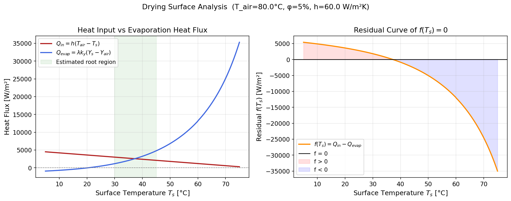
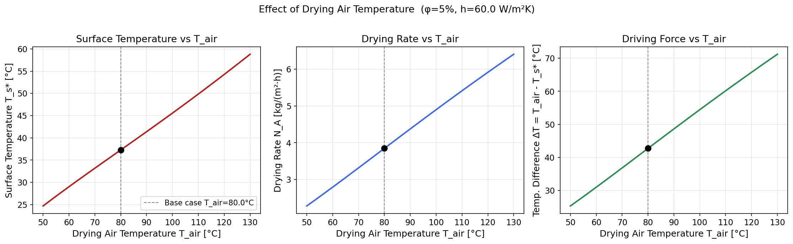
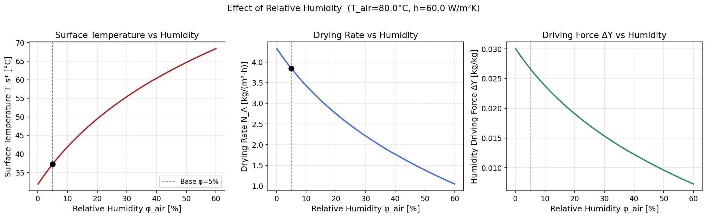

# Unit07 Example 05 - 熱板乾燥過程之乾燥面溫度計算

## 學習目標

完成本範例後，學習者應能夠：

1. 建立**耦合熱質傳方程式**，推導恆率乾燥階段的乾燥面熱量平衡非線性方程式
2. 使用 **Antoine 方程式**計算不同溫度下水的飽和蒸氣壓，並正確實作**分段係數**的向量化函數
3. 利用 `scipy.optimize.root_scalar()` 中的 `brentq`、`bisect`、`newton`、`secant` 等方法求解單變數非線性方程式，並比較其**收斂特性**
4. 解讀乾燥面溫度 $T_s^*$ 的**物理意義**，以及其與濕球溫度概念的關聯
5. 以圖形法輔助尋找求解區間，進行**參數研究**分析乾燥空氣溫度與相對濕度對乾燥性能的影響

---

## 1. 問題描述

### 1.1 化工背景

**乾燥（Drying）** 是化工、食品、製藥等工業中廣泛使用的單元操作，目的是利用熱能移除固體中的水分或溶劑。典型的乾燥曲線包含兩個主要階段：

- **恆率乾燥（Constant-Rate Drying）**：固體表面持續潤濕，乾燥速率穩定，受**熱質傳速率**共同控制。
- **降率乾燥（Falling-Rate Drying）**：表面開始乾燥，水分從內部擴散至表面，速率受**內部擴散**控制。

本範例專注於**恆率乾燥階段**，探討乾燥面溫度的計算方法。

### 1.2 物理模型

在恆率乾燥階段，熱空氣以對流方式將熱量傳遞到潮濕固體表面，用於蒸發水分。穩態下，**熱傳速率等於蒸發耗熱速率**：

$$
Q_{in} = Q_{evap}
$$

$$
h(T_{air} - T_s) = \lambda \cdot k_y \cdot (Y_s(T_s) - Y_{air})
$$

其中各參數意義如下：

| 符號 | 說明 | 值 | 單位 |
|------|------|-----|------|
| $h$ | 對流熱傳係數 | 60 | W/(m²·K) |
| $T_{air}$ | 乾燥空氣溫度 | 80 | °C |
| $T_s$ | 乾燥面溫度（**待求**） | — | °C |
| $\lambda$ | 水的蒸發潛熱 | 2.4×10⁶ | J/kg |
| $k_y$ | 質傳係數 | 0.04 | kg dry air/(m²·s) |
| $Y_s(T_s)$ | 乾燥面飽和絕對濕度 | — | kg water/kg dry air |
| $Y_{air}$ | 乾燥空氣絕對濕度 | 0.01490 | kg water/kg dry air |

**操作條件**：乾燥空氣相對濕度 $\phi_{air} = 5\%$ ，大氣壓力 $P_{total} = 760$ mmHg。

### 1.3 待求解方程式

將等式整理為求根問題：

$$
f(T_s) = h(T_{air} - T_s) - \lambda \cdot k_y \cdot [Y_s(T_s) - Y_{air}] = 0
$$

由於 $Y_s(T_s)$ 非線性地依賴 $T_s$ （透過 Antoine 方程式），此方程式為**單變數非線性方程式**，需數值法求解。

---

## 2. 數學模型

### 2.1 絕對濕度計算

絕對濕度（Absolute Humidity）定義為每公斤乾空氣中所含水蒸氣的質量，由Dalton分壓定律推導：

$$
Y = \frac{M_w}{M_{air}} \cdot \frac{P_v}{P_{total} - P_v} = 0.6219 \cdot \frac{P_v}{760 - P_v}
$$

其中：
- $M_w = 18.015$ g/mol（水的分子量）
- $M_{air} = 28.97$ g/mol（乾空氣分子量）
- $P_v = \phi \cdot P_{sat}(T)$ ：水蒸氣的分壓（mmHg）

**乾燥面**（飽和狀態， $\phi=1$ ）：

$$
Y_s(T_s) = 0.6219 \cdot \frac{P_{sat}(T_s)}{760 - P_{sat}(T_s)}
$$

**乾燥空氣**（相對濕度 $\phi_{air}$ ，溫度 $T_{air}$ ）：

$$
Y_{air} = 0.6219 \cdot \frac{\phi_{air} \cdot P_{sat}(T_{air})}{760 - \phi_{air} \cdot P_{sat}(T_{air})}
$$

### 2.2 Antoine 方程式（分段係數）

水的飽和蒸氣壓以 Antoine 方程式計算（P 單位：mmHg；T 單位：°C）：

$$
\log_{10} P_{sat} = A - \frac{B}{C + T}
$$

水的兩段 Antoine 係數（NIST 推薦值）：

| 溫度範圍 (°C) | A | B | C |
|--------------|---------|---------|---------|
| 1 ~ 60 | 8.07131 | 1730.63 | 233.426 |
| 60 ~ 150 | 8.10765 | 1750.286 | 235.0 |

注意：兩段在 60~100°C 重疊區的差異 < 0.5%，本範例以 $T < 60°C$ 使用段 1， $T \geq 60°C$ 使用段 2 進行**分段處理（Piecewise Function）**。

**驗證輸出**：

```
Antoine 方程式驗證（與查表數據對比）
--------------------------------------------------
  T= 20°C: P_sat=  17.47 mmHg  (參考值:  17.54,  誤差: 0.38%)
  T= 40°C: P_sat=  55.19 mmHg  (參考值:  55.32,  誤差: 0.23%)
  T= 60°C: P_sat= 149.44 mmHg  (參考值: 149.40,  誤差: 0.03%)
  T= 80°C: P_sat= 355.78 mmHg  (參考值: 355.10,  誤差: 0.19%)
  T=100°C: P_sat= 763.69 mmHg  (參考值: 760.00,  誤差: 0.49%)

乾燥空氣絕對濕度  Y_air = 0.01490 kg water/kg dry air
```

---

## 3. 函數定義

### 3.1 Antoine 分段函數設計

```python
def antoine_psat(T):
    T = np.asarray(T, dtype=float)
    scalar = T.ndim == 0
    T = np.atleast_1d(T)
    P_sat = np.zeros_like(T)
    # 段 1: T < 60°C
    mask1 = T < 60.0
    P_sat[mask1] = 10.0 ** (8.07131 - 1730.63 / (233.426 + T[mask1]))
    # 段 2: T >= 60°C
    mask2 = ~mask1
    P_sat[mask2] = 10.0 ** (8.10765 - 1750.286 / (235.0 + T[mask2]))
    return float(P_sat[0]) if scalar else P_sat
```

**設計要點**：
- 使用 `np.asarray()` 使函數同時支援**純量**與**陣列**輸入（向量化）
- 使用布林遮罩（Boolean Mask）實作分段邏輯，避免 Python `if-else` 無法向量化的問題
- `scalar` 旗標確保純量輸入時回傳純量（不是 0-d 陣列）

### 3.2 熱質平衡方程式

```python
def f_drying(T_s):
    Y_s   = humidity_abs(T_s, phi=1.0)          # 乾燥面飽和濕度
    Y_air = humidity_abs(T_air, phi=phi_air)     # 乾燥空氣絕對濕度
    heat_in  = h * (T_air - T_s)
    heat_out = lam_evap * k_y * (Y_s - Y_air)
    return heat_in - heat_out
```

此函數將在 `root_scalar()` 中求解 $f(T_s) = 0$ ，找出使熱傳速率等於蒸發耗熱的乾燥面溫度。

---

## 4. 方程式圖形分析

在數值求解之前，先繪製圖形確認根的存在性與位置：

**兩圖說明**：

| 圖形 | 說明 | 讀圖要點 |
|------|------|---------|
| 左圖：熱傳 vs 蒸發曲線 | $Q_{in}$ 線性下降（紅色直線），$Q_{evap}$ 非線性上升（藍色曲線） | 兩者交點即為 $T_s^*$ |
| 右圖：殘差曲線 $f(T_s)$ | 在 $T_s \approx 37$ °C 時由正轉負 | 紅色區（f>0）→藍色區（f<0），零點即為 $T_s^*$ |



**圖形分析結論**：
- 零點估算區間 $\approx [37.1, 37.3]$ °C
- 設定求解區間 `bracket = [25.0, 60.0]` 覆蓋此範圍，確保收斂

---

## 5. 數值求解：多方法比較

### 5.1 求解方法說明

| 方法 | 類型 | 需區間 | 需導數 | 適用情境 |
|------|------|--------|--------|---------|
| `brentq` | 混合法 | ✅ | ❌ | 最穩健，推薦首選 |
| `bisect` | 二分法 | ✅ | ❌ | 最安全，保證收斂，但最慢 |
| `newton` | Newton-Raphson | ❌ | ✅ | 收斂最快，但需好的初始值 |
| `secant` | 割線法 | ❌ | ❌ | 近似 Newton，需兩個初始點 |

### 5.2 求解結果比較

```
========================================================================
方法              Ts (°C)         殘差 f(Ts)       迭代次數       收斂
========================================================================
brentq        37.275156       8.6402e-12          9        ✓
bisect        37.275156       1.9509e-10         44        ✓
newton        37.275156      -1.3642e-12          4        ✓
secant        37.275156       8.6402e-12          6        ✓
========================================================================

✓ 最終求解結果 (brentq): T_s = 37.2752 °C
```

**結果解析**：
- 四種方法全部收斂至相同解 $T_s^* = 37.2752$ °C
- `newton` 僅需 **4 次迭代**，收斂最快（但依賴初始值品質）
- `bisect` 需 **44 次迭代**，為二分法的理論特性（每次縮小一半）
- `brentq` 以 **9 次迭代**達到機器精準度，兼顧速度與穩健性

---

## 6. 乾燥速率計算與物理意義驗證

### 6.1 計算結果

```
=======================================================
  乾燥面溫度計算結果
=======================================================
  乾燥面溫度    T_s        = 37.2752 °C
  飽和蒸氣壓    P_sat(Ts)  = 47.662 mmHg
  乾燥面絕對濕度 Y_s       = 0.04161 kg/kg
  空氣絕對濕度   Y_air     = 0.01490 kg/kg
  濕度差         ΔY        = 0.02670 kg/kg
-------------------------------------------------------
  恆率乾燥速率   N_A       = 0.001068 kg/(m²·s)
                           = 3.8452 kg/(m²·h)
-------------------------------------------------------
  熱量平衡驗證:
    熱傳速率  Q_in   = 2563.4906 W/m²
    蒸發耗熱  Q_evap = 2563.4906 W/m²
    平衡殘差  Δ      = 8.1855e-12 W/m²  ✓ 守恆
=======================================================
```

### 6.2 物理意義解讀

| 計算量 | 數值 | 物理意義 |
|--------|------|---------|
| $T_s^* = 37.28$ °C | 比 $T_{air}=80$ °C 低 42.7°C | 蒸發冷卻效應，$T_s^*$ 即為此條件下的「濕球溫度」 |
| $P_{sat}(37.28°C) = 47.7$ mmHg | 飽和蒸氣壓 | 乾燥面維持飽和，$P_v = 47.7$ mmHg |
| $\Delta Y = 0.0267$ kg/kg | 質傳推動力 | 由乾燥面飽和狀態至空氣的濕度梯度 |
| $N_A = 3.845$ kg/(m²·h) | 乾燥速率 | 每平方米乾燥面每小時移除的水分量 |
| $Q_{in} = Q_{evap} = 2563$ W/m² | 熱量守恆 | 殘差 $8.2 \times 10^{-12}$ W/m²，驗證求解精準度 |

---

## 7. 參數研究：乾燥空氣溫度的影響

固定 $\phi_{air} = 5\%$ 、 $h = 60$ W/m²·K，掃描 $T_{air}$ 從 50°C 到 130°C：



### 圖形解讀

| 子圖 | 趨勢 | 原因 |
|------|------|------|
| 左圖：$T_s^*$ vs $T_{air}$ | 近線性增大 | $T_{air}$ 升高 → 需更多蒸發熱 → 乾燥面 $T_s^*$ 升高以提供更大飽和濕度差 $Y_s - Y_{air}$ |
| 中圖：$N_A$ vs $T_{air}$ | 近線性增大 | $Q_{in} = h(T_{air} - T_s^*)$ 持續增大，蒸發速率等量增加，$N_A$ 正比增長 |
| 右圖：$\Delta T$ vs $T_{air}$ | 近線性增大 | $T_{air}$ 增高時 $T_s^*$ 增幅較小，使溫差 $\Delta T = T_{air} - T_s^*$ 隨 $T_{air}$ 持續擴大 |

**設計啟示**：提高乾燥空氣溫度是提升乾燥效率的最直接方式，但需考慮**產品熱敏性限制**（如食品、藥品的溫敏成分）。

---

## 8. 參數研究：相對濕度的影響

固定 $T_{air} = 80°C$ 、 $h = 60$ W/m²·K，掃描 $\phi_{air}$ 從 0% 到 60%：



### 圖形解讀

| 子圖 | 趨勢 | 原因 |
|------|------|------|
| 左圖：$T_s^*$ vs $\phi$ | 非線性增大 | $Y_{air}$ 增大 → 蒸發驅動力下降 → 需更高 $T_s$ 使 $Y_s - Y_{air}$ 足夠 |
| 中圖：$N_A$ vs $\phi$ | 非線性遞減 | 濕度差 $\Delta Y = Y_s - Y_{air}$ 隨 $\phi$ 增大而縮小，乾燥變慢 |
| 右圖：$\Delta Y$ vs $\phi$ | 非線性遞減 | 空氣越濕，驅動力越弱 |

**量化比較（$T_{air}=80°C$）**：

| 相對濕度 $\phi$ | 乾燥速率 $N_A$ | 相對乾燥能力 |
|----------------|---------------|-------------|
| 5% | 3.845 kg/(m²·h) | 100%（基準） |
| 10% | 3.428 kg/(m²·h) | 89.1% |
| 30% | 2.210 kg/(m²·h) | 57.5% |
| 50% | 1.382 kg/(m²·h) | 35.9% |

**設計啟示**：乾燥空氣需充分**除濕**（降低 $\phi_{air}$）才能保持良好的乾燥效率，這也是工業乾燥系統配備除濕設備的原因。

---

## 9. 總結

### 9.1 求解流程彙整

| 步驟 | 操作 | 核心工具 |
|------|------|---------|
| 1 | 建立熱質平衡方程式 $f(T_s)=0$ | 物理推導 |
| 2 | 實作 Antoine 分段函數計算 $P_{sat}(T)$ | `np.asarray()` + Boolean Mask |
| 3 | 圖形法確認零點位置與求解區間 | `matplotlib` |
| 4 | 多方法求解並比較收斂特性 | `scipy.optimize.root_scalar()` |
| 5 | 計算乾燥速率並驗證熱量守恆 | 代回計算 |
| 6 | 兩參數（ $T_{air}$ 、 $\phi$ ）迴圈求解與繪圖分析 | 迴圈 + `root_scalar()` |

### 9.2 計算結果彙整（基本工況）

| 物理量 | 符號 | 數值 |
|--------|------|------|
| 乾燥空氣溫度 | $T_{air}$ | 80.0 °C |
| 相對濕度 | $\phi_{air}$ | 5% |
| **乾燥面溫度** | $T_s^*$ | **37.2752 °C** |
| 飽和蒸氣壓 | $P_{sat}(T_s^*)$ | 47.662 mmHg |
| 乾燥面絕對濕度 | $Y_s$ | 0.04161 kg/kg |
| 空氣絕對濕度 | $Y_{air}$ | 0.01490 kg/kg |
| **恆率乾燥速率** | $N_A$ | **3.8452 kg/(m²·h)** |
| 熱傳速率 | $Q_{in}$ | 2563.49 W/m² |

### 9.3 學習重點

1. **分段函數向量化設計**：Antoine 方程式兩段係數的正確實作需使用 NumPy 的布林遮罩，而非 `if-else`，以確保陣列輸入的效率與正確性。

2. **圖形法輔助求解**：繪製 $f(T_s)$ 殘差曲線是確認根存在性與設定 `bracket` 的最可靠方式，可避免因求解區間設置不當導致的求解失敗。

3. **方法選擇建議**：`brentq` 兼顧速度與穩健性，是實用首選；`newton` 適合需要大量重複求解（如迴圈中）且初始值可靠的場景；`bisect` 則用於教學或驗證目的。

4. **物理意義核實**：乾燥面溫度 $T_s^*$ 本質上即為該操作條件下的**濕球溫度**，恆低於乾燥空氣溫度；此結果可與心理測量圖（Psychrometric Chart）交叉驗證。

---

**課程資訊**
- 課程名稱：電腦在化工上之應用
- 課程單元：Unit07 非線性方程式之求解
- 課程製作：逢甲大學 化工系 智慧程序系統工程實驗室
- 授課教師：莊曜禎 助理教授
- 更新日期：2026-02-20

**課程授權 [CC BY-NC-SA 4.0]**
 - 本教材遵循 [創用CC 姓名標示-非商業性-相同方式分享 4.0 國際 (CC BY-NC-SA 4.0)](https://creativecommons.org/licenses/by-nc-sa/4.0/deed.zh) 授權。

---

