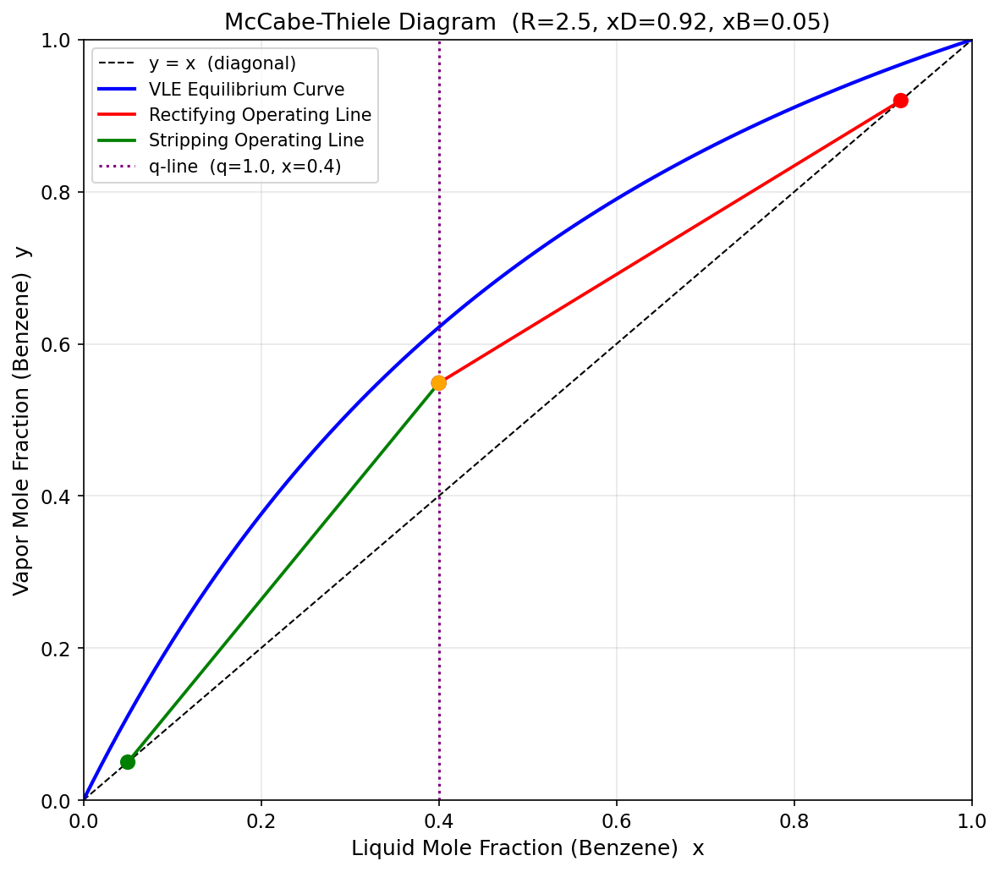
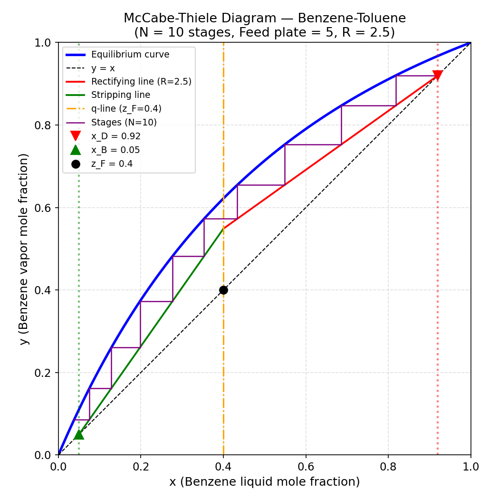
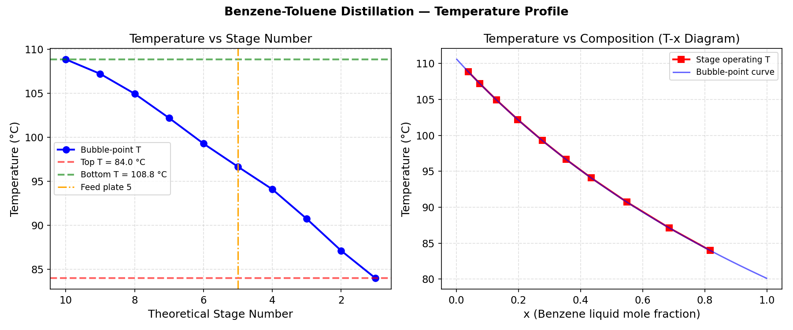
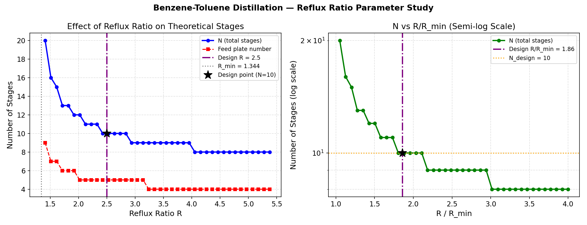

# Unit07 Example 06 - 二元蒸餾塔設計計算（苯-甲苯系統）

## 學習目標

完成本範例後，學習者應能夠：

1. 建立苯-甲苯二元系統的**氣液平衡（VLE）模型**，利用 Antoine 方程式與 Raoult's Law 計算平衡曲線
2. 依據**物料平衡**計算塔頂（精餾段）與塔底（汽提段）採出量，推導兩段操作線方程式
3. 以**圖形法（Pinch Point）**求解最小回流比 $R_{min}$ ，評估設計回流比的合理性
4. 實作 **McCabe-Thiele 逐級步進算法**，求解理論板數 $N$ 與最佳進料板位置
5. 計算各理論板的**泡點溫度**，分析蒸餾塔的溫度分布
6. 進行**回流比參數研究**，量化 $R$ 對理論板數 $N$ 的影響

---

## 1. 問題描述

### 1.1 化工背景

**蒸餾（Distillation）** 是化工廠中最重要的分離操作之一，利用各組分揮發性的差異將混合物分離為較純的組分。**連續蒸餾塔（Continuous Distillation Column）** 由精餾段（Rectifying Section）和汽提段（Stripping Section）構成，進料介於兩段之間。

本範例以工業上最具代表性的**苯-甲苯（Benzene-Toluene）**二元系統為例，該系統遵循**Raoult's Law**（理想溶液），可作為 McCabe-Thiele 圖解法的標準範例。

### 1.2 設計規格

| 參數 | 符號 | 數值 | 說明 |
|------|------|------|------|
| 操作壓力 | $P$ | 760 mmHg | 大氣壓操作 |
| 進料量 | $F$ | 100 mol/h | 基準量 |
| 進料組成 | $z_F$ | 0.40 | 苯的莫耳分率 |
| 塔頂規格 | $x_D$ | 0.92 | 塔頂液相苯莫耳分率 |
| 塔底規格 | $x_B$ | 0.05 | 塔底液相苯莫耳分率 |
| 進料熱狀態 | $q$ | 1.0 | 飽和液進料 |
| 設計回流比 | $R$ | 2.5 | $L/D$ |

### 1.3 物料平衡

對**全塔**做整體物料平衡（以苯為關鍵組分）：

$$
F = D + B
$$

$$
F \cdot z_F = D \cdot x_D + B \cdot x_B
$$

聯立求解，代入數值 $F=100$ ， $z_F=0.40$ ， $x_D=0.92$ ， $x_B=0.05$ ：

$$
D = \frac{F(z_F - x_B)}{x_D - x_B} = \frac{100 \times (0.40 - 0.05)}{0.92 - 0.05} = 40.23 \text{ mol/h}
$$

$$
B = F - D = 100 - 40.23 = 59.77 \text{ mol/h}
$$

**苯的回收率**：

$$
\eta_D = \frac{D \cdot x_D}{F \cdot z_F} = \frac{40.23 \times 0.92}{100 \times 0.40} = 92.5\%
$$

---

## 2. 數學模型

### 2.1 Antoine 方程式（飽和蒸氣壓）

利用 **Antoine 方程式**計算各純組分的飽和蒸氣壓 $P_{sat}(T)$ （單位：mmHg， $T$ 單位：°C）：

$$
\log_{10} P_{sat} = A - \frac{B}{T + C}
$$

本系統使用的 Antoine 係數：

| 組分 | $A$ | $B$ | $C$ | 沸點（°C） |
|------|-----|-----|-----|-----------|
| 苯（Benzene） | 6.90565 | 1211.033 | 220.790 | 80.10 |
| 甲苯（Toluene） | 6.95334 | 1343.943 | 219.377 | 110.63 |

**驗證**（代入沸點計算求得 $P_{sat} = 760$ mmHg，與文獻一致 ✓）

### 2.2 氣液平衡（VLE）

理想溶液遵循 **Raoult's Law**，苯的平衡蒸氣組成：

$$
y^* = \frac{x \cdot P_{sat}^{ben}(T)}{P}
$$

其中操作壓力 $P = 760$ mmHg，**泡點溫度 $T_{bp}(x)$** 由下列方程式求解：

$$
x \cdot P_{sat}^{ben}(T) + (1-x) \cdot P_{sat}^{tol}(T) = P = 760 \text{ mmHg}
$$

以 `scipy.optimize.root_scalar(brentq)` 在 $[T_{ben},\ T_{tol}] = [80.10,\ 110.63]$ °C 區間求解。

**VLE 計算結果驗證：**

| $x$ （苯液相） | $T_{bp}$ （°C） | $y^*$ （苯蒸氣） |
|:---:|:---:|:---:|
| 0.00 | 110.63 | 0.0000 |
| 0.20 | 102.10 | 0.3761 |
| 0.40 | 95.14 | 0.6219 |
| 0.60 | 89.33 | 0.7905 |
| 0.80 | 84.38 | 0.9110 |
| 1.00 | 80.10 | 1.0000 |

---

## 3. McCabe-Thiele 操作線

### 3.1 精餾段操作線（Rectifying Operating Line）

對精餾段（進料板以上）做包含塔頂的物料平衡。以回流比 $R = L/D$ 表示：

$$
y_{n+1} = \frac{R}{R+1} x_n + \frac{x_D}{R+1}
$$

| 參數 | 計算 | 數值 |
|------|------|------|
| 斜率 | $\frac{R}{R+1} = \frac{2.5}{3.5}$ | 0.7143 |
| $y$ 截距 | $\frac{x_D}{R+1} = \frac{0.92}{3.5}$ | 0.2629 |
| 起點 | $(x_D,\ x_D) = (0.92,\ 0.92)$ | — |

### 3.2 進料 q 線（Feed q-Line）

進料熱狀態 $q$ 定義為：將進料轉為飽和蒸氣所需的熱量除以蒸發潛熱，$q=1$ 代表飽和液（Saturated Liquid Feed）。

**q 線方程式：**

$$
y = \frac{q}{q-1} x - \frac{z_F}{q-1}
$$

對於 $q=1$ （飽和液），q 線退化為**垂直線 $x = z_F = 0.40$** 。

### 3.3 汽提段操作線（Stripping Operating Line）

汽提段操作線通過點 $(x_B, x_B)$ 並與精餾段操作線相交於 $(x_{int},\ y_{int})$ ：

$$
y = \frac{y_{int} - x_B}{x_{int} - x_B} (x - x_B) + x_B
$$

對於 $q=1$ ，交點為 $x_{int} = z_F$ ，代入精餾段方程式求 $y_{int}$ ：

$$
y_{int} = 0.7143 \times 0.40 + 0.2629 = 0.5486
$$

**汽提段操作線計算結果：**

| 參數 | 數值 |
|------|------|
| 斜率 | $\frac{0.5486 - 0.05}{0.40 - 0.05} = 1.4245$ |
| $y$ 截距 | $-0.0212$ |
| 起點 | $(x_B, x_B) = (0.05, 0.05)$ |
| 終點（交點） | $(0.40,\ 0.5486)$ |

### 3.4 最小回流比 $R_{min}$

當回流比降低到**操作線通過平衡曲線上某點（Pinch Point）** 時，兩線「夾住」無法繼續步進，即為最小回流比 $R_{min}$ 。

對於 $q=1$ （飽和液進料），Pinch Point 在 $x = z_F$ 的平衡點：

$$
y^*(z_F) = \mathrm{equilibrium\_y}(z_F,\ T_{bp}(z_F)) = \mathrm{equilibrium\_y}(0.40,\ 95.14\ ^\circ\mathrm{C}) = 0.6219
$$

$$
R_{min} = \frac{x_D - y^*}{y^* - z_F} = \frac{0.92 - 0.6219}{0.6219 - 0.40} = 1.3439
$$

**設計回流比 $R = 2.5 = 1.86 \times R_{min}$** （工業上通常取 $1.2 \sim 2.0$ 倍 $R_{min}$ ）

### 3.5 McCabe-Thiele 基礎圖（fig_01）



**圖 3.1 說明**：
- **藍線**：苯-甲苯 VLE 平衡曲線，曲線向上凸（相對揮發度 $\alpha > 1$ ）
- **紅線**：精餾段操作線，從 $(x_D, x_D) = (0.92, 0.92)$ 出發，斜率 $= 0.7143$
- **綠線**：汽提段操作線，從 $(x_B, x_B) = (0.05, 0.05)$ 出發，與精餾段操作線相交於 $(0.40, 0.5486)$
- **紫色虛線**：q 線 $x = z_F = 0.40$ （飽和液進料，垂直線）
- **橘色圓點**：兩操作線交點 $(x_{int}, y_{int})$
- 平衡曲線在操作線**上方**，兩線間的距離代表分離推進力；越大越容易分離

---

## 4. McCabe-Thiele 逐級步進算法

### 4.1 算法流程

逐級步進（Plate-by-Plate Stepping）在 x-y 圖上交替在**平衡曲線**和**操作線**之間畫水平線與垂直線，每一個「台階」代表一塊**理論板（Theoretical Plate）**：

```
起始：y₀ = x_D（全凝器）
  ↓
Step 1: 水平步至平衡曲線
  給定 y_n，求解 g(x) = y*(x) - y_n = 0
  → 得到第 n 板液相組成 x_n
  ↓
Step 2: 垂直步至操作線
  x_n ≥ x_int → 精餾段操作線  → y_{n+1}
  x_n < x_int → 汽提段操作線  → y_{n+1}（同時記錄進料板）
  ↓
重複直到 x_n ≤ x_B
```

### 4.2 關鍵非線性方程式求解（find_x_from_y_eq）

步驟 1 需求解**雙層巢狀非線性方程式**：

$$
g(x) = y^*(x) - y_{target} = \frac{x \cdot P_{sat}^{ben}(T_{bp}(x))}{P} - y_{target} = 0
$$

此方程式具備：
- **第一層非線性**：$T_{bp}(x)$ 本身需內層 `root_scalar` 求解（參見 §2.2）
- **第二層非線性**：$g(x) = 0$ 的外層求解

實作上使用 `root_scalar(eq, bracket=[1e-4, 1-1e-4], method='brentq')` 確保在 $(0,1)$ 範圍內收斂。

### 4.3 計算結果

| 理論板 $n$ | $x_n$ （液相苯） | $y_n$ （蒸氣苯） |
|:---:|:---:|:---:|
| 1 | 0.8177 | 0.9200 |
| 2 | 0.6857 | 0.8469 |
| 3 | 0.5486 | 0.7526 |
| 4 | 0.4337 | 0.6547 |
| **5（進料板）** | **0.3532** | **0.5727** |
| 6 | 0.2765 | 0.4819 |
| 7 | 0.1977 | 0.3727 |
| 8 | 0.1284 | 0.2604 |
| 9 | 0.0752 | 0.1617 |
| 10 | 0.0383 | 0.0859 |

**設計結果**：
- **理論板數 $N = 10$**（含再沸器）
- **最佳進料板 = 第 5 板**（此板的 $x_5 = 0.3532 < x_{int} = 0.40$ ，切換到汽提段操作線）

### 4.4 完整 McCabe-Thiele 圖（fig_02）



**圖 4.1 說明**：
- **紫色階梯線**：逐級步進的 10 塊理論板台階，清晰呈現每一板的液相與蒸氣組成
- 台階從 $(x_D, x_D)$ 出發向左下方逐步推進
- 第 4→5 板處，步進點越過 $x_{int} = 0.40$ ，操作線由精餾段（紅線）切換至汽提段（綠線）
- 最後一板（第 10 板）超過 $x_B = 0.05$ ，停止計數
- 台階越密集（靠近 Pinch Point），分離越困難，消耗板數越多

---

## 5. 溫度分布（Temperature Profile）

### 5.1 各板泡點溫度

每塊理論板的操作溫度由該板液相組成 $x_n$ 的**泡點溫度**決定：

$$
T_n = T_{bp}(x_n)
$$

| 理論板 $n$ | $x_n$ | $T_{bp}$ （°C） | 備註 |
|:---:|:---:|:---:|:---:|
| 1（塔頂） | 0.8177 | 83.98 | 接近苯沸點 |
| 2 | 0.6857 | 87.12 | — |
| 3 | 0.5486 | 90.73 | — |
| 4 | 0.4337 | 94.09 | — |
| **5（進料板）** | **0.3532** | **96.66** | — |
| 6 | 0.2765 | 99.28 | — |
| 7 | 0.1977 | 102.19 | — |
| 8 | 0.1284 | 104.95 | — |
| 9 | 0.0752 | 107.20 | — |
| 10（塔底） | 0.0383 | 108.85 | 接近甲苯沸點 |

**溫度分布特性**：塔頂 83.98°C → 塔底 108.85°C，溫差 **24.87°C**，整體從塔頂到塔底**單調遞增**。

### 5.2 溫度分布圖（fig_03）



**圖 5.1 說明（左圖：溫度 vs 理論板編號）**：
- 橫軸由右至左為由上而下（逆序顯示），直觀對應塔的結構
- 溫度從塔頂（橘虛線右側）的 **83.98°C** 單調上升至塔底的 **108.85°C**
- 進料板（板 5，橘色垂直線）位於溫度曲線的中段，溫度約 **96.66°C**
- 溫度梯度在塔中段（進料板附近）略為平緩，反映分離推進力較低的區域

**圖 5.1 說明（右圖：溫度 vs 液相組成 T-x 圖）**：
- 各理論板的操作點（紅色方塊）完全落在泡點曲線（藍線）上，驗證計算正確性
- T-x 圖近似線性，因苯與甲苯的物理性質相近

---

## 6. 參數研究：回流比 $R$ 的影響

### 6.1 回流比設計原則

| 情況 | 回流比 | 特點 |
|------|--------|------|
| 最小回流比 $R_{min}$ | 1.3439 | 需要無限多板，不可操作 |
| 設計回流比 $R$ | 2.5 | 理論板 $N = 10$ |
| 全回流 $R \to \infty$ | 無限大 | 板數最少（約 8），無產品輸出 |

**工程設計實踐**：通常取 $R = (1.2 \sim 2.0) \times R_{min}$ ，在操作成本（能耗）與設備成本（板數）之間取得平衡。本例 $R = 1.86 \times R_{min}$ 屬合理範圍。

### 6.2 參數掃描結果

在 $R \in [1.41,\ 5.38]$ （即 $[1.05 R_{min},\ 4.0 R_{min}]$ ）範圍內的掃描結果（部分列出）：

| $R$ | $R/R_{min}$ | 理論板數 $N$ | 進料板 |
|-----|:-----------:|:----------:|:---:|
| 1.41 | 1.05 | 20 | 9 |
| 1.82 | 1.35 | 13 | 6 |
| 2.22 | 1.66 | 11 | 5 |
| **2.50** | **1.86** | **10** | **5** |
| 2.63 | 1.96 | 10 | 5 |
| 3.04 | 2.26 | 9 | 5 |
| 4.26 | 3.17 | 8 | 4 |
| 5.07 | 3.77 | 8 | 4 |

**觀察**：
- $R$ 從 $1.05 R_{min}$ 增加到 $\approx 2 R_{min}$ ，板數從 20 顯著降至 10
- $R > 3 R_{min}$ 後，板數趨於穩定（約 8），邊際效益遞減
- 進料板也隨 $R$ 增加而向下移動（從板 9 降至板 4）

### 6.3 回流比參數研究圖（fig_04）



**圖 6.1 說明（左圖：N vs R）**：
- 藍線為總理論板數，紅虛線為進料板位置
- 設計點（黑星）對應 $R = 2.5$ ， $N = 10$ ，進料板 = 5
- 在 $R_{min} = 1.34$ （灰點線）附近， $N$ 急劇上升趨向無限大
- $R > 4$ 後曲線趨於平坦，說明繼續增加回流比的收益遞減

**圖 6.1 說明（右圖：N vs R/R_min，對數縱軸）**：
- 以 $R/R_{min}$ 正規化後，可清楚看出 Gilliland-型的指數下降趨勢
- 設計點（黑星）位於 $R/R_{min} = 1.86$ ， $N = 10$
- 橘色虛線標示 $N = 10$ ，紫色垂直線標示設計回流比位置

---

## 7. 總結（Summary）

### 7.1 求解流程回顧

```
Antoine 方程式 → VLE 平衡曲線
      ↓
物料平衡 → D, B → 操作線方程式
      ↓
Pinch Point 分析 → R_min = 1.3439
      ↓
設計 R = 2.5 → McCabe-Thiele 步進 → N = 10，進料板 = 5
      ↓
各板 x_n → 泡點溫度 T_n（溫度分布）
      ↓
R 掃描 → N(R) 曲線（參數研究）
```

### 7.2 設計結果彙整

| 計算項目 | 結果 | 單位 |
|----------|------|------|
| 塔頂採出量 $D$ | 40.23 | mol/h |
| 塔底採出量 $B$ | 59.77 | mol/h |
| 苯回收率 $\eta_D$ | 92.5% | — |
| 最小回流比 $R_{min}$ | 1.3439 | — |
| 設計回流比 $R$ | 2.5（= $1.86 R_{min}$ ）| — |
| 理論板數 $N$ | **10** | 板（含再沸器） |
| 最佳進料板 | **第 5 板** | — |
| 塔頂溫度（板 1） | 83.98 | °C |
| 塔底溫度（板 10） | 108.85 | °C |

### 7.3 學習重點

1. **VLE 模型**：Antoine + Raoult's Law 適用於理想溶液，泡點求解需數值法（`brentq`）
2. **操作線推導**：精餾段斜率 $R/(R+1)$ ，汽提段由物料平衡推導，兩線交點在 q 線上
3. **Pinch Point**：最小回流比的幾何意義是操作線與平衡曲線相切，無限板數
4. **步進算法**：雙層非線性求解（`find_x_from_y_eq` 嵌套 `bubble_point_T`），計算邏輯嚴謹
5. **溫度分布**：各板泡點溫度單調從塔頂至塔底遞增，進料板溫度位於中間
6. **回流比設計**： $R \uparrow$ → 板數 $\downarrow$ ，能耗 $\uparrow$ ；最佳設計取 $1.2 \sim 2.0$ 倍 $R_{min}$

### 7.4 工程應用延伸

- **Murphree 板效率** $E_{MV}$ ：引入板效率後需增加實際板數 $N_{actual} = N_{theoretical} / E_{MV}$
- **多組份蒸餾**：Fenske-Underwood-Gilliland 短切法或嚴格模擬（Aspen Plus）
- **熱整合設計**：蒸餾塔冷凝器與再沸器的熱量回收

---

**課程資訊**
- 課程名稱：化工數值計算
- 課程單元：Unit07 - 非線性方程式求解
- 課程製作：逢甲大學 化工系 智慧程序系統工程實驗室
- 授課教師：莊曜禎 助理教授
- 更新日期：2026-02-20

**課程授權 [CC BY-NC-SA 4.0]**
 - 本教材遵循 [創用CC 姓名標示-非商業性-相同方式分享 4.0 國際 (CC BY-NC-SA 4.0)](https://creativecommons.org/licenses/by-nc-sa/4.0/deed.zh) 授權。

---
