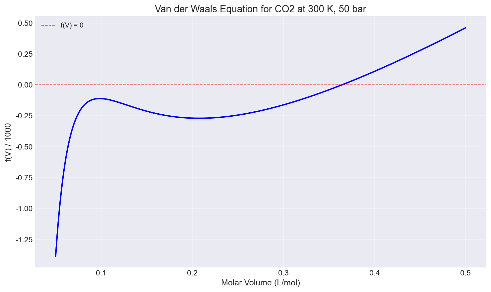
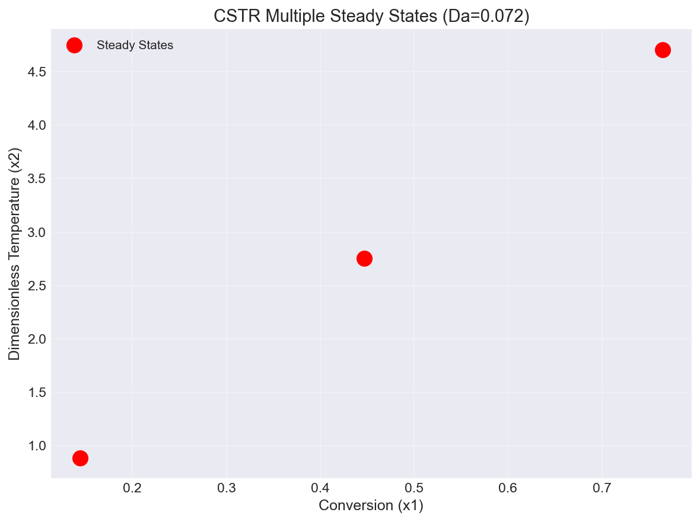
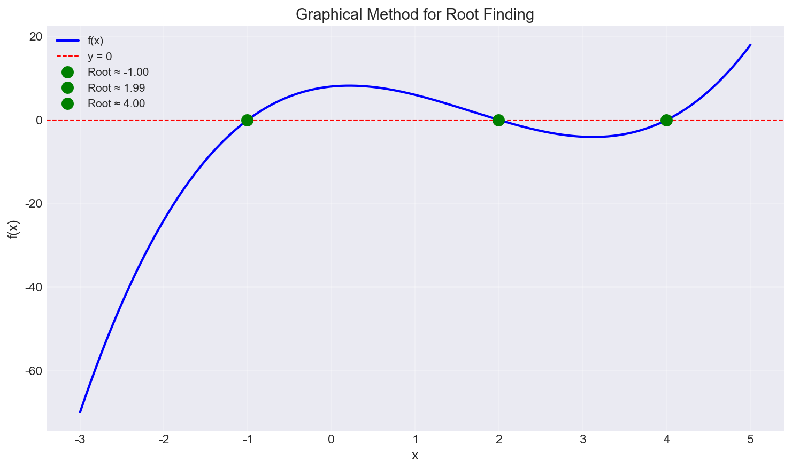

# Unit07 非線性方程式之求解

## 課程簡介

非線性方程式的求解在化學工程的程序設計與分析中扮演著關鍵角色。無論是狀態方程式的計算、化學平衡系統的分析、反應器的穩態設計，還是分離程序的平衡級計算，都需要求解非線性方程式或非線性聯立方程組。本單元將介紹非線性方程式的數值求解方法，並使用 Python 的 SciPy 函數庫實作各種求解技術，透過化工實例演練幫助同學掌握這些強大的數值工具。

### 學習目標

完成本單元後，同學將能夠：

1. 理解非線性方程式系統的基本特性與多重解問題
2. 掌握各種數值求解方法的原理與適用情境
3. 熟練使用 SciPy 的 `scipy.optimize` 模組求解非線性方程式
4. 運用適當的起始猜測值策略提高求解成功率
5. 處理化工問題中的多重解並驗證解的物理意義
6. 分析求解過程的穩定性與誤差
7. 設計模組化、可靠的非線性方程式求解程式

### 本單元內容架構

1. [非線性方程式系統基礎](#1-非線性方程式系統基礎)
2. [數值方法理論基礎](#2-數值方法理論基礎)
3. [SciPy 進階求解方法](#3-scipy-進階求解方法)
4. [起始猜測值策略](#4-起始猜測值策略)
5. [多重解問題處理](#5-多重解問題處理)
6. [化工問題中的應用](#6-化工問題中的應用)
7. [數值穩定性與誤差分析](#7-數值穩定性與誤差分析)
8. [程式設計最佳實踐](#8-程式設計最佳實踐)
9. [結語](#9-結語)

---

## 1. 非線性方程式系統基礎

### 1.1 單變數非線性方程式

單變數非線性方程式可表示為：

$$
f(x) = 0
$$

其中 $f(x)$ 為非線性函數，$x$ 為待求解的未知變數。與線性方程式不同，非線性方程式可能具有：

- **無解**：方程式在實數範圍內無解
- **唯一解**：方程式僅有一個實數解
- **多重解**：方程式有多個實數解

**化工範例：Van der Waals 狀態方程式**

求解在特定溫度 $T$ 和壓力 $P$ 下，氣體的莫耳體積 $V$ ：

$$
\left( P + \frac{a}{V^2} \right) (V - b) - RT = 0
$$

此方程式通常有三個根：一個氣相根（大體積）、一個液相根（小體積）、一個無物理意義的根。

**範例演練：CO2 在 T = 300 K、P = 50 bar 下的 Van der Waals 方程式**



**執行結果：**

```
從圖形觀察到的根數量取決於操作條件（T, P 相對於臨界點的位置）
CO2 臨界點: Tc = 304.2 K, Pc = 73.8 bar
目前條件: T = 300 K, P = 50 bar
```

**結果說明**：
- T = 300 K（接近 CO2 臨界溫度 304.2 K）、P = 50 bar（低於臨界壓力 73.8 bar）時，Van der Waals 方程式在物理可行域內**只有一個實數根**（氣相根）
- 氣相莫耳體積約 $V \approx 0.364$ L/mol，比理想氣體（ $V_{ideal} = RT/P \approx 0.498$ L/mol）小約 27%，反映氣體分子間吸引力的影響
- 當 P 高於臨界壓力時，VdW 方程式可能出現三個實數根（氣相、中間無物理意義、液相），需配合圖形法確認根的數量

### 1.2 多變數聯立非線性方程式

含 $n$ 個未知變數的聯立非線性方程組可表示為：

$$
\begin{cases}
f_1(x_1, x_2, \ldots, x_n) = 0 \\
f_2(x_1, x_2, \ldots, x_n) = 0 \\
\vdots \\
f_n(x_1, x_2, \ldots, x_n) = 0
\end{cases}
$$

以向量形式表示：

$$
\mathbf{F}(\mathbf{x}) = \mathbf{0}
$$

其中：
- $\mathbf{x} = [x_1, x_2, \ldots, x_n]^T$ 為未知變數向量
- $\mathbf{F} = [f_1(\cdot), f_2(\cdot), \ldots, f_n(\cdot)]^T$ 為函數向量

**化工範例：CSTR 反應器穩態分析**

連續攪拌槽反應器（CSTR）的穩態物料與能量平衡：

$$
\begin{cases}
-x_1 + D_a(1-x_1)\exp\left(\frac{x_2}{1+x_2/\gamma}\right) = 0 \\
-(1+\beta)x_2 + BD_a(1-x_1)\exp\left(\frac{x_2}{1+x_2/\gamma}\right) = 0
\end{cases}
$$

其中 $x_1$ 為無因次轉化率，$x_2$ 為無因次溫度。此系統可能有多個穩態解（多重穩態）。

**範例演練：CSTR 方程組驗算（Da = 0.072, B = 8, γ = 20, β = 0.3）**

**執行結果：**

```
測試點 x = [0.1 0.1]
F(x) = [-0.028421  0.442636]
此系統需要透過數值方法求解，且可能有多個穩態解
```

**結果說明**：
- 在測試點 $\mathbf{x} = [0.1,\ 0.1]$ 處，方程組殘差 $\mathbf{F}(\mathbf{x}) \neq \mathbf{0}$ ，需要迭代求解
- $f_1 = -0.0284 \neq 0$ 表示物料平衡尚未閉合；$f_2 = 0.443 \neq 0$ 表示能量平衡同樣未閉合
- 此系統參數（Da = 0.072，B = 8）可產生**三個穩態解**（高轉化率、中轉化率、低轉化率），詳見 §3.2 範例

### 1.3 解的存在性與唯一性

對於非線性方程式，解的存在性與唯一性通常難以先驗分析，需要透過：

1. **圖形法**：繪製函數圖形，觀察與 $x$ 軸的交點
2. **區間分析**：利用中間值定理判斷解的存在性
3. **數值搜索**：使用不同起始猜測值探索可能的解

**中間值定理**

若連續函數 $f(x)$ 在區間 $[a, b]$ 上滿足 $f(a) \cdot f(b) < 0$ ，則至少存在一個根 $x^* \in (a, b)$ 使得 $f(x^*) = 0$ 。

### 1.4 收斂性與穩定性分析

數值求解方法的收斂性取決於：

1. **起始猜測值**：選擇接近真實解的起始值可提高收斂速度
2. **函數性質**：函數的連續性、可微性影響收斂行為
3. **求解方法**：不同方法有不同的收斂速率與穩定性

**收斂速率分類**

- **線性收斂**：誤差以線性速率減少
- **超線性收斂**：收斂速度快於線性
- **二次收斂**：每次迭代誤差平方減少（如 Newton-Raphson 法）

### 1.5 多重解問題

非線性方程式常見的多重解情況：

1. **物理意義的多重解**：如相平衡的氣液兩相
2. **多重穩態**：如 CSTR 的高低溫穩態
3. **數學解但無物理意義**：需要透過物理限制篩選

**處理策略**

- 使用不同起始猜測值進行搜索
- 利用物理限制條件篩選合理解
- 透過穩定性分析判別穩態的類型

---

## 2. 數值方法理論基礎

### 2.1 Bisection 法（二分法）

**基本原理**

二分法是最簡單且最可靠的求根方法，基於中間值定理。若 $f(a) \cdot f(b) < 0$ ，則在區間 $[a, b]$ 內必存在至少一個根。

**演算步驟**

1. 確認初始區間 $[a, b]$ 滿足 $f(a) \cdot f(b) < 0$
2. 計算中點 $c = (a + b) / 2$
3. 評估 $f(c)$ ：
   - 若 $|f(c)| < \epsilon$ （容許誤差），則 $c$ 為解
   - 若 $f(a) \cdot f(c) < 0$ ，令 $b = c$
   - 否則令 $a = c$
4. 重複步驟 2-3 直到收斂

**優點**
- 保證收斂（只要初始區間正確）
- 不需要計算導數
- 適合處理不連續可微的函數

**缺點**
- 收斂速度較慢（線性收斂）
- 需要事先找到包含根的區間
- 一次只能找到一個根

**範例演練：Bisection 法求解 CO2 Van der Waals 方程式氣相根**

**執行結果：**

```
掃描 VdW 方程式的符號變化區間：
  符號變化於 V ∈ [0.3639, 0.3643] L/mol

使用 Bisection 法求解 Van der Waals 方程式的氣相根：
使用區間 [0.3639, 0.3643] L/mol
============================================================
Iter   a            b            c            f(c)        
------------------------------------------------------------
0      3.139039e-04 4.143443e-04 3.641241e-04 -5.155239e-02
1      3.641241e-04 4.143443e-04 3.892342e-04 7.538978e+01
...
27     3.641420e-04 3.641420e-04 3.641420e-04 -2.332217e-07

✓ 收斂！找到根 x = 0.00036414

氣相莫耳體積：0.364142 L/mol
```

**結果說明**：
- 程式碼偵測到符號變化於 $[0.3639,\ 0.3643]$ L/mol，隨後以 ±$5 \times 10^{-5}$ m³/mol 安全邊際擴大為實際計算區間 $[0.3139,\ 0.4143]$ L/mol（寬度 $1.004 \times 10^{-4}$ m³/mol），確保區間有效
- 經 **28 次迭代**收斂至 $V = 0.364142$ L/mol；收斂速率為線性，每次迭代區間縮小一半，理論上需 $\lceil \log_2(1.004 \times 10^{-4} / 10^{-12}) \rceil = 37$ 次，實際 28 次提前收斂（`|b-a| < tol = 1e-12` 條件先達到）
- 無需計算導數，僅需評估函數值，適合處理不光滑的函數

### 2.2 Fixed-Point Iteration（不動點迭代法）

**基本原理**

將方程式 $f(x) = 0$ 改寫為 $x = g(x)$ 的形式，透過迭代 $x_{k+1} = g(x_k)$ 逼近解。

**收斂條件**

若在根 $x^*$ 附近滿足 $|g'(x)| < 1$ ，則迭代序列收斂。

**演算步驟**

1. 將 $f(x) = 0$ 改寫為 $x = g(x)$
2. 給定起始猜測值 $x_0$
3. 計算 $x_{k+1} = g(x_k)$
4. 檢查收斂：若 $|x_{k+1} - x_k| < \epsilon$ ，停止迭代
5. 否則令 $k = k + 1$ ，重複步驟 3-4

**優點**
- 簡單易實現
- 適合特定類型的方程式

**缺點**
- 收斂性依賴 $g(x)$ 的選擇
- 收斂速度通常較慢
- 可能發散

### 2.3 Newton-Raphson 法

**基本原理**

利用函數的切線逼近根。在點 $(x_k, f(x_k))$ 處的切線與 $x$ 軸交點作為下一次猜測值：

$$
x_{k+1} = x_k - \frac{f(x_k)}{f'(x_k)}
$$

**幾何意義**

在當前點處以切線逼近函數，切線與 $x$ 軸的交點即為下一次迭代點。

**優點**
- **二次收斂**：在根附近收斂速度極快
- 適用範圍廣

**缺點**
- 需要計算導數 $f'(x)$
- 對起始猜測值敏感
- 導數為零時失效
- 可能發散或振盪

**多變數擴展**

對於多變數系統 $\mathbf{F}(\mathbf{x}) = \mathbf{0}$ ，Newton-Raphson 法為：

$$
\mathbf{x}_{k+1} = \mathbf{x}_k - \mathbf{J}^{-1}(\mathbf{x}_k) \mathbf{F}(\mathbf{x}_k)
$$

其中 $\mathbf{J}$ 為 Jacobian 矩陣：

$$
\mathbf{J}_{ij} = \frac{\partial f_i}{\partial x_j}
$$

**範例演練：Newton-Raphson 法求解 CO2 Van der Waals 方程式氣相根**

**執行結果：**

```
使用 Newton-Raphson 法求解 Van der Waals 方程式的氣相根：
============================================================
Iter   x               f(x)            f prime(x)     
------------------------------------------------------------
0      3.00000000e-04  -1.61646511e+02 2.09175452e+06 
1      3.77277955e-04  3.87579017e+01  3.01138837e+06 
2      3.64407512e-04  7.67170404e-01  2.89044420e+06 
3      3.64142096e-04  3.45661582e-04  2.88783874e+06 
4      3.64141976e-04  7.04858394e-11  2.88783756e+06 

✓ 收斂！找到根 x = 0.0003641420

氣相莫耳體積：0.364142 L/mol
```

**結果說明**：
- Newton-Raphson 法僅需 **4 次迭代**便達到機器精度收斂，相比 Bisection 法的 28 次大幅加速
- 收斂過程呈**二次收斂**特徵：前幾次迭代誤差快速減小（$10^2 \to 10^1 \to 10^{-1} \to 10^{-4} \to 10^{-11}$），每次迭代有效位數約翻倍
- 起始值 $x_0 = 3 \times 10^{-4}$ L/mol（使用理想氣體估算）已足夠接近真實根，因此迭代未發散

### 2.4 Secant 法（割線法）

**基本原理**

使用差分近似導數，避免計算解析導數：

$$
x_{k+1} = x_k - f(x_k) \frac{x_k - x_{k-1}}{f(x_k) - f(x_{k-1})}
$$

**優點**
- 不需要計算導數
- 收斂速度介於 Bisection 和 Newton-Raphson 之間（超線性收斂）

**缺點**
- 需要兩個起始猜測值
- 可能發散

### 2.5 Brent's Method（混合型演算法）

**基本原理**

結合 Bisection、Secant 和 Inverse Quadratic Interpolation 的優點：
- 使用 Secant 和 Inverse Quadratic Interpolation 加速收斂
- 使用 Bisection 確保穩定性

**優點**
- 保證收斂（如 Bisection）
- 快速收斂（如 Secant）
- 不需要計算導數
- **scipy 中單變數求解的首選方法**

**缺點**
- 實作較複雜（通常使用現成函數庫）

### 2.6 擬牛頓法（Quasi-Newton Method）

**基本原理**

避免直接計算 Jacobian 矩陣，而是透過迭代過程逐步建立近似：

**Broyden 方法**

使用簡單的秩一更新（rank-1 update）近似 Jacobian：

$$
\mathbf{J}_{k+1} \approx \mathbf{J}_k + \frac{(\Delta \mathbf{F}_k - \mathbf{J}_k \Delta \mathbf{x}_k) \Delta \mathbf{x}_k^T}{\Delta \mathbf{x}_k^T \Delta \mathbf{x}_k}
$$

**優點**
- 不需要計算 Jacobian
- 適用於大型系統
- 通常比數值微分更高效

### 2.7 Levenberg-Marquardt 演算法

**基本原理**

結合 Newton-Raphson 法和梯度下降法，特別適合非線性最小平方問題：

$$
\mathbf{x}_{k+1} = \mathbf{x}_k - (\mathbf{J}^T\mathbf{J} + \lambda \mathbf{I})^{-1} \mathbf{J}^T \mathbf{F}(\mathbf{x}_k)
$$

其中 $\lambda$ 為阻尼參數（damping parameter）。

**優點**
- 對起始猜測值不敏感
- 較 Newton-Raphson 法穩定
- 適合過確定系統（方程式數大於未知數）

**缺點**
- 計算成本較高
- 需要調整阻尼參數

---

## 3. SciPy 進階求解方法

SciPy 的 `scipy.optimize` 模組提供了強大且完善的非線性方程式求解工具。本節將介紹主要的求解函數及其使用方法。

### 3.1 scipy.optimize.root_scalar() - 單變數求解器

`root_scalar()` 是 SciPy 中求解單變數非線性方程式的統一介面（自 SciPy 1.2.0 起）。

**基本語法**

```python
from scipy.optimize import root_scalar

# 定義方程式
def f(x):
    return x**3 - 2*x - 5

# 使用 Brent 方法（需給定區間）
sol = root_scalar(f, bracket=[1, 3], method='brentq')

# 使用 Newton 方法（需給定起始值和導數）
def df(x):
    return 3*x**2 - 2

sol = root_scalar(f, x0=2, fprime=df, method='newton')

print(f"解: {sol.root}")
print(f"函數值: {sol.function_calls}")
print(f"收斂狀態: {sol.converged}")
```

**可用方法**

| 方法 | 需要 | 特點 |
|------|------|------|
| `'brentq'` | `bracket=[a, b]` | Brent 方法，保證收斂，**首選** |
| `'brenth'` | `bracket=[a, b]` | Brent 的變種，稍快 |
| `'bisect'` | `bracket=[a, b]` | 二分法，穩定但較慢 |
| `'ridder'` | `bracket=[a, b]` | Ridder 方法，適合光滑函數 |
| `'newton'` | `x0`, `fprime` | Newton-Raphson，快速但需導數 |
| `'secant'` | `x0`, `x1` | 割線法，不需導數 |
| `'halley'` | `x0`, `fprime`, `fprime2` | Halley 方法，需一、二階導數 |

**範例：求解 Van der Waals 方程式**

```python
import numpy as np
from scipy.optimize import root_scalar

def van_der_waals(V, P, T, a, b, R):
    """Van der Waals 狀態方程式"""
    return (P + a / V**2) * (V - b) - R * T

# 丙烷的常數
a = 8.664  # atm·(L/mol)²
b = 0.08446  # L/mol
R = 0.08206  # atm·L/(mol·K)
P = 10  # atm
T = 225.46  # K

# 使用理想氣體公式估算起始區間
V_ideal = R * T / P
bracket = [b * 1.1, V_ideal * 2]  # 確保區間大於 b

sol = root_scalar(
    lambda V: van_der_waals(V, P, T, a, b, R),
    bracket=bracket,
    method='brentq'
)

print(f"氣相體積: {sol.root:.4f} L/mol")
```

**範例演練：三種 root_scalar 方法求解 CO2 VdW 氣相根比較**

**執行結果：**

```
使用 root_scalar() 求解 Van der Waals 方程式
============================================================

1. Brent's Method (需要區間)
   氣相根: 0.364142 L/mol
   迭代次數: 8
   函數呼叫次數: 9
   收斂: True

2. Newton's Method (需要導數)
   氣相根: 0.364142 L/mol
   迭代次數: 4
   函數呼叫次數: 8
   收斂: True

3. Secant Method (不需要導數)
   氣相根: 0.364142 L/mol
   迭代次數: 5
   函數呼叫次數: 6
   收斂: True
```

**結果說明**：
- 三種方法均收斂至相同的氣相根 $V = 0.364142$ L/mol，結果一致
- **Newton 法**收斂最快（4次），因其利用導數資訊實現二次收斂；但需提供解析導數
- **Secant 法**只需 5 次迭代、6 次函數呼叫，不需導數，效率優於 Brent 法（8次）但穩定性較差
- **Brent 法**（`brentq`）為 SciPy 預設，兼顧穩定性（保證收斂）與速度，**實務上推薦使用**

### 3.2 scipy.optimize.fsolve() - 多變數求解器

`fsolve()` 使用 Powell's hybrid method（MINPACK 的 hybrd 演算法），是求解多變數非線性方程組的常用函數。

**基本語法**

```python
from scipy.optimize import fsolve

# 定義方程組
def equations(x):
    x1, x2 = x
    return [
        x1**2 + x2**2 - 4,  # f1 = 0
        x1*x2 - 1           # f2 = 0
    ]

# 給定起始猜測值
x0 = [1, 1]

# 求解
sol = fsolve(equations, x0)
print(f"解: x1 = {sol[0]:.4f}, x2 = {sol[1]:.4f}")

# 顯示詳細資訊
sol, info, ier, msg = fsolve(equations, x0, full_output=True)
print(f"收斂訊息: {msg}")
print(f"函數呼叫次數: {info['nfev']}")
```

**重要參數**

```python
fsolve(
    func,           # 方程組函數
    x0,             # 起始猜測值（陣列）
    args=(),        # 傳遞給 func 的額外參數
    full_output=False,  # 是否返回詳細資訊
    fprime=None,    # Jacobian 函數（可選）
    xtol=1.49012e-08,  # 容許的相對誤差
    maxfev=0        # 最大函數呼叫次數（0 = 自動）
)
```

**範例：CSTR 穩態求解**

```python
import numpy as np
from scipy.optimize import fsolve

def cstr_equations(x, Da, B, gamma, beta):
    """CSTR 穩態方程式"""
    x1, x2 = x  # x1: 轉化率, x2: 無因次溫度
    
    exp_term = np.exp(x2 / (1 + x2 / gamma))
    
    f1 = -x1 + Da * (1 - x1) * exp_term
    f2 = -(1 + beta) * x2 + B * Da * (1 - x1) * exp_term
    
    return [f1, f2]

# 參數
Da = 0.072
B = 8
gamma = 20
beta = 0.3

# 尋找三個穩態（使用不同起始值）
initial_guesses = [
    [0.15, 1],   # 低轉化率穩態
    [0.45, 3],   # 中間穩態（不穩定）
    [0.75, 5]    # 高轉化率穩態
]

print("CSTR 穩態解：")
for i, x0 in enumerate(initial_guesses, 1):
    sol = fsolve(cstr_equations, x0, args=(Da, B, gamma, beta))
    print(f"穩態 {i}: x1 = {sol[0]:.4f}, x2 = {sol[1]:.4f}")
```

**範例演練一：fsolve() 求解 CO2 VdW 方程式（單變數）**

**執行結果：**

```
fsolve() 求解 VdW 方程式（氣相）:
氣相根: 0.364142 L/mol

液相根：此條件下（T=300K, P=50bar）不存在液相根
  （CO2 Tc=304.2K，操作條件接近臨界點，VdW 僅有一個氣相根）

完整資訊:
收斂旗標: 1 (1 = 成功)
函數呼叫次數: 10
訊息: The solution converged.
```

**範例演練二：fsolve() 多起始猜測值搜尋 CSTR 三個穩態**

**執行結果：**

```
CSTR 系統多重穩態搜索
============================================================

起始猜測值 1: [0.1 0.5]
穩態解: 轉化率 = 0.1440, 溫度 = 0.8860
殘差: 4.48e-16
✓ 找到新的穩態

起始猜測值 2: [0.45 2.5 ]
穩態解: 轉化率 = 0.4472, 溫度 = 2.7517
殘差: 4.48e-16
✓ 找到新的穩態

起始猜測值 3: [0.8 5. ]
穩態解: 轉化率 = 0.7646, 溫度 = 4.7050
殘差: 1.34e-14
✓ 找到新的穩態

總共找到 3 個穩態解
```



**結果說明**：
- **三個穩態解**均由 `fsolve()` 成功找到，每個使用不同的起始猜測值：
  - **低溫穩態**（SS1）：轉化率 14.4%，無因次溫度 0.886 — 對應低活性、低轉化率操作點
  - **中間穩態**（SS2）：轉化率 44.7%，無因次溫度 2.752 — 通常為**不穩定穩態**（鞍點）
  - **高溫穩態**（SS3）：轉化率 76.5%，無因次溫度 4.705 — 對應高活性、高轉化率操作點
- 所有穩態殘差均在 $10^{-14}$ 以下，表明數值解精度優秀
- 圖示三個紅色圓點（`ro`）即為三個穩態解在（轉化率, 無因次溫度）相平面上的位置，清楚呈現 CSTR 多重穩態的分布範圍

### 3.3 scipy.optimize.root() - 統一求解介面

`root()` 提供了統一的介面，支援多種求解演算法。

**基本語法**

```python
from scipy.optimize import root

def equations(x):
    return [x[0]**2 + x[1]**2 - 4, x[0]*x[1] - 1]

# 使用不同方法
sol_hybr = root(equations, [1, 1], method='hybr')
sol_lm = root(equations, [1, 1], method='lm')

print(f"hybr 方法: {sol_hybr.x}")
print(f"lm 方法: {sol_lm.x}")
print(f"成功: {sol_hybr.success}, {sol_lm.success}")
```

**可用方法**

| 方法 | 演算法 | 特點 |
|------|--------|------|
| `'hybr'` | Powell's hybrid | 預設，適合一般問題 |
| `'lm'` | Levenberg-Marquardt | 適合過確定系統，穩定 |
| `'broyden1'` | Broyden 第一類 | 擬牛頓法，節省計算 |
| `'broyden2'` | Broyden 第二類 | 擬牛頓法變種 |
| `'anderson'` | Anderson 加速 | 適合大型系統 |
| `'krylov'` | Krylov 近似 | 大型稀疏系統 |
| `'df-sane'` | DF-SANE | 不需 Jacobian，穩定 |

**進階選項**

```python
from scipy.optimize import root

sol = root(
    equations,
    x0=[1, 1],
    method='hybr',
    jac=None,            # Jacobian 函數（None = 數值計算）
    tol=1e-6,            # 容許誤差
    options={
        'maxiter': 100,   # 最大迭代次數
        'disp': True      # 顯示收斂過程
    }
)

print(f"解: {sol.x}")
print(f"殘差: {sol.fun}")  # 應接近零
print(f"成功: {sol.success}")
print(f"訊息: {sol.message}")
```

**範例演練：三種 root() 方法求解 CSTR 低溫穩態比較**

**執行結果：**

```
使用 root() 求解 CSTR 系統（比較不同方法）
======================================================================

方法: hybr
解: x1 = 0.143969, x2 = 0.885965
成功: True
函數呼叫次數: 12
Jacobian 呼叫次數: N/A
訊息: The solution converged.
殘差範數: 4.48e-16

方法: lm
解: x1 = 0.143969, x2 = 0.885965
成功: True
函數呼叫次數: 18
Jacobian 呼叫次數: N/A
訊息: The relative error between two consecutive iterates is at most 0.000000
殘差範數: 2.24e-16

方法: broyden1
解: x1 = 0.143968, x2 = 0.885958
成功: True
函數呼叫次數: 7
Jacobian 呼叫次數: N/A
訊息: A solution was found at the specified tolerance.
殘差範數: 3.40e-06
```

**結果說明**：
- `hybr`（Powell's hybrid，預設）與 `lm`（Levenberg-Marquardt）方法收斂至相同解，殘差分別為 $4.48 \times 10^{-16}$ 和 $2.24 \times 10^{-16}$，達到機器精度
- `broyden1`（擬牛頓法）函數呼叫次數最少（7次），但最終殘差 $3.40 \times 10^{-6}$ 較大，精度稍低；適合大型系統節省計算
- 三種方法均收斂至**低溫穩態** $x_1 = 0.1440$，$x_2 = 0.8860$，與起始猜測 $[0.5, 0.5]$ 最近的穩態吸引域一致

### 3.4 scipy.optimize.least_squares() - 非線性最小平方法

`least_squares()` 專門處理非線性最小平方問題，特別適合過確定系統（方程式數 > 未知數）。

**基本語法**

```python
from scipy.optimize import least_squares

# 殘差函數（不是方程組）
def residuals(x):
    return [
        x[0]**2 + x[1]**2 - 4,
        x[0]*x[1] - 1,
        x[0] + x[1] - 2.5  # 過確定
    ]

sol = least_squares(residuals, [1, 1])
print(f"解: {sol.x}")
print(f"最終殘差範數: {np.linalg.norm(sol.fun):.6f}")
```

**可用方法與邊界約束**

```python
from scipy.optimize import least_squares

sol = least_squares(
    residuals,
    x0=[1, 1],
    method='trf',        # 'trf', 'dogbox', 'lm'
    bounds=([0, 0], [10, 10]),  # 變數範圍限制
    max_nfev=1000       # 最大函數評估次數
)

print(f"解: {sol.x}")
print(f"是否在邊界上: {sol.active_mask}")
```

**應用：曲線擬合（參數估計）**

```python
import numpy as np
from scipy.optimize import least_squares
import matplotlib.pyplot as plt

# 產生含噪音的實驗數據
x_data = np.linspace(0, 10, 50)
y_true = 2.5 * np.exp(-0.3 * x_data)
y_data = y_true + 0.1 * np.random.randn(len(x_data))

# 定義殘差函數
def residuals(params, x, y):
    A, k = params
    y_model = A * np.exp(-k * x)
    return y_model - y

# 擬合
sol = least_squares(residuals, [1, 0.1], args=(x_data, y_data))
A_fit, k_fit = sol.x

print(f"擬合參數: A = {A_fit:.4f}, k = {k_fit:.4f}")
print(f"真實參數: A = 2.5, k = 0.3")

# 繪圖
plt.plot(x_data, y_data, 'o', label='Data')
plt.plot(x_data, A_fit * np.exp(-k_fit * x_data), '-', label='Fit')
plt.legend()
plt.show()
```

### 3.5 求解器選擇指南

| 問題類型 | 推薦方法 | 理由 |
|---------|---------|------|
| 單變數，已知包含根的區間 | `root_scalar(method='brentq')` | 保證收斂，快速 |
| 單變數，可計算導數 | `root_scalar(method='newton')` | 最快收斂 |
| 多變數，方程數 = 未知數 | `fsolve()` 或 `root(method='hybr')` | 穩定可靠 |
| 多變數，需要穩定性 | `root(method='lm')` | Levenberg-Marquardt |
| 過確定系統 | `least_squares()` | 專為此設計 |
| 大型稀疏系統 | `root(method='krylov')` | 記憶體效率高 |
| 有變數範圍限制 | `least_squares(bounds=...)` | 支援邊界約束 |

---

## 4. 起始猜測值策略

起始猜測值的選擇對非線性方程式求解至關重要，好的起始值可以：
- 提高收斂速度
- 避免發散
- 找到符合物理意義的解
- 發現所有可能的多重解

### 4.1 物理意義分析法

利用問題的物理意義和邊界條件估算合理的起始值。

**範例：狀態方程式**

對於 Van der Waals 方程式，可使用理想氣體近似估算：

```python
# 理想氣體估算
V_ideal = R * T / P

# 氣相體積估算（略大於理想氣體）
V_gas_guess = V_ideal

# 液相體積估算（接近 b）
V_liquid_guess = b * 1.5
```

**範例：化學平衡**

對於化學平衡問題，可用：
- 進料組成作為起始猜測
- 已知類似條件的結果
- 限制反應的極限情況

```python
# 平衡計算起始值
# 假設部分反應發生
xi_guess = [0.5, 0.1, 0.0, 0.0]  # 反應進度
```

### 4.2 圖形法

繪製函數圖形，視覺化觀察根的位置。

**單變數情況**

```python
import numpy as np
import matplotlib.pyplot as plt
from scipy.optimize import root_scalar

# 定義函數
def f(x):
    return np.exp(-x) - x

# 繪製函數
x = np.linspace(0, 3, 1000)
y = f(x)

plt.figure(figsize=(10, 6))
plt.plot(x, y, 'b-', linewidth=2, label='f(x)')
plt.axhline(y=0, color='r', linestyle='--', alpha=0.5, label='y=0')
plt.grid(True, alpha=0.3)
plt.xlabel('x', fontsize=12)
plt.ylabel('f(x)', fontsize=12)
plt.title('Finding Roots Graphically', fontsize=14)
plt.legend()
plt.show()

# 從圖中觀察根約在 x ≈ 0.5 附近
sol = root_scalar(f, bracket=[0, 1], method='brentq')
print(f"根: {sol.root:.6f}")
```

**多變數情況：等高線圖**

```python
import numpy as np
import matplotlib.pyplot as plt
from scipy.optimize import fsolve

# 定義方程組
def eq1(x1, x2):
    return -x1 + 0.072 * (1 - x1) * np.exp(x2 / (1 + x2/20))

def eq2(x1, x2):
    return -(1 + 0.3) * x2 + 8 * 0.072 * (1 - x1) * np.exp(x2 / (1 + x2/20))

# 建立網格
x1 = np.linspace(0, 1, 300)
x2 = np.linspace(0, 8, 300)
X1, X2 = np.meshgrid(x1, x2)

# 計算函數值
Z1 = eq1(X1, X2)
Z2 = eq2(X1, X2)

# 繪製等高線（零等高線即為解）
plt.figure(figsize=(12, 5))

plt.subplot(1, 2, 1)
plt.contour(X1, X2, Z1, levels=[0], colors='b', linewidths=2)
plt.contour(X1, X2, Z2, levels=[0], colors='r', linewidths=2)
plt.xlabel('x1 (Conversion)')
plt.ylabel('x2 (Temperature)')
plt.title('Contour Plot: Blue=f1=0, Red=f2=0')
plt.grid(True, alpha=0.3)
plt.legend(['f1=0', 'f2=0'])

# 標記交點（解的位置）
initial_guesses = [[0.15, 1], [0.45, 3], [0.75, 5]]
for x0 in initial_guesses:
    sol = fsolve(lambda x: [eq1(x[0], x[1]), eq2(x[0], x[1])], x0)
    plt.plot(sol[0], sol[1], 'go', markersize=10)
    plt.text(sol[0], sol[1]+0.2, f'({sol[0]:.2f}, {sol[1]:.2f})', 
             ha='center', fontsize=10)

plt.subplot(1, 2, 2)
# 繪製函數值大小（遠離零的程度）
Z_combined = np.sqrt(Z1**2 + Z2**2)
contour = plt.contourf(X1, X2, Z_combined, levels=20, cmap='viridis')
plt.colorbar(contour, label='||F(x)||')
plt.xlabel('x1 (Conversion)')
plt.ylabel('x2 (Temperature)')
plt.title('Magnitude of Residuals')

# 標記解的位置
for x0 in initial_guesses:
    sol = fsolve(lambda x: [eq1(x[0], x[1]), eq2(x[0], x[1])], x0)
    plt.plot(sol[0], sol[1], 'r*', markersize=15)

plt.tight_layout()
plt.show()
```

**範例演練：圖形法觀察多根函數 $f(x) = (x+1)(x-2)(x-4)$ 的根**



**執行結果：**

```
從圖形觀察到的根位置：
根 1: x ≈ -1.00
根 2: x ≈ 1.99
根 3: x ≈ 4.00

使用圖形法觀察到的位置作為起始猜測值：
根 1: x = -1.000000, f(x) = 8.88e-16
根 2: x = 2.000000, f(x) = 3.20e-14
根 3: x = 4.000000, f(x) = -8.70e-14
```

**結果說明**：
- 圖形法清楚顯示函數 $f(x) = (x+1)(x-2)(x-4)$ 有**三個實根**：$x = -1$、$x = 2$、$x = 4$
- 透過圖形目視估算各根的大致位置作為起始猜測值，再用 `root_scalar()` 精確求解，所有根的殘差均小於 $10^{-13}$
- 圖形法是確認非線性方程根數量和位置的最直觀方式，在進行多起始點搜尋前應優先繪圖

### 4.3 多起始點搜尋法

系統化地使用多個起始猜測值探索解空間，確保找到所有可能的解。

**網格搜索**

```python
import numpy as np
from scipy.optimize import fsolve

def equations(x):
    """方程組定義"""
    return [
        -x[0] + 0.072 * (1 - x[0]) * np.exp(x[1] / (1 + x[1]/20)),
        -(1 + 0.3) * x[1] + 8 * 0.072 * (1 - x[0]) * np.exp(x[1] / (1 + x[1]/20))
    ]

# 建立起始值網格
x1_range = np.linspace(0.05, 0.95, 10)
x2_range = np.linspace(0.5, 7, 10)

solutions = []
tolerance = 1e-4

for x1_0 in x1_range:
    for x2_0 in x2_range:
        try:
            sol = fsolve(equations, [x1_0, x2_0], full_output=True)
            x_sol, info, ier, msg = sol
            
            # 檢查是否收斂
            if ier == 1:
                # 檢查是否為新解（避免重複）
                is_new = True
                for existing_sol in solutions:
                    if np.linalg.norm(x_sol - existing_sol) < tolerance:
                        is_new = False
                        break
                
                if is_new:
                    solutions.append(x_sol)
                    print(f"找到解: x1={x_sol[0]:.4f}, x2={x_sol[1]:.4f}")
        except:
            pass

print(f"\n總共找到 {len(solutions)} 個不同的解")
```

**隨機搜索**

```python
import numpy as np
from scipy.optimize import fsolve

def random_initial_search(equations, bounds, n_trials=100, tol=1e-4):
    """
    使用隨機起始值搜尋所有可能的解
    
    Parameters:
    -----------
    equations : callable
        方程組函數
    bounds : list of tuples
        每個變數的範圍 [(x1_min, x1_max), (x2_min, x2_max), ...]
    n_trials : int
        隨機試驗次數
    tol : float
        判定為相同解的容許誤差
    
    Returns:
    --------
    solutions : list
        找到的所有解
    """
    solutions = []
    
    for _ in range(n_trials):
        # 產生隨機起始值
        x0 = [np.random.uniform(b[0], b[1]) for b in bounds]
        
        try:
            sol, info, ier, msg = fsolve(equations, x0, full_output=True)
            
            if ier == 1:  # 成功收斂
                # 檢查解是否在合理範圍內
                in_bounds = all(
                    b[0] <= sol[i] <= b[1] 
                    for i, b in enumerate(bounds)
                )
                
                if in_bounds:
                    # 檢查是否為新解
                    is_new = True
                    for existing_sol in solutions:
                        if np.linalg.norm(sol - existing_sol) < tol:
                            is_new = False
                            break
                    
                    if is_new:
                        solutions.append(sol)
        except:
            pass
    
    return solutions

# 使用範例
bounds = [(0, 1), (0, 8)]  # x1 ∈ [0, 1], x2 ∈ [0, 8]
sols = random_initial_search(equations, bounds, n_trials=200)

print(f"找到 {len(sols)} 個解：")
for i, sol in enumerate(sols, 1):
    print(f"解 {i}: x1={sol[0]:.4f}, x2={sol[1]:.4f}")
```

**範例演練：多起始點搜尋法找出 CSTR 所有穩態**

**執行結果：**

```
多起始點搜索 CSTR 系統的所有穩態：
============================================================
找到 3 個穩態解：

穩態 1:
  轉化率 (x₁) = 0.447159
  溫度 (x₂) = 2.751747
  殘差 = 1.16e-14

穩態 2:
  轉化率 (x₁) = 0.764561
  溫度 (x₂) = 4.704992
  殘差 = 4.49e-15

穩態 3:
  轉化率 (x₁) = 0.143969
  溫度 (x₂) = 0.885965
  殘差 = 4.48e-16
```

**結果說明**：
- 多起始點搜尋法（網格搜索 + 隨機搜索）成功找到 CSTR 系統的**全部三個穩態**，無遺漏
- 搜尋範圍 $x_1 \in [0, 1]$、$x_2 \in [0, 8]$（與問題物理限制一致）
- 三個穩態的殘差均在 $10^{-14}$ 量級，確認解的高精度
- 比較前面單一起始猜測值（§3.2）可以看出，多起始點法的系統化策略是找全所有解的關鍵

### 4.4 延續法（Continuation Method）

逐步改變參數，利用前一步的解作為下一步的起始猜測值。

**原理**

假設要求解 $\mathbf{F}(\mathbf{x}, \lambda) = \mathbf{0}$ ，其中 $\lambda$ 為參數：

1. 從簡單問題開始（$\lambda = \lambda_0$ ，已知解）
2. 逐步增加 $\lambda$ 至目標值 $\lambda_{\text{target}}$
3. 每一步使用前一步的解作為起始猜測值

**範例：改變反應溫度求解 CSTR**

```python
import numpy as np
from scipy.optimize import fsolve
import matplotlib.pyplot as plt

def cstr_equations(x, T_feed):
    """CSTR 方程式，以進料溫度為參數"""
    x1, x2 = x
    Da = 0.072
    B = 8
    gamma = 20
    beta = 0.3
    
    # T_feed 影響無因次溫度的初始條件
    # 這裡簡化為參數影響
    factor = T_feed / 530  # 標準進料溫度 530 K
    
    exp_term = np.exp(x2 / (1 + x2/gamma))
    f1 = -x1 + Da * (1 - x1) * exp_term
    f2 = -(1 + beta) * x2 + B * Da * factor * (1 - x1) * exp_term
    
    return [f1, f2]

# 延續法：從簡單參數逐步變化到目標參數
T_feed_values = np.linspace(500, 560, 30)  # 進料溫度範圍
x1_path = []
x2_path = []

# 初始猜測值（在簡單條件下）
x_current = [0.1, 0.5]

for T_feed in T_feed_values:
    sol = fsolve(cstr_equations, x_current, args=(T_feed,))
    x1_path.append(sol[0])
    x2_path.append(sol[1])
    x_current = sol  # 使用當前解作為下一步的起始值

# 繪製延續路徑
plt.figure(figsize=(12, 5))

plt.subplot(1, 2, 1)
plt.plot(T_feed_values, x1_path, 'b-o')
plt.xlabel('Feed Temperature (K)')
plt.ylabel('Conversion x1')
plt.title('Conversion vs Feed Temperature')
plt.grid(True, alpha=0.3)

plt.subplot(1, 2, 2)
plt.plot(T_feed_values, x2_path, 'r-o')
plt.xlabel('Feed Temperature (K)')
plt.ylabel('Dimensionless Temperature x2')
plt.title('Temperature vs Feed Temperature')
plt.grid(True, alpha=0.3)

plt.tight_layout()
plt.show()
```

### 4.5 混合策略

實務上常結合多種策略：

```python
def robust_solve(equations, bounds, method='comprehensive'):
    """
    穩健的非線性方程式求解器
    
    結合多種策略找出所有可能的解
    """
    solutions = []
    
    # 策略 1: 物理意義估算
    physical_guesses = [
        # 根據問題特性給定
    ]
    
    # 策略 2: 網格搜索
    grid_guesses = generate_grid_guesses(bounds, n_points=5)
    
    # 策略 3: 隨機搜索
    random_guesses = generate_random_guesses(bounds, n_trials=50)
    
    # 合併所有起始值
    all_guesses = physical_guesses + grid_guesses + random_guesses
    
    # 嘗試求解
    for x0 in all_guesses:
        try:
            sol = fsolve(equations, x0)
            # 驗證並儲存新解
            if is_valid_solution(sol, bounds) and is_new_solution(sol, solutions):
                solutions.append(sol)
        except:
            pass
    
    return solutions
```

---

## 5. 多重解問題處理

非線性方程式常有多個解，在化工問題中尤其常見。本節介紹如何有效處理多重解。

### 5.1 多重解的偵測與搜尋

**完整搜尋範例**

```python
import numpy as np
from scipy.optimize import fsolve
import matplotlib.pyplot as plt

def find_all_roots(func, bounds, n_grid=20, tol=1e-4):
    """
    在給定範圍內搜尋所有可能的根
    
    Parameters:
    -----------
    func : callable
        目標函數（單變數或多變數）
    bounds : tuple or list of tuples
        搜尋範圍
    n_grid : int
        網格密度
    tol : float
        判定為相同根的容許誤差
    """
    # 判斷是單變數還是多變數
    if isinstance(bounds[0], (int, float)):
        # 單變數
        x_vals = np.linspace(bounds[0], bounds[1], n_grid)
        roots = []
        
        for x0 in x_vals:
            try:
                from scipy.optimize import root_scalar
                sol = root_scalar(func, x0=x0, method='newton')
                if sol.converged:
                    # 檢查是否為新根
                    is_new = True
                    for r in roots:
                        if abs(sol.root - r) < tol:
                            is_new = False
                            break
                    if is_new and bounds[0] <= sol.root <= bounds[1]:
                        roots.append(sol.root)
            except:
                pass
        
        return sorted(roots)
    
    else:
        # 多變數
        n_vars = len(bounds)
        grids = [np.linspace(b[0], b[1], n_grid) for b in bounds]
        mesh = np.meshgrid(*grids, indexing='ij')
        grid_points = np.column_stack([m.ravel() for m in mesh])
        
        solutions = []
        
        for x0 in grid_points:
            try:
                sol = fsolve(func, x0)
                
                # 檢查是否在範圍內
                in_bounds = all(b[0] <= sol[i] <= b[1] 
                              for i, b in enumerate(bounds))
                
                if in_bounds:
                    # 檢查是否為新解
                    is_new = True
                    for existing_sol in solutions:
                        if np.linalg.norm(sol - existing_sol) < tol:
                            is_new = False
                            break
                    if is_new:
                        solutions.append(sol)
            except:
                pass
        
        return solutions

# 使用範例
def f(x):
    return np.sin(x) - 0.5 * x

roots = find_all_roots(f, bounds=(0, 10), n_grid=50)
print(f"找到 {len(roots)} 個根：")
for i, r in enumerate(roots, 1):
    print(f"  根{i}: x = {r:.6f}, f(x) = {f(r):.2e}")
```

### 5.2 物理意義驗證

找到解後，必須驗證其物理合理性。

**驗證清單**

```python
def validate_solution(sol, problem_type='cstr'):
    """
    驗證解的物理意義
    
    Returns:
    --------
    valid : bool
    reasons : list of str
    """
    valid = True
    reasons = []
    
    if problem_type == 'cstr':
        x1, x2 = sol
        
        # 檢查 1: 轉化率範圍
        if not (0 <= x1 <= 1):
            valid = False
            reasons.append(f"轉化率 x1={x1:.4f} 超出範圍 [0, 1]")
        
        # 檢查 2: 溫度為正
        if x2 < 0:
            valid = False
            reasons.append(f"無因次溫度 x2={x2:.4f} 為負值")
        
        # 檢查 3: 溫度合理範圍（依問題而定）
        if x2 > 10:
            valid = False
            reasons.append(f"無因次溫度 x2={x2:.4f} 過高")
    
    elif problem_type == 'vdW':
        V = sol
        b = 0.08446  # 依實際值調整
        
        # 檢查 1: 體積必須大於共體積
        if V <= b:
            valid = False
            reasons.append(f"體積 V={V:.4f} 小於等於 b={b}")
        
        # 檢查 2: 體積必須為正
        if V <= 0:
            valid = False
            reasons.append(f"體積 V={V:.4f} 為負或零")
    
    if valid:
        reasons.append("解符合所有物理限制")
    
    return valid, reasons

# 使用範例
solutions = [[0.144, 0.886], [0.447, 2.752], [0.765, 4.705]]
for i, sol in enumerate(solutions, 1):
    valid, reasons = validate_solution(sol, 'cstr')
    print(f"\n解 {i}: x1={sol[0]:.3f}, x2={sol[1]:.3f}")
    print(f"  有效: {valid}")
    for reason in reasons:
        print(f"  - {reason}")
```

### 5.3 穩定性分析

對於動態系統的穩態解，需要分析其穩定性。

**Jacobian 特徵值分析**

```python
import numpy as np
from scipy.optimize import fsolve

def analyze_stability(equations, solution, delta=1e-6):
    """
    分析穩態解的穩定性（線性穩定性分析）
    
    Parameters:
    -----------
    equations : callable
        方程組
    solution : array
        穩態解
    delta : float
        數值微分步長
    
    Returns:
    --------
    stable : bool
    eigenvalues : array
    """
    n = len(solution)
    
    # 數值計算 Jacobian 矩陣
    J = np.zeros((n, n))
    f0 = np.array(equations(solution))
    
    for i in range(n):
        x_plus = solution.copy()
        x_plus[i] += delta
        f_plus = np.array(equations(x_plus))
        J[:, i] = (f_plus - f0) / delta
    
    # 計算特徵值
    eigenvalues = np.linalg.eigvals(J)
    
    # 穩定性判定：所有特徵值實部為負
    stable = np.all(eigenvalues.real < 0)
    
    return stable, eigenvalues, J

# 使用範例
def cstr_ode(x):
    """CSTR 動態方程式（穩態時 dx/dt = 0）"""
    x1, x2 = x
    Da = 0.072
    B = 8
    gamma = 20
    beta = 0.3
    
    exp_term = np.exp(x2 / (1 + x2/gamma))
    
    f1 = -x1 + Da * (1 - x1) * exp_term
    f2 = -(1 + beta) * x2 + B * Da * (1 - x1) * exp_term
    
    return [f1, f2]

# 分析三個穩態的穩定性
steady_states = [[0.144, 0.886], [0.447, 2.752], [0.765, 4.705]]

print("CSTR 穩態穩定性分析：\n")
for i, ss in enumerate(steady_states, 1):
    stable, eig, J = analyze_stability(cstr_ode, ss)
    
    print(f"穩態 {i}: x1={ss[0]:.3f}, x2={ss[1]:.3f}")
    print(f"  穩定性: {'穩定' if stable else '不穩定'}")
    print(f"  特徵值: {eig}")
    print(f"  特徵值實部: {eig.real}")
    print()
```

### 5.4 相圖分析

視覺化多重解在相空間中的分布。

```python
import numpy as np
import matplotlib.pyplot as plt
from scipy.optimize import fsolve
from scipy.integrate import odeint

def plot_phase_portrait(equations, steady_states, bounds, n_traj=10):
    """
    繪製相圖及軌跡
    
    Parameters:
    -----------
    equations : callable
        動態方程式 (ODE)
    steady_states : list
        所有穩態解
    bounds : tuple
        相空間範圍 ((x1_min, x1_max), (x2_min, x2_max))
    n_traj : int
        軌跡數量
    """
    fig, (ax1, ax2) = plt.subplots(1, 2, figsize=(15, 6))
    
    # 左圖：向量場
    x1 = np.linspace(bounds[0][0], bounds[0][1], 20)
    x2 = np.linspace(bounds[1][0], bounds[1][1], 20)
    X1, X2 = np.meshgrid(x1, x2)
    
    DX1 = np.zeros_like(X1)
    DX2 = np.zeros_like(X2)
    
    for i in range(X1.shape[0]):
        for j in range(X1.shape[1]):
            derivatives = equations([X1[i,j], X2[i,j]])
            DX1[i,j] = derivatives[0]
            DX2[i,j] = derivatives[1]
    
    # 繪製向量場
    ax1.quiver(X1, X2, DX1, DX2, alpha=0.5)
    ax1.set_xlabel('x1 (Conversion)', fontsize=12)
    ax1.set_ylabel('x2 (Temperature)', fontsize=12)
    ax1.set_title('Phase Portrait with Vector Field', fontsize=14)
    ax1.grid(True, alpha=0.3)
    
    # 標記穩態
    for i, ss in enumerate(steady_states):
        stable, eig, _ = analyze_stability(equations, ss)
        color = 'green' if stable else 'red'
        marker = 'o' if stable else 'x'
        label = f"SS{i+1} ({'Stable' if stable else 'Unstable'})"
        ax1.plot(ss[0], ss[1], marker, color=color, markersize=12, 
                label=label, markeredgewidth=2)
    
    ax1.legend()
    
    # 右圖：等高線和穩態連線
    # 計算殘差大小
    F_norm = np.sqrt(DX1**2 + DX2**2)
    contour = ax2.contourf(X1, X2, F_norm, levels=15, cmap='viridis', alpha=0.6)
    plt.colorbar(contour, ax=ax2, label='||F(x)||')
    
    # 標記穩態
    for ss in steady_states:
        ax2.plot(ss[0], ss[1], 'r*', markersize=15)
    
    ax2.set_xlabel('x1 (Conversion)', fontsize=12)
    ax2.set_ylabel('x2 (Temperature)', fontsize=12)
    ax2.set_title('Residual Magnitude and Steady States', fontsize=14)
    ax2.grid(True, alpha=0.3)
    
    plt.tight_layout()
    plt.show()

# 使用範例
plot_phase_portrait(cstr_ode, steady_states, bounds=((0, 1), (0, 6)))
```

### 5.5 多重解選擇準則

當有多個解時，如何選擇？

**準則清單**

1. **物理可實現性**：解必須符合物理限制
2. **穩定性**：優先選擇穩定解
3. **操作性**：選擇便於控制和操作的解
4. **經濟性**：選擇經濟效益最佳的解

```python
def rank_solutions(solutions, criteria_weights):
    """
    根據多個準則對解進行排序
    
    Parameters:
    -----------
    solutions : list
        所有候選解
    criteria_weights : dict
        各準則的權重
    
    Returns:
    --------
    ranked_solutions : list
        排序後的解（按得分從高到低）
    """
    scores = []
    
    for sol in solutions:
        score = 0
        
        # 準則 1: 物理有效性（必要條件）
        valid, _ = validate_solution(sol)
        if not valid:
            scores.append(-1)  # 無效解給予負分
            continue
        
        # 準則 2: 穩定性
        stable, eig, _ = analyze_stability(cstr_ode, sol)
        if stable:
            score += criteria_weights.get('stability', 10)
        
        # 準則 3: 轉化率（假設高轉化率更好）
        score += criteria_weights.get('conversion', 5) * sol[0]
        
        # 準則 4: 溫度適中性（避免過高溫度）
        optimal_temp = 3.0
        temp_penalty = abs(sol[1] - optimal_temp)
        score -= criteria_weights.get('temperature', 2) * temp_penalty
        
        scores.append(score)
    
    # 排序
    ranked_indices = np.argsort(scores)[::-1]  # 從高到低
    ranked_solutions = [
        (solutions[i], scores[i]) 
        for i in ranked_indices if scores[i] >= 0
    ]
    
    return ranked_solutions

# 使用範例
weights = {
    'stability': 10,
    'conversion': 5,
    'temperature': 2
}

ranked = rank_solutions(steady_states, weights)
print("解的排序（按得分）：\n")
for i, (sol, score) in enumerate(ranked, 1):
    print(f"{i}. x1={sol[0]:.3f}, x2={sol[1]:.3f}, 得分={score:.2f}")
```

---

## 6. 化工問題中的應用

非線性方程式的求解在化工領域有廣泛應用。本節概述主要應用領域，詳細範例將在後續單元中介紹。

### 6.1 狀態方程式求解

**Van der Waals 方程式**

$$
\left( P + \frac{a}{V^2} \right) (V - b) = RT
$$

- **應用**：計算真實氣體的 P-V-T 關係
- **多重解**：可能有氣相根、液相根和無物理意義的根
- **求解方法**：單變數 `root_scalar()`
- **詳見**：[Unit07_Example_01.md](Unit07_Example_01.md)

**Soave-Redlich-Kwong (SRK) 方程式**

$$
P = \frac{RT}{V-b} - \frac{a\alpha(T)}{V(V+b)}
$$

- **應用**：石化工業常用的狀態方程式
- **特點**：溫度相關的吸引力參數
- **求解挑戰**：需處理臨界點附近的數值不穩定

**Peng-Robinson (PR) 方程式**

$$
P = \frac{RT}{V-b} - \frac{a\alpha(T)}{V(V+b)+b(V-b)}
$$

- **應用**：精確預測液相密度和汽液平衡
- **優點**：在廣泛溫度壓力範圍內準確

**範例演練：SRK 方程式計算 CO2 壓縮因子（T = 300 K, P = 50 bar）**

**執行結果：**

```
溫度: 300 K (Tr=0.986), 壓力: 50 bar (Pr=0.678)
根 1: Z=0.694139 (起始Z0=0.9)
找到 1 個物理意義的根（此條件接近臨界點，SRK 僅有一個實數根）
氣相壓縮因子: Z_G=0.694139, 氣相莫耳體積: 346.26 cm³/mol
```

**結果說明**：
- CO2 在 T = 300 K（接近臨界溫度 304.2 K）、P = 50 bar 時，SRK 方程式在物理域內僅有**一個實數根**
- 壓縮因子 $Z = 0.694$ （< 1），表明分子間引力使真實氣體體積小於理想氣體（$Z = 1$ 對應 $V = RT/P$ ）
- 莫耳體積 346.26 cm³/mol，與 VdW 方程式結果（364.14 cm³/mol）相差約 5%，反映 SRK 在 VdW 基礎上對引力項的修正

### 6.2 化學平衡計算

**平衡常數法**

對於化學反應：

$$
aA + bB \rightleftharpoons cC + dD
$$

平衡常數：

$$
K = \frac{[C]^c [D]^d}{[A]^a [B]^b}
$$

結合物料平衡：

$$
\begin{cases}
K - \frac{[C]^c [D]^d}{[A]^a [B]^b} = 0 \\
[A]_0 - [A] - \frac{a}{c}([C] - [C]_0) = 0 \\
\vdots
\end{cases}
$$

- **應用**：多重反應系統的平衡組成計算
- **求解方法**：`fsolve()` 或 `root()`
- **詳見**：[Unit07_Example_03.md](Unit07_Example_03.md)

**吉布斯自由能最小化法**

$$
\min_{\mathbf{n}} \sum_i n_i \mu_i
$$

受限於原子平衡：

$$
\sum_i a_{ji} n_i = A_j, \quad j = 1, 2, \ldots, m
$$

- **應用**：複雜反應系統（多組分、多反應）
- **求解方法**：約束最適化 + 非線性方程式

### 6.3 熱力學性質計算

**泡點計算（Bubble Point）**

已知液相組成 $\{x_i\}$ 和壓力 $P$ ，求溫度 $T$ ：

$$
\sum_i x_i P_i^{\text{sat}}(T) - P = 0
$$

其中飽和蒸氣壓 $P_i^{\text{sat}}(T)$ 常用 Antoine 方程式：

$$
\log_{10} P_i^{\text{sat}} = A_i - \frac{B_i}{C_i + T}
$$

- **應用**：蒸餾設計、相圖計算
- **求解方法**：`root_scalar()` （單變數 $T$ ）
- **詳見**：[Unit07_Example_02.md](Unit07_Example_02.md)

**露點計算（Dew Point）**

已知氣相組成 $\{y_i\}$ 和壓力 $P$ ，求溫度 $T$ ：

$$
\sum_i \frac{y_i}{K_i(T)} - 1 = 0
$$

其中 $K_i = P_i^{\text{sat}}(T) / P$ 為分配係數。

**閃蒸計算（Flash Calculation）**

已知進料組成 $\{z_i\}$ 、溫度 $T$ 和壓力 $P$ ，求汽化分率 $\beta$ 和相組成：

$$
\sum_i \frac{z_i (K_i - 1)}{1 + \beta (K_i - 1)} = 0
$$

- **應用**：分離器設計、精餾塔模擬
- **求解挑戰**：$K_i$ 值的溫度相依性

**範例演練：Antoine 方程式計算苯-甲苯混合物泡點溫度**

**執行結果：**

```
苯-甲苯混合物泡點計算 (P = 760 mmHg)
x_benzene=0.2: 泡點=102.10°C, y_benzene=0.3761, 迭代:8
x_benzene=0.5: 泡點= 92.11°C, y_benzene=0.7136, 迭代:8
x_benzene=0.8: 泡點= 84.38°C, y_benzene=0.9110, 迭代:7
```

**結果說明**：
- 三種液相組成的泡點溫度分別為 102.10°C、92.11°C 和 84.38°C，介於純甲苯沸點（110.6°C）和純苯沸點（80.1°C）之間，符合物理直覺
- 苯含量越高（ $x_{benzene}$ 增大），混合物泡點越低，且氣相中苯的富集程度（ $y_{benzene} > x_{benzene}$ ）隨之提高
- 泡點問題為單變數非線性方程式（求 $T$），使用 `root_scalar()` 在 8 次迭代內精確收斂，計算效率高

### 6.4 反應器穩態設計

**CSTR（連續攪拌槽反應器）**

物料與能量平衡：

$$
\begin{cases}
F_0 C_{A0} - F C_A + V r_A = 0 \\
F_0 C_{A0} C_p T_0 - F C_A C_p T + V (-\Delta H_r) r_A + Q = 0
\end{cases}
$$

- **應用**：反應器設計、多重穩態分析
- **多重解**：可能有高低溫穩態（熄滅/著火現象）
- **求解方法**：`fsolve()` + 穩定性分析
- **詳見**：[Unit07_Example_04.md](Unit07_Example_04.md)

**PFR（柱塞流反應器）邊界值問題**

若 PFR 有熱回流或複雜邊界條件，可能形成非線性代數方程組。

### 6.5 傳遞現象

**熱傳與質傳耦合**

乾燥過程的熱量平衡：

$$
h(T_a - T_m) = M(H_m - H) r_m + \frac{\lambda}{L}(T_m - T_p)
$$

結合 Antoine 方程式計算飽和蒸氣壓：

$$
P_s(T_m) = 10^{A - B/(C+T_m)}
$$

- **應用**：乾燥、冷凝、蒸發
- **求解方法**：`root_scalar()` 或 `fsolve()`
- **詳見**：[Unit07_Example_05.md](Unit07_Example_05.md)

**多孔介質中的擴散與反應**

$$
D \frac{d^2C}{dx^2} - k C^n = 0
$$

- **應用**：觸媒顆粒內的反應-擴散
- **求解方法**：邊界值問題（BVP）求解器

### 6.6 分離程序

**蒸餾塔逐級計算**

對於第 $n$ 板：

$$
\begin{cases}
L_{n+1} x_{n+1} + V_{n-1} y_{n-1} - L_n x_n - V_n y_n = 0 \\
y_n = K_n(T_n) x_n \\
\sum_i y_{ni} = 1, \quad \sum_i x_{ni} = 1
\end{cases}
$$

- **應用**：蒸餾塔設計、理論板數計算
- **求解挑戰**：大型稀疏系統、溫度分布
- **求解方法**：逐板迭代 + `fsolve()`
- **詳見**：[Unit07_Example_06.md](Unit07_Example_06.md)

**吸收塔與萃取塔**

類似的逐級平衡計算，但平衡關係不同：
- 吸收：$y_i = m_i x_i$ （Henry's Law）
- 萃取：$x_i^{(E)} = K_i x_i^{(R)}$ （分配係數）

### 6.7 應用總結

| 應用領域 | 方程式類型 | 典型求解器 | 主要挑戰 |
|---------|-----------|-----------|---------|
| 狀態方程式 | 單變數非線性 | `root_scalar()` | 多重解（相根） |
| 化學平衡 | 多變數非線性 | `fsolve()`, `root()` | 初始值敏感 |
| 泡露點計算 | 單變數非線性 | `root_scalar()` | Antoine 方程式 |
| CSTR 穩態 | 多變數非線性 | `fsolve()` + 穩定性分析 | 多重穩態 |
| 乾燥過程 | 耦合非線性 | `fsolve()` | 分段函數 |
| 蒸餾逐級 | 大型非線性系統 | 迭代 + `fsolve()` | 系統規模大 |

---

## 7. 數值穩定性與誤差分析

### 7.1 病態問題（Ill-conditioned）

病態問題是指輸入的微小變化會導致輸出的巨大變化。

**Jacobian 條件數**

條件數（Condition Number）衡量問題的病態程度：

$$
\kappa(\mathbf{J}) = \|\mathbf{J}\| \cdot \|\mathbf{J}^{-1}\|
$$

```python
import numpy as np

def check_conditioning(jacobian):
    """
    檢查 Jacobian 的條件數
    
    Returns:
    --------
    cond_num : float
        條件數
    status : str
        問題狀態描述
    """
    cond_num = np.linalg.cond(jacobian)
    
    if cond_num < 100:
        status = "良態（Well-conditioned）"
    elif cond_num < 10000:
        status = "中等（Moderately conditioned）"
    else:
        status = "病態（Ill-conditioned）"
    
    return cond_num, status

# 使用範例
J = np.array([[10, 1], [1, 0.0001]])  # 病態矩陣
cond, status = check_conditioning(J)
print(f"條件數: {cond:.2e}")
print(f"狀態: {status}")
```

**病態問題的處理**

1. **變數縮放（Scaling）**：將變數調整至相近的數量級

```python
def scale_variables(equations, x0, scales):
    """
    變數縮放
    
    Parameters:
    -----------
    equations : callable
        原始方程組
    x0 : array
        起始猜測值
    scales : array
        各變數的縮放因子
    """
    def scaled_equations(x_scaled):
        x = x_scaled * scales
        f = equations(x)
        return f / scales
    
    x0_scaled = x0 / scales
    return scaled_equations, x0_scaled

# 使用範例
scales = np.array([1.0, 100.0])  # x2 的數量級較大，縮放
eq_scaled, x0_scaled = scale_variables(equations, x0, scales)
sol_scaled = fsolve(eq_scaled, x0_scaled)
sol = sol_scaled * scales  # 轉回原始尺度
```

2. **正則化（Regularization）**：在 Jacobian 中加入正則項

### 7.2 收斂判據設定

**絕對誤差 vs 相對誤差**

- **絕對誤差**：$|x_{k+1} - x_k| < \epsilon_{\text{abs}}$
- **相對誤差**：$\frac{|x_{k+1} - x_k|}{|x_k|} < \epsilon_{\text{rel}}$

```python
def convergence_check(x_new, x_old, xtol_abs=1e-8, xtol_rel=1e-6):
    """
    檢查收斂
    
    Returns:
    --------
    converged : bool
    error_abs : float
    error_rel : float
    """
    error_abs = np.linalg.norm(x_new - x_old)
    error_rel = error_abs / (np.linalg.norm(x_old) + 1e-10)
    
    converged = (error_abs < xtol_abs) or (error_rel < xtol_rel)
    
    return converged, error_abs, error_rel

# 使用範例
x_old = np.array([1.0, 2.0])
x_new = np.array([1.0001, 2.0001])
converged, abs_err, rel_err = convergence_check(x_new, x_old)
print(f"收斂: {converged}")
print(f"絕對誤差: {abs_err:.2e}, 相對誤差: {rel_err:.2e}")
```

**函數值判據**

$$
\|\mathbf{F}(\mathbf{x})\| < \epsilon_f
$$

```python
# 在 scipy 中設定
sol = root(equations, x0, tol=1e-6)  # 控制函數值容許誤差
```

**範例演練：CSTR 低溫穩態收斂驗證**

**執行結果：**

```
完整的收斂檢查範例
============================================================
起始猜測值: [0.5 0.5]
求解結果: [0.143969 0.885965]

收斂診斷:
  絕對殘差: 4.48e-16
  相對殘差: 9.38e-16
  絕對準則收斂: True
  相對準則收斂: True
  整體收斂: True

✓ 解已成功收斂！
```

**結果說明**：
- 由起始猜測值 $[0.5,\ 0.5]$ 出發，`fsolve()` 收斂至低溫穩態 $[0.144,\ 0.886]$
- 絕對殘差 $4.48 \times 10^{-16}$（接近浮點機器精度 $\approx 10^{-16}$），相對殘差 $9.38 \times 10^{-16}$，均遠小於容許值 $10^{-8}$
- 兩種收斂判據（絕對與相對）均通過，確認解的精度可靠

### 7.3 殘差分析與解的驗證

**殘差計算**

```python
def compute_residuals(solution, equations):
    """
    計算並分析殘差
    
    Returns:
    --------
    residuals : array
        各方程式的殘差
    norm : float
        殘差範數
    max_residual : float
        最大殘差
    """
    residuals = np.array(equations(solution))
    norm = np.linalg.norm(residuals)
    max_residual = np.max(np.abs(residuals))
    
    print("殘差分析：")
    print(f"  殘差向量: {residuals}")
    print(f"  L2 範數: {norm:.2e}")
    print(f"  L∞ 範數 (最大值): {max_residual:.2e}")
    
    if norm < 1e-6:
        print("  ✓ 解的精度: 優秀")
    elif norm < 1e-4:
        print("  ○ 解的精度: 良好")
    else:
        print("  ✗ 解的精度: 不佳，需要進一步優化")
    
    return residuals, norm, max_residual

# 使用範例
sol = [0.144, 0.886]
compute_residuals(sol, cstr_ode)
```

**代回檢查**

```python
def verify_solution(solution, equations, tolerance=1e-6):
    """
    完整驗證解
    
    Checks:
    1. 殘差是否足夠小
    2. 解是否滿足物理限制
    3. 若有精確解，比較誤差
    """
    print("="*50)
    print("解的驗證")
    print("="*50)
    
    # 1. 殘差檢查
    residuals, norm, max_res = compute_residuals(solution, equations)
    
    # 2. 物理限制檢查
    valid, reasons = validate_solution(solution)
    print(f"\n物理有效性: {valid}")
    for reason in reasons:
        print(f"  {reason}")
    
    # 3. 收斂判定
    if norm < tolerance:
        print(f"\n✓ 解已收斂 (殘差範數 {norm:.2e} < {tolerance:.2e})")
        return True
    else:
        print(f"\n✗ 解未充分收斂 (殘差範數 {norm:.2e} >= {tolerance:.2e})")
        return False
```

### 7.4 數值微分的誤差影響

當使用數值微分計算 Jacobian 時，步長選擇影響精度。

**前向差分**

$$
\frac{\partial f}{\partial x} \approx \frac{f(x+h) - f(x)}{h}
$$

- **誤差**：$O(h)$ + 截斷誤差 vs 捨入誤差
- **最佳步長**：通常 $h \approx \sqrt{\epsilon_{\text{machine}}} \approx 10^{-8}$

**中心差分**

$$
\frac{\partial f}{\partial x} \approx \frac{f(x+h) - f(x-h)}{2h}
$$

- **誤差**：$O(h^2)$ ，更準確
- **成本**：需要兩倍的函數評估

```python
def numerical_jacobian(func, x, method='central', h=1e-8):
    """
    數值計算 Jacobian 矩陣
    
    Parameters:
    -----------
    func : callable
        向量函數
    x : array
        評估點
    method : str
        'forward' 或 'central'
    h : float
        有限差分步長
    """
    n = len(x)
    f0 = np.array(func(x))
    m = len(f0)
    J = np.zeros((m, n))
    
    for j in range(n):
        x_plus = x.copy()
        x_plus[j] += h
        
        if method == 'forward':
            f_plus = np.array(func(x_plus))
            J[:, j] = (f_plus - f0) / h
        
        elif method == 'central':
            x_minus = x.copy()
            x_minus[j] -= h
            f_plus = np.array(func(x_plus))
            f_minus = np.array(func(x_minus))
            J[:, j] = (f_plus - f_minus) / (2 * h)
    
    return J

# 比較不同方法
x = np.array([0.5, 2.0])
J_forward = numerical_jacobian(cstr_ode, x, method='forward')
J_central = numerical_jacobian(cstr_ode, x, method='central')

print("前向差分 Jacobian:")
print(J_forward)
print("\n中心差分 Jacobian:")
print(J_central)
```

**提供解析 Jacobian**

為了提高準確性和效率，建議提供解析 Jacobian：

```python
def cstr_jacobian(x):
    """手動計算 CSTR 方程組的 Jacobian"""
    x1, x2 = x
    Da = 0.072
    B = 8
    gamma = 20
    beta = 0.3
    
    exp_term = np.exp(x2 / (1 + x2/gamma))
    dexp_dx2 = exp_term / (1 + x2/gamma)**2  # 鏈鎖律
    
    # df1/dx1, df1/dx2
    df1_dx1 = -1 - Da * exp_term
    df1_dx2 = Da * (1 - x1) * dexp_dx2
    
    # df2/dx1, df2/dx2
    df2_dx1 = -B * Da * exp_term
    df2_dx2 = -(1 + beta) + B * Da * (1 - x1) * dexp_dx2
    
    J = np.array([[df1_dx1, df1_dx2],
                  [df2_dx1, df2_dx2]])
    
    return J

# 使用解析 Jacobian
from scipy.optimize import root

sol = root(cstr_ode, [0.15, 1], jac=cstr_jacobian, method='hybr')
print(f"解: {sol.x}")
print(f"函數呼叫次數: {sol.nfev}")  # 通常較少
```

---

## 8. 程式設計最佳實踐

### 8.1 如何選擇適當的求解器與方法

**決策樹**

```
開始
 │
 ├─ 單變數? ───Yes─── 已知包含根的區間? ───Yes─── root_scalar(method='brentq')
 │                │
 │                └───No─── 可計算導數? ───Yes─── root_scalar(method='newton')
 │                          │
 │                          └───No─── root_scalar(method='secant')
 │
 └─ 多變數? ───Yes─── 方程數 = 未知數? ───Yes─── fsolve() 或 root(method='hybr')
                      │
                      └───No (過確定系統)─── least_squares()
```

**實用指南**

| 情境 | 推薦方法 | 備註 |
|------|----------|------|
| 不確定用哪個 | `fsolve()` | 最通用，適合大多數問題 |
| 需要穩定性 | `root(method='lm')` | Levenberg-Marquardt，較穩健 |
| 大型稀疏系統 | `root(method='krylov')` | 節省記憶體 |
| 需要邊界約束 | `least_squares(bounds=...)` | 支援變數範圍限制 |
| 有解析 Jacobian | 提供 `jac` 參數 | 提高速度和精度 |

### 8.2 函數封裝與模組化設計

**良好的程式架構**

```python
# 模組化設計範例
class ChemicalReactor:
    """化學反應器類別"""
    
    def __init__(self, parameters):
        """
        初始化反應器參數
        
        Parameters:
        -----------
        parameters : dict
            包含所有物理參數
        """
        self.Da = parameters['Da']
        self.B = parameters['B']
        self.gamma = parameters['gamma']
        self.beta = parameters['beta']
    
    def equations(self, x):
        """
        穩態方程組
        
        Parameters:
        -----------
        x : array [x1, x2]
            x1: 轉化率, x2: 無因次溫度
        
        Returns:
        --------
        f : array
            殘差向量
        """
        x1, x2 = x
        exp_term = np.exp(x2 / (1 + x2/self.gamma))
        
        f1 = -x1 + self.Da * (1 - x1) * exp_term
        f2 = -(1 + self.beta) * x2 + self.B * self.Da * (1 - x1) * exp_term
        
        return np.array([f1, f2])
    
    def jacobian(self, x):
        """
        Jacobian 矩陣（解析解）
        """
        x1, x2 = x
        exp_term = np.exp(x2 / (1 + x2/self.gamma))
        dexp_dx2 = exp_term / (1 + x2/self.gamma)**2
        
        J = np.array([
            [-1 - self.Da * exp_term, 
             self.Da * (1 - x1) * dexp_dx2],
            [-self.B * self.Da * exp_term,
             -(1 + self.beta) + self.B * self.Da * (1 - x1) * dexp_dx2]
        ])
        
        return J
    
    def solve_steady_state(self, x0, method='hybr'):
        """
        求解穩態
        
        Parameters:
        -----------
        x0 : array
            起始猜測值
        method : str
            求解方法
        
        Returns:
        --------
        solution : dict
            包含解、收斂狀態等資訊
        """
        from scipy.optimize import root
        
        sol = root(
            self.equations,
            x0,
            jac=self.jacobian,
            method=method
        )
        
        return {
            'x': sol.x,
            'success': sol.success,
            'message': sol.message,
            'nfev': sol.nfev,
            'njev': sol.njev if hasattr(sol, 'njev') else None,
            'residual': np.linalg.norm(sol.fun)
        }
    
    def find_all_steady_states(self, bounds, n_trials=50):
        """
        搜尋所有穩態
        """
        solutions = []
        
        for _ in range(n_trials):
            x0 = [np.random.uniform(b[0], b[1]) for b in bounds]
            result = self.solve_steady_state(x0)
            
            if result['success']:
                # 檢查是否為新解
                is_new = True
                for existing_sol in solutions:
                    if np.linalg.norm(result['x'] - existing_sol['x']) < 1e-4:
                        is_new = False
                        break
                
                if is_new:
                    solutions.append(result)
        
        return solutions

# 使用範例
params = {'Da': 0.072, 'B': 8, 'gamma': 20, 'beta': 0.3}
reactor = ChemicalReactor(params)

# 求解單一穩態
result = reactor.solve_steady_state([0.15, 1])
print(f"穩態解: {result['x']}")
print(f"收斂: {result['success']}, 殘差: {result['residual']:.2e}")

# 搜尋所有穩態
all_ss = reactor.find_all_steady_states(bounds=[(0, 1), (0, 8)])
print(f"\n找到 {len(all_ss)} 個穩態")
```

**範例演練：NonlinearSolver 統一介面求解 CSTR 低溫穩態**

**執行結果：**

```
使用 NonlinearSolver 類別求解 CSTR 系統

======================================================================
非線性方程式求解報告
======================================================================

起始猜測值: [0.5 0.5]
求解結果: [0.143969 0.885965]

收斂狀態: ✓ 成功
訊息: The solution converged.
函數呼叫次數: 12

殘差範數: 4.48e-16
最大殘差: 4.44e-16
物理限制: ✓ 在範圍內
======================================================================
```

**結果說明**：
- `NonlinearSolver` 類別封裝了求解流程，自動記錄函數呼叫次數、殘差和物理限制驗證，提供一致的報告格式
- 收斂至低溫穩態 $x_1 = 0.1440$，$x_2 = 0.8860$，殘差 $4.48 \times 10^{-16}$ 達機器精度
- 模組化設計的好處：一次定義、多次呼叫；易於在不同問題中重用；報告格式一致，便於自動化分析

### 8.3 收斂問題的診斷與處理

**常見收斂問題與對策**

```python
def robust_solve(equations, x0, max_attempts=5):
    """
    穩健的求解函數，自動嘗試多種策略
    
    Parameters:
    -----------
    equations : callable
        方程組
    x0 : array
        起始猜測值
    max_attempts : int
        最大嘗試次數
    
    Returns:
    --------
    solution : dict
        求解結果
    """
    methods = ['hybr', 'lm', 'broyden1', 'df-sane']
    
    for attempt, method in enumerate(methods, 1):
        try:
            print(f"嘗試 {attempt}/{len(methods)}: 使用方法 '{method}'...")
            
            sol = root(equations, x0, method=method)
            
            if sol.success:
                print(f"  ✓ 成功收斂！")
                return {
                    'x': sol.x,
                    'success': True,
                    'method': method,
                    'message': sol.message
                }
            else:
                print(f"  ✗ 失敗: {sol.message}")
        
        except Exception as e:
            print(f"  ✗ 異常: {str(e)}")
    
    # 所有方法都失敗
    print("\n所有方法都無法收斂。建議：")
    print("  1. 檢查方程式定義是否正確")
    print("  2. 使用圖形法尋找更好的起始猜測值")
    print("  3. 檢查問題是否有解")
    print("  4. 考慮變數縮放")
    
    return {
        'x': None,
        'success': False,
        'method': None,
        'message': '所有方法都失敗'
    }

# 使用範例
result = robust_solve(cstr_ode, [0.5, 3])
```

**除錯檢查清單**

```python
def debugging_checklist(equations, x0):
    """
    執行完整的除錯檢查
    """
    print("="*60)
    print("非線性方程式求解除錯檢查清單")
    print("="*60)
    
    # 1. 檢查方程式是否可評估
    print("\n1. 方程式評估測試...")
    try:
        f0 = np.array(equations(x0))
        print(f"  ✓ 起始點函數值: {f0}")
    except Exception as e:
        print(f"  ✗ 錯誤: {str(e)}")
        return False
    
    # 2. 檢查函數值大小
    print("\n2. 函數值大小檢查...")
    f0_norm = np.linalg.norm(f0)
    print(f"  殘差範數: {f0_norm:.2e}")
    if f0_norm > 1e3:
        print("  ⚠ 警告: 起始點遠離解，考慮改善起始猜測值")
    
    # 3. 檢查 Jacobian
    print("\n3. Jacobian 矩陣檢查...")
    try:
        J = numerical_jacobian(equations, x0)
        print(f"  ✓ Jacobian:\n{J}")
        
        cond = np.linalg.cond(J)
        print(f"  條件數: {cond:.2e}")
        
        if cond > 1e10:
            print("  ⚠ 警告: Jacobian 病態，考慮變數縮放")
        
        det = np.linalg.det(J)
        print(f"  行列式: {det:.2e}")
        
        if abs(det) < 1e-10:
            print("  ⚠ 警告: Jacobian 接近奇異")
    except Exception as e:
        print(f"  ✗ 錯誤: {str(e)}")
    
    # 4. 檢查變數範圍
    print("\n4. 變數範圍檢查...")
    print(f"  起始值: {x0}")
    print(f"  數量級: {[f'{abs(x):.0e}' for x in x0]}")
    
    max_ratio = np.max(np.abs(x0)) / (np.min(np.abs(x0)) + 1e-10)
    if max_ratio > 1000:
        print(f"  ⚠ 警告: 變數數量級相差 {max_ratio:.0e} 倍，考慮縮放")
    
    print("\n" + "="*60)
    return True

# 使用範例
debugging_checklist(cstr_ode, [0.5, 3])
```

### 8.4 結果驗證

**完整的驗證流程**

```python
def complete_verification(solution, equations, problem_type='general'):
    """
    完整的解驗證流程
    
    包含：
    1. 殘差檢查
    2. 物理限制驗證
    3. 穩定性分析（若適用）
    4. 敏感度分析
    """
    print("="*60)
    print("完整解驗證報告")
    print("="*60)
    
    # 1. 殘差檢查
    print("\n【1】殘差分析")
    print("-"*60)
    residuals, norm, max_res = compute_residuals(solution, equations)
    
    # 2. 物理限制
    print("\n【2】物理限制驗證")
    print("-"*60)
    valid, reasons = validate_solution(solution, problem_type)
    for reason in reasons:
        print(f"  {reason}")
    
    # 3. 穩定性（若為動態系統穩態）
    if problem_type in ['cstr', 'reactor']:
        print("\n【3】穩定性分析")
        print("-"*60)
        stable, eig, J = analyze_stability(equations, solution)
        print(f"  穩定性: {stable}")
        print(f"  特徵值: {eig}")
    
    # 4. 敏感度分析（擾動測試）
    print("\n【4】敏感度分析 (±1% 擾動)")
    print("-"*60)
    
    for i in range(len(solution)):
        x_plus = solution.copy()
        x_plus[i] *= 1.01
        
        x_minus = solution.copy()
        x_minus[i] *= 0.99
        
        f_plus = np.array(equations(x_plus))
        f_minus = np.array(equations(x_minus))
        
        sensitivity = np.linalg.norm(f_plus - f_minus) / 0.02
        print(f"  x[{i}] 敏感度: {sensitivity:.2e}")
    
    # 綜合判定
    print("\n" + "="*60)
    if valid and norm < 1e-6:
        print("✓ 解驗證通過")
        return True
    else:
        print("✗ 解驗證未通過，需要進一步檢查")
        return False

# 使用範例
complete_verification([0.144, 0.886], cstr_ode, 'cstr')
```

### 8.5 效能優化

**解析 Jacobian vs 數值 Jacobian**

```python
import time

def performance_comparison(equations, jacobian, x0, n_runs=100):
    """
    比較使用解析和數值 Jacobian 的效能
    """
    print("效能比較測試")
    print("="*60)
    
    # 測試 1: 數值 Jacobian
    start = time.time()
    for _ in range(n_runs):
        sol_numerical = root(equations, x0, method='hybr')
    time_numerical = time.time() - start
    
    # 測試 2: 解析 Jacobian
    start = time.time()
    for _ in range(n_runs):
        sol_analytical = root(equations, x0, jac=jacobian, method='hybr')
    time_analytical = time.time() - start
    
    print(f"數值 Jacobian: {time_numerical:.4f} 秒 ({n_runs} 次)")
    print(f"解析 Jacobian: {time_analytical:.4f} 秒 ({n_runs} 次)")
    print(f"速度提升: {time_numerical/time_analytical:.2f}x")
    print(f"\n函數呼叫次數:")
    print(f"  數值: {sol_numerical.nfev} 次")
    print(f"  解析: {sol_analytical.nfev} 次")

# 使用範例
reactor = ChemicalReactor(params)
performance_comparison(
    reactor.equations,
    reactor.jacobian,
    [0.15, 1],
    n_runs=100
)
```

---

## 9. 結語

非線性方程式的求解是化學工程計算中不可或缺的技能。透過本單元的學習，您已經掌握了：

### 核心知識

1. **理論基礎**：了解各種數值方法的原理、收斂性質和適用範圍
2. **實作工具**：熟練使用 SciPy 的 `scipy.optimize` 模組
3. **問題診斷**：能夠分析收斂問題並選擇適當的解決策略
4. **結果驗證**：建立完整的驗證流程確保解的正確性

### 關鍵技能

- ✓ 根據問題特性選擇合適的求解器
- ✓ 設計有效的起始猜測值策略
- ✓ 處理多重解問題
- ✓ 分析解的物理意義與穩定性
- ✓ 撰寫模組化、可靠的求解程式

### 進階應用

本單元介紹的方法可進一步應用於：

- **程序模擬**：複雜化工製程的穩態與動態模擬
- **最適化設計**：結合最適化技術進行程序設計
- **參數估計**：從實驗數據估計模型參數
- **控制系統設計**：非線性控制器的設計與分析

### 後續學習方向

1. **常微分方程式求解**（Unit09）：處理動態系統
2. **最適化**（Unit11）：學習約束與無約束最適化
3. **參數估計**（Unit12）：進階的數據擬合技術

### 實作練習

建議透過以下練習鞏固學習：

1. 完成所有範例程式的執行與理解
2. 嘗試修改參數，觀察對解的影響
3. 將學到的技術應用於您自己的化工問題
4. 建立個人的程式碼函數庫供未來使用

### 進一步閱讀

**書籍**
- Buchanan, J.L. and Turner, P.R. (1992). *Numerical Methods and Analysis*. McGraw-Hill.
- Cutlip, M.B. and Shacham, M. (1999). *Problem Solving in Chemical Engineering with Numerical Methods*. Prentice Hall.
- Nocedal, J. and Wright, S.J. (2006). *Numerical Optimization*. Springer.

**線上資源**
- [SciPy Optimize Documentation](https://docs.scipy.org/doc/scipy/reference/optimize.html)
- [Numerical Recipes](http://numerical.recipes/)

### 實例演練

請繼續學習以下範例，深入了解各類化工問題的求解技巧：

| 範例 | 主題 | 檔案 |
|------|------|------|
| Example 01 | Van der Waals 狀態方程式 | [Unit07_Example_01.md](Unit07_Example_01.md) |
| Example 02 | 理想溶液泡點計算 | [Unit07_Example_02.md](Unit07_Example_02.md) |
| Example 03 | 化學反應平衡系統 | [Unit07_Example_03.md](Unit07_Example_03.md) |
| Example 04 | CSTR 多重穩態分析 | [Unit07_Example_04.md](Unit07_Example_04.md) |
| Example 05 | 熱傳導乾燥過程 | [Unit07_Example_05.md](Unit07_Example_05.md) |
| Example 06 | 二元蒸餾塔設計 | [Unit07_Example_06.md](Unit07_Example_06.md) |

祝您學習順利！

---

**課程資訊**
- 課程名稱：電腦在化工上之應用
- 課程單元：Unit07 非線性方程式之求解
- 課程製作：逢甲大學 化工系 智慧程序系統工程實驗室
- 授課教師：莊曜禎 助理教授
- 更新日期：2026-02-19

**課程授權 [CC BY-NC-SA 4.0]**
- 本教材遵循 [創用CC 姓名標示-非商業性-相同方式分享 4.0 國際 (CC BY-NC-SA 4.0)](https://creativecommons.org/licenses/by-nc-sa/4.0/deed.zh) 授權。

---
