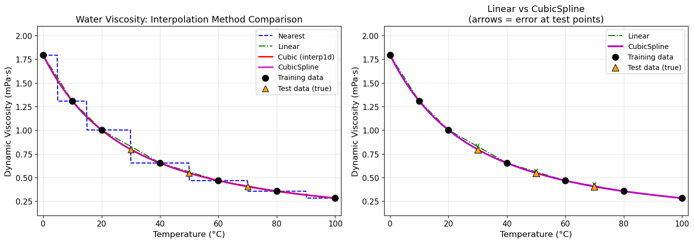
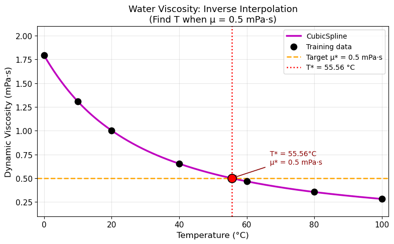
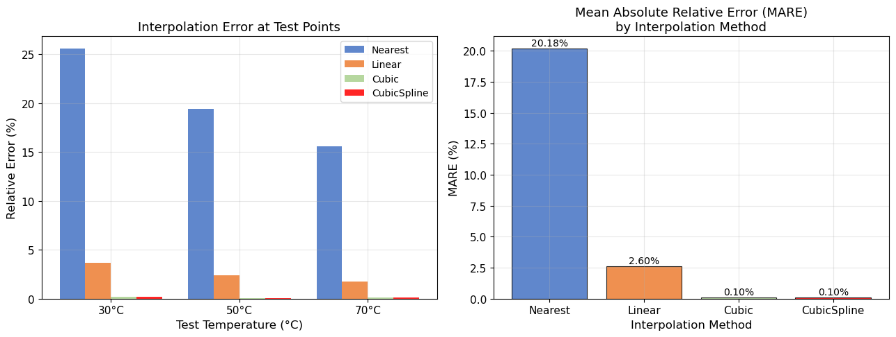

# Unit08 化工案例一：化工物性數據之一維插值

本文件為 ChemE-3502「電腦在化工上之應用」課程 Unit08 化工案例演練一之教學講義。
以**純水的動力黏度**隨溫度變化之稀疏實驗數據為例，
說明如何使用 `scipy.interpolate` 提供的一維插值工具，
估算未量測溫度下的物性值，並比較各方法的精確度。

---

## 學習目標

- 理解一維插值的基本概念：從離散數據點估計插值點之函數值
- 使用 `scipy.interpolate.interp1d()` 的 nearest、linear、cubic 三種插值方法
- 使用 `scipy.interpolate.CubicSpline()` 進行三次樣條插值
- 比較各插值方法在非線性物性數據上的精確度差異
- 進行**逆向插值**：給定目標物性值，反推對應的獨立變數（溫度）
- 以留存測試點（held-out test set）定量評估插值準確度

---

## 1. 問題描述

### 1.1 背景：黏度的工程重要性

液體的**動力黏度 (dynamic viscosity)** $\mu$ 是化工設計中最常用的物理性質之一，
其大小直接影響流體力學計算：

- **管流壓降**：Hagen-Poiseuille 方程式 $\Delta P = \frac{128 \mu L Q}{\pi D^4}$
- **雷諾數**：判斷流態 $Re = \frac{\rho v D}{\mu}$
- **傳熱係數**：Nusselt/Prandtl 關係式中含 $\mu$
- **質傳係數**：Schmidt 數 $Sc = \mu / (\rho D_{AB})$

黏度隨溫度升高而顯著**降低**，且降低幅度非線性，
因此在工程計算中若需要任意溫度下的 $\mu$ 值，必須透過插值處理。

### 1.2 實驗數據

從 Perry's Chemical Engineers' Handbook 取得純水動力黏度之量測數據，
選取 7 個量測溫度作為訓練數據點。

**訓練數據（已知量測值）**：

| 溫度 $T$ (°C) | 0 | 10 | 20 | 40 | 60 | 80 | 100 |
|:---:|:---:|:---:|:---:|:---:|:---:|:---:|:---:|
| 黏度 $\mu$ (mPa·s) | 1.792 | 1.307 | 1.002 | 0.653 | 0.467 | 0.355 | 0.282 |

**測試數據（預留用於精確度驗證）**：

| 溫度 $T$ (°C) | 30 | 50 | 70 |
|:---:|:---:|:---:|:---:|
| 文獻 $\mu$ (mPa·s) | 0.798 | 0.547 | 0.404 |

---

## 2. 一維插值方法說明

### 2.1 `scipy.interpolate.interp1d()`

`interp1d` 是一個通用的一維插值指令，格式如下：

```python
from scipy.interpolate import interp1d
f = interp1d(x, y, kind='linear')   # 建立插值函數物件
yi = f(xi)                           # 查詢插值點 xi 之函數值
```

常用 `kind` 參數說明：

| `kind` 設定 | 方法名稱 | 特性說明 |
|:---:|:---:|:---|
| `'nearest'` | 最近鄰插值 | 取距離最近的數據點值，結果為階梯函數，最不平滑 |
| `'linear'` | 線性插值 | 相鄰兩點間以直線連接，計算最快，但在彎曲區間誤差較大 |
| `'cubic'` | 三次樣條插值 | C² 連續三次多項式插值，平滑度與 CubicSpline 相近 |

> **注意**：`interp1d` 預設 `bounds_error=True`，
> 即查詢點不得超出數據範圍，否則拋出 `ValueError`。
> 若允許外插，設定 `fill_value='extrapolate'`，但需謹慎評估誤差。

### 2.2 `scipy.interpolate.CubicSpline()`

`CubicSpline` 建立一個**全段 C² 連續**的三次樣條插值，格式如下：

```python
from scipy.interpolate import CubicSpline
f_cs = CubicSpline(x, y)   # 預設 not-a-knot 邊界條件
yi = f_cs(xi)
```

**技術原理**：在 $N$ 個數據點之間，建立 $N-1$ 段各自獨立的三次多項式，
並要求在每個內部節點處：
- 函數值連續（C⁰）
- 一階導數連續（C¹）
- 二階導數連續（C²）

**預設邊界條件 (not-a-knot)**：
強制第一段與第二段共用相同的三次多項式（最後一段同理），
而非自然樣條（natural spline）中端點二階導數為零的條件。
此邊界條件使得端點行為更自然，通常比自然樣條更精確。

**與 `interp1d(kind='cubic')` 的差異**：

| 特性 | `interp1d(kind='cubic')` | `CubicSpline` |
|:---:|:---:|:---:|
| 平滑階數 | C²（二階連續）| C²（二階連續）|
| 邊界條件 | not-a-knot | not-a-knot（預設，可調整）|
| 擴充功能 | 僅函數值查詢 | 可求導、積分、調整邊界條件 |
| 適用場景 | 快速插值 | 建議優先使用 |

---

## 3. 程式演練

### 3.1 數據定義

```python
import numpy as np
from scipy.interpolate import interp1d, CubicSpline
from scipy.optimize import brentq

# 訓練數據點（已知量測值）
T_known = np.array([0, 10, 20, 40, 60, 80, 100], dtype=float)   # 溫度 (°C)
mu_known = np.array([1.792, 1.307, 1.002, 0.653, 0.467, 0.355, 0.282])  # 黏度 (mPa·s)

# 測試數據點（精確度驗證用）
T_test = np.array([30.0, 50.0, 70.0])
mu_test_true = np.array([0.798, 0.547, 0.404])
```

### 3.2 建立插值函數

```python
# 四種插值方法
f_nearest = interp1d(T_known, mu_known, kind='nearest')
f_linear  = interp1d(T_known, mu_known, kind='linear')
f_cubic   = interp1d(T_known, mu_known, kind='cubic')
f_cs      = CubicSpline(T_known, mu_known)          # not-a-knot 邊界條件
```

### 3.3 插值結果比較

執行結果：

```
=================================================================
  插值結果比較
=================================================================
   T (°C)    Nearest     Linear      Cubic   CubicSpline
-----------------------------------------------------------------
     30.0     1.0020     0.8275     0.7966        0.7966
     50.0     0.6530     0.5600     0.5472        0.5472
     70.0     0.4670     0.4110     0.4044        0.4044

=================================================================
  與文獻值之絕對誤差 (mPa·s)
=================================================================
   T (°C)   True μ    Nearest     Linear      Cubic   CubicSpline
-----------------------------------------------------------------
     30.0   0.7980     0.2040     0.0295     0.0014        0.0014
     50.0   0.5470     0.1060     0.0130     0.0002        0.0002
     70.0   0.4040     0.0630     0.0070     0.0004        0.0004
```

**觀察**：
- **Nearest**：誤差最大，因為黏度隨溫度非線性下降，最近鄰取值偏差大
- **Linear**：在 $T = 20 \to 40$ °C 的大間距區間（20°C 跨距）線性假設誤差明顯
- **Cubic & CubicSpline**：在本案例中結果幾乎相同，誤差降至 0.18% 以下

### 3.4 插值曲線比較圖

下圖為四種插值方法在 $T = 0 \sim 100$ °C 範圍內的插值曲線比較：



**左圖**：四種方法在整個溫度範圍的插值曲線。
可明顯看出 Nearest（藍色虛線）呈現階梯狀，其餘方法曲線較平滑。

**右圖**：同一溫度範圍內，僅顯示 Linear 與 CubicSpline 兩種方法的比較。
以雙向箭頭標示各測試點（三角形）相對於 Linear 曲線的誤差大小，
黑色實心圓為訓練數據點。CubicSpline 曲線通過文獻值最為準確，Linear 在大間距區段略為偏高。

---

## 4. 逆向插值

### 4.1 問題描述

在實際管流計算中，常需解答相反的問題：

> **已知目標黏度 $\mu^* = 0.500$ mPa·s，求對應的操作溫度 $T^*$**

此問題等價於求方程式的根：

$$
f_\text{CS}(T) - \mu^* = 0
$$

其中 $f_\text{CS}(T)$ 為已建立的 CubicSpline 插值函數。
黏度對溫度為單調遞減函數，因此在目標範圍內**恰有唯一根**，
適合使用 Brent 法（`scipy.optimize.brentq`）求解。

### 4.2 Brent 法（`brentq`）

```python
from scipy.optimize import brentq

mu_target = 0.500  # 目標黏度 (mPa·s)

# 定義目標方程式 g(T) = f_cs(T) - mu_target
def g(T):
    return f_cs(T) - mu_target

# 在訓練數據範圍 [0, 100] °C 內搜尋逆向插值解
T_star = brentq(g, T_known.min(), T_known.max())
mu_verify = float(f_cs(T_star))
```

`brentq(f, a, b)` 要求 $f(a)$ 與 $f(b)$ 異號，保證在 $[a, b]$ 存在根。
確認：

$$
f_\text{CS}(40) = 0.653 > 0.500 > f_\text{CS}(60) = 0.467
$$

因此 $[40, 60]$ °C（或更寬的 $[40, 80]$ °C）都能保證 `brentq` 成功收斂。

### 4.3 執行結果

```
=================================================================
  逆向插值結果
=================================================================
  目標黏度 μ* = 0.500 mPa·s
  → 對應溫度 T* = 55.56 °C
  驗證: f_CS(55.56 °C) = 0.5000 mPa·s
```

**解讀**：
純水在 $T^* \approx 55.6$ °C 時，動力黏度約為 0.500 mPa·s。
此溫度可作為操作條件設計的參考依據（例如設計管流系統的最高容許溫度）。

### 4.4 逆向插值圖示

下圖以 CubicSpline 曲線標示逆向插值的求解結果：



水平虛線為目標黏度值 $\mu^* = 0.500$ mPa·s，
垂直虛線指向交叉點所在的溫度 $T^* = 55.56$ °C（紅色箭頭標示）。

---

## 5. 精確度驗證

### 5.1 評估指標：平均絕對相對誤差（MARE）

對各插值方法，計算測試點的平均絕對相對誤差（Mean Absolute Relative Error, MARE）：

$$
\mathrm{MARE} = \frac{1}{n} \sum_{i=1}^{n} \left| \frac{\mu_{\mathrm{predict},i} - \mu_{\mathrm{true},i}}{\mu_{\mathrm{true},i}} \right| \times 100\%
$$

其中 $n = 3$（測試點共 3 個：$T = 30, 50, 70$ °C）。

### 5.2 相對誤差詳細結果

```
=================================================================
  各方法相對誤差 (%) — 測試點
=================================================================
   T (°C)   True μ    Nearest     Linear      Cubic   CubicSpline
-----------------------------------------------------------------
     30.0   0.7980      25.56       3.70       0.18         0.18
     50.0   0.5470      19.38       2.38       0.03         0.03
     70.0   0.4040      15.59       1.73       0.10         0.10

-----------------------------------------------------------------
 MARE (%)              20.18       2.60       0.10         0.10
=================================================================
```

### 5.3 MARE 比較圖



左圖為各測試點的相對誤差（%）比較；右圖為各方法的 MARE 比較。

### 5.4 結果討論

| 方法 | MARE | 精確度評估 |
|:---:|:---:|:---|
| Nearest | 20.18% | 不適用；階梯函數誤差大，僅作參考基準 |
| Linear | 2.60% | 可接受，適合數據密集區段 |
| Cubic (`interp1d`) | 0.10% | 優秀；三次樣條插值有效捕捉非線性趨勢 |
| CubicSpline | 0.10% | 優秀；本案例與 cubic 結果相同 |

**為什麼三次插值顯著優於線性插值？**

水的黏度遵循 Andrade 方程式近似：

$$
\mu \approx A \exp\!\left(\frac{B}{T}\right)
$$

指數關係造成黏度曲線**凹向下（concave down）**，
在大間距資料區段（如 $T = 20 \to 40$ °C，跨距 20°C）中，
線性插值高估了 $\mu$ 值（曲線在直線上方）。
三次插值能自動利用鄰近點的斜率資訊，估計曲率方向，大幅改善精確度。

**Cubic 與 CubicSpline 差異為何不明顯？**

本案例數據特性為單調遞減且曲率適中，
`interp1d(kind='cubic')` 與 `CubicSpline` 均為 C² 連續的三次樣條插值，在本案例中結果幾乎相同。
若數據有局部極値或劇烈振冪，兩者結果差異會更顯著（建議使用 `CubicSpline` 以獲得更多控制選項）。

---

## 6. 重點整理

| 知識點 | 內容 |
|:---|:---|
| 插值 vs. 迴歸 | 插值曲線嚴格通過所有數據點；迴歸允許殘差以最小化全域誤差 |
| `interp1d` 三種模式 | nearest（階梯）、linear（折線）、cubic（三次樣條） |
| `CubicSpline` | C² 全域平滑，not-a-knot 邊界條件為預設，精確度優於線性 |
| 逆向插值 | 將插值函數代入方程式，以 `brentq` 求解根（需指定搜尋區間） |
| MARE 評估 | 以留存測試點計算平均絕對相對誤差，定量比較方法精確度 |
| 物理直覺 | 黏度服從 Andrade 指數關係，曲率顯著時，三次插值遠優於線性 |

**使用建議**：
1. 數據點密集、需要快速估算時，`linear` 已足夠
2. 數據點稀疏、非線性明顯時，優先選擇 `CubicSpline`
3. 需要外插時，建議採用物性方程式（如 Andrade 方程式）取代純粹插值

---

**課程資訊**
- 課程名稱：電腦在化工上之應用
- 課程單元：Unit08 化工案例一：化工物性數據之一維插值
- 課程製作：逢甲大學 化工系 智慧程序系統工程實驗室
- 授課教師：莊曜禎 助理教授
- 更新日期：2026-02-21

**課程授權 [CC BY-NC-SA 4.0]**
 - 本教材遵循 [創用CC 姓名標示-非商業性-相同方式分享 4.0 國際 (CC BY-NC-SA 4.0)](https://creativecommons.org/licenses/by-nc-sa/4.0/deed.zh) 授權。

---

