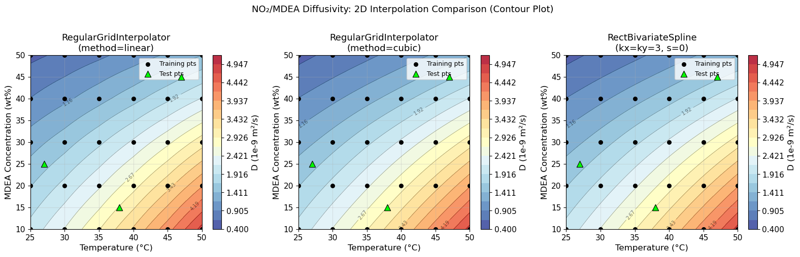
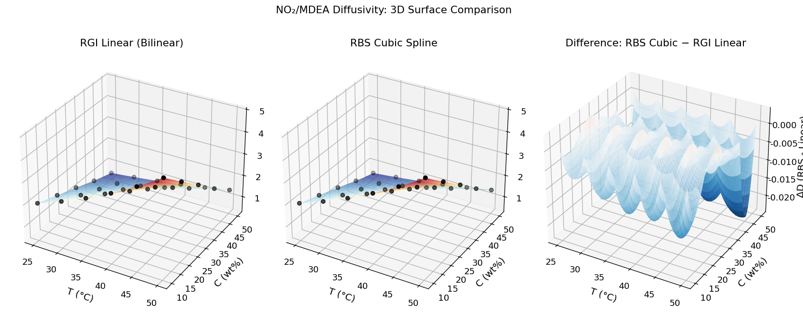
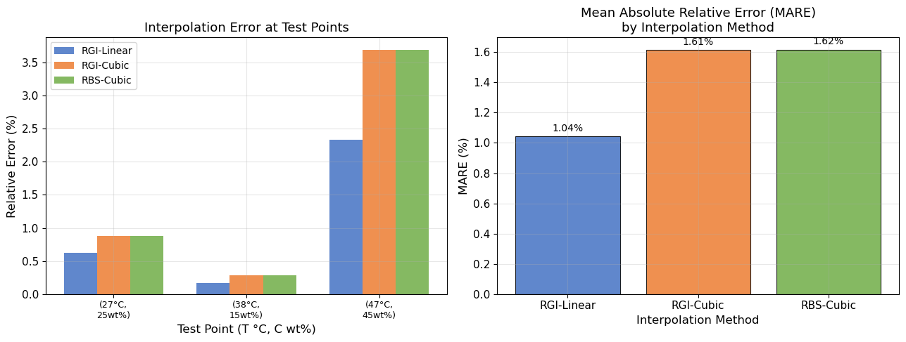

# Unit08 化工案例二：擴散係數之二維插值

**學習目標**

1. 了解 NO₂ 在 MDEA 溶液中擴散係數的物理背景與溫度、濃度依賴性
2. 掌握 scipy 中 `RegularGridInterpolator` 與 `RectBivariateSpline` 的使用方式
3. 能夠針對均勻矩形網格數據建立雙線性與雙三次插值模型
4. 透過等高線圖與三維曲面圖直觀比較不同插值方法之差異
5. 以平均絕對相對誤差 (MARE) 量化評估插值精確度

---

## 1. 問題描述

### 1.1 背景知識

**NO₂/MDEA 體系與 CO₂ 捕集**

N-甲基二乙醇胺（MDEA，Methyldiethanolamine）是工業 CO₂ 捕集與天然氣脫 CO₂ 流程中廣泛使用的吸收劑。在吸收塔質傳模型的建立中，溶解氣體（如 NO₂、CO₂）在溶液中的擴散係數 $D$ 是關鍵參數之一，影響質傳係數與反應速率的計算。

擴散係數隨**溫度** $T$ 與**溶液濃度** $C$ 同時變化，具有二維相依性：

- **溫度效應**：溫度升高，分子熱運動加劇，擴散係數增大（類 Arrhenius 行為）
- **濃度效應**：MDEA 濃度升高，溶液黏度增大，擴散係數降低

依 Modified Stokes-Einstein 關係式可寫為：

$$
D(T, C) \propto \frac{T}{\mu(T, C)}
$$

其中 $\mu(T, C)$ 為溶液黏度（隨溫度降低、濃度升高而增大）。

在實務計算中，$D(T, C)$ 通常由**有限個實驗量測點**的數表提供，工程計算需要在任意 $T, C$ 條件下查詢數值，因此需進行**二維插值**。

### 1.2 訓練數據

本例使用 6×5 矩形網格實驗數據（單位：1×10⁻⁹ m²/s）：

| $T$ (°C) ↓ / $C$ (wt%) → | **10%** | **20%** | **30%** | **40%** | **50%** |
|:---:|:---:|:---:|:---:|:---:|:---:|
| **25** | 2.01 | 1.65 | 1.29 | 0.91 | 0.59 |
| **30** | 2.43 | 1.99 | 1.55 | 1.10 | 0.71 |
| **35** | 2.91 | 2.38 | 1.86 | 1.32 | 0.85 |
| **40** | 3.46 | 2.83 | 2.21 | 1.57 | 1.01 |
| **45** | 4.08 | 3.34 | 2.61 | 1.86 | 1.19 |
| **50** | 4.78 | 3.91 | 3.06 | 2.18 | 1.40 |

**插值網格：**
- 溫度軸：$T \in \{25, 30, 35, 40, 45, 50\}$ °C（均勻間距 5°C）
- 濃度軸：$C \in \{10, 20, 30, 40, 50\}$ wt%（均勻間距 10 wt%）

### 1.3 測試點（精確度驗證）

以 Arrhenius 公式外插加線性濃度內插作為「精確值」，驗證插值精度：

| 測試點 | $T$ (°C) | $C$ (wt%) | $D_{\text{true}}$ (1×10⁻⁹ m²/s) |
|:---:|:---:|:---:|:---:|
| P1 | 27.0 | 25.0 | 1.60 |
| P2 | 38.0 | 15.0 | 2.94 |
| P3 | 47.0 | 45.0 | 1.67 |

---

## 2. 二維插值方法說明

### 2.1 RegularGridInterpolator（規則網格插值器）

`scipy.interpolate.RegularGridInterpolator` 適用於均勻或非均勻規則矩形網格，支援多種插值方法。

**建構方式：**

```python
from scipy.interpolate import RegularGridInterpolator

f = RegularGridInterpolator((T_grid, C_grid), D_data, method='linear')
```

**主要參數：**

| 參數 | 說明 | 常用值 |
|------|------|--------|
| `points` | 各維度的座標陣列 tuple | `(T_grid, C_grid)` |
| `values` | 對應網格節點的函數值陣列 | `D_data` (shape 6×5) |
| `method` | 插值方法 | `'linear'`、`'cubic'`、`'nearest'`、`'quintic'` |
| `bounds_error` | 超出範圍是否報錯 | `True`（預設） |
| `fill_value` | 超出範圍的填充值 | `None` |

**查詢方式：**

```python
# 批量查詢：傳入 N×2 陣列，每列為 [T_i, C_i]
points_query = np.column_stack([T_test, C_test])
D_pred = f(points_query)
```

**方法特性：**

- `method='linear'`：雙線性插值，分段線性，計算快，$C^0$ 連續（一階導數不連續）
- `method='cubic'`：雙三次插值，三階多項式，$C^2$ 連續，曲面更光滑

### 2.2 RectBivariateSpline（矩形二元樣條）

`scipy.interpolate.RectBivariateSpline` 專為規則矩形網格設計，使用二元張量積 B-spline 進行插值或平滑擬合。

**建構方式：**

```python
from scipy.interpolate import RectBivariateSpline

f_rbs = RectBivariateSpline(T_grid, C_grid, D_data, kx=3, ky=3, s=0)
```

**主要參數：**

| 參數 | 說明 | 範圍 |
|------|------|------|
| `x`, `y` | 兩維度的座標陣列 | 一維，嚴格遞增 |
| `z` | 網格節點函數值 | shape: `(len(x), len(y))` |
| `kx`, `ky` | 各方向樣條次數 | 1~5（建議 3：三次） |
| `s` | 平滑因子 | `0`：強制通過所有節點（插值）； $s>0$ ：平滑擬合 |

**查詢方式：**

```python
# 點查詢（非網格）：grid=False
D_pred = f_rbs(T_test, C_test, grid=False)

# 面查詢（建立細密網格）：grid=True
D_surface = f_rbs(T_fine, C_fine, grid=True)  # shape: (len(T_fine), len(C_fine))
```

### 2.3 方法比較

| 比較項目 | RGI (linear) | RGI (cubic) | RBS (cubic, s=0) |
|----------|:---:|:---:|:---:|
| 插值類型 | 雙線性 | 雙三次（局部） | 三次 B-spline（全局） |
| 連續性 | $C^0$ | $C^2$ | $C^2$ |
| 計算效率 | 最快 | 中等 | 中等 |
| 邊界行為 | 穩定 | 可能有輕微震盪 | 邊界控制良好 |
| 適用場景 | 快速查詢、線性場 | 光滑場精確插值 | 工程數表插值推薦 |

> **工程建議**：對於化工物性數表（如擴散係數、黏度），在數據光滑且點數足夠時，推薦使用 `RectBivariateSpline(kx=3, ky=3, s=0)`，兼顧精確度與曲面光滑性。

---

## 3. 程式演練

### 3.1 數據定義

```python
import numpy as np
from scipy.interpolate import RegularGridInterpolator, RectBivariateSpline

# 訓練網格座標
T_grid = np.array([25., 30., 35., 40., 45., 50.])   # °C
C_grid = np.array([10., 20., 30., 40., 50.])          # wt%

# D 值矩陣，shape: (6, 5)，單位 1e-9 m²/s
D_data = np.array([
    [2.01, 1.65, 1.29, 0.91, 0.59],
    [2.43, 1.99, 1.55, 1.10, 0.71],
    [2.91, 2.38, 1.86, 1.32, 0.85],
    [3.46, 2.83, 2.21, 1.57, 1.01],
    [4.08, 3.34, 2.61, 1.86, 1.19],
    [4.78, 3.91, 3.06, 2.18, 1.40],
])

# 測試點
T_test    = np.array([27.0, 38.0, 47.0])
C_test    = np.array([25.0, 15.0, 45.0])
D_true    = np.array([1.60, 2.94, 1.67])
```

### 3.2 建立插值函數

```python
# (1) RegularGridInterpolator — 雙線性
f_rgi_linear = RegularGridInterpolator(
    (T_grid, C_grid), D_data, method='linear')

# (2) RegularGridInterpolator — 雙三次
f_rgi_cubic = RegularGridInterpolator(
    (T_grid, C_grid), D_data, method='cubic')

# (3) RectBivariateSpline — 三次 B-spline（插值）
f_rbs = RectBivariateSpline(T_grid, C_grid, D_data, kx=3, ky=3, s=0)
```

### 3.3 插值結果比較

各方法在三個測試點的預測結果與誤差：

| $T$ (°C) | $C$ (wt%) | $D_{\text{true}}$ | RGI-Linear | RGI-Cubic | RBS-Cubic |
|:---:|:---:|:---:|:---:|:---:|:---:|
| 27.0 | 25.0 | 1.60 | 1.5900 | 1.5860 | 1.5860 |
| 38.0 | 15.0 | 2.94 | 2.9450 | 2.9318 | 2.9318 |
| 47.0 | 45.0 | 1.67 | 1.6310 | 1.6084 | 1.6083 |

（單位：×10⁻⁹ m²/s）

**絕對誤差 $|D_{\text{interp}} - D_{\text{true}}|$ ：**

| $T$ (°C) | $C$ (wt%) | RGI-Linear | RGI-Cubic | RBS-Cubic |
|:---:|:---:|:---:|:---:|:---:|
| 27.0 | 25.0 | 0.0100 | 0.0140 | 0.0140 |
| 38.0 | 15.0 | 0.0050 | 0.0082 | 0.0082 |
| 47.0 | 45.0 | 0.0390 | 0.0616 | 0.0617 |

> **觀察**：三種方法的預測值均非常接近真值，絕對誤差皆在 0.06×10⁻⁹ m²/s 以下。雙線性插值（RGI-Linear）在本案例中誤差反而略小於三次方法，這在點數有限的數表插值中是常見現象。

---

## 4. 二維等高線圖比較

以下圖形呈現三種插值方法在完整溫度–濃度空間（200×200 細密網格）的等高線分布，並標示訓練點（●）與測試點（▲）位置：



**圖形說明：**

- **左**：RGI-Linear（雙線性）— 等高線略有折角，$C^0$ 連續
- **中**：RGI-Cubic（雙三次）— 等高線光滑，$C^2$ 連續
- **右**：RBS-Cubic（三次 B-spline）— 等高線與中圖高度一致，略有差異

三種方法的等高線形態整體相似，均呈現「右下角高值（高溫低濃度）→ 左上角低值（低溫高濃度）」的梯度趨勢，符合物理直觀。

---

## 5. 三維曲面圖



**圖形說明：**

- **左**：RGI-Linear (Bilinear) 曲面，分段線性，訓練點（灰點）完全落在曲面上
- **中**：RBS-Cubic Spline 曲面，三次樣條，曲面更光滑
- **右**：差值曲面 $\Delta D = D_{\text{RBS}} - D_{\text{RGI-Linear}}$ ，量值極小（最大差值約 −0.020×10⁻⁹ m²/s），表明兩者在網格內部的預測差異微小

> **結論**：在本案例（數據光滑、網格均勻）中，雙線性與三次樣條的插值曲面幾乎重合，差異僅在邊角區域略為顯著，說明數據本身的平滑性已足夠支撐線性插值。

---

## 6. 精確度驗證

### 6.1 評估指標

採用**相對誤差**（Relative Error）與**平均絕對相對誤差**（MARE）作為精確度指標：

$$
\text{RE}_i = \frac{|D_{\text{interp},i} - D_{\text{true},i}|}{D_{\text{true},i}} \times 100\%
$$

$$
\text{MARE} = \frac{1}{N} \sum_{i=1}^{N} \text{RE}_i
$$

### 6.2 驗證結果

**各測試點相對誤差：**

| 測試點 | $T$ (°C) | $C$ (wt%) | RGI-Linear | RGI-Cubic | RBS-Cubic |
|:---:|:---:|:---:|:---:|:---:|:---:|
| P1 | 27.0 | 25.0 | 0.63% | 0.87% | 0.88% |
| P2 | 38.0 | 15.0 | 0.17% | 0.28% | 0.28% |
| P3 | 47.0 | 45.0 | 2.34% | 3.69% | 3.70% |
| **MARE** | — | — | **1.04%** | **1.61%** | **1.62%** |



**圖形說明：**

- **左**：各測試點的相對誤差柱狀圖。P3（47°C, 45wt%）誤差最大，因其位於溫度軸上接近網格邊界（邊界格點外插效應），且兩軸均為偏角落的位置
- **右**：MARE 柱狀圖，RGI-Linear（1.04%）< RGI-Cubic（1.61%）≈ RBS-Cubic（1.62%）

### 6.3 結果討論

1. **所有方法誤差均低於 4%**，表明三種插值方法對此物性數表均具有良好的精確度
2. **雙線性插值勝出**的原因：本數據集中 $D(T, C)$ 的變化趨勢本身近似線性（對數線性），高次插值引入的振盪效應反而使誤差略增
3. **P3 誤差最大**的原因：(47, 45) 在兩軸上均靠近邊界（T=45~50 之間，C=40~50 之間），且三次方法在邊界處的控制稍弱
4. **工程實踐建議**：對於化工物性數表，建議優先以 `RectBivariateSpline(s=0)` 為主，若計算簡單且數據光滑則雙線性亦足夠；誤差 < 5% 通常符合工程應用需求

---

## 7. 重點整理

| 知識點 | 摘要 |
|--------|------|
| **RegularGridInterpolator** | scipy 均勻/非均勻規則網格插值；查詢時傳入 `np.column_stack` 的 N×d 陣列 |
| **RectBivariateSpline** | 矩形網格二元樣條；`s=0` 為插值，`s>0` 為平滑擬合；點查詢需指定 `grid=False` |
| **方法差異可視化** | 等高線圖（等值線形態）、三維曲面圖（直觀高低）、差值曲面（量化差異） |
| **MARE 評估** | 適合多方法比較的無因次精確度指標 |
| **物理直觀** | 擴散係數隨溫度升高、濃度降低而增大，符合 Stokes-Einstein 理論 |

**常見陷阱：**

- `RegularGridInterpolator` 的 `points` 必須按升序排列，且 `values` 的 shape 需與 `points` 各維度長度一致
- `RectBivariateSpline` 在點查詢時若不指定 `grid=False`，將返回網格（矩陣）而非點值
- 高次插值（cubic/quintic）在數據邊界附近可能出現振盪，需謹慎使用

---

**課程資訊**
- 課程名稱：化工數值方法
- 課程單元：Unit08 插值方法 — 化工案例二：擴散係數之二維插值
- 課程製作：逢甲大學 化工系 智慧程序系統工程實驗室
- 授課教師：莊曜禎 助理教授
- 更新日期：2026-02-21

**課程授權 [CC BY-NC-SA 4.0]**
 - 本教材遵循 [創用CC 姓名標示-非商業性-相同方式分享 4.0 國際 (CC BY-NC-SA 4.0)](https://creativecommons.org/licenses/by-nc-sa/4.0/deed.zh) 授權。

---
