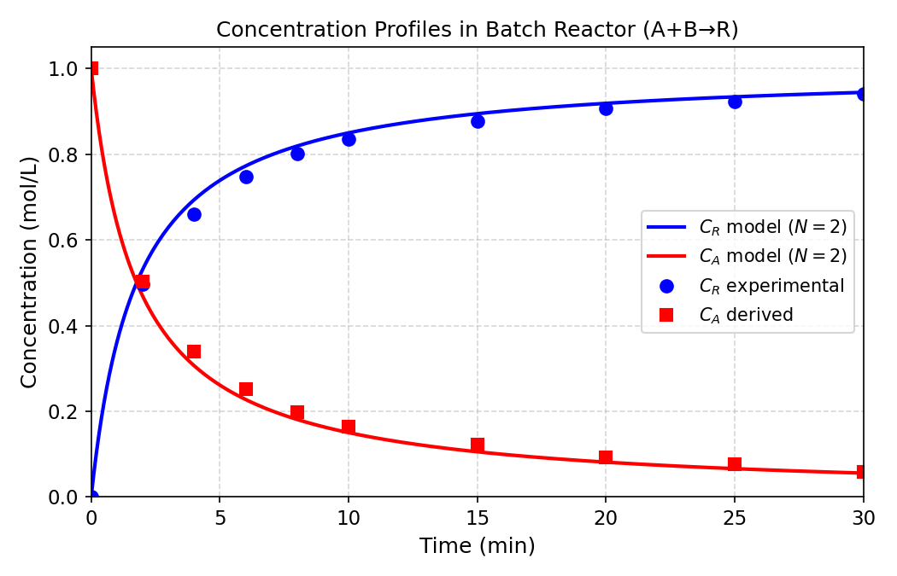
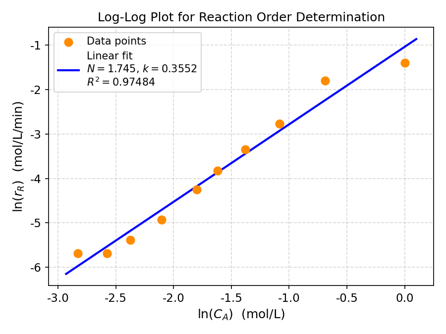
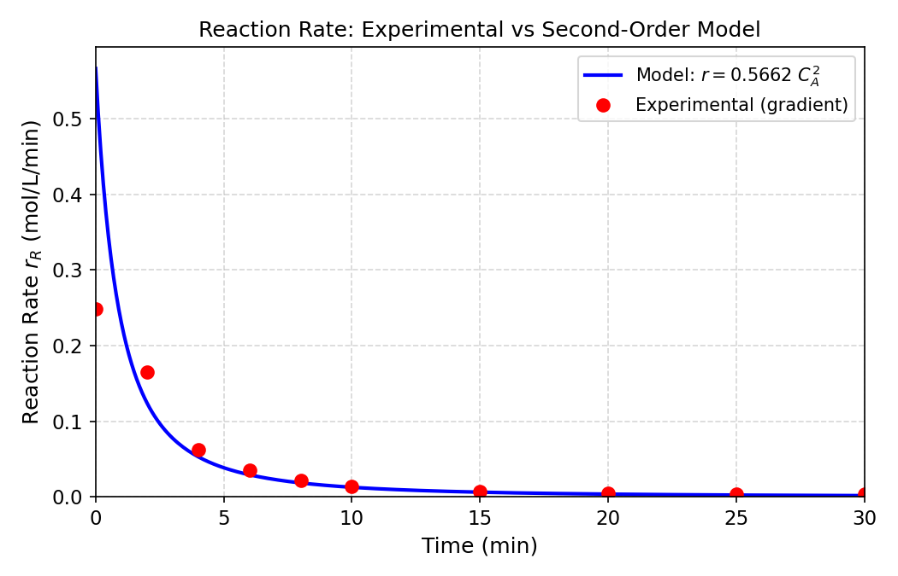

# Unit08 化工案例三：批次反應器之反應速率推斷

> **學習目標**
> 1. 理解批次反應器中冪次律動力學模型的建立方式。
> 2. 學習使用 `numpy.gradient()` 對實驗濃度數據進行數值微分以估計反應速率。
> 3. 透過 ln-ln 線性化迴歸（`numpy.polyfit` / `scipy.stats.linregress`）推斷反應階數 $N$ 與速率常數 $k$ 。
> 4. 掌握整數階數修正技巧，提升參數估計的物理意義。
> 5. 視覺化驗證：以比較圖評估模型預測品質。

---

## 1. 問題描述

### 1.1 反應系統

在 60°C 液相批次反應器中進行不可逆反應：

$$
\mathrm{A} + \mathrm{B} \longrightarrow \mathrm{R}
$$

**初始條件：**
- $C_{A0} = C_{B0} = 1.0$ mol/L（等濃度進料）
- $C_{R0} = 0$

**化學計量關係：** 由於 $C_{A0} = C_{B0}$ 且反應為 1:1 化學計量，反應過程中維持 $C_A = C_B$ ，即：

$$
C_A(t) = C_B(t) = C_{A0} - C_R(t)
$$

### 1.2 冪次律速率模型

假設反應速率遵從冪次律模型（Power-Law Kinetics）：

$$
r_R = k \cdot C_A^N
$$

其中：
- $r_R$ = 產物 R 的生成速率（mol/L/min）
- $k$ = 速率常數（單位依 $N$ 而定）
- $N$ = 總反應階數（待推斷）

**真實參數**（模擬數據之基礎）： $N = 2$ ， $k = 0.5$ L/(mol·min)

### 1.3 動力學推斷策略

對速率方程兩邊取自然對數，得**線性關係**：

$$
\ln(r_R) = N \cdot \ln(C_A) + \ln(k)
$$

令 $Y = \ln(r_R)$ ， $X = \ln(C_A)$ ，則問題化為標準線性迴歸：

$$
Y = N \cdot X + \ln(k)
$$

- **斜率** $\to$ 反應階數 $N$
- **截距** $\to$ $\ln(k)$ ，故 $k = e^{\text{intercept}}$

### 1.4 實驗數據

60°C 批次反應器量測所得產物濃度 $C_R(t)$ 如下：

| $t$ (min) | $C_R$ (mol/L) | $C_A = C_{A0} - C_R$ (mol/L) | 轉化率 $X_A$ |
|:---------:|:-------------:|:-----------------------------:|:------------:|
| 0         | 0.000         | 1.000                         | 0.000        |
| 2         | 0.497         | 0.503                         | 0.497        |
| 4         | 0.661         | 0.339                         | 0.661        |
| 6         | 0.748         | 0.252                         | 0.748        |
| 8         | 0.802         | 0.198                         | 0.802        |
| 10        | 0.835         | 0.165                         | 0.835        |
| 15        | 0.878         | 0.122                         | 0.878        |
| 20        | 0.907         | 0.093                         | 0.907        |
| 25        | 0.924         | 0.076                         | 0.924        |
| 30        | 0.941         | 0.059                         | 0.941        |

最終轉化率 $X_A = 94.1\%$ （反應接近完全）。

---

## 2. 數值微分方法

批次反應器中，產物 R 的生成速率定義為：

$$
r_R = \frac{dC_R}{dt}
$$

由於 $C_R(t)$ 為離散量測數據，需使用**數值微分**估計導數。

### 2.1 `numpy.gradient()` 差分方案

`numpy.gradient(f, x)` 依數據點位置選用不同差分方案：

| 數據點位置 | 差分方案 | 說明 |
|:----------:|:--------:|:-----|
| **內部點** | 加權中間差分（二階精確） | $\displaystyle \left.\frac{dC_R}{dt}\right|_i \approx \frac{C_{R,i+1}-C_{R,i}}{\Delta t_r}\cdot\frac{\Delta t_l}{\Delta t_l+\Delta t_r} + \frac{C_{R,i}-C_{R,i-1}}{\Delta t_l}\cdot\frac{\Delta t_r}{\Delta t_l+\Delta t_r}$ |
| **第一點** | 前向差分（一階） | $\displaystyle \left.\frac{dC_R}{dt}\right|_0 \approx \frac{C_{R,1} - C_{R,0}}{t_1 - t_0}$ |
| **最後點** | 後向差分（一階） | $\displaystyle \left.\frac{dC_R}{dt}\right|_n \approx \frac{C_{R,n} - C_{R,n-1}}{t_n - t_{n-1}}$ |

其中 $\Delta t_l = t_i - t_{i-1}$ ， $\Delta t_r = t_{i+1} - t_i$ 。對等間距數據（ $\Delta t_l = \Delta t_r$ ），加權公式退化為簡單中間差分。

> **優點**：內部點使用**加權差分公式**，達二階精確 $O(\Delta t^2)$ ，相較單邊差分具更低截斷誤差。
> 
> **適用條件**：`numpy.gradient` 可自動處理非均勻間距，適合本例中時間步長不一致（前段 $\Delta t=2$ min，後段 $\Delta t=5$ min）的數據。

---

## 3. 程式演練

### 3.1 環境設定與套件載入

```python
import os
import numpy as np
import matplotlib.pyplot as plt
from scipy import stats
```

### 3.2 數據定義與輸出

```python
C_A0 = 1.0  # mol/L
t_exp  = np.array([0., 2., 4., 6., 8., 10., 15., 20., 25., 30.])   # min
C_R_exp = np.array([0.000, 0.497, 0.661, 0.748, 0.802,
                    0.835, 0.878, 0.907, 0.924, 0.941])             # mol/L
C_A_exp = C_A0 - C_R_exp
```

執行結果：

```
======================================================================
  批次反應器實驗數據 — A+B→R
======================================================================
   t (min)   C_R (mol/L)   C_A (mol/L)   X_A (-)
--------------------------------------------------
       0.0         0.000         1.000     0.000
       2.0         0.497         0.503     0.497
       4.0         0.661         0.339     0.661
       6.0         0.748         0.252     0.748
       8.0         0.802         0.198     0.802
      10.0         0.835         0.165     0.835
      15.0         0.878         0.122     0.878
      20.0         0.907         0.093     0.907
      25.0         0.924         0.076     0.924
      30.0         0.941         0.059     0.941

  初始濃度 C_A0 = C_B0 = 1.0 mol/L
  最終轉化率 X_A = 94.1%
```

### 3.3 數值微分計算反應速率

```python
r_exp = np.gradient(C_R_exp, t_exp)   # r_R = dC_R/dt (mol/L/min)
mask  = (r_exp > 0) & (C_A_exp > 0.01)
```

執行結果：

```
================================================================================
  數值微分結果 — 反應速率計算
================================================================================
   t (min)   C_R (mol/L)   C_A (mol/L)   r_R (mol/L/min)     有效
------------------------------------------------------------
       0.0         0.000         1.000            0.2485      ✓
       2.0         0.497         0.503            0.1653      ✓
       4.0         0.661         0.339            0.0628      ✓
       6.0         0.748         0.252            0.0353      ✓
       8.0         0.802         0.198            0.0217      ✓
      10.0         0.835         0.165            0.0142      ✓
      15.0         0.878         0.122            0.0072      ✓
      20.0         0.907         0.093            0.0046      ✓
      25.0         0.924         0.076            0.0034      ✓
      30.0         0.941         0.059            0.0034      ✓

  有效數據點：10 / 10
```

### 3.4 ln-ln 線性迴歸推斷動力學參數

```python
ln_CA = np.log(C_A_exp[mask])
ln_r  = np.log(r_exp[mask])

# numpy.polyfit
coeffs = np.polyfit(ln_CA, ln_r, 1)
N_poly = coeffs[0];  k_poly = np.exp(coeffs[1])

# scipy.stats.linregress
slope, intercept, r_value, p_value, std_err = stats.linregress(ln_CA, ln_r)
N_stats = slope;  k_stats = np.exp(intercept);  R2 = r_value**2
```

執行結果：

```
============================================================
  ln-ln 線性迴歸結果
============================================================
  方法                        N (反應階數)   k (L/mol/min)
-------------------------------------------------------
  numpy.polyfit               1.7453          0.3552
  scipy.linregress            1.7453          0.3552
  真實值 (N=2, k=0.5)               2.0          0.5000

  R² (linregress) = 0.974837
  p 值           = 1.11e-07
  標準誤差 (斜率) = 0.0991

  N 估計誤差：12.73%
  k 估計誤差：28.96%
```

> **觀察**：ln-ln 迴歸所得 $N \approx 1.745$ ，與真實值 $N=2$ 存在約 12.7% 誤差。誤差主要來源為有限差分截斷誤差，在濃度變化緩慢的末段時間點影響尤甚。 $R^2 = 0.9748$ 仍顯示良好線性相關。

---

## 4. 整數階數修正與速率常數精估

### 4.1 方法說明

工程實務中，反應階數多為整數或簡單分數。將 $N$ 取捨為最接近整數後，重新估計速率常數：

$$
k_{\mathrm{int}} = \frac{1}{n} \sum_{i=1}^{n} \frac{r_{R,i}}{C_{A,i}^{N_{\mathrm{int}}}}
$$

```python
N_int = int(round(N_stats))          # → 2
k_values = r_exp[mask] / (C_A_exp[mask]**N_int)
k_int    = np.mean(k_values)
```

### 4.2 參數比較

| 參數 | 真實值 | 迴歸估計（非整數 N） | 整數階修正（N=2） |
|:----:|:------:|:--------------------:|:-----------------:|
| 反應階數 $N$ | 2 | 1.7453 | **2** |
| 速率常數 $k$ (L/mol/min) | 0.5000 | 0.3552 | **0.5662** |
| $N$ 誤差 | — | 12.73% | 0.00% |
| $k$ 誤差 | — | 28.96% | 13.23% |

> **結論**：整數階修正後， $N=2$ （精確還原）， $k$ 誤差由 28.96% 降至 13.23%。  
> 殘餘的 $k$ 誤差主要反映數值微分在非均勻稀疏時間點的截斷誤差，是差分法固有的侷限性。

---

## 5. 結果驗證與比較圖

### 5.1 圖1 — 濃度隨時間變化

模型曲線使用二階批次反應的解析解（ $C_A = C_{A0}/(1 + C_{A0} k t)$ ）與實驗數據點對照：



> 實驗數據點（圓形/方形）與 $N=2$ 、 $k=0.5662$ 模型曲線（實線）吻合良好，  
> 初始 $C_A = 1.0$ mol/L 最終降至 0.059 mol/L， $X_A = 94.1\%$ 。

### 5.2 圖2 — ln-ln 迴歸圖



> 散點（橙色）為各時間點的 $(\ln C_A,\ \ln r_R)$ ；藍色直線為最小二乘迴歸直線。  
> 斜率 $N = 1.745$ ，截距對應 $k = 0.355$ ， $R^2 = 0.9748$ 。

### 5.3 圖3 — 反應速率比較



> 紅色圓點為數值微分估計值，藍色曲線為 $r = 0.5662\ C_A^2$ 之模型預測。  
> 在 $t=0$ 處，前向差分大幅低估真實速率（實驗 0.249 vs 模型 ~0.566 mol/L/min），第一點明顯偏低於曲線； $t \geq 4$ min 後，中央差分精度較高，實驗點（0.063～0.003）與模型曲線（0.053～0.004）吻合良好；晚期（ $t > 20$ min）因濃度極低，截斷誤差影響相對增大， $t=30$ 處散點略高於曲線。

---

## 6. 重點整理

| 項目 | 說明 |
|:----:|:-----|
| **數值微分** | `numpy.gradient(f, x)` 自動處理非均勻間距；內部點**加權差分公式**（二階精確），端點單邊差分（一階） |
| **ln-ln 線性化** | $\ln r = N \ln C_A + \ln k$ ，斜率 = $N$ ，截距 $e^b = k$ |
| **迴歸工具** | `numpy.polyfit(x, y, 1)` 與 `scipy.stats.linregress()` 結果一致；後者可提供 $R^2$ 、p 值、SE |
| **誤差來源** | 有限差分截斷誤差 + 稀疏/非均勻採樣，晚期低濃度段影響較大 |
| **整數階修正** | 先取整 $N$ ，再用 $k = \overline{r/C_A^N}$ 估計，提升 $k$ 精度與物理意義 |
| **適用範圍** | 差分法適合初步篩選反應階數；若需更高精度，建議結合積分法或非線性最小二乘 |

---

**課程資訊**
- 課程名稱：電腦在化工上之應用
- 課程單元：Unit08 化工案例三：批次反應器之反應速率推斷
- 課程製作：逢甲大學 化工系 智慧程序系統工程實驗室
- 授課教師：莊曜禎 助理教授
- 更新日期：2026-02-21

**課程授權 [CC BY-NC-SA 4.0]**
 - 本教材遵循 [創用CC 姓名標示-非商業性-相同方式分享 4.0 國際 (CC BY-NC-SA 4.0)](https://creativecommons.org/licenses/by-nc-sa/4.0/deed.zh) 授權。

---
