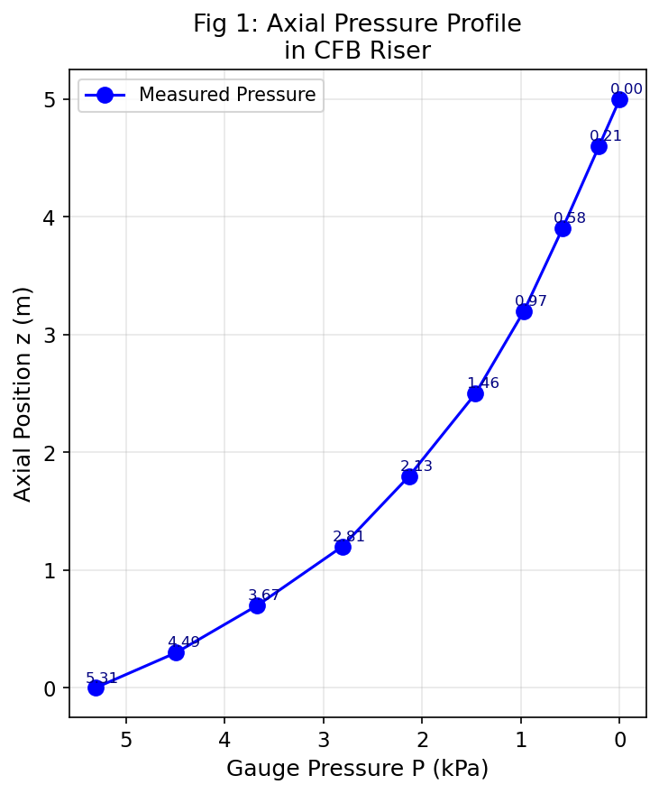
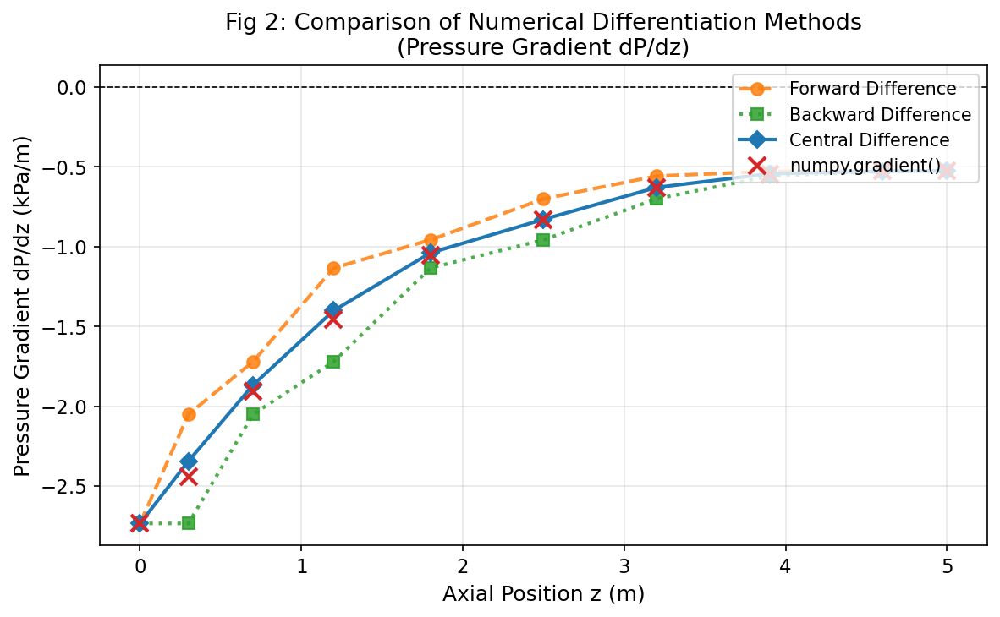
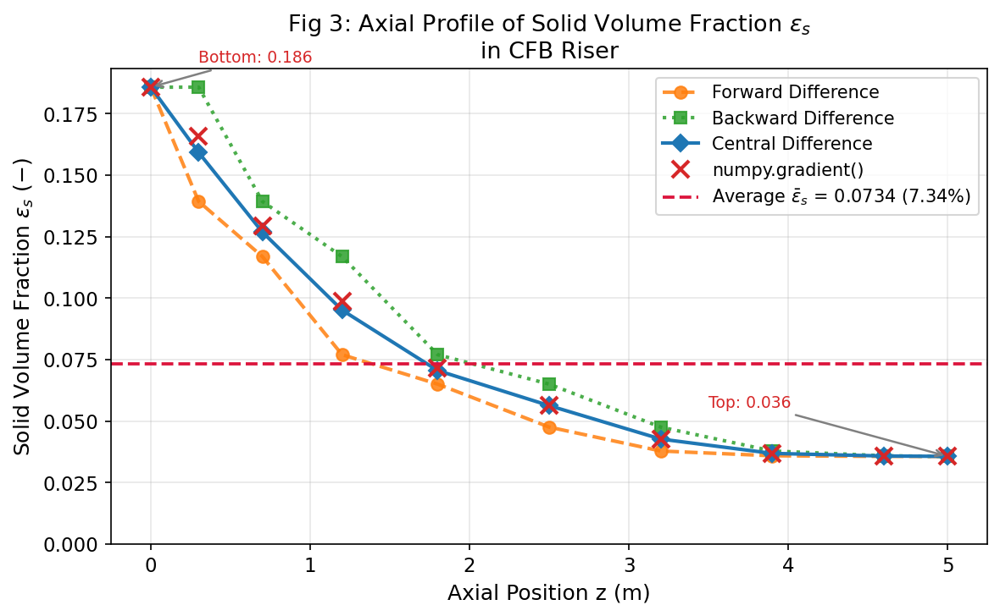

# Unit08 化工案例四：氣固流體化床壓力梯度與固體粒子體積分率

> **學習目標**
> 1. 理解氣固流體化床（CFB Riser）中壓力梯度與固體粒子體積分率的物理關係。
> 2. 學習使用 `numpy.gradient()` 對軸向壓力量測數據進行中間差分數值微分。
> 3. 掌握前向差分、後向差分、中間差分三種方法的實作與精確度比較。
> 4. 由動量平衡方程推導，計算各量測位置之固體粒子體積分率 $\varepsilon_s$ 。
> 5. 使用梯形積分計算全床平均 $\varepsilon_s$ ，並繪製軸向分布圖進行視覺化分析。

---

## 1. 問題描述

### 1.1 系統說明

在一座**氣固循環流體化床提升管（CFB Riser）**中，以空氣輸送固體催化劑（FCC 催化劑，粒徑 $d_p = 70\ \mu\mathrm{m}$ ），並沿軸向（ $z$ 方向）裝設壓力感測器，記錄各高度之錶壓（Gauge Pressure）。

**系統參數：**

| 參數 | 數值 | 單位 |
|:---:|:---:|:---:|
| 提升管高度 $H$ | 5.0 | m |
| 固體粒子密度 $\rho_s$ | 1500 | kg/m³ |
| 氣體（空氣）密度 $\rho_g$ | 1.2 | kg/m³ |
| 重力加速度 $g$ | 9.81 | m/s² |

### 1.2 壓力量測數據

於 10 個非等間距軸向位置量測之**錶壓**（以 $z = 5.0$ m 頂端出口為零壓參考點）：

| $z$ (m) | 0.0 | 0.3 | 0.7 | 1.2 | 1.8 | 2.5 | 3.2 | 3.9 | 4.6 | 5.0 |
|:-------:|:---:|:---:|:---:|:---:|:---:|:---:|:---:|:---:|:---:|:---:|
| $P$ (kPa) | 5.31 | 4.49 | 3.67 | 2.81 | 2.13 | 1.46 | 0.97 | 0.58 | 0.21 | 0.00 |

> **注意：** 量測位置為**非等間距**，因此差分計算必須以實際 $\Delta z$ 為分母。

---

## 2. 理論背景

### 2.1 氣固流體化床動量平衡

對氣固兩相流提升管的微元段 $dz$ 進行**垂直方向動量平衡**，忽略摩擦力（friiction）及加速度項後，簡化為：

$$
-\frac{dP}{dz} = \rho_s \, g \, \varepsilon_s + \rho_g \, g \, \varepsilon_g
$$

其中：
- $\varepsilon_s$ = 固體粒子體積分率（Solid Volume Fraction）
- $\varepsilon_g$ = 氣體體積分率（Gas Volume Fraction）
- $\varepsilon_s + \varepsilon_g = 1$

### 2.2 簡化假設

由於 $\rho_g \ll \rho_s$ （本例 $\rho_g / \rho_s = 1.2/1500 \approx 0.08\%$ ），氣體貢獻可忽略：

$$
-\frac{dP}{dz} \approx \rho_s \, g \, \varepsilon_s
$$

整理後，固體粒子體積分率為：

$$
\boxed{\varepsilon_s(z) = \frac{-dP/dz}{\rho_s \, g}}
$$

由於壓力隨高度遞減（即 $dP/dz < 0$ ），故 $\varepsilon_s > 0$ 。

### 2.3 量綱一致性

壓力量測單位為 kPa，軸向位置單位為 m，計算時須統一轉換：

$$
\varepsilon_s = \frac{-dP/dz\ [\mathrm{kPa/m}] \times 1000\ [\mathrm{Pa/kPa}]}{\rho_s \, g\ [\mathrm{Pa/m}]}
$$

其中 $\rho_s g = 1500 \times 9.81 = 14715\ \mathrm{Pa/m}$ 。

---

## 3. 數值微分方法

### 3.1 `numpy.gradient()` — 自動差分（推薦）

`numpy.gradient(f, x)` 對**非均勻間距**數據自動選擇最佳差分方案：

| 數據點位置 | 差分方案 | 公式（概念） |
|:----------:|:--------:|:-----|
| 內部點（共 8 點） | 加權中間差分（二階精確） | $\displaystyle \left.\frac{dP}{dz}\right|_i \approx \frac{P_{i+1}-P_i}{\Delta z_r}\cdot\frac{\Delta z_l}{\Delta z_l+\Delta z_r} + \frac{P_i-P_{i-1}}{\Delta z_l}\cdot\frac{\Delta z_r}{\Delta z_l+\Delta z_r}$ |
| 第一點 $z_0$ | 前向差分（一階） | $\displaystyle \left.\frac{dP}{dz}\right|_0 \approx \frac{P_1 - P_0}{z_1 - z_0}$ |
| 最後點 $z_9$ | 後向差分（一階） | $\displaystyle \left.\frac{dP}{dz}\right|_9 \approx \frac{P_9 - P_8}{z_9 - z_8}$ |

其中 $\Delta z_l = z_i - z_{i-1}$ ， $\Delta z_r = z_{i+1} - z_i$ 。對等間距數據（ $\Delta z_l = \Delta z_r$ ），加權公式退化為簡單中間差分 $(P_{i+1}-P_{i-1})/(2\Delta z)$ 。

### 3.2 手動差分法（對比用）

為驗證各方法之差異，亦手動計算以下三種差分並進行對比：

#### 前向差分法

$$
\left.\frac{dP}{dz}\right|_i^{\mathrm{fwd}} = \frac{P_{i+1} - P_i}{z_{i+1} - z_i}, \quad i = 0, 1, \ldots, N-2
$$

最後一點無法計算，以後向差分代替。

#### 後向差分法

$$
\left.\frac{dP}{dz}\right|_i^{\mathrm{bwd}} = \frac{P_i - P_{i-1}}{z_i - z_{i-1}}, \quad i = 1, 2, \ldots, N-1
$$

第一點無法計算，以前向差分代替。

#### 中間差分法

$$
\left.\frac{dP}{dz}\right|_i^{\mathrm{cen}} = \frac{P_{i+1} - P_{i-1}}{z_{i+1} - z_{i-1}}, \quad i = 1, 2, \ldots, N-2
$$

端點以前向／後向差分補齊。

> **注意：** 此公式 $(P_{i+1} - P_{i-1})/(z_{i+1} - z_{i-1})$ 為一階精確近似。`numpy.gradient()` 對非均勻間距使用**加權公式**（二階精確），結果與上式不同。

---

## 4. 程式演算結果

### 4.1 壓力梯度計算

以 `numpy.gradient(P, z)` 計算各測量點之 $dP/dz$ ：

| $z$ (m) | 量測 $P$ (kPa) | $dP/dz$ (kPa/m) | $\varepsilon_s$ (−) |
|:-------:|:--------------:|:----------------:|:-------------------:|
| 0.0 | 5.31 | −2.733 | 0.1858 |
| 0.3 | 4.49 | −2.440 | 0.1658 |
| 0.7 | 3.67 | −1.903 | 0.1293 |
| 1.2 | 2.81 | −1.453 | 0.0988 |
| 1.8 | 2.13 | −1.052 | 0.0715 |
| 2.5 | 1.46 | −0.829 | 0.0563 |
| 3.2 | 0.97 | −0.629 | 0.0427 |
| 3.9 | 0.58 | −0.543 | 0.0369 |
| 4.6 | 0.21 | −0.526 | 0.0358 |
| 5.0 | 0.00 | −0.525 | 0.0357 |

### 4.2 平均固體粒子體積分率

使用梯形積分對 $\varepsilon_s(z)$ 沿全床高積分求平均值：

$$
\bar{\varepsilon}_s = \frac{1}{H} \int_0^H \varepsilon_s(z)\ dz \approx \frac{1}{H} \sum_{i=0}^{N-2} \frac{\varepsilon_{s,i} + \varepsilon_{s,i+1}}{2} \cdot \Delta z_i
$$

計算結果：

$$
\bar{\varepsilon}_s \approx 0.0734 \quad (7.34\%)
$$

> 底部（ $z \approx 0$ ）固體濃度 $\varepsilon_s \approx 18.6\%$ ，頂部（ $z \approx 5\ \mathrm{m}$ ）降至 $\approx 3.6\%$ ，呈典型指數衰減分布，符合 CFB 提升管之固體懸浮特性。

---

## 5. 差分方法比較與圖形說明

### 5.1 圖1 — 壓力軸向分布

> 量測點（藍色圓點）呈現單調遞減趨勢，從底端 5.31 kPa 降至頂端 0.00 kPa（錶壓）。  
> 底部（ $z < 1.0\ \mathrm{m}$ ）壓降較陡，顯示固相濃度較高；頂部（ $z > 3.0\ \mathrm{m}$ ）壓降趨緩，進入稀相區。

### 5.2 圖2 — 壓力梯度三種差分方法比較

> - **前向差分**（橙色虛線）在最後一點因切換為後向差分，整體在底部偏估略有差異。  
> - **後向差分**（綠色點線）在第一點切換為前向差分，底端與中間差分接近。  
> - **中間差分**（藍色實線）使用公式 $(P_{i+1}-P_{i-1})/(z_{i+1}-z_{i-1})$ ，對非均勻間距為一階精確。  
> - **`numpy.gradient()`**（紅色×符號）採用加權差分公式，對非均勻間距達到**二階精確**，與中間差分有所差異（最大差異約 0.098 kPa/m，發生在間距最不均勻的 $z = 0.3\ \mathrm{m}$ 處）。  
> - 整體而言，三種方法結果相近，數據平滑時差異不顯著；非均勻間距較大時，`numpy.gradient()` 精確度更高。

### 5.3 圖3 — 固體粒子體積分率軸向分布

> - 固體濃度從底部 $\varepsilon_s \approx 0.186$ 指數衰減至頂部 $\approx 0.036$ ，兩者相差約 5 倍。  
> - 水平虛線標示全床**平均值** $\bar{\varepsilon}_s \approx 0.0734$ （7.34%）。  
> - 底部高固相濃度（密相區）與頂部低固相濃度（稀相區）的分界約在 $z \approx 1.5\ \mathrm{m}$ 附近。  
> - 前向差分偏低（因取前方較大梯度區域），後向差分偏高（取前一時段），中間差分（曲線）居中；`numpy.gradient()` 差異集中在底部非均勻間距處（圖2可清楚對照）。

---

## 6. 重點整理

| 項目 | 說明 |
|:----:|:-----|
| **技術核心** | 壓力梯度 $dP/dz < 0$ 為已知，由動量平衡反推固體體積分率 $\varepsilon_s$ |
| **`numpy.gradient()`** | 自動適應非均勻間距；內部點採**加權差分公式**（二階精確 $O(\Delta z^2)$），端點單側差分（一階） |
| **三種差分比較** | 中間差分比前/後向更精確；`numpy.gradient()` 對非均勻間距使用加權公式，二階精確，更佳 |
| **端點誤差** | 所有方法在 $z = 0$ 及 $z = H$ 端點只能使用一階差分，精確度較低 |
| **量綱轉換** | 壓力（kPa）乘以 1000 轉為 Pa 後再除以 $\rho_s g$ （Pa/m），確保 $\varepsilon_s$ 為無量綱 |
| **物理意義** | 底部密相（ $\varepsilon_s \approx 18.6\%$ ）→ 頂部稀相（ $\varepsilon_s \approx 3.6\%$ ），CFB 提升管典型特徵 |
| **平均體積分率** | 使用梯形積分 `numpy.trapz()` 計算全床平均 $\bar{\varepsilon}_s \approx 7.34\%$ ，代表整體固相持率 |

---

**課程資訊**
- 課程名稱：電腦在化工上之應用
- 課程單元：Unit08 化工案例四：氣固流體化床壓力梯度與固體粒子體積分率
- 課程製作：逢甲大學 化工系 智慧程序系統工程實驗室
- 授課教師：莊曜禎 助理教授
- 更新日期：2026-02-21

**課程授權 [CC BY-NC-SA 4.0]**
 - 本教材遵循 [創用CC 姓名標示-非商業性-相同方式分享 4.0 國際 (CC BY-NC-SA 4.0)](https://creativecommons.org/licenses/by-nc-sa/4.0/deed.zh) 授權。

---

