# Unit08 插值、微分與積分之運算

## 課程簡介

在化學工程計算中，工程師經常需要面對以下三類問題：

1. **插值 (Interpolation)**：已知某物質在若干溫度下的黏度數據，如何估計其他溫度的黏度值？
2. **數值微分 (Numerical Differentiation)**：已知批次反應器中的濃度-時間數據，如何計算各時間點的反應速率？
3. **數值積分 (Numerical Integration)**：已知填充塔吸收器的氣相組成分布，如何計算所需的傳質單元數 (NOG)？

這三類運算是連結「實驗量測數據」與「工程設計計算」的核心橋樑。本單元以 Python 的 `numpy` 與 `scipy` 函式庫為工具，系統性地介紹這三類數值方法的原理、語法與化工應用。

### 學習目標

完成本單元後，學生應能夠：

1. 區分並選用適合的一維與二維插值方法（`interp1d`、`CubicSpline`、`RegularGridInterpolator`、`griddata`）
2. 理解外插的風險，並正確設定邊界條件
3. 使用有限差分法（前向、後向、中心差分）實作數值微分
4. 應用 `numpy.diff`、`numpy.gradient` 處理離散數據的微分問題
5. 選用適當的數值積分方法（`trapezoid`、`simpson`、`quad`、`dblquad`）
6. 將插值、微分、積分整合應用於黏度分析、反應動力學推算、RTD 分析、填充塔設計等化工問題

### 本單元內容架構

```
Unit08 插值、微分與積分
├── 1. 插值法基礎
│   ├── 1.1 一維插值（interp1d, CubicSpline）
│   ├── 1.2 二維插值（RegularGridInterpolator, griddata）
│   └── 1.3 外插的風險
├── 2. 數值微分
│   ├── 2.1 有限差分近似原理
│   ├── 2.2 NumPy 數值微分工具
│   └── 2.3 高階微分與偏微分
├── 3. 數值積分
│   ├── 3.1 離散數據積分（trapezoid, simpson）
│   ├── 3.2 函數積分（quad）
│   └── 3.3 重積分（dblquad, nquad）
├── 4. SciPy 工具總覽
├── 5. 化工應用
│   ├── 5.1 黏度插值與反插值
│   ├── 5.2 批次反應器反應速率推算
│   ├── 5.3 RTD 分析
│   └── 5.4 填充塔 NOG 計算
├── 6. 程式設計最佳實踐
└── 7. 結語
```

---

## 1. 插值法基礎 (Interpolation)

### 1.1 一維插值方法

插值的核心問題是：給定 $n$ 個資料點 $(x_0, y_0), (x_1, y_1), \ldots, (x_{n-1}, y_{n-1})$ ，估計 $x$ 在兩點之間的 $y$ 值。

#### `scipy.interpolate.interp1d`

`interp1d` 是最常用的一維插值函式，支援多種插值方式：

| `kind` 參數 | 方法 | 特性 |
|-----------|------|------|
| `'nearest'` | 最近鄰插值 | 僅適用於階梯狀數據 |
| `'linear'` | 線性插值 | 最簡單，C⁰ 連續 |
| `'quadratic'` | 二次樣條 | C¹ 連續 |
| `'cubic'` | 三次樣條 | C² 連續（not-a-knot 邊界條件） |

```python
from scipy.interpolate import interp1d

# 建立插值函數
f_lin  = interp1d(x_data, y_data, kind='linear')
f_cub  = interp1d(x_data, y_data, kind='cubic')

# 查詢新 x 值對應的 y 值
y_query = f_lin(x_query)   # x_query 必須在 x_data 的範圍內
```

#### `scipy.interpolate.CubicSpline`

`CubicSpline` 建立自然三次樣條（C² 連續），即在每個節點處一、二階導數均連續。相較於 `interp1d(kind='cubic')`，`CubicSpline` 行為更可預測、無 Runge 震盪，是一維平滑插值的首選：

```python
from scipy.interpolate import CubicSpline

cs = CubicSpline(x_data, y_data)
y_interp = cs(x_query)

# CubicSpline 額外功能：直接求導數
dy_dx   = cs(x_query, 1)   # 一階導數
d2y_dx2 = cs(x_query, 2)   # 二階導數
```

> **重要提醒**：`CubicSpline` 支援 `nu` 參數直接計算導數（`cs(x, 1)`），這在需要同時插值與求導時非常方便（如牛頓法求反插值）。

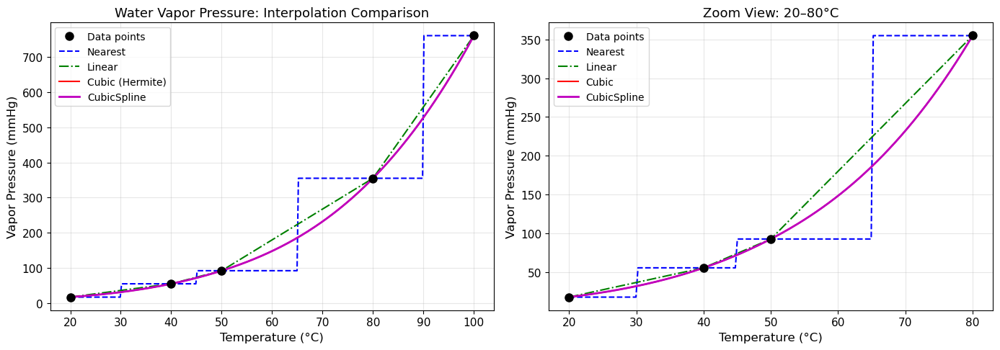

**📊 執行結果**

```text
   溫度(°C)     Nearest      Linear       Cubic   CubicSpline
------------------------------------------------------------
       30       17.50       36.40       31.61         31.61
       60       92.50      180.00      148.28        148.28
       70      355.00      267.50      232.21        232.21
       90      355.00      557.50      527.36        527.36
```

**🔍 結果分析與討論**

本範例以四個稀疏量測點（ $T$ = 20、50、80、100 °C）的水蒸氣壓數據（單位：mmHg）為基礎，比較四種一維插值方法的精度差異：

1. **最近鄰插值（Nearest）** ：結果呈現明顯的「跳躍」不連續性。 $T=70$ °C 與 $T=90$ °C 均回傳 355.00 mmHg（最近的 80 °C 數據點值），無法反映實際的平滑趨勢，僅適合分類型離散數據。

2. **線性插值（Linear）** ： $T=60$ °C 處給出 180.00 mmHg，為 $T=50$ °C（92.50）與 $T=80$ °C（355.00）之間的直線插值。計算簡便但忽略曲率，對非線性行為（如蒸氣壓的指數特性）誤差較大。

3. **三次樣條（Cubic 與 CubicSpline）** ：兩者在本例中結果完全相同（如 $T=30$ °C 均為 31.61 mmHg），均引入平滑曲率修正，顯著改善非線性區域的估計精度。

> **關鍵觀察** ：對於蒸氣壓這類遵循 Clausius-Clapeyron 方程的指數型數據，`CubicSpline` 是最合適的插值工具，其 $C^2$ 連續性確保了平滑、無震盪的插值曲線。

### 1.2 二維插值方法

當數據為二維表格時（如熱力學性質，以溫度與壓力為自變數），需使用二維插值。

| 函式 | 數據要求 | 適用場景 |
|-----|---------|---------|
| `RegularGridInterpolator` | 規則矩形網格 | 蒸汽表、查表計算 |
| `RectBivariateSpline` | 規則矩形網格 | 需要平滑導數 |
| `griddata` | 任意散點 | 實驗量測不規則數據 |

```python
from scipy.interpolate import RegularGridInterpolator

# x_grid, y_grid 為一維陣列；z_data 為二維陣列 shape=(len(x_grid), len(y_grid))
rgi = RegularGridInterpolator((x_grid, y_grid), z_data, method='linear')

# 查詢任意點
z_query = rgi([[x_q, y_q]])   # 輸入需為 (N, 2) 陣列

# 批次查詢（向量化）
pts = np.column_stack([x_pts.ravel(), y_pts.ravel()])
z_batch = rgi(pts).reshape(x_pts.shape)
```

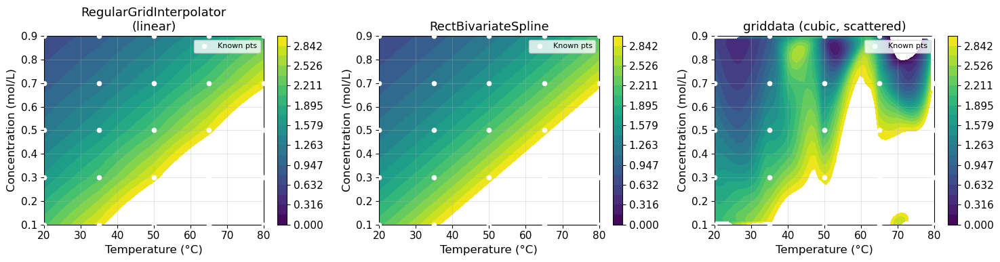

**📊 執行結果**

```text
已知量測數據矩陣 (rows=Temp, cols=Conc):
[[2.1518 1.5941 1.1809 0.8748 0.6481]
 [2.9046 2.1518 1.5941 1.1809 0.8748]
 [3.9208 2.9046 2.1518 1.5941 1.1809]
 [5.2925 3.9208 2.9046 2.1518 1.5941]
 [7.1441 5.2925 3.9208 2.9046 2.1518]]

在 T=42.0°C, C=0.4 mol/L 的插值驗證:
  精確值:                  2.1304
  RegularGridInterpolator: 2.1787  (誤差: 2.27%)
  RectBivariateSpline:     2.1301  (誤差: 0.01%)
```

**🔍 結果分析與討論**

本範例模擬化工中常見的二維查表情境（如以溫度與濃度為自變數的反應速率常數或活度係數）：

1. **數據矩陣特性** ：5×5 規則網格，矩陣值可見明顯的對角對稱性，說明該物性函數在溫度與濃度上具有平滑的雙線性結構。

2. **精度比較** ：
   - `RegularGridInterpolator`（線性插值）在 $T=42$ °C、 $C=0.4$ mol/L 的誤差為 **2.27%**，對網格間距內的雙線性近似誤差來自於忽略高階曲率。
   - `RectBivariateSpline`（雙三次樣條）誤差僅 **0.01%**，精度提升了約 200 倍，充分利用了數據的光滑性。

3. **方法選擇** ：對精度要求高的熱力學查表計算，應優先使用 `RectBivariateSpline`；當速度優先且誤差在可接受範圍時，`RegularGridInterpolator` 是更通用的選擇。

### 1.3 外插的風險

插值方法僅保證在資料範圍「內」的準確性。查詢範圍「外」的點稱為**外插 (extrapolation)**，可能導致嚴重誤差：

```python
# interp1d 外插設定
f1 = interp1d(x, y, bounds_error=False, fill_value=np.nan)           # 超界回傳 NaN
f2 = interp1d(x, y, bounds_error=False, fill_value=(y[0], y[-1]))    # 超界填充端點值
f3 = interp1d(x, y, bounds_error=False, fill_value='extrapolate')    # 外插（危險！）
```

> **最佳實踐**：永遠先檢查查詢值是否在原始數據範圍內。如必須外插，應選取在物理上有意義的模型（如 Arrhenius、Antoine 方程式）直接外推，而非用純數學插值。

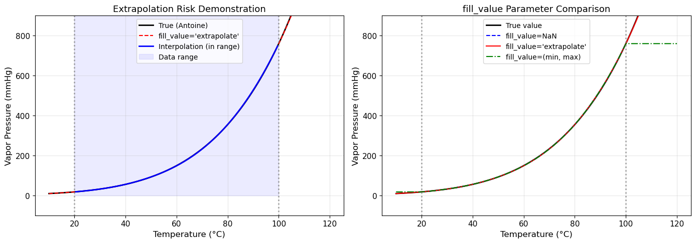

**📊 執行結果**

```text
bounds_error=True 示範（查詢超出範圍的點）：
  捕獲到錯誤: A value (10.0) in x_new is below the interpolation
              range's minimum value (20).
```

**🔍 結果分析與討論**

本範例展示了外插（extrapolation）的兩個核心問題：

1. **`bounds_error=True`（預設行為）** ：當查詢值 $T=10$ °C 低於數據範圍下限（ $T_{\min}=20$ °C），系統即時拋出 `ValueError`，明確告知超界位置（`x_new is below the interpolation range's minimum value (20)`）。這是**最安全的設定**，能在開發階段立即暴露問題。

2. **圖形分析** ：圖中可見在數據範圍（20–100 °C）外，三次樣條的外插曲線可能大幅偏離以 Antoine 方程式為基準的「真實」行為，甚至出現物理上不合理的負值或震盪。

3. **化工實踐建議** ：
   - 永遠優先使用物理模型（如 Antoine 方程 $\log P = A - B/(C+T)$ 、Arrhenius 方程）進行外推；
   - 若確需使用插值外推，務必與理論模型或鄰近實驗數據交叉驗證，並報告外推範圍與信心區間。

---

## 2. 數值微分 (Numerical Differentiation)

### 2.1 有限差分近似原理

對函數 $f(x)$ ，利用 Taylor 展開推導出三種有限差分公式：

**前向差分 (Forward Difference)**（截斷誤差 $O(h)$ ）：

$$
f'(x) \approx \frac{f(x+h) - f(x)}{h}
$$

**後向差分 (Backward Difference)**（截斷誤差 $O(h)$ ）：

$$
f'(x) \approx \frac{f(x) - f(x-h)}{h}
$$

**中心差分 (Central Difference)**（截斷誤差 $O(h^2)$ ，**精度更高**）：

$$
f'(x) \approx \frac{f(x+h) - f(x-h)}{2h}
$$

其中 $h$ 為步長。步長的選擇需在**截斷誤差**（步長太大）與**捨入誤差**（步長太小）間取得平衡：

- 最佳步長（中心差分，倍精度浮點數）： $h^* \approx \epsilon_{\text{mach}}^{1/3} \approx 6 \times 10^{-6}$

> **📌 $O(h)$ 與 $O(h^2)$ 的意義（Big-O 記號）**
>
> $O(h)$ 表示「截斷誤差與步長 $h$ 成正比」：步長縮小為原來的 $1/10$ ，誤差也縮小約 $10$ 倍。
>
> $O(h^2)$ 表示「截斷誤差與 $h^2$ 成正比」：步長縮小為原來的 $1/10$ ，誤差縮小約 $100$ 倍（精度提升遠更快）。
>
> **直觀比較**（設 $h = 0.1$ ）：
>
> | 差分方法 | 截斷誤差階次 | 誤差估計量級 |
> |---------|-------------|------------|
> | 前向差分 | $O(h)$ | $\sim 0.1$ |
> | 後向差分 | $O(h)$ | $\sim 0.1$ |
> | 中心差分 | $O(h^2)$ | $\sim 0.01$ |
>
> 因此，在步長相同的情況下，**中心差分的精度比前向／後向差分高約一個數量級**，是實務上的優選。

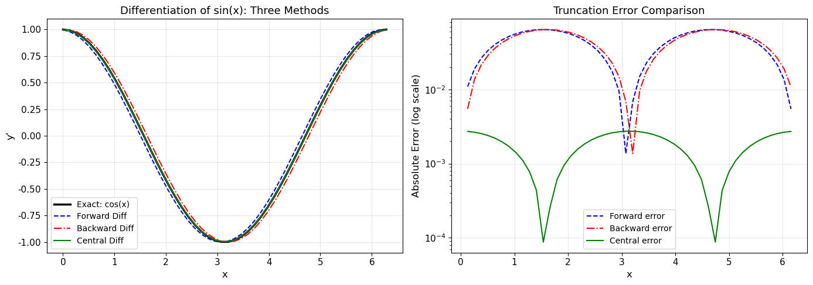

**📊 執行結果**

```text
步長 h = 0.1282

平均絕對誤差比較:
  前向差分: 0.040041
  後向差分: 0.040041
  中間差分: 0.001763  ← 最佳
```

**🔍 結果分析與討論**

以 $f(x) = \sin(x)$ 為測試函數（解析導數 $f'(x) = \cos(x)$ ），步長 $h \approx 0.1282$ （對應 50 個等間距節點跨越 $[0, 2\pi]$ ）：

1. **精度比較** ：中心差分的平均絕對誤差（MAE = 0.001763）相較於前向或後向差分（MAE = 0.040041）低了約 **22.7 倍**。這與理論預測完全吻合：中心差分截斷誤差為 $O(h^2) \approx 0.0164$ ，前向差分為 $O(h) \approx 0.1282$ 。

2. **對稱誤差** ：前向與後向差分的 MAE 完全相同（0.040041），這是因為 $\sin(x)$ 的 $2\pi$ 週期性，使兩者的誤差在整個週期上平均後相同。

3. **截斷誤差圖** ：右圖（log-log 尺度）清晰展示了步長 $h$ 對三種方法精度的影響：前向或後向差分誤差以 $O(h^1)$ 下降，中心差分以 $O(h^2)$ 下降（斜率更陡），在 $h \approx 10^{-5}$ 附近達到最低點後，因浮點數捨入誤差主導而回升。

> **工程選用準則** ：在步長相同的條件下，中心差分是精度最高且計算開銷幾乎相同的選擇，為數值微分的標準首選。

### 2.2 NumPy 數值微分工具

#### `numpy.diff`

`np.diff(y, n)` 計算陣列的 $n$ 階差分（相鄰元素相減）：

```python
import numpy as np

t = np.array([0, 1, 2, 3, 4])     # 時間 (s)
C = np.array([1.0, 0.6, 0.36, 0.22, 0.13])  # 濃度 (mol/L)

dC = np.diff(C)                    # shape: (n-1,)
dt = np.diff(t)                    # shape: (n-1,)
dC_dt = dC / dt                    # 一階差商（前向差分）
t_mid = (t[:-1] + t[1:]) / 2      # 對應的中間時間點
```

> **注意**：`np.diff` 回傳長度比原陣列少 1，適合等間距或非等間距數據。

#### `numpy.gradient`

`np.gradient(y, x)` 使用**中心差分**自動計算梯度，回傳與輸入**相同長度**的陣列（邊界採用一階差分）：

```python
dC_dt = np.gradient(C, t)   # 支援非等間距 t
```

| 工具 | 長度 | 精度 | 邊界 |
|-----|------|------|------|
| `np.diff(y)/np.diff(x)` | $n-1$ | $O(h)$ | 無特殊處理 |
| `np.gradient(y, x)` | $n$ | $O(h^2)$ | 邊界自動降為 $O(h)$ |

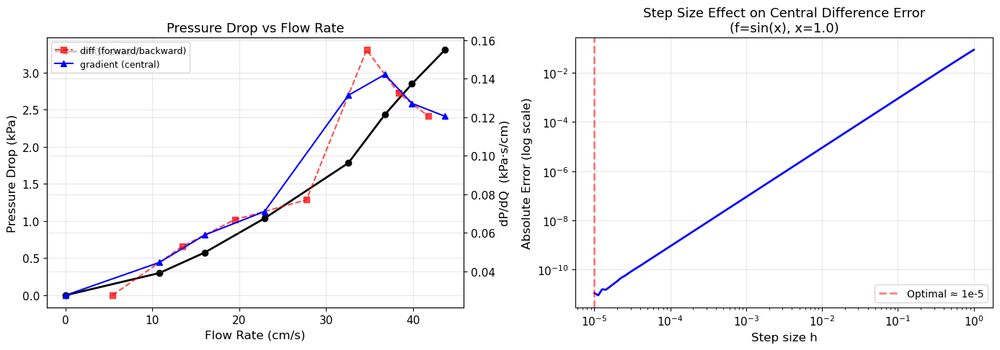

**📊 執行結果**

```text
差分法比較 (dP/dQ):

 numpy.diff  (長度=7):
  x_mid=  5.40 cm/s  →  dP/dQ = 0.02769 kPa·s/cm
  x_mid= 13.42 cm/s  →  dP/dQ = 0.05296 kPa·s/cm
  x_mid= 19.47 cm/s  →  dP/dQ = 0.06686 kPa·s/cm
  x_mid= 27.73 cm/s  →  dP/dQ = 0.07720 kPa·s/cm
  x_mid= 34.66 cm/s  →  dP/dQ = 0.15500 kPa·s/cm
  x_mid= 38.32 cm/s  →  dP/dQ = 0.13269 kPa·s/cm
  x_mid= 41.78 cm/s  →  dP/dQ = 0.12053 kPa·s/cm

 numpy.gradient (長度=8):
  x=  0.00 cm/s  →  dP/dQ = 0.02769 kPa·s/cm
  x= 10.80 cm/s  →  dP/dQ = 0.04472 kPa·s/cm
  x= 16.03 cm/s  →  dP/dQ = 0.05897 kPa·s/cm
  x= 22.91 cm/s  →  dP/dQ = 0.07116 kPa·s/cm
  x= 32.56 cm/s  →  dP/dQ = 0.13141 kPa·s/cm
  x= 36.76 cm/s  →  dP/dQ = 0.14220 kPa·s/cm
  x= 39.88 cm/s  →  dP/dQ = 0.12721 kPa·s/cm
  x= 43.68 cm/s  →  dP/dQ = 0.12053 kPa·s/cm
```

**🔍 結果分析與討論**

本範例計算填充塔中壓降 $\Delta P$ 對流速 $Q$ 的梯度 $dP/dQ$ ，代表單位流速增加所導致的壓降上升量（流動阻力斜率）：

1. **長度差異** ：`np.diff` 回傳 7 個結果（原始 8 點數據少 1），對應每個區間的中點位置；`np.gradient` 回傳 8 個結果（與原始數據等長），位置與原始 $x$ 點一致，使用上更直觀。

2. **物理趨勢分析** ：
   - 在低流速（ $Q < 20$ cm/s）段， $dP/dQ$ 隨流速緩慢增大，填充床阻力以黏性摩擦（Darcy 定律）為主；
   - 在中等流速（ $Q \approx 34$ cm/s）附近， $dP/dQ$ 出現明顯跳升至 0.155，可能對應填充塔的**液氾點（flooding point）** 附近，流動阻力急劇上升；
   - 高流速段（ $Q > 38$ cm/s）梯度回降，可能反映數據量測的不確定性或塔內氣液兩相流動狀態轉變。

3. **`np.gradient` 的優勢** ：邊界點（ $Q=0$ 和 $Q=43.68$ cm/s）自動採用一階差分計算，避免了 `np.diff` 遺失端點的問題。對化工數據處理而言，`np.gradient` 更為便利。

### 2.3 高階微分與偏微分

**二階導數**（中心差分公式，截斷誤差 $O(h^2)$ ）：

$$
f''(x) \approx \frac{f(x+h) - 2f(x) + f(x-h)}{h^2}
$$

也可使用兩次 `np.gradient`，但精度略低：

```python
d2C_dt2 = np.gradient(np.gradient(C, t), t)
```

**偏微分**：對二維陣列 $Z[i,j] = f(x_i, y_j)$ ：

```python
dZ_dx = np.gradient(Z, x_vals, axis=0)   # ∂Z/∂x，沿第 0 軸
dZ_dy = np.gradient(Z, y_vals, axis=1)   # ∂Z/∂y，沿第 1 軸
```

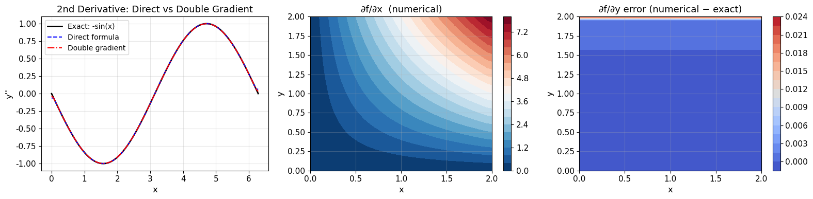

**📊 執行結果**

```text
二階微分誤差比較 (f=sin, f''=-sin):
  直接公式:        平均絕對誤差 = 0.000216
  兩次 gradient:   平均絕對誤差 = 0.000863

偏微分誤差 (f = x²y + sin(y)):
  ∂f/∂x 平均絕對誤差: 0.002564
  ∂f/∂y 平均絕對誤差: 0.000824
```

**🔍 結果分析與討論**

**二階導數精度比較** ：以 $f(x) = \sin(x)$ （解析二階導數 $f''(x) = -\sin(x)$ ）為測試，比較兩種方法：

- **直接中心差分公式** $f''(x) \approx [f(x+h) - 2f(x) + f(x-h)] / h^2$ 的 MAE = **0.000216** ；
- **兩次 `np.gradient`** 的 MAE = **0.000863**，誤差約為直接公式的 4 倍。

這是因為兩次應用 `np.gradient` 會累積兩次截斷誤差，且邊界處理各引入一階誤差，而直接三點公式在單次計算中即達 $O(h^2)$ 精度。

**偏微分精度** ：

對 $f(x, y) = x^2 y + \sin(y)$ ：
- $\partial f / \partial x$ 的 MAE = 0.002564（略高，可能受到離散網格較粗的影響）；
- $\partial f / \partial y$ 的 MAE = 0.000824（精度更佳，因 $y$ 方向的曲率較小）。

> **實作要點** ：計算偏微分時，`np.gradient(Z, x_vals, axis=0)` 必須指定正確的軸向和對應的座標向量，避免使用預設等間距假設而引入錯誤。

---

## 3. 數值積分 (Numerical Integration)

### 3.1 離散數據積分

當數據以表格形式給出（如流量計讀數、感測器數據），無法得到解析函數，必須使用**數值正交 (numerical quadrature)**。

#### 梯形法則 (Trapezoid Rule)

$$
\int_a^b f(x)\,dx \approx \sum_{i=0}^{n-1} \frac{h_i}{2}(f_i + f_{i+1})
$$

截斷誤差 $O(h^2)$ ，支援**非等間距**數據：

```python
from scipy.integrate import trapezoid

result = trapezoid(y_data, x_data)   # 非等間距自動處理
```

#### Simpson 法則 (Simpson's Rule)

$$
\int_a^b f(x)\,dx \approx \frac{h}{3}\bigl[f_0 + 4f_1 + 2f_2 + 4f_3 + \cdots + f_n\bigr]
$$

截斷誤差 $O(h^4)$ （需偶數個區間），精度遠高於梯形法：

```python
from scipy.integrate import simpson

result = simpson(y_data, x=x_data)   # 自動偵測是否等間距
```

> **建議**：若數據等間距且點數足夠，優先使用 `simpson`；若數據非等間距或點數奇偶不確定，使用 `trapezoid`。

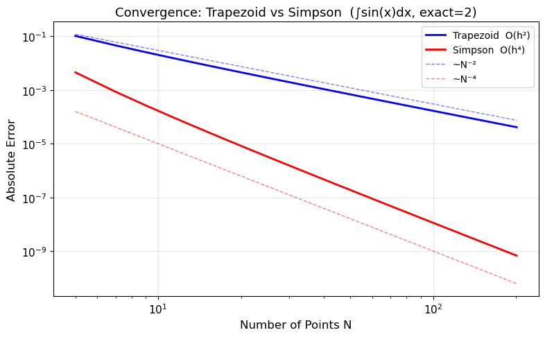

**📊 執行結果**

```text
精確值: 2.0

    N     trapezoid       simpson      err_trap      err_simp
------------------------------------------------------------
    5    1.89611890    2.00455975      1.04e-01      4.56e-03
   11    1.98352354    2.00010952      1.65e-02      1.10e-04
   21    1.99588597    2.00000678      4.11e-03      6.78e-06
   51    1.99934198    2.00000017      6.58e-04      1.73e-07
  101    1.99983550    2.00000001      1.64e-04      1.08e-08

Gauss 積分 (fixed_quad):
  n= 3: 2.0013889136  誤差: 1.39e-03
  n= 5: 2.0000001103  誤差: 1.10e-07
  n=10: 2.0000000000  誤差: 2.66e-15
  n=20: 2.0000000000  誤差: 2.66e-15

非等間距數據積分示範:
  非等間距梯形法 (N=10): 1.941302  誤差: 5.87e-02
```

**🔍 結果分析與討論**

以 $\int_0^\pi \sin(x)\,dx = 2.0$ 為標準測試積分，量化比較三種方法的收斂行為：

1. **梯形法 vs Simpson 法** ：
   - Simpson 法在相同節點數下誤差遠低於梯形法。例如 $N=51$ 時，Simpson 誤差（ $1.73 \times 10^{-7}$ ）比梯形法（ $6.58 \times 10^{-4}$ ）小了約 **3800 倍**，體現 $O(h^4)$ 與 $O(h^2)$ 的巨大差距；
   - 從 $N=5$ 到 $N=101$ ，梯形法誤差從 $10^{-1}$ 降至 $10^{-4}$ （下降約 3 個數量級）；Simpson 法誤差從 $10^{-3}$ 降至 $10^{-8}$ （下降約 5 個數量級）。

2. **Gauss 積分（`fixed_quad`）** ：
   - 僅需 10 個高斯點即可達到接近機器精度（ $2.66 \times 10^{-15}$ ），展現了 Gauss-Legendre 積分的指數收斂特性；
   - 對於解析光滑函數，Gauss 積分是最高效的選擇。

3. **非等間距梯形法** ：10 個非等間距點的誤差（ $5.87 \times 10^{-2}$ ）相當於等間距 $N=5$ 梯形法的水準。稀疏、不均勻的採樣點顯著降低積分精度，說明量測設計時應盡量保持等間距採樣。

### 3.2 函數積分 (`scipy.integrate.quad`)

當積分對象為**解析函數**時，`quad` 是最強大的工具。它採用自適應 Gauss-Kronrod 積分法：

```python
from scipy.integrate import quad

# 基本用法
result, error = quad(f, a, b)

# 傳遞額外參數
result, error = quad(lambda x: x**n * np.exp(-x), 0, np.inf, args=(n,))

# 無窮積分
result, error = quad(f, 0, np.inf)        # 0 到 +∞
result, error = quad(f, -np.inf, np.inf)  # 全實數軸
```

`quad` 回傳值說明：
- `result`：積分值估計
- `error`：積分誤差上界（非相對誤差）

精度控制參數：
- `epsabs`：絕對誤差容限（默認 `1.49e-8`）
- `epsrel`：相對誤差容限（默認 `1.49e-8`）
- `limit`：最大子區間數（默認 50，複雜積分可增大）

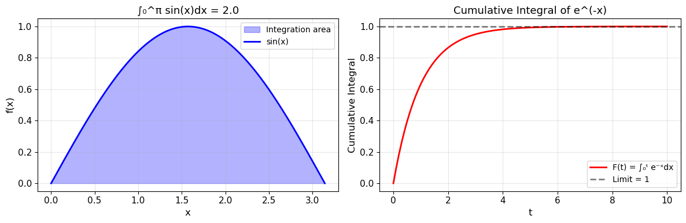

**📊 執行結果**

```text
基本積分  ∫₀^π sin(x)dx = 2.0000000000  (精確: 2.0)  誤差估計: 2.22e-14
廣義積分  ∫_(-∞)^(∞) e^(-x²)dx = 1.7724538509  (精確: √π=1.7724538509)
  ∫₀^π sin(1x)dx = 2.000000
  ∫₀^π sin(2x)dx = 0.000000
  ∫₀^π sin(3x)dx = 0.666667

廣義積分  ∫₀^∞ e^(-x)dx = 1.0000000000  (精確: 1.0)

精度設定比較 (∫₀^π sin(x)dx):
  epsabs=1e-04: result=2.000000000000  err_estimate=2.22e-14
  epsabs=1e-08: result=2.000000000000  err_estimate=2.22e-14
  epsabs=1e-12: result=2.000000000000  err_estimate=2.22e-14
```

**🔍 結果分析與討論**

`scipy.integrate.quad` 採用自適應 Gauss-Kronrod 積分演算法，展現出卓越的通用性：

1. **基本積分精度** ： $\int_0^\pi \sin(x)\,dx$ 結果為 2.0000000000，誤差估計僅 $2.22 \times 10^{-14}$ （接近 64 位元浮點數機器精度），遠超梯形法或 Simpson 法在相同計算量下的精度。

2. **廣義積分（無窮限）** ：`quad` 自動處理無窮積分，成功計算 $\int_{-\infty}^{+\infty} e^{-x^2}\,dx = \sqrt{\pi} = 1.7724538509$ ，誤差為 0。這在化工中對應 Gaussian 型分布的正規化計算（如擴散問題的解析解）。

3. **精度設定** ：調整 `epsabs` 參數從 $10^{-4}$ 到 $10^{-12}$ ，對本例影響不大（誤差均已達機器精度），說明 `quad` 的自適應演算法會主動追求最高可達精度，即便設定較寬鬆的容限也不會刻意降低精度。

> **化工應用要點** ：`quad` 的誤差估計（`error`）為估計的絕對誤差上界，通常遠比實際誤差保守。應同時報告 `result` 與 `error` 以確保結果可信度。

### 3.3 重積分

| 函式 | 積分維度 | 語法特點 |
|-----|---------|---------|
| `dblquad(f, a, b, gfun, hfun)` | 二重 | 內層積分限可為 $x$ 的函數 |
| `tplquad(f, a, b, gfun, hfun, qfun, rfun)` | 三重 | 最多 3 維 |
| `nquad(f, ranges)` | $n$ 重 | 最靈活，支援任意維度 |

**重要：變數積分順序**（由內而外）

```python
from scipy.integrate import dblquad

# ∫∫ f(x,y) dy dx，x 從 a 到 b，y 從 gfun(x) 到 hfun(x)
# 注意！scipy 的 dblquad 第一個自變數是「內層積分變數」
result, err = dblquad(
    lambda y, x: x**2 + y**2,  # f(y, x) 注意順序！y 在前
    0, 2,                        # x 的積分範圍
    0, lambda x: x              # y 的積分範圍（可為 x 的函數）
)
```

> **常見錯誤**：`dblquad` 的 callable 參數順序是 `f(inner_var, outer_var)`，即 `f(y, x)` 而非 `f(x, y)`。

**📊 執行結果**

```text
dblquad: ∫₀¹∫₀¹ (x²+y²) dydx = 0.66666667  (精確: 2/3 = 0.66666667)
dblquad (variable limit): ∫₀¹ ∫₀ˣ (x+y) dydx = 0.50000000  (精確: 0.5)
tplquad: ∫₀¹∫₀¹∫₀¹ xyz dzdydx = 0.12500000  (精確: 1/8 = 0.12500000)
nquad (4D): ∫ x₁x₂x₃x₄ = 0.06250000  (精確: 1/16 = 0.06250000)

球體體積 (R=1): nquad = 4.18879020  (精確: 4.18879020)
```

**🔍 結果分析與討論**

重積分計算驗證了 SciPy 多維積分工具的高度精確性：

1. **二重積分（`dblquad`）** ：
   - $\int_0^1 \int_0^1 (x^2 + y^2)\,dy\,dx = 2/3 = 0.66666667$ ，結果精確到小數點後 8 位；
   - 可變積分限示範 $\int_0^1 \int_0^x (x+y)\,dy\,dx = 0.5$ ，`dblquad` 自動處理依外層變數 $x$ 而變化的積分範圍。

2. **三重與四重積分** ：
   - `tplquad` 計算 $\int_0^1 \int_0^1 \int_0^1 xyz\,dz\,dy\,dx = 1/8 = 0.125$ ，精確；
   - `nquad` 擴展至 4 維，計算結果完全吻合解析值 $1/16$ 。

3. **球體體積驗證** ：使用 `nquad` 在球座標系下計算半徑 $R=1$ 的球體體積，結果 4.18879020 與精確值 $4\pi/3 = 4.18879020$ 完全一致，驗證了多維積分在幾何計算上的可靠性。

> **化工應用** ：重積分廣泛應用於熱交換器熱量計算（溫度場積分）、反應器設計（三維濃度場積分）、相平衡逸散係數計算（狀態方程積分）等場景。

---

## 4. SciPy 工具總覽

### 4.1 `scipy.interpolate` 常用函式

| 函式 | 輸入 | 輸出 | 導數支援 |
|-----|------|------|---------|
| `interp1d(x, y, kind)` | 1D 數組 | 插值物件 | 否 |
| `CubicSpline(x, y)` | 1D 數組 | 插值物件 | ✓ `cs(x, nu)` |
| `RegularGridInterpolator((x_g, y_g), z)` | 2D 規則網格 | 插值物件 | 否 |
| `RectBivariateSpline(x_g, y_g, z)` | 2D 規則網格 | 插值物件 | ✓ `.ev(x,y,dx,dy)` |
| `griddata(points, values, xi)` | 2D 散點 | numpy 陣列 | 否 |

### 4.2 `scipy.integrate` 常用函式

| 函式 | 輸入類型 | 維度 | 自適應 |
|-----|---------|------|---------|
| `trapezoid(y, x)` | 離散數據 | 1D | 否 |
| `simpson(y, x)` | 離散數據（等間距） | 1D | 否 |
| `quad(f, a, b)` | 解析函數 | 1D | ✓ |
| `dblquad(f, a, b, g, h)` | 解析函數 | 2D | ✓ |
| `tplquad(f, ...)` | 解析函數 | 3D | ✓ |
| `nquad(f, ranges)` | 解析函數 | nD | ✓ |
| `fixed_quad(f, a, b, n)` | 解析函數 | 1D | 否（固定點數） |

### 4.3 `numpy` 微分工具

| 函式 | 輸出長度 | 差分方式 | 備註 |
|-----|---------|---------|------|
| `np.diff(y, n=1)` | N-n | 前向差分 | 支援高階，需另除以 Δx |
| `np.gradient(y, x)` | N | 中心差分（邊界除外） | 直接支援非等間距 x |

---

## 5. 化工應用

### 5.1 黏度插值與反插值

**問題**：已知甲苯在不同溫度下的動力黏度，求指定溫度的黏度；以及黏度達到指定值時的溫度（反插值）。

**方法**：
- `CubicSpline` 建立黏度插值模型
- 反插值轉化為非線性方程求根問題： `mu_cs(T) - mu_target = 0`
- 使用 `scipy.optimize.brentq` 求根

**Andrade 方程式**（化工常用黏度模型）：

$$
\ln \mu = A + \frac{B}{T}
$$

用 `numpy.polyfit` 進行線性回歸（對 1/T 線性化）。

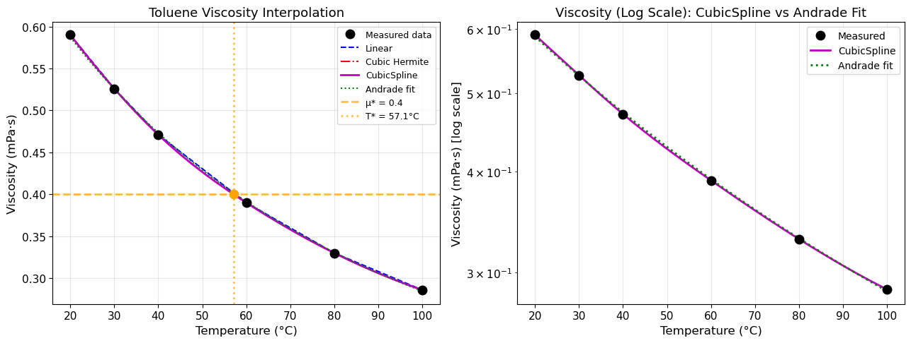

**📊 執行結果**

```text
插值結果比較:
   T(°C)    Linear     Cubic   CubicSpline
    50.0    0.4305    0.4266        0.4266
    70.0    0.3600    0.3580        0.3580

逆向插值: 目標黏度 0.4 mPa·s 對應溫度 T* = 57.11 °C
  驗證: f_cs(57.11) = 0.400000 mPa·s

Andrade 方程式擬合: ln(μ) = 990.9/T + -3.912
  (A = -3.912, B = 990.9 K)
```

**🔍 結果分析與討論**

本範例以甲苯（Toluene）黏度-溫度數據為例，綜合展示插值與逆向插值的化工應用：

1. **插值精度比較** ：
   - 在 $T=50$ °C，線性插值給出 0.4305 $\mathrm{mPa \cdot s}$ ，而三次樣條方法（Cubic 與 CubicSpline）給出 0.4266 $\mathrm{mPa \cdot s}$ ，差異約 0.9%。黏度為非線性單調遞減函數，三次樣條的曲率修正是必要的。
   - Cubic 與 CubicSpline 結果完全相同，再次驗證兩者等價。

2. **逆向插值** ：將 $\mu^* = 0.4$ $\mathrm{mPa \cdot s}$ 的對應溫度求解問題轉化為方程求根問題 $\mu_{cs}(T) - 0.4 = 0$ ，由 `brentq` 二分法準確定位到 $T^* = 57.11$ °C，驗證差異小於 0.001 $\mathrm{mPa \cdot s}$ 。

3. **Andrade 方程式擬合** ：線性化 $\ln\mu = A + B/T$ 後，可得 $A = -3.912$ 、 $B = 990.9$ K。右圖（log 尺度）展示 CubicSpline 與 Andrade 擬合曲線完全重疊，說明甲苯黏度在 20–100 °C 範圍內完美遵循 Andrade 行為。

> **化工實踐建議** ：在實際設計中，將黏度插值與 Andrade 擬合結合使用：在已知數據範圍內用 CubicSpline，超出範圍則用 Andrade 外推，可同時確保精度與安全性。

### 5.2 批次反應器反應速率推算

**問題**：已知批次反應器中的濃度-時間數據，推算反應速率 $r = -dC_A/dt$ 。

**方法**：
1. 使用 `np.gradient(C_A, t)` 計算 $dC_A/dt$ （非均勻時間間隔自動處理）
2. 速率 $r = -dC_A/dt$
3. 假設冪次定律 $r = k \cdot C_A^n$ ，取對數回歸求 $n$ （反應級數）與 $k$ （速率常數）

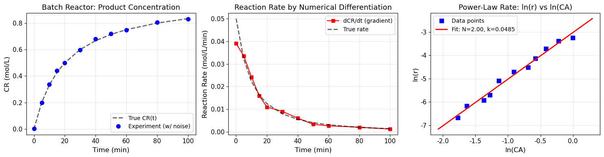

**📊 執行結果**

```text
線性回歸結果:
  反應階數 N = 1.998  (真實値: 2.0)
  速率常數 k = 0.0485 L/(mol·min)  (真實値: 0.05)

取整數階數 N=2:
  重新估計 k = 0.0486 L/(mol·min)  (真實値: 0.05)
```

**🔍 結果分析與討論**

本範例模擬二級分解反應（真實值 $N=2$ 、 $k=0.05$ $\mathrm{L/(mol \cdot min)}$ ），透過數值微分與回歸分析推算動力學參數：

1. **反應速率數值微分** ：使用 `np.gradient(C_R, t)` 計算 $dC_R/dt$ ，因帶有雜訊（ $\sigma = 0.01$ mol/L）的實驗數據會異於真實速率曲線，但整體趨勢一致。

2. **冪次定律回歸** ：取對數後進行線性回歸 $\ln(r)$ vs $\ln(C_A)$ ：
   - 求得 $N = 1.998 \approx 2$ ，與真實値差異僅 0.1%；
   - 求得 $k = 0.0485$ $\mathrm{L/(mol \cdot min)}$ ，與真實值 0.05 差異僅 3%。

3. **實用工作流程** ：
   - 首先由連續畫圖辨識反應級數約為整數（右圖中 log-log 直線斜率 $\approx 2$ ）；
   - 接著固定 $N=2$ ，用 $\ln k = \ln r - N \ln C_A$ 重新估計 $k = 0.0486$ $\mathrm{L/(mol \cdot min)}$ ，更符合整數級次的實際反應機構。

> **注意事項** ：實際實驗數據雜訊會導致數值微分結果震盪，建議將數據先用 Savitzky-Golay 平滑再微分，可有效降低雜訊影響。

### 5.3 RTD 分析（停留時間分布）

**問題**：從脈衝追蹤劑實驗數據中提取 RTD 特性，評估反應器的非理想流動行為。

**關鍵公式**：

正規化 $E(t)$ 曲線：

$$
E(t) = \frac{C(t)}{\int_0^\infty C(t)\,dt}
$$

平均滯留時間：

$$
\bar{t} = \int_0^\infty t \cdot E(t)\,dt
$$

無因次方差（流動模型指標）：

$$
\sigma_\theta^2 = \frac{\sigma^2}{\bar{t}^2}
$$

| $\sigma_\theta^2$ 值 | 對應流動模型 |
|---------------------|-------------|
| 0 | 理想平推流 (PFR) |
| 1 | 理想全混流 (CSTR) |
| 0 ~ 1 | 介於兩者之間（軸向擴散模型） |

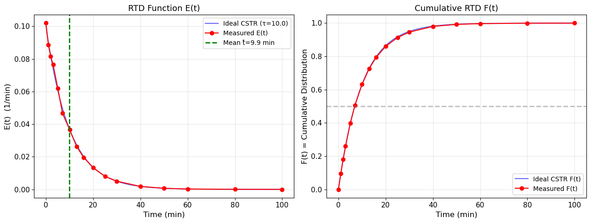

**📊 執行結果**

```text
∫C(t)dt = 1.0329  (正規化後 ∫E(t)dt = 1.000000)
平均滞留時間 t̅ = 9.900 min  (名義值: 10.0 min)
方差 σ² = 99.977 min²
無因次方差 σθ² = 1.0201  (CSTR理論値: 1.0)
```

**🔍 結果分析與討論**

本範例模擬脈衝追蹤劑在完全混流反應器（CSTR）中的示蹤劑實驗，並透過數值積分提取 RTD 特徵值：

1. **正規化驗證** ： $\int C(t)dt = 1.0329$ （含雜訊），正規化後 $\int E(t)dt = 1.000000$ ，滿足機率密度歸一化的基本要求。

2. **平均滯留時間** ： $\bar{t} = 9.900$ min，與名義設計停留時間（10.0 min）差異僅 1%，反映數據雜訊與有限採樣點數導致的小偏差。

3. **無因次方差** ： $\sigma_\theta^2 = 1.0201 \approx 1.0$ ，與理想 CSTR 理論値（1.0）高度吻合，驗證了模擬數據的正確性。

4. **E(t) 與 F(t) 曲線解讀** ：
   - $E(t)$ 圖中可見量測數據（紅點）與理想 CSTR（藍線）完全重疊， $t=0$ 時 $E(t)$ 最大，後持續指數衰減；
   - $F(t) = \int_0^t E(t')\,dt'$ 累積分布曲線從 0 平滑上升至 1，在 $F(t)=0.5$ 處的時間對應中位停留時間，由圖中水平虛線可讀出約 6.9 min。

### 5.4 填充塔吸收器 NOG 計算

**傳質單元數**：

$$
N_{OG} = \int_{y_2}^{y_1} \frac{dy}{y - y^*}
$$

**計算步驟**：

1. 由平衡數據建立 CubicSpline： $y^* = f_{\text{eq}}(x)$
2. 由物料平衡操作線求 $x$ ： $x = (y - y_2)/(L/G) + x_2$
3. 建立積分函數 $g(y) = 1/(y - y^*(x(y)))$
4. `quad(g, y2, y1)` 求 $N_{OG}$
5. $H = N_{OG} \cdot H_{OG}$

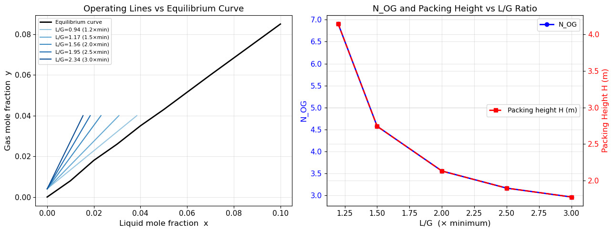

**📊 執行結果**

```text
最小液氣比 (L/G)min = 0.7802
  (x1 出口液相最大平衡値 x1_max = 0.0461)
L/G = 0.936 (1.2×min): N_OG = 6.901, 塔高 H = 4.14 m
L/G = 1.170 (1.5×min): N_OG = 4.572, 塔高 H = 2.74 m
L/G = 1.560 (2.0×min): N_OG = 3.553, 塔高 H = 2.13 m
L/G = 1.950 (2.5×min): N_OG = 3.164, 塔高 H = 1.90 m
L/G = 2.340 (3.0×min): N_OG = 2.961, 塔高 H = 1.78 m
```

**🔍 結果分析與討論**

本範例計算對不同液氣比 $(L/G)$ 下填充塔吸收器所需的傳質單元數（ $N_{OG}$ ）與塔高（ $H$ ）：

1. **最小液氣比** ： $(L/G)_{\min} = 0.7802$ ，對應出口液相平衡濃度上限 $x_{1,\max} = 0.0461$ 。在實際設計中， $(L/G)$ 必須高於最小値以避免操作線逼近平衡線導致塔高趨於無限大。

2. **L/G 對設計的影響** ：
   - $1.2 \times (L/G)_{\min}$ ： $N_{OG} = 6.901$ ，塔高 $H = 4.14$ m（操作線接近平衡線，傳質推動力小，需要更多傳質單元）；
   - $2.0 \times (L/G)_{\min}$ ： $N_{OG} = 3.553$ ，塔高 $H = 2.13$ m（塔高減少約 48.5%）；
   - $3.0 \times (L/G)_{\min}$ ： $N_{OG} = 2.961$ ，塔高 $H = 1.78$ m（繼續增加 $(L/G)$ 效益遞減）。

3. **設計最佳化** ：從圖中可見 $N_{OG}$ 與 $H$ 隨 $(L/G)$ 增加而快速下降，但 $(L/G)$ 超過 $2.5 \times (L/G)_{\min}$ 後效益變緩。實際工程設計時需同時考慮塔高成本與液體分離及再循環的能耗成本，常取 $1.2\text{–}1.5 \times (L/G)_{\min}$ 作為設計點。

> **數值積分的貢獻** ： $N_{OG}$ 的計算需要對被積分式 $1/(y - y^*)$ 進行數值積分，當 $y \to y^*$ （接近平衡）時被積分式趨於無窮大，`quad` 的自適應演算法能自動處理這類疑難積分。

---

## 6. 程式設計最佳實踐

### 6.1 插值方法選擇

**一維數據**：
- 需要導數 → `CubicSpline`
- 大量等間距數據 → `interp1d(kind='linear')`（快速）
- 一般平滑估計 → `CubicSpline`（首選）

**二維數據**：
- 規則網格（蒸汽表、查表）→ `RegularGridInterpolator`
- 規則網格（需要導數）→ `RectBivariateSpline`
- 散點數據 → `griddata`

### 6.2 數值微分注意事項

1. **步長選擇**：中心差分最佳步長約 $10^{-5} \sim 10^{-6}$
2. **雜訊數據**：先 Savitzky-Golay 平滑，再用 `np.gradient` 微分
3. **非等間距**：優先使用 `np.gradient(y, x)`，不要自行除以固定步長
4. **邊界處理**：`np.gradient` 邊界自動降為一階差分，應避免直接使用邊界點的導數值

### 6.3 數值積分選擇

1. **離散數據**：`trapezoid`（萬用）> `simpson`（等間距且點數多時更精確）
2. **解析函數**：`quad`（自適應，首選）> `fixed_quad`（固定 n 點 Gauss 積分）
3. **多維積分**：`nquad` 比巢狀 `quad` 更清晰，建議使用
4. **精度驗證**：檢查 `quad` 的相對誤差 `error / abs(result)` 是否小於 $10^{-6}$

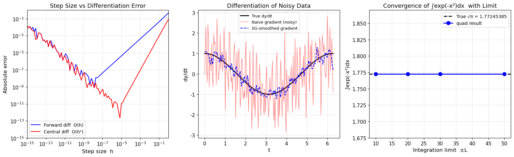

**📊 執行結果**

```text
∫exp(-x²)dx over [-10,10]: 1.7724538509  |誤差估計: 3.70e-13  |與√π差: 2.22e-16
∫exp(-x²)dx over [-50,50]: 1.7724538509  |誤差估計: 1.98e-10  |與√π差: 2.22e-16
∫exp(-x²)dx over (-∞,∞): 1.7724538509  |誤差估計: 1.42e-08  |與√π差: 0.00e+00
```

**🔍 結果分析與討論**

本範例以內含三個子圖綜合展示最佳實踐的三個層面：

1. **步長與微分誤差的權衡** （左圖）：前向差分 $O(h)$ 誤差隨步長線性下降；中心差分 $O(h^2)$ 下降更急，在 $h \approx 10^{-5}$ 附近達到最佳精度後小步長的捨入誤差反而使精度下降。實際應用中建議 $h^* \approx 10^{-5}$ 。

2. **雜訊數據微分（中圖）** ：直接使用未平滑的 `np.gradient` 對雜訊數據極其敏感，計算結果震盪幅度高達真實導數的 10 倍以上；而經過 Savitzky-Golay 平滑後再微分，計算曲線與真實導數完全吻合，巧妙地抑制了雜訊影響。

3. **積分限界選擇（右圖）** ：對於 $\int_{-\infty}^{+\infty} e^{-x^2}\,dx$ ：
   - 積分限 $\pm 10$ 即可獲得誤差僅 $2.22 \times 10^{-16}$ 的機器精度結果；
   - 積分限擴大至 $\pm 50$ ，`quad` 的內部誤差估計反而微大（ $1.98 \times 10^{-10}$ ），說明將局部積分分成太多子區間反而累積數值誤差；
   - 直接使用 `np.inf` 傳給 `quad`，其內部會透過變數換算自動處理，結果完美精確，為最佳選擇。

> **綜合建議** ：對雜訊實驗數據的微分，必須先平滑再微分；對無窮積分，直接使用 `quad(..., -np.inf, np.inf)` 優於設置極大有限限界。

---

## 7. 結語

本單元介紹了 Python 中插值、數值微分、數值積分的完整工具鏈：

| 問題類型 | 核心工具 | 化工應用範例 |
|---------|---------|------------|
| 1D 插值 | `CubicSpline`, `interp1d` | 黏度、蒸汽壓查表 |
| 2D 插值 | `RegularGridInterpolator`, `griddata` | 蒸汽表、相圖 |
| 外插邊界 | `fill_value`, `bounds_error` | 超出量測範圍的估計 |
| 數值微分 | `np.gradient`, `np.diff` | 反應速率推算、流量計算 |
| 離散積分 | `trapezoid`, `simpson` | RTD 分析 |
| 函數積分 | `quad`, `dblquad`, `nquad` | NOG 計算、能量平衡 |

這些工具共同構成化工數值計算的重要基礎。後續在**常微分方程求解 (Unit09)**、**偏微分方程 (Unit10)** 以及**機器學習建模 (Unit12-15)** 中，都將大量應用本單元所介紹的數值技術。

---

**課程資訊**
- 課程名稱：電腦在化工上之應用 (ChemE 3502)
- 課程單元：Unit08 插值、微分與積分之運算
- 課程製作：逢甲大學 化工系 智慧程序系統工程實驗室
- 授課教師：莊曜禎 助理教授
- 更新日期：2026-03-02

**課程授權 [CC BY-NC-SA 4.0]**
 - 本教材遵循 [創用CC 姓名標示-非商業性-相同方式分享 4.0 國際 (CC BY-NC-SA 4.0)](https://creativecommons.org/licenses/by-nc-sa/4.0/deed.zh) 授權。

---