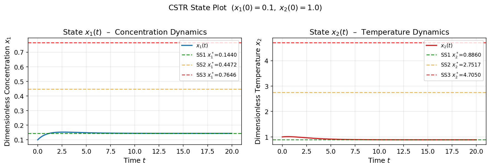
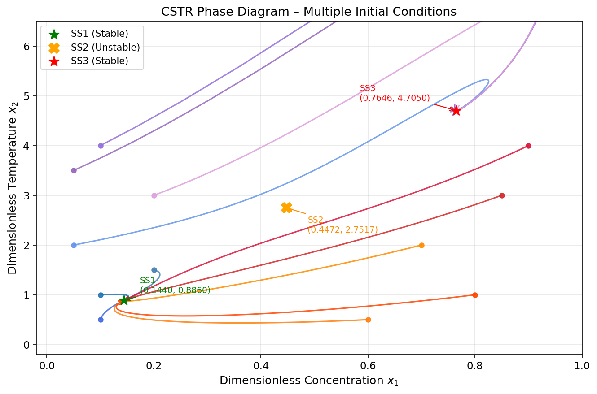
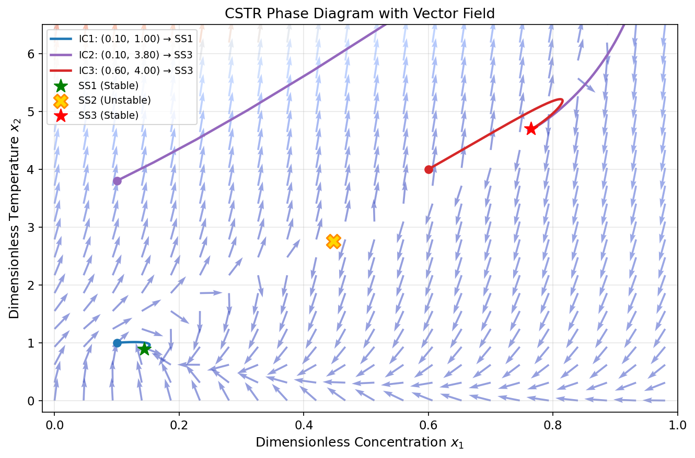
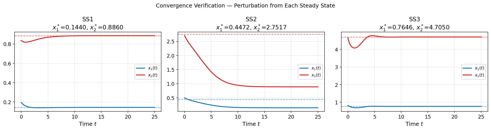

# Unit09 Example 01 - CSTR 反應器動態模擬

## 學習目標

本範例以**連續攪拌槽反應器（CSTR）** 的無因次動態方程式為例，介紹如何使用 `scipy.integrate.solve_ivp()` 搭配 `method='RK45'` 求解多變數初值問題（IVP），並透過相圖（Phase Diagram）分析多重穩態的穩定性。

學習完本範例後，您將能夠：

- 建立 CSTR 無因次濃度與溫度**雙狀態動態方程式**
- 以 `solve_ivp(method='RK45')` 求解**多變數 IVP ODE**（非剛性問題）
- 探討**不同初始條件**對系統動態軌跡及最終穩態的影響
- 繪製**狀態時間圖（State Plot）**與**相圖（Phase Diagram）**
- 利用向量場（Vector Field）理解相平面上的流向
- 驗證 ODE 動態求解與 Unit07 非線性穩態分析結果的一致性

---

## 1. 問題描述

### 1.1 化工背景

**連續攪拌槽反應器（CSTR，Continuously Stirred Tank Reactor）** 是化工製程中最基本的反應器型式之一。在理想混合假設下，其動態行為由**質量平衡**與**能量平衡**耦合方程式決定。

當反應為**放熱反應**且冷卻不足時，CSTR 可能同時存在**三個穩態（Multiple Steady States）**，系統的最終狀態取決於初始條件（歷史路徑）：

- **低溫穩態（SS1）**：轉化率低，反應幾乎未點火
- **中間穩態（SS2）**：數學上存在，但**物理不穩定**，任何擾動都會使系統偏離
- **高溫穩態（SS3）**：轉化率高，反應充分進行

此現象在工業操作中至關重要——若操作條件落在多重穩態區域，系統行為形成**遲滯現象（Hysteresis）**。

> **文獻來源：** Ray, W. H. (1981). *Advanced Chemical Reactor Design*. Wiley, New York.

---

### 1.2 系統設定

| 參數 | 符號 | 數值 | 物理意義 |
|------|------|------|---------|
| 無因次反應熱 | $B$ | 8.0 | 放熱強度 |
| Damköhler 數 | $Da$ | 0.072 | 反應速率 vs. 流量 |
| 無因次活化能 | $\varphi$ | 20.0 | Arrhenius 溫度敏感性 |
| 無因次冷卻係數 | $\beta$ | 0.3 | 冷卻強度 |
| 外部輸入 | $u$ | 0.0 | 無外部干擾（自治系統）|

---

## 2. 數學模型

### 2.1 無因次動態方程式

以無因次轉化率 $x_1 \in [0,1)$ 與無因次溫升 $x_2 \geq 0$ 為狀態變數，動態方程式（IVP ODE）為：

$$
\frac{dx_1}{dt} = -x_1 + Da\,(1-x_1)\,\exp\!\left(\frac{x_2}{1+x_2/\varphi}\right)
$$

$$
\frac{dx_2}{dt} = -(1+\beta)\,x_2 + B\,Da\,(1-x_1)\,\exp\!\left(\frac{x_2}{1+x_2/\varphi}\right) + \beta\,u
$$

其中反應速率項：

$$
r(x_2) = \exp\!\left(\frac{x_2}{1+x_2/\varphi}\right)
$$

為無因次 Arrhenius 速率。

### 2.2 方程式物理意義

| 項目 | 方程式項 | 物理意義 |
|------|---------|---------|
| 濃度方程 | $-x_1$ | 進料稀釋（流出項）|
| 濃度方程 | $Da\,(1-x_1)\,r(x_2)$ | 反應消耗（濃度變化）|
| 溫度方程 | $-(1+\beta)\,x_2$ | 流出散熱 + 冷卻散熱 |
| 溫度方程 | $B\,Da\,(1-x_1)\,r(x_2)$ | 反應放熱（溫升）|
| 溫度方程 | $\beta\,u$ | 冷卻水進料項（本例 $u=0$）|

### 2.3 三個穩態點

令 $dx_1/dt=0$，$dx_2/dt=0$，三組數值解為：

| 穩態 | $x_1^*$（無因次濃度）| $x_2^*$（無因次溫升）| 穩定性 |
|------|---------|---------|---------|
| SS1（低溫穩態）| 0.1440 | 0.8860 | 穩定（Stable Node）|
| SS2（中間穩態）| 0.4472 | 2.7517 | **不穩定（Saddle Point）**|
| SS3（高溫穩態）| 0.7646 | 4.7050 | 穩定（Stable Node）|

三個穩態滿足 $x_2^* / x_1^* \approx B/(1+\beta) = 8/1.3 \approx 6.154$，均落於同一直線上。

---

## 3. Python 實作

### 3.1 環境設定與套件載入

```python
from pathlib import Path
import os
from scipy.integrate import solve_ivp
from scipy.optimize import fsolve
import numpy as np
import matplotlib.pyplot as plt
```

> 本範例主要使用 `scipy.integrate.solve_ivp` 求解 IVP ODE，以及 `scipy.optimize.fsolve` 驗證穩態。

**執行輸出：**

```
✓ 套件載入完成
  numpy      版本: 1.23.5
  scipy      版本: 1.15.2
  matplotlib 版本: 3.10.8
```

---

### 3.2 CSTR 動態方程式定義

CSTR 的 ODE 以函數 `cstr_ode(t, x, ...)` 定義，參數以關鍵字參數傳入：

```python
def cstr_ode(t, x, Da=0.072, phi=20.0, B=8.0, beta=0.3, u=0.0):
    x1, x2 = x
    r = np.exp(x2 / (1.0 + x2 / phi))          # 無因次 Arrhenius 速率
    dx1 = -x1 + Da * (1.0 - x1) * r
    dx2 = -(1.0 + beta) * x2 + B * Da * (1.0 - x1) * r + beta * u
    return [dx1, dx2]
```

**設計要點：**
- 函數簽名遵循 `solve_ivp` 要求：`f(t, y)`，其餘參數可用預設值或透過 `args` 傳入
- 回傳 `[dx1/dt, dx2/dt]` 的列表（list）形式，與輸入 `x` 長度一致
- 使用 `np.exp()` 確保向量化運算正確性

**執行輸出：**

```
CSTR 模型參數：
  Da=0.072, phi=20.0, B=8.0, beta=0.3, u=0.0

三個穩態點：
  SS1 (穩定)  : x1*=0.1440, x2*=0.8860
  SS2 (不穩定): x1*=0.4472, x2*=2.7517
  SS3 (穩定)  : x1*=0.7646, x2*=4.7050
```

---

### 3.3 單一初始值模擬（RK45 求解）

```python
sol = solve_ivp(
    fun=cstr_ode,
    t_span=(0, 20),
    y0=[0.1, 1.0],           # 初始條件 x1(0)=0.1, x2(0)=1.0
    method='RK45',
    t_eval=np.linspace(0, 20, 500),
    rtol=1e-8,
    atol=1e-10
)
```

**`solve_ivp` 主要參數說明：**

| 參數 | 說明 |
|------|------|
| `fun` | ODE 右端函數，簽名需為 `f(t, y)` |
| `t_span` | 積分區間 `(t0, tf)` |
| `y0` | 初始條件向量（長度 = 狀態維度）|
| `method` | 數值方法，`'RK45'` 為 4/5 階 Dormand-Prince 自適應步長 |
| `t_eval` | 指定輸出時間點（不指定則自動選取）|
| `rtol`, `atol` | 相對/絕對誤差容忍度 |

求解結果儲存於 `sol` 物件：
- `sol.t` — 時間陣列，形狀 `(N,)`
- `sol.y` — 狀態陣列，形狀 `(2, N)`，`sol.y[0]` 為 $x_1(t)$，`sol.y[1]` 為 $x_2(t)$

---

### 3.4 相圖繪製（多初始值）

```python
for x1_0, x2_0, color in initial_conditions:
    sol = solve_ivp(cstr_ode, (0, 30), [x1_0, x2_0], method='RK45',
                    t_eval=np.linspace(0, 30, 800), rtol=1e-8, atol=1e-10)
    ax.plot(sol.y[0], sol.y[1], color=color)   # 相圖軌跡
```

**相圖繪製要點：**
- 橫軸 `sol.y[0]`（$x_1$）、縱軸 `sol.y[1]`（$x_2$）— 不使用時間軸
- 每條軌跡代表一組初始條件下的系統路徑
- 起點以圓點標記，軌跡中間段加箭頭顯示流向

---

### 3.5 向量場疊加（`quiver`）

```python
x1_g = np.linspace(0.0, 0.98, 22)
x2_g = np.linspace(0.0, 6.5,  22)
X1, X2 = np.meshgrid(x1_g, x2_g)

for i, j:
    dxdt = cstr_ode(0, [X1[i,j], X2[i,j]])
    U[i,j], V[i,j] = dxdt[0], dxdt[1]

N = np.sqrt(U**2 + V**2)
ax.quiver(X1, X2, U/N, V/N, N, cmap='coolwarm', alpha=0.55)
```

向量長度**正規化**後，箭頭只顯示**方向**，顏色深淺代表原始向量大小（速率快慢）。

---

### 3.6 穩態驗證（`fsolve`）

```python
def cstr_steady_state(x):
    return cstr_ode(0, x)   # 令 dx/dt = 0

xs, info, ier, msg = fsolve(cstr_steady_state, [0.10, 0.80], full_output=True)
```

從三個不同初始猜值出發，`fsolve` 分別收斂至三個穩態解，與已知 Unit07 結果比對殘差。

---

## 4. 執行結果

### 4.1 單一初始值：狀態時間圖

**初始條件：** $x_1(0)=0.1$，$x_2(0)=1.0$（靠近 SS1 低溫穩態附近）

**執行輸出：**

```
solver status : 0  (The solver successfully reached the end of the integration interval.)
time steps    : 500
final state   : x1=0.1440, x2=0.8860
```



**結果分析：**

- $x_1(t)$（左圖）：從初始值 0.1 出發，經過短暫暫態後快速收斂至 SS1 的 $x_1^*=0.1440$，約在 $t=5$ 附近達到穩定
- $x_2(t)$（右圖）：從初始溫升 1.0 出發，同樣收斂至 SS1 的 $x_2^*=0.8860$，呈單調下降趨勢
- 虛線標示三個穩態值，可直觀觀察系統最終落在哪一個穩態
- 由於初始條件接近 SS1 的吸引盆（Basin of Attraction），系統穩定至低溫穩態，SS3（高溫穩態）未被激活

---

### 4.2 多初始值相圖

從 12 組不同初始條件出發，繪製相平面上的系統軌跡：



**結果分析：**

- **藍色系軌跡**：初始條件位於左下方（低 $x_1$，低 $x_2$），系統軌跡收斂至 **SS1**（綠色五角星）
- **橘/紅色系軌跡**：初始條件位於右側（高 $x_1$）或左上方（高 $x_2$），系統軌跡收斂至 **SS3**（紅色五角星）
- **SS2**（橘色 X）：無任何軌跡向其收斂，所有從附近出發的軌跡均迅速遠離 → 確認為**不穩定鞍點**
- 相圖中可觀察到隱性的**分隔曲線（Separatrix）**，位於約 $x_2 \approx 3.0 \sim 3.5$（低 $x_1$ 區域），區隔兩個吸引盆

---

### 4.3 向量場疊加相圖

以 `quiver` 繪製相平面上的向量場，箭頭方向代表系統狀態的即時速率方向：



**結果分析：**

- 向量場（背景箭頭）清楚顯示相平面各點的「流向」，冷暖色調代表速率快慢（暖色 = 快）
- **藍色軌跡** `IC1 (0.10, 1.00)`：從左下角出發，沿向量場流向 SS1（低溫穩態）
- **紫色軌跡** `IC2 (0.10, 3.80)`：跨越分隔線從左上方出發，沿向量場流向 SS3（高溫穩態）
- **紅色軌跡** `IC3 (0.60, 4.00)`：從中間高溫區出發，沿向量場直接流向 SS3
- SS2 附近的向量場顯示典型**鞍點（Saddle）** 特徵：沿穩定流形（Stable Manifold）收斂、沿不穩定流形（Unstable Manifold）發散

---

### 4.4 穩定性驗證：擾動後的收斂行為

從每個穩態附近（加入 $+0.05/-0.05$ 擾動）出發，觀察動態響應：

**執行輸出（`fsolve` 穩態數值求解）：**

```
====================================================
穩態數值求解（fsolve）驗證
====================================================

SS1 (預期穩定)
  初始猜值: x1=0.10, x2=0.80
  求解結果: x1*=0.1440, x2*=0.8860  ✓
  殘差最大值: 2.78e-17
  與 Unit07 結果誤差: 4.6529e-05

SS2 (預期不穩定)
  初始猜值: x1=0.45, x2=2.70
  求解結果: x1*=0.4472, x2*=2.7517  ✓
  殘差最大值: 0.00e+00
  與 Unit07 結果誤差: 6.2524e-05

SS3 (預期穩定)
  初始猜值: x1=0.75, x2=4.70
  求解結果: x1*=0.7646, x2*=4.7050  ✓
  殘差最大值: 1.78e-15
  與 Unit07 結果誤差: 3.9490e-05
```



**結果分析：**

- **SS1（左圖）**：受擾動後，$x_1(t)$ 與 $x_2(t)$ 均快速回歸至穩態值（黑色虛線），收斂時間 $\approx t=8$，確認為**穩定節點**
- **SS2（中圖）**：受擾動後，系統**不再回到 SS2**，而是偏離至 SS1 或 SS3（取決於擾動方向），確認為**不穩定鞍點**
- **SS3（右圖）**：受擾動後快速回歸至高溫穩態，確認為**穩定節點**

| 穩態 | 求解結果 $x_1^*$ | 求解結果 $x_2^*$ | Unit07 結果誤差 | 動態驗證 |
|------|---------|---------|---------|---------|
| SS1 | 0.1440 | 0.8860 | $4.65 \times 10^{-5}$ | 穩定收斂 ✓ |
| SS2 | 0.4472 | 2.7517 | $6.25 \times 10^{-5}$ | 不穩定發散 ✓ |
| SS3 | 0.7646 | 4.7050 | $3.95 \times 10^{-5}$ | 穩定收斂 ✓ |

---

## 5. 工程討論與課程總結

### 5.1 學習重點回顧

| 主題 | 說明 |
|------|------|
| **多變數 IVP ODE** | CSTR 由兩個耦合 ODE 組成，向量型回傳 `[dx1/dt, dx2/dt]` |
| **RK45 方法** | 自適應步長 4/5 階 Runge-Kutta，適用於非剛性（non-stiff）問題 |
| **初始條件影響** | 不同 IC 決定系統收斂至哪個穩態 → 多重穩態的歷史依賴性 |
| **相圖分析** | 在 $(x_1, x_2)$ 相平面上可視化吸引盆（Basin of Attraction）邊界 |
| **向量場** | `quiver` 視覺化即時流向，輔助理解穩定/不穩定特性 |
| **穩態驗證交叉確認** | ODE 動態解最終值 = `fsolve` 靜態求解值（Unit07）|

### 5.2 物理意義

- **SS1（低溫穩態）**：進料條件不足以點火，轉化率低（ $x_1^* \approx 0.14$ ），適合安全但低效率操作
- **SS2（不穩定態）**：在工業操作中無法維持，是兩個穩定態之間的「分水嶺」
- **SS3（高溫穩態）**：反應充分進行，轉化率高（ $x_1^* \approx 0.76$ ），但溫升大（ $x_2^* \approx 4.7$ ），需注意熱管理與安全

### 5.3 延伸思考

1. 若加入外部輸入 $u \neq 0$（如升/降溫冷卻水），系統動態行為如何改變？（→ 參考 CSTR 範例 4.2）
2. 如何用 **Jacobian 矩陣特徵值**定量判斷各穩態的穩定性？（→ 參考 Unit07_Example_04 §3）
3. **S 形分岔圖（Bifurcation Diagram）** 如何描述系統隨 $Da$ 變化的多重穩態轉移，識別點火/熄滅臨界值？（→ 參考 Unit07_Example_04 §5）

---

**課程資訊**
- 課程名稱：化工計算方法與應用（ChemE-3502）
- 課程單元：Unit09 Example 01 — CSTR 反應器動態模擬
- 課程製作：逢甲大學 化工系 智慧程序系統工程實驗室
- 授課教師：莊曜禎 助理教授
- 更新日期：2026-02-21

**課程授權 [CC BY-NC-SA 4.0]**
 - 本教材遵循 [創用CC 姓名標示-非商業性-相同方式分享 4.0 國際 (CC BY-NC-SA 4.0)](https://creativecommons.org/licenses/by-nc-sa/4.0/deed.zh) 授權。

---
