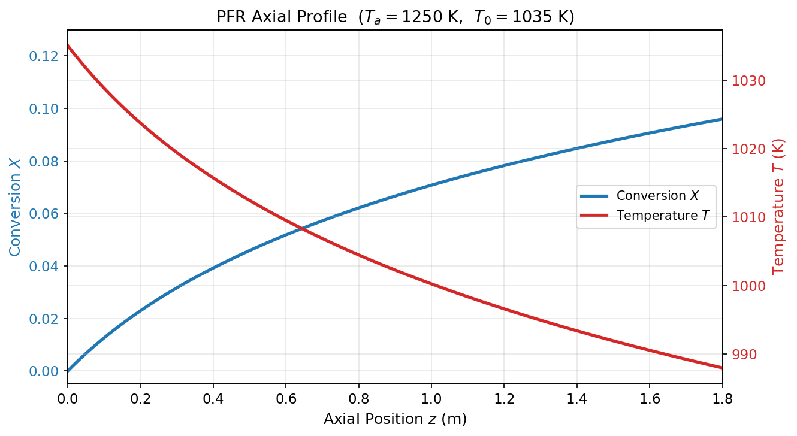
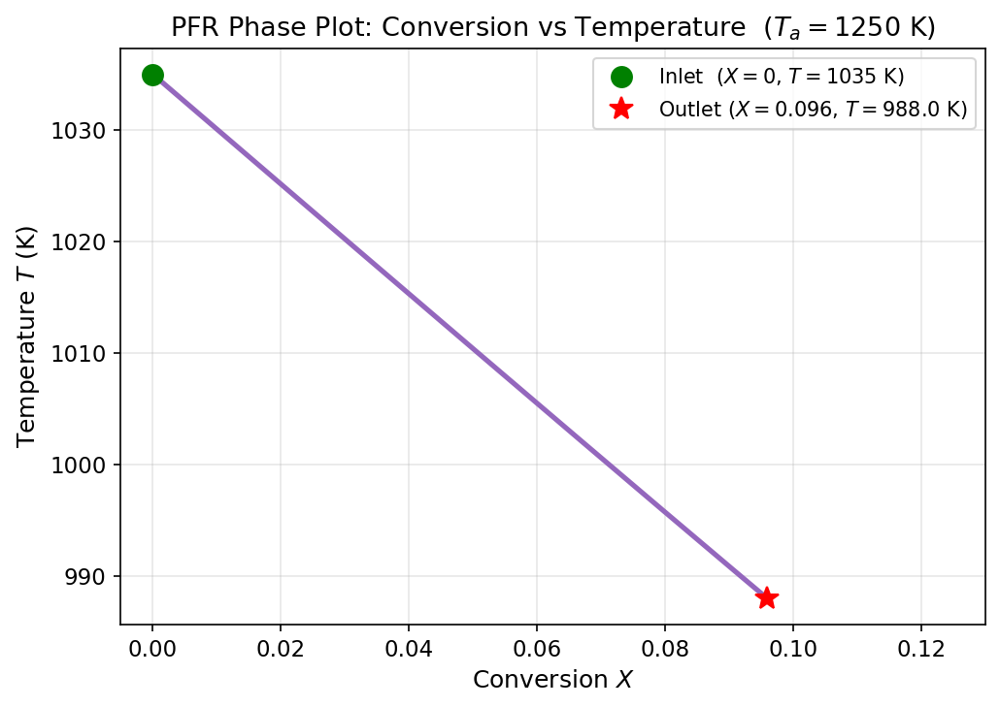
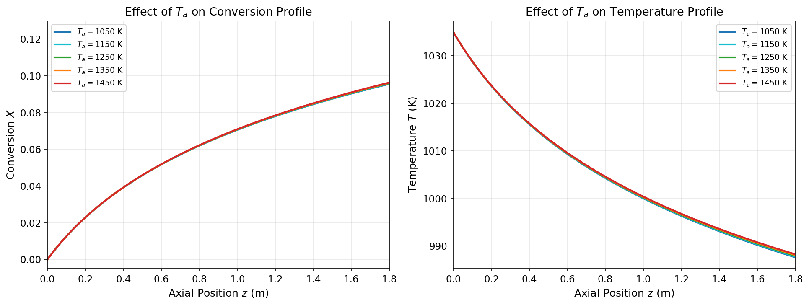
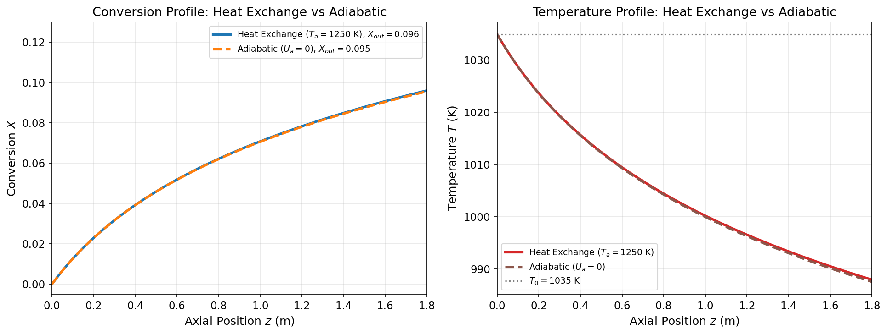

# Unit09 Example 02 - 非恆溫柱塞型反應器（PFR）溫度與轉化率分布

## 學習目標

本範例以**丙酮氣相裂解反應**在非恆溫柱塞型反應器（PFR）中的動態行為為例，介紹如何使用 `scipy.integrate.solve_ivp()` 搭配 `method='RK45'` 求解**以空間（反應器體積）為獨立變數**的多變數 IVP ODE，並分析外部熱交換對反應器性能的影響。

學習完本範例後，您將能夠：

- 建立 PFR **物料平衡與能量平衡**之耦合常微分方程式（以體積 $V$ 為獨立變數）
- 考慮氣相反應中**莫耳數變化與溫度對濃度的影響**（體積膨脹修正）
- 以 `solve_ivp(method='RK45')` 求解以**空間座標為獨立變數**的多變數 IVP
- 繪製轉化率 $X(V)$ 與溫度 $T(V)$ 沿反應器**軸向分布圖**及相圖
- 探討外部熱交換溫度 $T_a$ 對出口轉化率與溫度分布的**敏感度**
- 比較**有熱交換**與**絕熱操作**條件下的反應器性能差異

---

## 1. 問題描述

### 1.1 化工背景

**柱塞型反應器（PFR，Plug Flow Reactor）** 是化工製程中最常見的連續式管式反應器之一。在理想平推流假設下，流體沿管軸方向流動，不存在軸向混合，反應物濃度與溫度均沿管長（或反應器體積）連續變化，形成以空間位置為獨立變數的 ODE 問題。

本範例考慮**丙酮氣相裂解反應（Acetone Pyrolysis）**：

$$
\text{CH}_3\text{COCH}_3 \xrightarrow{\Delta} \text{CH}_2\text{CO} + \text{CH}_4 \quad \text{（A → B + C）}
$$

- 丙酮（A）→ 乙烯酮（Ketene, B）+ 甲烷（C）
- **一階不可逆氣相反應**，為**吸熱反應** $(\Delta H_{rx} > 0)$ ，需要持續外部加熱
- 反應器外設有熱交換套管，以高溫流體（溫度 $T_a$ ）加熱反應管

探討不同 $T_a$ 值對轉化率與溫度軸向分布的靈敏度，以及有無熱交換對性能的影響，是本範例的核心目標。

> **文獻來源：** Fogler, H. S. (2016). *Elements of Chemical Reaction Engineering*, 5th ed., Prentice Hall.

---

### 1.2 系統參數

| 參數 | 符號 | 數值 | 單位 | 說明 |
|------|------|------|------|------|
| 入口溫度 | $T_0$ | 1035 | K | 丙酮進料溫度 |
| 操作壓力 | $P_0$ | 162,000 | Pa | 系統壓力（≈1.6 atm）|
| 丙酮進料流率 | $F_{A0}$ | 0.0376 | mol/s | |
| 反應管直徑 | $D$ | 0.01 | m | |
| 反應管長度 | $L$ | 1.8 | m | |
| 速率常數（ $T_0$ ）| $k_0$ | 3.58 | s$^{-1}$ | |
| 活化能（ $E/R$ ）| $E_R$ | 34,222 | K | |
| 反應熱（吸熱）| $\Delta H_{rx}$ | 80,770 | J/mol | 正值（吸熱）|
| 熱容量（丙酮 A）| $C_{pA}$ | 163 | J/(mol·K) | |
| 熱容量（乙烯酮 B）| $C_{pB}$ | 83 | J/(mol·K) | |
| 熱容量（甲烷 C）| $C_{pC}$ | 71 | J/(mol·K) | |
| 體積熱傳係數 | $U_a$ | 110.6 | J/(m³·s·K) | |
| 熱交換溫度（基準）| $T_a$ | 1250 | K | 靈敏度分析時變動 |

**衍生參數（程式計算結果）：**

```
管截面積 Ac    = 7.8540e-05 m²
反應器體積 Vmax = 1.4137e-04 m³
入口濃度 CA0   = 18.8263 mol/m³
dCp           = -9.0 J/(mol·K)
```

---

## 2. 數學模型

### 2.1 獨立變數與狀態變數

| 項目 | 符號 | 說明 |
|------|------|------|
| 獨立變數 | $V$ | 反應器體積（m³）， $V \in [0, V_{max}]$ |
| 狀態變數 1 | $X$ | 丙酮轉化率（無因次， $0 \leq X < 1$ ）|
| 狀態變數 2 | $T$ | 反應器溫度（K）|

### 2.2 物料平衡（Mole Balance）

$$
\frac{dX}{dV} = \frac{-r_A}{F_{A0}}
$$

其中反應速率（以丙酮為基準，考慮氣相體積膨脹）：

$$
-r_A = k(T)\,C_A = k(T)\,C_{A0}\,\frac{(1-X)\,T_0}{(1+X)\,T}
$$

說明：氣相體積流量隨轉化率（莫耳數增加一倍）與溫度改變，故丙酮濃度：

$$
C_A = C_{A0}\,\frac{(1-X)\,T_0}{(1+X)\,T}
$$

速率常數（Arrhenius 型）以 $T_0$ 為參考點：

$$
k(T) = k_0\,\exp\!\left[E_R\!\left(\frac{1}{T_0}-\frac{1}{T}\right)\right]
$$

### 2.3 能量平衡（Energy Balance）

$$
\frac{dT}{dV} = \frac{U_a\,(T_a - T) + (-\Delta H_{rx})\,(-r_A)}{F_{A0}\,\tilde{C}_{pm}}
$$

其中混合熱容量（隨轉化率線性變化）：

$$
\tilde{C}_{pm} = C_{pA} + X\,\Delta C_p,\quad \Delta C_p = C_{pB} + C_{pC} - C_{pA} = 83 + 71 - 163 = -9 \;\mathrm{J/(mol{\cdot}K)}
$$

**能量方程式各項物理意義：**

| 項目 | 公式項 | 說明 |
|------|--------|------|
| 熱交換加熱 | $U_a\,(T_a - T)$ | 熱交換套管傳入（ $T_a > T$ 時為正）|
| 反應吸熱 | $(-\Delta H_{rx})\,(-r_A)$ | 吸熱反應（ $\Delta H_{rx}>0$ ），此項為負，使溫度沿軸向下降 |
| 熱容量項 | $F_{A0}\,\tilde{C}_{pm}$ | 隨轉化率略微降低 |

### 2.4 起始條件

$$
X(V=0) = 0,\quad T(V=0) = T_0 = 1035\;\text{K}
$$

---

## 3. Python 實作

### 3.1 環境設定與套件載入

```python
from pathlib import Path
import os
from scipy.integrate import solve_ivp
import numpy as np
import matplotlib.pyplot as plt
```

**執行輸出：**

```
✓ 套件載入完成
  numpy      版本: 1.23.5
  scipy      版本: 1.15.2
  matplotlib 版本: 3.10.8
```

---

### 3.2 PFR ODE 函式定義

```python
def pfr_ode(V, y, Ta=Ta, Ua=Ua):
    X, T = y
    X = np.clip(X, 0.0, 0.9999)
    T = np.clip(T, 300.0, 3000.0)

    k    = k0 * np.exp(E_R * (1.0/T0 - 1.0/T))
    CA   = CA0 * (1.0 - X) * T0 / ((1.0 + X) * T)
    neg_rA = k * CA
    Cpm  = CpA + X * dCp

    dX_dV = neg_rA / FA0
    dT_dV = (Ua * (Ta - T) + (-dHrx) * neg_rA) / (FA0 * Cpm)
    return [dX_dV, dT_dV]
```

**設計要點：**
- 函數簽名符合 `solve_ivp` 要求：`f(V, y)`，其中 `V` 為獨立變數（體積，取代慣用的 `t`）
- 濃度計算 $C_A$ 含**體積膨脹修正**：乘以 $T_0/[(1+X)T]$
- 使用 `np.clip()` 防止數值積分中轉化率超過 1 或溫度為負
- `Ta`, `Ua` 作為關鍵字參數，方便靈敏度分析時傳不同值

**執行輸出（模型參數確認）：**

```
PFR 系統參數：
  管截面積 Ac   = 7.8540e-05 m²
  反應器體積 Vmax = 1.4137e-04 m³
  入口濃度 CA0  = 18.8263 mol/m³
  dCp          = -9.0 J/(mol·K)

反應動力學：
  k(T0=1035.0K) = 3.58 s⁻¹
  E/R          = 34222.0 K
  ΔHrx         = 80770.0 J/mol (吸熱)

✓ pfr_ode() 函式定義完成
```

---

### 3.3 基準案例求解（RK45）

```python
sol_base = solve_ivp(
    fun=lambda V, y: pfr_ode(V, y, Ta=1250.0),
    t_span=(0, Vmax),
    y0=[0.0, T0],        # X(0)=0, T(0)=T0
    method='RK45',
    t_eval=np.linspace(0, Vmax, 500),
    rtol=1e-8, atol=1e-10
)
```

> **注意**：此處 `t_span` 與 `y0` 等參數名稱沿用 `solve_ivp` 原始介面，儘管獨立變數實際上是空間體積 $V$ ，而非時間。`solve_ivp` 的數值框架完全適用於任何 IVP ODE，無論獨立變數物理意義為何。

---

### 3.4 敏感度分析

```python
for Ta_val in [1050, 1150, 1250, 1350, 1450]:
    sol = solve_ivp(
        fun=lambda V, y, _Ta=Ta_val: pfr_ode(V, y, Ta=_Ta),
        ...
    )
```

以 `lambda` 搭配預設引數捕捉迴圈變數（`_Ta=Ta_val`），避免 Python closure 常見的 late-binding 問題。

---

## 4. 執行結果

### 4.1 基準案例：轉化率與溫度軸向分布

**初始條件：** $X(0)=0$ ， $T(0)=1035$ K；**熱交換溫度：** $T_a=1250$ K

**執行輸出：**

```
solver status : 0  (The solver successfully reached the end of the integration interval.)
積分步數      : 500
出口轉化率    : X(Vmax) = 0.0959
出口溫度      : T(Vmax) = 987.96 K
```



**結果分析：**

- **轉化率 $X(z)$ （藍色，左 Y 軸）**：從入口 0 出發，沿軸向單調增加，至出口 $z=1.8$ m 達到 $X=0.0959$ （約 9.6%）。轉化率增長初期較快（反應速率高），後期逐漸趨緩（溫度下降使速率降低）

- **溫度 $T(z)$ （紅色，右 Y 軸）**：從入口 $T_0=1035$ K 開始，沿軸向**單調下降**，出口溫度為 $987.96$ K，下降約 47 K

- **溫度下降的原因**：儘管熱交換溫度 $T_a=1250$ K > $T=1035$ K（套管正在加熱），但體積熱傳係數 $U_a=110.6$ J/(m³·s·K) 偏小，熱交換能供給的熱量遠不足以補償吸熱反應所需的能量，導致溫度淨下降

---

### 4.2 相圖：轉化率 vs 溫度



**結果分析：**

- 相圖軌跡從起點 $(X=0,\;T=1035\;\text{K})$ （綠色圓點）沿曲線至終點 $(X=0.096,\;T=987.96\;\text{K})$ （紅色星號）
- 軌跡方向：向右（轉化率增加）且向下（溫度下降），呈現吸熱反應的典型相圖特徵
- 曲線略帶彎曲，反映了轉化率增加時混合熱容量 $\tilde{C}_{pm}$ 與濃度 $C_A$ 的非線性耦合效應

---

### 4.3 熱交換溫度敏感度分析

改變 $T_a \in \{1050,\;1150,\;1250,\;1350,\;1450\}$ K，比較出口結果：

**執行輸出：**

```
  Ta (K)     X_out   T_out (K)
--------------------------------
    1050    0.0956      987.64
    1150    0.0957      987.80
    1250    0.0959      987.96
    1350    0.0961      988.12
    1450    0.0963      988.28
```



**結果分析：**

- 五條 $T_a$ 曲線在圖中**幾乎完全重疊**，轉化率與溫度分布對 $T_a$ 的靈敏度極低
- $T_a$ 從 1050 K 變化至 1450 K（+400 K），出口轉化率僅從 0.0956 → 0.0963（**差異僅 0.0007**），出口溫度差異僅 0.64 K
- **原因**： $U_a=110.6$ J/(m³·s·K) 遠小於反應所需熱量，熱交換對系統的影響可忽略不計

$$
\dot{Q}_\text{exchange} = U_a\,(T_a - T)\,V_{max} \approx 110.6 \times (1250-1035) \times 1.4\times10^{-4} \approx 3.3 \;\text{J/s}
$$

相比之下，反應吸熱速率約為：

$$
\dot{Q}_\text{reaction} \approx \Delta H_{rx} \times F_{A0} \times X_{out} \approx 80770 \times 0.0376 \times 0.096 \approx 291 \;\text{J/s}
$$

熱交換量（約 3.3 J/s）僅為反應吸熱量（約 291 J/s）的**1.1%**，因此系統對 $T_a$ 幾乎不靈敏。

---

### 4.4 絕熱操作 vs. 有熱交換操作

**執行輸出：**

```
==================================================
  操作模式        | X_out    |  T_out (K)
--------------------------------------------------
  有熱交換 Ta=1250K | 0.0959  |  987.96
  絕熱操作 Ua=0    | 0.0955  |  987.56
==================================================
```



**結果分析：**

- 有熱交換（實線）與絕熱操作（虛線）的軌跡**幾乎完全重疊**，再次印證熱交換效果微弱
- 有熱交換的出口轉化率（0.0959）僅略高於絕熱（0.0955），差異 0.0004
- 兩者溫度分布亦幾乎相同：均從 1035 K 下降至約 988 K

**工程啟示**：對此系統而言，若要顯著提升出口轉化率，需考慮：
1. 增大體積熱傳係數 $U_a$ （更大的熱交換面積）
2. 延長反應管長度 $L$ （增大 $V_{max}$ ）
3. 提高入口溫度 $T_0$ （直接提升初始反應速率）

---

## 5. 工程討論與課程總結

### 5.1 學習重點回顧

| 主題 | 說明 |
|------|------|
| **空間座標為獨立變數** | `solve_ivp` 的框架適用於任何 IVP ODE，以體積 $V$ （或長度 $z$ ）為積分變數與時間 $t$ 形式相同 |
| **氣相體積膨脹修正** | $C_A = C_{A0}(1-X)T_0/[(1+X)T]$ ，同時考慮莫耳數增加與溫度變化的影響 |
| **耦合 ODE 的物理意義** | 物料平衡與能量平衡相互耦合： $T$ 影響 $k(T)$ 及 $C_A$ ，進而影響 $dX/dV$ 與 $dT/dV$ |
| **吸熱反應的溫降特性** | 即使有外部加熱（ $T_a > T_0$ ），若 $U_a$ 不足，溫度仍沿軸向下降 |
| **靈敏度分析方法** | 以 lambda 捕捉迴圈參數，對不同 $T_a$ 值重複求解，繪製比較圖 |
| **系統設計洞察** | 低 $U_a$ 系統對 $T_a$ 不靈敏；提升出口轉化率需針對系統瓶頸（ $U_a$ 、 $L$ 、 $T_0$ ）進行設計改善 |

### 5.2 物理意義

- **低轉化率（~9.6%）的成因**：吸熱反應導致溫度沿反應器下降，反應速率隨之遞減（Arrhenius 效應），在 1.8 m 管長內轉化率難以提升
- **熱交換效果微弱的原因**： $U_a=110.6$ J/(m³·s·K) × 反應器體積（1.4×10⁻⁴ m³）所能傳遞的熱量，遠不及吸熱反應所需，顯示此設計尚有優化空間
- **吸熱 vs. 放熱 PFR 的對比**：放熱反應（如乙烯氧化）在絕熱 PFR 中溫度沿軸向上升，可能面臨「熱點失控」問題，與本例吸熱降溫特性截然不同

### 5.3 延伸思考

1. 若入口溫度 $T_0$ 提高至 1100 K，出口轉化率如何變化？對安全性有何影響？
2. 若要達到 $X=0.4$ 的出口轉化率，需要多長的反應管？（提示：延長積分上限 $V_{max}$ ）
3. 如現有 $U_a$ 提升 100 倍至 11,060 J/(m³·s·K)， $T_a$ 的靈敏度會如何改變？
4. 若此反應改為**放熱反應**（ $\Delta H_{rx} < 0$ ），絕熱操作下溫度分布會呈現什麼形狀？

> 以上問題詳見 Unit09_Example_04（BVP 觸媒反應管溫度分布）。

---

**課程資訊**
- 課程名稱：化工計算方法與應用（ChemE-3502）
- 課程單元：Unit09 Example 02 — 非恆溫 PFR 溫度與轉化率分布
- 課程製作：逢甲大學 化工系 智慧程序系統工程實驗室
- 授課教師：莊曜禎 助理教授
- 更新日期：2026-02-21

**課程授權 [CC BY-NC-SA 4.0]**
 - 本教材遵循 [創用CC 姓名標示-非商業性-相同方式分享 4.0 國際 (CC BY-NC-SA 4.0)](https://creativecommons.org/licenses/by-nc-sa/4.0/deed.zh) 授權。

---
