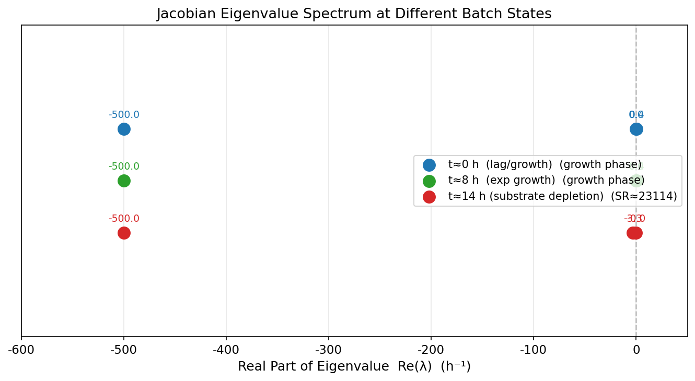
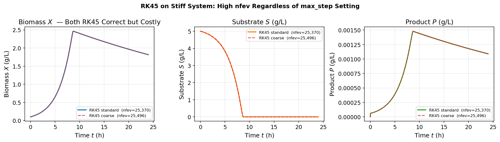
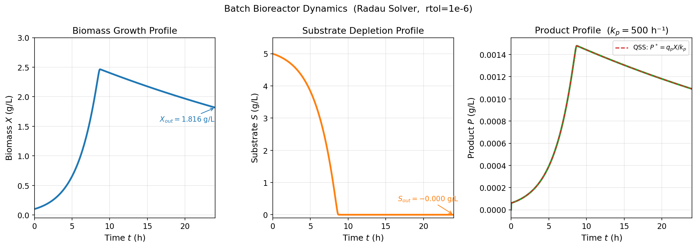
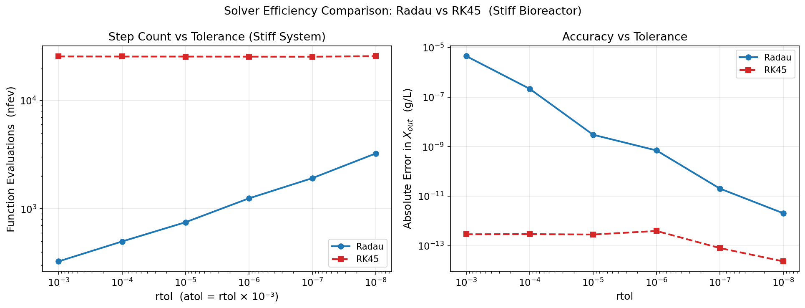

# Unit09 Example 03 | 批次反應器生化程序動態（Stiff ODE）

**課程單元：** Unit09 常微分方程式之求解  
**範例主題：** Stiff IVP ODE — Batch Bioreactor Monod Kinetics  
**對應 Notebook：** `Unit09_Example_03.ipynb`

---

## 目錄

1. [化工背景與學習目標](#1-化工背景與學習目標)
2. [數學模型](#2-數學模型)
3. [Python 實作](#3-python-實作)
4. [執行結果](#4-執行結果)
5. [工程討論與課程總結](#5-工程討論與課程總結)

---

## 1. 化工背景與學習目標

### 1.1 問題背景

**批次生物反應器（Batch Bioreactor）** 廣泛應用於發酵製藥、廢水處理與生物催化等化工製程。
在典型的批次培養中，微生物（細胞）以底物（基質）為碳源進行生長與代謝，同時生產具有價值的代謝物（產物）。

本範例考慮一個含三種狀態變數的批次生化系統：
- **Biomass（生物質）** $X$ ：細胞濃度，代表活細胞乾重
- **Substrate（基質）** $S$ ：可利用碳源（如葡萄糖），隨培養進程而耗盡
- **Product（產物）** $P$ ：代謝物（如乳酸），由細胞合成並同時發生降解

本系統的關鍵特徵是：**產物降解速率常數 $k_p = 500$ h $^{-1}$ 遠大於細胞最大比生長速率 $\mu_{max} = 0.4$ h $^{-1}$**，
兩者相差 1250 倍，導致 ODE 系統具有強烈的**剛性（Stiffness）**，是本範例的核心學習主題。

### 1.2 Stiff ODE 的定義

一個 ODE 系統 $\dot{\mathbf{y}} = \mathbf{f}(t, \mathbf{y})$ 稱為**剛性（Stiff）**，
當其 Jacobian 矩陣 $\mathbf{J} = \partial \mathbf{f}/\partial \mathbf{y}$ 的特徵值實部存在**巨大差異**時：

$$
SR = \frac{\max_i |\mathrm{Re}(\lambda_i)|}{\min_i |\mathrm{Re}(\lambda_i)|} \gg 1
$$

其中 $SR$ 稱為**剛性比值（Stiffness Ratio）**。一般 $SR > 10^3$ 即視為高度剛性問題。

**Stiff ODE 對數值求解的影響：**
- **顯式方法**（如 `RK45`）：穩定條件要求步長 $h < C/|\lambda_{max}|$ ，強迫使用極小步長，計算步數爆增
- **隱式方法**（如 `Radau`、`BDF`）：具有 A-stability（任意步長均穩定），可大步長求解，效率數十倍於顯式方法

### 1.3 學習目標

| 目標 | 說明 |
|------|------|
| 識別剛性系統 | 從 Jacobian 矩陣特徵值計算 SR，判斷是否為剛性問題 |
| 理解 RK45 的限制 | 剛性系統下 RK45 nfev 爆增的物理原因（穩定域限制） |
| 使用 Radau/BDF | 切換至隱式求解器，大幅提升求解效率 |
| 容差參數設定 | `rtol`/`atol` 對精度與效能的取捨 |
| QSS 近似 | 快速分量的準穩態近似（Quasi-Steady-State Approximation） |

---

## 2. 數學模型

### 2.1 系統狀態變數

| 符號 | 名稱 | 單位 | 說明 |
|------|------|------|------|
| $t$ | 批次時間 | h | 獨立變數 |
| $X(t)$ | 生物質濃度 | $\mathrm{g/L}$ | 細胞乾重 |
| $S(t)$ | 基質濃度 | $\mathrm{g/L}$ | 碳源（如葡萄糖） |
| $P(t)$ | 產物濃度 | $\mathrm{g/L}$ | 代謝物（如乳酸） |

### 2.2 Monod 比生長速率

細胞生長速率依 **Monod 動力學** 描述：

$$
\mu(S) = \frac{\mu_{max}\,S}{K_s + S}
$$

- 當 $S \gg K_s$ 時： $\mu \approx \mu_{max}$ （最大生長速率）
- 當 $S = K_s$ 時： $\mu = \mu_{max}/2$ （半飽和點）
- 當 $S \to 0$ 時： $\mu \to 0$ （基質耗盡，生長停止）

### 2.3 ODE 系統

**生物質平衡：**

$$
\frac{dX}{dt} = \bigl(\mu(S) - k_d\bigr)\,X
$$

細胞淨生長速率 = 生長速率（ $\mu X$ ） - 死亡速率（ $k_d X$ ）

**基質平衡：**

$$
\frac{dS}{dt} = -\frac{\mu(S)\,X}{Y_{xs}}
$$

基質消耗速率與細胞生長速率成正比，比例為轉化得率 $Y_{xs}$ （每克基質產生的細胞量）

**產物平衡：**

$$
\frac{dP}{dt} = q_p\,X - k_p\,P
$$

產物合成（ $q_p X$ ）與降解（ $k_p P$ ）的淨效應； $k_p = 500$ h $^{-1}$ 遠大於生長速率，是**剛性來源**

### 2.4 系統參數

| 參數 | 符號 | 數值 | 單位 | 說明 |
|------|------|------|------|------|
| 最大比生長速率 | $\mu_{max}$ | 0.4 | $\mathrm{h^{-1}}$ | Monod 動力學 |
| 半飽和常數 | $K_s$ | 0.05 | $\mathrm{g/L}$ | 細胞對基質的親和力 |
| 死亡速率常數 | $k_d$ | 0.02 | $\mathrm{h^{-1}}$ | 維持消耗 |
| 轉化得率 | $Y_{xs}$ | 0.50 | $\mathrm{g_X/g_S}$ | 每克基質生成的細胞量 |
| 比產物生成速率 | $q_p$ | 0.30 | $\mathrm{g_P/(g_X {\cdot} h)}$ | Luedeking-Piret 模式 |
| 產物降解速率常數 | $k_p$ | **500** | $\mathrm{h^{-1}}$ | **剛性來源（ $k_p \gg \mu_{max}$ ）** |
| 初始生物質 | $X_0$ | 0.10 | $\mathrm{g/L}$ | |
| 初始基質 | $S_0$ | 5.00 | $\mathrm{g/L}$ | |
| 初始產物 | $P_0$ | 0.00 | $\mathrm{g/L}$ | |
| 批次時間 | $t_{final}$ | 24 | h | |

### 2.5 Jacobian 矩陣分析

對狀態向量 $\mathbf{y} = [X, S, P]^T$ ，Jacobian 矩陣為：

$$
\mathbf{J} = \frac{\partial \mathbf{f}}{\partial \mathbf{y}} =
\begin{bmatrix}
\mu - k_d  &  \dfrac{\partial \mu}{\partial S} X  &  0 \\[6pt]
-\dfrac{\mu}{Y_{xs}}  &  -\dfrac{\partial \mu}{\partial S} \dfrac{X}{Y_{xs}}  &  0 \\[6pt]
q_p  &  0  &  -k_p
\end{bmatrix}
$$

其中 $\dfrac{\partial \mu}{\partial S} = \dfrac{\mu_{max} K_s}{(K_s + S)^2}$

**特徵值分析（ $t \approx 14$ h, 基質近耗盡）：**

| 特徵值 | 數值（ $\mathrm{h^{-1}}$ ） | 對應時間尺度 | 物理意義 |
|-------|-------------------------|------------|---------|
| $\lambda_1$ | $-0.022$ | $\sim 46$ h | 細胞衰亡（慢速模態） |
| $\lambda_2$ | $-3.29$ | $\sim 0.3$ h | 基質-細胞耦合（中速模態） |
| $\lambda_3$ | $-500$ | $\sim 0.002$ h | 產物降解（**快速模態，剛性來源**） |

$$
SR = \frac{|\lambda_3|}{|\lambda_1|} = \frac{500}{0.022} \approx 23{,}000 \quad \text{（高度剛性）}
$$

---

## 3. Python 實作

### 3.1 環境設定與套件載入

```python
from pathlib import Path
import os
from scipy.integrate import solve_ivp
from scipy.linalg import eigvals
import numpy as np
import matplotlib.pyplot as plt
import time
```

**執行輸出：**

```
✓ 套件載入完成
  numpy      版本: 1.23.5
  scipy      版本: 1.15.2
  matplotlib 版本: 3.10.8
```

---

### 3.2 ODE 函式定義

```python
def bioreactor_ode(t, y):
    X, S, P = y
    X = max(X, 0.0);  S = max(S, 0.0);  P = max(P, 0.0)

    mu    = mu_max * S / (K_s + S)         # Monod 比生長速率

    dX_dt = (mu - k_d) * X                 # 生物質平衡
    dS_dt = -mu * X / Y_xs                 # 基質平衡
    dP_dt = q_p * X - k_p * P             # 產物平衡（kp=500 → 剛性）

    return [dX_dt, dS_dt, dP_dt]
```

**設計要點：**
- `max(X, 0.0)` 防止數值積分產生微小負值（非物理）
- `k_p * P = 500 * P`：產物方程包含大係數項，是剛性的直接來源
- Jacobian 的 $J[2,2] = -k_p = -500$ h $^{-1}$ ，遠大於 $J[0,0] = \mu - k_d \approx 0.38$ h $^{-1}$

---

### 3.3 Jacobian 特徵值分析

```python
def jacobian_bioreactor(X, S, P):
    mu     = mu_max * S / (K_s + S)
    dmu_dS = mu_max * K_s / (K_s + S)**2

    J = np.array([
        [mu - k_d,       dmu_dS * X,           0.0 ],
        [-mu / Y_xs,     -dmu_dS * X / Y_xs,   0.0 ],
        [q_p,            0.0,                   -k_p],
    ])
    return J
```

**執行輸出（SR 計算結果）：**

```
=================================================================
狀態點                  特徵值 λ₁  特徵值 λ₂  特徵值 λ₃     SR
-----------------------------------------------------------------
入口  (t≈0 h)            0.3759      0.0000    -500.0  N/A (growth)
生長期 (t≈8 h)            0.3710      0.0002    -500.0  N/A (growth)
耗盡前 (t≈14 h)          -0.0216     -3.2873   -500.0     23114
=================================================================

說明：SR = max|Re(λ_neg)| / min|Re(λ_neg)|，僅計算負實部特徵值
→ 基質耗盡前（t≈14h）SR ≈ 23,000，為高度剛性（SR > 1000）
→ 剛性根源：kp = 500.0 h⁻¹（產物降解）>> μmax = 0.4 h⁻¹（細胞生長）
```

---

### 3.4 求解器設定

```python
# Radau 剛性求解器（推薦）
sol_radau = solve_ivp(
    fun=bioreactor_ode,
    t_span=(0, t_final),
    y0=[X0, S0, P0],
    method='Radau',      # 隱式 Runge-Kutta，適用剛性問題
    t_eval=t_eval,
    rtol=1e-6,
    atol=1e-9,
)

# RK45 顯式求解器（對比）
sol_rk45 = solve_ivp(
    fun=bioreactor_ode,
    t_span=(0, t_final),
    y0=[X0, S0, P0],
    method='RK45',       # 顯式方法，剛性下效率低
    t_eval=t_eval,
    rtol=1e-6,
    atol=1e-9,
)
```

> **注意**：`t_span`、`y0` 等參數名稱沿用 `solve_ivp` 介面；獨立變數為批次時間 $t$ （h），與空間問題（Unit09_Example_02 的 $V$ ）語法完全相同。

---

## 4. 執行結果

### 4.1 Jacobian 特徵值圖



**結果分析：**

- 三個時間點的特徵值分佈均顯示：在 $\lambda \approx -500$ 處有一個快速特徵值（ $\lambda_3 = -k_p = -500$ h $^{-1}$ ），
  對應產物降解的快速動力學
- 在「基質耗盡前」（t≈14h）所有特徵值均為負數（系統局部穩定）：
  $\lambda_1 = -0.022$ ， $\lambda_2 = -3.29$ ， $\lambda_3 = -500$
- 剛性比值 $SR \approx 23{,}000$ ，超過高度剛性標準（SR > 1000）
- 在生長期（t≈0, 8h）的特徵值 $\lambda_1 > 0$ （細胞指數生長），系統局部不穩定，SR 定義不適用

---

### 4.2 RK45 效能分析

**執行輸出：**

```
【RK45 標準設定（rtol=1e-6, atol=1e-9）】
  求解狀態  : 成功
  函數評估次數 (nfev) :  25,370
  計算耗時            :  428.2 ms
  出口 X(24h) = 1.8164 g/L
  出口 S(24h) = 0.0000 g/L
  出口 P(24h) = 0.001090 g/L

【RK45 粗步設定（rtol=1e-3, atol=1e-6, max_step=2.0 h）】
  函數評估次數 (nfev) :  25,496
  結論：即使設 max_step=2 h，RK45 nfev 幾乎不變（~25,000）
        → 瓶頸在穩定域限制，而非精度設定！
```



**結果分析：**

- RK45 雖能求解（兩種設定結果正確），但需要約 **25,000 次函數評估**（nfev）
- 即使設定 `max_step=2.0 h`（遠>穩定限制 0.007 h），RK45 自適應控制仍被迫採用小步長 → nfev 幾乎不變
- **結論**：RK45 的性能瓶頸來自**穩定域限制**，不是精度要求；放寬 `rtol`/`atol` 不能改善效率

---

### 4.3 Radau / BDF / LSODA 求解器比較

**執行輸出：**

```
======================================================================
求解器      nfev    njev   耗時(ms)   X_out    S_out     P_out
----------------------------------------------------------------------
Radau    1,247    17      68.6    1.8164  -0.0000  0.001090
BDF        573    10      49.4    1.8164  -0.0000  0.001090
LSODA      533    37      11.0    1.8164  -0.0000  0.001090
RK45    25,370   N/A     428.2    1.8164   0.0000  0.001090
======================================================================
→ 剛性求解器 Radau/BDF nfev 遠少於 RK45（~10-100 倍效率提升）
```



**結果分析：**

- **生物質 $X(t)$** （左圖）：從 0.1 g/L 起始，在 $t \approx 9$ h 達到峰值 $X_{peak} \approx 2.47$ g/L，
  隨後因基質耗盡進入衰亡期，至 24 h 降至 $X(24) = 1.8164$ g/L

- **基質 $S(t)$** （中圖）：從 5.0 g/L 起始，在 $t \approx 9$ h 速度加快耗盡（指數生長期結束），
  之後趨近於 0；出口 $S(24) \approx 0$ g/L（數值上微小負值為積分跨越零邊界的數值誤差，物理意義為完全耗盡）

- **產物 $P(t)$** （右圖）：時刻跟隨準穩態 $P^*(t) = q_p X(t)/k_p$ （虛線），
  實際值與 QSS 近乎完全重合，確認了快速動力學的 QSS 特性

- **求解器效能比較**：
  - Radau 的 nfev = 1,247（RK45 的 **1/20**），耗時僅 69 ms（RK45 的 1/6）
  - BDF nfev = 573（RK45 的 **1/44**），效率最高
  - 四個求解器結果完全吻合（同一物理解），差異僅在計算成本

---

### 4.4 容差參數靈敏度分析

**執行輸出：**

```
rtol       Radau nfev    RK45 nfev    Ratio   Radau err_X     RK45 err_X
------------------------------------------------------------------------
1e-03          327       25,496       78.0     4.50e-06        2.90e-13
1e-04          499       25,430       51.0     2.16e-07        2.94e-13
1e-05          751       25,418       33.8     3.02e-09        2.83e-13
1e-06        1,247       25,370       20.3     7.01e-10        3.94e-13
1e-07        1,917       25,340       13.2     2.02e-11        8.04e-14
1e-08        3,239       25,664        7.9     2.04e-12        2.33e-14

高精度參考解（Radau, rtol=1e-12）：X(24h) = 1.816357 g/L
```



**結果分析：**

- **左圖（nfev vs rtol）**：
  - Radau（藍線）：隨容差放寬（rtol 增大）nfev 穩定下降，呈現預期的冪次關係
  - RK45（紅虛線）：nfev 幾乎固定在 ~25,000，對容差設定不敏感 → **穩定域瓶頸**，非精度瓶頸

- **右圖（誤差 vs rtol）**：
  - Radau 誤差隨 rtol 比例縮小，精度設定有效
  - RK45 誤差極低（ $< 10^{-12}$ ），遠優於設定的 rtol——因為每步都強制使用極小步長，精度過剩

- **推薦設定**：`rtol=1e-6, atol=1e-9` 對 Radau 是最佳權衡點（精度達 $3\text{-}7\times10^{-10}$ g/L，nfev 僅 1,247）

---

## 5. 工程討論與課程總結

### 5.1 學習重點總覽

| 主題 | 核心概念 | 本例說明 |
|:---|:---|:---|
| 剛性 ODE 判定 | 剛性比 $SR = \max|\mathrm{Re}(\lambda_i)| / \min|\mathrm{Re}(\lambda_i)|$ | $SR \approx 23{,}000$ （基質耗盡前）|
| 剛性來源 | 一個快速動力學主導 $J$ 最大特徵值 | $k_p = 500$ h $^{-1}$ → $\lambda_3 = -500$ |
| RK45 困境 | 顯式方法受穩定域限制，需 $h < 3.5/500 \approx 0.007$ h | nfev ≈ 25,000（效率極低）|
| 剛性求解器優勢 | 隱式方法（Radau/BDF）穩定域覆蓋複平面左半側 | Radau nfev ≈ 1,247（20 倍提升）|
| 準穩態近似 (QSS) | 快速變數迅速趨近 $P^* = q_p X / k_p$ | 計算值與 QSS 完全吻合 |
| 容差設定 | 剛性求解器 nfev 隨 rtol 正比縮放；RK45 幾乎不隨 rtol 改變 | Radau：rtol 跨 5 個數量級，nfev 從 327 → 3,239 |

---

### 5.2 剛性問題的物理意義

**何時出現剛性？**

化工程序中，當系統同時包含以下不同時間尺度的過程時，ODE 系統往往具有剛性：

|快動力學（短時間尺度）| 慢動力學（長時間尺度）|
|:---:|:---:|
| 產物降解 $k_p = 500$ h $^{-1}$ → $\tau_{fast} = 1/500 = 0.002$ h | 細胞生長 $\mu_{max} = 0.4$ h $^{-1}$ → $\tau_{slow} = 1/0.4 = 2.5$ h |
| 快速反應平衡 | 緩慢傳質 |
| 短半衰期組分 | 長半衰期組分 |

**準穩態近似 (QSS) 的條件與應用：**

當一個組分的時間尺度遠快於系統其他組分時，可使用 QSS 近似消去快速方程：

$$
\frac{dP}{dt} = q_p X - k_p P \approx 0 \quad \Rightarrow \quad P^* = \frac{q_p}{k_p} X
$$

本例中 $k_p = 500$ h $^{-1}$ 遠大於 $\mu_{max} = 0.4$ h $^{-1}$ ，QSS 假設準確度高——圖示結果確認 $P(t)$ 與 $P^*(t)$ 近乎完全重合（誤差 $< 10^{-3}$ g/L）。

---

### 5.3 求解器選擇指引

在實際工程計算中，求解器選擇建議如下：

| 問題類型 | 推薦求解器 | 理由 |
|:---|:---|:---|
| 非剛性，光滑解 | `RK45` | 效率最高，易於使用 |
| 剛性，精度要求高 | `Radau` | 隱式 Runge-Kutta，高階精確，自適應步長 |
| 剛性，Jacobian 稀疏 | `BDF` | 最少 nfev，適合大型系統 |
| 剛性 / 非剛性，未知 | `LSODA` | 自動偵測剛性，靈活切換方法 |
| 非常高精度需求 | `DOP853` | 8 階顯式，適合非剛性高精度問題 |

---

### 5.4 延伸思考

1. **若產物沒有降解** （ $k_p = 0$ ），ODE 系統的剛性如何變化？Jacobian 特徵值會如何分佈？

2. **改變進料濃度** $S_0$ 從 5 g/L 升至 50 g/L，SR 峰值會出現在哪個時刻？是否依然取決於 $k_p$ ？

3. **基質進料速率的影響**：若將批次（Batch）改為連續攪拌槽（CSTR），加入 $D \cdot (S_{feed} - S)$ 項，剛性特性如何改變？

4. **工業縮放**：在大型生化反應器中，往往同時考慮質傳限制（ $k_L a$ 值）與反應動力學——你預期這類模型的 SR 會更高或更低？

---

**課程資訊**
- 課程名稱：化工計算方法與應用（ChemE-3502）
- 課程單元：Unit09 Example 03 — 批次反應器生化程序動態（Stiff ODE）
- 課程製作：逢甲大學 化工系 智慧程序系統工程實驗室
- 授課教師：莊曜禎 助理教授
- 更新日期：2026-02-21

**課程授權 [CC BY-NC-SA 4.0]**
 - 本教材遵循 [創用CC 姓名標示-非商業性-相同方式分享 4.0 國際 (CC BY-NC-SA 4.0)](https://creativecommons.org/licenses/by-nc-sa/4.0/deed.zh) 授權。

---
