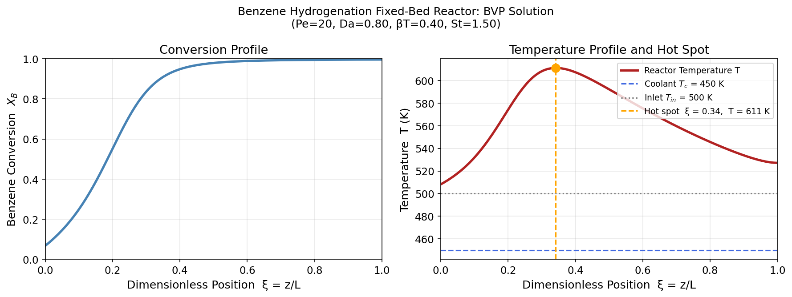
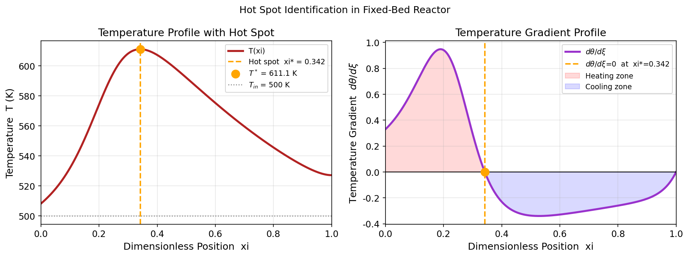
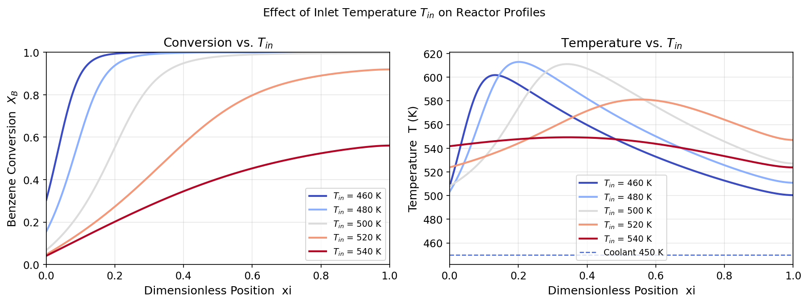
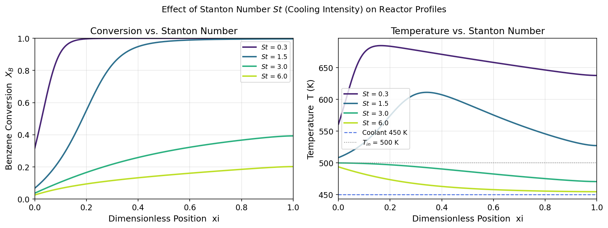

# Unit09 範例四：觸媒反應管之溫度及轉化率軸向分布 (BVP)

## 1. 背景與目標

### 1.1 反應系統

**苯加氫製環己烷（Benzene Hydrogenation）** 為石油化工中極為重要的放熱觸媒反應：

$$
\text{C}_6\text{H}_6 + 3\text{H}_2 \xrightarrow{\text{Ni cat.}} \text{C}_6\text{H}_{12}, \quad \Delta H_r = -206.7 \;\text{kJ/mol}
$$

反應在**外部熱交換式固定床觸媒反應管**中進行。管外持續流動冷卻劑以移除反應熱。
由於反應放熱甚強，若冷卻設計不當，管內可能出現**溫度峰值（Hot Spot）**，
導致觸媒燒結失活，甚至引發安全事故。

### 1.2 問題分類

本範例為**兩點邊界值問題（Boundary Value Problem, BVP）**：

- 獨立變數：軸向位置 $z$ （或無因次化後的 $\xi = z/L$ ）
- 狀態變數：轉化率 $X_B(\xi)$ 與溫度 $T(\xi)$
- 邊界條件：**入口端**（ $\xi=0$ ）與**出口端**（ $\xi=1$ ）分別給定條件

與 IVP（所有條件在同一端）不同，BVP **無法直接積分**，需要迭代求解。

### 1.3 學習目標

1. 建立含軸向擴散的固定床反應器 BVP 數學模型
2. 推導 **Danckwerts 邊界條件**的物理形式
3. 將二階 BVP 轉換為一階系統，以配合 `solve_bvp()` 介面
4. 熟練設定**初始猜測值**並診斷收斂問題
5. 識別熱點位置並分析操作參數 $T_{\text{in}}$ 、 $St$ 的影響

---

## 2. 數學模型

### 2.1 軸向擴散模型（Axial Dispersion Model）

考慮**軸向質傳擴散**（擴散係數 $D_e$ ）與**軸向熱傳導**（有效熱傳導係數 $\lambda_{\text{eff}}$ ），
穩態固定床反應管的質量與能量平衡方程式為：

**質量守恆（轉化率 $X_B$ ）：**

$$
D_e \frac{d^2 X_B}{dz^2} - u \frac{d X_B}{dz} + \frac{(-r_B)}{C_{A0}} = 0
$$

**能量守衡（溫度 $T$ ）：**

$$
\lambda_{\text{eff}} \frac{d^2 T}{dz^2} - \rho_g C_p u \frac{d T}{dz} + (-\Delta H_r)(-r_B) - Ua(T - T_c) = 0
$$

其中 $u$ 為表觀流速（m/s）； $T_c$ 為冷卻劑溫度；
$Ua$ 為以管徑截面積為基準的整體熱傳係數（W/m³/K）。

反應速率採 **Arrhenius 一階模式**（相對入口條件歸一化）：

$$
(-r_B) = k_{\text{ref}} C_{A0} (1 - X_B) \exp\!\left[\frac{E_a}{R}\left(\frac{1}{T_{\text{in}}} - \frac{1}{T}\right)\right]
$$

### 2.2 無因次化

引入無因次變數 $\xi = z/L$ ，令 $\theta = T/T_{\text{in}}$ ， $\theta_c = T_c/T_{\text{in}}$ ，
無因次化反應速率（以入口條件為基準）：

$$
r(X_B, \theta) = (1-X_B)\exp\!\left[\gamma\!\left(1 - \frac{1}{\theta}\right)\right]
$$

無因次化後的穩態 ODE 系統：

$$
\frac{d^2 X_B}{d\xi^2} = Pe_M \left(\frac{dX_B}{d\xi} - Da \cdot r(X_B, \theta)\right) \tag{2.1}
$$

$$
\frac{d^2 \theta}{d\xi^2} = Pe_H \left(\frac{d\theta}{d\xi} - Da \cdot \beta_T \cdot r(X_B, \theta) + St(\theta - \theta_c)\right) \tag{2.2}
$$

**無因次參數定義：**

| 符號 | 定義 | 物理意義 |
|------|------|---------|
| $Pe_M = uL/D_e$ | 質傳 Peclet 數 | 對流/軸向質傳擴散之比 |
| $Pe_H = \rho_g C_p u L / \lambda_{\text{eff}}$ | 熱傳 Peclet 數 | 對流/軸向導熱之比 |
| $Da = k_{\text{ref}} L / u$ | Damköhler 數 | 反應/對流速率之比 |
| $\gamma = E_a/(RT_{\text{in}})$ | 無因次活化能 | Arrhenius 溫度敏感性 |
| $\beta_T = (-\Delta H_r)C_{A0}/(\rho_g C_p T_{\text{in}})$ | 無因次絕熱溫升 | 反應熱強度 |
| $St = UaL/(\rho_g C_p u)$ | Stanton 數 | 牆壁熱移除強度 |

### 2.3 Danckwerts 邊界條件

當 $0 < Pe < \infty$ 時，必須使用 **Danckwerts BC** 以確保物料/能量通量的連續性。

**入口 $\xi = 0$**

在反應管入口截面，進料通量等於對流通量加軸向擴散通量之和：

$$
\underbrace{u C_{A0}}_{\text{進料通量}} = \underbrace{u C_A(0^+)}_{\text{對流}} - \underbrace{D_e \frac{dC_A}{dz}\bigg|_{0^+}}_{\text{軸向擴散}}
$$

轉換為無因次轉化率形式：

$$
\boxed{X_B(0) = \frac{1}{Pe_M}\frac{dX_B}{d\xi}\bigg|_{\xi=0}}  \tag{BC-1}
$$

同理，能量 Danckwerts BC：

$$
\boxed{\theta(0) - 1 = \frac{1}{Pe_H}\frac{d\theta}{d\xi}\bigg|_{\xi=0}} \tag{BC-2}
$$

**出口 $\xi = 1$**（零通量 BC）

出口截面後無軸向擴散/導熱傳出：

$$
\boxed{\frac{dX_B}{d\xi}\bigg|_{\xi=1} = 0, \qquad \frac{d\theta}{d\xi}\bigg|_{\xi=1} = 0} \tag{BC-3,4}
$$

### 2.4 轉換為一階 ODE 系統

定義狀態向量 $\mathbf{y} = [y_0, y_1, y_2, y_3]^T$ ：

$$
y_0 = X_B, \quad y_1 = \frac{dX_B}{d\xi}, \quad y_2 = \theta, \quad y_3 = \frac{d\theta}{d\xi}
$$

一階系統（傳入 `solve_bvp` 之 `fun`）：

$$
\begin{aligned}
y_0' &= y_1 \\
y_1' &= Pe_M\bigl(y_1 - Da \cdot r(y_0, y_2)\bigr) \\
y_2' &= y_3 \\
y_3' &= Pe_H\bigl(y_3 - Da \cdot \beta_T \cdot r(y_0, y_2) + St(y_2 - \theta_c)\bigr)
\end{aligned}
$$

邊界條件殘差函式（傳入 `solve_bvp` 之 `bc`，應回傳零向量）：

$$
\begin{aligned}
g_0 &= y_0(0) - y_1(0)/Pe_M = 0 \quad \text{(Danckwerts 質量 BC at } \xi=0\text{)} \\
g_1 &= y_1(1) = 0 \quad \text{(出口零通量)} \\
g_2 &= y_2(0) - y_3(0)/Pe_H - 1 = 0 \quad \text{(Danckwerts 能量 BC at } \xi=0\text{)} \\
g_3 &= y_3(1) = 0 \quad \text{(出口零通量)}
\end{aligned}
$$

### 2.5 系統參數（本例數值）

| 參數 | 數值 | 說明 |
|------|------|------|
| $T_{\text{in}}$ | 500 K | 入口溫度（基準案例） |
| $T_c$ | 450 K | 冷卻劑溫度 |
| $E_a$ | 72,800 J/mol | 活化能 |
| $\Delta H_r$ | −206,700 J/mol | 反應熱（放熱） |
| $Pe_M = Pe_H$ | 20.0 | 軸向混合（中等擴散） |
| $Da$ | 0.80 | Damköhler 數 |
| $\gamma = E_a/(RT_{\text{in}})$ | 17.51 | 無因次活化能 |
| $\beta_T$ | 0.40 | 無因次絕熱溫升 |
| $St$ | 1.50 | Stanton 數（基準） |
| $\theta_c = T_c/T_{\text{in}}$ | 0.90 | 無因次冷卻劑溫度 |

---

## 3. Python 實作

### 3.1 環境設定與套件載入

```python
from pathlib import Path
import numpy as np
import matplotlib.pyplot as plt
from scipy.integrate import solve_bvp
```

### 3.2 系統參數與 ODE 定義

```python
# 物理參數
T_in = 500.0;  T_c = 450.0;  Ea = 72800.0;  R_gas = 8.314

# 無因次參數
Pe_M = Pe_H = 20.0;  Da = 0.8
gamma = Ea / (R_gas * T_in)    # = 17.51
beta_T = 0.40;  St = 1.5
theta_c = T_c / T_in            # = 0.90

# 一階 ODE 系統：y = [X_B, X_B', θ, θ']
def ode_fun(xi, y):
    X_B, dXdxi, theta, dtdxi = y
    theta_safe = np.maximum(theta, 0.3)
    r = (1.0 - X_B) * np.exp(gamma * (1.0 - 1.0 / theta_safe))
    r = np.where(X_B >= 1.0, 0.0, r)
    return np.array([
        dXdxi,
        Pe_M * (dXdxi - Da * r),
        dtdxi,
        Pe_H * (dtdxi - Da * beta_T * r + St * (theta - theta_c))
    ])

# Danckwerts 邊界條件：回傳殘差向量（應為零）
def bc_fun(y_a, y_b):
    return np.array([
        y_a[0] - y_a[1] / Pe_M,       # X_B(0) = X_B'(0)/Pe_M
        y_b[1],                         # X_B'(1) = 0
        y_a[2] - y_a[3] / Pe_H - 1.0, # θ(0) - θ'(0)/Pe_H = 1
        y_b[3]                          # θ'(1) = 0
    ])
```

### 3.3 初始猜測值策略

`solve_bvp()` 對初始猜測**非常敏感**，良好的初始猜測策略至關重要：

```python
n_mesh = 50
xi_init = np.linspace(0, 1, n_mesh)

# 猜測：X_B 線性增加；θ 呈 sin 峰值（模擬熱點）
X_B_guess   = 0.6 * xi_init
dXdxi_guess = np.full(n_mesh, 0.6)
theta_guess = 1.0 + 0.15 * np.sin(np.pi * xi_init)
dtdxi_guess = 0.15 * np.pi * np.cos(np.pi * xi_init)

y_init = np.array([X_B_guess, dXdxi_guess, theta_guess, dtdxi_guess])
```

> **注意**：`y_init` 維度為 `(n_eq=4, n_mesh=50)`，
> 第 $i$ 列為第 $i$ 個狀態變數在全體網格點上的猜測值。

### 3.4 呼叫 `solve_bvp()`

```python
sol = solve_bvp(ode_fun, bc_fun, xi_init, y_init,
                tol=1e-5, max_nodes=5000, verbose=2)

print(sol.success, sol.message)                   # 收斂判定
print(f"Max residual: {np.max(sol.rms_residuals):.2e}")
```

求解成功後，於密集網格點內插值取解：

```python
xi_plot  = np.linspace(0, 1, 300)
y_dense  = sol.sol(xi_plot)       # shape (4, 300)
X_B_sol  = y_dense[0]
T_sol    = y_dense[2] * T_in      # 換算回 K
```

> **`sol.sol`** 為 `solve_bvp` 自動建立的分段多項式插值物件，
> 可在 $[0, 1]$ 任意位置求值，精度由 `tol` 控制。

---

## 4. 執行結果

### 4.1 BVP 數值解之軸向分布

基準案例（ $T_{\text{in}}=500$ K， $St=1.5$ ， $Da=0.8$ ， $\beta_T=0.40$ ， $Pe=20$ ）求解輸出：

```
Iteration    Max residual  Max BC residual  Total nodes  Nodes added
        1      1.35e+01         1.05e-01          50           98
        2      4.95e-01         1.75e-12         148          237
        3      2.84e-05         0.00e+00         385            6
        4      9.66e-06         0.00e+00         391            0
Solved in 4 iterations, number of nodes 391.
Maximum relative residual: 9.66e-06

出口轉化率  X_B(1) = 0.9965
出口溫度    T(1)   = 527.2 K
最高溫度    T_max  = 611.1 K  (熱點)
熱點位置    ξ_max  = 0.341
```

`solve_bvp` 自動加密網格（由初始 50 節點擴展至 391 節點），
以確保整體殘差達到指定容差 $10^{-5}$ 。



**圖01 說明**：左圖為轉化率 $X_B(\xi)$ 分布，右圖為溫度 $T(\xi)$ 分布。
溫度曲線在 $\xi \approx 0.34$ 處出現峰值（熱點 $T^* = 611$ K），
之後因冷卻劑持續移熱而下降至出口溫度 527 K。

### 4.2 熱點位置識別

熱點定義為溫度梯度為零（ $d\theta/d\xi = 0$ ）且溫度由升轉降（梯度正→負）的位置。

```
Hot spot position  xi* = 0.3417  (z* = 0.683 m,  L=2 m)
Hot spot temperature  T* = 611.1 K  (+111.1 K above T_in)
Hot spot conversion   X* = 0.9004
```

熱點出現時，轉化率已達 $X^* = 0.90$ ，表示苯的大部分轉化發生在熱點之前的升溫區段。



**圖02 說明**：右圖顯示 $d\theta/d\xi$ 的分布；粉紅色填色區為升溫區（梯度 $> 0$ ，反應熱超過散熱），
藍色填色區為降溫區（梯度 $< 0$ ，散熱超過反應熱）。兩區交界即為熱點 $\xi^* = 0.342$ 。

### 4.3 入口溫度 $T_{\text{in}}$ 之影響

保持 $St=1.5$ ，改變 $T_{\text{in}} \in \{460, 480, 500, 520, 540\}$ K：

| $T_{\text{in}}$ (K) | $X_B(1)$ | $T_{\text{max}}$ (K) | $\xi_{\text{max}}$ |
|---------------------|---------|---------------------|-------------------|
| 460 | ≈ 1.000 | 601.8 | 0.134 |
| 480 | 0.9999 | 612.9 | 0.201 |
| 500 | 0.9965 | 611.1 | 0.341 |
| 520 | 0.9194 | 581.2 | 0.552 |
| 540 | 0.5605 | 549.3 | 0.344 |



**圖03 說明**：

- **低 $T_{\text{in}}$ （460–480 K）**：活化能效應使 $\gamma$ 更大，反應速率對溫度更敏感，
  反應集中在管前段，熱點位置靠近入口（ $\xi^* \approx 0.13$–$0.20$ ）。
- **高 $T_{\text{in}}$ （520–540 K）**：冷卻劑驅動力增大（ $\theta_c = T_c/T_{\text{in}}$ 降低），
  散熱效率提升，熱點被抑制，出口轉化率降低。
- 此反直覺的結果（高入口溫度反而轉化率更低）源於**冷卻工作點的改變**：
  $\theta_c = 450/540 = 0.833$ vs $450/460 = 0.978$ ，前者提供更強的冷卻驅動力。

### 4.4 Stanton 數 $St$ （冷卻強度）之影響

保持 $T_{\text{in}}=500$ K，改變 $St \in \{0.3, 1.5, 3.0, 6.0\}$ ：

| $St$ | $X_B(1)$ | $T_{\text{max}}$ (K) | $\Delta T_{\text{hot}}$ (K) | 操作特性 |
|------|---------|---------------------|----------------------------|---------|
| 0.3 | ≈ 1.000 | 684.7 | +184.7 | 近絕熱，熱點嚴重 |
| 1.5 | 0.9965 | 611.1 | +111.1 | 良好操作點 |
| 3.0 | 0.3928 | 499.9 | −0.1 | 過冷，轉化率大幅下降 |
| 6.0 | 0.2017 | 493.7 | −6.3 | 冷卻主導，反應幾乎停止 |



**圖04 說明**：

- $St=0.3$ （近絕熱）：反應熱幾乎全部累積，溫度飆升至 685 K（入口上方 185 K），觸媒承受極大熱應力。
- $St=1.5$ （適中）：熱點 611 K，有效平衡轉化率（99.7%）與溫度控制。
- $St=3.0$ ：冷卻過強，管內溫度迅速被壓制至入口溫度附近，反應速率大幅降低，出口轉化率僅 39%。
- $St=6.0$ ：溫度全程低於 $T_c+6$ K，幾乎無反應（轉化率僅 20%）。

---

## 5. 工程討論

### 5.1 `solve_bvp()` 求解技巧

| 問題現象 | 可能原因 | 解決方法 |
|---------|---------|---------|
| `max_nodes` 超限 | 解出現陡峭梯度（stiff profile） | 增加 `max_nodes` 或提供更精確猜測 |
| 收斂至錯誤解 | 初始猜測誤導迭代方向 | 改變猜測值（試 multiple initial guesses） |
| `success=False` | 邊界條件矛盾或方程式病態 | 檢查 BC 函式符號，確認物理合理性 |
| 殘差無法降低 | 容差 `tol` 過嚴 | 先用 `tol=1e-3` 取得解，再逐步收緊 |

### 5.2 BVP 初始猜測策略

良好的初始猜測是 BVP 求解的關鍵，常用策略：

1. **物理直覺法**：根據問題特性估計變數的大致形狀
   - 轉化率：由 0 單調增至出口預期值
   - 溫度：先升後降（若有熱點存在）

2. **連續延拓法（Continuation）**：從易求解的參數條件（如絕熱 $St \to 0$ ）出發，
   逐步調整參數，以前次解作為下次的初始猜測

3. **線性插值法**：以端點值線性連接作為猜測（適用於變化平緩的情形）

### 5.3 軸向擴散對反應器性能的影響

軸向擴散（有限 $Pe$ 效應）會改變反應器性能：

- **質傳擴散**（有限 $Pe_M$ ）：相當於部分返混，使轉化率**低於**理想 PFR
- **熱傳導**（有限 $Pe_H$ ）：使溫度分布更平緩，**降低熱點高度**，同時在入口處預熱進料

本例 $Pe = 20$ 為中等擴散強度；工業反應器中 $Pe$ 通常 $> 50$ （接近 PFR），
但高 Pe 也意味著 ODE 系統更"剛性"（stiff），需要更細緻的網格。

### 5.4 熱點控制的工程策略

| 設計/操作變數 | 熱點影響 | 典型措施 |
|-------------|---------|---------|
| 冷卻劑流量（影響 $St$ ） | 增流量 → 降熱點 | 多段冷卻（multi-bed with quench） |
| 入口溫度 $T_{\text{in}}$ | 降溫入料 → 移前熱點 | 進料預冷或稀釋（excess H₂） |
| 觸媒活性（影響 $Da$ ） | 降低活性 → 延展反應分布 | 觸媒稀釋（diluted catalyst bed） |
| 反應管徑（影響 $St \propto 1/d$ ） | 細管 → 高 $St$ ，降熱點 | 多管束薄管型反應器 |

---

**課程資訊**
- 課程名稱：電腦在化工上之應用（ChemE-3502）
- 課程單元：Unit09 常微分方程式之求解 — 範例四
- 課程製作：逢甲大學 化工系 智慧程序系統工程實驗室
- 授課教師：莊曜禎 助理教授
- 更新日期：2026-02-21

**課程授權 [CC BY-NC-SA 4.0]**
 - 本教材遵循 [創用CC 姓名標示-非商業性-相同方式分享 4.0 國際 (CC BY-NC-SA 4.0)](https://creativecommons.org/licenses/by-nc-sa/4.0/deed.zh) 授權。
