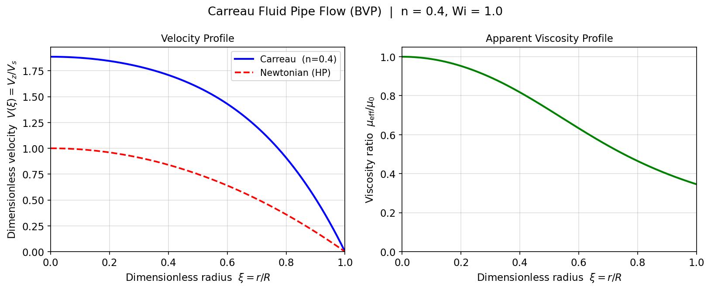
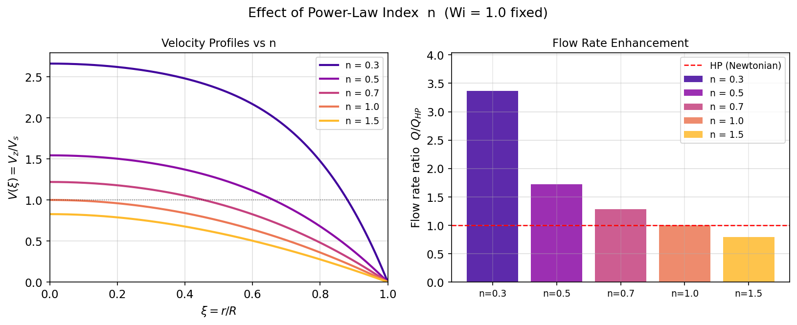
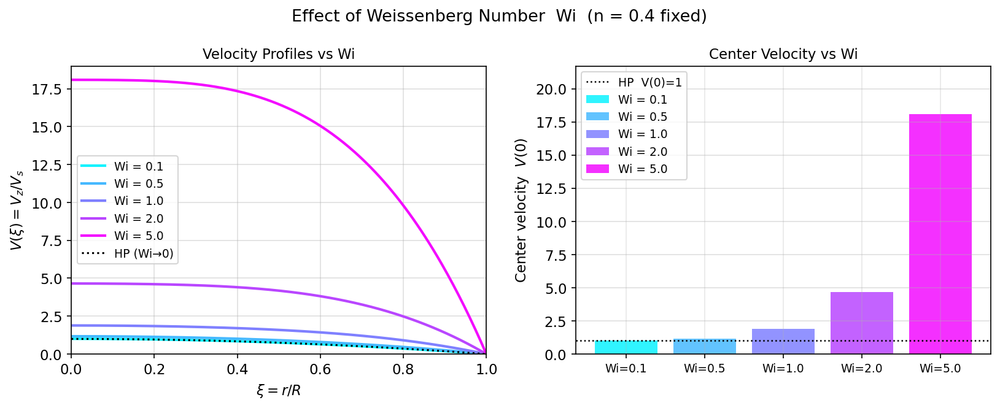

# Unit09 範例五：非牛頓流體管流的邊界值問題（Carreau 模型）

**課程**：電腦在化工上之應用 (ChemE 3502)｜**單元**：Unit09 邊界值問題

---

## 目錄

1. [背景與目標](#1-背景與目標)
2. [數學模型](#2-數學模型)
3. [Python 實作說明](#3-python-實作說明)
4. [執行結果與解析](#4-執行結果與解析)
5. [工程討論](#5-工程討論)

---

## 1 背景與目標

### 1.1 問題背景

在化工與生醫工程中，許多流體並非牛頓流體（Newtonian fluid），其黏度會隨剪切率（shear rate） $\dot{\gamma}$ 改變：

- **聚合物熔體、塑膠溶液**：剪切稀化（shear-thinning，又稱假塑性）
- **澱粉懸浮液、某些膠體**：剪切增稠（shear-thickening，又稱膨脹性）
- **典型工業流體**：血液（生醫）、塗料（塗裝）、鑽孔液（石油）

圓管流動（pipe flow）是最基本的化工輸送單元。理解非牛頓流體在管內的速度分佈，對於：

- 管道壓降與流量設計
- 混合與熱傳換算
- 生物血流力學分析

都具有重要的工程意義。

### 1.2 Carreau 模型

**Carreau–Yasuda 模型**（本例使用簡化版 Carreau 模型）是描述非牛頓黏度最廣泛使用的模型之一，兼具 Newtonian 極限（低剪切率）和冪律漸近行為（高剪切率）：

$$
\frac{\mu}{\mu_0} = \left[1 + \left(\lambda \dot{\gamma}\right)^2\right]^{(n-1)/2}
$$

| 參數 | 符號 | 物理意義 |
|------|------|---------|
| 零剪切黏度 | $\mu_0$ | 低剪切率極限黏度（Pa·s）|
| 鬆弛時間 | $\lambda$ | 非線性效應顯著的特徵時間（s）|
| 流體指數 | $n$ | $n<1$ 剪切稀化； $n=1$ 牛頓； $n>1$ 剪切增稠 |
| 剪切率 | $\dot{\gamma} = \lvert dV_z/dr\rvert$ | 速度梯度的大小（1/s）|

### 1.3 學習目標

完成本範例後，學生將能夠：

1. 建立非牛頓流體圓管流的動量方程式，並推導無因次化 ODE
2. 處理圓柱座標 ODE 在 $r=0$ 的可去奇異點
3. 使用 `scipy.integrate.solve_bvp` 求解第二類 BVP
4. 以 `scipy.integrate.quad` 對插值函數積分計算體積流量
5. 分析流體指數 $n$ 與 Weissenberg 數 $Wi$ 對速度剖面的影響
6. 驗算： $n=1$ 時數值解應精確回復 Hagen–Poiseuille 解析解

---

## 2 數學模型

### 2.1 物理系統設定

考慮不可壓縮黏性流體在半徑為 $R$ 的水平圓管中的穩態完全展開層流：

- 流動方向： $z$ 軸（軸向）
- 徑向座標： $r \in [0, R]$
- 軸向速度： $V_z = V_z(r) $ （僅為 $r$ 的函數）
- 驅動力：恆定軸向壓力梯度 $G = -dP/dz > 0$

### 2.2 Carreau 黏度模型（回顧）

有效黏度 $\mu_\text{eff}$ 由剪切率決定：

$$
\mu_\text{eff}(r) = \mu_0 \left[1 + \left(\lambda \left|\frac{dV_z}{dr}\right|\right)^2\right]^{(n-1)/2}
$$

> **物理意涵**：管壁（ $r \to R$ ）剪切率最大，黏度最低（剪切稀化時）；管中心（ $r=0$ ）剪切率為零，黏度恢復為 $\mu_0$ 。

### 2.3 動量方程式（圓柱座標）

$z$ 方向動量平衡（穩態、完全展開、無慣性項）：

$$
\frac{1}{r}\frac{d}{dr}\left(r\, \mu_\text{eff}\, \frac{dV_z}{dr}\right) = -G
$$

展開後得到：

$$
\frac{d}{dr}\left(r\, \mu_\text{eff}\, \frac{dV_z}{dr}\right) = -Gr
$$

### 2.4 無因次化

引入無因次變數：

$$
\xi = \frac{r}{R},\quad V = \frac{V_z}{V_s},\quad V_s = \frac{GR^2}{4\mu_0}\;(\text{HP 最大速度}),\quad Wi = \frac{\lambda V_s}{R}
$$

$Wi$ （Weissenberg 數）衡量非線性黏度效應的相對強度。

無因次化後的二階 ODE（令 $V' = dV/d\xi$ ）：

$$
\frac{d^2 V}{d\xi^2} = \frac{-4\left[1+(Wi\,V')^2\right]^{(3-n)/2} - V'/\xi \cdot \left[1+(Wi\,V')^2\right]}{1 + n\,(Wi\,V')^2} \tag{2.1}
$$

> **牛頓驗算**（ $n=1$ ）：分子為 $-4(1+(Wi\,V')^2) - V'/\xi \cdot (1+(Wi\,V')^2) = -(1+(Wi\,V')^2)(4+V'/\xi) $ ，分母為 $1+(Wi\,V')^2$ ，化簡後式 (2.1) 變為 $V'' + V'/\xi = -4$ ，解析解 $V(\xi)=1-\xi^2$ ✓

**關鍵推導步驟**：由 $d/d\xi[\xi \cdot \mu_r \cdot u] = -4\xi$ ，其中 $\mu_r = [1+(Wi\,u)^2]^{(n-1)/2}$ ， $u = V'$ 。展開乘積運算後， $d(\mu_r \cdot u)/du = [1+(Wi\,u)^2]^{(n-3)/2}[1+n\,Wi^2 u^2]$ ，整理得式 (2.1) 的分子含 $(3-n)/2$ 次冪。

### 2.5 一階系統（供 `solve_bvp` 使用）

令 $y_0 = V$ 、 $y_1 = dV/d\xi$ ，轉換為一階系統：

$$
\begin{aligned}
y_0' &= y_1 \\
y_1' &= \frac{-4\left[1+(Wi\,y_1)^2\right]^{(3-n)/2} - y_1/\xi \cdot \left[1+(Wi\,y_1)^2\right]}{1+n\,(Wi\,y_1)^2}
\end{aligned}
$$

**邊界條件：**

$$
\underbrace{y_1(0) = 0}_{\text{管中心對稱}\ (\partial V_z/\partial r = 0)} \qquad \underbrace{y_0(1) = 0}_{\text{管壁無滑移}\ (V_z = 0)}
$$

### 2.6 奇異點處理（ $\xi = 0$ ）

ODE 右側含 $y_1/\xi$ 項，當 $\xi \to 0$ 時若 $y_1(0) \neq 0$ 則發散。然而：

- 由對稱邊界條件 $y_1(0) = dV/d\xi|_{\xi=0} = 0$
- L'Hôpital 定理： $\lim_{\xi \to 0} y_1/\xi = y_1'(0) $ （有限值）

**數值處理**：程式中以 `xi_safe = max(ξ, ε)`（ $\varepsilon = 10^{-10}$ ）避免除零，物理結果不受影響。

### 2.7 系統參數（基準案例）

| 參數 | 符號 | 數值 | 說明 |
|------|------|------|------|
| 管半徑 | $R$ | 0.01 m | 細管（典型微通道） |
| 壓力梯度 | $G = -dP/dz$ | 400 Pa/m | 驅動壓力 |
| 零剪切黏度 | $\mu_0$ | 0.5 Pa·s | 高黏度聚合物溶液量級 |
| 鬆弛時間 | $\lambda$ | 0.5 s | Carreau 特徵時間 |
| 流體指數 | $n$ | 0.4 | 強剪切稀化（基準值） |
| 參考速度 | $V_s = GR^2/(4\mu_0) $ | 0.02 m/s | HP 最大速度 |
| Weissenberg 數 | $Wi = \lambda V_s/R$ | 1.0 | 中等非線性效應 |

---

## 3 Python 實作說明

### 3.1 套件需求

```python
import numpy as np
import matplotlib.pyplot as plt
from scipy.integrate import solve_bvp, quad
```

| 套件 | 函式 | 用途 |
|------|------|------|
| `numpy` | `np.linspace`, `np.maximum` | 網格生成、奇異點保護 |
| `scipy.integrate` | `solve_bvp` | 邊界值問題求解 |
| `scipy.integrate` | `quad` | 一維數值積分（流量計算）|
| `matplotlib.pyplot` | `plt.subplots` | 速度剖面與靈敏度圖形 |

### 3.2 ODE 函式設計（`make_ode` 工廠模式）

採用**工廠函式（factory function）**讓 ODE 接受外部參數（ $n$, $Wi$ ），方便後續靈敏度分析：

```python
def make_ode(n_fluid, Wi_val):
    def ode_fun(xi, y):
        u   = y[1]              # u = dV/dxi
        xi_s = np.maximum(np.abs(xi), 1e-10)   # 奇異點保護
        Wi2u2 = (Wi_val * u)**2
        denom     = 1.0 + n_fluid * Wi2u2
        power_half = (1.0 + Wi2u2)**((3.0 - n_fluid) / 2.0)  # ← 注意指數
        numer = -4.0 * power_half - (u / xi_s) * (1.0 + Wi2u2)
        return np.array([u, numer / denom])
    return ode_fun
```

> **關鍵注意**：ODE 分子中的指數為 $(3-n)/2$ ，而非黏度公式中的 $(n-1)/2$ （兩者含義不同，詳見 §2.4）。

### 3.3 邊界條件函式

```python
def bc_fun(y_a, y_b):
    return np.array([y_a[1],   # y1(0) = 0，對稱邊界
                     y_b[0]])  # y0(1) = 0，無滑移邊界
```

`solve_bvp` 要求 `bc_fun` 回傳長度為 2 的陣列（殘差 = 0）。

### 3.4 初始猜測

以 Newtonian HP 拋物線作為初始猜測，對各種 $n$ 和 $Wi$ 均有合理的收斂性：

```python
xi_init = np.linspace(0.0, 1.0, 80)
y_init  = np.array([1 - xi_init**2,   # V = 1 - xi^2
                   -2 * xi_init])      # dV/dxi = -2*xi
sol = solve_bvp(make_ode(n, Wi), bc_fun, xi_init, y_init,
                tol=1e-4, max_nodes=10000)
```

- `tol=1e-4`：殘差容忍度（對本問題的足夠精度）
- `max_nodes=10000`：最大自適應網格節點數
- `sol.success`：求解成功旗標
- `sol.sol(xi)`：高精度插值函數（可在任意點求值）

### 3.5 體積流量計算

$Q = 2\pi R^2 V_s \int_0^1 \xi\,V(\xi)\,d\xi$ ，使用 `quad` 對插值函數積分：

```python
I, err = quad(lambda xi: xi * sol.sol(xi)[0], 0.0, 1.0, limit=100)
Q_car  = 2 * np.pi * R**2 * V_s * I
E_Q    = I / (1.0/4.0)    # 流量增強因子（對比 HP 積分值 1/4）
```

---

## 4 執行結果與解析

### 4.1 基準案例速度剖面（圖 fig01）

基準案例（ $n=0.4$ ， $Wi=1.0$ ）的求解結果：

| 量 | Carreau | Newtonian (HP) |
|----|---------|---------------|
| 最大速度 $V(0) $ | **1.886** | 1.000 |
| 體積流量 Q | 6.95×10⁻⁶ m³/s | 3.14×10⁻⁶ m³/s |
| 流量增強因子 $E_Q$ | **2.21** | 1.000 |



**圖 4.1** 左圖：速度剖面比較（藍色實線 = Carreau 解，紅色虛線 = HP 解析）。右圖：視黏度剖面 $\mu_\text{eff}/\mu_0$ ，從管中心 1.0 降至管壁約 0.35，反映剪切稀化效應。

**物理解讀**：
- 剪切稀化流體（ $n=0.4$ ）在管壁附近黏度顯著降低（僅為 $\mu_0$ 的 35%），導致相同壓力梯度下流量增大 121%
- 速度剖面較 HP 拋物線更「平坦」，呈現柱塞流（plug flow）趨勢

### 4.2 流體指數 $n$ 的影響（圖 fig03）

固定 $Wi=1.0$ ，改變 $n = [0.3, 0.5, 0.7, 1.0, 1.5]$ ：

| $n$ | $V(0) $ | $Q/Q_\text{HP}$ | 說明 |
|-----|--------|-----------------|------|
| 0.3 | 2.661 | 3.366 | 強剪切稀化，流量增加 237% |
| 0.5 | 1.544 | 1.723 | 中等剪切稀化 |
| 0.7 | 1.219 | 1.281 | 輕微剪切稀化 |
| 1.0 | 1.000 | 1.000 | Newtonian（驗算基準）✓ |
| 1.5 | 0.827 | 0.791 | 剪切增稠，流量減少 21% |



**圖 4.2** 左：不同 $n$ 值的速度剖面（ $n$ 越小，柱塞流越明顯）；右：流量增強因子隨 $n$ 的變化趨勢。

### 4.3 Weissenberg 數 $Wi$ 的影響（圖 fig04）

固定 $n=0.4$ ，改變 $Wi = [0.1, 0.5, 1.0, 2.0, 5.0]$ ：

| $Wi$ | $V(0) $ | $Q/Q_\text{HP}$ | 說明 |
|------|--------|-----------------|------|
| 0.1 | 1.006 | 1.008 | $Wi \to 0$ ：接近牛頓流體 |
| 0.5 | 1.175 | 1.238 | 輕微非線性效應 |
| 1.0 | 1.886 | 2.212 | 中等非線性效應（基準）|
| 2.0 | 4.653 | 5.841 | 強非線性效應 |
| 5.0 | 18.08 | 23.00 | $Wi \gg 1$ ：趨近冪律極限 |



**圖 4.3** Wi 越大，速度剖面越扁平（柱塞流），中心速度急劇升高。 $Wi=0.1$ 的曲線幾乎與 HP（黑色點線）重合，驗證 $Wi \to 0$ 極限。

---

## 5 工程討論

### 5.1 BVP vs IVP：方法選擇

| 特性 | BVP（本例 `solve_bvp`）| IVP（打靶法）|
|------|----------------------|------------|
| 邊界條件 | 直接指定在兩端，自然表述 | 需猜測初始條件後迭代 |
| 數值穩定性 | 自適應網格，對 stiff 問題更穩定 | 對 stiff ODE 可能發散 |
| 程式碼複雜度 | 單次呼叫 `solve_bvp` | 需結合 `solve_ivp` + `root` |
| 適用場合 | 管流、熱傳、擴散反應 | 彈道、時間序列動態 |

### 5.2 Carreau 模型的工程應用

| 行業 | 流體 | 典型 $n$ | 設計影響 |
|------|------|---------|---------|
| 高分子化工 | 聚合物熔體 | 0.2–0.5 | 擠出模具設計、螺桿泵選型 |
| 食品工業 | 番茄醬、果醬 | 0.3–0.6 | 管道壓降計算 |
| 生醫工程 | 血液 | 0.7–0.9 | 血管血流分析 |
| 石油工程 | 鑽孔液 | 0.4–0.7 | 井下循環流量設計 |

### 5.3 實際設計建議

1. **管道壓降設計**：使用 $E_Q$ 因子修正牛頓計算值，避免低估流量
2. **增加 $Wi$ 的工程意義**：提高流速、增大管徑、或使用高鬆弛時間流體，均使 $Wi$ 增大，流量顯著超出牛頓預測
3. **數值驗算**：任何非牛頓求解都應先以 $n=1$ 驗算，確認與 HP 解析解吻合

### 5.4 本例的數值要點

- **初始猜測選擇**：HP 拋物線是最直接的物理初始猜測，對 $Wi < 5$ 均能收斂；更大的 $Wi$ 可考慮前一個 $Wi$ 的解作為 warm start
- **容忍度設定**：`tol=1e-4` 對工程精度已足夠；`tol=1e-6` 可能需要更多節點，建議同步增大 `max_nodes`
- **奇異點**：`xi_safe` 的ε取 $10^{-10}$ 不影響精度，因為 $y_1(0)=0$ 保證 $y_1/\xi \to y_1'(0) $ 為有限值

---

**課程資訊**
- 課程名稱：電腦在化工上之應用 (ChemE 3502)
- 課程單元：Unit09 邊界值問題 — 範例 05：Carreau 非牛頓流體管流
- 課程製作：逢甲大學 化工系 智慧程序系統工程實驗室
- 授課教師：莊曜禎 助理教授
- 更新日期：2026-02-22

**課程授權 [CC BY-NC-SA 4.0]**
 - 本教材遵循 [創用CC 姓名標示-非商業性-相同方式分享 4.0 國際 (CC BY-NC-SA 4.0)](https://creativecommons.org/licenses/by-nc-sa/4.0/deed.zh) 授權。

---
