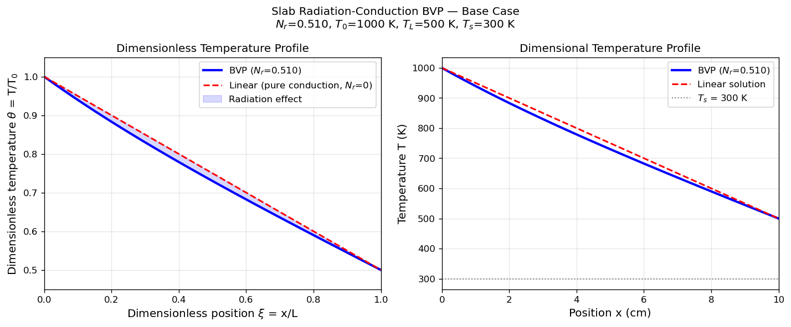
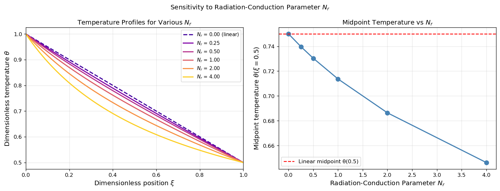
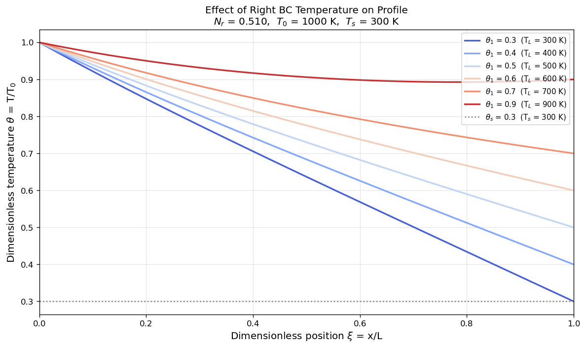
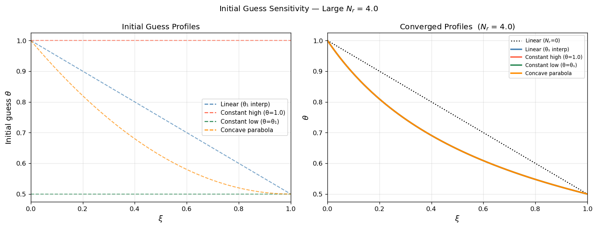

# Unit09 範例六：伴有輻射之平板穩態熱傳溫度分布（BVP）

**課程**：電腦在化工上之應用 (ChemE 3502)｜**單元**：Unit09 邊界值問題

---

## 目錄

1. [背景與目標](#1-背景與目標)
2. [數學模型](#2-數學模型)
3. [Python 實作說明](#3-python-實作說明)
4. [執行結果與解析](#4-執行結果與解析)
5. [工程討論](#5-工程討論)

---

## 1 背景與目標

### 1.1 問題背景

在高溫工業設備中，**輻射換熱**往往與傳導同時存在，且其影響隨溫度的四次方（ $T^4$ ）急劇增強。典型應用場合包括：

- **工業爐壁**：高溫爐膛牆壁同時以傳導（固體側）和輻射（爐膛側）傳遞熱量
- **太空結構**：衛星太陽能板和外殼在無對流的太空環境中僅能靠輻射散熱
- **核能設施**：燃料棒包殼與冷卻劑之間的輻射換熱計算
- **高溫反應器**：固定床觸媒體與爐管外壁之間的輻射熱傳

純傳導問題的溫度分布是線性的（解析解），一旦引入輻射項，方程式即變為**非線性 ODE**，必須採用數值方法求解。本範例正是以此為背景，展示如何使用 `scipy.integrate.solve_bvp()` 求解含 $T^4$ 非線性項的 BVP。

### 1.2 輻射換熱基礎

灰體（Gray Body）輻射的淨熱通量由 **Stefan–Boltzmann 定律**描述：

$$
q_\text{rad} = \varepsilon\, \sigma_{\text{SB}} \left( T^4 - T_s^4 \right)
$$

| 參數 | 符號 | 典型值 |
|------|------|-------|
| 表面輻射率 | $\varepsilon$ | 金屬拋光面 ≈ 0.05；氧化鐵 ≈ 0.90 |
| Stefan–Boltzmann 常數 | $\sigma_{\text{SB}}$ | 5.670×10⁻⁸ W/(m²·K⁴) |
| 表面溫度 | $T$ | 待求 |
| 環境輻射溫度 | $T_s$ | 已知（邊界條件）|

> **關鍵特性**：當 $T \gg T_s$ 時，輻射熱通量以 $T^4$ 量級快速增加，遠超出傳導熱通量（線性於 $\nabla T$ ）。這正是問題非線性的根源。

### 1.3 學習目標

完成本範例後，學生將能夠：

1. 建立含輻射項之穩態熱傳導方程式，並推導無因次化 BVP
2. 理解輻射–傳導參數 $N_r$ 的物理意義與工程影響因素
3. 使用 `scipy.integrate.solve_bvp()` 求解含 $T^4$ 非線性項的 BVP
4. 比較數值解（含輻射）與線性解析解（純傳導）的差異
5. 分析 $N_r$ 與邊界溫度對溫度剖面非線性程度的影響
6. 示範初始猜測值選取對大 $N_r$ 問題收斂性的重要性

---

## 2 數學模型

### 2.1 物理系統設定

考慮厚度 $L$ 的一維平板，熱傳導係數為 $k$ ，兩端維持固定溫度：

$$
T(0) = T_0, \quad T(L) = T_L
$$

平板表面以輻射方式向溫度為 $T_s$ 的低溫環境散熱（ $T > T_s$ ）。

> **物理假設**：穩態、無內部熱源、一維（板面無限大）、灰體輻射

### 2.2 穩態能量方程式

對平板微元進行能量平衡，**傳導散失等於輻射散熱**：

$$
k \frac{d^2T}{dx^2} = \varepsilon\, \sigma_{\text{SB}} \left(T^4 - T_s^4\right) \tag{2.1}
$$

當 $T > T_s$ ，右側 $>0$ （即 $d^2T/dx^2 > 0$ ，剖面**凹向上**），溫度低於純傳導線性解——輻射散熱使板內溫度「向下拉」。

### 2.3 無因次化

引入無因次變數：

$$
\xi = \frac{x}{L},\quad \theta = \frac{T}{T_0}
$$

代入式 (2.1) 並除以 $kT_0/L^2$ ，得到無因次 BVP：

$$
\frac{d^2\theta}{d\xi^2} = N_r \left(\theta^4 - \theta_s^4\right) \tag{2.2}
$$

其中**輻射–傳導參數**（Radiation–Conduction Parameter）：

$$
N_r = \frac{\varepsilon\, \sigma_{\text{SB}}\, T_0^3\, L^2}{k}
$$

無因次邊界條件：

$$
\theta(0) = 1, \qquad \theta(1) = \theta_1 = \frac{T_L}{T_0}, \qquad \theta_s = \frac{T_s}{T_0}
$$

> **純傳導驗算**（ $N_r=0$ ）：式 (2.2) 退化為 $d^2\theta/d\xi^2=0$ ，解為線性分布 $\theta=1+(\theta_1-1)\xi$ ✓

### 2.4 一階系統（供 `solve_bvp` 使用）

令 $y_0=\theta$ 、 $y_1=d\theta/d\xi$ ：

$$
\begin{aligned}
y_0' &= y_1 \\
y_1' &= N_r\left(y_0^4 - \theta_s^4\right)
\end{aligned}
$$

**邊界條件：**

$$
\underbrace{y_0(0)=1}_{\text{左端固定溫度}} \qquad \underbrace{y_0(1)=\theta_1}_{\text{右端固定溫度}}
$$

### 2.5 系統參數（基準案例）

| 參數 | 符號 | 數值 | 說明 |
|------|------|------|------|
| 平板厚度 | $L$ | 0.10 m | 工業爐壁厚度量級 |
| 熱傳導係數 | $k$ | 1.0 W/(m·K) | 耐火磚（低導熱材料）|
| 表面輻射率 | $\varepsilon$ | 0.9 | 高輻射率表面（如氧化鐵）|
| Stefan–Boltzmann 常數 | $\sigma_{\text{SB}}$ | 5.670×10⁻⁸ W/(m²·K⁴) | 物理常數 |
| 左端溫度 | $T_0$ | 1000 K | 高溫端（爐內壁）|
| 右端溫度 | $T_L$ | 500 K | 冷端（爐外壁）|
| 輻射環境溫度 | $T_s$ | 300 K | 外部環境（室溫）|
| 輻射–傳導參數 | $N_r$ | **0.5103** | $\varepsilon\sigma_{\text{SB}}T_0^3 L^2/k$ |
| 右端無因次溫度 | $\theta_1$ | 0.500 | $T_L/T_0$ |
| 環境無因次溫度 | $\theta_s$ | 0.300 | $T_s/T_0$ |

---

## 3 Python 實作說明

### 3.1 套件需求

```python
import numpy as np
import matplotlib.pyplot as plt
from scipy.integrate import solve_bvp
```

| 套件 | 函式 | 用途 |
|------|------|------|
| `numpy` | `np.linspace`, `np.array` | 網格生成、初始猜測向量 |
| `scipy.integrate` | `solve_bvp` | 兩點邊界值問題求解 |
| `matplotlib.pyplot` | `plt.subplots` | 溫度剖面與靈敏度圖形 |

### 3.2 ODE 函式設計（工廠模式）

採用**工廠函式（factory function）**讓 ODE 接受外部參數 $N_r$ 、 $\theta_s$ ，方便靈敏度分析時重複使用：

```python
def make_ode(Nr_val, ts_val):
    ts4 = ts_val**4
    def ode_fun(xi, y):
        return np.array([y[1],
                         Nr_val * (y[0]**4 - ts4)])
    return ode_fun
```

> **說明**：`y[0]` = $\theta$ ，`y[1]` = $d\theta/d\xi$ ；`y[0]**4 - ts4` 即 $\theta^4 - \theta_s^4$ 。

### 3.3 邊界條件函式

`solve_bvp` 要求邊界條件函式回傳長度為 2 的殘差陣列（= 0 表示滿足 BCs）：

```python
def make_bc(th0=1.0, th1=theta1):
    def bc_fun(ya, yb):
        return np.array([ya[0] - th0,   # θ(0) = 1
                         yb[0] - th1])  # θ(1) = θ₁
    return bc_fun
```

### 3.4 初始猜測與求解

以線性插值（純傳導解）作為初始猜測，對各種 $N_r$ 和 $\theta_1$ 均有穩定收斂性：

```python
xi_init  = np.linspace(0.0, 1.0, 80)
theta_g  = 1.0 + (theta1 - 1.0) * xi_init     # θ = 1 + (θ₁-1)ξ
dtheta_g = np.full_like(xi_init, theta1 - 1.0) # dθ/dξ = θ₁-1
y_init   = np.array([theta_g, dtheta_g])

sol = solve_bvp(make_ode(Nr, theta_s),
                make_bc(th0=1.0, th1=theta1),
                xi_init, y_init,
                tol=1e-5, max_nodes=5000)
```

- `sol.sol(xi)` ：插值函數，可在任意 $\xi$ 點求 $[\theta, d\theta/d\xi]$
- `sol.success` ：求解成功旗標
- `sol.rms_residuals.max()` ：最大 RMS 殘差

---

## 4 執行結果與解析

### 4.1 基準案例溫度剖面（圖 fig01）

基準案例（ $N_r=0.5103$ ， $\theta_1=0.5$ ， $\theta_s=0.3$ ）的求解結果：

| 量 | 純傳導（線性）| 含輻射（BVP）| 差異 |
|----|------------|------------|------|
| $\theta(\xi=0.5)$ | 0.7500 | **0.7300** | $-2.7\%$ |
| $T(x=L/2)$ | 750 K | **730 K** | $-20$ K |
| 自適應節點數 | — | 80 | — |
| 最大殘差 | — | 9.02×10⁻⁸ | — |



**圖 4.1** 左圖：無因次溫度剖面，藍色實線為含輻射的 BVP 解，紅色虛線為純傳導線性解，藍色陰影面積代表輻射冷卻效應。右圖：維度溫度分布，可見含輻射的板面溫度全段低於純傳導解，中段偏離最大約 20 K。

**物理解讀**：
- 輻射冷卻效應使板內溫度低於純傳導線性解，差異從兩端（= 0）向中段增大
- $N_r = 0.5103$ 為中等輻射效應，偏差在 $2\sim 3\%$ 量級

### 4.2 輻射–傳導參數 $N_r$ 的影響（圖 fig02）

固定 $\theta_1=0.5$ 、 $\theta_s=0.3$ ，改變 $N_r \in \{0, 0.25, 0.50, 1.0, 2.0, 4.0\}$ ：

| $N_r$ | $\theta(0.5)$ | 節點數 | 說明 |
|--------|------------|--------|------|
| 0.00 | 0.7500 | analytic | 純傳導（線性解析解）✓ |
| 0.25 | 0.7397 | 80 | 輕微偏離 |
| 0.50 | 0.7304 | 80 | 基準案例（ $N_r \approx 0.5103$ ，接近此值）|
| 1.00 | 0.7137 | 80 | 明顯偏離 |
| 2.00 | 0.6864 | 80 | 強輻射效應 |
| 4.00 | 0.6463 | 80 | 極強輻射效應，溫度顯著低於線性 |



**圖 4.2** 左圖：不同 $N_r$ 值的溫度剖面（ $N_r$ 越大，剖面越凹）；右圖：中心無因次溫度隨 $N_r$ 的單調遞減曲線，虛線為線性（純傳導）基準。

### 4.3 邊界溫度 $\theta_1$ 的影響（圖 fig03）

固定 $N_r=0.5103$ 、 $\theta_s=0.3$ ，改變 $\theta_1 \in \{0.3, 0.4, 0.5, 0.6, 0.7, 0.9\}$ ：

| $\theta_1$ | $T_L$ (K) | $\theta(\xi=0.5)$ | 節點數 |
|-----------|----------|-----------------|--------|
| 0.30 | 300 | 0.6367 | 80 |
| 0.40 | 400 | 0.6837 | 80 |
| 0.50 | 500 | 0.7300 | 80（基準）|
| 0.60 | 600 | 0.7755 | 80 |
| 0.70 | 700 | 0.8200 | 80 |
| 0.90 | 900 | 0.9060 | 80 |



**圖 4.3** 右端溫度越高，整條剖面越高，但形狀上仍因輻射而偏低於對應的線性解。灰色虛線標示環境溫度 $\theta_s=0.3$ ；當 $\theta_1=0.3$ 時，右端溫度等於環境，右端輻射效應消失。

### 4.4 初始猜測收斂性（ $N_r=4.0$ ，圖 fig04）

四種不同初始猜測對大 $N_r$ 問題的收斂結果：

| 策略 | $\theta(0.5)$ | 節點數 | 最大殘差 |
|------|------------|--------|---------|
| 線性插值 | 0.6463 | 100 | 1.45×10⁻⁶ |
| 常數高（ $\theta=1.0$ ）| 0.6463 | 190 | 1.45×10⁻⁶ |
| 常數低（ $\theta=\theta_1$ ）| 0.6463 | 100 | 4.61×10⁻⁵ |
| 凹形拋物線 | 0.6463 | 100 | 3.26×10⁻⁶ |



**圖 4.4** 左圖：四種初始猜測形狀；右圖：收斂後的溫度剖面（四條曲線完全重合），確認解的唯一性。常數高初始猜測需要 190 個節點（較多），但最終結果相同。

---

## 5 工程討論

### 5.1 $N_r$ 的工程意義

$N_r = \varepsilon\sigma_{\text{SB}}T_0^3 L^2/k$ 越大，表示輻射效應相對傳導效應越顯著：

| 增大 $N_r$ 的工程因素 | 影響 |
|---------------------|------|
| 提高操作溫度 $T_0$ | 輻射以 $T_0^3$ 快速增大（最敏感的因素）|
| 增厚平板 $L$ | 輻射效應以 $L^2$ 積累 |
| 降低導熱係數 $k$ | 傳導變弱，輻射相對重要性上升 |
| 提高表面輻射率 $\varepsilon$ | 輻射散熱量直接增大 |

**工程啟示**：對薄平板（小 $L$ ）、高導熱材料（大 $k$ ）或低溫操作（小 $T_0$ ）， $N_r \ll 1$ ，純傳導線性近似已足夠精確；反之對厚壁、低導熱、高溫情境，非線性輻射效應不可忽略。

### 5.2 BVP 解的唯一性

本問題的非線性右側函數 $f(\theta) = N_r(\theta^4 - \theta_s^4)$ 是 $\theta$ 的單調遞增函數。根據 BVP 的比較定理，此類**單調性假設**保證了解的唯一性，這也是 §4.4 中各種初始猜測均收斂至同一結果的理論依據。

> **注意**：若非線性項含有多個零點或非單調性（如雙穩態反應項），則可能存在多解，需謹慎選擇初始猜測。

### 5.3 初始猜測選取建議

| 問題特性 | 推薦策略 |
|---------|---------|
| 小至中等 $N_r$（ $\lesssim 4$ ）| 線性插值（最簡單穩定，本例已驗證）|
| 大 $N_r$（ $\gtrsim 4$ ）| 凹形拋物線（與物理解形狀接近，收斂更穩健）|
| 非常大 $N_r$ | 前一個 $N_r$ 的解作為 warm start |
| 多解問題 | 盡量從物理可行的不同初始點出發 |

### 5.4 輻射–傳導問題的工程應用

| 行業 | 應用場景 | 典型 $N_r$ |
|------|---------|-----------|
| 高溫爐設備 | 爐壁溫度分布、隔熱材料設計 | 0.1–1.0 |
| 太空工程 | 衛星結構熱控、太陽能板散熱 | 0.5–5.0 |
| 核能工業 | 燃料棒包殼熱傳分析 | 0.3–2.0 |
| 高溫反應器 | 固定床觸媒體與爐管外壁換熱 | 0.1–0.8 |

### 5.5 本例的數值要點

- **容忍度設定**：`tol=1e-5` 對工程精度已足夠；本例最大殘差約 9×10⁻⁸，遠小於容忍度
- **節點數**：基準案例與 $N_r \leq 4$ 的案例均維持在初始 80–100 個節點，未觸發大量自適應加密，反映問題相對溫和
- **驗算**：設定 $N_r=0$ 時數值解應精確回復線性解析解，本例已驗證 ✓

---

**課程資訊**
- 課程名稱：電腦在化工上之應用 (ChemE 3502)
- 課程單元：Unit09 邊界值問題 — 範例 06：伴有輻射之平板穩態熱傳溫度分布
- 課程製作：逢甲大學 化工系 智慧程序系統工程實驗室
- 授課教師：莊曜禎 助理教授
- 更新日期：2026-02-22

**課程授權 [CC BY-NC-SA 4.0]**
 - 本教材遵循 [創用CC 姓名標示-非商業性-相同方式分享 4.0 國際 (CC BY-NC-SA 4.0)](https://creativecommons.org/licenses/by-nc-sa/4.0/deed.zh) 授權。

---
