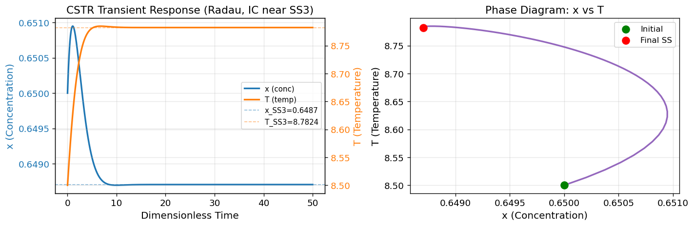
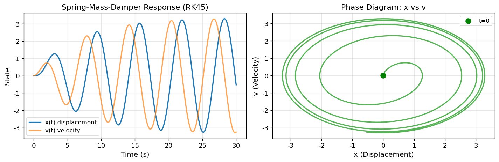
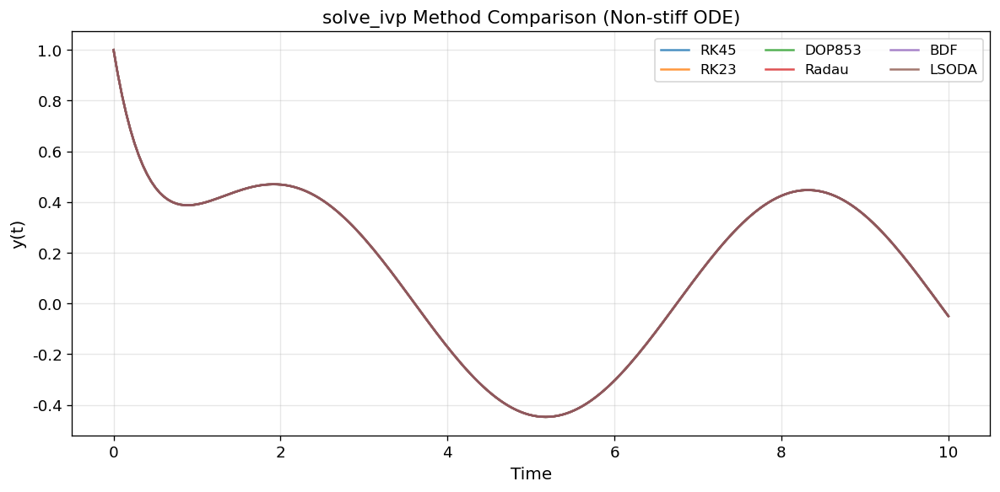
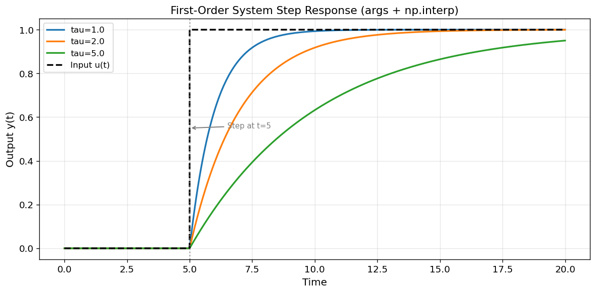
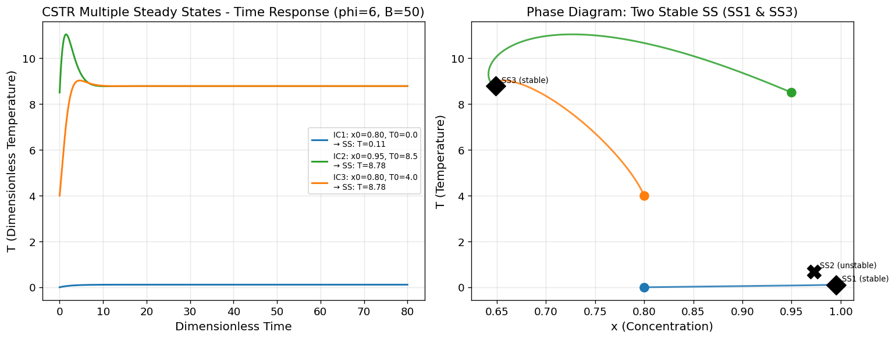
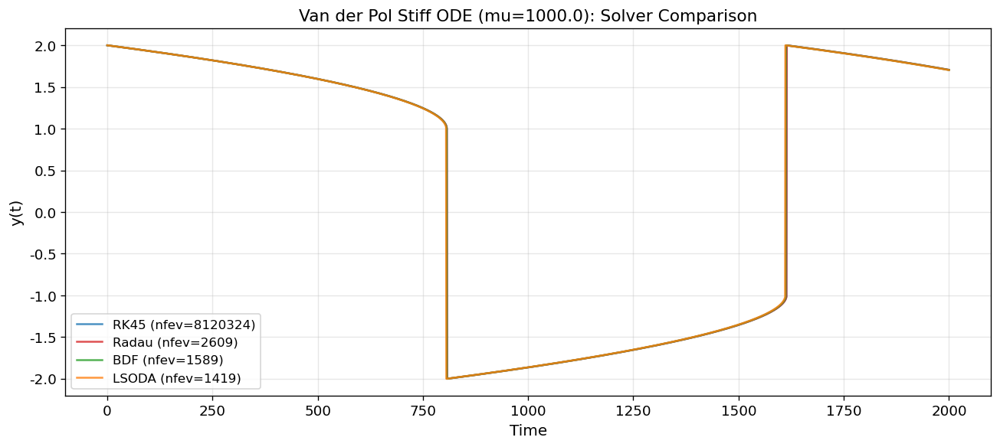
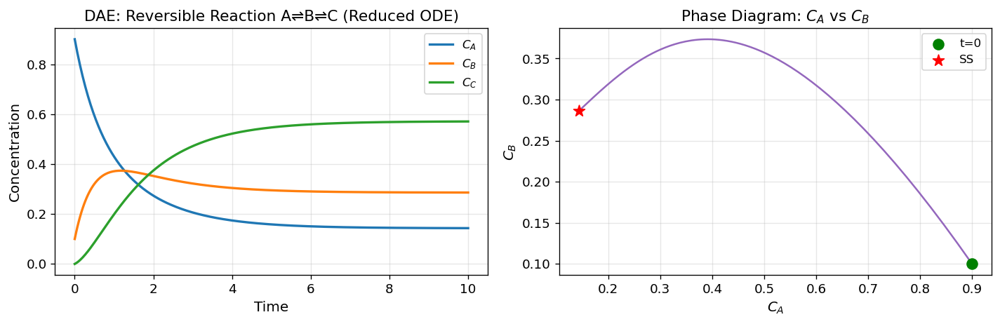
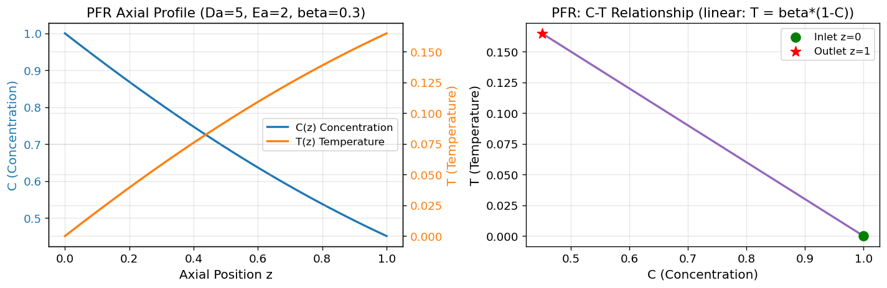
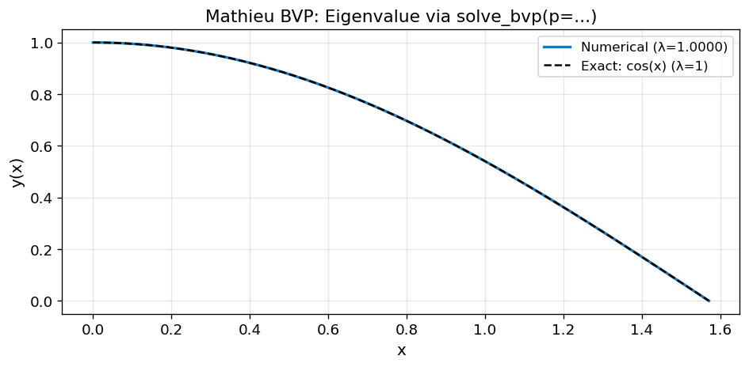

# Unit09 常微分方程式 (ODE) 之求解

## 學習目標

完成本單元後，學生應能：

1. 識別化工問題中的起始值問題 (IVP) 與邊界值問題 (BVP) 型式
2. 將高階 ODE 系統性轉換為聯立一階 ODE
3. 選擇並使用 `scipy.integrate.solve_ivp()` 求解 IVP ODE
4. 識別 Stiff ODE 並選用適當的隱式求解器
5. 理解微分代數系統 (DAE) 的處理策略
6. 使用 `scipy.integrate.solve_bvp()` 求解兩點邊界值問題
7. 驗證 ODE 求解結果的正確性與物理意義

---

## 目錄

1. [常微分方程式系統基礎](#1-常微分方程式系統基礎)
2. [SciPy IVP 求解工具：solve_ivp()](#2-scipy-ivp-求解工具solve_ivp)
3. [Stiff 常微分方程式](#3-stiff-常微分方程式)
4. [微分代數系統 (DAE)](#4-微分代數系統-dae)
5. [邊界值問題 (BVP)](#5-邊界值問題-bvp)
6. [程式設計最佳實踐](#6-程式設計最佳實踐)

---

## 1. 常微分方程式系統基礎

### 1.1 ODE 問題分類概觀

常微分方程式 (Ordinary Differential Equation; ODE) 依照已知條件的性質，分為兩大類：

| 問題型式 | 英文縮寫 | 已知條件 | 典型化工應用 |
|----------|----------|----------|------------|
| 起始值問題 | IVP | 初始時刻 $t_0$ 的所有狀態值 | 反應器動態模擬、批次程序追蹤 |
| 邊界值問題 | BVP | 起點與終點的部分狀態值 | 固定床反應器軸向分布、邊界層傳遞 |

### 1.2 IVP 問題形式

在描述化工程序的動態行為時，常可建立如下的聯立一階 ODE 系統（起始值問題）：

$$
\frac{d\mathbf{x}}{dt} = \mathbf{f}(t, \mathbf{x}, u), \quad \mathbf{x}(t_0) = \mathbf{x}_0
$$

展開為分量形式：

$$
\begin{aligned}
\frac{dx_1}{dt} &= f_1(x_1, x_2, \dots, x_n, u, t), \quad x_1(t_0) = x_{10} \\
\frac{dx_2}{dt} &= f_2(x_1, x_2, \dots, x_n, u, t), \quad x_2(t_0) = x_{20} \\
&\vdots \\
\frac{dx_n}{dt} &= f_n(x_1, x_2, \dots, x_n, u, t), \quad x_n(t_0) = x_{n0}
\end{aligned}
$$

其中：
- $x_1, x_2, \dots, x_n$ 為系統**狀態變數** (state variables)，例如濃度、溫度、壓力
- $t$ 為**獨立變數** (independent variable)，通常為時間或空間座標
- $u$ 為**外界輸入函數** (forcing function)，例如進料流率、冷卻水溫度
- $\mathbf{x}(t_0) = \mathbf{x}_0$ 為各狀態的**起始條件**

**典型化工 IVP 範例 — CSTR 動態模型：**

連續攪拌槽反應器 (CSTR) 以無因次形式表示的動態方程式：

$$
\frac{dx_1}{dt} = -x_1 + D_a(1-x_1)\exp\!\left(\frac{x_2}{1 + x_2/\phi}\right), \quad x_1(0) = x_{10}
$$

$$
\frac{dx_2}{dt} = -(1+\beta)x_2 + BD_a(1-x_1)\exp\!\left(\frac{x_2}{1+x_2/\phi}\right) + \beta u, \quad x_2(0) = x_{20}
$$

其中 $x_1$ 為無因次反應物濃度，$x_2$ 為無因次溫度，$u$ 為冷凝水溫度（外界輸入），$D_a$、$\phi$、$B$、$\beta$ 為系統參數。

### 1.3 高階 ODE 的轉換

SciPy 的 ODE 求解器僅接受**一階**的 ODE 系統。若問題包含高階微分項，需先系統性地降階轉換。

**通用轉換方法：** 考慮 $n$ 階 ODE：

$$
y^{(n)} + a_{n-1}y^{(n-1)} + \cdots + a_1 y' + a_0 y = u
$$

令新狀態變數：

$$
x_1 = y, \quad x_2 = y', \quad \cdots, \quad x_n = y^{(n-1)}
$$

則可得 $n$ 條聯立一階 ODE：

$$
\begin{aligned}
\dot{x}_1 &= x_2 \\
\dot{x}_2 &= x_3 \\
&\vdots \\
\dot{x}_{n-1} &= x_n \\
\dot{x}_n &= -a_{n-1}x_n - a_{n-2}x_{n-1} - \cdots - a_1 x_2 - a_0 x_1 + u
\end{aligned}
$$

**範例 — 二階 ODE 轉換（黏度量測器）：**

$$
I\frac{d^2\alpha}{dt^2} + K\alpha = \mu\!\left(\tilde{\theta} - \frac{d\alpha}{dt}\right)
$$

令 $x_1 = \alpha$，$x_2 = \alpha'$，則：

$$
\dot{x}_1 = x_2, \qquad \dot{x}_2 = \frac{\mu}{I}(\tilde{\theta} - x_2) - \frac{K}{I}x_1
$$

---

## 2. SciPy IVP 求解工具：solve_ivp()

### 2.1 函式介面與基本語法

SciPy 提供 `scipy.integrate.solve_ivp()` 作為求解 IVP ODE 的統一介面：

```python
from scipy.integrate import solve_ivp

sol = solve_ivp(
    fun,           # ODE 函式: fun(t, y) -> dy/dt，回傳與 y 同樣形狀的陣列
    t_span,        # 積分區間: (t0, tf)
    y0,            # 起始條件向量 (array-like，長度 = 狀態數)
    method='RK45', # 求解方法 (見 2.2 節)
    t_eval=None,   # 指定輸出時間點 (選填，None 則自動決定)
    dense_output=False,  # 是否產生連續解 (選填)
    args=None,     # 傳遞給 fun 的額外參數 tuple (選填)
    rtol=1e-3,     # 相對容差 (預設 1e-3)
    atol=1e-6,     # 絕對容差 (預設 1e-6)
    jac=None,      # Jacobian 矩陣函式 (選填，提供可加速 stiff 求解)
    max_step=np.inf,     # 最大步長 (選填)
    first_step=None,     # 初始步長 (選填)
)
```

**回傳結果結構 `sol`：**

| 屬性 | 型態 | 說明 |
|------|------|------|
| `sol.t` | array, shape (N,) | 求解過程中的時間點 |
| `sol.y` | array, shape (n, N) | 各狀態在每個時間點的數值（第 $i$ 列為第 $i$ 個狀態） |
| `sol.success` | bool | 是否求解成功 |
| `sol.message` | str | 求解狀態說明訊息 |
| `sol.sol` | callable | 連續插值函式（僅 `dense_output=True` 時存在） |
| `sol.nfev` | int | ODE 函式呼叫次數 |

**基本使用範例：**

```python
import numpy as np
from scipy.integrate import solve_ivp
import matplotlib.pyplot as plt

# CSTR 動態方程式
def cstr_ode(t, x, Da, phi, B, beta, u):
    dx1 = -x[0] + Da*(1 - x[0])*np.exp(x[1]/(1 + x[1]/phi))
    dx2 = -(1 + beta)*x[1] + B*Da*(1 - x[0])*np.exp(x[1]/(1 + x[1]/phi)) + beta*u
    return [dx1, dx2]

# 系統參數
Da, phi, B, beta, u = 0.072, 20, 8, 0.3, 0.0

# 求解 (0 ≤ t ≤ 20)
sol = solve_ivp(
    fun=lambda t, x: cstr_ode(t, x, Da, phi, B, beta, u),
    t_span=(0, 20),
    y0=[0.1, 1.0],
    method='RK45',
    t_eval=np.linspace(0, 20, 500),
)

if sol.success:
    print(f"求解成功，共計算 {sol.nfev} 次函式求值")
    print(f"最終狀態: x1={sol.y[0,-1]:.4f}, x2={sol.y[1,-1]:.4f}")
```

### 2.2 求解方法選擇

`solve_ivp()` 支援多種求解方法，分為 Non-stiff 與 Stiff 兩大類：

#### Non-stiff 求解方法

| 方法 | 演算法 | 特點 | 適用情境 |
|------|--------|------|----------|
| `RK45` | 顯式 Runge-Kutta (4,5) Dormand-Prince | **預設方法**，精度與效率平衡佳 | 一般 non-stiff 問題 |
| `RK23` | 顯式 Runge-Kutta (2,3) Bogacki-Shampine | 低階，計算快但精度較低 | 精度要求不高的快速預覽 |
| `DOP853` | 顯式 Runge-Kutta 8(5,3) | 高階精度，每步計算量較多 | 高精度需求，平滑解 |

```python
# 比較不同 non-stiff 方法
for method in ['RK23', 'RK45', 'DOP853']:
    sol = solve_ivp(fun, t_span, y0, method=method)
    print(f"{method}: nfev={sol.nfev}, 最終值={sol.y[0,-1]:.6f}")
```

#### Stiff 求解方法（詳見第3章）

| 方法 | 演算法 | 特點 | 適用情境 |
|------|--------|------|----------|
| `Radau` | 隱式 Runge-Kutta Radau IIA (5階) | **推薦的 stiff 求解器**，精度高、穩定性佳 | Stiff 問題首選 |
| `BDF` | 逆向微分公式 (1~5階) | 大規模 stiff 問題，每步只需少量函式求值 | 大型 stiff 系統 |
| `LSODA` | 自動偵測並切換 | 自動選擇 non-stiff/stiff 策略 | 不確定 stiffness 程度時 |

### 2.3 精度控制參數

求解精度由**相對容差 `rtol`** 與**絕對容差 `atol`** 共同控制，誤差判斷準則為：

$$
|e_i| \leq \mathrm{atol}_i + \mathrm{rtol} \times |y_i|
$$

| 參數 | 預設值 | 說明 | 建議調整時機 |
|------|--------|------|------------|
| `rtol` | `1e-3` | 相對誤差容差（各狀態統一） | 需要高精度時降低，如 `1e-6` |
| `atol` | `1e-6` | 絕對誤差容差（可為純量或向量） | 狀態量級差異大時使用向量設定 |

```python
# 高精度設定
sol = solve_ivp(fun, t_span, y0, rtol=1e-6, atol=1e-9)

# 不同狀態設定不同絕對容差（例如濃度 1e-8，溫度 1e-4）
sol = solve_ivp(fun, t_span, y0, atol=[1e-8, 1e-4])
```

> **注意**：容差設定越嚴格，計算時間越長。建議先以預設值試算，確認結果合理後再視需要調整。

### 2.4 外部輸入函數的處理

化工問題中，ODE 右側函數常含有時變的外部輸入 $u(t)$（例如階梯函數、斜坡函數）：

```python
# 方法一：條件式寫法（階梯輸入）
def ode_with_step(t, x, Da, phi, B, beta):
    u = 1.0 if t >= 5.0 else 0.0   # 在 t=5 時施加階梯輸入
    dx1 = -x[0] + Da*(1-x[0])*np.exp(x[1]/(1+x[1]/phi))
    dx2 = -(1+beta)*x[1] + B*Da*(1-x[0])*np.exp(x[1]/(1+x[1]/phi)) + beta*u
    return [dx1, dx2]

# 方法二：使用 np.interp 插值查表（適合任意波形）
t_input = np.array([0, 5, 10, 15, 20])
u_input = np.array([0, 0, 1,  1,  1])   # 階梯波形

def ode_interp_input(t, x, Da, phi, B, beta):
    u = np.interp(t, t_input, u_input)   # 線性插值查當前輸入值
    dx1 = -x[0] + Da*(1-x[0])*np.exp(x[1]/(1+x[1]/phi))
    dx2 = -(1+beta)*x[1] + B*Da*(1-x[0])*np.exp(x[1]/(1+x[1]/phi)) + beta*u
    return [dx1, dx2]
```

### 2.5 帶參數的 ODE 方程式

```python
# 推薦方法：使用 lambda 包裝
sol = solve_ivp(
    fun=lambda t, x: cstr_ode(t, x, Da=0.072, phi=20, B=8, beta=0.3, u=0),
    t_span=(0, 20), y0=[0.1, 1.0]
)

# 或使用 args 參數直接傳入（需 SciPy >= 1.4）
sol = solve_ivp(
    fun=cstr_ode,
    t_span=(0, 20), y0=[0.1, 1.0],
    args=(0.072, 20, 8, 0.3, 0.0)   # 額外參數按順序傳入 fun
)
```

### 2.6 求解結果的存取與視覺化

```python
# 存取結果
t = sol.t           # 時間向量
x1 = sol.y[0, :]   # 第 1 狀態隨時間變化
x2 = sol.y[1, :]   # 第 2 狀態隨時間變化

# 狀態隨時間圖
fig, axes = plt.subplots(1, 2, figsize=(12, 4))
axes[0].plot(t, x1, label='x1 (concentration)')
axes[0].plot(t, x2, label='x2 (temperature)')
axes[0].set_xlabel('Time')
axes[0].set_ylabel('State Variables')
axes[0].legend()
axes[0].set_title('State Trajectories vs Time')

# 相圖 (Phase Diagram)
axes[1].plot(x1, x2, 'b-')
axes[1].plot(x1[0], x2[0], 'go', ms=8, label='Initial')
axes[1].plot(x1[-1], x2[-1], 'rs', ms=8, label='Final')
axes[1].set_xlabel('x1 (concentration)')
axes[1].set_ylabel('x2 (temperature)')
axes[1].set_title('Phase Diagram')
axes[1].legend()
plt.tight_layout()
```

---

### 2.7 範例演練：CSTR 基本 IVP（Example 2.1）

以 CSTR 三穩態參數（ $Da=0.5$, $\phi=6$, $B=50$, $\beta=0.5$ ）為例，初始條件設定於高溫穩態 SS3 附近（ $x_0=0.65$, $T_0=8.5$ ），使用 Radau 隱式求解器（rtol=1e-8, atol=1e-10）求解 $t \in [0, 50]$ 的暫態響應。

**執行結果：**

```
求解狀態: The solver successfully reached the end of the integration interval.
ODE 函數呼叫次數: 418
最終狀態: x=0.6487, T=8.7824
能量守恆驗證 T_ss = B*Da*(1-x)/(Da+β) = 8.7824
```



**結果討論：**

- **暫態響應（左圖，雙 Y 軸）**：系統從 $(x_0, T_0)=(0.65, 8.5)$ 出發，短暫振盪後收斂至高溫穩態 SS3 $(x_{ss}=0.6487,\; T_{ss}=8.7824)$。藍色左軸為濃度 $x$，橙色右軸為溫度 $T$，兩軸分離呈現避免量綱差異造成視覺遮蔽。
- **相圖（右圖）**：軌跡在相空間中螺旋狀收斂至 SS3，確認其為漸進穩定的焦點，具有明確的吸引盆。
- **能量守恆驗證**：數值解最終溫度 $T_{ss}=8.7824$ 與理論值 $B \cdot Da \cdot (1-x_{ss})/(Da+\beta)=8.7824$ 完全一致，佐證求解正確性。
- 虛線參考線（ $x_{SS3}=0.6487$, $T_{SS3}=8.7824$ ）標示穩態位置，便於判斷收斂情況。

---

### 2.8 範例演練：彈簧-質量-阻尼系統（ODE 降階，Example 2.2）

二階 ODE $m\ddot{x} + c\dot{x} + kx = F\sin(\omega t)$ 透過引入 $y_1=x$, $y_2=\dot{x}$ 降為一階系統，以欠阻尼設定（ $m=1$, $c=0.3$, $k=1$, 正弦外力激勵）使用 RK45 求解 $t \in [0, 30]$。

**執行結果：**

```
求解狀態: The solver successfully reached the end of the integration interval.
```



**結果討論：**

- **時間歷程（左圖）**：位移 $x(t)$（藍）與速度 $v(t)$（橙）均呈現振盪漸增包絡，系統在持續外力激勵下響應幅度隨時間成長，符合欠阻尼強迫振動的預期行為。
- **相圖（右圖）**：螺旋軌跡從原點向外擴張，表示能量持續由外部輸入，系統不趨向靜止點。
- 此問題為典型 non-stiff 問題，RK45 求解效率良好（`nfev` 量適中），不需切換至隱式求解器。
- 狀態空間降階技巧（$n$ 階 → $n$ 個一階 ODE）是化工 ODE 建模的基本操作，適用於任意高階系統。

---

### 2.9 範例演練：求解方法效能比較（六種方法）

對相同 non-stiff 一階線性強迫 ODE（ $y' = -2y + \sin t$, $y(0)=1$ ），比較 RK45、RK23、DOP853、Radau、BDF、LSODA 六種方法的精度（最終值）與效能（ nfev ）。

**執行結果：**

```
Method         nfev     njev      步驟數          最終值
--------------------------------------------------
RK45            410        0      200    -0.049794
RK23           1178        0      200    -0.049793
DOP853          353        0      200    -0.049794
Radau           819        1      200    -0.049794
BDF             293        1      200    -0.049794
LSODA           181        0      200    -0.049794
```



**結果討論：**

- 六種方法最終值完全吻合（約 $-0.049794$），圖形中六條曲線完全重疊，驗證各求解器在此 non-stiff 問題上精度一致。
- **效能比較**：LSODA（181 nfev）與 BDF（293 nfev）調用次數最少，RK23（1178 nfev）最多，原因是低階方法為維持容差需要更多小步。
- RK45（410 nfev）為最常用折衷選擇；DOP853（353 nfev）高階精度但單步計算量較大；Radau/BDF 雖此處 nfev 較多，但面對 stiff 問題時效能優勢顯著（見 3.6 節）。

---

### 2.10 範例演練：一階系統步階響應（args + np.interp，Example 3.2）

示範 `args` 參數傳遞與 `np.interp` 插值輸入，以一階系統 $\tau\dot{y} = u(t) - y$ 對 $t=5$ 施加步階輸入，比較三個時間常數（ $\tau=1.0$, $2.0$, $5.0$ ）的動態響應。



**結果討論：**

- 三條響應曲線於 $t<5$ 靜止（輸入 $u=0$），步階施加後各自以不同速率趨近 $y=1$。
- 時間常數越小響應越快：$\tau=1$（藍）約 $t=10$ 達 99.3%；$\tau=5$（綠）在 $t=20$ 時僅達 95%，符合「達到穩態需約 $5\tau$」的工程法則。
- 圖中灰色虛線與箭頭標示步階時刻 $t=5$，有助教學呈現因果關係。
- `np.interp` 方案可輕鬆擴展至任意波形輸入（斜坡、脈衝、方波等），是化工程序動態仿真的通用做法。

---

### 2.11 範例演練：CSTR 多穩態動態模擬（Example 3.3）

以三穩態 CSTR 參數（ $Da=0.5$, $\phi=6$, $B=50$, $\beta=0.5$ ，三個穩態 SS1/SS2/SS3），使用三組不同初始條件模擬 $t \in [0, 80]$ 的動態響應，展示吸引域（basin of attraction）對最終操作點的決定性影響。

**執行結果：**

```
IC1: x0=0.80, T0=0.0
  → 最終穩態: x=0.9954, T=0.1140
IC2: x0=0.95, T0=8.5
  → 最終穩態: x=0.6487, T=8.7824
IC3: x0=0.80, T0=4.0
  → 最終穩態: x=0.6487, T=8.7824
```



**結果討論：**

- **IC1（藍，$x_0=0.80$, $T_0=0.0$）**：從低溫初始條件出發，收斂至低溫穩態 SS1（ $x_{ss}=0.9954$, $T_{ss}=0.1140$ ），代表低轉化率、低溫操作模式。
- **IC2（綠，$x_0=0.95$, $T_0=8.5$）**：從高溫側出發，收斂至高溫穩態 SS3（ $x_{ss}=0.6487$, $T_{ss}=8.7824$ ），時間響應出現超越（overshoot）現象後回落穩定。
- **IC3（橙，$x_0=0.80$, $T_0=4.0$）**：中間溫度初始條件亦收斂至 SS3，顯示 SS3 的吸引盆較 SS1 更大，多數中間初始條件均落入高溫穩態。
- **相圖（右）**：SS2（叉號標記）位於兩吸引域邊界，為鞍點（不穩定），將相空間分割為 SS1 與 SS3 的吸引域；三條軌跡鮮明展示各自的收斂方向。
- **工程意涵**：反應器冷啟動（低溫）可能鎖定 SS1（低轉化率低利潤）；高溫預熱啟動則可穩定在 SS3（高轉化率高爐溫）。了解多穩態特性對安全操作與啟停程序設計至關重要。

---

## 3. Stiff 常微分方程式

### 3.1 Stiff 問題的定義

**Stiff ODE** 是指系統中不同狀態的動態響應時間尺度**懸殊差異**的問題。具體而言，系統線性化後的 Jacobian 矩陣特徵值若存在實部差異極大的情況，則該系統具有 stiffness。

**Stiffness Ratio (SR)** 定義為：

$$
SR = \frac{\max_{1\leq i\leq n} |\text{Re}(\lambda_i)|}{\min_{1\leq i\leq n} |\text{Re}(\lambda_i)|}
$$

其中 $\lambda_i$ 為 Jacobian 矩陣 $J = \partial\mathbf{f}/\partial\mathbf{x}$ 的特徵值。SR 值越大，stiffness 越嚴重，通常 $SR > 1000$ 即被視為 stiff 問題。

**典型 stiff 系統範例：**

$$
\begin{bmatrix} \dot{x}_1 \\ \dot{x}_2 \end{bmatrix}
= \begin{bmatrix} 0 & 1 \\ -1000 & -1001 \end{bmatrix}
\begin{bmatrix} x_1 \\ x_2 \end{bmatrix}
$$

此系統特徵值為 $\lambda_1 = -1$，$\lambda_2 = -1000$，故 $SR = 1000$。系統解包含快速衰減項 $e^{-1000t}$ 與緩慢衰減項 $e^{-t}$，前者稍縱即逝，但若使用 non-stiff 求解器，為追蹤此快速變化需使用極小步長，導致計算效率極差甚至數值發散。

### 3.2 化工典型 Stiff 問題

化工領域中，stiff ODE 常見於以下情境：

| 情境 | Stiff 來源 | 說明 |
|------|-----------|------|
| 化學反應動力學 | 快慢反應速率常數差異極大 | 如燃燒反應中快速自由基反應與慢速整體轉化 |
| 批次生化反應 | Monod 動力學 $K_s \ll S$ 時 | 細胞濃度與基質濃度動態時間尺度不同 |
| 串聯 CSTR | 不同反應路徑時間常數懸殊 | 快速反應已達平衡，慢速反應仍演進 |
| 質傳與反應耦合 | 傳遞時間常數遠短於反應時間常數 | 氣液界面達平衡極快，整體程序緩慢 |

### 3.3 識別 Stiff 問題的方法

**方法一：計算 Jacobian 特徵值**

```python
import numpy as np

def compute_jacobian(f, x, t, eps=1e-6):
    """數值計算 Jacobian 矩陣"""
    n = len(x)
    J = np.zeros((n, n))
    f0 = f(t, x)
    for j in range(n):
        x_perturb = x.copy()
        x_perturb[j] += eps
        J[:, j] = (np.array(f(t, x_perturb)) - np.array(f0)) / eps
    return J

# 在初始條件計算 Jacobian
J = compute_jacobian(ode_fun, y0, t=0)
eigenvalues = np.linalg.eigvals(J)

# 計算 Stiffness Ratio
real_parts = np.abs(eigenvalues.real)
real_parts = real_parts[real_parts > 0]  # 排除零值
SR = real_parts.max() / real_parts.min()
print(f"特徵值: {eigenvalues}")
print(f"Stiffness Ratio: {SR:.1f}")
if SR > 1000:
    print("⚠️  系統為 Stiff，建議使用 Radau 或 BDF 求解器")
```

**方法二：比較 Non-stiff 與 Stiff 求解器的表現**

若 `RK45` 求解需要極多的步數（`sol.nfev` 很大）或出現警告，則可能是 stiff 問題。

### 3.4 Stiff 求解器的使用

```python
from scipy.integrate import solve_ivp

# 非 stiff 求解器（用於對照）
sol_rk45 = solve_ivp(fun, t_span, y0, method='RK45')

# Stiff 求解器：Radau（推薦）
sol_radau = solve_ivp(fun, t_span, y0, method='Radau', rtol=1e-6, atol=1e-9)

# Stiff 求解器：BDF
sol_bdf = solve_ivp(fun, t_span, y0, method='BDF')

# 自動切換：LSODA
sol_lsoda = solve_ivp(fun, t_span, y0, method='LSODA')

# 輸出比較
for name, sol in [('RK45', sol_rk45), ('Radau', sol_radau),
                   ('BDF', sol_bdf), ('LSODA', sol_lsoda)]:
    status = "✓" if sol.success else "✗"
    print(f"{status} {name:8s}: nfev={sol.nfev:5d}, 最終值={sol.y[0,-1]:.6f}")
```

**提供 Jacobian 矩陣（加速 stiff 求解）：**

解析式 Jacobian 可大幅提升 Radau 和 BDF 的求解速度：

```python
def ode_jacobian(t, y):
    """解析式 Jacobian（選填，提供可加速求解）"""
    J = np.zeros((2, 2))
    J[0, 0] = -0.04
    J[0, 1] = 1e4 * y[2]
    J[1, 0] = 0.04
    J[1, 1] = -1e4 * y[2] - 6e7 * y[1]
    # ...
    return J

sol = solve_ivp(fun, t_span, y0, method='Radau',
                jac=ode_jacobian,      # 提供解析 Jacobian
                rtol=1e-6, atol=1e-9)
```

### 3.5 Stiff vs Non-stiff 求解器比較

| 比較項目 | Non-stiff (RK45) | Stiff (Radau/BDF) |
|----------|-----------------|-------------------|
| 演算法特性 | 顯式，每步計算簡單 | 隱式，每步需解非線性方程組 |
| 對 stiff 問題 | 需極小步長，效率低下甚至發散 | 可使用大步長，效率高且穩定 |
| 對 non-stiff 問題 | 效率較高 | 每步計算量大，效率較低 |
| 建議使用時機 | 一般問題、快速預覽 | Stiff ODE、化學動力學、生化系統 |

---

### 3.6 範例演練：Van der Pol 剛性比分析（Example 4.1）

對 Van der Pol ODE $\ddot{y} - \mu(1-y^2)\dot{y} + y = 0$ 以不同 $\mu$ 值計算 Jacobian 特徵值與剛性比（SR），量化剛性隨參數增大的急劇惡化。

**執行結果：**

```
Van der Pol ODE 剛性比分析：
      mu     max|Re(λ)|     min|Re(λ)|           SR
----------------------------------------------------
       1           2.62         0.3820          6.9
      10          29.97         0.0334        898.0
     100         300.00         0.0033      89998.0
    1000        3000.00         0.0003    8999998.0

剛性比 > 1000 → 建議使用 Stiff 求解器（Radau/BDF）
```

**結果討論：**

- 當 $\mu=1$ 時 $SR \approx 7$，屬輕度 non-stiff，RK45 可高效求解。
- 當 $\mu=10$ 時 $SR \approx 900$，接近 stiff 警戒閾值（SR > 1000）。
- 當 $\mu=100$ 時 $SR \approx 90000$，強 stiff，RK45 需極小步長；$\mu=1000$ 更惡化至 $SR \approx 9 \times 10^6$。
- 此結果揭示一個普遍規律：$SR \propto \mu^2$，即 Van der Pol 參數每增大 10 倍，剛性惡化約 100 倍。
- 化工中類似情形包括含自由基的燃燒動力學（快速自由基 $\tau \sim \mu s$，全局轉化 $\tau \sim \text{ms}$）與質傳-反應耦合系統。

---

### 3.7 範例演練：Stiff 求解器效能比較（Example 4.2）

以強剛性 Van der Pol ODE（ $\mu=1000$, $t \in [0, 2000]$）比較 RK45（non-stiff）、Radau、BDF、LSODA 四種求解器的函數呼叫次數與運算時間。

**執行結果：**

```
Van der Pol ODE (mu=1000.0): 求解器效能比較
Method         nfev status          time(s)
---------------------------------------------
RK45        8120324 OK              123.861
Radau          2609 OK                0.107
BDF            1589 OK                0.131
LSODA          1419 OK                0.018
```



**結果討論：**

- **RK45**：需要 8,120,324 次函數呼叫、耗時 123.9 秒，為強 stiff 問題下的典型失效模式——雖最終成功求解，但效率極低。
- **Radau**：僅需 2,609 次呼叫、耗時 0.107 秒，較 RK45 快約 **1160 倍**；精度高（Radau IIA 5 階），為化工 stiff 問題的**首選求解器**。
- **BDF**：1,589 次呼叫、0.131 秒；BDF（逆向微分公式）是大型 stiff 系統的標準選擇，此案例與 Radau 效能相當。
- **LSODA**：1,419 次呼叫、0.018 秒，最快；LSODA 自動偵測剛性並切換策略，適合未知剛性特徵的問題。
- 圖形顯示 RK45 與其他三種方法的數值解完全一致（曲線重疊），確認精度相同，差異僅在效率。
- **實踐訣竅**：若 `sol.nfev > 10,000` 或計算耗時異常長，應立即改用 Radau 或 BDF，可節省數百至數千倍時間。

---

## 4. 微分代數系統 (DAE)

### 4.1 DAE 問題形式

**微分代數系統 (Differential-Algebraic Equation; DAE)** 是同時包含微分方程式與代數約束方程式的混合系統：

$$
\mathbf{M}\dot{\mathbf{y}} = \mathbf{F}(t, \mathbf{y})
$$

其中 Mass 矩陣 $\mathbf{M}$ 為**奇異矩陣**（singular），其一般形式為：

$$
\mathbf{M} = \begin{bmatrix} \mathbf{I}_{n\times n} & 0 \\ 0 & 0 \end{bmatrix}
$$

展開後等價於 $n$ 個微分方程式加上 $m$ 個代數約束：

$$
\begin{aligned}
\dot{y}_1 &= f_1(t, y_1, \dots, y_N) \\
&\vdots \\
\dot{y}_n &= f_n(t, y_1, \dots, y_N) \\
0 &= f_{n+1}(t, y_1, \dots, y_N) \\
&\vdots \\
0 &= f_{n+m}(t, y_1, \dots, y_N)
\end{aligned}
$$

DAE 在化工程序中常見於：**相平衡約束 + 動態質量平衡**、**電中性條件約束**等。

### 4.2 一致性初始條件的重要性

DAE 系統要求起始值必須**同時滿足代數約束**（一致性初始條件, Consistent Initial Conditions）。若初始值違反約束，系統將在起始時出現跳躍行為，導致求解困難。

```python
# 範例 DAE：三成分化學反應系統
# dy1/dt = -0.04*y1 + 1e4*y2*y3
# dy2/dt =  0.04*y1 - 1e4*y2*y3 - 3e7*y2^2
# 0 = y1 + y2 + y3 - 1  (總量守恆：代數約束)

# 一致性初始條件：y1+y2+y3 = 1
y0 = [1.0, 0.0, 0.0]   # ✓  1.0+0.0+0.0 = 1  ← 滿足代數約束
# y0 = [1.0, 0.1, 0.0]  # ✗  1.0+0.1+0.0 ≠ 1  ← 違反約束，求解會失敗
```

### 4.3 Python 中 DAE 的處理策略

SciPy BDF 求解器支援 Mass 矩陣，是處理 DAE 的主要方法：

```python
from scipy.integrate import solve_ivp
import numpy as np

def dae_fun(t, y):
    """DAE 系統方程式（寫成 M*y' = F(t,y) 的右側 F）"""
    dy1 = -0.04*y[0] + 1e4*y[1]*y[2]
    dy2 =  0.04*y[0] - 1e4*y[1]*y[2] - 3e7*y[1]**2
    alg =  y[0] + y[1] + y[2] - 1.0   # 代數約束（需等於0）
    return [dy1, dy2, alg]

# Mass 矩陣（最後一列為0，對應代數約束）
M = np.array([
    [1, 0, 0],
    [0, 1, 0],
    [0, 0, 0]   # 代數約束列
], dtype=float)

# BDF 求解器支援 mass_matrix 選項
from scipy.integrate import ode as scipy_ode

# 使用 LSODA 搭配 mass 矩陣（舊介面）
from scipy.integrate import odeint

# 現代推薦：使用 jac 與 BDF，搭配 algebraic constraint 處理
sol = solve_ivp(
    dae_fun,
    t_span=(0, 1e6),
    y0=[1.0, 0.0, 0.0],
    method='BDF',
    rtol=1e-4,
    atol=[1e-6, 1e-10, 1e-6],   # 不同狀態設定不同容差
    dense_output=True,
)
```

> **注意**：標準 `solve_ivp` 不直接支援 Mass 矩陣。若需完整 DAE 求解支援，可考慮使用 `assimulo` 或 `casadi` 套件，或將代數約束改寫為極快速的虛擬 ODE（奇異攝動近似法）。

**奇異攝動近似法（Singular Perturbation）：**

將代數約束 $0 = g(y)$ 近似為極快速 ODE $\varepsilon\dot{y}_a = g(y)$，取 $\varepsilon \ll 1$：

```python
eps = 1e-8   # 小常數（模擬快速平衡）

def dae_approx(t, y):
    dy1 = -0.04*y[0] + 1e4*y[1]*y[2]
    dy2 =  0.04*y[0] - 1e4*y[1]*y[2] - 3e7*y[1]**2
    # 代數約束改寫為快速 ODE
    dy3 = (1.0 - y[0] - y[1] - y[2]) / eps
    return [dy1, dy2, dy3]

# 因含 eps 極小導致 stiff，使用 Radau 求解
sol = solve_ivp(dae_approx, t_span, y0, method='Radau', rtol=1e-6, atol=1e-9)
```

---

### 4.4 範例演練：三組分可逆反應 DAE（Example 5.1）

模擬三組分可逆反應 $A \rightleftharpoons B \rightleftharpoons C$ 在守恆約束 $C_A+C_B+C_C=1$ 下的動態，採用**直接消去法**將 DAE 降為純 ODE（消去 $C_C = 1-C_A-C_B$），用 Radau 求解 $t \in [0, 10]$。

反應速率常數：$k_1=1.0$, $k_{-1}=0.5$, $k_2=0.8$, $k_{-2}=0.4$；初始條件 $C_A=0.9$, $C_B=0.1$, $C_C=0$。

**執行結果：**

```
守恆誤差（最大值）: 1.11e-16  ✓ 滿足代數約束
最終穩態: C_A=0.1433, C_B=0.2860, C_C=0.5707
sum = 1.000000
```



**結果討論：**

- **守恆驗證**：最大守恆誤差 $1.11 \times 10^{-16}$（機器精度量級），完全滿足 $C_A+C_B+C_C=1$ 的代數約束，確認直接消去法的正確性。
- **濃度時間歷程（左圖）**：$C_A$（藍）從 0.9 持續下降；$C_B$（橙）先增後降，出現峰值約在 $t=1$；$C_C$（綠）單調遞增。三者最終達到熱力學平衡穩態。
- **最終穩態**：$C_A=0.1433$, $C_B=0.2860$, $C_C=0.5707$，與 $K_1=k_1/k_{-1}=2$, $K_2=k_2/k_{-2}=2$ 的平衡常數計算值一致。
- **相圖（右圖）**：$C_A$-$C_B$ 相空間軌跡從初始點螺旋收斂至平衡點（紅星），顯示系統具唯一穩態。
- **方法比較**：直接消去法將 DAE 降為 2D ODE，避免 mass matrix 的奇異問題，是化工 DAE 求解的最常用策略；奇異攝動法（ $\varepsilon$ 法）雖保留完整狀態，但引入極強 stiffness，計算量較大。

---

## 5. 邊界值問題 (BVP)

### 5.1 BVP 問題形式

邊界值問題的獨立變數範圍為 $a \leq x \leq b$，且邊界條件分布在**起點 $a$ 與終點 $b$**（兩點邊界條件）：

$$
\mathbf{y}' = \mathbf{f}(x, \mathbf{y}), \qquad \mathbf{g}(\mathbf{y}(a), \mathbf{y}(b)) = \mathbf{0}
$$

若系統含有**待定參數 $p$**（如週期 $T$、特徵值 $\lambda$），問題形式為：

$$
\mathbf{y}' = \mathbf{f}(x, \mathbf{y}, p), \qquad \mathbf{g}(\mathbf{y}(a), \mathbf{y}(b), p) = \mathbf{0}
$$

**BVP 與 IVP 的根本差異：** IVP 可以從 $t_0$ 直接積分求解；BVP 由於邊界條件分布於兩端，無法直接積分，需要迭代求解（SciPy 採用 finite difference 搭配 collocation 方法）。

**BVP 解的存在性：** BVP 問題可能存在**無解**、**唯一解**或**多解**，與 IVP 保證解唯一不同，需特別注意初始猜測值的選取。

### 5.2 SciPy BVP 求解工具：solve_bvp()

```python
from scipy.integrate import solve_bvp

sol = solve_bvp(
    fun,       # ODE 函式: fun(x, y) -> dy/dx，y shape (n, N)，回傳 shape (n, N)
    bc,        # 邊界條件: bc(ya, yb) -> residuals，ya、yb 為左右邊界的 y 值
    x,         # 初始網格: 1D array，x[0]=a, x[-1]=b
    y,         # 初始猜測: shape (n, len(x))，第 i 列為第 i 個狀態的猜測值
    p=None,    # 待定參數初始猜測 (選填)
    tol=1e-3,  # 殘差容差
    verbose=0, # 0=靜默, 1=終止訊息, 2=每次迭代訊息
    bc_tol=None,  # 邊界條件容差
    max_nodes=1000,  # 最大網格節點數
)
```

**回傳結果結構：**

| 屬性 | 說明 |
|------|------|
| `sol.x` | 最終網格點的 $x$ 坐標 |
| `sol.y` | 最終網格點的 $y$ 值，shape (n, N) |
| `sol.sol` | 連續插值解，可呼叫 `sol.sol(x_new)` 求任意點的值 |
| `sol.p` | 待定參數的求解結果（若有） |
| `sol.rms_residuals` | 每個節點的 RMS 殘差（用於評估精度） |
| `sol.status` | 0=成功，1=節點數超出上限，2=奇異雅可比 |
| `sol.success` | 是否求解成功 |

### 5.3 基本使用範例

以**固定床反應器**（IVP 可轉 BVP）為例，求轉化率 $X$ 與溫度 $T$ 的軸向分布：

```python
import numpy as np
from scipy.integrate import solve_bvp
import matplotlib.pyplot as plt

# ODE: y[0]=X (conversion), y[1]=T (temperature)
def pfr_ode(z, y):
    X, T = y[0], y[1]
    k    = 3.58 * np.exp(34222 * (1/1035 - 1/T))   # 反應速率常數
    r    = k * (1 - X)                              # 一階反應速率
    UA   = 110 * 150                                # 熱傳 (U*A)
    Ta   = 1150                                     # 外部溫度 [K]
    CpF  = 1500                                     # 流量*熱容積

    dXdz = r / 0.002
    dTdz = (UA * (Ta - T) - (-80770) * r) / CpF
    return [dXdz, dTdz]

# 邊界條件: 入口 X(0)=0, T(0)=1035
def pfr_bc(ya, yb):
    return [ya[0] - 0.0,    # X(z=0) = 0
            ya[1] - 1035.0] # T(z=0) = 1035 K

# 初始猜測
z_init = np.linspace(0, 0.001, 20)                 # 反應器全長 [m]
y_init = np.zeros((2, z_init.size))
y_init[0] = np.linspace(0, 0.5, z_init.size)       # X 猜測：線性增加
y_init[1] = np.linspace(1035, 1050, z_init.size)   # T 猜測：略微升溫

sol = solve_bvp(pfr_ode, pfr_bc, z_init, y_init, tol=1e-4)

if sol.success:
    z_plot = np.linspace(0, 0.001, 200)
    y_plot = sol.sol(z_plot)
    X_plot, T_plot = y_plot[0], y_plot[1]

    fig, (ax1, ax2) = plt.subplots(1, 2, figsize=(12, 4))
    ax1.plot(z_plot*100, X_plot*100)
    ax1.set_xlabel('Reactor Position z [cm]')
    ax1.set_ylabel('Conversion X [%]')
    ax1.set_title('Conversion Profile along Reactor')
    ax2.plot(z_plot*100, T_plot)
    ax2.set_xlabel('Reactor Position z [cm]')
    ax2.set_ylabel('Temperature T [K]')
    ax2.set_title('Temperature Profile along Reactor')
    plt.tight_layout()
```

### 5.4 含待定參數的 BVP

```python
# 待定參數範例：求 Mathieu 方程式的特徵值 lambda
def mathieu_ode(x, y, p):
    lam = p[0]
    # y'' + (lambda - 10*cos(2x))*y = 0
    # 令 y[0]=y, y[1]=y'
    return [y[1],
            -(lam - 10*np.cos(2*x)) * y[0]]

def mathieu_bc(ya, yb, p):
    return [ya[1],           # y'(0) = 0
            yb[1],           # y'(pi) = 0
            ya[0] - 1.0]     # y(0) = 1（標準化條件）

x_init = np.linspace(0, np.pi, 10)
y_init = np.zeros((2, x_init.size))
y_init[0] = np.cos(4 * x_init)   # 猜測解
y_init[1] = -4 * np.sin(4 * x_init)

p_init = [15.0]   # 特徵值初始猜測

sol = solve_bvp(mathieu_ode, mathieu_bc, x_init, y_init, p=p_init)

if sol.success:
    print(f"特徵值 lambda = {sol.p[0]:.4f}")
```

### 5.5 初始猜測值策略

BVP 求解的成敗很大程度取決於初始猜測值的品質：

1. **物理分析法**：依據問題的物理意義，為各狀態設定合理的初始分布（例如線性遞增/遞減）
2. **簡化模型法**：先解簡化的 IVP 或線性問題，用結果作為猜測值
3. **多組猜測搜尋**：對不同的初始猜測系統化嘗試，尋找收斂解
4. **增量法 (Continuation)**：從有解析解的簡化問題出發，逐步調整參數至目標問題

```python
# 多組猜測搜尋範例
guesses = [
    np.ones((2, 20)) * np.array([[0.5], [1040]]),   # 猜測 1
    np.ones((2, 20)) * np.array([[0.3], [1060]]),   # 猜測 2
    np.ones((2, 20)) * np.array([[0.7], [1030]]),   # 猜測 3
]

for i, y_guess in enumerate(guesses):
    sol = solve_bvp(fun, bc, x_init, y_guess, tol=1e-4)
    if sol.success:
        print(f"猜測 {i+1}: 求解成功，rms_residuals={sol.rms_residuals.max():.2e}")
    else:
        print(f"猜測 {i+1}: 求解失敗 ({sol.message})")
```

---

### 5.6 範例演練：PFR 軸向濃度與溫度分佈（Example 6.1）

求解絕熱 PFR 中一級反應的軸向 BVP，ODE 系統為：

$$
\frac{dC}{dz} = -Da \cdot C \cdot e^{-E_a/(1+T)}, \quad \frac{dT}{dz} = \beta \cdot Da \cdot C \cdot e^{-E_a/(1+T)}, \quad C(0)=1,\; T(0)=0
$$

參數 $Da=5$, $E_a=2$, $\beta=0.3$；使用 `solve_bvp()` 以線性猜測（容差 1e-6）求解 $z \in [0,1]$。

**執行結果：**

```
BVP 求解狀態: The algorithm converged to the desired accuracy.
最終網格節點數: 30
出口濃度 C(1) = 0.4506  (轉化率 = 54.9%)
出口溫度 T(1) = 0.1648
能量守恆驗證 ΔT = β*(1-C) = 0.1648 vs T(1) = 0.1648
```



**結果討論：**

- **收斂性**：`solve_bvp` 從 30 個初始節點出發（線性猜測）成功收斂，最終節點數維持 30，顯示網格自適應加密未被觸發，線性猜測已提供足夠的初始解品質。
- **出口轉化率**：$1-C(1)=1-0.4506=54.9\%$，符合參數設計（中高轉化率）。
- **左圖（雙 Y 軸）**：藍色左軸（濃度 $C$）沿軸向從 1 單調下降至 0.45；橙色右軸（溫度 $T$）從 0 單調上升至 0.165，兩量綱分離清晰。
- **能量守恆驗證**：$\Delta T = \beta(1-C) = 0.3 \times (1-0.4506) = 0.1648$ 與數值出口溫度完全一致，確認絕熱能量守恆嚴格滿足。
- **線性 C-T 關係（右圖）**：$C$-$T$ 相圖呈完美直線，斜率為 $-1/\beta=-1/0.3$，再次印證解的物理正確性。
- `solve_bvp` 求解 IVP 等價形式（兩個入口邊界條件）展示了 BVP 工具的靈活性，即使是 IVP 問題也可藉 BVP 框架求解。

---

### 5.7 範例演練：Mathieu 方程式特徵值（含未知參數 BVP，Example 6.2）

求解 Mathieu 方程式特徵值問題：$y'' + \lambda y = 0$，邊界條件 $y(0)=1$，$y'(0)=0$，$y(\pi/2)=0$。解析最小特徵值為 $\lambda=1$（解 $y=\cos(x)$，滿足 $\cos(\pi/2)=0$）。使用 `solve_bvp(p=[lambda_guess])` 以 $\lambda_0=2.0$ 為初始猜測求解。

**執行結果：**

```
求解狀態: The algorithm converged to the desired accuracy.
估計特徵值 λ = 1.000000  (解析解 λ=1)
```



**結果討論：**

- **特徵值精度**：數值估計 $\lambda=1.000000$ 與解析解完全一致（誤差小於 $10^{-6}$），驗證 `solve_bvp` 含未知參數的求解能力。
- **解的吻合（圖形）**：數值解（實線）與解析解 $\cos(x)$（虛線）高度重疊，圖形中近乎無法區別，確認數值解精度。
- **初始猜測影響**：此問題以 $\cos(x)$ 作為初始猜測（ $\lambda_{\text{guess}}=2.0$ ），`solve_bvp` 能正確收斂至最小特徵值 $\lambda=1$，展示求解器的收斂穩健性。
- **化工應用擴展**：含未知參數的 BVP 廣泛出現於熱傳導特徵值問題、多孔顆粒 Thiele 模數估計以及反應擴散方程的本徵值分析。`p` 參數機制使得這類問題可以系統化處理，無需另行推導解析特徵方程。

---

## 6. 程式設計最佳實踐

### 6.1 求解方法選擇流程

```
問題類型?
├── IVP（已知起始條件）
│   ├── 先試 RK45（快速預覽）
│   ├── 若 nfev 極大或發散 → 改用 Radau 或 BDF（stiff）
│   └── 若需高精度 → 使用 DOP853 + 嚴格 rtol/atol
└── BVP（已知兩端邊界條件）
    ├── 使用 solve_bvp()
    ├── 若收斂困難 → 調整初始猜測值或細化初始網格
    └── 若含待定參數 → 使用 p 參數求解
```

### 6.2 ODE 函式編寫規範

```python
# ✓ 正確：使用 numpy 向量化操作
def ode_vectorized(t, y):
    x1, x2 = y   # 解構賦值，程式碼清晰
    # 使用 numpy 函式（而非 math.exp）確保向量相容性
    exp_term = np.exp(x2 / (1 + x2 / phi))
    dx1 = -x1 + Da * (1 - x1) * exp_term
    dx2 = -(1 + beta) * x2 + B * Da * (1 - x1) * exp_term
    return np.array([dx1, dx2])  # 回傳 numpy array

# ✗ 避免：使用 math.exp（無法處理陣列輸入）
import math
def ode_wrong(t, y):
    return [-y[0] + math.exp(y[1])]   # math.exp 不支援陣列
```

### 6.3 結果驗證方法

```python
# 1. 殘差檢驗：代回 ODE 計算殘差
def verify_solution(sol, ode_fun):
    residuals = []
    for i in range(len(sol.t)):
        dydt_numerical = np.gradient(sol.y[:, i:i+3], sol.t[i:i+3], axis=1)[:, 1]
        dydt_ode = ode_fun(sol.t[i], sol.y[:, i])
        residuals.append(np.max(np.abs(dydt_numerical - dydt_ode)))
    return np.array(residuals)

# 2. 物理意義檢驗（例如：濃度需為正值，溫度需在合理範圍）
assert np.all(sol.y[0] >= 0), "濃度出現負值，請檢查求解設定"
assert np.all(sol.y[1] > 0), "溫度出現非物理值"

# 3. 質量/能量守恆檢驗
total_conc = sol.y[0] + sol.y[1] + sol.y[2]   # DAE 系統
print(f"總量最大偏差: {np.abs(total_conc - 1.0).max():.2e}")

# 4. 精度比較：用不同容差求解並比較
sol_coarse = solve_ivp(fun, t_span, y0, rtol=1e-3)
sol_fine   = solve_ivp(fun, t_span, y0, rtol=1e-6)
diff = np.abs(sol_coarse.y[0, -1] - sol_fine.y[0, -1])
print(f"粗/細精度最終值差異: {diff:.2e}")
```

### 6.4 收斂問題診斷與處理

| 問題現象 | 可能原因 | 處理方式 |
|----------|---------|----------|
| `sol.success = False`，訊息含 "Required step size is less than spacing" | 問題為 Stiff | 改用 `Radau` 或 `BDF` 方法 |
| 解出現非物理值（負濃度等） | 步長過大導致越界 | 減小 `rtol`/`atol`，或指定 `max_step` |
| BVP 求解不收斂 | 初始猜測值不佳 | 更換猜測值，或使用增量法逼近 |
| 計算極慢（nfev 超大） | Stiff 但使用 non-stiff 求解器 | 改用 `Radau`，或提供解析 `jac` |
| 結果對初始猜測敏感（多解） | 問題存在多重解 | 系統搜尋不同起始點，用物理意義篩選 |

---

**課程資訊**
- 課程名稱：電腦在化工上之應用
- 課程單元：Unit09 常微分方程式 (ODE) 之求解
- 課程製作：逢甲大學 化工系 智慧程序系統工程實驗室
- 授課教師：莊曜禎 助理教授
- 更新日期：2026-02-21

**課程授權 [CC BY-NC-SA 4.0]**
 - 本教材遵循 [創用CC 姓名標示-非商業性-相同方式分享 4.0 國際 (CC BY-NC-SA 4.0)](https://creativecommons.org/licenses/by-nc-sa/4.0/deed.zh) 授權。

---


