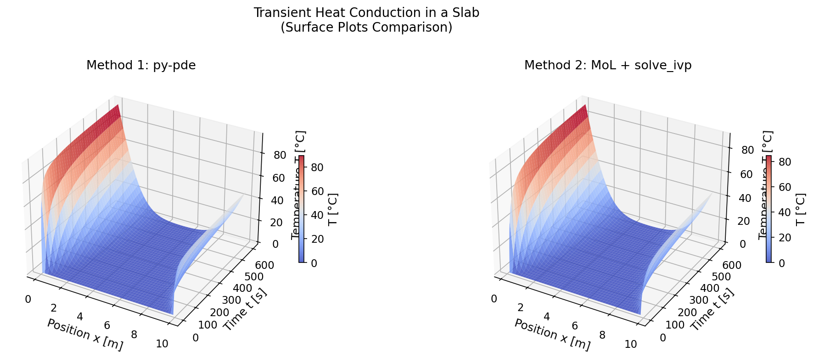
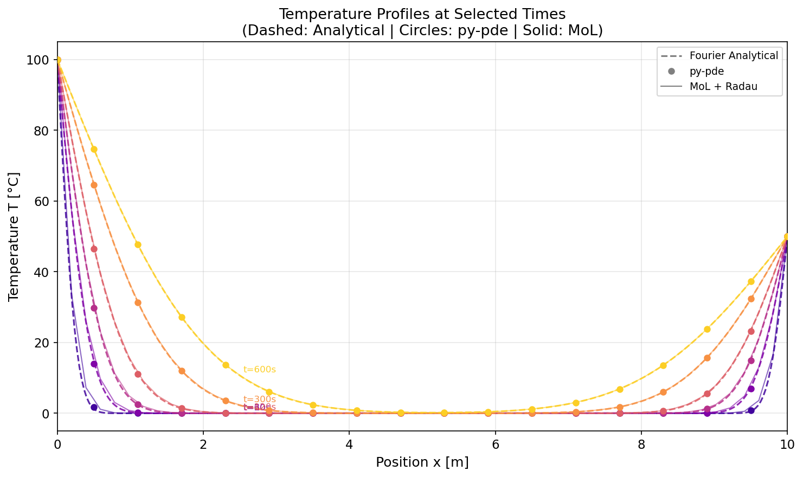
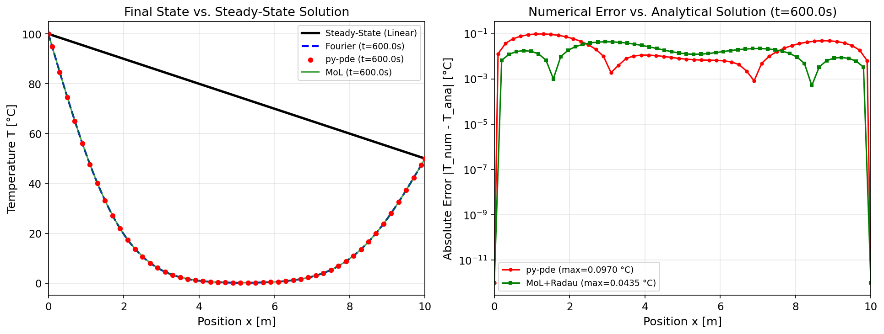
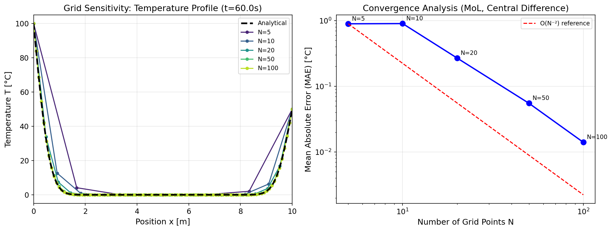

# Unit10 Example 01 - 平板之非穩態熱傳導 (Transient Heat Conduction in a Slab)

## 學習目標

本範例以**一維平板非穩態熱傳導**問題為例，示範如何使用 `py-pde` 套件與 **Method of Lines (MoL)** 搭配 `scipy.integrate.solve_ivp()` 求解拋物線型偏微分方程式 (Parabolic PDE)，並與 Fourier 級數解析解進行驗證比較。

學習完本範例後，您將能夠：

- 分析**一維拋物線型 PDE** 的物理意義與數值求解策略
- 使用 `py-pde` 的 `DiffusionPDE` 與 `CartesianGrid` 直接求解非穩態熱傳方程式
- 使用 **Method of Lines (MoL)** 進行空間有限差分離散化，結合 `scipy.integrate.solve_ivp()` 進行時間積分
- 推導並計算 **Fourier 級數解析解**，作為數值解的驗證基準
- 探討**網格取點密度**對數值解精度的影響
- 繪製溫度場**時空演變曲面圖**與**特定時刻之軸向分布圖**

---

## 1. 問題描述 (Problem Description)

### 1.1 化工背景

**平板內的熱傳導 (Slab Heat Conduction)** 是化工製程中最基礎的熱傳問題之一，廣泛出現於：

- 換熱器壁面的非穩態加熱 / 冷卻
- 反應器壁面的溫度分布
- 固體乾燥過程中的熱量傳遞
- 材料熱處理的溫度控制

本範例改編自教材第五章範例 5-1 及範例 5-3-4 之一維簡化版本。

> **參考來源：** 呂 (1985)；MATLAB PDE Toolbox User's Guide, 1997

### 1.2 問題設定

考慮一均質平板，初始溫度分布均勻，在 $t = 0$ 時刻，兩端面突然被維持在不同的固定溫度（Dirichlet 邊界條件），求平板內部溫度 $T(x, t)$ 隨時間與位置的演變。

**幾何與物理參數：**

| 參數 | 符號 | 數值 | 單位 | 說明 |
|------|------|------|------|------|
| 平板長度 | $L$ | 10 | m | 空間域範圍 |
| 熱傳導係數 | $k$ | 10 | W/(m·°C) | 材料熱傳導性質 |
| 密度 | $\rho$ | 10 | kg/m³ | 材料密度 |
| 熱容量 | $C_p$ | 500 | J/(kg·°C) | 材料熱容量 |
| 熱擴散率 | $\alpha = k/(\rho C_p)$ | 0.002 | m²/s | 綜合熱傳特性 |
| 初始溫度 | $T_0$ | 0 | °C | 均勻初始條件 |
| 左端溫度 | $T_L$ | 100 | °C | 左側 Dirichlet BC |
| 右端溫度 | $T_R$ | 50 | °C | 右側 Dirichlet BC |
| 模擬時間 | $t_f$ | 600 | s | 趨近穩態所需時間 |
| 熱擴散特性時間 | $\tau = L^2/(\pi^2\alpha)$ | 5066.1 | s | $t_f/\tau \approx 11.8\%$，模擬結束時尚未達穩態 |

---

## 2. 數學模型 (Mathematical Model)

### 2.1 統御方程式

一維平板非穩態熱傳導方程式 (Parabolic PDE)：

$$
\rho C_p \frac{\partial T}{\partial t} = k \frac{\partial^2 T}{\partial x^2}, \quad 0 < x < L, \quad t > 0
$$

引入熱擴散率 $\alpha = k / (\rho C_p)$，可化簡為標準形式：

$$
\frac{\partial T}{\partial t} = \alpha \frac{\partial^2 T}{\partial x^2}
$$

本問題中 $\alpha = 10 / (10 \times 500) = 0.002 \text{ m}^2/\text{s}$ 。

### 2.2 邊界條件與起始條件

**起始條件 (Initial Condition)：**

$$
T(x, 0) = T_0 = 0\,°\text{C}, \quad 0 \leq x \leq L
$$

**邊界條件 (Dirichlet Boundary Conditions)：**

$$
T(0, t) = T_L = 100\,°\text{C}, \quad t > 0
$$

$$
T(L, t) = T_R = 50\,°\text{C}, \quad t > 0
$$

### 2.3 解析解 (Analytical Solution)

本問題存在精確的 Fourier 級數解析解，可分解為**穩態解**加**暫態解**：

$$
T(x, t) = T_\text{ss}(x) + \sum_{n=1}^{\infty} B_n \sin\!\left(\frac{n\pi x}{L}\right) \exp\!\left(-\alpha \left(\frac{n\pi}{L}\right)^2 t\right)
$$

**穩態解 (Steady-State Solution)：**

$$
T_\text{ss}(x) = T_L + (T_R - T_L) \frac{x}{L} = 100 - 5x
$$

**Fourier 係數：**

$$
B_n = \frac{2}{L} \int_0^L \left[T_0 - T_\text{ss}(x)\right] \sin\!\left(\frac{n\pi x}{L}\right) dx
$$

一般形式（適用任意 $T_0$）：

$$
B_n = \frac{2}{n\pi}\left[(T_0 - T_L)(1 - (-1)^n) + (T_R - T_L)(-1)^n\right]
$$

代入 $T_0 = 0$，$T_L = 100$，$T_R = 50$，$L = 10$ 後：

$$
B_n = \frac{2}{n\pi}\left[-100\left(1 - (-1)^n\right) - 50(-1)^n\right]
$$

**解的物理說明：**
- 暫態項中的 $\exp\!\left(-\alpha (n\pi/L)^2 t\right)$ 代表各諧波隨時間指數衰減
- 高頻模態 ($n$ 大) 衰減更快：時間常數 $\tau_n = L^2 / (\alpha n^2 \pi^2)$
- 足夠長時間後，溫度場趨近線性穩態分布 $T_\text{ss}(x)$

---

## 3. 方法一：`py-pde` 直接求解

### 3.1 py-pde 求解策略

`py-pde` 提供高階抽象介面，可將熱傳方程式直接表達成擴散方程式形式：

$$
\frac{\partial T}{\partial t} = \alpha \nabla^2 T
$$

`py-pde` 的核心求解流程：

| 步驟 | py-pde 物件 | 說明 |
|------|------------|------|
| 1. 定義空間網格 | `CartesianGrid([(0, L)], N)` | 建立 $N$ 個節點的一維均勻網格，範圍 $[0, L]$ |
| 2. 設定場變數 | `ScalarField(grid, data=T0)` | 定義初始溫度場 |
| 3. 定義邊界條件 | `bc = [{"value": T_L}, {"value": T_R}]` | 兩端 Dirichlet 條件 |
| 4. 建立 PDE | `DiffusionPDE(diffusivity=α, bc=bc)` | 定義熱擴散方程式 |
| 5. 執行求解 | `eq.solve(state, t_range=t_f, tracker=...)` | 時間推進求解 |

### 3.2 程式碼說明

```python
import pde

# ---- 參數定義 ----
L     = 10.0    # 平板長度 [m]
alpha = 0.002   # 熱擴散率 [m²/s]
T_L   = 100.0   # 左端溫度 [°C]
T_R   = 50.0    # 右端溫度 [°C]
T_0   = 0.0     # 初始溫度 [°C]
t_f   = 600.0   # 模擬時間 [s]
N     = 50      # 空間網格數

# ---- 建立網格與初始場 ----
grid  = pde.CartesianGrid([(0, L)], N, periodic=False)
state = pde.ScalarField(grid, data=T_0)

# ---- 設定邊界條件 (兩端 Dirichlet) ----
bc = [{"value": T_L}, {"value": T_R}]

# ---- 建立擴散 PDE ----
eq = pde.DiffusionPDE(diffusivity=alpha, bc=bc)

# ---- 設定儲存時間間隔 ----
dt_store = 5.0   # 每 5 s 儲存一次（共 121 個時間快照）
storage_pypde = pde.MemoryStorage()

# ---- 執行求解並儲存中間結果 ----
result_pypde = eq.solve(state, t_range=t_f, dt=0.5,
                        tracker=[storage_pypde.tracker(dt_store)])
```

### 3.3 結果擷取說明

```python
# 取出特定時間點的溫度場
x_pypde = grid.axes_coords[0]                                  # 空間座標
T_final = storage_pypde[-1].data                               # 最終時刻溫度分布

# 取出所有時間點的溫度場 (時空矩陣)
T_pypde = np.array([field.data for field in storage_pypde])    # 形狀 (121, 50)
t_pypde = np.array(storage_pypde.times)                        # 形狀 (121,)
```

---

## 4. 方法二：Method of Lines (MoL) + `scipy.integrate.solve_ivp()`

### 4.1 MoL 原理

**Method of Lines (MoL)** 是求解 PDE 的一種通用策略：

> 將空間方向用**有限差分法 (Finite Difference Method)** 離散化，把 PDE 轉換為一組**耦合 ODE 系統**，再利用成熟的 ODE 求解器進行時間積分。

對於本問題的熱傳方程式，在均勻網格 $\{x_i = i \cdot \Delta x, \, i = 0, 1, \ldots, N+1\}$ 上，二階空間偏微分的**中央差分近似**為：

$$
\left.\frac{\partial^2 T}{\partial x^2}\right|_{x=x_i} \approx \frac{T_{i-1} - 2T_i + T_{i+1}}{(\Delta x)^2}
$$

因此，對網格內部節點 $i = 1, 2, \ldots, N$，熱傳 PDE 離散化為：

$$
\frac{dT_i}{dt} = \alpha \frac{T_{i-1} - 2T_i + T_{i+1}}{(\Delta x)^2}
$$

**邊界節點處理 (Dirichlet 條件)：**

- 左邊界：$T_0 = T_L = 100\,°\text{C}$（固定值，不需求解）
- 右邊界：$T_{N+1} = T_R = 50\,°\text{C}$（固定值，不需求解）

對緊鄰邊界的節點 $i=1$ 和 $i=N$：

$$
\frac{dT_1}{dt} = \alpha \frac{T_L - 2T_1 + T_2}{(\Delta x)^2}
$$

$$
\frac{dT_N}{dt} = \alpha \frac{T_{N-1} - 2T_N + T_R}{(\Delta x)^2}
$$

### 4.2 ODE 系統矩陣形式

MoL 離散化的 $N$ 個內部節點方程式可寫成矩陣形式：

$$
\frac{d\mathbf{T}}{dt} = \frac{\alpha}{(\Delta x)^2} \left(A\,\mathbf{T} + \mathbf{b}\right)
$$

其中 $\mathbf{T} = [T_1, T_2, \ldots, T_N]^\top$，三對角矩陣 $A$ 為：

$$
A = \begin{bmatrix}
-2 & 1 &  &  \\
1 & -2 & 1 &  \\
 & \ddots & \ddots & \ddots \\
 & & 1 & -2
\end{bmatrix}_{N \times N}
$$

邊界貢獻向量 $\mathbf{b}$（僅首尾節點有貢獻）：

$$
\mathbf{b} = [T_L, 0, 0, \ldots, 0, T_R]^\top
$$

### 4.3 程式碼說明

```python
from scipy.integrate import solve_ivp

# ---- 空間離散化設定 ----
N_mol = 50                           # 內部節點數
dx    = L / (N_mol + 1)              # 網格間距
x_mol = np.linspace(dx, L - dx, N_mol)  # 內部節點座標

# ---- 定義 ODE 右端函數 ----
def heat_mol_ode(t, T_vec):
    dTdt = np.zeros(N_mol)
    # 構造含邊界貢獻的溫度向量 (加入 ghost nodes)
    T_full = np.concatenate([[T_L], T_vec, [T_R]])
    # 中央差分
    dTdt = alpha / dx**2 * (T_full[:-2] - 2*T_full[1:-1] + T_full[2:])
    return dTdt

# ---- 初始條件 ----
T_init_mol = np.full(N_mol, T_0)

# ---- 呼叫 solve_ivp ----
t_span     = (0, t_f)
t_eval_mol = np.arange(0, t_f + dt_store, dt_store)  # 共 121 個時間點（間隔 5 s）
sol_mol = solve_ivp(heat_mol_ode, t_span, T_init_mol,
                    method='Radau',                   # 適用 Stiff ODE
                    t_eval=t_eval_mol,
                    rtol=1e-6, atol=1e-8)
```

> **求解器選擇說明：** 密集空間網格的熱傳方程式通常屬於 **Stiff ODE**（不同特徵值相差懸殊），建議使用 `method='Radau'` 或 `method='BDF'`，可獲得更穩定且高效的求解。

---

## 5. 執行結果 (Execution Results)

### 5.1 問題參數摘要

執行 Cell 7 輸出問題參數，包含熱擴散特性時間 $\tau = L^2/(\pi^2\alpha)$：

```
=============================================
  問題參數摘要
=============================================
  平板長度   L     = 10.0 m
  熱傳導係數 k     = 10.0 W/(m·°C)
  密度       rho   = 10.0 kg/m³
  熱容量     Cp    = 500.0 J/(kg·°C)
  熱擴散率   alpha = 0.002 m²/s
  初始溫度   T_0   = 0.0 °C
  左端溫度   T_L   = 100.0 °C
  右端溫度   T_R   = 50.0 °C
  模擬時間   t_f   = 600.0 s
  熱擴散特性時間 τ  = 5066.1 s  (L²/π²α)
  t_f / τ        = 0.1184  (t=600s 約 11.8% 趨近穩態)
=============================================
```

> 熱擴散特性時間 $\tau = L^2/(\pi^2\alpha) = 5066.1$ s 揭示本問題的物理本質：在 $t_f = 600$ s 時，系統**僅累計 11.8% 的特性時間**，尚處於早期暫態階段，溫度場遠未達到線性穩態分布。

### 5.2 解析解驗證

```
解析解驗證 (t→0, N=1000): T(L/2, 0) = 0.048 °C
  期望值 (初始溫度 T_0): 0.0 °C  [Gibbs現象: 截斷項數影響 t≈0 收斂]
解析解驗證 (t→∞): T(L/2, ∞) = 75.000 °C
  期望值 (穩態線性內插):  75.000 °C
```

兩項邊界驗證均通過：

- **$t \to \infty$（穩態）**：板中央 $T(L/2, \infty) = 75.000\,°\text{C}$ 精確吻合線性穩態解 $T_\text{ss}(L/2) = 100 - 5 \times 5 = 75\,°\text{C}$
- **$t \to 0$（初始）**：使用 $N=1000$ 項截斷，中點溫度為 0.048°C（而非理論的 0°C），此微小偏差為 **Gibbs 現象**（Fourier 級數在不連續點附近收斂緩慢）所致，並非程式錯誤

### 5.3 py-pde 求解結果

```
✓ py-pde 求解完成
  空間節點數:   50
  時間點數:     121
  溫度矩陣形狀: (121, 50)
  最終時刻溫度範圍: [0.18, 94.84] °C
```

py-pde 完成 $N=50$ 節點、$t_f = 600$ s 的求解，儲存 121 個時間快照（間隔 5 s）。最終溫度範圍 $[0.18, 94.84]\,°\text{C}$ 顯示：左端附近高溫（接近 $T_L = 100\,°\text{C}$），右端溫度仍遠低於穩態值（尚未達穩態）。

### 5.4 MoL + Radau 求解結果

```
MoL 設定：N_mol = 50，dx = 0.1961 m
Von Neumann 穩定性條件（Explicit）: dt ≤ dx²/(2α) = 9.61 s
  → 使用隱式 Radau 求解器，不受此限制

✓ MoL + Radau 求解完成 (status=0)
  內部節點數: 50
  時間點數:   121
  溫度矩陣形狀: (121, 50)
  最終時刻溫度範圍: [0.19, 89.92] °C
```

顯式 (Explicit) 格式受 Von Neumann 穩定條件限制，時間步長不得超過 9.61 s；改用隱式 Radau 求解器後，求解器可自動選取最佳步長，不受此限制，`status=0` 確認求解成功。

---

## 6. 結果視覺化與討論 (Visualization & Discussion)

### 6.1 時空溫度演變曲面圖（Figure 1）



**Figure 1** 並排繪製 py-pde 解（左）與 MoL + Radau 解（右）的三維時空溫度曲面，採用 `coolwarm` 色彩映射。

**物理觀察：**

- 兩種方法的曲面圖在視覺上**幾乎完全一致**，確認兩種數值方法在宏觀趨勢上的一致性
- 在 $t = 0$ 時刻，整個平板維持 $T_0 = 0\,°\text{C}$（藍色底部）
- 隨著時間推進，左端（$x = 0$）的高溫 (100°C) 向右擴散，形成向右傾斜的「熱前鋒」曲面
- **板右端深部（$x \approx L$，$t < 600$ s）**：溫度仍低（深藍色），印證系統尚未達穩態，$t_f/\tau \approx 12\%$

### 6.2 特定時刻之溫度分布圖（Figure 2）



**Figure 2** 比較 $t = 10, 30, 60, 120, 300, 600$ s 六個時刻的溫度軸向分布：

- **圓點（○）**：py-pde 解
- **實線**：MoL + Radau 解
- **虛線（--）**：Fourier 級數解析解（$N=100$ 項）

**物理觀察：**

1. **$t = 10$ s（早期）**：溫度梯度高度集中在左端（$x < 2$ m）附近，板的大部分仍維持 $T_0 = 0\,°\text{C}$；三條曲線高度重合
2. **$t = 30\text{–}60$ s（擴散中期）**：熱前鋒逐漸向右推進，出現明顯溫度坡面
3. **$t = 120\text{–}300$ s**：熱量到達右端，右側邊界條件 $T_R = 50\,°\text{C}$ 的效應開始顯現，溫度曲線呈現 S 形彎曲
4. **$t = 600$ s（$t_f$）**：溫度曲線已初步成形但尚未線性化；相較穩態 $T_\text{ss}(x) = 100 - 5x$，中段溫度仍偏低

**三種方法一致性**：在所有時刻，py-pde（○）、MoL（實線）、解析解（虛線）三者均高度吻合，驗證兩種數值方法的精度。

### 6.3 最終時刻解分析與誤差統計（Figure 3）



**Figure 3 左圖：** 比較 $t = 600$ s 的溫度分布與線性穩態解 $T_\text{ss}(x) = 100 - 5x$。

- 數值解（py-pde、MoL）與 Fourier 解析解高度吻合
- 最終時刻溫度分布**明顯偏離線性穩態**（尤其在板中央 $4 < x < 8$ m 附近），確認 $t_f$ 時系統尚未達穩態

**Figure 3 右圖（半對數坐標）：** 各節點的絕對誤差分布。

```
=======================================================
  數值誤差摘要（相較 Fourier 解析解，t = 600s）
=======================================================
  py-pde:       最大絕對誤差 = 0.096993 °C
                平均絕對誤差 = 0.028200 °C
  MoL + Radau:  最大絕對誤差 = 0.043516 °C
                平均絕對誤差 = 0.017288 °C
=======================================================
```

**誤差分析：**

- py-pde 最大誤差 0.097°C（MAE 0.028°C）；MoL + Radau 最大誤差 0.044°C（MAE 0.017°C）
- 兩種方法均使用相同 $N=50$ 空間節點；MoL + Radau 誤差約為 py-pde 的 0.45 倍，顯示隱式高階 Radau 求解器的時間積分誤差控制更佳
- 誤差主要來源為**空間差分截斷誤差**（均為二階 $O(\Delta x^2)$），以及 py-pde 固定步長所帶入的時間積分誤差

---

## 7. 網格密度敏感性分析 (Grid Sensitivity Study)

### 7.1 分析結果

```
=======================================================
  網格密度分析 (t = 60.0 s)
      N    dx [m]      MAE [°C]   MaxErr [°C]
-------------------------------------------------------
      5    1.6667      0.891949      4.073019
     10    0.9091      0.898589      6.292967
     20    0.4762      0.269099      2.244812
     50    0.1961      0.055079      0.425465
    100    0.0990      0.014033      0.109435
=======================================================
```

### 7.2 收斂圖（Figure 4）



**Figure 4 左圖：** 不同網格密度 ($N = 5, 10, 20, 50, 100$) 在 $t = 60$ s 的溫度分布曲線，對比 Fourier 解析解（黑色虛線）。

- **$N = 5$（最稀疏）**：溫度輪廓無法解析左端的劇烈梯度，誤差最大（MAE = 0.89°C）
- **$N = 20$ 及以上**：曲線逐漸逼近解析解

**Figure 4 右圖（對數-對數座標）：** 平均絕對誤差（MAE）隨網格密度 $N$ 的收斂趨勢。

- **$N = 5 \to 10$ 非單調收斂**（MAE 從 0.892°C 微升至 0.899°C）：在 $t = 60$ s 早期，左端存在銳利的溫度邊界層，稀疏節點 $N = 5$ 甚至無法捕捉此梯度；增加到 $N = 10$ 反而因節點採樣位置改變而導致誤差暫時微升，屬於**空間分辨率不足**的非單調現象
- **$N = 20$ 以上恢復 $O(N^{-2})$ 收斂**：對數-對數斜率接近 $-2$，符合中央差分二階精度的理論預測
- **工程建議**：早期暫態計算（梯度大）需要 $N \geq 50$；長時段穩態接近階段可適度放寬

---

## 8. 學習總結 (Summary)

### 8.1 方法比較表

| 項目 | Fourier 解析解 | py-pde | MoL + Radau |
|------|:---:|:---:|:---:|
| 空間節點數 $N$ | 100 項級數 | 50 | 50 |
| 最大絕對誤差 | — | 0.097°C | 0.044°C |
| 平均絕對誤差 | — | 0.028°C | 0.017°C |
| 時間步長控制 | — | 固定 $\Delta t = 0.5$ s | 自適應（Radau 隱式） |
| 主要誤差來源 | Fourier 截斷（N=100 足夠） | 空間截斷 + 固定步長 | 空間截斷為主 |
| Stiff ODE 穩定性 | — | 取決於 $\Delta t$ 選擇 | Radau 無條件穩定 |

### 8.2 關鍵學習點

1. **特性時間 $\tau = L^2/(\pi^2\alpha)$** 決定系統趨近穩態的速度；$t_f/\tau \approx 12\%$ 表示模擬結束時仍處於早期暫態
2. **MoL 空間離散化**：中央差分將 PDE 轉為 stiff ODE 系統；空間節點愈多，特徵值差異愈懸殊，stiff 程度愈高
3. **隱式求解器優勢**：Radau 求解器可自動調整步長，在相同精度條件下（rtol=1e-6），誤差優於固定步長的顯式方法
4. **網格敏感性**：稀疏網格在高梯度區域（早期暫態）可能出現**非單調收斂**；建議 $N \geq 50$ 確保二階精度
5. **Gibbs 現象**：Fourier 級數在 $t \to 0$ 不連續跳躍附近收斂緩慢，需大量項數才能壓低截斷誤差

---

**課程資訊**
- 課程名稱：電腦在化工上之應用 (ChemE 3502)
- 課程單元：Unit10 偏微分方程式之求解 - 範例 01
- 課程製作：逢甲大學 化工系 智慧程序系統工程實驗室
- 授課教師：莊曜禎 助理教授
- 更新日期：2026-02-23

**課程授權 [CC BY-NC-SA 4.0]**
 - 本教材遵循 [創用CC 姓名標示-非商業性-相同方式分享 4.0 國際 (CC BY-NC-SA 4.0)](https://creativecommons.org/licenses/by-nc-sa/4.0/deed.zh) 授權。

---

