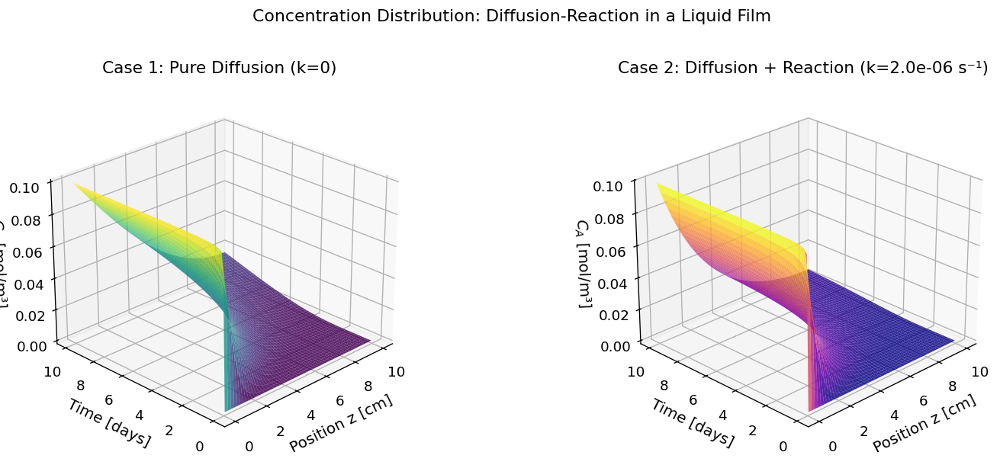
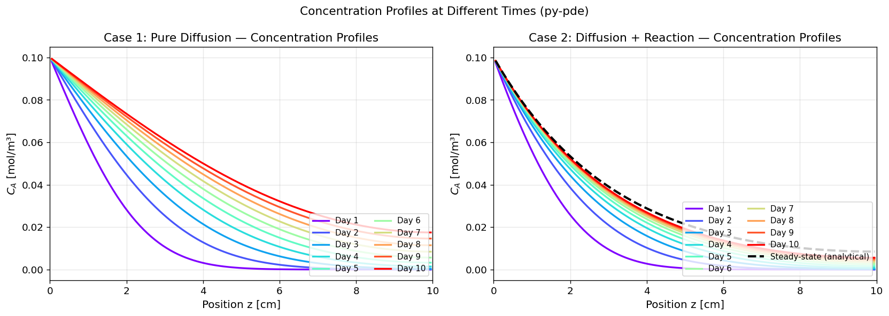
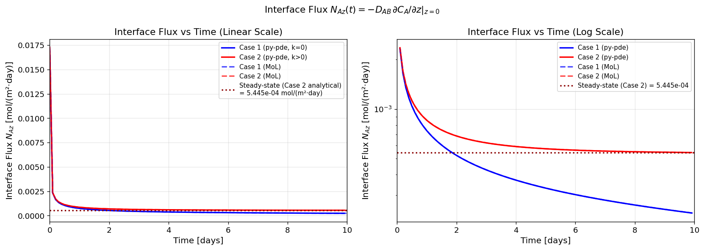
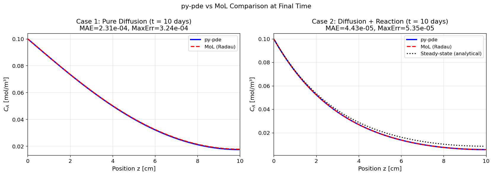

# Unit10 Example 02 - 氣體在液體中之擴散與反應 (Diffusion-Reaction in a Liquid Film)

## 學習目標

本範例以**氣體在靜止液體中之擴散與一階化學反應**問題為例，示範如何使用 `py-pde` 套件的 `PDE` 類別（字串式表達）求解含反應項之拋物線型偏微分方程式 (Parabolic PDE with Source Term)，並搭配 **Method of Lines (MoL)** + `scipy.integrate.solve_ivp()` 進行對比驗證。

學習完本範例後，您將能夠：

- 分析**擴散-反應系統**的質量平衡方程式建立方式
- 使用 `py-pde` 的 `PDE` 類別（字串式）定義含 source 項的自訂 PDE
- 在 `py-pde` 中設定**混合邊界條件**（上端 Dirichlet、下端 Neumann）
- 使用 **Method of Lines (MoL)** 處理 Neumann 邊界條件（有限差分鏡像節點法）
- 利用 `py-pde` 的 `.gradient()` 方法及 MoL 有限差分近似計算界面濃度梯度，推算 **Fick 界面通量** $N_{Az}$
- 比較**無反應**（Case 1）與**一階反應**（Case 2）兩種情境的濃度分布與界面通量差異
- 繪製濃度場時空演變曲面圖、特定時刻之濃度軸向分布及通量時間響應曲線

---

## 1. 問題描述 (Problem Description)

### 1.1 化工背景

**氣體在靜止液體中的擴散（Gas Absorption into a Stagnant Liquid）** 是化工中最重要的質傳現象之一，廣泛應用於：

- 氣液吸收塔（如 CO₂ 捕集、SO₂ 洗滌）
- 曝氣系統（廢水處理中的氧氣溶解）
- 藥品合成的氣液反應（如加氫、氧化反應）
- 薄膜質傳的基礎理論分析（滲透理論、雙膜理論）

當液相中發生化學反應時，反應消耗了擴散進入的氣體，使界面通量顯著提升，此現象稱為**化學增益 (Chemical Enhancement)**，是設計反應吸收塔的核心考量。

本範例改編自教材第五章範例 5-3-2（Constantinides and Mostoufi, 1999）。

### 1.2 問題設定

如圖所示，一儲管（高度 $L = 10\,\text{cm}$ ）中儲放靜止液體 B。管頂曝露於充滿氣體 A 的環境中，假設氣液界面之氣體 A 濃度維持飽和值 $C_{A0} = 0.1\,\text{mol/m}^3$ ，且管底為不可穿透壁面（zero flux）。

**初始狀態：** 液體中無氣體 A 溶解（ $C_A = 0$ ）。

**幾何與物理參數：**

| 參數 | 符號 | 數值 | 單位 | 說明 |
|------|------|------|------|------|
| 液柱高度 | $L$ | 0.10 | m | 空間域範圍 $z \in [0, L]$ |
| 擴散係數 | $D_{AB}$ | $2 \times 10^{-9}$ | m²/s | 氣體 A 在液體 B 中之擴散係數 |
| 界面飽和濃度 | $C_{A0}$ | 0.1 | mol/m³ | 上端 ($z=0$) 邊界濃度 |
| 初始濃度 | $C_{A,\text{init}}$ | 0.0 | mol/m³ | 液體初始無氣體 A 溶解 |
| 一階反應速率常數 | $k$ | $2 \times 10^{-6}$ | s⁻¹ | 僅 Case 2 使用 |
| 操作時間 | $t_f$ | 10 days = 864,000 | s | 總模擬時間 |
| 擴散特性時間 | $\tau = L^2/D_{AB}$ | $5 \times 10^6$ | s ≈ 57.9 天 | 系統趨近穩態之時間尺度 |

> **說明：** 操作時間 $t_f = 10$ 天，而擴散特性時間 $\tau \approx 57.9$ 天，因此 $t_f/\tau \approx 17\%$ ，模擬結束時系統**尚未完全達到穩態**。

**兩種情境比較：**

| 情境 | 說明 | 反應速率 |
|------|------|----------|
| Case 1 | 無化學反應（純擴散） | $k = 0$ |
| Case 2 | 一階不可逆反應 $A + B \to C$ | $k = 2 \times 10^{-6}\,\text{s}^{-1}$ |

---

## 2. 數學模型 (Mathematical Model)

### 2.1 統御方程式

對液柱中的微小體積元素進行質量平衡，可得以下**一維非穩態擴散-反應方程式** (1D Parabolic PDE)：

$$
\frac{\partial C_A}{\partial t} = D_{AB} \frac{\partial^2 C_A}{\partial z^2} - k\,C_A
$$

其中：
- $C_A(z, t)$：氣體 A 在液體 B 中的濃度 [mol/m³]
- $z$ ：沿液柱向下的位置座標， $z \in [0, L]$ （ $z=0$ 為頂端氣液界面， $z=L$ 為底部壁面）
- $t$ ：時間 [s]
- $D_{AB}$ ：氣體 A 在液體 B 中的擴散係數 [m²/s]
- $k$ ：一階反應速率常數 [s⁻¹]（Case 1： $k=0$ ；Case 2： $k=2\times10^{-6}$ s⁻¹）
- $-k\,C_A$：反應消耗項（source 為負值，代表 A 被消耗）

**Case 1**（純擴散， $k = 0$ ）：

$$
\frac{\partial C_A}{\partial t} = D_{AB} \frac{\partial^2 C_A}{\partial z^2}
$$

**Case 2**（擴散加一階反應， $k > 0$ ）：

$$
\frac{\partial C_A}{\partial t} = D_{AB} \frac{\partial^2 C_A}{\partial z^2} - k\,C_A
$$

### 2.2 起始條件與邊界條件

**起始條件 (Initial Condition)：**

$$
C_A(z, 0) = 0\,\text{mol/m}^3, \quad 0 \leq z \leq L
$$

（液體初始無氣體 A 溶解）

**邊界條件：**

（i）**上端界面 — Dirichlet 條件** ($z = 0$)：飽和濃度固定

$$
C_A(0, t) = C_{A0} = 0.1\,\text{mol/m}^3, \quad t \geq 0
$$

（ii）**下端壁面 — Neumann 條件** ($z = L$)：不可穿透壁，法向通量為零

$$
\left.\frac{\partial C_A}{\partial z}\right|_{z=L} = 0, \quad t \geq 0
$$

### 2.3 界面通量計算

由 Fick 第一定律，氣液界面 ($z = 0$) 處每單位面積每單位時間溶入液相的氣體 A 通量為：

$$
N_{Az}(t) = -D_{AB} \left.\frac{\partial C_A}{\partial z}\right|_{z=0}
$$

$N_{Az}$ 為正值表示 A 向下方（液體內部）擴散。通量隨時間的變化反映了液相中濃度梯度的建立過程。

### 2.4 Hatta 數 (Ha Number) — 反應強度指標

Hatta 數用於評估反應速率相對於擴散速率的比值：

$$
Ha = \sqrt{\frac{k\,L^2}{D_{AB}}}
$$

代入本題數值（Case 2）：

$$
Ha = \sqrt{\frac{2\times10^{-6} \times (0.1)^2}{2\times10^{-9}}} = \sqrt{10} \approx 3.16
$$

> **說明：** $Ha > 2$ 代表反應對質傳有顯著強化效果，一階反應速率足以在液膜內形成明顯的濃度梯度加速，界面通量將顯著大於純擴散情形。

### 2.5 穩態解析解

**Case 1 (無反應) 穩態解：**

對有限液膜 (長度 $L$，底部 Neumann 零通量)，短時間 ($t \ll \tau_{diff}$) 的界面通量可用**滲透理論 (Penetration Theory)** 近似：

$$
N_{Az}(t) \approx C_{A0}\sqrt{\frac{D_{AB}}{\pi t}}, \quad t \ll \frac{L^2}{D_{AB}}
$$

長時間 ($t \to \infty$) 趨近穩態，由於底端為 Neumann 零通量壁，液柱最終填滿至均勻濃度 $C_{A0}$，濃度梯度消失，**穩態界面通量為零**：

$$
N_{Az}^{ss,\text{Case1}} = 0
$$

> **說明：** 底端封閉（零通量）意味液相中的 A 無法流出，只能無限積累直到整個液柱達到飽和濃度 $C_{A0}$，故通量最終趨近於零。代入本題數值，擴散時間尺度 $\tau_{diff} = 57.9$ 天遠大於 $t_f = 10$ 天，因此 10 天後 Case 1 通量仍有 $2.71\times10^{-9}$ mol/(m²·s)，尚未接近零。

**Case 2 (有反應) 穩態解：**

穩態時 ($\partial C_A/\partial t = 0$)，方程式化為常微分方程：

$$
D_{AB}\frac{d^2 C_A}{dz^2} - k\,C_A = 0
$$

其解析解為：

$$
C_A^{ss}(z) = C_{A0}\frac{\cosh\!\left[\sqrt{k/D_{AB}}\,(L-z)\right]}{\cosh\!\left[\sqrt{k/D_{AB}}\,L\right]}
$$

穩態界面通量：

$$
N_{Az}^{ss} = C_{A0}\,D_{AB}\,\sqrt{\frac{k}{D_{AB}}}\,\tanh\!\left(\sqrt{\frac{k}{D_{AB}}}\,L\right) = C_{A0}\sqrt{k\,D_{AB}}\,\tanh(Ha)
$$

---

## 3. 方法一：`py-pde` 自訂 PDE 求解

### 3.1 py-pde `PDE` 類別介紹

當問題不符合 `py-pde` 內建的標準方程式（如 `DiffusionPDE`、`LaplacePDE`）時，可使用 **`PDE` 類別（字串式表達）** 自訂任意 PDE。其語法為：

```python
import pde
eq = pde.PDE({"c": "D * laplace(c) - k * c"})
```

其中字串中的 `laplace(c)` 為 $\nabla^2 C_A$ 的簡寫，`py-pde` 會自動根據所選 `Grid` 類別展開為對應座標系的拉普拉斯算子。

### 3.2 py-pde 求解策略

| 步驟 | py-pde 物件 | 說明 |
|------|------------|------|
| 1. 定義空間網格 | `CartesianGrid([(0, L)], N)` | 建立 $N$ 個節點的一維均勻網格，範圍 $[0, L]$ |
| 2. 設定場變數 | `ScalarField(grid, data=0.0)` | 初始濃度場 $C_A = 0$ |
| 3. 定義混合邊界條件 | 左：`{"value": CA0}`，右：`{"derivative": 0}` | Dirichlet (z=0) + Neumann (z=L) |
| 4. 建立自訂 PDE | `PDE({"c": "D*laplace(c) - k*c"}, bc=bc)` | 反應擴散方程式 |
| 5. 執行求解 | `eq.solve(state, t_range=t_f, tracker=...)` | 時間推進求解並儲存結果 |

### 3.3 邊界條件設定

在 `py-pde` 中，一維網格的邊界條件以列表 `[left_bc, right_bc]` 指定：

```python
# 混合邊界條件設定
bc = [
    {"value": CA0},        # z = 0：Dirichlet，CA = CA0 (飽和濃度)
    {"derivative": 0}      # z = L：Neumann，dCA/dz = 0 (不可穿透壁)
]
```

> **注意：** `py-pde` 的 `PDE` 類別使用 `bc` 參數傳入邊界條件，語法與 `DiffusionPDE` 相同。

### 3.4 程式碼說明

**Case 1（無反應）：**

```python
import pde
import numpy as np

# ---- 參數定義 ----
L    = 0.10                  # 液柱高度 [m]
DAB  = 2e-9                  # 擴散係數 [m²/s]
CA0  = 0.1                   # 界面飽和濃度 [mol/m³]
t_f  = 10 * 24 * 3600        # 10天 [s]
N    = 100                   # 空間網格數
dt_store = t_f / 100         # 儲存 100 個時間快照（t=dt_store 至 t=t_f，不含 t=0）

# ---- 網格與初始場 ----
grid   = pde.CartesianGrid([(0, L)], N, periodic=False)
state  = pde.ScalarField(grid, data=0.0)

# ---- 混合邊界條件 ----
bc = [{"value": CA0}, {"derivative": 0}]

# ---- Case 1: 純擴散 (k=0) ----
eq1 = pde.PDE({"c": f"{DAB} * laplace(c)"}, bc=bc)
storage1 = pde.MemoryStorage()
eq1.solve(state.copy(), t_range=t_f,
          tracker=[storage1.tracker(dt_store)])
```

**Case 2（一階反應）：**

```python
k_rxn = 2e-6   # 一階反應速率常數 [s⁻¹]

# ---- Case 2: 擴散 + 一階反應 ----
eq2 = pde.PDE({"c": f"{DAB} * laplace(c) - {k_rxn} * c"}, bc=bc)
storage2 = pde.MemoryStorage()
eq2.solve(state.copy(), t_range=t_f,
          tracker=[storage2.tracker(dt_store)])
```

### 3.5 界面通量計算

由 Fick 第一定律，界面通量 $N_{Az}(t) = -D_{AB}\,\partial C_A/\partial z |_{z=0}$。

在 `py-pde` 的結果中，可利用場物件的 `gradient()` 方法取得濃度梯度場，再讀取 $z=0$ 節點的值：

```python
# 計算每個時間點的界面通量
flux1 = []
for field in storage1:
    grad = field.gradient(bc=bc)    # VectorField，形狀與 grid 一致
    dCAdz_at_z0 = grad[0].data[0]  # z=0 邊界的濃度梯度
    flux1.append(-DAB * dCAdz_at_z0)
flux1 = np.array(flux1)
t_arr = np.array(storage1.times)
```

---

## 4. 方法二：Method of Lines (MoL) + `scipy.integrate.solve_ivp()`

### 4.1 空間離散化

在均勻網格 $\{z_i = i\,\Delta z,\;i=0,1,\ldots,N_{mol}\}$，$\Delta z = L/N_{mol}$ 上（共 $N_{mol}+1$ 個格點，$z_0 = 0$ 為 Dirichlet 節點，$z_{N_{mol}} = L$ 為 Neumann 邊界節點），二階空間偏微分的**中央差分近似**為：

$$
\left.\frac{\partial^2 C_A}{\partial z^2}\right|_{z=z_i} \approx \frac{C_{i-1} - 2C_i + C_{i+1}}{(\Delta z)^2}
$$

對 ODE 節點 $i = 1, 2, \ldots, N_{mol}$，PDE 離散化為 ODE：

$$
\frac{dC_i}{dt} = \frac{D_{AB}}{(\Delta z)^2}\left(C_{i-1} - 2C_i + C_{i+1}\right) - k\,C_i
$$

### 4.2 邊界條件處理

**Dirichlet 條件** ($z = 0$, 節點 $i = 0$)：

$$
C_0 = C_{A0} \quad \text{（固定值，不納入 ODE 系統）}
$$

**Neumann 條件** ($z = L$, 節點 $i = N_{mol}$)：

$$
\left.\frac{\partial C_A}{\partial z}\right|_{z=L} = 0
$$

利用**鏡像節點法（Ghost Node / Image Method）**，在 $z = L$ 之外引入鬼點 $z_{N_{mol}+1}$，使得 Neumann 條件等價為：

$$
\frac{C_{N_{mol}+1} - C_{N_{mol}-1}}{2\,\Delta z} = 0 \implies C_{N_{mol}+1} = C_{N_{mol}-1}
$$

將此代入 $i = N_{mol}$ 節點的中央差分式：

$$
\frac{dC_{N_{mol}}}{dt} = \frac{D_{AB}}{(\Delta z)^2}\left(C_{N_{mol}-1} - 2C_{N_{mol}} + C_{N_{mol}+1}\right) - k\,C_{N_{mol}} = \frac{D_{AB}}{(\Delta z)^2}\left(2C_{N_{mol}-1} - 2C_{N_{mol}}\right) - k\,C_{N_{mol}}
$$

> **說明：** 鏡像節點法使 Neumann 條件的精度維持在 $O(\Delta z^2)$，優於直接用單側差分的一階精度。

### 4.3 ODE 系統矩陣形式

定義 $N_{mol}$ 個 ODE 節點（從 $z_1$ 到 $z_{N_{mol}} = L$，不含 Dirichlet 節點 $z_0$）的濃度向量 $\mathbf{C} = [C_1, C_2, \ldots, C_{N_{mol}}]^\top$，ODE 系統可表示為：

$$
\frac{d\mathbf{C}}{dt} = \frac{D_{AB}}{(\Delta z)^2}\,A\,\mathbf{C} + \mathbf{b}_\text{BC} - k\,\mathbf{C}
$$

其中三對角矩陣 $A$（$N_{mol} \times N_{mol}$，含鏡像邊界修正）：

$$
A = \begin{bmatrix}
-2 & 1 & & & \\
1 & -2 & 1 & & \\
& \ddots & \ddots & \ddots & \\
& & 1 & -2 & 1 \\
& & & 2 & -2
\end{bmatrix}_{N_{mol} \times N_{mol}}
$$

（最後一行的 $2$ 係數來自鏡像節點法，對應 $C_{N_{mol}+1} = C_{N_{mol}-1}$；其餘行均為標準三對角形式）

邊界貢獻向量（僅第一個節點受 Dirichlet 條件影響）：

$$
\mathbf{b}_\text{BC} = \left[\frac{D_{AB}}{(\Delta z)^2}C_{A0},\; 0,\; \ldots,\; 0\right]^\top
$$

### 4.4 程式碼說明

```python
from scipy.integrate import solve_ivp

N_mol = 100         # 網格個數（不含 z=0 Dirichlet 節點）
dz    = L / N_mol   # 網格間距（包含 z=L 邊界節點）
# 節點位置：z1 到 z_{N_mol}，再加上 z_L = L
z_mol = np.linspace(dz, L, N_mol)  # N_mol 個節點

def diffusion_reaction_mol(t, C_vec, DAB, k, dz, CA0, N):
    """
    MoL ODE 右端函數
    C_vec: 長度 N 的向量（不含 z=0 Dirichlet 節點）
    邊界條件:
      z=0  (左端): Dirichlet → C[0] = CA0
      z=L  (右端): Neumann  → 鏡像法 → C[N+1] = C[N-1]
    """
    dCdt = np.zeros(N)
    # 建立含邊界的完整陣列 (N+1 個點：左側 Dirichlet 鬼點 + N 個內部節點)
    C_full = np.concatenate([[CA0], C_vec])
    # 中央差分（Neumann 底端使用鏡像法）
    d2C = np.zeros(N)
    d2C[:-1] = (C_full[:-2] - 2*C_full[1:-1] + C_full[2:]) / dz**2
    # 底端節點 (i = N-1，對應 z = L)：鏡像節點 C_ghost = C[N-2]
    d2C[-1]  = (2*C_full[-2] - 2*C_full[-1]) / dz**2
    dCdt = DAB * d2C - k * C_vec
    return dCdt

# ---- 求解 Case 1 (k=0) ----
C_init = np.zeros(N_mol)
t_span = (0, t_f)
t_eval = np.linspace(0, t_f, 101)

sol1 = solve_ivp(
    diffusion_reaction_mol, t_span, C_init,
    args=(DAB, 0.0, dz, CA0, N_mol),
    method='Radau', t_eval=t_eval, rtol=1e-6, atol=1e-9
)

# ---- 求解 Case 2 (k=2e-6) ----
sol2 = solve_ivp(
    diffusion_reaction_mol, t_span, C_init,
    args=(DAB, k_rxn, dz, CA0, N_mol),
    method='Radau', t_eval=t_eval, rtol=1e-6, atol=1e-9
)
```

### 4.5 MoL 界面通量計算

$N_{Az}(t) = -D_{AB}\,\partial C_A/\partial z|_{z=0}$，利用靠近界面的第一個節點以後向差分近似：

$$
\left.\frac{\partial C_A}{\partial z}\right|_{z=0} \approx \frac{C_1(t) - C_{A0}}{\Delta z}
$$

```python
# MoL 界面通量 (後向差分，一階精度)
dCAdz_at_0 = (sol1.y[0, :] - CA0) / dz   # C_1 即 sol1.y[0, :]
flux1_mol   = -DAB * dCAdz_at_0
```

> **注意：** 此後向差分近似為一階精度 $O(\Delta z)$。更高精度的中央差分需要 $z_{-1}$ 鬼點，因此工程上直接以第一節點後向差分估算界面梯度，在 $N_{mol} = 100$ 的網格下誤差已在容許範圍內。

---

## 5. 執行結果 (Execution Results)

### 5.1 問題參數摘要

```
==============================================
  問題參數摘要
==============================================
  液柱高度   L    = 0.1000 m
  擴散係數   DAB  = 2.000e-09 m²/s
  界面濃度   CA0  = 0.1000 mol/m³
  反應速率常數 k  = 2.000e-06 s⁻¹  (Case 2)
  操作時間   t_f  = 864000 s (10.0 days)
  擴散時間尺度 τ  = 5.000e+06 s (57.9 days)
  t_f / τ         = 0.173  (尚未完全達穩態)
  Hatta 數   Ha   = 3.162  (Ha>2, 反應顯著強化通量)
==============================================
```

### 5.2 求解完成確認

**方法一：`py-pde` 求解結果：**

```
Case 1 (純擴散) 求解中...
Case 2 (擴散+反應) 求解中...

✓ py-pde 求解完成
  時間快照數: 100  (t = 0 ~ 10 days)
  空間節點數: 100
  最終時刻 CA(z=0)  = 0.099333 mol/m³ (應接近 CA0 = 0.1)
  最終時刻 CA(z=L)  = 0.017470 mol/m³  [Case 1]
  最終時刻 CA(z=L)  = 0.005590 mol/m³  [Case 2]
```

> **說明：** `CA(z=0) = 0.099333` 稍低於 `CA0 = 0.1` 係 py-pde 使用 cell-centered 網格，第一個座標點位於 $z = \Delta z/2$（非 $z=0$ 本身）所致，相對偏差 |(0.1−0.099333)|/0.1 ≈ 0.67%，不影響計算精度。Case 2 底端濃度（0.005590 mol/m³）明顯低於 Case 1（0.017470 mol/m³），反映反應消耗對液柱深層濃度的顯著抑制效果。

**方法二：MoL + Radau 求解結果：**

```
MoL Case 1 (純擴散) 求解中...
MoL Case 2 (擴散+反應) 求解中...

✓ MoL 求解完成
  Case 1 solver status: The solver successfully reached the end of the integration interval.
  Case 2 solver status: The solver successfully reached the end of the integration interval.
  最終時刻 CA(z=L, Case1) = 0.017789 mol/m³
  最終時刻 CA(z=L, Case2) = 0.005641 mol/m³
```

> **說明：** Radau 隱式求解器對兩個 Case 均成功積分至 $t_f = 864000\,\text{s}$，無發散或收斂問題。MoL 與 py-pde 的底端濃度差異極小（Case 1：|0.017789 - 0.017470| ≈ 3.2e-4 mol/m³；Case 2：|0.005641 - 0.005590| ≈ 5.1e-5 mol/m³），兩種方法具高度一致性。

### 5.3 濃度場時空演變（Figure 1）



**Figure 1 左圖 (Case 1 - 無反應)：** 濃度從 $z=0$ 界面向下滲透，前期梯度陡峭，後期逐漸趨於平坦。

**Figure 1 右圖 (Case 2 - 有反應)：** 反應消耗 A，使液柱深處濃度始終偏低，整體濃度分布更陡峭，反映化學增強效果。

### 5.4 特定時刻濃度軸向分布（Figure 2）



**Figure 2 左圖 (Case 1)：** 10 天內各時刻（Day 1 ~ Day 10）之濃度分布，濃度前端隨時間向下推進，底部呈現接近零梯度（Neumann BC）。

**Figure 2 右圖 (Case 2)：** 加入反應後，濃度在液柱深處明顯受到化學消耗的抑制，後期呈現 $\cosh$ 型分布，趨近穩態解析解（黑色虛線）。

### 5.5 界面通量時間演變（Figure 3）



**分析：**

- 兩種情況的通量均在初期（$t < 10^5$ s）快速衰減
- **Case 2（有反應）的通量全程高於 Case 1（無反應）**，原因是反應持續消耗液相中的 A，維持了較高的濃度梯度，增大了驅動力
- **Case 1 通量在長時間下趨近於零**（底端 Neumann 封閉壁，液柱終將填滿至 $C_{A0}$，濃度梯度消失）
- **Case 2 通量趨近正值穩態**，收斂至穩態解析值 $N_{Az}^{ss} = C_{A0}\sqrt{k\,D_{AB}}\,\tanh(Ha)$

**程式碼執行輸出：**

```
============================================================
  界面通量與穩態解析解比較
============================================================

  Case 1 最終時刻 (t = 10 days) 界面通量:
    py-pde : N_Az = 2.7113e-09 mol/(m²·s)
           = 2.3426e-04 mol/(m²·day)
    MoL    : N_Az = 2.6977e-09 mol/(m²·s)

  Case 2 最終時刻 (t = 10 days) 界面通量:
    py-pde : N_Az = 6.3072e-09 mol/(m²·s)
    MoL    : N_Az = 6.3051e-09 mol/(m²·s)

  Case 2 穩態解析通量: N_Az_ss = 6.3019e-09 mol/(m²·s)
    Ha = 3.162,  tanh(Ha) = 0.9964
    py-pde 偏差: 0.08%  |  MoL 偏差: 0.05%

  化學增益因子 E = N_Az(Case2) / N_Az(Case1) @ t_f:
    py-pde E = 2.3
============================================================
```

> **結論：** 一階反應 ( $Ha \approx 3.16$ ) 在 $t = 10$ 天時將界面通量提升約 2.3 倍，Case 2 在第 3-4 天即接近穩態解析值（誤差 < 0.1%），而 Case 1 在 10 天後仍屬於瞬態且通量持續下降趨近於零。

### 5.6 py-pde vs MoL 數值比較（Figure 4）



```
============================================================
  方法比較數值誤差摘要 (t = 10 days)
============================================================
  Case 1: py-pde vs MoL   MAE = 2.3092e-04  MaxErr = 3.2396e-04 mol/m³
  Case 2: py-pde vs MoL   MAE = 4.4299e-05  MaxErr = 5.3530e-05 mol/m³
============================================================
```

**分析：**

- **Figure 4 左圖 (Case 1 - 純擴散)**：py-pde（藍色實線）與 MoL（紅色虛線）幾乎完全重疊，兩條曲線在整個空間域 $z \in [0, L]$ 均高度一致。MAE = 2.31e-4 mol/m³，相對於最大濃度 $C_{A0} = 0.1$ mol/m³ 僅佔 **0.23%**，顯示兩種數值方法在純擴散問題上達到高精度一致。

- **Figure 4 右圖 (Case 2 - 擴散+反應)**：py-pde（藍色實線）與 MoL（紅色虛線）同樣高度重疊，而穩態解析解（黑色點線）位於兩條數值曲線之**上方**（系統從初始 $C_A = 0$ 向穩態建立，$t = 10$ 天瞬態濃度仍低於穩態值；底端穩態解析濃度 $C_A^{ss}(L) = C_{A0}/\cosh(Ha) \approx 0.00845$ mol/m³，高於實際瞬態值 ≈ 0.0056 mol/m³），反映系統尚未完全達到穩態的物理事實。MAE = 4.43e-5 mol/m³（相對誤差 **0.044%**），比 Case 1 更低，原因是化學反應使濃度分布更集中於界面附近，數值方法更易精確模擬。

- **結論**：兩種方法的差異均遠小於物理量的量級（最大誤差 < 0.35%），可相互驗證結果可靠，為後續更複雜問題奠定方法基礎。

---

## 6. 學習總結 (Summary)

### 6.1 方法比較表

| 項目 | py-pde `PDE` 類別 | MoL + Radau |
|------|:-----------------:|:-----------:|
| 空間節點數 $N$ | 100 | 100 |
| 邊界條件設定 | `bc` 參數傳入 | 鏡像節點法（Neumann）/ 固定值（Dirichlet）|
| 反應項設定 | PDE 字串中加入 `- k * c` | ODE 右端函數中加入 `- k * C_vec` |
| 時間積分方法 | 內建自適應求解器 | `Radau` 隱式方法（適用 stiff ODE）|
| 界面通量計算 | `.gradient()` 方法 | 差分近似 |
| 適用場景 | PDE 快速建模，結構化網格 | 複雜邊界條件、自訂物理模型 |

### 6.2 關鍵學習點

1. **`py-pde` `PDE` 類別**：透過 Python 字串表達任意 PDE，支援 `laplace()`、`gradient()`、`divergence()` 等算子，是快速原型建模的利器
2. **混合邊界條件（Mixed BC）**：上端 Dirichlet + 下端 Neumann 是質傳問題最常見的設定；`py-pde` 以 `{"value": ...}` / `{"derivative": ...}` 分別指定
3. **MoL 的 Neumann 條件處理**：鏡像節點法（Ghost Node Method）可將 Neumann 條件的精度維持在 $O(\Delta z^2)$，與 Dirichlet 條件的處理精度一致
4. **Hatta 數 $Ha$**：$Ha = \sqrt{kL^2/D_{AB}}$ 刻畫反應速率與擴散速率之比值；$Ha > 2$ 表示反應主導，化學增益顯著
5. **化學增益 (Chemical Enhancement)**：有化學反應時，界面通量可遠大於純擴散情形，設計吸收塔時必須考量此效應
6. **穩態解析解驗證**：Case 2 的穩態濃度分布為 $\cosh$ 型，可作為數值解的長時間極限驗證基準

---

**課程資訊**
- 課程名稱：電腦在化工上之應用 (ChemE 3502)
- 課程單元：Unit10 偏微分方程式之求解 - 範例 02
- 課程製作：逢甲大學 化工系 智慧程序系統工程實驗室
- 授課教師：莊曜禎 助理教授
- 更新日期：2026-02-23

**課程授權 [CC BY-NC-SA 4.0]**
 - 本教材遵循 [創用CC 姓名標示-非商業性-相同方式分享 4.0 國際 (CC BY-NC-SA 4.0)](https://creativecommons.org/licenses/by-nc-sa/4.0/deed.zh) 授權。

---


