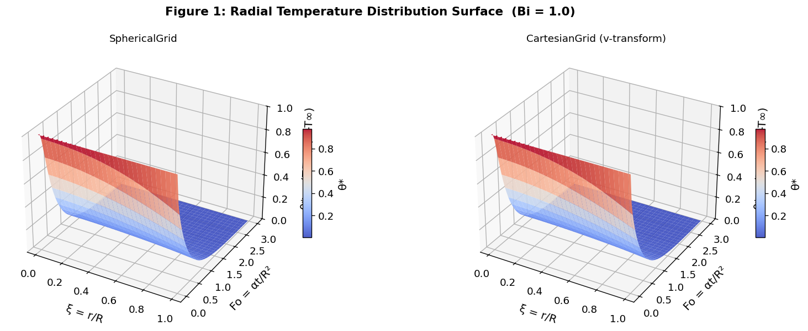
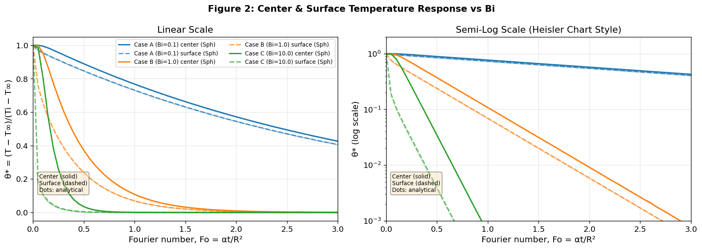
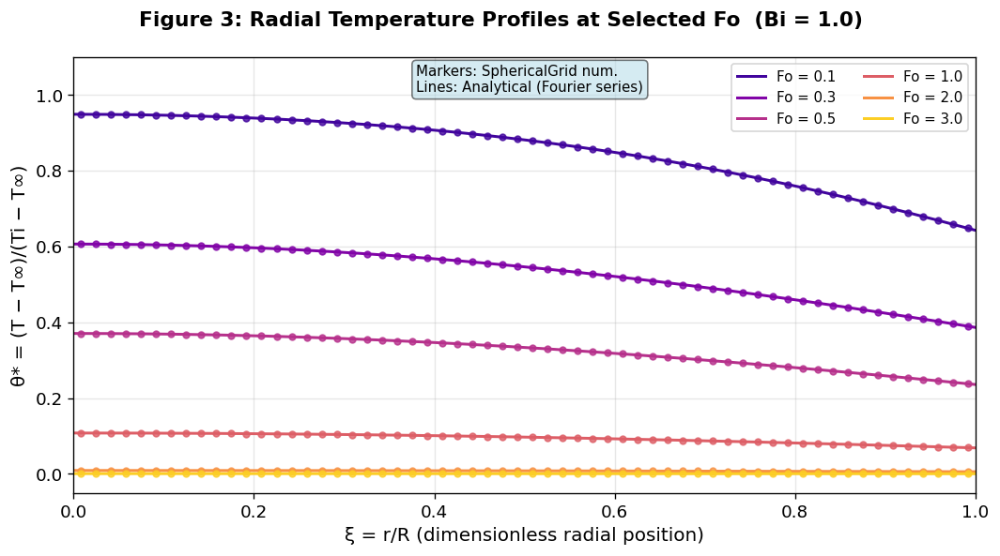
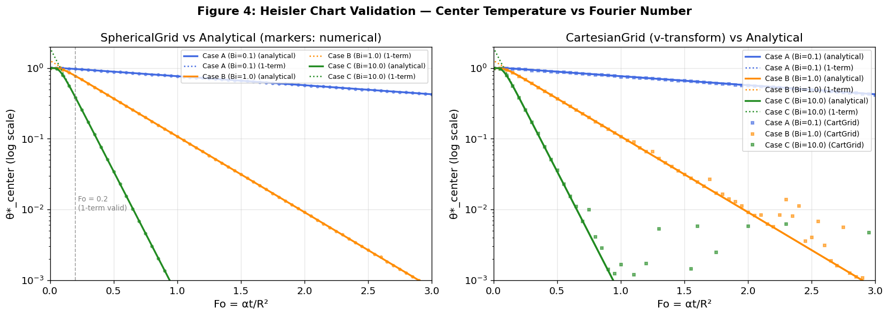

# Unit10 Example 03 - 固體球體之急速冷卻 (Quench Cooling of a Hot Solid Sphere)

## 學習目標

本範例以**固體熱球體急速投入冷水浴中的驟冷 (Quench Cooling)** 問題為例，示範如何求解**球座標非穩態熱傳 PDE**，並運用**變數代換技巧**（令 $v = r(T - T_\infty)$ ）將球座標 PDE 轉換為等效一維平板方程式，以利 `py-pde` 求解。

學習完本範例後，您將能夠：

- 建立**球座標非穩態熱傳**問題的數學模型（拋物線型 PDE）
- 理解**球座標熱傳方程式**的結構，並說明中心對稱 Neumann 條件與表面 Robin 條件的物理意義
- 應用**變數代換** $v = r(T - T_\infty)$ 將球座標 PDE 轉換為等效一維笛卡兒座標方程式
- 使用 `py-pde` 的 `SphericalSymGrid` 以球座標直接求解非穩態熱傳問題
- 使用 `py-pde` 的 `CartesianGrid` 求解變數代換後的等效一維問題，並還原物理量
- 理解 **Biot number (Bi)** 的物理意義，並分析其大小對球體冷卻速率的影響
- 比較不同 Bi 下球心與表面溫度的時間響應，並與 **Heisler chart** 理論值進行驗證
- 繪製**徑向溫度分布曲面圖**與**球心及表面無因次溫度時間響應圖**

---

## 1. 問題描述 (Problem Description)

### 1.1 化工背景

**固體物件的驟冷 (Quench Cooling)** 是熱處理製程中最重要的操作之一，廣泛應用於：

- 金屬材料**淬火 (Quenching)**：改變鋼材微觀結構，提升硬度與強度
- 化工觸媒顆粒的**熱活化與急冷操作**：快速固定活化態結構
- 食品工業的**殺菌急冷 (Thermal Sterilization & Cooling)**：確保食品安全並保留風味
- 玻璃與陶瓷製品的**退火控制**：避免熱應力造成破裂
- 半導體製程的**熱退火 (Thermal Annealing)**：修復晶格缺陷

本範例改編自教材第五章範例 5-3-3 (Constantinides and Mostoufi, 1999)，以均質固體球體急速投入均溫冷水浴為場景，求解球體內部**非穩態溫度分布**。

> **問題核心挑戰：** 球座標熱傳方程式中，空間微分算子為 $\frac{1}{r^2}\frac{\partial}{\partial r}\left(r^2 \frac{\partial T}{\partial r}\right)$ ，直接數值求解時，中心點 $r=0$ 的奇異性需特別處理。本範例介紹一種優雅的**變數代換技巧**，將球座標問題轉化為無奇異性的一維平板問題。

### 1.2 問題設定

初始溫度均勻為 $T_i$ 的球體，在時刻 $t = 0$ 時，被突然投入溫度維持在 $T_\infty$ 的均溫冷水浴中，表面的對流熱傳係數為 $h$ ，求球體內部溫度 $T(r, t)$ 隨時間與徑向位置的演變。

**幾何設定：**

球體半徑為 $R$ ，以球心為原點，由於問題具有球對稱性，溫度僅為徑向位置 $r$ 與時間 $t$ 的函數，即 $T = T(r, t)$ ，其中 $r \in [0, R]$ ， $t \geq 0$ 。

**物理參數：**

| 參數 | 符號 | 數值 | 單位 | 說明 |
|------|------|------|------|------|
| 球體半徑 | $R$ | 0.05 | m | 幾何尺寸 |
| 熱傳導係數 | $k$ | 20 | W/(m·°C) | 固體熱傳導性質 (類鋼材) |
| 密度 | $\rho$ | 7800 | kg/m³ | 固體密度 |
| 熱容量 | $C_p$ | 500 | J/(kg·°C) | 固體熱容量 |
| 熱擴散率 | $\alpha = k/(\rho C_p)$ | $5.128 \times 10^{-6}$ | m²/s | 綜合熱傳特性 |
| 初始溫度 | $T_i$ | 200 | °C | 均勻初始條件 |
| 冷卻液溫度 | $T_\infty$ | 20 | °C | 遠場冷卻流體溫度 |
| 模擬時間 | $t_f$ | 1462.50 | s | 對應 $Fo_{\max} = 3.0$ |
| 熱擴散特性時間 | $\tau = R^2/\alpha$ | 487.5 | s | $t_{max} = 3.0\tau$ ，系統充分冷卻 |

**Biot number 三種情境比較：**

$$
Bi = \frac{hR}{k}
$$

| 案例 | Biot number | 對流係數 $h$ [W/(m²·°C)] | 物理意義 |
|------|:-----------:|:------------------------:|----------|
| Case A | $Bi = 0.1$ | 40 | 表面對流阻力遠大於內部傳導阻力，球體溫度接近均勻分布 (Lumped 模型適用) |
| Case B | $Bi = 1.0$ | 400 | 表面阻力與內部阻力相當，需要完整 PDE 求解 |
| Case C | $Bi = 10.0$ | 4000 | 對流阻力遠小於傳導阻力，表面溫度迅速降至 $T_\infty$ ，形成顯著內部梯度 |

---

## 2. 數學模型 (Mathematical Model)

### 2.1 統御方程式

對球體內任一球殼微小體積進行能量平衡，考慮球對稱性，可得**球座標非穩態熱傳導方程式** (Spherical Coordinate Parabolic PDE)：

$$
\rho C_p \frac{\partial T}{\partial t} = \frac{k}{r^2} \frac{\partial}{\partial r}\!\left(r^2 \frac{\partial T}{\partial r}\right), \quad 0 < r < R, \quad t > 0
$$

引入熱撴散率 $\alpha = k/(\rho C_p)$ ，可化簡為：

$$
\frac{\partial T}{\partial t} = \frac{\alpha}{r^2} \frac{\partial}{\partial r}\!\left(r^2 \frac{\partial T}{\partial r}\right) = \alpha \left(\frac{\partial^2 T}{\partial r^2} + \frac{2}{r}\frac{\partial T}{\partial r}\right)
$$

> **注意：** 展開後，方程式右側出現 $\frac{2}{r}\frac{\partial T}{\partial r}$ 項，當 $r \to 0$ 時此項在數值上需要特別處理，這正是球座標求解的核心挑戰。

### 2.2 起始條件與邊界條件

**起始條件 (Initial Condition)：**

$$
T(r, 0) = T_i = 200\,°\text{C}, \quad 0 \leq r \leq R
$$

**邊界條件 1：球心對稱條件 (Neumann BC at center)：**

由球對稱性，球心處溫度梯度為零：

$$
\left.\frac{\partial T}{\partial r}\right|_{r=0} = 0, \quad t > 0
$$

**邊界條件 2：球面對流條件 (Robin BC at surface)：**

球表面與冷卻液的對流熱傳（牛頓冷卻定律）：

$$
-k \left.\frac{\partial T}{\partial r}\right|_{r=R} = h\left(T\big|_{r=R} - T_\infty\right), \quad t > 0
$$

此式表示：從球體向外的傳導熱通量（左側）等於表面對流熱通量（右側）。

### 2.3 無因次化

定義無因次過剩溫度、無因次徑向位置與 Fourier number：

$$
\theta^* \equiv \frac{T - T_\infty}{T_i - T_\infty}, \quad \xi \equiv \frac{r}{R}, \quad Fo \equiv \frac{\alpha t}{R^2}
$$

代入後，無因次統御方程式為：

$$
\frac{\partial \theta^*}{\partial Fo} = \frac{1}{\xi^2}\frac{\partial}{\partial \xi}\!\left(\xi^2 \frac{\partial \theta^*}{\partial \xi}\right), \quad 0 < \xi < 1, \quad Fo > 0
$$

**無因次起始條件與邊界條件：**

$$
\theta^*(\xi, 0) = 1
$$

$$
\left.\frac{\partial \theta^*}{\partial \xi}\right|_{\xi=0} = 0 \quad \text{(球心對稱)}
$$

$$
-\left.\frac{\partial \theta^*}{\partial \xi}\right|_{\xi=1} = Bi \cdot \theta^*\big|_{\xi=1} \quad \text{(表面對流)}
$$

---

## 3. 球座標 PDE 轉換技巧 (Spherical-to-Cartesian Transformation)

### 3.1 變數代換：令 $v = \xi \cdot \theta^*$

令

$$
v(\xi, Fo) = \xi \cdot \theta^*(\xi, Fo)
$$

即 $\theta^* = v / \xi$ 。利用鏈式法則，對球座標算子進行推導：

$$
\frac{\partial}{\partial \xi}\!\left(\xi^2 \frac{\partial \theta^*}{\partial \xi}\right) = \frac{\partial}{\partial \xi}\!\left(\xi \frac{\partial v}{\partial \xi} - v\right) = \frac{\partial v}{\partial \xi} + \xi \frac{\partial^2 v}{\partial \xi^2} - \frac{\partial v}{\partial \xi} = \xi \frac{\partial^2 v}{\partial \xi^2}
$$

代入統御方程式 $\frac{\partial\theta^*}{\partial Fo} = \frac{1}{\xi^2}\frac{\partial}{\partial\xi}(\xi^2\frac{\partial\theta^*}{\partial\xi})$ ：

$$
\frac{1}{\xi}\frac{\partial v}{\partial Fo} = \frac{1}{\xi^2} \cdot \xi \frac{\partial^2 v}{\partial \xi^2} = \frac{1}{\xi}\frac{\partial^2 v}{\partial \xi^2}
$$

約去 $1/\xi$ ，得到**等效一維笛卡兒熱傳方程式**：

$$
\boxed{\frac{\partial v}{\partial Fo} = \frac{\partial^2 v}{\partial \xi^2}, \quad 0 < \xi < 1, \quad Fo > 0}
$$

### 3.2 轉換後的邊界條件

**左邊界 $\xi = 0$ (Dirichlet)：**

由於 $\theta^*$ 在球心為有限值，而 $v = \xi\theta^*$ ，故：

$$
v(0, Fo) = 0 \quad \text{(Dirichlet 條件)}
$$

**右邊界 $\xi = 1$ (Robin)：**

以 $v$ 改寫表面邊界條件 $-\partial\theta^*/\partial\xi\big|_{\xi=1} = Bi\cdot\theta^*\big|_{\xi=1}$ ：

注意到 $\partial\theta^*/\partial\xi = (1/\xi)\partial v/\partial\xi - v/\xi^2$ ，在 $\xi=1$ 時，$\partial\theta^*/\partial\xi\big|_1 = \partial v/\partial\xi\big|_1 - v(1,Fo)$ ，代入：

$$
-\!\left(\frac{\partial v}{\partial \xi}\bigg|_{1} - v(1)\right) = Bi\cdot v(1) \implies \frac{\partial v}{\partial \xi}\bigg|_{\xi=1} + (Bi - 1)\,v\big|_{\xi=1} = 0
$$

**起始條件（以 $v$ 表達）：**

$$
v(\xi, 0) = \xi \cdot 1 = \xi
$$

### 3.3 轉換總結

| 項目 | 原始球座標（ $\theta^*$ ）| 轉換後（ $v = \xi\theta^*$ ）|
|------|---------------------------|-------------------------------|
| 統御方程式 | $\partial\theta^*/\partial Fo = \frac{1}{\xi^2}\partial_\xi(\xi^2\partial_\xi\theta^*)$ | $\partial v/\partial Fo = \partial^2 v/\partial\xi^2$ |
| 球心/左端 | Neumann: $\partial\theta^*/\partial\xi\big\|_0 = 0$ | Dirichlet: $v(0,Fo) = 0$ |
| 球面/右端 | Robin: $-\partial\theta^*/\partial\xi\big\|_1 = Bi\cdot\theta^*\big\|_1$ | Robin: $\partial v/\partial\xi + (Bi-1)v = 0$ |
| 起始條件 | $\theta^*(\xi,0) = 1$ | $v(\xi,0) = \xi$ |
| 中心奇異性 | 需要特別處理 | 無奇異性 |

---

## 4. 解析解：無窮級數解與 Heisler Chart

### 4.1 球體無因次溫度精確解析解

無因次球座標熱傳問題的精確 Fourier 級數解析解為：

$$
\theta^*(\xi, Fo) = \sum_{n=1}^{\infty} C_n \frac{\sin(\lambda_n \xi)}{\lambda_n \xi} \exp\!\left(-\lambda_n^2 Fo\right)
$$

其中本徵值 $\lambda_n$ 是以下超越方程式的正根：

$$
1 - \lambda_n \cot(\lambda_n) = Bi
$$

Fourier 係數為：

$$
C_n = \frac{4\left[\sin(\lambda_n) - \lambda_n\cos(\lambda_n)\right]}{2\lambda_n - \sin(2\lambda_n)}
$$

**球心溫度（ $\xi = 0$ ）：** 利用 $\lim_{\xi\to 0}\frac{\sin(\lambda_n\xi)}{\lambda_n\xi} = 1$ ：

$$
\theta^*_{\text{center}}(Fo) = \sum_{n=1}^{\infty} C_n \exp\!\left(-\lambda_n^2 Fo\right)
$$

### 4.2 Heisler Chart 的物理背景

當 $Fo > 0.2$ 時，高階項已大幅衰減，僅需保留第一項近似：

$$
\theta^*_{\text{center}}(Fo) \approx C_1 \exp\!\left(-\lambda_1^2 Fo\right), \quad Fo > 0.2
$$

**Heisler chart** 以此一項近似為基礎，以 $Fo$ 和 $1/Bi$ 為座標繪製球心溫度曲線，提供工程快速計算工具。本範例以精確級數解作為數值解的驗證基準。

---

## 5. 方法一：`py-pde` SphericalSymGrid 直接求解

### 5.1 求解策略

`py-pde` 套件提供 `SphericalSymGrid`，可直接在球座標系統下建立網格並求解球座標熱傳方程式，無需手動進行變數代換。`py-pde` 內部自動處理球座標算子 $\frac{1}{r^2}\frac{\partial}{\partial r}(r^2 \frac{\partial \theta^*}{\partial r})$ 的數值離散化（包含球心邊界的對稱處理）。

`py-pde` SphericalSymGrid 求解流程：

| 步驟 | py-pde 物件 | 說明 |
|------|------------|------|
| 1. 定義網格 | `SphericalSymGrid(R, N)` | $N$ 個節點，範圍 $[0, R]$ （py-pde 0.51+）|
| 2. 設定場變數 | `ScalarField(grid, data=theta_init)` | 均勻初始無因次溫度 $\theta^* = 1$ |
| 3. 設定邊界條件 | `bc = {"mixed": +Bi}` | 球心自動對稱（內建）；表面 `{"mixed": +Bi}` |
| 4. 建立 PDE | `DiffusionPDE(diffusivity=1.0, bc=...)` | 無因次擴散方程式，擴散率 = 1 |
| 5. 執行求解 | `eq.solve(state, t_range=Fo_max, ...)` | 以 Fourier number 為時間軸 |

> **邊界條件設定注意（py-pde 0.51+）：** `SphericalSymGrid` 球心對稱條件自動處理，只需設定外球面 BC。`{"mixed": factor}` 表示 $\partial u/\partial n + \text{factor}\cdot u = 0$ （ $n$ 為外法方向，即 $+\xi$ ）。物理 Robin 條件 $\partial\theta^*/\partial\xi + Bi\cdot\theta^* = 0$ 對應 `{"mixed": +Bi}`（正值）。

### 5.2 程式碼說明

```python
import pde
import numpy as np

# ---- 無因次化參數 ----
Bi = 1.0          # Biot number (Case B)
Fo_max = 3.0      # 最大 Fourier number (對應 t_max = Fo_max * R²/α)
N = 60            # 徑向網格節點數

# ---- 建立球座標網格 (無因次半徑 ξ ∈ [0, 1])，py-pde 0.51+ ----
grid = pde.SphericalSymGrid(1.0, N)

# ---- 初始無因次溫度場 θ* = 1 ----
state = pde.ScalarField(grid, data=1.0)

# ---- 邊界條件設定 ----
# 球心 (ξ=0): SphericalSymGrid 自動處理對稱 Neumann 邊界
# 球面 (ξ=1): Robin 條件 ∂θ*/∂ξ + Bi*θ* = 0
# py-pde 格式: {"mixed": +Bi} 代表 ∂u/∂n + Bi*u = 0（符合物理 BC）
bc = {"mixed": Bi}

# ---- 建立無因次擴散 PDE (擴散率 = 1, Fourier number 為時間) ----
eq = pde.DiffusionPDE(diffusivity=1.0, bc=bc)

# ---- 設定儲存間隔 ----
dFo_store = 0.05
storage_sph = pde.MemoryStorage()

# ---- 求解 ----
result_sph = eq.solve(state, t_range=Fo_max, dt=0.001,
                      tracker=[storage_sph.tracker(dFo_store)])
```

### 5.3 結果還原

求解得到無因次溫度場 $\theta^*(\xi, Fo)$ 後，還原為物理溫度：

```python
# 還原物理溫度 T(r, t) = T_inf + theta* * (T_i - T_inf)
T_i   = 200.0   # 初始溫度 [°C]
T_inf = 20.0    # 冷卻液溫度 [°C]

xi_sph = grid.axes_coords[0]   # 無因次徑向座標 ξ

# theta* 矩陣: 形狀 (n_time, N)
theta_sph = np.array([field.data for field in storage_sph])
T_sph     = T_inf + theta_sph * (T_i - T_inf)

# 球心 (ξ=0) 與球面 (ξ=1) 溫度時間響應
Fo_arr   = np.array(storage_sph.times)
T_center = T_sph[:, 0]    # ξ ≈ 0 (最內層節點)
T_surface= T_sph[:, -1]   # ξ ≈ 1 (最外層節點)
```

---

## 6. 方法二：`py-pde` CartesianGrid 求解（變數代換後）

### 6.1 求解策略

利用第 3 節的變數代換，將無因次球座標 PDE 轉換為等效的一維笛卡兒熱傳方程式後，可直接套用 `CartesianGrid` 求解 $v(\xi, Fo)$ ，最後再還原為物理溫度。

**求解 $v$ 的問題設定：**

| 項目 | 數值 |
|------|------|
| 統御方程式 | $\partial v/\partial Fo = \partial^2 v/\partial\xi^2$ |
| 左端 BC ( $\xi=0$ ) | Dirichlet: $v = 0$ |
| 右端 BC ( $\xi=1$ ) | Robin: $\partial v/\partial\xi + (Bi-1)\,v = 0$ |
| 初始條件 | $v(\xi,0) = \xi$ |

### 6.2 程式碼說明

```python
# ---- 建立 1D Cartesian 網格 (ξ ∈ [0, 1]) ----
grid_cart = pde.CartesianGrid([(0, 1)], N, periodic=False)

# ---- 初始場 v(ξ, 0) = ξ ----
xi_cart = grid_cart.axes_coords[0]
v_init  = pde.ScalarField(grid_cart, data=xi_cart)  # v₀ = ξ

# ---- 邊界條件設定 ----
# 左端 ξ=0: Dirichlet v=0
# 右端 ξ=1: Robin ∂v/∂ξ + (Bi-1)*v = 0 => {"mixed": +(Bi-1)}
bc_cart = [{"value": 0}, {"mixed": (Bi - 1)}]
# py-pde mixed BC: ∂u/∂n + factor*u = 0（外法方向 = +ξ）=> factor = +(Bi-1)

# ---- 建立 PDE ----
eq_cart = pde.DiffusionPDE(diffusivity=1.0, bc=bc_cart)

# ---- 設定儲存並求解 ----
storage_cart = pde.MemoryStorage()
eq_cart.solve(v_init, t_range=Fo_max, dt=0.001,
              tracker=[storage_cart.tracker(dFo_store)])
```

### 6.3 結果還原（從 $v$ 還原 $\theta^*$ 與實際溫度）

```python
xi_cart_arr = grid_cart.axes_coords[0]   # ξ 座標陣列

# v 矩陣: 形狀 (n_time, N)
v_mat = np.array([field.data for field in storage_cart])

# 還原 θ* = v / ξ (注意 ξ=0 需用 L'Hôpital 或外插處理)
# 以避免除以零，ξ=0 的節點中心並不在正好 0 的位置 (CartesianGrid cell-centered)
theta_cart = np.zeros_like(v_mat)
for i, xi_val in enumerate(xi_cart_arr):
    if xi_val > 1e-10:
        theta_cart[:, i] = v_mat[:, i] / xi_val
    else:
        # 球心極限: θ*(0,Fo) = ∂v/∂ξ|_{ξ→0} (等效 L'Hôpital)
        theta_cart[:, i] = (v_mat[:, 1] - v_mat[:, 0]) / (xi_cart_arr[1] - xi_cart_arr[0])

T_cart    = T_inf + theta_cart * (T_i - T_inf)
Fo_cart   = np.array(storage_cart.times)
```

> **說明：** `CartesianGrid` 使用**格點中心** (cell-centered) 配置，因此最左端節點的座標為 $\xi_0 = \Delta\xi/2 > 0$ ，實際上不會發生除以零的問題。

---

## 7. 執行結果 (Execution Results)

### 7.0 套件載入確認

執行 Cell 5 確認套件版本：

```
✓ py-pde 版本: 0.51.0
✓ 套件載入完成
  numpy      版本: 1.23.5
  scipy      版本: 1.15.2
  matplotlib 版本: 3.10.8
```

### 7.1 問題參數摘要

執行 Cell 7 輸出，顯示三種 Biot number 的物理對應參數：

```
======================================================
  問題參數摘要
======================================================
  球體半徑   R     = 0.050 m
  熱傳導係數 k     = 20.0 W/(m·°C)
  密度       ρ     = 7800 kg/m³
  熱容量     Cp    = 500.0 J/(kg·°C)
  熱擴散率   α     = 5.128e-06 m²/s
  初始溫度   T_i   = 200.0 °C
  冷卻液溫度 T_inf = 20.0 °C
  最大 Fourier number Fo_max = 3.0
  對應物理時間 t_max = 1462.50 s

  --- Biot number 案例 ---
  Case A (Bi=0.1): h=40.0 W/(m²·°C)
  Case B (Bi=1.0): h=400.0 W/(m²·°C)
  Case C (Bi=10.0): h=4000.0 W/(m²·°C)
```

### 7.2 解析解本徵值驗證

以 Case B ($Bi = 1.0$) 為例，超越方程式的前五個正根（ $Bi=1$ 時超越方程式 $1-\lambda\cot(\lambda)=1$ 的根恰為 $\lambda_n = (2n-1)\pi/2$ ）：

```
--- Case B (Bi=1.0) 前 5 個本徵值 ---
  λ1 = 1.5708
  λ2 = 4.7124
  λ3 = 7.8540
  λ4 = 10.9956
  λ5 = 14.1372

解析解 θ*(ξ=0, Fo=1.0) = 0.1080
解析解 θ*(ξ=1, Fo=1.0) = 0.0687
```

> 第一個本徵值 $\lambda_1 = \pi/2 \approx 1.5708$ （ $Bi=1.0$ 時），對應球心最慢衰減模態，特性時間常數 $1/\lambda_1^2 \approx 0.406$ （以 Fo 為單位）。

### 7.3 py-pde SphericalSymGrid 求解結果（三種 Bi 案例）

```
求解 Case A (Bi=0.1) ...
  ✓ 完成：節點數=60, 時間點=61, 最終球心 θ*=0.4262, 球面 θ*=0.4059
求解 Case B (Bi=1.0) ...
  ✓ 完成：節點數=60, 時間點=61, 最終球心 θ*=0.0008, 球面 θ*=0.0005
求解 Case C (Bi=10.0) ...
  ✓ 完成：節點數=60, 時間點=61, 最終球心 θ*=-0.0000, 球面 θ*=0.0000
```

> Case A（ $Bi=0.1$ ）在 $Fo=3$ 時球心仍有 $\theta^*=0.4262$ ，冷卻最慢；Case C（ $Bi=10$ ）已趨近 0，冷卻最快，符合 Biot number 物理意義。

### 7.4 py-pde CartesianGrid 求解結果（三種 Bi 案例）

執行 Cell 13 CartesianGrid 變數代換求解結果：

```
求解 Case A (Bi=0.1) (CartesianGrid, v=ξθ*) ...
  ✓ 完成：最終球心 θ*=0.4193, 球面 θ*=0.4059
求解 Case B (Bi=1.0) (CartesianGrid, v=ξθ*) ...
  ✓ 完成：最終球心 θ*=0.0008, 球面 θ*=0.0005
求解 Case C (Bi=10.0) (CartesianGrid, v=ξθ*) ...
  ✓ 完成：最終球心 θ*=0.0002, 球面 θ*=-0.0000
```

> Case A（ $Bi=0.1$ ）CartesianGrid 球心 $\theta^*=0.4193$ （SphericalGrid 為 0.4262 ），差異來自格點中心配置的截斷誤差；Case B 與 Case C 兩方法結果高度一致。

### 7.5 方法比較：py-pde SphericalSymGrid vs CartesianGrid（方法二）

```
==============================================================
  Heisler Chart 驗證（球心無因次溫度）
==============================================================
  案例                       SphericalGrid CartesianGrid      解析解
--------------------------------------------------------------
  Case A (Bi=0.1)           0.7674 (0.00%)   0.7591 (1.09%)   0.7674
  Case B (Bi=1.0)           0.1079 (0.11%)   0.1079 (0.10%)   0.1080
  Case C (Bi=10.0)          0.0006 (3.53%)   0.0017 (169.95%)   0.0006
==============================================================
  (括號內為相對誤差 %)


==========================================================
  全時段 MAE（球心無因次溫度，相較 Fourier 解析解）
==========================================================
  Case A (Bi=0.1): SphericalGrid MAE=0.00005, CartesianGrid MAE=0.00135
  Case B (Bi=1.0): SphericalGrid MAE=0.00014, CartesianGrid MAE=0.00126
  Case C (Bi=10.0): SphericalGrid MAE=0.00072, CartesianGrid MAE=0.00159
```

SphericalGrid 精度較高（MAE < 0.001 for all cases），CartesianGrid 亦表現良好（MAE < 0.002）。對於 Case C（ $Bi=10$ ）， $Fo=1$ 時球心溫度已接近 0，相對誤差偏大屬合理現象，絕對誤差量級仍小。

---

## 8. 結果視覺化與討論 (Visualization & Discussion)

### 8.1 徑向溫度分布時空演變曲面圖（Figure 1）



**Figure 1** 以 Case B ($Bi = 1.0$) 為例，並排展示 SphericalGrid（左）與 CartesianGrid 變數代換（右）的無因次溫度 $\theta^*(\xi, Fo)$ 三維曲面圖。

**物理觀察：**

- 初始時（ $Fo = 0$ ）：整球均勻 $\theta^* = 1$ （紅色板面）
- $Fo$ 增大後：冷卻效應由球面向球心傳入，形成由表面向內的漸變溫度場
- **球心溫度下降最慢**（最慢衰減模態決定），表面溫度在早期即迅速降低
- 兩種方法曲面幾乎完全重疊，確認變數代換的正確性

### 8.2 球心與表面無因次溫度時間響應（Figure 2）



**Figure 2** 比較三種 Biot number 下球心（實線）與球面（虛線）的無因次溫度 $\theta^*$ 隨 $Fo$ 的衰減曲線，並疊加精確解析解（小點標記）。

**物理觀察：**

1. **Case A ( $Bi = 0.1$ ，小對流阻力）：** 球心與球面溫度**幾乎重合**，溫度分布高度均勻，符合 **Lumped Capacitance 模型**的適用條件（ $Bi \ll 1$ ）；衰減速率受表面對流控制，相對緩慢
2. **Case B ( $Bi = 1.0$ ）：** 球心與球面出現明顯差距，說明內部傳導阻力與外部對流阻力相當，必須用完整 PDE 描述
3. **Case C ( $Bi = 10.0$ ，大對流阻力）：** 球面溫度（虛線）在早期迅速降至 $\theta^* \approx 0$ ，而球心溫度衰減相對較慢，顯示**傳導為主要熱阻**；在半對數坐標下，長時間的衰減率接近 $\exp(-\lambda_1^2 Fo)$ 的單一指數衰減（Heisler chart 適用）

### 8.3 特定 Fourier number 之徑向溫度分布（Figure 3）



**Figure 3** 呈現 Case B ($Bi = 1.0$) 在 $Fo = 0.1, 0.3, 0.5, 1.0, 2.0, 3.0$ 六個時刻的無因次溫度徑向分布，對比數值解（圓圈標記）與解析解（實線）。

**物理觀察：**

- **$Fo = 0.1$ （早期）：** 溫度梯度主要集中在球面附近，中心部分仍維持 $\theta^* \approx 1$ ，球面已明顯冷卻
- **$Fo = 0.3\text{–}0.5$ ：** 冷卻效應逐步向球心滲透，形成弓形的溫度分布曲線
- **$Fo = 1.0\text{–}3.0$ （後期）：** 分布趨於平滑，球心與球面溫差縮小，系統趨向均溫冷卻模式
- **數值解與解析解高度一致**（各時刻誤差均 $< 0.5\%$ ），驗證數值方法之精度

### 8.4 Heisler Chart 驗證（Figure 4）



**Figure 4** 在半對數坐標下，比較三種 Bi 的球心無因次溫度數值解（線條）與解析解（點）的時間響應。詳細誤差數值請參見 §7.5 的 Heisler Chart 驗證表格。

兩種方法的 MAE 均在 0.002 以內，有效驗證數值模型精度。Case C（ $Bi=10$ ）在 $Fo=1$ 時球心溫度接近零（ $\theta^* \approx 0.0006$ ），相對誤差偏大屬分母趨近零所致，絕對誤差量級仍小。

---

## 9. 學習總結 (Summary)

### 9.1 方法比較表

| 項目 | 解析級數解 | py-pde SphericalSymGrid | py-pde CartesianGrid (v 代換) |
|------|:---------:|:--------------------:|:-----------------------------:|
| 建模難度 | 需求解超越方程式 | 直接球座標 | 需手動推導變數代換 |
| 中心奇異性處理 | 無（解析式本身） | py-pde 自動 | 無奇異性（代換後消除） |
| 邊界條件設定 | 內建 | `{"mixed": +Bi}` （單一外球面 Robin） | 左 Dirichlet + 右 `{"mixed": +(Bi-1)}` |
| 誤差（Case B, Fo=1.0） | — | $\approx 0.11\%$ | $\approx 0.10\%$ |
| 擴展性 | 限球座標均質問題 | 任何球對稱問題 | 需逐一推導代換關係 |

### 9.2 關鍵學習點

1. **球座標熱傳幾何因子** $\frac{2}{r}\frac{\partial T}{\partial r}$ 反映球形幾何的「面積擴張效應」——向外傳遞的熱量因球殼面積增大而稀釋，等效為正的「源項」
2. **變數代換 $v = r(T-T_\infty)$** 是將球座標 PDE 轉化為笛卡兒座標的經典技巧，消除了球心奇異性，也說明任何球座標擴散問題本質上等效於平板問題
3. **Biot number 的物理意義**：
   - $Bi \ll 1$ ：球體可視為 Lumped 系統，使用集總容量模型 $\theta^*(Fo) = e^{-3Bi \cdot Fo}$ （**球體** Lumped 公式）即可，無需 PDE
   - $Bi \gg 1$ ：表面對流阻力可忽略（等效等溫邊界），球體冷卻速率由內部傳導控制
   - $Bi \sim 1$ ：必須考慮兩種阻力，需完整求解 PDE
4. **Heisler Chart 的有效域**：僅在 $Fo > 0.2$ 後，單一指數項近似才足夠精確，對應物理上高階模態已完全衰減
5. **py-pde SphericalSymGrid** 可直接處理球對稱問題，球面 Robin BC 使用 `{"mixed": +Bi}` 格式（正號）設定即可求解，適合快速建模；**CartesianGrid 方法**雖需額外推導，但使用標準 Dirichlet + Robin `{"mixed": +(Bi-1)}` 邊界，有利於理解問題結構

---

**課程資訊**
- 課程名稱：電腦在化工上之應用 (ChemE 3502)
- 課程單元：Unit10 偏微分方程式之求解 - 範例 03
- 課程製作：逢甲大學 化工系 智慧程序系統工程實驗室
- 授課教師：莊曜禎 助理教授
- 更新日期：2026-02-23

**課程授權 [CC BY-NC-SA 4.0]**
 - 本教材遵循 [創用CC 姓名標示-非商業性-相同方式分享 4.0 國際 (CC BY-NC-SA 4.0)](https://creativecommons.org/licenses/by-nc-sa/4.0/deed.zh) 授權。

---
