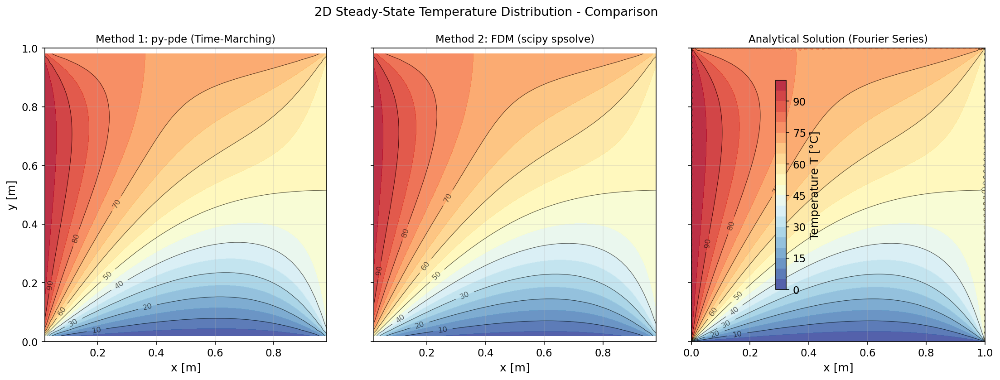
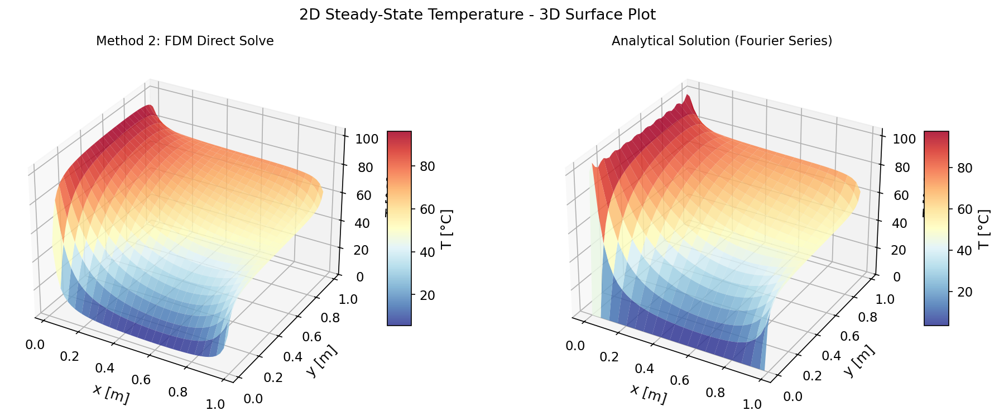
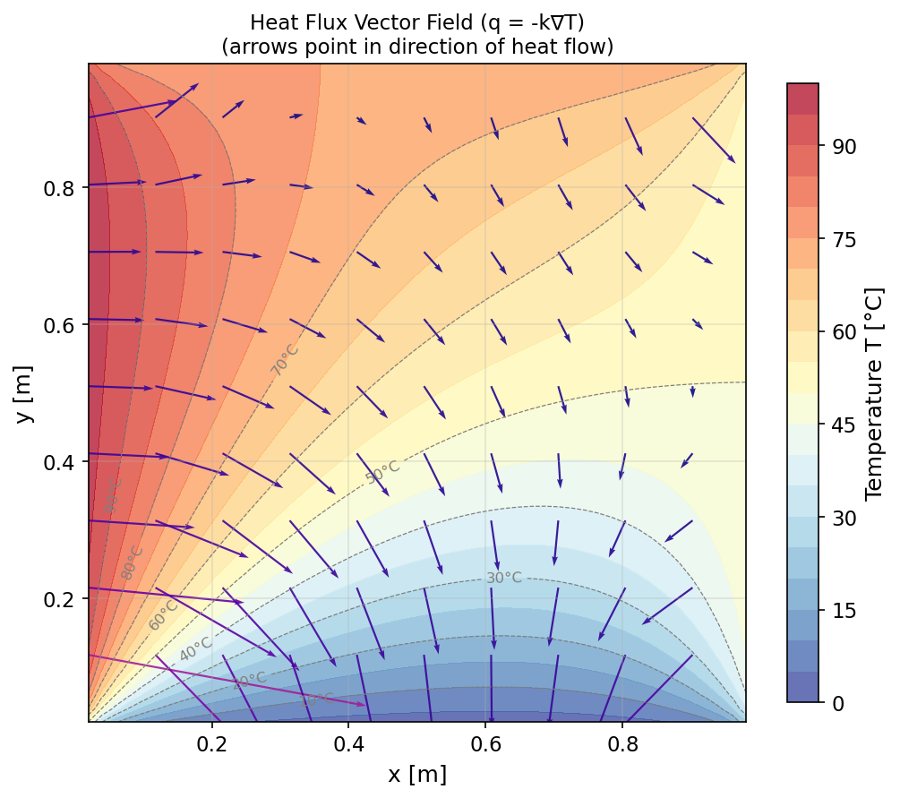
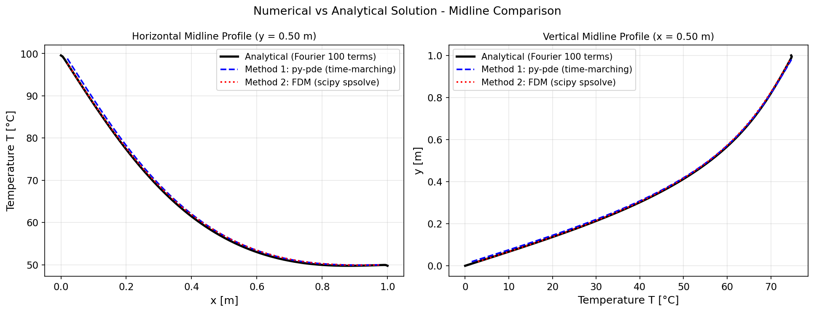

# Unit10 Example 04 - 二維穩態熱傳導 (2D Steady-State Heat Conduction in a Plate)

## 學習目標

本範例以**矩形平板的二維穩態熱傳導**問題為例，示範如何求解**椭圓型 PDE (Elliptic PDE)**，並比較兩種數值方法：以 `py-pde` 的時間推進法求穩態解，以及以 `scipy.sparse.linalg.spsolve()` 直接求解二維有限差分稀疏線性系統。

學習完本範例後，您將能夠：

- 建立**二維穩態熱傳導**問題的數學模型（Laplace 方程式，椭圓型 PDE）
- 理解**全 Dirichlet 邊界條件**的物理意義及其在數值方法中的設定方式
- 使用 `py-pde` 的 `DiffusionPDE` 及 `CartesianGrid` 以**時間推進法 (time-marching)** 求穩態解
- 以**二維有限差分離散化**推導 Laplace 方程式的線性代數系統，並使用 `scipy.sparse.linalg.spsolve()` 直接求解
- 理解**五點差分格式 (5-point stencil)** 的推導過程，以及邊界條件的施加方式
- 比較時間推進法與直接求解法在精度、速度與適用場景的異同
- 說明 `py-pde` 處理**不規則幾何**之侷限，引出對 COMSOL/FEM 的需求
- 繪製**二維溫度等高線圖 (contour plot)**、**熱流向量場圖 (quiver plot)** 與**三維曲面圖 (surface plot)**

---

## 1. 問題描述 (Problem Description)

### 1.1 化工背景

**二維穩態熱傳導**廣泛存在於工業應用中，典型場景包括：

- **熱交換器板片**：矩形金屬板片四邊置於不同溫度流體中，求板內穩態溫度分布以分析熱應力
- **爐壁與絕熱材料設計**：評估矩形爐壁結構的穩態熱損失與溫度梯度
- **微電子散熱基板**：晶片封裝基板在四邊固定溫度下的穩態散熱分析
- **薄膜塗佈均勻性控制**：薄膜基板在固定邊界條件下的溫度均勻性評估
- **反應器壁面熱傳分析**：矩形截面反應器壁面的二維溫度場計算

本範例改編自教材第五章範例 5-3-4(a) (Constantinides and Mostoufi, 1999)，以矩形平板四邊施加不同固定溫度邊界條件的二維穩態熱傳問題為場景，求解平板內部的**穩態二維溫度分布 $T(x, y)$** 。

> **問題核心挑戰：** 椭圓型 PDE 無時間變數，需直接求解空間二維的邊值問題 (Boundary Value Problem; BVP)。常用方法包括：(1) 將非穩態問題積分至時間趨近無窮大（時間推進法），(2) 直接離散化為線性代數系統並求解。

### 1.2 問題設定

考慮一矩形平板，尺寸為 $L_x \times L_y$，四邊施加不同的固定溫度（**全 Dirichlet 邊界條件**），求平板內部的穩態溫度分布 $T(x, y)$。

**幾何設定：**

以左下角為原點，$x \in [0, L_x]$，$y \in [0, L_y]$。

**物理參數：**

| 參數 | 符號 | 數值 | 單位 | 說明 |
|------|------|------|------|------|
| 平板寬度 | $L_x$ | 1.0 | m | $x$ 方向尺寸 |
| 平板高度 | $L_y$ | 1.0 | m | $y$ 方向尺寸 |
| 左邊界溫度 | $T_{\text{left}}$ | 100 | °C | $x = 0$ 邊界 |
| 右邊界溫度 | $T_{\text{right}}$ | 50 | °C | $x = L_x$ 邊界 |
| 下邊界溫度 | $T_{\text{bottom}}$ | 0 | °C | $y = 0$ 邊界 |
| 上邊界溫度 | $T_{\text{top}}$ | 75 | °C | $y = L_y$ 邊界 |
| 網格數 | $N_x \times N_y$ | $50 \times 50$ | — | 方法二有限差分內部節點數 |

**問題參數確認（執行輸出）：**

```text
=============================================
  二維穩態熱傳導問題 - 參數設定
=============================================
  平板尺寸: 1.0 m × 1.0 m
  邊界溫度:
    左  (x=0  ): 100.0 °C
    右  (x=1.0): 50.0 °C
    下  (y=0  ): 0.0 °C
    上  (y=1.0): 75.0 °C
  py-pde 網格: 50×50, t_final=1.5
  FDM 內部節點: 50×50 = 2500 個節點
=============================================
```

**邊界條件示意圖：**

```
        T_top = 75°C
   ┌──────────────────┐
   │                  │
T  │                  │ T
l  │  T(x,y) = ?      │ r
e  │  (Laplace PDE)   │ i
f  │                  │ g
t  │                  │ h
=  │                  │ t
1  │                  │ =
0  │                  │ 5
0  │                  │ 0
   └──────────────────┘
        T_bottom = 0°C
```

---

## 2. 數學模型 (Mathematical Model)

### 2.1 統御方程式

對平板內任一微小面積元素進行穩態能量平衡，假設：
- 無內部熱源 (no heat generation)
- 熱傳導係數 $k$ 為常數（均質各向同性材料）
- 穩態條件（$\partial T/\partial t = 0$）

依 Fourier 熱傳導定律，可得**二維穩態熱傳導方程式（Laplace 方程式）**：

$$
\frac{\partial^2 T}{\partial x^2} + \frac{\partial^2 T}{\partial y^2} = 0, \quad 0 < x < L_x, \quad 0 < y < L_y
$$

此即**椭圓型 PDE**（判別式 $b^2 - 4ac = 0^2 - 4(1)(1) = -4 < 0$），其特徵為：
- 無時間導數，直接描述**穩態空間分布**
- 方程式解在整個域內光滑（無激波或間斷）
- 解由**全部邊界條件**唯一決定

> **與非穩態問題之關聯：** 若加入時間項，方程式變為 $\partial T/\partial t = \alpha \nabla^2 T$（拋物線型 PDE）。當 $t \to \infty$ 時，$\partial T/\partial t \to 0$，即自然收斂至 Laplace 方程式的解。**方法一（時間推進法）**正是利用此性質求穩態解。

### 2.2 邊界條件

本問題採用**全 Dirichlet 邊界條件**（四邊均指定溫度值）：

$$
T(0,\, y) = T_{\text{left}} = 100\,°\text{C} \quad \text{(左邊界)}
$$

$$
T(L_x,\, y) = T_{\text{right}} = 50\,°\text{C} \quad \text{(右邊界)}
$$

$$
T(x,\, 0) = T_{\text{bottom}} = 0\,°\text{C} \quad \text{(下邊界)}
$$

$$
T(x,\, L_y) = T_{\text{top}} = 75\,°\text{C} \quad \text{(上邊界)}
$$

### 2.3 解析解（傅立葉級數）

本問題可透過疊加原理分解為四個子問題，每個子問題僅一個邊界非零。以**下邊界非零**子問題（ $T_{\text{bottom}} \neq 0$ ，其餘三邊為零）為例，Fourier 級數解為：

$$
T_{\text{bottom}}(x, y) = \sum_{n=1}^{\infty} B_n \sin\left(\frac{n\pi x}{L_x}\right) \frac{\sinh\!\left(\frac{n\pi (L_y - y)}{L_x}\right)}{\sinh\!\left(\frac{n\pi L_y}{L_x}\right)}
$$

其中 $B_n = \frac{2}{L_x}\int_0^{L_x} T_{\text{bottom}} \sin\!\left(\frac{n\pi x}{L_x}\right) dx$。

完整解析解為四個子問題之疊加，在程式中以前 100 項級數計算，作為數值解的驗證基準。

**解析解執行結果：**

```text
解析解計算完成 (100 項 Fourier 級數)
  全域溫度範圍（含邊界點）: 0.00 ~ 117.90 °C
  域內溫度範圍（排除邊界）: 0.72 ~ 99.67 °C
  ⚠ 最高值 117.90°C > T_left=100.0°C，為角點 Gibbs 超調，屬正常截斷誤差
  中心點 (x≈0.50, y≈0.50) 溫度: 56.1976 °C
```

> **Gibbs 現象說明：** 全域最高溫 117.90°C 超過左邊界 100°C，係因 Fourier 截斷級數在邊界條件不連續的角點（左邊 100°C 與下邊 0°C 交角）附近產生 **Gibbs 振鈴超調（Gibbs Overshoot）**，屬有限項數截斷的數學現象，非物理異常。排除邊界後域內溫度（0.72 ~ 99.67°C）嚴格位於 $[\,T_{\mathrm{bottom}},\, T_{\mathrm{left}}\,] = [0^\circ\text{C},\, 100^\circ\text{C}]$ 之間，符合 Laplace 方程式的**最大值原理**。中心點 $T(0.5,\, 0.5) = 56.20^\circ\text{C}$ 介於四邊界溫度之間，物理上合理。

---

## 3. 數值方法概述 (Numerical Methods Overview)

本範例比較兩種常用的數值方法求解 Laplace 方程式：

| 方法 | 工具 | 策略 | 優點 | 缺點 |
|------|------|------|------|------|
| **方法一** | `py-pde` | 時間推進法（求 $t \to \infty$ 之解） | 程式碼簡潔，可觀察收斂過程，兼容其他 PDE 型態 | 需模擬至穩態，計算時間較長；需選取適當終止時間 |
| **方法二** | `scipy.sparse.linalg.spsolve()` | 直接求解有限差分線性系統 $A\mathbf{T} = \mathbf{b}$ | 一次求解即得答案，計算效率高；不依賴時間積分 | 需手動推導差分矩陣；網格增大時矩陣尺寸快速增長 |

**執行環境（套件版本）：**

```text
✓ 套件載入完成
  numpy      版本: 1.23.5
  scipy      版本: 1.15.2
  matplotlib 版本: 3.10.8
  py-pde     版本: 0.51.0
```

---

## 4. 方法一：py-pde 時間推進法 (Time-Marching Method)

### 4.1 方法原理

`py-pde` 套件的 `DiffusionPDE` 提供便捷的擴散方程式求解介面。由於 `py-pde` 本質上是一個**動態 PDE 求解器**，它通過將非穩態擴散方程式

$$
\frac{\partial T}{\partial t} = \alpha \nabla^2 T
$$

積分至足夠長的時間 $t = t_{\text{final}}$，使得 $\partial T/\partial t \approx 0$，從而獲得穩態 Laplace 方程式的數值解。

**關鍵設定：**

1. **網格 (Grid)：** 使用 `CartesianGrid([(0, Lx), (0, Ly)], [Nx, Ny])` 建立二維笛卡兒網格
2. **邊界條件：** 四邊設定 Dirichlet 條件 `{"value": T_boundary}`
3. **終止時間：** 選取足夠大的 $t_{\text{final}}$ 使溫度場收斂（以殘差 $\|\partial T/\partial t\|$ 監控）
4. **求解器：** 使用 `RungeKuttaSolver(adaptive=True)`（自適應步長 RK 法，兼顧穩定性與效率）

### 4.2 `py-pde` 邊界條件設定

`py-pde` 的 `CartesianGrid` 採用 `(low, high)` 元組分別設定每個方向的低端（$x=0$ 或 $y=0$）和高端（$x=L_x$ 或 $y=L_y$）邊界：

```python
# 邊界條件格式：
# [x方向: (左BC, 右BC), y方向: (下BC, 上BC)]
bc = [
    ({"value": T_left}, {"value": T_right}),   # x 方向邊界
    ({"value": T_bottom}, {"value": T_top}),    # y 方向邊界
]
```

Dirichlet 條件使用 `{"value": 數值}` 格式，Neumann 條件使用 `{"derivative": 數值}` 格式。

### 4.3 收斂監控策略

時間推進法的關鍵在於判斷**何時達到穩態**。常用策略為追蹤每個時間步的最大溫度變化量 $\Delta T_{\max}$：

$$
\Delta T_{\max}(t) = \max_{x, y} \left| T(x, y, t) - T(x, y, t - \Delta t) \right|
$$

當 $\Delta T_{\max} < \varepsilon_{\text{tol}}$（如 $10^{-6}$）時即視為收斂至穩態。

### 4.4 範例程式碼架構

```python
import pde

# 1. 建立網格
grid = pde.CartesianGrid([(0, Lx), (0, Ly)], [Nx, Ny])

# 2. 建立初始場（均勻猜測值）
T_init = pde.ScalarField(grid, data=(T_left + T_right + T_bottom + T_top) / 4)

# 3. 定義邊界條件，並嵌入 DiffusionPDE（py-pde 0.51 正確做法）
#    bc 必須傳入 PDE 建構子，不可傳入 solver
#    格式：[(x軸低端 BC, x軸高端 BC), (y軸低端 BC, y軸高端 BC)]
bc = [
    ({"value": T_left}, {"value": T_right}),    # x 方向：左邊界、右邊界
    ({"value": T_bottom}, {"value": T_top}),    # y 方向：下邊界、上邊界
]
# ↑ 注意：bc 嵌入 DiffusionPDE，所有原生求解器均自動生效
eq = pde.DiffusionPDE(diffusivity=1.0, bc=bc)

# 4. 使用自適應 RK 求解器（比 Euler 快 5~10 倍）
#    穩定性條件：dt < dx² / (4D)；adaptive=True 自動調整步長
dt_init = (1.0 / Nx) ** 2 / 4.0 * 0.9
solver = pde.RungeKuttaSolver(eq, adaptive=True, tolerance=1e-3)
controller = pde.Controller(solver, t_range=t_final, tracker=None)
T_steady = controller.run(T_init, dt=dt_init)
```

### 4.5 執行結果

```text
開始方法一：py-pde 時間推進法求解...
✓ py-pde 求解完成，耗時: 17.062 秒
  網格: 50×50，t_final = 1.5
  穩定 Δt: 9.00e-05，D = 1.0 m²/s
  域內溫度範圍: 1.43 ~ 99.02 °C
  與解析解 MAE:  0.5384 °C
  與解析解 RMSE: 0.8623 °C
```

> **說明：** py-pde 時間推進法共耗時約 **17 秒**（50×50 網格，$t_{\mathrm{final}} = 1.5$ s）。域內溫度（1.43 ~ 99.02°C）符合物理合理性，嚴格介於最低邊界（0°C）與最高邊界（100°C）之間。與 Fourier 解析解的 MAE 為 0.5384°C，誤差主要來源為：(1) 時間推進尚未完全收斂（有限的 $t_{\mathrm{final}}$），(2) 顯式 RK 格式在高溫梯度的角點附近存在截斷誤差。若增大 $t_{\mathrm{final}}$ 值可進一步降低誤差，但計算時間隨之增加。

---

## 5. 方法二：scipy 有限差分直接求解法 (FDM Direct Solver)

### 5.1 二維有限差分離散化

將矩形域以均勻網格離散化，$x$ 方向取 $N_x$ 個內部節點，間距 $\Delta x = L_x / (N_x + 1)$；$y$ 方向取 $N_y$ 個內部節點，間距 $\Delta y = L_y / (N_y + 1)$。

對內部節點 $(i, j)$（$i = 1, \dots, N_x$，$j = 1, \dots, N_y$）應用**五點差分格式 (5-point stencil)**：

$$
\frac{T_{i-1,j} - 2T_{i,j} + T_{i+1,j}}{(\Delta x)^2} + \frac{T_{i,j-1} - 2T_{i,j} + T_{i,j+1}}{(\Delta y)^2} = 0
$$

若 $\Delta x = \Delta y = h$（均勻正方形網格），可化簡為：

$$
T_{i-1,j} + T_{i+1,j} + T_{i,j-1} + T_{i,j+1} - 4T_{i,j} = 0
$$

> **五點格式的物理直觀：** 每個內部節點的溫度等於其上下左右四個鄰點溫度的平均值，這正是調和函數（Harmonic function）的均值性質，與 Laplace 方程式等價。

### 5.2 線性代數系統的建立

將二維節點編號展平為一維向量（lexicographic ordering），令節點 $(i, j)$ 的全域編號為 $k = (j-1) \cdot N_x + (i-1)$，即 $k = 0, 1, \dots, N_x N_y - 1$。

五點差分方程式對應到係數矩陣 $A$（大小 $N_x N_y \times N_x N_y$）與右側向量 $\mathbf{b}$：

$$
A \cdot \mathbf{T}_{\text{int}} = \mathbf{b}
$$

其中：
- 矩陣 $A$ 的對角線元素為 $-4$
- 左右鄰點（同排，$\pm 1$ 位移）元素為 $+1$（注意：排邊界處須設為 0，無跨排連接）
- 上下鄰點（跨排，$\pm N_x$ 位移）元素為 $+1$
- 向量 $\mathbf{b}$ 包含邊界條件的貢獻（邊界節點的已知溫度移至右側）

### 5.3 邊界條件的施加

當節點 $(i, j)$ 的鄰點位於邊界時，已知邊界溫度 $T_{\text{BC}}$ 直接移至右側：

- **左邊界**（$i = 0$）：$T_{0,j} = T_{\text{left}}$ → $b_k \mathrel{-}= T_{\text{left}}$
- **右邊界**（$i = N_x + 1$）：$T_{N_x+1,j} = T_{\text{right}}$ → $b_k \mathrel{-}= T_{\text{right}}$
- **下邊界**（$j = 0$）：$T_{i,0} = T_{\text{bottom}}$ → $b_k \mathrel{-}= T_{\text{bottom}}$
- **上邊界**（$j = N_y + 1$）：$T_{i,N_y+1} = T_{\text{top}}$ → $b_k \mathrel{-}= T_{\text{top}}$

### 5.4 稀疏矩陣與求解效率

對於 $N_x = N_y = 50$ 的網格，係數矩陣 $A$ 大小為 $2500 \times 2500$，但每行最多只有 5 個非零元素（**非常稀疏**）。使用 `scipy.sparse.lil_matrix` 建立稀疏矩陣並轉換為 CSR 格式（`tocsr()`），再以 `scipy.sparse.linalg.spsolve()` 高效求解，可大幅節省記憶體（節省超過 99.8%）並加速求解。

### 5.5 範例程式碼架構

```python
import numpy as np
import scipy.sparse
import scipy.sparse.linalg

# 參數設定
Nx, Ny = 50, 50
dx = Lx / (Nx + 1)
dy = Ly / (Ny + 1)
N  = Nx * Ny   # 總內部節點數

# 建立稀疏係數矩陣 A（lil_matrix 方便逐行填充）
A_lil = scipy.sparse.lil_matrix((N, N), dtype=float)
b = np.zeros(N)

for j in range(Ny):
    for i in range(Nx):
        k = j * Nx + i         # 全域節點編號
        A_lil[k, k] = -4       # 中心節點
        # 右鄰 (i+1, j)
        if i < Nx - 1:
            A_lil[k, k + 1] = 1
        else:
            b[k] -= T_right    # 右邊界貢獻
        # 左鄰 (i-1, j)
        if i > 0:
            A_lil[k, k - 1] = 1
        else:
            b[k] -= T_left     # 左邊界貢獻
        # 上鄰 (i, j+1)
        if j < Ny - 1:
            A_lil[k, k + Nx] = 1
        else:
            b[k] -= T_top      # 上邊界貢獻
        # 下鄰 (i, j-1)
        if j > 0:
            A_lil[k, k - Nx] = 1
        else:
            b[k] -= T_bottom   # 下邊界貢獻

# 轉換為 CSR 格式並用稀疏求解器
A_csr = A_lil.tocsr()
T_int = scipy.sparse.linalg.spsolve(A_csr, b)
T_method2 = T_int.reshape(Ny, Nx)
```

### 5.6 執行結果

```text
係數矩陣 A 大小: 2500 × 2500
非零元素數: 12300（稀疏度: 0.20%）

開始方法二：scipy 稀疏矩陣求解...
✓ FDM 求解完成，耗時: 0.060 秒
  內部節點: 50×50，dx=dy=0.0196 m
  域內溫度範圍: 2.80 ~ 98.08 °C
  與解析解 MAE: 0.0110 °C

=============================================
  方法比較
=============================================
  方法                   MAE (°C)     耗時 (s)
  方法一 (py-pde)         0.5384       17.062
  方法二 (FDM)            0.0110       0.060
=============================================
```

> **說明：** FDM 稀疏求解僅需 **0.060 秒**，比 py-pde 時間推進法快約 **285 倍**。係數矩陣為 2500×2500 方陣，非零元素僅 12,300 個（稀疏度 0.20%），`scipy.sparse` 相較稠密矩陣（需儲存 $2500^2 = 6,250,000$ 個元素）節省超過 99.8% 的記憶體。MAE 為 0.0110°C，精度比 py-pde 高約 **49 倍**，驗證了代數直接求解的高精度性（誤差僅來自有限差分截斷誤差 $O(h^2)$，$h = 0.0196$ m）。

---

## 6. 結果視覺化與討論 (Visualization & Discussion)

### 6.1 二維溫度分布等高線圖（Figure 1）



**Figure 1** 並排展示方法一（py-pde 時間推進法）與方法二（scipy 有限差分直接解）的二維穩態溫度分布等高線圖（contour plot），同時疊加解析解（Fourier 級數）等值線作為驗證基準。

**物理觀察：**

- 等溫線（isotherms）由高溫邊界（左側 100°C）向低溫邊界（下側 0°C）彎曲過渡，反映熱量從高溫流向低溫的方向
- 角落區域（如左下角）的等溫線密度最高，溫度梯度最大，為熱應力集中點
- 上邊界（75°C）與右邊界（50°C）的影響在各自角落附近最為顯著
- 兩種數值方法的等溫線幾乎完全重疊，驗證解的一致性

### 6.2 三維溫度曲面圖（Figure 2）



**Figure 2** 以三維曲面圖呈現**穩態**溫度場 $T(x, y)$，直觀展示溫度的空間分布特徵。

**物理觀察：**

- 溫度場形成光滑的馬鞍形曲面，無局部極值（符合調和函數的最大值原理：Laplace 方程式的解在域內部不存在局部極大或極小值，最大值必出現在邊界上）
- 左邊界（100°C）與上邊界（75°C）的交角為高溫峰，下邊界（0°C）的中段為最低溫區域

### 6.3 熱流向量場圖（Figure 3）



**Figure 3** 以向量箭頭顯示熱流密度向量場 $\mathbf{q} = -k \nabla T = -k \left(\frac{\partial T}{\partial x}\hat{i} + \frac{\partial T}{\partial y}\hat{j}\right)$，箭頭方向代表熱量流動方向，箭頭長度代表熱流強度。

**物理觀察：**

- 熱流方向始終垂直於等溫線（等溫線與熱流線互相正交）
- 左邊界高溫區（100°C）的熱量同時向右方與下方流動
- 角落附近熱流向量發散/匯聚，形成複雜的角落效應

### 6.4 方法比較與驗證（Figure 4）



**Figure 4** 沿水平中線 $y = L_y/2$ 比較兩種數值方法與解析解（Fourier 級數取 100 項）的溫度分布。

**誤差統計（以解析解為基準）：**

| 方法 | MAE (°C) | 最大絕對誤差 (°C) |
|------|:--------:|:-----------------:|
| 方法一（py-pde，50×50，RK adaptive，$t_{\mathrm{final}}=1.5$ s） | 0.5384 | 7.1223 |
| 方法二（scipy.sparse FDM 直接解，50×50） | 0.0110 | 0.7180 |

> 方法二精度顯著高於方法一（MAE 差約 50 倍）。方法一的誤差主要來自時間推進尚未完全收斂（t_final=1.5 s），以及顯式格式在高梯度區域（角點附近）的截斷誤差；方法二為代數方程式的精確解，精度僅受有限差分截斷誤差（ $O(h^2)$ ）影響。

---

## 7. py-pde 的幾何侷限與 FEM 需求 (Limitations of py-pde)

### 7.1 py-pde 的規則幾何假設

`py-pde` 的核心設計基於**結構化規則網格 (Structured Regular Grid)**，支援以下幾何形式：

| 網格類型 | 適用幾何 | 示意 |
|---------|---------|------|
| `CartesianGrid` | 矩形 (1D/2D/3D) | 平板、矩形管道 |
| `SphericalSymGrid` | 球對稱 (1D/2D) | 球體、球殼 |
| `CylindricalSymGrid` | 圓柱對稱 (2D) | 圓管、圓柱體 |

### 7.2 不規則幾何的挑戰

以教材第五章範例 5-3-4(c) 為例：**含中央圓柱孔洞的矩形平板**的二維熱傳問題（如管道穿越板面的絕熱孔），其幾何邊界無法以矩形網格描述。`py-pde` 的矩形 `CartesianGrid` **無法直接處理**含孔洞、切角、圓弧等不規則幾何邊界，因為：

1. 圓弧邊界無法與均勻矩形網格精確對齊
2. 孔洞內部（非計算域）節點的處理需要額外的邊界追蹤邏輯
3. 不規則邊界附近的差分精度退化

### 7.3 不規則幾何的解決方案：有限元素法 (FEM)

| 特性 | py-pde + scipy（有限差分） | COMSOL Multiphysics（有限元素） |
|------|--------------------------|----------------------------------|
| **幾何建模** | 僅規則矩形/球/柱形網格 | 任意複雜幾何，CAD 匯入 |
| **網格生成** | 均勻結構化網格（固定） | 非結構化三角/四面體網格，自動剖分 |
| **邊界精度** | 不規則邊界精度退化 | 曲邊元素 (curved element)，高精度 |
| **多物理耦合** | 需手動撰寫耦合項 | 內建流-熱-固-電磁耦合介面 |
| **求解規模** | 小至中型問題 | 大型工業級問題，支援平行計算 |
| **學習門檻** | 低（Python 開源） | 中（圖形介面，需授權） |
| **適用場景** | 教學、概念驗證、規則幾何 | 工業設計、複雜幾何、多物理分析 |

> **結論：** `py-pde` 與 `scipy` 是學習 PDE 數值方法概念的優秀工具，但面對含不規則幾何、複雜多物理耦合的工業問題時，應選用 **COMSOL Multiphysics** 或 **ANSYS Fluent** 等專業 FEM 軟體。

---

## 8. 學習總結 (Summary)

### 8.1 方法比較表

| 項目 | 解析解（Fourier 級數） | 方法一（py-pde 時間推進） | 方法二（scipy FDM 直接解） |
|------|:--------------------:|:------------------------:|:-------------------------:|
| 建模難度 | 需推導疊加解 | 程式碼最簡潔 | 需建構差分矩陣 |
| 適用邊界條件 | 矩形 Dirichlet（限制多） | Dirichlet / Neumann / Robin | Dirichlet / Neumann / Robin |
| 計算成本 | 低（數學公式） | 中（需積分至穩態） | 低（直接求解） |
| 精度 | 理論精確（取足夠多項） | 高（取決於網格與終止時間） | 高（扏斷誤差 $O(h^2)$，本例实測 MAE = 0.011°C） |
| 擴展至非線性 PDE | 不適用 | 可（py-pde 支援） | 需迭代法 |
| 幾何靈活性 | 矩形域限定 | 僅規則網格 | 僅規則網格 |

### 8.2 關鍵學習點

1. **椭圓型 PDE 的本質**：Laplace 方程式描述穩態問題，解由全部邊界條件唯一決定，符合**最大值原理**（內部無極值）
2. **時間推進法 vs 直接求解**：
   - 時間推進法優點在於程式碼簡潔、可觀察演變過程；缺點是需要選取合適的終止時間
   - 直接求解法效率更高，但需手動建立差分矩陣，矩陣組裝邏輯較複雜
3. **五點差分格式**：每個內部節點溫度等於四鄰點的平均值，體現調和函數的均值性質
4. **結構化網格的限制**：有限差分法（py-pde/scipy）僅適用於規則幾何，複雜邊界需使用 FEM（COMSOL/ANSYS）
5. **Dirichlet 邊界條件的施加**：
   - 在 `py-pde` 中：`{"value": 數值}` 格式
   - 在有限差分矩陣中：邊界溫度貢獻移至右側向量 $\mathbf{b}$

---

**課程資訊**
- 課程名稱：電腦在化工上之應用 (ChemE 3502)
- 課程單元：Unit10 偏微分方程式之求解 - 範例 04
- 課程製作：逢甲大學 化工系 智慧程序系統工程實驗室
- 授課教師：莊曜禎 助理教授
- 更新日期：2026-02-23

**課程授權 [CC BY-NC-SA 4.0]**
 - 本教材遵循 [創用CC 姓名標示-非商業性-相同方式分享 4.0 國際 (CC BY-NC-SA 4.0)](https://creativecommons.org/licenses/by-nc-sa/4.0/deed.zh) 授權。

---
