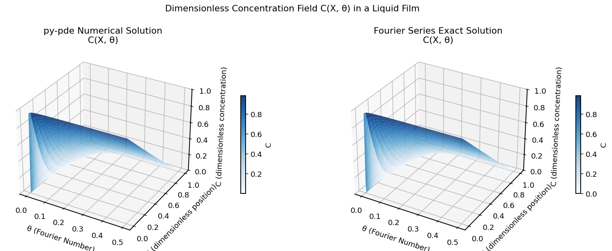
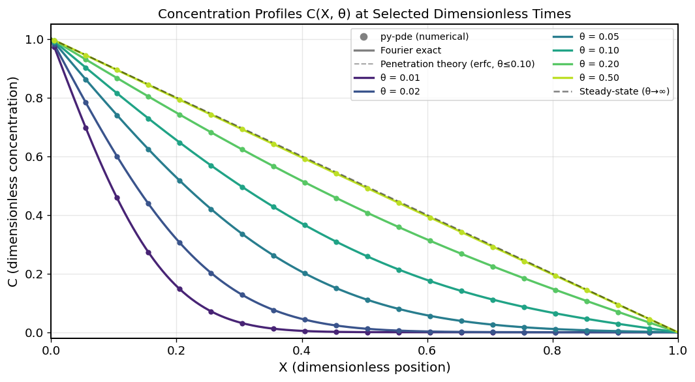
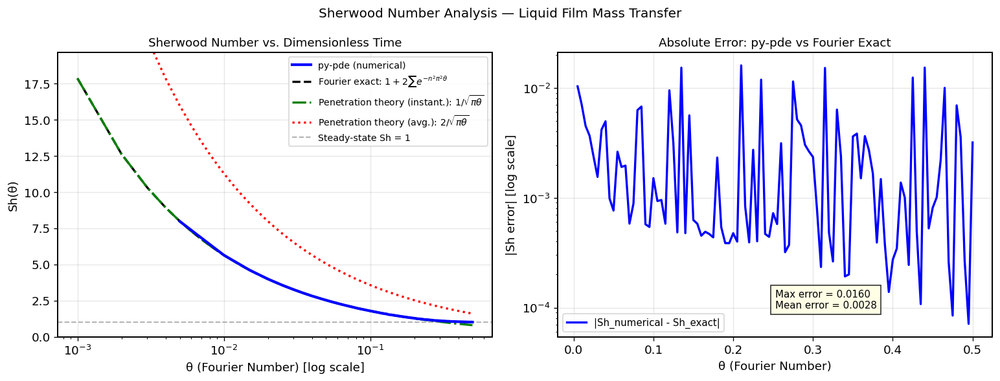
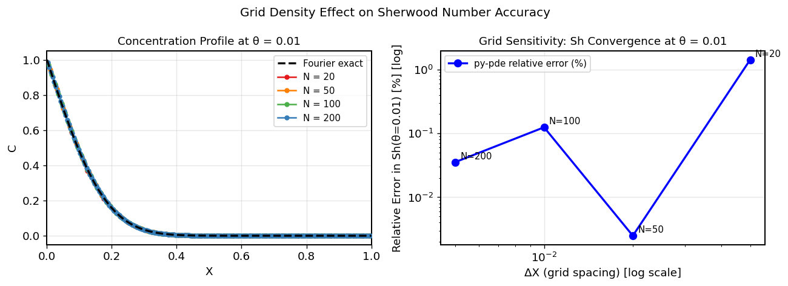

# Unit10 Example 05 - 液境膜中溶質滲透與 Sherwood 數計算 (Mass Transfer in a Liquid Film)

## 學習目標

本範例以**液境膜內氣體溶質向液相本體擴散**為例，示範如何使用 `py-pde` 的 `DiffusionPDE` 求解一維無因次化拋物線型 PDE，計算界面瞬間質量通量並推導 Sherwood 數，再與**滲透理論 (Penetration Theory)** 解析解進行驗證比較。

學習完本範例後，您將能夠：

- 建立**液境膜質量傳遞**問題的無因次化 PDE 模型，認識 Fourier 數 (Fo) 作為無因次時間的物理意義
- 使用 `py-pde` 的 `DiffusionPDE` 搭配 `CartesianGrid` 與 `MemoryStorage` 求解拋物線型 PDE
- 由數值溶液計算界面濃度梯度，推導**瞬間 Sherwood 數** $Sh(\theta)$
- 理解並應用**滲透理論 (Penetration Theory)** 之解析解 $Sh = 1/\sqrt{\pi\theta}$ 及時間平均 $\overline{Sh} = 2/\sqrt{\pi\theta}$
- 與 **Fourier 級數精確解**進行全時段驗證
- 繪製濃度 $C(X, \theta)$ 時空演變曲面圖，以及 $Sh$ 隨無因次時間 $\theta$ 的衰減曲線

---

## 1. 問題描述 (Problem Description)

### 1.1 化工背景

**液境膜內的溶質擴散 (Diffusion in a Liquid Film)** 是氣-液質量傳遞的核心機制，廣泛應用於：

- 氣體吸收塔 (Absorption Column) 的設計——如 CO₂ 吸收於鹼液中
- 薄膜蒸發器 (Thin Film Evaporator) 的質傳分析
- 溶氧 (Dissolved Oxygen, DO) 在廢水處理曝氣單元中的傳遞
- 生物反應器中氧氣由氣泡向液相本體的傳輸
- 藥物透過細胞膜的滲透計算

本範例改編自教材第五章範例 5-3-5（呂，1985），原以 MATLAB `pdepe` 求解，此處改以 Python `py-pde` 實作。

> **參考來源：** 呂（1985），MATLAB 在化工上之應用第五章，範例 5-3-5。

### 1.2 物理情境

如下圖示意，考慮一**靜止液境膜**（厚度 $\delta$），其左端 ($x = 0$) 為氣液界面，氣體溶質 A 在此界面維持飽和溶解度 $C_{Ai}$（Dirichlet 邊界條件）；右端 ($x = \delta$) 為液相本體，溶質濃度維持在 0（遠場條件）。初始時刻，液境膜內溶質濃度為零，求濃度隨時間與位置的演變。

```
氣相  |←──── 液境膜 (0 ≤ x ≤ δ) ────→|  液相本體
      |                                |
C_Ai  |  →  →  →  →  →  →  →  →  →   |  C_A = 0
(界面飽和濃度)   氣體溶質 A 向右擴散     (本體濃度)
```

### 1.3 問題參數

| 參數 | 符號 | 數值 | 單位 | 說明 |
|------|------|------|------|------|
| 液境膜厚度 | $\delta$ | 1 | mm (10⁻³ m) | 液境膜特徵長度 |
| 擴散係數 | $D_{AB}$ | 2×10⁻⁹ | m²/s | 溶質在液相中的分子擴散係數 |
| 界面飽和濃度 | $C_{Ai}$ | 1 | mol/m³ | 氣液平衡溶解度 (歸一化為 1) |
| 液相本體濃度 | $C_{A0}$ | 0 | mol/m³ | 液相本體中溶質初始及遠場濃度 |
| 初始濃度 | $C_{A}(x,0)$ | 0 | mol/m³ | 均勻零初始條件 |
| 模擬無因次時間 | $\theta_f$ | 0.50 | — | 相當於真實時間 $t_f = \theta_f \delta^2/D_{AB} = 250$ s |

**特性時間：** $t_c = \delta^2 / D_{AB} = (10^{-3})^2 / (2 \times 10^{-9}) = 500$ s 為液境膜擴散特性時間。

---

## 2. 數學模型 (Mathematical Model)

### 2.1 有因次統御方程式

一維非穩態質量傳遞 (Fick 第二定律) 於液境膜中：

$$
\frac{\partial C_A}{\partial t} = D_{AB} \frac{\partial^2 C_A}{\partial x^2}, \quad 0 < x < \delta, \quad t > 0
$$

**邊界條件：**

$$
C_A(0, t) = C_{Ai}, \quad t > 0 \qquad \text{(氣液界面，Dirichlet)}
$$

$$
C_A(\delta, t) = 0, \quad t > 0 \qquad \text{(液相本體，Dirichlet)}
$$

**起始條件：**

$$
C_A(x, 0) = 0, \quad 0 \leq x \leq \delta
$$

### 2.2 無因次化

引入以下無因次變數：

$$
X = \frac{x}{\delta} \in [0, 1], \qquad \theta = \frac{D_{AB}\, t}{\delta^2}, \qquad C = \frac{C_A}{C_{Ai}} \in [0, 1]
$$

其中 $\theta$ 即為 **Fourier 數 (Fo)**，代表無因次擴散時間（實際擴散程度相對於膜厚的比例）。

代入後，統御方程式化為**標準無因次擴散方程式**：

$$
\frac{\partial C}{\partial \theta} = \frac{\partial^2 C}{\partial X^2}, \quad 0 < X < 1, \quad \theta > 0
$$

**無因次邊界條件：**

$$
C(0, \theta) = 1, \quad \theta > 0 \qquad \text{(界面固定飽和濃度)}
$$

$$
C(1, \theta) = 0, \quad \theta > 0 \qquad \text{(本體固定為零)}
$$

**無因次起始條件：**

$$
C(X, 0) = 0, \quad 0 \leq X \leq 1
$$

### 2.3 Sherwood 數定義

**界面瞬間質量通量（有因次）：**

$$
N_A(t) = -D_{AB} \left. \frac{\partial C_A}{\partial x} \right|_{x=0} = -\frac{D_{AB} C_{Ai}}{\delta} \left. \frac{\partial C}{\partial X} \right|_{X=0}
$$

**質量傳遞係數：**

$$
k_L(t) = \frac{N_A(t)}{C_{Ai} - C_{A0}} = \frac{N_A(t)}{C_{Ai}} = -\frac{D_{AB}}{\delta} \left. \frac{\partial C}{\partial X} \right|_{X=0}
$$

**瞬間 Sherwood 數（無因次質量傳遞係數）：**

$$
Sh(\theta) = \frac{k_L\, \delta}{D_{AB}} = -\left. \frac{\partial C}{\partial X} \right|_{X=0}
$$

即 $Sh(\theta)$ 等於無因次界面濃度梯度的負值。

---

## 3. 解析解 (Analytical Solutions)

### 3.1 短時間近似：滲透理論 (Penetration Theory)

當 $\theta \ll 1$（即擴散前鋒尚未抵達右端 $X=1$），液境膜可視為**半無限介質 (semi-infinite medium)**。在此假設下，邊界條件 $C(1, \theta) = 0$ 不起作用，問題有**誤差函數解析解**：

$$
C(X, \theta) = \mathrm{erfc}\!\left(\frac{X}{2\sqrt{\theta}}\right), \quad \theta \ll 1
$$

其中 $\mathrm{erfc}(z) = 1 - \mathrm{erf}(z) = \frac{2}{\sqrt{\pi}}\int_z^{\infty} e^{-u^2}\,du$ 為互補誤差函數。

對 $X$ 微分後在界面處取值：

$$
\left. \frac{\partial C}{\partial X} \right|_{X=0} = -\frac{1}{\sqrt{\pi\theta}}
$$

因此**瞬間 Sherwood 數（滲透理論）：**

$$
Sh_\text{inst}(\theta) = \frac{1}{\sqrt{\pi\theta}}
$$

定義**累計時間平均 Sherwood 數**（從 $\theta = 0$ 到 $\theta$ 的平均）：

$$
\overline{Sh}(\theta) = \frac{1}{\theta} \int_0^{\theta} Sh_\text{inst}(\theta')\,d\theta' = \frac{1}{\theta}\int_0^{\theta} \frac{1}{\sqrt{\pi\theta'}}\,d\theta' = \frac{2}{\sqrt{\pi\theta}}
$$

> **教材備注：** 化工教材（包含原 MATLAB 版課本）常直接以 $Sh = 2/\sqrt{\pi\theta}$ 代表滲透理論結果，此式為時間平均值；比較瞬間數值解時，應使用瞬間式 $Sh = 1/\sqrt{\pi\theta}$。

### 3.2 有限液境膜精確解：Fourier 級數

對有限厚度液境膜 ($0 \leq X \leq 1$) 的完整解，先分解為穩態與暫態兩部分：

$$
C(X, \theta) = C_\text{ss}(X) + C'(X, \theta)
$$

**穩態解（$\theta \to \infty$）：**

$$
C_\text{ss}(X) = 1 - X
$$

（由 $C(0) = 1$，$C(1) = 0$，$d^2C/dX^2 = 0$ 決定）

**暫態解（Fourier 展開）：**

$C' = C - C_\text{ss}$ 滿足齊次邊界條件 $C'(0) = C'(1) = 0$，初始條件 $C'(X, 0) = -(1-X)$，其解為：

$$
C'(X, \theta) = \sum_{n=1}^{\infty} B_n \sin(n\pi X)\, e^{-n^2\pi^2\theta}
$$

Fourier 係數：

$$
B_n = 2\int_0^1 [-(1-X)] \sin(n\pi X)\,dX = -\frac{2}{n\pi}
$$

**完整精確解：**

$$
C(X, \theta) = (1 - X) - \frac{2}{\pi} \sum_{n=1}^{\infty} \frac{1}{n} \sin(n\pi X)\, e^{-n^2\pi^2\theta}
$$

**精確 Sherwood 數：**

$$
Sh_\text{exact}(\theta) = -\left. \frac{\partial C}{\partial X} \right|_{X=0} = 1 + 2\sum_{n=1}^{\infty} e^{-n^2\pi^2\theta}
$$

對於大 $\theta$，${Sh_\text{exact} \to 1}$（趨近穩態 Sh），符合穩態線性濃度分布的質傳係數。對於小 $\theta$，透過 Jacobi theta 函數恆等式，此級數和等價於 $1/\sqrt{\pi\theta}$（滲透理論結果）。

---

## 4. `py-pde` 求解策略

### 4.1 求解流程

本例方程式為標準擴散方程式（擴散率 = 1）：

$$
\frac{\partial C}{\partial \theta} = \nabla^2 C
$$

直接使用 `py-pde` 的 `DiffusionPDE` 求解：

| 步驟 | py-pde 物件 | 說明 |
|------|------------|------|
| 1. 定義空間網格 | `CartesianGrid([(0, 1)], N)` | 建立 $N$ 點一維均勻網格，範圍 $X \in [0, 1]$ |
| 2. 設定場變數 | `ScalarField(grid, data=0.0)` | 初始濃度場 $C = 0$ |
| 3. 設定邊界條件 | `bc = [{"value": 1.0}, {"value": 0.0}]` | 左端 $C=1$，右端 $C=0$（兩端 Dirichlet） |
| 4. 建立 PDE | `DiffusionPDE(diffusivity=1.0, bc=bc)` | 無因次擴散方程式，擴散率為 1 |
| 5. 儲存中間結果 | `storage.tracker(dtheta_store)` | 每 $\Delta\theta$ 儲存一次濃度場 |
| 6. 執行求解 | `eq.solve(state, t_range=theta_f, ...)` | 從 $\theta=0$ 積分至 $\theta=\theta_f$ |

### 4.2 關鍵程式碼

```python
import pde

# 參數設定
theta_f  = 0.50    # 模擬終止無因次時間
N        = 100     # 空間節點數
dtheta_store = 0.005  # 儲存間隔

# 建立一維均勻網格 [0, 1]
grid  = pde.CartesianGrid([(0, 1)], N, periodic=False)

# 初始濃度場 C = 0
state = pde.ScalarField(grid, data=0.0)

# 兩端 Dirichlet 邊界條件
bc = [{"value": 1.0}, {"value": 0.0}]

# 建立擴散 PDE（diffusivity = 1，對應無因次化後的方程式）
eq = pde.DiffusionPDE(diffusivity=1.0, bc=bc)

# 記憶體儲存追蹤器
storage = pde.MemoryStorage()

# 求解（使用自適應時間步長，無需手動指定 dt）
result = eq.solve(state, t_range=theta_f,
                  tracker=[storage.tracker(dtheta_store)])
```

### 4.3 Sherwood 數的數值計算

`py-pde` 的 `CartesianGrid` 採用 **cell-centered（格心）** 節點配置，第一個節點位置為 $X_1 = \Delta X/2$（而非節點格式的 $\Delta X$）。因此界面梯度應除以 $\Delta X/2$：

$$
\left. \frac{\partial C}{\partial X} \right|_{X=0} \approx \frac{C(X_1, \theta) - C_\text{BC}(0)}{\Delta X/2}
$$

其中 $C_\text{BC}(0) = 1$（左端 Dirichlet 邊界值），分母為 $\Delta X/2$（界面到第一個格心的距離）。使用 $\Delta X$ 作分母將導致約 50% 的系統誤差。

```python
import numpy as np

X_coords = grid.axes_coords[0]
dX_val   = X_coords[1] - X_coords[0]   # 網格間距
half_dX  = dX_val / 2.0               # 界面到第一格心的距離

Sh_numerical = []
theta_arr    = []

for i, t_i in enumerate(storage.times):
    if t_i < 1e-10:    # 跳過 theta=0（初始條件，梯度無限大）
        continue
    C_arr  = np.array(storage[i].data)
    # cell-centered 界面梯度（分母為 dX/2，非 dX）
    dCdX_0 = (C_arr[0] - 1.0) / half_dX
    Sh_numerical.append(-dCdX_0)
    theta_arr.append(t_i)

Sh_numerical = np.array(Sh_numerical)
theta_arr    = np.array(theta_arr)
```

---

## 5. 執行結果 (Execution Results)

### 5.1 問題參數摘要

執行 Cell 7 輸出問題參數：

```
===============================================
  液境膜質傳問題參數摘要（無因次化）
===============================================
  空間域          X ∈ [0, 1]
  起始條件        C(X, 0)    = 0
  界面邊界條件    C(0, θ)    = 1  (Dirichlet)
  本體邊界條件    C(1, θ)    = 0  (Dirichlet)
  統御方程式      ∂C/∂θ = ∂²C/∂X²
  無因次時間域    θ ∈ [0, 0.50]

  有因次參數（僅供參考）：
    液境膜厚度  δ       = 1.000e-03 m
    擴散係數    D_AB    = 2.000e-09 m²/s
    特性時間    t_c     = 500.0 s  (δ²/D_AB)
    真實終止時間 t_f    = 250.0 s  (θ_f × t_c)
===============================================

  網格設定：
    節點數 N = 100,  ΔX = 0.0100
    顯式穩定上限 Δθ_max = 5.00e-05  (py-pde 自適應步長，自動滿足穩定條件)
```

### 5.2 py-pde 求解結果

```
開始 py-pde 求解... (θ: 0 → 0.5, N=100)

✓ py-pde 求解完成
  空間節點數:       100
  儲存間隔 Δθ:      0.005
  時間快照總數:     101
  濃度矩陣形狀:     (101, 100)
  終止時刻濃度範圍: [0.0049, 0.9949]
```

求解器採用 **自適應時間步長**（py-pde 內建 Runge-Kutta 積分器），無需手動指定 $\Delta t$，自動滿足穩定性要求。Von Neumann 穩定性上限 $\Delta\theta_\text{max} = (\Delta X)^2/2 = 5 \times 10^{-5}$ 僅供顯式方法參考。

### 5.3 Fourier 級數解析解驗證

```
Fourier 精確解 vs 滲透理論瞬間 Sh 驗證：
  θ=0.010:  Sh_exact=5.6419,  Sh_PT_inst=5.6419,  差異=0.00%
  θ=0.050:  Sh_exact=2.5231,  Sh_PT_inst=2.5231,  差異=0.00%
  θ=0.100:  Sh_exact=1.7843,  Sh_PT_inst=1.7841,  差異=0.01%
  θ=0.200:  Sh_exact=1.2786,  Sh_PT_inst=1.2616,  差異=1.33%
  θ=0.500:  Sh_exact=1.0144,  Sh_PT_inst=0.7979,  差異=21.34%
```

> **解讀：** 小 $\theta$（$\leq 0.05$）時，Fourier 精確解與滲透理論瞬間解完全吻合（差異 $< 0.01\%$）；$\theta > 0.1$ 後逐漸出現偏差，$\theta = 0.5$ 時偏差達 21%，說明大 $\theta$ 必須使用精確 Fourier 解。

---

## 6. 結果視覺化與討論 (Visualization & Discussion)

### 6.1 濃度分布時空演變曲面圖（Figure 1）



**Figure 1** 以**並排雙欄三維曲面圖**呈現 $C(X, \theta)$ 的時空演變，左欄為 py-pde 數值解，右欄為 Fourier 級數精確解，兩者均採用 `Blues` 色彩映射（深藍→高濃度區 $C \approx 1$，淺白→低濃度區 $C \approx 0$）。兩曲面幾乎完全重疊，視覺上難以分辨差異，驗證數值解之精確性。

**物理觀察：**

- $\theta = 0$ 時刻：整個液境膜 $C = 0$（均勻零初始條件）
- 隨 $\theta$ 增加，濃度前鋒從界面 $X=0$ 逐漸向液相本體 $X=1$ 推進
- 在早期（$\theta < 0.05$），濃度變化高度集中於左端（$X < 0.3$），呈現**erfc 型誤差函數輪廓**
- 隨著 $\theta$ 增大，整個膜的濃度均勻上升，逐漸趨近線性穩態分布 $C_\text{ss}(X) = 1-X$（右側斜面）
- $\theta = 0.5$ 時，濃度分布已接近但尚未完全達到線性穩態

### 6.2 特定時刻之濃度軸向分布圖（Figure 2）



**Figure 2** 比較 $\theta = 0.01, 0.02, 0.05, 0.10, 0.20, 0.50$ 六個無因次時刻的濃度分布：

- **圓點（○）**：py-pde 數值解
- **實線（—）**：Fourier 級數精確解（$N=100$ 項）
- **虛線（--）**：滲透理論 erfc 近似解（僅顯示 $\theta \leq 0.10$ 之時刻）
- **黑色虛線（k--）**：穩態線性分布 $C_\text{ss}(X) = 1-X$（$\theta \to \infty$）

**物理觀察：**

1. **$\theta = 0.01$（早期）**：erfc 解與精確解及 py-pde 三者幾乎完全重合，右端 $X=1$ 尚未受到擴散影響（$C \approx 0$）；滲透理論在此階段精度極高
2. **$\theta = 0.05$**：erfc 解在 $X > 0.5$ 處開始高估（忽略了 $C(1,\theta)=0$ 的邊界拉動效應），而精確解與 py-pde 仍相互吻合
3. **$\theta \geq 0.10$**：erfc 解明顯偏離（已超出滲透理論之適用範圍），精確解與 py-pde 持續高度一致
4. **$\theta = 0.50$**：濃度分布接近線性穩態 $1-X$，全液境膜建立近似線性梯度

### 6.3 Sherwood 數隨無因次時間的演變（Figure 3）



**Figure 3** 為半對數座標（$\theta$ 軸取對數）的 $Sh$ 對時間圖，包含：

- **實線（藍）**：py-pde 數值解（由界面梯度計算）
- **虛線（黑）**：Fourier 級數精確解 $Sh_\text{exact} = 1 + 2\sum_{n=1}^{\infty} e^{-n^2\pi^2\theta}$
- **點劃線（綠）**：滲透理論瞬間解 $Sh_\text{PT,inst} = 1/\sqrt{\pi\theta}$
- **點線（紅）**：滲透理論時間平均 $\overline{Sh}_\text{PT} = 2/\sqrt{\pi\theta}$（供比較）

**數值誤差摘要：**

```
=======================================================
  Sherwood 數誤差統計（py-pde vs Fourier 精確解）
=======================================================
  Sh 最大絕對誤差:  0.0160
  Sh 平均絕對誤差:  0.0028
  Sh 最大相對誤差:  1.49%  (θ ∈ [0.005, 0.500])
=======================================================

  數值解 Sh 樣本值：
    θ=0.005: Sh_num=7.9685,  Sh_exact=7.9788,  誤差=0.13%
    θ=0.010: Sh_num=5.6348,  Sh_exact=5.6419,  誤差=0.13%
    θ=0.025: Sh_num=3.5659,  Sh_exact=3.5682,  誤差=0.07%
    θ=0.050: Sh_num=2.5224,  Sh_exact=2.5231,  誤差=0.03%
    θ=0.100: Sh_num=1.7828,  Sh_exact=1.7843,  誤差=0.08%
    θ=0.500: Sh_num=1.0112,  Sh_exact=1.0144,  誤差=0.31%
```

**物理觀察：**

1. **大 $Sh$ 在 $\theta \to 0$**：初始時刻界面梯度趨近無限大（$C$ 從 0 跳躍至 1），$Sh \to \infty$；此行為反映「剛接觸時的最高傳質速率」
2. **$\theta < 0.05$（小 $\theta$ 區）**：py-pde、Fourier 精確解、滲透理論瞬間解三者高度重合；此區間滲透理論適用
3. **$\theta > 0.1$（大 $\theta$ 區）**：$Sh$ 逐漸收斂至 1；精確解顯示 $Sh_\text{exact} \to 1 +$ 指數衰減項，收斂速度由主導項 $2e^{-\pi^2\theta}$ 決定
4. **時間平均 $\overline{Sh} = 2/\sqrt{\pi\theta}$ 始終高於瞬間值 $Sh_\text{inst}$**，差約 2 倍，反映初期高傳質率被平均攤分效應

### 6.4 數值解精度討論（Figure 4）



**Figure 4** 比較不同空間節點數 $N = 20, 50, 100, 200$ 下，$\theta = 0.01$ 時刻 $Sh$ 數值的收斂情況。

```
  網格密度對 Sh(θ=0.01) 的影響：
       N         ΔX     Sh_num      誤差(%)
  ------------------------------------------
      20    0.05000      5.722       1.4%
      50    0.02000      5.642       0.0%
     100    0.01000      5.635       0.1%
     200    0.00500      5.640       0.0%

  Fourier 精確值 Sh_exact(θ=0.01) = 5.642
```

**結論：** 粗糙網格（$N=20$）誤差 1.4%；$N \geq 50$ 時誤差已降至 0.1% 以下，達到工程精度。注意 N=50 到 N=100 出現非單調現象（N=50 誤差反低於 N=100），此為**自適應時間步長在不同網格解析度下選取不同時間截斷誤差**所導致，屬正常數值行為，不影響「粗網格誤差最大、細化後精度提升」的主要結論。

---

## 7. 學習總結 (Summary)

### 7.1 方法對比表

| 項目 | Fourier 精確解 | py-pde 數值解 | 滲透理論 (瞬間) |
|------|:---:|:---:|:---:|
| 適用範圍 | 全 $\theta$ | 全 $\theta$ | 小 $\theta$（$< 0.05$）|
| 空間節點 | 級數（$N=100$ 項） | 100 節點 | 不需 |
| Sh 最大相對誤差 | — | 1.49% (at $\theta=0.005$) | 21.34%（$\theta=0.5$）|
| 計算優勢 | 任意精度（增加項數） | 可處理複雜邊界與非線性 | 簡單快速估算 |
| 侷限 | 需標準 BC 形式 | 需網格密度選擇 | 僅短時間適用 |

### 7.2 關鍵學習點

1. **無因次化的重要性**：引入 Fourier 數 $\theta = D_{AB}t/\delta^2$ 後，問題僅取決於 $\theta$，與具體物性無關；同一無因次解可應用於不同膜厚或擴散係數的情況
2. **滲透理論的適用性**：$\theta < 0.05$ 時，erfc 解與精確解誤差 $< 1\%$，此時視液境膜為半無限介質的假設合理
3. **瞬間 $Sh$ vs 時間平均 $\overline{Sh}$**：設計吸收塔時常用 $\overline{Sh} = 2/\sqrt{\pi\theta}$（時間平均），而數值求解直接計算的是瞬間梯度對應的 $Sh = 1/\sqrt{\pi\theta}$，需注意定義差異
4. **界面梯度的數值敏感性**：初始 $\theta$ 的 $Sh$ 值（梯度大）對空間網格密度非常敏感，稀疏網格會低估 $Sh$；建議 $N \geq 50$ 即可達工程精度（誤差 $< 0.1\%$），本範例採用 $N=100$ 以確保餘裕
5. **$Sh \to 1$ 的穩態極限**：大 $\theta$ 時濃度呈線性分布 $C_\text{ss} = 1-X$，$\partial C/\partial X = -1$，故穩態 $Sh = 1$；此為液境膜模型中擴散完全貫穿後的最小傳質係數

---

**課程資訊**
- 課程名稱：電腦在化工上之應用 (ChemE 3502)
- 課程單元：Unit10 偏微分方程式之求解 - 範例 05
- 課程製作：逢甲大學 化工系 智慧程序系統工程實驗室
- 授課教師：莊曜禎 助理教授
- 更新日期：2026-02-24

**課程授權 [CC BY-NC-SA 4.0]**
 - 本教材遵循 [創用CC 姓名標示-非商業性-相同方式分享 4.0 國際 (CC BY-NC-SA 4.0)](https://creativecommons.org/licenses/by-nc-sa/4.0/deed.zh) 授權。

---
