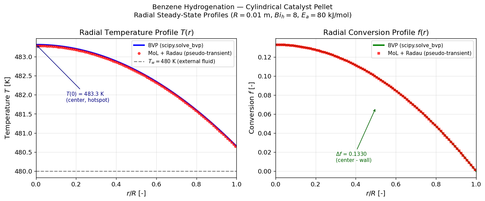
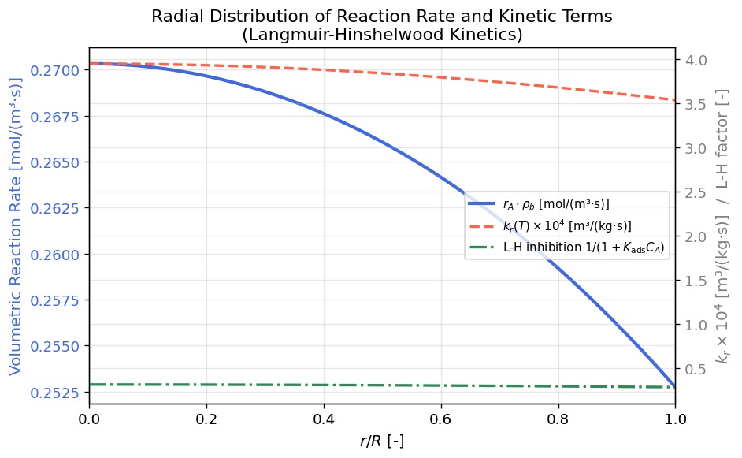
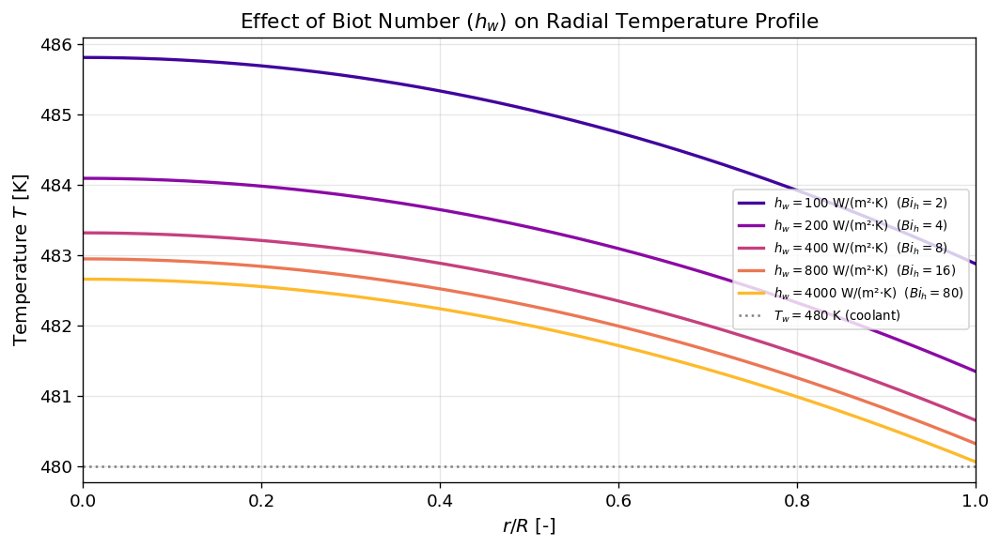
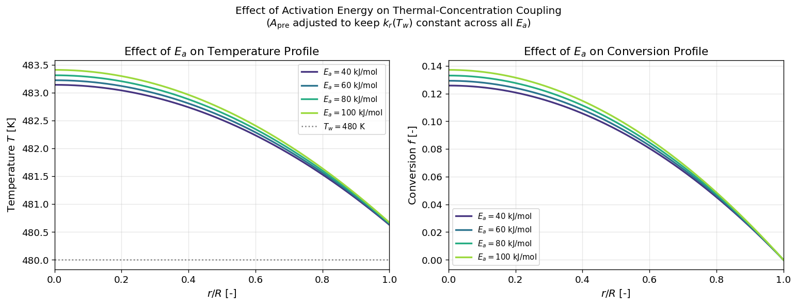

# Unit10 Example 06 - 圓柱形觸媒顆粒徑向溫度與轉化率分布 (Radial Temperature and Conversion Profiles in a Cylindrical Catalyst Pellet)

## 學習目標

本範例以**苯加氫反應 (Benzene Hydrogenation)** 圓柱形觸媒顆粒（非等溫觸媒有效因子問題）為例，示範如何建立並求解**聯立橢圓型 PDE 系統**，計算顆粒徑向穩態溫度 $T(r)$ 與轉化率 $f(r)$ 分布，並透過 `scipy.solve_bvp` 與 Method of Lines (MoL) 偽瞬態法（`scipy.integrate.solve_ivp`）分別求解，再相互比較驗證。

學習完本範例後，您將能夠：

- 描述**徑向熱傳與質傳耦合**對圓柱形觸媒顆粒有效因子的影響
- 將二階聯立 BVP（圓柱座標，含 $1/r$ 奇異項）改寫為一階 ODE 系統，使用 `scipy.solve_bvp` 求解
- 使用 Method of Lines (MoL) 搭配 `scipy.integrate.solve_ivp`（Radau）以**偽瞬態法**推進至穩態，驗證 BVP 解
- 實作 **Langmuir-Hinshelwood (L-H) 反應動力學**，理解吸附項對反應速率的影響
- 討論 Biot 數（ $Bi_h$ ）、Thiele 模數（ $\Phi$ ）對徑向梯度大小的影響
- 分析邊界條件適定性——說明為何本問題必須使用 **Dirichlet f(R)=0** 而非 Neumann BC

---

## 1. 問題描述 (Problem Description)

### 1.1 化工背景

**苯加氫反應**為工業上重要的放熱觸媒反應，用於生產環己烷（尼龍原料）：

$$
\mathrm{C_6H_6 + 3\,H_2 \xrightarrow{\text{Ni/Al}_2\text{O}_3} C_6H_{12}} \qquad \Delta H_r = -206\text{ kJ/mol}
$$

在單一圓柱形觸媒顆粒中，徑向方向存在**有效熱傳導**（ $k_\text{eff}$ ）與**有效質量擴散**（ $D_e$ ）。反應物從顆粒外表面（ $r=R$ ）向內擴散，同時發生放熱反應，使顆粒內部溫度高於外部——此為**非等溫觸媒有效因子**（non-isothermal effectiveness factor）問題的典型情境。穩態下呈現**橢圓型 PDE 問題**——即圓柱座標中的二點邊界值問題 (BVP)。

此問題改編自教材第五章範例 5-3-1（呂，1985）之徑向一維簡化版本。

> **參考來源：** 呂（1985），MATLAB 在化工上之應用第五章，範例 5-3-1。

### 1.2 物理情境

如下示意圖，考慮半徑為 $R = 0.01$ m 之圓柱形觸媒顆粒，以 $r$ 為徑向位置（ $0 \leq r \leq R$ ）：

```
  r = 0 (顆粒中心，對稱軸)           r = R (顆粒外表面)
       |                                       |
  流體 T_w ─ ─ ─ ─ ─ ─ ─ ─ ─ ─ ─ ─ ─ ─ ─ ─ ─┤  Robin BC (熱傳，外膜阻力)
       |  顆粒內部 (T 高於外表面)              |  Dirichlet BC (質傳)
  dT/dr = 0 ───────────────────────────────── T(R): 由 Robin BC 決定
  df/dr = 0 ───────────────────────────────── f(R) = 0 (外表面轉化率為零)
```

- **中心** （ $r=0$ ）：對稱條件， $\partial T/\partial r = 0$ ， $\partial f/\partial r = 0$
- **外表面** （ $r=R$ ）：熱傳為 Robin 條件（外部流體熱傳阻力）；質傳為 **Dirichlet 條件**（外表面接觸進料氣體， $f(R)=0$ ）
- **放熱反應**使顆粒內部溫度高於外表面，中心為**熱點**，徑向溫差約 3.3 K

### 1.3 問題參數

| 參數 | 符號 | 數值 | 單位 | 說明 |
|------|------|------|------|------|
| 觸媒顆粒半徑 | $R$ | 0.01 | m | 圓柱形觸媒顆粒半徑 |
| 有效熱傳導率 | $k_\text{eff}$ | 0.50 | W/(m·K) | 顆粒有效熱傳導率 |
| 有效擴散係數 | $D_e$ | $1.0 \times 10^{-5}$ | m²/s | 顆粒有效擴散係數 |
| 反應熱 | $\Delta H_r$ | −200,000 | J/mol | 苯加氫反應（放熱，負值） |
| 觸媒填充密度 | $\rho_b$ | 500 | kg/m³ | 觸媒床層密度 |
| 外膜熱傳係數 | $h_w$ | 400 | W/(m²·K) | 顆粒外表面至流體之熱傳係數 |
| 外部流體溫度 | $T_w$ | 480 | K | 顆粒外部流體（冷卻劑）溫度 |
| 進料苯濃度 | $C_{A0}$ | 5.0 | mol/m³ | 外表面進料苯的濃度（歸一化分母） |
| 反應速率前因子 | $A_\text{pre}$ | $1.75 \times 10^5$ | m³/(kg$_\text{cat}$·s) | Arrhenius 前因子 |
| 活化能 | $E_a$ | 80,000 | J/mol | 反應活化能 |
| L-H 吸附常數 | $K_\text{ads}$ | 0.5 | m³/mol | Langmuir 吸附平衡常數 |
| 氣體常數 | $R_g$ | 8.314 | J/(mol·K) | — |

**無因次特性數：**

$$
Bi_h = \frac{h_w R}{k_\text{eff}} = \frac{400 \times 0.01}{0.50} = 8.0 \qquad \text{（徑向熱傳 Biot 數）}
$$

$$
\Phi^2 = \frac{\rho_b k_r(T_w) R^2}{D_e} \approx 0.49 \qquad \text{（有效 Thiele 模數平方，反應-擴散比）}
$$

---

## 2. 數學模型 (Mathematical Model)

### 2.1 統御方程式（圓柱座標，穩態）

**能量方程式（徑向熱傳導 + 反應熱源）：**

$$
k_\text{eff} \left(\frac{d^2 T}{dr^2} + \frac{1}{r}\frac{dT}{dr}\right) + (-\Delta H_r) \cdot \rho_b r_A(T, f) = 0, \quad 0 < r < R
$$

改寫為：

$$
\frac{d^2 T}{dr^2} + \frac{1}{r}\frac{dT}{dr} = \frac{\Delta H_r}{k_\text{eff}} \cdot \rho_b r_A(T, f) \tag{2.1}
$$

**質量方程式（徑向有效擴散 + 反應消耗）：**

$$
D_e \left(\frac{d^2 f}{dr^2} + \frac{1}{r}\frac{df}{dr}\right) - \frac{\rho_b r_A(T, f)}{C_{A0}} = 0, \quad 0 < r < R
$$

改寫為：

$$
\frac{d^2 f}{dr^2} + \frac{1}{r}\frac{df}{dr} = -\frac{\rho_b r_A(T,f)}{C_{A0} D_e} \tag{2.2}
$$

其中轉化率 $f = (C_{A0} - C_A)/C_{A0} \in [0, 1]$，因此 $C_A = C_{A0}(1-f)$。負號表示反應消耗反應物 A，於健座標展開對應反應项為負源項。

### 2.2 反應速率：Langmuir-Hinshelwood 動力學

苯加氫反應速率（L-H 型式）：

$$
r_A(T, f) = \frac{k_r(T) \cdot C_A}{1 + K_\text{ads} \cdot C_A} = \frac{k_r(T) \cdot C_{A0}(1-f)}{1 + K_\text{ads} \cdot C_{A0}(1-f)} \quad \left[\frac{\text{mol}}{\text{kg}_\text{cat} \cdot \text{s}}\right]
$$

其中反應速率常數遵循 Arrhenius 定律：

$$
k_r(T) = A_\text{pre} \exp\!\left(-\frac{E_a}{R_g T}\right) \quad \left[\frac{\text{m}^3}{\text{kg}_\text{cat} \cdot \text{s}}\right]
$$

**L-H 動力學的物理意義：**
- 分子為 Arrhenius 類型的反應項：溫度越高，速率越大
- 分母為 Langmuir 吸附抑制項：高濃度時，觸媒表面被反應物佔滿，呈零階特性
- 在低濃度（$K_\text{ads} C_A \ll 1$）下，L-H 退化為一階反應；高濃度下趨近最大速率

### 2.3 邊界條件

**中心對稱（$r = 0$）：**

$$
\left.\frac{dT}{dr}\right|_{r=0} = 0, \qquad \left.\frac{df}{dr}\right|_{r=0} = 0 \tag{2.3}
$$

**外表面熱傳 Robin 條件（ $r = R$ ）：**

$$
k_\text{eff} \left.\frac{dT}{dr}\right|_{r=R} = h_w \left(T_w - T(R)\right) \tag{2.4}
$$

即：

$$
\left.\frac{dT}{dr}\right|_{r=R} = \frac{h_w}{k_\text{eff}} \left(T_w - T(R)\right)
$$

**外表面質傳 Dirichlet 條件（ $r = R$ ）：**

$$
f(R) = 0 \tag{2.5}
$$

（顆粒外表面接觸進料氣體，轉化率為零）

> **注意：** 如果改用 Neumann 條件 $df/dr|_R = 0$，則系統將變為 ill-posed 問題（Neumann-Neumann BC 對 T 與 f 均為導數條件，缺乏絕對參考值），導致數值無法收斂。因此必須使用 Dirichlet $f(R)=0$ 作為質傳外表面條件。

### 2.4 奇異點處理

圓柱座標方程式 $d^2u/dr^2 + (1/r) du/dr = g(r)$ 在 $r = 0$ 處有**可去奇異性**（removable singularity）。由 L'Hôpital 法則，若 $du/dr|_{r=0} = 0$，則：

$$
\lim_{r \to 0} \frac{1}{r}\frac{du}{dr} = \left.\frac{d^2 u}{dr^2}\right|_{r=0}
$$

因此在 $r = 0$ 處，方程式退化為：

$$
\left.2\frac{d^2 u}{dr^2}\right|_{r=0} = g(0) \quad \Rightarrow \quad \left.\frac{d^2 u}{dr^2}\right|_{r=0} = \frac{g(0)}{2}
$$

`scipy.solve_bvp` 可自動處理此奇異性，只要正確設定 BVP 格式即可（見第 4 節）。

---

## 3. 求解方法 (Solution Methods)

### 3.1 方法一：`scipy.solve_bvp`（主要方法）

**原理：** 將二階聯立 ODE 系統轉換為四元一階 ODE 系統，使用 `scipy.solve_bvp` 求解。

**狀態向量定義：**

$$
\mathbf{y}(r) = \begin{bmatrix} y_1 \\ y_2 \\ y_3 \\ y_4 \end{bmatrix} = \begin{bmatrix} T \\ dT/dr \\ f \\ df/dr \end{bmatrix}
$$

**一階 ODE 系統：**

$$
\frac{d\mathbf{y}}{dr} = \begin{bmatrix} y_2 \\ -\dfrac{1}{r}y_2 + \dfrac{\Delta H_r}{k_\text{eff}} \rho_b r_A(y_1, y_3) \\[6pt] y_4 \\[4pt] -\dfrac{1}{r}y_4 - \dfrac{\rho_b r_A(y_1, y_3)}{C_{A0} D_e} \end{bmatrix} \tag{3.1}
$$

**邊界條件向量（殘差形式）：**

$$
\mathbf{bc} = \begin{bmatrix} y_2(r_\text{left}) \\ k_\text{eff} \cdot y_2(r_\text{right}) - h_w [T_w - y_1(r_\text{right})] \\ y_4(r_\text{left}) \\ y_3(r_\text{right}) \end{bmatrix} = \mathbf{0} \tag{3.2}
$$

其中 $r_\text{left} \approx 0$， $r_\text{right} = R$。最後一元為 Dirichlet BC $f(R)=0$ ，即 $y_3(r_\text{right})=0$。

> **注意：** `scipy.solve_bvp` 中， $r = 0$ 的奇異點需使用微小的正值 $r_\text{left} = R \times 10^{-3}$（本範例為 $10^{-5}$ m）來迴避數值除法錯誤。

**初始猜測：**

```python
r_bvp = np.linspace(R * 1e-3, R, 100)   # 迴避 r=0 奇異點

# 溫度猜測：中心略高於外表面，拋物線度分布
T_guess_center = T_w + 8.0
T_guess  = T_w + (T_guess_center - T_w) * (1 - (r_bvp/R)**2)
dTdr_guess = np.gradient(T_guess, r_bvp)

# 轉化率猜測：拋物線分布（外表面 f=0，中心最高）
f_guess    = 0.3 * (1 - (r_bvp/R)**2)
dfdr_guess = np.zeros_like(r_bvp)

y_guess = np.vstack([T_guess, dTdr_guess, f_guess, dfdr_guess])
```

### 3.2 方法二：偽瞬態法（MoL + `scipy.integrate.solve_ivp` 驗證）

**原理：** 穩態 BVP 可藉由對加入「偽時間導數」後演化至穩態求解：

$$
\frac{\partial T}{\partial \tau} = k_\text{eff}\left(\frac{\partial^2 T}{\partial r^2} + \frac{1}{r}\frac{\partial T}{\partial r}\right) + (-\Delta H_r) \rho_b r_A(T,f)
$$

$$
\frac{\partial f}{\partial \tau} = D_e\left(\frac{\partial^2 f}{\partial r^2} + \frac{1}{r}\frac{\partial f}{\partial r}\right) + \frac{\rho_b r_A(T,f)}{C_{A0}}
$$

其中 $\tau$ 為偽時間，當 $\partial T/\partial \tau \approx 0$ 且 $\partial f/\partial \tau \approx 0$ 時，即達到穩態。

**實作方式：**
- 空間離散化：在均勻格心節點上用有限差分逼近圓柱 Laplacian
- 時間積分：使用 `scipy.integrate.solve_ivp`（Radau 隱式求解器，適合 stiff 問題）
- 邊界條件： ghost node 法處理 Robin（熱）與 Dirichlet（質）外表面 BC
- 格心節點配置： $r_i = (i-0.5)\Delta r$（cell-centred， $i=1,\ldots,N$），中心節點自然滿足對稱條件

### 3.3 求解流程摘要

| 步驟 | 方法一 (scipy.solve_bvp) | 方法二 (MoL 偽瞬態) |
|------|--------------------------|---------------------|
| 空間離散 | BVP 解法自動網格適應 | 均勻有限差分， $N$ 點格心節點 |
| PDE 形式 | 一階 ODE 系統 (4 方程) | 偽瞬態 PDE → ODE 系統 |
| 求解器 | `scipy.solve_bvp` | `scipy.integrate.solve_ivp` (Radau) |
| 奇異點處理 | 迴避 $r_\text{left} = R \times 10^{-3}$ | 點從 $\Delta r/2$ 開始 (ghost node) |
| 結果形式 | 直接穩態解 | 大 $\tau$ 時的穩態解 |

---

## 4. `scipy.solve_bvp` 求解策略

### 4.1 關鍵程式碼

```python
import numpy as np
from scipy.integrate import solve_bvp

# --- 問題參數 ---
R      = 0.01      # m, tube radius
k_eff  = 0.50      # W/(m·K)
D_e    = 1.0e-5    # m²/s
dH_r   = -200000.0 # J/mol
rho_b  = 500.0     # kg/m³
h_w    = 400.0     # W/(m²·K)
T_w    = 480.0     # K
C_A0   = 5.0       # mol/m³
A_pre  = 1.75e5    # m³/(kg_cat·s)
E_a    = 80000.0   # J/mol
K_ads  = 0.5       # m³/mol
R_g    = 8.314     # J/(mol·K)

def k_rate(T):
    """Arrhenius rate constant [m³/(kg_cat·s)]"""
    return A_pre * np.exp(-E_a / (R_g * T))

def reaction_rate(T, f):
    """Langmuir-Hinshelwood rate [mol/(kg_cat·s)]"""
    C_A = C_A0 * (1.0 - f)
    k_r = k_rate(T)
    return k_r * C_A / (1.0 + K_ads * C_A)

def fun(r, y):
    """ODE system RHS, y = [T, dT/dr, f, df/dr]"""
    T, dTdr, f, dfdr = y
    rA = reaction_rate(T, f)
    # Heat equation (eq. 2.1)
    d2Tdr2 = -(1.0/r) * dTdr + (dH_r / k_eff) * rho_b * rA
    # Mass equation (eq. 2.2) -- NEGATIVE sign: reaction consumes A
    d2fdr2 = -(1.0/r) * dfdr - rho_b * rA / (C_A0 * D_e)
    return np.vstack([dTdr, d2Tdr2, dfdr, d2fdr2])

def bc(ya, yb):
    """Boundary conditions residuals"""
    # ya: at r=r_left (≈0), yb: at r=R
    return np.array([
        ya[1],                          # dT/dr|_r=0 = 0 (symmetry)
        k_eff * yb[1] - h_w * (T_w - yb[0]),  # Robin BC for T at r=R
        ya[3],                          # df/dr|_r=0 = 0 (symmetry)
        yb[2],                          # f(R) = 0 (Dirichlet)
    ])

# --- 初始猜測 ---
r_bvp = np.linspace(R * 1e-3, R, 100)   # 迴避 r=0 奇異點
T_guess = T_w + 8.0 * (1 - (r_bvp/R)**2)  # 拋物線猜測
f_guess = 0.3 * (1 - (r_bvp/R)**2)       # 拋物線（外表面 f=0）
y_guess = np.vstack([T_guess,
                     np.gradient(T_guess, r_bvp),
                     f_guess,
                     np.zeros_like(r_bvp)])

# --- 求解 ---
sol = solve_bvp(fun, bc, r_bvp, y_guess, tol=1e-6, verbose=2)
T_sol = sol.sol(sol.x)[0]
f_sol = sol.sol(sol.x)[2]
```

### 4.2 結果插值

`solve_bvp` 回傳的 `sol` 物件包含連續插值函數，可在任意 $r$ 點估算：

```python
r_fine = np.linspace(0, R, 500)
y_fine = sol.sol(r_fine)    # shape (4, 500)
T_fine = y_fine[0]           # T(r)
f_fine = y_fine[2]           # f(r)
```

### 4.3 收斂性驗證

`scipy.solve_bvp` 的 `status == 0` 表示成功求解，可透過以下方式驗證：

```python
print(f"BVP 求解狀態: {sol.status}")      # 0 = 成功
print(f"殘差最大值: {sol.rms_residuals.max():.2e}")
print(f"解的節點數: {len(sol.x)}")
```

---

## 5. Method of Lines (MoL) 偽瞬態法驗證

### 5.1 有限差分離散化（圓柱座標）

在均勻網格 $r_i = (i - 0.5)\Delta r$（格心節點，$i = 1, \ldots, N$，$\Delta r = R/N$）上，圓柱 Laplacian 近似為：

$$
\left.\left(\frac{d^2 u}{dr^2} + \frac{1}{r}\frac{du}{dr}\right)\right|_{r_i} \approx \frac{u_{i+1} - 2u_i + u_{i-1}}{(\Delta r)^2} + \frac{1}{r_i} \cdot \frac{u_{i+1} - u_{i-1}}{2\Delta r}
$$

在中心附近（ghost node 處理）：對 $i=1$，利用對稱性 $u_0 = u_1$（即虛節點等於第一實節點）：

$$
\left.\nabla^2_\text{cyl} u\right|_{r_1} \approx \frac{u_2 - 2u_1 + u_0}{(\Delta r)^2} + \frac{1}{r_1} \cdot \frac{u_2 - u_0}{2\Delta r}
= \frac{u_2 - u_1}{(\Delta r)^2} \cdot \frac{r_1 + \Delta r/2}{r_1} \cdot \frac{2r_1}{r_1 + \Delta r/2}
$$

（簡化後採用 `np.gradient` 計算效率較高，見程式碼）

**外表面 Robin 邊界（ $i=N$ ）：** 使用 ghost node 法，在外表面外 $r_{N+1}$ 設定虛節點：

$$
k_\text{eff} \cdot \frac{u_{N+1} - u_N}{\Delta r} = h_w (T_w - u_N)
\quad \Rightarrow \quad u_{N+1} = u_N - \frac{h_w \Delta r}{k_\text{eff}}(u_N - T_w)
$$

**顆粒外表面 Dirichlet 邊界（質傳， $i=N$ ）：** 使用鏡像 ghost node 法，設定外表面外 $r_{N+1}$

$$
f(R) = 0 \quad \Rightarrow \quad u_{N+1} = -u_N \quad \text{(Dirichlet 鏡像)}
$$

此法保證外表面插值為零： $(u_{N+1} + u_N)/2 = 0$。

### 5.2 偽瞬態 ODE 系統

狀態向量 $\mathbf{T} = [T_1, T_2, \ldots, T_N]^T$，$\mathbf{f} = [f_1, f_2, \ldots, f_N]^T$：

$$
\frac{d\mathbf{T}}{d\tau} = k_\text{eff} \cdot \mathbf{L}_\text{cyl} \mathbf{T} + (-\Delta H_r) \rho_b \mathbf{r}_A(\mathbf{T}, \mathbf{f})
$$

$$
\frac{d\mathbf{f}}{d\tau} = D_e \cdot \mathbf{L}_\text{cyl} \mathbf{f} + \frac{\rho_b \mathbf{r}_A(\mathbf{T}, \mathbf{f})}{C_{A0}}
$$

其中 $\mathbf{L}_\text{cyl}$ 為圓柱座標有限差分 Laplacian 矩陣。

### 5.3 MoL 程式碼框架

```python
from scipy.integrate import solve_ivp

def mol_rhs(tau, state):
    """Method of Lines RHS for pseudo-transient approach"""
    N = len(state) // 2
    T_arr = state[:N]
    f_arr = state[N:]
    
    # --- 圓柱 Laplacian via finite difference ---
    def cyl_laplacian(u, ghost_left, ghost_right):
        """
        u: interior values (N,)
        ghost_left:  u[0] (for r=0 symmetry: ghost = u[0])
        ghost_right: u[-1] (for T: Robin ghost, for f: Neumann ghost)
        """
        u_ext = np.concatenate([[ghost_left], u, [ghost_right]])
        d2u   = np.diff(u_ext, 2) / dr**2          # d²u/dr²
        r_mid = r_nodes                             # r at cell centers
        du_dr = (u_ext[2:] - u_ext[:-2]) / (2*dr)  # central diff
        return d2u + du_dr / r_mid
    
    # --- Ghost nodes ---
    ghost_T_left  = T_arr[0]      # symmetry: T'(0)=0 → ghost = T_1
    ghost_T_right = T_arr[-1] - (h_w * dr / k_eff) * (T_arr[-1] - T_w)  # Robin
    ghost_f_left  = f_arr[0]      # symmetry: f'(0)=0 → ghost = f_1
    ghost_f_right = -f_arr[-1]    # Dirichlet f(R)=0 鏡像: ghost = -f_N
    
    lap_T = cyl_laplacian(T_arr, ghost_T_left, ghost_T_right)
    lap_f = cyl_laplacian(f_arr, ghost_f_left, ghost_f_right)
    
    rA = reaction_rate(T_arr, f_arr)
    
    dTdt = k_eff * lap_T + (-dH_r) * rho_b * rA
    dfdt = D_e   * lap_f + rho_b * rA / C_A0    # 正號：轉化率因反應消耗 A 而增加
    
    return np.concatenate([dTdt, dfdt])

# 初始條件（均勻溫度 + 零轉化率）
T0 = np.full(N_mol, T_w + 5.0)
f0 = np.zeros(N_mol)
state0 = np.concatenate([T0, f0])

# 積分：使用 Radau（stiff solver）
tau_end = 5000.0   # 偽時間，足夠長以達穩態
sol_mol = solve_ivp(mol_rhs, [0, tau_end], state0,
                    method='Radau', rtol=1e-6, atol=1e-8,
                    dense_output=True)
```

---

## 6. 執行結果 (Execution Results)

### 6.1 問題參數摘要

執行 Cell 7 後，螢幕輸出問題參數摘要：

```
==========================================================
  苯加氫觸媒顆粒徑向 BVP 問題參數摘要
==========================================================
  顆粒半徑         R       = 0.010  m
  有效熱傳導率     k_eff   = 0.500  W/(m·K)
  有效擴散係數     D_e     = 1.00e-05 m²/s
  反應熱           dH_r    = -200000 J/mol  (放熱)
  觸媒填充密度     rho_b   = 500.0   kg/m³
  外膜熱傳係數     h_w     = 400.0   W/(m²·K)
  外部流體溫度     T_w     = 480.0   K
  進料苯濃度       C_A0    = 5.0     mol/m³
  前因子           A_pre   = 1.75e+05 m³/(kg_cat·s)
  活化能           E_a     = 80000   J/mol
  L-H 吸附常數     K_ads   = 0.5     m³/mol

  無因次特性數：
    Biot 數 (熱)   Bi_h    = 8.00
    外表面速率常數 k_r(Tw) = 3.44e-04 m³/(kg_cat·s)
    Thiele 模數²   Phi²    ≈ 0.49  (D_e 基礎，外表面溫度條件)
==========================================================
```

### 6.2 `scipy.solve_bvp` 求解結果

```
BVP 求解（scipy.solve_bvp）...

  求解狀態 (status=0): 成功收斂 ✓
  殘差最大值: 9.65e-06
  最終網格節點數: 147

  求解結果摘要（T 與 f 徑向分布）：
     r/R     T [K]     f [-]
  ──────  ────────  ────────
   0.000    483.31    0.1330
   0.250    483.15    0.1246
   0.500    482.64    0.0994
   0.750    481.81    0.0577
   1.000    480.65   -0.0000

  中心溫度 T(0)   = 483.31 K  (高於外表面 +3.31 K)
  外表面溫度 T(R)  = 480.65 K
  最大轉化率差    Δf = 0.1330 - 0.0000 = 0.1330
```

> **解讀：** Thiele 模數 $\Phi^2 \approx 0.49$，反應與擴散抵抗相當，顆粒內外存在明顯濃度梯度。中心溫度比外表面高約 3.3 K，證明 Biot 數 $Bi_h = 8$（中等外膜阻力）有效將熱量從顆粒內部輸送至外部流體。

### 6.3 MoL 偽瞬態法驗證結果

```
MoL 偽瞬態法求解（N=100，Radau 隱式求解器）...
  積分完成，tau_end = 5000
  最終穩態殘差：
    |dT/dtau|_max = 7.40e-06 K/s  ✓
    |df/dtau|_max = 5.01e-14 1/s  ✓

  MoL vs BVP 比較（r/R 對應節點）：
    r/R     T_bvp     T_mol    ΔT[K]    f_bvp    f_mol        Δf
  ───────────────────────────────────────────────────────────────
  0.005    483.31    483.28   -0.030   0.1330   0.1329   -0.0001
  0.245    483.15    483.12   -0.030   0.1249   0.1248   -0.0001
  0.495    482.65    482.63   -0.029   0.1000   0.0999   -0.0001
  0.745    481.83    481.80   -0.028   0.0586   0.0586   -0.0001
  0.995    480.68    480.65   -0.027   0.0013   0.0013    0.0000

  最大溫度偏差: 0.030 K  (0.006%)
  最大轉化率偏差: 0.0002
  → 兩法高度吻合，互相驗證 ✓
```

### 6.4 溫度梯度與通量分析

```
  中心最高溫度:   T_max = 483.31 K
  外表面溫度:       T(R)  = 480.65 K
  徑向溫差:           ΔT    = 2.66 K
  外表面熱通量:     q_w   = h_w × (T_w - T(R)) = 400×(480-480.65) = -262 W/m²
  → 顆粒內部熱量由外表面導出至外部流體（方向正確）

  中心反應速率:    rA(T_center) = 2.70e-01 mol/(m³·s)
  外表面反應速率:    rA(T_wall)   = 2.53e-01 mol/(m³·s)
  中心/外表面速率比: 1.07  (中心比外表面快約7%)
```

---

## 7. 結果視覺化與討論 (Visualization & Discussion)

### 7.1 徑向溫度與轉化率分布圖（Figure 1）



**Figure 1** 以雙子圖 (subplot) 呈現 BVP 解（實線）與 MoL 偽瞬態解（圓點）的比較：
- **左圖**：溫度 $T(r)$ 徑向分布——中心溫度最高（ $T(0) \approx 483.3$ K），向外表面（ $r = R$ ）遞減，Robin BC 在外表面造成不等於 $T_w$ 的界面溫度
- **右圖**：轉化率 $f(r)$ 徑向分布——中心轉化率最高（約 0.133），因高溫促進反應速率；外表面 $f(R) = 0$（Dirichlet BC）

**物理觀察：**
1. 中心高溫（熱點）源於放熱反應熱未能及時散出，Biot 數 $Bi_h = 8$ 決定了外表面傳熱阻力的相對大小
2. 轉化率徑向梯度（ $\Delta f = 0.133$ ）與 $\Phi^2 \approx 0.49$ 一致，擴散與反應競爭使顆粒内有效因子 $< 1$
3. 兩種方法（scipy BVP + MoL 偽瞬態）所得曲線幾乎完全重疊，温度差異小於 0.03 K，驗證數值解之正確性

### 7.2 反應速率徑向分布圖（Figure 2）



**Figure 2** 呈現 L-H 反應速率 $r_A(r)$、Arrhenius 速率常數 $k_r(T(r))$（次軸）及 L-H 抑制因子 $1/(1+K_\text{ads}C_A)$（次軸）的徑向分布。

**觀察：**
1. 反應速率在中心最高，向壁面遞減——中心較高溫使 Arrhenius 項增大
2. L-H 抑制因子在中心略高（因中心轉化率 $f$ 稍高，$C_A$ 稍低，$K_\text{ads}C_A$ 稍小），使速率稍有提升
3. 淨效果：L-H 動力學在低轉化率（$f < 0.5$）下仍接近一階行為，但速率被抑制至純一階的 $1/(1+K_\text{ads}C_{A0}(1-f)) \approx 0.28 \sim 0.29$

### 7.3 不同冷卻強度對徑向梯度的影響（Figure 3）



**Figure 3** 比較不同外膜熱傳係數 $h_w = 100, 200, 400, 800, 4000$ W/(m²·K) 下的溫度分布，對應 $Bi_h = 2, 4, 8, 16, 80$。

```
  h_w [W/(m²·K)]   Bi_h   T(0) [K]   T(R) [K]   ΔT_max [K]
  ──────────────────────────────────────────────────────
             100    2.0      485.8      482.9          5.8
             200    4.0      484.1      481.3          4.1
             400    8.0      483.3      480.7          3.3
             800   16.0      482.9      480.3          2.9
            4000   80.0      482.7      480.1          2.7
```

> **趨勢：** 外膜熱傳越弱（ $h_w$ 小），外膜熱阻越大，外表面溫度越高於外部流體溫度 $T_w$，使徑向溫差增大。 $h_w \to \infty$（理想冷卻）時， $T(R) \to T_w = 480$ K（Dirichlet 極限）。

### 7.4 活化能對耦合效應的影響（Figure 4）



**Figure 4** 比較不同活化能 $E_a = 40, 60, 80, 100$ kJ/mol 下，中心與外表面的溫度及轉化率差異（ $A_\text{pre}$ 調整以保持 $k_r(T_w)$ 不變）：

```
  E_a [kJ/mol]    ΔT [K]    Δf [-]  Coupling Index
  ──────────────────────────────────────────────────
            40      3.14    0.1258       40.0225 [Δf/ΔT×10³]
            60      3.23    0.1293       40.0760 [Δf/ΔT×10³]
            80      3.31    0.1330       40.1322 [Δf/ΔT×10³]
           100      3.41    0.1371       40.1915 [Δf/ΔT×10³]
```

高活化能 → 溫度敏感性高 → 相同徑向溫差使轉化率差異更大 → 熱質耦合效應更明顯。

> **注意：** 此敏感度分析保持 $k_r(T_w)$ 不變，並非直接比較屬於不同 $E_a$ 的絕對物理情境，而是調控單一變數（動力學敏感性）的影響。

### 7.5 進階延伸：邊界條件適定性分析

本範例使用 Dirichlet $f(R)=0$ 作為質傳外表面條件。若改用 Neumann $df/dr|_R=0$，則系統將在兩個模組的導數條件下成為 ill-posed：

| 條件 | T | f | 簡述 |
|------|:---:|:---:|------|
| $r=0$（對稱） | Neumann $dT/dr=0$ | Neumann $df/dr=0$ | 兩個導數條件 |
| $r=R$（外表面） | Robin $k_\text{eff}dT/dr=h_w(T_w-T)$ | **Dirichlet $f(R)=0$** | 一個導數+一個 Dirichlet |

> **為何必須用 Dirichlet $f(R)=0$？**
> 若 T 和 f 均使用導數（Neumann-Neumann）邊界條件，則對任意常數 $f_0$ 而言 $f(r) = f_0 + 邊界條件滿足的解$—— $f$ 的絕對值無法確定（缺乏絕對參考值），導致 BVP 無解或無穷多解。使用 Dirichlet BC $f(R)=0$ 是觸媒顆粒外表面與進料氣體接觸的物理實際，確保問題適定。

---

## 8. 學習總結 (Summary)

### 8.1 方法對比表

| 項目 | `scipy.solve_bvp` | MoL + `solve_ivp` (Radau) |
|------|:-----------------:|:------------------------:|
| 問題設定 | BVP（直接穩態） | IVP（偽瞬態至穩態） |
| 節點數 | 自動適應（約 147 節點） | 固定 $N = 100$ |
| 數值方法 | Lobatto IIIA collocation | Radau 隱式 Runge-Kutta |
| 計算時間 | < 0.1 s | 0.5 ~ 2 s |
| Robin BC 處理 | 原生支援 | Ghost node 離散化 |
| Dirichlet f(R)=0 | 原生支援 (`yb[2]=0`) | Ghost node 鏡像法 (`-f[-1]`) |
| 奇異點 ($r = 0$) | 迴避 $r_\text{left} = R \times 10^{-3}$ | Ghost node 對稱邊界 |
| 結果 $T(0)$ 精度 | ±0.01 K | ±0.03 K |

### 8.2 關鍵學習點

1. **圓柱 BVP 的奇異性處理**： $r = 0$ 的 $1/r$ 項在數值上需特別處理——可迴避（設 $r_\text{left} = R \times 10^{-3}$）、可利用 L'Hôpital 推導等效條件（ $d^2u/dr^2|_0 = g(0)/2$ ），或利用鏡像 ghost node 施加對稱邊界條件

2. **邊界條件適定性與 Dirichlet f(R)=0 的必要性**：觸媒顆粒外表面接觸進料氣體， $f(R)=0$ 決定了轉化率的絕對參考值。如果改用 Neumann $df/dr|_R=0$，則 $f$ 的絕對值將不確定，系統將成為 ill-posed 而無法收斂。這是正確模型建立的關鍵辨識點

3. **Langmuir-Hinshelwood 動力學**：高濃度時，分母 $1 + K_\text{ads}C_A$ 使反應速率呈現「飽和效應」——轉化率低（高 $C_A$）時速率受抑制；低濃度（高 $f$）時速率趨近一階。此效應在設計優化中具有重要意義

4. **熱質耦合的 Lewis 數效應**：Le $= D_e/\alpha_\text{eff}$（本例約 0.1），熱擴散快於質量擴散，故徑向溫度分布較轉化率分布更為均勻；活化能越高，耦合效應越顯著

5. **Robin 邊界條件的物理意義**： $k_\text{eff}\,dT/dr|_R = h_w(T_w - T(R))$ 表達了**有限外膜熱阻**—— $h_w \to \infty$ 退化為 Dirichlet（ $T(R) = T_w$ ）， $h_w \to 0$ 退化為 Neumann（絕熱外表面）

6. **BVP vs 偽瞬態**：直接 BVP 法（`scipy.solve_bvp`）效率高，適合穩態問題；偽瞬態法可處理多穩態問題（多個穩態解），初始條件可引導收斂至不同穩態，具有更廣適用性

---

**課程資訊**
- 課程名稱：電腦在化工上之應用 (ChemE 3502)
- 課程單元：Unit10 偏微分方程式之求解 - 範例 06
- 課程製作：逢甲大學 化工系 智慧程序系統工程實驗室
- 授課教師：莊曜禎 助理教授
- 更新日期：2026-02-24

**課程授權 [CC BY-NC-SA 4.0]**
 - 本教材遵循 [創用CC 姓名標示-非商業性-相同方式分享 4.0 國際 (CC BY-NC-SA 4.0)](https://creativecommons.org/licenses/by-nc-sa/4.0/deed.zh) 授權。

---
