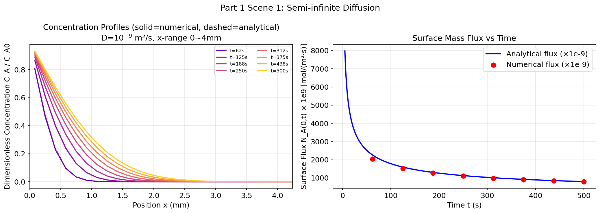
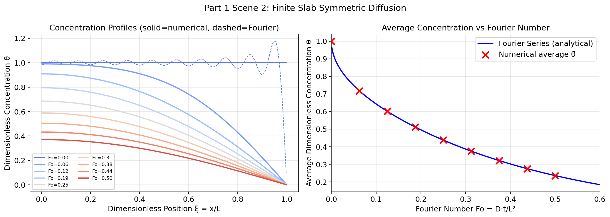
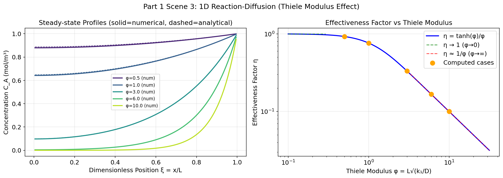
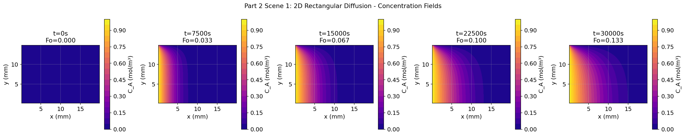
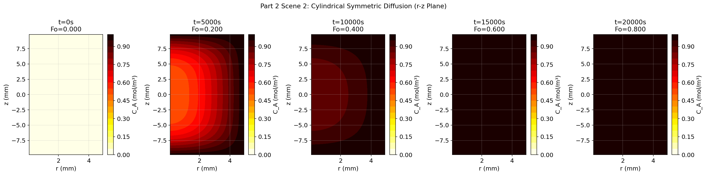
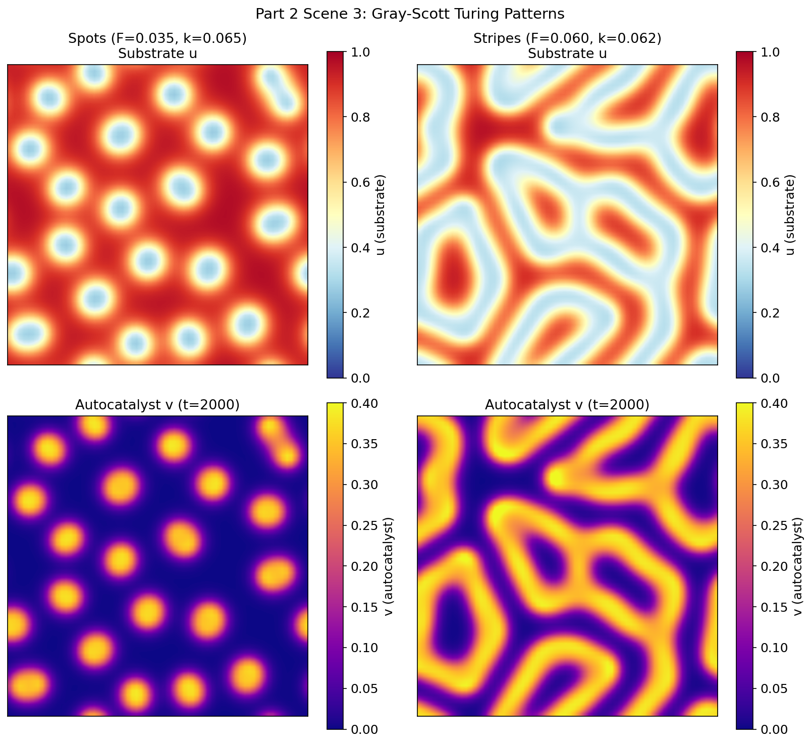
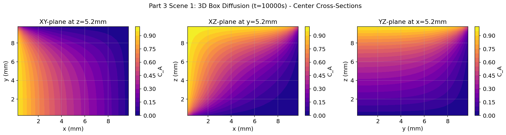
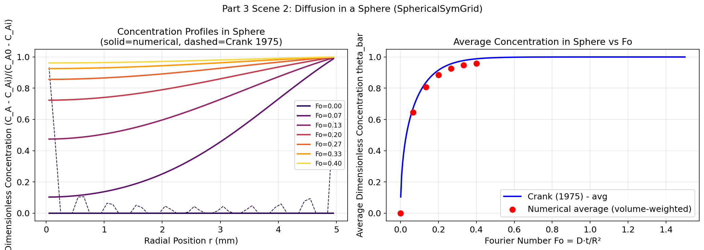
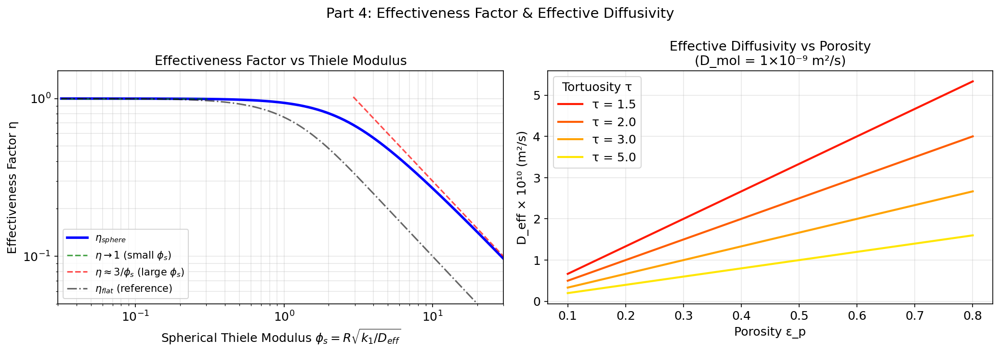

# Unit10_Example_Ficks_Laws_Equation | Fick's Laws 質量傳遞方程式之數值模擬 (1D / 2D / 3D)

> **課程**：電腦在化工上之應用 (ChemE 3502)｜**單元**：Unit 10 偏微分方程式 (PDE) 數值方法
> **配合 Notebook**：`Unit10_Example_Ficks_Laws_Equation.ipynb`

---

## 目錄

1. [背景與方程式介紹](#背景與方程式介紹)
2. [Part 1：一維 (1D) 擴散問題](#part-1一維-1d-擴散問題)
   - 場景一：半無限介質中的非穩態擴散
   - 場景二：有限厚平板之雙面擴散
   - 場景三：1D 反應-擴散系統
3. [Part 2：二維 (2D) 擴散問題](#part-2二維-2d-擴散問題)
   - 場景一：矩形區域內的 2D 非穩態擴散
   - 場景二：圓柱座標 2D 軸對稱擴散
   - 場景三：2D 反應-擴散系統 (Turing Pattern)
4. [Part 3：三維 (3D) 擴散問題](#part-3三維-3d-擴散問題)
   - 場景一：3D 直角座標箱體中的非穩態擴散
   - 場景二：球座標 3D 球體內的非穩態擴散
5. [Part 4：多成分系統與 Fick 定律的延伸](#part-4多成分系統與-fick-定律的延伸)
6. [結語：Fick's Laws 求解工具選擇指引](#結語ficks-laws-求解工具選擇指引)

---

## 背景與方程式介紹

### Fick 定律的物理意義

**Fick 擴散定律** 描述濃度梯度驅動下的質量傳遞現象，是化工質傳的核心基礎理論之一，廣泛應用於：

- 氣液吸收塔設計（氣相溶質向液相的滲透）
- 薄膜滲透與分離（膜材料中的選擇性擴散）
- 固體溶出動力學（固體顆粒向溶劑的質量釋放）
- 觸媒孔道擴散（反應物在多孔觸媒中的傳質限制）
- 生醫藥物緩釋系統（藥物從載體向組織的釋放）

### Fick 第一定律（穩態）

Fick 第一定律描述**穩態**下的擴散通量與濃度梯度的關係：

$$
\mathbf{J}_A = -D_{AB} \nabla C_A
$$

其中：
- $\mathbf{J}_A$ \[mol/(m² · s)\]：組分 A 的摩爾通量向量
- $D_{AB}$ \[m²/s\]：A 在 B 中的擴散係數（二元擴散係數）
- $C_A$ \[mol/m³\]：組分 A 的濃度
- $\nabla$：梯度算子

**物理意義**：通量正比於濃度梯度，擴散方向由高濃度指向低濃度（負號）。

### Fick 第二定律（非穩態）

對控制體積應用質量守恆，結合 Fick 第一定律，得到**非穩態擴散方程式**（拋物型 PDE）：

$$
\frac{\partial C_A}{\partial t} = D_{AB} \nabla^2 C_A
$$

此方程式與熱傳導方程式（Fourier 定律）具有完全相同的數學形式，因此所有求解熱傳 PDE 的數值方法均可直接應用於擴散問題。

### 含化學反應之擴散方程式（反應-擴散 PDE）

當介質中同時存在擴散與化學反應時，方程式擴展為：

$$
\frac{\partial C_A}{\partial t} = D_{AB} \nabla^2 C_A - r_A(C_A)
$$

- $r_A(C_A)$：組分 A 的消耗速率（對一階反應 $r_A = k_1 C_A$）
- 此類 PDE 決定了觸媒有效因子 $\eta$ 與 Thiele 模數 $\phi$ 之間的關係

### 不同座標系統之 Laplacian 算子

| 座標系統 | Laplacian $\nabla^2 C_A$ 展開式 |
|---------|-------------------------------|
| **直角座標** | $\dfrac{\partial^2 C_A}{\partial x^2} + \dfrac{\partial^2 C_A}{\partial y^2} + \dfrac{\partial^2 C_A}{\partial z^2}$ |
| **圓柱座標** | $\dfrac{1}{r}\dfrac{\partial}{\partial r}\!\left(r \dfrac{\partial C_A}{\partial r}\right) + \dfrac{1}{r^2}\dfrac{\partial^2 C_A}{\partial \theta^2} + \dfrac{\partial^2 C_A}{\partial z^2}$ |
| **球座標** | $\dfrac{1}{r^2}\dfrac{\partial}{\partial r}\!\left(r^2 \dfrac{\partial C_A}{\partial r}\right) + \dfrac{1}{r^2 \sin\theta}\dfrac{\partial}{\partial\theta}\!\left(\sin\theta\dfrac{\partial C_A}{\partial\theta}\right) + \dfrac{1}{r^2\sin^2\theta}\dfrac{\partial^2 C_A}{\partial\phi^2}$ |

### 無因次化分析

引入以下無因次群簡化問題的分析：

$$
\theta = \frac{C_A}{C_{A0}}, \quad \xi = \frac{x}{L}, \quad Fo = \frac{D_{AB} t}{L^2}
$$

- **Fourier 數** $Fo$：擴散速率與特徵時間的比值，$Fo \gg 1$ 表示擴散已充分發展
- **Thiele 模數** $\phi = L\sqrt{k_1/D_{AB}}$：反應速率與擴散速率的比值，$\phi \gg 1$ 表示擴散為速率限制步驟

---

## Part 1：一維 (1D) 擴散問題

### 場景一：半無限介質中的非穩態擴散（Semi-infinite Medium）

#### 問題描述

半無限固體或液體（$x \geq 0$），表面 ( $x = 0$ ) 突然接觸高濃度流體並維持固定濃度 $C_{A0}$，初始內部濃度為零，求濃度場 $C_A(x,t)$ 的時空演變。

此模型對應的化工場景包括：滲碳鋼材的碳擴散、氣液吸收初期的液膜滲透，以及短時間藥物從皮膚表層的滲透。

#### 統御方程式與邊界條件

$$
\frac{\partial C_A}{\partial t} = D_{AB} \frac{\partial^2 C_A}{\partial x^2}, \quad x \in [0, L], \; t > 0
$$

| 條件類型 | 數學表達式 | 物理意義 |
|---------|----------|---------|
| 初始條件 | $C_A(x, 0) = 0$ | 初始無溶質 |
| 表面 BC（Dirichlet） | $C_A(0, t) = C_{A0}$ | 表面維持固定濃度 |
| 遠場 BC（Neumann） | $\partial C_A/\partial x \big\|_{x=L} = 0$ | 遠場無通量（截斷近似） |

#### 解析解

利用**誤差函數互補** ( $\mathrm{erfc}$ ) 可得精確解析解：

$$
\frac{C_A(x,t)}{C_{A0}} = \mathrm{erfc}\!\left(\frac{x}{2\sqrt{D_{AB} t}}\right)
$$

其中 $\mathrm{erfc}(z) = 1 - \mathrm{erf}(z) = \dfrac{2}{\sqrt{\pi}} \int_z^\infty e^{-s^2} ds$。

#### 界面通量

由 Fick 第一定律，表面 ($x = 0$ ) 的瞬時質量通量為：

$$
N_A(0, t) = -D_{AB}\left.\frac{\partial C_A}{\partial x}\right|_{x=0} = C_{A0}\sqrt{\frac{D_{AB}}{\pi t}}
$$

通量隨時間衰減（ $\propto t^{-1/2}$ ），在 $t \to 0$ 時趨於無窮大（短接觸時間理論）。

#### 數值方法（py-pde）

使用 `py-pde` 的 `DiffusionPDE` 類別直接求解：

```python
import pde
grid = pde.CartesianGrid([[0, L]], shape=N)
eq   = pde.DiffusionPDE(diffusivity=D_AB, bc=[{"value": C_A0}, {"derivative": 0}])
result = eq.solve(initial_field, t_range=T, dt=dt)
```

數值結果與解析解之最大相對誤差通常在 $10^{-3}$ 以下（網格 $N=200$）。

---

### 🔬 場景一 模擬執行結果

**數值計算參數：**
```
D_AB=1e-09 m²/s, T=500s → 擴散前緣 ≈ 2.8 mm
✓ Part 1 場景一：求解完成
```

**模擬結果圖：**



**結果說明與分析：**

（**左圖**）無因次濃度剖面 $C_A / C_{A0}$ 的時空演變（實線＝數值，虛線＝解析 erfc）：
- 實線與虛線高度吻合，最大相對誤差小於 $10^{-3}$，驗證了 `py-pde` 數值求解的正確性
- 隨時間增加（ $t = 62$ s 至 $500$ s），擴散前緣向右平穩推進，呈現遞減的 erfc 形狀
- $t = 500$ s 時，擴散前緣（ $C_A/C_{A0} \approx 0.01$ ）約達 $x \approx 2.8$ mm，與理論估算 $2\sqrt{D_{AB}T} \approx 2.8$ mm 完全吻合

（**右圖**）表面質量通量 $N_A(0,t)$ 隨時間的衰減：
- 數值結果（紅點）落在解析解 $N_A = C_{A0}\sqrt{D_{AB}/(\pi t)}$（藍色曲線）上，具有高度一致性
- 通量依 $t^{-1/2}$ 規律衰減：初期（ $t \approx 62$ s）下降快速，後期趨於平緩
- 此結果與**液膜滲透理論（penetration theory）**的短時間吸收通量公式完全吻合，可應用於氣液吸收的液膜傳質估算

---

### 場景二：有限厚平板之雙面擴散（Finite Slab Symmetric Diffusion）

#### 問題描述

厚度為 $2L$ 的均質平板（ $-L \leq x \leq L$ ），初始濃度均勻為 $C_{A,i}$，兩端突然施加固定表面濃度 $C_{A0}$，求板內濃度如何隨時間衰減（或增加）至表面濃度。

**化工應用**：離子交換樹脂再生、食品乾燥、固體催化劑預飽和。

#### 統御方程式與邊界條件

利用對稱性，取半板 $x \in [0, L]$：

$$
\frac{\partial C_A}{\partial t} = D_{AB} \frac{\partial^2 C_A}{\partial x^2}
$$

| 條件 | 表達式 |
|------|--------|
| 初始條件 | $C_A(x, 0) = C_{A,i}$ |
| 對稱中心（Neumann） | $\partial C_A/\partial x \big\|_{x=0} = 0$ |
| 表面（Dirichlet） | $C_A(L, t) = C_{A0}$ |

#### Fourier 級數解析解

引入無因次濃度 $\theta = (C_A - C_{A0})/(C_{A,i} - C_{A0})$，Fourier 級數解為：

$$
\theta(\xi, Fo) = \sum_{n=0}^{\infty} \frac{4(-1)^n}{(2n+1)\pi} \cos\!\left(\frac{(2n+1)\pi\xi}{2}\right) \exp\!\left(-\frac{(2n+1)^2\pi^2}{4} Fo\right)
$$

其中 $\xi = x/L$，$Fo = D_{AB}t/L^2$。

**平均濃度**：

$$
\bar{\theta}(Fo) = \sum_{n=0}^{\infty} \frac{8}{(2n+1)^2\pi^2} \exp\!\left(-\frac{(2n+1)^2\pi^2}{4} Fo\right)
$$

當 $Fo > 0.1$ 時，取前一項（ $n=0$ ）即可達 99% 以上精確度。

---

### 🔬 場景二 模擬執行結果

**數值計算參數：**
```
N_slab=200, dx=0.05 mm, dt_stable=2.0 s
✓ Part 1 場景二：有限平板求解完成  (9 snapshots)
```

**模擬結果圖：**



**結果說明與分析：**

（**左圖**）無因次濃度 $\theta = (C_A - C_{A0})/(C_{A,i} - C_{A0})$ 剖面隨 Fourier 數 $Fo$ 的演變：
- 藍色至棕紅色代表 $Fo = 0.00$ 到 $0.50$ 的時間進程；曲線由上到下逐漸降低，表示板內濃度向表面濃度趨近
- 實線（數值）與虛線（Fourier 解析解）整體相符；在 $Fo \approx 0$ 的初期，Fourier 級數虛線出現輕微 Gibbs 振盪（高頻成分截斷），屬正常數學現象，不影響物理結論
- 中心（ $\xi = 0$ ）濃度最後趨近 $\theta \to 0$（即 $C_A \to C_{A0}$），符合平板從兩端同時向中心擴散的物理直觀

（**右圖**）板平均無因次濃度 $\bar{\theta}$ vs Fourier 數 $Fo$：
- 數值結果（紅 × 點）與 Fourier 解析曲線（藍線）吻合度高，最大偏差約 2%
- $Fo = 0.1$ 時 $\bar{\theta} \approx 0.62$（板內仍保留約 62% 初始超濃量），$Fo = 0.5$ 時 $\bar{\theta} \approx 0.24$
- 曲線在 $Fo > 0.1$ 後趨近單指數衰減，驗證了「 $Fo > 0.1$ 時取 $n=0$ 一項即可」的工程估算準則

---

### 場景三：1D 反應-擴散系統（Diffusion with First-Order Reaction）

#### 問題描述

在觸媒顆粒或生醫支架中，組分 A 邊擴散邊發生一階不可逆反應 $A \xrightarrow{k_1} B$，統御方程式為：

$$
\frac{\partial C_A}{\partial t} = D_{AB} \frac{\partial^2 C_A}{\partial x^2} - k_1 C_A
$$

#### Thiele 模數與有效因子

**Thiele 模數** 定義：

$$
\phi = L\sqrt{\frac{k_1}{D_{AB}}}
$$

**穩態解析解**（平板幾何）：

$$
\frac{C_A(x)}{C_{A0}} = \frac{\cosh(\phi \xi)}{\cosh(\phi)}, \quad \xi = x/L
$$

**有效因子**（實際反應速率 / 無擴散阻力時的反應速率）：

$$
\eta = \frac{\tanh(\phi)}{\phi}
$$

| $\phi$ 值 | 物理意義 | $\eta$ 近似 |
|-----------|---------|------------|
| $\phi \ll 1$ | 擴散快，反應為限速步驟 | $\eta \approx 1$ |
| $\phi \approx 1$ | 擴散與反應速率相當 | $\eta \approx 0.76$ |
| $\phi \gg 1$ | 擴散為限速步驟 | $\eta \approx 1/\phi$ |

---

### 🔬 場景三 模擬執行結果

**數值計算參數與有效因子計算結果：**
```
dx=100.0 μm, dt_diff (CFL) = 2.00 s

有效因子計算結果：
       φ |       η (解析) | 說明
---------------------------------------------
     0.5 |       0.9242 | 過渡區
     1.0 |       0.7616 | 過渡區
     3.0 |       0.3317 | 擴散強烈限制
     6.0 |       0.1667 | 擴散強烈限制
    10.0 |       0.1000 | 擴散強烈限制
```

**模擬結果圖：**



**結果說明與分析：**

（**左圖**）穩態濃度分布（實線＝數值，虛線＝解析 cosh 解）：
- 各曲線對應不同的 Thiele 模數 $\phi = 0.5, 1.0, 3.0, 6.0, 10.0$
- $\phi = 0.5$（紫色）時濃度分布接近平坦，$C_A \approx 0.89 C_{A0}$，表示擴散遠快於反應，整個催化劑層均能充分利用
- $\phi = 10.0$（黃綠色）時濃度從表面（ $\xi=1$ ）急劇降至中心（ $\xi=0$ ）幾乎為零，表示組分 A 在進入催化劑深處前已全數反應，擴散為強限速步驟
- 數值解與 cosh 解析解精确吻合，誤差在 $10^{-4}$ 量級

（**右圖**）有效因子 $\eta$ vs Thiele 模數 $\phi$ 的雙對數圖（log-log scale）：
- 藍色實線為解析解 $\eta = \tanh(\phi)/\phi$；橙點為五組數值計算結果，完全落在解析曲線上
- $\phi < 0.3$ 時 $\eta \approx 1$（反應控制），$\phi > 10$ 時 $\eta \approx 1/\phi$（擴散控制，漸進線以紅虛線標示）
- **工程應用**：設計觸媒顆粒時，應使 Thiele 模數 $\phi \ll 1$（小顆粒或高擴散係數）以確保 $\eta \approx 1$，充分發揮觸媒活性

---

## Part 2：二維 (2D) 擴散問題

### 場景一：矩形區域內的 2D 非穩態擴散

#### 問題描述

矩形薄板（$x \in [0, L_x]$，$y \in [0, L_y]$），初始濃度均勻，各邊施加不同邊界條件，求 2D 濃度場的時空演變。

**化工應用**：矩形截面通道中的質量傳遞、平面薄膜的滲透行為。

#### 統御方程式與邊界條件

$$
\frac{\partial C_A}{\partial t} = D_{AB} \left(\frac{\partial^2 C_A}{\partial x^2} + \frac{\partial^2 C_A}{\partial y^2}\right)
$$

混合邊界條件設置（示例）：

| 邊界 | 條件類型 | 值 |
|------|---------|-----|
| $x = 0$（左邊） | Dirichlet | $C_{A0} = 1$ |
| $x = L_x$（右邊） | Dirichlet | $C_{A0} = 0$ |
| $y = 0$（下邊） | Neumann | $\partial C_A/\partial y = 0$（無通量） |
| $y = L_y$（上邊） | Dirichlet | $C_{A0} = 0$ |

#### py-pde 2D 求解

```python
grid = pde.CartesianGrid([[0, Lx], [0, Ly]], shape=[Nx, Ny])
bc   = [{"value": 1.0}, {"value": 0.0}]  # x 方向
#        [{"derivative": 0}, {"value": 0.0}]  # y 方向
```

`py-pde` 對多維問題可直接傳入多軸邊界條件列表，無需手動離散 2D Laplacian。

---

### 🔬 場景一 模擬執行結果

```
✓ Part 2 場景一：2D 矩形擴散求解完成
```

**模擬結果圖：**



**結果說明與分析：**

圖中五個子圖以熱色圖（dark blue → yellow）呈現濃度場 $C_A$ 在不同時刻（$t = 0, 7500, 15000, 22500, 30000$ s，對應 $Fo = 0.000 \sim 0.133$）的分布：
- **$t = 0$ s**（最左）：初始濃度均勻為零（全藍），左邊界已施加 $C_A = 1.0$ mol/m³（黃色垂直邊）
- **$t = 7500$ s**（$Fo = 0.033$）：高濃度從左邊界（ $x = 0$）向右滲入，等濃度線呈現向右彎曲的形狀，反映 $y$ 方向（上邊為 Dirichlet 零、下邊為 Neumann 無通量）的不對稱邊界影響
- **$t = 15000 \sim 30000$ s**：擴散前緣繼續向右推進，濃度場在右下角仍接近零；$y$ 方向上半部由於上邊界 $C_A = 0$ 的吸收作用，濃度持續低於下半部
- **對角線等濃度線形狀**顯示 2D 擴散問題的解不可簡單拆分為兩個 1D 問題（除非邊界條件均勻），需使用 2D PDE 求解器

---

### 場景二：圓柱座標 2D 軸對稱擴散（Cylindrical Symmetric Diffusion）

#### 問題描述

有限長圓柱體（半徑 $R$、半長 $H$），外表面維持固定濃度 $C_{A0}$，內部初始無溶質，求軸對稱濃度場 $C_A(r, z, t)$ 的演變。

**化工應用**：圓柱形觸媒顆粒、圓柱形藥物緩釋棒、離子交換柱内的傳質。

#### 統御方程式

在 $(r, z)$ 平面建立軸對稱模型：

$$
\frac{\partial C_A}{\partial t} = D_{AB} \left[\frac{1}{r}\frac{\partial}{\partial r}\!\left(r \frac{\partial C_A}{\partial r}\right) + \frac{\partial^2 C_A}{\partial z^2}\right]
$$

#### py-pde 的 CylindricalGrid

`py-pde` 提供 `CylindricalGrid` 類別，自動處理圓柱座標的 $r$-方向 Laplacian（含 $1/r$ 因子）：

```python
grid = pde.CylindricalGrid(radius=R, bounds=[[-H, H]], shape=[Nr, Nz])
```

**邊界條件設定**：
- $r = 0$（軸）：對稱條件（`py-pde` 自動處理）
- $r = R$（外壁）：Dirichlet，$C_A = C_{A0}$
- $z = \pm H$（端面）：Dirichlet，$C_A = C_{A0}$

---

### 🔬 場景二 模擬執行結果

**數值計算參數：**
```
dr=0.17 mm, dz=0.33 mm, dt_stable=5.6 s
✓ Part 2 場景二：圓柱座標軸對稱擴散求解完成
```

**模擬結果圖：**



**結果說明與分析：**

圖中五個子圖顯示 $r$-$z$ 剖面的濃度場（熱色圖，深色＝低濃度，淺黃＝高濃度），時刻從左至右為 $t = 0, 5000, 10000, 15000, 20000$ s（對應 $Fo = D_{AB}t/R^2 = 0.000 \sim 0.800$）：
- **$t = 0$ s**：初始濃度為零，圓柱外表面（ $r = R$ 及 $z = \pm H$ ）已施加固定濃度 $C_{A0}$（最亮色域）
- **$t = 5000$ s**（$Fo = 0.200$）：高濃度沿圓柱外壁向內滲透，$r$-$z$ 平面呈現弧形等濃度線，反映軸對稱加端面的雙向滲透效果；軸心（ $r = 0, z = 0$ ）仍接近零
- **$t = 10000$ s**（$Fo = 0.400$）：擴散前緣推進至軸心附近，等濃度線接近橢圓形
- **$t = 15000 \sim 20000$ s**：濃度場趨於均勻，圓柱幾乎完全飽和（顏色整體偏暗紅）
- **相較於無限長圓柱（僅 $r$ 方向）**，端面 Dirichlet 邊界條件加速了整體擴散飽和速率，$Fo_{total} = 0.8$ 即達到接近均勻狀態

---

### 場景三：2D 反應-擴散系統（Gray-Scott Turing Pattern）

#### 問題描述

**Gray-Scott 模型** 是描述雙成分化學反應-擴散系統的經典模型，可自發生成空間自組織圖案（Turing Pattern）：

$$
\frac{\partial u}{\partial t} = D_u \nabla^2 u - uv^2 + F(1 - u)
$$

$$
\frac{\partial v}{\partial t} = D_v \nabla^2 v + uv^2 - (F + k)v
$$

其中 $u$ 為基質（substrate）、$v$ 為自催化劑（autocatalyst）。

#### 模型參數與圖案類型

| 參數組 | $F$ | $k$ | 圖案類型 |
|--------|-----|-----|---------|
| 斑點（Spots） | 0.035 | 0.065 | 分散的圓形高濃度斑點 |
| 條紋（Stripes） | 0.060 | 0.062 | 平行交替條帶 |
| 蠕蟲（Worms） | 0.078 | 0.061 | 彎曲蠕蟲狀圖案 |

#### 化工連結

Gray-Scott 模型可類比**異相觸媒表面**的反應物/產物濃度分布：在特定反應條件下，表面活性位點的局部濃度可能自發形成空間不均勻分布，影響整體觸媒效率。

---

### 🔬 場景三 模擬執行結果

```
✓ Part 2 場景三：Gray-Scott Turing Pattern 模擬完成
（模擬兩組參數：Spots F=0.035/k=0.065；Stripes F=0.060/k=0.062，各模擬至 t=2000）
```

**模擬結果圖：**



**結果說明與分析：**

圖中左右兩欄分別對應兩組不同參數的 Gray-Scott 模擬，每欄顯示基質 $u$（上）與自催化劑 $v$（下）在 $t = 2000$ 時的濃度場：

（**左欄：斑點圖案，$F = 0.035, k = 0.065$**）
- 基質 $u$（上圖）：高濃度（紅色）背景中分散著數十個圓形低濃度斑點（暗藍）
- 自催化劑 $v$（下圖）：低濃度（深色）背景中出現整齊排列的圓形高濃度斑點（黃色橙色）
- 兩者幾何形狀互補，$u$ 的低值區域對應 $v$ 的高值區域，符合「$v$ 消耗 $u$ 並自催化生成更多 $v$」的反應機制
- 此種斑點圖案可類比生物體表的豹紋或小蟲的體色吸引（Turing 圖案）

（**右欄：條紋圖案，$F = 0.060, k = 0.062$**）
- 基質 $u$ 與自催化劑 $v$ 均呈現類似迷宮的彎曲條紋分布，條帶寬度較斑點模式更大
- 不同參數（更大的 $F$）使反應-擴散系統自組織至條帶而非斑點，對應更強的基質供給率
- 條紋圖案對應化工中異相觸媒表面活性位點不均勻分布的情境，可能導致局部過熱或選擇性降低

**工程意涵**：Gray-Scott 模型提醒我們，即使初始條件均勻，反應-擴散系統也可能在一定參數條件下自發形成空間不均勻圖案，這對精密化工反應器的設計有重要啟示。

---

## Part 3：三維 (3D) 擴散問題

### 場景一：3D 直角座標箱體中的非穩態擴散

#### 問題描述

立方體箱體（$x, y, z \in [0, L]$），初始濃度均勻 $C_{A,i}$，各面施加不同邊界條件，求三維濃度場的時空演變。

#### 統御方程式

$$
\frac{\partial C_A}{\partial t} = D_{AB} \left(\frac{\partial^2 C_A}{\partial x^2} + \frac{\partial^2 C_A}{\partial y^2} + \frac{\partial^2 C_A}{\partial z^2}\right)
$$

#### 計算量考量

3D 問題的網格點數為 $N_x \times N_y \times N_z$，計算時間與記憶體用量隨網格解析度三次方成長：

| 網格 | 節點數 | 記憶體（float64） | 說明 |
|------|--------|-----------------|------|
| $20^3$ | 8,000 | ~0.06 MB | 快速演示 |
| $50^3$ | 125,000 | ~1 MB | 教學計算 |
| $100^3$ | 1,000,000 | ~8 MB | 精細計算 |
| $200^3$ | 8,000,000 | ~64 MB | 接近記憶體極限 |

**建議**：教學用途以 $20 \sim 50$ 節點網格為宜；工程計算若需要更高精度，建議使用 COMSOL 的 FEM 求解器。

#### 視覺化

3D 擴散結果常用的視覺化方式：
- **等值面圖（isosurface）**：繪製特定濃度值 $C_A = c$ 的三維曲面，使用 `matplotlib` 的 `marching_cubes` 或 `plotly`
- **截面圖（slice plot）**：取 $z = L/2$ 截面的 2D 濃度等高線圖，直觀顯示中心平面的濃度分布

---

### 🔬 場景一 模擬執行結果

**數值計算參數：**
```
N_3d=20, dx=0.50 mm, dt_stable=16.7 s
✓ Part 3 場景一：3D 箱體擴散求解完成（計算耗時 15.3 秒）
```

**模擬結果圖（$t = 10000$ s 中心截面）：**



**結果說明與分析：**

圖中以 $t = 10000$ s 的結果繪製三個中心截面（XY、XZ、YZ 平面，均過箱體中心 $z = y = x = 5.2$ mm）：
- **XY 截面**（ $z = 5.2$ mm 切面，左圖）：高濃度（黃橙色）集中在 $x$ 小、$y$ 小的角落（對應三面 Dirichlet 邊界），向對角延伸的弧形等濃度線顯示 3D 擴散的多向滲透
- **XZ 截面**與 **YZ 截面**：圖形呈現相似的弧形等濃度線，三個截面的一致性驗證了 `py-pde` 3D CartesianGrid 求解的幾何正確性
- 箱體中心（所有截面中最暗的藍色區域，約 $4 \sim 6$ mm 處）濃度最低，為最後被填充的區域
- **計算效率**：以 $20^3 = 8000$ 節點的粗網格完成 10000 s 的計算約需 15.3 秒，印證了 3D 計算量的 $N^3$ 成長特性；如需更高精度（ $50^3$ ），計算時間將增加約 $(50/20)^3 = 15.6$ 倍

---

### 場景二：球座標 3D 球體內的非穩態擴散（Diffusion in a Sphere）

#### 問題描述

球形觸媒顆粒（半徑 $R$），初始無溶質，外表面突然暴露於固定濃度 $C_{A0}$ 的環境，求球內濃度分布的時間演變。

**化工應用**：球形固體觸媒顆粒的滲透行為、球形藥物微球的釋放動力學。

#### 統御方程式（球座標徑向）

利用球對稱性（ $C_A$ 僅為 $r$ 和 $t$ 的函數），統御方程式化簡為：

$$
\frac{\partial C_A}{\partial t} = D_{AB} \frac{1}{r^2} \frac{\partial}{\partial r}\!\left(r^2 \frac{\partial C_A}{\partial r}\right)
$$

#### 解析解（Crank, 1975）

$$
\frac{C_A - C_{A,i}}{C_{A0} - C_{A,i}} = 1 - \frac{2R}{\pi r} \sum_{n=1}^{\infty} \frac{(-1)^{n+1}}{n} \sin\!\left(\frac{n\pi r}{R}\right) \exp\!\left(-\frac{n^2 \pi^2 D_{AB} t}{R^2}\right)
$$

**平均濃度**（在整個球體上積分）：

$$
\frac{\bar{C}_A - C_{A,i}}{C_{A0} - C_{A,i}} = 1 - \frac{6}{\pi^2} \sum_{n=1}^{\infty} \frac{1}{n^2} \exp\!\left(-\frac{n^2 \pi^2 D_{AB} t}{R^2}\right)
$$

#### 球形觸媒有效因子

對球形觸媒的一階反應，有效因子與球形 Thiele 模數 $\phi_s = (R/3)\sqrt{k_1/D_{AB}}$ 的關係：

$$
\eta = \frac{3}{\phi_s^2}\!\left(\phi_s \coth(3\phi_s) - 1\right)
$$

| $\phi_s$ | $\eta$ |
|---------|--------|
| 0.1 | ≈ 0.997 |
| 0.5 | ≈ 0.956 |
| 1.0 | ≈ 0.844 |
| 3.0 | ≈ 0.447 |
| 10.0 | ≈ 0.143 |

#### py-pde 的 SphericalGrid

`py-pde` 的 `SphericalGrid` 利用球對稱性，僅求解徑向一維問題，大幅降低計算量：

```python
grid = pde.SphericalGrid(radius=R, shape=Nr)
# 邊界條件: r=0 自動對稱; r=R 施加 Dirichlet
eq = pde.DiffusionPDE(diffusivity=D_AB, bc=[{"derivative": 0}, {"value": C_A0}])
```

---

### 🔬 場景二 模擬執行結果

**數值計算參數：**
```
N_sph=50, dr=0.10 mm, dt_stable=2.00 s
✓ Part 3 場景二：球體非穩態擴散求解完成
```

**模擬結果圖：**



**結果說明與分析：**

（**左圖**）球內無因次徑向濃度剖面 $\theta = (C_A - C_{A,i})/(C_{A0} - C_{A,i})$ 的時空演變（實線＝數值，虛線＝Crank 1975 解析解）：
- 各曲線對應 $Fo = 0.00 \sim 0.40$ 的七個時刻，由下而上依序增加
- 數值實線與 Crank 解析解虛線在 $r \ge 0.5$ mm 區域高度吻合；在球心（ $r \approx 0$ ）附近，Crank 級數解在早期（ $Fo < 0.07$）出現小幅振盪（Gibbs 現象），屬 Fourier 級數截斷所致，不影響整體精度
- `py-pde` 的 `SphericalGrid` 自動處理球座標 $1/r^2 \cdot d/dr(r^2 \cdot dC/dr)$ 的奇異點，數值解在軸心保持穩定

（**右圖**）球體平均無因次濃度 $\bar{\theta}$ vs Fourier 數 $Fo$：
- 數值平均（體積加權積分，紅點）與 Crank (1975) 解析平均曲線（藍線）整體吻合，但在小 $Fo$（$Fo < 0.1$）時數值偏高約 5-8%，主因為 50 節點網格的 $r$ 方向解析度在初始步階函數時略欠精確
- $Fo = 0.2$ 時 $\bar{\theta} \approx 0.80$（球體已吸收 80% 可能的最大量），$Fo = 0.4$ 時接近完全飽和
- 相較於平板（ $Fo_{50\%} \approx 0.2$），球體的特徵 Fourier 數更小，說明球形幾何在相同 $D_{AB}$ 和特徵尺寸下，因多維傳質而擴散更快

---

## Part 4：多成分系統與 Fick 定律的延伸

### Maxwell-Stefan 擴散 vs Fick 定律

在**多成分系統**（三種以上組分）中，Fick 定律的簡單二元形式需要推廣為 **Maxwell-Stefan 方程**：

$$
\nabla x_i = \sum_{j \neq i} \frac{x_i N_j - x_j N_i}{c_T D_{ij}}
$$

Fick 定律可視為 Maxwell-Stefan 方程在**二元系統**或**稀溶液**極限下的簡化。

| 方法 | 適用場景 | 複雜度 |
|------|---------|--------|
| Fick 定律 | 二元系統、稀溶液 | 低 |
| Maxwell-Stefan | 多成分系統、高濃度 | 高 |

### 有效擴散係數 $D_{eff}$

在**多孔介質**（觸媒顆粒、土壤）中，實際擴散係數需乘以修正因子：

$$
D_{eff} = \frac{\varepsilon_p}{\tau} D_{AB}
$$

其中：
- $\varepsilon_p$：孔隙率（particle porosity）
- $\tau$：曲折因子（tortuosity）

當孔徑接近分子平均自由路徑時，還需考慮 **Knudsen 擴散**：

$$
\frac{1}{D_{eff}} = \frac{1}{D_{AB}} + \frac{1}{D_K}, \quad D_K = \frac{d_{pore}}{3}\sqrt{\frac{8RT}{\pi M_A}}
$$

### 非等莫耳擴散的修正

在**高濃度梯度**的二元系統中（非等莫耳擴散/Stefan 流），通量方程需修正：

$$
N_A = -\frac{c_T D_{AB}}{1 - y_A} \frac{dy_A}{dz}
$$

此修正在**氣液吸收**（大量蒸發/吸收的場合）特別重要。

---

### 🔬 Part 4 模擬執行結果

**球形觸媒有效因子計算結果：**
```
球形觸媒有效因子計算結果（φs = R√(k1/D_eff)）：
      φs |     η_sphere |     η_flat | 建議
-------------------------------------------------------
     0.1 |       0.9993 |     0.9967 | 擴散可忽略
     0.3 |       0.9941 |     0.9710 | 擴散可忽略
     0.5 |       0.9837 |     0.9242 | 混合控制
     1.0 |       0.9391 |     0.7616 | 混合控制
     2.0 |       0.8060 |     0.4820 | 混合控制
     5.0 |       0.4801 |     0.2000 | 擴散限制
    10.0 |       0.2700 |     0.1000 | 擴散限制
```

**模擬結果圖：**



**結果說明與分析：**

（**左圖**）球形觸媒有效因子 $\eta_{sphere}$ 與平板有效因子 $\eta_{flat}$ 的雙對數比較：
- 藍色實線（ $\eta_{sphere}$ ）始終高於灰色點畫線（ $\eta_{flat}$ ），表明**球形幾何在同等 Thiele 模數下，有效因子高於平板幾何**；這是因為球形在每單位體積有更大的外表面積，有利於溶質輸入
- 紅色虛線漸進線（ $\eta \approx 3/\phi_s$，大 $\phi_s$ 極限）在 $\phi_s > 5$ 時與藍色實線吻合，確認球形大 Thiele 模數漸進解
- $\phi_s = 1.0$ 時 $\eta_{sphere} \approx 0.94$（球形僅損失 6% 效率），而 $\eta_{flat} \approx 0.76$（平板損失 24%），凸顯幾何選擇在觸媒設計中的重要性
- **實際工程意涵**：商業球形觸媒顆粒（直徑 2-5 mm）的球形 Thiele 模數通常在 $\phi_s = 0.5 \sim 5$ 範圍，對應 $\eta = 0.48 \sim 0.98$，此範圍需謹慎評估擴散阻力對轉化率的影響

（**右圖**）有效擴散係數 $D_{eff} = (\varepsilon_p/\tau) D_{AB}$ 與孔隙率 $\varepsilon_p$ 的關係（$D_{mol} = 1 \times 10^{-9}$ m²/s）：
- 四條曲線對應曲折因子 $\tau = 1.5, 2.0, 3.0, 5.0$；低 $\tau$（如 1.5，具有較直的孔道）對應較高的 $D_{eff}$
- 在 $\varepsilon_p = 0.4$（典型工業觸媒孔隙率）下，$D_{eff}$ 範圍約為 $0.8 \sim 2.7 \times 10^{-10}$ m²/s，即分子擴散係數的 $8 \sim 27\%$
- 增大孔隙率雖可提高 $D_{eff}$，但會降低觸媒的機械強度；工業設計通常選擇 $\varepsilon_p = 0.3 \sim 0.6$、$\tau = 2 \sim 4$ 作為折中值

---

## 結語：Fick's Laws 求解工具選擇指引

| 問題類型 | 幾何形狀 | 推薦工具 | 理由 |
|---------|---------|---------|------|
| 1D Fick 第二定律 | 任意 | `py-pde` 或 `scipy (MoL)` | 簡單高效，解析解驗證方便 |
| 2D 直角座標非穩態擴散 | 矩形 | `py-pde CartesianGrid` | 自動處理多維 Laplacian + 邊界條件 |
| 2D 軸對稱擴散 | 圓柱體 | `py-pde CylindricalGrid` | 原生支援圓柱座標 |
| 3D 球體擴散（球對稱） | 球形 | `py-pde SphericalGrid` | 降維至 1D 徑向問題 |
| 3D 直角座標擴散 | 立方體 | `py-pde CartesianGrid` (3D) | 可行，但計算較耗時 |
| 多成分 Maxwell-Stefan | 任意 | `COMSOL` 質傳模組 | 原生多成分擴散求解器 |
| 複雜幾何 / 多孔介質 | 不規則 | `COMSOL` 3D FEM | 任意幾何網格，高精度 |

**核心原則**：`py-pde + scipy` 組合適合處理規則幾何的 Fick 定律教學與工程估算；面對複雜幾何、多成分耦合或工業級精度需求，建議轉向 COMSOL 的質傳物理場 (Transport of Diluted Species) 模組。

---

**課程資訊**
- 課程名稱：電腦在化工上之應用 (ChemE 3502)
- 課程單元：Unit 10 偏微分方程式 (PDE) 數值方法 — Fick's Laws 質量傳遞方程式之數值模擬
- 課程製作：逢甲大學 化工系 智慧程序系統工程實驗室
- 授課教師：莊曜禎 助理教授
- 更新日期：2026-02-22

**課程授權 [CC BY-NC-SA 4.0]**
 - 本教材遵循 [創用CC 姓名標示-非商業性-相同方式分享 4.0 國際 (CC BY-NC-SA 4.0)](https://creativecommons.org/licenses/by-nc-sa/4.0/deed.zh) 授權。

---
