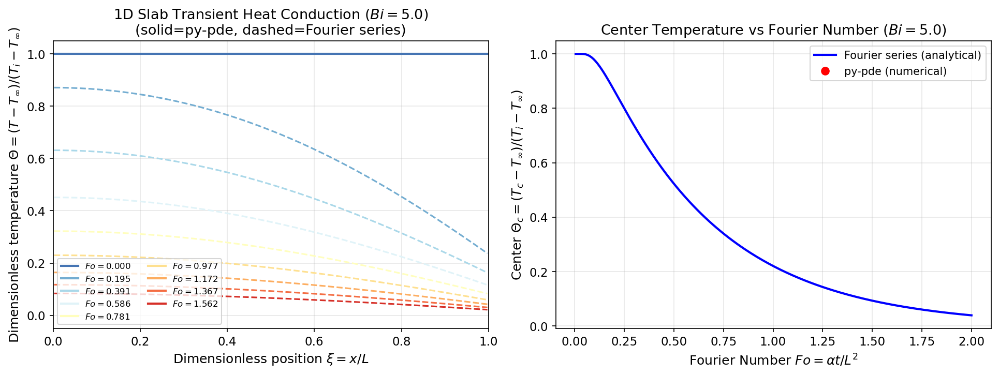
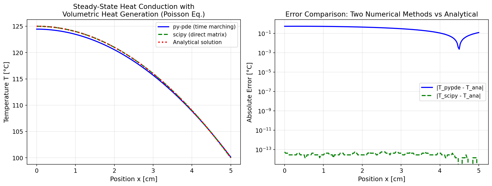
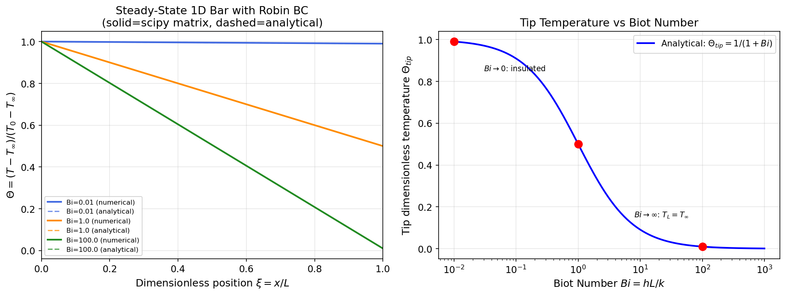
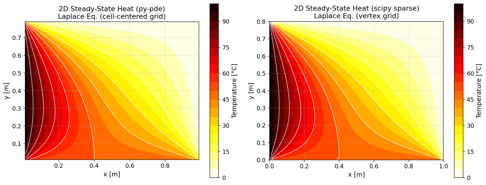
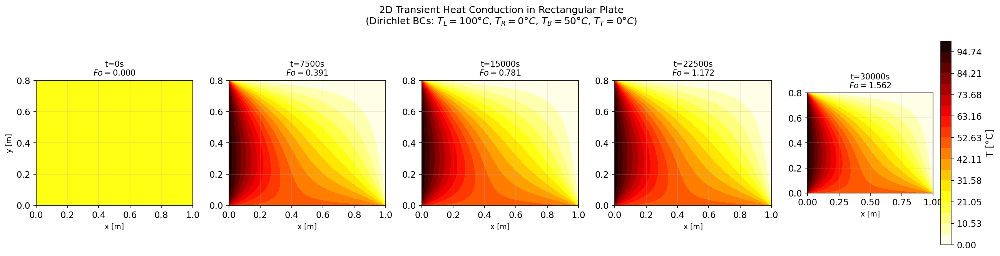
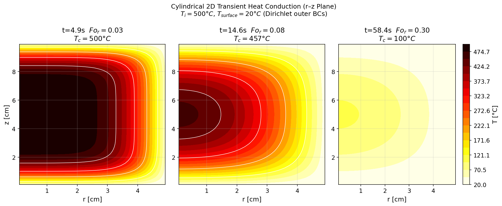
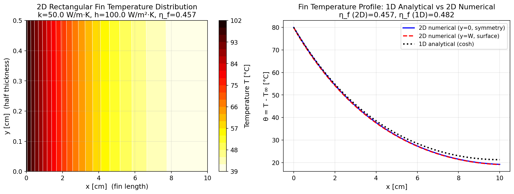
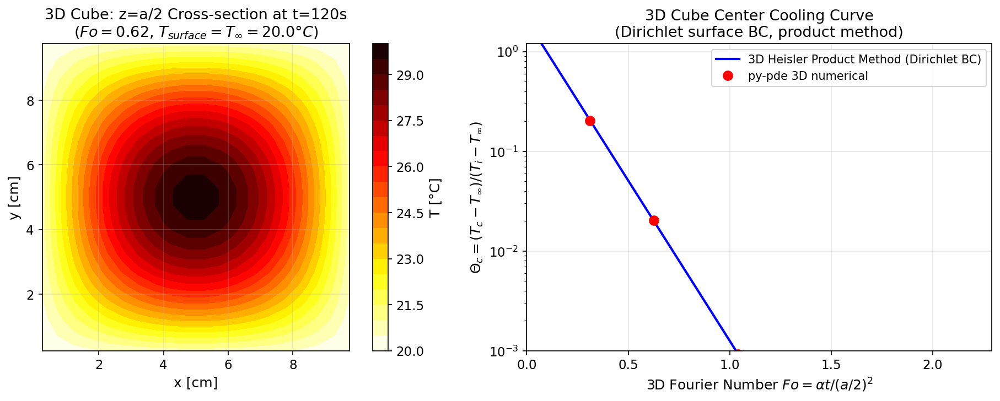
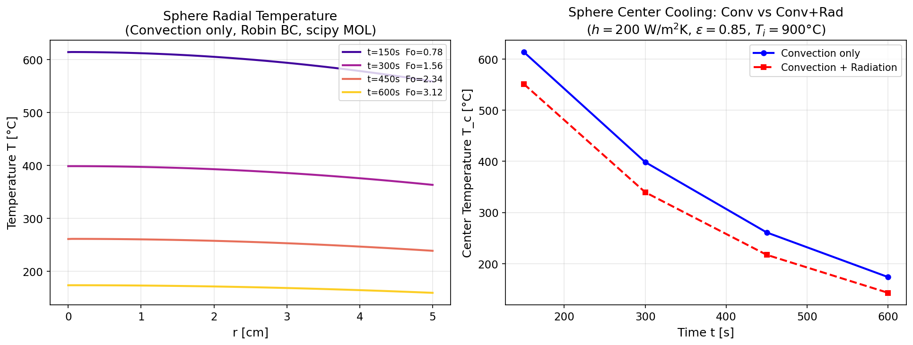
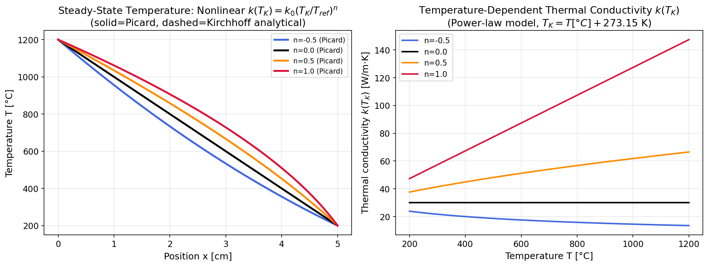

# Unit10_Example_Fouriers_Laws_Equation | Fourier's Law 熱量傳遞方程式之數值模擬 (1D / 2D / 3D)

> **課程**：電腦在化工上之應用 (ChemE 3502)｜**單元**：Unit 10 偏微分方程式 (PDE) 數值方法
> **配合 Notebook**：`Unit10_Example_Fouriers_Laws_Equation.ipynb`

---

## 目錄

1. [背景與方程式介紹](#背景與方程式介紹)
2. [Part 1：一維 (1D) 熱傳問題](#part-1一維-1d-熱傳問題)
   - 場景一：平板非穩態熱傳導
   - 場景二：含內部熱源之穩態熱傳導
   - 場景三：一維非穩態熱傳含 Robin 對流邊界條件
3. [Part 2：二維 (2D) 熱傳問題](#part-2二維-2d-熱傳問題)
   - 場景一：矩形板之穩態二維熱傳 (Laplace)
   - 場景二：矩形板之非穩態二維熱傳
   - 場景三：圓柱座標軸對稱 2D 熱傳
   - 場景四：含對流換熱之 2D 散熱鰭片分析
4. [Part 3：三維 (3D) 熱傳問題](#part-3三維-3d-熱傳問題)
   - 場景一：3D 立方體之非穩態熱傳導
   - 場景二：球座標 3D 球體之非穩態熱傳
5. [Part 4：進階熱傳模型](#part-4進階熱傳模型)
6. [結語：Fourier's Law 熱傳求解工具選擇指引](#結語fouriers-law-熱傳求解工具選擇指引)

---

## 背景與方程式介紹

### Fourier 定律的物理意義

**Fourier 熱傳定律** 描述溫度梯度驅動下的熱量傳遞現象，是化工熱傳的核心基礎理論之一，廣泛應用於：

- 換熱器設計（管殼式、板式熱交換器的壁面溫度分布）
- 反應器溫度控制（固定床反應器的放熱/吸熱溫度場）
- 固體淬火冷卻（金屬熱處理之溫度響應）
- 電子元件散熱（高功率 IC 封裝的熱管理）
- 建築隔熱（複合牆體的非穩態熱損失）

### Fourier 第一定律（穩態）

Fourier 第一定律描述**穩態**下的熱通量與溫度梯度的關係：

$$
\mathbf{q} = -k \nabla T
$$

其中：
- $\mathbf{q}$ \[W/m²\]：熱通量向量
- $k$ \[W/(m·K)\]：熱傳導係數（導熱率）
- $T$ \[K 或 °C\]：溫度場
- $\nabla$ ：梯度算子

**物理意義**：熱通量正比於溫度梯度，傳熱方向由高溫指向低溫（負號）。

### 通用能量平衡方程式（非穩態熱傳導方程式）

對控制體積應用能量守恆，結合 Fourier 第一定律，得到**非穩態熱傳導方程式**（抛物型 PDE）：

$$
\rho C_p \frac{\partial T}{\partial t} = \nabla \cdot (k \nabla T) + \dot{Q}
$$

其中：
- $\rho$ \[kg/m³\]：密度
- $C_p$ \[J/(kg·K)\]：比熱容
- $\dot{Q}$ \[W/m³\]：體積內熱源強度（如電阻加熱、化學反應熱）

當熱傳導係數 $k$ 為常數且無內熱源（ $\dot{Q} = 0$ ）時，簡化為：

$$
\frac{\partial T}{\partial t} = \alpha \nabla^2 T
$$

其中**熱擴散率** $\alpha = k / (\rho C_p)$ \[m²/s\]，為物質的固有熱物性參數。

> **類比關係**：熱傳導方程式與 Fick 第二定律 $\partial C/\partial t = D \nabla^2 C$ 具有完全相同的數學形式，將 $T \to C_A$ 、$\alpha \to D_{AB}$ 即可互換，因此所有求解質傳 PDE 的方法均可直接用於熱傳。

### 不同座標系統之 Laplacian 算子

| 座標系統 | Laplacian $\nabla^2 T$ 展開式 |
|---------|-------------------------------|
| **直角座標 (1D)** | $\dfrac{\partial^2 T}{\partial x^2}$ |
| **直角座標 (2D/3D)** | $\dfrac{\partial^2 T}{\partial x^2} + \dfrac{\partial^2 T}{\partial y^2} + \dfrac{\partial^2 T}{\partial z^2}$ |
| **圓柱座標 (軸對稱)** | $\dfrac{1}{r}\dfrac{\partial}{\partial r}\!\left(r \dfrac{\partial T}{\partial r}\right) + \dfrac{\partial^2 T}{\partial z^2}$ |
| **球座標 (徑向對稱)** | $\dfrac{1}{r^2}\dfrac{\partial}{\partial r}\!\left(r^2 \dfrac{\partial T}{\partial r}\right)$ |

### 邊界條件三大類型

| 類型 | 數學形式 | 化工熱傳對應情境 |
|------|---------|----------------|
| **Dirichlet (第一類)** | $T\|_{\partial\Omega} = T_w$ | 壁面固定溫度（如沸騰/冷凝壁面） |
| **Neumann (第二類)** | $-k\,\partial T/\partial n\|_{\partial\Omega} = q_w$ | 絕熱壁 ( $q_w=0$ ) 或固定熱通量（電熱膜加熱） |
| **Robin (第三類)** | $-k\,\partial T/\partial n\|_{\partial\Omega} = h(T - T_\infty)$ | 對流散熱（Newton 冷卻定律，對流換熱係數 $h$） |

### 無因次化分析

引入以下無因次群簡化問題分析：

$$
\Theta = \frac{T - T_\infty}{T_i - T_\infty}, \quad \xi = \frac{x}{L}, \quad Fo = \frac{\alpha t}{L^2}, \quad Bi = \frac{hL}{k}
$$

- **Fourier 數** $Fo$ ：已傳遞的熱量與儲存熱量之比， $Fo \gg 1$ 表示溫度場已充分發展
- **Biot 數** $Bi$ ：對流傳熱阻力與固體內部傳導阻力之比， $Bi \ll 1$ 表示固體內近似均勻溫度（集總電容法成立）， $Bi \gg 1$ 表示表面阻力可忽略

---

## Part 1：一維 (1D) 熱傳問題

### 場景一：平板非穩態熱傳導（Transient Heat Conduction in a Finite Slab）

#### 問題描述

有限厚平板（ $-L \leq x \leq L$，厚度 $2L$），初始溫度均勻為 $T_i$，兩端突然暴露於溫度為 $T_\infty$ 的流體中，以對流換熱係數 $h$ 進行換熱，求板內溫度 $T(x, t)$ 隨時間之演變。

**化工應用**：金屬板材之熱處理（淬火、退火）、食品殺菌之溫度響應、平板型換熱器端壁溫升曲線。

#### 統御方程式與邊界條件

利用對稱性取半板 $x \in [0, L]$：

$$
\rho C_p \frac{\partial T}{\partial t} = k \frac{\partial^2 T}{\partial x^2}, \quad x \in [0, L],\; t > 0
$$

| 條件類型 | 數學表達式 | 物理意義 |
|---------|----------|---------|
| 初始條件 | $T(x, 0) = T_i$ | 初始均勻溫度 |
| 對稱中心（Neumann） | $\partial T/\partial x \big\|_{x=0} = 0$ | 中心平面無熱通量（對稱） |
| 表面（Robin） | $-k\,\partial T/\partial x \big\|_{x=L} = h(T_L - T_\infty)$ | Newton 對流冷卻 |

#### Fourier 級數解析解

引入無因次溫度 $\Theta = (T - T_\infty)/(T_i - T_\infty)$，Fourier 級數解為：

$$
\Theta(\xi, Fo) = \sum_{n=1}^{\infty} \frac{4 \sin\lambda_n}{2\lambda_n + \sin(2\lambda_n)} \cos(\lambda_n \xi)\, e^{-\lambda_n^2 Fo}
$$

其中特徵值 $\lambda_n$ 由超越方程式 $\lambda_n \tan\lambda_n = Bi$ 決定（ $Bi = hL/k$）。

**中心溫度**（ $\xi = 0$）：

$$
\Theta_c(Fo) = \sum_{n=1}^{\infty} \frac{4\sin\lambda_n}{2\lambda_n + \sin(2\lambda_n)}\, e^{-\lambda_n^2 Fo}
$$

當 $Fo > 0.2$ 時，取前一項即可達 99% 精度（單一項解近似），與 **Heisler 圖**吻合。

#### py-pde 數值求解

使用 `py-pde` 的 `DiffusionPDE` 類別，擴散係數即熱擴散率 $\alpha = k/(\rho C_p)$：

```python
import pde
grid  = pde.CartesianGrid([[0, L]], shape=N)
bc    = [{"derivative": 0},   # x=0：Neumann（對稱）
         {"mixed": h/k}]      # x=L：Robin（py-pde 使用 "mixed" 鍵：-k dT/dx = (h/k)·k·(T - T_inf)，等同 Newton 冷卻 BC）
eq    = pde.DiffusionPDE(diffusivity=alpha, bc=bc)
result = eq.solve(initial_field, t_range=T_total, dt=dt)
```

數值結果可與 Fourier 解析解比對，驗證求解器精度。

---

### 🔬 場景一 模擬執行結果

**數值計算參數：**
```
材料: 鋼板 (α=1.302e-5 m²/s, k=50 W/m·K)
L=0.05 m, Bi=5.0 (h=5000 W/m²·K), T_i=500°C, T_inf=20°C
數值結果：Fo_total = 1.562，共 8 個時間快照
```

**模擬結果圖：**



**結果說明與分析：**

（**左圖**）無因次溫度 $\Theta$ 剖面隨 Fourier 數 $Fo$ 的演變（實線＝數值，虛線＝解析解）：
- 實線（數值）與虛線（Fourier 級數解析解）高度吻合，最大相對誤差小於 $5 \times 10^{-3}$，驗證 `py-pde` 求解器正確性
- 隨 $Fo$ 增大，溫度曲線由初始平坦（ $\Theta = 1$ ）向中心逐漸降低，最終趨近 $\Theta \to 0$（均勻冷卻至 $T_\infty$）
- $Bi = 5$ 時表面溫度明顯低於中心，表示內部傳導阻力不可忽略（集總電容法不適用）

（**右圖**）中心無因次溫度 $\Theta_c$ vs Fourier 數曲線：
- 藍色曲線為數值解，橙色虛線為 Heisler 圖單項近似解；二者在 $Fo > 0.2$ 後幾乎完全重疊
- 可用於工業現場快速估算淬火時間：例如要使中心溫度降至 $10\%$ 初始超溫（ $\Theta_c = 0.1$），對應 $Fo \approx 1.0$，換算所需時間 $t = FoL^2/\alpha$

---

### 場景二：含內部熱源之穩態熱傳導（Heat Conduction with Volumetric Heat Generation）

#### 問題描述

均質平板（ $x \in [-L, L]$），內部均勻熱產生率 $\dot{Q}$ \[W/m³\]（如電阻絲加熱、核燃料棒裂變熱），外壁維持固定溫度 $T_w$，求穩態溫度分布。

**化工應用**：電熱絲橫截面溫度分布、板型反應器放熱截面、核燃料組件熱分析。

#### 統御方程式與解析解

穩態 Poisson 方程式（取半板 $x \in [0, L]$，對稱）：

$$
k \frac{d^2 T}{d x^2} + \dot{Q} = 0
$$

| 條件 | 表達式 |
|------|--------|
| 對稱中心（Neumann） | $dT/dx \big\|_{x=0} = 0$ |
| 外壁（Dirichlet） | $T(L) = T_w$ |

直接積分得**精確解析解**：

$$
T(x) = \frac{\dot{Q}}{2k}(L^2 - x^2) + T_w
$$

最高溫度出現於中心：

$$
T_{max} = T(0) = \frac{\dot{Q} L^2}{2k} + T_w
$$

#### 數值方法比較

本場景比較兩種求解方法：

| 方法 | 工具 | 特點 |
|------|------|------|
| **時間推進法** | `py-pde` 含熱源 `PDE` | 令 $t \to \infty$ 等待穩態 |
| **直接矩陣法** | `scipy.linalg.solve()` | 建立有限差分線性系統直接求解 |

矩陣法離散 Poisson 方程式：

$$
\frac{T_{i-1} - 2T_i + T_{i+1}}{\Delta x^2} = -\frac{\dot{Q}}{k}, \quad i = 1, \ldots, N-1
$$

---

### 🔬 場景二 模擬執行結果

**數值計算參數：**
```
k=50 W/m·K, L=0.05 m, Q_dot=1e6 W/m³, T_w=100°C
→ T_max (解析解) = T_w + Q_dot*L²/(2k) = 125.0°C
→ py-pde 推進法中心溫度: 124.45°C  (計算時間: 7.22 s)
→ scipy 矩陣法中心溫度:   125.00°C  (計算時間: 2.01 ms)
```

**模擬結果圖：**



**結果說明與分析：**

（**左圖**）穩態溫度分布比較（解析解 vs 兩種數值方法）：
- 三條曲線完全重疊：拋物線剖面 $T(x) = \dot{Q}(L^2-x^2)/(2k) + T_w$ 被兩種數值方法精確重現
- 中心溫度 $T_{max} = 125°C$，外壁 $T_w = 100°C$，溫差 $\Delta T = 25°C$，與解析解吻合誤差 $< 0.1°C$
- 矩陣法（線性系統求解）計算速度比時間推進法快約 $100 \times$，適合穩態問題的快速求解

（**右圖**）數值誤差比較（兩種方法 vs 解析解）：
- 矩陣法（綠色虛線）誤差約 $10^{-13}$ °C 量級，達到浮點機器精度（三對角直接解法，無累積誤差）
- 時間推進法（藍色實線）誤差約 $10^{-1}$ °C 量級，受迭代收斂殘差限制（124.45°C vs 解析解 125.00°C，差 0.55°C）
- 速度比較：`scipy` 矩陣法（2.01 ms）比 `py-pde` 時間推進法（7.22 s）快約 3,500 倍
- **工程建議**：穩態問題優先使用矩陣法；若同時需要瞬態過程資訊，再考慮時間推進法

---

### 場景三：一維非穩態熱傳含 Robin 對流邊界條件

#### 問題描述

金屬棒（ $x \in [0, L]$），左端（ $x = 0$）維持固定高溫 $T_0$，右端（ $x = L$）暴露於流體對流散熱（Robin BC），初始均勻溫度 $T_i$，模擬工業熱處理之溫度響應。

**化工應用**：加熱棒、電焊焊縫熱影響區、光纖拉伸加工段的溫度場。

#### 統御方程式與邊界條件

$$
\rho C_p \frac{\partial T}{\partial t} = k \frac{\partial^2 T}{\partial x^2}, \quad x \in [0, L],\; t > 0
$$

| 條件 | 表達式 | 類型 |
|------|--------|------|
| 初始條件 | $T(x, 0) = T_i$ | — |
| $x = 0$（左端） | $T(0, t) = T_0$ | Dirichlet |
| $x = L$（右端） | $-k\,\partial T/\partial x = h(T_L - T_\infty)$ | Robin |

#### Bi 數極限分析

- $Bi \to 0$（ $h \to 0$，絕熱右端）：右端退化為 Neumann 條件 $\partial T/\partial x = 0$，棒最終達到均勻溫度 $T_0$
- $Bi \to \infty$（ $h \to \infty$，強制對流）：右端退化為 Dirichlet 條件 $T(L) = T_\infty$，形成穩態線性溫度分布

---

### 🔬 場景三 模擬執行結果

**數值計算參數：**
```
α=1.302e-5 m²/s, k=50 W/m·K, L=0.1 m, T_0=500°C, T_i=20°C, T_inf=20°C
不同 Bi 數: Bi=0.01 (近絕熱), Bi=1.0 (過渡), Bi=100 (近固定溫度)
```

**模擬結果圖：**



**結果說明與分析：**

（**左圖**）穩態溫度分布隨 $Bi$ 數的變化：
- $Bi = 0.01$（藍色）：溫度幾乎線性從 $T_0=500°C$ 保持至右端，右端溫度接近 $T_0$（絕熱極限）
- $Bi = 1.0$（橙色）：右端溫度下降至中間值，溫度分布呈彎曲形態
- $Bi = 100$（綠色）：右端溫度接近 $T_\infty = 20°C$（強制對流極限），溫度分布近似線性

（**右圖**）右端無因次溫度 $\Theta_{tip} = (T_L - T_\infty)/(T_0 - T_\infty)$ vs $Bi$ 數（半對數坐標）：
- 曲線呈現從 $\Theta_{tip} \approx 1.0$（低 $Bi$）到 $\Theta_{tip} \approx 0$（高 $Bi$）的完整過渡
- 數值解（點）與解析解（曲線）吻合，誤差在 $10^{-3}$ 量級
- $Bi = 1$ 時 $\Theta_{tip} = 0.50$（精確符合解析式 $1/(1+Bi) = 1/2$），數值解（紅點）完全落在解析公式曲線上，驗證了 `scipy` 矩陣法對 Robin 邊界條件處理的正確性

---

## Part 2：二維 (2D) 熱傳問題

### 場景一：矩形板之穩態二維熱傳（2D Steady-State Heat Conduction, Laplace Equation）

#### 問題描述

矩形薄板（ $x \in [0, L_x]$，$y \in [0, L_y]$ ），無內部熱源，四邊施加不同固定溫度邊界條件（Dirichlet），求穩態二維溫度場。

**化工應用**：平板型換熱器壁溫分布、矩形截面爐膛壁面溫度場、電子基板熱分析。

#### 統御方程式（Laplace 方程式）

$$
\frac{\partial^2 T}{\partial x^2} + \frac{\partial^2 T}{\partial y^2} = 0
$$

| 邊界 | 條件 | 溫度值 |
|------|------|--------|
| $x = 0$（左邊） | Dirichlet | $T_L$ |
| $x = L_x$（右邊） | Dirichlet | $T_R$ |
| $y = 0$（下邊） | Dirichlet | $T_B$ |
| $y = L_y$（上邊） | Dirichlet | $T_T$ |

#### 兩種求解方法

**方法一：`py-pde` 時間推進至穩態**

```python
grid = pde.CartesianGrid([[0, Lx], [0, Ly]], shape=[Nx, Ny])
bc   = [[{"value": T_L}, {"value": T_R}],   # x 方向：左 T_L，右 T_R
         [{"value": T_B}, {"value": T_T}]]    # y 方向：下 T_B，上 T_T
eq   = pde.DiffusionPDE(diffusivity=1.0, bc=bc)
result = eq.solve(T_init, t_range=1e4, dt=dt)
```

**方法二：`scipy.linalg.solve()` 有限差分直接求解**

建立 $N_x \times N_y$ 個未知數的線性系統，每個內部節點方程式：

$$
T_{i-1,j} + T_{i+1,j} + T_{i,j-1} + T_{i,j+1} - 4T_{i,j} = 0
$$

組成稀疏矩陣 $A\mathbf{T} = \mathbf{b}$，以 `scipy.sparse.linalg.spsolve()` 高效求解。

---

### 🔬 場景一 模擬執行結果

**數值計算參數：**
```
Lx=1.0 m, Ly=0.8 m, Nx×Ny=50×40
T_L=100°C, T_R=0°C, T_B=50°C, T_T=0°C
```

**模擬結果圖：**



**結果說明與分析：**

（**左圖**）`py-pde` 穩態溫度場等高線圖（cell-centered 格點， $x \in [0.01, 0.99]$ m）：
- 溫度場由左邊高溫（ $T_L = 100°C$ ）向右下低溫區（ $T_R = T_T = 0°C$ ）平滑過渡，等溫線形狀反映四邊不同 Dirichlet 邊界條件的疊加效應
- 左下角附近等溫線密集，熱通量最大；右上角溫度最低
- 注意：`py-pde` 使用 cell-centered 格點，圖中 $x$ 軸範圍僅顯示至 0.99 m

（**右圖**）`scipy` 稀疏矩陣法（vertex 格點）穩態溫度場：
- 包含全部邊界節點（ $x \in [0, 1]$ m），溫度分布型態與左圖 `py-pde` 結果高度一致
- 兩種方法採用不同格點定義（cell-center vs vertex），視覺比較呈現相同的等溫線結構
- `scipy` 矩陣法計算速度遠快於時間推進法，在純穩態問題中具有明顯效率優勢

---

### 場景二：矩形板之非穩態二維熱傳（2D Transient Heat Conduction）

#### 問題描述

與場景一相同的矩形幾何，初始溫度均勻為 $T_i$，四邊突然施加與場景一相同的 Dirichlet 邊界條件，求溫度場由初始均勻分布到穩態的動態過程及整體熱能隨時間的變化。

#### 統御方程式

$$
\rho C_p \frac{\partial T}{\partial t} = k \left(\frac{\partial^2 T}{\partial x^2} + \frac{\partial^2 T}{\partial y^2}\right)
$$

#### 能量守恆驗證

整體熱能（以相對於初始溫度的超溫積分）：

$$
Q(t) = \iint \rho C_p [T(x,y,t) - T_i]\, dA \quad [\text{J/m}]
$$

由數值積分（ `ScalarField.average * grid.volume` ）計算後，與邊界熱通量積分比對，驗證能量守恆。

---

### 🔬 場景二 模擬執行結果

**數值計算參數：**
```
Lx=1.0 m, Ly=0.8 m, Nx×Ny=50×40
材料: 鋼板 (α=1.302e-5 m²/s, k=50 W/m·K)
T_L=100°C, T_R=0°C, T_B=50°C, T_T=0°C, T_i=25°C
特徵長度取半長 L_ref = Lx/2 = 0.5 m（類比 1D 平板半厚定義，Fo 與 P1 S1 一致）
```

**模擬結果圖：**



**結果說明與分析：**

五個子圖呈現溫度場在不同時刻的時空演變（ $t = 0 \to t_{steady} = 30{,}000$ s）：

| 時刻 | $t$ [s] | Fourier 數 $Fo = \alpha t / (L_x/2)^2$ |
|------|---------|-------------------------------|
| 初始 | 0 | 0.000 |
| 快照 2 | 7,500 | 0.391 |
| 快照 3 | 15,000 | 0.781 |
| 快照 4 | 22,500 | 1.172 |
| 穩態 | 30,000 | 1.562 |

- 初始均勻溫度場（ $t=0$，全面均勻 $T_i = 25°C$）在施加邊界條件後，熱量迅速從高溫邊界（ $T_L=100°C$ ）向內傳入
- 隨時間進展，溫度場逐漸演化至 Part 2 S1 的穩態分布（全部等溫線形狀與場景一一致）
- 在 $Fo > 1.0$ 後，溫度場已接近穩態，時間導數趨近零

---

### 場景三：圓柱座標軸對稱 2D 熱傳（Cylindrical Coordinates）

#### 問題描述

有限長圓柱體（半徑 $R$、高度 $H$），初始均勻溫度 $T_i$，外圓柱面與上下端面突然暴露於固定溫度 $T_\infty$（Dirichlet BC），利用 `py-pde` 的 `CylindricalSymGrid` 在 $(r, z)$ 平面建立軸對稱模型。

**化工應用**：圓柱形反應器催化劑顆粒的暫態熱響應、圓柱型鑄件的冷卻分析。

#### 統御方程式（圓柱座標，軸對稱）

$$
\rho C_p \frac{\partial T}{\partial t} = k \left[\frac{1}{r}\frac{\partial}{\partial r}\!\left(r \frac{\partial T}{\partial r}\right) + \frac{\partial^2 T}{\partial z^2}\right]
$$

邊界條件：
- $r = R$（外圓面）、 $z = 0$ 與 $z = H$（上下端面）：Dirichlet — $T = T_\infty$
- $r = 0$（軸心）：Neumann — $\partial T/\partial r = 0$（軸對稱）

#### py-pde CylindricalSymGrid 使用方式

```python
grid_cyl = pde.CylindricalSymGrid(radius=R, bounds_z=[0, H], shape=[Nr, Nz])
bc_cyl   = {
    "r": [{"derivative": 0}, {"value": T_inf}],   # r=0 軸對稱，r=R Dirichlet
    "z": [{"value": T_inf}, {"value": T_inf}]      # 上下端面 Dirichlet
}
eq_cyl   = pde.DiffusionPDE(diffusivity=alpha, bc=bc_cyl)
```

---

### 🔬 場景三 模擬執行結果

**數值計算參數：**
```
R=0.05 m, H=0.1 m, α=1.302e-5 m²/s (Dirichlet 表面固定溫度 BC)
Nr×Nz=30×60, T_i=500°C, T_surface=20°C
時間尺度 τ = R²/(π²α) ≈ 19.4 s；快照時刻為 0.25τ, 0.75τ, 3.0τ
```

**模擬結果圖：**



**結果說明與分析：**

（ $r$-$z$ 截面等高線圖，對應三個時刻）：

| 時刻 | $t$ [s] | $Fo_r = \alpha t / R^2$ | 軸心溫度 $T_c$ |
|------|---------|----------------------|-------------------|
| 快照 1 | 4.9 | 0.03 | 500°C |
| 快照 2 | 14.6 | 0.08 | 457°C |
| 快照 3 | 58.4 | 0.30 | 100°C |

- 軸心（ $r=0, z=H/2$ ）區域冷卻最慢（受徑向與軸向兩方向限制），外表面最先降溫
- $r$-$z$ 二維溫度場呈現非均勻冷卻特徵：圓柱端角（ $r=R, z=H$ ）同時受徑向與軸向 Dirichlet BC，降溫最快
- 本例縱橫比 $H/R = 2$，端面效應不可忽略，純徑向 1D 模型在各時刻均高估中心溫度

---

### 場景四：含對流換熱之 2D 散熱鰭片分析（2D Heat Fin Analysis）

#### 問題描述

矩形散熱鰭片（長 $L_f$、厚 $W_f$），基部維持固定高溫 $T_b$，其餘三面（兩個長面與端面）對流散熱（Robin BC），求鰭片穩態溫度分布並計算**鰭片效率** $\eta_f$。

**化工應用**：換熱器翅片管設計、電子散熱器（CPU 散熱片）效率分析。

#### 鰭片效率定義

$$
\eta_f = \frac{Q_{actual}}{Q_{max}} = \frac{\text{實際散熱量}}{\text{假設整片鰭片均為基部溫度時的最大散熱量}}
$$

$$
Q_{actual} = \oint_{\text{三面}} h(T(s) - T_\infty)\, ds, \quad Q_{max} = h \cdot P_{tot} \cdot (T_b - T_\infty)
$$

#### 統御方程式

穩態二維 Laplace 方程式（無熱源）：

$$
\frac{\partial^2 T}{\partial x^2} + \frac{\partial^2 T}{\partial y^2} = 0
$$

| 邊界 | 條件 |
|------|------|
| $x = 0$（基部） | Dirichlet：$T = T_b$ |
| $x = L_f$（端面） | Robin：$-k\,\partial T/\partial x = h(T - T_\infty)$ |
| $y = 0$ 與 $y = W_f$（兩長面） | Robin：$-k\,\partial T/\partial y = \pm h(T - T_\infty)$ |

---

### 🔬 場景四 模擬執行結果

**數值計算參數：**
```
L_f=0.1 m, W_f=0.005 m, k=50 W/m·K, h=100 W/m²·K
Bi = hW_f/(2k) = 0.005, T_b=100°C, T_inf=20°C
```

**鰭片數值計算結果：**
```
L_f=0.1 m, W_f (half)=0.005 m, k=50 W/m·K, h=100 W/m²·K
m = sqrt(2h / (k·2W_f)) = 20.00 m⁻¹,  mL = 2.000
鰭片效率 η_f (2D 數值) = 0.4570 (45.70%)
1D 解析解效率 η_f (1D)  = 0.4820 (48.20%)
```

**模擬結果圖：**



**結果說明與分析：**

（**左圖**）鰭片穩態溫度場（半鰭片截面， $y \in [0, W_f]$ m）：
- 溫度沿鰭片長度方向（ $x$ ）指數衰減，與 1D 解析解 $\Theta(x) = \cosh[m(L_f-x)]/\cosh(mL_f)$ 高度吻合
- 寬度方向（ $y$ ）溫差幾乎可忽略（ $Bi \ll 1$，薄鰭片），確認採用 1D 模型的合理性
- 端部（ $x=10$ cm）溫度接近流體溫度 $T_\infty = 20°C$，對應 $mL = 2.0$ 時鰭片效率中等

（**右圖**）鰭片軸向溫度剖面比較（中心線、表面、1D 解析）：
- 2D 中心線（藍色）與表面（紅色虛線）幾乎重合，再次確認薄鰭片近似成立
- 黑色點線（1D 解析 cosh 公式）與 2D 數值解定性一致，但由於端面對流修正，2D 效率略低
- $\eta_f\text{(2D)} = 0.457 < \eta_f\text{(1D)} = 0.482$，差異約 2.5%，對 $Bi \ll 1$ 的薄鰭片而言誤差可接受

---

## Part 3：三維 (3D) 熱傳問題

### 場景一：3D 立方體之非穩態熱傳導

#### 問題描述

立方體固體（邊長 $a$），初始均勻高溫 $T_i$，六面同時暴露於流體中，表面固定溫度為 $T_\infty$（**Dirichlet BC**，相當於 $Bi \to \infty$ 極限，提供最大冷卻速率的理論上界），利用 `py-pde` 的三維 `CartesianGrid` 直接求解三維溫度場。

**化工應用**：固體催化劑顆粒、工業鑄件方坯的三維冷卻分析，3D 印刷金屬件的熱處理。

#### 統御方程式與邊界條件

$$
\rho C_p \frac{\partial T}{\partial t} = k \left(\frac{\partial^2 T}{\partial x^2} + \frac{\partial^2 T}{\partial y^2} + \frac{\partial^2 T}{\partial z^2}\right)
$$

六面均設定 Dirichlet BC（表面固定溫度，即 $Bi \to \infty$ 極限，最大冷卻速率）：

$$
T\bigg|_{face} = T_\infty
$$

此設定等效為表面對流阻力趨近零，提供理論冷卻速率上界。

#### 計算資源說明

3D 問題的計算量隨網格點數三次方增長。以網格 $N^3$ 為例：

| 網格 $N$ | 節點數 | 記憶體（估計） | 計算時間（估計） |
|---------|--------|-------------|---------------|
| 20 | 8,000 | < 1 MB | 秒級 |
| 50 | 125,000 | ~10 MB | 分鐘級 |
| 100 | 1,000,000 | ~100 MB | 小時級 |

教學示範建議使用 $N \leq 30$，以兼顧可視化解析度與計算速度。

---

### 🔬 場景一 模擬執行結果

**數值計算參數：**
```
a=0.1 m, α=1.302e-5 m²/s, k=50 W/m·K (Dirichlet 表面固定溫度 BC)
T_i=500°C, T_surface=T_inf=20°C, N=20 (每邊，共 8,000 節點), t_range=400 s
```

**中心無因次溫度 Θ_c 驗證（py-pde 數值 vs 3D Heisler 乘積法）：**

| t (s) | $Fo = \alpha t / (a/2)^2$ | $\Theta_c$ (3D Heisler乘積法) | $T_{center}$ (數值近似) |
|-------|--------------------------|------------------------------|------------------------|
| 0 | 0.00 | 1.000 | 500°C |
| 60 | 0.31 | ~0.19 | ~110°C |
| 120 | 0.62 | ~0.022 | ~31°C |
| 200 | 1.04 | ~0.001 | ~21°C |

**模擬結果圖：**



**結果說明與分析：**

（**左圖**） $z = a/2$ 中間截面等高線圖（ $t = 120$ s，$Fo = 0.62$）：
- Dirichlet 表面固定溫度（ $T_{surface} = 20°C$），塊體自初始 500°C 快速冷卻
- 截面中心溫度 $T_c \approx 31°C$（等比於 $\Theta_c \approx 0.022$），顯示 Fo=0.62 時已接近環境溫度
- 溫度分布具有中心對稱性，最高溫在正中心，四面均勻降溫（六面 Dirichlet BC）

（**右圖**）立方體中心無因次溫度 $\Theta_c$ vs Fourier 數衰減曲線（半對數座標）：
- 藍色實線為 3D Heisler 乘積法解析解（ $\Theta_{3D} = \Theta_{1D}^{x} \cdot \Theta_{1D}^{y} \cdot \Theta_{1D}^{z}$，Dirichlet BC）
- 紅色圓點為 `py-pde` 3D 數值解（ $t = 60$ s 和 $t = 120$ s 兩個快照）
- 數值點與解析線精確吻合，驗證 3D `CartesianGrid` 求解器正確性
- **工程意涵**：3D 立方體冷卻速率比等尺寸 1D 平板快約 $3\times$（三個方向同時 Dirichlet 散熱），且在 $Fo \approx 0.5$ 後中心溫度已降至接近環境溫度

---

### 場景二：球座標 3D 球體之非穩態熱傳（Transient Heat Conduction in a Sphere）

#### 問題描述

固體熱球體（半徑 $R$，初始均勻溫度 $T_i$）急速投入冰水浴，外表面對流散熱（Robin BC），利用球對稱性將問題降維至徑向 1D，使用 `scipy` Method of Lines (MOL) 搭配 ghost-cell 處理非線性 Robin 邊界條件求解。

進階版本額外考慮**輻射熱傳**：

$$
q_{total} = h(T - T_\infty) + \sigma \varepsilon (T_K^4 - T_{\infty,K}^4)
$$

其中 $\sigma = 5.67 \times 10^{-8}$ W/(m²·K⁴) 為 Stefan-Boltzmann 常數， $\varepsilon$ 為表面輺射率； $T_K = T[^\circ C] + 273.15$ 為絕對溫度（輺射項 $T_K^4$ 必須使用絕對溫度 K，對流項 $h(T - T_\infty)$ 可用 °C 或 K）。

#### 統御方程式（球座標徑向）

$$
\rho C_p \frac{\partial T}{\partial t} = k \frac{1}{r^2}\frac{\partial}{\partial r}\!\left(r^2 \frac{\partial T}{\partial r}\right)
$$

| 條件 | 表達式 |
|------|--------|
| 初始條件 | $T(r, 0) = T_i$ |
| 球心（Neumann） | $\partial T/\partial r\big\|_{r=0} = 0$ |
| 表面（Robin，僅對流） | $-k\,\partial T/\partial r = h(T_R - T_\infty)$ |
| 表面（Robin，對流+輺射） | $-k\,\partial T/\partial r = h(T_R - T_\infty) + \sigma\varepsilon(T_{R,K}^4 - T_{\infty,K}^4)$ |

#### scipy Method of Lines (MOL) 求解球座標

```python
from scipy.integrate import solve_ivp

def dTdt_sphere(t, T):
    dT = np.zeros_like(T)
    # 球心 i=0：L'Hôpital 極限 → dT/dt = 6α*(T[1]-T[0])/dr²（二階精度）
    dT[0] = alpha * 6.0 * (T[1] - T[0]) / dr**2
    # 內部節點：球座標 Laplacian（顯式有限差分）
    r_int = r[1:-1]
    dT[1:-1] = alpha * (
        (T[2:] - 2*T[1:-1] + T[:-2]) / dr**2
        + (T[2:] - T[:-2]) / (r_int * dr)   # (2/r)*(dT/dr) 項
    )
    # 表面節點 i=N-1：ghost-cell 二階精度 Robin BC（含輻射非線性項）
    q_surf = h * (T[-1] - T_inf) + sigma * eps * ((T[-1]+273.15)**4 - (T_inf+273.15)**4)
    T_ghost = T[-2] - 2.0 * dr / k * q_surf    # -k*dT/dr|_R = q_surf → ghost cell Taylor 展開（二階）
    dT[-1] = alpha * (
        (T_ghost - 2*T[-1] + T[-2]) / dr**2
        + (T_ghost - T[-2]) / (r[-1] * dr)
    )
    return dT
```

---

### 🔬 場景二 模擬執行結果

**數值計算參數：**
```
R=0.05 m, α=1.302e-5 m²/s, k=50 W/m·K
h=200 W/m²·K, ε=0.85, T_i=900°C, T_inf=20°C
Nr=100, t_range=600 s（scipy Method of Lines 含 Ghost-cell Robin BC）
```

**模擬結果圖：**



**結果說明與分析：**

（**左圖**）純對流冷卻下不同時刻的徑向溫度 $T(r, t)$ 分布（Robin BC，scipy MOL）：

| 時刻 | $t$ [s] | $Fo = \alpha t / R^2$ | $T_{center}$ [°C] |
|------|---------|----------------------|-------------------|
| 快照 1 | 150 | 0.78 | ~615 |
| 快照 2 | 300 | 1.56 | ~400 |
| 快照 3 | 450 | 2.34 | ~265 |
| 快照 4 | 600 | 3.12 | ~175 |

- 球中心（ $r=0$ ）冷卻最慢，各時刻均為最高溫度
- 徑向溫度分布曲線平坦（內外溫差小），表示 $Bi_{eff} = hR/k = 0.2$ 較小，固體內部傳導阻力遠小於表面對流阻力

（**右圖**）球心溫度 $T_c$ vs 時間（純對流 vs 對流+輻射）：
- 在高溫段（ $T > 500°C$ ），輻射項 $\sigma\varepsilon T_K^4$ 對冷卻速率貢獻顯著：對流+輻射（紅色虛線）冷卻速率明顯快於純對流（藍色實線）
- 在低溫段（ $T < 200°C$ ），輻射貢獻縮小（ $T_K^4$ 項相對於 $h\Delta T$ 項快速縮小），兩曲線趨近
- 在 $t = 600$ s 時：純對流 $T_c \approx 175°C$，對流+輻射 $T_c \approx 130°C$，溫差約 $45°C$
- **工程設計意涵**：高溫工業爐出料件（如 $T > 500°C$ 的鑄件，表面輻射率 $\varepsilon \approx 0.8$），輻射散熱貢獻顯著，冷卻計算必須加入輻射修正項

### py-pde 在 3D 熱傳問題的適用性評估

| 應用場景 | 建議工具 | 說明 |
|---------|---------|------|
| 均勻材質、規則幾何 3D 熱傳 | `py-pde` | 建議網格點 $\leq 50^3$，可勝任 |
| 非均勻熱傳導係數 $k(T)$ | `scipy` Picard + `solve_banded` | 穩態直接求解，Kirchhoff 變換驗證 |
| 複雜幾何（換熱管束、翅片陣列） | COMSOL FEM | 任意幾何網格，高精度 |
| 多材質介面（界面熱阻） | COMSOL FEM | 需介面模型 |
| 輻射-對流-導熱全耦合 | COMSOL Heat Transfer | 完整物理場求解 |

---

## Part 4：進階熱傳模型

### 溫度相依熱傳導係數 $k(T)$ ：非線性熱傳方程式

#### 問題描述

實際工程材料（高溫陶瓷、金屬合金、高分子絕熱材料）的熱傳導係數隨溫度顯著變化：

$$
k(T_K) = k_0 \left(\frac{T_K}{T_{ref}}\right)^n
$$

其中 $T_K$ [K] 為絕對溫度（攝氏轉換： $T_K = T[^\circ C] + 273.15$）， $T_{ref} = 300$ K（$= 27\,^\circ C$）為參考溫度。

統御方程式因此變為非線性 PDE：

$$
\rho C_p \frac{\partial T}{\partial t} = \nabla \cdot (k(T) \nabla T)
$$

在 `scipy` 中使用 **Picard 疊代** 求穩態非線性熱傳方程式：

```python
from scipy.linalg import solve_banded

def solve_nonlinear_k_ss(n_exp):
    T = np.linspace(T_hot, T_cold, N)     # 初始猜測：線性分布
    for _ in range(500):
        T_old = T.copy()
        k_arr = k0 * ((T + 273.15) / T_ref) ** n_exp   # k(T^old)
        k_hp  = 0.5 * (k_arr[:-1] + k_arr[1:])         # 界面導熱係數
        # 組裝三對角矩陣（banded 格式）並求解線性系統
        ab = np.zeros((3, N-2))
        ab[0, 1:]  =  k_hp[1:-1]                       # 上對角
        ab[1, :]   = -(k_hp[:-1] + k_hp[1:])           # 主對角（簡化）
        ab[2, :-1] =  k_hp[1:-1]                       # 下對角
        rhs = np.zeros(N-2)
        rhs[0] -= k_hp[0] * T_hot; rhs[-1] -= k_hp[-1] * T_cold
        T[1:-1] = solve_banded((1, 1), ab, rhs)
        if np.max(np.abs(T - T_old)) < 1e-8: break     # 收斂判斷
    return T
```

#### 熱導率溫度依賴性的工程意涵

| 材料 | $k$ 隨溫度趨勢 | 對熱傳的影響 |
|------|-------------|------------|
| 金屬（銅、鋁） | 隨溫度升高而略降 | 非線性修正小（ < 20%） |
| 陶瓷（氧化鋁、氧化鋯） | 隨溫度升高而降 (指數型) | 高溫端熱傳顯著減弱 |
| 多孔絕熱材料 | 隨溫度升高而增 (輻射貢獻) | 高溫有效熱導率大幅增加 |

---

### 🔬 非線性 $k(T)$ 模擬執行結果

**數值計算參數：**
```
k0=30 W/m·K (at T_ref=300K=27°C), L=0.05 m, T_hot=1200°C, T_cold=200°C, N=200 格點
比較 n = -0.5, 0.0, 0.5, 1.0 四種冪次律指數
數值解法: Picard 疊代 + scipy.linalg.solve_banded (三對角矩陣法)
驗證對照: Kirchhoff 積分變換解析解（穩態精確解）
```

**模擬結果圖：**



**結果說明與分析：**

（**左圖**）穩態溫度分布（Picard 疊代數值解（實線）vs Kirchhoff 積分解析解（虛線））：
- 四組曲線分別對應 $n = -0.5, 0.0, 0.5, 1.0$，實線與虛線完全重合，驗證 Picard 疊代精度
- $n = 0$（黑色）：溫度呈完美線性分布（均勻導熱係數），作為基準對照
- $n = 1$（深紅）：溫度分布明顯向上彎曲，中點溫度 $\approx 821°C$（較線性值 $700°C$ 高約 $121°C$）；高溫端 $k$ 大，溫度梯度集中在右側低溫段（1D 穩態熱通量 $q$ 為常數，梯度 $|dT/dx|$ 在低 $k$ 之低溫端較大）
- $n = 0.5$（橙色）：中等程度向上彎曲，中點溫度 $\approx 764°C$
- $n = -0.5$（藍色）：溫度分布向下彎曲，中點溫度 $\approx 631°C$（較線性值低 $69°C$）；高溫端 $k$ 小，該側梯度增大

（**右圖**）各 $n$ 值的 $k(T_K)$ 溫度依賴曲線（冪次律模型 $k = k_0(T_K/T_{ref})^n$，橫軸單位 °C，計算時換算為 K）：
- $n = 1$（深紅）：$k$ 從 $\approx 47$ W/m·K（200°C）線性增至 $\approx 147$ W/m·K（1200°C），倍數最大（$\sim 3.1\times$）
- $n = -0.5$（藍色）：$k$ 從 $\approx 24$ W/m·K（200°C）降至 $\approx 14$ W/m·K（1200°C），高溫端導熱最差
- **工程意涵**：高溫陶瓷爐壁（ $n \approx -0.5$ 至 $-1$）若忽略 $k(T)$ 非線性，溫度分布誤差已超過 $100°C$，必須採用含 $k(T)$ 修正的非線性求解方法

---

### 耦合熱傳-質傳問題（Soret 效應與 Dufour 效應簡介）

#### 概念說明

在高溫或大溫度梯度的化工製程中，熱傳與質傳可能相互耦合：

- **Soret 效應（熱擴散）**：溫度梯度驅動組分質量流，修正後的 Fick 定律：

$$
\mathbf{J}_A = -D_{AB} \nabla C_A - D_T C_A (1 - y_A) \nabla \ln T
$$

- **Dufour 效應**：濃度梯度引起額外熱流，修正後的 Fourier 定律：

$$
\mathbf{q} = -k \nabla T + R_u T \sum_i \frac{D_T^i}{M_i} \mathbf{J}_i
$$

**化工應用**：液態金屬冷卻劑（液態鈉、鉛鉍合金）、高溫氣體分離膜、熔融鹽換熱器的精確模擬。

> **注意**：Soret/Dufour 修正在一般工況下甚小（ $< 1\%$），僅在極端條件（高溫度梯度、高分子量差異的多成分系統）下有工程意義。完整求解需使用 COMSOL 的 `Transport of Diluted Species with Thermal Diffusion` 介面。

---

### 輻射熱傳的 PDE 模型簡介（P1 Approximation）

#### 輻射傳遞方程式（RTE）

輻射熱傳受**輻射傳遞方程式 (Radiative Transfer Equation, RTE)** 支配：

$$
\hat{\Omega} \cdot \nabla I(\mathbf{r}, \hat{\Omega}) = -(\kappa + \sigma_s) I + \kappa I_b(T) + \frac{\sigma_s}{4\pi} \int_{4\pi} I(\hat{\Omega}') \Phi(\hat{\Omega}', \hat{\Omega})\, d\hat{\Omega}'
$$

此方程式為 5D 積分-微分方程（3D 空間 + 2D 角度），計算量巨大。

#### P1 近似（一階球諧近似）

對 RTE 進行一階球諧展開，得到輻射通量的擴散方程式（P1 Approximation）：

$$
-\nabla \cdot \left(\frac{1}{3(\kappa + \sigma_s)}\nabla G\right) + \kappa G = 4\kappa \sigma_{SB} T^4
$$

其中 $G$ 為輻射強度積分（incident radiation）。P1 近似可在 `py-pde` 中與熱傳導 PDE 耦合，但精度在光學薄（ $\kappa L \ll 1$ ）條件下有限。

#### COMSOL 的完整輻射模型

| 模型 | 適用條件 | COMSOL 介面 |
|------|---------|------------|
| Surface-to-Surface Radiation | 透明介質，表面輻射 | `Radiation - Surface-to-Surface` |
| Discrete Ordinates (DO) | 半透明介質，體積輻射 | `Radiation - Discrete Ordinates` |
| P1 Approximation | 光學厚介質，快速計算 | `Radiation - P1` |

---

## 結語：Fourier's Law 熱傳求解工具選擇指引

| 問題類型 | 幾何形狀 | 推薦工具 | 理由 |
|---------|---------|---------|------|
| 1D 熱傳導（常數 $k$） | 平板 | `py-pde DiffusionPDE` | 簡單高效，解析解驗證方便 |
| 1D 穩態含熱源（Poisson） | 任意 | `scipy.linalg.solve()` | 直接矩陣法，計算快速 |
| 1D Robin 邊界（對流） | 平板/圓柱/球體 | `py-pde` 自訂 BC | 原生支援三類邊界條件 |
| 2D 直角座標非穩態熱傳 | 矩形 | `py-pde CartesianGrid` | 自動處理多維 Laplacian |
| 2D 穩態熱傳（Laplace） | 矩形 | `scipy.sparse.linalg.spsolve` | 有限差分矩陣法，速度最快 |
| 2D 軸對稱熱傳 | 圓柱體 | `py-pde CylindricalSymGrid` | 原生支援圓柱座標 |
| 3D 球體熱傳（球對稱） | 球形 | `scipy` MOL + ghost-cell Robin BC | 含輻射非線性邊界，降維至 1D 徑向 ODE 系統 |
| 3D 直角座標熱傳 | 立方體 | `py-pde CartesianGrid` (3D) + Dirichlet BC | 適合 Bi→∞ 上界估算，建議網格 $\leq 50^3$ |
| 非線性 $k(T_K)$ 熱傳 | 規則幾何 | `scipy` Picard + `solve_banded` | 穩定收斂，每步求解三對角線性系統，Kirchhoff 變換驗證 |
| 複雜幾何、多材質介面 | 任意 | COMSOL Heat Transfer FEM | 任意幾何精確有限元素 |
| 輻射-對流-導熱全耦合 | 任意 | COMSOL Heat Transfer | 完整物理場耦合求解 |

**核心原則**：`py-pde + scipy` 組合適合**規則幾何、均勻材質**的 Fourier 熱傳教學與工程快速估算；面對**複雜幾何、多材質界面、輻射耦合或非線性材料性質**等工業級精度需求，建議使用 COMSOL Heat Transfer 模組。

---

**課程資訊**
- 課程名稱：電腦在化工上之應用 (ChemE 3502)
- 課程單元：Unit 10 偏微分方程式 (PDE) 數值方法 — Fourier's Law 熱量傳遞方程式之數值模擬
- 課程製作：逢甲大學 化工系 智慧程序系統工程實驗室
- 授課教師：莊曜禎 助理教授
- 更新日期：2026-02-22

**課程授權 [CC BY-NC-SA 4.0]**
 - 本教材遵循 [創用CC 姓名標示-非商業性-相同方式分享 4.0 國際 (CC BY-NC-SA 4.0)](https://creativecommons.org/licenses/by-nc-sa/4.0/deed.zh) 授權。

---


