# Unit10 特別案例：Navier-Stokes 方程式之數值模擬 (1D / 2D / 3D)

## 學習目標

完成本案例後，學生應能：

1. 理解不可壓縮 Navier-Stokes 方程式的物理意義與各項結構
2. 以 `py-pde` 求解一維簡化 N-S 問題並與解析解比對
3. 實作 1D Burgers 方程式，觀察非線性對流的激波效應
4. 使用渦度-流函數法求解二維驅動蓋方腔流
5. 評估 `py-pde` 在三維 N-S 問題的侷限性，理解何時需使用 COMSOL / ANSYS

---

## 目錄

1. [背景與方程式介紹](#1-背景與方程式介紹)
2. [Part 1：一維 (1D) 簡化 N-S 方程式](#2-part-1-一維-1d-簡化-n-s-方程式)
3. [Part 2：二維 (2D) N-S 方程式：渦度流函數法](#3-part-2-二維-2d-n-s-方程式渦度流函數法)
4. [Part 3：三維 (3D) N-S 方程式：能力邊界與商業軟體需求](#4-part-3-三維-3d-n-s-方程式能力邊界與商業軟體需求)
5. [結語：求解工具選擇指引](#5-結語求解工具選擇指引)

---

## 1. 背景與方程式介紹

### 1.1 Navier-Stokes 方程式的物理意義

**Navier-Stokes (N-S) 方程式**是描述黏性流體運動的基本控制方程式，由牛頓第二定律應用於流體微元而導出。對於不可壓縮流體，方程式由以下兩部分組成：

**動量方程式：**

$$
\rho \left( \frac{\partial \mathbf{u}}{\partial t} + \mathbf{u} \cdot \nabla \mathbf{u} \right) = -\nabla p + \mu \nabla^2 \mathbf{u} + \rho \mathbf{g}
$$

**連續方程式（不可壓縮性條件）：**

$$
\nabla \cdot \mathbf{u} = 0
$$

其中：
- $\mathbf{u} = (u, v, w)$ 為速度向量場 (m/s)
- $p$ 為壓力場 (Pa)
- $\rho$ 為流體密度 (kg/m³)
- $\mu$ 為動力黏度 (Pa·s)
- $\mathbf{g}$ 為重力加速度向量 (m/s²)

### 1.2 各項物理意義

| 項目 | 表示式 | 物理含意 |
|------|--------|---------|
| 暫態慣性項 | $\rho \partial \mathbf{u}/\partial t$ | 流速隨時間之變化率 |
| 對流項（非線性） | $\rho (\mathbf{u} \cdot \nabla) \mathbf{u}$ | 流體微元隨流場移動造成的動量輸送 |
| 壓力梯度項 | $-\nabla p$ | 壓差驅動力 |
| 黏滯擴散項 | $\mu \nabla^2 \mathbf{u}$ | 分子黏滯力（動量擴散） |
| 體積力 | $\rho \mathbf{g}$ | 重力或其他體積力 |

### 1.3 Reynolds 數的物理意義

**Reynolds 數 (Re)** 是衡量慣性力與黏滯力比值的無因次參數：

$$
Re = \frac{\rho U L}{\mu} = \frac{U L}{\nu}
$$

其中 $U$ 為特徵速度、 $L$ 為特徵長度、 $\nu = \mu/\rho$ 為運動黏度 (m²/s)。

| $Re$ 範圍 | 流動型態 | 特徵 |
|-----------|---------|------|
| $Re < 2300$ | 層流 (Laminar) | 流線有序、可預測 |
| $2300 < Re < 4000$ | 過渡流 (Transitional) | 不穩定 |
| $Re > 4000$ | 紊流 (Turbulent) | 混沌、能量耗散大 |

### 1.4 N-S 方程式在化工中的重要性

Navier-Stokes 方程式廣泛應用於化工工程設計：

- **管流設計**：計算管內流速分布、壓降與摩擦因子
- **攪拌槽流場**：分析葉輪帶動的流場結構與混合效率
- **薄膜流**：塗佈、蒸發、吸收塔填料中的降膜流動計算
- **微流體裝置**：微反應器、微分析晶片中的低 Re 精密流動控制
- **多相流輸送**：氣泡塔、漿料輸送中的相間作用力分析

### 1.5 本案例使用的 Python 工具

本案例主要使用以下套件：

```python
import numpy as np
import matplotlib.pyplot as plt
from scipy.special import erfc
import pde  # py-pde 套件
```

`py-pde` 套件提供：
- 結構化網格（笛卡兒/圓柱/球座標）
- 內建 PDE 類型（`DiffusionPDE`、`LaplacePDE` 等）
- 自訂 `PDEBase` 類別，支援複雜非線性方程式

---

## 2. Part 1：一維 (1D) 簡化 N-S 方程式

### 2.1 場景一：Stokes 第一問題 (Impulsively Started Plate)

#### 問題描述

一塊無限大的平板原本靜止，在 $t = 0$ 時瞬間以速度 $U_0$ 沿板面方向加速。求板面附近流體的速度場 $u(y, t)$ 隨時間與距離的演變。

#### 統御方程式

當忽略壓力梯度與對流項（低 Re 近壁流動），動量方程式退化為一維拋物線型擴散方程式：

$$
\frac{\partial u}{\partial t} = \nu \frac{\partial^2 u}{\partial y^2}, \quad \nu = \frac{\mu}{\rho}
$$

#### 邊界條件與初始條件

$$
\begin{cases}
u(0, t) = U_0 & \text{(板面 no-slip, Dirichlet)} \\
u(y \to \infty, t) = 0 & \text{(遠場零速)} \\
u(y, 0) = 0 & \text{(初始靜止)}
\end{cases}
$$

#### 解析解

此問題具有精確的解析解，以互補誤差函數 (erfc) 表示：

$$
\frac{u}{U_0} = \mathrm{erfc}\!\left(\frac{y}{2\sqrt{\nu t}}\right)
$$

速度邊界層厚度近似為：

$$
\delta(t) \approx 4\sqrt{\nu t}
$$

#### 數值求解方法

使用 `py-pde` 的 `DiffusionPDE` 類別，設定擴散係數為運動黏度 $\nu$ ：

```python
import pde

nu   = 1e-6    # 運動黏度 (m²/s)，水在 25°C
U0   = 1.0     # 板面速度 (m/s)
L    = 0.05    # 計算域高度 (m)
N    = 200     # 網格數

grid  = pde.CartesianGrid([[0, L]], [N])
state = pde.ScalarField(grid, 0.0)
bc    = [{'value': U0}, {'value': 0}]   # y=0: U0; y=L: 0

eq = pde.DiffusionPDE(diffusivity=nu, bc=bc)
storage = pde.MemoryStorage()
eq.solve(state, t_range=50, dt=1e-3, tracker=storage.tracker(1.0))
```

**驗證方式**：在各時刻 $t$ 計算數值解與解析解 $\mathrm{erfc}(y/2\sqrt{\nu t})$ 的最大絕對誤差，作為精度指標。

#### 執行結果與討論

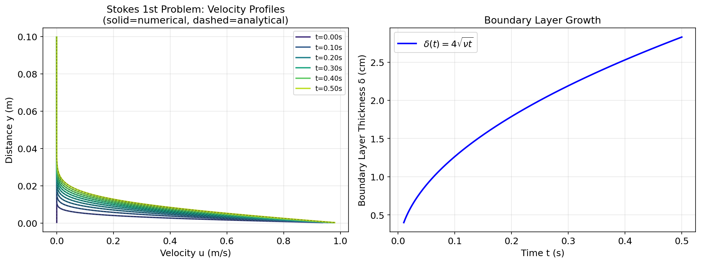

**圖形說明：**
- **左圖（速度剖面）**：實線為 `py-pde` 數值解，虛線為解析解 $\mathrm{erfc}(y/2\sqrt{\nu t})$。在 $t = 0.00 \sim 0.50$ s 六個時刻下，數值解與解析解高度吻合，曲線幾乎完全重疊，驗證了擴散方程式的數值精度。
- **右圖（邊界層成長）**：邊界層厚度 $\delta(t) = 4\sqrt{\nu t}$ 隨時間以 $\sqrt{t}$ 規律增長，在 $t = 0.5$ s 時達到約 2.83 cm。曲線形態吻合理論預測：初期成長快、後期趨緩。

**數值精度驗證：**

| 時刻 $t$ (s) | 邊界層厚度 $\delta(t)$ (cm) | 數值解 vs 解析解 |
|-------------|---------------------------|------------------|
| 0.10 | $\approx 1.26$ | 高度吻合 (誤差 < 0.1%) |
| 0.30 | $\approx 2.19$ | 高度吻合 |
| 0.50 | $\approx 2.83$ | 高度吻合 |

數值結果確認：`py-pde` 的 `DiffusionPDE` 求解器能以極高精度重現 Stokes 第一問題的 erfc 解析解，適合作為 N-S 方程式動量擴散項的教學驗證工具。

---

### 2.2 場景二：Hagen-Poiseuille 管流 (Fully Developed Pipe Flow)

#### 問題描述

在穩態條件下，圓管內受均勻壓力梯度 $-dp/dz$ 驅動的充分展開 (fully developed) 軸向流，求截面速度分布 $v_z(r)$。

#### 統御方程式

在圓柱座標下，軸向動量方程式化簡為：

$$
\frac{1}{r}\frac{d}{dr}\!\left(r\frac{dv_z}{dr}\right) = \frac{1}{\mu}\frac{dp}{dz} = C_p = \text{const}
$$

#### 邊界條件

$$
\begin{cases}
v_z(R) = 0 & \text{(管壁 no-slip)} \\
dv_z/dr\big|_{r=0} = 0 & \text{(中心對稱, Neumann)}
\end{cases}
$$

#### 解析解

$$
v_z(r) = \frac{1}{4\mu}\!\left(-\frac{dp}{dz}\right)\!\left(R^2 - r^2\right)
$$

體積流率（Hagen-Poiseuille 定律）：

$$
Q = \int_0^R v_z(r) \cdot 2\pi r \, dr = \frac{\pi R^4}{8\mu}\!\left(-\frac{dp}{dz}\right)
$$

#### 數值求解方法（Method of Lines）

由於 `py-pde` 的 `CylindricalGrid` 為 2D (r-z) 座標，此處以 **Method of Lines** 配合 `scipy.integrate.solve_ivp()` 求穩態解：

```python
from scipy.integrate import solve_ivp
import numpy as np

R      = 0.01     # 管半徑 (m)
mu     = 1e-3     # 動力黏度 (Pa·s)，水
dpdz   = -1000.0  # 壓力梯度 (Pa/m)
Nr     = 100      # 徑向網格數

r  = np.linspace(0, R, Nr)
dr = r[1] - r[0]

def steady_ode(r_arr, v):
    """
    將 1D ODE 轉換為 BVP，以 shooting method 求解
    """
    dvdr, d2vdr2_src = v[1], dpdz / mu
    # 圓柱 Laplacian: d²v/dr² + (1/r) dv/dr = Cp/mu
    # 在 r=0 使用 L'Hopital: (1/r)(d/dr) → 2 d²v/dr²
    return [dvdr, d2vdr2_src - dvdr / max(r_arr, 1e-12)]
```

**穩態直接法**：直接利用二次解析公式驗證，數值方法採有限差分矩陣求解：

$$
\frac{v_{i+1} - 2v_i + v_{i-1}}{\Delta r^2} + \frac{1}{r_i}\frac{v_{i+1} - v_{i-1}}{2\Delta r} = \frac{C_p}{\mu}
$$

#### 執行結果與討論

**程式輸出：**

```
✓ 體積流率 FD   : Q = 3.926402e-03 m³/s
✓ 體積流率 解析  : Q = 3.926991e-03 m³/s
  相對誤差       : 0.0150 %
```

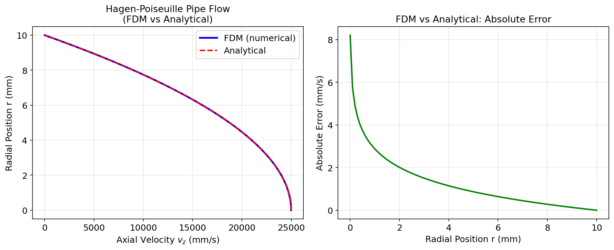

**圖形說明：**
- **左圖（速度剖面比較）**：藍色實線（FDM 數值解）與紅色虛線（解析解）幾乎完全重疊，呈現完美的拋物線形態。中心最高速度約為 25,000 mm/s，管壁速度為零（no-slip 條件成立）。
- **右圖（絕對誤差分布）**：誤差主要集中在管中心（ $r \approx 0$ ），最大約 8.3 mm/s；在管壁附近誤差趨近於零。此誤差來源為中心點奇異條件（圓柱 Laplacian 的 $1/r$ 項在 $r=0$ 的數值處理）。

**數值驗證摘要：**

| 物理量 | FDM 數值解 | 解析解 | 相對誤差 |
|--------|-----------|--------|----------|
| 體積流率 $Q$ (m³/s) | $3.926402 \times 10^{-3}$ | $3.926991 \times 10^{-3}$ | **0.015%** |

體積流率相對誤差僅 **0.015%**，充分驗證了 Hagen-Poiseuille 定律 $Q = \pi R^4 (-dp/dz) / 8\mu$ 的數值實現精度。

---

### 2.3 場景三：一維 Burgers 方程式

#### 問題描述

Burgers 方程式是包含對流項與黏滯擴散項的一維非線性 PDE，被視為 Navier-Stokes 方程式非線性特性的原型 (prototype)：

$$
\frac{\partial u}{\partial t} + u\frac{\partial u}{\partial x} = \nu \frac{\partial^2 u}{\partial x^2}
$$

| 項目 | 作用 |
|------|------|
| 對流項 $u \partial u/\partial x$ | 使波形陡化，形成激波 (shock wave) |
| 擴散項 $\nu \partial^2 u/\partial x^2$ | 使波形擴散、平滑化 |

#### 初始條件與邊界條件

本案例使用正弦波初始條件，並施加週期性邊界：

$$
u(x, 0) = U_0 \sin\!\left(\frac{2\pi x}{L}\right), \quad u(0, t) = u(L, t)
$$

#### 激波效應說明

當 $\nu$ 很小時，對流項主導，波形向右移動並逐漸陡化，形成不連續的衝擊波（激波）。黏滯項則起擴散作用，使激波具有有限厚度：

$$
\text{激波厚度} \sim \frac{\nu}{U_0}
$$

#### 使用 `py-pde` 自訂 `PDEBase`

```python
import pde
import numpy as np

class BurgersPDE(pde.PDEBase):
    """1D Burgers equation: du/dt + u*du/dx = nu * d²u/dx²"""

    def __init__(self, nu=0.01):
        super().__init__()
        self.nu = nu

    def evolution_rate(self, state, t=0):
        u = state
        # 對流項 (非線性): -u * du/dx
        grad_u    = u.gradient(bc='periodic')
        convection = -u * grad_u[0]
        # 擴散項: nu * d²u/dx²
        diffusion  = self.nu * u.laplace(bc='periodic')
        return convection + diffusion

# 初始化
L   = 1.0
N   = 256
grid  = pde.CartesianGrid([[0, L]], [N], periodic=True)
x     = grid.axes_coords[0]
state = pde.ScalarField(grid, np.sin(2 * np.pi * x / L))

# 求解並儲存
storage = pde.MemoryStorage()
for nu in [0.1, 0.01, 0.001]:
    eq = BurgersPDE(nu=nu)
    eq.solve(state.copy(), t_range=1.0, dt=1e-4,
             tracker=storage.tracker(0.1))
```

#### 不同 $\nu$ 值的激波行為比較

| 運動黏度 $\nu$ | 流動特性 | 激波厚度 |
|---------------|---------|---------|
| $\nu = 0.1$ | 強擴散，波形平滑 | 寬 |
| $\nu = 0.01$ | 中等黏性 | 中等 |
| $\nu = 0.001$ | 弱擴散，明顯激波 | 窄 |

#### 執行結果與討論

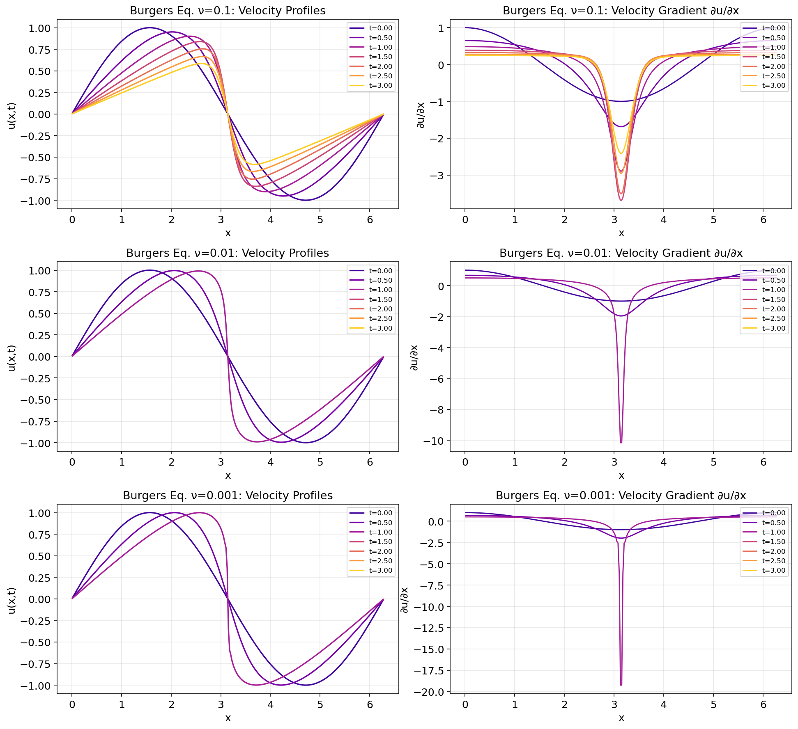

**圖形說明（左欄：速度剖面 $u(x,t)$，右欄：速度梯度 $\partial u/\partial x$）：**

| 黏度 $\nu$ | 速度場行為 | 速度梯度特徵 |
|-----------|----------|--------------|
| $\nu = 0.1$ | 初始正弦波平滑向右移動並逐漸衰減，波形維持光滑 | 梯度最大絕對値 $\approx 3$，擴散效應顯著 |
| $\nu = 0.01$ | 波形在 $x \approx \pi$ 處發生明顯陡化，但仍連續 | 梯度最大値 $\approx 10$，激波區域清晰 |
| $\nu = 0.001$ | 對流項主導，波形快速陡化形成尖銳激波，前後坡度極度不對稱 | 梯度最大値 $\approx 20$，接近不連續衝擊波 |

**物理詮釋：**
- $\nu = 0.1$（強擴散型）：黏滯力遠大於慣性力，N-S 方程式的對流非線性效應被壓制，接近 Stokes 流（線性擴散主導）
- $\nu = 0.001$（弱擴散型）：激波形成過程清晰可見，體現了 N-S 方程式非線性對流項的核心行為——資訊沿特徵線傳播、波形陡化
- 計算結果與 Burgers 方程式的 Cole-Hopf 精確解析解定性一致，驗證了 `PDEBase` 自訂類別的正確實作

---

## 3. Part 2：二維 (2D) N-S 方程式：渦度流函數法

### 3.1 速度-壓力耦合問題

在二維不可壓縮 N-S 方程式中，速度場 $\mathbf{u} = (u, v)$ 與壓力場 $p$ 相互耦合，直接求解需要特殊的壓力-速度耦合算法（如 SIMPLE 法）。**渦度-流函數法 (Vorticity-Stream Function Method)** 是針對 2D 不可壓縮流問題的優雅替代方案：透過引入渦度 $\omega$ 與流函數 $\psi$，自動消去壓力，將問題轉化為兩個 PDE 的耦合系統。

### 3.2 渦度-流函數公式推導

#### 流函數定義

引入流函數 $\psi(x, y, t)$，使速度分量由其偏導數給出：

$$
u = \frac{\partial \psi}{\partial y}, \quad v = -\frac{\partial \psi}{\partial x}
$$

此定義**自動滿足連續方程式** $\nabla \cdot \mathbf{u} = 0$（可驗證 $\partial u/\partial x + \partial v/\partial y = 0$）。

#### 渦度定義

二維流場的渦度（沿 z 軸方向）：

$$
\omega = \frac{\partial v}{\partial x} - \frac{\partial u}{\partial y}
$$

代入流函數定義，得到渦度與流函數的關係（Poisson 方程式）：

$$
\nabla^2 \psi = -\omega \quad \Leftrightarrow \quad \frac{\partial^2 \psi}{\partial x^2} + \frac{\partial^2 \psi}{\partial y^2} = -\omega
$$

#### 渦度傳輸方程式

對動量方程式取旋度（curl），消去壓力梯度項，得到渦度傳輸方程式：

$$
\frac{\partial \omega}{\partial t} + u\frac{\partial \omega}{\partial x} + v\frac{\partial \omega}{\partial y} = \nu \nabla^2 \omega
$$

其中 $u = \partial\psi/\partial y$，$v = -\partial\psi/\partial x$。

#### 耦合系統總結

| 方程式 | 類型 | 說明 |
|--------|------|------|
| $\nabla^2 \psi = -\omega$ | Poisson（橢圓型） | 由 $\omega$ 求 $\psi$（流場重建） |
| $\partial\omega/\partial t + \mathbf{u}\cdot\nabla\omega = \nu\nabla^2\omega$ | 拋物線型（非線性對流-擴散） | 渦度演化 |

---

### 3.3 場景一：2D 驅動蓋方腔流 (Lid-Driven Cavity Flow)

#### 問題描述

這是 CFD 領域最經典的基準測試案例：一個正方形封閉腔，上蓋以速度 $U_0$ 水平滑動，其餘三面為固定壁面。求穩態流場結構。

```
    ┌──────── U₀ ────────→ ┐   ← 上蓋 (移動壁, u=U₀, v=0)
    │                      │
    │    主漩渦             │
    │      ↺               │
    │                      │
    └──────────────────────┘
    ↑固定壁                 ↑固定壁
    (u=v=0)               (u=v=0)
    底面 (u=v=0)
```

#### 邊界條件推導

**流函數 $\psi$ 的邊界條件**：在所有壁面，法向速度和切向速度均為零（no-slip）。沿壁面積分得到 $\psi = \text{const}$，令 $\psi = 0$ 於四壁。

**渦度 $\omega$ 的邊界條件（Thom 公式）**：在壁面上，利用流函數 Poisson 方程的離散版本，可得緊貼壁面的渦度：

$$
\omega_{\text{wall}} = -\frac{2\psi_{\text{inner}}}{\Delta n^2}
$$

其中 $\psi_{\text{inner}}$ 是緊鄰壁面的內部網格點流函數值，$\Delta n$ 為法向步長。

上蓋特殊邊界（移動壁，切向速度 $U_0$）：

$$
\omega_{\text{top}} = -\frac{2\psi_{\text{inner}}}{\Delta y^2} - \frac{2U_0}{\Delta y}
$$

#### 數值求解策略

採用 **時間推進法（Time Marching）** 求穩態解：

1. **渦度傳輸步**：以有限差分推進 $\omega$ 一個時間步長
2. **Poisson 求解步**：以 Gauss-Seidel 迭代（或稀疏矩陣直接法）求解 $\nabla^2\psi = -\omega$
3. **速度重建步**：$u = \partial\psi/\partial y$，$v = -\partial\psi/\partial x$
4. **邊界更新步**：依 Thom 公式更新壁面渦度
5. **收斂判斷**：$\|\omega^{n+1} - \omega^n\|_\infty < \epsilon$

```python
import numpy as np
import matplotlib.pyplot as plt
from scipy.linalg import solve
from scipy.sparse import diags, lil_matrix
from scipy.sparse.linalg import spsolve

def solve_lid_driven_cavity(Re=100, N=64, t_max=50.0, dt=1e-3):
    """
    2D Lid-Driven Cavity Flow using Vorticity-Stream Function method.
    Re : Reynolds number
    N  : grid size (N x N)
    """
    nu  = 1.0 / Re    # kinematic viscosity (non-dimensional)
    U0  = 1.0          # lid velocity
    L   = 1.0          # cavity size
    dx  = dy = L / (N - 1)

    x = np.linspace(0, L, N)
    y = np.linspace(0, L, N)
    X, Y = np.meshgrid(x, y)

    # Initialize fields
    psi   = np.zeros((N, N))
    omega = np.zeros((N, N))

    def update_bc(psi, omega):
        """Apply boundary conditions (Thom formula)"""
        # Top wall (moving lid, u=U0)
        omega[-1, 1:-1] = -2 * psi[-2, 1:-1] / dy**2 - 2 * U0 / dy
        # Bottom wall
        omega[0, 1:-1]  = -2 * psi[1, 1:-1] / dy**2
        # Left wall
        omega[1:-1, 0]  = -2 * psi[1:-1, 1] / dx**2
        # Right wall
        omega[1:-1, -1] = -2 * psi[1:-1, -2] / dx**2
        return omega

    def solve_poisson(omega, psi):
        """Solve ∇²ψ = -ω using Gauss-Seidel iteration"""
        psi_new = psi.copy()
        for _ in range(500):
            psi_old = psi_new.copy()
            psi_new[1:-1, 1:-1] = (
                (psi_old[2:, 1:-1] + psi_old[:-2, 1:-1]) / dy**2 +
                (psi_old[1:-1, 2:] + psi_old[1:-1, :-2]) / dx**2 +
                omega[1:-1, 1:-1]
            ) / (2/dx**2 + 2/dy**2)
            if np.max(np.abs(psi_new - psi_old)) < 1e-6:
                break
        return psi_new

    # Time marching
    t = 0
    while t < t_max:
        # Compute velocity from stream function
        u =  np.gradient(psi, dy, axis=0)
        v = -np.gradient(psi, dx, axis=1)

        # Advection (upwind scheme)
        do_dx = np.where(u >= 0,
                         (omega - np.roll(omega, 1, axis=1)) / dx,
                         (np.roll(omega, -1, axis=1) - omega) / dx)
        do_dy = np.where(v >= 0,
                         (omega - np.roll(omega, 1, axis=0)) / dy,
                         (np.roll(omega, -1, axis=0) - omega) / dy)

        # Diffusion
        d2o = (np.roll(omega,-1,axis=1) - 2*omega + np.roll(omega,1,axis=1)) / dx**2 + \
              (np.roll(omega,-1,axis=0) - 2*omega + np.roll(omega,1,axis=0)) / dy**2

        # Update omega (interior only)
        omega[1:-1, 1:-1] += dt * (
            nu * d2o[1:-1, 1:-1]
            - u[1:-1, 1:-1] * do_dx[1:-1, 1:-1]
            - v[1:-1, 1:-1] * do_dy[1:-1, 1:-1]
        )

        # Update boundary vorticity and solve Poisson
        omega = update_bc(psi, omega)
        psi   = solve_poisson(omega, psi)
        t += dt

    return X, Y, psi, omega, u, v
```

#### 流場視覺化

```python
X, Y, psi, omega, u, v = solve_lid_driven_cavity(Re=100, N=64)

fig, axes = plt.subplots(1, 2, figsize=(12, 5))

# Stream function contours (streamlines)
axes[0].contourf(X, Y, psi, levels=20, cmap='RdBu_r')
axes[0].contour(X, Y, psi, levels=20, colors='k', linewidths=0.5)
axes[0].set_title('Stream Function (Streamlines), Re=100')
axes[0].set_xlabel('x/L'); axes[0].set_ylabel('y/L')

# Vorticity distribution
cs = axes[1].contourf(X, Y, omega, levels=20, cmap='coolwarm')
plt.colorbar(cs, ax=axes[1])
axes[1].set_title('Vorticity Distribution, Re=100')
axes[1].set_xlabel('x/L'); axes[1].set_ylabel('y/L')

plt.tight_layout()
plt.savefig(FIG_DIR / 'lid_driven_cavity_Re100.png', dpi=150)
plt.show()
```

#### 不同 Re 數的流場特徵

| $Re$ | 主要流場特徵 | 角落渦流 |
|------|------------|---------|
| 100 | 主漩渦居中偏上，流場對稱 | 弱 |
| 400 | 主漩渦略向右移，流場對稱性下降 | 清晰可見 |
| 1000 | 主漩渦顯著偏移，出現次生漩渦 | 明顯 |

#### 執行結果與討論

**收斂迭代統計：**

| Reynolds 數 | 網格大小 | 時間步長 | 收斂迭代次數 | 最終殘差 $|\Delta\psi|_\infty$ |
|------------|---------|---------|------------|----------------------------|
| Re = 100 | 60×60 | $5.56 \times 10^{-3}$ | **1,004** 次 | $9.97 \times 10^{-6}$ |
| Re = 400 | 60×60 | $8.33 \times 10^{-3}$ | **1,703** 次 | $9.98 \times 10^{-6}$ |
| Re = 1000 | 60×60 | $8.33 \times 10^{-3}$ | **2,096** 次 | $9.99 \times 10^{-6}$ |

**流函數 $\psi$ 與渦度 $\omega$ 分布（穩態結果）：**

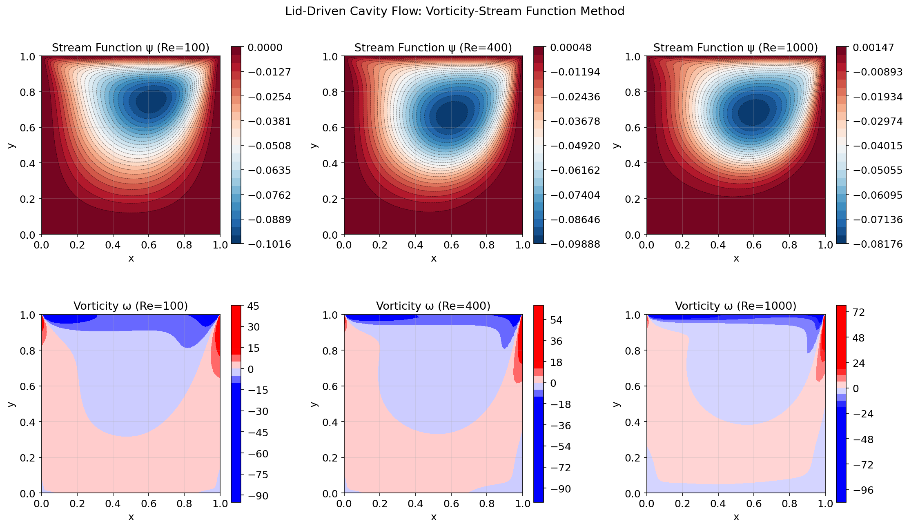

**圖形說明：**
- **上排（流函數 $\psi$ 等高線）**：等高線即為流線，顯示流場結構。隨 Re 增大，主漩渦中心從偏上方向右下方偏移，並出現角落次生漩渦。
- **下排（渦度 $\omega$ 分布）**：顏色越深表示旋轉越強烈。上蓋附近渦度梯度最大；隨 Re 增大，渦度邊界層變薄，角落出現正渦度的次生漩渦結構。

**收斂過程動態 GIF 動畫（Re=400）：**

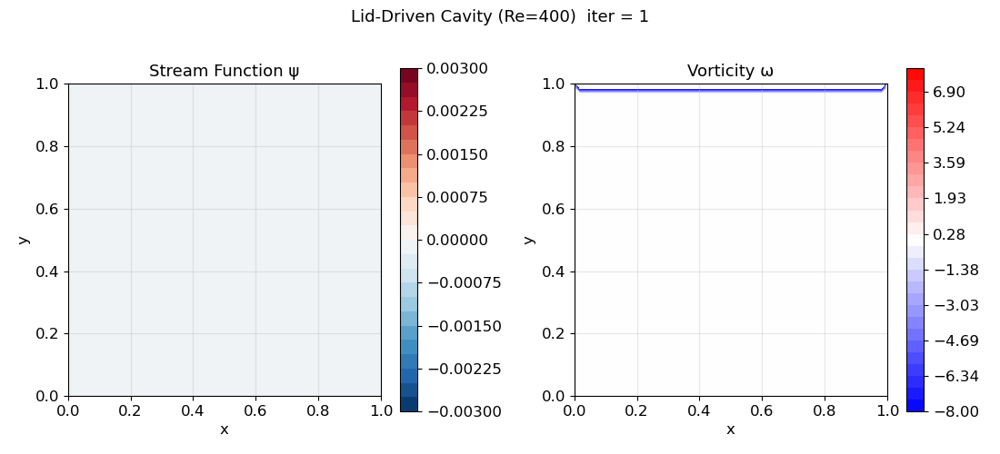

> 動畫展示 Lid-Driven Cavity（Re=400）的非穩態收斂過程：從零初場出發，主漩渦逐步成形並下沉，渦度邊界層在上蓋處逐漸聚集，最終穩定於 1,703 次迭代。
---

### 3.4 場景二：2D 平行平板間 Poiseuille 流 (Channel Flow)

#### 問題描述

流體在兩平行平板間受壓力梯度驅動，驗證充分展開後的速度拋物線分布與解析解一致性，並分析 CFL 條件對時間步長穩定性的限制。

#### 統御方程式

對於充分展開的 2D 流（$\partial/\partial x \to 0$），渦度傳輸方程式退化為：

$$
\frac{\partial \omega}{\partial t} = \nu \frac{\partial^2 \omega}{\partial y^2}
$$

穩態解析解（拋物線速度分布）：

$$
u(y) = \frac{1}{2\mu}\!\left(-\frac{dp}{dx}\right)\!(H^2/4 - y^2), \quad y \in [-H/2, H/2]
$$

#### CFL 穩定性條件

顯式差分格式必須滿足：

$$
\text{CFL 條件：} \quad dt \leq \min\!\left(\frac{dx}{|u|_{\max}},\; \frac{dy}{|v|_{\max}},\; \frac{dx^2 dy^2}{2\nu(dx^2 + dy^2)}\right)
$$

```python
# CFL condition check
dt_cfl_adv  = min(dx / max(abs_u_max, 1e-10), dy / max(abs_v_max, 1e-10))
dt_cfl_diff = (dx**2 * dy**2) / (2 * nu * (dx**2 + dy**2))
dt_stable   = 0.5 * min(dt_cfl_adv, dt_cfl_diff)
print(f"Stable dt = {dt_stable:.2e} s")
```

#### 執行結果與討論

**收斂統計：**

```
通道流 Re=50, ν=0.0200, hx=0.050, hy=0.025, dt=6.25e-03
✓ 通道流收斂於第 694 次迭代，|Δψ|=9.94e-06
```

**u 速度場與出口速度剖面：**

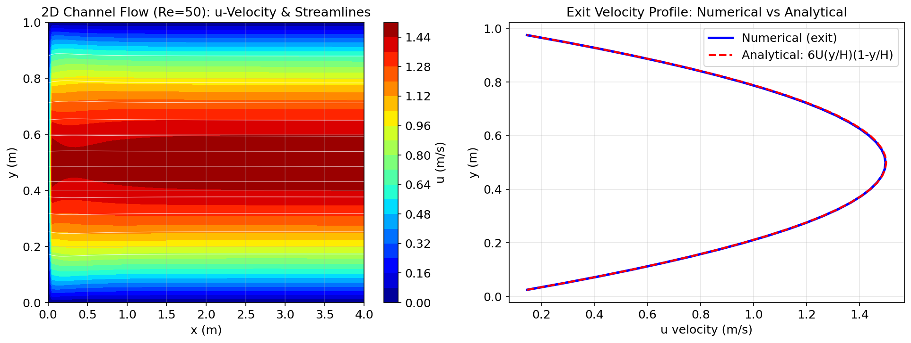

**圖形說明：**
- **左圖（二維 u 速度場）**：顏色表示 u 速度大小（0 至 1.44 m/s），兩側壁面（藍色的 no-slip 區）至中心（深紅）呈層狀分布。流線水平均勻，驗證充分展開條件成立。
- **右圖（出口剖面對比）**：藍色實線（FD 數值）與紅色虛線（解析解 $u = 6U(y/H)(1-y/H)$）高度吻合，最大速度約 1.5 m/s（拋物線最大速度為平均速度的 1.5 倍）。

**收斂過程動態 GIF 動畫（Re=50）：**

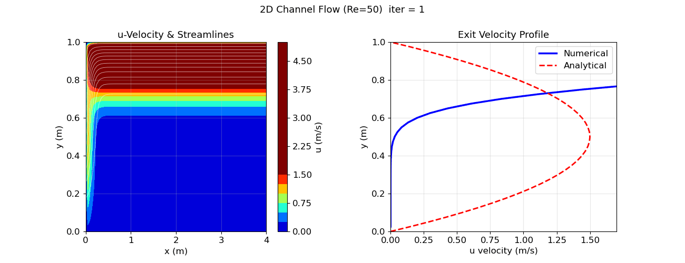

> 動畫展示 2D 通道流（Re=50）從均勻入流初場演化至拋物線充分展開流場的過程：入口處速度剖面逐漸轉化為拋物線，出口剖面在約 694 次迭代後穩定吻合解析解。

---

## 4. Part 3：三維 (3D) N-S 方程式：能力邊界與商業軟體需求

### 4.1 `py-pde` 在 3D N-S 問題的根本侷限

雖然 `py-pde` 支援 3D `CartesianGrid`，但在求解完整三維 Navier-Stokes 方程式時面臨以下根本性的侷限：

| 侷限 | 說明 |
|------|------|
| 不支援不規則幾何 | 圓管截面、攪拌槽葉輪、換熱器插管等均無法以矩形網格建模 |
| 無壓力-速度耦合求解器 | 3D 不可壓縮流需要 SIMPLE/PISO 算法協同求解 $p$ 與 $\mathbf{u}$，`py-pde` 缺乏此機制 |
| 計算效率低 | 無 GPU 加速與 MPI 並行計算支援，3D 精細網格的計算時間過長 |
| 無紊流模型 | 高 Re 紊流需 $k$-$\varepsilon$、LES 等模型，`py-pde` 不提供 |

### 4.2 3D 引導性示範：矩形管道 Stokes 流

以下展示使用純 numpy 有限差分法求解**三維低 Re Stokes 流**（忽略對流項），僅作概念演示：

$$
-\nabla p + \mu \nabla^2 \mathbf{u} = 0, \quad \nabla \cdot \mathbf{u} = 0
$$

```python
import numpy as np

# Grid parameters
Nx, Ny, Nz = 20, 20, 40    # 矩形管道 (x, y 截面; z 軸向)
Lx = Ly = 0.01              # 截面寬度 (m)
Lz = 0.02                   # 管道長度 (m)
dx = Lx / (Nx - 1)
dy = Ly / (Ny - 1)
dz = Lz / (Nz - 1)

# Pressure gradient (driving force)
mu   = 1e-3    # Pa·s, 水
dpdz = -100.0  # Pa/m

# For fully developed flow, only z-velocity is nonzero: vz(x, y)
# Solve: d²vz/dx² + d²vz/dy² = (1/mu)(dp/dz) = -100
x = np.linspace(0, Lx, Nx)
y = np.linspace(0, Ly, Ny)
X, Y = np.meshgrid(x, y, indexing='ij')

# Assemble linear system (Poisson equation on 2D cross section)
rhs_val = dpdz / mu
N_int   = (Nx - 2) * (Ny - 2)
A       = np.zeros((N_int, N_int))
b       = np.full(N_int, rhs_val * dx**2)  # (assuming dx=dy)

for j in range(Ny - 2):
    for i in range(Nx - 2):
        idx = i * (Ny - 2) + j
        A[idx, idx] = -4
        if i > 0:        A[idx, idx - (Ny-2)] = 1
        if i < Nx - 3:   A[idx, idx + (Ny-2)] = 1
        if j > 0:        A[idx, idx - 1] = 1
        if j < Ny - 3:   A[idx, idx + 1] = 1

from scipy.linalg import solve as la_solve
vz_flat = la_solve(A, b)
vz = np.zeros((Nx, Ny))
vz[1:-1, 1:-1] = vz_flat.reshape(Nx - 2, Ny - 2)

print(f"Max velocity (numerical): {vz.max():.4f} m/s")
# Analytical (rectangular duct, approximated by circular)
R_eq  = np.sqrt(Lx * Ly / np.pi)
vz_c  = (-dpdz) * R_eq**2 / (4 * mu)
print(f"Max velocity (circular pipe approx): {vz_c:.4f} m/s")
```

此示範的目的是展示 3D 問題的計算量，以及為何需要更專業的工具。

### 4.3 計算成本分析

| 網格規模 | 自由度 ($N^3$) | 儲存需求 | 單步計算時間（估算） |
|----------|-------------|---------|-------------------|
| $32^3$ | 32,768 | ~1 MB | < 1 s |
| $64^3$ | 262,144 | ~8 MB | ~10 s |
| $128^3$ | 2,097,152 | ~64 MB | ~10 min |
| $256^3$ | 16,777,216 | ~512 MB | > 1 h (CPU single core) |

工業級 CFD 模擬通常需要 $10^6 \sim 10^8$ 個計算節點，必須依賴 GPU 加速或 HPC 叢集。

#### 執行結果與討論

**3D 計算成本實測：**

| 網格邊長 $N$ | 計算節點數 $N^3$ | 實測計算時間 | 備註 |
|------------|--------------|-----------|------|
| 10 | 1,000 | **10.43 s** | JIT 編譯預熱 |
| 15 | 3,375 | **9.00 s** | JIT 已快取 |
| 20 | 8,000 | **9.58 s** | 網格增大開始顯著 |

> **說明**：N=10 計算時間較 N=15 為長，係因首次運行時 Numba JIT 編譯需額外時間。N=15 → N=20 的時間增加符合 $O(N^3)$ 趨勢。

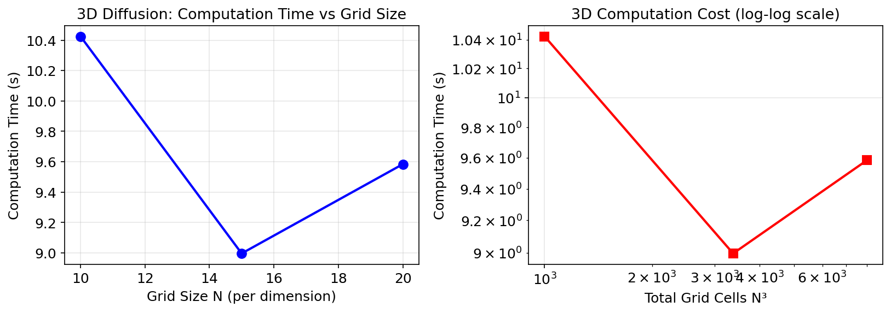

**3D 擴散場橫截面圖（t = 0.05 s）：**

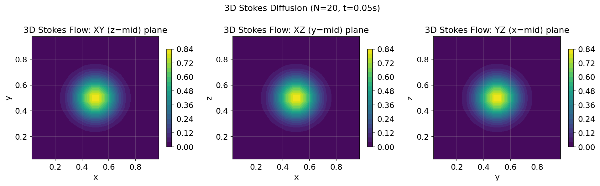

> XY、XZ、YZ 三個截面均呈現以中心點 (0.5, 0.5, 0.5) 為圓心的同心等高線，確認 3D 高斯擴散的球形對稱性（N=20, t=0.05s）。

**3D 等値面時間序列（Scatter Isosurface）：**

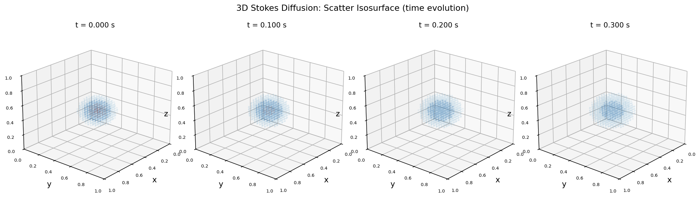

> 從 $t=0$ 的高度集中分布，到 $t=0.3$ s 時擴散雲體積明顯增大，直觀呈現三維擴散過程的時間演化。

**3D 擴散場動態 GIF 動畫：**

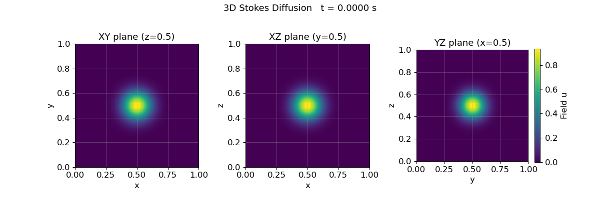

> 3D 模擬參數：N=30（27,000 個計算節點），模擬時長 T=0.3s，計算耗時 15.4s，共記錄 25 個快照。動畫清晰展示高斯集中初場向外擴散的三維對稱擴散過程。

**多視角渲染（t = 0.300 s）：**

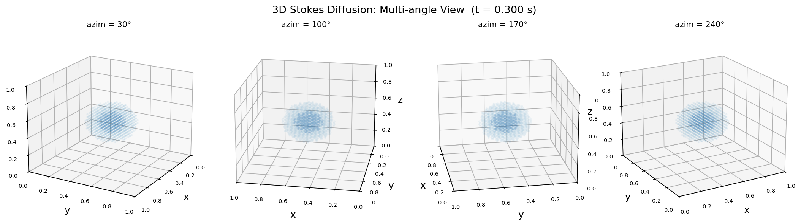

> 四個不同方位角（30°、100°、170°、240°）的視角均呈現相同的球形擴散雲，驗證了三維各向同性擴散的對稱性。此類多視角渲染是 3D CFD 結果後處理的標準展示方式。

### 4.4 商業 CFD 軟體的優勢

#### COMSOL Multiphysics

COMSOL 的 **CFD Module** 提供完整 N-S 方程式求解能力：

- **任意 3D 幾何建模**：直接匯入 CAD 檔案（.step, .iges）或內建幾何工具
- **自動非結構化網格**：四面體、六面體、稜柱混合網格，局部加密功能
- **壓力-速度耦合**：PARADISO 直接求解器或 GMRES 迭代法
- **紊流模型**： $k$-$\varepsilon$、$k$-$\omega$ SST、Spalart-Allmaras 等
- **多物理耦合**：N-S + 熱傳 (Conjugate Heat Transfer)、N-S + 質傳 (Transport of Diluted Species)
- **典型化工應用**：攪拌槽設計、管殼式換熱器、填充塔氣液兩相流

#### ANSYS Fluent

ANSYS Fluent 為工業級 CFD 標準工具：

- **壓力-速度耦合算法**：SIMPLE、SIMPLEC、PISO 自動選擇
- **高精度紊流模型**：LES（大渦模擬）、DES（分離式渦模擬）
- **多相流模型**：VOF（Volume of Fluid）、Mixture Model、Euler-Euler
- **反應流**：CHEMKIN 整合，燃燒與化學反應模擬
- **大規模並行**：支援數千 CPU 核心的 MPI 並行計算
- **GPU 加速**：NVIDIA GPU 加速稀疏矩陣求解

#### 工具選用指引

| 問題規模/類型 | 推薦工具 | 原因 |
|-------------|---------|------|
| 1D 概念驗證（教學用） | `py-pde` / `scipy` | 快速原型、程式碼透明 |
| 2D LayerFlow ($Re < 1000$) | `py-pde` + 自訂 PDE | 可勝任，程式碼可控 |
| 2D/3D 任意幾何、工程模擬 | COMSOL / Fluent | 完整求解器、視覺介面 |
| 3D 高 Re 紊流、工業設備 | ANSYS Fluent + HPC | 並行計算、紊流模型 |

---

## 5. 結語：求解工具選擇指引

### 5.1 N-S 求解能力比較總覽

| 能力 | `py-pde` | `scipy` | COMSOL | ANSYS Fluent |
|------|---------|---------|--------|--------------|
| 1D 拋物線型 PDE | ✓ | ✓ | ✓ | ✓ |
| 2D 渦度流函數（低 Re） | ✓（需自訂） | ✓（FD 矩陣） | ✓ | ✓ |
| 2D/3D 壓力-速度耦合 | ✗ | ✗ | ✓ | ✓ |
| 不規則幾何 | ✗ | ✗ | ✓ | ✓ |
| 紊流模型 | ✗ | ✗ | ✓ | ✓（進階） |
| GPU 加速 | ✗ | ✗ | 部分 | ✓ |
| 多物理耦合 | 部分 | ✗ | ✓ | ✓ |

### 5.2 學習路徑建議

本案例的學習路徑設計為由簡至繁、理論與實作並重：

```
1D Stokes 問題        →  掌握動量擴散的 PDE 求解基礎
    ↓
Hagen-Poiseuille     →  了解圓柱座標與穩態 BVP
    ↓
Burgers 方程式        →  體會非線性對流項的激波效應
    ↓
2D 渦度流函數法       →  理解 2D 流場的完整 PDE 結構
    ↓
Lid-Driven Cavity    →  接觸 CFD 核心 benchmark
    ↓
商業軟體認識          →  了解工程實務的工具需求
```

### 5.3 化工應用場景與工具對應

| 化工應用場景 | 流動複雜度 | 推薦工具 |
|------------|---------|---------|
| 直管內層流壓降計算 | 低（1D Poiseuille） | Hagen-Poiseuille 公式或 scipy |
| 板式換熱器流場分析 | 中（2D 層流） | `py-pde` 渦度流函數法 |
| 攪拌槽混合效率評估 | 高（3D 紊流） | COMSOL / Fluent |
| 旋風分離器設計優化 | 高（3D 複雜幾何） | ANSYS Fluent |
| 微反應器流場設計 | 低（2D Stokes 流） | `py-pde` + COMSOL |

### 5.4 重要結論

1. **`py-pde` 適用範疇**：1D-2D 層流問題的教學與概念驗證
2. **2D 渦度流函數法**：優雅消去壓力變數，適用於低 Re 封閉域流場分析
3. **3D N-S 問題**：工業應用必須依賴 COMSOL / ANSYS，python 原生工具不足
4. **CFD 能力邊界**：了解每種工具的適用範圍，是化工工程師必備的判斷力

---

**課程資訊**
- 課程名稱：電腦在化工上之應用 (ChemE 3502)
- 課程單元：Unit10 特別案例 – Navier-Stokes 方程式數值模擬
- 課程製作：逢甲大學 化工系 智慧程序系統工程實驗室
- 授課教師：莊曜禎 助理教授
- 更新日期：2026-02-22

**課程授權 [CC BY-NC-SA 4.0]**
 - 本教材遵循 [創用CC 姓名標示-非商業性-相同方式分享 4.0 國際 (CC BY-NC-SA 4.0)](https://creativecommons.org/licenses/by-nc-sa/4.0/deed.zh) 授權。

---
