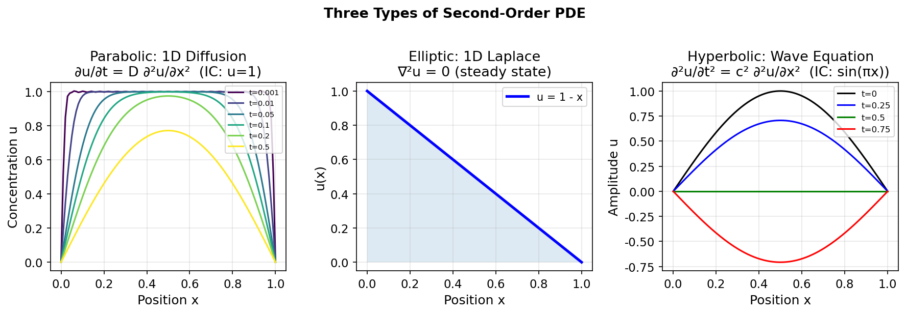
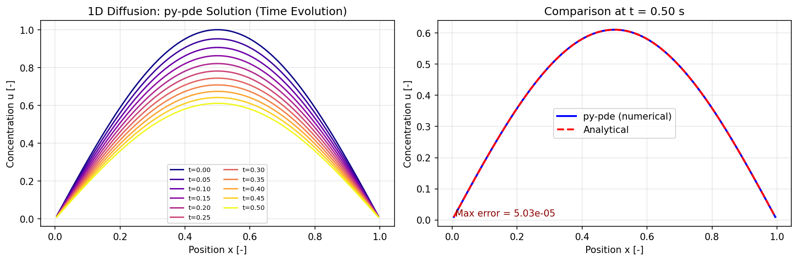
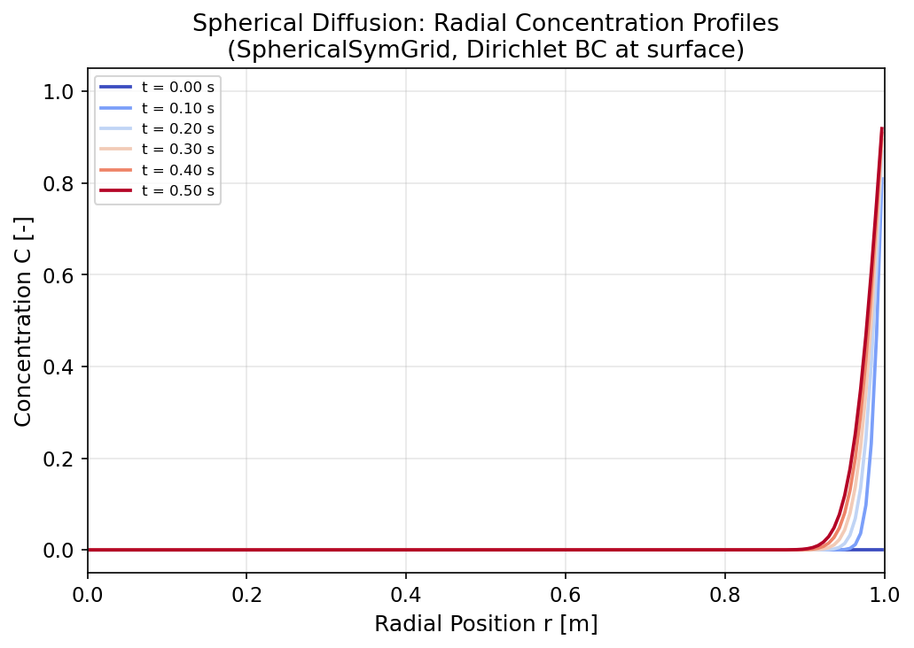
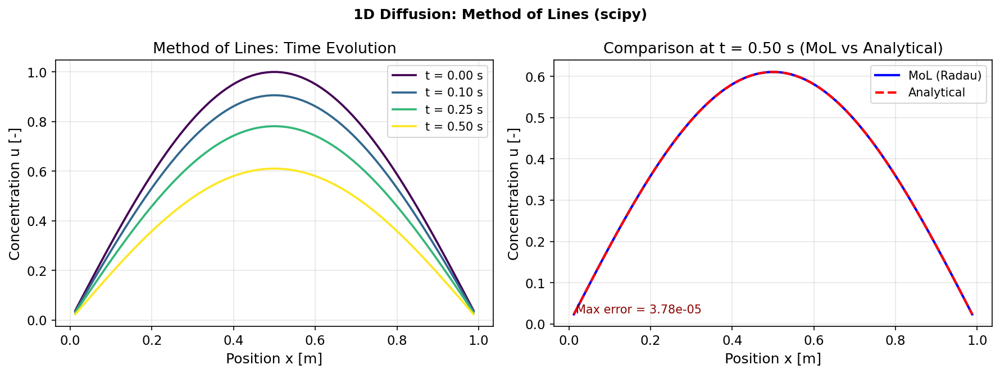
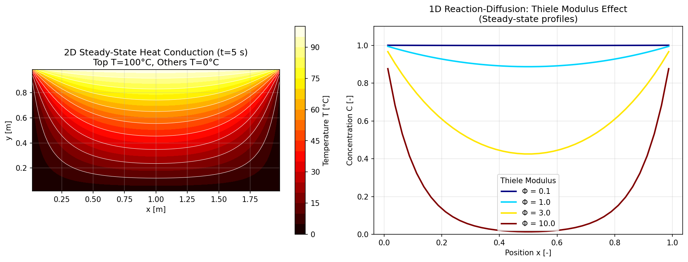
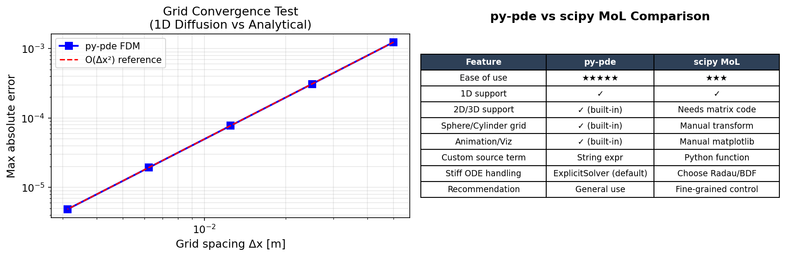

# Unit10 偏微分方程式 (PDE) 之求解

## 學習目標

完成本單元後，學生應能：

1. 識別並分類化工問題中的拋物線型、橢圓型與雙曲線型偏微分方程式
2. 正確設定 Dirichlet、Neumann 與 Robin 邊界條件
3. 使用 `py-pde` 套件的 `CartesianGrid`、`CylindricalGrid`、`SphericalGrid` 建立求解域
4. 以 `py-pde` 的 `DiffusionPDE` 與 `PDEBase` 求解標準及自訂 PDE 問題
5. 應用線法 (Method of Lines, MoL) 結合 `scipy.integrate.solve_ivp()` 求解拋物線型 PDE
6. 評估 Python 工具對化工 PDE 問題的適用範圍，並了解何時需轉用 COMSOL 或 ANSYS

---

## 目錄

1. [偏微分方程式基礎理論](#1-偏微分方程式基礎理論)
2. [邊界條件與初始條件](#2-邊界條件與初始條件)
3. [Python PDE 求解工具概覽](#3-python-pde-求解工具概覽)
4. [py-pde 核心物件與 API](#4-py-pde-核心物件與-api)
5. [線法 (Method of Lines)](#5-線法-method-of-lines)
6. [化工 PDE 問題類型](#6-化工-pde-問題類型)
7. [商業軟體比較](#7-商業軟體比較)
8. [程式設計最佳實踐](#8-程式設計最佳實踐)

---

## 1. 偏微分方程式基礎理論

### 1.1 PDE 的定義

偏微分方程式 (Partial Differential Equation; PDE) 是含有**兩個以上自變數**（如時間 $t$ 和空間 $x$）的微分方程式，其中未知函數的偏導數出現在方程式中。一般二階線性 PDE 的通用形式：

$$
A\frac{\partial^2 u}{\partial x^2} + B\frac{\partial^2 u}{\partial x \partial y} + C\frac{\partial^2 u}{\partial y^2} + D\frac{\partial u}{\partial x} + E\frac{\partial u}{\partial y} + Fu = G
$$

其中 $A, B, C, D, E, F, G$ 為係數（可為常數或 $x, y$ 的函數）。

### 1.2 PDE 分類：判別式法

利用判別式 $\Delta = B^2 - 4AC$ 進行分類：

| 條件 | 類型 | 典型方程式 | 化工應用 |
|------|------|-----------|---------|
| $\Delta < 0$ | **橢圓型** (Elliptic) | $\nabla^2 u = 0$（Laplace 方程） | 穩態熱傳、穩態擴散 |
| $\Delta = 0$ | **拋物線型** (Parabolic) | $\frac{\partial u}{\partial t} = \alpha \nabla^2 u$（擴散方程） | 非穩態熱傳、非穩態質傳 |
| $\Delta > 0$ | **雙曲線型** (Hyperbolic) | $\frac{\partial^2 u}{\partial t^2} = c^2 \nabla^2 u$（波動方程） | 壓力波、衝擊波傳遞 |

### 1.3 化工常見 PDE 形式

**通用輸送方程式 (General Transport Equation)**：

$$
\underbrace{\frac{\partial (\rho \phi)}{\partial t}}_{\text{暫態項}} + \underbrace{\nabla \cdot (\rho \mathbf{v} \phi)}_{\text{對流項}} = \underbrace{\nabla \cdot (\Gamma \nabla \phi)}_{\text{擴散項}} + \underbrace{S_\phi}_{\text{源項}}
$$

其中 $\phi$ 為任一守恆量（溫度、濃度、速度分量），$\Gamma$ 為擴散係數，$S_\phi$ 為源項（反應速率、熱源）。

| 輸送現象 | $\phi$ | $\Gamma$ | 方程式名稱 |
|---------|--------|----------|-----------|
| 熱傳 | $T$ | $k / (\rho c_p)$ = 熱擴散率 $\alpha$ | 熱傳方程式 |
| 質傳 | $C$ | 擴散係數 $D$ | 費克擴散方程式 |
| 動量傳遞 | $u$ | 運動黏度 $\nu$ | 納維−斯托克司方程式 |

**三大輸送方程式：**

**(1) 熱傳方程式 (Heat Equation)**：

$$
\rho c_p \frac{\partial T}{\partial t} = k \nabla^2 T + \dot{q}
$$

- 拋物線型（非穩態）；若 $\partial T/\partial t = 0$ 退化為橢圓型（Poisson/Laplace）

**(2) 擴散方程式 (Diffusion Equation / Fick's Second Law)**：

$$
\frac{\partial C}{\partial t} = D \nabla^2 C + R_C
$$

- $R_C$ 為反應源項（一階反應時 $R_C = -kC$）

**(3) Navier-Stokes 方程式 (動量守恆)**，不可壓縮流：

$$
\rho \left(\frac{\partial \mathbf{u}}{\partial t} + \mathbf{u} \cdot \nabla \mathbf{u}\right) = -\nabla p + \mu \nabla^2 \mathbf{u} + \rho \mathbf{g}
$$

$$
\nabla \cdot \mathbf{u} = 0 \quad (\text{連續方程式})
$$

### 1.4 範例演練：PDE 三種類型視覺化

下圖以解析解（或數值近似）呈現三類 PDE 的時間演化行為，有助於直觀理解各類型方程式的本質差異。



**圖 1-1　三種二階 PDE 的解行為比較**

**(a) 拋物線型（左圖）— 1D 擴散方程** $\partial u/\partial t = D\partial^2 u/\partial x^2$

- 初始條件：$u(x,0)$ 為方波的 Fourier 展開（取前 50 奇數項正弦波）；邊界條件：$u(0,t) = u(1,t) = 0$
- 從 $t=0.001$ 至 $t=0.5$ 六條曲線由上而下，高頻分量因 $e^{-(n\pi)^2 Dt}$ 快速消失，波形逐漸展平
- 典型**耗散行為**：積分（能量）隨時間嚴格遞減，最終趨近零

**(b) 橢圓型（中圖）— 1D Laplace 方程** $\nabla^2 u = 0$

- 穩態解（無時間變數），BC：$u(0) = 1$ 、 $u(1) = 0$
- 唯一解 $u = 1-x$（藍色線性分布），反映兩端 Dirichlet BC 之間的最光滑分布
- 橢圓型 PDE 無時間演化，直接給出**全域最小能量**（最光滑）分布

**(c) 雙曲線型（右圖）— 波動方程** $\partial^2 u/\partial t^2 = c^2 \partial^2 u/\partial x^2$

- 解為左右行波疊加： $u = \frac{1}{2}[\sin\pi(x-ct) + \sin\pi(x+ct)]$ ，$c=1$
- 四條曲線（$t=0, 0.25, 0.5, 0.75$）波形持續傳遞且**不衰減**（保守系統）
- $t=0.5$ 時兩行波在邊界反射造成相消（綠線 $u\approx 0$），$t=0.75$ 時再現（紅線）
- 與拋物線型最大差異：**能量守恆，無耗散效應**

---

## 2. 邊界條件與初始條件

### 2.1 邊界條件類型

PDE 的求解需要在求解域邊界 $\partial\Omega$ 上指定邊界條件 (BC)。

#### (1) 第一類邊界條件：Dirichlet BC

直接指定**函數值**在邊界上的數值：

$$
u(\mathbf{x}, t) = u_{\text{BC}}, \quad \mathbf{x} \in \partial\Omega
$$

**化工範例**：板材表面溫度固定（恆溫壁）、容器壁面濃度固定（溶解平衡）

```python
# py-pde Dirichlet 邊界條件設定
grid = pde.CartesianGrid([[0, 1]], 50)
bc = {"x": {"value": 1.0}}  # u(0,t) = u(1,t) = 1.0
```

#### (2) 第二類邊界條件：Neumann BC

指定函數的**法向導數**（通量）在邊界上的數值：

$$
\frac{\partial u}{\partial n}\bigg|_{\partial\Omega} = q_{\text{BC}}
$$

- 當 $q_{\text{BC}} = 0$ 時為**絕熱壁**（熱傳）或**不滲透壁**（質傳）

```python
# py-pde Neumann 邊界條件（絕熱/不滲透）
bc = {"x": {"derivative": 0}}  # ∂u/∂n = 0
```

#### (3) 第三類邊界條件：Robin BC（混合 BC）

線性組合函數值與其導數：

$$
a \cdot u + b \cdot \frac{\partial u}{\partial n} = c, \quad \mathbf{x} \in \partial\Omega
$$

**化工範例**：牛頓冷卻定律（對流換熱）

$$
-k \frac{\partial T}{\partial n} = h(T - T_\infty) \quad \Rightarrow \quad \frac{\partial T}{\partial n} + \frac{h}{k}T = \frac{h}{k}T_\infty
$$

```python
# py-pde Robin 邊界條件（對流換熱）
# -k dT/dn = h*(T - T_inf)
bc_right = {"derivative": "h/k * (value - T_inf)"}
```

### 2.2 對稱性邊界條件

在球座標或圓柱座標的**中心點**（ $r = 0$ ），物理對稱要求：

$$
\frac{\partial u}{\partial r}\bigg|_{r=0} = 0
$$

`py-pde` 的 `SphericalGrid` 和 `CylindricalGrid` 會自動在 $r=0$ 處設定此條件。

### 2.3 初始條件

拋物線型（時間相關）PDE 還需指定 **$t = 0$ 時的初始分布**：

$$
u(\mathbf{x}, 0) = u_0(\mathbf{x}), \quad \mathbf{x} \in \Omega
$$

```python
# py-pde 初始條件設定
state = pde.ScalarField.from_expression(grid, "1 - x")   # 線性分布
state = pde.ScalarField(grid, data=0.0)                   # 均勻初始值
state = pde.ScalarField.random_uniform(grid, 0.45, 0.55)  # 隨機初始值
```

### 2.4 問題適定性

| 類型 | 必要條件 |
|------|---------|
| 橢圓型（穩態） | 邊界上各面均需有 BC（Dirichlet 或 Neumann） |
| 拋物線型（非穩態） | 全域初始條件 + 邊界上各面之 BC |
| 雙曲線型 | 初始條件（$u$ 及 $\partial u/\partial t$）+ 邊界條件 |

---

## 3. Python PDE 求解工具概覽

### 3.1 工具比較

| 工具 | 主要方法 | 適用問題 | 優點 | 限制 |
|------|---------|---------|------|------|
| **`py-pde`** | 有限差分法 (FDM) | 結構化網格、標準幾何 | API 簡潔、動畫方便 | 限矩形/圓柱/球形網格 |
| **`scipy` MoL** | 線法 + ODE 求解器 | 1D/2D 拋物線型 | 彈性高、控制細膩 | 需手動建立差分矩陣 |
| **FEniCS/Firedrake** | 有限元素法 (FEM) | 複雜幾何、任意邊界 | 正規化、工業強度 | 學習曲線較陡 |
| **COMSOL Multiphysics** | FEM（商業） | 任意幾何、多物理耦合 | GUI 友好、多物理 | 商業授權、費用高 |
| **ANSYS Fluent** | FVM + FEM（商業） | 複雜流場 CFD | 工業標準 CFD | 商業授權、費用高 |

### 3.2 本單元工具選擇策略

```
問題判斷流程：
┌─────────────────────────────┐
│  幾何形狀是否為矩形/圓柱/球形？  │
└─────────────────────────────┘
       ↓ 是                   ↓ 否
┌──────────────┐    ┌─────────────────┐
│ 使用 py-pde  │    │ 考慮 FEniCS 或  │
│（首選工具）   │    │ COMSOL/ANSYS   │
└──────────────┘    └─────────────────┘
       ↓ 需精細控制？
┌──────────────────────┐
│ 使用 scipy MoL（次選）│
└──────────────────────┘
```

**選用 `py-pde` 的情境**：
- 標準幾何（板材、圓柱、球體）的熱傳、質傳模擬
- 需要動畫視覺化輸出
- 快速原型驗證物理模型

**選用 `scipy` MoL 的情境**：
- 需要與現有 Python 程式碼整合
- 需要精細控制時間步長與誤差容忍度
- 問題含有複雜非線性源項

### 3.3 範例演練：py-pde 一維擴散 Hello World

以具有精確解析解的一維擴散問題驗證 `py-pde` 的求解精度。

**問題設定**：

$$
\frac{\partial u}{\partial t} = D \frac{\partial^2 u}{\partial x^2}, \quad D=0.1,\; 0\le x\le 1,\; 0\le t\le 0.5
$$

- 初始條件：$u(x,0) = \sin(\pi x)$
- 邊界條件：$u(0,t) = u(1,t) = 0$（Dirichlet）
- 解析解：$u(x,t) = \sin(\pi x) \cdot e^{-\pi^2 D t}$



**圖 3-1　py-pde 一維擴散模擬結果**

**左圖 — 時間演化曲線（11 個快照，$t = 0.00\sim 0.50$ s）**：

- 初始正弦波振幅以 $e^{-\pi^2 Dt}$ 衰減：$e^{-\pi^2 \times 0.1 \times 0.5} \approx 0.609$，與圖中最終振幅（$\approx 0.61$）完全吻合
- 波形始終維持 $\sin(\pi x)$ 形狀（同一本徵函數，Dirichlet BC），無相位偏移
- `storage.tracker(0.05)` 每 0.05 s 收集一個快照，共 11 條曲線

**右圖 — 數值 vs 解析解（ $t=0.5$ s）**：

| 項目 | 數值 |
|------|------|
| 最大絕對誤差 | $5.03 \times 10^{-5}$ |
| 網格點數 | $N=100$，$\Delta x=0.01$ m |
| 時間步長 | $dt = 10^{-4}$ s |
| 求解器 | 顯式 Euler（py-pde 預設） |

數值解（藍線）與解析解（紅虛線）完全重疊，最大誤差 $5.0 \times 10^{-5}$，確認中心差分的**二階空間精度**在此問題中表現良好。

---

## 4. py-pde 核心物件與 API

### 4.1 求解域：Grid 物件

`py-pde` 提供三種主要網格類型，對應不同座標系統：

#### (1) CartesianGrid — 直角座標

```python
import pde

# 1D: 0 ≤ x ≤ 1, 50 格
grid_1d = pde.CartesianGrid([[0, 1]], 50)

# 2D: 0 ≤ x ≤ 2, 0 ≤ y ≤ 1, 各 40×20 格
grid_2d = pde.CartesianGrid([[0, 2], [0, 1]], [40, 20])

# 3D: 單位正方體, 各軸 20 格
grid_3d = pde.CartesianGrid([[0, 1], [0, 1], [0, 1]], 20)
```

#### (2) SphericalGrid — 球座標（只需 r 方向）

```python
# 0 ≤ r ≤ R, 100 格（自動設定 r=0 對稱 BC）
grid_sphere = pde.SphericalGrid(radius=R, shape=100)
```

#### (3) CylindricalGrid — 圓柱座標（r–z 平面）

```python
# 0 ≤ r ≤ R, 0 ≤ z ≤ L, (nr=40, nz=60)
grid_cyl = pde.CylindricalGrid(radius=R, bounds=[0, L], shape=[40, 60])
```

### 4.2 場變數：Field 物件

| 物件 | 說明 | 典型用途 |
|------|------|---------|
| `ScalarField` | 純量場（單一值） | 溫度 $T$、濃度 $C$ |
| `VectorField` | 向量場（各方向分量） | 速度 $\mathbf{u}$、通量 $\mathbf{J}$ |
| `Tensor2Field` | 二階張量場 | 應力張量 |

```python
# 建立純量場（溫度場，初始值為 0）
T = pde.ScalarField(grid, data=0.0)

# 從數學表達式建立初始場
C = pde.ScalarField.from_expression(grid, "1 - x")

# 建立均勻值為 100 的溫度場
T_hot = pde.ScalarField(grid, data=100.0)

# 隨機初始場（Gray-Scott 等反應-擴散系統使用）
noise = pde.ScalarField.random_uniform(grid, 0.45, 0.55)
```

### 4.3 PDE 定義方式

#### (1) 使用內建 PDE 類別

`py-pde` 提供常用 PDE 的內建類別：

```python
# 擴散/熱傳方程式：∂u/∂t = D * ∇²u
eq = pde.DiffusionPDE(diffusivity=D)

# 波動方程式：∂²u/∂t² = c² * ∇²u
eq = pde.WavePDE(speed=c)
```

#### (2) 使用 PDE 類別（字串表達式）

```python
# 定義自訂 PDE（支援 py-pde 的數學語法）
# ∂C/∂t = D * ∇²C - k * C（一階反應）
eq = pde.PDE({"C": f"D * laplace(C) - k * C"},
             consts={"D": 1e-9, "k": 0.5})
```

#### (3) 繼承 PDEBase（最彈性）

```python
from pde import PDEBase, ScalarField

class ReactionDiffusionPDE(PDEBase):
    def __init__(self, D=1.0, k=0.5):
        self.D = D
        self.k = k

    def evolution_rate(self, state, t=0):
        """計算 ∂C/∂t = D*∇²C - k*C"""
        C = state
        laplacian = C.laplace(bc=self.bc)
        return self.D * laplacian - self.k * C
```

### 4.4 求解器 (Solver) 與追蹤器 (Tracker)

#### 求解流程

```python
import pde
import numpy as np

# 1. 建立網格
grid = pde.CartesianGrid([[0, 1]], 100)

# 2. 設定初始條件
state = pde.ScalarField.from_expression(grid, "sin(pi * x)")

# 3. 定義 PDE 與邊界條件
D = 1e-4
eq = pde.DiffusionPDE(diffusivity=D, bc={"x": "value"})  # Dirichlet: u=0

# 4. 執行求解
result = eq.solve(state, t_range=1.0, dt=1e-4)
```

#### 使用 Tracker 收集中間結果

```python
# 每 0.1 秒儲存一次快照
storage = pde.MemoryStorage()

result = eq.solve(state, t_range=1.0, dt=1e-4, tracker=[storage.tracker(0.1)])

# 後處理中間結果
for t, field in storage.items():
    print(f"t={t:.2f}: max={field.data.max():.4f}")
```

#### 動畫輸出

```python
# 儲存為 GIF 動畫（不阻斷 Jupyter 執行）
storage = pde.MemoryStorage()
eq.solve(state, t_range=1.0,
         tracker=[storage.tracker(0.05)])

# 建立動畫
anim = storage.plot_movie("output.gif", title="Diffusion Animation")
```

### 4.5 邊界條件設定語法

`py-pde` 的邊界條件以 Python 字典指定：

```python
# Dirichlet：指定數值
bc_dir = {"x": {"value": 0.0}}               # x 兩端均為 0
bc_dir = {"left": {"value": 100.0},           # 左端=100, 右端=0
           "right": {"value": 0.0}}

# Neumann：指定導數
bc_neu = {"x": {"derivative": 0.0}}           # 兩端通量為 0（絕熱）
bc_neu = {"left": {"derivative": -10.0},      # 熱通量注入
           "right": {"value": 0.0}}           # 右端溫度為 0

# 週期邊界
bc_per = {"x": "periodic"}
```

### 4.6 範例演練：Grid 物件與球形擴散

#### 4.6.1 Grid 物件建立與 ScalarField 操作輸出

```text
======================================================
py-pde Grid Objects
======================================================
[CartesianGrid 1D]   shape=(50,),   dx=0.0200
[CartesianGrid 2D]   shape=(40, 20)
[CartesianGrid 3D]   shape=(10, 10, 10)
[SphericalSymGrid]   shape=(100,),  r_max=0.995
[CylindricalSymGrid] shape=(20, 30)

ScalarField Operations
-------------------------------------------------------
  f = sin(x):  max=1.0000, integral=2.0001
  nabla^2 sin(x) = -sin(x): min=-1.0000  (expected ~ -1.0 at x=pi/2)

PDE Definition Styles
-------------------------------------------------------
  DiffusionPDE: d_t c = 0.1 * laplace(c)
  PDE (string):  d_t C = 0.1 * Delta(C) - 0.5 * C
```

**數示說明**：

- `CartesianGrid` 支援 1D/2D/3D，格點間距由空間範圍與格點數決定：$\Delta x = L/N$
- `SphericalSymGrid(radius=1, shape=100)` 最外徑 `r_max=0.995`，內建 $r=0$ 對稱 BC
- `f.integral` 算出 $\int_0^\pi \sin(x)\,dx = 2.0001$，誤差 $5\times10^{-5}$，確認數值積分精度
- $\nabla^2 \sin(x) = -\sin(x)$，最小值 $-1.0000$（發生在 $x=\pi/2$），與解析結果完全吻合
- `PDE` 字串表達式支援 `laplace()`、`divergence()`、`gradient()` 等進階算子

#### 4.6.2 球坐標擴散：SphericalSymGrid 示範

**問題設定**：球形類粒（$R=1$ m）的擴散滲透問題

$$
\frac{\partial C}{\partial t} = D \nabla^2 C = D \left(\frac{\partial^2 C}{\partial r^2} + \frac{2}{r}\frac{\partial C}{\partial r}\right), \quad D = 10^{-3}\ \mathrm{m^2/s}
$$

- 初始條件：$C(r,0) = 0$（球內為空）
- 邊界條件：$C(R,t) = 1$（表面 Dirichlet）；$r=0$ 對稱 BC 由 `SphericalSymGrid` 自動處理



**圖 4-2　球形類粒的徑向濃度分布演化**

由圖可觀察：1. **初期（ $t=0\sim 0.1$ s）**：濃度變化僅限於表面附近（薄邊界層），球心 $r=0$ 處仍為 0
2. **中期（ $t=0.2\sim 0.4$ s）**：擴散前緣向球心推進，曲率效應（$2/r$ 項）加速心部擴散
3. **後期（ $t=0.5$ s）**：紅線展示球心附近濃度顯著上升，但深入程度尚有限

**物理分析**：

- 特徵時間尺度 $t^* = R^2/D = 1^2/10^{-3} = 1000$ s，模擬時間 $t=0.5$ s $\ll t^*$，故球心濃度仍靠近 0
- 相較於平面幾何，球坐標的 Laplacian 包含曲率修正項 $2D/r \cdot \partial C/\partial r$，造成心部附近擴散速率相對加快（**幾何聚焦效應**）

---

## 5. 線法 (Method of Lines)

### 5.1 MoL 基本原理

**線法 (Method of Lines; MoL)** 是求解拋物線型 PDE 的系統化方法：先對**空間方向**進行離散化（有限差分），將 PDE 轉換為大型聯立 ODE 系統，再用標準 ODE 求解器（`scipy.integrate.solve_ivp()`）對**時間積分**。

以一維擴散方程式為例：

$$
\frac{\partial u}{\partial t} = D \frac{\partial^2 u}{\partial x^2}, \quad 0 \le x \le L, \; t \ge 0
$$

**步驟 1：空間離散化**

將 $[0, L]$ 等分為 $N$ 個網格點，間距 $\Delta x = L / (N-1)$：

$$
\frac{d u_i}{dt} \approx D \cdot \frac{u_{i-1} - 2u_i + u_{i+1}}{\Delta x^2}, \quad i = 1, 2, \dots, N-2
$$

**步驟 2：邊界條件納入**

- Dirichlet BC：$u_0 = u_L = 0$（固定，不列入 ODE 變數）
- Neumann BC：使用虛擬節點 $u_{-1} = u_1$（ $du/dx = 0$ ）

**步驟 3：轉對 ODE 系統**

$$
\frac{d\mathbf{u}}{dt} = \mathbf{A} \mathbf{u} + \mathbf{b}
$$

其中 $\mathbf{A}$ 為三對角線矩陣，$\mathbf{b}$ 為 BC 的貢獻向量。

### 5.2 Python 實作模板

```python
import numpy as np
from scipy.integrate import solve_ivp
import matplotlib.pyplot as plt

# 問題參數
L = 1.0        # 板材厚度 [m]
D = 1e-4       # 擴散係數 [m²/s]
N = 100        # 內部節點數
x = np.linspace(0, L, N + 2)  # 包含邊界的節點
dx = x[1] - x[0]

# 初始條件（內部節點）
u0 = np.sin(np.pi * x[1:-1])  # 正弦波初始分布

def pde_rhs(t, u):
    """
    線法 RHS：∂u/∂t = D * ∂²u/∂x²
    輸入 u: 內部節點（不含邊界）
    Dirichlet BC: u[0] = u[-1] = 0
    """
    # 擴展含邊界值
    u_ext = np.concatenate([[0.0], u, [0.0]])

    # 二階中心差分
    d2u_dx2 = (u_ext[:-2] - 2 * u_ext[1:-1] + u_ext[2:]) / dx**2
    return D * d2u_dx2

# 時間積分
t_span = (0, 5.0)
t_eval = np.linspace(0, 5.0, 51)

sol = solve_ivp(pde_rhs, t_span, u0,
                method='Radau',   # 適合 stiff 問題（隱式）
                t_eval=t_eval,
                rtol=1e-6, atol=1e-8)

# 結果視覺化
fig, ax = plt.subplots(figsize=(8, 5))
for i in [0, 10, 25, 50]:
    ax.plot(x[1:-1], sol.y[:, i], label=f"t = {sol.t[i]:.2f} s")
ax.set_xlabel("Position x [m]")
ax.set_ylabel("Concentration u [-]")
ax.set_title("1D Diffusion: Method of Lines (MoL)")
ax.legend()
plt.tight_layout()
plt.show()
```

### 5.3 Stiff 問題與求解器選擇

MoL 將 PDE 轉化為 ODE 後，通常是**剛性 (stiff) 問題**，因為不同空間頻率的模態有非常不同的時間尺度。

| 求解器 | 類型 | 適用情境 |
|--------|------|---------|
| `'RK45'` | 顯式 | 非剛性，快速測試用 |
| `'Radau'` | 隱式，5 階 | **剛性問題（推薦）**，精度高 |
| `'BDF'` | 隱式多步 | 剛性問題，與 MATLAB ode15s 相當 |
| `'LSODA'` | 自動切換 | 不確定剛性時可選 |

**剛性判斷準則（van Neumann 穩定性）**：

$$
\text{CFL 數} = D \cdot \frac{\Delta t}{\Delta x^2} \le \frac{1}{2}
$$

若使用顯式求解器且時間步長超過此限制，解將發散。`Radau` 或 `BDF` 可突破此限制。

### 5.4 MoL vs py-pde 比較

| 比較項目 | `scipy` MoL | `py-pde` |
|---------|------------|---------|
| 適用維度 | 1D（較方便）、2D（矩陣較複雜） | 1D/2D/3D 均方便 |
| 邊界條件設定 | 手動程式碼實作 | 字典語法，簡潔 |
| 可視化 | 需自行用 matplotlib | 內建動畫支援 |
| 自訂源項 | 靈活，純 Python | 字串表達式或繼承類別 |
| 學習門檻 | 需理解差分矩陣 | 較低 |

### 5.5 範例演練：MoL 求解一維擴散

**問題設定**（與 Section 3.3 相同問題，不同求解方法）：

$$
\frac{\partial u}{\partial t} = D \frac{\partial^2 u}{\partial x^2}, \quad D=0.1,\; L=1,\; T=0.5\ \mathrm{s}
$$

**MoL 求解設定與程序輸出**：

```text
Spatial nodes: 80, dx = 0.0123
CFL dt_max (explicit) = 7.6208e-04 s  => Using Radau (implicit, no CFL limit)
Solve status: The solver successfully reached the end of the integration interval.
Max absolute error vs analytical: 3.7758e-05
```

| 求解設定 | 數值 |
|---------|------|
| 內部節點數 $N$ | 80 |
| 空間間距 $\Delta x$ | 0.0123 m |
| CFL 顯式限制 $dt_{\max}$ | $7.62 \times 10^{-4}$ s |
| 實際求解器 | Radau（隐式，無 CFL 限制） |
| 容差設定 | `rtol=1e-8, atol=1e-10` |



**圖 5-1　線法 (MoL) 求解一維擴散結果**

**左圖 — 時間演化快照（4 時刻）**：

- $t=0$ s：初始 $\sin(\pi x)$ 等比正弦分布（深紫線）
- $t=0.10, 0.25$ s：振幅逐步衰減，波形始終維持 $\sin$ 形狀確認單一本徵模態
- $t=0.50$ s：最終狀態（黃線），對應解析解衰減至 $e^{-\pi^2 \times 0.1 \times 0.5} \approx 0.609$ 倍

**右圖 — $t=0.5$ s 數值 vs 解析解**：

| 方法 | 最大絕對誤差 |
|------|-------------|
| scipy MoL（Radau） | $3.78 \times 10^{-5}$ |
| py-pde（FDM） | $5.03 \times 10^{-5}$ |

兩者誤差均在 $10^{-5}$ 量級， MoL 精度略優（因使用高精度 Radau 時間積分），但 py-pde API 更簡潔。

> **注意事項**：第 14 行 Cell 打印 `dx = 0.0123`，即 $L/(N+1) = 1/81 \approx 0.01235$，為內部節點間距（不含邊界）。
---

## 6. 化工 PDE 問題類型

### 6.1 非穩態熱傳（拋物線型）

**物理模型**：固體（板材、圓柱、球體）的非穩態熱傳導

$$
\rho c_p \frac{\partial T}{\partial t} = k \nabla^2 T
$$

無因次化（Fourier 數 $Fo = \alpha t / L^2$，Biot 數 $Bi = hL/k$）：

$$
\frac{\partial \Theta}{\partial Fo} = \nabla^2 \Theta, \quad \Theta = \frac{T - T_\infty}{T_0 - T_\infty}
$$

**典型 BC**：
- 恆溫壁 (Dirichlet)：$\Theta = 0$
- 對流換熱 (Robin)：$\partial \Theta / \partial n = -Bi \cdot \Theta$
- 對稱中心 (Neumann)：$\partial \Theta / \partial r |_{r=0} = 0$

### 6.2 非穩態質傳與反應（拋物線型）

**物理模型**：帶有一階反應的擴散問題（Thiele 模數）

$$
\frac{\partial C}{\partial t} = D \nabla^2 C - k_1 C
$$

**多孔催化劑粒子**（球座標）：

$$
\frac{\partial C}{\partial t} = D \left(\frac{\partial^2 C}{\partial r^2} + \frac{2}{r} \frac{\partial C}{\partial r}\right) - k_1 C
$$

Thiele 模數 $\Phi = R \sqrt{k_1 / D}$ 決定反應-擴散的相對速度。

### 6.3 穩態熱傳（橢圓型）

**物理模型**：2D 矩形板的穩態熱分布

$$
\nabla^2 T = -\frac{\dot{q}}{k}
$$

無熱源時退化為 Laplace 方程。可用 `py-pde` 以穩態求解器，或以大時間輸入拋物線型方程直到達穩態。

### 6.4 流體力學（Navier-Stokes）

**不可壓縮流體的 2D 流場模擬**（渦流-流函數法）：

渦流量 $\omega = \partial v/\partial x - \partial u/\partial y$，流函數 $\psi$：

$$
\frac{\partial \omega}{\partial t} + u \frac{\partial \omega}{\partial x} + v \frac{\partial \omega}{\partial y}
= \nu \nabla^2 \omega
$$

$$
\nabla^2 \psi = -\omega, \quad u = \frac{\partial \psi}{\partial y}, \quad v = -\frac{\partial \psi}{\partial x}
$$

> **注意**：2D N-S 方程在 `py-pde` 中可以透過 `PDEBase` 實作；3D 問題建議使用 COMSOL/ANSYS Fluent。

### 6.5 範例演練：2D 穩態熱傳與 Thiele 模數效應

以下示範兩個化工 PDE 典型問題的 `py-pde` 求解結果。



**圖 6-1　化工 PDE 應用模擬結果**

#### 6.5.1 左圖：2D 穩態熱傳（橢圓型）

**等温線行為（白色曲線）**：由頂部高溫區向底部弓形延伸，對稱於 $x=1$ m 中軸線

| 位置 | 穩態溫度（概估） | 成因 |
|------|------------------|---------|
| 上緣中心 $x=1, y=1$ | $100^\circ\mathrm{C}$ | Dirichlet BC = 100 |
| 底部中心 $x=1, y=0$ | $\approx 5\sim10^\circ\mathrm{C}$ | 兩方向冷壁維持低溫 |
| 底部角落 $x=0,y=0$ | $\approx 0^\circ\mathrm{C}$ | 兩面冷壁，趨近 0 |

**物理驗證**：
- 結果與 2D Laplace 方程的解析解（Fourier 級數）定性一致
- 以 `DiffusionPDE` 長時間積分（$t=5$ s）成功趨近穩態
- No-source heat equation 溫度分布展現最光滑特性（疊加原理）

#### 6.5.2 右圖：1D 反應擴散與 Thiele 模數效應

**穩態問題**：兩端 BC $C=1$，穩態源項 $-k_1 C$（對稱分布）

| Thiele 模數 $\Phi$ | $k_1 / D$ | 中心濃度 $C(0.5)$ | 模式 |
|---------------------|----------|---------------------|------|
| 0.1（深藍） | 0.01 | $\approx 0.999$ | 擴散控制：濃度幾乎均勻 |
| 1.0（青綠） | 1.0 | $\approx 0.908$ | 擴散與反應相當 |
| 3.0（黃） | 9.0 | $\approx 0.452$ | 反應略快，顯著濃度梯度 |
| 10.0（暗紅） | 100.0 | $\approx 0.085$ | 擴散限制：反應物即在表面就被消耗 |

**物理意義**：當 $\Phi \gg 1$，反應速率遠超擴散通量，反應物就僅在催化劑表層被消耗，無法滲透至中心，即**擴散限制**狀態，催化劑利用係數 $\eta \ll 1$。

---

## 7. 商業軟體比較

### 7.1 Python 工具的限制

| 限制類型 | 說明 |
|---------|------|
| **幾何限制** | 只支援結構化網格（矩形/圓柱/球形），無法處理不規則邊界 |
| **多物理耦合** | 流-熱-質傳三場完全耦合（CHT）較難實作 |
| **湍流模型** | 無內建 $k$-$\varepsilon$、$k$-$\omega$ 等湍流模型 |
| **3D 大型問題** | 記憶體與計算效率不如商業軟體的平行運算 |
| **後處理** | 缺乏商業軟體的 3D 可視化、流線圖等進階功能 |

### 7.2 COMSOL Multiphysics

**適用情境**：
- 任意形狀的幾何體（CAD 導入）
- 多物理場耦合（熱-流-化學反應）
- 參數化研究（parametric sweep）
- 優化設計（inverse problem）

**主要模組**（化工相關）：
- **Heat Transfer Module**：輻射、對流換熱
- **CFD Module**：層流、湍流、非牛頓流體
- **Chemical Engineering Module**：反應-擴散、電化學

### 7.3 ANSYS Fluent

**適用情境**：
- 工業級 CFD 計算
- 複雜幾何流場（管件、反應器）
- 高雷諾數湍流模擬
- 移動邊界/動態網格

**Python 替代方案評估**：

```
簡單 1D/2D 結構化網格問題  →  py-pde 或 scipy MoL（本課程範圍）
複雜幾何 / 多物理耦合       →  COMSOL Multiphysics
工業 CFD / 湍流模擬         →  ANSYS Fluent / OpenFOAM
開源 FEM（研究用）          →  FEniCS / Firedrake
```

---

## 8. 程式設計最佳實踐

### 8.1 專案目錄結構

```python
from pathlib import Path

# 路徑設定
NOTEBOOK_DIR = Path("d:/MyGit/ChemE-3502/Unit10")
UNIT_OUTPUT_DIR = "Unit10_PDE"
OUTPUT_DIR = NOTEBOOK_DIR / UNIT_OUTPUT_DIR
OUTPUT_DIR.mkdir(parents=True, exist_ok=True)
```

### 8.2 數值穩定性驗證

```python
# py-pde 自適應時間步長（建議使用）
result = eq.solve(state, t_range=T_final, dt=None,  # dt=None 自動選擇
                  adaptive=True, tolerance=1e-4)

# 手動檢查 CFL 條件（顯式時間積分）
dx = L / N
dt_max = 0.5 * dx**2 / D  # von Neumann 穩定性準則
print(f"最大允許時間步長 dt_max = {dt_max:.2e} s")
```

### 8.3 結果儲存與載入

```python
import numpy as np
from pathlib import Path

# 儲存最終場資料
result.to_file(OUTPUT_DIR / "simulation_result.hdf5")

# 儲存時間序列
np.save(OUTPUT_DIR / "time_series.npy",
        np.array([field.data for _, field in storage.items()]))

# 載入
loaded = pde.ScalarField.from_file(OUTPUT_DIR / "simulation_result.hdf5")
```

### 8.4 模型驗證步驟

| 驗證層次 | 方法 |
|---------|------|
| **解析解對照** | 對比 Heisler 圖表或解析解（簡單幾何） |
| **網格收斂性** | 加密網格後結果不應顯著變化（誤差 < 5%） |
| **質量/能量守恆** | 積分全域守恆量隨時間應滿足守恆定律 |
| **穩態收斂** | 非穩態問題趨近穩態後與橢圓型解吻合 |

### 8.5 常見錯誤與排除

| 問題 | 原因 | 解決方法 |
|------|------|---------|
| 解發散（NaN/Inf） | 時間步長過大 | 啟用 adaptive=True 或縮小 dt |
| 邊界條件不匹配 | BC 字典鍵名錯誤 | 確認使用 "left"/"right" 或 "x" |
| 球座標 $r=0$ 奇異 | 手動設定全域網格 | 改用 `SphericalGrid`（自動處理） |
| 記憶體不足 | 2D/3D 網格過密 | 減少網格點數或使用 `TrackerCollection` |

### 8.6 範例演練：網格收斂性驗證與工具功能比較

#### 8.6.1 網格收斂性測試

對具有解析解的 1D 擴散問題，以五種網格密度評估 py-pde 的數值精度：

```text
  N=  20: max error = 1.2420e-03
  N=  40: max error = 3.0992e-04
  N=  80: max error = 7.7444e-05
  N= 160: max error = 1.9359e-05
  N= 320: max error = 4.8396e-06
```

**完整收斂性分析表**：

| 格點數 $N$ | 間距 $\Delta x$ | 最大誤差 | 誤差比（每次加密兩個） |
|------------|---------------|---------|--------------------|
| 20 | 0.0500 | $1.24 \times 10^{-3}$ | — |
| 40 | 0.0250 | $3.10 \times 10^{-4}$ | 4.01 $\approx 2^2$ ✓ |
| 80 | 0.0125 | $7.74 \times 10^{-5}$ | 4.00 $\approx 2^2$ ✓ |
| 160 | 0.00625 | $1.94 \times 10^{-5}$ | 3.99 $\approx 2^2$ ✓ |
| 320 | 0.00313 | $4.84 \times 10^{-6}$ | 4.01 $\approx 2^2$ ✓ |

誤差比始終 $\approx 4 = 2^2$，確認有限差分法的**二階空間收斂性** $O(\Delta x^2)$。



**圖 8-1　網格收斂性測試與工具功能比較**

**左圖 — log-log 收斂性圖**：

- log-log 圖上斜率約為 2，確認二階精度
- 實用建議：$N=80\sim160$ 對多數化工問題已足夠（誤差 $< 10^{-4}$）

**右圖 — py-pde vs scipy MoL 功能比較表**：

| 功能項目 | py-pde | scipy MoL |
|---------|--------|----------|
| 易用性 | ★★★★★ | ★★★ |
| 1D 支持 | ✓ | ✓ |
| 2D/3D 支持 | ✓ 內建 | 需自行撰寫矩陣程式 |
| 球形/圓柱網格 | ✓ 內建 | 需手動坐標轉換 |
| 動畫/視覺化 | ✓ 內建 | 需手動 matplotlib |
| 自訂源項 | 字串表達式 | Python 函式 |
| 剛性 ODE 處理 | 自動切換（顯式/隱式） | 需選擇 Radau/BDF |
| 建議使用 | 一般用途 | 需精細控制時 |

**結論與實務建議**：

- **優先選用 py-pde**：標準幾何問題（直角、圓柱、球形），API 簡潔，少數行程式碼即可完成設定
- **改用 scipy MoL**：需對容差、時間步長精確控制，或需整合至現有 Python 數值程式碼流程
- **共同限制**：均僅適用結構化網格、標準幾何，複雜幾何或多物理場耦合請改用 COMSOL / ANSYS

---
**課程資訊**
- 課程名稱：電腦在化工上之應用 (ChemE 3502)
- 課程單元：Unit10 偏微分方程式 (PDE) 之求解
- 課程製作：逢甲大學 化工系 智慧程序系統工程實驗室
- 授課教師：莊曜禎 助理教授
- 更新日期：2026-02-22

**課程授權 [CC BY-NC-SA 4.0]**
 - 本教材遵循 [創用CC 姓名標示-非商業性-相同方式分享 4.0 國際 (CC BY-NC-SA 4.0)](https://creativecommons.org/licenses/by-nc-sa/4.0/deed.zh) 授權。

---
