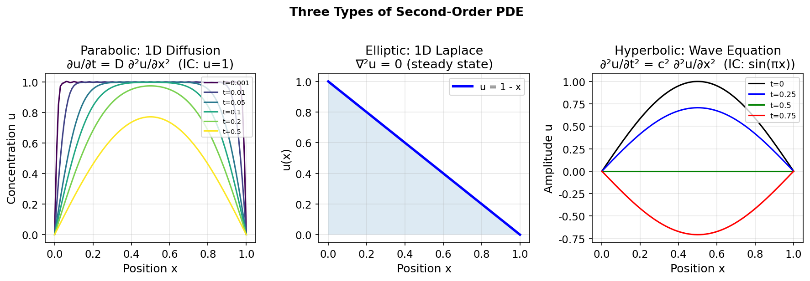
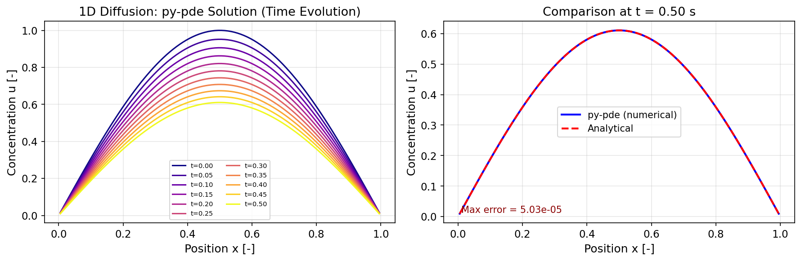
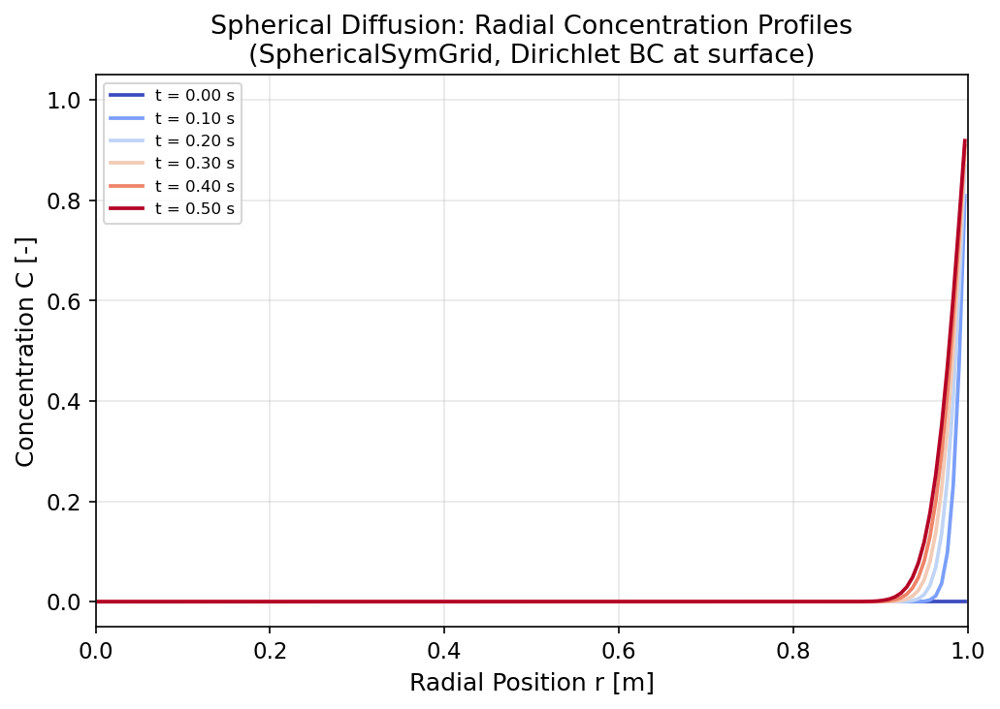
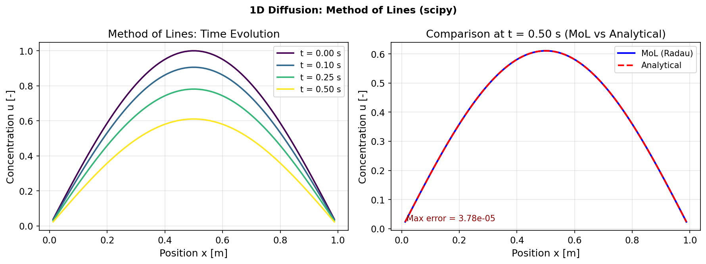
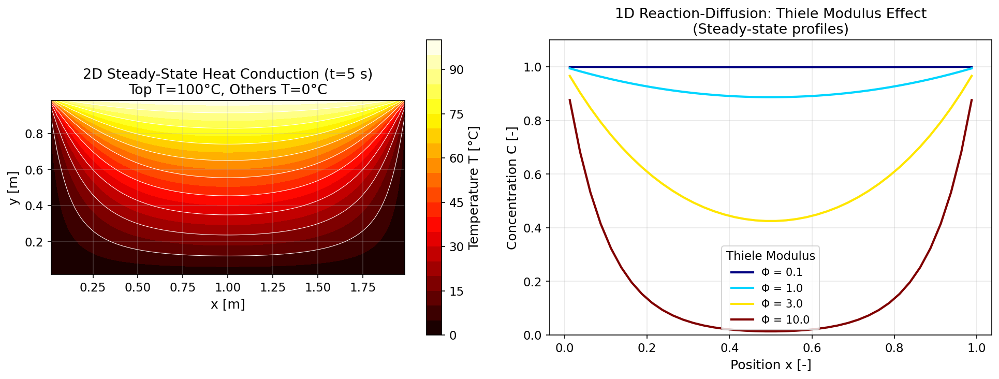
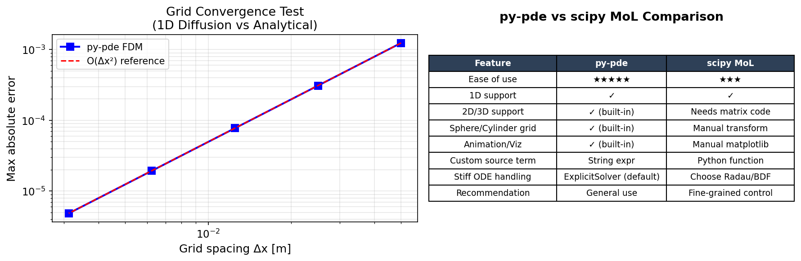

# Unit10 偏微分方程式 (PDE) 之求解

## 學習目標

完成本單元後，學生應能：

1. 識別並分類化工問題中的拋物線型、橢圓型與雙曲線型偏微分方程式
2. 正確設定 Dirichlet、Neumann 與 Robin 邊界條件
3. 使用 `py-pde` 套件的 `CartesianGrid`、`CylindricalGrid`、`SphericalGrid` 建立求解域
4. 以 `py-pde` 的 `DiffusionPDE` 與 `PDEBase` 求解標準及自訂 PDE 問題
5. 應用線法 (Method of Lines, MoL) 結合 `scipy.integrate.solve_ivp()` 求解拋物線型 PDE
6. 評估 Python 工具對化工 PDE 問題的適用範圍，並了解何時需轉用 COMSOL 或 ANSYS

---

## 目錄

1. [偏微分方程式基礎理論](#1-偏微分方程式基礎理論)
2. [邊界條件與初始條件](#2-邊界條件與初始條件)
3. [Python PDE 求解工具概覽](#3-python-pde-求解工具概覽)
4. [py-pde 核心物件與 API](#4-py-pde-核心物件與-api)
5. [線法 (Method of Lines)](#5-線法-method-of-lines)
6. [化工 PDE 問題類型](#6-化工-pde-問題類型)
7. [商業軟體比較](#7-商業軟體比較)
8. [程式設計最佳實踐](#8-程式設計最佳實踐)

---

## 1. 偏微分方程式基礎理論

### 1.1 PDE 的定義

偏微分方程式 (Partial Differential Equation; PDE) 是含有**兩個以上自變數**（如時間 $t$ 和空間 $x$ ）的微分方程式，其中未知函數的偏導數出現在方程式中。一般二階線性 PDE 的通用形式：

$$
A\frac{\partial^2 u}{\partial x^2} + B\frac{\partial^2 u}{\partial x \partial y} + C\frac{\partial^2 u}{\partial y^2} + D\frac{\partial u}{\partial x} + E\frac{\partial u}{\partial y} + Fu = G
$$

其中 $A, B, C, D, E, F, G$ 為係數（可為常數或 $x, y$ 的函數）。

### 1.2 PDE 分類：判別式法

利用判別式 $\Delta = B^2 - 4AC$ 進行分類：

| 條件 | 類型 | 典型方程式 | 化工應用 |
|------|------|-----------|---------|
| $\Delta < 0$ | **橢圓型** (Elliptic) | $\nabla^2 u = 0$ （Laplace 方程） | 穩態熱傳、穩態擴散 |
| $\Delta = 0$ | **拋物線型** (Parabolic) | $\frac{\partial u}{\partial t} = \alpha \nabla^2 u$ （擴散方程） | 非穩態熱傳、非穩態質傳 |
| $\Delta > 0$ | **雙曲線型** (Hyperbolic) | $\frac{\partial^2 u}{\partial t^2} = c^2 \nabla^2 u$ （波動方程） | 壓力波、衝擊波傳遞 |

### 1.3 化工常見 PDE 形式

**通用輸送方程式 (General Transport Equation)**：

$$
\frac{\partial (\rho \phi)}{\partial t} + \nabla \cdot (\rho \mathbf{v} \phi) = \nabla \cdot (\Gamma \nabla \phi) + S_\phi
$$

等號左側依序為**暫態項 (Transient Term)**（ $\partial(\rho\phi)/\partial t$ ）與**對流項 (Convective Term)**（ $\nabla\cdot(\rho\mathbf{v}\phi)$ ）；右側依序為**擴散項 (Diffusive Term)**（ $\nabla\cdot(\Gamma\nabla\phi)$ ）與**源項 (Source Term)**（ $S_\phi$ ）。其中 $\phi$ 為任一守恆量（溫度、濃度、速度分量）， $\Gamma$ 為擴散係數， $S_\phi$ 為源項（反應速率、熱源）。

| 輸送現象 | $\phi$ | $\Gamma$ | 方程式名稱 |
|---------|--------|----------|-----------|
| 熱傳 | $T$ | $k / (\rho c_p)$ = 熱擴散率 $\alpha$ | 熱傳方程式 |
| 質傳 | $C$ | 擴散係數 $D$ | 費克擴散方程式 |
| 動量傳遞 | $u$ | 運動黏度 $\nu$ | 納維−斯托克司方程式 |

**三大輸送方程式：**

**(1) 熱傳方程式 (Heat Equation)**：

$$
\rho c_p \frac{\partial T}{\partial t} = k \nabla^2 T + \dot{q}
$$

- 拋物線型（非穩態）；若 $\partial T/\partial t = 0$ 退化為橢圓型（Poisson/Laplace）

**(2) 擴散方程式 (Diffusion Equation / Fick's Second Law)**：

$$
\frac{\partial C}{\partial t} = D \nabla^2 C + R_C
$$

- $R_C$ 為反應源項（一階反應時 $R_C = -kC$ ）

**(3) Navier-Stokes 方程式 (動量守恆)**，不可壓縮流：

$$
\rho \left(\frac{\partial \mathbf{u}}{\partial t} + \mathbf{u} \cdot \nabla \mathbf{u}\right) = -\nabla p + \mu \nabla^2 \mathbf{u} + \rho \mathbf{g}
$$

$$
\nabla \cdot \mathbf{u} = 0 \quad (\text{連續方程式})
$$

### 1.4 範例演練：PDE 三種類型視覺化

下圖以解析解（或數值近似）呈現三類 PDE 的時間演化行為，有助於直觀理解各類型方程式的本質差異。



**圖 1-1　三種二階 PDE 的解行為比較**

---

**(a) 拋物線型（左圖）— 1D 擴散方程** $\partial u/\partial t = D\partial^2 u/\partial x^2$

**問題完整設定：**

- **PDE**： $\partial u/\partial t = D \partial^2 u/\partial x^2$ ，其中 $D=0.1$ ，求解域 $0 \le x \le 1$ ， $t \ge 0$
- **初始條件 (IC)**： $u(x,0) = $ 方波的 Fourier 展開，取前 50 奇數項正弦波：

$$
u(x,0) = \frac{4}{\pi}\sum_{n=1,3,5,\dots}^{50} \frac{1}{n}\sin(n\pi x)
$$

> **為何選方波作為 IC？**
>
> 若改用單一正弦波 $u(x,0) = \sin(\pi x)$，它本身就已經是擴散方程的本徵函數（eigenfunction），求解後只有一條平滑曲線均勻衰減，**看不出頻率選擇性耗散**的特徵。
>
> 方波則同時包含**無窮多頻率分量**（基頻 $n=1$ 、三次諧波 $n=3$ 、五次諧波 $n=5$、…），各頻率分量的衰減速率為 $e^{-(n\pi)^2 D t}$ ——頻率越高（ $n$ 越大），衰減越快。這樣在同一張圖上就能清楚地看到：
> - 初始（ $t$ 極小）：有明顯的方波稜角（高頻分量存在）
> - 中間時刻：稜角磨平，波形由方轉圓（高頻消失，低頻尚存）
> - 晚期：僅剩基頻正弦波，振幅緩慢衰減
>
> **一句話：方波 IC 是「展示耗散型 PDE 最有教學效果的初始條件」，因為它讓每個頻率分量的衰減行為都能被肉眼分辨。**

- **邊界條件 (BC)**：兩端 **Dirichlet BC** — $u(0,t) = 0$ 且 $u(1,t) = 0$ （對應兩端固定為 0，物理上可視為兩端恆溫牆或濃度為 0 的接收端）

**邊界條件的物理意義：** Dirichlet BC 強制規定邊界處的**函數值**，相當於「已知壁面條件」。兩端 $u=0$ 意味著邊界始終為冷牆（熱傳問題）或完全吸收端（質傳問題），系統的能量/質量只能向外散逸。若改為 Neumann BC $\partial u/\partial x|_{x=0,1}=0$ （絕熱牆），則積分 $\int_0^1 u\,dx$ 守恆，系統平均值不會下降。

**解行為：** 解析解為各 Fourier 模態獨立衰減：

$$
u(x,t) = \sum_{n=1,3,5,\dots} b_n \sin(n\pi x)\,e^{-(n\pi)^2 D t}
$$

- 從 $t=0.001$ 至 $t=0.5$ 六條曲線由上而下，高頻分量（大 $n$ ）因衰減因子 $e^{-(n\pi)^2 Dt}$ 遠大於低頻分量的衰減速率，**高頻震盪率先消失，波形逐漸平滑**
- 典型**耗散行為**：積分（能量）隨時間嚴格遞減，最終趨近零

---

**(b) 橢圓型（中圖）— 1D Laplace 方程** $\nabla^2 u = 0$

**問題完整設定：**

- **PDE**： $d^2u/dx^2 = 0$ （一維，退化為 Laplace 方程），求解域 $0 \le x \le 1$
- **初始條件**：橢圓型 PDE 為**純空間問題，無時間變數**，故不需要初始條件
- **邊界條件 (BC)**：兩端 **Dirichlet BC** — $u(0) = 1$ 且 $u(1) = 0$

**邊界條件的物理意義與適定性：** 橢圓型 PDE 描述**穩態分布**，其解完全由邊界條件決定，沒有邊界條件則問題不適定（解不唯一）。本例兩端各給一個 Dirichlet 條件，恰好確定唯一解。物理上對應：

- 熱傳：左端牆面溫度維持 $T=1$ （熱源），右端溫度維持 $T=0$ （冷源）
- 質傳：左端濃度 $C=1$ （高濃度端），右端濃度 $C=0$ （吸收端）

**解行為：** 二次積分 $d^2u/dx^2 = 0$ 得 $u = ax + b$ ，代入 BC 解出：

$$
u(x) = 1 - x
$$

- 唯一解（藍色線性分布）反映兩端 Dirichlet BC 之間的**最光滑分布**（ $\nabla^2 u = 0$ 即能量取極小的條件）
- 若改為一端 Dirichlet、一端 Neumann BC（如 $u(0)=1$ 、 $du/dx|_{x=1}=0$ ），則唯一解變為 $u=1$（均勻分布，右端絕熱無通量）
- 橢圓型 PDE 無時間演化，直接給出**全域最小能量**（最光滑）分布

---

**(c) 雙曲線型（右圖）— 波動方程** $\partial^2 u/\partial t^2 = c^2 \partial^2 u/\partial x^2$

**問題完整設定：**

- **PDE**： $\partial^2 u/\partial t^2 = c^2 \partial^2 u/\partial x^2$ ，其中 $c=1$ ，求解域 $0 \le x \le 1$ ， $t \ge 0$
- **初始條件 (IC)**：雙曲線型方程為**二階時間方程**，需要**兩個**初始條件：
  - 初始位移： $u(x,0) = \sin(\pi x)$
  - 初始速度： $\partial u/\partial t|_{t=0} = 0$ （初始靜止）
- **邊界條件 (BC)**：兩端 **Dirichlet BC** — $u(0,t) = 0$ 且 $u(1,t) = 0$ （對應固定端，如兩端被夾緊的弦）

**邊界條件的物理意義：** 兩端固定 Dirichlet BC 表示邊界無位移，波到達邊界後會發生**反射並反相**（相位翻轉 180°）。這與拋物線型問題的 Dirichlet BC 效果完全不同：拋物線型中能量通過邊界散逸，雙曲線型中能量在邊界反射，**總能量守恆**。

**解行為：** 利用 d'Alembert 公式，解為左行波與右行波的疊加：

$$
u(x,t) = \frac{1}{2}[\sin\pi(x-ct) + \sin\pi(x+ct)] = \sin(\pi x)\cos(\pi ct)
$$

- 四條曲線（ $t=0, 0.25, 0.5, 0.75$ ）波形持續傳遞且**不衰減**（保守系統）
- $t=0.5$ 時兩行波在邊界反射後恰好相消（ $\cos\pi \cdot 0.5 \cdot 1 = \cos(\pi/2) = 0$ ，綠線 $u \approx 0$ ）
- $t=0.75$ 時波形再現（ $\cos(3\pi/4) \ne 0$ ，紅線）
- 與拋物線型最大差異：**能量守恆，無耗散效應**

---

**三種 PDE 邊界條件需求比較：**

| 類型 | 所需條件 | 本範例設定 | 物理意義 |
|------|---------|-----------|---------|
| 拋物線型 | IC（全域）＋ BC（每端） | IC：Fourier 方波；BC：兩端 $u=0$（Dirichlet） | 能量從邊界散逸，最終 $u\to 0$ |
| 橢圓型 | BC（每端，無 IC） | BC：左端 $u=1$，右端 $u=0$（Dirichlet） | 兩端 BC 決定唯一穩態，無演化 |
| 雙曲線型 | IC（位移＋速度）＋ BC（每端） | IC：$\sin\pi x$，$\partial u/\partial t=0$；BC：兩端 $u=0$（Dirichlet） | 邊界反射波，能量守恆 |

---

## 2. 邊界條件與初始條件

### 2.1 邊界條件類型

PDE 的求解需要在求解域邊界 $\partial\Omega$ 上指定邊界條件 (BC)。

#### (1) 第一類邊界條件：Dirichlet BC

直接指定**函數值**在邊界上的數值：

$$
u(\mathbf{x}, t) = u_{\text{BC}}, \quad \mathbf{x} \in \partial\Omega
$$

**化工範例**：板材表面溫度固定（恆溫壁）、容器壁面濃度固定（溶解平衡）

```python
# py-pde Dirichlet 邊界條件設定
grid = pde.CartesianGrid([[0, 1]], 50)
bc = {"x": {"value": 1.0}}  # u(0,t) = u(1,t) = 1.0
```

#### (2) 第二類邊界條件：Neumann BC

指定函數的**法向導數**（通量）在邊界上的數值：

$$
\frac{\partial u}{\partial n}\bigg|_{\partial\Omega} = q_{\text{BC}}
$$

- 當 $q_{\text{BC}} = 0$ 時為**絕熱壁**（熱傳）或**不滲透壁**（質傳）

```python
# py-pde Neumann 邊界條件（絕熱/不滲透）
bc = {"x": {"derivative": 0}}  # ∂u/∂n = 0
```

#### (3) 第三類邊界條件：Robin BC（混合 BC）

線性組合函數值與其導數：

$$
a \cdot u + b \cdot \frac{\partial u}{\partial n} = c, \quad \mathbf{x} \in \partial\Omega
$$

**化工範例**：牛頓冷卻定律（對流換熱）

$$
-k \frac{\partial T}{\partial n} = h(T - T_\infty) \quad \Rightarrow \quad \frac{\partial T}{\partial n} + \frac{h}{k}T = \frac{h}{k}T_\infty
$$

```python
# py-pde Robin 邊界條件（對流換熱）
# -k dT/dn = h*(T - T_inf)
bc_right = {"derivative": "h/k * (value - T_inf)"}
```

### 2.2 對稱性邊界條件

在球座標或圓柱座標的**中心點**（ $r = 0$ ），物理對稱要求：

$$
\frac{\partial u}{\partial r}\bigg|_{r=0} = 0
$$

`py-pde` 的 `SphericalGrid` 和 `CylindricalGrid` 會自動在 $r=0$ 處設定此條件。

### 2.3 初始條件

拋物線型（時間相關）PDE 還需指定 **$t = 0$ 時的初始分布**：

$$
u(\mathbf{x}, 0) = u_0(\mathbf{x}), \quad \mathbf{x} \in \Omega
$$

```python
# py-pde 初始條件設定
state = pde.ScalarField.from_expression(grid, "1 - x")   # 線性分布
state = pde.ScalarField(grid, data=0.0)                   # 均勻初始值
state = pde.ScalarField.random_uniform(grid, 0.45, 0.55)  # 隨機初始值
```

### 2.4 問題適定性

| 類型 | 必要條件 |
|------|---------|
| 橢圓型（穩態） | 邊界上各面均需有 BC（Dirichlet 或 Neumann） |
| 拋物線型（非穩態） | 全域初始條件 + 邊界上各面之 BC |
| 雙曲線型 | 初始條件（ $u$ 及 $\partial u/\partial t$ ）+ 邊界條件 |

---

## 3. Python PDE 求解工具概覽

### 3.1 工具比較

| 工具 | 主要方法 | 適用問題 | 優點 | 限制 |
|------|---------|---------|------|------|
| **`py-pde`** | 有限差分法 (FDM) | 結構化網格、標準幾何 | API 簡潔、動畫方便 | 限矩形/圓柱/球形網格 |
| **`scipy` MoL** | 線法 + ODE 求解器 | 1D/2D 拋物線型 | 彈性高、控制細膩 | 需手動建立差分矩陣 |
| **FEniCS/Firedrake** | 有限元素法 (FEM) | 複雜幾何、任意邊界 | 正規化、工業強度 | 學習曲線較陡 |
| **COMSOL Multiphysics** | FEM（商業） | 任意幾何、多物理耦合 | GUI 友好、多物理 | 商業授權、費用高 |
| **ANSYS Fluent** | FVM + FEM（商業） | 複雜流場 CFD | 工業標準 CFD | 商業授權、費用高 |

### 3.2 本單元工具選擇策略

```
問題判斷流程：
┌─────────────────────────────┐
│  幾何形狀是否為矩形/圓柱/球形？  │
└─────────────────────────────┘
       ↓ 是                   ↓ 否
┌──────────────┐    ┌─────────────────┐
│ 使用 py-pde  │    │ 考慮 FEniCS 或  │
│（首選工具）   │    │ COMSOL/ANSYS   │
└──────────────┘    └─────────────────┘
       ↓ 需精細控制？
┌──────────────────────┐
│ 使用 scipy MoL（次選）│
└──────────────────────┘
```

**選用 `py-pde` 的情境**：
- 標準幾何（板材、圓柱、球體）的熱傳、質傳模擬
- 需要動畫視覺化輸出
- 快速原型驗證物理模型

**選用 `scipy` MoL 的情境**：
- 需要與現有 Python 程式碼整合
- 需要精細控制時間步長與誤差容忍度
- 問題含有複雜非線性源項

### 3.3 範例演練：py-pde 一維擴散 Hello World

以具有精確解析解的一維擴散問題驗證 `py-pde` 的求解精度。

**問題設定**：

$$
\frac{\partial u}{\partial t} = D \frac{\partial^2 u}{\partial x^2}, \quad D=0.1,\; 0\le x\le 1,\; 0\le t\le 0.5
$$

- 初始條件： $u(x,0) = \sin(\pi x)$
- 邊界條件： $u(0,t) = u(1,t) = 0$ （Dirichlet）
- 解析解： $u(x,t) = \sin(\pi x) \cdot e^{-\pi^2 D t}$



**圖 3-1　py-pde 一維擴散模擬結果**

**左圖 — 時間演化曲線（11 個快照， $t = 0.00\sim 0.50$ s）**：

- 初始正弦波振幅以 $e^{-\pi^2 Dt}$ 衰減： $e^{-\pi^2 \times 0.1 \times 0.5} \approx 0.609$ ，與圖中最終振幅（ $\approx 0.61$ ）完全吻合
- 波形始終維持 $\sin(\pi x)$ 形狀（同一本徵函數，Dirichlet BC），無相位偏移
- `storage.tracker(0.05)` 每 0.05 s 收集一個快照，共 11 條曲線

**右圖 — 數值 vs 解析解（ $t=0.5$ s）**：

| 項目 | 數值 |
|------|------|
| 最大絕對誤差 | $5.03 \times 10^{-5}$ |
| 網格點數 | $N=100$ ， $\Delta x=0.01$ m |
| 時間步長 | $dt = 10^{-4}$ s |
| 求解器 | 顯式 Euler（py-pde 預設） |

數值解（藍線）與解析解（紅虛線）完全重疊，最大誤差 $5.0 \times 10^{-5}$ ，確認中心差分的**二階空間精度**在此問題中表現良好。

---

## 4. py-pde 核心物件與 API

### 4.1 求解域：Grid 物件

`py-pde` 提供三種主要網格類型，對應不同座標系統。**Grid 物件**負責定義求解域幾何、座標軸名稱、網格間距，以及後續邊界條件的施加方式。

---

#### (1) CartesianGrid — 直角座標（1D / 2D / 3D）

**建構語法：**

```python
pde.CartesianGrid(bounds, shape, periodic=False)
```

| 參數 | 型別 | 說明 | 範例 |
|------|------|------|------|
| `bounds` | `list of [low, high]` | 各軸的空間範圍，幾組對應幾維 | `[[0,1]]`（1D）、`[[0,2],[0,1]]`（2D） |
| `shape` | `int` 或 `list of int` | 各軸的**網格節點數** $N$，單一整數則各軸相同 | `50`、`[40, 20]`、`20` |
| `periodic` | `bool` 或 `list of bool` | 是否啟用週期邊界（預設 `False`） | `True`、`[True, False]` |

**網格間距**自動計算：

$$
\Delta x_i = \frac{\text{bounds}[i][1] - \text{bounds}[i][0]}{N_i}
$$

**軸名稱**依維度自動指派（用於 BC 設定）：

| 維度 | 軸名稱 | 端點名稱 |
|------|--------|---------|
| 1D | `x` | `left` / `right` |
| 2D | `x`, `y` | `left`/`right`（x）；`bottom`/`top`（y） |
| 3D | `x`, `y`, `z` | 同上，z 方向為 `back`/`front` |

```python
import pde

# 1D：x ∈ [0, 1]，50 個節點，Δx = 0.02
grid_1d = pde.CartesianGrid([[0, 1]], 50)

# 2D：x ∈ [0, 2]，y ∈ [0, 1]，40×20 節點
grid_2d = pde.CartesianGrid([[0, 2], [0, 1]], [40, 20])

# 3D：x,y,z ∈ [0,1]，各軸 20 節點（共 8000 點）
grid_3d = pde.CartesianGrid([[0, 1], [0, 1], [0, 1]], 20)

# 帶週期邊界（x 方向週期）
grid_per = pde.CartesianGrid([[0, 1]], 50, periodic=True)

# 查看網格屬性
print(grid_1d.shape)           # (50,)
print(grid_1d.axes_coords)     # 各軸節點座標陣列
print(grid_2d.axes)            # ['x', 'y']
print(grid_2d.cell_volumes)    # 每個網格單元的面積/體積
```

**重要屬性：**

| 屬性 | 說明 |
|------|------|
| `.shape` | 各軸節點數的 tuple |
| `.axes` | 軸名稱列表，如 `['x', 'y']` |
| `.axes_coords` | 各軸節點中心座標的 list of ndarray |
| `.cell_volumes` | 每個 cell 的體積 ndarray |
| `.num_cells` | 總節點數 |

---

#### (2) SphericalGrid — 球座標（利用球對稱，降維為 1D 徑向）

**建構語法：**

```python
pde.SphericalGrid(radius, shape)
```

| 參數 | 型別 | 說明 |
|------|------|------|
| `radius` | `float` | 球體外半徑 $R$（求解域為 $r \in [0, R]$） |
| `shape` | `int` | 徑向節點數 $N_r$（網格間距 $\Delta r = R/N_r$） |

**注意事項：**

- 求解域自動為 $r \in [0, R]$，**無法改變下界**（下界永遠是球心 $r=0$）
- **球心 $r=0$ 的 BC 由 `py-pde` 自動處理**（施加 Neumann 條件 $\partial u/\partial r = 0$，確保球對稱）
- 使用者只需指定**外壁 $r=R$ 的邊界條件**
- 座標軸名稱為 `r`，端點名稱為 `inner`（$r=0$）/ `outer`（$r=R$）
- `SphericalGrid` 代表的是**三維**球體的球對稱問題（非一維杆體）

```python
import pde

R = 5e-3          # 球半徑 5 mm
Nr = 100          # 徑向節點數

grid_sphere = pde.SphericalGrid(radius=R, shape=Nr)

# 查看屬性
print(grid_sphere.shape)           # (100,)
print(grid_sphere.axes)            # ['r']
print(grid_sphere.axes_coords[0])  # r 座標陣列，從 Δr/2 到 R-Δr/2（cell center）
```

**幾何示意：**

```
  r=0（球心，自動 ∂u/∂r=0）          r=R（外壁，使用者指定 BC）
    ●──────────────────────────────────●
    │◄────── Nr 個節點，Δr=R/Nr ──────►│
```

---

#### (3) CylindricalGrid — 圓柱座標（軸對稱，2D r-z 平面）

**建構語法：**

```python
pde.CylindricalGrid(radius, bounds, shape, periodic_z=False)
```

| 參數 | 型別 | 說明 |
|------|------|------|
| `radius` | `float` | 圓柱外半徑 $R$（$r \in [0, R]$） |
| `bounds` | `[z_min, z_max]` 或 `float` | $z$ 方向的範圍；若傳入單一 float，則 $z \in [0, \text{bounds}]$ |
| `shape` | `[Nr, Nz]` | 徑向與軸向節點數 |
| `periodic_z` | `bool` | $z$ 方向是否週期（預設 `False`） |

**注意事項：**

- 求解域在 $r$ 方向永遠從 $0$ 開始（軸心），**無法設定 $r$ 的下界**
- **軸心 $r=0$ 自動處理**（Neumann 對稱 BC），使用者只需設定外壁 $r=R$ 的 BC
- $z$ 方向兩端均需使用者指定 BC
- 座標軸：`r`（徑向）、`z`（軸向）；端點：`inner`/`outer`（r）、`bottom`/`top`（z）
- 代表**三維**有限長圓柱的軸對稱問題（繞 $z$ 軸旋轉對稱）

```python
import pde

R = 1e-2          # 圓柱半徑 1 cm
H = 2e-2          # 半長 2 cm（z 從 -H 到 H）
Nr, Nz = 40, 80   # 徑向 40 節點，軸向 80 節點

# z ∈ [-H, H]
grid_cyl = pde.CylindricalGrid(radius=R, bounds=[-H, H], shape=[Nr, Nz])

# z ∈ [0, H]（僅取上半段）
grid_cyl_half = pde.CylindricalGrid(radius=R, bounds=H, shape=[Nr, Nz//2])

print(grid_cyl.shape)   # (40, 80)
print(grid_cyl.axes)    # ['r', 'z']
```

**幾何示意（r-z 半剖面）：**

```
  r=0（軸心，自動對稱 BC）     r=R（外壁，使用者指定）
  z ↑   │                         │
  z_max ┼─────────────────────────┤ ← top BC（使用者指定）
        │   Nr×Nz 節點             │
        │   Δr = R/Nr              │
        │   Δz = (z_max-z_min)/Nz  │
  z_min ┼─────────────────────────┤ ← bottom BC（使用者指定）
   0 ───┴─────────────────────────┴──→ r
```

---

#### Grid 三種類型比較

| 屬性 | `CartesianGrid` | `SphericalGrid` | `CylindricalGrid` |
|------|----------------|-----------------|-------------------|
| 座標軸 | x [,y [,z]] | r | r, z |
| 維度 | 1D / 2D / 3D | 1D（代表 3D） | 2D（代表 3D） |
| 自動對稱 BC | ✗ | ✓（r=0） | ✓（r=0） |
| 使用者指定 BC 數 | 每軸 2 個端點 | 1 個（外壁） | 3 個（r 外壁 + z 兩端） |
| 典型化工應用 | 平板、矩形域 | 球形顆粒 | 有限長圓柱 |

### 4.2 場變數：Field 物件（初始條件設定）

`py-pde` 中的「場（Field）」物件同時扮演**初始條件**和**求解過程中場變數**的角色，需依附在特定的 Grid 物件上。

#### 場物件種類

| 物件 | 說明 | 典型用途 |
|------|------|---------|
| `ScalarField` | 純量場（每個節點一個數值） | 溫度 $T$、濃度 $C$ |
| `VectorField` | 向量場（每個節點一個向量） | 速度 $\mathbf{u}$、通量 $\mathbf{J}$ |
| `Tensor2Field` | 二階張量場 | 應力張量 $\boldsymbol{\sigma}$ |

#### ScalarField 初始條件建立方式

**方式 1：均勻常數**

```python
# data 可為 float（全域均勻值）或 numpy array（自訂分布）
C_zero   = pde.ScalarField(grid, data=0.0)     # 全域 C = 0
T_init   = pde.ScalarField(grid, data=300.0)   # 全域 T = 300 K
```

**方式 2：NumPy 陣列**（精細自訂分布）

```python
import numpy as np

# CartesianGrid 1D 範例
x = grid_1d.axes_coords[0]          # 取得節點 x 座標陣列
data = np.exp(-((x - 0.5)**2) / 0.01)  # Gaussian 初始分布
C_gauss = pde.ScalarField(grid_1d, data=data)
```

**方式 3：數學表達式（字串）**

```python
# 字串中可使用以下內建座標變數：
#   CartesianGrid: x, y, z
#   SphericalGrid: r
#   CylindricalGrid: r, z
# 支援的函數：sin, cos, exp, sqrt, pi, abs 等

C_linear  = pde.ScalarField.from_expression(grid_1d, "1 - x")
T_sine    = pde.ScalarField.from_expression(grid_1d, "sin(pi * x)")
C_2d      = pde.ScalarField.from_expression(grid_2d, "sin(pi*x) * sin(pi*y)")
C_radial  = pde.ScalarField.from_expression(grid_sphere, "1 - r / R",
                                            user_funcs={"R": R})
```

> **注意**：座標變數名稱與 Grid 的 `axes` 屬性一致；若需使用自訂常數（如 `R`），透過 `user_funcs` 傳入。

**方式 4：隨機初始場**

```python
# 均勻分布隨機值 [vmin, vmax]
C_rand = pde.ScalarField.random_uniform(grid, vmin=0.45, vmax=0.55)

# 常態分布隨機值（mean ± std）
C_norm = pde.ScalarField.random_normal(grid, mean=0.5, std=0.02)
```

**方式 5：Lambda 函數（複雜幾何條件）**

```python
import numpy as np

def initial_condition(coords):
    """coords: shape (ndim, N) 的節點座標矩陣"""
    x = coords[0]
    # 左半段 C=1，右半段 C=0（階梯函數）
    return np.where(x < 0.5, 1.0, 0.0)

C_step = pde.ScalarField.from_expression(grid_1d, "x < 0.5",
    user_funcs={"np": np})
# 或直接用 NumPy：
data = np.where(grid_1d.axes_coords[0] < 0.5, 1.0, 0.0)
C_step = pde.ScalarField(grid_1d, data=data)
```

#### 初始條件建立方式比較

| 方式 | 適用場景 | 語法複雜度 |
|------|---------|-----------|
| 均勻常數 `data=v` | 均勻初始值 | ★☆☆ |
| NumPy 陣列 | 任意數值分布（如讀入量測資料） | ★★☆ |
| 字串表達式 | 解析函數初始值 | ★☆☆ |
| 隨機場 | 反應-擴散穩定性分析、Turing Pattern | ★☆☆ |
| Lambda/NumPy 條件 | 階梯函數、局部加熱等非均勻 IC | ★★★ |

### 4.3 PDE 定義方式

#### (1) 使用內建 PDE 類別

`py-pde` 提供常用 PDE 的內建類別：

```python
# 擴散/熱傳方程式：∂u/∂t = D * ∇²u
eq = pde.DiffusionPDE(diffusivity=D)

# 波動方程式：∂²u/∂t² = c² * ∇²u
eq = pde.WavePDE(speed=c)
```

#### (2) 使用 PDE 類別（字串表達式）

```python
# 定義自訂 PDE（支援 py-pde 的數學語法）
# ∂C/∂t = D * ∇²C - k * C（一階反應）
eq = pde.PDE({"C": f"D * laplace(C) - k * C"},
             consts={"D": 1e-9, "k": 0.5})
```

#### (3) 繼承 PDEBase（最彈性）

```python
from pde import PDEBase, ScalarField

class ReactionDiffusionPDE(PDEBase):
    def __init__(self, D=1.0, k=0.5):
        self.D = D
        self.k = k

    def evolution_rate(self, state, t=0):
        """計算 ∂C/∂t = D*∇²C - k*C"""
        C = state
        laplacian = C.laplace(bc=self.bc)
        return self.D * laplacian - self.k * C
```

### 4.4 邊界條件設定語法

`py-pde` 的邊界條件（Boundary Condition, BC）以 **Python 字典或字串**指定，傳入 PDE 求解器的 `bc` 參數。不同 Grid 類型的 BC 格式略有差異。

---

#### BC 型別對照表

| BC 型別 | 說明 | 字典語法 |
|---------|------|---------|
| **Dirichlet**（第一類） | 指定**場值** $u = v$ | `{"value": v}` |
| **Neumann**（第二類） | 指定**法向導數** $\partial u/\partial n = d$ | `{"derivative": d}` |
| **週期** | 兩端值相等 $u(\text{left}) = u(\text{right})$ | `"periodic"` |
| **Robin**（第三類，混合） | $\partial u/\partial n + \alpha u = \beta$ | `{"type": "mixed", "value": β, "const": α}` |
| **自動週期 Neumann** | 自動補全週期或 Neumann 條件 | `"auto_periodic_neumann"` |

> **法向方向**定義：對左端/下端（`left`/`bottom`/`inner`）為指向**負方向**；對右端/上端（`right`/`top`/`outer`）為指向**正方向**。

---

#### CartesianGrid BC 設定

**1D 情況（只有 x 軸）：**

```python
# 方式一：兩端相同 BC（字典鍵為軸名稱）
bc_zero  = {"x": {"value": 0.0}}           # 兩端 Dirichlet u=0
bc_insul = {"x": {"derivative": 0.0}}      # 兩端 Neumann 絕熱/絕質

# 方式二：兩端不同 BC（字典鍵為端點名稱）
bc_heat = {"left":  {"value": 100.0},      # 左端 T=100°C（高溫壁）
           "right": {"value": 20.0}}       # 右端 T=20°C（低溫壁）

# 方式三：串列格式 [left_bc, right_bc]
bc_list = [{"value": 100.0}, {"derivative": 0.0}]  # 左端 Dirichlet，右端 Neumann

# 週期 BC
bc_per = {"x": "periodic"}
```

**2D 情況（x 軸 + y 軸，需提供兩組 BC）：**

```python
# bc 為 list，第一個元素為 x 方向，第二個為 y 方向
bc_2d = [
    {"left": {"value": 1.0}, "right": {"value": 0.0}},  # x 方向
    {"y": {"derivative": 0.0}}                          # y 方向（上下端絕熱）
]

# 或用縮寫：各軸相同 BC
bc_2d_simple = [{"value": 0.0}, {"value": 0.0}]   # 所有邊 u=0
```

**Robin BC 範例（第三類：對流邊界）：**

$$
-k\frac{\partial T}{\partial x}\bigg|_{x=L} = h\left(T - T_\infty\right)
\quad\Rightarrow\quad
\frac{\partial T}{\partial x} + \frac{h}{k} T = \frac{h}{k} T_\infty
$$

```python
h = 50.0       # 對流係數 W/(m²·K)
k = 1.0        # 導熱係數 W/(m·K)
T_inf = 20.0   # 環境溫度

# Robin BC：∂T/∂x + (h/k)*T = (h/k)*T_inf
bc_robin = {"right": {"type": "mixed",
                      "value": h/k * T_inf,   # = β
                      "const": h/k}}          # = α
```

---

#### SphericalGrid BC 設定

SphericalGrid 只有一個可設定的端點（**外壁 $r=R$**），因為 $r=0$（球心）已由 `py-pde` 自動處理。

```python
# BC 為 list，共兩個元素：[inner, outer]
# inner（r=0）：通常設為 "auto_periodic_neumann" 或 {"derivative": 0}
# outer（r=R）：由使用者指定

# 外壁第一類（Dirichlet）：C(r=R) = C_surface
bc_sphere_dir = ["auto_periodic_neumann",
                 {"value": C_surface}]

# 外壁第二類（Neumann）：通量為零
bc_sphere_neu = ["auto_periodic_neumann",
                 {"derivative": 0.0}]

# 實際使用範例（求解時傳入 bc 參數）
eq = pde.DiffusionPDE(diffusivity=D)
result = eq.solve(C_init, t_range=t_end, dt=dt,
                  bc=["auto_periodic_neumann", {"value": 1.0}])
```

> **inner 端建議**：通常使用 `"auto_periodic_neumann"` 讓 `py-pde` 自動處理球心對稱，也可明確指定 `{"derivative": 0}` 表示球心通量為零。

---

#### CylindricalGrid BC 設定

CylindricalGrid 有**兩個方向的 BC**：r 方向（inner/outer）和 z 方向（bottom/top）。

```python
# bc = [bc_r, bc_z]
# bc_r = [inner_r_BC, outer_r_BC]  → inner 為 r=0（自動），outer 為 r=R（使用者）
# bc_z = [bottom_z_BC, top_z_BC]   → 兩端皆由使用者指定

bc_cyl = [
    ["auto_periodic_neumann", {"value": C_wall}],  # r 方向：r=0 自動, r=R = C_wall
    [{"derivative": 0.0},     {"value": C_top}]    # z 方向：底端絕質, 頂端 C = C_top
]

# 傳入 solve()
result = eq.solve(C_init, t_range=t_end, dt=dt, bc=bc_cyl)
```

---

#### BC 設定總覽

| Grid 類型 | `bc` 結構 | 說明 |
|-----------|----------|------|
| `CartesianGrid` 1D | `bc_x` 或 `[bc_left, bc_right]` | 一個方向，兩個端點 |
| `CartesianGrid` 2D | `[bc_x, bc_y]` | 兩個方向，各兩端點 |
| `CartesianGrid` 3D | `[bc_x, bc_y, bc_z]` | 三個方向，各兩端點 |
| `SphericalGrid` | `[bc_inner, bc_outer]` | inner=r=0（建議 auto），outer=r=R |
| `CylindricalGrid` | `[[bc_r_inner, bc_r_outer], [bc_z_bot, bc_z_top]]` | r 和 z 各兩端點 |

### 4.5 求解器 (Solver) 與追蹤器 (Tracker)

#### 4.5.1 快速求解：`eq.solve()`

**最簡流程（一行求解）：**

```python
import pde

grid  = pde.CartesianGrid([[0, 1]], 100)
state = pde.ScalarField.from_expression(grid, "sin(pi * x)")
eq    = pde.DiffusionPDE(diffusivity=1e-4, bc={"x": {"value": 0.0}})

result = eq.solve(state, t_range=1.0, dt=1e-4)
```

**`eq.solve()` 常用參數：**

| 參數 | 型別 | 預設值 | 說明 |
|------|------|--------|------|
| `state` | `Field` | — | 初始條件場物件 |
| `t_range` | `float` 或 `(t0, t1)` | — | 積分時間範圍；純 float 表示 `(0, t_range)` |
| `dt` | `float` 或 `None` | `None` | 時間步長；`None` 啟用自適應步長（需配合 `ScipySolver`） |
| `tracker` | `Tracker` 或 list | `None` | 追蹤器，用於儲存中間結果或顯示進度 |
| `solver` | `SolverBase` | `ExplicitSolver` | 指定求解器後端（見 §4.5.2） |
| `backend` | `str` | `"numba"` | 數值後端，`"numba"` 啟用 JIT 加速，`"numpy"` 便於除錯 |
| `ret_info` | `bool` | `False` | 若 `True`，回傳 `(result, info_dict)` — `info_dict` 含積分統計 |

> **注意**：`bc` 參數是定義在 **PDE 類別**上（如 `DiffusionPDE(bc=...)`），不是傳入 `solve()`。

---

#### 4.5.2 求解器類別（SolverBase 子類）

`py-pde` 提供三種數值積分後端，對應不同問題特性：

| 求解器類別 | 時間格式 | 特性 | 適用場景 |
|-----------|---------|------|---------|
| `ExplicitSolver` | 顯式（Euler / RK）| 速度快；需滿足 CFL 穩定條件 | 一般非剛性 PDE |
| `ImplicitSolver` | 隱式（Crank-Nicolson）| 無條件穩定；每步需求解線性方程組 | 高擴散係數、剛性問題 |
| `ScipySolver` | 自適應（`scipy.integrate.odeint`）| 自動控制步長與誤差；最慢 | 精度要求高或步長難以估算 |

**使用方式（透過 `Controller` 精細控制）：**

```python
# 顯式求解器（最常用）
solver     = pde.ExplicitSolver(eq)
controller = pde.Controller(solver, t_range=1.0,
                            tracker=["progress"])  # 顯示進度條
final_state = controller.run(state, dt=1e-4)

# 隱式求解器（剛性問題）
solver_imp  = pde.ImplicitSolver(eq)
controller2 = pde.Controller(solver_imp, t_range=1.0)
final_state2 = controller2.run(state, dt=1e-3)  # 可用更大步長

# scipy 自適應求解器（高精度）
solver_sci  = pde.ScipySolver(eq)
controller3 = pde.Controller(solver_sci, t_range=1.0)
final_state3 = controller3.run(state)            # 不需指定 dt
```

---

#### 4.5.3 顯式求解器的穩定條件（CFL 準則）

`ExplicitSolver` 使用顯式時間積分，時間步長 $\Delta t$ 必須滿足 **CFL（Courant-Friedrichs-Lewy）穩定條件**，否則數值解將發散：

| 問題維度 | 穩定條件 | 說明 |
|---------|---------|------|
| 擴散方程 1D | $\Delta t \leq \dfrac{\Delta x^2}{2D}$ | $D$：擴散係數 |
| 擴散方程 2D | $\Delta t \leq \dfrac{\Delta x^2}{4D}$ | 需同時滿足 x 和 y 方向 |
| 擴散方程 3D | $\Delta t \leq \dfrac{\Delta x^2}{6D}$ | 維度越高，步長限制越嚴格 |

**安全步長建議**（取理論上限的 1/2）：

```python
import numpy as np

D = 1e-4       # 擴散係數 m²/s
dx = 1.0/100   # 網格間距（x ∈ [0,1]，N=100）

# 1D 擴散穩定步長上限
dt_max = dx**2 / (2 * D)
dt_safe = dt_max * 0.5     # 取一半作為安全裕度
print(f"dt_max = {dt_max:.4f} s, dt_safe = {dt_safe:.4f} s")
```

> **重要**：對**反應-擴散**系統（含 source/sink 項），穩定條件由反應項和擴散項共同決定，通常以 $\Delta t \sim 0.1 \times \min(\Delta t_{\text{diff}}, 1/k_r)$ 估算。

---

#### 4.5.4 Tracker（追蹤器）

Tracker 在求解器每隔固定時間間隔「回調」時執行，可用於：儲存快照、顯示進度、即時計算統計量、觸發提前終止。

**內建 Tracker 類型：**

| Tracker | 用途 | 建立方式 |
|---------|------|---------|
| `MemoryStorage.tracker()` | 儲存場的時序快照至記憶體 | `storage.tracker(interval)` |
| `"progress"` | 顯示 tqdm 進度條 | 字串 `"progress"` |
| `"print"` | 每步印出場統計（max/min/mean） | 字串 `"print"` |
| `pde.PlotTracker` | Jupyter 即時繪圖（inline 動畫） | `pde.PlotTracker(interval)` |
| `pde.DataTracker` | 自訂資料擷取（純量時間序列） | `pde.DataTracker(func, interval)` |

**MemoryStorage — 儲存時序快照：**

```python
storage = pde.MemoryStorage()

result = eq.solve(state, t_range=2.0, dt=1e-4,
                  tracker=[storage.tracker(0.1)])   # 每 0.1 s 儲存一次

# 讀取快照
times  = list(storage.times)            # 時間點列表
fields = list(storage.values())         # 對應的 ScalarField 列表

# 後處理：提取各時刻最大值
max_vals = [field.data.max() for field in storage.values()]

# 繪製結果
import matplotlib.pyplot as plt
plt.plot(times, max_vals)
plt.xlabel("Time (s)")
plt.ylabel("Max Concentration")
plt.show()
```

**DataTracker — 擷取純量時間序列：**

```python
# 追蹤場的均值（自訂統計量）
tracker_mean = pde.DataTracker(
    lambda field: field.data.mean(),    # 回傳純量的 lambda
    interval=0.05                       # 每 0.05 s 記錄一次
)

result = eq.solve(state, t_range=2.0, dt=1e-4,
                  tracker=[tracker_mean, "progress"])

# 取得時間序列
t_arr   = np.array(tracker_mean.times)
mean_arr = np.array(tracker_mean.data)
```

**PlotTracker — Jupyter 即時動畫：**

```python
# 在 Jupyter Notebook 中顯示即時更新的場圖（每 0.1 s 更新一次）
plot_tracker = pde.PlotTracker(interval=0.1, show=True)

result = eq.solve(state, t_range=1.0, dt=1e-4,
                  tracker=[plot_tracker])
```

**同時使用多個 Tracker：**

```python
storage     = pde.MemoryStorage()
tracker_max = pde.DataTracker(lambda f: f.data.max(), interval=0.05)

result = eq.solve(state, t_range=2.0, dt=1e-4,
                  tracker=[
                      storage.tracker(0.2),     # 慢速快照（每 0.2 s）
                      tracker_max,              # 快速統計（每 0.05 s）
                      "progress"                # 進度條
                  ])
```

---

#### 4.5.5 GIF 動畫輸出

```python
storage = pde.MemoryStorage()
eq.solve(state, t_range=1.0, dt=1e-4,
         tracker=[storage.tracker(0.02)])

# 輸出 GIF（需安裝 imageio）
storage.plot_movie("diffusion.gif",
                   title="Diffusion",
                   filename="diffusion.gif")
```

---

#### 4.5.6 求解方式選擇建議

| 情境 | 建議方式 |
|------|---------|
| 一般擴散/熱傳（非剛性） | `eq.solve(..., dt=dt_safe)` + `ExplicitSolver`（預設） |
| 高擴散係數或剛性反應 | `ImplicitSolver` + 較大 dt |
| 精度優先，步長不確定 | `ScipySolver`（自適應，最慢） |
| 需追蹤時間演化 | 加入 `MemoryStorage.tracker(interval)` |
| 大型問題，追求速度 | `backend="numba"`（預設）；確認 numba 已安裝 |
| 除錯、驗證 | `backend="numpy"` + 小網格 |

### 4.6 範例演練：Grid 物件與球形擴散

#### 4.6.1 Grid 物件建立與 ScalarField 操作輸出

```text
======================================================
py-pde Grid Objects
======================================================
[CartesianGrid 1D]   shape=(50,),   dx=0.0200
[CartesianGrid 2D]   shape=(40, 20)
[CartesianGrid 3D]   shape=(10, 10, 10)
[SphericalSymGrid]   shape=(100,),  r_max=0.995
[CylindricalSymGrid] shape=(20, 30)

ScalarField Operations
-------------------------------------------------------
  f = sin(x):  max=1.0000, integral=2.0001
  nabla^2 sin(x) = -sin(x): min=-1.0000  (expected ~ -1.0 at x=pi/2)

PDE Definition Styles
-------------------------------------------------------
  DiffusionPDE: d_t c = 0.1 * laplace(c)
  PDE (string):  d_t C = 0.1 * Delta(C) - 0.5 * C
```

**數示說明**：

- `CartesianGrid` 支援 1D/2D/3D，格點間距由空間範圍與格點數決定： $\Delta x = L/N$
- `SphericalSymGrid(radius=1, shape=100)` 最外徑 `r_max=0.995`，內建 $r=0$ 對稱 BC
- `f.integral` 算出 $\int_0^\pi \sin(x)\,dx = 2.0001$ ，誤差 $5\times10^{-5}$ ，確認數値積分精度
- $\nabla^2 \sin(x) = -\sin(x)$ ，最小值 $-1.0000$ （發生在 $x=\pi/2$ ），與解析結果完全吻合
- `PDE` 字串表達式支援 `laplace()`、`divergence()`、`gradient()` 等進階算子

#### 4.6.2 球坐標擴散：SphericalSymGrid 示範

**問題設定**：球形類粒（ $R=1$ m）的擴散滲透問題

$$
\frac{\partial C}{\partial t} = D \nabla^2 C = D \left(\frac{\partial^2 C}{\partial r^2} + \frac{2}{r}\frac{\partial C}{\partial r}\right), \quad D = 10^{-3}\ \mathrm{m^2/s}
$$

- 初始條件： $C(r,0) = 0$ （球內為空）
- 邊界條件： $C(R,t) = 1$ （表面 Dirichlet）； $r=0$ 對稱 BC 由 `SphericalSymGrid` 自動處理



**圖 4-1　球形類粒的徑向濃度分布演化**

由圖可觀察：1. **初期（ $t=0\sim 0.1$ s）**：濃度變化僅限於表面附近（薄邊界層），球心 $r=0$ 處仍為 0
2. **中期（ $t=0.2\sim 0.4$ s）**：擴散前緣向球心推進，曲率效應（ $2/r$ 項）加速心部擴散
3. **後期（ $t=0.5$ s）**：紅線展示球心附近濃度顯著上升，但深入程度尚有限

**物理分析**：

- 特徵時間尺度 $t^* = R^2/D = 1^2/10^{-3} = 1000$ s，模擬時間 $t=0.5$ s $\ll t^*$ ，故球心濃度仍靠近 0
- 相較於平面幾何，球坐標的 Laplacian 包含曲率修正項 $2D/r \cdot \partial C/\partial r$ ，造成心部附近擴散速率相對加快（**幾何聚焦效應**）

---

## 5. 線法 (Method of Lines)

### 5.1 MoL 基本原理

**線法 (Method of Lines; MoL)** 是求解拋物線型 PDE 的系統化方法：先對**空間方向**進行離散化（有限差分），將 PDE 轉換為大型聯立 ODE 系統，再用標準 ODE 求解器（`scipy.integrate.solve_ivp()`）對**時間積分**。

以一維擴散方程式為例：

$$
\frac{\partial u}{\partial t} = D \frac{\partial^2 u}{\partial x^2}, \quad 0 \le x \le L, \; t \ge 0
$$

**步驟 1：空間離散化**

將 $[0, L]$ 等分為 $N$ 個網格點，間距 $\Delta x = L / (N-1)$ ：

$$
\frac{d u_i}{dt} \approx D \cdot \frac{u_{i-1} - 2u_i + u_{i+1}}{\Delta x^2}, \quad i = 1, 2, \dots, N-2
$$

**步驟 2：邊界條件納入**

- Dirichlet BC： $u_0 = u_L = 0$ （固定，不列入 ODE 變數）
- Neumann BC：使用虛擬節點 $u_{-1} = u_1$ （ $du/dx = 0$ ）

**步驟 3：轉對 ODE 系統**

$$
\frac{d\mathbf{u}}{dt} = \mathbf{A} \mathbf{u} + \mathbf{b}
$$

其中 $\mathbf{A}$ 為三對角線矩陣， $\mathbf{b}$ 為 BC 的貢獻向量。

### 5.2 Python 實作模板

```python
import numpy as np
from scipy.integrate import solve_ivp
import matplotlib.pyplot as plt

# 問題參數
L = 1.0        # 板材厚度 [m]
D = 1e-4       # 擴散係數 [m²/s]
N = 100        # 內部節點數
x = np.linspace(0, L, N + 2)  # 包含邊界的節點
dx = x[1] - x[0]

# 初始條件（內部節點）
u0 = np.sin(np.pi * x[1:-1])  # 正弦波初始分布

def pde_rhs(t, u):
    """
    線法 RHS：∂u/∂t = D * ∂²u/∂x²
    輸入 u: 內部節點（不含邊界）
    Dirichlet BC: u[0] = u[-1] = 0
    """
    # 擴展含邊界值
    u_ext = np.concatenate([[0.0], u, [0.0]])

    # 二階中心差分
    d2u_dx2 = (u_ext[:-2] - 2 * u_ext[1:-1] + u_ext[2:]) / dx**2
    return D * d2u_dx2

# 時間積分
t_span = (0, 5.0)
t_eval = np.linspace(0, 5.0, 51)

sol = solve_ivp(pde_rhs, t_span, u0,
                method='Radau',   # 適合 stiff 問題（隱式）
                t_eval=t_eval,
                rtol=1e-6, atol=1e-8)

# 結果視覺化
fig, ax = plt.subplots(figsize=(8, 5))
for i in [0, 10, 25, 50]:
    ax.plot(x[1:-1], sol.y[:, i], label=f"t = {sol.t[i]:.2f} s")
ax.set_xlabel("Position x [m]")
ax.set_ylabel("Concentration u [-]")
ax.set_title("1D Diffusion: Method of Lines (MoL)")
ax.legend()
plt.tight_layout()
plt.show()
```

### 5.3 Stiff 問題與求解器選擇

MoL 將 PDE 轉化為 ODE 後，通常是**剛性 (stiff) 問題**，因為不同空間頻率的模態有非常不同的時間尺度。

| 求解器 | 類型 | 適用情境 |
|--------|------|---------|
| `'RK45'` | 顯式 | 非剛性，快速測試用 |
| `'Radau'` | 隱式，5 階 | **剛性問題（推薦）**，精度高 |
| `'BDF'` | 隱式多步 | 剛性問題，與 MATLAB ode15s 相當 |
| `'LSODA'` | 自動切換 | 不確定剛性時可選 |

**剛性判斷準則（von Neumann 穩定性）**：

$$
\text{CFL 數} = D \cdot \frac{\Delta t}{\Delta x^2} \le \frac{1}{2}
$$

若使用顯式求解器且時間步長超過此限制，解將發散。`Radau` 或 `BDF` 可突破此限制。

### 5.4 MoL vs py-pde 比較

| 比較項目 | `scipy` MoL | `py-pde` |
|---------|------------|---------|
| 適用維度 | 1D（較方便）、2D（矩陣較複雜） | 1D/2D/3D 均方便 |
| 邊界條件設定 | 手動程式碼實作 | 字典語法，簡潔 |
| 可視化 | 需自行用 matplotlib | 內建動畫支援 |
| 自訂源項 | 靈活，純 Python | 字串表達式或繼承類別 |
| 學習門檻 | 需理解差分矩陣 | 較低 |

### 5.5 範例演練：MoL 求解一維擴散

**問題設定**（與 Section 3.3 相同問題，不同求解方法）：

$$
\frac{\partial u}{\partial t} = D \frac{\partial^2 u}{\partial x^2}, \quad D=0.1,\; L=1,\; T=0.5\ \mathrm{s}
$$

**MoL 求解設定與程序輸出**：

```text
Spatial nodes: 80, dx = 0.0123
CFL dt_max (explicit) = 7.6208e-04 s  => Using Radau (implicit, no CFL limit)
Solve status: The solver successfully reached the end of the integration interval.
Max absolute error vs analytical: 3.7758e-05
```

| 求解設定 | 數值 |
|---------|------|
| 內部節點數 $N$ | 80 |
| 空間間距 $\Delta x$ | 0.0123 m |
| CFL 顯式限制 $dt_{\max}$ | $7.62 \times 10^{-4}$ s |
| 實際求解器 | Radau（隐式，無 CFL 限制） |
| 容差設定 | `rtol=1e-8, atol=1e-10` |



**圖 5-1　線法 (MoL) 求解一維擴散結果**

**左圖 — 時間演化快照（4 時刻）**：

- $t=0$ s：初始 $\sin(\pi x)$ 等比正弦分布（深紫線）
- $t=0.10, 0.25$ s：振幅逐步衰減，波形始終維持 $\sin$ 形狀確認單一本徵模態
- $t=0.50$ s：最終狀態（黃線），對應解析解衰減至 $e^{-\pi^2 \times 0.1 \times 0.5} \approx 0.609$ 倍

**右圖 — $t=0.5$ s 數值 vs 解析解**：

| 方法 | 最大絕對誤差 |
|------|-------------|
| scipy MoL（Radau） | $3.78 \times 10^{-5}$ |
| py-pde（FDM） | $5.03 \times 10^{-5}$ |

兩者誤差均在 $10^{-5}$ 量級， MoL 精度略優（因使用高精度 Radau 時間積分），但 py-pde API 更簡潔。

> **注意事項**：第 14 行 Cell 打印 `dx = 0.0123`，即 $L/(N+1) = 1/81 \approx 0.01235$ ，為內部節點間距（不含邊界）。
---

## 6. 化工 PDE 問題類型

### 6.1 非穩態熱傳（拋物線型）

**物理模型**：固體（板材、圓柱、球體）的非穩態熱傳導

$$
\rho c_p \frac{\partial T}{\partial t} = k \nabla^2 T
$$

無因次化（Fourier 數 $Fo = \alpha t / L^2$ ，Biot 數 $Bi = hL/k$ ）：

$$
\frac{\partial \Theta}{\partial Fo} = \nabla^2 \Theta, \quad \Theta = \frac{T - T_\infty}{T_0 - T_\infty}
$$

**典型 BC**：
- 恒溫壁 (Dirichlet)： $\Theta = 0$
- 對流換熱 (Robin)： $\partial \Theta / \partial n = -Bi \cdot \Theta$
- 對稱中心 (Neumann)： $\partial \Theta / \partial r |_{r=0} = 0$

### 6.2 非穩態質傳與反應（拋物線型）

**物理模型**：帶有一階反應的擴散問題（Thiele 模數）

$$
\frac{\partial C}{\partial t} = D \nabla^2 C - k_1 C
$$

**多孔催化劑粒子**（球座標）：

$$
\frac{\partial C}{\partial t} = D \left(\frac{\partial^2 C}{\partial r^2} + \frac{2}{r} \frac{\partial C}{\partial r}\right) - k_1 C
$$

Thiele 模數 $\Phi = R \sqrt{k_1 / D}$ 決定反應-擴散的相對速度。

### 6.3 穩態熱傳（橢圓型）

**物理模型**：2D 矩形板的穩態熱分布

$$
\nabla^2 T = -\frac{\dot{q}}{k}
$$

無熱源時退化為 Laplace 方程。可用 `py-pde` 以穩態求解器，或以大時間輸入拋物線型方程直到達穩態。

### 6.4 流體力學（Navier-Stokes）

**不可壓縮流體的 2D 流場模擬**（渦流-流函數法）：

渦流量 $\omega = \partial v/\partial x - \partial u/\partial y$ ，流函數 $\psi$ ：

$$
\frac{\partial \omega}{\partial t} + u \frac{\partial \omega}{\partial x} + v \frac{\partial \omega}{\partial y}
= \nu \nabla^2 \omega
$$

$$
\nabla^2 \psi = -\omega, \quad u = \frac{\partial \psi}{\partial y}, \quad v = -\frac{\partial \psi}{\partial x}
$$

> **注意**：2D N-S 方程在 `py-pde` 中可以透過 `PDEBase` 實作；3D 問題建議使用 COMSOL/ANSYS Fluent。

### 6.5 範例演練：2D 穩態熱傳與 Thiele 模數效應

以下示範兩個化工 PDE 典型問題的 `py-pde` 求解結果。



**圖 6-1　化工 PDE 應用模擬結果**

#### 6.5.1 左圖：2D 穩態熱傳（橢圓型）

**等温線行為（白色曲線）**：由頂部高溫區向底部弓形延伸，對稱於 $x=1$ m 中軸線

| 位置 | 穩態溫度（概估） | 成因 |
|------|------------------|---------|
| 上緣中心 $x=1, y=1$ | $100^\circ\mathrm{C}$ | Dirichlet BC = 100 |
| 底部中心 $x=1, y=0$ | $\approx 5\sim10^\circ\mathrm{C}$ | 兩方向冷壁維持低溫 |
| 底部角落 $x=0,y=0$ | $\approx 0^\circ\mathrm{C}$ | 兩面冷壁，趨近 0 |

**物理驗證**：
- 結果與 2D Laplace 方程的解析解（Fourier 級數）定性一致
- 以 `DiffusionPDE` 長時間積分（ $t=5$ s）成功趨近穩態
- No-source heat equation 溫度分布展現最光滑特性（疊加原理）

#### 6.5.2 右圖：1D 反應擴散與 Thiele 模數效應

**穩態問題**：兩端 BC $C=1$ ，穩態源項 $-k_1 C$ （對稱分布）

| Thiele 模數 $\Phi$ | $k_1 / D$ | 中心濃度 $C(0.5)$ | 模式 |
|---------------------|----------|---------------------|------|
| 0.1（深藍） | 0.01 | $\approx 0.999$ | 擴散控制：濃度幾乎均勻 |
| 1.0（青綠） | 1.0 | $\approx 0.908$ | 擴散與反應相當 |
| 3.0（黃） | 9.0 | $\approx 0.452$ | 反應略快，顯著濃度梯度 |
| 10.0（暗紅） | 100.0 | $\approx 0.085$ | 擴散限制：反應物即在表面就被消耗 |

**物理意義**：當 $\Phi \gg 1$ ，反應速率遠超擴散通量，反應物就僅在傳化劑表層被消耗，無法滲透至中心，即**擴散限制**狀態，傳化劑利用係數 $\eta \ll 1$ 。

---

## 7. 商業軟體比較

### 7.1 Python 工具的限制

| 限制類型 | 說明 |
|---------|------|
| **幾何限制** | 只支援結構化網格（矩形/圓柱/球形），無法處理不規則邊界 |
| **多物理耦合** | 流-熱-質傳三場完全耦合（CHT）較難實作 |
| **湍流模型** | 無內建 $k$-$\varepsilon$、$k$-$\omega$ 等湍流模型 |
| **3D 大型問題** | 記憶體與計算效率不如商業軟體的平行運算 |
| **後處理** | 缺乏商業軟體的 3D 可視化、流線圖等進階功能 |

### 7.2 COMSOL Multiphysics

**適用情境**：
- 任意形狀的幾何體（CAD 導入）
- 多物理場耦合（熱-流-化學反應）
- 參數化研究（parametric sweep）
- 優化設計（inverse problem）

**主要模組**（化工相關）：
- **Heat Transfer Module**：輻射、對流換熱
- **CFD Module**：層流、湍流、非牛頓流體
- **Chemical Engineering Module**：反應-擴散、電化學

### 7.3 ANSYS Fluent

**適用情境**：
- 工業級 CFD 計算
- 複雜幾何流場（管件、反應器）
- 高雷諾數湍流模擬
- 移動邊界/動態網格

**Python 替代方案評估**：

```
簡單 1D/2D 結構化網格問題  →  py-pde 或 scipy MoL（本課程範圍）
複雜幾何 / 多物理耦合       →  COMSOL Multiphysics
工業 CFD / 湍流模擬         →  ANSYS Fluent / OpenFOAM
開源 FEM（研究用）          →  FEniCS / Firedrake
```

---

## 8. 程式設計最佳實踐

### 8.1 專案目錄結構

```python
from pathlib import Path

# 路徑設定
NOTEBOOK_DIR = Path("d:/MyGit/ChemE-3502/Unit10")
UNIT_OUTPUT_DIR = "Unit10_PDE"
OUTPUT_DIR = NOTEBOOK_DIR / UNIT_OUTPUT_DIR
OUTPUT_DIR.mkdir(parents=True, exist_ok=True)
```

### 8.2 數值穩定性驗證

```python
# py-pde 自適應時間步長（建議使用）
result = eq.solve(state, t_range=T_final, dt=None,  # dt=None 自動選擇
                  adaptive=True, tolerance=1e-4)

# 手動檢查 CFL 條件（顯式時間積分）
dx = L / N
dt_max = 0.5 * dx**2 / D  # von Neumann 穩定性準則
print(f"最大允許時間步長 dt_max = {dt_max:.2e} s")
```

### 8.3 結果儲存與載入

```python
import numpy as np
from pathlib import Path

# 儲存最終場資料
result.to_file(OUTPUT_DIR / "simulation_result.hdf5")

# 儲存時間序列
np.save(OUTPUT_DIR / "time_series.npy",
        np.array([field.data for _, field in storage.items()]))

# 載入
loaded = pde.ScalarField.from_file(OUTPUT_DIR / "simulation_result.hdf5")
```

### 8.4 模型驗證步驟

| 驗證層次 | 方法 |
|---------|------|
| **解析解對照** | 對比 Heisler 圖表或解析解（簡單幾何） |
| **網格收斂性** | 加密網格後結果不應顯著變化（誤差 < 5%） |
| **質量/能量守恆** | 積分全域守恆量隨時間應滿足守恆定律 |
| **穩態收斂** | 非穩態問題趨近穩態後與橢圓型解吻合 |

### 8.5 常見錯誤與排除

| 問題 | 原因 | 解決方法 |
|------|------|---------|
| 解發散（NaN/Inf） | 時間步長過大 | 啟用 adaptive=True 或縮小 dt |
| 邊界條件不匹配 | BC 字典鍵名錯誤 | 確認使用 "left"/"right" 或 "x" |
| 球座標 $r=0$ 奇異 | 手動設定全域網格 | 改用 `SphericalGrid`（自動處理） |
| 記憶體不足 | 2D/3D 網格過密 | 減少網格點數或使用 `TrackerCollection` |

### 8.6 範例演練：網格收斂性驗證與工具功能比較

#### 8.6.1 網格收斂性測試

對具有解析解的 1D 擴散問題，以五種網格密度評估 py-pde 的數值精度：

```text
  N=  20: max error = 1.2420e-03
  N=  40: max error = 3.0992e-04
  N=  80: max error = 7.7444e-05
  N= 160: max error = 1.9359e-05
  N= 320: max error = 4.8396e-06
```

**完整收斂性分析表**：

| 格點數 $N$ | 間距 $\Delta x$ | 最大誤差 | 誤差比（每次加密兩個） |
|------------|---------------|---------|--------------------|
| 20 | 0.0500 | $1.24 \times 10^{-3}$ | — |
| 40 | 0.0250 | $3.10 \times 10^{-4}$ | 4.01 $\approx 2^2$ ✓ |
| 80 | 0.0125 | $7.74 \times 10^{-5}$ | 4.00 $\approx 2^2$ ✓ |
| 160 | 0.00625 | $1.94 \times 10^{-5}$ | 3.99 $\approx 2^2$ ✓ |
| 320 | 0.00313 | $4.84 \times 10^{-6}$ | 4.01 $\approx 2^2$ ✓ |

誤差比始終 $\approx 4 = 2^2$ ，確認有限差分法的**二階空間收斂性** $O(\Delta x^2)$ 。



**圖 8-1　網格收斂性測試與工具功能比較**

**左圖 — log-log 收斂性圖**：

- log-log 圖上斜率約為 2，確認二階精度
- 實用建議： $N=80\sim160$ 對多數化工問題已足夠（誤差 $< 10^{-4}$ ）

**右圖 — py-pde vs scipy MoL 功能比較表**：

| 功能項目 | py-pde | scipy MoL |
|---------|--------|----------|
| 易用性 | ★★★★★ | ★★★ |
| 1D 支持 | ✓ | ✓ |
| 2D/3D 支持 | ✓ 內建 | 需自行撰寫矩陣程式 |
| 球形/圓柱網格 | ✓ 內建 | 需手動坐標轉換 |
| 動畫/視覺化 | ✓ 內建 | 需手動 matplotlib |
| 自訂源項 | 字串表達式 | Python 函式 |
| 剛性 ODE 處理 | 自動切換（顯式/隱式） | 需選擇 Radau/BDF |
| 建議使用 | 一般用途 | 需精細控制時 |

**結論與實務建議**：

- **優先選用 py-pde**：標準幾何問題（直角、圓柱、球形），API 簡潔，少數行程式碼即可完成設定
- **改用 scipy MoL**：需對容差、時間步長精確控制，或需整合至現有 Python 數值程式碼流程
- **共同限制**：均僅適用結構化網格、標準幾何，複雜幾何或多物理場耦合請改用 COMSOL / ANSYS

---
**課程資訊**
- 課程名稱：電腦在化工上之應用 (ChemE 3502)
- 課程單元：Unit10 偏微分方程式 (PDE) 之求解
- 課程製作：逢甲大學 化工系 智慧程序系統工程實驗室
- 授課教師：莊曜禎 助理教授
- 更新日期：2026-02-22

**課程授權 [CC BY-NC-SA 4.0]**
 - 本教材遵循 [創用CC 姓名標示-非商業性-相同方式分享 4.0 國際 (CC BY-NC-SA 4.0)](https://creativecommons.org/licenses/by-nc-sa/4.0/deed.zh) 授權。

---
