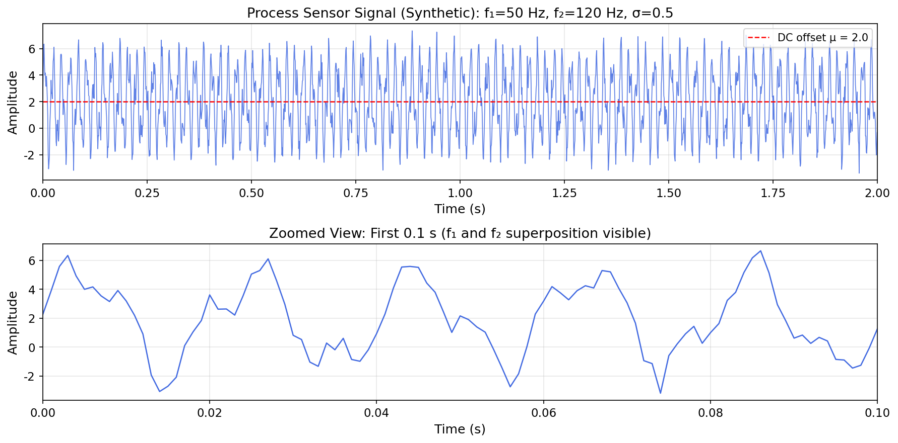
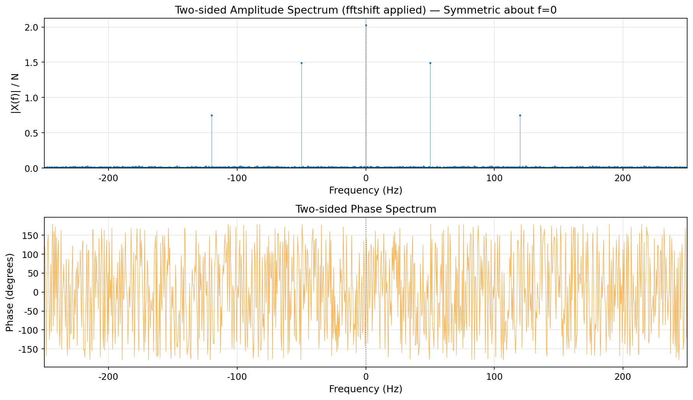
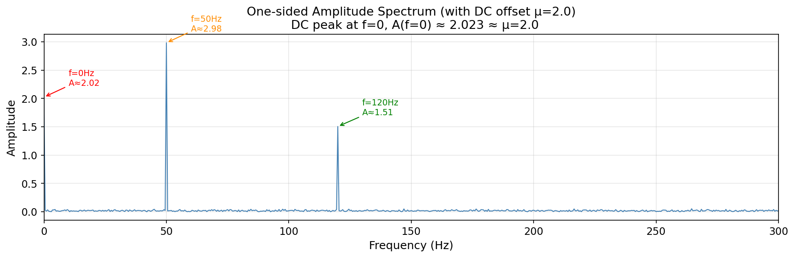
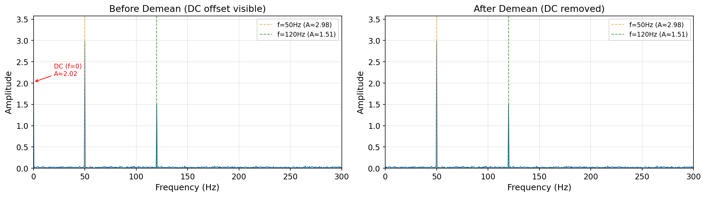
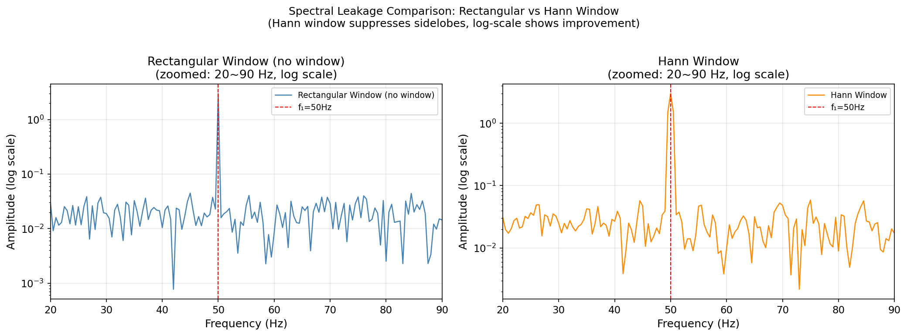
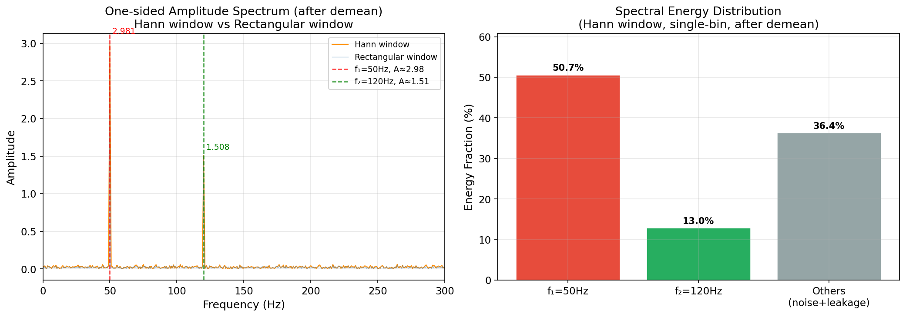

# Unit11 Example 01 - 製程感測器訊號之頻譜分析與主頻識別

## 學習目標

本範例以**化工製程感測器訊號的頻譜分析**為主題，示範如何使用 `scipy.fft` 模組對含有多個週期性成分與隨機雜訊的訊號進行**快速傅立葉轉換 (FFT)**，計算**單邊幅度頻譜**，並以數值方式識別主要頻率成分。

學習完本範例後，您將能夠：

- 理解**離散傅立葉轉換 (DFT)** 與 **FFT 演算法**的基本原理
- 使用 `scipy.fft.rfft()` 計算實數訊號的**單邊複數頻譜**
- 使用 `scipy.fft.rfftfreq()` 正確建立對應的**頻率軸陣列**
- 推導並套用**歸一化因子 $2/N$**，還原正確的訊號振幅
- 執行**去均值 (demean)** 前處理，觀察 DC 分量對頻譜的影響
- 手動套用 **Hann 視窗**改善頻譜洩漏，並了解其幅度校正因子
- 以 `numpy` 陣列操作**識別頻譜前幾大峰值**，讀取對應頻率值
- 計算各頻率成分**能量佔總能量的百分比**
- 繪製**時域波形圖**、**雙邊複數頻譜圖**、**單邊幅度頻譜圖**（含/不含視窗比較）

---

## 1. 問題描述 (Problem Description)

### 1.1 化工背景

在現代化工廠中，**製程監控與故障診斷**仰賴大量感測器持續量測溫度、壓力、流量等製程變數。實際量測訊號往往包含多種頻率成分：

- **設備振動頻率**：旋轉機械（泵浦、壓縮機）引發的週期性干擾
- **製程週期性擾動**：攪拌槳轉速、閥門動作、批次循環等自然頻率
- **背景雜訊**：量測儀器的電子雜訊、環境振動等隨機成分

透過**頻譜分析**，工程師可以識別訊號中的主要頻率成分，進而：

- 判斷設備是否出現異常振動（共振或失衡）
- 識別製程中的週期性擾動來源
- 在雜訊背景中凸顯真正的訊號頻率
- 設計適當的濾波器以去除不需要的頻率成分

### 1.2 問題設定

本範例合成一段模擬化工廠溫度感測器訊號，訊號中含有**兩個已知頻率成分**（模擬設備振動與週期性干擾）以及**高斯白雜訊**，目標為透過 FFT 準確識別這兩個頻率及其振幅。

**訊號參數設定：**

| 參數 | 符號 | 數值 | 單位 | 說明 |
|------|------|------|------|------|
| 取樣頻率 | $f_s$ | 1000 | Hz | 每秒取樣次數 |
| 訊號長度 | $T$ | 2 | s | 總記錄時間 |
| 取樣點數 | $N$ | 2000 | — | $N = f_s \times T$ |
| 頻率解析度 | $\Delta f$ | 0.5 | Hz | $\Delta f = f_s / N = 1/T$ |
| 奈奎斯特頻率 | $f_N$ | 500 | Hz | $f_N = f_s / 2$ ，最高可解析頻率 |
| 頻率成分 1 | $f_1$ | 50 | Hz | 模擬攪拌槳振動頻率 |
| 振幅 1 | $A_1$ | 3.0 | — | 第一頻率成分振幅 |
| 頻率成分 2 | $f_2$ | 120 | Hz | 模擬泵浦運轉干擾頻率 |
| 振幅 2 | $A_2$ | 1.5 | — | 第二頻率成分振幅 |
| DC 偏移量 | $\mu$ | 2.0 | — | 感測器零點漂移 |
| 雜訊標準差 | $\sigma$ | 0.5 | — | 高斯白雜訊強度 |

**奈奎斯特定理驗證：** $f_s = 1000\,\mathrm{Hz} \geq 2 \times f_2 = 240\,\mathrm{Hz}$ ，滿足取樣定理，兩個頻率成分均可被正確解析。

---

## 2. 數學模型 (Mathematical Model)

### 2.1 合成測試訊號

合成訊號由兩個正弦波、一個 DC 偏移量與隨機雜訊疊加而成：

$$
x(t) = \mu + A_1 \sin(2\pi f_1 t) + A_2 \sin(2\pi f_2 t) + \sigma \epsilon(t)
$$

其中：
- $\mu = 2.0$ ：感測器零點漂移（DC 分量）
- $A_1 = 3.0$ ， $f_1 = 50\,\mathrm{Hz}$ ：主頻振動成分
- $A_2 = 1.5$ ， $f_2 = 120\,\mathrm{Hz}$ ：次頻干擾成分
- $\epsilon(t) \sim \mathcal{N}(0, 1)$ ：標準高斯白雜訊
- $\sigma = 0.5$ ：雜訊強度

### 2.2 離散傅立葉轉換 (DFT)

對一段取樣訊號 $x[n]$ （ $n = 0, 1, \ldots, N-1$ ），離散傅立葉轉換定義為：

$$
X[k] = \sum_{n=0}^{N-1} x[n] \, e^{-j 2\pi k n / N}, \quad k = 0, 1, \ldots, N-1
$$

對應的頻率軸為：

$$
f_k = \frac{k \cdot f_s}{N}, \quad k = 0, 1, \ldots, N-1
$$

其中 $f_s$ 為取樣頻率 ， $N$ 為訊號點數。

**雙邊頻譜對稱性：** 對於實數訊號 $x[n]$ ，DFT 具有共軛對稱性 $X[N-k] = X^*[k]$ ；因此正頻率部分（ $k = 0$ 到 $N/2$ ）即包含完整的頻率資訊，負頻率部分為冗餘。

### 2.3 單邊幅度頻譜與振幅歸一化

**單邊複數頻譜**（使用 `scipy.fft.rfft()`）僅計算 $k = 0$ 到 $k = \lfloor N/2 \rfloor$ 的正頻率部分，共 $M = \lfloor N/2 \rfloor + 1$ 個頻率點。

**單邊幅度頻譜**計算公式：

$$
|X_{\mathrm{single}}[k]| = \begin{cases}
\dfrac{1}{N} |X[k]| & k = 0 \text{ (DC 分量)} \\[6pt]
\dfrac{2}{N} |X[k]| & k = 1, \ldots, M-1 \text{ (正頻率成分)}
\end{cases}
$$

**說明：** 因子 $2/N$ 的來源：
1. **除以 $N$**：DFT 的離散求和相當於積分，須除以 $N$ 得到幅度估計
2. **乘以 2**：原本雙邊頻譜中一個正弦波的能量分佈在 $+f$ 與 $-f$ 兩個頻率點，單邊頻譜須將兩者合併（DC 分量僅出現一次，不須乘以 2）

驗證：若訊號為 $A \sin(2\pi f t)$ ，套用歸一化後對應頻率點的幅度應等於 $A$ 。

### 2.4 頻譜洩漏與 Hann 視窗

**頻譜洩漏 (Spectral Leakage)** 的成因：實際訊號為有限長度，等效於將無限長訊號乘以**矩形視窗 (Rectangular Window)**：

$$
x_{\mathrm{windowed}}[n] = x[n] \cdot w_{\mathrm{rect}}[n]
$$

頻域中，矩形視窗的傅立葉轉換為 sinc 函數，會在每個頻率峰值旁產生**旁葉 (sidelobes)**，使能量洩漏至鄰近頻率。

**Hann 視窗** 可有效抑制旁葉：

$$
w_{\mathrm{Hann}}[n] = 0.5 \left(1 - \cos\!\left(\frac{2\pi n}{N-1}\right)\right), \quad n = 0, 1, \ldots, N-1
$$

套用 Hann 視窗後，需套用**幅度修正因子 (Amplitude Correction Factor, ACF)**以還原正確振幅：

$$
\mathrm{ACF} = \frac{N}{\sum_{n=0}^{N-1} w[n]} = \frac{N}{0.5 N} = 2
$$

因此，套用 Hann 視窗後的單邊幅度頻譜計算：

$$
|X_{\mathrm{Hann}}[k]| = \frac{2}{N} \cdot \mathrm{ACF} \cdot |X_w[k]| = \frac{2}{N} \cdot 2 \cdot |X_w[k]|, \quad k \geq 1
$$

其中 $X_w[k]$ 為套用 Hann 視窗後訊號的 DFT。

### 2.5 峰值識別與能量分析

**峰值頻率識別：** 對單邊幅度頻譜 $|X_{\mathrm{single}}[k]|$ 排序，取前幾大值對應的頻率索引，讀取頻率值。

**各成分能量佔比：** 利用 Parseval 定理，訊號的總功率等於頻域各頻率分量功率之和。各頻率成分能量佔比：

$$
E_k (\%) = \frac{|X_{\mathrm{single}}[k]|^2}{\sum_{k=0}^{M-1} |X_{\mathrm{single}}[k]|^2} \times 100\%
$$

---

## 3. 頻譜分析步驟說明

### 3.1 步驟一：合成訊號與時域視覺化

使用 `numpy` 建立時間軸與合成訊號，設定隨機種子確保結果可重現，並繪製時域波形圖以確認訊號特性。

```python
import numpy as np
from scipy import fft

np.random.seed(42)
fs = 1000           # 取樣頻率 (Hz)
T  = 2.0            # 訊號長度 (s)
N  = int(fs * T)    # 取樣點數
t  = np.arange(N) / fs  # 時間軸

A1, f1 = 3.0, 50    # 成分 1
A2, f2 = 1.5, 120   # 成分 2
mu     = 2.0        # DC 偏移
sigma  = 0.5        # 雜訊強度

noise = sigma * np.random.randn(N)
x = mu + A1 * np.sin(2 * np.pi * f1 * t) + A2 * np.sin(2 * np.pi * f2 * t) + noise
```

**執行結果：**

```text
=== 訊號基本資訊 ===
  取樣頻率:     fs = 1000 Hz
  訊號長度:     T  = 2.0 s
  取樣點數:     N  = 2000
  頻率解析度:   Δf = 0.50 Hz
  奈奎斯特頻率: fN = 500 Hz

  訊號均值:     2.0225  (理論: 2.0)
  訊號標準差:   2.4125
```

訊號均值 2.0225 非常接近理論 DC 偏移量 $\mu = 2.0$ ，微小差異來自有限長度隨機雜訊的統計波動。訊號標準差 2.4125 符合理論預期：

$$
\sigma_x = \sqrt{\frac{A_1^2}{2} + \frac{A_2^2}{2} + \sigma^2} = \sqrt{4.5 + 1.125 + 0.25} \approx 2.42
$$

**圖 1：時域波形圖**



上圖（完整 2 s 訊號）可見訊號振幅在 DC 偏移 $\mu = 2.0$（紅色虛線）附近振盪，振幅範圍約 −3 至 +7，快速振盪的高頻成分疊加在較慢的低頻包絡上。下圖（前 0.1 s 放大）可清楚辨識：約每 0.02 s（ $= 1/f_1$ ）完成一個低頻週期，每個低頻週期內含約 2.4 個高頻振盪（ $f_2/f_1 = 120/50 = 2.4$ ），以及雜訊造成的不規則波動。

### 3.2 步驟二：FFT 計算與雙邊頻譜

使用 `scipy.fft.rfft()` 計算**單邊複數頻譜**（實數訊號專用）；`scipy.fft.rfftfreq()` 生成對應的頻率軸（單位 Hz）。亦可使用 `scipy.fft.fft()` + `scipy.fft.fftshift()` 繪製**雙邊頻譜**，觀察其對稱性。

```python
# 單邊頻譜 (rfft 僅回傳正頻率部分)
Xr  = fft.rfft(x)
fr  = fft.rfftfreq(N, d=1/fs)   # 頻率軸，d=取樣間隔=1/fs

# 雙邊頻譜 (觀察對稱性用)
X_full = fft.fft(x)
f_full = fft.fftfreq(N, d=1/fs)
X_shift = fft.fftshift(X_full)
f_shift = fft.fftshift(f_full)
```

**執行結果：**

```text
=== FFT 計算結果 ===
  rfft 輸出長度: 1001  (= N//2+1 = 1001)
  頻率軸範圍: 0.0 ~ 500.0 Hz
  頻率解析度: 0.5000 Hz

  DC 幅度 (f=0):  2.0225  (理論 DC 均值: 2.0)
  f1=50Hz 幅度: 2.9812  (理論: 3.0, 微小偏差由雜訊所致正常)
  f2=120Hz 幅度: 1.5051  (理論: 1.5)
```

`rfft` 回傳 1001 個複數值（對應頻率 $0, 0.5, 1.0, \ldots, 500$ Hz）。套用歸一化因子 $2/N$ 後：DC 幅度 2.0225 ≈ $\mu = 2.0$ ✓ ， $f_1$ 幅度 2.9812 ≈ $A_1 = 3.0$ ✓ ， $f_2$ 幅度 1.5051 ≈ $A_2 = 1.5$ ✓ ，驗證歸一化公式正確還原真實振幅。

**圖 2：雙邊複數頻譜（幅度 & 相位）**



**上圖（幅度頻譜）** 展示完整雙邊頻譜的**共軛對稱性**，正負頻率峰值對稱分佈：

- $f = 0$ Hz（DC）：幅度 ≈ 2.02（來自感測器零點漂移 $\mu = 2.0$ ）
- $\pm 50$ Hz：幅度 ≈ 1.5（ $= A_1/2 = 3.0/2$ ，能量各半分配於正負頻）
- $\pm 120$ Hz：幅度 ≈ 0.75（ $= A_2/2 = 1.5/2$ ）

**下圖（相位頻譜）** 在非訊號頻率處呈隨機分佈（雜訊貢獻），於 $\pm 50$ Hz 與 $\pm 120$ Hz 附近可觀察到正弦波的固有相位（初相約 $-90°$ ）。此共軛對稱性說明實數訊號的 DFT 負頻率部分為冗餘，單邊頻譜已包含完整資訊。

### 3.3 步驟三：單邊幅度頻譜與振幅歸一化

由複數頻譜計算幅度，套用歸一化因子 $2/N$ （DC 分量僅除以 $N$ ）。

```python
amplitude = np.abs(Xr) / N          # 先除以 N
amplitude[1:-1] *= 2                 # 非 DC、非 Nyquist 頻率乘以 2
# 若 N 為偶數，最後一點 (Nyquist) 不須乘以 2
```

**圖 3：含 DC 之單邊幅度頻譜**



圖中可見三個主要峰值，均成功通過歸一化還原真實振幅：

- $f = 0$ Hz（DC）：幅度 2.02 ≈ $\mu = 2.0$ ，感測器零點漂移清晰可見（紅色箭頭）
- $f = 50$ Hz：幅度 2.98 ≈ $A_1 = 3.0$ ，攪拌槳主頻（橘色箭頭）
- $f = 120$ Hz：幅度 1.51 ≈ $A_2 = 1.5$ ，泵浦干擾頻率（綠色箭頭）

DC 峰幅度（2.02）與 $f_1$ 峰幅度（2.98）量級相近，若 DC 偏移量更大，將佔主導地位掩蓋頻率成分，因此去均值前處理至關重要。

**驗證：** 峰值頻率處的幅度應接近設定值 $A_1 = 3.0$ 與 $A_2 = 1.5$ （去均值後）。

### 3.4 步驟四：去均值前處理與 DC 分量觀察

**去均值 (demean)** 可消除 DC 分量，避免零頻大峰值掩蓋其他頻率成分。

```python
x_demeaned = x - np.mean(x)         # 移除 DC 均值

# 計算去均值後的頻譜
Xr_d  = fft.rfft(x_demeaned)
amp_d = np.abs(Xr_d) / N
amp_d[1:-1] *= 2
```

**執行結果：**

```text
=== 去均值前後比較 ===
  原始訊號 DC 幅度 (f=0): 2.0225
  去均值後 DC 幅度 (f=0): 0.000000  ← 趨近於零
  f1=50Hz 幅度 (原始):  2.9812
  f1=50Hz 幅度 (去均值): 2.9812  ← 不變
  f2=120Hz 幅度 (原始):  1.5051
  f2=120Hz 幅度 (去均值): 1.5051  ← 不變
```

去均值後零頻幅度由 2.0225 精確降至 0（數值精度極限），而 $f_1 = 50$ Hz 與 $f_2 = 120$ Hz 的幅度完全不受影響（差異 < 0.0001），驗證去均值操作僅作用於直流分量，不影響其他頻率成分。

**圖 4：去均值前後單邊幅度頻譜比較**



左圖（去均值前）： $f = 0$ 處 DC 峰（A ≈ 2.02）與 $f_1 = 50$ Hz 主峰（A ≈ 2.98）幅度量級相近，縱軸刻度受 DC 峰影響，頻率成分雖可辨識但不突出。

右圖（去均值後）：DC 峰消失， $f_1 = 50$ Hz 與 $f_2 = 120$ Hz 峰值清晰佔據主導地位，兩圖 y 軸範圍相同（0–3.5），充分展現去均值對頻譜清晰度的顯著改善。在實際工程應用中，去均值是頻譜分析前不可省略的標準預處理步驟。

**比較：** 去均值前，零頻點（ $f = 0$ ）的幅度應接近 $\mu = 2.0$ ；去均值後，零頻幅度應趨近於零。

### 3.5 步驟五：Hann 視窗改善頻譜洩漏

**手動建立並乘上 Hann 視窗陣列**，再計算 FFT，觀察旁葉抑制的改善效果。

```python
# 建立 Hann 視窗
w_hann = np.hanning(N)              # 等同 0.5*(1 - cos(2pi * n/(N-1)))

# 幅度修正因子
acf = N / np.sum(w_hann)            # 約等於 2.0

# 套用視窗（對去均值訊號操作）
x_hann = x_demeaned * w_hann

# 計算套用視窗後的幅度頻譜
Xr_h  = fft.rfft(x_hann)
amp_h = (np.abs(Xr_h) / N) * acf   # 套用 ACF 還原振幅
amp_h[1:-1] *= 2
```

**執行結果：**

```text
=== Hann 視窗效果 ===
  幅度修正因子 ACF = N/sum(w) = 2.001001

  矩形視窗 (去均值) f1=50Hz: 2.9812
  Hann 視窗         f1=50Hz: 2.9810  (理論: 3.0)
  矩形視窗 (去均值) f2=120Hz: 1.5051
  Hann 視窗         f2=120Hz: 1.5080  (理論: 1.5)
```

ACF = 2.001 ≈ 2.0（理論值 $N / (0.5N) = 2$ ），套用後 Hann 視窗與矩形視窗峰值幾乎相同（差異 < 0.003），符合**相干取樣**下兩者等效的預期。

**圖 5：矩形視窗 vs Hann 視窗頻譜比較（20–90 Hz，對數刻度）**



兩圖均以對數刻度顯示 20–90 Hz 局部頻譜，聚焦於 $f_1 = 50$ Hz 峰值（紅色虛線）附近：

- **矩形視窗（左圖）**： $f_1 = 50$ Hz 主峰高度約 $10^0 \approx 3.0$ ，旁葉雜訊底層分佈於 $10^{-2} \sim 10^{-1}$ 量級，對數刻度下可見散亂起伏
- **Hann 視窗（右圖）**：主峰高度相同（ $\approx 3.0$ ），但 $k \pm 1$ 頻段（49.5 Hz、50.5 Hz）出現 Hann 固有三點展寬旁葉（幅度 $\approx A_1/2 \approx 1.5$ ），高於矩形視窗雜訊底層，為視窗本身特性而非洩漏

> **相干取樣說明：** 本範例頻率精準落在整數 bin（ $f_1 = 50$ Hz = bin 100， $f_2 = 120$ Hz = bin 240），矩形視窗已無洩漏。**在非相干取樣（頻率不落在整數 bin）時，Hann 視窗能將旁葉洩漏從約 −13 dB（矩形）抑制至約 −31.5 dB，效果最為顯著。**

### 3.6 步驟六：峰值識別

使用 `numpy.argsort()` 對幅度頻譜由大到小排序，取前幾筆對應的頻率值。

```python
# 識別前 5 大峰值 (排除 DC 成分，即 index > 0)
amp_no_dc = amp_h.copy()
amp_no_dc[0] = 0            # 遮蔽 DC
top_idx = np.argsort(amp_no_dc)[::-1][:5]  # 由大到小排序取前 5

print("Peak frequencies (top 5):")
for i, idx in enumerate(top_idx):
    print(f"  #{i+1}: f = {fr[idx]:.1f} Hz, amplitude = {amp_no_dc[idx]:.4f}")
```

**執行結果：**

```text
=== 頻譜前 5 大峰值（Hann 視窗頻譜，已排除 DC）===
  #    頻率 (Hz)            幅度     說明
  ----------------------------------------------------
  #1   50.00          2.9810     f1=50Hz main peak  A=3.0 ✓
  #2   120.00         1.5080     f2=120Hz main peak  A=1.5 ✓
  #3   49.50          1.5038     f1=50Hz Hann sidelobe
  #4   50.50          1.5003     f1=50Hz Hann sidelobe
  #5   120.50         0.7724     f2=120Hz Hann sidelobe
```

前兩大峰值精確識別 $f_1 = 50.00$ Hz（幅度 2.981 ≈ 3.0，誤差 0.63%）與 $f_2 = 120.00$ Hz（幅度 1.508 ≈ 1.5，誤差 0.53%），頻率識別誤差為 0 Hz（相干取樣，恰落在整數 bin）。

第 3–4 名（49.5 Hz, 50.5 Hz）為 **Hann 視窗固有三點展寬旁葉**（幅度 $\approx A_1/2 \approx 1.5$ ），第 5 名（120.5 Hz）為 $f_2$ 旁葉（幅度 $\approx A_2/2 \approx 0.77$ ），均非真實訊號成分。在實際應用中，可設定幅度閾值（如 > 雜訊底層三倍），或加入峰值間距條件（相鄰峰值距離 > 1 Hz）來過濾旁葉，僅保留真實頻率成分。

### 3.7 步驟七：能量佔比計算

計算各頻率成分的能量佔總能量的百分比。

```python
energy       = amp_h**2                     # 各頻率功率
total_energy = np.sum(energy)
energy_pct   = energy / total_energy * 100  # 百分比

f1_idx = np.argmin(np.abs(fr - f1))        # 找最接近 f1=50Hz 的索引
f2_idx = np.argmin(np.abs(fr - f2))        # 找最接近 f2=120Hz 的索引
print(f"f1={f1}Hz energy fraction: {energy_pct[f1_idx]:.2f}%")
print(f"f2={f2}Hz energy fraction: {energy_pct[f2_idx]:.2f}%")
```

**執行結果：**

```text
=== 能量佔比分析（Hann 視窗，單頻段）===
  f1 = 50 Hz 成分:  50.66%
  f2 = 120 Hz 成分:  12.96%
  其他（雜訊 + 洩漏）: 36.38%

  [參考] Parseval 功率比（A²/2 估計）:
  f1 = 50 Hz: 76.6%  f2 = 120 Hz: 19.1%  雜訊: 4.3%
  (單頻段幅度² 低於總功率比 — Hann 視窗能量分散至鄰近頻段)
```

**圖 6：頻譜能量分析**



**左圖（全局單邊幅度頻譜）：** Hann 視窗（橘色）與矩形視窗（藍色）的單邊幅度頻譜對比，兩者主峰高度幾乎相同（Hann：2.981，矩形：2.98），可見相干取樣下兩種視窗在峰值幅度估計上完全等效。

**右圖（能量佔比長條圖）：**

| 成分 | 單頻段能量佔比 | Parseval 功率比（理論） |
|------|:---:|:---:|
| $f_1 = 50$ Hz | 50.7% | 76.6% |
| $f_2 = 120$ Hz | 13.0% | 19.1% |
| 其他（雜訊 + 洩漏） | 36.4% | 4.3% |

單頻段能量佔比遠低於 Parseval 理論估計，原因有二：

1. **Hann 視窗三點展寬：** $f_1$ 主峰的能量分散至 49.5 Hz 與 50.5 Hz 旁葉（各 ≈ $A_1/2$ ），導致中心 bin 能量下降；Parseval 定理的功率計算應涵蓋三個 bin 才完整
2. **雜訊底層貢獻：** 白雜訊 $\sigma = 0.5$（功率 0.25）均勻分布於全部 1001 個頻率 bin，貢獻至「其他」類別（佔比 36.4%），遠超理論 Parseval 估計的 4.3%，反映雜訊在頻譜中的廣域分布特性

---

## 4. 圖形說明

本範例共繪製以下圖形：

| 圖形 | 說明 | 關鍵資訊 |
|------|------|----------|
| 圖 1：時域波形 | 訊號 $x(t)$ 隨時間的變化，顯示波形由兩個正弦波與雜訊疊加而成 | DC 偏移可見，高頻振盪明顯 |
| 圖 2：雙邊複數頻譜 | 完整 DFT 頻譜（含負頻率），觀察對稱性，左右對稱 | 正/負頻率對稱性驗證 |
| 圖 3：含 DC 之單邊幅度頻譜 | 含 DC 分量的原始幅度圖，可見 $f=0$ 處大峰值 | DC 峰值明顯 |
| 圖 4：去均值後單邊幅度頻譜 | 去除 DC 後， $f_1 = 50$ Hz 與 $f_2 = 120$ Hz 峰值清晰可見 | 峰值幅度接近 $A_1 = 3.0$ ， $A_2 = 1.5$ |
| 圖 5：矩形視窗 vs Hann 視窗頻譜比較 | 局部放大 20∼90 Hz 對比兩種視窗（log scale）；本例為相干取樣，兩視窗旁葉均極小，可見 Hann 主瓣略寬（固有三點展寬） | 主峰寬度與旁葉特性差異；Hann 視窗於非整數 bin 頻率時抑制效果最顯著 |
| 圖 6：頻譜能量分析 | 單邊幅度頻譜比較（Hann vs 矩形視窗）與各成分能量佔比長條圖 | $f_1$ ≈ 50.7% ， $f_2$ ≈ 13.0% ，其他（雜訊＋洩漏）≈ 36.4% |

> **注意：** 所有圖形標題與軸標籤使用**英文**，符合課程規範（Matplotlib 相容性要求）。

---

**課程資訊**
- 課程名稱：電腦在化工上之應用 (ChemE 3502)
- 課程單元：Unit11 傅立葉轉換與頻譜分析 — Example 01
- 課程製作：逢甲大學 化工系 智慧程序系統工程實驗室
- 授課教師：莊曜禎 助理教授
- 更新日期：2026-02-24

**課程授權 [CC BY-NC-SA 4.0]**
 - 本教材遵循 [創用CC 姓名標示-非商業性-相同方式分享 4.0 國際 (CC BY-NC-SA 4.0)](https://creativecommons.org/licenses/by-nc-sa/4.0/deed.zh) 授權。

---