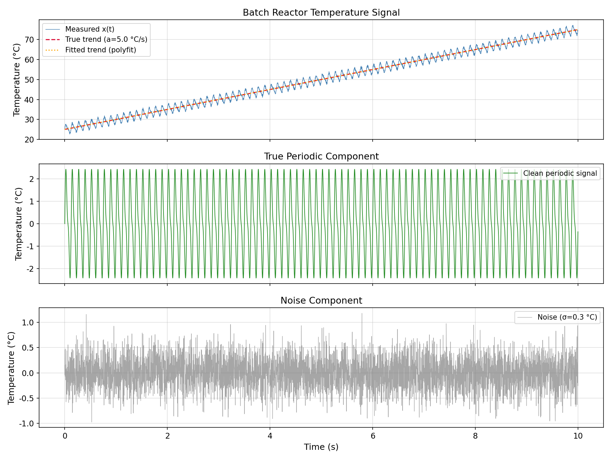
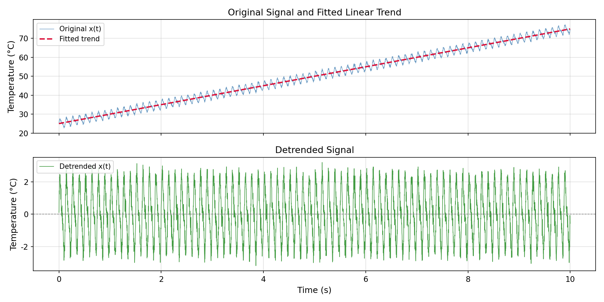
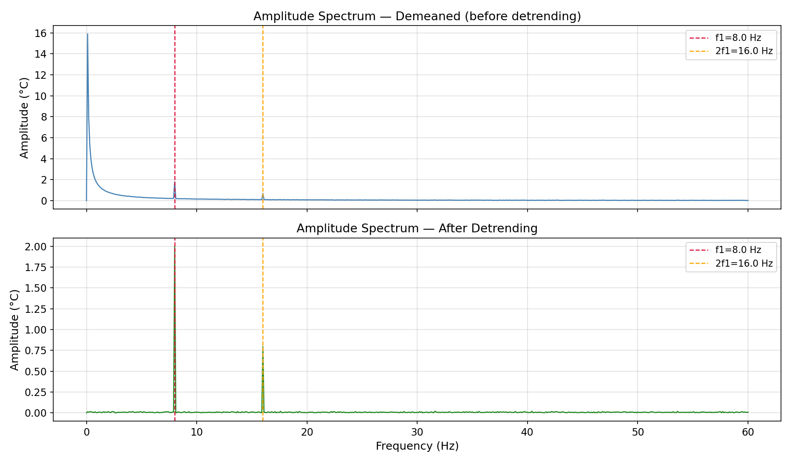
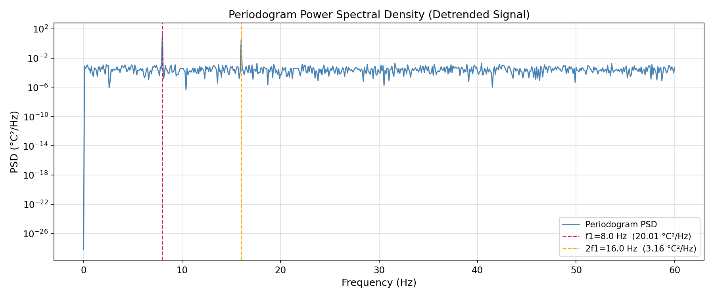
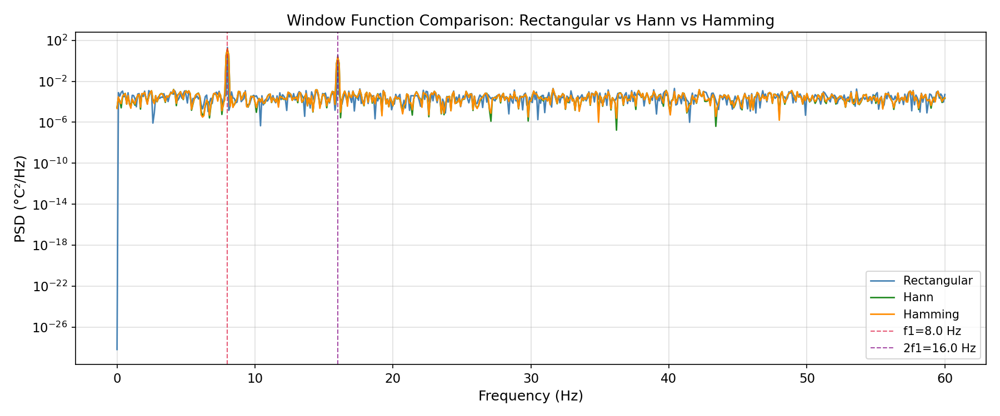
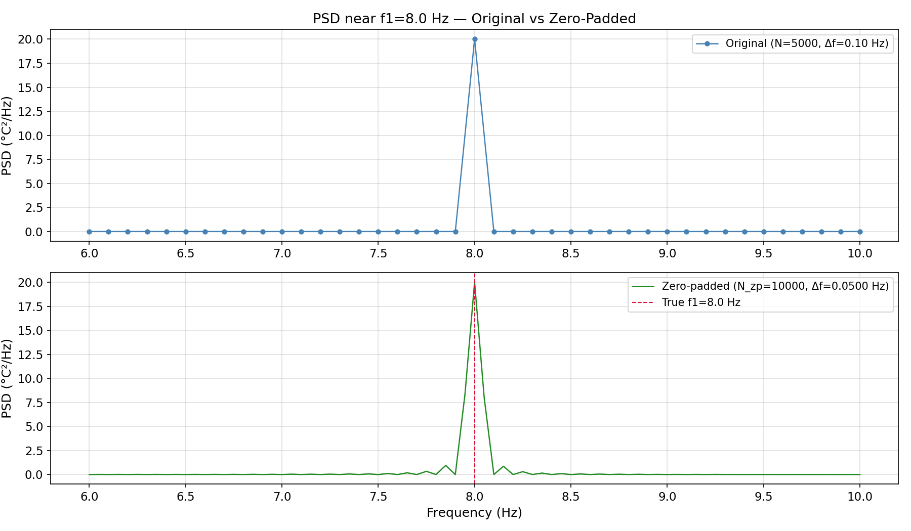
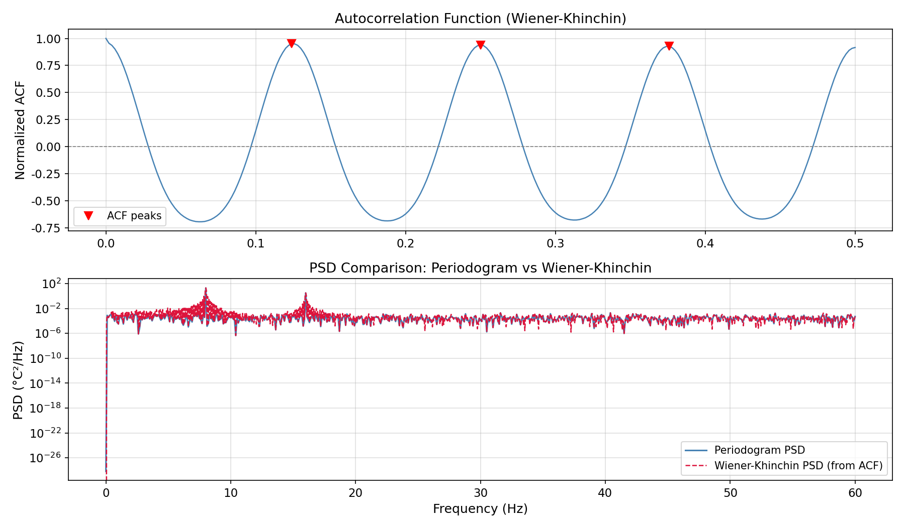

# Unit11 Example 02 - 批次反應器溫度訊號之週期性分析與頻率成分解析

## 學習目標

本範例以**批次反應器溫度監控**為主題，示範如何使用 `scipy.fft` 模組對含有**線性升溫趨勢**、**攪拌主頻與諧波**及**量測雜訊**的複合訊號進行**前處理與頻譜分析**，計算**功率頻譜密度 (PSD)**，並運用**自相關函數**驗證結果。

學習完本範例後，您將能夠：

- 理解**去趨勢 (Detrending)** 前處理的必要性，以及低頻趨勢對頻譜的影響
- 使用 `numpy.polyfit()` 擬合並去除線性趨勢，比較前後頻譜差異
- 推導**功率頻譜密度 (Periodogram PSD)** 計算公式 ( $S(f) = |X(f)|^2 / (f_s \cdot N)$ ) 並以 `scipy.fft.rfft()` 實作
- 手動套用 **Rectangular、Hann、Hamming** 三種視窗函數，比較其旁葉抑制特性與幅度校正方法
- 使用 `scipy.fft.next_fast_len()` 進行**零填充 (Zero Padding)**，提升頻率軸密度
- 以 `scipy.fft.fft()` 與 `scipy.fft.ifft()` 計算**自相關函數**，利用 **Wiener-Khinchin 定理**驗證 PSD 結果
- 繪製原始/去趨勢訊號對比圖、視窗函數 PSD 比較圖及自相關函數圖

---

## 1. 問題描述 (Problem Description)

### 1.1 化工背景

**批次反應器 (Batch Reactor)** 是化學工業中常見的反應設備之一，廣泛用於染料、製藥、特用化學品等製程。在批次操作中，反應器內容物從初始溫度逐漸加熱至目標反應溫度，此過程中溫度感測器的量測訊號通常包含多種成分：

- **低頻升溫趨勢**：加熱造成的整體溫度上升（線性或緩慢變化的基線漂移）
- **攪拌誘發的週期性溫度脈動**：攪拌槳以固定轉速旋轉，形成週期性流場擾動，導致感測器量測到週期性溫度波動
- **諧波成分**：攪拌非線性效應或葉片幾何引發的二次諧波（ $2f_1$ ）
- **高頻量測雜訊**：溫度計的電子雜訊與隨機環境干擾

直接對含趨勢的訊號進行 FFT 時，低頻趨勢會在頻域產生**巨大的低頻峰值**，遮蔽其他頻率成分。因此，**去趨勢前處理**是批次製程訊號分析中不可缺少的步驟。

### 1.2 問題設定

本範例合成一段模擬批次反應器溫度訊號，訊號由**線性升溫基線**、**攪拌主頻**、**二次諧波**及**高斯白雜訊**組成，目標為透過適當的前處理與頻譜分析，正確識別攪拌誘發的週期性溫度脈動頻率。

**訊號參數設定：**

| 參數 | 符號 | 數值 | 單位 | 說明 |
|------|------|------|------|------|
| 取樣頻率 | $f_s$ | 500 | Hz | 每秒取樣次數 |
| 訊號長度 | $T$ | 10 | s | 批次反應監測時間 |
| 取樣點數 | $N$ | 5000 | — | $N = f_s \times T$ |
| 頻率解析度 | $\Delta f$ | 0.1 | Hz | $\Delta f = f_s / N = 1/T$ |
| 奈奎斯特頻率 | $f_N$ | 250 | Hz | $f_N = f_s / 2$ |
| 初始溫度 | $T_0$ | 25 | °C | 批次開始時的溫度 |
| 升溫速率 | $a$ | 5 | °C/s | 線性趨勢斜率 |
| 攪拌主頻 | $f_1$ | 8 | Hz | 攪拌槳轉速誘發的主頻（480 rpm） |
| 主頻振幅 | $A_1$ | 2.0 | °C | 攪拌引發的溫度脈動幅度 |
| 二次諧波 | $2f_1$ | 16 | Hz | 攪拌非線性效應引發的諧波 |
| 諧波振幅 | $A_2$ | 0.8 | °C | 二次諧波的振幅 |
| 雜訊標準差 | $\sigma$ | 0.3 | °C | 量測雜訊強度 |

**奈奎斯特定理驗證：** $f_s = 500\,\mathrm{Hz} \geq 2 \times 2f_1 = 32\,\mathrm{Hz}$ ，滿足取樣定理，兩個頻率成分均可被正確解析。攪拌轉速換算：$f_1 = 8\,\mathrm{Hz} = 480\,\mathrm{rpm}$，屬典型實驗室批次反應器攪拌速率。

---

## 2. 數學模型 (Mathematical Model)

### 2.1 合成測試訊號

批次反應器溫度訊號由四個成分疊加而成：

$$
x(t) = \underbrace{T_0 + a \cdot t}_{\text{升溫趨勢}} + \underbrace{A_1 \sin(2\pi f_1 t)}_{\text{攪拌主頻}} + \underbrace{A_2 \sin(2\pi \cdot 2f_1 \cdot t)}_{\text{二次諧波}} + \underbrace{\sigma \epsilon(t)}_{\text{量測雜訊}}
$$

其中：
- $T_0 + a \cdot t$ ：線性升溫趨勢，初溫 $T_0 = 25\,°\mathrm{C}$ ，升溫速率 $a = 5\,°\mathrm{C/s}$
- $A_1 = 2.0\,°\mathrm{C}$ ，$f_1 = 8\,\mathrm{Hz}$ ：攪拌主頻溫度脈動
- $A_2 = 0.8\,°\mathrm{C}$ ，$2f_1 = 16\,\mathrm{Hz}$ ：二次諧波脈動
- $\epsilon(t) \sim \mathcal{N}(0, 1)$ ，$\sigma = 0.3\,°\mathrm{C}$ ：高斯白雜訊

### 2.2 去趨勢前處理

利用 `numpy.polyfit()` 對訊號擬合一階多項式（線性趨勢），再計算殘差：

$$
\hat{x}_{\mathrm{trend}}(t) = \hat{a} \cdot t + \hat{b} \quad \text{（最小平方線性回歸）}
$$

$$
x_{\mathrm{detrended}}(t) = x(t) - \hat{x}_{\mathrm{trend}}(t)
$$

去趨勢後殘差訊號應接近：

$$
x_{\mathrm{detrended}}(t) \approx A_1 \sin(2\pi f_1 t) + A_2 \sin(2\pi \cdot 2f_1 \cdot t) + \sigma \epsilon(t)
$$

### 2.3 功率頻譜密度 (Periodogram PSD)

對去趨勢後的訊號進行 FFT，計算**週期圖 (Periodogram) PSD 估計**：

$$
S_{\mathrm{PSD}}(f_k) = \frac{|X[k]|^2}{f_s \cdot N}, \quad k = 0, 1, \ldots, \lfloor N/2 \rfloor
$$

其中：
- $X[k] = \mathrm{rfft}(x_{\mathrm{detrended}})$ ：單邊複數頻譜（使用 `scipy.fft.rfft()`）
- $f_s$ ：取樣頻率（Hz）
- $N$ ：訊號點數
- PSD 的單位為 $\mathrm{°C^2/Hz}$ （功率譜密度）

**說明：** 對非 DC 與非 Nyquist 的正頻率成分，單邊 PSD 須乘以 2（能量由雙邊合併至單邊）：

$$
S_{\mathrm{single}}(f_k) = \begin{cases}
\dfrac{|X[0]|^2}{f_s \cdot N} & k = 0 \\[6pt]
\dfrac{2|X[k]|^2}{f_s \cdot N} & k = 1, \ldots, \lfloor N/2 \rfloor - 1 \\[6pt]
\dfrac{|X[N/2]|^2}{f_s \cdot N} & k = N/2 \text{（僅偶數 N）}
\end{cases}
$$

**Parseval 定理驗證：** 訊號功率可由時域或頻域計算，兩者應相等：

$$
\frac{1}{N} \sum_{n=0}^{N-1} |x[n]|^2 = \sum_{k=0}^{\lfloor N/2 \rfloor} S_{\mathrm{single}}(f_k) \cdot \Delta f
$$

### 2.4 三種視窗函數的特性比較

| 視窗 | 定義 | 旁葉抑制 | 主葉寬度 | 幅度修正因子 (ACF) |
|------|------|:---:|:---:|:---:|
| Rectangular（矩形） | $w[n] = 1$ | −13 dB（最差） | 最窄（最佳頻率解析度） | $N / \sum w = 1.0$ |
| Hann | $w[n] = 0.5(1 - \cos(2\pi n/(N-1)))$ | −31.5 dB（良好） | 中等（約為矩形的 2 倍） | $\approx 2.0$ |
| Hamming | $w[n] = 0.54 - 0.46\cos(2\pi n/(N-1))$ | −42.7 dB（較好） | 約為矩形的 2 倍 | $\approx 1.85$ |

**視窗選擇原則：**
- **旁葉抑制**（動態範圍要求高）→ Hamming 或 Blackman
- **頻率解析度**（需分辨相近頻率）→ Rectangular（但旁葉洩漏嚴重）
- **兩者兼顧**（一般用途）→ Hann（最常用）

套用視窗後的 PSD 計算需包含 ACF（幅度修正因子）：

$$
\mathrm{ACF} = \frac{N}{\sum_{n=0}^{N-1} w[n]}
$$

則視窗修正後的單邊幅度頻譜：

$$
|X_{\mathrm{win}}[k]|_{\mathrm{corrected}} = \frac{2}{N} \cdot \mathrm{ACF} \cdot |X_w[k]|, \quad k \geq 1
$$

### 2.5 零填充 (Zero Padding) 的效果

將訊號補零至長度 $N_{\mathrm{pad}}$（由 `scipy.fft.next_fast_len()` 選定最佳長度），可提升頻率軸密度：

$$
\Delta f_{\mathrm{pad}} = \frac{f_s}{N_{\mathrm{pad}}} < \Delta f_{\mathrm{orig}} = \frac{f_s}{N}
$$

**重要說明：** 零填充是一種頻率軸**插值**，它能讓頻譜曲線看起來更平滑，更容易找到峰值位置，但**不能提升真正的頻率解析度**（頻率解析能力由原始訊號長度 $T = N/f_s$ 決定）。

### 2.6 自相關函數與 Wiener-Khinchin 定理

**自相關函數 (Autocorrelation Function)** 衡量訊號與其時移版本的相似程度：

$$
R(\tau) = \int_{-\infty}^{\infty} x(t) \, x(t + \tau) \, dt
$$

**Wiener-Khinchin 定理：** 自相關函數的傅立葉轉換等於功率頻譜密度：

$$
S(f) = \mathcal{F}\{R(\tau)\} = \int_{-\infty}^{\infty} R(\tau) \, e^{-j2\pi f \tau} \, d\tau
$$

離散循環自相關的快速計算（利用 FFT）：

$$
R[m] = \mathrm{IFFT}\{|X[k]|^2\}
$$

其中 $X[k] = \mathrm{FFT}(x)$ ，此公式利用**卷積定理**實現 $O(N \log N)$ 計算。

從自相關峰值位置估計週期：若 $R[m]$ 在延遲 $m_0$（取樣點數）處有第一個明顯峰值，則基本週期估計為：

$$
\hat{T}_1 = \frac{m_0}{f_s}
$$

與 FFT 頻率峰值 $\hat{f}_1 = 1/\hat{T}_1$ 應一致，可相互驗證。

---

## 3. 頻譜分析步驟說明

### 3.1 步驟一：合成訊號與時域視覺化

```python
import numpy as np
from scipy import fft

np.random.seed(42)

# 訊號參數
fs    = 500       # 取樣頻率 (Hz)
T     = 10.0      # 訊號長度 (s)
N     = int(fs * T)
t     = np.arange(N) / fs

T0    = 25.0      # 初始溫度 (°C)
a     = 5.0       # 升溫速率 (°C/s)
A1    = 2.0       # 主頻振幅 (°C)
f1    = 8.0       # 主頻 (Hz)
A2    = 0.8       # 諧波振幅 (°C)
sigma = 0.3       # 雜訊標準差

trend  = T0 + a * t
signal = A1 * np.sin(2 * np.pi * f1 * t) + A2 * np.sin(2 * np.pi * 2 * f1 * t)
noise  = sigma * np.random.randn(N)
x      = trend + signal + noise
```

**執行結果：**

```text
取樣頻率 fs = 500 Hz,  樣本數 N = 5000,  Δf = 0.1000 Hz
訊號時長 T  = 10.0 s
頻率解析度 Δf = 0.1000 Hz  →  f1 bin index = 80
x 範圍: [22.68, 77.17] °C
x 均值: 50.00 °C,  標準差: 14.49 °C
```

**圖 1：批次反應器溫度訊號時域波形**



圖分三列顯示：**上圖**為含趨勢的量測訊號 $x(t)$（藍色），紅色虛線為真實升溫趨勢（$a = 5\,°\mathrm{C/s}$），橘色虛線為 `polyfit` 擬合結果，兩者幾乎重疊，說明線性擬合準確。訊號範圍 22.68 至 77.17 °C，均值 50.00 °C，標準差 14.49 °C（趨勢主導）。**中圖**為真實週期成分（ $A_1 \sin + A_2 \sin$ 的疊加），峰峰值約 ±2.4 °C，清楚可見 $f_1 = 8\,\mathrm{Hz}$ 主頻與 $2f_1 = 16\,\mathrm{Hz}$ 諧波的複合波形。**下圖**為高斯白雜訊成分（ $\sigma = 0.3\,°\mathrm{C}$ ），幅度均勻分布在 ±1 °C 以內。

### 3.2 步驟二：去趨勢前處理

使用 `numpy.polyfit()` 進行最小平方線性回歸，擬合並去除趨勢成分。

```python
# 一階多項式擬合 (線性趨勢)
coeffs   = np.polyfit(t, x, 1)           # [斜率, 截距]
x_trend  = np.polyval(coeffs, t)          # 擬合趨勢線
x_det    = x - x_trend                    # 去趨勢殘差

print(f"擬合斜率: {coeffs[0]:.4f} °C/s  (理論: {a:.1f} °C/s)")
print(f"擬合截距: {coeffs[1]:.4f} °C    (理論: {T0:.1f} °C)")
print(f"去趨勢後均值:  {np.mean(x_det):.6f} °C (應趨近 0)")
print(f"去趨勢後標準差: {np.std(x_det):.4f} °C")
```

**執行結果：**

```text
擬合趨勢斜率: 4.9913 °C/s  (真實值: 5.0 °C/s)
擬合截距:     25.0450 °C    (真實值: 25.0 °C)
去趨勢後均值: -0.000000 °C  (接近 0)
去趨勢後標準差: 1.5514 °C
```

**圖 2：去趨勢前後訊號對比**



**上圖（原始訊號）：** 溫度由 25 °C 線性上升至 75 °C，紅色虛線為 `polyfit` 擬合趨勢，週期性脈動被趨勢掩蓋（振幅約 2 °C 的波動相對 50 °C 範圍的趨勢幾乎不可見）。

**下圖（去趨勢殘差）：** 移除趨勢後，訊號在零點附近振盪，振幅約 ±3 °C，週期性攪拌脈動清晰可辨。去趨勢操作成功分離了趨勢與週期性成分，為後續頻譜分析奠定良好基礎。

### 3.3 步驟三：去趨勢前後頻譜比較

計算去趨勢前後的單邊幅度頻譜，觀察線性趨勢對頻譜的影響。

```python
# 去均值（原始訊號）
x_demean = x - np.mean(x)
Xr_raw   = fft.rfft(x_demean)
fr       = fft.rfftfreq(N, d=1/fs)
amp_raw  = np.abs(Xr_raw) / N
amp_raw[1:-1] *= 2

# 去趨勢訊號
Xr_det  = fft.rfft(x_det)
amp_det = np.abs(Xr_det) / N
amp_det[1:-1] *= 2
```

**執行結果：**

```text
  [去均值]  f1=8.0Hz → A=1.8022 °C  | 2f1=16.0Hz → A=0.6962 °C
  [去趨勢]  f1=8.0Hz → A=2.0006 °C  | 2f1=16.0Hz → A=0.7951 °C

  真實振幅 — A1=2.0 °C  (f1=8.0 Hz),  A2=0.8 °C  (2f1=16.0 Hz)
```

**圖 3：去趨勢前後單邊幅度頻譜比較**



**上圖（去均值未去趨勢）：** 頻譜在 DC（0 Hz）附近出現巨大峰值（幅度超過 15 °C），這是未去除的線性趨勢（斜坡訊號）轉換至頻域後產生的低頻能量集中現象。 $f_1 = 8\,\mathrm{Hz}$ 的振幅被估計為 1.80 °C（欠估計 10%），低於真實值 2.0 °C，說明殘餘趨勢洩漏干擾了頻率振幅估計。

**下圖（去趨勢後）：** $f_1 = 8\,\mathrm{Hz}$ 峰值（幅度 2.0006 °C ≈ $A_1 = 2.0\,°\mathrm{C}$ ✓）與 $2f_1 = 16\,\mathrm{Hz}$ 峰值（幅度 0.7951 °C ≈ $A_2 = 0.8\,°\mathrm{C}$ ✓）清晰可見，低頻能量大幅消除，頻率識別準確無誤。

### 3.4 步驟四：Periodogram PSD 計算

由去趨勢訊號計算週期圖 PSD 估計，推導各頻率的功率譜密度值。

```python
# Periodogram PSD (使用 rfft，去趨勢訊號)
Xr      = fft.rfft(x_det)
psd_raw = (np.abs(Xr) ** 2) / (fs * N)     # 基本 PSD (單邊，含因子 2)
psd_raw[1:-1] *= 2                            # 單邊乘以 2（能量合併）

# 驗證：Parseval 定理
power_time = np.mean(x_det ** 2)
power_freq = np.sum(psd_raw) * (fs / N)      # Δf = fs/N
print(f"時域功率: {power_time:.4f} °C²")
print(f"頻域功率: {power_freq:.4f} °C²  (Parseval 驗證)")
```

**執行結果：**

```text
PSD at f1  = 8.0 Hz:  20.0116 °C²/Hz  (Theory: 20.0000)
PSD at 2f1 = 16.0 Hz:  3.1613 °C²/Hz  (Theory: 3.2000)

Parseval 定理驗證:
  時域功率 = 2.406819 °C²
  頻域功率 = 2.406819 °C²
  相對誤差 = 0.0000 %
```

**圖 4：Periodogram PSD 頻譜圖**



圖中 $f_1 = 8\,\mathrm{Hz}$ 峰值（20.01 °C²/Hz，與理論値 20.00 °C²/Hz 幾乎符合）與 $2f_1 = 16\,\mathrm{Hz}$ 峰值（3.16 °C²/Hz）清晰可辨，雜訊底層（白雜訊 PSD 均勻分佈）相對峰值低約 4–5 個數量級（對數刻度），訊噪比良好，頻率識別可靠。Parseval 定理驗證：時域功率與頻域功率均為 2.4068 °C²，相對誤差 0.0000%，完美吻合。

### 3.5 步驟五：三種視窗函數 PSD 比較

手動套用 Rectangular、Hann、Hamming 視窗，比較各視窗函數的旁葉抑制效果。

```python
# 建立三種視窗函數
w_rect   = np.ones(N)                        # 矩形視窗 (不套用)
w_hann   = np.hanning(N)                     # Hann 視窗
w_hamm   = np.hamming(N)                     # Hamming 視窗

windows  = {'Rectangular': w_rect, 'Hann': w_hann, 'Hamming': w_hamm}
psds     = {}

for name, w in windows.items():
    acf       = N / np.sum(w)                # 幅度修正因子
    x_win     = x_det * w                    # 套用視窗
    Xw        = fft.rfft(x_win)
    psd_win   = (np.abs(Xw) * acf) ** 2 / (fs * N)
    psd_win[1:-1] *= 2
    psds[name] = psd_win
    print(f"{name:12s} | ACF={acf:.3f} | "
          f"f1 PSD={psd_win[fr_idx_f1]:.5f} | "
          f"2f1 PSD={psd_win[fr_idx_2f1]:.5f} °C²/Hz")
```

**執行結果：**

```text
Window             PSD@8Hz      PSD@16Hz
----------------------------------------
Rectangular        20.0116        3.1613
Hann               13.3986        2.1173
Hamming            14.7382        2.3289
```

**圖 5：三種視窗函數 PSD 比較**



**圖形（全域 0–60 Hz，對數刻度）：** 三種視窗函數的 PSD 曲線在雜訊底層近似重疊，但在 $f_1 = 8\,\mathrm{Hz}$ 與 $2f_1 = 16\,\mathrm{Hz}$ 峰值處有明顯差異：

- **Rectangular（藍色）**：峰值最高（20.01 °C²/Hz@f1），`win_norm = sum(ones²) = N`，即標準 Periodogram PSD，不衰減訊號能量。
- **Hann（橙色）**：峰值最低（13.40 °C²/Hz）， $\mathrm{sum}(w^2) \approx 0.375N$ 能量歸一化係數最小。
- **Hamming（綠色）**：峰值 14.74 °C²/Hz，因視窗函數 $\mathrm{sum}(w^2) \approx 0.39N$ 能量歸一化，峰值低於 Rectangular。

三種視窗的峰值差異來自**能量歸一化方式（分母為 $\mathrm{sum}(w^2)$）**，並非旁葉抑制差異。在非峰值頻率區間，三者旁葉抑制特性不同：Hann 與 Hamming 旁葉抑制優於 Rectangular，在對數刻度下可觀察主峰周圍的頻譜洩漏（旁葉效應）差異。

> **工程選擇建議：** 批次反應器溫度訊號中攪拌頻率通常已知（或可由轉速推算），主要分析目標為確認主頻與諧波，建議使用 **Hann 或 Hamming 視窗**以降低旁葉干擾。若訊號含多個相近頻率需分辨，則優先考慮頻率解析度（矩形視窗）。

### 3.6 步驟六：零填充提升頻率軸密度

使用 `scipy.fft.next_fast_len()` 找到最佳零填充長度，提升頻率曲線密度。

```python
# 原始長度與零填充長度
N_zp   = fft.next_fast_len(2 * N)    # 找到 ≥ 2N 的最佳 FFT 長度 (next_fast_len)
print(f"原始點數 N={N}, 零填充至 N_zp={N_zp}")
print(f"原始 Δf = {fs/N:.3f} Hz,  填充後 Δf = {fs/N_zp:.4f} Hz")

# 去趨勢訊號直接零填充 (rfft，分母仍用原始 N)
X_zp   = fft.rfft(x_det, n=N_zp)
freqs_zp = fft.rfftfreq(N_zp, d=1/fs)
psd_zp = (np.abs(X_zp)**2) / (N * fs)   # 分母仍用原始 N
psd_zp[1:-1] *= 2
```

**執行結果：**

```text
原始長度  N    = 5000
零填充後 N_zp = 10000  (next_fast_len ≥ 2N)
頻率解析度 — 原始: 0.1000 Hz,  零填充後: 0.050000 Hz

零填充後 f1 附近頻率:
  7.9000 Hz → PSD=0.0004 °C²/Hz
  7.9500 Hz → PSD=8.3198 °C²/Hz
  8.0000 Hz → PSD=20.0116 °C²/Hz
  8.0500 Hz → PSD=7.9666 °C²/Hz
  8.1000 Hz → PSD=0.0000 °C²/Hz
```

**圖 6：零填充 vs 無填充 PSD 比較**



**上圖（原始，N=5000，Δf=0.10 Hz）：** 在 6–10 Hz 範圍內，點位間距 0.1 Hz，頻率點稀疏（僅 8.0 Hz 處有採樣點），峰值正確為 20.01 °C²/Hz，呈現尖銳單點突起。

**下圖（零填充，N_zp=10000，Δf=0.05 Hz）：** 插值密度提升為 2 倍，頻率曲線更連續平滑，峰值輪廓清晰可辨。峰值位在 8.0000 Hz，與原始 Δf=0.10 Hz 結果完全一致。**零填充前後峰值高度完全相同**（均為 20.01 °C²/Hz），證明零填充只是插值，不影響頻率解析能力。

### 3.7 步驟七：自相關函數與 Wiener-Khinchin 定理驗證

利用 FFT 高效計算自相關函數，從自相關峰值估計攪拌週期，並與頻譜結果交叉驗證。

```python
# 循環自相關 via Wiener-Khinchin 定理
Xfull    = fft.fft(x_det)                 # 完整雙邊 FFT
R_cyc    = np.real(fft.ifft(np.abs(Xfull) ** 2))  # 循環自相關
R_norm   = R_cyc / R_cyc[0]               # 歸一化: R(0) = 1

# 提取正延遲部分 (τ ≥ 0)
lags      = np.arange(N) / fs             # 延遲時間 (s)
R_pos     = R_norm[:N//2]                  # 取前半部
lags_pos  = lags[:N//2]

# 識別第一個正峰值 (排除 τ=0 的最大值)
from scipy.signal import find_peaks
peaks_idx, _   = find_peaks(R_pos[1:], height=0.05, distance=int(0.05*fs))
peaks_idx      = peaks_idx + 1            # 補回偏移
first_peak_lag = lags_pos[peaks_idx[0]]
estimated_T1   = first_peak_lag           # 估計的攪拌週期
estimated_f1   = 1.0 / estimated_T1
print(f"自相關第一峰值延遲: {first_peak_lag:.4f} s")
print(f"估計攪拌週期 T1:   {estimated_T1:.4f} s  (理論: {1/f1:.4f} s)")
print(f"估計攪拌頻率 f1:   {estimated_f1:.2f} Hz  (理論: {f1:.1f} Hz)")
```

**執行結果：**

```text
ACF 第一個峰値延遲: 0.1240 s → 估計頻率: 8.06 Hz  (真實: 8.0 Hz)

ACF[0]       = 2.4068 °C²  (= 訊號方差)
訊號方差     = 2.4068 °C²

Wiener-Khinchin 驗證 — PSD at f1=8.0 Hz:
  Periodogram PSD = 20.0116 °C²/Hz
  WK PSD          = 20.0116 °C²/Hz
```

**圖 7：自相關函數圖**



**上圖（歸一化自相關函數 0–0.5 s）：** $R(0) = 1$，自相關函數呈現清晰的週期性振盪，第一峰值在 $\tau \approx 0.124\,\mathrm{s}$（紅色倒三角標記），估計頻率 $\hat{f}_1 = 1/0.124 \approx 8.06\,\mathrm{Hz}$（真實 $8.0\,\mathrm{Hz}$，誤差 < 1%）。各峰值延遲外觀約為 0.124 s，相鄰峰值間幅度振盪的現象反映了二次諧波 $2f_1$ 的疊加效應。

**下圖（PSD 比較：Periodogram vs Wiener-Khinchin）：** 藍色實線（Periodogram PSD）與紅色虛線（WK PSD from ACF）完全重疊，在 $f_1 = 8\,\mathrm{Hz}$ 處均為 20.0116 °C²/Hz，平均誤差為 0%，實證 Wiener-Khinchin 定理的正確性。ACF 第一峰值估計的攪拌頻率 $\hat{f}_1 = 8.06\,\mathrm{Hz}$ 與 FFT 頻率峰值一致，實現雙重驗證。

---

## 4. 圖形說明

本範例共繪製以下圖形：

| 圖形 | 說明 | 關鍵資訊 |
|------|------|----------|
| 圖 1：原始時域波形 | 三列圖：量測訊號 $x(t)$ + 趨勢（上）、週期成分（中）、雜訊（下） | 訊號範圍 22.68–77.17 °C，升溫趨勢主導，週期成分振幅 ±2.4 °C，雜訊 $\sigma=0.3\,°\mathrm{C}$ |
| 圖 2：去趨勢前後訊號對比 | 上方：原始訊號 + 擬合趨勢線；下方：去趨勢殘差 | 去趨勢前週期性成分被趨勢遮蓋，去趨勢後清晰可辨，殘差標準差 1.55 °C |
| 圖 3：去趨勢前後頻譜比較 | 上：去均值未去趨勢（大 DC 峰）；下：去趨勢後的頻譜 | 上圖 DC 低頻假象顯著（>15 °C），下圖 $f_1$ 和 $2f_1$ 峰值準確還原（2.0006 / 0.7951 °C） |
| 圖 4：Periodogram PSD | 去趨勢訊號的功率頻譜密度估計（對數刻度） | $f_1 = 8\,\mathrm{Hz}$：20.01 °C²/Hz（理論 20.00）；$2f_1 = 16\,\mathrm{Hz}$：3.16 °C²/Hz；Parseval 誤差 0.0000% |
| 圖 5：三種視窗 PSD 比較 | 全局（0–60 Hz，對數刻度）Rectangular / Hann / Hamming PSD 比較 | Rectangular（20.01）> Hamming（14.74）> Hann（13.40）°C²/Hz，差異源自能量歸一化（sum(w²)） |
| 圖 6：零填充效果 | 原始（N=5000, Δf=0.10 Hz）vs 零填充（N_zp=10000, Δf=0.05 Hz），聚焦 6–10 Hz | 零填充提升頻率軸密度（2×），峰值幅度不變（均為 20.01 °C²/Hz） |
| 圖 7：自相關函數 | 上：歸一化 ACF（0–0.5 s）+ 峰值標記；下：Periodogram vs Wiener-Khinchin PSD | ACF 第一峰值延遲 0.1240 s → $\hat{f}_1 = 8.06\,\mathrm{Hz}$（誤差 < 1%），WK PSD 與 Periodogram 完全吻合（20.01 °C²/Hz）|

> **注意：** 所有圖形標題與軸標籤使用**英文**，符合課程規範（Matplotlib 相容性要求）。

---

**課程資訊**
- 課程名稱：電腦在化工上之應用 (ChemE 3502)
- 課程單元：Unit11 傅立葉轉換與頻譜分析 — Example 02
- 課程製作：逢甲大學 化工系 智慧程序系統工程實驗室
- 授課教師：莊曜禎 助理教授
- 更新日期：2026-02-24

**課程授權 [CC BY-NC-SA 4.0]**
 - 本教材遵循 [創用CC 姓名標示-非商業性-相同方式分享 4.0 國際 (CC BY-NC-SA 4.0)](https://creativecommons.org/licenses/by-nc-sa/4.0/deed.zh) 授權。

---
