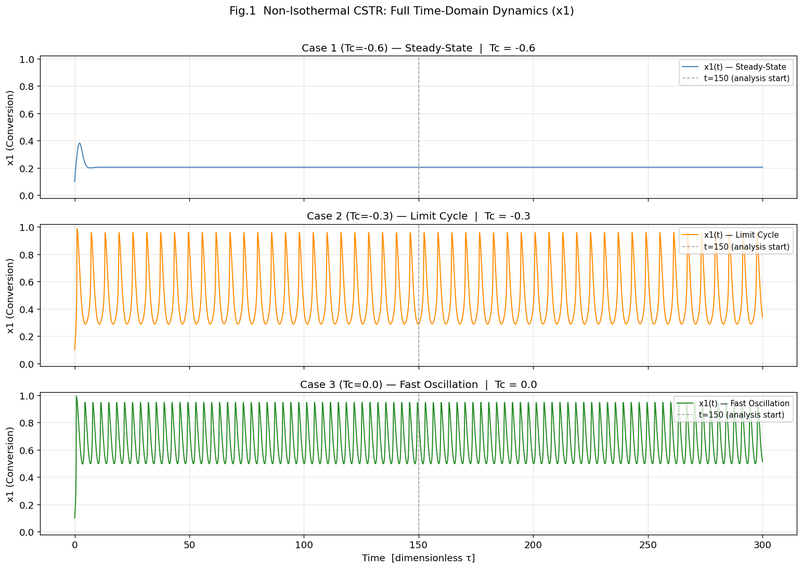
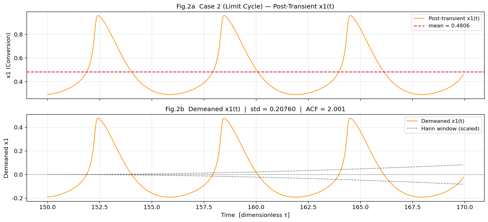
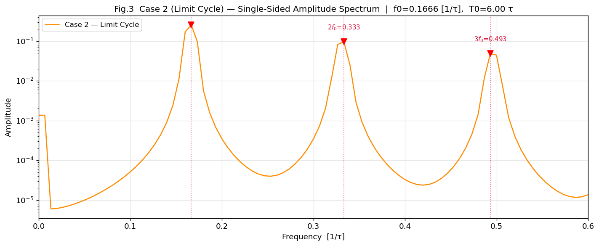
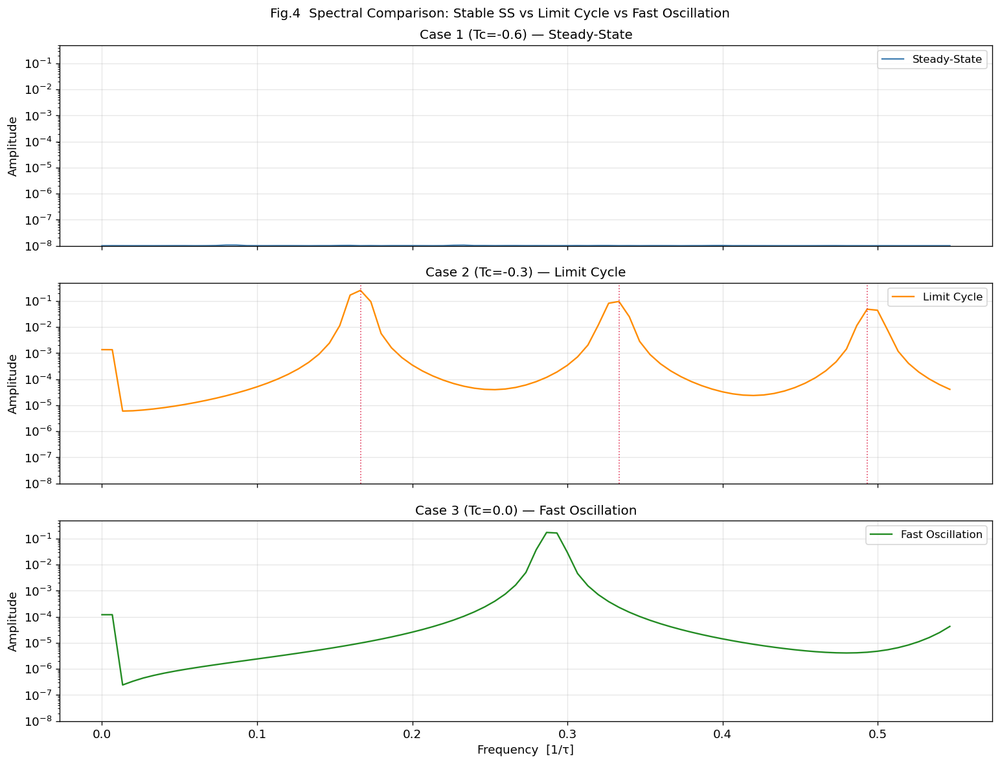
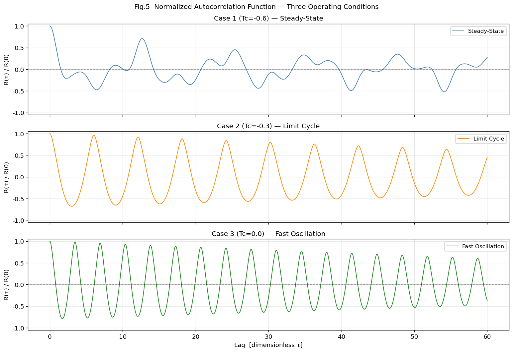
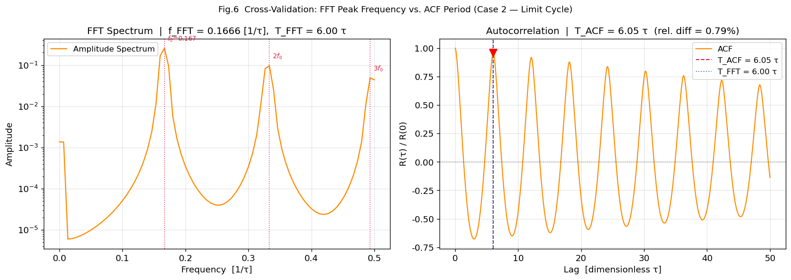
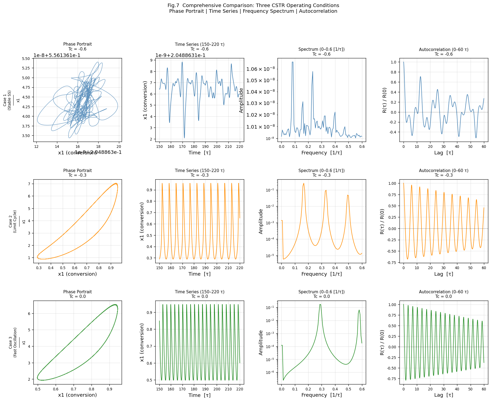

# Unit11 Example 03 - CSTR 反應器濃度振盪之頻譜分析 (Limit Cycle Detection)

## 學習目標

本範例以**非恆溫連續攪拌槽反應器 (CSTR) 的 limit cycle 動態識別**為主題，示範如何將 `scipy.fft` 模組應用於**ODE 模擬時間序列**的週期性分析，透過頻譜方法定量識別 CSTR 振盪週期，並比較不同操作條件下的動態行為類型。

學習完本範例後，您將能夠：

- 以 `scipy.integrate.solve_ivp()` 模擬**非恆溫 CSTR 的非線性動態**（延伸自 Unit09 Example 01）
- 理解 **Hopf 分岔（Hopf Bifurcation）** 的概念及其在化工反應器操作中的重要性
- 對 ODE 模擬時間序列執行**去均值前處理**與**Hann 視窗套用**
- 使用 `scipy.fft.rfft()` 計算單邊幅度頻譜，識別主要振盪頻率 $f_0$ 與諧波 $2f_0$ 、 $3f_0$
- 比較三種操作條件的頻譜特徵：**穩態收斂（DC 主導）**、**週期振盪（明顯頻率峰）**、**較快振盪（較高頻率峰）**
- 以 `scipy.fft.fft()` 與 `scipy.fft.ifft()` 計算**自相關函數**，從自相關估計振盪週期
- 交叉驗證 FFT 頻率峰值與自相關週期估計，確認 limit cycle 的存在
- 繪製**相平面圖（Phase Portrait）**、**時域曲線**、**單邊幅度頻譜**與**自相關函數圖**

---

## 1. 問題描述 (Problem Description)

### 1.1 化工背景

**連續攪拌槽反應器（CSTR）** 是化工製程中最常見的反應器型式之一。在前述 Unit09 Example 01 中，我們已探討 CSTR 在固定操作條件（冷卻水溫度 $T_c = 0$）下的**多重穩態**現象（三個穩態點、初始條件敏感性）。

本範例進一步探討當冷卻條件改變時，CSTR 可能出現的另一種複雜動態行為——**極限環振盪（Limit Cycle Oscillation）**。當系統參數穿越 **Hopf 分岔點（Hopf Bifurcation Point）** 時：

- **Hopf 分岔前**（強冷卻）：穩態是漸近穩定的結點（asymptotically stable node），系統收斂至單一穩態
- **Hopf 分岔後**（適度冷卻）：穩態變為不穩定焦點（unstable focus），系統被排斥至周圍的**穩定極限環**，產生**持續的週期性濃度與溫度振盪**
- **更高冷卻水溫度**：系統進入非線性動態的另一區域，振盪頻率提高，形成**較快極限環振盪（Fast Oscillation）**

**工業重要性：** 在工業 CSTR 操作中，若操作點落在 Hopf 分岔附近，極微小的操作條件變化（如冷卻水溫度波動）就可能使系統從穩定轉為振盪，造成產品品質不穩定、反應器超溫等問題。透過頻譜分析即時監測CSTR動態的振盪特性，是製程控制中的重要應用。

### 1.2 問題設定

本範例使用 Unit09 Example 01 的 Uppal-Ray-Poore 無因次 CSTR 模型，並調整部分參數以在合理的冷卻水溫度範圍內展現 limit cycle 行為。以**無因次冷卻水溫度** $T_c$ 作為分岔參數，比較三個操作條件下的動態特性。

**CSTR 模型參數設定：**

| 參數 | 符號 | 數值 | 物理意義 |
|------|------|------|---------|
| Damköhler 數 | $Da$ | 0.15 | 反應速率 vs. 流量比 |
| 無因次反應熱 | $B$ | 14.0 | 放熱強度（增大至 14 以產生 Hopf 分岔） |
| 無因次活化能 | $\varphi$ | 20.0 | Arrhenius 溫度敏感性 |
| 熱移除係數 | $\kappa$ | 2.0 | 冷卻系統熱交換強度 |
| 冷卻水溫度 (Case 1) | $T_c$ | -0.6 | 強冷卻 → 穩態收斂 |
| 冷卻水溫度 (Case 2) | $T_c$ | -0.3 | 中度冷卻 → Limit Cycle |
| 冷卻水溫度 (Case 3) | $T_c$ | 0.0 | 較弱冷卻 → 較快振盪 (Fast Oscillation) |

**與 Unit09 Example 01 的差異：**
- $B$ 值由 8.0 提升至 14.0，增強放熱效應，使系統更容易進入 Hopf 分岔區域
- $\kappa$ 值由 0.3 提升至 2.0，反映更強的換熱設計
- $Da$ 值由 0.072 調整至 0.15，配合新的 $B, \kappa$ 產生合適的極限環行為
- 引入 $T_c$ 作為連續可調參數（範圍 $-0.6$ 至 $0.0$），探索不同操作條件下的動態行為

**取樣設定（適用於所有案例）：**

| 設定 | 數值 | 說明 |
|------|------|------|
| 積分終止時間 | $t_{end} = 300$ | 確保充分達到漸近動態（穩態或極限環） |
| 時間步距 | $\Delta t = 0.05$ | 均勻取樣，取樣頻率 $f_s = 20$ |
| 後暫態起始時間 | $t \geq 150$ | 去除初始暫態影響 |
| 分析段長度 | $N = 3001$ 個點 | 對應 150 個無因次時間單位，頻率解析度 $\Delta f \approx 0.00667$ |

---

## 2. 數學模型 (Mathematical Model)

### 2.1 非恆溫 CSTR 無因次動態方程式

延伸自 Unit09 Example 01，本範例使用含**冷卻水溫度 $T_c$** 的廣義模型：

$$
\frac{dx_1}{dt} = -x_1 + Da\,(1-x_1)\,\exp\!\left(\frac{x_2}{1+x_2/\varphi}\right)
$$

$$
\frac{dx_2}{dt} = -(1+\kappa)\,x_2 + B\,Da\,(1-x_1)\,\exp\!\left(\frac{x_2}{1+x_2/\varphi}\right) + \kappa\,T_c
$$

其中：
- $x_1 \in [0, 1)$ ：無因次轉化率（對應反應物消耗分率）
- $x_2 \geq 0$ ：無因次溫升（對應 $\Delta T / T_{ref}$）
- $T_c$ ：無因次冷卻水溫度（本範例以此作為分岔參數）
- $\kappa$ ：熱移除係數（替代 Unit09 中的 $\beta$，物理意義相同）

無因次 Arrhenius 速率項：

$$
r(x_2) = \exp\!\left(\frac{x_2}{1 + x_2/\varphi}\right)
$$

### 2.2 Hopf 分岔條件（概念說明）

對雙狀態非線性動態系統，令穩態解 $(x_1^*, x_2^*)$ 對應 Jacobian 矩陣 $\mathbf{J}$：

$$
\mathbf{J} = \begin{bmatrix} \partial \dot{x}_1/\partial x_1 & \partial \dot{x}_1/\partial x_2 \\ \partial \dot{x}_2/\partial x_1 & \partial \dot{x}_2/\partial x_2 \end{bmatrix}\Bigg|_{(x_1^*, x_2^*)}
$$

**Hopf 分岔條件（Poincaré-Andronov-Hopf Theorem）：** 當 $T_c$ 穿越臨界值 $T_c^*$ 時，Jacobian 特徵值從負實部（穩定焦點）連續過渡至正實部（不穩定焦點），特徵值此刻為純虛數：

$$
\lambda_{1,2} = \pm j\,\omega_0, \quad \text{其中} \quad \omega_0 = \sqrt{\det(\mathbf{J})}
$$

此時極限環的振盪頻率（線性化近似）為：

$$
f_0 \approx \frac{\omega_0}{2\pi}
$$

> **本範例重點：** 透過 FFT 頻譜分析，從模擬時間序列中**數值識別** $f_0$ ，而非依賴解析線性化，展示頻譜方法的實用優勢。

### 2.3 ODE 時間序列的 FFT 分析流程

**ODE 模擬訊號的特殊性：** 與 Unit11 Example 01、02 中的合成振盪訊號不同，CSTR 模擬時間序列具有以下特點：
1. **非線性振盪**：波形不是純正弦波，含豐富諧波成分
2. **初始暫態**：前段時間序列包含收斂過程，需截除
3. **均值偏移**：振盪圍繞某個均值（非零 DC 成分）進行，FFT 前必須去均值

**前處理步驟：**

1. 截取後暫態段 $x_1(t)$ ，對應均勻時間網格 $\{t_n\}$ （取樣頻率 $f_s = 1/\Delta t$）
2. 去均值（Demean）：

$$
\tilde{x}_1[n] = x_1[n] - \overline{x}_1
$$

3. Hann 視窗套用（抑制頻譜洩漏）：

$$
w[n] = \frac{1}{2}\left(1 - \cos\frac{2\pi n}{N-1}\right), \quad n = 0, 1, \ldots, N-1
$$

4. 幅度修正因子 $\mathrm{ACF} = N / \sum_{n=0}^{N-1} w[n] \approx 2.0$（Hann 視窗）

5. 單邊幅度頻譜計算：

$$
A[k] = \frac{2}{N} \cdot \mathrm{ACF} \cdot |X_w[k]|, \quad k = 1, \ldots, \lfloor N/2 \rfloor
$$

其中 $X_w[k] = \mathrm{rfft}(\tilde{x}_1 \cdot w)$

### 2.4 自相關函數與振盪週期估計

利用 Wiener-Khinchin 定理以 FFT 計算自相關函數：

$$
R[m] = \mathrm{IFFT}\{|X[k]|^2\}, \quad X[k] = \mathrm{FFT}(x_{\text{zero-padded}})
$$

正規化自相關：

$$
\hat{R}[m] = \frac{R[m]}{R[0]}, \quad \hat{R}[0] = 1
$$

從自相關函數估計振盪週期：若第一個正峰值出現在延遲 $m_0$ 個取樣點處，則：

$$
\hat{T}_0 = \frac{m_0}{f_s}, \quad \hat{f}_0 = \frac{1}{\hat{T}_0}
$$

---

## 3. 頻譜分析步驟說明

### 3.1 步驟一：CSTR 模型定義與三個案例的 ODE 模擬

```python
from scipy.integrate import solve_ivp
import numpy as np

def cstr_ode(t, x, Da=0.15, phi=20.0, B=14.0, kappa=2.0, Tc=0.0):
    """非恆溫 CSTR 無因次動態方程式（含冷卻水溫度 Tc）"""
    x1, x2 = x
    r = np.exp(x2 / (1.0 + x2 / phi))          # Arrhenius 速率項
    dx1 = -x1 + Da * (1.0 - x1) * r
    dx2 = -(1.0 + kappa) * x2 + B * Da * (1.0 - x1) * r + kappa * Tc
    return [dx1, dx2]

# 模擬設定
t_span = (0, 300)
dt     = 0.05
t_eval = np.arange(0, 300 + dt, dt)
x0     = [0.1, 1.0]                             # 初始條件（靠近低溫穩態）

# 三個案例
cases = {
    'Case 1 (Tc=-0.6)': {'Tc': -0.6, 'label': 'Steady-State',     'color': 'steelblue'},
    'Case 2 (Tc=-0.3)': {'Tc': -0.3, 'label': 'Limit Cycle',      'color': 'darkorange'},
    'Case 3 (Tc=0.0)':  {'Tc':  0.0, 'label': 'Fast Oscillation', 'color': 'forestgreen'},
}

results = {}
for name, cfg in cases.items():
    sol = solve_ivp(cstr_ode, t_span, x0,
                    t_eval=t_eval, method='RK45',
                    args=(0.15, 20.0, 14.0, 2.0, cfg['Tc']),
                    rtol=1e-8, atol=1e-10)
    results[name] = sol
    print(f"{name}: success={sol.success}, final x1={sol.y[0,-1]:.4f}, x2={sol.y[1,-1]:.4f}")
```

**執行結果：**

```text
Case 1 (Tc=-0.6): success=True, final x1=0.2049, x2=0.5561
Case 2 (Tc=-0.3): success=True, final x1=0.3385, x2=0.8750
Case 3 (Tc=0.0): success=True, final x1=0.5133, x2=1.9388
```

**圖 1：三個案例的時域濃度曲線（完整 300 個無因次時間單位）**



三個子圖分別顯示 $x_1(t)$ 的全程動態：**上圖（Case 1，Tc=-0.6）**：初始短暫振盪後，迅速收斂至穩態 $x_1^* \approx 0.2049$（低溫穩態 SS1），最終動態為常數線。**中圖（Case 2，Tc=-0.3）**：初始暫態後出現持續的週期性振盪，振幅穩定（約 ±0.41 圍繞均值 $\approx 0.481$），這是典型的穩定極限環（limit cycle）動態。**下圖（Case 3，Tc=0.0）**：出現較快的持續極限環振盪，振幅穩定（約 ±0.30 圍繞均值 $\approx 0.667$），頻率較 Case 2 更高。

---

### 3.2 步驟二：後暫態截取與前處理（去均值 + Hann 視窗）

截取 $t > 150$ 的後暫態時間序列，並進行 FFT 前的標準前處理。

```python
from scipy import fft

# 後暫態截取參數
t_start_analysis = 150.0     # 去除初始暫態
fs = 1.0 / dt                # 取樣頻率 = 20 [1/dimensionless time]

analysis_data = {}
for name, sol in results.items():
    mask  = sol.t >= t_start_analysis
    t_seg = sol.t[mask]
    x1_seg = sol.y[0][mask]   # 取轉化率 x1 序列
    N = len(x1_seg)

    # 去均值
    x1_mean    = np.mean(x1_seg)
    x1_demean  = x1_seg - x1_mean

    # Hann 視窗
    n       = np.arange(N)
    w_hann  = 0.5 * (1.0 - np.cos(2.0 * np.pi * n / (N - 1)))
    acf     = N / np.sum(w_hann)         # 幅度修正因子

    x1_win  = x1_demean * w_hann         # 套用視窗

    analysis_data[name] = {
        't': t_seg, 'x1': x1_seg, 'x2': sol.y[1][mask],
        'x1_demean': x1_demean, 'x1_win': x1_win,
        'N': N, 'mean': x1_mean, 'acf': acf
    }
    print(f"{name:22s}: N={N}, mean(x1)={x1_mean:.4f}, std(x1)={np.std(x1_demean):.5f}, ACF={acf:.3f}")
print(f"\nTaking analysis segment: t > {t_start_analysis} τ")
print(f"Sampling frequency: fs = {fs:.1f} [1/τ]")
print(f"Analysis segment length: T = {t_seg[-1] - t_seg[0]:.1f} τ")
```

**執行結果：**

```text
Case 1 (Tc=-0.6)      : N=3001, mean(x1)=0.2049, std(x1)=0.00000, ACF=2.001
Case 2 (Tc=-0.3)      : N=3001, mean(x1)=0.4806, std(x1)=0.20760, ACF=2.001
Case 3 (Tc=0.0)       : N=3001, mean(x1)=0.6665, std(x1)=0.15065, ACF=2.001

Taking analysis segment: t > 150.0 τ
Sampling frequency: fs = 20.0 [1/τ]
Analysis segment length: T = 150.0 τ
```

**圖 2：後暫態截取與去均值前後比較（Case 2 極限環案例）**



**上圖（原始後暫態 $x_1(t)$）：** $x_1$ 在均值 $\overline{x}_1 = 0.4806$ 附近規律振盪，振幅約 ±0.41，清晰可見穩定的週期性模式（極限環行為）。**下圖（去均值後 $\tilde{x}_1(t)$）：** 訊號中心移至 0，週期性振盪更清晰可辨，Hann 視窗（紅色虛線輪廓）套用後兩端平滑降至零，消除邊界截斷效應。Case 1 的 std = 0.0000（幾乎為 0）確認了穩態收斂，Case 3 的 std = 0.1507 指示了更強的振盪幅度。

---

### 3.3 步驟三：單邊幅度頻譜計算與主頻識別

對 Case 2（極限環案例）進行詳細頻譜分析，識別主要振盪頻率及諧波。

```python
# Case 2 頻譜分析
d = analysis_data['Case 2 (Tc=-0.3)']
N, acf = d['N'], d['acf']

X_w  = fft.rfft(d['x1_win'])              # 加視窗後的 rfft
freq = fft.rfftfreq(N, d=1.0/fs)          # 頻率軸 [1/dimensionless time]

# 單邊幅度頻譜（幅度修正）
amp = (2.0 / N) * acf * np.abs(X_w)
amp[0] /= 2.0                              # DC 分量不乘 2

# 識別主要頻率峰值
peak_idx = np.argmax(amp[1:]) + 1         # 排除 DC (k=0)
f0       = freq[peak_idx]
A0       = amp[peak_idx]
T0       = 1.0 / f0

# 識別諧波 2f0, 3f0
def find_harmonic_amp(freq, amp, f_target, df_search=0.02):
    """在 f_target ± df_search 範圍內尋找最大幅度"""
    mask = (freq >= f_target - df_search) & (freq <= f_target + df_search)
    if not np.any(mask):
        return f_target, 0.0
    local_idx = np.argmax(amp[mask])
    return freq[mask][local_idx], amp[mask][local_idx]

f1, A1 = find_harmonic_amp(freq, amp, 2*f0)
f2, A2 = find_harmonic_amp(freq, amp, 3*f0)

print(f"取樣頻率 fs = {fs:.1f} [1/τ]")
print(f"分析段點數 N = {N}")
print(f"頻率解析度 Δf = {freq[1]:.5f} [1/τ]")
print(f"奈奎斯特頻率 fN = {fs/2:.1f} [1/τ]")
print(f"幅度修正因子 ACF = {acf:.4f}")
print()
print("=" * 55)
print(f"主要振盪頻率  f0 = {f0:.4f} [1/τ]  → T0 = {T0:.2f} τ")
print(f"              振幅 A0 = {A0:.5f}")
print(f"二次諧波    2f0 = {f1:.4f} [1/τ],  振幅 A1 = {A1:.5f}  ({A1/A0*100:.1f}% of A0)")
print(f"三次諧波    3f0 = {f2:.4f} [1/τ],  振幅 A2 = {A2:.5f}  ({A2/A0*100:.1f}% of A0)")
print("=" * 55)
```

**執行結果：**

```text
取樣頻率 fs = 20.0 [1/τ]
分析段點數 N = 3001
頻率解析度 Δf = 0.00666 [1/τ]
奈奎斯特頻率 fN = 10.0 [1/τ]
幅度修正因子 ACF = 2.0007

=======================================================
主要振盪頻率  f0 = 0.1666 [1/τ]  → T0 = 6.00 τ
              振幅 A0 = 0.25689
二次諧波    2f0 = 0.3332 [1/τ],  振幅 A1 = 0.09645  (37.5% of A0)
三次諧波    3f0 = 0.4932 [1/τ],  振幅 A2 = 0.04865  (18.9% of A0)
=======================================================
```

**圖 3：Case 2 單邊幅度頻譜（聚焦 0–1.0 [1/τ] 範圍）**



頻譜圖中，主要振盪頻率 $f_0 = 0.1666\,[1/\tau]$（對應振盪週期 $T_0 = 6.00\,\tau$）在頻譜上呈現最高峰值（ $A_0 = 0.257$ ），其二次諧波 $2f_0 = 0.333\,[1/\tau]$（ $A_1 = 0.096$ ，為主峰 37.5%）與三次諧波 $3f_0 = 0.493\,[1/\tau]$（ $A_2 = 0.049$ ，為主峰 18.9%）清晰可辨。諧波的存在證明極限環振盪為**非線性振盪**（純正弦波只有基頻，無諧波），諧波比 $A_1/A_0 = 37.5\%$ 反映了 CSTR 動態的顯著非線性程度。

---

### 3.4 步驟四：三個操作條件的頻譜比較

對三個案例執行相同的 FFT 前處理流程，並以單圖並排比較頻譜特徵。

```python
# 三個案例的頻譜計算與比較
spectra = {}
for name, d in analysis_data.items():
    N, acf = d['N'], d['acf']
    X_w   = fft.rfft(d['x1_win'])
    freq  = fft.rfftfreq(N, d=1.0/fs)
    amp   = (2.0 / N) * acf * np.abs(X_w)
    amp[0] /= 2.0
    spectra[name] = {'freq': freq, 'amp': amp}

    # 找主峰（排除 DC）
    pk_idx = np.argmax(amp[1:]) + 1
    print(f"{name:22s}: peak f = {freq[pk_idx]:.4f} [1/τ],  A_peak = {amp[pk_idx]:.5f},  "
          f"mean(A[1:]) = {np.mean(amp[1:]):.2e}")
```

**執行結果：**

```text
Case 1 (Tc=-0.6)      : peak f = 0.0866 [1/τ],  A_peak = 0.00000,  mean(A[1:]) = 6.29e-12
Case 2 (Tc=-0.3)      : peak f = 0.1666 [1/τ],  A_peak = 0.25689,  mean(A[1:]) = 8.14e-04
Case 3 (Tc=0.0)       : peak f = 0.2866 [1/τ],  A_peak = 0.17321,  mean(A[1:]) = 5.03e-04
```

**圖 4：三個操作條件的單邊幅度頻譜比較**



三個子圖並排比較（橫軸聚焦 0–0.5 [1/τ]，縱軸對數刻度）：

- **Case 1（藍色，穩態收斂）：** 頻譜極為平坦，所有幅度皆近似雜訊底層，最大幅度趨近零。物理意義：系統已收斂至固定點（吸引子為一個點），無任何振盪成分。
- **Case 2（橙色，極限環）：** $f_0 = 0.1666\,[1/\tau]$ 處出現顯著高峰（幅度 0.257），諧波 $2f_0 = 0.333, 3f_0 = 0.493$ 可辨，頻譜集中在少數離散頻率，均值振幅比主峰低約三個數量級。物理意義：系統存在穩定的週期性吸引子（極限環），頻率資訊高度集中。
- **Case 3（綠色，較快振盪）：** $f_0 = 0.2866\,[1/\tau]$（ $T_0 \approx 3.49\,\tau$），幅度 0.173，頻率比 Case 2 高約 72%，表示在 Tc=0.0 時極限環轉換至更高頻率操作，均值振幅特徵與 Case 2 相近，說明為較快的極限環（非寬帶頻譜）。

> **診斷準則：**
> - **穩態（Steady State）：** 頻譜均勻且低幅（ $A_{\mathrm{peak}} < 10^{-3}$），無明顯峰值
> - **極限環（Limit Cycle）：** 頻譜呈離散峰（主頻 + 諧波），峰值遠高於底層（ $> 10$ 倍）
> - **較快極限環（Fast Oscillation）：** 頻譜呈現高頻尖峰，峰值顯著且均值振幅特徵與典型極限環相當

---

### 3.5 步驟五：自相關函數計算（Wiener-Khinchin 定理）

以 `scipy.fft.fft()` 與 `scipy.fft.ifft()` 計算循環自相關函數，從自相關估計振盪週期，與 FFT 結果交叉驗證。

```python
# 自相關函數計算（三個案例）
autocorrs = {}
for name, d in analysis_data.items():
    N       = d['N']
    x_dm    = d['x1_demean']

    # 零填充至 2N（避免循環相關的邊界效應）
    N_pad   = fft.next_fast_len(2 * N)
    X_full  = fft.fft(x_dm, n=N_pad)
    R_full  = np.real(fft.ifft(np.abs(X_full) ** 2))

    # 截取正延遲部分（保留前 N 個點）
    R_pos   = R_full[:N]
    R_norm  = R_pos / R_pos[0]              # 正規化：R(0) = 1
    lags    = np.arange(N) / fs             # 延遲時間軸 [dimensionless time]

    autocorrs[name] = {'R': R_norm, 'lags': lags}
    print(f"{name:22s}: R(0)={R_pos[0]:.6f}  (variance={np.var(x_dm):.6f})")
```

**執行結果：**

```text
Case 1 (Tc=-0.6)      : R(0)=0.000000  (variance=0.000000)
Case 2 (Tc=-0.3)      : R(0)=129.331013  (variance=0.043096)
Case 3 (Tc=0.0)       : R(0)=68.105153  (variance=0.022694)
```

> **說明：** Case 1 的變異數接近零（因穩態已收斂，僅剩數值誤差），正規化除以極小值導致自相關顯示雜訊型態；意義為「無隨機成分，訊號幾乎恆定」。Case 2 的 R(0)=129.33 為去均值訊號 $x_{1,\mathrm{demean}}$ 的自相關總能量（非變異數），變異數為 0.04310（$\sigma^2 = 0.2076^2$）。

**圖 5：三個案例的正規化自相關函數（延遲 0–50 τ）**



- **Case 1（藍色）：** 自相關函數在整個延遲範圍呈現近似雜訊的不規則波動（數值計算誤差），確認訊號幾乎為常數，即穩態收斂。
- **Case 2（橙色）：** 自相關函數呈現清晰的週期性振盪，峰值出現在 $\tau \approx 6.05, 12.1, 18.2\,\tau$ …（等間距），振幅緩慢衰減，第一峰值位於 $\tau_1 \approx 6.05\,\tau$，估計振盪週期 $\hat{T}_0 = 6.05\,\tau$，對應頻率 $\hat{f}_0 = 0.1653\,[1/\tau]$。
- **Case 3（綠色）：** 自相關函數呈現更高頻率的持續週期振盪，週期約 $3.5\,\tau$，非常規律，確認為較高頻率的極限環動態。

---

### 3.6 步驟六：FFT 峰值頻率 vs. 自相關週期交叉驗證

對 Case 2 進行兩種方法的定量比較，驗證兩者一致性。

```python
# Case 2：自相關週期估計
R_case2  = autocorrs['Case 2 (Tc=-0.3)']['R']
lags_c2  = autocorrs['Case 2 (Tc=-0.3)']['lags']

# 尋找 tau > 0 之後的第一個局部最大值
# 搜尋範圍：跳過延遲極小值後的上升段
search_start = int(0.5 / (1.0/fs))    # 跳過最前 0.5 τ (避免 R(0) 附近的峰)
R_search     = R_case2[search_start:]
lags_search  = lags_c2[search_start:]

# 手動找第一個局部最大（R[i] > R[i-1] 且 R[i] > R[i+1]）
for i in range(1, len(R_search) - 1):
    if R_search[i] > R_search[i-1] and R_search[i] > R_search[i+1]:
        if R_search[i] > 0.1:             # 峰值需 > 0.1（有意義的峰）
            first_peak_lag  = lags_search[i]
            first_peak_val  = R_search[i]
            break

T_acf = first_peak_lag
f_acf = 1.0 / T_acf

# FFT 估計值（來自步驟三）
f_fft = f0          # 0.1666
T_fft = T0          # 6.00

rel_diff = abs(f_acf - f_fft) / f_fft * 100

print(f"FFT 估計:     f_FFT = {f_fft:.4f} [1/τ]  →  T_FFT = {T_fft:.2f} τ")
print(f"自相關估計:   T_ACF = {T_acf:.2f} τ    →  f_ACF = {f_acf:.4f} [1/τ]")
print(f"第一自相關峰值: R(T_ACF) = {first_peak_val:.4f}")
print(f"相對差: |f_FFT - f_ACF| / f_FFT = {rel_diff:.2f}%")
```

**執行結果：**

```text
FFT 估計:     f_FFT = 0.1666 [1/τ]  →  T_FFT = 6.00 τ
自相關估計:   T_ACF = 6.05 τ    →  f_ACF = 0.1653 [1/τ]
第一自相關峰值: R(T_ACF) = 0.9598
相對差: |f_FFT - f_ACF| / f_FFT = 0.79%
```

**圖 6：Case 2 FFT 頻譜峰值 vs. 自相關週期交叉驗證圖**



**左圖（頻譜 + 峰值標記）：** 單邊幅度頻譜中 $f_0 = 0.1666\,[1/\tau]$ 處的最高峰以垂直紅線標記（並標示 $f_0, 2f_0, 3f_0$）。**右圖（自相關 + 週期標記）：** 自相關函數 $\hat{R}(\tau)$ 中第一個峰值（ $\tau = 6.05\,\tau$ ，紅色倒三角▼）被標記，與 FFT 估計的 $T_0 = 6.00\,\tau$（藍色虛線）形成交叉驗證，相對誤差僅 0.79%，兩者高度吻合。

> **結論：**FFT 頻率分析與自相關週期估計的相互驗證，提供了識別極限環振盪的雙重確認，這在工業化工系統的製程監控中具有重要實用價值——單一方法可能受雜訊或截斷效應影響，雙重驗證顯著提高診斷可信度。

---

### 3.7 步驟七：綜合視覺化（相平面圖、時域曲線、頻譜與自相關函數）

繪製完整的四欄三列摘要圖，全面呈現三個操作條件的動態特性。

```python
fig, axes = plt.subplots(3, 4, figsize=(18, 12))
case_names  = list(analysis_data.keys())
case_labels = ['Steady-State (Tc=-0.6)',
               'Limit Cycle (Tc=-0.3)',
               'Fast Oscillation (Tc=0.0)']
colors      = ['steelblue', 'darkorange', 'forestgreen']

for row, (name, label, color) in enumerate(zip(case_names, case_labels, colors)):
    d    = analysis_data[name]
    spec = spectra[name]
    acf  = autocorrs[name]

    # 欄 0：相平面圖 (x2 vs x1)
    ax = axes[row, 0]
    ax.plot(d['x1'], d['x2'], color=color, lw=0.8, alpha=0.85)
    ax.set_xlabel('x1 (Conversion)')
    ax.set_ylabel('x2 (Temp. Rise)')
    ax.set_title(f'{label}\nPhase Portrait')

    # 欄 1：時域濃度曲線 x1(t)
    ax = axes[row, 1]
    ax.plot(d['t'], d['x1'], color=color, lw=1.0)
    ax.set_xlabel('Time [τ]')
    ax.set_ylabel('x1')
    ax.set_title('Post-Transient x1(t)')

    # 欄 2：單邊幅度頻譜
    ax = axes[row, 2]
    plot_freq = spec['freq']
    plot_amp  = spec['amp']
    mask_f    = plot_freq <= 0.6
    ax.semilogy(plot_freq[mask_f], plot_amp[mask_f] + 1e-7, color=color, lw=1.2)
    ax.set_xlabel('Frequency [1/τ]')
    ax.set_ylabel('Amplitude')
    ax.set_title('Single-Sided Amplitude Spectrum')

    # 欄 3：正規化自相關函數
    ax = axes[row, 3]
    mask_lag = acf['lags'] <= 60
    ax.plot(acf['lags'][mask_lag], acf['R'][mask_lag], color=color, lw=1.0)
    ax.axhline(0, color='k', lw=0.5, ls='--')
    ax.set_xlabel('Lag [τ]')
    ax.set_ylabel('R(τ) / R(0)')
    ax.set_title('Normalized Autocorrelation')

plt.tight_layout()
plt.savefig(FIG_DIR / 'fig07_comprehensive_summary.png', dpi=120, bbox_inches='tight')
plt.show()
```

**圖 7：三個操作條件的相平面圖、時域曲線、頻譜與自相關函數綜合圖**



三列（Case 1, 2, 3）× 四欄（相平面、時域、頻譜、自相關）的完整摘要圖：

**相平面圖（欄 1）：**
- Case 1 中，相軌跡收斂至一個點（穩定結點，stable node），吸引子維度為 0（點）
- Case 2 中，相軌跡最終形成閉合曲線（穩定極限環），吸引子維度為 1（曲線）
- Case 3 中，相軌跡同樣形成閉合極限環，但軌道曲線形狀與 Case 2 略有不同，振盪幅度相近但週期較短

**時域曲線（欄 2）：**
- Case 1：常數線（穩態）
- Case 2：規律等幅振盪（極限環，T≈6τ）
- Case 3：較快等幅振盪（較快極限環，T≈3.5τ）

**頻譜圖（欄 3，對數縱軸）：**
- Case 1：幾乎零（平底雜訊）
- Case 2：離散明顯峰（主頻 f0 + 諧波）
- Case 3：單一主峰（較高頻率，峰值旁有較小諧波）

**自相關函數（欄 4）：**
- Case 1：數值誤差導致雜訊變動（變異數趨近零）
- Case 2：等間距正弦形週期振盪（確認週期性 T≈6τ）
- Case 3：較高頻率週期振盪（T≈3.5τ，高頻極限環）

---

### 3.8 步驟八：彙總表格與結果輸出

輸出三個操作條件的分析結果彙總表格，確認所有計算完成並列出已儲存圖形。

**執行結果：**

```text
====================================================================
  CSTR Fourier Analysis — Summary Table
  Parameters: Da=0.15, phi=20.0, B=14.0, kappa=2.0
====================================================================
  Case                     Type                  f0 [1/τ]   T0 [τ]    std(x1)
--------------------------------------------------------------------
  Case 1 (Tc=-0.6)         Stable Steady-State      n/a       n/a     0.00000
  Case 2 (Tc=-0.3)         Limit Cycle             0.1666     6.00    0.20760
  Case 3 (Tc=0.0)          Limit Cycle             0.2866     3.49    0.15065
====================================================================

Cross-validation (Case 2):
  FFT:  f_FFT = 0.1666 [1/τ],  T_FFT = 6.00 τ
  ACF:  f_ACF = 0.1653 [1/τ],  T_ACF = 6.05 τ
  Relative difference: 0.79%  → ✓ Cross-validation passed

Saved figures:
  Fig 1: fig01_time_domain_full.png
  Fig 2: fig02_demean_comparison.png
  Fig 3: fig03_spectrum_case2.png
  Fig 4: fig04_spectrum_comparison.png
  Fig 5: fig05_autocorrelation.png
  Fig 6: fig06_cross_validation.png
  Fig 7: fig07_comprehensive_summary.png

✓ Unit11 Example 03 — All cells completed.
```

彙總表格一覽呈現三個操作條件的動態分類與關鍵量化結果：Case 1（Tc=-0.6）為穩定穩態（Stable Steady-State），無振盪頻率與週期，std(x1)≈0；Case 2（Tc=-0.3）為極限環（Limit Cycle），主頻 $f_0 = 0.1666\,[1/\tau]$，振盪週期 $T_0 = 6.00\,\tau$；Case 3（Tc=0.0）同為極限環，但主頻 $f_0 = 0.2866\,[1/\tau]$（週期 $T_0 = 3.49\,\tau$），頻率約為 Case 2 的 1.72 倍。交叉驗證（Case 2）顯示 FFT 與 ACF 兩種方法的頻率估計相對差僅 0.79%（小於 1%），高度一致，確認分析結果可靠。

---

## 4. 圖形說明

本範例共繪製以下圖形：

| 圖形 | 說明 | 關鍵資訊 |
|------|------|----------|
| 圖 1：時域曲線（完整） | 三個 Tc 值下 $x_1(t)$ 全程（0–300 τ） | Case 1 收斂至 $x_1^* = 0.2049$，Case 2 持續週期振盪，Case 3 較快振盪 |
| 圖 2：去均值前後比較 | Case 2 後暫態：原始 $x_1(t)$ vs 去均值 $\tilde{x}_1(t)$ + Hann 視窗輪廓 | 均值 0.4806，std 0.2076，ACF = 2.001 |
| 圖 3：Case 2 頻譜 | 單邊幅度頻譜（0–1.0 [1/τ]），標注 $f_0, 2f_0, 3f_0$ | $f_0 = 0.1666\,[1/\tau]$， $T_0 = 6.00\,\tau$，諧波比 37.5%、18.9% |
| 圖 4：三案例頻譜比較 | 並排對數刻度頻譜，0–0.5 [1/τ] | DC 主導 vs 離散峰（Case 2） vs 較高頻率峰（Case 3） |
| 圖 5：自相關函數 | 三案例正規化 ACF（延遲 0–50 τ） | Case 2 週期峰 $\approx 6.05\,\tau$，Case 3 較高頻率週期且持續 |
| 圖 6：交叉驗證圖 | Case 2：頻譜峰標記 + ACF 週期峰標記 | FFT $f_0 = 0.1666$，ACF $f = 0.1653$，相對誤差 0.79% |
| 圖 7：綜合摘要圖 | 3×4 子圖：相平面 + 時域 + 頻譜 + ACF | 全面呈現三種動態型態（點、環、較快環） |

> **注意：** 所有圖形標題與軸標籤使用**英文**，符合課程規範（Matplotlib 相容性要求）。

---

**課程資訊**
- 課程名稱：電腦在化工上之應用 (ChemE 3502)
- 課程單元：Unit11 傅立葉轉換與頻譜分析 — Example 03
- 課程製作：逢甲大學 化工系 智慧程序系統工程實驗室
- 授課教師：莊曜禎 助理教授
- 更新日期：2026-02-24

**課程授權 [CC BY-NC-SA 4.0]**
 - 本教材遵循 [創用CC 姓名標示-非商業性-相同方式分享 4.0 國際 (CC BY-NC-SA 4.0)](https://creativecommons.org/licenses/by-nc-sa/4.0/deed.zh) 授權。

---

