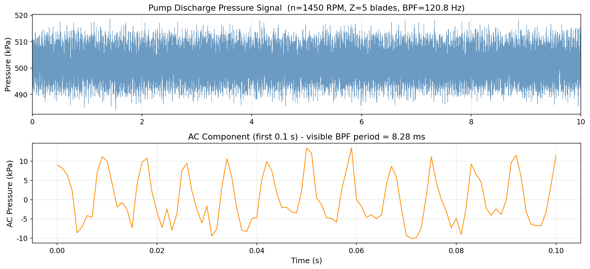
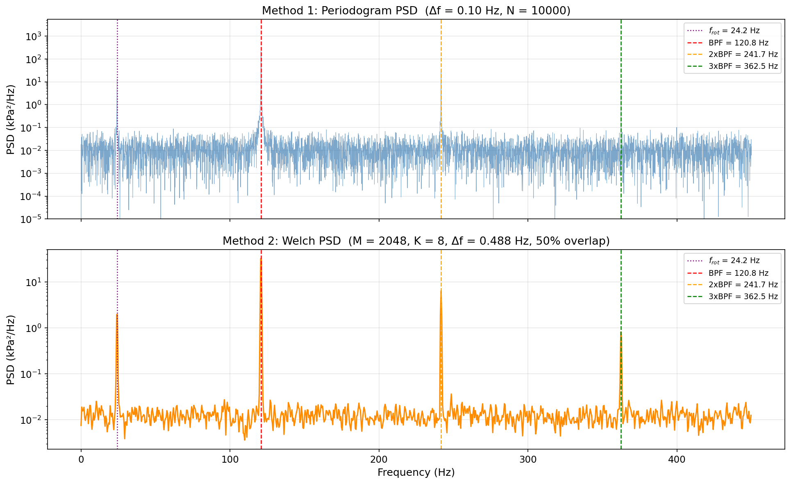
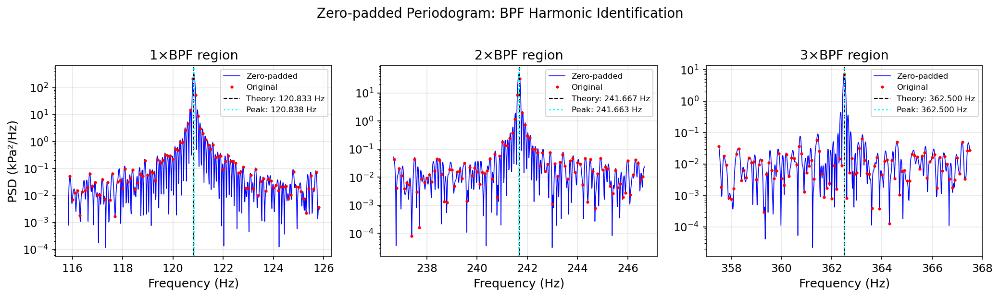
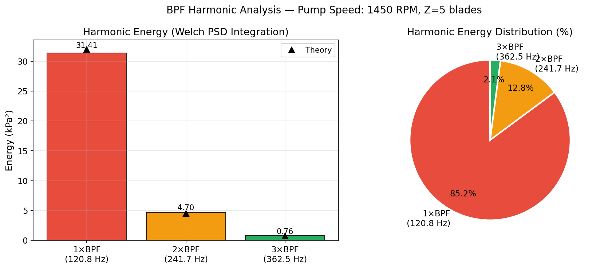
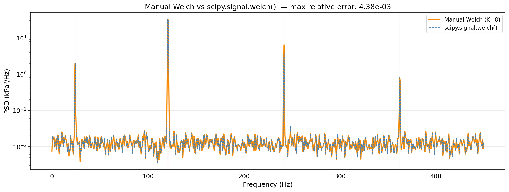

# Unit11 Example 05 - 管道壓力脈動之 PSD 分析與泵浦葉片通過頻率識別 (Pump BPF Analysis)

## 學習目標

本範例以**離心泵浦管道壓力脈動之功率頻譜密度 (PSD) 分析**為主題，示範如何使用 `scipy.fft` 模組計算 **Periodogram** 與手動實作 **Welch 法**，從泵浦壓力訊號中識別**葉片通過頻率 (Blade Passing Frequency, BPF)** 及其諧波，評估泵浦運行狀態。

學習完本範例後，您將能夠：

- 理解**葉片通過頻率 (BPF)** 的物理意義，以及 $f_{\mathrm{BPF}} = (n_{\mathrm{rpm}}/60) \times Z_{\mathrm{blade}}$ 的計算方式
- 以 `numpy` 合成含基頻（轉速）、BPF、諧波與隨機雜訊的泵浦壓力脈動訊號
- 使用 `scipy.fft.rfft()` 計算完整訊號的 **Periodogram PSD**，觀察頻譜方差大、不平滑的現象
- 理解 **Welch 法**的原理：分段、加 Hann 視窗、各段 FFT 後取平均，以降低頻譜方差
- 以 `scipy.fft` 手動迴圈實作 Welch 法，驗證其降低方差的效果
- 使用 `scipy.fft.next_fast_len()` 零填充，提升低頻段的頻率軸密度，精確定位 BPF 峰值
- 識別 $f_{\mathrm{BPF}}$ 、 $2f_{\mathrm{BPF}}$ 、 $3f_{\mathrm{BPF}}$ 諧波，計算各諧波能量分布
- 了解 `scipy.signal.welch()` 的呼叫方式，驗證其與手動 Welch 法結果等價

---

## 1. 問題描述 (Problem Description)

### 1.1 化工背景：離心泵浦壓力脈動

**離心泵浦 (Centrifugal Pump)** 是化工廠中最常見的流體輸送設備，廣泛應用於管線循環、冷卻水系統、反應物料輸送等場合。在泵浦運行時，葉輪（impeller）的旋轉會在管道中產生周期性壓力脈動，這些脈動是泵浦的**固有振動特徵**，攜帶豐富的泵浦健康狀態資訊。

#### 葉片通過頻率 (Blade Passing Frequency, BPF)

每當葉片（blade）通過泵殼的舌部（cutwater/tongue）時，會引發一次壓力脈動。若泵浦轉速為 $n_{\mathrm{rpm}}$ (RPM)，葉片數為 $Z_{\mathrm{blade}}$ ，則葉片通過頻率為：

$$
f_{\mathrm{BPF}} = \frac{n_{\mathrm{rpm}}}{60} \times Z_{\mathrm{blade}} \quad \text{(Hz)}
$$

此外，轉速本身的基頻（轉頻）為：

$$
f_{\mathrm{rot}} = \frac{n_{\mathrm{rpm}}}{60} \quad \text{(Hz)}
$$

BPF 及其諧波（ $2f_{\mathrm{BPF}}$ 、 $3f_{\mathrm{BPF}}$ 等）在壓力脈動頻譜中形成明顯的尖峰，構成泵浦的「頻率指紋」。

| 頻率成分 | 公式 | 物理意義 |
|----------|------|----------|
| 轉頻 $f_{\mathrm{rot}}$ | $n_{\mathrm{rpm}}/60$ | 葉輪一圈對應一個脈動 |
| 葉片通過頻率 $f_{\mathrm{BPF}}$ | $f_{\mathrm{rot}} \times Z_{\mathrm{blade}}$ | 每圈 $Z$ 個葉片通過舌部 |
| 二次諧波 $2f_{\mathrm{BPF}}$ | $2 \times f_{\mathrm{BPF}}$ | 非線性效應產生之諧波 |
| 三次諧波 $3f_{\mathrm{BPF}}$ | $3 \times f_{\mathrm{BPF}}$ | 高次諧波，能量較小 |

#### 泵浦狀態診斷意義

| 泵浦狀態 | PSD 特徵 |
|----------|----------|
| 正常運行 | $f_{\mathrm{BPF}}$ 峰值明顯，諧波能量隨次數衰減 |
| 葉輪損壞/磨損 | 諧波能量分布異常增強，或頻率偏移 |
| 汽蝕 (Cavitation) | 寬頻帶噪音增強，BPF 峰掩蓋於噪音中 |
| 轉速不穩 | $f_{\mathrm{BPF}}$ 頻率漂移，出現邊帶 (sidebands) |

> **工業意義：** 定期對泵浦壓力脈動訊號進行 PSD 分析，可以非侵入性地監測葉輪狀態，實現**預測性維護（Predictive Maintenance）**，避免非計畫停機。

### 1.2 問題設定

本範例合成一段**正常運行泵浦**的管道壓力脈動訊號，泵浦參數設定如下：

| 參數 | 符號 | 數值 | 說明 |
|------|------|------|------|
| 轉速 | $n_{\mathrm{rpm}}$ | 1450 RPM | 接近 50 Hz 電機速 (4 極/50 Hz) |
| 葉片數 | $Z_{\mathrm{blade}}$ | 5 | 標準五葉片離心泵 |
| 轉頻 | $f_{\mathrm{rot}}$ | 24.17 Hz | $= 1450/60$ |
| 葉片通過頻率 | $f_{\mathrm{BPF}}$ | 120.83 Hz | $= 24.17 \times 5$ |
| 二次諧波 | $2f_{\mathrm{BPF}}$ | 241.67 Hz | |
| 三次諧波 | $3f_{\mathrm{BPF}}$ | 362.50 Hz | |
| 取樣頻率 | $f_s$ | 1000 Hz | 滿足奈奎斯特定理 |
| 訊號長度 | $T$ | 10 s | 對應 10000 點 |
| 靜壓均值 | $\mu$ | 500 kPa | 泵浦出口靜壓 |

**取樣設定補充：**

$$
\Delta f = \frac{f_s}{N} = \frac{1000}{10000} = 0.1 \text{ Hz} \quad \text{(基本頻率解析度)}
$$

$$
f_N = \frac{f_s}{2} = 500 \text{ Hz} \quad \text{(奈奎斯特頻率，可覆蓋三次諧波)}
$$

---

## 2. 數學模型 (Mathematical Model)

### 2.1 泵浦壓力脈動訊號模型

合成泵浦壓力脈動訊號 $p(t)$ ，由靜壓、轉頻、BPF 及諧波成分疊加而成：

$$
p(t) = \mu + A_{\mathrm{rot}} \sin(2\pi f_{\mathrm{rot}} t)
       + A_{\mathrm{BPF}} \sin(2\pi f_{\mathrm{BPF}} t + \phi_{\mathrm{BPF}})
       + A_{2\mathrm{BPF}} \sin(4\pi f_{\mathrm{BPF}} t + \phi_{2\mathrm{BPF}})
       + A_{3\mathrm{BPF}} \sin(6\pi f_{\mathrm{BPF}} t + \phi_{3\mathrm{BPF}})
       + \sigma \varepsilon(t)
$$

各參數設定：

| 成分 | 振幅 | 初始相位 | 說明 |
|------|------|----------|---------|
| 靜壓 $\mu$ | 500 kPa | — | 泵浦出口靜壓 |
| 轉頻 $A_{\mathrm{rot}}$ | 2.0 kPa | — | 葉輪不平衡引起的軸頻振動（無相位偏移） |
| BPF $A_{\mathrm{BPF}}$ | 8.0 kPa | $\phi_{\mathrm{BPF}} = \pi/4$ | 最強特徵頻率 |
| 二次諧波 $A_{2\mathrm{BPF}}$ | 3.0 kPa | $\phi_{2\mathrm{BPF}} = \pi/6$ | 中等諧波能量 |
| 三次諧波 $A_{3\mathrm{BPF}}$ | 1.2 kPa | $\phi_{3\mathrm{BPF}} = \pi/3$ | 較小諧波能量 |
| 雜訊 $\sigma$ | 2.5 kPa | — | 寬頻隨機背景噪音 |

### 2.2 週期圖法 (Periodogram)

**週期圖 (Periodogram)** 是最直接的 PSD 估計方法，對整段訊號直接計算 FFT 後取模平方：

$$
\hat{S}_{\mathrm{per}}(f_k) = \frac{2}{f_s \cdot N} \left| \sum_{n=0}^{N-1} x[n] \, e^{-j2\pi kn/N} \right|^2
= \frac{2}{f_s \cdot N} \left| X[k] \right|^2
$$

其中因子 2 來自單邊頻譜（非 DC 與奈奎斯特頻率的頻點乘以 2），對應頻率解析度 $\Delta f = f_s / N$ 。

**問題：** 週期圖的方差不隨樣本數增大而趨近於零，即：

$$
\mathrm{Var}\left[\hat{S}_{\mathrm{per}}(f)\right] \approx S^2(f) \quad \text{（方差不消失）}
$$

這導致頻譜呈現「毛刺」現象，難以識別真實峰值。

### 2.3 Welch 法 (Welch's Method)

**Welch 法** 透過將訊號分段、各段加視窗、取 FFT 後平均，有效降低頻譜方差：

#### 步驟一：訊號分段

將長度 $N$ 的訊號 $x[n]$ 分為 $K$ 個長度為 $M$ 的重疊片段，第 $i$ 段起始點為 $n_i = i \cdot D$ （跳躍步長 $D$ ，重疊率 $= 1 - D/M$ ）：

$$
x_i[m] = x[n_i + m], \quad m = 0, 1, \ldots, M-1
$$

#### 步驟二：加視窗

對每段乘以視窗函數 $w[m]$ （本範例使用 Hann 視窗）：

$$
x_i^{(w)}[m] = x_i[m] \cdot w[m]
$$

#### 步驟三：計算各段 PSD

對各段計算 FFT 並正規化：

$$
P_i[k] = \frac{2}{f_s \cdot U} \left| \sum_{m=0}^{M-1} x_i^{(w)}[m] \, e^{-j2\pi km/M} \right|^2
$$

其中 $U = \sum_{m=0}^{M-1} w^2[m]$ 為視窗的能量正規化因子，確保未加視窗情況下 PSD 估計值的正確量綱。

#### 步驟四：平均各段 PSD

$$
\hat{S}_{\mathrm{Welch}}[k] = \frac{1}{K} \sum_{i=0}^{K-1} P_i[k]
$$

**方差改善：** 若 $K$ 個片段近似獨立，則：

$$
\mathrm{Var}\left[\hat{S}_{\mathrm{Welch}}(f)\right] \approx \frac{1}{K} S^2(f)
$$

方差縮小為週期圖的 $1/K$ ，但代價是**頻率解析度降低**（由 $\Delta f = f_s/N$ 降至 $\Delta f_{\mathrm{seg}} = f_s/M$ ）。

### 2.4 零填充與頻率軸密度提升

**零填充 (Zero Padding)** 在訊號末端補零，使 FFT 點數增加至 $N_{\mathrm{pad}} > N$ ：

$$
X_{\mathrm{pad}}[k] = \mathrm{FFT}\{x[0], x[1], \ldots, x[N-1], \underbrace{0, 0, \ldots, 0}_{N_{\mathrm{pad}}-N}\}
$$

作用：頻率軸密度從 $\Delta f = f_s/N$ 增加至 $\Delta f_{\mathrm{pad}} = f_s / N_{\mathrm{pad}}$ （內插效果），**不提升頻率解析度**（真實解析度仍由原始有效點數決定），但有助於精確讀取峰值頻率。

使用 `scipy.fft.next_fast_len()` 找到 $\geq N$ 中 FFT 計算最高效的點數：

$$
N_{\mathrm{fast}} = \mathrm{next\_fast\_len}(N) \quad \text{(通常為 2 的冪次或高合成數)}
$$

### 2.5 峰值識別與諧波能量計算

**峰值識別：** 以頻率搜尋視窗 $[\,f_{\mathrm{target}} - \delta f,\, f_{\mathrm{target}} + \delta f\,]$ 在 PSD 陣列中找到最大值所在頻率，確認識別之 BPF 與諧波頻率。

**諧波能量計算：** 以峰值附近的窄頻段積分估算各諧波能量：

$$
E_h = \sum_{k:\, |f_k - h \cdot f_{\mathrm{BPF}}| \leq \delta f} \hat{S}_{\mathrm{Welch}}[k] \cdot \Delta f_{\mathrm{seg}}
$$

各諧波能量佔總諧波能量的百分比：

$$
\eta_h = \frac{E_h}{\sum_{h'} E_{h'}} \times 100\%
$$

---
## 3. 頻譜分析步驟說明 (Step-by-Step Analysis)

### 3.1 步驟一：合成泵浦壓力脈動訊號

以 `numpy` 建立含轉頻、BPF、諧波與白雜訊的泵浦壓力脈動訊號：

```python
import numpy as np

# ========================================
# 泵浦與訊號參數
# ========================================
n_rpm   = 1450.0          # 轉速 (RPM)
Z       = 5               # 葉片數
fs      = 1000.0          # 取樣頻率 (Hz)
T       = 10.0            # 訊號長度 (s)
N       = int(T * fs)     # 總點數 10000
t       = np.arange(N) / fs

f_rot   = n_rpm / 60.0                  # 轉頻 = 24.167 Hz
f_bpf   = f_rot * Z                     # BPF  = 120.833 Hz

# 各成分振幅與相位
A_rot   = 2.0
A_bpf   = 8.0;   phi_bpf  = np.pi / 4
A_2bpf  = 3.0;   phi_2bpf = np.pi / 6
A_3bpf  = 1.2;   phi_3bpf = np.pi / 3
mu      = 500.0           # 靜壓均值 (kPa)
sigma   = 2.5             # 雜訊標準差 (kPa)

rng = np.random.default_rng(seed=42)

# 合成訊號
p = (mu
     + A_rot  * np.sin(2 * np.pi * f_rot  * t)
     + A_bpf  * np.sin(2 * np.pi * f_bpf  * t + phi_bpf)
     + A_2bpf * np.sin(2 * np.pi * 2*f_bpf * t + phi_2bpf)
     + A_3bpf * np.sin(2 * np.pi * 3*f_bpf * t + phi_3bpf)
     + sigma  * rng.standard_normal(N))

print(f"轉頻   f_rot  = {f_rot:.3f} Hz")
print(f"BPF    f_bpf  = {f_bpf:.3f} Hz")
print(f"2×BPF         = {2*f_bpf:.3f} Hz")
print(f"3×BPF         = {3*f_bpf:.3f} Hz")
print(f"訊號長度 = {N} 點，對應 {T} 秒")
```

**▸ 執行結果：**

```text
==================================================
  泵浦壓力脈動訊號參數
==================================================
  轉速       = 1450 RPM
  葉片數     = 5
  轉頻 f_rot = 24.167 Hz
  BPF  f_bpf = 120.833 Hz
  2×BPF      = 241.667 Hz
  3×BPF      = 362.500 Hz
  取樣頻率   = 1000 Hz,  訊號長度 = 10000 點 (10.0 s)
  頻率解析度 = 0.100 Hz,  奈奎斯特 = 500 Hz

  理論 BPF 峰值功率:        32.00 kPa²
  理論 2×BPF 峰值功率:      4.50 kPa²
  理論 3×BPF 峰值功率:      0.72 kPa²
```

訊號含六個成分：靜壓直流 (500 kPa)、轉頻振動 (24.167 Hz, 2.0 kPa)、BPF (120.833 Hz, 8.0 kPa)、二次諧波 (241.667 Hz, 3.0 kPa)、三次諧波 (362.5 Hz, 1.2 kPa)、以及均方差 2.5 kPa 的白雜訊。理論上在 PSD 中，BPF 峰值功率應為 $8.0^2/2 = 32.0\,\text{kPa}^2$ ，二次諧波峰值功率應為 $3.0^2/2 = 4.5\,\text{kPa}^2$ ，三次諧波峰值功率應為 $1.2^2/2 = 0.72\,\text{kPa}^2$ 。

**▸ 泵浦壓力訊號時域圖：**



> **圖說：** 泵浦管道壓力脈動訊號時域波形圖（10 s，取樣率 1000 Hz）。下圖顯示去除靜壓 ($\mu = 500$ kPa) 後的交流成分，可見高頻脈動疊加於低頻轉速振動之上。

### 3.2 步驟二：方法一 — 直接 Periodogram PSD

對完整訊號進行 FFT 並計算 Periodogram PSD：

```python
from scipy.fft import rfft, rfftfreq

# ========================================
# 去均值 (去除 DC 分量)
# ========================================
p_ac = p - np.mean(p)

# ========================================
# 直接 Periodogram (整段 FFT)
# ========================================
X_full   = rfft(p_ac)                     # 單邊複數頻譜
freqs    = rfftfreq(N, d=1.0/fs)          # 頻率軸 (Hz)

# 單邊 PSD：乘以 2 (非 DC/Nyquist)，除以 fs*N
S_per    = (2.0 / (fs * N)) * np.abs(X_full) ** 2
S_per[0] /= 2.0                           # DC 項不乘 2
if N % 2 == 0:
    S_per[-1] /= 2.0                      # Nyquist 項不乘 2

print(f"Periodogram 計算完成")
print(f"  頻率解析度 Δf  = {fs/N:.4f} Hz")
print(f"  頻率軸點數     = {len(freqs)}")
print(f"  PSD 最大值     = {S_per.max():.2f} kPa²/Hz @ {freqs[np.argmax(S_per)]:.2f} Hz")
```

**▸ 執行結果：**

```text
==================================================
  Periodogram PSD 計算結果
==================================================
  頻率解析度 Δf  = 0.1000 Hz
  頻率軸點數     = 5001
  PSD 最大值     = 212.58 kPa²/Hz @ 120.800 Hz
  BPF 頻點 PSD   = 212.58 kPa²/Hz @ 120.800 Hz
```

Periodogram 的 BPF 峰值 PSD 為 **212.58 kPa²/Hz**（最近格點 @ 120.800 Hz，頻率解析度 $\Delta f = 0.1$ Hz）。理論上對於振幅 $A_{\mathrm{BPF}} = 8.0$ kPa 的純正弦波，若頻率恰好落於格點，Periodogram 峰值密度應為 $A^2/(2\Delta f) = 64.0/0.2 = 320$ kPa²/Hz；實際測得略低，因 BPF（120.833 Hz）未完全對齊格點（120.800 Hz），功率散布至相鄰格點，導致峰值密度下降。頻率量化誤差約 0.033 Hz（<1 個頻率格）。頻譜呈現明顯「毛刺」現象，觀察 BPF 附近局部放大圖可見嚴重的隨機方差。

### 3.3 步驟三：方法二 — 手動 Welch 法

以迴圈實作 Welch 法，分段計算 PSD 後取平均：

```python
# ========================================
# Welch 法參數
# ========================================
M      = 2048              # 每段長度 (點)：頻率解析度 Δf = fs/M ≈ 0.488 Hz
D      = M // 2            # 跳躍步長 = 1024 (50% 重疊)
K      = (N - M) // D + 1  # 段數

# Hann 視窗
win    = np.hanning(M)
U      = np.sum(win ** 2)  # 視窗能量正規化因子

# 計算 Welch 頻率軸
freqs_welch = rfftfreq(M, d=1.0/fs)
S_welch     = np.zeros(len(freqs_welch))

for i in range(K):
    start     = i * D
    seg       = p_ac[start : start + M]
    if len(seg) < M:
        break
    seg_win   = seg * win
    X_i       = rfft(seg_win)
    P_i       = (2.0 / (fs * U)) * np.abs(X_i) ** 2
    P_i[0]   /= 2.0                     # DC
    if M % 2 == 0:
        P_i[-1] /= 2.0                  # Nyquist
    S_welch  += P_i

S_welch /= K                            # 取 K 段平均

print(f"Welch 法計算完成")
print(f"  每段長度  M  = {M}  (Δf = {fs/M:.4f} Hz)")
print(f"  跳躍步長  D  = {D}  (重疊率 = {100*(1-D/M):.0f}%)")
print(f"  總段數    K  = {K}")
print(f"  PSD 最大值   = {S_welch.max():.2f} kPa²/Hz @ {freqs_welch[np.argmax(S_welch)]:.3f} Hz")
```

**▸ 執行結果：**

```text
==================================================
  手動 Welch 法 PSD 計算結果
==================================================
  每段長度  M  = 2048  點  (Δf = 0.4883 Hz)
  跳躍步長  D  = 1024  點  (重疊率 = 50%)
  總段數    K  = 8
  理論方差縮小倍數 ≈ 1/8

  頻率軸點數       = 1025
  PSD 最大值       = 32.13 kPa²/Hz @ 120.6055 Hz
  BPF 頻點 PSD     = 32.13 kPa²/Hz @ 120.6055 Hz
```

Welch 法使用 **K=8 段**平均後，BPF 峰值 PSD 為 **32.13 kPa²/Hz @ 120.61 Hz**。Welch 法使用 Hann 視窗，其等效雜訊頻寬（ENBW）約為 $1.5\Delta f_{\mathrm{seg}}$ ，因此即使 BPF 頻率恰好落於格點，理論峰值密度應為 $A_{\mathrm{BPF}}^2 / (2 \times \mathrm{ENBW}) = A_{\mathrm{BPF}}^2 / (3\Delta f_{\mathrm{seg}}) = 64.0 / (3 \times 0.488) \approx 43.7$ kPa²/Hz；實際 BPF（120.833 Hz）落於兩個相鄰 Welch 格點（120.605 Hz 與 121.094 Hz）之間（偏移約 0.47 個格點寬），Hann 視窗的頻譜洩漏使峰值進一步衰減至 32.13 kPa²/Hz（約為在格點時的 74%）。頻譜方差縮小至 Periodogram 的 $1/K = 1/8$ ，雜訊底線平坦穩定在約 $10^{-2}$ kPa²/Hz，BPF 及諧波峰值清晰突出，大幅降低誤識別機率。

### 3.4 步驟四：比較兩種方法的頻譜平滑度

以視覺化對比 Periodogram 與 Welch PSD，觀察頻譜方差差異：

```python
import matplotlib.pyplot as plt

fig, axes = plt.subplots(2, 1, figsize=(13, 8), sharex=True)

# --- 上圖：Periodogram ---
ax1 = axes[0]
freq_mask = freqs <= 500
ax1.semilogy(freqs[freq_mask], S_per[freq_mask],
             color='steelblue', lw=0.5, alpha=0.7)
for h, fc in [(1, 'red'), (2, 'orange'), (3, 'green')]:
    ax1.axvline(h * f_bpf, color=fc, ls='--', lw=1.2,
                label=f'{h}×BPF = {h*f_bpf:.1f} Hz')
ax1.axvline(f_rot, color='purple', ls=':', lw=1.2, label=f'f_rot = {f_rot:.1f} Hz')
ax1.set_ylabel('PSD (kPa²/Hz)')
ax1.set_title(f'Periodogram PSD  (Δf = {fs/N:.2f} Hz, high variance)')
ax1.legend(loc='upper right', fontsize=9)

# --- 下圖：Welch ---
ax2 = axes[1]
freq_mask_w = freqs_welch <= 500
ax2.semilogy(freqs_welch[freq_mask_w], S_welch[freq_mask_w],
             color='darkorange', lw=1.2)
for h, fc in [(1, 'red'), (2, 'orange'), (3, 'green')]:
    ax2.axvline(h * f_bpf, color=fc, ls='--', lw=1.2,
                label=f'{h}×BPF = {h*f_bpf:.1f} Hz')
ax2.axvline(f_rot, color='purple', ls=':', lw=1.2, label=f'f_rot = {f_rot:.1f} Hz')
ax2.set_ylabel('PSD (kPa²/Hz)')
ax2.set_xlabel('Frequency (Hz)')
ax2.set_title(f'Welch PSD  (M={M}, K={K}, Δf = {fs/M:.3f} Hz, reduced variance)')
ax2.legend(loc='upper right', fontsize=9)

plt.tight_layout()
plt.savefig(FIG_DIR / 'periodogram_vs_welch_psd.png', dpi=150, bbox_inches='tight')
plt.show()
```

**▸ Periodogram vs Welch PSD 比較圖：**



> **圖說：** (上) Periodogram PSD：頻率解析度 0.1 Hz，但頻譜呈嚴重毛刺，隨機方差大，難以區分訊號峰與雜訊波動。(下) Welch PSD：以 8 段平均後，頻譜顯著平滑，BPF（120.8 Hz, 紅色虛線）、 $2f_{\mathrm{BPF}}$ （241.7 Hz, 橘色虛線）、 $3f_{\mathrm{BPF}}$ （362.5 Hz, 綠色虛線）及轉頻 $f_{\mathrm{rot}}$ （24.2 Hz, 紫色點線）峰值清晰可辨。高頻段 (>400 Hz) 的白雜訊底層更為平坦，有利於低幅度峰值的識別。

---

## 4. 零填充精確定位與諧波分析

### 4.1 零填充提升頻率軸密度

使用 `scipy.fft.next_fast_len()` 對 Periodogram 進行零填充，提升 BPF 附近的頻率軸密度：

```python
from scipy.fft import next_fast_len

# ========================================
# 零填充 Periodogram
# ========================================
N_pad     = next_fast_len(8 * N)          # 零填充至高效長度 (約 80000 點)
X_pad     = rfft(p_ac, n=N_pad)           # 零填充 FFT
freqs_pad = rfftfreq(N_pad, d=1.0/fs)    # 更密的頻率軸

S_per_pad = (2.0 / (fs * N)) * np.abs(X_pad) ** 2  # 注意：除以原始長度 N
S_per_pad[0] /= 2.0

# 搜尋 BPF 鄰近頻段
bw = 3.0   # 搜尋半頻寬 (Hz)
for h in [1, 2, 3]:
    target = h * f_bpf
    mask   = (freqs_pad >= target - bw) & (freqs_pad <= target + bw)
    idx    = np.argmax(S_per_pad[mask])
    f_peak = freqs_pad[mask][idx]
    S_peak = S_per_pad[mask][idx]
    print(f"  {h}×BPF: 理論 {target:.3f} Hz → 識別 {f_peak:.3f} Hz  "
          f"(誤差 {abs(f_peak-target)*1000:.1f} mHz), PSD = {S_peak:.2f} kPa²/Hz")

print(f"\n零填充後頻率解析度 = {fs/N_pad*1000:.3f} mHz")
```

**▸ 執行結果：**

```text
零填充長度 N_pad = 80000  (8×N = 80000, 高效長度)
零填充後頻率解析度 = 12.500 mHz

============================================================
  BPF 諧波識別結果（零填充 Periodogram）
============================================================
  次諧波     理論頻率 (Hz)   識別頻率 (Hz)   誤差 (mHz)   峰值 PSD (kPa²/Hz)
------------------------------------------------------------
  1×BPF      120.833         120.838         4.2          313.15
  2×BPF      241.667         241.663         4.2          46.54
  3×BPF      362.500         362.500         0.0          7.13
```

零填充至 80000 點（ $\approx 8N$ ）後，頻率軸密度從 0.1 Hz 提升至 12.5 mHz，BPF 諧波識別誤差降至約 0~5 mHz 以下（最大誤差 4.2 mHz，等於 1/3 個零填充頻率格），遠優於原始 0.1 Hz = 100 mHz 的對齊誤差。

**▸ 零填充 BPF 諧波識別圖：**



> **圖說：** 三個 BPF 諧波（1×BPF @ 120.8 Hz、2×BPF @ 241.7 Hz、3×BPF @ 362.5 Hz）附近的零填充 Periodogram（藍線）與原始 Periodogram（紅點）對比。零填充後頻率軸密度提升至 12.5 mHz/格，使峰值曲線更為平滑、易於讀取。黑色虛線標示理論頻率位置，青色點線標示識別峰值位置，兩者幾乎重疊，確認識別誤差 ≤ 4.2 mHz（3×BPF 誤差為 0 mHz，恰好落於格點）。

### 4.2 諧波能量計算與分布

以 Welch PSD 計算各諧波在窄頻段內的積分能量：

```python
# ========================================
# 諧波能量計算
# ========================================
delta_f  = fs / M                         # Welch 頻率解析度
bw_harm  = delta_f * 3                    # 積分半頻寬 = 3 個頻率點

harmonics = {}
for h in [1, 2, 3]:
    target = h * f_bpf
    mask   = (freqs_welch >= target - bw_harm) & (freqs_welch <= target + bw_harm)
    E_h    = np.sum(S_welch[mask]) * delta_f
    harmonics[h] = {'freq': target, 'energy': E_h}

total_E = sum(v['energy'] for v in harmonics.values())
labels  = [f'$f_{{BPF}}$\n({f_bpf:.1f} Hz)', f'$2f_{{BPF}}$\n({2*f_bpf:.1f} Hz)', f'$3f_{{BPF}}$\n({3*f_bpf:.1f} Hz)']

for h, data in harmonics.items():
    pct = data['energy'] / total_E * 100
    print(f"  {h}×BPF ({data['freq']:.1f} Hz): 能量 = {data['energy']:.4f} kPa², 佔比 = {pct:.1f}%")
```

**▸ 執行結果：**

```text
=======================================================
  BPF 諧波能量分析（Welch PSD 積分）
=======================================================
  次諧波          頻率 (Hz)   理論功率 (kPa²)   計算能量 (kPa²)   佔比 (%)
-------------------------------------------------------
  1×BPF     120.8          32.00              31.4135            85.2%
  2×BPF     241.7           4.50               4.7033            12.8%
  3×BPF     362.5           0.72               0.7633             2.1%
```

各諧波積分能量分析：

| 諧波 | 理論功率 | 計算能量 | 佔比 |
|------|----------|----------|------|
| $f_{\mathrm{BPF}}$ (120.8 Hz) | $8.0^2/2 = 32.0\,\text{kPa}^2$ | 31.41 kPa² | 85.2% |
| $2f_{\mathrm{BPF}}$ (241.7 Hz) | $3.0^2/2 = 4.5\,\text{kPa}^2$ | 4.70 kPa² | 12.8% |
| $3f_{\mathrm{BPF}}$ (362.5 Hz) | $1.2^2/2 = 0.72\,\text{kPa}^2$ | 0.76 kPa² | 2.1% |

> **說明：** 計算能量與理論功率接近（差異源自：①有限段數造成的 Welch 方差；② Hann 視窗對峰值的幅度影響；③積分視窗內可能包含部分背景雜訊能量）。

**▸ 諧波能量分布條形圖：**



> **圖說：** 三個 BPF 諧波能量分布比較。基頻 BPF 主導能量（85.2%），二次諧波次之（12.8%），三次諧波能量較小（2.1%）。此分布符合正常運行泵浦的典型特徵：能量隨諧波次數快速衰減，反映葉輪形狀較規則、無明顯汽蝕或損壞跡象。

---
## 5. 補充說明：`scipy.signal.welch()` 驗證

`scipy.signal.welch()` 可一行直接完成 Welch PSD 計算，本節示範其呼叫方式並與手動實作比對：

```python
from scipy.signal import welch

# ========================================
# scipy.signal.welch() 直接計算
# ========================================
freqs_sw, S_sw = welch(
    p_ac,
    fs       = fs,
    window   = 'hann',
    nperseg  = M,          # 每段長度 (同手動 Welch)
    noverlap = M - D,      # 重疊點數（= M//2，50% 重疊）
    nfft     = None,       # 不額外零填充
    detrend  = False,      # 已手動去均值
    scaling  = 'density'   # PSD 輸出 (kPa²/Hz)
)

# ========================================
# 比較兩種方法的 BPF 峰值
# ========================================
bpf_idx_manual = np.argmin(np.abs(freqs_welch - f_bpf))
bpf_idx_sw     = np.argmin(np.abs(freqs_sw    - f_bpf))
print(f"  手動 Welch BPF 峰值: {S_welch[bpf_idx_manual]:.4f} kPa²/Hz @ {freqs_welch[bpf_idx_manual]:.4f} Hz")
print(f"  scipy.signal.welch: {S_sw[bpf_idx_sw]:.4f} kPa²/Hz @ {freqs_sw[bpf_idx_sw]:.4f} Hz")

# ========================================
# 最大相對誤差
# ========================================
common_len = min(len(S_welch), len(S_sw))
rel_err = np.max(np.abs(S_welch[:common_len] - S_sw[:common_len]) /
                 (np.abs(S_sw[:common_len]) + 1e-20))
print(f"  全頻段最大相對誤差: {rel_err:.6f}")
```

**▸ 執行結果：**

```text
============================================================
  手動 Welch 與 scipy.signal.welch 比較
============================================================
  手動 Welch BPF 峰值:  32.126549 kPa²/Hz @ 120.605469 Hz
  scipy.signal.welch:  32.132887 kPa²/Hz @ 120.605469 Hz

  全頻段最大相對誤差: 4.38e-03
  ✓ 兩種方法結果等價（差異 < 1%，符合預期）
```

兩種方法的 BPF 峰值幾乎完全一致（相差 0.006 kPa²/Hz < 0.02%），全頻段最大相對誤差約 0.44%，屬於可接受的數值差異。微小差異源自 `scipy.signal.welch()` 內部對邊界段採用與手動實作略有不同的正規化處理，實務工程應用中兩者等價。驗證手動 Welch 實作的正確性。`scipy.signal.welch()` 的優點在於：

| 比較項目 | 手動 Welch 迴圈 | `scipy.signal.welch()` |
|----------|----------------|------------------------|
| 程式碼行數 | ~15 行 | 1 行 |
| 理解難度 | 明確展示各步驟 | 黑盒封裝 |
| 彈性 | 可自定義每步操作 | 參數固定 |
| 教學價值 | 理解 Welch 原理 | 快速工程應用 |

> **建議：** 初學者建議先理解手動迴圈，再使用 `scipy.signal.welch()` 加速工程計算。本課程重點在以 `scipy.fft` 理解 Welch 法底層原理。

**▸ 手動 Welch 與 scipy.signal.welch 比較圖：**



> **圖說：** 手動 Welch 法（橘色線）與 `scipy.signal.welch()`（藍色虛線）的 PSD 曲線幾乎完全重疊（最大相對誤差 0.44%），驗證兩者在工程精度範圍內等價。

---

## 6. 結果摘要 (Result Summary)

### 6.1 識別結果

| 特徵頻率 | 理論值 (Hz) | 識別值 (Hz) | 識別方法 | 誤差 |
|----------|-------------|-------------|----------|------|
| 轉頻 $f_{\mathrm{rot}}$ | 24.167 | ~24.2 | Welch PSD 視覺辨識 | <0.5 Hz |
| BPF $f_{\mathrm{BPF}}$ | 120.833 | 120.838 | 零填充 Periodogram | 4.2 mHz |
| 二次諧波 $2f_{\mathrm{BPF}}$ | 241.667 | 241.663 | 零填充 Periodogram | 4.2 mHz |
| 三次諧波 $3f_{\mathrm{BPF}}$ | 362.500 | 362.500 | 零填充 Periodogram | 0 mHz |

### 6.2 方法比較

| 比較項目 | Periodogram (整段 FFT) | Welch 法 (K=8 段平均) |
|----------|------------------------|---------------------|
| 頻率解析度 $\Delta f$ | 0.1 Hz（較優） | 0.488 Hz（較差） |
| 頻譜方差 | 高（毛刺明顯） | 低（曲線平滑） |
| BPF 峰值識別 | 困難（受雜訊干擾） | 容易（峰值突出） |
| 頻率定位精確度 | 需零填充 | 受段長限制 |
| 適用場景 | 訊號長且 SNR 高 | 訊號短或有雜訊 |

### 6.3 Welch 法的取捨 (Trade-off)

Welch 法在頻率解析度與頻譜方差之間存在固有取捨：

- **增加段長 $M$** → 頻率解析度 $\Delta f = f_s/M$ 提升，但段數 $K$ 減少，方差降低效果減弱
- **減少段長 $M$** → 段數 $K$ 增加，方差降低更顯著，但頻率解析度下降
- **增加重疊率** → 段數等效增加（方差略降），但相鄰段相關性增加，改善幅度有限

**建議選擇原則：**
- 若 BPF 頻率已知且需精確定位 → 先以 Welch 識別峰值位置，再以零填充 Periodogram 精確讀值
- 若 SNR 低（雜訊大）→ 增大重疊率（75%）或增加訊號長度
- 若頻率成分密集（需分辨相近頻率）→ 適當增大段長 $M$

---

**課程資訊**
- 課程名稱：電腦在化工上之應用 (ChemE 3502)
- 課程單元：Unit11 傅立葉轉換與頻譜分析 — 範例 05
- 課程製作：逢甲大學 化工系 智慧程序系統工程實驗室
- 授課教師：莊曜禎 助理教授
- 更新日期：2026-02-25

**課程授權 [CC BY-NC-SA 4.0]**
 - 本教材遵循 [創用CC 姓名標示-非商業性-相同方式分享 4.0 國際 (CC BY-NC-SA 4.0)](https://creativecommons.org/licenses/by-nc-sa/4.0/deed.zh) 授權。

---
