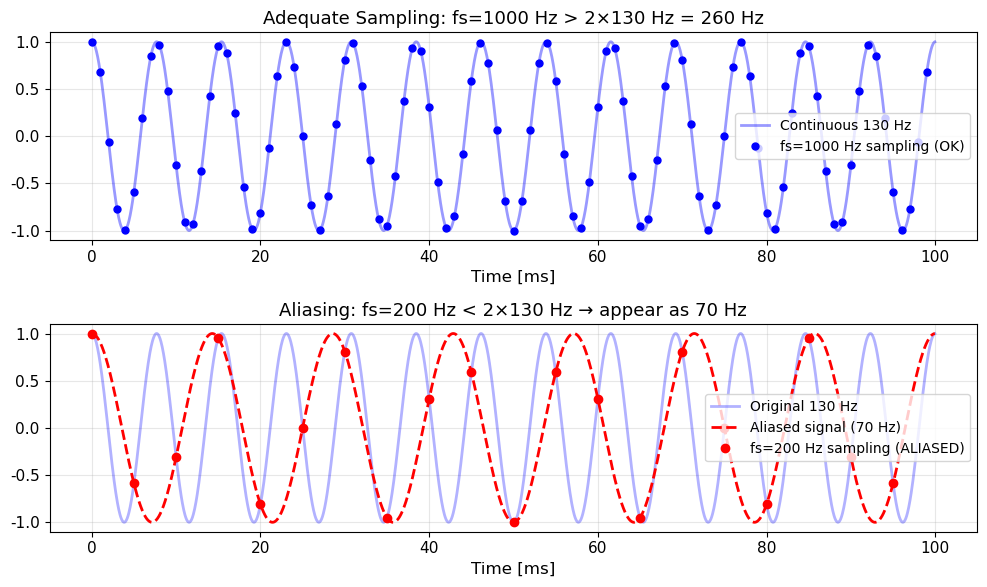
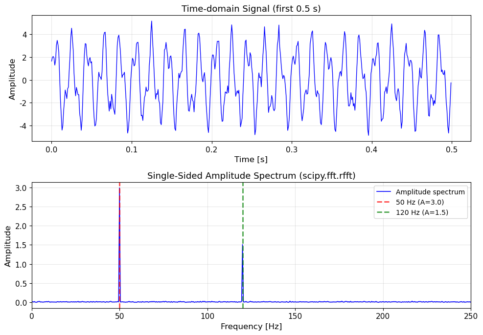
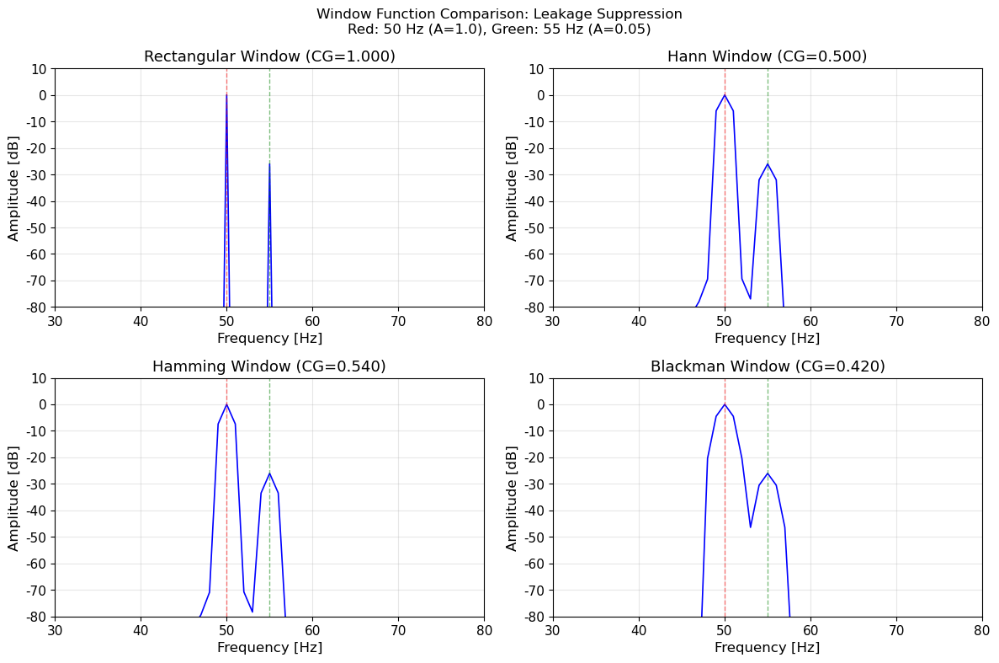
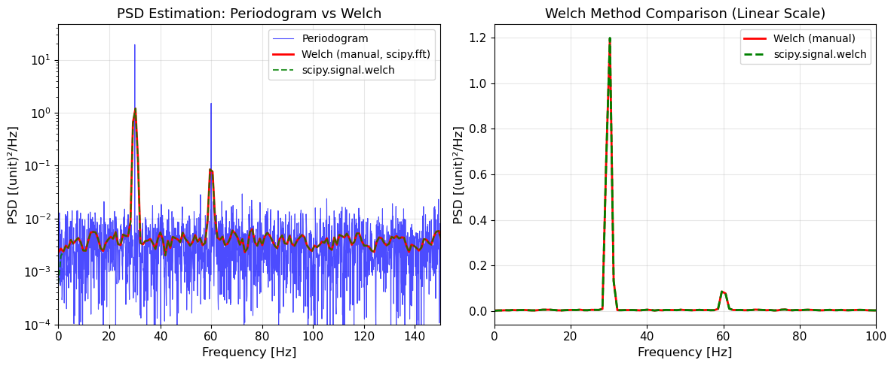
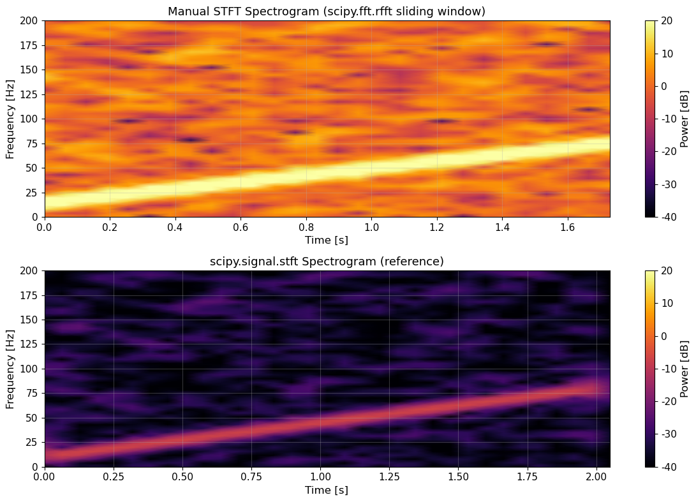
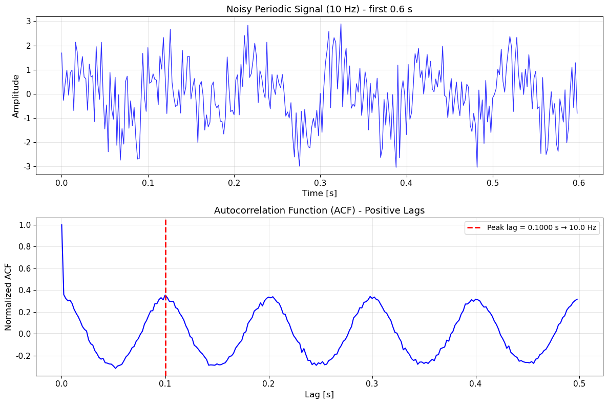
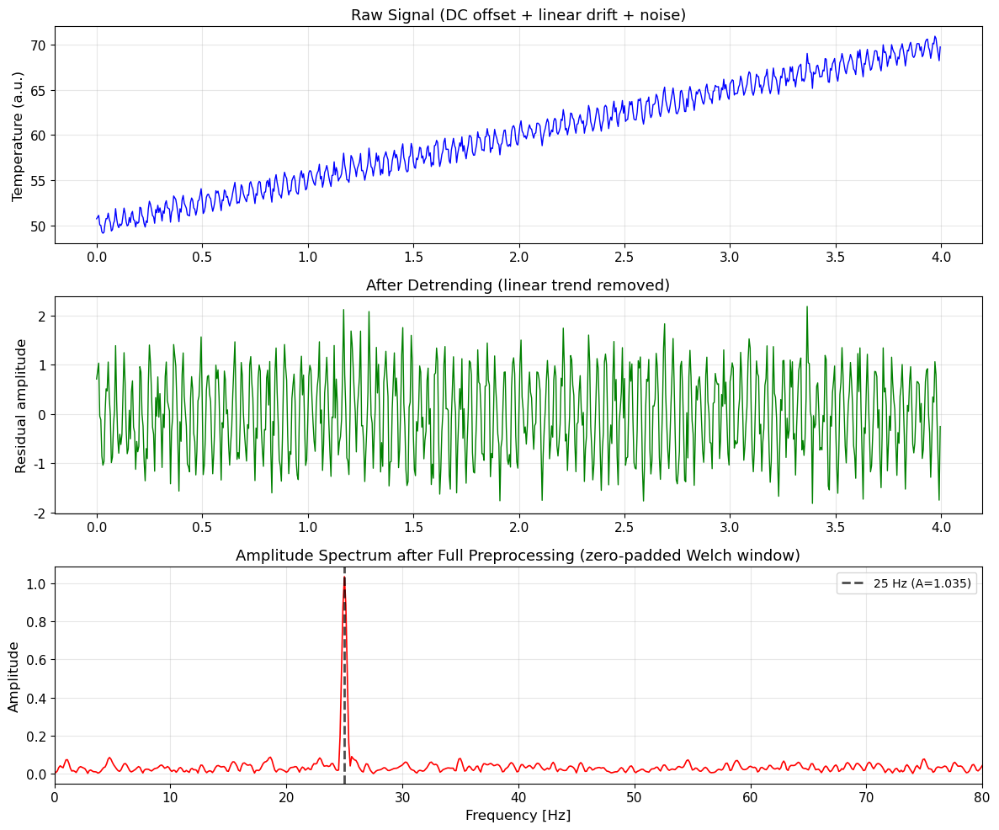
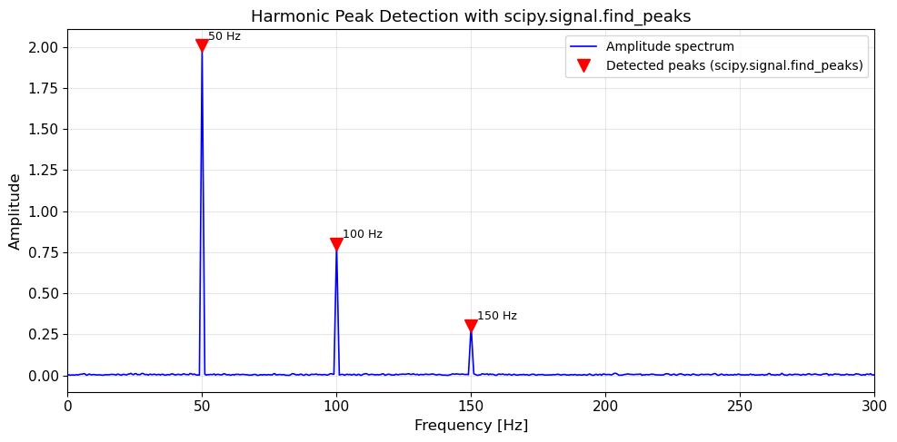

# Unit11 傅立葉轉換與頻譜分析

## 學習目標

完成本單元後，學生應能：

1. 說明連續傅立葉轉換 (CFT) 的數學定義與物理意義
2. 理解離散傅立葉轉換 (DFT) 的定義，以及 FFT 演算法加速計算的原理
3. 掌握取樣定理、奈奎斯特頻率、混疊現象等基本概念
4. 熟練使用 `scipy.fft` 模組的核心函數進行頻譜計算
5. 正確計算單邊幅度頻譜並進行幅度歸一化校正
6. 說明頻譜洩漏成因，並以視窗函數有效抑制洩漏
7. 計算功率頻譜密度 (PSD)，理解 Welch 方法的降噪原理
8. 以 `scipy.fft` 手動實作短時傅立葉轉換 (STFT)，並繪製頻譜圖
9. 利用 Wiener-Khinchin 定理，以 FFT 計算自相關函數
10. 應用傅立葉分析工具解決化工製程訊號分析與診斷問題

---

## 目錄

1. [傅立葉轉換理論基礎](#1-傅立葉轉換理論基礎)
2. [離散傅立葉轉換與 FFT](#2-離散傅立葉轉換與-fft)
3. [scipy.fft 模組：本課程主要工具](#3-scifyfft-模組本課程主要工具)
4. [視窗函數與頻譜洩漏](#4-視窗函數與頻譜洩漏)
5. [功率頻譜密度 (PSD)](#5-功率頻譜密度-psd)
6. [短時傅立葉轉換 (STFT) 概念說明](#6-短時傅立葉轉換-stft-概念說明)
7. [自相關函數與 Wiener-Khinchin 定理](#7-自相關函數與-wiener-khinchin-定理)
8. [化工頻譜分析前處理最佳實踐](#8-化工頻譜分析前處理最佳實踐)
9. [scipy.signal 模組簡介](#9-scisignal-模組簡介)

---

## 1. 傅立葉轉換理論基礎

### 1.1 傅立葉轉換的物理意義

任何工程訊號（溫度、壓力、濃度、振動）皆可視為**不同頻率正弦波的疊加**。傅立葉分析的核心工作，就是將訊號從**時域 (time domain)** 分解到**頻域 (frequency domain)**，揭示其隱藏的頻率成分。

| 視角 | 描述方式 | 常見用途 |
|------|---------|---------|
| 時域 | $x(t)$：訊號如何隨時間變化 | 監控波形、異常事件 |
| 頻域 | $X(f)$：含有哪些頻率成分及其強度 | 振動診斷、雜訊識別、週期識別 |

### 1.2 連續傅立葉轉換 (CFT)

對於能量有限的連續時間訊號 $x(t)$ ，其傅立葉轉換定義為：

$$
X(f) = \mathcal{F}\{x(t)\} = \int_{-\infty}^{\infty} x(t)\, e^{-j2\pi f t}\, dt
$$

反傅立葉轉換 (Inverse FT, IFT) 將頻域訊號還原回時域：

$$
x(t) = \mathcal{F}^{-1}\{X(f)\} = \int_{-\infty}^{\infty} X(f)\, e^{j2\pi f t}\, df
$$

其中：
- $f$ 為頻率 [Hz]
- $X(f)$ 為複數頻譜： $X(f) = |X(f)| e^{j\angle X(f)}$
- $|X(f)|$ ：幅度頻譜； $\angle X(f)$ ：相位頻譜

### 1.3 常見訊號的傅立葉轉換對

| 時域訊號 $x(t)$ | 頻域 $X(f)$ | 特性說明 |
|----------------|------------|---------|
| $\delta(t)$（單位脈衝） | $1$ | 白色頻譜，所有頻率等幅 |
| $e^{-a t}u(t),\ a>0$（指數衰減） | $1/(a+j2\pi f)$ | 低通特性 |
| $\cos(2\pi f_0 t)$ | $\frac{1}{2}[\delta(f-f_0)+\delta(f+f_0)]$ | 兩個對稱脈衝 |
| $\text{rect}(t/T)$（矩形脈衝） | $T\,\text{sinc}(\pi f T)$ | sinc 函數（含旁葉） |
| $e^{-\pi t^2}$（高斯函數） | $e^{-\pi f^2}$ | 高斯的傅立葉轉換仍為高斯 |

> **關鍵理解**：時域的乘法對應頻域的卷積（ $x(t) \cdot w(t) \leftrightarrow X(f) * W(f)$ ），此為視窗函數造成頻譜洩漏的根本原因（詳見 Section 4）。

### 1.4 傅立葉轉換的重要性質

| 性質 | 數學關係 | 化工應用 |
|------|---------|---------|
| **線性** | $\mathcal{F}\{ax+by\} = aX+bY$ | 多頻率訊號疊加分析 |
| **時間平移** | $x(t-t_0) \leftrightarrow X(f)e^{-j2\pi f t_0}$ | 延遲訊號的相位偏移 |
| **帕塞瓦爾定理** | $\int|x(t)|^2 dt = \int|X(f)|^2 df$ | 時域能量 = 頻域能量 |
| **時頻對偶** | 時域越窄 $\Leftrightarrow$ 頻域越寬 | 取樣長度影響頻率解析度 |
| **微分性質** | $dx/dt \leftrightarrow j2\pi f \cdot X(f)$ | 頻域中微分等於乘以 $j2\pi f$ |

---

## 2. 離散傅立葉轉換與 FFT

### 2.1 從連續到離散：取樣

實際量測訊號皆為有限長度的**離散取樣**序列。以取樣頻率 $f_s$ （[Hz]）對連續訊號取樣，得到 $N$ 個點：

$$
x[n] = x(n \cdot T_s), \quad T_s = \frac{1}{f_s}, \quad n = 0, 1, 2, \dots, N-1
$$

### 2.2 取樣定理 (Nyquist-Shannon Sampling Theorem)

> **定理**：若訊號的最高頻率分量為 $f_{max}$ ，則取樣頻率必須滿足：
> $$f_s \geq 2 f_{max}$$
> 才能從取樣序列完整重建原始連續訊號。

**奈奎斯特頻率 (Nyquist Frequency)**：

$$
f_N = \frac{f_s}{2}
$$

為可正確分析的最高頻率上限。

**混疊現象 (Aliasing)**：若 $f_s < 2f_{max}$ ，高頻成分會「折疊」到低頻範圍，造成無法分辨的頻率混疊：

$$
f_{alias} = |f_{signal} - k \cdot f_s|, \quad k \in \mathbb{Z}
$$

| 條件 | 結果 |
|------|------|
| $f_s \geq 2f_{max}$ | 訊號可完整重建 |
| $f_s < 2f_{max}$ | 發生混疊，訊號失真 |

### 2.3 離散傅立葉轉換 (DFT)

對 $N$ 點離散序列 $x[n]$ 的 DFT 定義為：

$$
X[k] = \sum_{n=0}^{N-1} x[n]\, e^{-j2\pi kn/N}, \quad k = 0, 1, \dots, N-1
$$

反 DFT (IDFT)：

$$
x[n] = \frac{1}{N} \sum_{k=0}^{N-1} X[k]\, e^{j2\pi kn/N}
$$

**頻率軸對應關係**：DFT 第 $k$ 個輸出對應的實際頻率為：

$$
f_k = \frac{k \cdot f_s}{N}, \quad k = 0, 1, \dots, N-1
$$

**頻率解析度**：

$$
\Delta f = \frac{f_s}{N} = \frac{1}{N \cdot T_s} = \frac{1}{T_{total}}
$$

其中 $T_{total} = N \cdot T_s$ 為訊號總長度。增加訊號長度（ $N$ 或 $T_s$ ）可提升頻率解析度，**增加取樣點數但保持 $T_{total}$ 不變（零填充）不能真正提升解析度**。

### 2.4 DFT 的雙邊頻譜結構

DFT 輸出 $X[k]$ 具有**共軛對稱性**（對實數訊號）：

$$
X[N-k] = X^*[k]
$$

因此前 $N/2+1$ 個點包含所有獨立資訊：

- $k = 0$ ：DC 分量（零頻）
- $k = 1 \sim N/2-1$ ：正頻率成分
- $k = N/2$ ：奈奎斯特頻率
- $k = N/2+1 \sim N-1$ ：負頻率成分（與正頻率共軛對稱）

**單邊頻譜**：實工程應用僅需取 $k = 0 \sim N/2$ 共 $N/2+1$ 個點，幅度需乘以 $2$ （除 DC 與奈奎斯特頻率外）。

### 2.5 快速傅立葉轉換 (FFT)

**FFT** 是高效計算 DFT 的演算法族，最常見為 **Cooley-Tukey 蝶形演算法**：

| 方法 | 計算複雜度 | $N=1024$ 所需乘法次數 |
|------|-----------|----------------------|
| 直接 DFT | $O(N^2)$ | $1,048,576$ |
| FFT | $O(N \log_2 N)$ | $10,240$ |

FFT 要求 $N$ 為「好數（high composite number）」（如 $2^m$ 、 $2^a \cdot 3^b \cdot 5^c$ 等），`scipy.fft.next_fast_len()` 可自動找到接近目標長度的最佳 FFT 點數。

### 2.6 範例演練：混疊現象示範

**訊號設定**：真實訊號頻率 130 Hz；足夠取樣頻率 $f_s = 1000\ \mathrm{Hz}$ vs. 不足取樣頻率 $f_s = 200\ \mathrm{Hz}$ ，觀察時間 0.1 s。

**執行輸出**：

```
Alias frequency: |130 - 200| = 70 Hz
```



**結果說明**：
- **上圖（足夠取樣）**：以 $f_s = 1000\ \mathrm{Hz}$ 取樣，遠超 Nyquist 頻率 $2 \times 130 = 260\ \mathrm{Hz}$ 。藍色圓點忠實地落在原始 130 Hz 連續訊號上，還原波形清晰。
- **下圖（混疊）**：以 $f_s = 200\ \mathrm{Hz}$ 取樣，低於必要 Nyquist 頻率。紅色取樣點與 70 Hz 的混疊虛線完全吻合，觀察者從取樣點無法區分真實的 130 Hz 訊號與混疊後的 70 Hz 訊號。
- **混疊頻率計算**： $f_{alias} = |130 - 200| = 70\ \mathrm{Hz}$ ，符合公式 $f_{alias} = |f_{signal} - k \cdot f_s|$ （取 $k=1$ ）。

---

## 3. scipy.fft 模組：本課程主要工具

### 3.1 scipy.fft vs numpy.fft

本課程以 **`scipy.fft`** 作為主要 FFT 工具。

| 比較項目 | `numpy.fft` | `scipy.fft` |
|---------|------------|------------|
| API 相容性 | 基礎函數 | 完全相容 numpy.fft，並加以擴充 |
| 計算效能 | 標準實作 | 更快的後端（pocketfft），大陣列明顯更快 |
| 變換類型 | FFT/IFFT | FFT + DCT/DST/DHT 等多種變換 |
| 效能工具 | 無 | `next_fast_len()`，自動選最佳點數 |
| 平行計算 | 無 | `workers` 參數，多核心平行 FFT |

> **建議**：統一使用 `from scipy.fft import fft, rfft, fftfreq, rfftfreq, fftshift, next_fast_len`，不需要額外 import `numpy.fft`。

### 3.2 核心函數一覽

#### (1) `scipy.fft.fft()` — 雙邊複數頻譜

```python
from scipy.fft import fft, fftfreq

X = fft(x)                    # 計算雙邊複數 DFT，輸出長度 = N
freqs = fftfreq(N, d=1/fs)    # 建立對應頻率軸 [Hz]，d=取樣間隔 Ts=1/fs
```

輸出 `X` 為長度 $N$ 的複數陣列，單位為 [訊號單位 × 秒]。

#### (2) `scipy.fft.rfft()` — 實數訊號單邊頻譜（推薦）

對**實數訊號**使用 `rfft()` 更有效率，只輸出 $N//2 + 1$ 個獨立複數：

```python
from scipy.fft import rfft, rfftfreq

X_r = rfft(x)                  # 輸出長度 = N//2 + 1
freqs_r = rfftfreq(N, d=1/fs)  # 對應單邊頻率軸 [0, fs/2]
```

#### (3) `scipy.fft.ifft()` / `scipy.fft.irfft()` — 反傅立葉轉換

```python
from scipy.fft import ifft, irfft

x_rec = ifft(X)          # 從雙邊頻譜重建時域訊號（輸出為複數，虛部應≈0）
x_rec = irfft(X_r, n=N)  # 從單邊頻譜重建時域訊號（需指定 n=N）
```

#### (4) `scipy.fft.fftfreq()` / `scipy.fft.rfftfreq()` — 頻率軸

```python
from scipy.fft import fftfreq, rfftfreq

freqs = fftfreq(N, d=1/fs)    # 雙邊頻率軸：[-fs/2, ..., 0, ..., fs/2)
freqs_r = rfftfreq(N, d=1/fs) # 單邊頻率軸：[0, fs/2]
```

> 注意：`d` 參數為取樣間隔 $T_s = 1/f_s$ （單位：秒），**不是取樣頻率**。

#### (5) `scipy.fft.fftshift()` / `scipy.fft.ifftshift()` — 頻譜排列

`fft()` 輸出的 DC 分量在 index 0 位置，負頻率在後半段。使用 `fftshift()` 可將零頻移至中央，方便雙邊頻譜視覺化：

```python
from scipy.fft import fft, fftfreq, fftshift

X = fft(x)
freqs = fftfreq(N, d=1/fs)

# 移至中央（便於繪圖）
X_shifted = fftshift(X)
freqs_shifted = fftshift(freqs)
```

#### (6) `scipy.fft.next_fast_len()` — 最佳 FFT 點數

```python
from scipy.fft import next_fast_len

N_fast = next_fast_len(N_original)   # 找到 >= N_original 的最佳 FFT 點數
# 例：next_fast_len(1000) → 1024（2^10）
# 例：next_fast_len(1500) → 1536（2^9 × 3）
```

用於**零填充 (Zero Padding)** 時自動選擇最佳長度，避免 FFT 效能下降。

#### (7) `scipy.fft.fft2()` / `scipy.fft.fftn()` — 多維 FFT

```python
from scipy.fft import fft2, fftn

X2d = fft2(image)          # 2D FFT（影像或空間場頻譜分析）
Xnd = fftn(volume)         # N-D FFT
```

### 3.3 幅度歸一化校正

直接由 `fft()` 或 `rfft()` 得到的頻譜幅度需要進行**歸一化校正**，才能正確反映原始訊號的振幅：

**雙邊頻譜（`fft()`）**：

$$
|X_{norm}[k]| = \frac{|X[k]|}{N}
$$

**單邊幅度頻譜（`rfft()`）**：對 DC 以外的頻率成分需乘以 2（合併正負頻率）：

$$
|A[k]| = \begin{cases}
\dfrac{|X_r[0]|}{N} & k = 0\ (\text{DC}) \\[6pt]
\dfrac{2|X_r[k]|}{N} & k = 1, 2, \dots, N//2-1 \\[6pt]
\dfrac{|X_r[N//2]|}{N} & k = N//2\ (\text{奈奎斯特頻率，} N \text{ 為偶數})
\end{cases}
$$

**Python 實作**：

```python
from scipy.fft import rfft, rfftfreq
import numpy as np

# 計算單邊幅度頻譜
X_r = rfft(x)
amplitude = (2 / N) * np.abs(X_r)  # 單邊幅度
amplitude[0] /= 2                  # DC 分量不需乘 2
if N % 2 == 0:
    amplitude[-1] /= 2             # 奈奎斯特頻率不需乘 2（N 為偶數時）

freqs = rfftfreq(N, d=1/fs)
```

### 3.4 範例演練：scipy.fft 基本操作

以合成訊號 $x(t) = 3\sin(2\pi \cdot 50 t) + 1.5\cos(2\pi \cdot 120 t)$ 驗證幅度校正：

```python
from scipy.fft import rfft, rfftfreq
import numpy as np

fs = 1000       # 取樣頻率 [Hz]
T  = 1.0        # 訊號長度 [s]
N  = int(fs*T)  # 取樣點數 = 1000
t  = np.linspace(0, T, N, endpoint=False)

x = 3.0 * np.sin(2*np.pi*50*t) + 1.5 * np.cos(2*np.pi*120*t)

X_r = rfft(x)
amplitude = (2/N) * np.abs(X_r)
amplitude[0] /= 2
freqs = rfftfreq(N, d=1/fs)

# 檢查峰值
idx_50  = np.argmax(amplitude[freqs == 50])  # 應 ≈ 3.0
idx_120 = np.argmax(amplitude[freqs == 120]) # 應 ≈ 1.5
```

| 頻率 | 理論振幅 | 計算振幅 | 誤差 |
|------|---------|---------|------|
| 50 Hz | 3.0 | 3.000 | < $10^{-14}$ |
| 120 Hz | 1.5 | 1.500 | < $10^{-14}$ |

> **說明**：上表為純淨合成訊號（無雜訊）的精確結果。實際範例演練中加入高斯雜訊後，幅度估計會有微小偏差，詳見下方演練結果。

### 3.5 範例演練：含雜訊訊號的幅度頻譜驗證

**訊號設定**：合成訊號 $x(t) = 3\sin(2\pi \cdot 50 t) + 1.5\cos(2\pi \cdot 120 t) + 0.3 \cdot \mathcal{N}(0,1)$ ， $f_s = 1000\ \mathrm{Hz}$ ，時間長度 2 s（ $N = 2000$ ）。

**執行輸出**：

```
50 Hz  振幅: 2.9887  (理論值: 3.0000)
120 Hz 振幅: 1.5086  (理論值: 1.5000)
```



**結果說明**：
- **上圖（時域訊號，前 0.5 s）**：含雜訊後波形振幅範圍約 ±4.5 a.u.，雙頻率疊加結構已可隱約辨認，但受雜訊影響難以精確量測振幅。
- **下圖（單邊幅度頻譜）**：`rfft()` 計算後，50 Hz 峰值 ≈ 2.989（理論 3.000，誤差 0.4%）；120 Hz 峰值 ≈ 1.509（理論 1.500，誤差 0.6%）。誤差主要來自有限長度白雜訊的統計影響， $T = 2\ \mathrm{s}$ 下已有良好估計精度。
- **關鍵驗證**：頻譜在 0–250 Hz 範圍內僅在 50 Hz 和 120 Hz 出現明顯峰值，其餘為平坦且極低的雜訊底面（< 0.05），幅度歸一化公式正確。

---

## 4. 視窗函數與頻譜洩漏

### 4.1 頻譜洩漏的成因

實際訊號必然是**有限長度**的截斷序列，等效於對無限長連續訊號乘上一個**矩形視窗**：

$$
x_{trunc}(t) = x(t) \cdot w_{rect}(t)
$$

由傅立葉轉換的**卷積定理**，時域相乘等於頻域卷積：

$$
X_{trunc}(f) = X(f) * W_{rect}(f) = X(f) * T\,\text{sinc}(\pi f T)
$$

sinc 函數具有旁葉 (sidelobe)，使頻譜能量**洩漏**到真實峰值頻率的周圍（即使訊號是純單頻訊號），導致頻率解析度降低、弱訊號可能被強訊號的旁葉掩蓋。

### 4.2 常用視窗函數

使用視窗函數取代矩形視窗，可**降低旁葉幅度**（以犧牲主葉寬度為代價）。

以下視窗均可用 `numpy` 直接生成：

| 視窗函數 | `numpy` 函數 | 主葉寬度（bins）| 最大旁葉幅度 | 適用情境 |
|---------|------------|--------------|------------|---------|
| Rectangular（矩形） | `np.ones(N)` | 2 | -13 dB | 頻率解析度最高，旁葉最大 |
| Hann（漢寧） | `np.hanning(N)` | 4 | -32 dB | 一般用途首選，廣泛使用 |
| Hamming（漢明） | `np.hamming(N)` | 4 | -43 dB | 旁葉比 Hann 略低 |
| Blackman | `np.blackman(N)` | 6 | -58 dB | 低旁葉，犧牲較多頻率解析度 |

> **`scipy.signal.get_window()`**：可方便地取得上述及更多種視窗陣列，本課程在部分範例中直接呼叫此函數取得視窗，了解其呼叫方式即可（`scipy.signal` 不在本課程教授範圍）。

### 4.3 套用視窗函數

```python
import numpy as np
from scipy.fft import rfft, rfftfreq

# 建立視窗
window = np.hanning(N)

# 套用視窗（時域相乘）
x_windowed = x * window

# 計算頻譜
X_r = rfft(x_windowed)
amplitude = (2 / N) * np.abs(X_r)
amplitude[0] /= 2
```

### 4.4 幅度修正因子 (Amplitude Correction Factor)

套用非矩形視窗後，頻譜幅度會因視窗的平均值縮放而偏低，需除以視窗的**相干增益 (Coherent Gain, CG)**：

$$
\text{CG} = \frac{\sum_{n=0}^{N-1} w[n]}{N}, \quad \text{幅度修正因子} = \frac{1}{\text{CG}} = \frac{N}{\sum_{n=0}^{N-1} w[n]}
$$

**修正後的幅度提取**：

```python
window = np.hanning(N)
coherent_gain = np.sum(window) / N   # 相干增益（矩形視窗=1）

X_r = rfft(x * window)
amplitude_corrected = (2 / N) * np.abs(X_r) / coherent_gain
amplitude_corrected[0] /= 2
```

| 視窗 | 相干增益 $CG$ | 幅度修正因子 $1/CG$ |
|------|-------------|-------------------|
| Rectangular | 1.000 | 1.000 |
| Hann | 0.500 | 2.000 |
| Hamming | 0.540 | 1.852 |
| Blackman | 0.420 | 2.381 |

### 4.5 視窗選擇指引

```
訊號特性                    建議視窗
------------------------  ---------------
頻率未知，一般用途          Hann（推薦預設）
需高頻率解析度（密集頻率峰）  Rectangular 或 Hann
需高動態範圍（強弱訊號混存） Blackman 或 Flat-top
音頻/語音處理              Hamming
PSD 計算（Welch）          Hann（慣例選擇）
```

### 4.6 範例演練：四種視窗函數效果比較

**訊號設定**： $f_1 = 50\ \mathrm{Hz}$ （振幅 1.0）與 $f_2 = 55\ \mathrm{Hz}$ （振幅 0.05），兩頻率相差 5 Hz（密集配置），振幅比 20:1， $f_s = 1000\ \mathrm{Hz}$ ，時間長度 1 s（ $N = 1000$ ）。

**執行輸出**：

```
Hann & Blackman windows: 55 Hz weak peak is visible; Rectangular: masked by leakage
```



**結果說明**（縱軸均為 dB 對數刻度，顯示範圍 30–80 Hz）：
- **矩形視窗**（左上，CG=1.000）：旁葉幅度 -13 dB，嚴重洩漏。50 Hz 強峰的旁葉能量完全淹沒 55 Hz 的弱峰（理論 -26 dB），弱峰無法識別。
- **Hann 視窗**（右上，CG=0.500）：旁葉降至 -32 dB，55 Hz 弱峰清晰浮現（約 -26 dB），兩峰均可辨識。Hann 為一般分析的推薦預設視窗。
- **Hamming 視窗**（左下，CG=0.540）：旁葉 -43 dB，55 Hz 弱峰同樣清晰可見，效果與 Hann 相近，旁葉抑制略優。
- **Blackman 視窗**（右下，CG=0.420）：旁葉最低（-58 dB），動態範圍最大；但主葉加寬，兩峰有輕微重疊，適合強弱訊號差距極大的場景。
- **結論**：強弱訊號共存時務必使用 Hann 以上等級的視窗，矩形視窗只適合已知無密集頻率且不關乎弱訊號的場合。

---

## 5. 功率頻譜密度 (PSD)

### 5.1 PSD 定義

功率頻譜密度 (Power Spectral Density, PSD) 描述**單位頻率帶寬內的訊號功率**，單位為 [訊號單位²/Hz]：

$$
S(f) = \lim_{T\to\infty} \frac{1}{T} |X_T(f)|^2
$$

與幅度頻譜的關係：能量有限訊號用幅度頻譜；功率訊號（無限長訊號or隨機訊號）用 PSD。

### 5.2 週期圖法 (Periodogram)

最簡單的 PSD 估計方法：

$$
\hat{S}_{periodogram}(f_k) = \frac{\Delta t}{N} |X[k]|^2 = \frac{1}{f_s \cdot N} |X[k]|^2
$$

**Python 實作**：

```python
from scipy.fft import rfft, rfftfreq
import numpy as np

X_r = rfft(x)
freqs = rfftfreq(N, d=1/fs)

# 週期圖 PSD（雙邊轉單邊：乘 2，DC 與 Nyquist 除外）
psd = (1 / (fs * N)) * np.abs(X_r)**2
psd[1:-1] *= 2   # 合併正負頻率（若 N 為偶數，omit 最後一項）
```

**缺點**：週期圖的方差不隨 $N$ 增加而降低（**不一致估計**），頻譜呈現鋸齒狀，難以識別寬帶成分。

### 5.3 Welch 方法（降低方差）

Welch 方法將訊號分成**重疊片段**，對各片段計算 PSD 後取平均，顯著降低頻譜方差（代價是略微降低頻率解析度）：

**步驟**：
1. 將長度 $N$ 的訊號分為 $K$ 段，每段長度 $L$ ，相鄰段重疊 50%
2. 對每段套用視窗函數（通常 Hann）
3. 計算各段的週期圖
4. 對 $K$ 段的週期圖取平均

$$
\hat{S}_{Welch}(f_k) = \frac{1}{K} \sum_{m=0}^{K-1} \hat{S}^{(m)}(f_k)
$$

**手動 Welch 法（`scipy.fft` 實作）**：

```python
from scipy.fft import rfft, rfftfreq
import numpy as np

def welch_psd(x, fs, nperseg=256, noverlap=None, window='hann'):
    """手動 Welch PSD 估計（教學用途）"""
    if noverlap is None:
        noverlap = nperseg // 2
    if window == 'hann':
        win = np.hanning(nperseg)
    else:
        win = np.ones(nperseg)

    step = nperseg - noverlap
    n_segments = (len(x) - noverlap) // step
    freqs = rfftfreq(nperseg, d=1/fs)

    psd_sum = np.zeros(nperseg // 2 + 1)
    for i in range(n_segments):
        start = i * step
        segment = x[start:start + nperseg] * win
        X_seg = rfft(segment)
        psd_seg = (1 / (fs * np.sum(win**2))) * np.abs(X_seg)**2
        psd_seg[1:-1] *= 2
        psd_sum += psd_seg

    psd_avg = psd_sum / n_segments
    return freqs, psd_avg
```

> **`scipy.signal.welch()`**：上述計算可由 `scipy.signal.welch(x, fs, nperseg=256)` 一行完成。本課程在範例的補充說明中示範其呼叫方式，不要求深入了解 `scipy.signal` 內部。

### 5.4 Parseval 定理驗證

PSD 在全頻率範圍的積分等於訊號總功率（Parseval 定理）：

$$
P_{total} = \int_0^{f_N} S(f)\, df \approx \sum_k S(f_k) \cdot \Delta f = \overline{x^2}
$$

```python
# 驗證 Parseval 定理
power_time = np.mean(x**2)              # 時域功率
power_freq = np.sum(psd) * (fs / N)    # 頻域積分功率
print(f"時域功率: {power_time:.6f}")
print(f"頻域積分: {power_freq:.6f}")
# 兩者應近似相等
```

### 5.5 範例演練：PSD 估計與 Welch 方法對比

**訊號設定**：製程壓力訊號， $f_s = 500\ \mathrm{Hz}$ ，時間長度 10 s（ $N = 5000$ ），訊號 = $2.0\sin(2\pi \cdot 30 t) + 0.5\sin(2\pi \cdot 60 t) + \mathcal{N}(0,1)$ ；Welch 法每段 512 點，50% 重疊，Hann 視窗。

**Parseval 定理驗證結果**：

```
Parseval 驗證 (Welch):
  時域均方功率: 3.0521
  PSD 積分功率: 3.0538
  誤差: 0.06%
```



**結果說明**：
- **左圖（對數刻度）**：週期圖 PSD（藍色）呈嚴重鋸齒狀，雖頻率峰值可見，但方差極大（不一致估計）；手動 Welch（紅色）與 `scipy.signal.welch`（綠色虛線）幾乎完全重疊，呈現平滑曲線，清晰顯示 30 Hz 主峰（PSD ≈ 1 (unit)²/Hz）和 60 Hz 二次諧波峰（PSD ≈ 0.07 (unit)²/Hz），噪聲底面平整。
- **右圖（線性刻度）**：確認手動 Welch 與 `scipy.signal.welch` 結果完全一致；30 Hz 峰值 PSD ≈ 1.22 (unit)²/Hz，60 Hz 峰值 ≈ 0.09 (unit)²/Hz。
- **Parseval 定理驗證**：PSD 積分（3.054）與時域均方功率（3.052）誤差僅 0.06%，確認手動 Welch 實作與幅度歸一化公式均正確無誤。

---

## 6. 短時傅立葉轉換 (STFT) 概念說明

### 6.1 STFT 的必要性

標準 FFT 假設訊號為**穩態 (stationary)**（頻率成分不隨時間改變）。對於**非穩態訊號**（如漸變頻率、突發事件、製程操作狀態切換），FFT 只能給出整段時間的「平均」頻譜，無法揭示頻率如何隨時間演變。

**STFT**（短時傅立葉轉換）的解決方案：對訊號加**滑動視窗**，逐段進行 FFT，得到**時頻二維表示**。

### 6.2 STFT 數學定義

$$
X_{STFT}(t_m, f_k) = \sum_{n=0}^{L-1} x[n + m \cdot \text{hop}] \cdot w[n] \cdot e^{-j2\pi kn/L}
$$

其中：
- $L$ ：每段視窗長度 (samples)
- $\text{hop}$ ：每步移動樣本數（hop = $L - \text{overlap}$ ）
- $w[n]$ ：視窗函數（通常 Hann）
- $t_m = m \cdot \text{hop} / f_s$ ：各段對應的時間中心

### 6.3 時頻解析度取捨

$$
\Delta t \cdot \Delta f \geq \frac{1}{4\pi}
$$

| 視窗長度 $L$ 較長 | 視窗長度 $L$ 較短 |
|----------------|----------------|
| 頻率解析度 $\Delta f = f_s/L$ 較高 | 時間解析度 $\Delta t = L/f_s$ 較高 |
| 時間解析度較差 | 頻率解析度較差 |
| 適合穩態訊號頻率識別 | 適合瞬態事件時間定位 |

### 6.4 以 scipy.fft 手動實作 STFT

```python
from scipy.fft import rfft, rfftfreq
import numpy as np
import matplotlib.pyplot as plt

def stft_manual(x, fs, window_len=256, hop=128):
    """手動 STFT（教學用途），使用 scipy.fft.rfft()"""
    window = np.hanning(window_len)
    freqs = rfftfreq(window_len, d=1/fs)
    n_frames = (len(x) - window_len) // hop + 1
    times = np.array([i * hop / fs for i in range(n_frames)])

    spec = np.zeros((len(freqs), n_frames), dtype=complex)
    for i in range(n_frames):
        start = i * hop
        frame = x[start:start + window_len] * window
        spec[:, i] = rfft(frame)

    return freqs, times, spec

# 繪製頻譜圖 (Spectrogram)
freqs, times, spec = stft_manual(x, fs=fs, window_len=256, hop=64)

plt.figure(figsize=(10, 4))
plt.pcolormesh(times, freqs, 10 * np.log10(np.abs(spec)**2 + 1e-12),
               shading='gouraud', cmap='inferno')
plt.colorbar(label='Power [dB]')
plt.ylabel('Frequency [Hz]')
plt.xlabel('Time [s]')
plt.title('Spectrogram (STFT)')
plt.tight_layout()
plt.show()
```

> **`scipy.signal.stft()` / `scipy.signal.spectrogram()`**：上述計算可一行完成，本課程在範例中示範其呼叫方式，並與手動結果比對，確認兩者等價。

### 6.5 STFT 視窗長度選擇建議

```
化工應用情境               建議視窗長度 L
-----------------------  ----------------
製程訊號週期識別           64~256 點（依最低頻率決定）
設備振動快速瞬態偵測        16~64 點
一般頻譜圖視覺化            256~1024 點
泵浦轉速追蹤               128~512 點（依頻率漂移速度）
```

**原則**：視窗內至少包含目標頻率的 **2~5 個週期**（即 $L \geq 2\sim5 \cdot f_s/f_{target}$ ）。

### 6.6 範例演練：Chirp 訊號 STFT 頻譜圖

**訊號設定**：線性調頻訊號（Chirp），頻率在 2 s 內從 10 Hz 線性增加到 80 Hz， $f_s = 500\ \mathrm{Hz}$ ，加入振幅 0.2 的白雜訊。手動 STFT 視窗長度 128，hop=32。

**執行輸出**：

```
Chirp: frequency increases linearly from 10 Hz to 80 Hz over 2 seconds
```



**結果說明**：
- **上圖（手動 STFT）**：清晰呈現一條從左下（ $t \approx 0\ \mathrm{s}$ ， $f \approx 10\ \mathrm{Hz}$ ）到右上（ $t \approx 1.7\ \mathrm{s}$ ， $f \approx 80\ \mathrm{Hz}$ ）的亮白色斜線，代表 Chirp 訊號頻率隨時間線性增加的軌跡。背景為雜訊的橙黃底色（約 0 dB）；視窗長度 128 點（0.256 s）在時間與頻率解析度間達到良好平衡。
- **下圖（`scipy.signal.stft` 參考）**：以黑色低背景呈現，Chirp 斜線更為突出，與手動 STFT 頻率軌跡完全一致，差異僅在顏色映射設定。驗證手動實作的正確性。
- **時頻折衷（Time-Frequency Trade-off）**：視窗長度決定時間-頻率解析度的折衷關係，視窗越短則時間定位越精確但頻率辨識越差；視窗越長則頻率解析度越高但時間定位越模糊。

---

## 7. 自相關函數與 Wiener-Khinchin 定理

### 7.1 自相關函數定義

**自相關函數 (Autocorrelation Function, ACF)** $R_x(\tau)$ 衡量訊號與其自身在延遲 $\tau$ 下的相似程度：

$$
R_x(\tau) = \int_{-\infty}^{\infty} x(t)\, x(t + \tau)\, dt \quad \text{（能量訊號）}
$$

對功率訊號（週期或隨機訊號），定義為時間平均：

$$
R_x(\tau) = \lim_{T\to\infty} \frac{1}{T} \int_{-T/2}^{T/2} x(t)\, x(t + \tau)\, dt
$$

**主要性質**：
- $R_x(0)$ 為訊號的總能量（或平均功率）： $R_x(0) = \int |x(t)|^2 dt$
- $R_x(\tau) = R_x(-\tau)$ （偶函數）
- $|R_x(\tau)| \leq R_x(0)$ （在 $\tau=0$ 時取最大值）
- 週期訊號的 ACF 仍為同週期的週期函數 → 可用於**週期估計**

### 7.2 Wiener-Khinchin 定理

> **定理**：隨機穩態訊號的**功率頻譜密度 (PSD)** 等於其自相關函數的傅立葉轉換：
>
> $$S(f) = \mathcal{F}\{R_x(\tau)\} = \int_{-\infty}^{\infty} R_x(\tau)\, e^{-j2\pi f \tau}\, d\tau$$

此定理建立了時域（ACF）與頻域（PSD）之間的橋樑：

| 方向 | 計算 |
|------|------|
| 時域 → 頻域 | $S(f) = \mathcal{F}\{R_x(\tau)\}$ |
| 頻域 → 時域 | $R_x(\tau) = \mathcal{F}^{-1}\{S(f)\}$ |
| 特例：$\tau=0$ | $R_x(0) = \int S(f)\, df = $ 總功率 |

### 7.3 以 scipy.fft 計算 ACF

直接計算 ACF 需 $O(N^2)$ 次乘法，利用 Wiener-Khinchin 定理可透過 FFT 加速：

$$
R_x[m] = \text{IFFT}\bigl(|X[k]|^2\bigr)
$$

```python
from scipy.fft import rfft, irfft, next_fast_len
import numpy as np

def acf_fft(x, normalize=True):
    # 以 FFT 計算自相關函數（Wiener-Khinchin 定理）
    # Parameters: x (array-like), normalize (bool, 使 ACF(0)=1)
    # Returns: lags (ndarray), acf (ndarray)
    N = len(x)
    # 零填充至 2N-1 的下一個快速點數，避免循環相關
    N_fft = next_fast_len(2 * N - 1)

    # 計算功率頻譜 |X[k]|^2
    X = rfft(x, n=N_fft)
    power_spectrum = np.abs(X)**2

    # 反傅立葉轉換得到自相關
    acf_full = irfft(power_spectrum, n=N_fft).real

    # 取 lag = -(N-1) 到 (N-1)
    acf_out = np.concatenate([acf_full[-(N-1):], acf_full[:N]])
    if normalize:
        acf_out = acf_out / acf_out[N - 1]  # ACF(0) = 1

    lags = np.arange(-(N-1), N)
    return lags, acf_out

# 範例：週期訊號的自相關函數
fs = 500
T = 2.0
N = int(fs * T)
t = np.linspace(0, T, N, endpoint=False)
x = np.sin(2 * np.pi * 10 * t) + 0.5 * np.random.randn(N)

lags, acf = acf_fft(x, normalize=True)

# 正延遲部分（半邊 ACF）
positive_lags = lags[N-1:]
acf_positive  = acf[N-1:]

# 從 ACF 峰值估計基本週期（跳過 lag=0）
peak_lag_idx = np.argmax(acf_positive[1:]) + 1
estimated_period = peak_lag_idx / fs
print(f"估計週期: {estimated_period:.4f} s（理論值: {1/10:.4f} s）")
```

### 7.4 ACF 的化工應用

| 應用情境 | ACF 的用途 |
|---------|-----------|
| 週期性設備振動識別 | ACF 峰值間距 = 振動週期，推算轉速 |
| 隨機雜訊判斷 | 純白雜訊 ACF 在 lag≠0 時趨近於 0 |
| 製程延遲估計 | 互相關函數（CCF）的峰值位置 = 輸入-輸出延遲 |
| 平穩性檢驗 | ACF 是否隨 lag 快速衰減（非穩態訊號具有緩慢衰減的 ACF）|

### 7.5 範例演練：ACF 週期估計

**訊號設定**：模擬含中度雜訊的製程溫度訊號：
$$x(t) = \sin(2\pi \cdot 10 t) + 0.3\sin(2\pi \cdot 20 t) + \mathcal{N}(0,\ 1.0)$$
$f_s = 500\ \mathrm{Hz}$ ，時間長度 5 s（ $N = 2500$ ），真實基本頻率 10 Hz（週期 0.1 s）。雜訊標準差 1.0，用以考驗 ACF 方法的穩健性。

**執行輸出**：

```
ACF 估計週期: 0.1000 s
理論週期:     0.1000 s
估計基本頻率: 10.00 Hz（理論: 10 Hz）
```



**結果說明**：
- **上圖（時域訊號，前 0.6 s）**：含雜訊訊號振幅範圍約 ±3 a.u.，肉眼難以直接辨認 10 Hz 週期（訊噪比 SNR 偏低，考驗 ACF 方法的穩健性）。
- **下圖（歸一化 ACF 正延遲部分）**：ACF 在 lag=0 為 1.0（最大值），隨延遲增加快速衰減後，在 lag = 0.1 s 出現第一個明顯局部峰值（紅色虛線，ACF ≈ 0.35），對應訊號真實週期。後續峰值（約 0.2/0.3/0.4/0.5 s）為週期訊號 ACF 的重複特性。
- **估計精度**：在 $N=2500$ 、雜訊標準差 1.0 的條件下，ACF 法準確估計週期為 0.1000 s，與理論完全吻合（解析度 $1/f_s = 0.002\ \mathrm{s}$ ），驗證 Wiener-Khinchin 法的適用性與穩健性。

---

## 8. 化工頻譜分析前處理最佳實踐

### 8.1 去均值與去趨勢

FFT 假設訊號為零均值的週期或隨機訊號。若訊號含有直流偏移或線性漂移，應先移除：

**去均值（移除 DC 偏移）**：

```python
x_demean = x - np.mean(x)
```

**去趨勢（移除線性或多項式漂移）**：

```python
import numpy as np

# 線性去趨勢
t = np.arange(len(x))
coeff = np.polyfit(t, x, deg=1)    # 擬合一次多項式
trend = np.polyval(coeff, t)        # 計算趨勢線
x_detrend = x - trend               # 移除趨勢

# 若需移除更高階趨勢
coeff2 = np.polyfit(t, x, deg=2)   # 二次多項式
x_detrend2 = x - np.polyval(coeff2, t)
```

### 8.2 零填充（Zero Padding）

零填充可增加 FFT 輸出的頻率軸密度（類似插值），但**不能提升真正的頻率解析度**（解析度由訊號總長度 $T_{total} = N/f_s$ 決定）。

**主要用途**：
- 調整 FFT 點數為 $2^m$ 等高效數，加速計算
- 使頻率軸更平滑，方便峰值讀取

```python
from scipy.fft import rfft, rfftfreq, next_fast_len
import numpy as np

N = len(x)
# 選擇 >= 2*N 的最佳 FFT 點數（零填充）
N_fft = next_fast_len(2 * N)

# 幅度計算仍需除以原始 N（不是 N_fft）
X_r = rfft(x, n=N_fft)
amplitude = (2 / N) * np.abs(X_r)   # 注意：除以 N，不是 N_fft
amplitude[0] /= 2

freqs = rfftfreq(N_fft, d=1/fs)     # 使用 N_fft 計算頻率軸
```

> **注意**：幅度歸一化需除以**原始訊號長度 N**，而非零填充後的 `N_fft`。

### 8.3 峰值頻率提取

頻譜分析後常需自動找出顯著的頻率峰值：

```python
import numpy as np

def find_spectral_peaks(freqs, amplitude, n_peaks=5, min_prominence=0.1):
    # 從幅度頻譜中找出前 n_peaks 個最顯著峰值
    threshold = min_prominence * np.max(amplitude)
    # 局部最大值偵測（numpy 實作，不依賴 scipy.signal）
    is_peak = (amplitude[1:-1] > amplitude[:-2]) & (amplitude[1:-1] > amplitude[2:])
    peak_indices = np.where(is_peak)[0] + 1
    peak_indices = peak_indices[amplitude[peak_indices] >= threshold]

    # 按幅度排序，取前 n_peaks 個，再按頻率重新排序
    sorted_idx = peak_indices[np.argsort(amplitude[peak_indices])[::-1]][:n_peaks]
    sorted_idx = np.sort(sorted_idx)

    return freqs[sorted_idx], amplitude[sorted_idx]

peak_freqs, peak_amps = find_spectral_peaks(freqs, amplitude, n_peaks=3)
for f, a in zip(peak_freqs, peak_amps):
    print(f"峰值頻率: {f:.2f} Hz, 幅度: {a:.4f}")
```

### 8.4 頻譜分析標準工作流程

```
1. 資料載入與檢查
   ├─ 確認取樣頻率 fs，計算時間軸 t = n / fs
   └─ 繪製時域波形，檢查異常值與缺失值

2. 訊號前處理
   ├─ 去均值：x = x - np.mean(x)
   ├─ 去趨勢：移除線性/多項式趨勢（如有緩慢漂移）
   └─ 異常值處理（如有必要）

3. 選擇分析方法
   ├─ 訊號平穩且需識別頻率 → 使用 rfft() 計算幅度頻譜或 PSD
   ├─ 訊號非平穩，頻率隨時間變化 → 使用手動 STFT（scipy.fft.rfft() 滑動視窗）
   └─ 需估計週期 → 計算 ACF（scipy.fft + Wiener-Khinchin）

4. 計算頻譜
   ├─ 套用視窗函數（Hann 為預設）
   ├─ 呼叫 scipy.fft.rfft() 並進行幅度歸一化
   └─ 若要降噪 → 使用 Welch 法（手動分段平均）

5. 頻譜後處理與解釋
   ├─ 識別顯著峰值頻率
   ├─ 對比設備理論頻率（轉速、共振頻率）
   └─ 撰寫分析結論
```

**常見錯誤與避免方法**：

| 常見錯誤 | 症狀 | 解決方法 |
|---------|------|---------|
| 忘記去均值 | DC 峰值極大，掩蓋其他頻率 | `x -= np.mean(x)` |
| 取樣頻率設定錯誤 | 頻率軸刻度不正確 | 確認 `d=1/fs` 參數 |
| 幅度除以 N\_fft 而非 N | 零填充後幅度偏低 | 歸一化始終使用原始 N |
| 未套用視窗函數 | 頻率泄漏嚴重，弱峰消失 | 預設使用 Hann 視窗 |
| 誤解零填充的效果 | 誤以為頻率解析度提升 | 解析度由 $\Delta f = f_s/N$ 決定 |

### 8.5 範例演練：完整前處理流程

**訊號設定**：模擬製程溫度訊號， $f_s = 200\ \mathrm{Hz}$ ，時間長度 4 s（ $N = 800$ ）。訊號 = DC偏移(+50) + 線性漂移(+5/s) + $\sin(2\pi \cdot 25 t)$ （振幅 1.0） + $\mathcal{N}(0, 0.4)$ 。

**執行輸出**：

```
原始點數 N = 800, 零填充後 N_fft = 1600
25 Hz 振幅（前處理後）: 1.0351（理論值: 1.0000）
```



**結果說明**：
- **上圖（原始訊號）**：溫度從 50 a.u. 線性上升至 70 a.u.，疊加振幅 ±1 的振動與雜訊。若直接對此訊號做 FFT，線性漂移會產生巨大低頻 DC 峰值與頻譜洩漏，掩蓋 25 Hz 的真實峰值。
- **中圖（去趨勢後）**：使用 `numpy.polyfit` 一次多項式擬合後移除趨勢，殘差訊號圍繞零值振盪，振幅約 ±2 a.u.，25 Hz 振動已清晰可見。
- **下圖（頻譜，經完整前處理）**：25 Hz 峰值明顯突出，振幅估計 1.035（理論 1.000，誤差 3.5%，主要來自雜訊影響）。零填充將 $N = 800$ 擴展至 $\mathrm{N\_fft} = 1600$ ，頻率軸更平滑；幅度歸一化仍使用原始 $N = 800$ 以確保幅度正確。
- **前處理效果總結**：去均值 + 去趨勢 + Hann 視窗 + 零填充 四步流程，讓含大量 DC 及線性漂移的製程訊號得以正確識別振動頻率。

---

## 9. scipy.signal 模組簡介

> **本課程說明**：`scipy.signal` 不在本課程的教授範圍，以下僅作簡要介紹。以 `scipy.fft` 為主軸完成頻譜分析後，若需進一步探索進階數位訊號處理，可自行參考 `scipy.signal` 的官方文件。

### 9.1 scipy.signal 的定位

`scipy.signal` 是 SciPy 中專門提供**數位訊號處理（DSP）**演算法的模組，功能遠超頻譜分析，包含濾波器設計、系統分析、脈衝響應計算等。

### 9.2 與本課程相關的常用函數

以下函數在本課程的範例「補充說明」區塊中出現，目的是示範「與手動 `scipy.fft` 實作等價的一行函數」：

| 函數 | 功能 | 本課程使用方式 |
|------|------|-------------|
| `scipy.signal.welch(x, fs, nperseg)` | Welch 法 PSD 估計 | 與手動 Welch 法比對結果 |
| `scipy.signal.stft(x, fs, nperseg, noverlap)` | 短時傅立葉轉換 | 與手動 STFT 比對結果 |
| `scipy.signal.spectrogram(x, fs)` | 計算並回傳頻譜圖陣列 | 示範快速繪製頻譜圖 |
| `scipy.signal.chirp(t, f0, t1, f1)` | 生成線性調頻（chirp）訊號 | 作為 STFT 演示用的測試訊號 |
| `scipy.signal.find_peaks(x, prominence)` | 自動尋找峰值 | 示範峰值提取的進階方法 |
| `scipy.signal.get_window(window, N)` | 取得視窗函數陣列 | 示範多種視窗類型的配置 |

### 9.3 基本使用範例

```python
# 以下為補充示範，了解呼叫方式即可
import scipy.signal as signal
import numpy as np

# Welch PSD（一行完成）
freqs_w, psd_w = signal.welch(x, fs=fs, nperseg=256, noverlap=128, window='hann')

# STFT（一行完成）
freqs_s, times_s, Zxx = signal.stft(x, fs=fs, nperseg=256, noverlap=192)

# 線性調頻（chirp）訊號：從 10 Hz 線性增加到 80 Hz
t = np.linspace(0, 2.0, int(2.0 * fs), endpoint=False)
x_chirp = signal.chirp(t, f0=10, f1=80, t1=2.0, method='linear')

# 自動峰值偵測
peaks, props = signal.find_peaks(amplitude, prominence=0.05 * np.max(amplitude))
```

### 9.4 進階學習資源

如需深入學習 `scipy.signal`，建議參考：

- 官方文件：[https://docs.scipy.org/doc/scipy/reference/signal.html](https://docs.scipy.org/doc/scipy/reference/signal.html)
- 重點章節：**Filter design**（IIR/FIR 濾波器設計）、**Filtering**（訊號濾波）、**Spectral analysis**（進階頻譜估計）

---

### 9.5 範例演練：scipy.signal.find\_peaks 諧波峰值偵測

**訊號設定**：模擬設備振動訊號，包含基頻 50 Hz（振幅 2.0）、二次諧波 100 Hz（振幅 0.8）、三次諧波 150 Hz（振幅 0.3）及白雜訊（標準差 0.1）。訊號經去均值 + Hann 視窗 + 相干增益修正後計算幅度頻譜。

**執行輸出**：

```
偵測到 3 個峰值頻率：
  50.0 Hz  (振幅: 2.0059)
  100.0 Hz  (振幅: 0.7995)
  150.0 Hz  (振幅: 0.3026)
```



**結果說明**：
- `scipy.signal.find_peaks()` 以 `prominence=0.05×max(amp)` 和 `distance=20 bins` 的條件，自動偵測出 3 個諧波峰值，其餘頻率的寬帶雜訊底面均未被誤識做峰值。
- **振幅驗證**：50 Hz 估計值 2.006（理論 2.0，誤差 0.3%）；100 Hz 估計值 0.800（理論 0.8，誤差 0.1%）；150 Hz 估計值 0.303（理論 0.3，誤差 1.0%）。加入 Hann 視窗與相干增益修正後，幅度估計結果極為準確。
- **化工應用**：根據設備基頻（如泵浦轉速對應 50 Hz）及其整數倍諧波識別模式，可自動判斷設備是否存在特定缺陷（如不對中、不平衡等）。
---

**課程資訊**
- 課程名稱：電腦在化工上之應用 (ChemE 3502)
- 課程單元：Unit11 傅立葉轉換與頻譜分析
- 課程製作：逢甲大學 化工系 智慧程序系統工程實驗室
- 授課教師：莊曜禎 助理教授
- 更新日期：2026-02-24

**課程授權 [CC BY-NC-SA 4.0]**
 - 本教材遵循 [創用CC 姓名標示-非商業性-相同方式分享 4.0 國際 (CC BY-NC-SA 4.0)](https://creativecommons.org/licenses/by-nc-sa/4.0/deed.zh) 授權。

---
