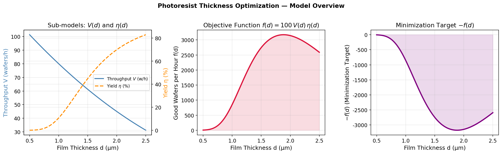
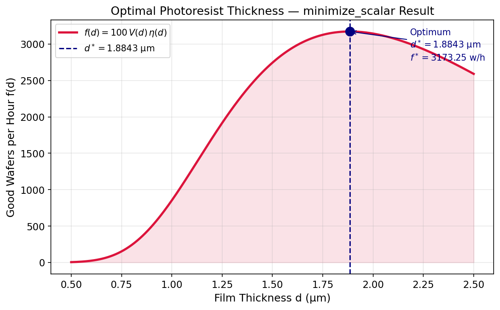
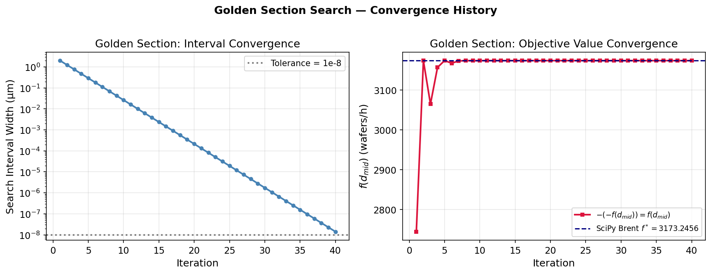
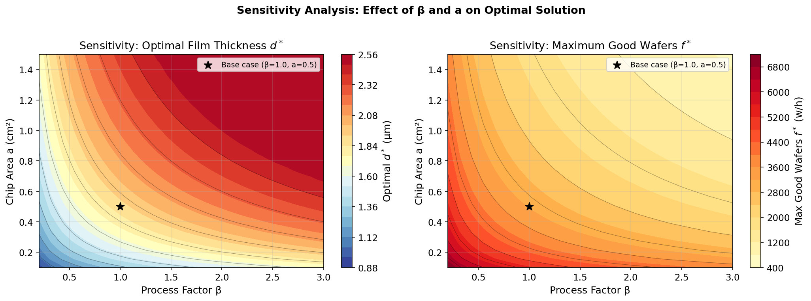
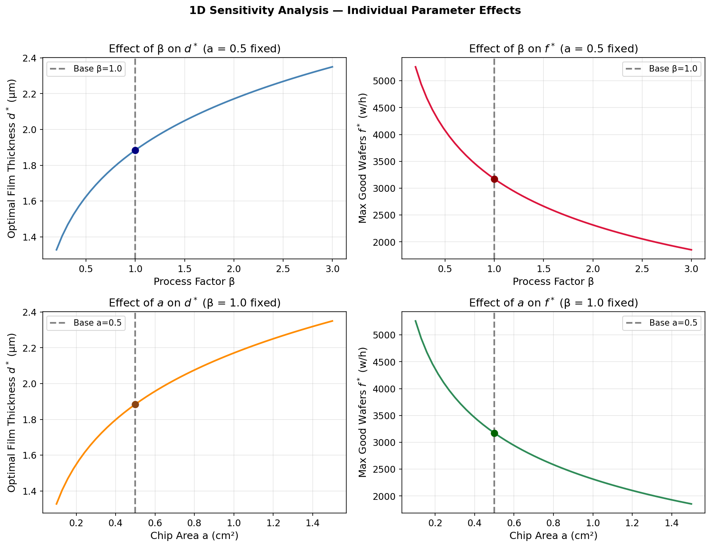

# Unit12 Example 01 - 晶圓製程最佳光阻劑膜厚

## 學習目標

本範例以**晶圓製程中光阻劑膜厚最適化**為題，介紹如何使用 `scipy.optimize.minimize_scalar()` 求解單變數有界最適化問題，並與黃金分割法（Golden Section Search）進行比較，最後透過敏感度分析探討製程參數對最佳膜厚的影響。

學習完本範例後，您將能夠：

- 建立晶圓製程的**缺損率、良率與產量數學模型**
- 將**最大化問題**轉換為**最小化問題**的標準形式
- 使用 `scipy.optimize.minimize_scalar(method='bounded')` 求解**單變數有界最適化問題**
- 實作**黃金分割法（Golden Section Search）**並與 SciPy 結果比較
- 繪製**目標函數曲線圖**並標示最佳點位置
- 進行**敏感度分析（Sensitivity Analysis）**，探討製程參數對最佳解的影響

---

## 1. 問題描述

### 1.1 化工背景

在積體電路（IC）製造中，**光阻劑（Photoresist）** 是微影製程（Photolithography）的關鍵材料。光阻劑塗佈於晶圓表面並以特定厚度 $d$ 加以控制：

- **膜厚不足** → 覆蓋力不足，導致缺損率 $D_0$ 上升，良率 $\eta$ 下降
- **膜厚過大** → 塗佈與烘烤時間增加，單位時間產量 $V$ 下降

因此，最佳光阻劑膜厚 $d^*$ 是在**良率效益**與**產量效益**之間取得平衡的結果，構成典型的單變數工程最適化問題。


---

### 1.2 系統設定與參數

| 符號 | 說明 | 數值 |
|------|------|------|
| $d$ | 光阻劑膜厚（μm） | 決策變數，搜尋範圍 $[0.5,\ 2.5]$ |
| $a$ | 晶片面積（cm²） | $0.5$ |
| $\beta$ | 製程工藝因子（無因次） | $1.0$ |

---

## 2. 數學模型

### 2.1 缺損率模型

缺損密度 $D_0$ 與膜厚 $d$ 之關係為：

$$
D_0 = 1.5\, d^{-3}
$$

膜厚愈薄，缺損密度指數上升（冪次為 $-3$ ）。

### 2.2 良率模型

參考 Bose-Einstein 複合缺損模型，晶片完好比例（良率）為：

$$
\eta = \frac{1}{\left(1 + \beta\, D_0\, a\right)^4}
$$

其中 $a$ 為晶片面積（cm²）， $\beta$ 為與製程工藝相關之無因次因子。

### 2.3 產量模型

單位時間（晶圓/小時）生產量 $V$ 與膜厚 $d$ 之關係為：

$$
V = 125 - 50d + 5d^2 \quad \text{(wafers/h)}
$$

膜厚較大時，塗佈烘烤時間增加，使每小時可處理晶圓數下降。

### 2.4 目標函數

每小時**完好晶片產量**為：

$$
f(d) = 100\, V(d)\, \eta(d)
$$

（乘以 100 為換算至百片單位之比例係數，可視優化目的調整）

由於目標為**最大化** $f(d)$ ，等價於最小化其負值：

$$
\min_{0.5 \leq d \leq 2.5}\; \bigl[-f(d)\bigr] = \min_{0.5 \leq d \leq 2.5}\; \bigl[-100\, V(d)\, \eta(d)\bigr]
$$

---

## 3. 求解方法

### 3.1 `scipy.optimize.minimize_scalar()`

SciPy 提供 `minimize_scalar()` 函式求解單變數最適化問題：

```python
from scipy.optimize import minimize_scalar

result = minimize_scalar(
    fun,              # 目標函數（最小化方向）
    method='bounded', # 有界搜尋（Brent 法，確保在區間內搜尋）
    bounds=(0.5, 2.5) # 搜尋區間 [a, b]
)
```

| 輸出屬性 | 說明 |
|---------|------|
| `result.x` | 最佳解 $d^*$ |
| `result.fun` | 最小化目標函數值（即 $-f(d^*)$ ） |
| `result.success` | 是否成功收斂 |
| `result.nfev` | 函數評估次數 |

`method='bounded'` 採用 **Brent's Method**（貝倫特法）搭配黃金分割保護，確保在區間 $[a, b]$ 內搜尋，不會超出邊界。

### 3.2 黃金分割法（Golden Section Search）

黃金分割法是一種不需要導數的區間縮小法，以黃金比例 $\phi = (\sqrt{5}-1)/2 \approx 0.618$ 逐步縮小搜尋區間，直至區間長度小於設定容差。演算法流程：

1. 初始化區間 $[a_0,\ b_0]$ ，設定容差 $\varepsilon$
2. 計算兩個內部測試點：

   $$
   c = b - \phi\,(b-a), \quad d_p = a + \phi\,(b-a)
   $$

3. 比較 $f(c)$ 與 $f(d_p)$ ：
   - 若 $f(c) < f(d_p)$ ：更新 $b \leftarrow d_p$
   - 否則：更新 $a \leftarrow c$
4. 當 $|b - a| < \varepsilon$ 時停止，取 $(a+b)/2$ 為最優解

黃金分割法每次迭代可節省一次函數評估（重用前一次已計算之點）。

---

## 4. 程式演練

本範例之完整程式碼請參閱 `Unit12_Example_01.ipynb`，共涵蓋以下步驟。

### 4.1 環境設定與套件載入

**執行環境確認：**

```
✓ 偵測到 Local 環境
✓ Notebook工作目錄: d:\MyGit\ChemE-3502\Unit12
✓ 結果輸出目錄: d:\MyGit\ChemE-3502\Unit12\outputs\Unit12_Example_01
✓ 圖檔輸出目錄: d:\MyGit\ChemE-3502\Unit12\outputs\Unit12_Example_01\figs
```

**套件版本確認：**

```
✓ 套件載入完成
  numpy  版本: 1.23.5
  scipy  版本: 1.15.2
  matplotlib 版本: 3.10.8
```

---

### 4.2 數學模型驗證

以 $d = 0.5,\ 1.0,\ 1.5,\ 2.0,\ 2.5$ μm 分別驗算各子模型輸出值：

```
  d(μm)    D0         η(%)      V(w/h)    f(w/h)
  0.50   12.0000     0.04     101.25      4.22
  1.00    1.5000    10.66      80.00    852.98
  1.50    0.4444    44.81      61.25   2744.77
  2.00    0.1875    69.88      45.00   3144.42
  2.50    0.0960    82.90      31.25   2590.63
```

**討論：** 由驗算結果可清楚觀察到三個子模型的競爭關係：
- $d$ 從 0.5 增至 2.5 μm 時，缺損密度 $D_0$ 從 12.0000 急降至 0.0960，使良率 $\eta$ 從近乎零（0.04%）大幅提升至 82.90%。
- 與此同時，產量 $V$ 從 101.25 降至 31.25 wafers/h（降幅約 69%），造成嚴重的產能損耗。
- 目標函數 $f(d)$ 因此在離散取樣中， $d = 2.0$ μm 處取得最高的樣本值 3144.42，但真正極大值介於 $1.5 \sim 2.0$ μm 之間，需精確最適化求解。

---

### 4.3 目標函數可視化

下圖呈現各子函數隨膜厚 $d$ 變化的趨勢，確認完好晶片產量 $f(d)$ 在搜尋區間內存在唯一極值。



**圖 1：目標函數整體概覽（三幅子圖）**

- **左上子圖（ $D_0$ 與 $\eta$ 雙軸）**：缺損密度 $D_0(d)$ （藍色，左軸）隨膜厚增加呈 $d^{-3}$ 冪次急降；良率 $\eta(d)$ （橘色，右軸）相應快速上升，在 $d > 2$ μm 後逐漸趨近飽和。兩曲線交叉趨勢揭示了膜厚對缺損率的強烈非線性影響。
- **左下子圖（產量 $V$ ）**：單位時間產量 $V(d)$ （綠色）源自二次函數 $V = 125 - 50d + 5d^2$ ，頂點在 $d = 5$ μm（搜尋區間外），因此在 $[0.5,\ 2.5]$ 區間內單調遞減，反映塗佈與烘烤時間增加使每小時可處理晶圓數降低。
- **右側子圖（目標函數 $f(d)$ ）**：完好晶片產量 $f(d) = 100\,V(d)\,\eta(d)$ 在 $d \approx 1.88$ μm 處出現明確極大值，形成典型的單峰目標函數曲線，確認最適化問題具有唯一最優解。

---

## 5. 結果與討論

### 5.1 `minimize_scalar` (Brent's Method) 求解

**執行輸出：**

```
==================================================
  minimize_scalar (Brent's Method) 求解結果
==================================================
  收斂狀態  : 成功 ✓
  函數評估次: 10
  最佳膜厚 d*  = 1.884325 μm
  最大產量 f*  = 3173.2456 wafers/h
    ├ 缺損密度 D0 = 0.2242
    ├ 良率    η   = 65.38 %
    └ 產量    V   = 48.54 wafers/h
==================================================
```



**圖 2：`minimize_scalar` 最優解標示圖**

完好晶片產量 $f(d)$ 曲線（紅色填色區域）在搜尋範圍 $[0.5,\ 2.5]$ μm 內呈現清晰的單峰結構。最佳點以藍色實心圓標注於曲線頂端，垂直虛線輔助定位 $d^* = 1.8843$ μm：

- 最佳膜厚位於搜尋區間**內部**（不在邊界），確認為真正的局部極大值，不是受邊界約束的解。
- Brent 法僅需 **10 次函數評估**即完成收斂，體現了超線性插值（拋物線擬合）的高效性。
- 在最佳點 $d^* = 1.884325$ μm 處，製程良率達 $65.38\%$ ，每小時可產出 $3173.25$ 片完好晶片。

**最佳點製程摘要：**

| 量值 | 數值 |
|------|------|
| 光阻劑膜厚 $d^*$ | 1.884325 μm |
| 缺損密度 $D_0$ | 0.2242 |
| 製程良率 $\eta$ | 65.38 % |
| 單位時間產量 $V$ | 48.54 wafers/h |
| 最大完好晶片產量 $f^*$ | **3173.2456 wafers/h** |

此結果說明：以膜厚 0.5 μm 的高產量模式（ $V = 101.25$ ， $\eta = 0.04\%$ ）每小時僅能產出 4.22 片完好晶片；而在最佳膜厚下，雖然產量 $V$ 降至 48.54 wafers/h，但良率提升至 65.38%，使綜合完好晶片輸出達到最大化。

---

### 5.2 黃金分割法（Golden Section Search）

**執行輸出：**

```
==================================================
  黃金分割法（Golden Section Search）求解結果
==================================================
  迭代次數   : 40
  函數評估次 : 43
  最佳膜厚 d*  = 1.884324 μm
  最大產量 f*  = 3173.2456 wafers/h
==================================================

  ── 方法比較 ──
    方法                             d* (μm)     f* (w/h)   nfev
  minimize_scalar (Brent)          1.884325    3173.2456     10
  Golden Section Search            1.884324    3173.2456     43

  差異 |Δd*| = 8.72e-07 μm
  差異 |Δf*| = 1.78e-09 wafers/h
```

**討論：**

- 黃金分割法以 40 次迭代（43 次函數評估）收斂，與 Brent 法的結果幾乎完全相同： $|\Delta d^*| = 8.72 \times 10^{-7}$ μm，遠低於任何實際製程精度需求（通常 $\sim 0.01$ μm）。
- Brent 法的收斂速度（10 次評估）遠優於黃金分割法（43 次），差距達 4.3 倍。這是因為 Brent 法採用**拋物線插值**（超線性收斂），能更快準確定位極值；而黃金分割法僅依靠固定比例 $\phi \approx 0.618$ 的區間縮減（線性收斂）。
- 儘管效率較低，黃金分割法的**算法邏輯直觀透明**，適合理解最適化搜尋的基本原理，也適合在極值附近函數形狀不規則（難以插值）時作為備用方法。

---

### 5.3 黃金分割法收斂歷程



**圖 3：黃金分割法收斂歷程（雙指標）**

- **左圖（對數軸 — 搜尋區間寬度）**：每迭代一次，搜尋區間寬度乘以收縮因子 $\phi \approx 0.618$ ，因此在對數尺度下呈現**嚴格線性下降**，斜率等於 $\log_{10}(0.618) \approx -0.209$ （每次迭代縮減約 0.209 個 $\log_{10}$ 單位，即每約 4.8 次迭代縮小一個數量級）。初始區間寬度 2.0 μm 歷經 40 次迭代後收縮至 $< 10^{-8}$ μm，驗證了設定的容差條件完全滿足。
- **右圖（目標函數收斂值）**：前 5 次迭代中，搜尋點位於次優區域（膜厚偏薄、良率偏低）， $f(d_\text{mid})$ 呈現波動（由約 2750 升至 3150 wafers/h）；第 6 次迭代後搜尋區間聚焦於極值附近，目標函數值穩定平台於 $f^* = 3173.2456$ wafers/h，與 SciPy Brent 結果（藍色虛線）完全重合。

---

### 5.4 敏感度分析 — 二維熱圖



**圖 4： $\beta$–$a$ 參數平面上的最優解分佈熱圖**

以 $\beta \in [0.3,\ 3.0]$ 與 $a \in [0.1,\ 1.5]$ cm² 的密集網格（各 30 點）進行二維掃描，分別對每組參數執行 `minimize_scalar` 求解：

- **左圖（最佳膜厚 $d^*$ ）**： $d^*$ 從左下角（低 $\beta$ 、低 $a$ ）約 $1.0$ μm 單調遞增至右上角（高 $\beta$ 、高 $a$ ），並在極端參數下達到並受限於搜尋上界 $2.5$ μm（邊界解）。物理解釋：製程工藝因子 $\beta$ 愈大或晶片面積 $a$ 愈大，缺損對良率的影響愈顯著（出現在良率公式 $\eta = (1 + \beta D_0 a)^{-4}$ 中以乘積 $\beta \cdot D_0 \cdot a$ 形式），需更厚的光阻劑膜以降低缺損密度 $D_0$ ，補償良率損失。黑色星形標記為基準案例（ $\beta = 1.0$ ， $a = 0.5$ ），對應 $d^* = 1.884$ μm。

- **右圖（最大產量 $f^*$ ）**： $f^*$ 從右上角約 740 wafers/h 增至左下角約 6700 wafers/h，趨勢與 $d^*$ 圖相反。此結果說明：在苛刻製程條件（高 $\beta$ ）或大晶片（高 $a$ ）下，即使已最佳化膜厚，綜合製程效益仍大幅降低——這是製程工程師在設計製程時必須面對的根本限制。

兩圖等值線的彎曲走向高度吻合，反映 $\beta$ 與 $a$ 透過乘積 $\beta \cdot a$ 耦合在良率模型中，對最佳解具有**近似對稱的影響**。

---

### 5.5 敏感度分析 — 一維曲線



**圖 5：各參數對最佳解的一維敏感度曲線**

固定一個參數（基準值），對另一個參數掃描，呈現 $d^*$ 與 $f^*$ 的單調回應特性：

- **左上（ $\beta$ 對 $d^*$ ， $a = 0.5$ 固定）**： $d^*$ 隨 $\beta$ 增大而單調增加，由 $\beta = 0.3$ 的約 $1.45$ μm 增至 $\beta = 3.0$ 的約 $2.35$ μm。凹形（concave）曲線形狀表明邊際效應遞減： $\beta$ 較小時增厚的邊際效益較大； $\beta$ 極大時 $d^*$ 趨近搜尋上界 $2.5$ μm。

- **右上（ $\beta$ 對 $f^*$ ， $a = 0.5$ 固定）**： $f^*$ 隨 $\beta$ 增大而**嚴格遞減**，由 $\beta = 0.3$ 的約 $4740$ wafers/h 降至 $\beta = 3.0$ 的約 $1850$ wafers/h，降幅逾 $60\%$。顯示製程工藝因子代表的缺損抵抗力對整體生產效益具有決定性影響。

- **左下（ $a$ 對 $d^*$ ， $\beta = 1.0$ 固定）**：形狀與左上圖類似，同樣呈凹形單調遞增，反映晶片面積愈大，最佳膜厚愈需要增加以提升良率。

- **右下（ $a$ 對 $f^*$ ， $\beta = 1.0$ 固定）**： $f^*$ 隨晶片面積增大而嚴格遞減，趨勢與右上圖一致——大面積晶片天生具有更高的缺損累積機率，即使已最佳化膜厚仍難以避免良率下降。

四圖中實心圓標記均為基準案例（ $\beta = 1.0$ ， $a = 0.5$ ），對應 $d^* = 1.884$ μm、 $f^* = 3173.25$ wafers/h，與第 5.1 節求解結果完全吻合，確認敏感度掃描的數值一致性。

---

### 5.6 方法比較總結

| 方法 | 最佳膜厚 $d^*$ （μm） | 最大產量 $f^*$ （wafers/h） | 函數評估次數 | 收斂特性 |
|------|---------------------|--------------------------|------------|----------|
| `minimize_scalar` (Brent) | **1.884325** | **3173.2456** | **10** | 超線性（拋物線插值），高效 |
| Golden Section Search | 1.884324 | 3173.2456 | 43 | 線性（固定比例縮減），易於理解 |

$|\Delta d^*| = 8.72 \times 10^{-7}$ μm， $|\Delta f^*| = 1.78 \times 10^{-9}$ wafers/h — 兩方法結果**實質上完全相同**，差異遠低於製程精度要求。

---

## 6. 重點整理

- 單變數有界最適化問題的標準形式： $\min_{a \leq x \leq b}\, f(x)$
- 最大化問題統一轉換為最小化： $\max f = -\min(-f)$
- `minimize_scalar(method='bounded')` 採用 Brent 法，兼顧效率與穩定性
- 黃金分割法是簡單的無導數區間縮小法，教學上有助理解最適化搜尋原理
- 敏感度分析可評估製程參數不確定性對最佳解的影響，具實務設計價值

---

**課程資訊**
- 課程名稱：電腦在化工上之應用 (ChemE 3502)
- 課程單元：Unit12 程序最適化 — 範例 01
- 課程製作：逢甲大學 化工系 智慧程序系統工程實驗室
- 授課教師：莊曜禎 助理教授
- 更新日期：2026-02-27

**課程授權 [CC BY-NC-SA 4.0]**
 - 本教材遵循 [創用CC 姓名標示-非商業性-相同方式分享 4.0 國際 (CC BY-NC-SA 4.0)](https://creativecommons.org/licenses/by-nc-sa/4.0/deed.zh) 授權。

---
