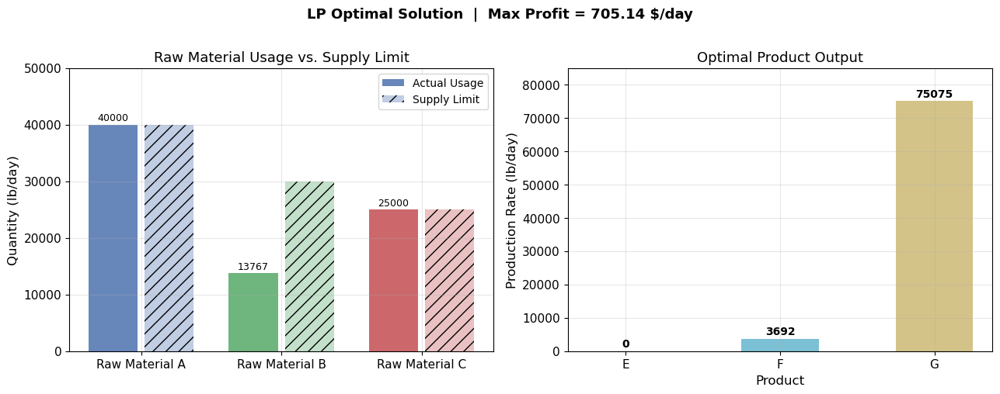
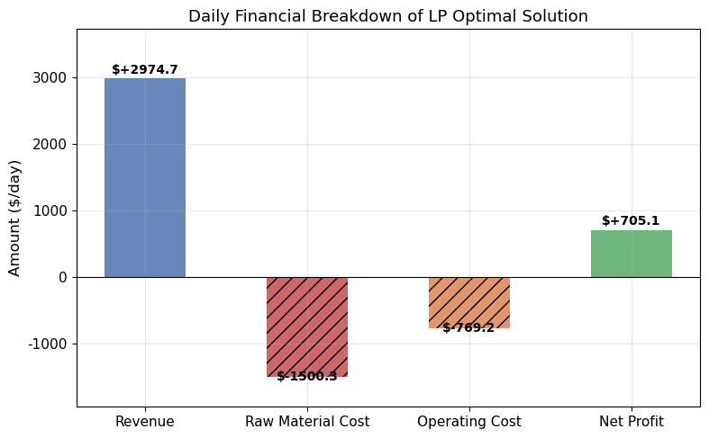
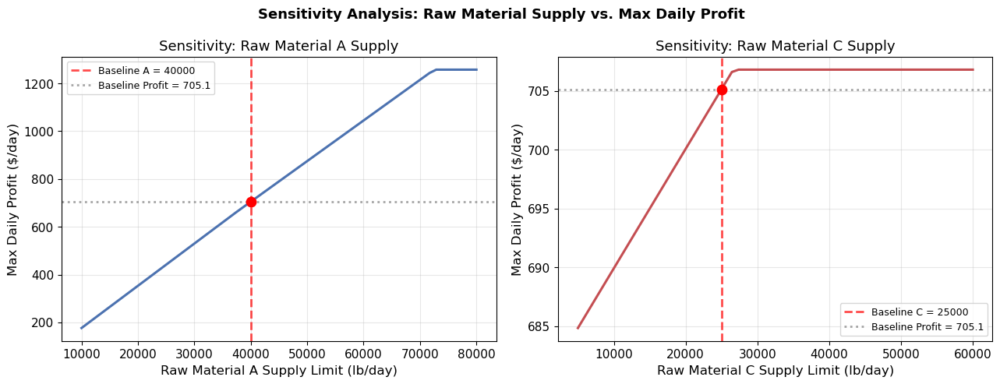
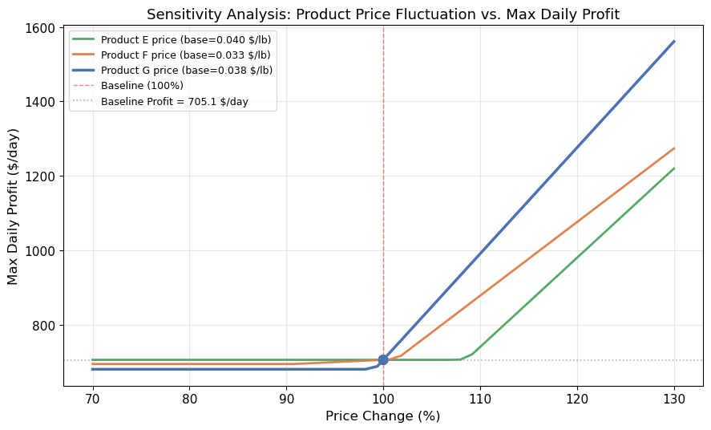

# Unit12 Example 02 - 生產流程最大獲利之操作條件

## 學習目標

本範例以**化學工廠生產流程最大獲利**為題，介紹如何使用 `scipy.optimize.linprog()` 求解線性規劃（Linear Programming, LP）問題，並透過敏感度分析探討原料供應量與售價波動對最大獲利的影響。

學習完本範例後，您將能夠：

- 識別化工生產問題中**線性規劃問題的結構**：目標函數、等式限制與變數邊界
- 建立**線性目標函數**（獲利 = 收入 − 原料成本 − 操作成本）
- 建立**線性等式限制條件**（質量平衡方程式）
- 正確設定**變數上下限**（原料供應量限制）
- 使用 `scipy.optimize.linprog()` 求解線性規劃問題，掌握**最大化轉最小化**的技巧
- 解讀最適化結果：各原料用量、各產品產量與每日最大獲利
- 進行**敏感度分析（Sensitivity Analysis）**，探討原料供應量或售價波動對最大獲利的影響

---

## 1. 問題描述

### 1.1 化工背景

某化學工廠以有限量之原料 A、B 和 C，生產 E、F 和 G 三種產品。其生產流程包含三個程序：

| 程序 | 反應式 | 產品 |
|------|--------|------|
| 1 | $A + B \to E$ | 產品 E |
| 2 | $A + B \to F$ | 產品 F |
| 3 | $3A + B + 2C \to G$ | 產品 G |

**原料成本與每日最大供應量：**

| 原料 | 每日最大供應量 (lb/day) | 單價 ($/lb) |
|------|----------------------|-------------|
| A    | 40,000               | 0.015       |
| B    | 30,000               | 0.020       |
| C    | 25,000               | 0.025       |

**各程序操作資訊：**

| 程序 | 產品 | 每磅產品所需原料 (lb) | 操作成本 | 產品售價 |
|------|------|----------------------|----------|----------|
| 1    | E    | 2/3 A，1/3 B         | 0.015 $/lb E | 0.040 $/lb E |
| 2    | F    | 2/3 A，1/3 B         | 0.005 $/lb F | 0.033 $/lb F |
| 3    | G    | 1/2 A，1/6 B，1/3 C  | 0.010 $/lb G | 0.038 $/lb G |

試決定如何求得**每日最大獲利之操作條件**？又最大獲利為何？

---

### 1.2 決策變數定義

令 $x_1 \sim x_6$ 分別代表原料 A、B、C 與產品 E、F 及 G 各成分每日之量（lb/day）：

| 變數 | 說明 | 單位 |
|------|------|------|
| $x_1$ | 原料 A 每日用量 | lb/day |
| $x_2$ | 原料 B 每日用量 | lb/day |
| $x_3$ | 原料 C 每日用量 | lb/day |
| $x_4$ | 產品 E 每日產量 | lb/day |
| $x_5$ | 產品 F 每日產量 | lb/day |
| $x_6$ | 產品 G 每日產量 | lb/day |

---

## 2. 數學模型建立

### 2.1 目標函數

#### 每日銷售收入

$$
IC = 0.040\, x_4 + 0.033\, x_5 + 0.038\, x_6
$$

#### 每日原料成本

$$
C_1 = 0.015\, x_1 + 0.020\, x_2 + 0.025\, x_3
$$

#### 每日操作成本

$$
C_2 = 0.015\, x_4 + 0.005\, x_5 + 0.010\, x_6
$$

#### 每日獲利（目標函數，最大化）

$$
\begin{aligned}
F &= IC - C_1 - C_2 \\
  &= 0.025\, x_4 + 0.028\, x_5 + 0.028\, x_6 - 0.015\, x_1 - 0.020\, x_2 - 0.025\, x_3
\end{aligned}
$$

> **關鍵提示：** `scipy.optimize.linprog()` 只能求**最小化**問題，因此最大化 $F$ 等價於最小化 $-F$ 。目標係數向量需取負號處理。

---

### 2.2 等式限制條件 — 質量平衡

由各程序的化學計量關係，可推導每種原料使用量與各產品產量之間的線性等式限制：

**原料 A 的質量平衡：**

$$
x_1 = \frac{2}{3}\, x_4 + \frac{2}{3}\, x_5 + \frac{1}{2}\, x_6 \quad \Rightarrow \quad x_1 - 0.667\, x_4 - 0.667\, x_5 - 0.5\, x_6 = 0
$$

**原料 B 的質量平衡：**

$$
x_2 = \frac{1}{3}\, x_4 + \frac{1}{3}\, x_5 + \frac{1}{6}\, x_6 \quad \Rightarrow \quad x_2 - 0.333\, x_4 - 0.333\, x_5 - 0.167\, x_6 = 0
$$

**原料 C 的質量平衡：**

$$
x_3 = \frac{1}{3}\, x_6 \quad \Rightarrow \quad x_3 - 0.333\, x_6 = 0
$$

以矩陣形式 $\mathbf{A}_{eq}\, \mathbf{x} = \mathbf{b}_{eq}$ 表示：

$$
\mathbf{A}_{eq} = \begin{bmatrix}
1 & 0 & 0 & -0.667 & -0.667 & -0.5   \\
0 & 1 & 0 & -0.333 & -0.333 & -0.167 \\
0 & 0 & 1 &  0     &  0     & -0.333
\end{bmatrix}, \quad
\mathbf{b}_{eq} = \begin{bmatrix} 0 \\ 0 \\ 0 \end{bmatrix}
$$

---

### 2.3 變數邊界（上下限）

原料供應量受每日最大供應量限制，產品產量非負：

$$
\mathbf{x}_L = \begin{bmatrix} 0 \\ 0 \\ 0 \\ 0 \\ 0 \\ 0 \end{bmatrix}, \quad
\mathbf{x}_U = \begin{bmatrix} 40000 \\ 30000 \\ 25000 \\ +\infty \\ +\infty \\ +\infty \end{bmatrix}
$$

---

### 2.4 線性規劃標準型式總覽

本問題屬於**線性規劃（LP）問題**，標準型式為：

$$
\min_{\mathbf{x}}\; \mathbf{c}^T \mathbf{x}
$$

其中 $\mathbf{c}$ 為取負後的獲利係數向量（ $\mathbf{c} = -\mathbf{f}$ ），

$$
\text{s.t.} \quad \mathbf{A}_{eq}\, \mathbf{x} = \mathbf{b}_{eq}, \quad \mathbf{x}_L \leq \mathbf{x} \leq \mathbf{x}_U
$$

無線性不等式限制（ $\mathbf{A}_{ub}$ 、 $\mathbf{b}_{ub}$ 均為空）。

---

## 3. 求解方法

### 3.1 `scipy.optimize.linprog()`

SciPy 提供 `linprog()` 函式求解線性規劃問題，基本呼叫格式如下：

```python
from scipy.optimize import linprog

result = linprog(
    c,           # 目標函數係數向量（最小化方向）
    A_ub=None,   # 不等式限制係數矩陣（本例為 None）
    b_ub=None,   # 不等式限制右端向量（本例為 None）
    A_eq=A_eq,   # 等式限制係數矩陣
    b_eq=b_eq,   # 等式限制右端向量
    bounds=bounds, # 各變數邊界 [(lb, ub), ...]
    method='highs' # 求解器（SciPy 1.9+ 預設）
)
```

**主要輸出屬性：**

| 屬性 | 說明 |
|------|------|
| `result.x` | 最佳解向量 $\mathbf{x}^*$ |
| `result.fun` | 最小化目標函數值 $\mathbf{c}^T \mathbf{x}^*$ |
| `result.success` | 是否成功收斂 |
| `result.message` | 求解器回傳訊息 |
| `result.nit` | 迭代次數 |

> **注意：** 由於 `linprog()` 為最小化函數，求最大獲利 $F_{\max}$ 時，最大獲利等於 $-\texttt{result.fun}$ 。

---

### 3.2 HiGHS 求解器

`method='highs'`（SciPy 1.9+ 預設）採用 **HiGHS** 求解器，是目前學術與工業界公認效能最佳的開源線性規劃求解器之一，支援：

- 修正單純形法（Revised Simplex Method）
- 內點法（Interior Point / Barrier Method）
- 分支定界法（Branch and Bound，用於混合整數問題）

相較於早期的 `method='simplex'` 或 `method='interior-point'`，HiGHS 在數值穩定性與計算速度上均有顯著提升，適合大規模線性規劃問題。

---

### 3.3 線性規劃的幾何直觀

線性規劃問題的**最適解必定位於可行區域（Feasible Region）的頂點（Vertex）**。可行區域由等式限制與不等式限制圍成的多面體（Polyhedron）定義：

- 等式限制 $\mathbf{A}_{eq}\,\mathbf{x} = \mathbf{b}_{eq}$ 將可行域限縮至超平面（Hyperplane）的交集
- 變數邊界 $\mathbf{x}_L \leq \mathbf{x} \leq \mathbf{x}_U$ 定義「方形」邊界

線性目標函數的等值線（Isoprofit Line）在可行域上移動，直至碰觸頂點為止，該頂點即為最佳解。

> **推論：** 若可行域有界，線性規劃必有有限最佳解；若某方向無界，最佳解可能不存在（目標趨近 $\pm\infty$）。

---

## 4. 程式演練

本範例之完整程式碼請參閱 `Unit12_Example_02.ipynb`，共涵蓋以下步驟。

### 4.1 環境設定與套件載入

**執行環境確認：**

```
✓ 偵測到 Local 環境
✓ Notebook工作目錄: d:\MyGit\ChemE-3502\Unit12
✓ 結果輸出目錄: d:\MyGit\ChemE-3502\Unit12\outputs\Unit12_Example_02
✓ 圖檔輸出目錄: d:\MyGit\ChemE-3502\Unit12\outputs\Unit12_Example_02\figs
```

**套件版本確認：**

```
✓ 套件載入完成
  numpy      版本: 1.23.5
  scipy      版本: 1.15.2
  matplotlib 版本: 3.10.8
```

---

### 4.2 問題參數設定

以 NumPy 向量與矩陣定義線性規劃問題的各個要素：

```python
import numpy as np
from scipy.optimize import linprog

# ── 目標函數係數（最大化獲利 → 最小化負獲利）──────────────────
# F = 0.025*x4 + 0.028*x5 + 0.028*x6 - 0.015*x1 - 0.020*x2 - 0.025*x3
c = np.array([-(-0.015), -(-0.020), -(-0.025), -(0.025), -(0.028), -(0.028)])
# 等價寫法（邏輯更清晰）：
c = np.array([0.015, 0.020, 0.025, -0.025, -0.028, -0.028])

# ── 等式限制係數矩陣（質量平衡，Aeq @ x = beq）────────────────────
A_eq = np.array([
    [1,  0,  0, -0.667, -0.667, -0.500],  # 原料 A 平衡
    [0,  1,  0, -0.333, -0.333, -0.167],  # 原料 B 平衡
    [0,  0,  1,  0,     0,     -0.333 ],  # 原料 C 平衡
])
b_eq = np.zeros(3)

# ── 變數邊界 [(lb, ub), ...]──────────────────────────────────────
bounds = [
    (0, 40000),   # x1: 原料 A
    (0, 30000),   # x2: 原料 B
    (0, 25000),   # x3: 原料 C
    (0, None),    # x4: 產品 E（無上限）
    (0, None),    # x5: 產品 F（無上限）
    (0, None),    # x6: 產品 G（無上限）
]
```

---

### 4.3 求解

```python
result = linprog(c, A_eq=A_eq, b_eq=b_eq, bounds=bounds, method='highs')
```

**執行輸出：**

```
====================================================
  linprog (HiGHS) 求解結果
====================================================
  收斂狀態  : 成功 ✓
  求解器訊息: Optimization terminated successfully. (HiGHS Status 7: Optimal)
  迭代次數  : 2
  目標函數值（-獲利）: -705.135
====================================================

  決策變數最佳解：
    x1 (原料 A) =  40000.000 lb/day  [已達上限]
    x2 (原料 B) =  13766.923 lb/day  [上限 30000]
    x3 (原料 C) =  25000.000 lb/day  [已達上限]
    x4 (產品 E) =      0.000 lb/day
    x5 (產品 F) =   3691.848 lb/day
    x6 (產品 G) =  75075.075 lb/day

  每日最大獲利 F* = 705.135 $/day
====================================================
```

---

### 4.4 限制條件驗證與財務分解

```
質量平衡殘差驗證（|Aeq @ x - beq| ≤ tol）：
  原料 A 平衡: residual = 0.00e+00  ✓
  原料 B 平衡: residual = 0.00e+00  ✓
  原料 C 平衡: residual = 0.00e+00  ✓

財務分解：
  銷售收入      :   2974.684 $/day
  原料成本      :   1500.338 $/day  (50.4% of revenue)
  操作成本      :    769.210 $/day  (25.9% of revenue)
  ─────────────────────────────────
  淨獲利（驗算）:    705.135 $/day
```

---

### 4.5 最適解視覺化



**圖 1：最適解資源分配雙軸圖**

左子圖（原料用量）顯示原料 A 與 C 均已達到供應上限，原料 B 僅用了 13,767 lb/day（約 45.9% 的配額），揭示 B 是非約束原料。右子圖（產品產量）顯示工廠完全不生產產品 E，而是集中資源生產產品 G（75,075 lb/day）為主，搭配少量產品 F（3,692 lb/day）。

---

### 4.6 獲利分解分析



**圖 2：每日獲利成本分解圖**

以堆積長條圖呈現每日總收入、原料成本、操作成本與最終獲利的組成關係：

| 財務項目 | 金額 ($/day) | 佔收入比例 |
|----------|-------------|----------|
| 銷售收入 | 2,974.68 | 100.0% |
| 原料成本 | −1,500.34 | 50.4% |
| 操作成本 | −769.21 | 25.9% |
| **淨獲利** | **705.14** | **23.7%** |

- 原料成本佔總收入的 50.4%，是最大的成本項目。
- 操作成本佔總收入的 25.9%（769.21 $/day），主要來自大量生產產品 G 所需的操作費用。
- 最終獲利率為 705.14 / 2974.68 ≈ 23.7%。

---

## 5. 結果與討論

### 5.1 最適解解讀

| 變數 | 說明 | 最佳值 | 邊界狀態 |
|------|------|--------|---------|
| $x_1$ | 原料 A | 40,000 lb/day | **達到上限** |
| $x_2$ | 原料 B | 13,767 lb/day | 未達上限（剩餘 16,233 lb/day）|
| $x_3$ | 原料 C | 25,000 lb/day | **達到上限** |
| $x_4$ | 產品 E | 0 lb/day | **不生產** |
| $x_5$ | 產品 F | 3,692 lb/day | — |
| $x_6$ | 產品 G | 75,075 lb/day | — |
| $F^*$ | **每日最大獲利** | **705.135 $/day** | — |

**重要觀察：**

1. **原料 A 與 C 均已耗盡**：兩者為約束性瓶頸原料（binding constraint）；增加其供應量可直接提升獲利。
2. **原料 B 有剩餘**：原料 B 每日剩餘 16,233 lb/day，是非約束資源。即使增加 B 的供應量上限也不會改善最大獲利（除非 A 或 C 的供應量同步提升）。
3. **完全不生產產品 E**：由目標函數中各決策變數的利潤係數可直接判斷：
   - 產品 E 的利潤係數（來自目標函數 $F$）：$+0.025$ $/lb
   - 產品 F 的利潤係數：$+0.028$ $/lb
   - 產品 G 的利潤係數：$+0.028$ $/lb
   - 產品 E 的利潤係數**最低**（0.025 < 0.028），且 E 和 F 生產都需消耗相同比例的原料 A（每磅均需 0.667 lb A），因此在原料 A 有限的情況下，利潤係數較高的 F 或 G 優先被選擇。
   - 最終解集中生產 G（75,075 lb/day），因為 G 每磅只需消耗 0.5 lb A（少於 E/F 的 0.667 lb A），且可完全消耗另一瓶頸原料 C，在 A 有限的條件下可生產更大量的 G，實現更高的總利潤。

---

### 5.2 敏感度分析 — 原料供應量上限變動

探討原料 A（ $x_{1,\max}$ ）與原料 C（ $x_{3,\max}$ ）之每日最大供應量變動如何影響每日最大獲利：



**圖 3：原料 A、C 供應量變動對每日最大獲利的影響**

- **左圖（原料 A 供應量掃描）：** 每日最大獲利隨原料 A 供應量線性增加，於基準點附近的**影子價格（Shadow Price）** ≈ 0.017 $/（lb A），反映每多增加 1 lb/day 的原料 A 供應量，可帶來約 0.017 $/day 的獲利增益。當原料 A 供應量超過約 70,000 lb/day 時，原料 C 成為主要瓶頸，曲線斜率趨緩並趨於穩定。
- **右圖（原料 C 供應量掃描）：** 最大獲利隨原料 C 供應量呈線性增長，於基準點的**影子價格** ≈ 0.001 $/（lb C）。此值遠小於原料 A 的影子價格，說明相同採購預算下，增加原料 A 的供應量比增加原料 C 更具經濟效益。當原料 C 超過約 27,000 lb/day 後，受其他原料瓶頸限制，獲利不再增加。

---

### 5.3 敏感度分析 — 產品售價波動

探討三種產品售價同比波動（±30%）對最大獲利的影響：



**圖 4：產品售價波動對每日最大獲利的影響**

以基準售價（ $p_E = 0.040$，$p_F = 0.033$，$p_G = 0.038$）為中心，各自獨立掃描 ±30% 範圍：

- **產品 G 售價（藍線）**：對最大獲利影響最大（斜率最陡），因為 G 的產量（75,075 lb/day）遠大於 F（3,692 lb/day）和 E（0 lb/day）。每提升 G 售價 0.001 $/lb，每日獲利增加約 75.1 $，體現了大量生產 G 的規模效益。
- **產品 F 售價（橘線）**：對最大獲利的影響明顯小於 G，斜率約為 G 的 4.9%（對應 F/G 產量比例）。在 F 售價高於某臨界值時，最佳解可能切換至更多生產 F，導致曲線出現折彎（分叉點）。
- **產品 E 售價（綠線）**：在基準解中完全不生產 E，因此 E 售價的小幅波動不影響最大獲利（水平線段）。只有當 E 售價明顯超過生產 G/F 的機會成本時，解的結構才會改變。此現象體現了線性規劃解的**基底穩定性（Basis Stability）**。

---

## 6. 重點整理

- 線性規劃問題的標準形式：最小化 $\mathbf{c}^T\mathbf{x}$ ，受制於 $\mathbf{A}_{eq}\mathbf{x} = \mathbf{b}_{eq}$ 與 $\mathbf{x}_L \leq \mathbf{x} \leq \mathbf{x}_U$
- **最大化轉最小化**：將目標係數取負號 $\max F = -\min(-F)$ ，`linprog()` 求得的最小值取負即為最大獲利
- `scipy.optimize.linprog(method='highs')` 採用 HiGHS 求解器，效率高、數值穩定
- 化工生產問題中，**質量平衡方程式**對應等式限制 $\mathbf{A}_{eq}\mathbf{x} = \mathbf{b}_{eq}$，**原料供應量限制**對應變數上界
- 約束性資源（binding constraints）的**影子價格**揭示採購決策的經濟意義
- 敏感度分析可評估供應量與售價波動對最佳解的影響，具有重要的實務決策價值

---

**課程資訊**
- 課程名稱：電腦在化工上之應用 (ChemE 3502)
- 課程單元：Unit12 程序最適化 — 範例 02
- 課程製作：逢甲大學 化工系 智慧程序系統工程實驗室
- 授課教師：莊曜禎 助理教授
- 更新日期：2026-02-27

**課程授權 [CC BY-NC-SA 4.0]**
 - 本教材遵循 [創用CC 姓名標示-非商業性-相同方式分享 4.0 國際 (CC BY-NC-SA 4.0)](https://creativecommons.org/licenses/by-nc-sa/4.0/deed.zh) 授權。

---
