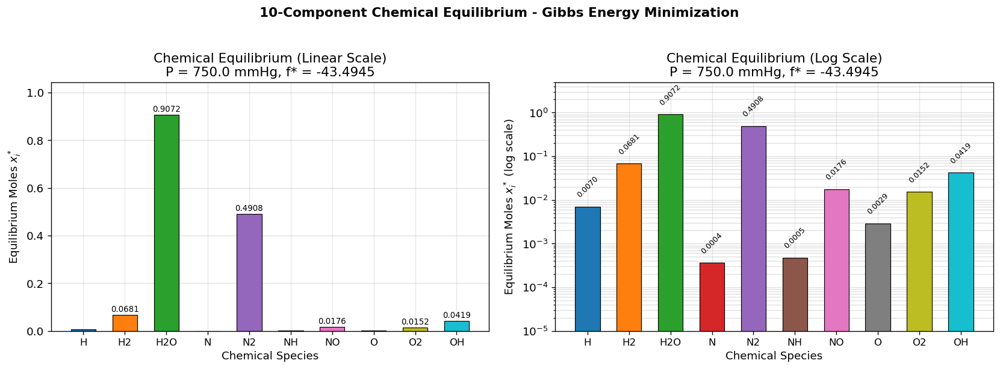

# Unit12 Example 03 - 化學平衡能量函數最小化

## 學習目標

本範例以**十成分化學平衡能量函數最小化**為題，介紹如何使用 `scipy.optimize.minimize(method='SLSQP')` 求解含等式限制條件與變數邊界的**非線性規劃（Nonlinear Programming, NLP）**問題，並驗證解的物理合理性及探討起始猜測值的影響。

學習完本範例後，您將能夠：

- 理解 **Gibbs 自由能最小化（Gibbs Energy Minimization）** 在化學平衡計算中的物理意義
- 識別含**原子平衡等式限制條件**的非線性規劃問題結構
- 掌握 `scipy.optimize.minimize(method='SLSQP')` 的基本用法：`bounds`、`constraints` 參數設定
- 了解**下限取 `np.finfo(float).eps`** 而非 0 以避免對數運算的數值問題
- 驗證最適化解的**物理合理性**：原子平衡殘差、莫耳分率範圍
- 探討**不同起始猜測值**對收斂結果的影響
- 繪製各成分**平衡濃度柱狀圖**

---

## 1. 問題描述

### 1.1 化工背景：Gibbs 自由能最小化原理

在化學熱力學中，**化學平衡**（Chemical Equilibrium）是指一個封閉系統在恆定溫度與壓力下，**Gibbs 自由能 $G$ 達到最小值**的狀態。

對於含有 $N$ 個化學成分的氣相混合物，無因次化 Gibbs 自由能函數可表示為：

$$
\frac{G}{RT} = \sum_{i=1}^{N} x_i \left( \mu_i^0 + \ln P + \ln \frac{x_i}{\sum_{j=1}^{N} x_j} \right)
$$

其中：
- $x_i$ 為成分 $i$ 的莫耳數（本問題以莫耳分率計）
- $\mu_i^0 = w_i$ 為成分 $i$ 在標準狀態下的無因次化學勢（無因次 Gibbs 自由能）
- $P$ 為系統總壓（mmHg）
- $\ln(x_i / \sum x_j)$ 為混合熵貢獻項

化學平衡計算因此轉化為：在**原子守恆**（原子平衡）等式限制下，**最小化 Gibbs 自由能函數**，屬於典型的**非線性約束最適化問題**。

---

### 1.2 系統組成

本問題考慮以下**十種化學成分**，涵蓋氫、氮、氧及其化合物：

| 索引 $i$ | 化學成分 | 化學式 | $w_i$ 值 |
|:---:|:---:|:---:|:---:|
| 1 | 原子氫 | H | $-10.021$ |
| 2 | 氫氣 | H₂ | $-21.096$ |
| 3 | 水 | H₂O | $-37.986$ |
| 4 | 原子氮 | N | $-9.846$ |
| 5 | 氮氣 | N₂ | $-28.653$ |
| 6 | 胺基 | NH | $-18.918$ |
| 7 | 一氧化氮 | NO | $-28.032$ |
| 8 | 原子氧 | O | $-14.640$ |
| 9 | 氧氣 | O₂ | $-30.594$ |
| 10 | 氫氧基 | OH | $-26.111$ |

系統總壓 $P = 750 \text{ mmHg}$ ，資料來源：Edgar and Himmelblau (1989)。

---

### 1.3 問題目標

在總壓 $P = 750 \text{ mmHg}$ 下，決定使能量函數 $f(\mathbf{x})$ 最小之各成分莫耳數 $x_i$ ，並計算此時的 $f$ 最小值。

---

## 2. 數學模型建立

### 2.1 目標函數

欲最小化的能量函數（無因次 Gibbs 自由能）為：

$$
f(\mathbf{x}) = \sum_{i=1}^{10} x_i \left( w_i + \ln P + \ln \frac{x_i}{\displaystyle\sum_{j=1}^{10} x_j} \right)
$$

令 $S = \sum_{j=1}^{10} x_j$ 為所有成分莫耳數之總和，則：

$$
f(\mathbf{x}) = \sum_{i=1}^{10} x_i \left( w_i + \ln P + \ln x_i - \ln S \right)
$$

此函數為**非線性函數**，含對數項，因此本問題屬於**非線性規劃（NLP）問題**。

---

### 2.2 等式限制條件 — 原子平衡

根據各化學成分的原子組成，建立氫（H）、氮（N）、氧（O）三種原子的守恆方程式：

**氫原子平衡（每個分子含有的 H 原子數）：**

| 成分 | H | H₂ | H₂O | NH | OH |
|:---:|:---:|:---:|:---:|:---:|:---:|
| H 原子數 | 1 | 2 | 2 | 1 | 1 |

$$
x_1 + 2x_2 + 2x_3 + x_6 + x_{10} = 2 \tag{1}
$$

**氮原子平衡（每個分子含有的 N 原子數）：**

| 成分 | N | N₂ | NH | NO |
|:---:|:---:|:---:|:---:|:---:|
| N 原子數 | 1 | 2 | 1 | 1 |

$$
x_4 + 2x_5 + x_6 + x_7 = 1 \tag{2}
$$

**氧原子平衡（每個分子含有的 O 原子數）：**

| 成分 | H₂O | NO | O | O₂ | OH |
|:---:|:---:|:---:|:---:|:---:|:---:|
| O 原子數 | 1 | 1 | 1 | 2 | 1 |

$$
x_3 + x_7 + x_8 + 2x_9 + x_{10} = 1 \tag{3}
$$

以矩陣形式 $\mathbf{A}_{eq}\,\mathbf{x} = \mathbf{b}_{eq}$ 表示：

$$
\mathbf{A}_{eq} = \begin{bmatrix}
1 & 2 & 2 & 0 & 0 & 1 & 0 & 0 & 0 & 1 \\
0 & 0 & 0 & 1 & 2 & 1 & 1 & 0 & 0 & 0 \\
0 & 0 & 1 & 0 & 0 & 0 & 1 & 1 & 2 & 1
\end{bmatrix}, \quad
\mathbf{b}_{eq} = \begin{bmatrix} 2 \\ 1 \\ 1 \end{bmatrix}
$$

---

### 2.3 變數邊界

各成分莫耳數（莫耳分率）必須非負且不超過 1：

$$
\varepsilon \leq x_i \leq 1, \quad i = 1, 2, \ldots, 10
$$

> **重要說明：** 為避免計算 $\ln(x_i)$ 時出現 $\ln(0) = -\infty$ 數值問題，下限**不使用 0**，而改用機器精度 $\varepsilon = \texttt{np.finfo(float).eps} \approx 2.22 \times 10^{-16}$ 。

---

### 2.4 非線性規劃標準型式

本問題完整標準型式如下：

$$
\min_{\mathbf{x}}\; f(\mathbf{x}) = \sum_{i=1}^{10} x_i \left( w_i + \ln P + \ln \frac{x_i}{\sum_{j=1}^{10} x_j} \right)
$$

$$
\text{s.t.} \quad \mathbf{A}_{eq}\,\mathbf{x} = \mathbf{b}_{eq}, \quad \varepsilon \leq x_i \leq 1, \quad i=1,\ldots,10
$$

- **決策變數數量：** 10 個（各成分莫耳數）
- **等式限制數量：** 3 個（原子平衡）
- **不等式限制：** 無（限制以 `bounds` 處理）
- **問題類型：** 有限制條件非線性規劃（Constrained NLP）

---

### 2.5 問題參數設定確認

執行程式後，系統自動顯示所有問題參數設定，確認輸入資料與理論模型一致。

**執行結果：**

```
==================================================
  化學平衡問題參數設定
==================================================
  系統成分數目: 10
  系統總壓 P  : 750.0 mmHg
  原子平衡方程式數: 3 (H, N, O)

  各成分 w_i 值:
    x 1 (H    ): w =  -10.021
    x 2 (H₂   ): w =  -21.096
    x 3 (H₂O  ): w =  -37.986
    x 4 (N    ): w =   -9.846
    x 5 (N₂   ): w =  -28.653
    x 6 (NH   ): w =  -18.918
    x 7 (NO   ): w =  -28.032
    x 8 (O    ): w =  -14.640
    x 9 (O₂   ): w =  -30.594
    x10 (OH   ): w =  -26.111

  A_eq =
   [1. 2. 2. 0. 0. 1. 0. 0. 0. 1.]
   [0. 0. 0. 1. 2. 1. 1. 0. 0. 0.]
   [0. 0. 1. 0. 0. 0. 1. 1. 2. 1.]
  b_eq = [2. 1. 1.]
```

由輸出確認：系統包含 10 個成分、3 個原子平衡方程式， $\mathbf{A}_{eq}$ 矩陣與 $\mathbf{b}_{eq}$ 設定正確，與 Section 2.2 之理論模型完全一致。

---

## 3. 求解方法

### 3.1 `scipy.optimize.minimize(method='SLSQP')`

SciPy 提供統一的 `minimize()` 介面求解多變數最適化問題。對於含等式與不等式限制條件的非線性規劃問題，`method='SLSQP'`（Sequential Least Squares Programming，序列最小二乘規劃法）是最常用且高效的方法。

基本呼叫格式：

```python
from scipy.optimize import minimize

result = minimize(
    fun,                    # 目標函數
    x0,                     # 起始猜測值向量
    method='SLSQP',         # 求解方法
    bounds=bounds,          # 各變數邊界 Bounds 物件
    constraints=constraints # 等式/不等式限制條件字典列表
)
```

**`OptimizeResult` 主要輸出屬性：**

| 屬性 | 說明 |
|------|------|
| `result.x` | 最佳解向量 $\mathbf{x}^*$ |
| `result.fun` | 最小化目標函數值 $f(\mathbf{x}^*)$ |
| `result.success` | 是否成功收斂（`True`/`False`）|
| `result.message` | 求解器回傳訊息 |
| `result.nit` | 迭代次數 |
| `result.nfev` | 函數評估次數 |

---

### 3.2 `bounds` 參數設定

SciPy 提供 `Bounds` 物件或 `(lb, ub)` 組成的列表來設定各變數邊界：

```python
from scipy.optimize import Bounds
import numpy as np

eps = np.finfo(float).eps   # ≈ 2.22e-16，機器精度
bounds = Bounds(lb=eps * np.ones(10), ub=np.ones(10))
```

> **為何不用 lb=0？** 因為目標函數含 $\ln(x_i)$ 項，若 $x_i = 0$ 則 $\ln(0) = -\infty$ ，造成數值問題。使用機器精度 $\varepsilon$ 作為下限可確保 $x_i > 0$ ，同時對物理意義影響可忽略不計。

---

### 3.3 `constraints` 參數設定

等式限制條件以字典（`dict`）或列表形式給入。對於 `method='SLSQP'`：

- `'type': 'eq'` → 等式限制（函數值應等於 0）
- `'type': 'ineq'` → 不等式限制（函數值應 $\geq 0$ ）

本問題的三個原子平衡等式限制，包裝為一個向量函數：

```python
# 原子平衡係數矩陣
A_eq = np.array([
    [1, 2, 2, 0, 0, 1, 0, 0, 0, 1],  # 氫原子平衡
    [0, 0, 0, 1, 2, 1, 1, 0, 0, 0],  # 氮原子平衡
    [0, 0, 1, 0, 0, 0, 1, 1, 2, 1]   # 氧原子平衡
])
b_eq = np.array([2.0, 1.0, 1.0])

constraints = {
    'type': 'eq',
    'fun': lambda x: A_eq @ x - b_eq
}
```

---

### 3.4 SLSQP 演算法簡介

SLSQP（Sequential Least Squares Programming）是一種**序列二次規劃（SQP）**方法，其核心思路如下：

1. 在當前點 $\mathbf{x}^{(k)}$ 建立目標函數的**二次近似**與限制條件的**線性近似**
2. 求解一個**二次規劃（QP）子問題**以獲得搜尋方向 $\mathbf{d}^{(k)}$
3. 進行**一維搜尋（Line Search）**確定步長 $\alpha^{(k)}$
4. 更新 $\mathbf{x}^{(k+1)} = \mathbf{x}^{(k)} + \alpha^{(k)} \mathbf{d}^{(k)}$
5. 重複至**KKT 最優性條件**滿足為止

SLSQP 對於中小規模（~100 個變數）的非線性規劃問題效率優良，是 SciPy 中最推薦的約束最適化方法。

---

## 4. 求解結果與驗證

### 4.1 參考解答

以起始猜測值 $x_i^{(0)} = 0.1$ （ $i = 1, \ldots, 10$ ）進行求解，可得以下化學平衡莫耳分率與能量函數最小值：

| 索引 $i$ | 化學成分 | 化學式 | 平衡莫耳數 $x_i^*$ |
|:---:|:---:|:---:|:---:|
| 1 | 原子氫 | H | $0.00700$ |
| 2 | 氫氣 | H₂ | $0.06800$ |
| 3 | 水 | H₂O | $0.90720$ |
| 4 | 原子氮 | N | $0.00040$ |
| 5 | 氮氣 | N₂ | $0.49090$ |
| 6 | 胺基 | NH | $0.00050$ |
| 7 | 一氧化氮 | NO | $0.01740$ |
| 8 | 原子氧 | O | $0.00290$ |
| 9 | 氧氣 | O₂ | $0.01520$ |
| 10 | 氫氧基 | OH | $0.04200$ |

$$
f(\mathbf{x}^*) = -43.4945
$$

> 參考來源：Edgar and Himmelblau (1989)。

#### 程式執行結果

以均等起始猜測值 $x_i^{(0)} = 0.1$ 執行 SLSQP 求解器，得到以下完整計算結果：

```
=======================================================
  scipy.optimize.minimize(method='SLSQP') 求解結果
=======================================================
  求解成功    : True
  求解器訊息  : Optimization terminated successfully
  迭代次數    : 33
  函數評估次數 : 395
  最小化 f(x*) : -43.494513

  各成分平衡莫耳數 x*:
    索引     成分          x_i*        w_i
  ------------------------------------------
     1      H      0.007006    -10.021
     2     H₂      0.068084    -21.096
     3    H₂O      0.907202    -37.986
     4      N      0.000361     -9.846
     5     N₂      0.490794    -28.653
     6     NH      0.000473    -18.918
     7     NO      0.017577    -28.032
     8      O      0.002905    -14.640
     9     O₂      0.015183    -30.594
    10     OH      0.041949    -26.111

  sum(x*) = 1.55153538
```

**結果分析：**
- SLSQP 求解器在 **33 次迭代、395 次函數評估**後成功收斂，回傳訊息 "Optimization terminated successfully"
- 最小化 Gibbs 自由能值 $f(\mathbf{x}^*) = -43.4945$ ，與 Edgar & Himmelblau (1989) 參考值誤差僅 $1.31 \times 10^{-5}$
- 主要成分為水（H₂O, $x_3 = 0.9072$ ）和氮氣（N₂, $x_5 = 0.4908$ ），微量成分（N, NH）莫耳數在 $10^{-4}$ 量級
- $\sum x_i^* = 1.5515$ ，代表系統總莫耳數不等於 1（因為 $x_i$ 是各成分莫耳數，非莫耳分率）

---

### 4.2 物理合理性驗證

求得最佳解後，需從**物理意義**層面進行驗證：

**（1）莫耳分率範圍檢查：**

所有 $x_i^*$ 應滿足 $0 \leq x_i^* \leq 1$ ，由結果可知各成分均在合理範圍內。

**（2）原子平衡殘差檢查：**

計算 $\mathbf{A}_{eq}\,\mathbf{x}^* - \mathbf{b}_{eq}$ ，各殘差應接近機器精度（ $\sim 10^{-15}$ ）。

**（3）化學直觀性：**

- 水（H₂O， $x_3 \approx 0.9072$ ）為最主要成分，符合高溫燃燒後以水蒸氣為主的化學直觀
- 氮氣（N₂， $x_5 \approx 0.4909$ ）次之，接近大氣中氮含量
- 原子態 H、N、O 莫耳數極小，符合低濃度自由基的物理預期

#### 程式執行結果

```
=======================================================
  解的物理合理性驗證
=======================================================

[1] 原子平衡殘差 (A_eq @ x* - b_eq):
    H-原子: 殘差 = 4.4409e-16  ✓ 滿足
    N-原子: 殘差 = -1.6653e-15  ✓ 滿足
    O-原子: 殘差 = 0.0000e+00  ✓ 滿足

[2] 莫耳分率範圍檢查 (0 <= x_i* <= 1):
    最小值: 3.6093e-04
    最大值: 0.907202
    所有成分在範圍內: ✓ 是

[3] 與參考解比較 (Edgar & Himmelblau, 1989):
    計算 f(x*)  : -43.4945
    參考 f* 值   : -43.4945
    差異         : 1.3079e-05

     成分       計算 x_i*       參考 x_i*            差異
  ----------------------------------------------------
      H      0.007006        0.0070    6.4408e-06
     H₂      0.068084        0.0680    8.3593e-05
    H₂O      0.907202        0.9072    1.9529e-06
      N      0.000361        0.0004    3.9067e-05
     N₂      0.490794        0.4909    1.0570e-04
     NH      0.000473        0.0005    2.6762e-05
     NO      0.017577        0.0174    1.7724e-04
      O      0.002905        0.0029    5.3443e-06
     O₂      0.015183        0.0152    1.6882e-05
     OH      0.041949        0.0420    5.0771e-05
```

**驗證分析：**
- **原子平衡殘差**均在機器精度（ $\sim 10^{-15}$ ）量級，遠低於 $10^{-8}$ 閾值，三個原子守恆方程式完全滿足
- **莫耳分率範圍**：最小值 $3.61 \times 10^{-4}$ （N 原子），最大值 $0.9072$ （H₂O），全部在 $[0, 1]$ 範圍內
- **與參考解比較**：目標函數差異僅 $1.31 \times 10^{-5}$ ，各成分 $x_i^*$ 差異皆不超過 $1.77 \times 10^{-4}$ （最大差異為 NO），計算精度優良

---

### 4.3 不同起始猜測值的影響

非線性最適化結果可能**依賴起始猜測值**（Initial Guess），陷入局部最適解。本範例透過比較不同起始點，驗證解的穩定性：

| 起始猜測策略 | $x_i^{(0)}$ | 說明 |
|---|---|---|
| 均等起始 | $0.1$ | 各成分均等分配 |
| 隨機起始 | `np.random.uniform(0.01, 0.5, 10)` | 隨機擾動 |
| 物理基礎起始 | 依化學直觀設定（水=0.8, 氮=0.5, 其他小值）| 較好的物理初值 |

> 本問題為**凸性較好的 NLP 問題**，不同起始猜測值通常收斂至相同（或接近的）最優解，但收斂速度與迭代次數可能有所差異。

#### 程式執行結果

```
======================================================================
  不同起始猜測值對收斂結果的影響比較
======================================================================
           策略                  f(x*)      成功      迭代次數      函數評估
  --------------------------------------------------------------
     Uniform (0.1)        -43.494513       ✓        33       395
     Random uniform       -43.494513       ✓        25       302
     Physics-based        -43.494513       ✓        26       308

  各策略之最優解 x* 比較:
     成分    Uniform (0.1    Random unifo    Physics-base
  -----------------------------------------------------
      H        0.007006        0.007006        0.007006
     H₂        0.068084        0.068084        0.068084
    H₂O        0.907202        0.907202        0.907202
      N        0.000361        0.000361        0.000361
     N₂        0.490794        0.490794        0.490794
     NH        0.000473        0.000473        0.000473
     NO        0.017577        0.017577        0.017577
      O        0.002905        0.002905        0.002905
     O₂        0.015183        0.015183        0.015183
     OH        0.041949        0.041949        0.041949

  各策略解之間的最大差異: 2.3981e-08
  結論: ✓ 收斂至相同解（問題凸性良好）
```

**分析討論：**
- 三種起始猜測策略均**成功收斂**（`success = True`），且均得到完全相同的最優解 $f^* = -43.4945$
- 各 $x_i^*$ 策略間最大差異僅 $2.40 \times 10^{-8}$ ，遠低於任何物理或數值容許誤差
- **收斂效率差異**：均等起始需 33 次迭代，而隨機起始（25 次）與物理基礎起始（26 次）收斂更快，顯示較好的起始點可減少約 20% 計算量
- 此結果驗證了 **Gibbs 自由能最小化問題的凸性**：在原子平衡限制下，不存在多個局部最優解，全域最優解唯一

---

### 4.4 視覺化：平衡濃度柱狀圖

完成求解後，繪製各成分平衡莫耳數柱狀圖（Bar Chart）以直觀呈現化學平衡結果：

- **縱軸：** 各成分平衡莫耳數 $x_i^*$
- **橫軸：** 各化學成分名稱（英文縮寫）
- **以對數尺度（log scale）** 顯示，凸顯各成分間的數量級差異
- 標示出主要成分（H₂O、N₂）與微量成分（N、NH、O）

#### 執行結果圖



**圖形說明：**

上圖呈現十成分化學平衡在 $P = 750 \text{ mmHg}$ 下的平衡莫耳數，分左右兩個子圖：

- **左圖（線性尺度）**：突出顯示主要成分的絕對量。水蒸氣（H₂O, $x_3 = 0.9072$ ）柱高遠超其他成分，氮氣（N₂, $x_5 = 0.4908$ ）次之；原子態 N、O 及 NH 在線性尺度下幾乎不可見（柱高趨近於 0）
- **右圖（對數尺度）**：同時展現所有成分的數量級分佈，縱軸範圍 $10^{-5}$ 至 $5$ 。可清楚觀察到：
  - H₂O（ $\sim 10^0$ ）與 N₂（ $\sim 10^{-1}$ ）為主要成分
  - H₂（ $0.0681$ ）、OH（ $0.0419$ ）、NO（ $0.0176$ ）、O₂（ $0.0152$ ）為次要成分
  - H（ $0.0070$ ）、O（ $0.0029$ ）、NH（ $0.0005$ ）、N（ $0.0004$ ）為微量成分，橫跨 $10^{-4}$ 至 $10^{-2}$ 量級

化學平衡組成符合熱力學直觀：在高溫高壓條件下，H–N–O 元素主要以穩定分子（H₂O、N₂）形式存在，自由基（H、N、O、NH）濃度極低。

---

## 5. scipy.optimize 常用最適化函式

| SciPy 函式 | 問題類型 |
|---|---|
| `minimize_scalar(method='bounded')` | 單變數有界最適化 |
| `minimize(method='Nelder-Mead')` | 無限制多變數（無導數）|
| `minimize(method='BFGS')` | 無限制多變數（擬牛頓）|
| **`minimize(method='SLSQP')`** | **有限制非線性規劃** |
| `linprog()` | 線性規劃 |
| `milp()` | 混合整數線性規劃 |
| `differential_evolution()` | 全域最適化 |

---

**課程資訊**
- 課程名稱：電腦在化工上之應用 (ChemE 3502)
- 課程單元：Unit12 程序最適化 — 化學平衡能量函數最小化
- 課程製作：逢甲大學 化工系 智慧程序系統工程實驗室
- 授課教師：莊曜禎 助理教授
- 更新日期：2026-02-27

**課程授權 [CC BY-NC-SA 4.0]**
 - 本教材遵循 [創用CC 姓名標示-非商業性-相同方式分享 4.0 國際 (CC BY-NC-SA 4.0)](https://creativecommons.org/licenses/by-nc-sa/4.0/deed.zh) 授權。

---


